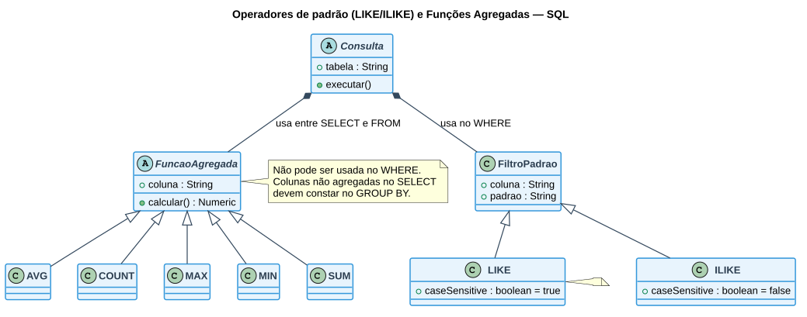

# Aula 05 — SQL: Operador LIKE/ILIKE e Funções Agregadas

> **Professor:** Guilherme de Morais
> **Disciplina:** Banco de Dados II (3º Semestre)
> **Tema:** Comparação de padrões de texto (`LIKE`/`ILIKE`) e funções agregadas (`AVG`, `COUNT`, `MAX`, `MIN`, `SUM`)

## Objetivo da aula

Aprender a filtrar registros por padrões parciais de texto com `LIKE`/`ILIKE` e a resumir conjuntos de dados numéricos com as funções agregadas. Ao final, o aluno deve saber montar consultas com curingas de texto e calcular médias, contagens, máximos, mínimos e somas sobre uma tabela.

## LIKE — comparação de strings por padrão

O operador `LIKE` compara uma coluna com uma sequência de caracteres, sendo usado após a cláusula `WHERE` como uma condição.

### Sintaxe básica

```sql
WHERE coluna LIKE 'StringASerComparada'
```

### Curingas do LIKE

Dentro das aspas simples, à frente do operador `LIKE`, podem ser usados dois curingas:

| Curinga | Significado |
| :--- | :--- |
| `%` | Qualquer sequência de **zero ou mais** caracteres |
| `_` | Qualquer **um único** caractere |

**Exemplo:** `nome LIKE 'A_%S'` — a string comparada deve começar com `A`, ter qualquer caractere (`_`) na segunda posição e terminar com `S`. Não importa o que vem entre a segunda letra e o `S` final (`%`).

### Exemplos práticos

```sql
-- Empregados cujo nome (pnome) começa com a letra A
SELECT * FROM empregado
WHERE pnome LIKE 'A%';

-- Nome e cargo dos empregados que possuem a letra 'a' em qualquer posição do nome
SELECT pnome, cargo FROM empregado
WHERE pnome LIKE '%a%';
```

### LIKE × ILIKE — sensibilidade a maiúsculas/minúsculas

O operador `LIKE` é *case sensitive*, ou seja, diferencia letras maiúsculas de minúsculas. Quando não se deseja essa distinção, utiliza-se o operador `ILIKE` (disponível no PostgreSQL):

```sql
-- LIKE diferencia 'Ana' de 'ana'
SELECT pnome, cargo FROM empregado WHERE pnome LIKE '%a%';

-- ILIKE ignora a diferença entre maiúsculas e minúsculas
SELECT pnome, cargo FROM empregado WHERE pnome ILIKE '%a%';
```

## Funções Agregadas

São funções que operam sobre um **conjunto** de registros de uma tabela e retornam um único valor resumo por grupo.

* São muito usadas em conjunto com o comando `GROUP BY`.
* **Não podem** ser utilizadas na cláusula `WHERE` (o filtro sobre um resultado agregado usa `HAVING`).
* Devem ser escritas entre o `SELECT` e o `FROM`.
* Em um `SELECT` que utiliza funções agregadas, todas as demais colunas projetadas devem constar na cláusula `GROUP BY`.

### As cinco funções agregadas

| Função | Finalidade |
| :--- | :--- |
| `AVG(coluna)` | Média de um determinado campo |
| `COUNT(*)` e `COUNT(coluna)` | Quantidade de registros da tabela, ou com base em uma coluna |
| `MAX(coluna)` | Valor máximo de uma coluna |
| `MIN(coluna)` | Valor mínimo de uma coluna |
| `SUM(coluna)` | Soma dos valores de uma coluna |

### Exemplos práticos

```sql
-- AVG: média dos salários da empresa
SELECT AVG(salario) FROM empregado;

-- COUNT: quantidade de gerentes na empresa
SELECT COUNT(*) AS "Quantidade de Gerente na Empresa"
FROM empregado
WHERE cargo = 'Gerente';

-- MAX e MIN: maior e menor salário da empresa
SELECT MAX(salario), MIN(salario) FROM empregado;

-- SUM: total gasto com salários na empresa
SELECT SUM(salario) AS "Soma salarial" FROM empregado;
```

## Diagrama — Operadores de padrão e Funções Agregadas



## Exercícios de fixação

Considerando a tabela `empregado (cpf, pnome, cargo, salario)`:

1. Liste os empregados cujo nome termina com a letra `o`.
2. Liste, ignorando maiúsculas/minúsculas, os empregados cujo cargo contém a palavra `analista`.
3. Calcule a média salarial dos empregados com cargo `'Analista'`.
4. Conte quantos empregados existem cadastrados no total.
5. Encontre o maior e o menor salário entre os empregados com cargo `'Gerente'`.
6. Some o total pago em salários apenas para empregados cujo nome começa com `'M'`.

<details>
<summary>Gabarito</summary>

```sql
-- 1.
SELECT * FROM empregado WHERE pnome LIKE '%o';

-- 2.
SELECT * FROM empregado WHERE cargo ILIKE '%analista%';

-- 3.
SELECT AVG(salario) FROM empregado WHERE cargo = 'Analista';

-- 4.
SELECT COUNT(*) FROM empregado;

-- 5.
SELECT MAX(salario), MIN(salario) FROM empregado WHERE cargo = 'Gerente';

-- 6.
SELECT SUM(salario) FROM empregado WHERE pnome LIKE 'M%';
```
</details>

## Material relacionado

- [Trabalho: Aula 05 — Exercícios de LIKE e Funções Agregadas (10 + 10 questões)](../../Trabalhos/AULA%2005%20–%20SQL%20-%20CONSULTAS/detalhes.md)
- [Aula 03/04 — INSERT, DELETE, UPDATE e SELECT básico](../aula%2003%20-%20insert%20delete%20e%20update%2C%20aula%2004%20consultado/detalhes.md)
- [Material para prova — Chave Estrangeira e Modificações de Tabela](../material%20para%20prova/detalhes.md) — recapitula funções agregadas com o exemplo `MAX(preco)`.
- Slide original da aula: `AULA 05 – SQL - CONSULTAS.pptx`
