# Aula 01 — Manipulação e Consulta de Dados em SQL

> **Professor:** Guilherme de Morais  
> **Disciplina:** Banco de Dados II (3º Semestre)  
> **Tema:** Manipulação de dados via DML (INSERT, UPDATE, DELETE) e consultas relacionais estruturadas com SELECT, ordenação, predicados relacionais e lógicos, expressões aritméticas, casamento de padrões e funções agregadas.

---

## Sumário

- [Objetivo da aula](#objetivo-da-aula)
- [Contexto e pré-requisitos](#contexto-e-pré-requisitos)
- [Manipulação de dados DML: inserção de registros com INSERT INTO (especificação de colunas versus valores posicionais)](#manipulação-de-dados-dml-inserção-de-registros-com-insert-into-especificação-de-colunas-versus-valores-posicionais)
- [Atualização de registros existentes com UPDATE e cláusula SET](#atualização-de-registros-existentes-com-update-e-cláusula-set)
- [Remoção de registros com DELETE FROM](#remoção-de-registros-com-delete-from)
- [Importância crítica e riscos da omissão da cláusula WHERE em comandos UPDATE e DELETE](#importância-crítica-e-riscos-da-omissão-da-cláusula-where-em-comandos-update-e-delete)
- [Estrutura básica do comando SELECT (projeção de colunas e uso do caractere coringa *)](#estrutura-básica-do-comando-select-projeção-de-colunas-e-uso-do-caractere-coringa-)
- [Ordenação de tuplas com a cláusula ORDER BY em um ou múltiplos atributos](#ordenação-de-tuplas-com-a-cláusula-order-by-em-um-ou-múltiplos-atributos)
- [Filtragem básica com a cláusula WHERE e operadores relacionais (=, <>, >, <, >=, <=)](#filtragem-básica-com-a-cláusula-where-e-operadores-relacionais----)
- [Combinação de predicados lógicos utilizando os operadores booleanos AND e OR](#combinação-de-predicados-lógicos-utilizando-os-operadores-booleanos-and-e-or)
- [Eliminação de linhas redundantes no conjunto de resultados com SELECT DISTINCT](#eliminação-de-linhas-redundantes-no-conjunto-de-resultados-com-select-distinct)
- [Expressões e operadores aritméticos (+, -, *, /) e uso de pseudônimos de coluna (AS)](#expressões-e-operadores-aritméticos-----e-uso-de-pseudônimos-de-coluna-as)
- [Seleção por intervalo fechado de valores com o operador BETWEEN](#seleção-por-intervalo-fechado-de-valores-com-o-operador-between)
- [Casamento de padrões em strings com LIKE, ILIKE e caracteres coringa (% e _)](#casamento-de-padrões-em-strings-com-like-ilike-e-caracteres-coringa--e-_)
- [Funções de agregação de dados: AVG, COUNT, MAX, MIN e SUM](#funções-de-agregação-de-dados-avg-count-max-min-e-sum)
- [Visão geral sobre restrições de uso de funções agregadas na cláusula WHERE e preparação para GROUP BY](#visão-geral-sobre-restrições-de-uso-de-funções-agregadas-na-cláusula-where-e-preparação-para-group-by)
- [Código da aula](#código-da-aula)
- [Exercícios](#exercícios)
- [Erros comuns e boas práticas](#erros-comuns-e-boas-práticas)
- [Links e materiais complementares](#links-e-materiais-complementares)
- [Mapa da aula](#mapa-da-aula)
- [Glossário](#glossário)
- [Pontos-chave para a prova](#pontos-chave-para-a-prova)
- [Perguntas e respostas (JSONL)](#perguntas-e-respostas-jsonl)
- [Checklist de revisão](#checklist-de-revisão)

---

## Objetivo da aula

Capacitar o estudante do curso de Sistemas de Informação a:
1. Compreender e aplicar os comandos fundamentais da Linguagem de Manipulação de Dados (DML): `INSERT`, `UPDATE` e `DELETE`.
2. Compreender a arquitetura de execução do comando `SELECT`, diferenciando a projeção de atributos da seleção/filtragem de tuplas.
3. Manipular consultas relacionais utilizando ordenação multi-atributo (`ORDER BY`), eliminação de duplicatas (`DISTINCT`) e transformações matemáticas de dados em tempo de execução via operadores aritméticos e pseudônimos (`AS`).
4. Construir predicados lógicos e relacionais complexos combinando operadores de comparação, operadores booleanos (`AND`, `OR`), intervalos (`BETWEEN`) e filtros baseados em casamento de padrões de strings (`LIKE`, `ILIKE`, `%`, `_`).
5. Sintetizar grandes volumes de dados através de funções de agregação (`AVG`, `COUNT`, `MAX`, `MIN`, `SUM`), compreendendo seu escopo e suas restrições perante as cláusulas `WHERE` e `GROUP BY`.

---

## Contexto e pré-requisitos

Esta aula fundamenta-se nos conceitos da álgebra relacional e na Linguagem de Definição de Dados (DDL), abordada previamente no curso. Para o pleno acompanhamento deste material, assume-se que o aluno compreende:
- O conceito formal de relação (tabela), tupla (registro ou linha) e atributo (coluna ou campo).
- Restrições de integridade estruturais: Chave Primária (`PRIMARY KEY`), Chave Estrangeira (`FOREIGN KEY`), restrições de nulidade (`NOT NULL`) e tipos de dados fundamentais (`INTEGER`, `VARCHAR`, `DATE`, `NUMERIC`).
- A distinção conceitual entre sublinguagens SQL:
  - **DDL (Data Definition Language):** Estruturação do esquema (`CREATE`, `ALTER`, `DROP`).
  - **DML (Data Manipulation Language):** Persistência e alteração de tuplas (`INSERT`, `UPDATE`, `DELETE`).
  - **DQL (Data Query Language):** Recuperação de dados relacionais (`SELECT`).

---

## Manipulação de dados DML: inserção de registros com INSERT INTO (especificação de colunas versus valores posicionais)

### Definição e Motivação
O comando `INSERT INTO` é a instrução DML encarregada de persistir novas tuplas em uma tabela existente. Na engenharia de software e na administração de bancos de dados, a confiabilidade da inserção de dados afeta diretamente a consistência das transações e a integridade referencial do sistema.

A linguagem SQL oferece duas abordagens sintáticas para a inserção via valores literais:
1. **Declaração explícita de colunas (Recomendada):** Mapeia nome a nome quais atributos receberão os valores fornecidos.
2. **Declaração posicional/implícita:** Omite os nomes das colunas e confia estritamente na ordem física de definição dos atributos na tabela.

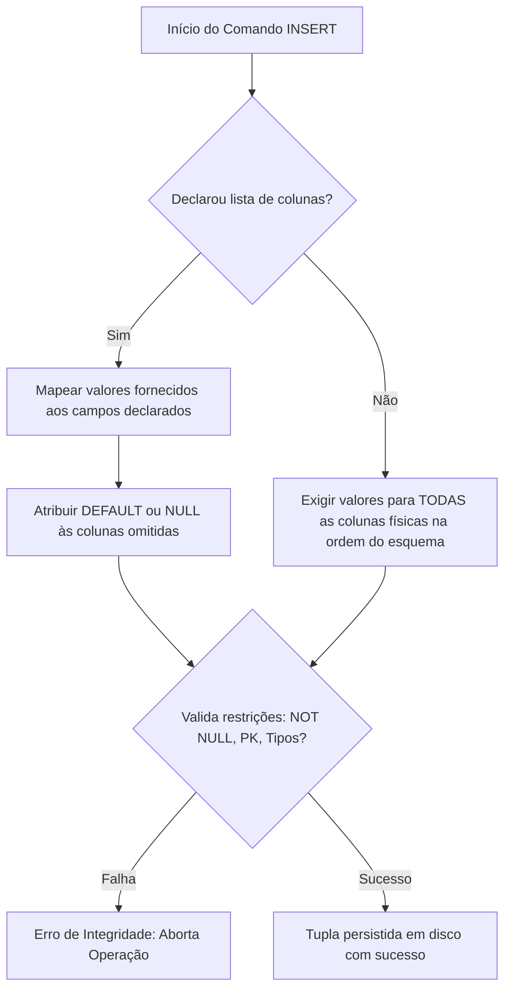

### Sintaxe e Formas de Uso
A estrutura formal é dividida em duas variantes:

```sql
-- Forma 1: Declaração explícita de colunas
INSERT INTO nome_tabela (coluna_1, coluna_2, ..., coluna_n) 
VALUES (valor_1, valor_2, ..., valor_n);

-- Forma 2: Declaração posicional (omitindo colunas)
INSERT INTO nome_tabela 
VALUES (valor_1, valor_2, ..., valor_total_da_tabela);
```

### Comparação entre abordagens

| Critério | Inserção com Colunas Explícitas | Inserção Posicional (Omitindo Colunas) |
| :--- | :--- | :--- |
| **Resiliência a alterações de DDL** | Alta. A adição de novas colunas nulas ou com `DEFAULT` não quebra a instrução. | Nula. Qualquer alteração estrutural no esquema invalida o comando existente. |
| **Omissão de campos opcionais** | Suportada diretamente (campos omitidos assumem `DEFAULT` ou `NULL`). | Impossível. É obrigatório passar valores para todas as colunas. |
| **Legibilidade e Manutenibilidade** | Autoexplicativa. Facilita inspeção em logs e code review. | Baixa. Exige consulta constante ao dicionário de dados para entender posições. |
| **Risco de inversão de tipos compatíveis** | Baixo. | Elevado (exemplo: inverter duas colunas `VARCHAR` vizinhas sem erro de compilação). |

### Exemplos Práticos Comentados
Considere a tabela `funcionario`:

```sql
-- Definição da tabela base
CREATE TABLE funcionario (
    cpf INTEGER NOT NULL,
    nome VARCHAR(50),
    funcao VARCHAR(20),
    data_nasc DATE,
    CONSTRAINT pk_fun_cpf PRIMARY KEY (cpf)
);

-- Exemplo 1: Inserção explícita completa
INSERT INTO funcionario (cpf, nome, funcao, data_nasc) 
VALUES (2, 'SEBASTIAO', 'PROFESSOR', '2020-03-03');

-- Exemplo 2: Inserção posicional (omite colunas; exige todos os 4 campos na ordem exata)
INSERT INTO funcionario 
VALUES (3, 'PEDRO', 'SECRETARIO', '1963-08-20');

-- Exemplo 3: Inserção explícita com omissão de coluna anulável ('funcao' assumirá NULL)
INSERT INTO funcionario (cpf, nome, data_nasc) 
VALUES (4, 'RAUL', '2020-03-08');

-- Exemplo 4: Inserção passando string vazia em vez de valor ausente
INSERT INTO funcionario (cpf, nome, funcao, data_nasc) 
VALUES (5, 'MARIA', '', '2020-03-03');
```

### Armadilhas e Nuances de Engenharia
- **String Vazia versus `NULL`:** No Exemplo 4, passar `''` grava uma cadeia de comprimento zero, e não um valor nulo (`NULL`). Dependendo do SGBD (como Oracle vs. PostgreSQL), o tratamento varia, mas no padrão ANSI `''` difere semanticamente de "desconhecido/inexistente" (`NULL`).
- **Formato de Datas:** O formato `'DD/MM/YYYY'` é dependente da configuração local do servidor (`datestyle`). Em ambientes de produção, recomenda-se estritamente o formato padrão ISO 8601: `'YYYY-MM-DD'`.

---

## Atualização de registros existentes com UPDATE e cláusula SET

### Definição e Motivação
O comando `UPDATE` altera o estado dos dados armazenados em colunas de tuplas já existentes. Ao contrário do `INSERT`, que adiciona novas linhas ao espaço transacional, o `UPDATE` sobrescreve valores em atributos específicos sem alterar a identidade da tupla (mantendo a Chave Primária, exceto se expressamente alterada).

### Mecanismo de Funcionamento
A cláusula `SET` define quais atributos serão modificados e seus respectivos novos valores ou expressões computadas. A cláusula `WHERE` atua como um predicado de filtragem: apenas as tuplas para as quais a condição resulta em `TRUE` são modificadas.

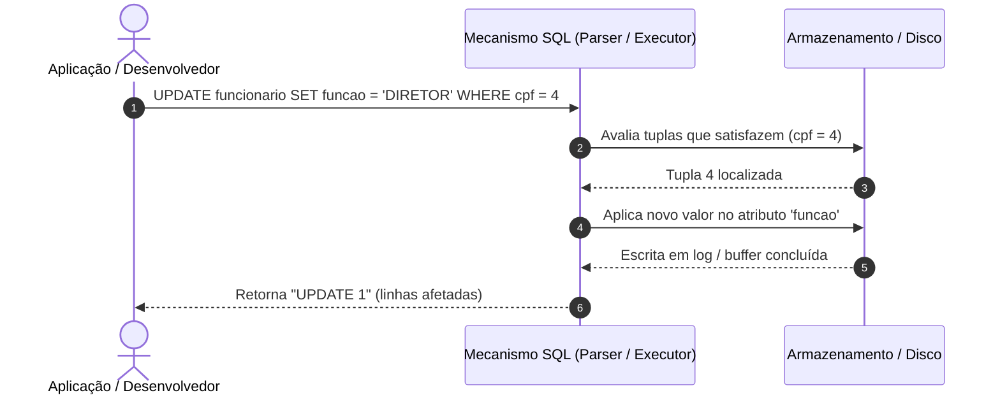

### Sintaxe Formal
```sql
UPDATE nome_tabela 
SET campo_1 = novo_valor_1,
    campo_2 = novo_valor_2
WHERE condicao;
```

### Exemplo Prático Comentado
```sql
-- Atualiza a função do funcionário cujo CPF é 4 para 'DIRETOR'
UPDATE funcionario 
SET funcao = 'DIRETOR' 
WHERE cpf = 4;
```

### Contraexemplo e Armadilha
```sql
-- CONTRAEXEMPLO GRAVE: Omissão acidental da cláusula WHERE
UPDATE funcionario 
SET funcao = 'DIRETOR';
-- Efeito colateral: Todos os registros da tabela passam a ser 'DIRETOR'.
```

---

## Remoção de registros com DELETE FROM

### Definição e Motivação
O comando `DELETE FROM` remove tuplas inteiras da relação especificada com base no predicado fornecido na cláusula `WHERE`. Trata-se de uma operação irreversível no nível relacional imediato (a menos que delimitada em bloco transacional ativo não comitado via `ROLLBACK`).

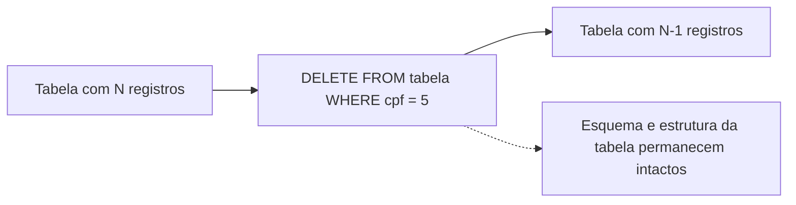

### Sintaxe Formal
```sql
DELETE FROM nome_tabela 
WHERE condicao;
```

### Comparação entre Comandos de Exclusão

| Comando | Tipo | Requer WHERE | Efeito sobre o Esquema | Gera Logs Transacionais |
| :--- | :--- | :--- | :--- | :--- |
| `DELETE FROM` | DML | Opcional (mas crítico) | Nenhum. A tabela e seus metadados continuam existindo. | Registra tupla por tupla (permite `ROLLBACK`). |
| `TRUNCATE TABLE` | DDL / DML Rápido | Não suporta | Nenhum. Remove todas as tuplas por desalocação de páginas. | Mínimo; reinicia sequências dependendo do SGBD. |
| `DROP TABLE` | DDL | Não aplicável | Total. Remove a tabela, dados, índices, gatilhos e metadados. | Registra a destruição do objeto do catálogo. |

### Exemplo Prático Comentado
```sql
-- Remove exclusivamente a tupla referente à funcionária Maria (CPF = 5)
DELETE FROM funcionario 
WHERE cpf = 5;
```

---

## Importância crítica e riscos da omissão da cláusula WHERE em comandos UPDATE e DELETE

### Riscos Sistêmicos em Ambiente de Produção
Em SQL, a ausência de uma cláusula `WHERE` em instruções `UPDATE` e `DELETE` **não gera erro de sintaxe**. O compilador SQL interpreta a omissão como uma instrução explícita para processar o predicado universal (equivalente a `WHERE TRUE`), aplicando a operação a **todas** as tuplas da relação.

As consequências práticas de um comando desse tipo em produção incluem:
1. **Perda e corrupção massiva de dados:** Sobrescrita irrecuperável de chaves de auditoria ou esvaziamento completo de entidades de clientes e pagamentos.
2. **Locking e exaustão de recursos:** Bloqueio de tabela inteira (*table locks*) e saturação extrema do arquivo de log transacional (*WAL/Redo Log*), travando requisições concorrentes.
3. **Parada de serviço (*downtime*):** Necessidade de restaurar backups (*Point-In-Time Recovery - PITR*), acarretando custos financeiros e quebra de SLAs.

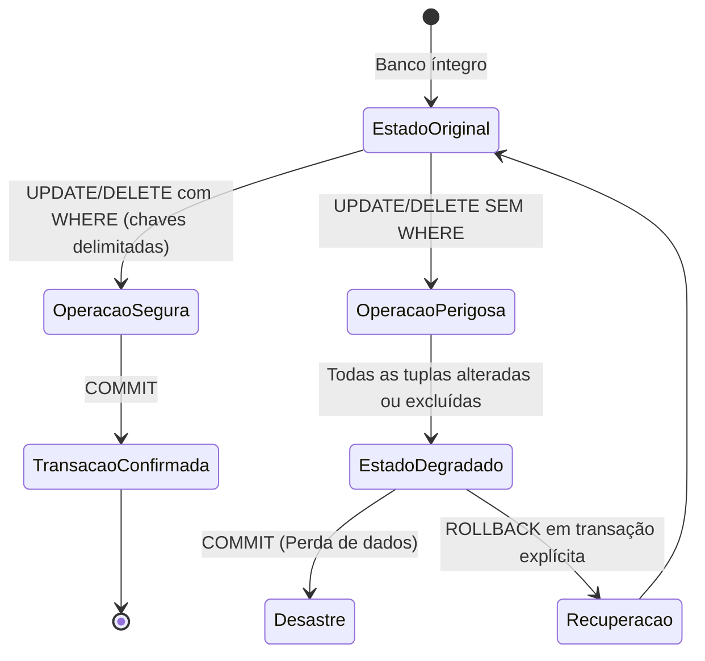

### Práticas Defensivas na Engenharia de Software
Para blindar o banco de dados contra operações acidentais, aplicam-se três camadas de segurança:

```sql
-- 1. Uso obrigatório de transações manuais para operações de manutenção via console
BEGIN; -- Inicia o contexto transacional

-- Realiza a atualização delimitada
UPDATE funcionario 
SET funcao = 'COORDENADOR' 
WHERE cpf = 2;

-- Inspeciona o resultado antes de consolidar
SELECT * FROM funcionario WHERE cpf = 2;

-- Se o resultado for o esperado:
COMMIT;
-- Em caso de anomalia ou contagem divergente de linhas:
-- ROLLBACK;
```

```sql
-- 2. Transformação de verificação: converter a condição em um SELECT prévio
-- Antes de rodar: DELETE FROM pedido WHERE status = 'CANCELADO' AND ano < 2022;
-- Executa-se primeiro:
SELECT count(*) FROM pedido WHERE status = 'CANCELADO' AND ano < 2022;
-- Verifica-se a quantidade exata de tuplas afetadas antes do DELETE.
```

---

## Estrutura básica do comando SELECT (projeção de colunas e uso do caractere coringa *)

### Definição e Motivação
O comando `SELECT` constitui o núcleo da Data Query Language (DQL). Sua finalidade formal na álgebra relacional é realizar a **Projeção** ($\pi$) — selecionando quais atributos verticais devem compor o conjunto resultante — e a **Seleção** ($\sigma$) — determinando quais linhas horizontais atendem ao critério de busca.

> **Importante:** Consultas com o comando `SELECT` são operações estritamente de leitura idempotentes. Elas **nunca** modificam, inserem ou removem dados no banco.

### Ordem Sintática versus Ordem Conceitual de Execução
Embora o desenvolvedor escreva o `SELECT` iniciando pela projeção de colunas, o motor do SGBD processa a consulta em uma ordem lógica completamente distinta:

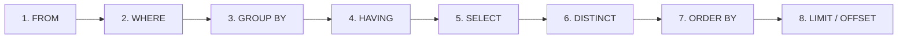

### Projeção com Caractere Coringa (`*`) versus Colunas Específicas

| Característica | Projeção com Asterisco (`SELECT *`) | Projeção Específica (`SELECT col1, col2`) |
| :--- | :--- | :--- |
| **Consumo de Memória e Rede** | Alto (transporta atributos não utilizados, incluindo campos `TEXT` pesados). | Otimizado (transporta somente os bytes estritamente necessários). |
| **Uso de Índices (*Covering Index*)** | Inviabiliza otimizações de leitura que poderiam ser resolvidas direto no índice. | Permite que o otimizador resolva a consulta sem tocar na tabela base. |
| **Estabilidade de Software** | Baixa. Mudanças na ordem ou adição de novas colunas no schema afetam o software consumidor. | Alta. O contrato de retorno da query permanece imutável. |
| **Caso de uso aceitável** | Apenas exploração ad-hoc e depuração pontual no console administrativo. | Código de produção, microsserviços, APIs e relatórios oficiais. |

### Exemplos Práticos Comentados
Considere a tabela `clientes`:

```sql
-- Consulta ad-hoc projetando todas as colunas
SELECT * 
FROM clientes;

-- Consulta profissional de produção projetando colunas estritamente necessárias
SELECT codcliente, nomecliente, endcliente 
FROM clientes;
```

---

## Ordenação de tuplas com a cláusula ORDER BY em um ou múltiplos atributos

### Fundamentação Teórica
Por definição formal da teoria relacional de Edgar F. Codd, uma relação é um **conjunto não ordenado de tuplas**. Isso significa que, sem a cláusula explícita `ORDER BY`, o SGBD é livre para retornar as linhas em qualquer ordem física disponível nas páginas de disco (geralmente a ordem natural de gravação ou ordem imposta pelo plano de varredura). A única maneira de garantir determinismo na apresentação dos dados é através do `ORDER BY`.

### Sintaxe e Sentido de Ordenação
- `ASC` (Ascendente): Do menor para o maior (padrão quando omitido). Números: 0 $\to$ 9; Textos: A $\to$ Z; Datas: Mais antigas $\to$ Mais recentes.
- `DESC` (Descendente): Do maior para o menor. Números: 9 $\to$ 0; Textos: Z $\to$ A; Datas: Mais recentes $\to$ Mais antigas.

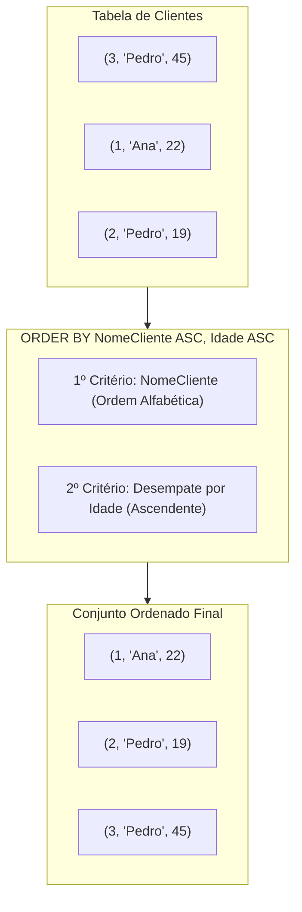

### Exemplos Práticos Comentados
```sql
-- Exemplo 1: Ordenação simples por atributo único textual
SELECT * 
FROM clientes 
ORDER BY nomecliente ASC;

-- Exemplo 2: Ordenação composta (múltiplos atributos com prioridade hierárquica)
-- O desempate entre clientes de mesmo nome é resolvido pelo valor da idade
SELECT codcliente, nomecliente, idade 
FROM clientes 
ORDER BY nomecliente ASC, idade ASC;
```

### Armadilhas e Nuances
- **Tratamento de `NULL`:** No padrão SQL ANSI, o tratamento da posição de valores nulos varia. No PostgreSQL, em ordem `ASC`, nulos vão para o final por padrão (`NULLS LAST`), enquanto em outros sistemas podem aparecer no início. É possível explicitar usando: `ORDER BY idade ASC NULLS FIRST`.

---

## Filtragem básica com a cláusula WHERE e operadores relacionais (=, <>, >, <, >=, <=)

### Definição e Mecanismo de Filtragem
A cláusula `WHERE` especifica a condição de seleção que cada tupla da tabela deve satisfazer individualmente para ser incluída no conjunto de resultados. O predicado é avaliado para cada linha em uma lógica booleana trivalente: `TRUE`, `FALSE` ou `UNKNOWN` (indeterminado, advindo de avaliações envolvendo `NULL`). Apenas tuplas cuja condição avalia estritamente como `TRUE` são retornadas.

### Operadores Relacionais Disponíveis

| Operador | Significado | Exemplo de Expressão | Comportamento |
| :---: | :--- | :--- | :--- |
| `=` | Igual a | `estado = 'SP'` | Retorna tuplas onde o conteúdo do campo é idêntico ao literal. |
| `<>` ou `!=` | Diferente de | `estado <> 'SP'` | Retorna tuplas cujo valor difere do literal fornecido. |
| `>` | Maior que | `val_unit > 1.00` | Exclui o limite inferior; aceita apenas valores estritamente maiores. |
| `<` | Menor que | `val_unit < 50.00` | Exclui o limite superior; aceita apenas valores estritamente menores. |
| `>=` | Maior ou igual a | `val_unit >= 1.00` | Inclui o limite inferior na seleção. |
| `<=` | Menor ou igual a | `val_unit <= 100.00` | Inclui o limite superior na seleção. |

### Exemplos Práticos Comentados
```sql
-- Filtrando clientes por correspondência exata de estado
SELECT codcliente, nomecliente, endcliente 
FROM clientes 
WHERE estado = 'SP';

-- Filtrando tuplas com operador de desigualdade e projeção filtrada e ordenada
SELECT codcliente, nomecliente, endereco_cliente 
FROM clientes 
WHERE estado = 'SP' 
ORDER BY nomecliente;

-- Filtrando produtos cujo valor unitário é maior ou igual a 1 real
SELECT descricao, val_unit 
FROM produto 
WHERE val_unit >= 1.00;

-- Filtro temporal sobre data de nascimento de alunos
SELECT nome_aluno, data_nasc_aluno 
FROM alu_aluno 
WHERE data_nasc_aluno >= '1980-01-30';
```

---

## Combinação de predicados lógicos utilizando os operadores booleanos AND e OR

### Teoria Booleana Aplicada à Álgebra Relacional
Quando uma consulta exige múltiplos critérios de seleção, utilizam-se os operadores booleanos `AND` (conjunção lógica) e `OR` (disjunção lógica):
- **`AND`:** Avalia como `TRUE` se, e somente se, **todas** as subcondições associadas forem verdadeiras.
- **`OR`:** Avalia como `TRUE` se **pelo menos uma** das subcondições for verdadeira.

### Tabela-Verdade Trivalente SQL

| Expressão A | Expressão B | A AND B | A OR B | NOT A |
| :---: | :---: | :---: | :---: | :---: |
| TRUE | TRUE | TRUE | TRUE | FALSE |
| TRUE | FALSE | FALSE | TRUE | FALSE |
| FALSE | FALSE | FALSE | FALSE | TRUE |
| TRUE | UNKNOWN (NULL) | UNKNOWN | TRUE | UNKNOWN |
| FALSE | UNKNOWN (NULL) | FALSE | UNKNOWN | TRUE |
| UNKNOWN | UNKNOWN (NULL) | UNKNOWN | UNKNOWN | UNKNOWN |

### Precedência de Operadores e Parentização Defensiva
Na álgebra booleana e na especificação ANSI SQL, o operador `AND` possui **maior precedência de avaliação** do que o operador `OR`. Isso significa que, na ausência de parênteses, expressões contíguas a um `AND` são agrupadas antes de qualquer operação `OR`.

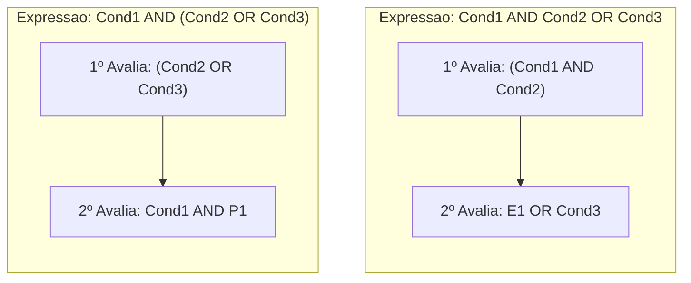

### Exemplos Práticos Comentados
```sql
-- Exemplo 1: Uso de AND para delimitação simultânea
SELECT descricao 
FROM produto 
WHERE val_unit >= 0.50 AND val_unit <= 2.00;

-- Exemplo 2: O clássico erro de contradição lógica (Retorna sempre conjunto vazio)
-- Um único campo atômico em uma tupla não pode assumir dois valores distintos simultaneamente
SELECT nome_cliente 
FROM cliente 
WHERE cidade = 'Campinas' AND cidade = 'São Paulo';
-- Correção necessária: utilizar OR ou o operador IN ('Campinas', 'São Paulo')

-- Exemplo 3: Uso de OR para busca de alternativas salariais
SELECT codigo_vendedor, nome_vendedor, salario_fixo, faixa_comissao 
FROM vendedor 
WHERE salario_fixo = 2780.00 OR salario_fixo = 4600.00;

-- Exemplo 4: Combinação rigorosa com parênteses obrigatórios
-- Produtos da unidade 'M' cujo valor unitário seja 0.11, 1.8 ou 2
SELECT unidade, descricao, val_unit 
FROM produto 
WHERE unidade = 'M' AND (val_unit = 0.11 OR val_unit = 1.8 OR val_unit = 2);
```

---

## Eliminação de linhas redundantes no conjunto de resultados com SELECT DISTINCT

### Definição e Motivação
Tabelas relacionais podem conter tuplas com valores idênticos em determinados subconjuntos de atributos. A instrução `SELECT DISTINCT` instrui o motor de execução do banco de dados a remover linhas duplicadas da projeção final, garantindo que cada tupla do conjunto de resultados seja unívoca.

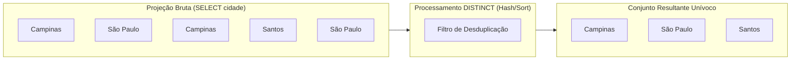

### Escopo de Avaliação do DISTINCT
Um erro conceitual comum é supor que o `DISTINCT` aplica-se apenas à primeira coluna descrita após a cláusula. O padrão SQL determina que **o `DISTINCT` avalia a tupla inteira projetada**. Ou seja, a combinação de todas as colunas declaradas no `SELECT` deve ser idêntica para que haja eliminação.

### Exemplos Práticos Comentados
```sql
-- Exemplo 1: Unicidade sobre um único campo
-- Retorna os nomes de clientes sem repetições
SELECT DISTINCT nome_cliente 
FROM cliente;

-- Exemplo 2: Unicidade composta sobre múltiplos atributos
-- Tuplas só são consideradas duplicadas se (nome E endereco) forem rigorosamente iguais
SELECT DISTINCT nome_cliente, endereco_cliente 
FROM cliente;
```

### Impacto de Performance
O `DISTINCT` exige que o motor do banco realize uma operação interna de ordenação em memória temporária (*Sort*) ou monte uma tabela de dispersão (*Hash Table*) sobre todas as tuplas filtradas. O uso indiscriminado do `DISTINCT` para mascarar falhas de modelagem ou junções incorretas degrada severamente o desempenho de sistemas transacionais.

---

## Expressões e operadores aritméticos (+, -, *, /) e uso de pseudônimos de coluna (AS)

### Projeção Dinâmica Computada
O comando `SELECT` não se restringe a buscar dados estáticos armazenados fisicamente. Ele funciona como uma poderosa calculadora relacional, permitindo que expressões matemáticas combinem atributos numéricos com literais escalares em tempo de execução.

Os quatro operadores matemáticos fundamentais suportados são:
- Adição (`+`)
- Subtração (`-`)
- Multiplicação (`*`)
- Divisão (`/`)

### Pseudônimos de Coluna com a Cláusula `AS`
Colunas calculadas dinamicamente não possuem um nome nativo no catálogo da tabela. O SGBD tende a atribuir títulos genéricos (como `?column?` no PostgreSQL ou a expressão inteira em outros motores). A cláusula `AS` define um identificador descritivo para a coluna projetada, melhorando a rastreabilidade nas camadas da aplicação. Se o pseudônimo contiver espaços ou diferenciação de caixa, utilizam-se aspas duplas (`"..."`).

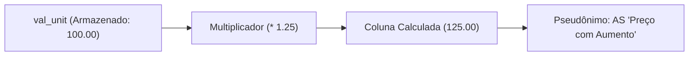

### Exemplos Práticos Comentados
```sql
-- Exemplo 1: Cálculo dinâmico simples de simulação de reajuste salarial de 10%
SELECT salario_fixo * 1.1 AS "Salario Reajustado" 
FROM vendedor;

-- Exemplo 2: Simulação de aumento de 25% com exibição comparativa
SELECT descricao, 
       unidade, 
       val_unit AS "Preço Atual", 
       val_unit * 1.25 AS "Preço com Aumento" 
FROM produto;

-- Exemplo 3: Simulação de desconto percentual de 12% com restrição de unidade
SELECT descricao, 
       unidade, 
       val_unit AS "Preço Atual", 
       val_unit - (val_unit * 0.12) AS "Preço com Desconto" 
FROM produto 
WHERE unidade = 'M';
```

### Armadilhas e Nuances
- **Divisão Inteira versus Ponto Flutuante:** Em motores como PostgreSQL e SQL Server, dividir dois números inteiros resulta em truncamento inteiro (exemplo: `5 / 2 = 2`). Para obter precisão decimal, é obrigatório converter pelo menos um dos operandos para número real: `5.0 / 2` ou `CAST(valor AS NUMERIC) / 2`.
- **Aritmética com `NULL`:** Qualquer operação matemática envolvendo um operando nulo resulta matematicamente em `NULL` (`100 + NULL = NULL`).

---

## Seleção por intervalo fechado de valores com o operador BETWEEN

### Definição Formal e Semântica do Intervalo
O operador `BETWEEN` simplifica a verificação de valores pertencentes a um intervalo delimitado. Ele é semanticamente equivalente a uma conjunção relacional inclusiva:

$$\text{expressão} \ge \text{limite\_inferior} \quad \text{AND} \quad \text{expressão} \le \text{limite\_superior}$$

O intervalo avaliado pelo `BETWEEN` é rigorosamente **fechado em ambos os extremos**, ou seja, os valores de fronteira fazem parte do conjunto de resultados.

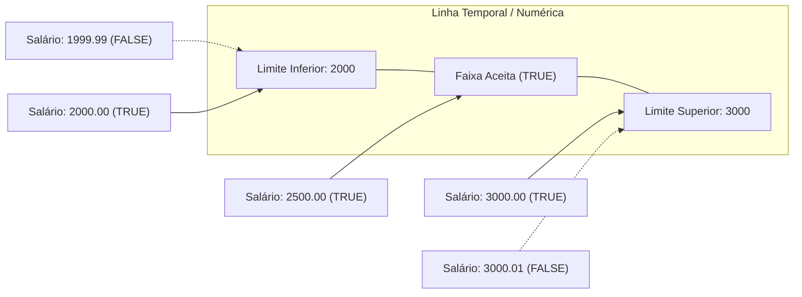

### Sintaxe Formal
```sql
SELECT colunas 
FROM tabela 
WHERE expressao BETWEEN limite_inferior AND limite_superior;
```

### Exemplos Práticos Comentados
```sql
-- Exemplo 1: Faixa de valores numéricos de salário
SELECT * 
FROM vendedor 
WHERE salario_fixo BETWEEN 2000.00 AND 3000.00;

-- Exemplo 2: Faixa de preços unitários em produtos
SELECT codigo_produto, descricao, val_unit 
FROM produto 
WHERE val_unit BETWEEN 0.32 AND 2.00;

-- Exemplo 3: Intervalo fechado de datas
SELECT matricula, nome_aluno, data_nasc_aluno 
FROM alu_aluno 
WHERE data_nasc_aluno BETWEEN '1980-02-01' AND '1990-10-30';
```

### A Armadilha da Inversão de Limites no BETWEEN
Uma das fontes mais frequentes de erros em consultas analíticas é inverter os parâmetros do `BETWEEN`. O operador SQL traduz a expressão para: `valor >= limite1 AND valor <= limite2`.
Se executarmos:
```sql
-- ERRO LÓGICO COMUM: Inversão dos limites inferior e superior
SELECT * 
FROM vendedor 
WHERE salario_fixo BETWEEN 3000.00 AND 2000.00;
```
A tradução interna será: `salario_fixo >= 3000 AND salario_fixo <= 2000`. Não existe nenhum número real que seja simultaneamente maior ou igual a 3000 e menor ou igual a 2000. O resultado será invariavelmente um **conjunto vazio de tuplas**, sem que o SGBD dispare nenhum alerta de erro sintático.

---

## Casamento de padrões em strings com LIKE, ILIKE e caracteres coringa (% e _)

### Definição e Motivação
A busca por correspondência exata (`=`) é ineficiente quando precisamos localizar textos parcialmente preenchidos, prefixos, sufixos ou termos no meio de strings textuais. Para isso, o SQL provê o operador `LIKE`, que opera por **casamento de padrões** (*pattern matching*).

### Caracteres Coringa Oficiais ANSI SQL

| Caractere Coringa | Definição Formal | Exemplo de Padrão | Correspondências Válidas | Correspondências Inválidas |
| :---: | :--- | :--- | :--- | :--- |
| `%` (Porcentagem) | Representa qualquer sequência de **zero ou mais** caracteres arbitrários. | `'A%'` | `'A'`, `'Ana'`, `'Alberto'`, `'Antiguidade'` | `'Bernardo'`, `'Carlos'` |
| `_` (Sublinhado / Underscore) | Representa **exatamente um** caractere arbitrário em posição fixa. | `'_a%'` | `'Carlos'`, `'Maria'`, `'Daniel'` (2ª letra é 'a') | `'Ana'`, `'Beatriz'`, `'Pedro'` |

### Exemplo Conceitual: Padrão Composto
Considere o padrão `'A_%S'`:
- Primeira posição: Letra `'A'` obrigatória.
- Segunda posição: Qualquer caractere obrigatório (`_`).
- Corpo intermediário: Zero ou mais caracteres livres (`%`).
- Última posição: Letra `'S'` obrigatória.
- *Casamentos válidos:* `'ALESS'`, `'ATLAS'`, `'A123S'`.
- *Casamentos inválidos:* `'AS'` (falta o caractere da posição sublinhada), `'ANEL'`.

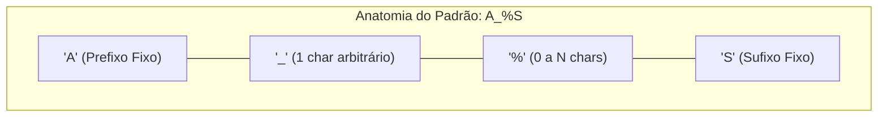

### O Operador ILIKE (Diferenciação de Caixa)
No padrão estrito SQL, o operador `LIKE` é sensível a maiúsculas e minúsculas (*case-sensitive*). No entanto, o sistema PostgreSQL disponibiliza a extensão `ILIKE`, que implementa a busca insensível a maiúsculas e minúsculas (*case-insensitive*):

```sql
-- LIKE estrito: Retorna apenas se tiver o 'a' minúsculo
SELECT pnome, cargo 
FROM empregado 
WHERE pnome LIKE '%a%';

-- ILIKE flexível: Localiza 'Ana', 'Amanda', 'Carlos', 'ALBERTO' (trata 'A' e 'a' como equivalentes)
SELECT pnome, cargo 
FROM empregado 
WHERE pnome ILIKE '%a%';
```

*(Nota técnica complementar: Em bancos que não possuem ILIKE nativo, como Oracle ou SQL Server tradicional, o padrão ANSI equivalente para busca case-insensitive é converter a coluna em tempo de busca: `WHERE LOWER(pnome) LIKE '%a%'`)*.

---

## Funções de agregação de dados: AVG, COUNT, MAX, MIN e SUM

### Definição Formal e Mecanismo de Redução
As funções de agregação (ou de grupo) realizam cálculos sobre um conjunto de valores colunares provenientes de múltiplas tuplas, condensando-os e retornando **um único valor escalar resumido**.

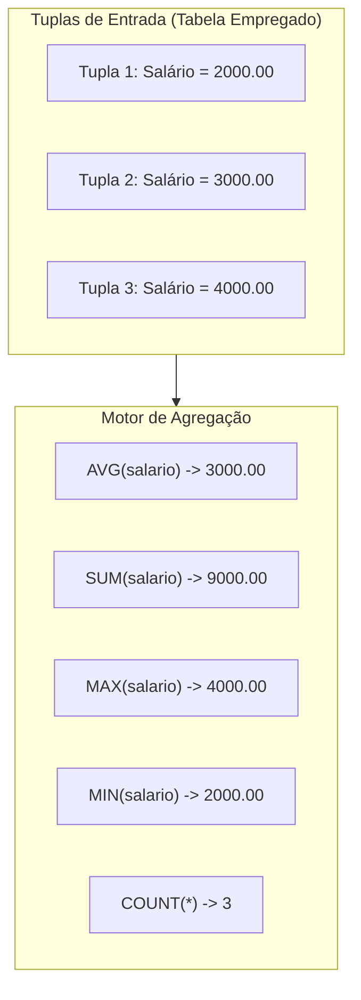

### O Catálogo de Funções Agregadas

| Função | Finalidade | Tipo de Dado Suportado | Tratamento de Nulos (`NULL`) |
| :--- | :--- | :--- | :--- |
| `AVG(coluna)` | Calcula a média aritmética dos valores da coluna. | Apenas tipos numéricos. | **Ignora** valores nulos no numerador e denominador. |
| `COUNT(*)` | Conta a quantidade total de registros da partição/tabela. | Qualquer tipo de dado. | **Conta** linhas mesmo que contenham colunas nulas. |
| `COUNT(coluna)`| Conta as ocorrências preenchidas de uma coluna. | Qualquer tipo de dado. | **Desconsidera** valores nulos (conta somente valores válidos). |
| `MAX(coluna)` | Retorna o maior valor encontrado no grupo. | Numéricos, Textos (ordem alfabética) e Datas. | Ignora valores nulos. |
| `MIN(coluna)` | Retorna o menor valor encontrado no grupo. | Numéricos, Textos (ordem alfabética) e Datas. | Ignora valores nulos. |
| `SUM(coluna)` | Calcula o somatório total acumulado dos valores. | Apenas tipos numéricos. | Ignora valores nulos (se todas as linhas forem nulas, retorna `NULL`). |

### Exemplos Práticos Comentados
```sql
-- Exemplo 1: Média aritmética simples de todos os salários
SELECT avg(salario) AS "Media Salarial" 
FROM empregado;

-- Exemplo 2: Contagem de tuplas filtradas com predicado
SELECT count(*) AS "Quantidade de Gerente na Empresa" 
FROM empregado 
WHERE cargo = 'Gerente';

-- Exemplo 3: Extremos de uma distribuição salarial
SELECT max(salario) AS "Maior Salario", 
       min(salario) AS "Menor Salario" 
FROM empregado;

-- Exemplo 4: Totalização consolidada da folha de pagamento
SELECT sum(salario) AS "Soma salarial" 
FROM empregado;
```

---

## Visão geral sobre restrições de uso de funções agregadas na cláusula WHERE e preparação para GROUP BY

### A Impossibilidade Estrutural de Agregações no WHERE
Um dos erros de compilação mais comuns em desenvolvedores iniciantes é tentar utilizar uma função de agregação dentro da cláusula `WHERE`:

```sql
-- ERRO CRÍTICO DE COMPILAÇÃO: O motor SQL rejeita este comando
SELECT pnome, salario 
FROM empregado 
WHERE salario > AVG(salario);
```

### Explicação Conceitual do Erro
Retomando o ciclo de processamento da consulta SQL (Pipeline de Execução):
1. O filtro `WHERE` atua na **fase de leitura das tuplas individuais**. Ele avalia linha a linha se o registro deve ser mantido no buffer de trabalho.
2. As funções de agregação dependem de ler **o conjunto completo** das tuplas para poder totalizar e calcular o resultado final (como a média).
3. Logo, quando o `WHERE` está sendo avaliado para a Tupla 1, a média geral de toda a tabela ainda **não existe** fisicamente. Permitir a agregação no `WHERE` criaria uma contradição de dependência temporal e de escopo.

*(Nota de engenharia: A filtragem baseada em agregação após agrupamento pertence à cláusula `HAVING`, ou exige o uso de subconsultas escalares)*.

### A Regra Fundamental do GROUP BY
Quando um comando `SELECT` projeta simultaneamente **colunas atômicas** (atributos individuais) e **funções de agregação**, a consulta torna-se ambígua, pois tenta misturar dimensões de granularidades distintas (uma lista de muitos nomes contra um único número agregado).

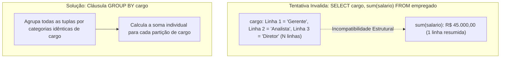

A regra de ouro da álgebra SQL estabelece:
> **Regra:** Em qualquer instrução `SELECT` que utilize funções agregadas combinadas com atributos normais, **todas as colunas não agregadas projetadas devem constar obrigatoriamente na cláusula `GROUP BY`**.

```sql
-- Consulta semanticamente correta preparando para GROUP BY
SELECT cargo, sum(salario) AS "Total por Cargo" 
FROM empregado 
GROUP BY cargo;
```

---

## Código da aula

O material de código prático associado a esta aula encontra-se modularizado em dois scripts SQL idempotentes, estruturados para execução direta em SGBDs relacionais compatíveis com ANSI SQL (como PostgreSQL):

1. [./codigo/exemplos.sql](file:///Users/murilodev/.gemini/antigravity-cli/scratch/codigo/exemplos.sql): Contém a criação de esquemas, tabelas, dados de teste e reprodução integral de todas as consultas apresentadas em sala de aula.
2. [./codigo/exercicios.sql](file:///Users/murilodev/.gemini/antigravity-cli/scratch/codigo/exercicios.sql): Contém os scripts e resoluções completas dos desafios e exercícios propostos pelo professor nos slides.

### Trechos Essenciais Comentados Linha a Linha

#### Segmento 1: Criação e Carga DML Segura (`exemplos.sql`)
```sql
-- Linha 1: Criação da tabela empregado com chave primária e restrição de não-nulidade
CREATE TABLE IF NOT EXISTS empregado (
    id_emp INTEGER PRIMARY KEY,           -- Identificador unívoco do empregado
    pnome VARCHAR(50) NOT NULL,           -- Primeiro nome obrigatório
    cargo VARCHAR(30) NOT NULL,           -- Função funcional
    salario NUMERIC(10,2) NOT NULL        -- Valor do salário com precisão decimal exata
);

-- Linha 8: Inserção múltipla de tuplas para testes de agregação e filtros de texto
INSERT INTO empregado (id_emp, pnome, cargo, salario) VALUES
(1, 'Carlos', 'Gerente', 8500.00),        -- Possui 'a' no nome e cargo Gerente
(2, 'Amanda', 'Analista', 4200.00),       -- Começa com 'A' e tem 'a' no corpo
(3, 'Roberto', 'Gerente', 9100.00),       -- Não começa com 'A'
(4, 'Ana', 'Secretario', 2500.00);        -- Começa com 'A' e termina com 'a'
```

#### Segmento 2: Consulta Analítica com LIKE, Expressões e Agrupamento (`exemplos.sql`)
```sql
-- Linha 17: Projeta funcionários cujo primeiro nome começa com 'A' (operador case-sensitive)
SELECT pnome, cargo 
FROM empregado 
WHERE pnome LIKE 'A%';                    -- Filtra 'Amanda' e 'Ana'

-- Linha 22: Agregação da folha salarial total filtrando apenas a gerência
SELECT count(*) AS total_gerentes,        -- Contagem de linhas que atendem ao critério
       sum(salario) AS folha_gerencia,    -- Somatório acumulado dos salários
       avg(salario) AS media_gerencia     -- Média salarial calculada da gerência
FROM empregado 
WHERE cargo = 'Gerente';                  -- Escopo restrito aos gerentes
```

---

## Exercícios

### Exercício 1: Filtragem combinada com unidade e valores específicos
**Origem:** Slide de Exercícios da Aula 04  
**Enunciado:** Encontre a descrição, unidade e o valor unitário dos produtos de unidade `'M'` e cujos valores unitários sejam `0.11` ou `1.8` ou `2`.  
**Raciocínio Algorítmico/Relacional:**
A consulta exige conjunção de dois critérios independentes: a unidade deve ser estritamente `'M'` e o valor unitário deve pertencer a uma lista discreta de três alternativas. Devido à maior precedência natural do operador `AND`, as condições de valor unidas por `OR` **devem estar isoladas entre parênteses**. Se os parênteses forem omitidos, a consulta retornará qualquer produto com valor unitário igual a 1.8 ou 2, independentemente de sua unidade de medida.

**Resolução Comentada:**
```sql
-- Resolução do Exercício 1
SELECT unidade, descricao, val_unit 
FROM produto 
WHERE unidade = 'M' 
  AND (val_unit = 0.11 OR val_unit = 1.8 OR val_unit = 2);

-- Forma alternativa profissional utilizando o operador de pertinência IN:
-- SELECT unidade, descricao, val_unit FROM produto WHERE unidade = 'M' AND val_unit IN (0.11, 1.8, 2);
```
*Arquivo de referência:* [./codigo/exercicios.sql](file:///Users/murilodev/.gemini/antigravity-cli/scratch/codigo/exercicios.sql)

---

### Exercício 2: Casamento de padrões case-insensitive com ILIKE
**Origem:** Slides da Aula 05  
**Enunciado:** Selecione o nome e cargo de todos os empregados que possuem uma letra `'a'` no nome. Em seguida, repita a consulta utilizando o operador `ILIKE` e analise a diferença dos conjuntos retornados.  
**Raciocínio Algorítmico/Relacional:**
O padrão `'%a%'` avalia se existe a sequência `'a'` minúscula em qualquer posição da string (inclusive início ou fim). No operador padrão `LIKE`, nomes que iniciam com `'A'` maiúsculo e não possuem outra letra `'a'` minúscula no meio (exemplo: `'Arthur'`) são descartados. Com `ILIKE`, o SGBD realiza o casamento sem diferenciação de caixa, capturando tanto `'a'` quanto `'A'`.

**Resolução Comentada:**
```sql
-- Consulta A: Case-sensitive (Retorna apenas tuplas com 'a' minúsculo)
SELECT pnome, cargo 
FROM empregado 
WHERE pnome LIKE '%a%';

-- Consulta B: Case-insensitive (Retorna tuplas contendo 'a' ou 'A')
SELECT pnome, cargo 
FROM empregado 
WHERE pnome ILIKE '%a%';
```
*Arquivo de referência:* [./codigo/exercicios.sql](file:///Users/murilodev/.gemini/antigravity-cli/scratch/codigo/exercicios.sql)

---

### Exercício 3: Simulação de aumento de preços com operador aritmético
**Origem:** Slide 19 da Aula 04  
**Enunciado:** Simule um aumento de 25% nos produtos cadastrados, projetando a descrição, a unidade, o valor unitário atual e o valor com aumento com um pseudônimo legível.  
**Raciocínio Algorítmico/Relacional:**
Um acréscimo percentual de $25\%$ equivale a multiplicar a grandeza por $1 + \frac{25}{100} = 1.25$. A expressão aritmética deve ser calculada no `SELECT` sem alterar os dados gravados no disco, acompanhada do alias formal `AS "Preço com Aumento"`.

**Resolução Comentada:**
```sql
-- Resolução do Exercício 3
SELECT descricao, 
       unidade, 
       val_unit AS "Preço Atual", 
       val_unit * 1.25 AS "Preço com Aumento" 
FROM produto;
```
*Arquivo de referência:* [./codigo/exercicios.sql](file:///Users/murilodev/.gemini/antigravity-cli/scratch/codigo/exercicios.sql)

---

### Exercício 4: Simulação de desconto percentual com restrição de unidade
**Origem:** Slide 19 da Aula 04  
**Enunciado:** Simule um desconto de 12% nos produtos cuja unidade de medida seja `'M'`, exibindo a descrição, a unidade, o valor unitário original e o valor calculado com desconto.  
**Raciocínio Algorítmico/Relacional:**
O cálculo de redução direta de $12\%$ pode ser estruturado matematicamente de duas formas equivalentes: $V - (V \times 0.12)$ ou diretamente $V \times 0.88$. A cláusula `WHERE` deve restringir o cálculo exclusivamente aos registros onde `unidade = 'M'`.

**Resolução Comentada:**
```sql
-- Resolução do Exercício 4
SELECT descricao, 
       unidade, 
       val_unit AS "Preço Atual", 
       val_unit - (val_unit * 0.12) AS "Preço com Desconto" 
FROM produto 
WHERE unidade = 'M';
```
*Arquivo de referência:* [./codigo/exercicios.sql](file:///Users/murilodev/.gemini/antigravity-cli/scratch/codigo/exercicios.sql)

---

### Exercício 5: Seleção de produtos por faixa de preço com BETWEEN
**Origem:** Slide 21 da Aula 04  
**Enunciado:** Listar o código, descrição e o valor unitário dos produtos que tenham o valor unitário na faixa de R$ 0.32 até R$ 2.00 utilizando o operador `BETWEEN`.  
**Raciocínio Algorítmico/Relacional:**
O operador `BETWEEN` exige que o limite inferior seja posicionado antes da palavra-chave `AND`, e o limite superior logo após. Isso cria um intervalo fechado $[0.32, 2.00]$.

**Resolução Comentada:**
```sql
-- Resolução do Exercício 5
SELECT codigo_produto, descricao, val_unit 
FROM produto 
WHERE val_unit BETWEEN 0.32 AND 2.00;
```
*Arquivo de referência:* [./codigo/exercicios.sql](file:///Users/murilodev/.gemini/antigravity-cli/scratch/codigo/exercicios.sql)

---

### Exercício 6: Filtragem temporal de alunos por faixa de datas com BETWEEN
**Origem:** Slide 21 da Aula 04  
**Enunciado:** Encontre a matrícula, o nome e a data de nascimento dos alunos nascidos no intervalo de 01/02/1980 a 30/10/1990.  
**Raciocínio Algorítmico/Relacional:**
Datas em SQL são comparáveis ordinalmente no tempo (uma data maior é cronologicamente posterior). O `BETWEEN` opera perfeitamente sobre tipos `DATE`. Emprega-se a ordenação estrita `'YYYY-MM-DD'` para evitar ambiguidades de interpretação regional do SGBD.

**Resolução Comentada:**
```sql
-- Resolução do Exercício 6
SELECT matricula, nome_aluno, data_nasc_aluno 
FROM alu_aluno 
WHERE data_nasc_aluno BETWEEN '1980-02-01' AND '1990-10-30';
```
*Arquivo de referência:* [./codigo/exercicios.sql](file:///Users/murilodev/.gemini/antigravity-cli/scratch/codigo/exercicios.sql)

---

## Erros comuns e boas práticas

### 1. Inversão dos Limites no Operador BETWEEN
- **Erro:** Escrever `BETWEEN 100 AND 50`.
- **Consequência:** A consulta roda sem erros de compilação, mas sempre retorna 0 tuplas, gerando relatórios vazios e falhas silenciosas na aplicação.
- **Boa Prática:** Garanta sempre a sintaxe `BETWEEN menor_valor AND maior_valor`.

### 2. Contradição Booleana com Operador AND
- **Erro:** `WHERE cidade = 'Franca' AND cidade = 'Ribeirão Preto'`.
- **Consequência:** Retorno vazio garantido. Uma coluna armazena um único valor atômico por tupla; ela nunca será simultaneamente duas cidades distintas.
- **Boa Prática:** Use `OR` ou `IN ('Franca', 'Ribeirão Preto')`.

### 3. Falta de Parênteses em Expressões Mistas (AND / OR)
- **Erro:** `WHERE ativo = TRUE AND perfil = 'ADMIN' OR perfil = 'ROOT'`.
- **Consequência:** Como o `AND` tem maior precedência, o banco avalia: `(ativo = TRUE AND perfil = 'ADMIN') OR (perfil = 'ROOT')`. Um usuário inativo com perfil `'ROOT'` terá acesso autorizado indevidamente (falha grave de segurança).
- **Boa Prática:** Utilize parentização defensiva explícita: `WHERE ativo = TRUE AND (perfil = 'ADMIN' OR perfil = 'ROOT')`.

### 4. Projeção Indiscriminada via `SELECT *`
- **Erro:** Adotar `SELECT *` no backend de sistemas em produção.
- **Consequência:** Tráfego excessivo de rede, sobrecarga no pool de conexões do servidor e falhas no mapeamento objeto-relacional (ORM) caso novas colunas sejam adicionadas ao schema.
- **Boa Prática:** Especifique explicitamente apenas as colunas que a aplicação irá consumir.

### 5. Execução de UPDATE e DELETE sem Transações
- **Erro:** Executar instruções de manipulação massiva diretamente no terminal de produção sem contexto transacional.
- **Consequência:** Destruição irreversível do banco em caso de esquecimento ou erro no predicado `WHERE`.
- **Boa Prática:** Encapsule sempre a operação entre `BEGIN;` e valide os dados alterados via `SELECT` antes de emitir o `COMMIT;`.

---

## Links e materiais complementares

- **Documentação Oficial do PostgreSQL - Cláusula SELECT:**
  Explicação aprofundada dos padrões ANSI e extensões implementadas pelo motor PostgreSQL para projeção, ordenação e limites.
  [https://www.postgresql.org/docs/current/sql-select.html](https://www.postgresql.org/docs/current/sql-select.html)
- **Documentação Oficial do PostgreSQL - Funções Agregadas:**
  Guia de referência sobre `AVG`, `COUNT`, `SUM`, `MIN`, `MAX` e comportamento analítico com agrupamento.
  [https://www.postgresql.org/docs/current/functions-aggregate.html](https://www.postgresql.org/docs/current/functions-aggregate.html)
- **Documentação Oficial do PostgreSQL - Casamento de Padrões (LIKE e Expressões Regulares):**
  Detalhamento dos operadores `LIKE`, `ILIKE`, `SIMILAR TO` e compatibilidade POSIX.
  [https://www.postgresql.org/docs/current/functions-matching.html](https://www.postgresql.org/docs/current/functions-matching.html)
- **Repositório de Testes SQL Fiddle:**
  Ambiente sandbox interativo online para testar scripts DML e DQL sem necessidade de instalação local de SGBD.
  [https://sqlfiddle.com/](https://sqlfiddle.com/)

---

## Mapa da aula

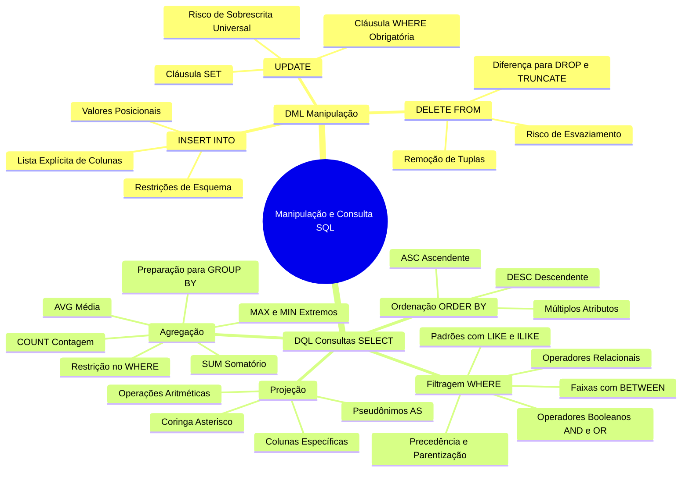

---

## Glossário

| Termo | Definição Técnica |
| :--- | :--- |
| **DML (Data Manipulation Language)** | Subconjunto da linguagem SQL encarregado de inserir (`INSERT`), atualizar (`UPDATE`) e remover (`DELETE`) tuplas em tabelas. |
| **DQL (Data Query Language)** | Subconjunto da linguagem SQL especializado na recuperação e projeção de dados (`SELECT`). |
| **Tupla** | Equivalente formal a um registro ou linha de uma tabela na teoria relacional. |
| **Atributo** | Equivalente formal a uma coluna ou campo estruturado de uma relação. |
| **Projeção ($\pi$)** | Operação da álgebra relacional que seleciona um subconjunto de colunas de uma tabela. |
| **Seleção ($\sigma$)** | Operação da álgebra relacional que filtra as linhas de uma tabela que satisfazem um predicado booleano. |
| **Predicado Booleano** | Expressão condicional que avalia em `TRUE`, `FALSE` ou `UNKNOWN`. |
| **Pseudônimo (Alias)** | Rótulo temporário atribuído a uma coluna ou tabela via cláusula `AS` para fins de exibição. |
| **Idempotência** | Propriedade de comandos que, ao serem executados repetidas vezes, produzem o mesmo estado final. O `SELECT` é idempotente; o `INSERT` comum não é. |
| **Case-Sensitive** | Propriedade de sistemas ou comandos que diferenciam letras maiúsculas de minúsculas (`'A'` $\neq$ `'a'`). |
| **Função Agregada** | Função analítica que recebe um conjunto de valores provenientes de múltiplas linhas e os resume em um único escalar. |
| **Transação** | Unidade lógica de processamento atômico delimitada por `BEGIN`, `COMMIT` ou `ROLLBACK`. |

---

## Pontos-chave para a prova

1. **A ausência do WHERE em comandos DML:** Tanto o `UPDATE` quanto o `DELETE` afetam a **totalidade** das linhas da tabela se executados sem a cláusula `WHERE`. Essa operação não gera erro de sintaxe.
2. **Ordem dos valores na omissão de colunas do INSERT:** Se a lista de colunas for omitida em `INSERT INTO tabela VALUES (...)`, é obrigatório fornecer valores para **todos** os campos da tabela na ordem exata de criação do esquema.
3. **Precedência do AND sobre o OR:** O operador `AND` é processado antes do `OR`. O uso de parênteses é mandatória quando se deseja que uma disjunção (`OR`) seja avaliada antes de uma conjunção (`AND`).
4. **Intervalo fechado no BETWEEN:** O operador `BETWEEN min AND max` inclui obrigatoriamente os extremos. Inverter a ordem (`BETWEEN max AND min`) gera resultado vazio.
5. **Diferença entre coringas LIKE:** `%` casa com qualquer cadeia de zero ou mais caracteres; `_` exige rigorosamente um caractere qualquer naquela posição específica.
6. **LIKE versus ILIKE:** `LIKE` é sensível a maiúsculas/minúsculas (*case-sensitive*); `ILIKE` ignora a diferença de caixa (*case-insensitive*).
7. **COUNT(*) versus COUNT(coluna):** `COUNT(*)` contabiliza todas as tuplas da partição; `COUNT(coluna)` desconsidera valores nulos (`NULL`) existentes na respectiva coluna.
8. **Funções agregadas no WHERE:** É **terminantemente proibido** utilizar funções agregadas (`AVG`, `SUM`, etc.) diretamente na cláusula `WHERE`. Elas pertencem ao `SELECT`, `HAVING` ou subconsultas.

---

## Perguntas e respostas (JSONL)

```jsonl
{"pergunta": "Qual o efeito prático da omissão da cláusula WHERE em um comando DELETE FROM?", "resposta": "O comando excluirá todas as tuplas da tabela sem remover o esquema ou a estrutura da relação.", "dificuldade": "facil"}
{"pergunta": "Qual a diferença entre a inserção com especificação de colunas e a inserção posicional via INSERT INTO?", "resposta": "A inserção com especificação mapeia nome a nome e tolera omissão de campos que tenham default ou aceitem nulo; a posicional exige valores para todas as colunas na ordem exata do schema.", "dificuldade": "medio"}
{"pergunta": "Por que a condição 'WHERE salario_fixo BETWEEN 3000 AND 2000' retorna um conjunto vazio?", "resposta": "Porque o operador BETWEEN exige que o limite inferior seja fornecido primeiro. A expressão é traduzida para 'salario >= 3000 AND salario <= 2000', o que é uma contradição lógica.", "dificuldade": "medio"}
{"pergunta": "Qual a precedência de avaliação entre os operadores lógicos AND e OR na ausência de parênteses?", "resposta": "O operador AND possui maior precedência que o OR, sendo avaliado primeiro pelo motor de execução.", "dificuldade": "facil"}
{"pergunta": "Qual a diferença sintática e funcional entre os operadores de padrão LIKE e ILIKE?", "resposta": "O operador LIKE é case-sensitive (diferencia maiúsculas e minúsculas), enquanto o ILIKE é case-insensitive.", "dificuldade": "facil"}
{"pergunta": "O que representam, respectivamente, os caracteres coringa '%' e '_' no operador LIKE?", "resposta": "O caractere '%' representa zero ou mais caracteres arbitrários; o '_' representa exatamente um único caractere arbitrário.", "dificuldade": "facil"}
{"pergunta": "Por que é proibido utilizar funções de agregação como AVG() na cláusula WHERE?", "resposta": "Porque a cláusula WHERE filtra tuplas individuais na fase de varredura, momento em que o valor global agregado de toda a tabela ainda não foi computado.", "dificuldade": "dificil"}
{"pergunta": "Se uma tabela possuir 10 registros e 3 deles tiverem valor NULL na coluna salario, qual o retorno de COUNT(*) e COUNT(salario)?", "resposta": "COUNT(*) retornará 10 (todas as tuplas), enquanto COUNT(salario) retornará 7 (ignora nulos).", "dificuldade": "medio"}
{"pergunta": "Qual o impacto do comando SELECT DISTINCT quando aplicado a múltiplas colunas?", "resposta": "A eliminação de duplicidades ocorre apenas quando a combinação de todas as colunas projetadas for rigorosamente idêntica.", "dificuldade": "medio"}
{"pergunta": "Qual a ordem lógica real de processamento das cláusulas em uma consulta SELECT simples?", "resposta": "A ordem de processamento do motor é: 1. FROM, 2. WHERE, 3. SELECT, 4. DISTINCT, 5. ORDER BY.", "dificuldade": "dificil"}
{"pergunta": "O que ocorre ao tentar executar uma operação aritmética como 'salario + NULL' em SQL?", "resposta": "Qualquer operação aritmética envolvendo um operando nulo resulta em NULL.", "dificuldade": "facil"}
{"pergunta": "Como garantir a consistência de atualizações em lote via console para evitar o erro de esquecer a cláusula WHERE?", "resposta": "Iniciando explicitamente uma transação com BEGIN, validando as tuplas alteradas com SELECT e emitindo COMMIT ou ROLLBACK.", "dificuldade": "medio"}
{"pergunta": "Qual regra deve ser seguida obrigatoriamente ao projetar colunas atômicas junto com funções de agregação em uma consulta?", "resposta": "Todas as colunas atômicas (não agregadas) do SELECT devem obrigatoriamente fazer parte da cláusula GROUP BY.", "dificuldade": "dificil"}
{"pergunta": "Em qual situação o caractere asterisco (*) deve ser evitado em consultas SELECT?", "resposta": "Em consultas de produção, APIs e sistemas comerciais, pois trafega dados desnecessários e fragiliza o contrato da aplicação com o banco.", "dificuldade": "facil"}
{"pergunta": "Para que serve a palavra-chave AS após o nome ou expressão de uma coluna no SELECT?", "resposta": "Serve para atribuir um pseudônimo (alias) legível à coluna no conjunto de resultados retornado.", "dificuldade": "facil"}
{"pergunta": "Qual o resultado prático da consulta 'SELECT nome FROM cliente WHERE cidade = 'A' AND cidade = 'B' '?", "resposta": "Retornará zero tuplas, pois um único campo não pode ter simultaneamente dois valores escalares distintos.", "dificuldade": "facil"}
{"pergunta": "Se uma consulta omitir a cláusula ORDER BY, em qual ordem o SGBD é obrigado a entregar as tuplas?", "resposta": "Em nenhuma ordem garantida; as tuplas serão entregues de acordo com a ordem física ou planejamento interno do otimizador.", "dificuldade": "medio"}
```

---

## Checklist de revisão

- [ ] Compreendi a diferença prática entre `INSERT INTO ... (colunas) VALUES` e `INSERT INTO ... VALUES`.
- [ ] Sei explicar por que a ausência do `WHERE` em `UPDATE` e `DELETE` compromete toda a tabela e como usar transações (`BEGIN`/`COMMIT`/`ROLLBACK`) para proteção.
- [ ] Entendi a diferença entre Projeção (`SELECT`) e Seleção (`WHERE`).
- [ ] Sei que o asterisco (`*`) deve ser restrito a testes ad-hoc e evitado em código de produção.
- [ ] Dominei a ordenação com `ORDER BY`, diferenciando `ASC` e `DESC` em múltiplos atributos hierárquicos.
- [ ] Memorizei a precedência booleana em que `AND` é avaliado antes de `OR` e a importância do isolamento com parênteses.
- [ ] Sei que `BETWEEN` compõe um intervalo fechado e que seus limites não podem ser invertidos.
- [ ] Diferencio o uso de `%` e `_` no casamento de padrões com `LIKE`.
- [ ] Sei quando utilizar `ILIKE` para buscas insensíveis a maiúsculas/minúsculas.
- [ ] Sei calcular médias (`AVG`), somas (`SUM`), extremos (`MAX`, `MIN`) e contagens (`COUNT`).
- [ ] Entendi por que `COUNT(*)` difere de `COUNT(coluna)` perante valores nulos (`NULL`).
- [ ] Tenho plena clareza de por que funções agregadas não são permitidas no `WHERE` e memorizei a regra de que colunas atômicas associadas a agregadas exigem a cláusula `GROUP BY`.
- [ ] Clonei e executei os scripts práticos [exemplos.sql](file:///Users/murilodev/.gemini/antigravity-cli/scratch/codigo/exemplos.sql) e [exercicios.sql](file:///Users/murilodev/.gemini/antigravity-cli/scratch/codigo/exercicios.sql).
