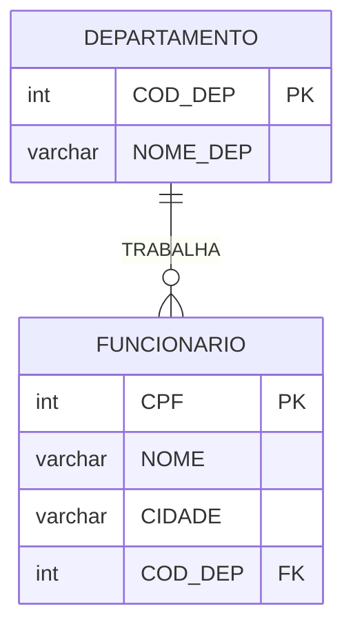
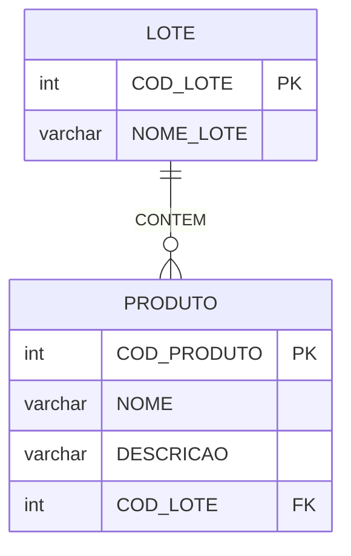
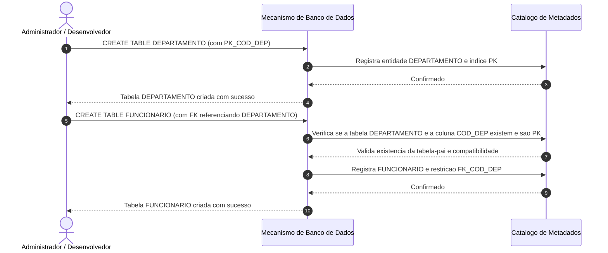
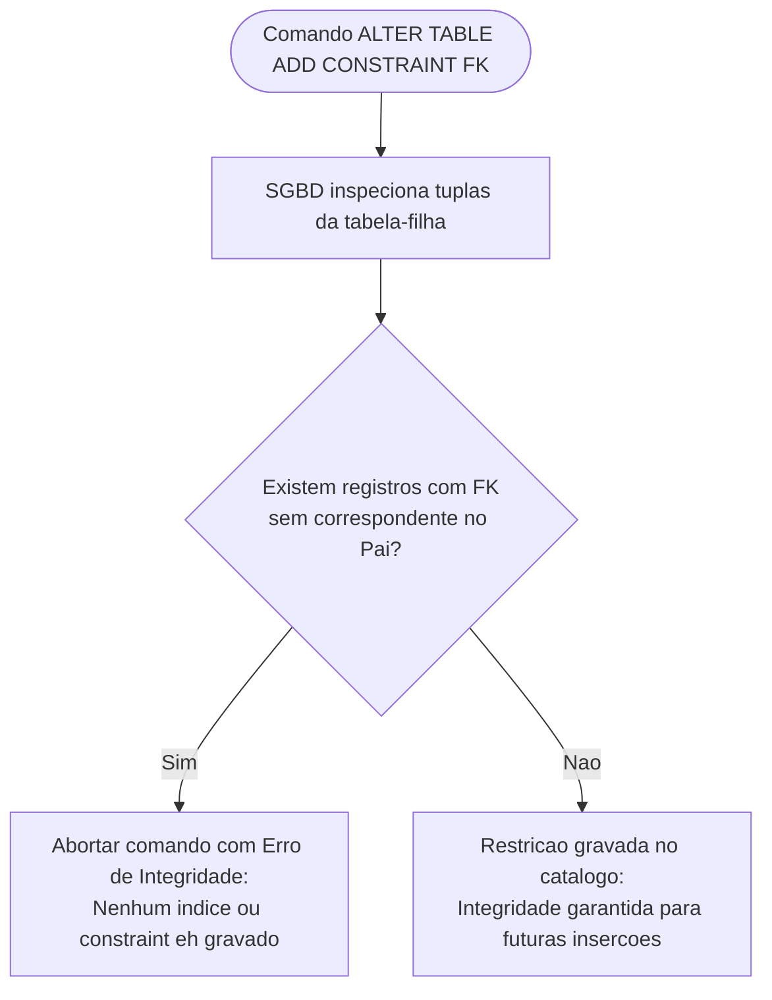
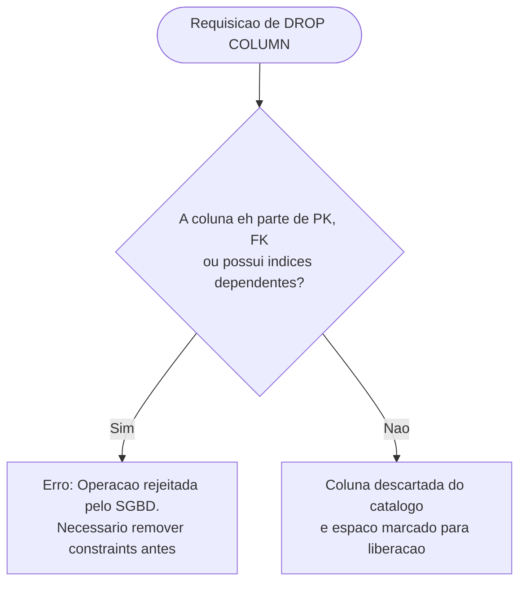
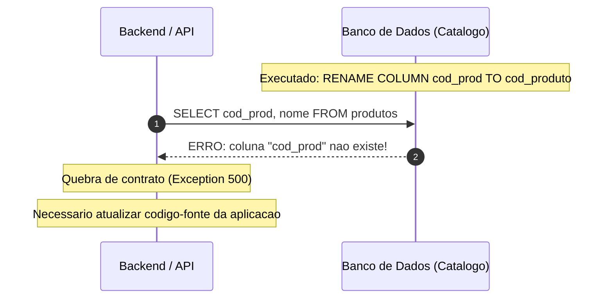
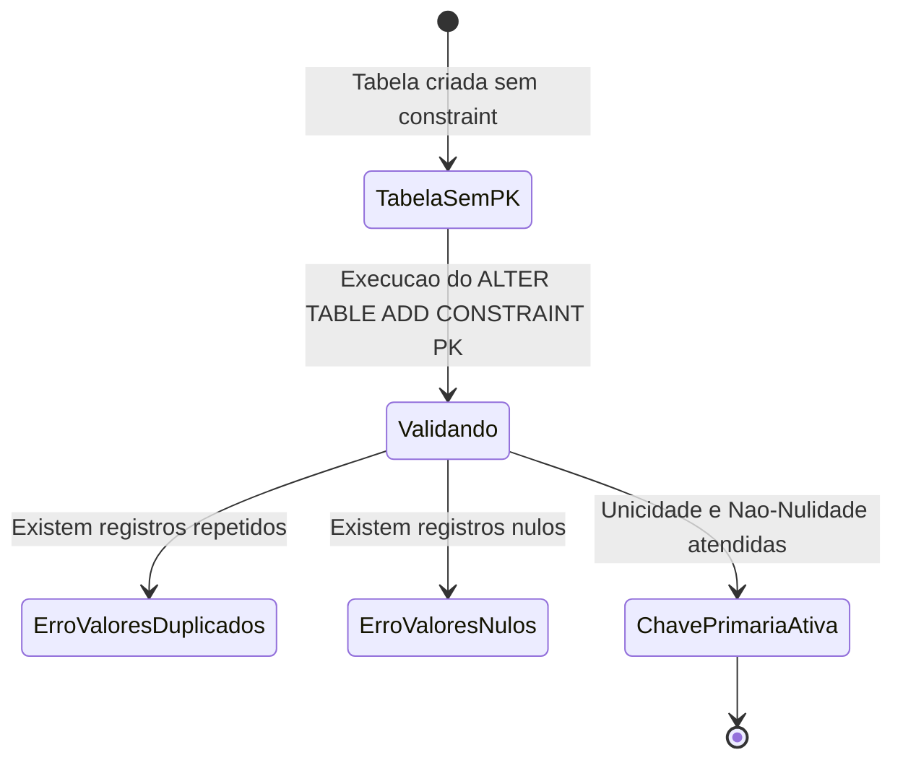
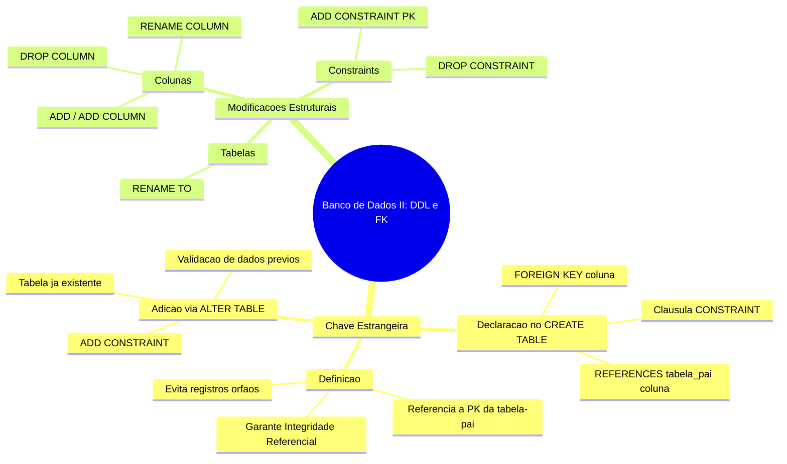

# Aula 02 — Chave Estrangeira e Modificações com DDL

> **Professor:** Guilherme de Morais
> **Disciplina:** Banco de Dados II (3º Semestre)
> **Tema:** Implementação de integridade referencial com chaves estrangeiras e evolução estrutural de esquemas relacionais por meio de comandos DDL (Data Definition Language).

## Sumário

- [Objetivo da aula](#objetivo-da-aula)
- [Contexto e pré-requisitos](#contexto-e-pré-requisitos)
- [Conceito e integridade referencial de Chave Estrangeira (Foreign Key)](#conceito-e-integridade-referencial-de-chave-estrangeira-foreign-key)
- [Definição de Foreign Key no comando CREATE TABLE](#definição-de-foreign-key-no-comando-create-table)
- [Adição de Foreign Key com ALTER TABLE ADD CONSTRAINT](#adição-de-foreign-key-com-alter-table-add-constraint)
- [Adição de colunas à tabela com ALTER TABLE ADD / ADD COLUMN](#adição-de-colunas-à-tabela-com-alter-table-add--add-column)
- [Remoção de colunas com ALTER TABLE DROP COLUMN](#remoção-de-colunas-com-alter-table-drop-column)
- [Remoção de restrições com ALTER TABLE DROP CONSTRAINT](#remoção-de-restrições-com-alter-table-drop-constraint)
- [Renomeação de colunas com ALTER TABLE RENAME COLUMN](#renomeação-de-colunas-com-alter-table-rename-column)
- [Renomeação de tabelas com ALTER TABLE RENAME TO](#renomeação-de-tabelas-com-alter-table-rename-to)
- [Adição de Chave Primária com ALTER TABLE ADD CONSTRAINT](#adição-de-chave-primária-com-alter-table-add-constraint)
- [Código da aula](#código-da-aula)
- [Exercícios](#exercícios)
- [Erros comuns e boas práticas](#erros-comuns-e-boas-práticas)
- [Links e materiais complementares](#links-e-materiais-complementares)
- [Mapa da aula](#mapa-da-aula)
- [Glossário](#glossário)
- [Pontos-chave para a prova](#pontos-chave-para-a-prova)
- [Perguntas e respostas (JSONL)](#perguntas-e-respostas-jsonl)
- [Checklist de revisão](#checklist-de-revisão)

---

## Objetivo da aula

Esta aula tem como propósito capacitar o estudante a:
1. Compreender o conceito formal e prático de **Chave Estrangeira (Foreign Key - FK)** como pilar fundamental da integridade referencial no modelo relacional.
2. Identificar e mapear relacionamentos entre entidades (1..1, 1..N e 0..N) para estruturas concretas de tabelas no banco de dados.
3. Declarar restrições de integridade referencial diretamente na criação de esquemas com o comando `CREATE TABLE`.
4. Utilizar instruções DDL (`ALTER TABLE`) para manipular restrições de integridade (`PRIMARY KEY` e `FOREIGN KEY`) em tabelas já populadas ou pré-existentes.
5. Executar operações de evolução de esquema de banco de dados: adição, remoção e renomeação de colunas, bem como a renomeação de tabelas e expurgo de restrições estruturais.
6. Antecipar e mitigar os efeitos colaterais de alterações estruturais em ambientes de produção, prevenindo a perda acidental de dados e a geração de registros órfãos.

---

## Contexto e pré-requisitos

No primeiro semestre da formação em banco de dados, os estudos concentram-se na modelagem conceitual (Diagrama Entidade-Relacionamento - DER) e na definição inicial de tabelas independentes, utilizando chaves primárias (`PRIMARY KEY`) para garantir que cada registro seja unívoco.

Em Banco de Dados II, o foco se desloca para a garantia de consistência relacional e a manutenção do ciclo de vida dos esquemas:
- **Pré-requisitos conceituais:**
  - Domínio da teoria do Modelo Relacional de Codd (tuplas, atributos, relações e domínios).
  - Conceito de **Chave Primária (PK)**: atributo ou conjunto de atributos que identifica de forma única uma tupla em uma relação e não admite valores nulos (`NOT NULL`).
  - Distinção entre comandos DDL (*Data Definition Language*, como `CREATE`, `ALTER`, `DROP`) e comandos DML (*Data Manipulation Language*, como `INSERT`, `UPDATE`, `DELETE`, `SELECT`).
- **Problema de Engenharia Abordado:**
  Sistemas de software corporativos evoluem continuamente. Regras de negócio mudam, novas entidades surgem e requisitos de relacionamento tornam-se mais complexos. Se o banco de dados não aplicar restrições declarativas de integridade no nível de motor (SGBD), a aplicação torna-se vulnerável a inconsistências graves, tais como pedidos vinculados a clientes inexistentes ou funcionários alocados em departamentos fictícios.

---

## Conceito e integridade referencial de Chave Estrangeira (Foreign Key)

### Definição e Motivação

Uma **Chave Estrangeira (Foreign Key - FK)** é uma coluna ou conjunto de colunas em uma tabela (denominada tabela-filha ou referenciadora) cujos valores devem obrigatoriamente corresponder aos valores da chave primária (ou chave alternativa/única) de outra tabela (denominada tabela-pai ou referenciada), ou conter um valor nulo (`NULL`), caso o relacionamento admita opcionalidade.

A integridade referencial é a regra que assegura que o relacionamento entre duas tabelas permaneça sempre válido. Sob a ótica matemática e de engenharia de software, a integridade referencial dita que nenhuma tupla na tabela-filha pode apontar para uma tupla inexistente na tabela-pai.



No modelo apresentado pelo material:
- `DEPARTAMENTO` é a entidade forte (tabela-pai).
- `FUNCIONARIO` é a entidade dependente (tabela-filha), que armazena a chave estrangeira `COD_DEP`.
- Cardinalidade: Um departamento pode ter 1 ou N funcionários (`1..N`), enquanto cada funcionário trabalha em exatamente 1 departamento (`1..1`).

Outro exemplo abordado no material envolve controle de estoque:



- Cardinalidade: Um lote contém de 0 a N produtos (`0..N`), enquanto um produto pertence a exatamente 1 lote (`1..1`).

### Exemplo Concreto

Considere que na tabela `DEPARTAMENTO` existem os registros:
- `(1, 'Tecnologia da Informação')`
- `(2, 'Recursos Humanos')`

Se tentarmos inserir um funcionário com `COD_DEP = 1`, o SGBD permite a operação, pois o valor `1` existe na tabela `DEPARTAMENTO`.

### Contraexemplo e Violação de Integridade

Se tentarmos inserir um funcionário com `COD_DEP = 99`, o SGBD abortará a transação com um erro de violação de integridade referencial, impedindo a criação de um **registro órfão**.

Da mesma forma, se tentarmos executar um comando `DELETE FROM DEPARTAMENTO WHERE COD_DEP = 1;` enquanto existirem funcionários associados a esse departamento, o SGBD rejeitará a exclusão para manter a integridade das referências existentes (salvo se cláusulas de exclusão em cascata forem expressamente configuradas, o que representa um tópico avançado complementar).

### Armadilhas Conceituais

1. **Tipagem Incompatível:** A coluna de chave estrangeira deve possuir tipo de dado e precisão estritamente compatíveis com a chave primária referenciada (exemplo: referenciar um `INTEGER` com um `VARCHAR` causa erro de compilação do comando DDL).
2. **Nulabilidade:** Uma chave estrangeira não precisa ser obrigatoriamente `NOT NULL`. Se um funcionário puder ser contratado sem departamento alocado temporariamente, a coluna `COD_DEP` aceitará `NULL`. Contudo, se for informado um valor diferente de `NULL`, este obrigatoriamente deverá existir na tabela-pai.

### Tabela Comparativa: Tabela-Pai vs Tabela-Filha

| Característica | Tabela-Pai (Referenciada) | Tabela-Filha (Referenciadora) |
| :--- | :--- | :--- |
| **Elemento Chave** | Contém a `PRIMARY KEY` (ou `UNIQUE`) | Contém a `FOREIGN KEY` |
| **Papel Relacional** | Entidade independente da relação | Entidade que referencia e depende da existência da outra |
| **Ordem de Criação** | Deve ser criada **primeiro** | Criada posteriormente ou alterada após a existência do pai |
| **Ordem de Inserção** | Dados mestres devem ser cadastrados antes | Registros dependentes só aceitam chaves já cadastradas |
| **Ordem de Exclusão** | Registros não podem ser apagados se houver filhos | Registros podem ser excluídos livremente sem quebrar o pai |

---

## Definição de Foreign Key no comando CREATE TABLE

### Definição e Sintaxe

A declaração da chave estrangeira durante a criação da tabela ocorre através da cláusula `CONSTRAINT` no escopo da instrução `CREATE TABLE`. Essa abordagem é declarativa e garante que a tabela-filha já nasça plenamente protegida pelas regras de integridade referencial.

A sintaxe canônica ensinada pelo professor Guilherme de Morais é:

```sql
CREATE TABLE nome_tabela (
    coluna1 tipo_dados restricoes,
    coluna2 tipo_dados restricoes,
    CONSTRAINT nome_pk PRIMARY KEY (coluna_pk),
    CONSTRAINT nome_fk FOREIGN KEY (coluna_fk) REFERENCES tabela_pai (coluna_pk_pai)
);
```

### Exemplo Ministrado em Aula

Abaixo, a sequência rigorosa de scripts apresentada no slide 4 de "AULA 2 CHAVE ESTRANGEIRA.pptx":

```sql
-- Criacao da tabela-pai (DEPARTAMENTO)
CREATE TABLE DEPARTAMENTO (
    COD_DEP INTEGER NOT NULL,
    NOME VARCHAR(50),
    CONSTRAINT PK_COD_DEP PRIMARY KEY (COD_DEP)
);

-- Criacao da tabela-filha (FUNCIONARIO) com definicao da FK inline
CREATE TABLE FUNCIONARIO (
    CPF INTEGER NOT NULL,
    NOME VARCHAR(50),
    CIDADE VARCHAR(50),
    COD_DEP INTEGER,
    CONSTRAINT PK_CPF PRIMARY KEY (CPF),
    CONSTRAINT FK_COD_DEP FOREIGN KEY (COD_DEP) REFERENCES DEPARTAMENTO (COD_DEP)
);
```

### Ciclo Operacional de Criação e Dependência

A sequência cronológica é mandatória. O diagrama abaixo detalha a validação realizada pelo SGBD:



### Armadilhas e Contraexemplos

Se o desenvolvedor inverter a ordem de execução e submeter a criação da tabela `FUNCIONARIO` antes de `DEPARTAMENTO`:

```sql
-- ERRO GRAVE: Tabela DEPARTAMENTO ainda nao existe no catalogo
CREATE TABLE FUNCIONARIO (
    CPF INTEGER NOT NULL,
    NOME VARCHAR(50),
    CIDADE VARCHAR(50),
    COD_DEP INTEGER,
    CONSTRAINT PK_CPF PRIMARY KEY (CPF),
    CONSTRAINT FK_COD_DEP FOREIGN KEY (COD_DEP) REFERENCES DEPARTAMENTO (COD_DEP)
);
-- Saida do SGBD: ERROR: relation "departamento" does not exist
```

---

## Adição de Foreign Key com ALTER TABLE ADD CONSTRAINT

### Definição e Motivação

Em projetos reais de software e engenharia de dados, nem sempre as tabelas são criadas em uma única transação estruturada. Há cenários onde:
1. Ocorre carga massiva inicial de dados e as restrições são temporariamente suprimidas para ganho de performance.
2. Existem dependências circulares entre tabelas (Tabela A aponta para B, e B aponta para A).
3. Tabelas legadas passam por refatoração estrutural para incorporar novos vínculos de negócio.

Para estes cenários, o SQL disponibiliza o comando `ALTER TABLE` combinado com a cláusula `ADD CONSTRAINT`.

### Sintaxe Oficial

Conforme apresentado no slide 5 do material:

```sql
ALTER TABLE tabela_filha 
ADD CONSTRAINT nome_constraint 
FOREIGN KEY (coluna) 
REFERENCES tabela_pai (coluna);
```

### Exemplo Ministrado em Aula

No slide 7, o professor demonstra a criação isolada das tabelas `PRODUTO` e `LOTE`, seguida pela amarração tardia da chave estrangeira:

```sql
-- Criacao da tabela PRODUTO sem a restricao FK
CREATE TABLE PRODUTO (
    COD_PRODUTO INTEGER NOT NULL,
    NOME VARCHAR(50),
    DESCRICAO VARCHAR(50),
    COD_LOTE INTEGER,
    CONSTRAINT PK_COD_PRODUTO PRIMARY KEY (COD_PRODUTO)
);

-- Criacao da tabela LOTE
CREATE TABLE LOTE (
    COD_LOTE INTEGER NOT NULL,
    NOME_LOTE VARCHAR(50),
    CONSTRAINT PK_COD_LOTE PRIMARY KEY (COD_LOTE)
);

-- Adicao posterior da Foreign Key na tabela PRODUTO
ALTER TABLE PRODUTO 
ADD CONSTRAINT FK_COD_LOTE1 
FOREIGN KEY (COD_LOTE) 
REFERENCES LOTE (COD_LOTE);
```

No slide 7 de "MODIFICAÇÕES TABELAS.pptx", outro exemplo análogo é apresentado:

```sql
ALTER TABLE PEDIDOS 
ADD CONSTRAINT FK_COD_CLI 
FOREIGN KEY (COD_CLI) 
REFERENCES CLIENTES(COD);
```

### Validação do SGBD e Armadilha dos Dados Pré-existentes

Quando o comando `ALTER TABLE ... ADD CONSTRAINT ... FOREIGN KEY` é emitido, o SGBD realiza uma varredura completa (Full Table Scan) na tabela-filha para verificar se todos os registros já gravados atendem à regra de integridade.



Se a tabela `PRODUTO` já possuir uma linha com `COD_LOTE = 500` e a tabela `LOTE` não contiver o lote `500`, a execução do `ALTER TABLE` falhará imediatamente.

---

## Adição de colunas à tabela com ALTER TABLE ADD / ADD COLUMN

### Definição e Sintaxe

A evolução de software exige frequentemente a incorporação de novos atributos a entidades consolidadas. O comando `ALTER TABLE ... ADD` permite incluir novas colunas no final da definição física da tabela.

Variações aceitas em conformidade com o material:
- Forma padrão ANSI/geral (slide 8 de Chave Estrangeira):
  ```sql
  ALTER TABLE nome_tabela ADD nome_coluna tipo_dados;
  ```
- Forma explícita com `COLUMN` (slide 2 de Modificações Tabelas):
  ```sql
  ALTER TABLE nome_tabela ADD COLUMN nome_coluna tipo_dados;
  ```

*(Nota técnica complementar: A palavra-chave `COLUMN` é opcional na maioria dos dialetos SQL baseados no padrão ANSI, como PostgreSQL, mas obrigatória ou recomendada em certos contextos para maior clareza legível).*

### Exemplo Ministrado em Aula

```sql
-- Adicionando a coluna 'descricao' do tipo TEXT na tabela 'produtos'
ALTER TABLE produtos ADD COLUMN descricao text;
```

### Comportamento dos Registros Existentes

Ao adicionar uma coluna a uma tabela que já possui 1 milhão de registros:
- O novo atributo é criado preenchido com valor nulo (`NULL`) para todas as linhas já armazenadas no disco.
- Se o comando tentar declarar a nova coluna como `NOT NULL` sem fornecer um valor padrão (`DEFAULT`), a execução resultará em erro caso a tabela contenha dados, pois o banco não saberá como preencher os registros antigos.

### Tabela Comparativa de Estratégias de Inclusão de Colunas

| Declaração | Permite Registros Existentes? | Estado Inicial das Linhas Antigas |
| :--- | :--- | :--- |
| `ADD COLUMN descricao text;` | Sim | Valor `NULL` em todas as tuplas |
| `ADD COLUMN status varchar(20) DEFAULT 'ATIVO';` | Sim *(conhecimento complementar)* | Preenchida com `'ATIVO'` em todas as tuplas |
| `ADD COLUMN obrigatorio integer NOT NULL;` | Somente se a tabela estiver **vazia** | Falha se houver dados, pois viola regra `NOT NULL` |

---

## Remoção de colunas com ALTER TABLE DROP COLUMN

### Definição e Sintaxe

Quando um atributo torna-se obsoleto, desnecessário ou incorreto em virtude de uma reestruturação do sistema, ele deve ser fisicamente ou logicamente expurgado da tabela utilizando a cláusula `DROP COLUMN`.

Sintaxe oficial ensinada (slide 9 de Chave Estrangeira e slide 3 de Modificações Tabelas):

```sql
ALTER TABLE nome_tabela DROP COLUMN nome_coluna;
```

### Exemplo Ministrado em Aula

```sql
-- Removendo a coluna 'descricao' da tabela 'produtos'
ALTER TABLE produtos DROP COLUMN descricao;
```

### Impactos Arquiteturais e Riscos de Engenharia

A operação de `DROP COLUMN` é destrutiva e irreversível no nível de dados brutos:
1. **Perda Irreversível:** Todo o conteúdo histórico armazenado naquela coluna é imediatamente descartado ou desvinculado dos blocos de dados.
2. **Quebra de Aplicações:** Qualquer comando de backend (`SELECT *`, `INSERT` posicional sem declaração explícita de colunas ou cláusulas `WHERE`) que referencie a coluna eliminada gerará exceções imediatas em produção.
3. **Dependências em Cascata:** Se a coluna a ser removida fizer parte de uma restrição de chave primária, chave estrangeira ou índice composto, a operação será bloqueada até que as constraints associadas sejam removidas.



---

## Remoção de restrições com ALTER TABLE DROP CONSTRAINT

### Definição e Sintaxe

Restrições de integridade (`PRIMARY KEY`, `FOREIGN KEY`, `UNIQUE`, `CHECK`) recebem um identificador unívoco no catálogo do banco de dados (o *constraint name*). Quando a dinâmica do negócio exige flexibilização ou alteração da integridade estrutural, a restrição pode ser revogada sem a necessidade de recriar a tabela ou perder seus dados.

Sintaxe oficial ensinada (slide 10 de Chave Estrangeira):

```sql
ALTER TABLE nome_tabela DROP CONSTRAINT nome_constraint;
```

### Exemplo Prático e Aplicação

Considere a chave estrangeira `FK_COD_LOTE1` criada anteriormente na tabela `PRODUTO`. Se a empresa decidir que os produtos não serão mais rastreados por lotes, a chave estrangeira deve ser eliminada:

```sql
-- Removendo a restricao de Foreign Key da tabela PRODUTO
ALTER TABLE PRODUTO DROP CONSTRAINT FK_COD_LOTE1;
```

Após a execução bem-sucedida dessa instrução:
- A coluna `COD_LOTE` continua existindo fisicamente na tabela `PRODUTO`.
- Os valores anteriormente gravados permanecem intactos.
- No entanto, o vínculo de integridade referencial deixa de existir: o SGBD agora permitirá a inserção de qualquer código numérico em `COD_LOTE`, mesmo que não exista na tabela `LOTE`.

### Armadilhas no Uso de DROP CONSTRAINT

- **Nomes Não Padronizados:** Se o desenvolvedor omitir a cláusula `CONSTRAINT nome_constraint` durante a criação da tabela e declarar apenas `FOREIGN KEY (coluna) REFERENCES pai(coluna)`, o SGBD gerará um nome aleatório interno no catálogo (por exemplo, `sys_c001293` ou `funcionario_cod_dep_fkey`). Nesse caso, para realizar o `DROP`, o profissional precisará consultar tabelas do dicionário de dados (como `information_schema.table_constraints`) para descobrir o identificador exato da constraint. Daí a importância vital da regra ensinada pelo Prof. Guilherme de Morais: **sempre nomear explicitamente as constraints**.

---

## Renomeação de colunas com ALTER TABLE RENAME COLUMN

### Definição e Sintaxe

Durante manutenções evolutivas ou refatorações de arquitetura de dados (Database Refactoring), é comum padronizar nomes de colunas que foram mal nomeadas na fase inicial de desenvolvimento. A cláusula `RENAME COLUMN` altera o identificador do atributo nos metadados da tabela sem alterar o tipo de dado nem o conteúdo das tuplas.

Sintaxe oficial ensinada (slide 4 de Modificações Tabelas):

```sql
ALTER TABLE nome_tabela RENAME COLUMN coluna_antiga TO novo_nome;
```

### Exemplo Ministrado em Aula

```sql
-- Alterando a coluna 'cod_prod' para 'cod_produto' na tabela 'produtos'
ALTER TABLE produtos RENAME COLUMN cod_prod TO cod_produto;
```

### Efeito no Contrato de Interface de Aplicações

A renomeação de colunas afeta o contrato de dados entre a aplicação e o banco.



*(Conhecimento complementar de engenharia: Em bancos de grande porte sob alta disponibilidade, renomeações de colunas em produção costumam ser feitas criando-se uma view de transição ou aplicando migrações em duas fases: expand and contract).*

---

## Renomeação de tabelas com ALTER TABLE RENAME TO

### Definição e Sintaxe

A renomeação de tabelas ocorre quando uma entidade muda de escopo dentro do domínio do negócio, ou quando se deseja refletir melhor o propósito de um conjunto de dados sem a necessidade de criar uma nova tabela e copiar registros (o que seria uma operação lenta e custosa em termos de I/O de disco).

Sintaxe oficial ensinada (slide 5 de Modificações Tabelas):

```sql
ALTER TABLE nome_antigo RENAME TO novo_nome;
```

### Exemplo Ministrado em Aula

```sql
-- Renomeando a tabela 'produtos' para 'equipamentos'
ALTER TABLE produtos RENAME TO equipamentos;
```

### Mecanismo Interno do SGBD

Diferente de um comando destrutivo seguido de reinserção, o comando `RENAME TO` altera apenas uma linha no catálogo de metadados do banco de dados (por exemplo, na tabela `pg_class` do PostgreSQL ou nas tabelas internas do catálogo ANSI). Os índices, restrições e sequências associadas continuam fisicamente vinculados ao mesmo identificador de objeto (OID), mantendo todos os dados intactos.

---

## Adição de Chave Primária com ALTER TABLE ADD CONSTRAINT

### Definição e Sintaxe

Se uma tabela foi originalmente criada sem a definição explícita de sua chave primária, ela é considerada um *heap* não estruturado segundo as melhores práticas do modelo relacional. Para sanar essa deficiência e preparar a tabela para ser referenciada por outras entidades, adiciona-se a chave primária via `ALTER TABLE`.

Sintaxe oficial ensinada (slide 6 de Modificações Tabelas):

```sql
ALTER TABLE nome_tabela ADD CONSTRAINT nome_constraint PRIMARY KEY (coluna);
```

### Exemplo Ministrado em Aula

```sql
-- Adicionando a Chave Primaria PK_CLIENTES na coluna COD da tabela CLIENTES
ALTER TABLE CLIENTES ADD CONSTRAINT PK_CLIENTES PRIMARY KEY (COD);
```

### Requisitos Prévios do SGBD para Aceitar a PK

A inclusão de uma restrição de chave primária através de `ALTER TABLE` exige que o SGBD valide duas regras essenciais nos dados já existentes:
1. **Unicidade Absoluta:** Nenhuma tupla pode possuir valor idêntico a outra tupla no atributo `COD`.
2. **Não-Nulidade:** Nenhum registro pode conter o valor `NULL` na coluna `COD`. Caso a coluna original tenha sido criada permitindo nulos, o desenvolvedor deve primeiro executar um comando `ALTER TABLE nome_tabela ALTER COLUMN coluna SET NOT NULL;` (ou equivalente no SGBD utilizado) antes de aplicar a restrição de chave primária.



---

## Código da aula

Para consolidar as demonstrações práticas exibidas nos slides, os scripts foram padronizados em dois arquivos SQL versionáveis, estruturados segundo a dialética do SGBD com sintaxe estritamente aderente ao material didático ministrado pelo Prof. Guilherme de Morais.

### Arquivo: `./codigo/exemplos.sql`

O arquivo [./codigo/exemplos.sql](file:///codigo/exemplos.sql) reúne todos os trechos apresentados nos slides dos dois arquivos PPTX.

```sql
-- ============================================================================
-- DISCIPLINA: Banco de Dados II
-- PROFESSOR : Guilherme de Morais
-- ARQUIVO   : exemplos.sql
-- DESCRICAO : Exemplos oficiais apresentados nos slides de aula
-- ============================================================================

-- ----------------------------------------------------------------------------
-- PARTE 1: Slides de "AULA 2 CHAVE ESTRANGEIRA.pptx"
-- ----------------------------------------------------------------------------

-- Slide 4: Criacao de DEPARTAMENTO e FUNCIONARIO com FK inline no CREATE TABLE
CREATE TABLE DEPARTAMENTO (
    COD_DEP INTEGER NOT NULL,
    NOME VARCHAR(50),
    CONSTRAINT PK_COD_DEP PRIMARY KEY (COD_DEP)
);

CREATE TABLE FUNCIONARIO (
    CPF INTEGER NOT NULL,
    NOME VARCHAR(50),
    CIDADE VARCHAR(50),
    COD_DEP INTEGER,
    CONSTRAINT PK_CPF PRIMARY KEY (CPF),
    CONSTRAINT FK_COD_DEP FOREIGN KEY (COD_DEP) REFERENCES DEPARTAMENTO (COD_DEP)
);

-- Slide 7: Criacao de PRODUTO e LOTE com posterior adicao da FK via ALTER TABLE
CREATE TABLE PRODUTO (
    COD_PRODUTO INTEGER NOT NULL,
    NOME VARCHAR(50),
    DESCRICAO VARCHAR(50),
    COD_LOTE INTEGER,
    CONSTRAINT PK_COD_PRODUTO PRIMARY KEY (COD_PRODUTO)
);

CREATE TABLE LOTE (
    COD_LOTE INTEGER NOT NULL,
    NOME_LOTE VARCHAR(50),
    CONSTRAINT PK_COD_LOTE PRIMARY KEY (COD_LOTE)
);

-- Adicao da constraint de Foreign Key vinculando PRODUTO a LOTE
ALTER TABLE PRODUTO 
ADD CONSTRAINT FK_COD_LOTE1 
FOREIGN KEY (COD_LOTE) 
REFERENCES LOTE (COD_LOTE);

-- Slide 8: Adicionar uma coluna a tabela
ALTER TABLE PRODUTO ADD PESO NUMERIC(10,2);

-- Slide 9: Excluir uma coluna de uma tabela
ALTER TABLE PRODUTO DROP COLUMN PESO;

-- Slide 10: Excluir uma constraint de uma tabela
ALTER TABLE PRODUTO DROP CONSTRAINT FK_COD_LOTE1;

-- ----------------------------------------------------------------------------
-- PARTE 2: Slides de "MODIFICACOES TABELAS.pptx"
-- ----------------------------------------------------------------------------

-- Criacao de tabela base para testes de modificacao
CREATE TABLE produtos (
    cod_prod INTEGER NOT NULL,
    nome VARCHAR(100)
);

-- Slide 2: Adicionar coluna
ALTER TABLE produtos ADD COLUMN descricao text;

-- Slide 3: Remover coluna
ALTER TABLE produtos DROP COLUMN descricao;

-- Slide 4: Mudar nome de coluna
ALTER TABLE produtos RENAME COLUMN cod_prod TO cod_produto;

-- Slide 5: Mudar nome de tabela
ALTER TABLE produtos RENAME TO equipamentos;

-- Slide 6: Adicionar Chave Primaria em tabela existente
CREATE TABLE CLIENTES (
    COD INTEGER NOT NULL,
    NOME VARCHAR(100)
);

ALTER TABLE CLIENTES ADD CONSTRAINT PK_CLIENTES PRIMARY KEY (COD);

-- Slide 7: Adicionar Chave Estrangeira em tabela existente
CREATE TABLE PEDIDOS (
    NUM_PEDIDO INTEGER NOT NULL,
    DATA_PEDIDO DATE,
    COD_CLI INTEGER,
    CONSTRAINT PK_PEDIDOS PRIMARY KEY (NUM_PEDIDO)
);

ALTER TABLE PEDIDOS 
ADD CONSTRAINT FK_COD_CLI 
FOREIGN KEY (COD_CLI) 
REFERENCES CLIENTES(COD);
```

### Arquivo: `./codigo/exercicios.sql`

O arquivo [./codigo/exercicios.sql](file:///codigo/exercicios.sql) resolve formalmente os 4 exercícios de fixação derivados do conteúdo trabalhado em sala de aula.

---

## Exercícios

### Exercício 1: Integridade Referencial na Criação de Tabelas

**Enunciado:**
Crie as tabelas `CATEGORIA` e `PRODUTO`. A tabela `CATEGORIA` deve conter `COD_CATEGORIA` (INTEGER, chave primária) e `NOME_CATEGORIA` (VARCHAR(50)). A tabela `PRODUTO` deve conter `COD_PRODUTO` (INTEGER, chave primária), `NOME` (VARCHAR(50)), `VALOR` (NUMERIC(10,2)) e `COD_CATEGORIA` (INTEGER). Defina a chave primária e a chave estrangeira referenciando `CATEGORIA` diretamente dentro do comando `CREATE TABLE`, garantindo a integridade referencial.

**Raciocínio de Resolução:**
1. A tabela referenciada (`CATEGORIA`) deve ser criada obrigatoriamente antes da tabela referenciadora (`PRODUTO`).
2. As chaves primárias devem ser configuradas como `NOT NULL` e associadas via `CONSTRAINT ... PRIMARY KEY`.
3. Na tabela `PRODUTO`, a coluna `COD_CATEGORIA` recebe a constraint `FK_PROD_CAT` apontando para `CATEGORIA(COD_CATEGORIA)`.

**Resolução SQL:**
```sql
-- 1. Criacao da tabela-pai CATEGORIA
CREATE TABLE CATEGORIA (
    COD_CATEGORIA INTEGER NOT NULL,
    NOME_CATEGORIA VARCHAR(50) NOT NULL,
    CONSTRAINT PK_CATEGORIA PRIMARY KEY (COD_CATEGORIA)
);

-- 2. Criacao da tabela-filha PRODUTO com definicao inline da FK
CREATE TABLE PRODUTO (
    COD_PRODUTO INTEGER NOT NULL,
    NOME VARCHAR(50) NOT NULL,
    VALOR NUMERIC(10,2),
    COD_CATEGORIA INTEGER,
    CONSTRAINT PK_PRODUTO PRIMARY KEY (COD_PRODUTO),
    CONSTRAINT FK_PROD_CAT FOREIGN KEY (COD_CATEGORIA) REFERENCES CATEGORIA (COD_CATEGORIA)
);
```

Código versionado disponível em: [./codigo/exercicios.sql](file:///codigo/exercicios.sql).

---

### Exercício 2: Associação Posterior com ALTER TABLE

**Enunciado:**
Crie as tabelas `AUTOR` (`COD_AUTOR` INTEGER, `NOME` VARCHAR(50)) e `LIVRO` (`COD_LIVRO` INTEGER, `TITULO` VARCHAR(100), `COD_AUTOR` INTEGER) sem nenhuma constraint no comando `CREATE TABLE`. Em seguida, utilize o comando `ALTER TABLE` para:
- (a) adicionar a chave primária `PK_AUTOR` na tabela `AUTOR`;
- (b) adicionar a chave primária `PK_LIVRO` na tabela `LIVRO`;
- (c) adicionar a chave estrangeira `FK_LIVRO_AUTOR` na tabela `LIVRO` vinculando `COD_AUTOR` ao `COD_AUTOR` de `AUTOR`.

**Raciocínio de Resolução:**
1. As tabelas são criadas de forma preliminar apenas com as especificações de colunas e tipos.
2. Como uma chave estrangeira exige que o campo de destino seja uma chave primária (ou única) formalmente reconhecida, devemos primeiro aplicar as restrições `PRIMARY KEY` em ambas as tabelas.
3. Por fim, executa-se o `ALTER TABLE ... ADD CONSTRAINT ... FOREIGN KEY` associando `LIVRO` a `AUTOR`.

**Resolução SQL:**
```sql
-- Criacao inicial das tabelas desprovidas de constraints
CREATE TABLE AUTOR (
    COD_AUTOR INTEGER NOT NULL,
    NOME VARCHAR(50)
);

CREATE TABLE LIVRO (
    COD_LIVRO INTEGER NOT NULL,
    TITULO VARCHAR(100),
    COD_AUTOR INTEGER
);

-- (a) Adicao da chave primaria na tabela AUTOR
ALTER TABLE AUTOR 
ADD CONSTRAINT PK_AUTOR PRIMARY KEY (COD_AUTOR);

-- (b) Adicao da chave primaria na tabela LIVRO
ALTER TABLE LIVRO 
ADD CONSTRAINT PK_LIVRO PRIMARY KEY (COD_LIVRO);

-- (c) Adicao da Foreign Key associando LIVRO ao AUTOR
ALTER TABLE LIVRO 
ADD CONSTRAINT FK_LIVRO_AUTOR 
FOREIGN KEY (COD_AUTOR) 
REFERENCES AUTOR (COD_AUTOR);
```

Código versionado disponível em: [./codigo/exercicios.sql](file:///codigo/exercicios.sql).

---

### Exercício 3: Evolução de Esquema com Adição e Remoção de Colunas

**Enunciado:**
Crie uma tabela `CLIENTE` com as colunas `COD_CLI` (INTEGER, PK) e `NOME` (VARCHAR(50)). Utilizando comandos `ALTER TABLE`:
- (a) adicione a coluna `EMAIL` (VARCHAR(80));
- (b) adicione a coluna `TELEFONE_RECADO` (VARCHAR(20));
- (c) remova a coluna `TELEFONE_RECADO` utilizando a cláusula `DROP COLUMN`.

**Raciocínio de Resolução:**
1. Cria-se a estrutura básica da tabela `CLIENTE` contendo sua `PRIMARY KEY`.
2. Emprega-se `ALTER TABLE ... ADD` para incluir sucessivamente as colunas solicitadas.
3. Para excluir `TELEFONE_RECADO`, aplica-se a sintaxe `ALTER TABLE ... DROP COLUMN`.

**Resolução SQL:**
```sql
-- Criacao da tabela inicial
CREATE TABLE CLIENTE (
    COD_CLI INTEGER NOT NULL,
    NOME VARCHAR(50),
    CONSTRAINT PK_CLIENTE PRIMARY KEY (COD_CLI)
);

-- (a) Adicao da coluna EMAIL
ALTER TABLE CLIENTE ADD EMAIL VARCHAR(80);

-- (b) Adicao da coluna TELEFONE_RECADO
ALTER TABLE CLIENTE ADD COLUMN TELEFONE_RECADO VARCHAR(20);

-- (c) Remocao da coluna TELEFONE_RECADO
ALTER TABLE CLIENTE DROP COLUMN TELEFONE_RECADO;
```

Código versionado disponível em: [./codigo/exercicios.sql](file:///codigo/exercicios.sql).

---

### Exercício 4: Refatoração de Nomes de Coluna e Tabela

**Enunciado:**
Crie a tabela `FORNECEDOR_TEMP` com as colunas `COD` (INTEGER, PK) e `FANTASIA` (VARCHAR(50)). Em seguida, realize as seguintes alterações estruturais:
- (a) renomeie a coluna `FANTASIA` para `NOME_FANTASIA`;
- (b) renomeie a tabela `FORNECEDOR_TEMP` para `FORNECEDORES`.

**Raciocínio de Resolução:**
1. A tabela temporária é criada com sua chave primária declarada.
2. A instrução `RENAME COLUMN` é utilizada para alterar o rótulo do atributo sem impactar os tipos de dados.
3. A instrução `RENAME TO` altera o nome da relação no catálogo do SGBD de `FORNECEDOR_TEMP` para `FORNECEDORES`.

**Resolução SQL:**
```sql
-- Criacao da tabela
CREATE TABLE FORNECEDOR_TEMP (
    COD INTEGER NOT NULL,
    FANTASIA VARCHAR(50),
    CONSTRAINT PK_FORNECEDOR_TEMP PRIMARY KEY (COD)
);

-- (a) Renomeacao da coluna FANTASIA
ALTER TABLE FORNECEDOR_TEMP RENAME COLUMN FANTASIA TO NOME_FANTASIA;

-- (b) Renomeacao da tabela FORNECEDOR_TEMP
ALTER TABLE FORNECEDOR_TEMP RENAME TO FORNECEDORES;
```

Código versionado disponível em: [./codigo/exercicios.sql](file:///codigo/exercicios.sql).

---

## Erros comuns e boas práticas

### Erros Frequentes Identificados em Avaliações e Prática Profissional

1. **Inversão da Ordem de Criação de Tabelas:**
   Tentar criar a tabela-filha (`FUNCIONARIO`) antes da tabela-pai (`DEPARTAMENTO`). O SGBD compila a declaração e gera o erro: `relation "departamento" does not exist`.
   *Solução:* Projete os scripts de criação começando sempre pelas entidades independentes (pais) até as entidades dependentes (filhos).

2. **Divergência de Tipos de Dados entre PK e FK:**
   Declarar a chave primária da tabela-pai como `INTEGER` e a chave estrangeira da tabela-filha como `VARCHAR(10)` ou `BIGINT`. A maioria dos SGBDs rejeita a declaração de integridade por incompatibilidade de tipo.
   *Solução:* Garanta estrita igualdade de tipo, precisão e escala entre as colunas envolvidas.

3. **Omissão do Nome da Constraint:**
   Declarar comandos como `ALTER TABLE pedidos ADD FOREIGN KEY (cod_cli) REFERENCES clientes(cod);` sem estipular `CONSTRAINT fk_nome`. Isso dificulta operações posteriores de manutenção, como `DROP CONSTRAINT`.
   *Solução:* Sempre utilize a convenção `ADD CONSTRAINT nome_constraint`.

4. **Tentativa de Inserir Registros Filhos Órfãos:**
   Submeter um comando `INSERT INTO FUNCIONARIO ... VALUES (..., 99)` quando o departamento `99` não existe na tabela `DEPARTAMENTO`.
   *Solução:* O fluxo da aplicação ou o script de testes deve garantir que o registro-pai esteja persistido e comitado antes do cadastro do filho.

5. **Exclusão de Registros Pais com Filhos Dependentes Ativos:**
   Tentar deletar um departamento enquanto houver funcionários alocados nele.
   *Solução:* Realoque ou exclua primeiro os registros filhos, ou configure ações referenciais adequadas se o modelo de negócio assim determinar.

### Boas Práticas Recomendadas

- **Padrão Nemotécnico para Nomes de Constraints:**
  - Chaves Primárias: `PK_nome_tabela` (Ex: `PK_DEPARTAMENTO`, `PK_COD_PRODUTO`).
  - Chaves Estrangeiras: `FK_tabela_filha_tabela_pai` ou `FK_coluna` (Ex: `FK_COD_DEP`, `FK_PROD_CAT`).
- **Idempotência e Scripts de Migração:**
  Em ambientes de engenharia de software contínua, agrupe comandos de alteração estrutural (`ALTER TABLE`) em migrações controladas por versão.
- **Evitar o Uso de SELECT * em Código de Produção:**
  Comandos DDL como `DROP COLUMN` ou `RENAME COLUMN` quebram silenciosamente códigos que dependem de ordem posicional de colunas. Especifique sempre os nomes dos atributos nas consultas.

---

## Links e materiais complementares

- **Documentação Oficial PostgreSQL - DDL e Foreign Keys:**
  Guia oficial detalhando sintaxes de criação, integridade referencial e comandos `ALTER TABLE`.
  *Referência de estudo:* Seção "Data Definition" e "Table Constraints" do Manual Oficial PostgreSQL.
- **Padrão SQL ANSI/ISO SQL-92 e SQL:1999:**
  Especificação formal das regras de integridade relacional de Codd adotadas pelos principais motores de bancos de dados relacionais do mercado (PostgreSQL, Oracle, MySQL, SQL Server).
- **Repositório da Disciplina (UniFEF):**
  Repositório local de scripts da disciplina Banco de Dados II, contendo os arquivos [./codigo/exemplos.sql](file:///codigo/exemplos.sql) e [./codigo/exercicios.sql](file:///codigo/exercicios.sql).

---

## Mapa da aula



---

## Glossário

| Termo Técnico | Definição no Contexto de Banco de Dados |
| :--- | :--- |
| **DDL (Data Definition Language)** | Subconjunto da linguagem SQL responsável pela criação, alteração e exclusão de estruturas de dados (`CREATE`, `ALTER`, `DROP`). |
| **Chave Primária (Primary Key - PK)** | Coluna ou conjunto de colunas que identifica univocamente cada tupla de uma tabela, não admitindo duplicidade nem valores nulos. |
| **Chave Estrangeira (Foreign Key - FK)** | Atributo que estabelece um elo relacional apontando diretamente para a chave primária de outra tabela. |
| **Integridade Referencial** | Estado de consistência em que todas as chaves estrangeiras existentes em um banco apontam para tuplas válidas na tabela de destino. |
| **Registro Órfão** | Registro na tabela-filha cujo valor de chave estrangeira não possui correspondente na tabela-pai (bloqueado por restrições de FK). |
| **Tabela-Pai (Referenciada)** | Entidade que detém os dados mestres e cuja chave primária é tomada como referência por outra relação. |
| **Tabela-Filha (Referenciadora)** | Entidade subordinada que abriga a chave estrangeira necessária para manter a rastreabilidade do relacionamento. |
| **Constraint** | Regra declarativa imposta a uma ou mais colunas de uma tabela para limitar os tipos de dados que podem ser gravados. |
| **Heap** | Estrutura de armazenamento de tabela desprovida de ordenação ou de chave primária explicitamente declarada. |

---

## Pontos-chave para a prova

1. **Sintaxe Exata da Foreign Key no `CREATE TABLE`:**
   Lembrar da estrutura: `CONSTRAINT nome_constraint FOREIGN KEY (coluna_local) REFERENCES tabela_destino (coluna_destino)`. A omissão de parênteses ou inversão de argumentos é um erro recorrente.
2. **Sintaxe Exata no `ALTER TABLE`:**
   Memorizar a ordem dos termos: `ALTER TABLE tabela_filha ADD CONSTRAINT nome_fk FOREIGN KEY (coluna) REFERENCES tabela_pai (coluna);`.
3. **Diferença Crucial entre `DROP COLUMN` e `DROP CONSTRAINT`:**
   - `DROP COLUMN`: Elimina a coluna física e todo o seu conteúdo armazenado.
   - `DROP CONSTRAINT`: Elimina apenas a regra lógica de validação (como a restrição de FK ou PK), mantendo a coluna e seus dados gravados na tabela.
4. **Ordem de Execução dos Scripts DDL:**
   - Criação: Tabelas independentes (Pai) **antes** de tabelas dependentes (Filho).
   - Inserção de Dados: Inserir no Pai **antes** de inserir no Filho.
   - Exclusão de Tabelas: Deletar a tabela-filha **antes** de deletar a tabela-pai (ou eliminar primeiro a constraint de FK).
5. **Comandos de Renomeação:**
   - Renomear coluna: `ALTER TABLE tabela RENAME COLUMN coluna_antiga TO novo_nome;`
   - Renomear tabela: `ALTER TABLE tabela_antiga RENAME TO novo_nome;`
6. **Adição Tardia de PK:**
   Comando: `ALTER TABLE tabela ADD CONSTRAINT nome_pk PRIMARY KEY (coluna);`. Exige que a coluna não tenha duplicidades nem valores `NULL`.

---

## Perguntas e respostas (JSONL)

```jsonl
{"pergunta": "O que e uma chave estrangeira e qual o seu papel fundamental no modelo relacional?", "resposta": "E uma coluna ou conjunto de colunas que faz referencia a chave primaria de outra tabela, com a finalidade de garantir a integridade referencial e impedir a criacao de registros orfaos.", "dificuldade": "Facil"}
{"pergunta": "Qual a diferenca fundamental entre a tabela-pai e a tabela-filha em um relacionamento?", "resposta": "A tabela-pai contem a chave primaria que serve como referencia; a tabela-filha contem a chave estrangeira que aponta para a tabela-pai.", "dificuldade": "Facil"}
{"pergunta": "Qual comando DDL permite adicionar uma chave estrangeira a uma tabela ja existente?", "resposta": "ALTER TABLE tabela_filha ADD CONSTRAINT nome_constraint FOREIGN KEY (coluna) REFERENCES tabela_pai (coluna);", "dificuldade": "Media"}
{"pergunta": "Qual erro ocorre ao tentar criar a tabela FUNCIONARIO com FK para DEPARTAMENTO antes de DEPARTAMENTO existir?", "resposta": "Ocorre um erro de compilacao DDL informando que a tabela referenciada (DEPARTAMENTO) nao existe no catalogo do banco.", "dificuldade": "Facil"}
{"pergunta": "Como remover a coluna 'descricao' da tabela 'produtos' segundo o material de aula?", "resposta": "ALTER TABLE produtos DROP COLUMN descricao;", "dificuldade": "Facil"}
{"pergunta": "Como renomear a coluna 'cod_prod' para 'cod_produto' na tabela 'produtos'?", "resposta": "ALTER TABLE produtos RENAME COLUMN cod_prod TO cod_produto;", "dificuldade": "Facil"}
{"pergunta": "Como renomear a tabela 'produtos' para 'equipamentos'?", "resposta": "ALTER TABLE produtos RENAME TO equipamentos;", "dificuldade": "Facil"}
{"pergunta": "Qual o comando para adicionar uma chave primaria chamada PK_CLIENTES na coluna COD da tabela CLIENTES?", "resposta": "ALTER TABLE CLIENTES ADD CONSTRAINT PK_CLIENTES PRIMARY KEY (COD);", "dificuldade": "Media"}
{"pergunta": "O que acontece com os dados de uma coluna quando executamos o comando ALTER TABLE DROP COLUMN?", "resposta": "Os dados armazenados naquela coluna sao permanentemente e irreversivelmente eliminados.", "dificuldade": "Facil"}
{"pergunta": "Qual a diferenca entre executar DROP COLUMN e DROP CONSTRAINT em relacao a uma coluna de chave estrangeira?", "resposta": "O DROP COLUMN elimina a coluna e seus dados; o DROP CONSTRAINT remove apenas a regra de integridade referencial, preservando a coluna e seus registros.", "dificuldade": "Media"}
{"pergunta": "O que o SGBD faz se tentarmos adicionar uma FK com ALTER TABLE em uma tabela que ja contem dados com codigos inexistentes no pai?", "resposta": "O SGBD aborta a operacao e rejeita a criacao da constraint, pois os dados existentes violam a integridade referencial.", "dificuldade": "Media"}
{"pergunta": "E obrigatorio que o nome da coluna da chave estrangeira seja rigorosamente igual ao nome da chave primaria na tabela-pai?", "resposta": "Nao, os nomes podem ser diferentes, mas os tipos de dados e os dominios devem ser estritamente compativeis.", "dificuldade": "Media"}
{"pergunta": "Uma chave estrangeira aceita valores nulos (NULL)?", "resposta": "Sim, exceto se a coluna tiver sido explicitamente definida com a restricao NOT NULL.", "dificuldade": "Media"}
{"pergunta": "Como adicionar a coluna 'descricao' do tipo 'text' na tabela 'produtos' utilizando o comando com ADD COLUMN?", "resposta": "ALTER TABLE produtos ADD COLUMN descricao text;", "dificuldade": "Facil"}
{"pergunta": "Por que e uma boa pratica nomear expressamente as constraints com CONSTRAINT nome ao inves de deixar o banco gerar?", "resposta": "Para permitir que manutenções futuras, como a remocao via DROP CONSTRAINT, possam ser feitas diretamente sem precisar consultar o catalogo interno para descobrir nomes gerados automaticamente.", "dificuldade": "Dificil"}
{"pergunta": "O que e um registro orfao?", "resposta": "E um registro em uma tabela dependente cuja chave estrangeira aponta para um registro que nao existe na tabela referenciada.", "dificuldade": "Facil"}
{"pergunta": "Em qual ordem de comandos devemos apagar duas tabelas vinculadas por Foreign Key sem desativar constraints?", "resposta": "Devemos apagar primeiro a tabela-filha (referenciadora) e depois a tabela-pai (referenciada).", "dificuldade": "Media"}
{"pergunta": "Quais sao os dois requisitos mandatorios para que uma coluna aceite receber uma PRIMARY KEY via ALTER TABLE?", "resposta": "Todos os valores existentes devem ser estritamente unicos (sem duplicatas) e nenhum registro pode conter valor nulo (NOT NULL).", "dificuldade": "Dificil"}
{"pergunta": "Qual a consequencia de se executar DROP CONSTRAINT sobre uma Primary Key que e referenciada por uma Foreign Key em outra tabela?", "resposta": "O SGBD bloqueia a exclusao da Primary Key ate que as Foreign Keys dependentes em outras tabelas sejam previamente removidas.", "dificuldade": "Dificil"}
{"pergunta": "Ao executar ALTER TABLE produtos ADD COLUMN data_cadastro DATE em uma tabela com dados, qual valor as linhas preexistentes receberao?", "resposta": "Receberao o valor nulo (NULL), caso nenhum valor padrao (DEFAULT) tenha sido especificado.", "dificuldade": "Media"}
```

---

## Checklist de revisão

- [ ] Compreendi a definição formal de Chave Estrangeira e a regra de integridade referencial.
- [ ] Sei a diferença conceitual e operacional entre tabela-pai (referenciada) e tabela-filha (referenciadora).
- [ ] Sei escrever de memória o comando `CREATE TABLE` com `CONSTRAINT ... FOREIGN KEY ... REFERENCES`.
- [ ] Sei adicionar uma `FOREIGN KEY` posteriormente usando `ALTER TABLE ... ADD CONSTRAINT`.
- [ ] Sei adicionar uma `PRIMARY KEY` posteriormente usando `ALTER TABLE ... ADD CONSTRAINT`.
- [ ] Dominei o comando para adicionar colunas: `ALTER TABLE ... ADD` e `ALTER TABLE ... ADD COLUMN`.
- [ ] Dominei o comando para remover colunas: `ALTER TABLE ... DROP COLUMN`.
- [ ] Dominei o comando para remover constraints: `ALTER TABLE ... DROP CONSTRAINT`.
- [ ] Sei renomear colunas com precisão: `ALTER TABLE ... RENAME COLUMN ... TO ...`.
- [ ] Sei renomear tabelas: `ALTER TABLE ... RENAME TO ...`.
- [ ] Entendi a ordem mandatória de execução de scripts DDL (Pais criados antes de Filhos; Filhos apagados antes de Pais).
- [ ] Resolvi todos os 4 exercícios propostos no arquivo `./codigo/exercicios.sql`.
