# Aula 03 — Consultas Práticas e Filtros em SQL

> **Professor:** Guilherme de Morais
> **Disciplina:** Banco de Dados II (3º Semestre)
> **Tema:** Manipulação de dados (DML), projeção, restrição condicional, ordenação e expressões aritméticas no banco de dados relacional EscolaDB

---

## Sumário

- [Objetivo da aula](#objetivo-da-aula)
- [Contexto e pré-requisitos](#contexto-e-pré-requisitos)
- [Criação de Banco de Dados e Seleção de Contexto (CREATE DATABASE, USE)](#criação-de-banco-de-dados-e-seleção-de-contexto-create-database-use)
- [Definição de Tabelas e Tipos de Dados (CREATE TABLE, PRIMARY KEY, DECIMAL, DATE)](#definição-de-tabelas-e-tipos-de-dados-create-table-primary-key-decimal-date)
- [Inserção e Carga Inicial de Dados (INSERT INTO)](#inserção-e-carga-inicial-de-dados-insert-into)
- [Projeção e Consultas Básicas (SELECT, SELECT com colunas específicas)](#projeção-e-consultas-básicas-select-select-com-colunas-específicas)
- [Ordenação Simples e Composta (ORDER BY ASC/DESC)](#ordenação-simples-e-composta-order-by-ascdesc)
- [Filtros Condicionais Simples (WHERE)](#filtros-condicionais-simples-where)
- [Combinação de Filtro e Ordenação (WHERE + ORDER BY)](#combinação-de-filtro-e-ordenação-where--order-by)
- [Operadores Relacionais de Comparação (>, <=)](#operadores-relacionais-de-comparação---)
- [Operadores Lógicos e Conjunção (AND)](#operadores-lógicos-e-conjunção-and)
- [Operadores Lógicos e Disjunção (OR)](#operadores-lógicos-e-disjunção-or)
- [Precedência e Combinação de Conjunção e Disjunção (AND + OR com parênteses)](#precedência-e-combinação-de-conjunção-e-disjunção-and--or-com-parênteses)
- [Eliminação de Tuplas Duplicadas (DISTINCT)](#eliminação-de-tuplas-duplicadas-distinct)
- [Expressões e Operadores Aritméticos em Consultas (+, *, cálculo percentual e alias)](#expressões-e-operadores-aritméticos-em-consultas---cálculo-percentual-e-alias)
- [Filtragem por Faixa e Intervalo de Valores (BETWEEN)](#filtragem-por-faixa-e-intervalo-de-valores-between)
- [Código da aula](#código-da-aula)
- [Exercícios](#exercícios)
- [Erros comuns e boas práticas](#erros-comuns-e-boas-práticas)
- [Links e materiais complementares](#links-e-materiais-complementares)
- [Mapa da aula](#mapa-da-aula)
- [Glossário](#glossário)
- [Pontos-chave para a prova](#pontos-chave-para-a-prova)
- [Perguntas e respostas (JSONL)](#perguntas-e-respostas-jsonl)
- [Checklist de revisão](#checklist-de-revisão)

---

## Objetivo da aula

- Compreender e aplicar comandos DDL (Data Definition Language) para criação do catálogo relacional `EscolaDB` e suas entidades fundamentais.
- Compreender e aplicar comandos DML (Data Manipulation Language) para inserção de tuplas via instrução `INSERT INTO`.
- Dominar a operação de projeção ($\pi$) da Álgebra Relacional por meio de cláusulas `SELECT` globais (`*`) e colunares específicas.
- Aplicar a operação de seleção ou restrição ($\sigma$) da Álgebra Relacional por meio da cláusula `WHERE`, utilizando operadores relacionais de comparação (`=`, `!=`, `<`, `<=`, `>`, `>=`).
- Estruturar predicados lógicos booleanos complexos por meio de conjunção (`AND`), disjunção (`OR`) e isolamento de precedência algébrica via parênteses.
- Ordenar conjuntos de resultados com ordenações simples e compostas utilizando `ORDER BY` em ordens ascendente (`ASC`) e descendente (`DESC`).
- Compreender o pipeline lógico de processamento do motor SQL (FROM -> WHERE -> SELECT -> DISTINCT -> ORDER BY).
- Projetar expressões escalares aritméticas de reajuste percentual, acréscimo e desconto no corpo da projeção com renomeação de atributos via apelidos (`AS`).
- Filtrar domínios contínuos e discretos utilizando o operador de intervalo inclusivo `BETWEEN` sobre tipos numéricos e temporais.

---

## Contexto e pré-requisitos

Esta aula integra o terceiro semestre do curso de Sistemas de Informação, dando continuidade aos conceitos de modelagem conceitual (Diagrama Entidade-Relacionamento) e mapeamento lógico para o modelo relacional. Para o aproveitamento completo, assume-se que o acadêmico compreende:
1. Noções de chaves primárias e integridade de entidade (unicidade e não nulidade).
2. Conceito de tabelas (relações), linhas (tuplas/registros) e colunas (atributos/campos).
3. Álgebra relacional básica, especificamente as operações primitivas de Seleção ($\sigma$) e Projeção ($\pi$).
4. Familiaridade com ambientes de execução SQL como MySQL Workbench, DBeaver ou terminal CLI de SGBDs relacionais compatíveis com o padrão ANSI/ISO SQL.

*(Nota: os complementos arquiteturais sobre pipeline de execução e álgebra relacional apresentados ao longo do texto enriquecem a base fornecida pelo professor Guilherme de Morais para sedimentar a formação de engenharia de software).*

---

## Criação de Banco de Dados e Seleção de Contexto (CREATE DATABASE, USE)

### Definição
No padrão SQL, um banco de dados (frequentemente tratado como um *schema* lógico em vários SGBDs) é um contêiner isolado dentro da instância do servidor que abriga tabelas, visões, índices e procedimentos. A instrução `CREATE DATABASE` aloca esse espaço lógico no dicionário de dados (catálogo do sistema). A instrução `USE` altera o ponteiro da sessão de conexão atual para direcionar todas as consultas subsequentes ao catálogo especificado, evitando a necessidade de qualificar tabelas com seus prefixos absolutos (exemplo: `EscolaDB.CLIENTES`).

### Motivação
Em servidores corporativos, centenas de bancos de dados coexistem na mesma porta TCP/IP. Sem declarar o contexto com `USE`, as operações DDL e DML falham com erro de "nenhum banco selecionado" (*no database selected*) ou podem acidentalmente ser executadas no catálogo padrão (como `mysql` ou `master`), comprometendo a integridade operacional do ambiente.

### Exemplo do Material
```sql
-- Criacao fisica do catalogo relacional
CREATE DATABASE EscolaDB;

-- Selecao do catalogo para a sessao corrente
USE EscolaDB;
```

### Contraexemplo e Armadilhas
Um erro comum de iniciantes é omitir a instrução `USE` em scripts sequenciais:
```sql
-- ERRADO: A conexao do cliente permanece apontando para o contexto vazio ou padrao
CREATE DATABASE EscolaDB;
CREATE TABLE CLIENTES ( ... ); -- Erro: No database selected
```
Outra armadilha é esquecer o ponto e vírgula delimitador, fazendo o analisador sintático do SGBD enxergar a linha seguinte como continuação do nome do banco de dados.

### Tabela Comparativa de Sintaxe e Contexto
| Comando | Categoria | Escopo | Persistência |
| :--- | :--- | :--- | :--- |
| `CREATE DATABASE NomeDB;` | DDL | Servidor / Instância | Permanente no catálogo |
| `USE NomeDB;` | Controle de Sessão | Conexão atual | Volátil (dura até a desconexão) |
| `DROP DATABASE NomeDB;` | DDL | Servidor / Instância | Remove o catálogo e todos os arquivos |

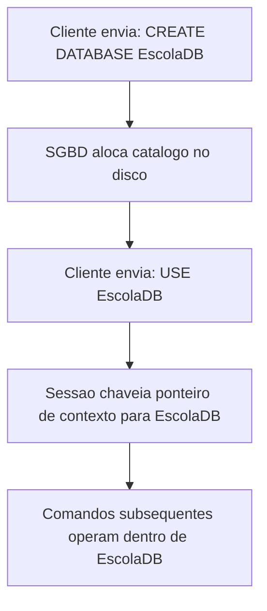

---

## Definição de Tabelas e Tipos de Dados (CREATE TABLE, PRIMARY KEY, DECIMAL, DATE)

### Definição
A instrução `CREATE TABLE` formaliza o esquema de uma relação no modelo relacional. Cada coluna deve possuir um identificador válido, um domínio estrito (tipo de dado) e restrições de integridade. A restrição `PRIMARY KEY` impõe unicidade funcional e obrigatoriedade de valor (`NOT NULL`) sobre uma ou mais colunas, definindo a identidade relacional da tupla.

Os tipos de dados empregados na base `EscolaDB` incluem:
- `INT`: Inteiro de 32 bits para chaves primárias e quantificadores discretos (ex: `Idade`).
- `VARCHAR(N)`: Vetor de caracteres de tamanho variável com teto de $N$ bytes/caracteres. Aloca apenas os caracteres digitados mais os bytes de cabeçalho de comprimento.
- `CHAR(N)`: Vetor de caracteres de tamanho fixo. Sempre aloca exatamente $N$ caracteres, completando com espaços em branco (*padding*) à direita se o texto for menor. Ideal para siglas de estados (`CHAR(2)`) e unidades de medida (`CHAR(2)`).
- `DECIMAL(P, S)`: Ponto fixo exato, onde $P$ é a precisão total de dígitos significativos e $S$ é a escala (casas decimais após a vírgula). Fundamental para valores monetários (`DECIMAL(10,2)` suporta até 8 dígitos inteiros e 2 decimais com precisão aritmética exata, sem os erros de arredondamento inerentes a números de ponto flutuante binário como `FLOAT` e `DOUBLE`).
- `DATE`: Armazena datas no formato padrão ISO-8601 (`AAAA-MM-DD`), cobrindo o intervalo de '1000-01-01' a '9999-12-31'.

### Motivação
A tipagem rígida garante a integridade de domínio (uma coluna `Idade INT` não aceita a string `"vinte"`). O uso de chaves primárias impede a inserção de registros duplicados que violariam a primeira forma normal e as regras de unicidade de entidades.

### Exemplo do Material
```sql
CREATE TABLE CLIENTES (
    CodCliente INT PRIMARY KEY,
    NomeCliente VARCHAR(100),
    EndCliente VARCHAR(150),
    Estado CHAR(2),
    Idade INT
);

CREATE TABLE PRODUTO (
    CodigoProduto INT PRIMARY KEY,
    Descricao VARCHAR(100),
    Unidade CHAR(2),
    Val_Unit DECIMAL(10,2)
);

CREATE TABLE VENDEDOR (
    CodigoVendedor INT PRIMARY KEY,
    NomeVendedor VARCHAR(100),
    Salario_Fixo DECIMAL(10,2)
);

CREATE TABLE ALUNO (
    Matricula INT PRIMARY KEY,
    Nome_Aluno VARCHAR(100),
    Data_Nasc DATE,
    Cidade VARCHAR(50)
);
```

### Contraexemplo e Armadilhas
Usar `FLOAT` ou `DOUBLE` para representar moeda:
```sql
-- ERRADO: Inadequado para sistemas financeiros devido a aproximacao de ponto flutuante
Val_Unit FLOAT
-- CORRETO: Ponto fixo exato
Val_Unit DECIMAL(10,2)
```
Outro erro grave é inverter a precisão e escala em `DECIMAL`: `DECIMAL(2,10)` gerará erro de sintaxe imediato, pois a escala não pode ser superior à precisão.

### Tabela Comparativa de Tipos de Dados
| Tipo de Dado | Domínio Típico | Comportamento de Armazenamento | Melhor Caso de Uso |
| :--- | :--- | :--- | :--- |
| `INT` | $-2^{31}$ a $2^{31}-1$ | 4 bytes fixos | Chaves artificiais, contadores, idades |
| `VARCHAR(100)` | 0 a 100 caracteres | Tamanho real do texto + 1 byte de tamanho | Nomes, logradouros, descrições |
| `CHAR(2)` | Exatamente 2 caracteres | 2 bytes fixos com preenchimento | UF (`SP`, `RJ`), Unidade (`UN`, `M `) |
| `DECIMAL(10,2)` | 10 dígitos totais, 2 decimais | Armazenamento exato em base decimal | Preços, salários, alíquotas fiscais |
| `DATE` | '1000-01-01' a '9999-12-31' | 3 bytes fixos | Data de nascimento, datas de vencimento |

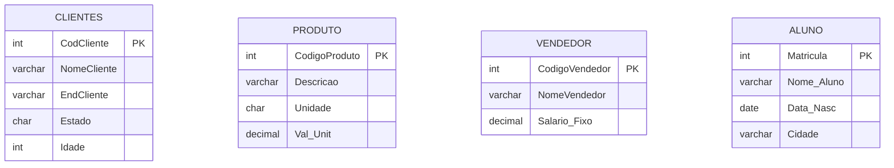

---

## Inserção e Carga Inicial de Dados (INSERT INTO)

### Definição
O comando `INSERT INTO` é a instrução DML fundamental para a criação de novas tuplas em uma tabela existente. Na forma posicional padrão sem declaração explícita da lista de colunas, os valores fornecidos na cláusula `VALUES` devem obedecer com exatidão à ordem ordinal em que os atributos foram definidos no comando `CREATE TABLE`.

### Motivação
A carga de dados viabiliza a execução de testes funcionais, validação de regras de integridade e consultas em cenários reais de aplicação.

### Exemplo do Material
```sql
INSERT INTO CLIENTES VALUES
(1, 'Ana Silva', 'Rua A', 'SP', 25),
(2, 'Bruno Souza', 'Rua B', 'RJ', 30),
(3, 'Carlos Lima', 'Rua C', 'SP', 22),
(4, 'Daniela Rocha', 'Rua D', 'MG', 28);

INSERT INTO PRODUTO VALUES
(1, 'Caneta', 'UN', 1.50),
(2, 'Caderno', 'UN', 10.00),
(3, 'Tecido', 'M', 2.00),
(4, 'Linha', 'M', 0.50);

INSERT INTO VENDEDOR VALUES
(1, 'João', 2500),
(2, 'Maria', 3000),
(3, 'Pedro', 4500);

INSERT INTO ALUNO VALUES
(1, 'Lucas', '1990-05-10', 'Campinas'),
(2, 'Mariana', '1985-08-20', 'São Paulo'),
(3, 'Rafael', '2000-01-15', 'Campinas');
```

### Contraexemplo e Armadilhas
1. **Violação de Chave Primária:** Tentar inserir um novo cliente com `CodCliente = 1` resultará em erro fatal de violação de unicidade (`Duplicate entry '1' for key 'PRIMARY'`).
2. **Formatação de Data:** Inserir datas no padrão brasileiro (`'10/05/1990'`) fará a consulta falhar ou gravar a data corrompida. Em SQL ANSI, datas literais devem estar no formato ISO `'AAAA-MM-DD'`.
3. **Ordem Omitida:** Se a tabela for futuramente alterada com um `ALTER TABLE` adicionando uma coluna no meio, scripts que usam `INSERT INTO TABELA VALUES (...)` sem a lista explícita de colunas quebrarão instantaneamente.

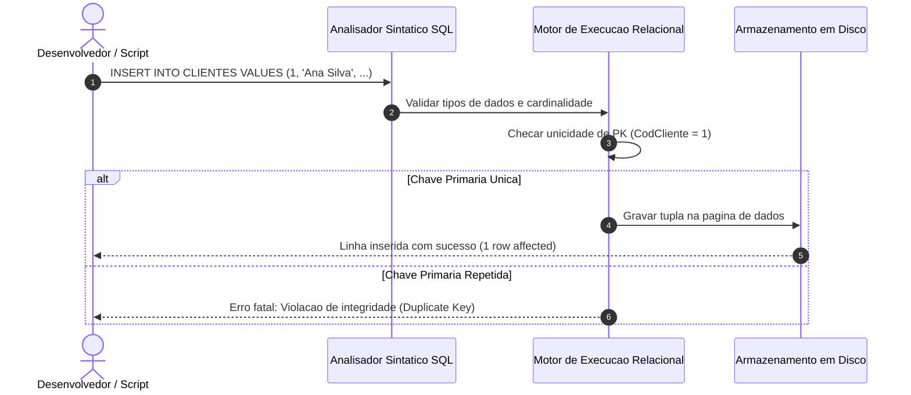

---

## Projeção e Consultas Básicas (SELECT, SELECT com colunas específicas)

### Definição
A projeção é a operação da álgebra relacional denotada por $\pi_{A_1, A_2, \dots, A_n}(R)$, que extrai um subconjunto vertical de colunas de uma relação $R$, descartando as colunas não solicitadas. No SQL, a projeção é materializada na cláusula `SELECT`. O caractere curinga asterisco (`*`) solicita a projeção de todas as colunas declaradas no dicionário de dados da relação.

### Motivação
Em sistemas em produção, projetar apenas as colunas necessárias reduz o consumo de memória RAM do servidor, minimiza o tráfego de rede (I/O de rede) e viabiliza a utilização de índices cobertos (*covering indexes*), otimizando drasticamente o desempenho de sistemas corporativos.

### Exemplo do Material
```sql
-- Projecao total: todas as colunas da tabela CLIENTES
SELECT * FROM CLIENTES;

-- Projecao restrita verticalmente: apenas NomeCliente e Estado
SELECT NomeCliente, Estado FROM CLIENTES;
```

### Contraexemplo e Armadilhas
O uso sistemático de `SELECT *` em sistemas de produção (código de backend em APIs) é um antipadrão clássico. Se uma tabela ganhar colunas pesadas (`BLOB`, `TEXT` ou dezenas de colunas extras), consultas usando `SELECT *` consumirão I/O e memória desnecessários.

### Tabela Comparativa de Abordagens de Projeção
| Sintaxe | Operação Algébrica | Volume de Tráfego | Resiliência a Mudanças de Schema |
| :--- | :--- | :--- | :--- |
| `SELECT * FROM R;` | Projeção total ($\pi_{\text{todas}}$) | Alto (retorna todos os bytes de cada tupla) | Baixa (quebra mapeamentos ORM estritos) |
| `SELECT C1, C2 FROM R;` | Projeção seletiva ($\pi_{C1, C2}$) | Mínimo (apenas os bytes das colunas) | Alta (isolada contra adição de novas colunas) |

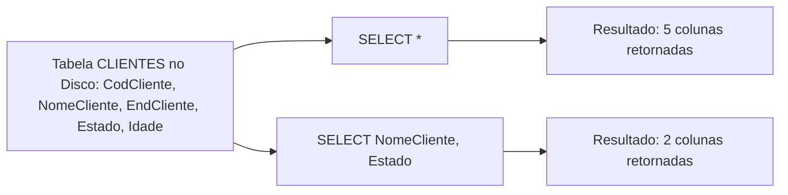

---

## Ordenação Simples e Composta (ORDER BY ASC/DESC)

### Definição
Por definição relacional fundamentada na Teoria dos Conjuntos de Codd, uma relação é um conjunto não ordenado de tuplas. O SGBD não oferece garantia determinística de ordenação física de recuperação a menos que a consulta contenha uma cláusula explícita `ORDER BY`. 

A cláusula `ORDER BY` aceita:
- `ASC` (Ascendente): Ordena do menor para o maior (padrão implícito). Ordem alfabética (A-Z) para strings, cronológica para datas e crescente para números.
- `DESC` (Descendente): Ordena do maior para o menor (Z-A, cronologia inversa, decrescente).
- Ordenação composta: Múltiplas colunas separadas por vírgula (`ORDER BY C1 ASC, C2 DESC`), onde $C_2$ atua exclusivamente como critério de desempate quando houver valores idênticos em $C_1$.

### Motivação
Apresentar informações de forma legível para relatórios, interfaces de usuário e agrupamentos lógicos (por exemplo, agrupar todos os clientes por estado e, dentro de cada estado, listá-los do mais velho ao mais novo).

### Exemplo do Material
```sql
-- Ordenacao simples alfabetica (crescente por padrao)
SELECT * FROM CLIENTES 
ORDER BY NomeCliente;

-- Ordenacao composta: Estado como criterio primario, Idade como desempate
SELECT * FROM CLIENTES 
ORDER BY Estado, Idade;
```

### Contraexemplo e Armadilhas
Confundir a precedência de ordenação em múltiplos atributos:
```sql
-- Se o aluno desejar ordenar Estado crescente e Idade decrescente, ele DEVE declarar explicitamente:
SELECT * FROM CLIENTES ORDER BY Estado ASC, Idade DESC;

-- CUIDADO: Se escrever:
SELECT * FROM CLIENTES ORDER BY Estado, Idade DESC;
-- Apenas 'Idade' sera DESC; 'Estado' continuara ASC por ser o padrao.
```

### Tabela Comparativa de Ordenação
| Comando | 1º Critério | 2º Critério | Exemplo de Saída Ordenada |
| :--- | :--- | :--- | :--- |
| `ORDER BY NomeCliente` | Nome (A-Z) | N/A | Ana Silva, Bruno Souza, Carlos Lima |
| `ORDER BY Estado, Idade` | Estado (A-Z) | Idade (Menor p/ Maior) | MG (28), RJ (30), SP (22), SP (25) |
| `ORDER BY Estado ASC, Idade DESC` | Estado (A-Z) | Idade (Maior p/ Menor) | MG (28), RJ (30), SP (25), SP (22) |

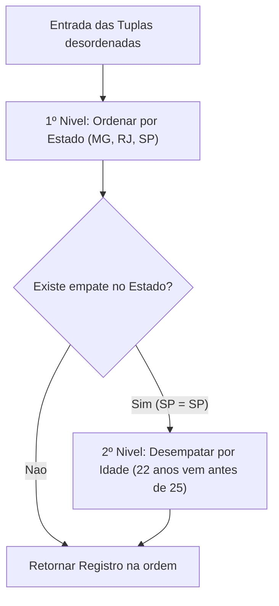

---

## Filtros Condicionais Simples (WHERE)

### Definição
O filtro condicional é a materialização direta da operação de Seleção ($\sigma_p(R)$) da Álgebra Relacional. A cláusula `WHERE` introduz um predicado booleano $p$. Para cada tupla avaliada, o predicado resulta em `TRUE`, `FALSE` ou `UNKNOWN` (lógica trivalente decorrente de valores `NULL`). Apenas as tuplas cujo predicado é avaliado como estritamente `TRUE` compõem o conjunto retornado.

### Motivação
Bancos corporativos operam com milhões de registros. Consultar e processar a totalidade de uma tabela quando o usuário ou relatório necessita de registros de uma região ou categoria específica sobrecarrega o hardware e invalida a utilidade do sistema.

### Exemplo do Material
```sql
-- Restricao de igualdade de caracteres
SELECT * FROM CLIENTES 
WHERE Estado = 'SP';

-- Restricao de desigualdade aritmetica de magnitude
SELECT * FROM CLIENTES 
WHERE Idade > 25;
```

### Contraexemplo e Armadilhas
Em SQL, literais de texto e datas **devem** ser delimitados por aspas simples (`'SP'`). O uso de aspas duplas pode ser interpretado pelo SGBD como identificador de coluna (dependendo da configuração de modo ANSI do motor SQL), resultando em erro:
```sql
-- ERRADO: O motor pode procurar uma coluna chamada SP
SELECT * FROM CLIENTES WHERE Estado = "SP";

-- CORRETO:
SELECT * FROM CLIENTES WHERE Estado = 'SP';
```
Outra armadilha é esquecer a sensibilidade a maiúsculas/minúsculas (*Collation* do banco). Se a collation for binária (`utf8mb4_bin`), `'sp'` não localizará `'SP'`.

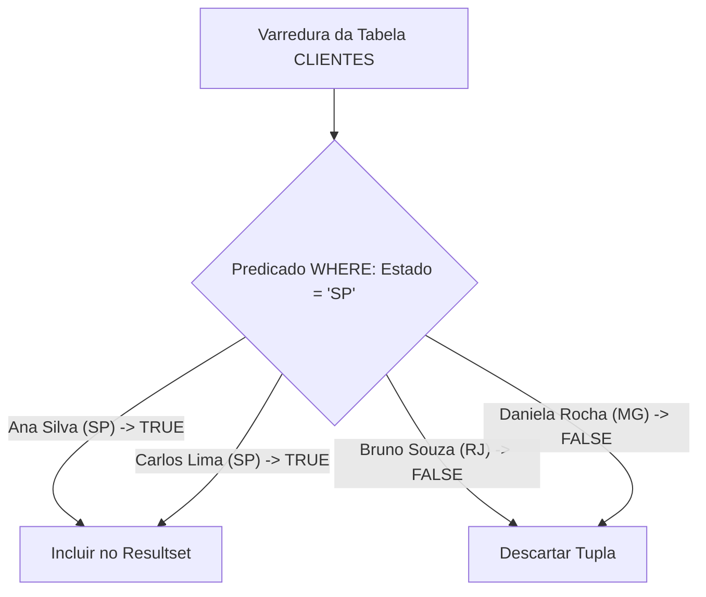

---

## Combinação de Filtro e Ordenação (WHERE + ORDER BY)

### Definição
A combinação sintática `WHERE + ORDER BY` une a restrição horizontal de linhas à organização posicional do conjunto resultante. Em termos de semântica de execução, a filtragem das tuplas ocorre invariavelmente **antes** da operação de ordenação.

### Motivação
Apresentar resultados restritos a um domínio de negócio específico organizados sob um critério de ordenação legível (por exemplo: listar os clientes do estado de São Paulo dispostos em ordem alfabética).

### Exemplo do Material
```sql
SELECT * FROM CLIENTES 
WHERE Estado = 'SP' 
ORDER BY NomeCliente;
```

### Ordem Lógica do Pipeline de Execução (SQL Processing Engine)
O acadêmico de engenharia de software deve compreender que a ordem em que a consulta é escrita é distinta da ordem em que o processador do SGBD a executa:

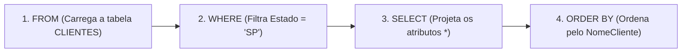

### Contraexemplo e Armadilhas
Inversão de sintaxe estrutural: O SQL possui uma gramática formal rígida. Escrever `ORDER BY` antes do `WHERE` resulta em erro sintático no analisador léxico:
```sql
-- ERRADO: Quebra da gramatica formal SQL
SELECT * FROM CLIENTES 
ORDER BY NomeCliente 
WHERE Estado = 'SP'; -- Erro de sintaxe (Syntax error near WHERE)
```

---

## Operadores Relacionais de Comparação (>, <=)

### Definição
Os operadores relacionais de comparação testam a relação de ordem ou igualdade entre duas expressões escalares. Em bancos de dados relacionais, operam sobre dados numéricos, alfanuméricos e cronológicos.

Os operadores matemáticos fundamentais incluem:
- `>`: Maior que estrito.
- `<`: Menor que estrito.
- `>=`: Maior ou igual (inclusivo).
- `<=`: Menor ou igual (inclusivo).
- `=`: Igualdade relacional.
- `<>` ou `!=`: Desigualdade relacional.

### Motivação
Permitir a quantificação precisa de estoques, limites de crédito, faixas de preços e limiares operacionais de entidades corporativas.

### Exemplo do Material
```sql
-- Produtos cujo valor unitario excede estritamente 2.00
SELECT * FROM PRODUTO 
WHERE Val_Unit > 2.00;

-- Produtos cujo valor unitario eh de no maximo 2.00 (inclusivo)
SELECT * FROM PRODUTO 
WHERE Val_Unit <= 2.00;
```

### Tabela de Avaliação dos Dados da Tabela PRODUTO
Análise das tuplas de `PRODUTO` frente aos predicados relacionais:

| CodigoProduto | Descricao | Val_Unit | Val_Unit > 2.00 | Val_Unit <= 2.00 |
| :--- | :--- | :--- | :--- | :--- |
| 1 | Caneta | 1.50 | `FALSE` | `TRUE` (Retornado no `<=`) |
| 2 | Caderno | 10.00 | `TRUE` (Retornado no `>`) | `FALSE` |
| 3 | Tecido | 2.00 | `FALSE` (Limiar estrito) | `TRUE` (Retornado no `<=`) |
| 4 | Linha | 0.50 | `FALSE` | `TRUE` (Retornado no `<=`) |

### Contraexemplo e Armadilhas
A armadilha clássica do limiar estrito: se o analista busca itens que custam "até 2 reais", o uso de `< 2.00` descartará incorretamente o produto "Tecido", cujo valor é exatamente `2.00`. Para inclusão do limite superior, o operador correto é obrigatoriamente `<=`.

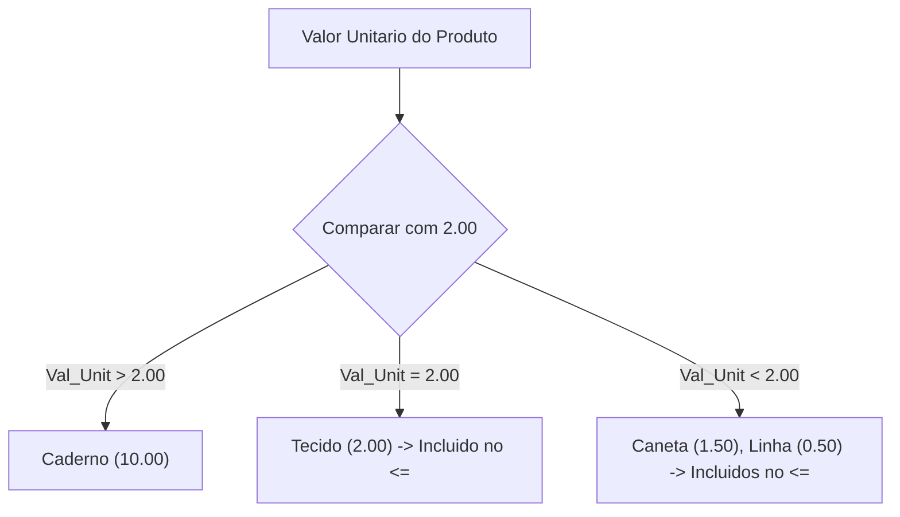

---

## Operadores Lógicos e Conjunção (AND)

### Definição
O operador lógico `AND` representa a operação booliana de conjunção binária ($\land$). Em uma expressão `P1 AND P2`, o predicado composto somente é avaliado como `TRUE` se, e somente se, ambos os operandos $P_1$ e $P_2$ forem individualmente avaliados como `TRUE`.

### Motivação
Filtrar registros que atendam cumulativamente a múltiplos requisitos de negócio concorrentes (por exemplo: localizar um produto que esteja dentro de uma janela orçamentária simultânea de piso e teto, ou filtrar alunos por localidade geográfica E idade mínima).

### Exemplo do Material
```sql
-- Produtos que satisfazem o piso de 0.50 E o teto de 10.00 simultaneamente
SELECT * FROM PRODUTO 
WHERE Val_Unit >= 0.50 AND Val_Unit <= 10.00;

-- Alunos que residem em Campinas E nasceram estritamente apos o ano de 1990
SELECT * FROM ALUNO 
WHERE Cidade = 'Campinas' AND Data_Nasc > '1990-12-31';
```

### Contraexemplo e Armadilhas
Comparação de tipos e coerção implícita: ao filtrar `Data_Nasc > 1990`, se o ano for fornecido como número inteiro puro (`1990`), o motor SQL pode interpretar a operação como uma subtração aritmética ou tentar converter a coluna `DATE` para inteiro, invalidando o uso de índices (conhecido como perda de *sargability*). A data deve ser expressa como string literal no formato `'AAAA-MM-DD'`.

### Tabela Verdade do Operador AND
| Operando $P_1$ | Operando $P_2$ | Resultado $P_1 \text{ AND } P_2$ |
| :--- | :--- | :--- |
| `TRUE` | `TRUE` | **`TRUE`** (Tupla Selecionada) |
| `TRUE` | `FALSE` | `FALSE` (Tupla Descartada) |
| `FALSE` | `TRUE` | `FALSE` (Tupla Descartada) |
| `FALSE` | `FALSE` | `FALSE` (Tupla Descartada) |

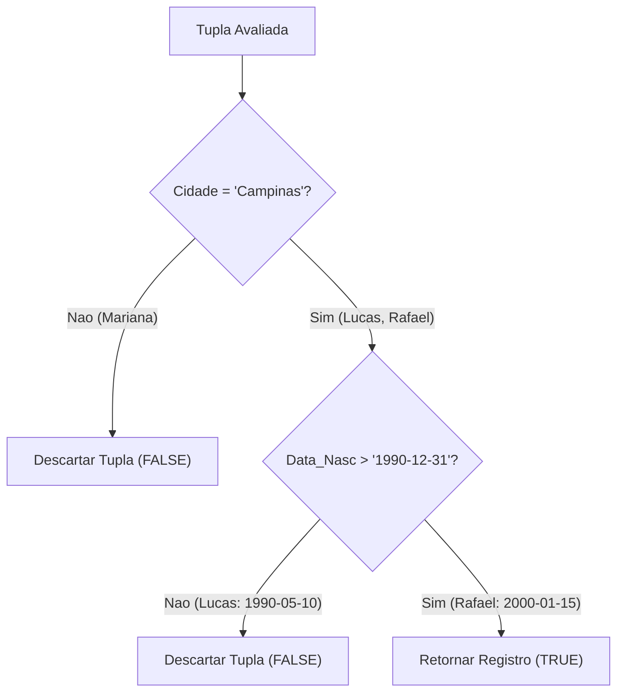

---

## Operadores Lógicos e Disjunção (OR)

### Definição
O operador lógico `OR` representa a disjunção binária ($\lor$). Em uma expressão condicional `P1 OR P2`, o resultado lógico será `TRUE` caso ao menos um dos predicados ($P_1$ ou $P_2$) seja avaliado como verdadeiro. A condição só resulta em `FALSE` se ambos os operandos forem simultaneamente falsos.

### Motivação
Recuperar conjuntos de dados heterogêneos onde múltiplos critérios aceitáveis são admitidos para a mesma análise de dados (exemplo: localizar vendedores que pertencem a categorias salariais específicas de R$ 2.500,00 ou R$ 3.000,00).

### Exemplo do Material
```sql
-- Vendedores com salario fixo igual a 2500 OU igual a 3000
SELECT * FROM VENDEDOR 
WHERE Salario_Fixo = 2500 OR Salario_Fixo = 3000;

-- Produtos com preco de 0.50 OU 2.00
SELECT * FROM PRODUTO 
WHERE Val_Unit = 0.50 OR Val_Unit = 2.00;
```

### Contraexemplo e Armadilhas
A armadilha clássica da elipse sintática da linguagem natural. No português falado dizemos: "Liste vendedores com salário 2500 ou 3000". O estudante tenta traduzir isso para SQL como:
```sql
-- ERRADO: Erro de sintaxe ou avaliacao booleana truncada
SELECT * FROM VENDEDOR WHERE Salario_Fixo = 2500 OR 3000;
```
Em SQL, o operador `OR` conecta **dois predicados completos**. O operando à direita do `OR` deve ser uma comparação relacional integral (`Salario_Fixo = 3000`).

### Tabela Verdade do Operador OR
| Operando $P_1$ | Operando $P_2$ | Resultado $P_1 \text{ OR } P_2$ |
| :--- | :--- | :--- |
| `TRUE` | `TRUE` | **`TRUE`** (Tupla Selecionada) |
| `TRUE` | `FALSE` | **`TRUE`** (Tupla Selecionada) |
| `FALSE` | `TRUE` | **`TRUE`** (Tupla Selecionada) |
| `FALSE` | `FALSE` | `FALSE` (Tupla Descartada) |

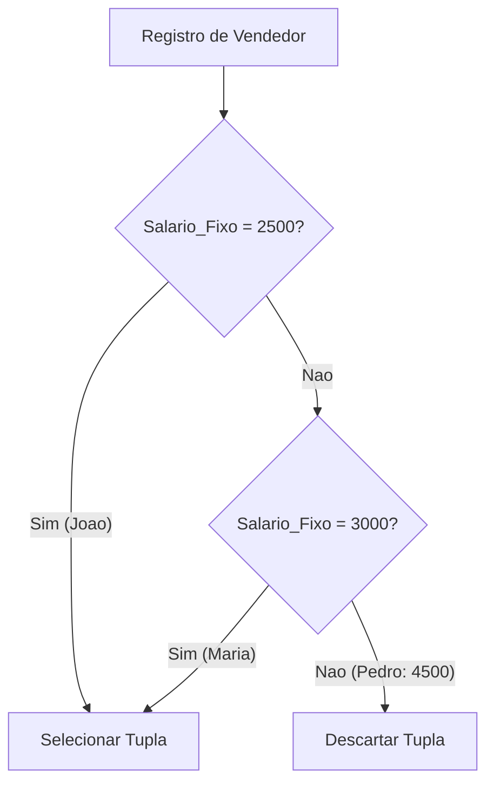

---

## Precedência e Combinação de Conjunção e Disjunção (AND + OR com parênteses)

### Definição
No padrão SQL, assim como na álgebra booleana formal, o operador de conjunção `AND` possui precedência de avaliação estritamente superior ao operador de disjunção `OR`. Isso significa que, na ausência de parênteses, a expressão:
$$A \text{ AND } B \text{ OR } C$$
é avaliada pelo compilador como:
$$(A \text{ AND } B) \text{ OR } C$$
Para alterar a ordem natural de avaliação e forçar a execução prévia da disjunção, é mandatório o uso de **parênteses**.

### Motivação
Permitir a combinação correta de filtros categóricos com filtros opcionais sem que tuplas indesejadas vazem para o conjunto de resposta.

### Exemplo do Material
O objetivo é: "Liste produtos da unidade 'M' com valor 0.50 ou 2.00".
```sql
-- CORRETO: O parenteses isola a disjuncao de precos, mantendo o filtro de unidade rigido
SELECT * FROM PRODUTO 
WHERE Unidade = 'M' AND (Val_Unit = 0.50 OR Val_Unit = 2.00);
```

### Contraexemplo e Armadilhas
A omissão dos parênteses altera completamente a semântica da regra de negócio:
```sql
-- ERRADO: Falha de precedencia booleana
SELECT * FROM PRODUTO 
WHERE Unidade = 'M' AND Val_Unit = 0.50 OR Val_Unit = 2.00;
```
**O que o SGBD faz sem parênteses?**
Ele avalia como: `(Unidade = 'M' AND Val_Unit = 0.50) OR (Val_Unit = 2.00)`.
Se existisse um produto como `"Caneta Especial", Unidade = 'UN', Val_Unit = 2.00`, ele seria retornado na consulta errada, violando o requisito de retornar apenas itens de unidade `'M'`.

### Tabela Comparativa de Avaliação de Precedência
| Linha Avaliada | Dados do Produto | Avaliação SEM Parênteses | Avaliação COM Parênteses |
| :--- | :--- | :--- | :--- |
| Caneta | `UN`, `1.50` | `FALSE OR FALSE` $\to$ `FALSE` | `FALSE AND (FALSE)` $\to$ `FALSE` |
| Caderno | `UN`, `10.00`| `FALSE OR FALSE` $\to$ `FALSE` | `FALSE AND (FALSE)` $\to$ `FALSE` |
| Tecido | `M`, `2.00` | `FALSE OR TRUE` $\to$ **`TRUE`** | `TRUE AND (TRUE)` $\to$ **`TRUE`** |
| Linha | `M`, `0.50` | `TRUE OR FALSE` $\to$ **`TRUE`** | `TRUE AND (TRUE)` $\to$ **`TRUE`** |
| *Exemplo Hipotético* | `UN`, `2.00` | `FALSE OR TRUE` $\to$ **`TRUE` (ERRO!)** | `FALSE AND (TRUE)` $\to$ **`FALSE` (CORRETO)** |

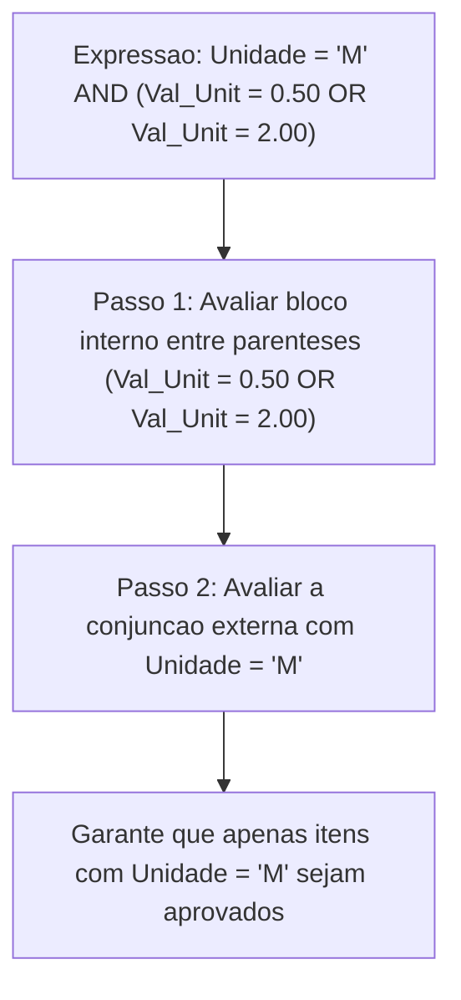

---

## Eliminação de Tuplas Duplicadas (DISTINCT)

### Definição
A cláusula `DISTINCT` instrui o motor de execução do SGBD a eliminar linhas duplicadas do conjunto projetado, garantindo que cada tupla no resultado final seja única. Enquanto o operador matemático de projeção $\pi$ da Álgebra Relacional elimina duplicatas por definição (já que relações são conjuntos matemáticos puros), a linguagem SQL opera com *multiconjuntos* (*bags*), retendo duplicatas por padrão para otimizar desempenho de I/O a menos que `DISTINCT` seja explicitamente invocado.

### Motivação
Identificar a amplitude de domínios cadastrados (por exemplo: descobrir quais estados brasileiros possuem clientes ativos sem exibir o mesmo estado repetidas vezes).

### Exemplo do Material
```sql
-- Retorna os estados distintos da tabela CLIENTES
SELECT DISTINCT Estado FROM CLIENTES;
```

### Contraexemplo e Armadilhas
1. `DISTINCT` opera sobre **toda a linha projetada**, e não apenas sobre a primeira coluna imediatamente após a palavra-chave.
```sql
-- O DISTINCT avalia a combinacao (Estado + NomeCliente)
SELECT DISTINCT Estado, NomeCliente FROM CLIENTES;
-- Como os nomes dos clientes sao distintos, os estados repetirao normalmente!
```
2. Custo de Performance: Executar `DISTINCT` em tabelas com milhões de registros obriga o SGBD a ordenar o conjunto em memória temporária (*TempDB/Sort Spill*) ou gerar uma tabela *hash* em memória para desduplicação, o que pode degradar a performance se usado sem necessidade.

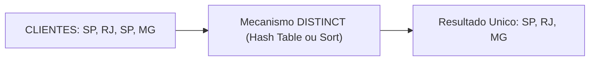

---

## Expressões e Operadores Aritméticos em Consultas (+, *, cálculo percentual e alias)

### Definição
A linguagem SQL permite a inclusão de expressões matemáticas escalares diretamente na cláusula `SELECT`. Os operadores aritméticos fundamentais incluem adição (`+`), subtração (`-`), multiplicação (`*`) e divisão (`/`). 

Para tornar as colunas calculadas legíveis e semanticamente identificáveis em camadas de software cliente, utiliza-se a palavra-chave `AS` para atribuir um **apelido** (*alias*) à coluna gerada.

### Motivação
Realizar projeções de simulação orçamentária, cálculos de reajustes inflacionários, comissões de vendas, bonificações salariais e margens de desconto diretamente no servidor de banco de dados, poupando processamento na camada de aplicação.

### Fórmulas Matemáticas de Reajuste
- **Aumento de $X\%$:** Multiplica-se o valor original por $(1 + \frac{X}{100})$. Logo, aumento de 10% corresponde a $\text{Valor} \times 1.10$. Aumento de 25% corresponde a $\text{Valor} \times 1.25$.
- **Desconto de $Y\%$:** Multiplica-se o valor original por $(1 - \frac{Y}{100})$. Logo, desconto de 12% corresponde a $\text{Valor} \times (1 - 0.12) = \text{Valor} \times 0.88$.

### Exemplo do Material
```sql
-- Salario com aumento de 10%
SELECT NomeVendedor, Salario_Fixo, Salario_Fixo * 1.10 AS Salario_Com_Aumento 
FROM VENDEDOR;

-- Preco dos produtos com aumento de 25%
SELECT Descricao, Val_Unit, Val_Unit * 1.25 AS Preco_Aumento_25 
FROM PRODUTO;

-- Preco dos produtos da unidade 'M' com desconto de 12%
SELECT Descricao, Unidade, Val_Unit, Val_Unit * 0.88 AS Preco_Com_Desconto 
FROM PRODUTO 
WHERE Unidade = 'M';
```

### Contraexemplo e Armadilhas
Utilizar o *alias* da coluna dentro da cláusula `WHERE` da mesma consulta:
```sql
-- ERRADO: Causa erro 'Unknown column NovoSalario'
SELECT NomeVendedor, Salario_Fixo * 1.10 AS NovoSalario
FROM VENDEDOR
WHERE NovoSalario > 3000;
```
**Por que isso falha?**
Conforme visto no pipeline de execução, a cláusula `WHERE` é processada pelo SGBD **antes** da cláusula `SELECT`. No momento em que o filtro do `WHERE` avalia as tuplas, o alias `NovoSalario` ainda não existe no contexto de execução do motor relacional.

### Tabela Comparativa de Fórmulas e Aliases
| Objetivo | Expressão Algébrica | Implementação SQL | Alias Recomendado |
| :--- | :--- | :--- | :--- |
| Aumento de 10% | $S + (S \times 0.10)$ ou $S \times 1.10$ | `Salario_Fixo * 1.10` | `Salario_Reajustado` |
| Aumento de 25% | $P \times 1.25$ | `Val_Unit * 1.25` | `Preco_Com_Aumento` |
| Desconto de 12% | $P \times (1 - 0.12)$ | `Val_Unit * 0.88` | `Preco_Promocional` |

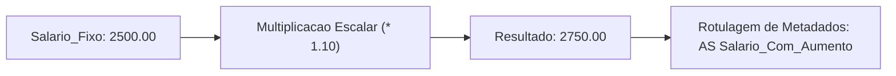

---

## Filtragem por Faixa e Intervalo de Valores (BETWEEN)

### Definição
O operador `BETWEEN` é um operador ternário que testa se um valor escalar pertence a um intervalo fechado (inclusivo) delimitado por um limite inferior e um limite superior.
A sintaxe canônica:
```sql
expressao BETWEEN limite_inferior AND limite_superior
```
é semanticamente e logicamente idêntica à conjunção relacional:
```sql
expressao >= limite_inferior AND expressao <= limite_superior
```

### Motivação
Aumentar a legibilidade do código SQL e facilitar o trabalho dos otimizadores de consulta na identificação de buscas por intervalo (*Index Range Scans*), especialmente ao lidar com sequências numéricas e janelas temporais de datas.

### Exemplo do Material
```sql
-- Vendedores com salario entre 2000 e 4000 (inclusivo)
SELECT * FROM VENDEDOR 
WHERE Salario_Fixo BETWEEN 2000 AND 4000;

-- Alunos nascidos entre 1985 e 2000 (intervalo temporal fechado)
SELECT * FROM ALUNO 
WHERE Data_Nasc BETWEEN '1985-01-01' AND '2000-12-31';
```

### Contraexemplo e Armadilhas
1. **Inversão de Limites:** O operador `BETWEEN` requer estritamente que o primeiro operando seja o **limite inferior** e o segundo seja o **limite superior**. Escrever `BETWEEN 4000 AND 2000` fará a consulta retornar zero linhas, pois nenhuma tupla atende a condição $X \ge 4000 \land X \le 2000$.
2. **Inclusividade:** O `BETWEEN` é **inclusivo**. Se o desenvolvedor desejava valores estritamente maiores que 2000 e menores que 4000, o uso de `BETWEEN` retornará indevidamente o vendedor que ganha exatamente 2000 ou 4000. Nesse caso, deve-se usar operadores estritos (`> 2000 AND < 4000`).
3. **Truncamento de Datas com Horário (`DATETIME`):** Ao aplicar `BETWEEN '1985-01-01' AND '2000-01-01'` sobre campos de data e hora, o limite superior é interpretado como `2000-01-01 00:00:00`. Qualquer evento ocorrido no decorrer do dia 01/01/2000 (como `14:30:00`) será excluído da consulta. Para o tipo `DATE` puro da nossa aula, o intervalo cobrindo os anos inteiros de 1985 a 2000 deve se estender até `'2000-12-31'`.

### Tabela Comparativa de Equivalência Lógica
| Sintaxe com BETWEEN | Equivalência Canônica com AND | Comportamento com Limites (Piso/Teto) |
| :--- | :--- | :--- |
| `Val BETWEEN 2000 AND 4000` | `Val >= 2000 AND Val <= 4000` | Ambos são incluídos no resultado |
| `Val NOT BETWEEN 2000 AND 4000` | `Val < 2000 OR Val > 4000` | Ambos são excluídos do resultado |

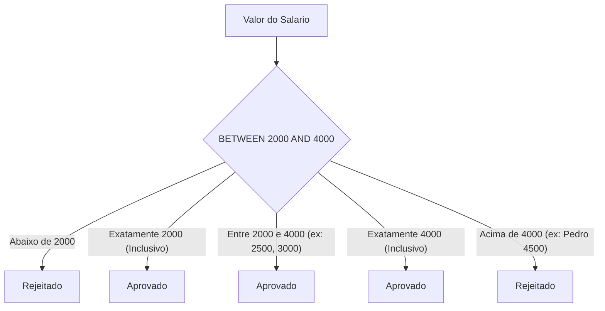

---

## Código da aula

Os scripts desenvolvidos para esta aula encontram-se estruturados em dois módulos principais no diretório de suporte:

### Arquivo 1: Criacao e Carga de Dados
Link relativo do arquivo: [./codigo/exemplos.sql](./codigo/exemplos.sql)

O arquivo `./codigo/exemplos.sql` contempla a infraestrutura de banco de dados completa. Ele inicializa o catálogo `EscolaDB`, define as quatro tabelas relacionais com tipagem estrita e insere os registros base apresentados pelo professor Guilherme de Morais.

Trecho essencial comentado linha a linha:
```sql
-- Linha 1: Remove banco preexistente para garantir idempotencia na execucao
DROP DATABASE IF EXISTS EscolaDB;

-- Linha 4: Instancia o catalogo do banco de dados relacional
CREATE DATABASE EscolaDB;

-- Linha 7: Seleciona o contexto de execucao para a conexao corrente
USE EscolaDB;

-- Linha 10 a 16: Criacao da entidade CLIENTES com chave primaria simples
CREATE TABLE CLIENTES (
    CodCliente INT PRIMARY KEY,       -- Chave primaria inteira, obrigatoria e unica
    NomeCliente VARCHAR(100),         -- Nome com comprimento flexivel de ate 100 caracteres
    EndCliente VARCHAR(150),          -- Endereco alfanumerico
    Estado CHAR(2),                   -- Sigla de estado em tamanho estrito de 2 caracteres
    Idade INT                         -- Idade inteira
);

-- Linhas 19 a 24: Criacao da tabela PRODUTO com tipo exato monetario DECIMAL
CREATE TABLE PRODUTO (
    CodigoProduto INT PRIMARY KEY,
    Descricao VARCHAR(100),
    Unidade CHAR(2),
    Val_Unit DECIMAL(10,2)            -- 10 digitos no total, com 2 casas decimais exatas
);

-- Linhas 27 a 31: Criacao da tabela VENDEDOR
CREATE TABLE VENDEDOR (
    CodigoVendedor INT PRIMARY KEY,
    NomeVendedor VARCHAR(100),
    Salario_Fixo DECIMAL(10,2)
);

-- Linhas 34 a 39: Criacao da tabela ALUNO utilizando o tipo nativo DATE
CREATE TABLE ALUNO (
    Matricula INT PRIMARY KEY,
    Nome_Aluno VARCHAR(100),
    Data_Nasc DATE,                   -- Formato estrito 'AAAA-MM-DD'
    Cidade VARCHAR(50)
);

-- Insercoes em lote utilizando a semantica de multituplas
INSERT INTO CLIENTES VALUES
(1, 'Ana Silva', 'Rua A', 'SP', 25),
(2, 'Bruno Souza', 'Rua B', 'RJ', 30),
(3, 'Carlos Lima', 'Rua C', 'SP', 22),
(4, 'Daniela Rocha', 'Rua D', 'MG', 28);

INSERT INTO PRODUTO VALUES
(1, 'Caneta', 'UN', 1.50),
(2, 'Caderno', 'UN', 10.00),
(3, 'Tecido', 'M', 2.00),
(4, 'Linha', 'M', 0.50);

INSERT INTO VENDEDOR VALUES
(1, 'João', 2500),
(2, 'Maria', 3000),
(3, 'Pedro', 4500);

INSERT INTO ALUNO VALUES
(1, 'Lucas', '1990-05-10', 'Campinas'),
(2, 'Mariana', '1985-08-20', 'São Paulo'),
(3, 'Rafael', '2000-01-15', 'Campinas');
```

### Arquivo 2: Resolucao das Questoes Praticas
Link relativo do arquivo: [./codigo/exercicios.sql](./codigo/exercicios.sql)

O arquivo `./codigo/exercicios.sql` consolida as vinte consultas SQL resolvidas e categorizadas de acordo com as seções da aula, servindo como gabarito de consulta para conferência e execução no terminal SQL.

---

## Exercícios

Abaixo constam as vinte questões práticas propostas pelo professor Guilherme de Morais, acompanhadas do raciocínio analítico da álgebra relacional, resolução em SQL comentada e referência de arquivo.

### Exercício 1 - Consulta Geral de Clientes
- **Enunciado:** Liste todos os dados da tabela `CLIENTES`.
- **Raciocínio:** Trata-se de uma projeção irrestrita ($\pi$) sobre todas as tuplas da relação sem aplicação de operador de seleção ($\sigma$). Utiliza-se o caractere asterisco (`*`) para projetar todas as colunas.
- **Resolução Comentada:**
```sql
-- Exercicio 1: Projecao irrestrita de todas as tuplas e colunas de CLIENTES
SELECT * 
FROM CLIENTES;
```
*Link para o arquivo de script:* [./codigo/exercicios.sql](./codigo/exercicios.sql)

---

### Exercício 2 - Projeção de Nome e Estado dos Clientes
- **Enunciado:** Liste apenas `NomeCliente` e `Estado`.
- **Raciocínio:** Aplica-se a operação de projeção formal $\pi_{\text{NomeCliente}, \text{Estado}}(\text{CLIENTES})$, restringindo verticalmente a recuperação dos dados e otimizando a largura da tupla resultante.
- **Resolução Comentada:**
```sql
-- Exercicio 2: Projecao vertical seletiva de duas colunas
SELECT NomeCliente, Estado 
FROM CLIENTES;
```
*Link para o arquivo de script:* [./codigo/exercicios.sql](./codigo/exercicios.sql)

---

### Exercício 3 - Ordenação de Clientes por Nome
- **Enunciado:** Liste os clientes ordenados por nome.
- **Raciocínio:** Projeta-se o conjunto e aplica-se a cláusula `ORDER BY` sobre a coluna textual `NomeCliente`. O modificador ascendente (`ASC`) é o comportamento nativo implícito do motor SQL.
- **Resolução Comentada:**
```sql
-- Exercicio 3: Ordenacao alfabetica simples crescente (A-Z)
SELECT * 
FROM CLIENTES 
ORDER BY NomeCliente ASC;
```
*Link para o arquivo de script:* [./codigo/exercicios.sql](./codigo/exercicios.sql)

---

### Exercício 4 - Ordenação Múltipla por Estado e Idade
- **Enunciado:** Liste clientes ordenados por estado e idade.
- **Raciocínio:** Ordenação composta multinível. O SGBD organiza primariamente pelo atributo `Estado` e, na ocorrência de empate em valores de estado, aplica a coluna `Idade` como critério de desempate.
- **Resolução Comentada:**
```sql
-- Exercicio 4: Ordenacao composta com desempate por idade
SELECT * 
FROM CLIENTES 
ORDER BY Estado ASC, Idade ASC;
```
*Link para o arquivo de script:* [./codigo/exercicios.sql](./codigo/exercicios.sql)

---

### Exercício 5 - Filtro de Clientes por Estado
- **Enunciado:** Liste clientes do estado `'SP'`.
- **Raciocínio:** Operação de seleção $\sigma_{\text{Estado} = \text{'SP'}}(\text{CLIENTES})$. O predicado de igualdade relacional restringe as linhas retornadas exclusivamente àquelas cujo valor alfanumérico coincida com `'SP'`.
- **Resolução Comentada:**
```sql
-- Exercicio 5: Restricao horizontal condicional por igualdade de string
SELECT * 
FROM CLIENTES 
WHERE Estado = 'SP';
```
*Link para o arquivo de script:* [./codigo/exercicios.sql](./codigo/exercicios.sql)

---

### Exercício 6 - Filtro de Clientes com Idade Maior que 25
- **Enunciado:** Liste clientes com idade maior que 25.
- **Raciocínio:** Seleção algébrica $\sigma_{\text{Idade} > 25}(\text{CLIENTES})$. O operador relacional estrito `>` exclui o limite numérico 25, retornando apenas idades a partir de 26.
- **Resolução Comentada:**
```sql
-- Exercicio 6: Comparacao relacional estrita maior que 25
SELECT * 
FROM CLIENTES 
WHERE Idade > 25;
```
*Link para o arquivo de script:* [./codigo/exercicios.sql](./codigo/exercicios.sql)

---

### Exercício 7 - Filtro de Clientes de SP Ordenados por Nome
- **Enunciado:** Liste clientes de SP ordenados pelo nome.
- **Raciocínio:** Composição do operador de seleção horizontal com ordenação final: $\tau_{\text{NomeCliente}}(\sigma_{\text{Estado} = \text{'SP'}}(\text{CLIENTES}))$. O filtro do `WHERE` opera antes da ordenação física do `ORDER BY`.
- **Resolução Comentada:**
```sql
-- Exercicio 7: Filtragem geografica conjugada com organizacao alfabetica
SELECT * 
FROM CLIENTES 
WHERE Estado = 'SP' 
ORDER BY NomeCliente ASC;
```
*Link para o arquivo de script:* [./codigo/exercicios.sql](./codigo/exercicios.sql)

---

### Exercício 8 - Produtos com Valor Maior que 2.00
- **Enunciado:** Liste produtos com valor maior que 2.00.
- **Raciocínio:** Restrição condicional sobre coluna de ponto fixo `DECIMAL`. Seleciona tuplas onde o predicado `Val_Unit > 2.00` é verdadeiro. O produto com valor 2.00 é excluído.
- **Resolução Comentada:**
```sql
-- Exercicio 8: Filtragem estrita de preco unitario
SELECT * 
FROM PRODUTO 
WHERE Val_Unit > 2.00;
```
*Link para o arquivo de script:* [./codigo/exercicios.sql](./codigo/exercicios.sql)

---

### Exercício 9 - Produtos com Valor Menor ou Igual a 2.00
- **Enunciado:** Liste produtos com valor menor ou igual a 2.00.
- **Raciocínio:** Uso do operador relacional inclusivo `<=`. O limiar superior numérico de 2.00 faz parte da solução, garantindo a recuperação dos produtos "Caneta", "Linha" e "Tecido".
- **Resolução Comentada:**
```sql
-- Exercicio 9: Filtragem com operador menor ou igual inclusivo
SELECT * 
FROM PRODUTO 
WHERE Val_Unit <= 2.00;
```
*Link para o arquivo de script:* [./codigo/exercicios.sql](./codigo/exercicios.sql)

---

### Exercício 10 - Produtos com Faixa de Valor usando AND
- **Enunciado:** Liste produtos com valor entre 0.50 e 10.00.
- **Raciocínio:** Conjunção booleana binária formal utilizando a palavra-chave `AND`. Ambas as condições relacionais (`Val_Unit >= 0.50` e `Val_Unit <= 10.00`) devem ser avaliadas simultaneamente como `TRUE`.
- **Resolução Comentada:**
```sql
-- Exercicio 10: Intervalo fechado implementado via conjuncao logica AND
SELECT * 
FROM PRODUTO 
WHERE Val_Unit >= 0.50 AND Val_Unit <= 10.00;
```
*Link para o arquivo de script:* [./codigo/exercicios.sql](./codigo/exercicios.sql)

---

### Exercício 11 - Alunos de Campinas Nascidos Após 1990
- **Enunciado:** Liste alunos de Campinas com data de nascimento após 1990.
- **Raciocínio:** Conjunção entre um filtro alfanumérico e um filtro cronológico (`DATE`). Como o ano de nascimento deve ser posterior a 1990, a data estrita de corte é o último dia desse ano (`'1990-12-31'`).
- **Resolução Comentada:**
```sql
-- Exercicio 11: Conjuncao de igualdade textual e limite temporal em DATE
SELECT * 
FROM ALUNO 
WHERE Cidade = 'Campinas' AND Data_Nasc > '1990-12-31';
```
*Link para o arquivo de script:* [./codigo/exercicios.sql](./codigo/exercicios.sql)

---

### Exercício 12 - Vendedores com Salários Específicos usando OR
- **Enunciado:** Liste vendedores com salário 2500 ou 3000.
- **Raciocínio:** Disjunção lógica inclusiva ($\lor$). Uma tupla é retornada caso seu salário seja 2500 ou 3000. Expressa por dois predicados relacionais completos conectados por `OR`.
- **Resolução Comentada:**
```sql
-- Exercicio 12: Disjuncao logica entre duas condicoes de igualdade salarial
SELECT * 
FROM VENDEDOR 
WHERE Salario_Fixo = 2500 OR Salario_Fixo = 3000;
```
*Link para o arquivo de script:* [./codigo/exercicios.sql](./codigo/exercicios.sql)

---

### Exercício 13 - Produtos com Valores Específicos usando OR
- **Enunciado:** Liste produtos com valor 0.50 ou 2.00.
- **Raciocínio:** Disjunção aplicada sobre a tabela `PRODUTO`. A linha satisfaz a busca se o valor for exatamente igual a 0.50 ou igual a 2.00.
- **Resolução Comentada:**
```sql
-- Exercicio 13: Disjuncao de valores unitarios em PRODUTO
SELECT * 
FROM PRODUTO 
WHERE Val_Unit = 0.50 OR Val_Unit = 2.00;
```
*Link para o arquivo de script:* [./codigo/exercicios.sql](./codigo/exercicios.sql)

---

### Exercício 14 - Produtos por Unidade e Valores com AND e OR
- **Enunciado:** Liste produtos da unidade `'M'` com valor 0.50 ou 2.00.
- **Raciocínio:** Aplicação de regra de negócio mista. O requisito exige que a unidade seja estritamente `'M'` e que o valor seja 0.50 ou 2.00. Exige-se o uso de **parênteses** para forçar a avaliação prioritária da disjunção antes da conjunção.
- **Resolução Comentada:**
```sql
-- Exercicio 14: Precedencia explicita garantindo isolamento da unidade
SELECT * 
FROM PRODUTO 
WHERE Unidade = 'M' AND (Val_Unit = 0.50 OR Val_Unit = 2.00);
```
*Link para o arquivo de script:* [./codigo/exercicios.sql](./codigo/exercicios.sql)

---

### Exercício 15 - Estados Distintos de Clientes
- **Enunciado:** Liste os estados distintos dos clientes.
- **Raciocínio:** Projeção com eliminação de redundâncias e duplicatas. A cláusula `DISTINCT` consolida as ocorrências repetidas da coluna `Estado`, transformando a saída em um conjunto de valores únicos.
- **Resolução Comentada:**
```sql
-- Exercicio 15: Eliminacao de duplicatas na projecao de estados
SELECT DISTINCT Estado 
FROM CLIENTES;
```
*Link para o arquivo de script:* [./codigo/exercicios.sql](./codigo/exercicios.sql)

---

### Exercício 16 - Cálculo de Salário com Aumento de 10%
- **Enunciado:** Mostre salário com aumento de 10%.
- **Raciocínio:** Expressão aritmética escalar na projeção. O salário reajustado corresponde a multiplicar o `Salario_Fixo` pelo fator `1.10`. Atribui-se um *alias* à nova coluna virtual.
- **Resolução Comentada:**
```sql
-- Exercicio 16: Expressao aritmetica de reajuste percentual com apelido
SELECT CodigoVendedor, NomeVendedor, Salario_Fixo, 
       Salario_Fixo * 1.10 AS Salario_Com_Aumento 
FROM VENDEDOR;
```
*Link para o arquivo de script:* [./codigo/exercicios.sql](./codigo/exercicios.sql)

---

### Exercício 17 - Preço de Produtos com Aumento de 25%
- **Enunciado:** Mostre preço dos produtos com aumento de 25%.
- **Raciocínio:** Projeta-se o valor unitário multiplicado pelo fator $1 + 0.25 = 1.25$. O alias `Preco_Com_Aumento_25` identifica a projeção resultante.
- **Resolução Comentada:**
```sql
-- Exercicio 17: Calculo de acrescimo de 25% sobre o preco unitario
SELECT CodigoProduto, Descricao, Val_Unit, 
       Val_Unit * 1.25 AS Preco_Com_Aumento_25 
FROM PRODUTO;
```
*Link para o arquivo de script:* [./codigo/exercicios.sql](./codigo/exercicios.sql)

---

### Exercício 18 - Preço de Produtos de Unidade 'M' com Desconto de 12%
- **Enunciado:** Mostre preço dos produtos com desconto de 12% (unidade `'M'`).
- **Raciocínio:** Combinação de restrição horizontal com `WHERE Unidade = 'M'` e transformação escalar aritmética com fator de desconto $1 - 0.12 = 0.88$.
- **Resolução Comentada:**
```sql
-- Exercicio 18: Restricao condicional por unidade combinada com reducao percentual
SELECT CodigoProduto, Descricao, Unidade, Val_Unit, 
       Val_Unit * 0.88 AS Preco_Com_Desconto_12 
FROM PRODUTO 
WHERE Unidade = 'M';
```
*Link para o arquivo de script:* [./codigo/exercicios.sql](./codigo/exercicios.sql)

---

### Exercício 19 - Vendedores por Faixa Salarial com BETWEEN
- **Enunciado:** Liste vendedores com salário entre 2000 e 4000.
- **Raciocínio:** Utilização do operador de intervalo inclusivo `BETWEEN`, cobrindo de maneira fechada o piso de 2000.00 até o teto de 4000.00.
- **Resolução Comentada:**
```sql
-- Exercicio 19: Filtragem de intervalo salarial inclusivo via BETWEEN
SELECT * 
FROM VENDEDOR 
WHERE Salario_Fixo BETWEEN 2000 AND 4000;
```
*Link para o arquivo de script:* [./codigo/exercicios.sql](./codigo/exercicios.sql)

---

### Exercício 20 - Alunos Nascidos Entre 1985 e 2000 com BETWEEN
- **Enunciado:** Liste alunos nascidos entre 1985 e 2000.
- **Raciocínio:** Filtragem cronológica por faixa com `BETWEEN`. Para cobrir a integralidade dos anos civis solicitados, o limite inferior define o primeiro dia de 1985 (`'1985-01-01'`) e o limite superior define o último dia de 2000 (`'2000-12-31'`).
- **Resolução Comentada:**
```sql
-- Exercicio 20: Intervalo de datas abrangendo integralmente o periodo de 1985 a 2000
SELECT * 
FROM ALUNO 
WHERE Data_Nasc BETWEEN '1985-01-01' AND '2000-12-31';
```
*Link para o arquivo de script:* [./codigo/exercicios.sql](./codigo/exercicios.sql)

---

## Erros comuns e boas práticas

### 1. Omissão de Parênteses em Expressões Mistas (AND / OR)
- **Erro:** Escrever `WHERE A AND B OR C` assumindo que o `OR` será avaliado primeiro.
- **Impacto:** O SGBD avalia prioritariamente a conjunção `(A AND B)`, fazendo com que registros que atendem apenas a `C` vazem para a resposta final.
- **Boa Prática:** Sempre envolver blocos de disjunção (`OR`) com parênteses explícitos ao combiná-los com outros predicados.

### 2. Inversão dos Limites no Operador BETWEEN
- **Erro:** `WHERE Salario_Fixo BETWEEN 4000 AND 2000`.
- **Impacto:** O resultado será um conjunto vazio de dados, sem emitir mensagem explícita de erro sintático.
- **Boa Prática:** Certificar-se de declarar sempre a ordem `BETWEEN limite_inferior AND limite_superior`.

### 3. Tratamento Incorreto de Formatos de Data
- **Erro:** Inserir ou consultar datas no formato regional brasileiro (`'10/05/1990'`).
- **Impacto:** O SGBD rejeitará o comando com erro de formato inválido ou truncará a data de forma incorreta.
- **Boa Prática:** Empregar sem exceções o padrão internacional ISO-8601 (`'AAAA-MM-DD'`).

### 4. Uso Desnecessário de Projeções Totais (SELECT *)
- **Erro:** Utilizar `SELECT *` de forma irrestrita no código de produção de aplicações web e microsserviços.
- **Impacto:** Desperdício de I/O de disco, saturação de banda de rede e invalidação de estratégias de indexação por cobertura.
- **Boa Prática:** Projetar estritamente as colunas demandadas pela interface ou regra de negócio.

### 5. Utilização de Tipos de Ponto Flutuante Binário para Valores Monetários
- **Erro:** Declarar atributos de preço ou salário como `FLOAT` ou `DOUBLE`.
- **Impacto:** Acúmulo de dízimas periódicas binárias e erros de centavos em cálculos financeiros.
- **Boa Prática:** Padronizar todas as grandezas monetárias sob o tipo exato de ponto fixo `DECIMAL(P, S)` ou `NUMERIC(P, S)`.

---

## Links e materiais complementares

- **Repositório Oficial de Scripts da Disciplina:** Contém os arquivos [./codigo/exemplos.sql](./codigo/exemplos.sql) e [./codigo/exercicios.sql](./codigo/exercicios.sql) com a carga de dados e o gabarito comentado da base `EscolaDB`.
- **Documentação de Referência SQL ANSI/ISO:** Especificação formal da linguagem SQL, cobrindo semântica de tipos de dados, regras de precedência booleana e álgebra relacional aplicada.
- **Manual de Referência MySQL (Data Types e Query Execution):** Documentação técnica aprofundada cobrindo a implementação física de `DECIMAL`, `DATE` e a arquitetura de otimização de consultas por intervalo (*range optimizer*).
- **Ambiente de Testes Interativo (DB-Fiddle / SQL Fiddle):** Plataforma web para reprodução de esquemas relacionais, execução de planos de consulta e compartilhamento de casos de teste.

---

## Mapa da aula

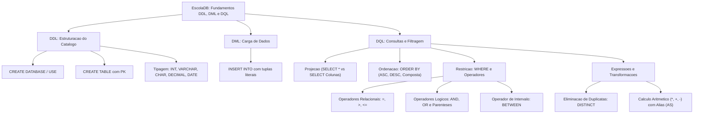

---

## Glossário

| Termo | Definição Técnica |
| :--- | :--- |
| **DDL (Data Definition Language)** | Subconjunto de comandos SQL responsáveis pela definição e modificação das estruturas e esquemas do banco de dados (ex: `CREATE`, `ALTER`, `DROP`). |
| **DML (Data Manipulation Language)** | Subconjunto de comandos SQL destinados à inserção, atualização e remoção de dados das tabelas (ex: `INSERT`, `UPDATE`, `DELETE`). |
| **DQL (Data Query Language)** | Subconjunto de comandos SQL focado na recuperação e consulta de dados (estruturado em torno do comando `SELECT`). |
| **Chave Primária (PRIMARY KEY)** | Restrição de integridade que identifica unicamente cada tupla em uma relação. Impõe obrigatoriedade de valor (`NOT NULL`) e unicidade (`UNIQUE`). |
| **Projeção ($\pi$)** | Operação unária da Álgebra Relacional que seleciona um subconjunto vertical de colunas de uma relação, descartando as demais. |
| **Seleção ou Restrição ($\sigma$)** | Operação unária da Álgebra Relacional que seleciona um subconjunto horizontal de tuplas que satisfazem a um predicado lógico especificado. |
| **DECIMAL(P, S)** | Tipo de dado de ponto fixo exato. $P$ representa a precisão (total de dígitos) e $S$ representa a escala (dígitos fracionários). |
| **DISTINCT** | Modificador da cláusula `SELECT` que instrui o motor relacional a eliminar tuplas idênticas duplicadas do conjunto projetado. |
| **ORDER BY** | Cláusula que define o ordenamento sequencial das tuplas retornadas com base em um ou mais critérios em ordem ascendente (`ASC`) ou descendente (`DESC`). |
| **BETWEEN** | Operador ternário que avalia se um valor escalar pertence a uma faixa inclusiva delimitada por limites inferior e superior. |
| **Alias (AS)** | Rótulo ou identificador alternativo temporário atribuído a uma coluna ou tabela para melhorar a legibilidade ou nomear colunas calculadas. |
| **Lógica Trivalente** | Sistema lógico adotado pelo SQL onde predicados podem resultar em `TRUE`, `FALSE` ou `UNKNOWN` (decorrente da presença de nulos). |

---

## Pontos-chave para a prova

- A instrução `USE NomeDB;` não altera o esquema de dados; ela altera o contexto da sessão ativa no cliente para evitar a qualificação explícita do catálogo em cada comando.
- O tipo `CHAR(N)` aloca espaço estático completando o tamanho com espaços em branco; o `VARCHAR(N)` aloca dinamicamente o tamanho do texto real mais bytes de cabeçalho de controle.
- Grandezas monetárias e contábeis devem ser tipadas obrigatoriamente com `DECIMAL(P, S)` para impedir perdas de arredondamento inerentes a números de ponto flutuante binário.
- Datas no padrão SQL ANSI utilizam o formato internacional rigoroso `'AAAA-MM-DD'`.
- O operador `AND` possui precedência de execução nativa superior ao operador `OR`. Na presença de condições combinadas, os parênteses devem ser utilizados para forçar o agrupamento correto dos predicados.
- A ordem lógica de execução do motor SQL processa a cláusula `WHERE` antes da cláusula `SELECT`. Por esse motivo, é proibido referenciar um *alias* de coluna criado no `SELECT` diretamente dentro do `WHERE`.
- O operador `BETWEEN valor_a AND valor_b` é um intervalo **inclusivo** (equivalente a $\ge \text{valor\_a} \land \le \text{valor\_b}$) e exige que o limite inferior seja posicionado antes do limite superior.
- A cláusula `ORDER BY` aceita múltiplos atributos separados por vírgula; o segundo atributo só é processado para registros que empatarem no valor do primeiro atributo.
- A desduplicação promovida por `SELECT DISTINCT` considera a totalidade das colunas que compõem a linha projetada, e não apenas a primeira coluna declarada.

---

## Perguntas e respostas (JSONL)

```jsonl
{"pergunta": "Qual a funcao da instrucao USE EscolaDB em um script SQL?", "resposta": "Direcionar o contexto da sessao ativa para o catalogo EscolaDB, tornando desnecessario prefixar o nome do banco nas tabelas.", "dificuldade": "facil"}
{"pergunta": "Por que o tipo DECIMAL(10,2) deve ser preferido a FLOAT para colunas de preco ou salario?", "resposta": "Porque o DECIMAL implementa ponto fixo exato, eliminando erros de aproximacao binaria inerentes ao ponto flutuante.", "dificuldade": "medio"}
{"pergunta": "Qual formato de literal de data eh suportado nativamente pelo padrao SQL ANSI em colunas DATE?", "resposta": "O padrao ISO-8601 delimitado por aspas simples no formato 'AAAA-MM-DD'.", "dificuldade": "facil"}
{"pergunta": "O que ocorre se a clausula ORDER BY for omitida em uma consulta SQL?", "resposta": "O SGBD nao garante nenhuma ordenacao deterministica, retornando as tuplas de acordo com a ordem fisica de varredura das paginas.", "dificuldade": "medio"}
{"pergunta": "Como o SGBD trata a ordenacao de criterios compostos como ORDER BY Estado, Idade?", "resposta": "Ordena primariamente por Estado e utiliza a coluna Idade exclusivamente como criterio de desempate para valores iguais de Estado.", "dificuldade": "medio"}
{"pergunta": "Qual operador relacional deve ser utilizado para recuperar valores ate 2.00 inclusive?", "resposta": "O operador menor ou igual (<=).", "dificuldade": "facil"}
{"pergunta": "Por que a consulta WHERE Unidade = 'M' AND Val_Unit = 0.50 OR Val_Unit = 2.00 falha na regra de negocio?", "resposta": "Devido a precedencia do AND, a consulta eh avaliada como (Unidade = 'M' AND Val_Unit = 0.50) OR (Val_Unit = 2.00), retornando produtos de outras unidades com preco 2.00.", "dificuldade": "dificil"}
{"pergunta": "Como corrigir a precedencia de operadores para que o filtro de unidade 'M' seja obrigatorio junto com os valores 0.50 ou 2.00?", "resposta": "Envolvendo a disjuncao em parenteses: WHERE Unidade = 'M' AND (Val_Unit = 0.50 OR Val_Unit = 2.00).", "dificuldade": "medio"}
{"pergunta": "O que o operador BETWEEN 2000 AND 4000 realiza internamente?", "resposta": "Avalia o predicado inclusivo de pertencer a uma faixa, equivalente a Salario_Fixo >= 2000 AND Salario_Fixo <= 4000.", "dificuldade": "facil"}
{"pergunta": "Qual o resultado de uma consulta que executa WHERE Salario_Fixo BETWEEN 4000 AND 2000?", "resposta": "Retorna zero registros, pois o limite inferior (4000) eh maior que o superior (2000), resultando em condicao logicamente impossivel.", "dificuldade": "medio"}
{"pergunta": "O que faz a clausula DISTINCT em uma projecao SQL?", "resposta": "Elimina tuplas duplicadas do conjunto resultante, garantindo que todas as linhas retornadas sejam distintas considerando todas as colunas projetadas.", "dificuldade": "facil"}
{"pergunta": "Por que nao eh permitido utilizar o apelido (alias) criado no SELECT dentro da clausula WHERE da mesma consulta?", "resposta": "Porque a clausula WHERE eh executada antes da clausula SELECT no pipeline logico de processamento do motor relacional.", "dificuldade": "dificil"}
{"pergunta": "Qual expressao matematica no SELECT calcula um aumento salarial de 10% sobre Salario_Fixo?", "resposta": "Salario_Fixo * 1.10.", "dificuldade": "facil"}
{"pergunta": "Qual expressao matematica no SELECT calcula um desconto comercial de 12% sobre Val_Unit?", "resposta": "Val_Unit * 0.88.", "dificuldade": "medio"}
{"pergunta": "Qual a diferenca fundamental entre os tipos CHAR(2) e VARCHAR(2)?", "resposta": "CHAR(2) aloca espaco fixo de 2 caracteres sempre preenchendo com espacos se menor; VARCHAR(2) aloca tamanho variavel de ate 2 caracteres mais bytes de controle.", "dificuldade": "medio"}
{"pergunta": "Em algebra relacional, qual operacao primitiva corresponde a clausula SELECT?", "resposta": "A operacao de Projecao (pi).", "dificuldade": "medio"}
{"pergunta": "Em algebra relacional, qual operacao primitiva corresponde a clausula WHERE?", "resposta": "A operacao de Selecao ou Restricao (sigma).", "dificuldade": "medio"}
```

---

## Checklist de revisão

- [ ] Sei criar um banco de dados relacional com `CREATE DATABASE` e selecionar seu contexto com `USE`.
- [ ] Compreendo a diferença física e lógica entre os tipos de dados `INT`, `VARCHAR`, `CHAR`, `DECIMAL` e `DATE`.
- [ ] Sei declarar chaves primárias (`PRIMARY KEY`) e conheço o impacto da garantia de unicidade de entidade.
- [ ] Consigo realizar a carga inicial de dados utilizando instruções `INSERT INTO` com valores literais ordenados.
- [ ] Sei projetar todas as colunas com `SELECT *` e selecionar colunas específicas com `SELECT Col1, Col2`.
- [ ] Domino a cláusula `ORDER BY`, incluindo ordenações simples, compostas e os modificadores `ASC` e `DESC`.
- [ ] Aplico filtros horizontais com a cláusula `WHERE` utilizando operadores relacionais (`=`, `>`, `<=`, `<>`).
- [ ] Sei construir expressões booleanas compostas utilizando conjunção (`AND`) e disjunção (`OR`).
- [ ] Compreendo a precedência do operador `AND` sobre o `OR` e sei isolar disjunções com parênteses obrigatórios.
- [ ] Sei eliminar linhas repetidas em relatórios projetados utilizando o comando `SELECT DISTINCT`.
- [ ] Consigo projetar colunas calculadas com operadores aritméticos escalares e atribuir apelidos semânticos com `AS`.
- [ ] Sei formular aumentos percentuais ($1 + X$) e descontos percentuais ($1 - Y$) diretamente na projeção SQL.
- [ ] Utilizo corretamente o operador de intervalo inclusivo `BETWEEN`, respeitando a ordem de piso e teto numérico/temporal.
- [ ] Compreendo o pipeline lógico de execução do motor SQL (FROM -> WHERE -> SELECT -> DISTINCT -> ORDER BY) e sei por que aliases do `SELECT` não funcionam no `WHERE`.
