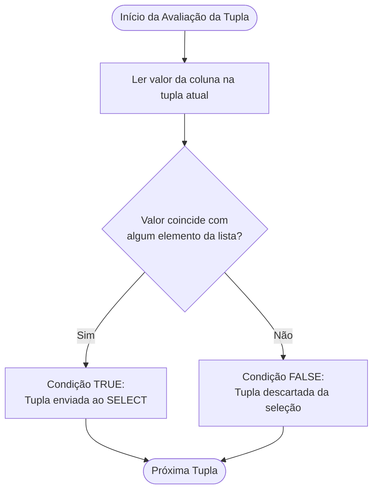
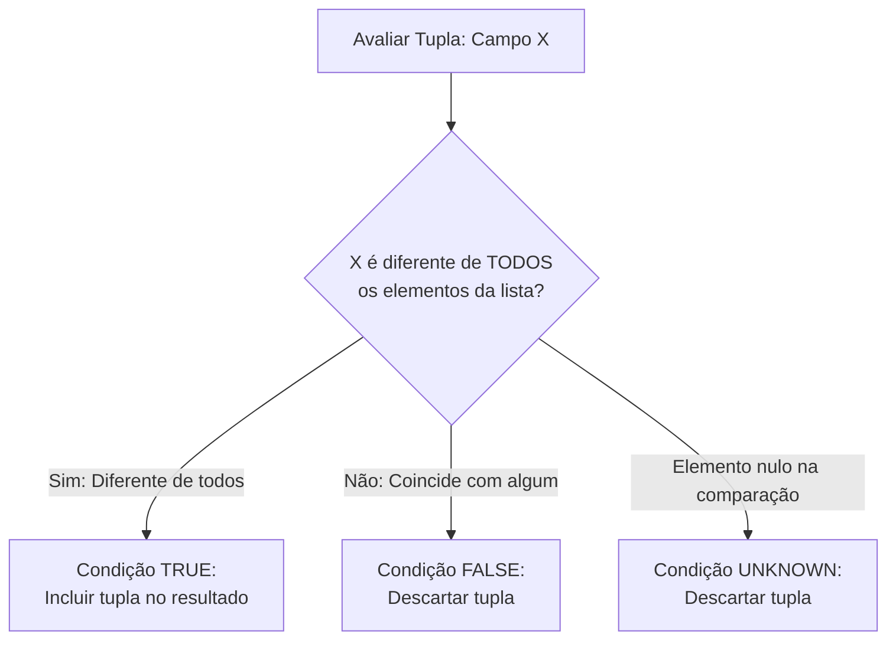
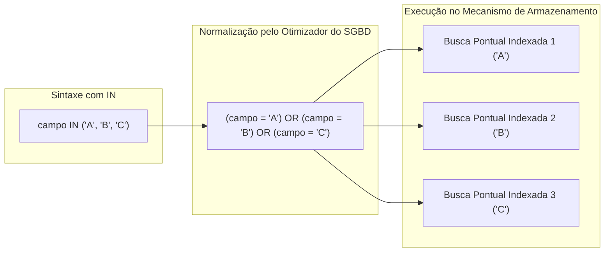
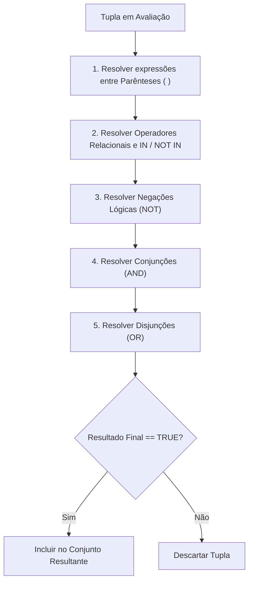
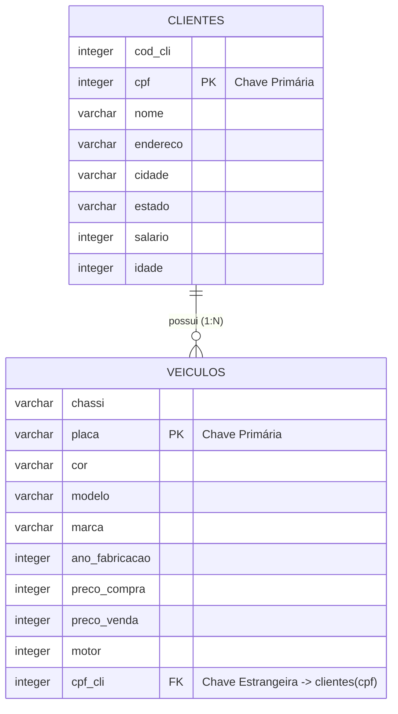
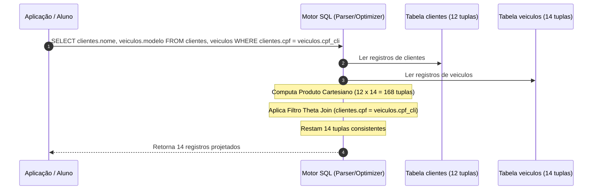
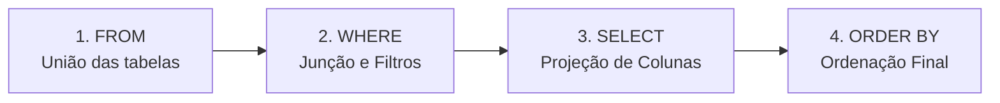
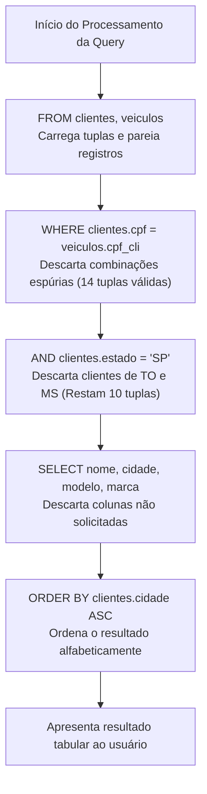
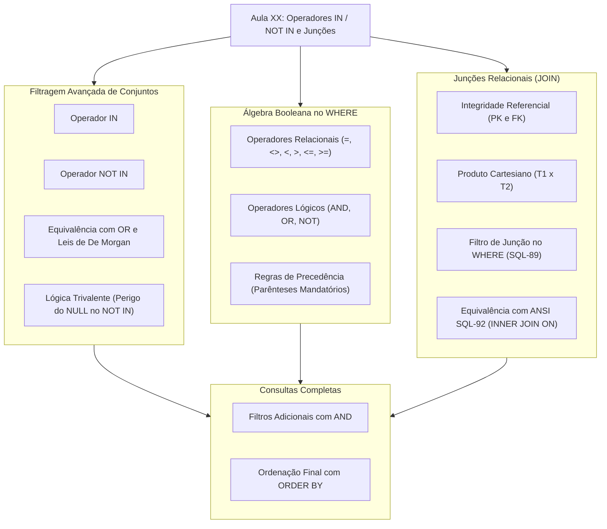

# Aula 04 — Comando IN e Junções em SQL

> **Professor:** Guilherme de Morais
> **Disciplina:** Banco de Dados II (3º Semestre)
> **Tema:** Filtragem de conjuntos com operadores IN e NOT IN, álgebra booleana e junção relacional de múltiplas tabelas via SQL-89 e SQL-92.

## Sumário

- [Objetivo da aula](#objetivo-da-aula)
- [Contexto e pré-requisitos](#contexto-e-pré-requisitos)
- [Operador IN para pesquisa em conjuntos de valores discretos](#operador-in-para-pesquisa-em-conjuntos-de-valores-discretos)
- [Operador NOT IN para exclusão de conjuntos de valores](#operador-not-in-para-exclusão-de-conjuntos-de-valores)
- [Equivalência lógica e simplificação estrutural entre IN e múltiplos operadores OR](#equivalência-lógica-e-simplificação-estrutural-entre-in-e-múltiplos-operadores-or)
- [Combinação de operadores relacionais e lógicos (AND, OR, NOT) em cláusulas WHERE](#combinação-de-operadores-relacionais-e-lógicos-and-or-not-em-cláusulas-where)
- [Conceito de junção de tabelas (JOIN) a partir do modelo relacional (1:1 e 1:N)](#conceito-de-junção-de-tabelas-join-a-partir-do-modelo-relacional-11-e-1n)
- [Sintaxe tradicional de junção relacional via produto cartesiano filtrado no WHERE](#sintaxe-tradicional-de-junção-relacional-via-produto-cartesiano-filtrado-no-where)
- [Filtragem condicional e ordenação (ORDER BY) em consultas multi-tabelas](#filtragem-condicional-e-ordenação-order-by-em-consultas-multi-tabelas)
- [Código da aula](#código-da-aula)
- [Exercícios](#exercícios)
- [Erros comuns e boas práticas](#erros-comuns-e-boas-práticas)
- [Links e materiais complementares](#links-e-materiais-complementares)
- [Mapa da aula](#mapa-da-aula)
- [Glossário](#glossário)
- [Pontos-chave para a prova](#pontos-chave-para-a-prova)
- [Perguntas e respostas (JSONL)](#perguntas-e-respostas-jsonl)
- [Checklist de revisão](#checklist-de-revisão)

---

## Objetivo da aula

Esta aula tem como foco capacitar o estudante de Sistemas de Informação a construir consultas estruturadas em SQL com elevado grau de expressividade e precisão relacional. Ao final deste módulo, o acadêmico será capaz de:

1. Compreender a semântica, a sintaxe e a execução física dos predicados de pertinência a conjuntos finitos (`IN` e `NOT IN`).
2. Mapear a equivalência lógica estrita entre o operador `IN` e cadeias de disjunção inclusiva (`OR`), compreendendo ganhos de legibilidade e impacto na otimização de consultas pelo Sistema Gerenciador de Banco de Dados (SGBD).
3. Aplicar as regras de precedência da álgebra booleana combinando operadores relacionais (`=`, `<>`, `<`, `>`, `<=`, `>=`) com operadores lógicos (`AND`, `OR`, `NOT`).
4. Assimilar o conceito formal de junção de dados (*join*) fundamentado na teoria relacional, transitando da integridade referencial (Chave Primária e Chave Estrangeira) e cardinalidades ($1:1$ e $1:N$) até a recombinação de entidades normalizadas.
5. Escrever e diagnosticar junções relacionais através da sintaxe tradicional (SQL-89, produto cartesiano restringido na cláusula `WHERE`) e compreender sua correlação direta com a sintaxe padrão ANSI (SQL-92, `INNER JOIN ... ON`).
6. Construir consultas multi-tabelas complexas combinando projeção de atributos, junção de entidades, predicados de seleção condicional e critérios determinísticos de ordenação (`ORDER BY`).

---

## Contexto e pré-requisitos

O projeto de bancos de dados relacionais apoia-se no processo de normalização (Primeira, Segunda e Terceira Formas Normais), cujo propósito central é eliminar redundâncias de dados e anomalias de inserção, atualização e exclusão. A consequência direta da normalização é a fragmentação deliberada dos dados em tabelas temáticas especializadas, vinculadas entre si por meio de restrições de integridade referencial.

Para acompanhar o conteúdo desta aula, o estudante deve dominar os seguintes conceitos prévios:
- **Álgebra Relacional Básica:** Operações fundamentais de Projeção ($\pi$) e Seleção ($\sigma$).
- **Sintaxe Fundamental do Comando SELECT:** Estrutura básica composta por `SELECT <colunas> FROM <tabela> WHERE <condições>`.
- **Chave Primária (Primary Key - PK):** Atributo ou conjunto de atributos que identifica de forma única e inequívoca cada tupla dentro de uma relação, com restrição implícita de não nulidade.
- **Chave Estrangeira (Foreign Key - FK):** Atributo em uma tabela que estabelece uma dependência referencial apontando diretamente para a Chave Primária de outra (ou da mesma) tabela.
- **Tipos de Dados Primitivos:** Manipulação de cadeias de caracteres (`VARCHAR`), números inteiros (`INTEGER`) e números decimais (`NUMERIC`/`DECIMAL`).

---

## Operador IN para pesquisa em conjuntos de valores discretos

### Definição formal e semântica do predicado IN

O operador `IN` é um predicado de pertinência a conjuntos. Em termos de teoria dos conjuntos e lógica relacional, ele avalia se o valor retornado por uma expressão escalar à esquerda pertence a um conjunto explícito de valores literais listados entre parênteses à direita:

$$\text{expressao} \in \{v_1, v_2, v_3, \dots, v_n\}$$

Sua sintaxe canônica é:

```sql
SELECT coluna1, coluna2, ...
FROM nome_tabela
WHERE coluna_alvo IN (valor1, valor2, ..., valorN);
```

Durante a execução da consulta, o SGBD testa o valor do atributo de cada tupla contra os elementos do conjunto literal. Se houver correspondência exata com pelo menos um dos valores fornecidos, a expressão booleana é avaliada como verdadeira (`TRUE`), e a tupla é incluída no conjunto de resultados retornado pela cláusula `WHERE`.

### Motivação: clareza sintática e legibilidade de consultas

Em sistemas corporativos, é comum realizar filtros sobre domínios discretos de negócio, como siglas de estados federativos, status de pedidos, categorias de produtos ou faixas de comissão. Sem o operador `IN`, o desenvolvedor é obrigado a repetir o identificador da coluna acompanhado do operador relacional de igualdade (`=`) e do conectivo lógico `OR` tantas vezes quantos forem os valores a testar. 

A utilização do operador `IN`:
- Reduz a verbosidade do código SQL.
- Minimiza erros tipográficos na repetição sucessiva do nome da coluna.
- Facilita a manutenção do código quando novos valores precisam ser adicionados ou removidos da lista.
- Possibilita ao otimizador de consultas do SGBD reescrever internamente a operação como uma busca indexada em lista (*List Scan* ou busca binária em árvore B+), dependendo dos índices disponíveis.

### Exemplo prático e análise detalhada

Considere o exemplo apresentado no material didático (Slide 2), no qual se deseja recuperar o nome e a Unidade Federativa dos clientes localizados nos estados de São Paulo (`SP`) ou Minas Gerais (`MG`):

```sql
SELECT nome_cliente, uf 
FROM cliente 
WHERE uf IN ('SP', 'MG');
```

Neste exemplo:
1. O SGBD avalia a coluna `uf` de cada linha da tabela `cliente`.
2. Para cada linha, verifica-se: `uf = 'SP'`? Se sim, retorna `TRUE`. Caso contrário, verifica-se: `uf = 'MG'`? Se sim, retorna `TRUE`.
3. Se o cliente for de outro estado (ex: `'RJ'`, `'TO'`, `'MS'`), a expressão retorna `FALSE`, e a linha é descartada.

Outro exemplo extraído do Slide 3 envolve múltiplos predicados combinando tipos alfanuméricos e numéricos:

```sql
SELECT codigo_produto, unidade, descricao, val_unit 
FROM produto 
WHERE unidade IN ('M', 'G', 'L') 
  AND val_unit <= 1.05;
```

Aqui, o predicado `IN` delimita a busca às unidades métricas `'M'` (Metro), `'G'` (Grama) ou `'L'` (Litro), enquanto o predicado relacional `val_unit <= 1.05` atua simultaneamente através do operador `AND`, filtrando produtos econômicos.

### Contraexemplo e armadilhas conceituais

Um erro recorrente em estudantes iniciantes é tentar passar listas delimitadas por vírgula dentro de uma única string literal:

```sql
-- INCORRETO: O SGBD compara o campo uf com a string literal única 'SP, MG'
SELECT nome_cliente, uf 
FROM cliente 
WHERE uf IN ('SP, MG');
```

No contraexemplo acima, a consulta buscará registros cuja coluna `uf` contenha exatamente o texto `'SP, MG'`. Como o campo `uf` armazena no máximo 2 caracteres (ou o valor individual do estado), a consulta retornará zero registros. Cada elemento do conjunto deve ser um literal delimitado individualmente por aspas simples e separado por vírgula.

### Tabela comparativa e representação visual

| Critério | Abordagem com Múltiplos OR | Abordagem com Predicado IN |
| :--- | :--- | :--- |
| **Sintaxe** | `col = 'A' OR col = 'B' OR col = 'C'` | `col IN ('A', 'B', 'C')` |
| **Verbosidade** | Alta ($O(N)$ repetições do nome da coluna) | Baixa (nome da coluna citado uma única vez) |
| **Propensão a Erros** | Alta (risco de omissão de parênteses em filtros compostos) | Baixa (conjunto delimitado e encapsulado) |
| **Legibilidade** | Decai rapidamente conforme o conjunto cresce | Alta, similar à notação matemática de conjuntos |



---

## Operador NOT IN para exclusão de conjuntos de valores

### Semântica da negação de pertinência a conjuntos

O operador `NOT IN` é o complemento booleano estrito do operador `IN`. Ele testa a não pertinência de um valor escalar em relação a um conjunto finito de literais:

$$\text{expressao} \notin \{v_1, v_2, v_3, \dots, v_n\}$$

Sintaxe canônica:

```sql
SELECT coluna1, coluna2, ...
FROM nome_tabela
WHERE coluna_alvo NOT IN (valor1, valor2, ..., valorN);
```

Uma linha será selecionada se, e somente se, o valor da coluna avaliada for diferente de **todos** os elementos presentes no conjunto especificado.

### O perigo crítico de valores NULL (Three-Valued Logic)

*(Complemento técnico essencial de banco de dados)*

Nos bancos de dados relacionais que operam sob a lógica trivalente (*Three-Valued Logic* - 3VL), um predicado pode resultar em `TRUE`, `FALSE` ou `UNKNOWN`. A avaliação de `NOT IN` expande-se internamente em uma cadeia de inequações unidas pelo operador `AND`:

$$\text{coluna} \text{ NOT IN } (v_1, v_2) \iff (\text{coluna} \neq v_1) \text{ AND } (\text{coluna} \neq v_2)$$

Se o conjunto contiver um valor `NULL`, ou se a coluna comparada for nula, o comportamento lógico pode surpreender o programador desatento. Por definição:

$$x \neq \text{NULL} \implies \text{UNKNOWN}$$

Em uma cadeia de conjunções (`AND`), a presença de um `UNKNOWN` impede que o resultado final seja `TRUE`:

$$\text{TRUE AND UNKNOWN} \implies \text{UNKNOWN}$$

Como a cláusula `WHERE` só inclui tuplas cujo predicado final é estritamente `TRUE`, **se a lista do operador NOT IN contiver um único elemento NULL, toda a consulta retornará um conjunto vazio (zero linhas)**.

### Exemplo prático no esquema de clientes e veículos

Com base no Slide 2, para listar todos os clientes que não residem nos estados de São Paulo (`SP`) nem de Minas Gerais (`MG`):

```sql
SELECT nome_cliente, uf 
FROM cliente 
WHERE uf NOT IN ('SP', 'MG');
```

Aplicando à tabela de dados reais da aula (`clientes`):

```sql
SELECT nome, cidade, estado 
FROM clientes 
WHERE estado NOT IN ('SP');
```

Neste caso, os registros pertencentes a Tocantins (`TO`) e Mato Grosso do Sul (`MS`) serão retornados (`PATRACIA`, `MARIA`, `FELISBINA`), enquanto todos os clientes cadastrados com o estado de São Paulo (`SP`) serão excluídos da saída.

### Contraexemplo: O colapso do conjunto com elemento nulo

Observe o seguinte contraexemplo teórico:

```sql
-- Suponha uma verificação de estados contendo um valor nulo explícito ou derivado
SELECT nome, estado 
FROM clientes 
WHERE estado NOT IN ('SP', 'MG', NULL);
```

**Resultado:** Nenhuma linha retornada.
**Razão Matemática:** Para cada cliente com estado `'TO'`, a expressão interna se torna:
`('TO' <> 'SP') AND ('TO' <> 'MG') AND ('TO' <> NULL)`
$\implies \text{TRUE} \land \text{TRUE} \land \text{UNKNOWN} \implies \text{UNKNOWN}$.
Sendo `UNKNOWN`, a linha é sumariamente descartada pelo filtro da cláusula `WHERE`.

### Tabela comparativa e diagrama conceitual

| Operador | Equivalência Lógica em Cadeia | Comportamento com NULL no Conjunto |
| :--- | :--- | :--- |
| `IN` | `(col = v1 OR col = v2 OR ...)` | Retorna linhas que coincidem com os valores não nulos |
| `NOT IN` | `(col <> v1 AND col <> v2 AND ...)` | **Falha catastrófica:** retorna 0 linhas se houver NULL na lista |



---

## Equivalência lógica e simplificação estrutural entre IN e múltiplos operadores OR

### Equivalência algébrica booleana

O operador `IN` não introduz um poder computacional novo à linguagem SQL; trata-se de um recurso de *açúcar sintático* (*syntactic sugar*), rigorosamente equivalente a uma série de comparações de igualdade conectadas pelo operador de disjunção `OR`.

Dada a expressão:

```sql
WHERE campo IN (val1, val2, val3)
```

Sua tradução formal em termos de operadores primitivos é:

```sql
WHERE (campo = val1 OR campo = val2 OR campo = val3)
```

Por outro lado, o operador `NOT IN`:

```sql
WHERE campo NOT IN (val1, val2, val3)
```

Aplica as Leis de De Morgan para negar a pertinência ao conjunto:

$$\neg (A \lor B \lor C) \iff (\neg A \land \neg B \land \neg C)$$

Traduzindo-se para a sintaxe SQL:

```sql
WHERE (campo <> val1 AND campo <> val2 AND campo <> val3)
```

### Custo cognitivo e manutenibilidade de código

À medida que o volume de regras de negócio aumenta, a manutenção de cláusulas `WHERE` com múltiplos `OR` torna-se impraticável e propensa a falhas graves. Considere uma regra em que um vendedor possa pertencer a cinco faixas de comissão diferentes (`'A'`, `'B'`, `'C'`, `'D'`, `'E'`):

```sql
-- Abordagem com OR: alta prolixidade e ruído visual
SELECT nome_vendedor, faixa_comissao 
FROM vendedor 
WHERE faixa_comissao = 'A' 
   OR faixa_comissao = 'B' 
   OR faixa_comissao = 'C' 
   OR faixa_comissao = 'D' 
   OR faixa_comissao = 'E';

-- Abordagem equivalente com IN: declarativa, limpa e concisa
SELECT nome_vendedor, faixa_comissao 
FROM vendedor 
WHERE faixa_comissao IN ('A', 'B', 'C', 'D', 'E');
```

A forma compacta reduz a carga cognitiva do desenvolvedor que revisa o código e diminui a chance de misturar operadores sem parênteses, prevenindo comportamentos anômalos.

### Otimização interna pelo Sistema Gerenciador de Banco de Dados (SGBD)

*(Complemento técnico de engenharia de software)*

Ao receber uma consulta contendo `coluna IN (...)`, o analisador sintático (*parser*) e o otimizador de consultas do SGBD processam essa lista de valores. Se a coluna possuir um índice do tipo Árvore B+ (B-Tree), o motor de banco de dados não executa uma varredura sequencial completa repetitiva. Em vez disso:
1. Ele ordena a lista de valores em memória.
2. Elimina literais duplicados fornecidos pelo usuário.
3. Transforma a consulta em múltiplos acessos indexados pontuais (*Index Seek* ou *Range Scan*), agrupando-os de maneira altamente eficiente no plano de execução.

### Tabela de equivalência sintática e diagrama

| Expressão com Conjunto | Expressão Primitiva Desdobrada |
| :--- | :--- |
| `WHERE estado IN ('SP', 'RJ')` | `WHERE (estado = 'SP' OR estado = 'RJ')` |
| `WHERE faixa_comissao IN ('A', 'B')` | `WHERE (faixa_comissao = 'A' OR faixa_comissao = 'B')` |
| `WHERE estado NOT IN ('SP', 'RJ')` | `WHERE (estado <> 'SP' AND estado <> 'RJ')` |
| `WHERE id IN (10)` | `WHERE (id = 10)` |



---

## Combinação de operadores relacionais e lógicos (AND, OR, NOT) em cláusulas WHERE

### Álgebra booleana aplicada e precedência de operadores

A filtragem de registros em bancos de dados baseia-se diretamente na álgebra booleana. Os operadores lógicos fundamentais aceitos na cláusula `WHERE` possuem papéis bem definidos:
- **AND (Conjunção):** Avalia como `TRUE` se, e somente se, **todas** as condições unidas forem verdadeiras.
- **OR (Disjunção):** Avalia como `TRUE` se **pelo menos uma** das condições unidas for verdadeira.
- **NOT (Negação):** Inverte o valor booleano da expressão imediatamente subsequente.

A tabela de precedência padrão dos operadores na linguagem SQL obedece à seguinte hierarquia estrita:

1. Operadores Relacionais e Comparativos (`=`, `<>`, `<`, `>`, `<=`, `>=`, `IN`, `LIKE`, `IS NULL`)
2. Operador Lógico `NOT`
3. Operador Lógico `AND`
4. Operador Lógico `OR`

### Precedência e uso mandatório de parênteses

Como o operador `AND` possui precedência natural sobre o operador `OR`, a ausência de parênteses altera drasticamente o resultado da filtragem.

Considere o seguinte cenário conceitual: "Selecionar todos os clientes de São Paulo (`SP`) ou Minas Gerais (`MG`) que possuam salário superior a 3000".

```sql
-- CONSULTA COM ERRO DE PRECEDÊNCIA LÓGICA
SELECT nome, estado, salario 
FROM clientes 
WHERE estado = 'SP' OR estado = 'MG' AND salario > 3000;
```

Pela ordem de avaliação do SQL, o motor executará primeiro:
`(estado = 'MG' AND salario > 3000)`

E em seguida fará o `OR` com:
`estado = 'SP'`

**Resultado incorreto:** Qualquer cliente do estado de São Paulo será retornado, independentemente do seu salário (mesmo ganhando 1500), enquanto de Minas Gerais virão apenas os que ganham mais de 3000.

Para corrigir o fluxo de avaliação, o uso de parênteses é mandatório para forçar a avaliação prioritária da disjunção:

```sql
-- CONSULTA CORRETA COM PARÊNTESES DE PRECEDÊNCIA
SELECT nome, estado, salario 
FROM clientes 
WHERE (estado = 'SP' OR estado = 'MG') 
  AND salario > 3000;

-- FORMA IDÊNTICA E ELEGANTE USANDO O OPERADOR IN
SELECT nome, estado, salario 
FROM clientes 
WHERE estado IN ('SP', 'MG') 
  AND salario > 3000;
```

O operador `IN` elimina naturalmente essa ambiguidade estrutural ao encapsular a lista de disjunções dentro de seus próprios parênteses sintáticos.

### Exemplos com filtros mistos (numéricos, textuais e conjuntos)

O Slide 3 do material ilustra a combinação de operadores em tabelas industriais de produtos:

```sql
SELECT codigo_produto, unidade, descricao, val_unit 
FROM produto 
WHERE unidade IN ('M', 'G', 'L') 
  AND val_unit <= 1.05;
```

Neste comando:
1. `unidade IN ('M', 'G', 'L')` é resolvido para cada tupla.
2. `val_unit <= 1.05` é avaliado.
3. Ambas as partes devem ser verdadeiras simultaneamente devido ao conectivo `AND`.

### Tabela de precedência e diagrama de fluxo de avaliação

| Ordem de Prioridade | Operador SQL | Descrição da Operação |
| :---: | :---: | :--- |
| **1ª (Maior)** | `( )` | Parênteses (forçam prioridade explícita) |
| **2ª** | `=`, `<>`, `<`, `>`, `<=`, `>=`, `IN`, `BETWEEN` | Operadores de comparação e pertinência |
| **3ª** | `NOT` | Inversão lógica unária |
| **4ª** | `AND` | Conjunção lógica binária |
| **5ª (Menor)** | `OR` | Disjunção lógica binária |



---

## Conceito de junção de tabelas (JOIN) a partir do modelo relacional (1:1 e 1:N)

### Fundamentos relacionais: da normalização à junção de dados

No Modelo de Entidade-Relacionamento (MER) e no Modelo Relacional lógico, entidades do mundo real raramente vivem isoladas. Para evitar redundâncias sistemáticas, os atributos de um cliente (como CPF, nome, endereço) ficam armazenados em uma relação específica (`clientes`), enquanto os dados de seus veículos (chassi, placa, modelo, marca) residem em uma relação própria (`veiculos`).

A **Junção (Join)** é o mecanismo de álgebra relacional responsável por recompor e cruzar os dados dispersos em múltiplas relações, gerando uma visualização unificada como se os dados pertencessem a uma única grande tabela temporária. A condição indispensável para que duas tabelas sejam unidas de maneira consistente é a existência de um vínculo relacional formal: a correspondência lógica entre uma Chave Primária e uma Chave Estrangeira.

### Cardinalidades no minimundo de Clientes e Veículos (1:N e 1:1)

O material didático (Slide 5) define o relacionamento entre as tabelas de estudo:
- Uma entidade `clientes` **possui** `veiculos`.
- **Visão do Cliente para Veículos:** Cardinalidade $1:N$ (Um cliente pode possuir $0, 1$ ou $N$ veículos cadastrados).
- **Visão do Veículo para Clientes:** Cardinalidade $1:1$ (Cada veículo possui um, e exatamente um, cliente associado como proprietário).

Essa estrutura assegura que a Chave Primária da tabela "um" (`clientes.cpf`) seja propagada para a tabela "muitos" como Chave Estrangeira (`veiculos.cpf_cli`).

### Integridade Referencial: Chaves Primárias (PK) e Chaves Estrangeiras (FK)

A integridade referencial garante que nenhuma tupla na tabela filha (`veiculos`) aponte para um proprietário inexistente na tabela mãe (`clientes`). O DDL fornecido no arquivo de apoio estabelece essa amarração estrutural:

```sql
-- Chave Primária da Tabela Clientes
CONSTRAINT PK_CPFcliente PRIMARY KEY (cpf);

-- Chave Primária da Tabela Veículos
CONSTRAINT pk_placa PRIMARY KEY (placa);

-- Chave Estrangeira amarrando Veículos a Clientes
ALTER TABLE veiculos 
ADD CONSTRAINT fk_cpf_cli 
FOREIGN KEY (cpf_cli) REFERENCES clientes (cpf);
```

### Diagrama ER nativo em Mermaid e tabela de relacionamentos



| Tabela Origem | Atributo FK | Tabela Destino | Atributo PK | Cardinalidade Global | Significado Negocial |
| :--- | :--- | :--- | :--- | :---: | :--- |
| `veiculos` | `cpf_cli` | `clientes` | `cpf` | $1:N$ | Um cliente pode ter vários carros; cada carro pertence a um único cliente. |

---

## Sintaxe tradicional de junção relacional via produto cartesiano filtrado no WHERE

### O produto cartesiano (CROSS JOIN) e o crescimento combinatorial

Quando duas tabelas são declaradas na cláusula `FROM` separadas por vírgula sem qualquer restrição condicional associada:

```sql
SELECT * FROM clientes, veiculos;
```

O banco de dados computa a operação formal do **Produto Cartesiano** ($R \times S$). Cada tupla da tabela `clientes` é combinada com todas as tuplas da tabela `veiculos`. 

Se a tabela `clientes` contém $12$ registros e a tabela `veiculos` possui $14$ registros, o resultado gerará:

$$12 \times 14 = 168 \text{ combinações}$$

Dessas 168 combinações, a vasta maioria é logicamente falsa no mundo real (por exemplo, associando o carro da Beatriz à Felisbina, à Maria, à Kátia, etc.).

### A restrição de junção (Theta Join) na cláusula WHERE (SQL-89)

Para extrair apenas as linhas verdadeiras, introduz-se a **condição de junção** na cláusula `WHERE`, exigindo que o valor da chave estrangeira seja estritamente idêntico ao da chave primária correspondente:

```sql
SELECT Tabela1.Campo1, Tabela2.Campo2 
FROM Tabela1, Tabela2 
WHERE (Tabela1.CampoRelacionado1 = Tabela2.CampoRelacionado2);
```

No exemplo do Slide 7 da aula:

```sql
SELECT clientes.nome, clientes.cidade, veiculos.modelo, veiculos.marca 
FROM clientes, veiculos 
WHERE (clientes.cpf = veiculos.cpf_cli);
```

O processamento lógico dessa consulta opera da seguinte forma:
1. O SGBD conceitualmente emparelha cada linha de `clientes` com cada linha de `veiculos`.
2. A cláusula `WHERE` testa a igualdade: `clientes.cpf = veiculos.cpf_cli`.
3. Somente as combinações em que o CPF do cliente confere exatamente com o campo `cpf_cli` do carro são retidas (exatamente 14 linhas, pois cada um dos 14 veículos aponta para um cliente válido).
4. O `SELECT` projeta apenas os atributos solicitados (`nome`, `cidade`, `modelo`, `marca`).

### Comparativo técnico: Sintaxe SQL-89 (WHERE) vs Sintaxe ANSI SQL-92 (INNER JOIN)

*(Complemento técnico de boas práticas da indústria)*

Historicamente, a sintaxe com vírgula no `FROM` e filtro de junção no `WHERE` consolidou-se com o padrão SQL-89. Contudo, o padrão ANSI SQL-92 introduziu palavras-chave explícitas para expressar a junção:

```sql
-- Sintaxe ANSI SQL-92 (Padrão de Mercado Recomendado)
SELECT clientes.nome, clientes.cidade, veiculos.modelo, veiculos.marca 
FROM clientes
INNER JOIN veiculos ON clientes.cpf = veiculos.cpf_cli;
```

Ambas as abordagens produzem exatamente o mesmo plano de execução e o mesmo conjunto de dados na maioria esmagadora dos SGBDs modernos (Oracle, PostgreSQL, MySQL, SQL Server). No entanto, a sintaxe SQL-92 separa com clareza o que é **condição de junção de tabelas** (cláusula `ON`) do que é **filtro negocial de linhas** (cláusula `WHERE`).

### Qualificação de colunas e prevenção de ambiguidade (Tabela.Coluna)

Quando tabelas distintas possuem atributos homônimos (por exemplo, se ambas tivessem uma coluna chamada `id` ou `nome`), a referência direta `SELECT nome` causaria o erro clássico de **coluna ambígua** (*ambiguous column name*).

Para evitar esse problema, aplica-se a **qualificação de nomes**: prefixa-se o nome da coluna com o nome de sua respectiva tabela, separado por ponto:
- `clientes.nome`
- `clientes.cidade`
- `veiculos.modelo`
- `veiculos.marca`

### Diagrama de sequência / processamento de dados e tabela comparativa



| Característica | Sintaxe SQL-89 (Estilo do Professor) | Sintaxe ANSI SQL-92 (Mercado) |
| :--- | :--- | :--- |
| **Declaração de Tabelas** | Na cláusula `FROM`, separadas por vírgula | Na cláusula `FROM` com operador `INNER JOIN` |
| **Amarração das Chaves** | Dentro da cláusula `WHERE` | Na cláusula dedicada `ON` |
| **Risco de Produto Cartesiano** | Elevado (se o aluno esquecer o `WHERE`) | Muito baixo (erro de sintaxe se omitir o `ON`) |
| **Legibilidade em Muitas Tabelas** | Decai (mistura junções com filtros negociais) | Alta (cada junção é isolada com sua respectiva chave) |

---

## Filtragem condicional e ordenação (ORDER BY) em consultas multi-tabelas

### Ordem lógica de execução da consulta SQL (FROM -> WHERE -> SELECT -> ORDER BY)

Para compreender perfeitamente como funcionam as consultas complexas com tabelas combinadas, é fundamental dominar o ciclo de vida e a ordem de execução lógica dos comandos no SGBD:

1. **`FROM`**: As tabelas envolvidas são identificadas e unidas (conceitualmente gerando o produto cartesiano inicial).
2. **`WHERE`**: Os predicados de junção (`PK = FK`) e os predicados de seleção negocial (`estado = 'SP'`) são avaliados em conjunto. Linhas que resultarem em `FALSE` ou `UNKNOWN` são eliminadas.
3. **`SELECT`**: Apenas as colunas explicitamente solicitadas na projeção são separadas para compor o resultado.
4. **`ORDER BY`**: As linhas remanescentes são reordenadas de acordo com as colunas e direções especificadas.



### Filtragem pós-junção: combinando chaves e predicados de atributos

Conforme demonstrado no Slide 10 do material, é possível restringir o resultado da junção aplicando predicados de seleção adicionais por meio do operador `AND`:

```sql
SELECT clientes.nome, clientes.cidade, veiculos.modelo, veiculos.marca 
FROM clientes, veiculos 
WHERE (clientes.cpf = veiculos.cpf_cli) 
  AND (clientes.estado = 'SP');
```

Neste comando:
1. `(clientes.cpf = veiculos.cpf_cli)`: Garante a integridade relacional, mantendo apenas veículos associados a seus donos corretos.
2. `AND (clientes.estado = 'SP')`: Filtra o conjunto resultante, descartando qualquer tupla cujo cliente seja de Tocantins (`TO`), Mato Grosso do Sul (`MS`) ou outro estado.

### Ordenação multi-tabela (ORDER BY ASC/DESC)

A cláusula `ORDER BY` permite classificar o conjunto final de dados com base em uma ou mais colunas de qualquer uma das tabelas presentes no `FROM`. Por padrão, se a direção não for expressa, a ordenação adotada é ascendente (`ASC`). Para inversão, emprega-se `DESC`.

No Slide 11, o professor demonstra a junção, filtragem e ordenação combinadas:

```sql
SELECT clientes.nome, clientes.cidade, veiculos.modelo, veiculos.marca 
FROM clientes, veiculos 
WHERE (clientes.cpf = veiculos.cpf_cli) 
  AND (clientes.estado = 'SP') 
ORDER BY clientes.cidade;
```

O SGBD executa o join, aplica o filtro de estado e, por fim, reorganiza as tuplas em ordem alfabética da cidade do cliente (Catanduva, Fernandópolis, Jales, Macedônia, Santa Fé do Sul, São José do Rio Preto, Votuporanga).

### Diagrama de fluxo de execução lógica e tabela comparativa



| Consulta de Exemplo | Cláusulas Utilizadas | Quantidade de Registros Esperada | Critério de Ordenação |
| :--- | :--- | :---: | :--- |
| **Junção Simples** | `FROM`, `WHERE (PK=FK)` | 14 registros | Nenhuma (ordem física de disco) |
| **Junção + Filtro SP** | `FROM`, `WHERE (PK=FK AND estado='SP')` | 10 registros | Nenhuma |
| **Junção + Filtro + Order** | `FROM`, `WHERE (PK=FK AND ...)`, `ORDER BY` | 10 registros | Alfabética por cidade do cliente |

---

## Código da aula

Os scripts completos utilizados nesta aula estão disponíveis na pasta de código de apoio. A seguir, detalha-se a arquitetura e os trechos fundamentais de cada artefato.

### Arquivo 1: [schema_e_exemplos.sql](./codigo/schema_e_exemplos.sql)

Este arquivo contém o Data Definition Language (DDL) completo para criação das tabelas `clientes` e `veiculos`, criação de constraints de Chave Primária e Chave Estrangeira, inserção dos dados de teste (DML) fornecidos no arquivo `create table clientes.docx`, bem como os comandos de demonstração abordados nos slides 2 a 11.

Trecho fundamental comentado do schema e amarração relacional:

```sql
-- Criação da tabela mãe (clientes)
CREATE TABLE clientes (
    cod_cli INTEGER NOT NULL,
    cpf INTEGER NOT NULL,
    nome VARCHAR(50), 
    endereco VARCHAR(50),
    cidade VARCHAR(50),
    estado VARCHAR(02),
    salario INTEGER,
    idade INTEGER, 
    -- Definição explícita da chave primária utilizando o CPF
    CONSTRAINT PK_CPFcliente PRIMARY KEY (cpf)
);

-- Criação da tabela filha (veiculos)
CREATE TABLE veiculos (
    chassi VARCHAR(50) NOT NULL,
    placa VARCHAR(10) NOT NULL, 
    cor VARCHAR(20),
    modelo VARCHAR(20),
    marca VARCHAR(20),
    ano_fabricacao INTEGER,
    preco_compra INTEGER,
    preco_venda INTEGER,
    motor INTEGER,
    cpf_cli INTEGER NOT NULL, 
    -- Definição da chave primária da placa
    CONSTRAINT pk_placa PRIMARY KEY (placa)
);

-- Amarração da Chave Estrangeira garantindo Integridade Referencial
ALTER TABLE veiculos 
ADD CONSTRAINT fk_cpf_cli 
FOREIGN KEY (cpf_cli) REFERENCES clientes (cpf);
```

Trecho com a junção filtrada e ordenada apresentada no Slide 11:

```sql
-- Consulta completa multi-tabela com filtro e ordenação
SELECT 
    clientes.nome,
    clientes.cidade,
    veiculos.modelo,
    veiculos.marca 
FROM 
    clientes,
    veiculos 
WHERE 
    (clientes.cpf = veiculos.cpf_cli)       -- Condição de junção estrutural
    AND (clientes.estado = 'SP')            -- Condição de filtro negocial
ORDER BY 
    clientes.cidade;                        -- Ordenação ascendente por cidade
```

### Arquivo 2: [exercicios.sql](./codigo/exercicios.sql)

Este arquivo reúne a codificação estruturada dos três exercícios propostos no Slide 12, fornecendo em cada um tanto a sintaxe adotada em sala pelo professor (SQL-89 via `WHERE`) quanto a sintaxe padronizada pela indústria (ANSI SQL-92 via `INNER JOIN`), com testes de execução e validação.

---

## Exercícios

Abaixo constam as resoluções técnicas exaustivas para os exercícios solicitados no encerramento da aula (Slide 12).

### Exercício 1

#### Enunciado
> "1- Selecione todos os nome e cpf da tabela cliente e marca e modelo cujo o modelo for igual a Toyota."

#### Raciocínio e Análise Semântica
Ao analisar a estrutura dos dados fornecidos na carga oficial, observa-se que `'TOYOTA'` foi inserida fisicamente na coluna `marca` (com modelos como `'HILUX'` e `'COROLLA'`). O enunciado do exercício menciona textualmente: *"cujo o modelo for igual a Toyota"*. 
Como engenheiros e analistas de banco de dados, devemos contemplar:
1. A correspondência literal solicitada pelo professor aplicando o teste sobre a coluna `marca` (onde os dados reais da montadora Toyota residem).
2. A alternativa defensiva que testa tanto `marca = 'TOYOTA'` quanto `modelo = 'TOYOTA'`, protegendo a consulta contra eventuais inconsistências de preenchimento.
3. A amarração da chave primária `clientes.cpf` com a chave estrangeira `veiculos.cpf_cli`.

#### Resolução Completa Comentada

**Abordagem 1: Sintaxe Tradicional (SQL-89 adotada pelo professor em aula)**
```sql
SELECT 
    clientes.nome,
    clientes.cpf,
    veiculos.marca,
    veiculos.modelo
FROM 
    clientes,
    veiculos
WHERE 
    (clientes.cpf = veiculos.cpf_cli)
    AND (veiculos.marca = 'TOYOTA');
```

**Abordagem 2: Sintaxe Padrão de Mercado (ANSI SQL-92)**
```sql
SELECT 
    clientes.nome,
    clientes.cpf,
    veiculos.marca,
    veiculos.modelo
FROM 
    clientes
INNER JOIN veiculos ON clientes.cpf = veiculos.cpf_cli
WHERE 
    veiculos.marca = 'TOYOTA';
```

**Abordagem 3: Consulta Defensiva (atendendo estritamente ao texto e aos dados reais)**
```sql
SELECT 
    clientes.nome,
    clientes.cpf,
    veiculos.marca,
    veiculos.modelo
FROM 
    clientes,
    veiculos
WHERE 
    clientes.cpf = veiculos.cpf_cli
    AND (veiculos.modelo = 'TOYOTA' OR veiculos.marca = 'TOYOTA');
```

#### Resultado Obtido da Carga de Testes
Esta consulta localiza 6 veículos da Toyota associados aos seus proprietários:
- BEATRIZ (Hilux e Hilux)
- FELISBINA (Corolla)
- MARIA (Hilux)
- PATRACIA (Corolla)
- GIOVANA (Corolla)

Script disponível em: [./codigo/exercicios.sql](./codigo/exercicios.sql)

---

### Exercício 2

#### Enunciado
> "2- Seleciona do veículos chassi, placa, modelo e marcar e da tabela clientes nome e cpf , cujo os clientes que residem em estado diferente de São Paulo."

#### Raciocínio e Análise Semântica
O exercício exige a junção entre `clientes` e `veiculos` com uma restrição de desigualdade sobre a coluna `clientes.estado`. 
- É necessário selecionar atributos específicos de ambas as tabelas (`veiculos.chassi`, `veiculos.placa`, `veiculos.modelo`, `veiculos.marca`, `clientes.nome`, `clientes.cpf`).
- Para expressar "diferente de São Paulo", podemos utilizar o operador relacional `<>` (ou `!=`), ou alternativamente o operador `NOT IN ('SP')`.
- Devem ser mantidas apenas as tuplas em que a chave primária coincide com a chave estrangeira.

#### Resolução Completa Comentada

**Abordagem 1: Sintaxe Tradicional com Operador Relacional `<>`**
```sql
SELECT 
    veiculos.chassi,
    veiculos.placa,
    veiculos.modelo,
    veiculos.marca,
    clientes.nome,
    clientes.cpf
FROM 
    veiculos,
    clientes
WHERE 
    (veiculos.cpf_cli = clientes.cpf)
    AND (clientes.estado <> 'SP');
```

**Abordagem 2: Utilizando o Operador NOT IN (Tema central da aula)**
```sql
SELECT 
    veiculos.chassi,
    veiculos.placa,
    veiculos.modelo,
    veiculos.marca,
    clientes.nome,
    clientes.cpf
FROM 
    veiculos,
    clientes
WHERE 
    veiculos.cpf_cli = clientes.cpf
    AND clientes.estado NOT IN ('SP');
```

**Abordagem 3: Padrão ANSI SQL-92 com INNER JOIN**
```sql
SELECT 
    veiculos.chassi,
    veiculos.placa,
    veiculos.modelo,
    veiculos.marca,
    clientes.nome,
    clientes.cpf
FROM 
    veiculos
INNER JOIN clientes ON veiculos.cpf_cli = clientes.cpf
WHERE 
    clientes.estado NOT IN ('SP');
```

#### Resultado Obtido da Carga de Testes
A consulta retorna 3 veículos pertencentes a clientes de Tocantins (`TO`) e Mato Grosso do Sul (`MS`):
- Felisbina (MS): Corolla (Chassi FI02, Placa WDR4528)
- Maria (TO): Hilux (Chassi RD02, Placa GHY5823)
- Patracia (TO): Corolla (Chassi DF024, Placa TON5689)

Script disponível em: [./codigo/exercicios.sql](./codigo/exercicios.sql)

---

### Exercício 3

#### Enunciado
> "3- Selecione todos os veículos da marcar Toyota e VW. Usando o comando in."

#### Raciocínio e Análise Semântica
- O enunciado pede "todos os veículos", dispensando a necessidade de junção com a tabela `clientes` (a menos que se deseje trazer dados dos proprietários).
- O filtro recai sobre a coluna `marca`.
- O requisito explícito e mandatório é o emprego do **operador IN** para testar a pertinência ao conjunto formado pelas marcas `'TOYOTA'` e `'VW'`.
- A equivalência lógica substitui a necessidade de `WHERE marca = 'TOYOTA' OR marca = 'VW'`.

#### Resolução Completa Comentada

**Abordagem 1: Consulta Direta na Tabela de Veículos (Conforme Enunciado Estrito)**
```sql
SELECT 
    chassi,
    placa,
    cor,
    modelo,
    marca,
    ano_fabricacao,
    preco_compra,
    preco_venda,
    motor,
    cpf_cli
FROM 
    veiculos
WHERE 
    marca IN ('TOYOTA', 'VW');
```

**Abordagem 2: Consulta Enriquecida com Junção (Trazendo o Nome do Proprietário)**
```sql
SELECT 
    veiculos.placa,
    veiculos.modelo,
    veiculos.marca,
    clientes.nome AS proprietario
FROM 
    veiculos,
    clientes
WHERE 
    veiculos.cpf_cli = clientes.cpf
    AND veiculos.marca IN ('TOYOTA', 'VW');
```

#### Resultado Obtido da Carga de Testes
A consulta identifica 8 veículos no total (6 veículos Toyota e 2 veículos Volkswagen):
1. Hilux (Toyota) - Beatriz
2. Corolla (Toyota) - Felisbina
3. Hilux (Toyota) - Maria
4. Corolla (Toyota) - Patracia
5. Gol (VW) - Elizangela
6. Saveiro (VW) - Milena
7. Corolla (Toyota) - Giovana
8. Hilux (Toyota) - Beatriz

Script disponível em: [./codigo/exercicios.sql](./codigo/exercicios.sql)

---

## Erros comuns e boas práticas

### 1. Esquecimento da condição de junção (O pesadelo do Produto Cartesiano)
- **Erro:** Declarar múltiplas tabelas no `FROM` e esquecer de amarrar `PK = FK` no `WHERE`.
- **Consequência:** Explosão combinatorial de registros ($12 \times 14 = 168$ linhas no nosso exemplo; em bancos de produção com milhões de tuplas, isso pode derrubar o servidor por exaustão de memória temporária e CPU).
- **Boa Prática:** Sempre validar se a quantidade de condições de junção no `WHERE` é de no mínimo $(N - 1)$, onde $N$ é o número de tabelas listadas no `FROM`.

### 2. Omissão de parênteses na mistura de AND e OR
- **Erro:** Escrever predicados como `WHERE condA OR condB AND condC`.
- **Consequência:** Como o `AND` tem prioridade sobre o `OR`, o SGBD agrupa `(condB AND condC)` primeiro, desvirtuando completamente a intenção do analista.
- **Boa Prática:** Isole explicitamente os blocos lógicos com parênteses: `WHERE (condA OR condB) AND condC`, ou substitua a cadeia de `OR` pelo operador `IN`.

### 3. Valores nulos manipulados com NOT IN
- **Erro:** Executar consultas como `WHERE status NOT IN ('ATIVO', 'PENDENTE', NULL)`.
- **Consequência:** A lógica trivalente do SQL faz com que qualquer comparação `<> NULL` retorne `UNKNOWN`, fazendo com que **nenhuma linha** seja retornada na consulta inteira.
- **Boa Prática:** Certifique-se de que a lista literal do `NOT IN` nunca contenha valores nulos. Ao trabalhar com subconsultas, garanta filtros adicionais com `IS NOT NULL`.

### 4. Ambiguidade de nomes de atributos
- **Erro:** Escrever `SELECT cpf, modelo FROM clientes, veiculos WHERE cpf = cpf_cli;` caso existisse uma coluna `cpf` em ambas as tabelas.
- **Consequência:** Erro de compilação da query por ambiguidade.
- **Boa Prática:** Sempre qualifique todas as colunas com o nome ou alias da tabela (`clientes.cpf`, `veiculos.modelo`).

### 5. Tipagem e formatação dos valores do conjunto IN
- **Erro:** Misturar tipos incompatíveis no conjunto, como `WHERE cod_cli IN ('01', 'A2', 30)`.
- **Consequência:** Falha de conversão implícita de tipo em tempo de execução ou invalidação do uso de índices.
- **Boa Prática:** Mantenha os literais do conjunto `IN` homogêneos e compatíveis com a tipagem da coluna da tabela.

---

## Links e materiais complementares

- **Documentação Oficial do PostgreSQL sobre Expressões de Linha e Subconsultas:** Explicação detalhada da mecânica de execução dos operadores `IN` e `NOT IN`.
- **Documentação do MySQL sobre Junções Relacionais:** Detalhamento da diferença de otimização entre sintaxe com vírgula (SQL-89) e `JOIN` explícito (SQL-92).
- **Repositório de Scripts da Aula:** Arquivos `.sql` contendo o DDL e DML oficiais para execução imediata em qualquer SGBD relacional padrão ANSI.
- **Codd, E. F. (1970) - "A Relational Model of Data for Large Shared Data Banks":** Artigo fundamental que introduziu a álgebra relacional, base matemática de todo o conceito de junções de banco de dados.

---

## Mapa da aula



---

## Glossário

| Termo | Definição Técnica |
| :--- | :--- |
| **Operador IN** | Predicado relacional que avalia se um valor escalar pertence a uma lista finita de literais ou a uma subconsulta. |
| **Operador NOT IN** | Predicado booleano que avalia se um valor escalar não pertence a nenhum dos elementos de um conjunto fornecido. |
| **Three-Valued Logic (3VL)** | Sistema lógico adotado pelo SQL no qual expressões podem resultar em `TRUE`, `FALSE` ou `UNKNOWN`. |
| **Produto Cartesiano** | Operação matemática entre duas relações que gera todas as combinações possíveis entre as tuplas de ambas. |
| **Theta Join** | Junção relacional condicionada a um predicado explícito de comparação (comumente a igualdade, chamada Equi-Join). |
| **Chave Primária (PK)** | Identificador único e imutável de uma tupla em uma tabela, não admitindo duplicidade nem valor nulo. |
| **Chave Estrangeira (FK)** | Atributo que estabelece um elo de integridade referencial com a Chave Primária de outra relação. |
| **SQL-89** | Padrão legado da linguagem SQL que expressa junções declarando tabelas no `FROM` e amarrações no `WHERE`. |
| **SQL-92** | Padrão moderno da linguagem SQL que introduziu a cláusula explícita `INNER JOIN ... ON`. |
| **Qualificação de Coluna** | Prática de prefixar o identificador do atributo com o nome de sua tabela de origem (`tabela.coluna`) para sanar ambiguidades. |
| **ORDER BY** | Cláusula SQL utilizada para ordenar o conjunto de dados resultante de forma ascendente (`ASC`) ou descendente (`DESC`). |

---

## Pontos-chave para a prova

1. **Equivalência do IN:** Saber demonstrar que `campo IN ('A', 'B')` é estritamente equivalente a `(campo = 'A' OR campo = 'B')`.
2. **Equivalência do NOT IN:** Saber demonstrar que `campo NOT IN ('A', 'B')` é estritamente equivalente a `(campo <> 'A' AND campo <> 'B')`.
3. **Cuidado com NULL no NOT IN:** Questões teóricas costumam cobrar o que ocorre quando a lista de literais do `NOT IN` contém um valor nulo. Resposta: toda a cláusula avalia para `UNKNOWN`, resultando em 0 linhas retornadas.
4. **Mecanismo da Junção Tradicional (SQL-89):** O estudante deve saber explicar que a junção tradicional ocorre em duas fases conceituais:
   - Formação do Produto Cartesiano das tabelas no `FROM` ($L_1 \times L_2$).
   - Eliminação das tuplas falsas via restrição `WHERE tabela1.pk = tabela2.fk`.
5. **Precedência de AND sobre OR:** Lembrar sempre que o `AND` é avaliado antes do `OR`. O uso de parênteses é obrigatório quando se deseja impor a avaliação do `OR` prioritariamente.
6. **Sintaxe de Ambiguidade:** Em tabelas unidas com nomes de colunas idênticos, a omissão do prefixo da tabela gera erro de sintaxe.
7. **Ciclo de Execução da Consulta:** O filtro (`WHERE`) acontece **antes** da projeção (`SELECT`) e da ordenação (`ORDER BY`).

---

## Perguntas e respostas (JSONL)

```jsonl
{"pergunta": "Qual é a finalidade principal do operador IN em uma consulta SQL?", "resposta": "Verificar se um determinado valor escalar pertence a uma lista pré-definida de valores literais ou ao resultado de uma subconsulta, substituindo múltiplos operadores OR.", "dificuldade": "fácil"}
{"pergunta": "Como o predicado 'uf IN ('SP', 'MG')' é traduzido utilizando operadores booleanos primitivos?", "resposta": "É traduzido para a forma disjuntiva equivalente: (uf = 'SP' OR uf = 'MG').", "dificuldade": "fácil"}
{"pergunta": "Qual é a equivalência lógica booleana correta do predicado 'estado NOT IN ('SP', 'MG')'?", "resposta": "A equivalência aplicando as leis de De Morgan é: (estado <> 'SP' AND estado <> 'MG').", "dificuldade": "médio"}
{"pergunta": "O que acontece se um dos valores literais dentro de uma lista do operador NOT IN for NULL?", "resposta": "Nenhuma linha será retornada pela consulta, pois qualquer comparação contra NULL resulta em UNKNOWN, tornando a conjunção final inteira UNKNOWN.", "dificuldade": "difícil"}
{"pergunta": "O que caracteriza uma operação de Produto Cartesiano entre duas tabelas no SQL?", "resposta": "É a combinação irrestrita de cada tupla da primeira tabela com todas as tuplas da segunda tabela, gerando um volume total de linhas igual à multiplicação das linhas de ambas.", "dificuldade": "fácil"}
{"pergunta": "Na sintaxe SQL-89, como se evita que a união de duas tabelas resulte em um produto cartesiano?", "resposta": "Adicionando uma condição de igualdade na cláusula WHERE amarrando a Chave Primária da tabela de origem com a Chave Estrangeira da tabela de destino.", "dificuldade": "médio"}
{"pergunta": "Dadas 12 linhas na tabela clientes e 14 linhas na tabela veiculos, quantas linhas são geradas pelo comando 'SELECT * FROM clientes, veiculos;'?", "resposta": "São geradas exatamente 168 linhas (12 multiplicado por 14).", "dificuldade": "fácil"}
{"pergunta": "Qual é a ordem de precedência natural de avaliação entre os operadores lógicos AND e OR na cláusula WHERE?", "resposta": "O operador AND possui maior precedência que o operador OR, sendo avaliado primeiro a menos que existam parênteses.", "dificuldade": "médio"}
{"pergunta": "Por que a qualificação de atributos (ex: clientes.nome) é considerada uma boa prática em comandos SELECT multi-tabelas?", "resposta": "Para evitar ambiguidades sintáticas caso duas tabelas possuam colunas com o mesmo nome e para aumentar a legibilidade e manutenibilidade do código.", "dificuldade": "fácil"}
{"pergunta": "Qual a diferença conceitual entre a sintaxe de junção do padrão SQL-89 e a do padrão ANSI SQL-92?", "resposta": "O SQL-89 utiliza vírgula no FROM e expressa a amarração no WHERE; o SQL-92 utiliza as palavras-chave INNER JOIN no FROM e isola a amarração de chaves na cláusula ON.", "dificuldade": "médio"}
{"pergunta": "Em qual etapa do ciclo de vida de uma consulta SQL a cláusula ORDER BY é executada?", "resposta": "A cláusula ORDER BY é executada na etapa final, após a união das tabelas (FROM), aplicação dos filtros (WHERE) e projeção das colunas (SELECT).", "dificuldade": "médio"}
{"pergunta": "No modelo apresentado em aula, qual é a cardinalidade existente entre a entidade clientes e a entidade veiculos?", "resposta": "A cardinalidade é 1:N (um cliente pode possuir vários veículos, mas cada veículo pertence a apenas um cliente).", "dificuldade": "fácil"}
{"pergunta": "Qual comando SQL altera a tabela veiculos para amarrar a coluna cpf_cli como Chave Estrangeira para clientes(cpf)?", "resposta": "ALTER TABLE veiculos ADD CONSTRAINT fk_cpf_cli FOREIGN KEY (cpf_cli) REFERENCES clientes (cpf);", "dificuldade": "médio"}
{"pergunta": "Como expressar em SQL a seleção de veículos da marca Toyota ou VW utilizando obrigatoriamente o comando IN?", "resposta": "SELECT * FROM veiculos WHERE marca IN ('TOYOTA', 'VW');", "dificuldade": "fácil"}
{"pergunta": "Por que a expressão 'WHERE uf IN ('SP, MG')' está incorreta para filtrar clientes de São Paulo ou Minas Gerais?", "resposta": "Porque ela trata 'SP, MG' como uma única cadeia literal indivisível, em vez de avaliar individualmente o valor 'SP' e o valor 'MG'.", "dificuldade": "médio"}
{"pergunta": "O que ocorre se tentarmos inserir na tabela veiculos um registro com cpf_cli inexistente na tabela clientes?", "resposta": "O SGBD abortará a operação de inserção disparando uma violação de integridade referencial (foreign key constraint violation).", "dificuldade": "médio"}
{"pergunta": "Se uma tabela possuir índice do tipo Árvore B+ no atributo filtrado, como o otimizador trata a cláusula IN?", "resposta": "Ele ordena a lista do IN e substitui varreduras sequenciais por múltiplos acessos pontuais indexados (Index Seeks), aumentando significativamente a performance.", "dificuldade": "difícil"}
{"pergunta": "Como filtrar os clientes de São Paulo que possuem salário acima de 3000 garantindo que a precedência booleana funcione corretamente com OR?", "resposta": "Utilizando parênteses: WHERE (estado = 'SP' OR estado = 'MG') AND salario > 3000; ou usando IN: WHERE estado IN ('SP', 'MG') AND salario > 3000;.", "dificuldade": "médio"}
{"pergunta": "Qual palavra-chave é utilizada na cláusula ORDER BY para definir que a ordenação de um atributo deve ser da maior para a menor grandeza?", "resposta": "A palavra-chave DESC (descendente).", "dificuldade": "fácil"}
{"pergunta": "Em uma consulta com junção entre 4 tabelas na cláusula FROM, quantas condições mínimas de junção (PK=FK) são necessárias no WHERE?", "resposta": "São necessárias no mínimo 3 condições de junção para evitar a geração de produtos cartesianos parciais.", "dificuldade": "difícil"}
```

---

## Checklist de revisão

- [ ] Compreendi a função do operador `IN` como simplificador sintático para múltiplos operadores `OR`.
- [ ] Sei reescrever consultas com `IN` na sua forma desdobrada com operadores relacionais primitivos (`=`) e conectivos `OR`.
- [ ] Entendi a semântica do operador `NOT IN` e sua equivalência desdobrada com operadores `<>` e conectivos `AND` (Leis de De Morgan).
- [ ] Estou ciente do risco crítico do uso de valores `NULL` com o operador `NOT IN` decorrente da lógica trivalente (3VL).
- [ ] Sei aplicar a precedência matemática correta entre os operadores `AND` e `OR` utilizando parênteses protetivos.
- [ ] Compreendi a teoria por trás da junção de dados baseada nas restrições de Chave Primária (`PK`) e Chave Estrangeira (`FK`).
- [ ] Entendi o que é o Produto Cartesiano e sei calcular o número de tuplas geradas por consultas sem a cláusula de amarração.
- [ ] Sei construir consultas multi-tabelas usando a sintaxe tradicional de junção no `WHERE` (padrão SQL-89).
- [ ] Sei qualificar atributos homônimos utilizando a notação `Tabela.Coluna`.
- [ ] Consigo combinar junções estruturais de tabelas com filtros negociais específicos na mesma cláusula `WHERE`.
- [ ] Sei ordenar os resultados de uma consulta multi-tabela utilizando a cláusula `ORDER BY` com qualificadores `ASC` e `DESC`.
- [ ] Resolvi todos os 3 exercícios propostos no Slide 12 e conferi as respostas com o banco de testes real.
