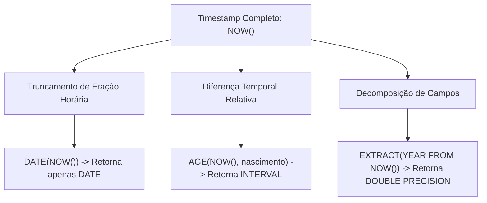
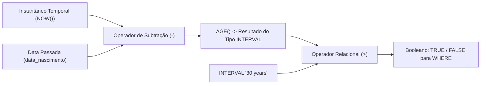
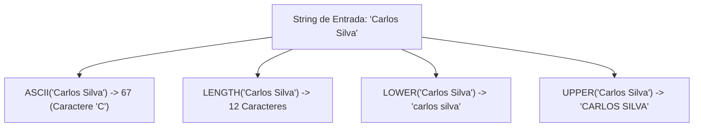
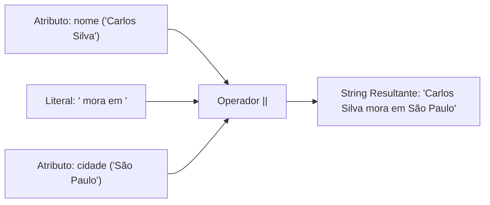
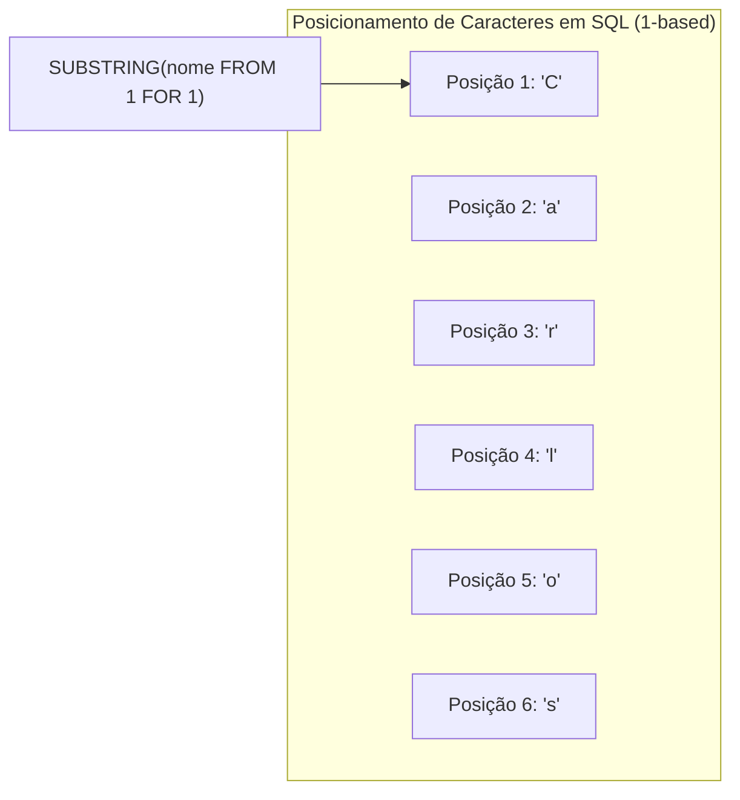
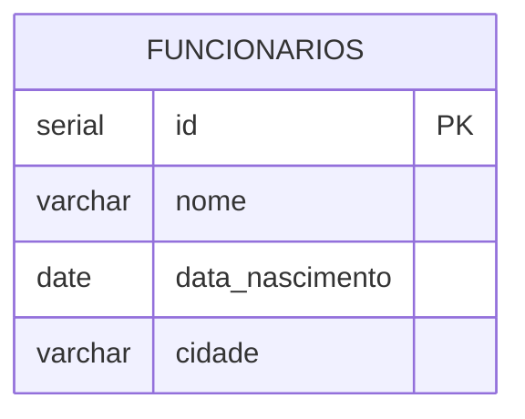
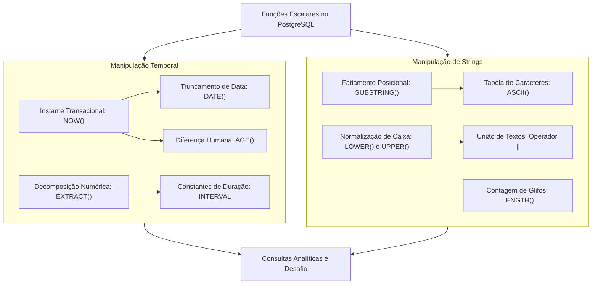

# Aula 05 — Funções de Data Hora e Strings

> **Professor:** Guilherme de Morais
> **Disciplina:** Banco de Dados II (3º Semestre)
> **Tema:** Manipulação de datas, horas, intervalos temporais e operações com strings no PostgreSQL

---

## Sumário

- [Objetivo da aula](#objetivo-da-aula)
- [Contexto e pré-requisitos](#contexto-e-pré-requisitos)
- [Funções de data e hora: NOW(), DATE(), AGE() e EXTRACT()](#funções-de-data-e-hora-now-date-age-e-extract)
- [Manipulação de intervalos temporais e comparações com INTERVAL](#manipulação-de-intervalos-temporais-e-comparações-com-interval)
- [Funções de texto e caracteres: ASCII(), LENGTH(), LOWER() e UPPER()](#funções-de-texto-e-caracteres-ascii-length-lower-e-upper)
- [Operador de concatenação de strings (||)](#operador-de-concatenação-de-strings-)
- [Extração posicional de texto com SUBSTRING()](#extração-posicional-de-texto-com-substring)
- [Consultas analíticas e formatação de saídas em bases relacionais](#consultas-analíticas-e-formatação-de-saídas-em-bases-relacionais)
- [Código da aula](#código-da-aula)
- [Exercícios](#exercícios)
- [Erros comuns e boas práticas](#erros-comuns-e-boas-práticas)
- [Links e materiais complementares](#links-e-materiais-complementares)
- [Mapa da aula](#mapa-da-aula)
- [Glossário](#glossário)
- [Pontos-chave para a prova](#pontos-chave-para-a-prova)
- [Perguntas e respostas (JSONL)](#perguntas-e-respostas-jsonl)
- [Checklist de revisão](#checklist-de-revisão)

---

## Objetivo da aula

Capacitar os estudantes de Sistemas de Informação a compreender, manipular e transformar dados temporais e textuais em Sistemas Gerenciadores de Banco de Dados Relacionais (SGBDR), com foco na sintaxe e no comportamento interno do PostgreSQL. 

Ao final desta aula, o estudante será capaz de:
1. Obter carimbos de data/hora transacionais e converter representações temporais em formatos normalizados.
2. Calcular períodos de tempo decorridos e diferenças relativas de calendário por meio da função `AGE()`.
3. Isolar partes componentes de tipos temporais (ano, mês, dia, hora) utilizando o operador ANSI `EXTRACT()`.
4. Construir filtros condicionais robustos utilizando intervalos tipados (`INTERVAL`), evitando os erros clássicos de aproximação aritmética de anos por dias fixos.
5. Inspecionar e sanitizar strings de texto por meio de funções escalares de conversão de caixa (`LOWER()`, `UPPER()`), contagem de caracteres (`LENGTH()`) e resolução posicional de código de caracteres (`ASCII()`).
6. Concatenar múltiplos atributos e literais em frases descritivas usando o operador padrão `||`, compreendendo o impacto da semântica de valores nulos (`NULL`).
7. Extrair fatias de texto a partir de coordenadas posicionais usando `SUBSTRING()` com indexação base 1 (`1-based indexing`).
8. Projetar consultas analíticas formatadas, combinando funções heterogêneas para atender a relatórios executivos e requisitos de exibição de software.

---

## Contexto e pré-requisitos

Esta aula integra o módulo de funções escalares e operadores de transformação de dados da disciplina de Banco de Dados II. Ela se baseia nos conceitos fundamentais consolidados em Banco de Dados I:

- **Álgebra Relacional e SQL Básico:** Projeção (`SELECT`), restrição (`WHERE`), ordenação (`ORDER BY`) e definição de esquemas relacionais (`CREATE TABLE`, tipos de dados fundamentais).
- **Semântica Tri-Valorada (3VL):** Compreensão do valor `NULL` como ausência de valor e o impacto do desconhecido em expressões booleanas e aritméticas.
- **Tipagem de Dados Relacional:** Noções de tipos inteiros, alfanuméricos (`VARCHAR`, `TEXT`) e temporais (`DATE`, `TIMESTAMP`).

Os tópicos aqui explorados preparam o terreno para operações mais avançadas do curso, tais como consultas analíticas complexas, gatilhos de auditoria temporal (`Triggers`), particionamento de tabelas por faixa de datas e rotinas em `PL/pgSQL`.

---

## Funções de data e hora: NOW(), DATE(), AGE() e EXTRACT()

### Definição e motivação

Em aplicações corporativas reais, o tempo é um dos eixos mais críticos de informação: registros de auditoria, cálculo de juros, validade de credenciais, controle de prazos e relatórios de métricas dependem estritamente da integridade das operações com datas e horários. Um SGBDR profissional não trata datas como meras cadeias de texto, mas sim como tipos binários estruturados capazes de respeitar fusos horários, anos bissextos e particularidades do calendário gregoriano.

O PostgreSQL oferece um conjunto robusto de funções embutidas para lidar com dados temporais. Nesta aula, exploramos quatro operadores essenciais:
- `NOW()`: Captura do instante atual com precisão de microssegundos e sensibilidade a fuso horário.
- `DATE()`: Coerção e extração exclusiva do componente de data (ano, mês e dia).
- `AGE()`: Cálculo da diferença vetorial entre duas datas, retornando um tipo `INTERVAL` decomposto em anos, meses e dias.
- `EXTRACT()`: Desestruturação cirúrgica de um campo temporal para recuperação de grandezas escalares isoladas.



### Comportamento do NOW()

A função `NOW()` retorna o tipo de dado `timestamp with time zone` (ou `timestamptz`). Um aspecto arquitetural determinante do PostgreSQL é que `NOW()` retorna o momento de início da transação corrente, e não o instante exato do relógio no microssegundo da execução da instrução. Isso assegura consistência transacional: se uma transação demorar cinco segundos processando múltiplas linhas, todas as chamadas a `NOW()` dentro da mesma transação produzirão valores idênticos.

```sql
-- Obtém o carimbo de data e hora transacional do sistema
SELECT NOW() AS data_hora_transacional;
```

*(Complemento técnico: Caso uma aplicação exija o horário real do relógio da máquina no exato instante da instrução, utiliza-se `clock_timestamp()`. Entretanto, para 99% das regras de negócio transacionais, `NOW()` é o padrão adotado.)*

### Conversão com DATE()

Em muitas operações de exibição ou agregação diária, o componente horário (horas, minutos, segundos e microssegundos) introduz ruído indesejado. A função `DATE()` (ou a coerção direta `NOW()::DATE`) trunca a parcela de tempo, preservando unicamente o ano, mês e dia.

```sql
-- Isola apenas o componente de data do instante atual
SELECT DATE(NOW()) AS somente_data;
```

### Cálculo de intervalos etários com AGE()

Subtrair duas datas diretamente em SQL (`data_a - data_b`) comumente resulta em um número inteiro representando o total de dias brutos decorridos. No entanto, traduzir "total de dias" em "anos, meses e dias" é uma tarefa sujeita a erros, devido à variação de dias nos meses (28 a 31) e anos bissextos.

A função `AGE(timestamp_final, timestamp_inicial)` resolve isso de forma determinística: ela calcula a diferença no calendário humano e retorna um tipo `INTERVAL` legível e exato.

```sql
-- Cálculo de idade com data fixa de referência
SELECT AGE('2025-01-01', '2000-01-01') AS diferenca_exata;

-- Cálculo dinâmico de idade em relação ao momento presente
SELECT AGE(NOW(), '1990-05-10') AS idade_calculada;
```

Se o primeiro argumento for omitido e a função for invocada como `AGE(timestamp)`, o PostgreSQL assume implicitamente `NOW()` como o primeiro argumento: `AGE(data_nascimento)`.

### Desestruturação analítica com EXTRACT()

A função `EXTRACT(campo FROM fonte)` segue o padrão SQL ANSI e recupera subcampos de um valor de data/hora (como ano, mês, dia, hora, minuto, segundo, dia da semana). O valor retornado é do tipo numérico de ponto flutuante de precisão dupla (`double precision`).

```sql
-- Extração do ano
SELECT EXTRACT(YEAR FROM NOW()) AS ano_atual;

-- Extração do mês
SELECT EXTRACT(MONTH FROM NOW()) AS mes_atual;

-- Extração do dia
SELECT EXTRACT(DAY FROM NOW()) AS dia_atual;

-- Extração da hora
SELECT EXTRACT(HOUR FROM NOW()) AS hora_atual;
```

### Tabela comparativa de funções de data e hora

| Função / Construtor | Tipo do Argumento de Entrada | Tipo do Valor Retornado | Finalidade Primária | Exemplo de Saída Típica |
| :--- | :--- | :--- | :--- | :--- |
| `NOW()` | Nenhum | `timestamp with time zone` | Momento de início da transação | `2026-05-06 14:32:10.123456-03` |
| `DATE(timestamp)` | `timestamp` ou `text` compatível | `date` | Extração da porção de calendário | `2026-05-06` |
| `AGE(ts1, ts2)` | Dois carimbos temporais | `interval` | Diferença em anos/meses/dias | `34 years 11 mons 26 days` |
| `EXTRACT(part FROM ts)` | Identificador de parte e timestamp | `double precision` | Isolamento numérico de componente | `2026` ou `5` |

### Exemplos, contraexemplos e armadilhas

#### Exemplo correto
```sql
-- Consulta correta para isolar o mês de uma coluna de nascimento
SELECT nome, EXTRACT(MONTH FROM data_nascimento) AS mes_aniversario
FROM funcionarios;
```

#### Contraexemplo comum
```sql
-- Inadequado: tratar data como string para extrair componentes
SELECT nome, SUBSTRING(data_nascimento::text, 6, 2) AS mes_errado
FROM funcionarios;
```

#### Armadilhas e armadilhas conceituais
1. **Confundir `EXTRACT(MONTH FROM ...)` com formatação textual:** `EXTRACT` retorna um valor numérico (`1`, `2`, ..., `12`). Ele não retorna o nome do mês por extenso nem preenche com zeros à esquerda (`01`, `02`).
2. **Ignorar fusos horários com `NOW()`:** Ao armazenar ou calcular prazos entre servidores em diferentes fusos, a interpretação local de `NOW()` pode alterar o dia do mês se o fuso de sessão do cliente estiver desalinhado do servidor.
3. **Subtração de datas pura vs `AGE()`:** Executar `NOW() - data_nascimento` retorna um intervalo baseado em tempo corrido, enquanto `AGE()` compensa a variabilidade do comprimento dos meses no calendário gregoriano.

---

## Manipulação de intervalos temporais e comparações com INTERVAL

### O tipo de dado INTERVAL no PostgreSQL

No PostgreSQL, um `INTERVAL` representa uma duração de tempo, e não um instante fixo. Ele pode armazenar anos, meses, dias, horas, minutos, segundos e frações de segundo. Essa característica o torna fundamental para cálculos de prazos, expirações de contratos e testes de elegibilidade cronológica.

O PostgreSQL permite declarar literais de intervalo usando a palavra-chave `INTERVAL` seguida de uma constante de texto tipada:
- `INTERVAL '30 years'`
- `INTERVAL '6 months'`
- `INTERVAL '15 days'`
- `INTERVAL '2 hours 30 minutes'`



### Aritmética e comparações temporais

A forma tecnicamente correta de verificar se uma pessoa atingiu uma determinada idade não envolve multiplicação arbitrária de números inteiros por 365, nem divisão de dias por 365.25. A abordagem idiomática e segura em PostgreSQL envolve comparar a saída de `AGE()` diretamente contra um `INTERVAL` tipado:

```sql
-- Filtro de elegibilidade: funcionários com mais de 30 anos completos
SELECT nome
FROM funcionarios
WHERE AGE(NOW(), data_nascimento) > INTERVAL '30 years';
```

Outra técnica matematicamente equivalente e altamente recomendada em engenharia de banco de dados (por favorecer a utilização de índices B-Tree em colunas indexadas) é somar o intervalo à data de origem:

```sql
-- Técnica sargable (permite uso de índice na coluna data_nascimento):
-- Verifica se o aniversário de 30 anos ocorreu antes de hoje
SELECT nome
FROM funcionarios
WHERE data_nascimento <= NOW() - INTERVAL '30 years';
```

*(Complemento técnico: A função `AGE(NOW(), data_nascimento) > INTERVAL '30 years'` requer a execução da função `AGE` linha por linha na tabela, invalidando índices padrão sobre `data_nascimento`. A inversão aritmética `data_nascimento <= NOW() - INTERVAL '30 years'` transforma a coluna em operando isolado, viabilizando index scan).*

### Tabela comparativa: Estratégias de cálculo de maioridade

| Estratégia | Expressão SQL | Prós | Contras |
| :--- | :--- | :--- | :--- |
| **AGE com INTERVAL (Aula)** | `AGE(NOW(), data_nasc) > INTERVAL '30 years'` | Altamente legível; reflete semântica de calendário humano. | Inibe uso de índices normais na coluna (requer índice baseado em função). |
| **Aritmética Sargable** | `data_nasc <= NOW() - INTERVAL '30 years'` | Extremamente veloz; aproveita índices B-Tree na coluna. | Ligeiramente menos intuitiva para iniciantes em SQL. |
| **Aproximação por dias (Errada)** | `(NOW() - data_nasc) > 30 * 365` | Nenhuma. | Não considera anos bissextos; gera falso positivo ou falso negativo em datas de borda. |

### Exemplos, contraexemplos e armadilhas

#### Exemplo correto
```sql
-- Funcionários com estritamente mais de 30 anos de vida
SELECT nome, data_nascimento
FROM funcionarios
WHERE AGE(NOW(), data_nascimento) > INTERVAL '30 years';
```

#### Contraexemplo comum
```sql
-- Erro clássico: desconsiderar bissextos e truncar dias
SELECT nome
FROM funcionarios
WHERE (NOW()::date - data_nascimento) / 365 > 30; -- Divisão inteira truncada e sem bissextos!
```

#### Armadilhas e armadilhas conceituais
1. **Comparações de igualdade estrita com INTERVAL:** Evite `AGE(...) = INTERVAL '30 years'`, pois `AGE` contém granularidade até dias (e horas se usado com timestamp completo). A condição só seria satisfeita no dia exato do aniversário. Para faixas etárias, use sempre `>`, `>=`, `<` ou `<=`.
2. **Unidades de intervalo escritas no plural e singular:** O PostgreSQL aceita `'30 year'`, `'30 years'`, `'1 month'`, `'1 months'`. Por convenção de engenharia de software, mantenha a coerência gramatical ou padronize no plural para evitar divergências em scripts de migração.

---

## Funções de texto e caracteres: ASCII(), LENGTH(), LOWER() e UPPER()

### Manipulação e normalização textual em bancos de dados

Dados textuais oriundos de entradas de usuários frequentemente chegam aos bancos de dados com inconsistências de caixa alta/baixa, espaços extras ou caracteres fora do padrão. Em consultas de busca e em padronizações de relatórios, o banco precisa normalizar essas strings sem alterar permanentemente os registros físicos (a menos que seja uma rotina de higienização via `UPDATE`).

As quatro funções escalares analisadas são primordiais no tratamento de cadeias de caracteres:
- `ASCII(string)`: Devolve a codificação numérica do primeiro caractere da string.
- `LENGTH(string)`: Retorna o número total de caracteres de uma cadeia.
- `LOWER(string)`: Converte todos os caracteres da string para caixa baixa.
- `UPPER(string)`: Converte todos os caracteres da string para caixa alta.



### Resolução de caracteres com ASCII()

A tabela ASCII (*American Standard Code for Information Interchange*) mapeia caracteres em valores numéricos decimais de 0 a 127. No PostgreSQL, a função `ASCII(texto)` avalia o texto fornecido e retorna o valor inteiro correspondente ao **primeiro** caractere da cadeia. Se a string contiver caracteres UTF-8 além da faixa ASCII básica, o PostgreSQL retornará o ponto de código Unicode (*Code Point*) do primeiro caractere.

```sql
-- Retorna 65, pois o código ASCII de 'A' é 65
SELECT ASCII('A');

-- Retorna 90, código ASCII de 'Z'
SELECT ASCII('Z');

-- Avalia apenas a primeira letra da string: 'C' -> 67
SELECT ASCII('Carlos Silva');
```

Essa função é muito utilizada em validações de leiautes de arquivos de remessa bancária, rotinas criptográficas primitivas, ordenações customizadas e testes de caracteres de controle.

### Medição de tamanho com LENGTH()

A função `LENGTH(string)` retorna a quantidade de caracteres existentes na cadeia informada. 

```sql
-- Retorna 14
SELECT LENGTH('Banco de Dados');

-- Medição dinâmica da coluna nome
SELECT nome, LENGTH(nome) AS total_caracteres
FROM funcionarios;
```

*(Complemento técnico: É vital distinguir `LENGTH()` de `OCTET_LENGTH()`. A função `LENGTH()` conta caracteres humanos legíveis. A função `OCTET_LENGTH()` mede o consumo em bytes físicos. Em codificações como UTF-8, um caractere acentuado como `'ã'` conta como 1 em `LENGTH()`, mas ocupa 2 bytes em `OCTET_LENGTH()`.)*

### Normalização de caixa com LOWER() e UPPER()

O PostgreSQL é estritamente sensível a maiúsculas e minúsculas (*case-sensitive*) por padrão ao comparar strings com o operador de igualdade (`=`). Logo, `'Silva'` é diferente de `'silva'`. As funções `LOWER()` e `UPPER()` são indispensáveis para comparações insensíveis à caixa (*case-insensitive*) e para padronização visual em interfaces e relatórios.

```sql
-- Conversão para minúsculas: retorna 'sql é legal'
SELECT LOWER('SQL É LEGAL');

-- Conversão para maiúsculas: retorna 'BANCO DE DADOS'
SELECT UPPER('banco de dados');
```

### Tabela comparativa de funções de texto

| Função | Argumento | Tipo de Retorno | Comportamento com Caracteres Acentuados / UTF-8 | Comportamento com String Vazia `''` |
| :--- | :--- | :--- | :--- | :--- |
| `ASCII(str)` | `text` | `integer` | Retorna o ponto de código Unicode do primeiro símbolo. | Retorna `0`. |
| `LENGTH(str)` | `text` | `integer` | Conta a quantidade de glifos/caracteres lógicos. | Retorna `0`. |
| `LOWER(str)` | `text` | `text` | Converte letras com base no *collation* e locale configurado. | Retorna `''`. |
| `UPPER(str)` | `text` | `text` | Converte letras com base no *collation* e locale configurado. | Retorna `''`. |

### Exemplos, contraexemplos e armadilhas

#### Exemplo correto
```sql
-- Busca segura insensível a maiúsculas/minúsculas
SELECT * 
FROM funcionarios 
WHERE LOWER(cidade) = 'são paulo';
```

#### Contraexemplo comum
```sql
-- Busca frágil: falha se o usuário tiver digitado 'São Paulo', 'SÃO PAULO' ou 'são paulo'
SELECT * 
FROM funcionarios 
WHERE cidade = 'são paulo';
```

#### Armadilhas e armadilhas conceituais
1. **Passagem de valor NULL para funções de texto:** `LENGTH(NULL)`, `LOWER(NULL)`, `UPPER(NULL)` e `ASCII(NULL)` resultam invariavelmente em `NULL`. Não confunda string vazia `''` (cujo `LENGTH` é 0) com `NULL`.
2. **ASCII em strings compostas:** Lembre-se sempre de que `ASCII('Ana')` e `ASCII('A')` retornam exatamente o mesmo número (`65`), pois a função examina unicamente o primeiro caractere.

---

## Operador de concatenação de strings (||)

### O operador padrão SQL de concatenação

A concatenação é a operação binária que junta duas ou mais cadeias de caracteres em uma única sequência contínua. Em conformidade com o padrão SQL ANSI, o PostgreSQL adota o operador de barra dupla vertical `||`.

```sql
-- Concatenação básica de literais
SELECT 'Olá' || ' Mundo' AS saudacao;

-- Concatenação de colunas da tabela com separadores fixos
SELECT nome || ' - ' || cidade AS funcionario_localidade
FROM funcionarios;
```



### A regra de ouro do NULL na concatenação

No padrão SQL relacional, o valor `NULL` não é uma string vazia; ele representa o estado ontológico de "dado desconhecido" ou "inexistente". Pela regra da álgebra relacional, qualquer operação de adição, subtração ou concatenação direta com um valor desconhecido resulta inevitavelmente em um valor desconhecido.

Portanto:
$$\text{'Texto qualquer'} \parallel \text{NULL} \implies \text{NULL}$$

Se um funcionário tiver o campo `cidade` preenchido como `NULL`, a expressão:
```sql
SELECT nome || ' mora em ' || cidade FROM funcionarios;
```
retornará `NULL` para a linha inteira, omitindo inclusive o nome da pessoa que estava presente.

*(Complemento técnico: Para contornar a anulação da string completa, a engenharia de software recorre a duas soluções complementares: a função `COALESCE(cidade, 'Não informada')`, que substitui o nulo por um padrão, ou a função do PostgreSQL `CONCAT(str1, str2, ...)`, que ignora silenciosamente argumentos nulos).*

### Tabela comparativa: Operador || vs Função CONCAT()

| Recurso | Sintaxe | Tratamento de NULL | Padrão ANSI | Comportamento com Tipos Não-Texto |
| :--- | :--- | :--- | :--- | :--- |
| **Operador `\|\|`** | `'A' \|\| 'B'` | Se qualquer elemento for `NULL`, o resultado total será `NULL`. | Sim (Padrão ANSI SQL). | No PostgreSQL exige coerção se o tipo não puder ser implicitamente convertido para texto. |
| **Função `CONCAT()`** | `CONCAT('A', NULL, 'B')` | Trata valores `NULL` como strings vazias, gerando `'AB'`. | Extensão SQL (presente em múltiplos SGBDs modernos). | Converte implicitamente números e datas em representações textuais. |

### Exemplos, contraexemplos e armadilhas

#### Exemplo correto
```sql
-- Concatenação segura quando se sabe que as colunas são NOT NULL
SELECT nome || ' mora em ' || cidade AS localizacao
FROM funcionarios;
```

#### Contraexemplo comum
```sql
-- Risco de anulação acidental se complemento for NULL
SELECT 'Rua ' || logradouro || ', Compl: ' || complemento AS endereco_completo
FROM clientes; -- Se complemento for NULL, todo o endereço vira NULL!
```

#### Armadilhas e armadilhas conceituais
1. **Esquecer espaços literais na concatenação:** Escrever `'Carlos'||'Silva'` resulta em `'CarlosSilva'`. Separadores e espaçamentos devem ser inseridos explicitamente como literais intermediários: `nome || ' ' || sobrenome`.
2. **Concatenação de tipos heterogêneos:** Tentar concatenar um texto diretamente com um tipo composto ou numérico muito estrito em versões antigas ou dialetos rigorosos pode exigir o cast explícito: `nome || ' - Ano: ' || EXTRACT(YEAR FROM data_nascimento)::text`. No PostgreSQL moderno, grande parte das coerções para o operador `||` ocorre automaticamente, mas a clareza tipográfica continua sendo boa prática.

---

## Extração posicional de texto com SUBSTRING()

### Padrão ANSI e indexação base 1

Em linguagens de programação derivadas do C (como Java, C#, Python, JavaScript), vetores e strings utilizam predominantemente a indexação base zero (`0-based indexing`), onde o primeiro caractere reside no índice `0`. 

**No SQL padrão e no PostgreSQL, a indexação de strings é estritamente base um (`1-based indexing`).** O primeiro caractere de uma string está situado na posição ordinal `1`. Compreender essa distinção é imperativo para evitar o temido erro de deslocamento por um (*off-by-one error*).

A função `SUBSTRING()` possui duas formas canônicas amplamente utilizadas:
1. **Sintaxe ANSI SQL padrão:** `SUBSTRING(string FROM inicio FOR quantidade)`
2. **Sintaxe de função clássica:** `SUBSTRING(string, inicio, quantidade)`

Ambas produzem rigorosamente o mesmo resultado no PostgreSQL. O material de aula adota a sintaxe ANSI padrão.



### Isolamento do primeiro caractere e combinação com ASCII()

Quando surge o requisito de extrair a inicial de uma coluna textual e determinar o seu código numérico na tabela de caracteres, a combinação da função `SUBSTRING()` com a função `ASCII()` representa a solução técnica perfeita.

```sql
-- Extrai a primeira letra do nome e calcula seu código ASCII
SELECT nome, ASCII(SUBSTRING(nome FROM 1 FOR 1)) AS codigo_ascii_inicial
FROM funcionarios;
```

A cláusula `FROM 1` indica o ponto de partida (o primeiro caractere da cadeia) e a cláusula `FOR 1` instrui o motor do banco a capturar uma extensão de exatamente um caractere.

### Tabela comparativa de fatiamento de strings

| Expressão | String Avaliada | Posição Inicial | Comprimento | Resultado | Explicação |
| :--- | :--- | :--- | :--- | :--- | :--- |
| `SUBSTRING('PostgreSQL' FROM 1 FOR 4)` | `'PostgreSQL'` | `1` | `4` | `'Post'` | Inicia na primeira letra e avança 4 posições. |
| `SUBSTRING('PostgreSQL' FROM 5 FOR 4)` | `'PostgreSQL'` | `5` | `4` | `'gres'` | Inicia na quinta letra (`'g'`) e captura 4 posições. |
| `SUBSTRING('PostgreSQL' FROM 1 FOR 1)` | `'PostgreSQL'` | `1` | `1` | `'P'` | Coleta exclusivamente o primeiro caractere. |
| `SUBSTRING('PostgreSQL' FROM 7)` | `'PostgreSQL'` | `7` | Até o fim | `'SQL'` | Quando `FOR` é omitido, extrai até o término da string. |

### Exemplos, contraexemplos e armadilhas

#### Exemplo correto
```sql
-- Obter os 3 primeiros caracteres de um código ou sigla
SELECT nome, SUBSTRING(cidade FROM 1 FOR 3) AS sigla_cidade
FROM funcionarios;
```

#### Contraexemplo comum
```sql
-- Erro de desenvolvedor vindo de Python/C: passar 0 como índice inicial
SELECT nome, SUBSTRING(nome FROM 0 FOR 2) AS resultado_estranho
FROM funcionarios;
```
*No PostgreSQL, o índice `0` não representa a primeira letra. Se você solicitar `FROM 0 FOR 2`, o banco interpreta que a fatia começa antes da posição 1 e engloba 2 caracteres de largura, retornando apenas o caractere da posição 1!*

#### Armadilhas e armadilhas conceituais
1. **Comprimentos negativos:** Passar valores negativos para o parâmetro `FOR` provocará um erro em tempo de execução (`ERROR: negative substring length not allowed`).
2. **Extrações além dos limites da string:** Se você solicitar `SUBSTRING('Ana' FROM 1 FOR 50)`, o PostgreSQL não lançará erro; ele retornará simplesmente os caracteres disponíveis até o encerramento da cadeia (`'Ana'`).

---

## Consultas analíticas e formatação de saídas em bases relacionais

### Separação entre camada de dados e camada de apresentação

Em arquiteturas clássicas de sistemas corporativos, vigora a seguinte pergunta: *A formatação de textos, datas e rótulos deve ser realizada no banco de dados ou no backend/frontend da aplicação?*

- **Camada de Apresentação (App):** Deve cuidar de internacionalização complexa (i18n), máscaras dinâmicas de campos e elementos interativos.
- **Camada de Dados (Banco):** É altamente eficiente na projeção de relatórios consolidados, extrações em lote (arquivos CSV para data warehouses) e consultas de telemetria onde o tráfego de rede precisa ser minimizado através de saídas prontas e sumarizadas.

A habilidade de estruturar uma consulta combinando múltiplas funções temporais e textuais em uma única linha tabular confere independência e agilidade ao analista de sistemas.



### O Desafio da Aula: Unificação de funções escalares

O exercício desafio da aula propõe a construção de uma visão formatada onde as colunas originais sofrem quatro mutações concomitantes:
1. `UPPER(nome)`: Caixa alta completa no nome.
2. `AGE(NOW(), data_nascimento)`: Cálculo dinâmico do intervalo de idade.
3. `LOWER(cidade)`: Caixa baixa completa na cidade de residência.
4. `EXTRACT(YEAR FROM data_nascimento)`: Extração exclusiva do ano de nascimento.

Cada uma dessas transformações atua sobre um tipo de dado específico (`varchar` e `date`), convergindo na projeção final estruturada.

### Tabela comparativa: Dados brutos vs Projeção analítica formatada

| Atributo na Tabela Físico | Valor Bruto Armazenado | Função Aplicada | Saída Analítica Formatada |
| :--- | :--- | :--- | :--- |
| `nome` | `'Carlos Silva'` | `UPPER(nome)` | `'CARLOS SILVA'` |
| `data_nascimento` | `'1990-05-10'` | `AGE(NOW(), data_nascimento)` | `34 years 11 mons 26 days` (variável conforme data) |
| `cidade` | `'São Paulo'` | `LOWER(cidade)` | `'são paulo'` |
| `data_nascimento` | `'1990-05-10'` | `EXTRACT(YEAR FROM data_nascimento)` | `1990` |

---

## Código da aula

Nesta seção, apresentamos os arquivos de script SQL associados à aula, demonstrando tanto a infraestrutura de dados quanto a resolução de cada consulta proposta.

### Arquivo: ./codigo/exemplos.sql

O arquivo [`exemplos.sql`](./codigo/exemplos.sql) encapsula o script de inicialização do ambiente, a definição DDL da tabela `funcionarios`, a inserção dos dados de teste (DML) e os exemplos conceituais de funções atômicas apresentados no início da aula.

```sql
-- ============================================================================
-- Arquivo: ./codigo/exemplos.sql
-- Disciplina: Banco de Dados II - Prof. Guilherme de Morais
-- Conteúdo: Criação de esquemas e exemplos de funções de data, hora e strings
-- ============================================================================

-- 1. FUNÇÕES ATÔMICAS DE DATA E HORA
-- Exibe a data e hora transacional completa do sistema
SELECT NOW() AS data_atual;

-- Trunca o componente de horário, preservando apenas a data
SELECT DATE(NOW()) AS somente_data;

-- Calcula a diferença temporal fixa entre dois instantes
SELECT AGE('2025-01-01', '2000-01-01') AS diferenca_anos;

-- Calcula a idade dinâmica em relação ao dia de hoje
SELECT AGE(NOW(), '1990-05-10') AS idade;

-- Decomposição de partes de uma data usando EXTRACT
SELECT EXTRACT(YEAR FROM NOW()) AS ano;
SELECT EXTRACT(MONTH FROM NOW()) AS mes;
SELECT EXTRACT(DAY FROM NOW()) AS dia;
SELECT EXTRACT(HOUR FROM NOW()) AS hora;

-- 2. FUNÇÕES ATÔMICAS DE STRINGS
-- Retorna o valor numérico do primeiro caractere segundo a tabela ASCII
SELECT ASCII('A') AS ascii_a;

-- Concatenação de literais pelo operador ||
SELECT 'Olá' || ' Mundo' AS concatenacao_simples;

-- Contagem do número de caracteres em uma string
SELECT LENGTH('Banco de Dados') AS tamanho_string;

-- Normalização de caracteres para caixa baixa
SELECT LOWER('SQL É LEGAL') AS texto_minusculo;

-- Normalização de caracteres para caixa alta
SELECT UPPER('sql é legal') AS texto_maiusculo;

-- 3. CRIAÇÃO DA BASE DE DADOS DE EXEMPLO
DROP TABLE IF EXISTS funcionarios;

CREATE TABLE funcionarios (
    id SERIAL PRIMARY KEY,
    nome VARCHAR(100),
    data_nascimento DATE,
    cidade VARCHAR(100)
);

-- Inserção de dados iniciais
INSERT INTO funcionarios (nome, data_nascimento, cidade) VALUES
('Carlos Silva', '1990-05-10', 'São Paulo'),
('Ana Souza', '1985-08-22', 'Rio de Janeiro'),
('João Lima', '2000-01-15', 'Belo Horizonte');

-- Exemplo prático de concatenação sobre a tabela
SELECT nome || ' - ' || cidade AS funcionario_cidade FROM funcionarios;
```

### Arquivo: ./codigo/exercicios.sql

O arquivo [`exercicios.sql`](./codigo/exercicios.sql) reúne todos os comandos de consulta desenvolvidos para os exercícios básicos, intermediários, avançados e o desafio final.

```sql
-- ============================================================================
-- Arquivo: ./codigo/exercicios.sql
-- Disciplina: Banco de Dados II - Prof. Guilherme de Morais
-- Conteúdo: Resolução de todos os exercícios de aula e desafio
-- ============================================================================

-- ----------------------------------------------------------------------------
-- NÍVEL BÁSICO
-- ----------------------------------------------------------------------------

-- Exercício 1: Exibir data e hora atual do sistema
SELECT NOW() AS data_hora_atual;

-- Exercício 2: Exibir apenas a data atual
SELECT DATE(NOW()) AS data_atual;

-- Exercício 3: Converter "banco de dados" para maiúsculo
SELECT UPPER('banco de dados') AS texto_maiusculo;

-- Exercício 4: Mostrar o tamanho da palavra "Universidade"
SELECT LENGTH('Universidade') AS total_caracteres;

-- Exercício 5: Retornar o código ASCII da letra 'Z'
SELECT ASCII('Z') AS codigo_ascii_z;

-- ----------------------------------------------------------------------------
-- NÍVEL INTERMEDIÁRIO
-- ----------------------------------------------------------------------------

-- Exercício 6: Listar nomes em letras minúsculas
SELECT LOWER(nome) AS nome_minusculo 
FROM funcionarios;

-- Exercício 7: Nome concatenado com a cidade
SELECT nome || ' mora em ' || cidade AS moradia 
FROM funcionarios;

-- Exercício 8: Extrair o ano de nascimento dos funcionários
SELECT nome, EXTRACT(YEAR FROM data_nascimento) AS ano_nascimento 
FROM funcionarios;

-- Exercício 9: Calcular a idade dos funcionários
SELECT nome, AGE(NOW(), data_nascimento) AS idade 
FROM funcionarios;

-- Exercício 10: Contar quantos caracteres tem o nome de cada funcionário
SELECT nome, LENGTH(nome) AS tamanho_nome 
FROM funcionarios;

-- ----------------------------------------------------------------------------
-- NÍVEL AVANÇADO
-- ----------------------------------------------------------------------------

-- Exercício 11: Listar funcionários com mais de 30 anos
SELECT nome
FROM funcionarios
WHERE AGE(NOW(), data_nascimento) > INTERVAL '30 years';

-- Exercício 12: Nomes em maiúsculo junto com o ano de nascimento
SELECT UPPER(nome) AS nome_maiusculo, EXTRACT(YEAR FROM data_nascimento) AS ano_nascimento
FROM funcionarios;

-- Exercício 13: Criar a frase "Nome - Idade - Cidade"
SELECT nome || ' - ' || AGE(NOW(), data_nascimento) || ' - ' || cidade AS relatorio_funcionario
FROM funcionarios;

-- Exercício 14: Funcionários nascidos no mês de janeiro
SELECT nome
FROM funcionarios
WHERE EXTRACT(MONTH FROM data_nascimento) = 1;

-- Exercício 15: Primeiro caractere do nome e seu código ASCII
SELECT nome, ASCII(SUBSTRING(nome FROM 1 FOR 1)) AS ascii_primeira_letra
FROM funcionarios;

-- ----------------------------------------------------------------------------
-- ATIVIDADE DESAFIO
-- ----------------------------------------------------------------------------

-- Exercício 16: Projeção de Nome em maiúsculo, Idade, Cidade em minúsculo e Ano
SELECT 
    UPPER(nome) AS nome_maiusculo,
    AGE(NOW(), data_nascimento) AS idade,
    LOWER(cidade) AS cidade_minusculo,
    EXTRACT(YEAR FROM data_nascimento) AS ano_nascimento
FROM funcionarios;
```

---

## Exercícios

Abaixo constam as resoluções comentadas para os dezesseis exercícios propostos pelo professor, categorizados de acordo com sua complexidade analítica.

### Exercício 1 — Exibir data e hora atual

- **Enunciado:** Exiba a data e hora atual do sistema.
- **Raciocínio lógico e técnico:** A função sem argumentos `NOW()` deve ser invocada na lista de projeção do comando `SELECT`. Ela lê o relógio transacional do PostgreSQL e retorna um carimbo completo com fuso horário.
- **Resolução comentada:**
```sql
-- Recupera o instante transacional atual
SELECT NOW() AS data_hora_atual;
```
- **Referência:** [exercicios.sql](./codigo/exercicios.sql)

---

### Exercício 2 — Exibir somente a data atual

- **Enunciado:** Mostre apenas a data atual do sistema, sem a fração de hora.
- **Raciocínio lógico e técnico:** Para eliminar os componentes de hora, minuto, segundo e microssegundos do `NOW()`, aplica-se a função de conversão/truncamento `DATE()`.
- **Resolução comentada:**
```sql
-- Descarta a porção horária do timestamp atual
SELECT DATE(NOW()) AS data_atual;
```
- **Referência:** [exercicios.sql](./codigo/exercicios.sql)

---

### Exercício 3 — Converter texto para maiúsculo

- **Enunciado:** Converta a frase 'banco de dados' para letras maiúsculas.
- **Raciocínio lógico e técnico:** A função escalar `UPPER()` aceita um literal alfanumérico e converte cada glifo alfabético para seu correspondente em caixa alta, respeitando as regras do alfabeto latino.
- **Resolução comentada:**
```sql
-- Transforma caracteres minúsculos para maiúsculos
SELECT UPPER('banco de dados') AS texto_maiusculo;
```
- **Referência:** [exercicios.sql](./codigo/exercicios.sql)

---

### Exercício 4 — Contar caracteres de texto estático

- **Enunciado:** Mostre o tamanho da palavra "Universidade" contando seus caracteres.
- **Raciocínio lógico e técnico:** Aplica-se a função escalar `LENGTH()`, que avalia a quantidade de caracteres da cadeia fornecida e retorna um valor inteiro.
- **Resolução comentada:**
```sql
-- Retorna a contagem exata de letras da palavra
SELECT LENGTH('Universidade') AS total_caracteres;
```
- **Referência:** [exercicios.sql](./codigo/exercicios.sql)

---

### Exercício 5 — Obter código ASCII

- **Enunciado:** Retorne o código ASCII da letra 'Z'.
- **Raciocínio lógico e técnico:** A função `ASCII()` recebe um caractere ou cadeia de caracteres e inspeciona o primeiro elemento, mapeando-o para a tabela ASCII decimal padrão.
- **Resolução comentada:**
```sql
-- 'Z' maiúsculo corresponde à posição decimal 90 na tabela ASCII
SELECT ASCII('Z') AS codigo_ascii_z;
```
- **Referência:** [exercicios.sql](./codigo/exercicios.sql)

---

### Exercício 6 — Listar nomes em letras minúsculas

- **Enunciado:** Liste o nome dos funcionários da tabela em letras minúsculas.
- **Raciocínio lógico e técnico:** Deve-se projetar a coluna `nome` da tabela `funcionarios` como argumento da função `LOWER()`.
- **Resolução comentada:**
```sql
-- Projeta todos os nomes dos funcionários normalizados em minúsculas
SELECT LOWER(nome) AS nome_minusculo 
FROM funcionarios;
```
- **Referência:** [exercicios.sql](./codigo/exercicios.sql)

---

### Exercício 7 — Concatenar nome e cidade

- **Enunciado:** Mostre o nome de cada funcionário concatenado com a sua cidade no formato: 'Nome mora em Cidade'.
- **Raciocínio lógico e técnico:** Utiliza-se o operador de concatenação binário `||` conectando a coluna `nome`, o literal intermediário `' mora em '` (incluindo os espaços necessários) e a coluna `cidade`.
- **Resolução comentada:**
```sql
-- Concatena colunas e literais formando uma oração completa
SELECT nome || ' mora em ' || cidade AS moradia 
FROM funcionarios;
```
- **Referência:** [exercicios.sql](./codigo/exercicios.sql)

---

### Exercício 8 — Extrair ano de nascimento

- **Enunciado:** Extraia o ano de nascimento de todos os funcionários cadastrados.
- **Raciocínio lógico e técnico:** Utiliza-se o operador `EXTRACT(YEAR FROM data_nascimento)`, apontando para a coluna temporal da tabela `funcionarios`.
- **Resolução comentada:**
```sql
-- Decompõe a data de nascimento, isolando a grandeza do ano
SELECT nome, EXTRACT(YEAR FROM data_nascimento) AS ano_nascimento 
FROM funcionarios;
```
- **Referência:** [exercicios.sql](./codigo/exercicios.sql)

---

### Exercício 9 — Calcular idade dos funcionários

- **Enunciado:** Calcule a idade exata dos funcionários utilizando a data atual e a data de nascimento.
- **Raciocínio lógico e técnico:** A função `AGE(NOW(), data_nascimento)` avalia a distância entre o instante atual fornecido por `NOW()` e o campo `data_nascimento`, retornando a idade no tipo estruturado `INTERVAL`.
- **Resolução comentada:**
```sql
-- Gera o intervalo descritivo em anos, meses e dias decorridos
SELECT nome, AGE(NOW(), data_nascimento) AS idade 
FROM funcionarios;
```
- **Referência:** [exercicios.sql](./codigo/exercicios.sql)

---

### Exercício 10 — Contar caracteres dos nomes dos funcionários

- **Enunciado:** Mostre quantos caracteres tem o nome de cada funcionário.
- **Raciocínio lógico e técnico:** Aplica-se a função `LENGTH()` sobre a coluna `nome`, retornando a métrica individual para cada linha retornada pela tabela.
- **Resolução comentada:**
```sql
-- Calcula a extensão da cadeia textual de cada tupla
SELECT nome, LENGTH(nome) AS tamanho_nome 
FROM funcionarios;
```
- **Referência:** [exercicios.sql](./codigo/exercicios.sql)

---

### Exercício 11 — Filtrar funcionários por idade superior a 30 anos

- **Enunciado:** Liste o nome dos funcionários com mais de 30 anos utilizando intervalo de tempo.
- **Raciocínio lógico e técnico:** Deve-se construir uma cláusula `WHERE` que restrinja os registros comparando o retorno da função `AGE(NOW(), data_nascimento)` com a constante tipada `INTERVAL '30 years'`.
- **Resolução comentada:**
```sql
-- Filtra registros avaliando o intervalo etário frente a 30 anos
SELECT nome
FROM funcionarios
WHERE AGE(NOW(), data_nascimento) > INTERVAL '30 years';
```
- **Referência:** [exercicios.sql](./codigo/exercicios.sql)

---

### Exercício 12 — Projetar nome em maiúsculo e ano de nascimento

- **Enunciado:** Mostre os nomes dos funcionários em maiúsculo acompanhados do respectivo ano de nascimento.
- **Raciocínio lógico e técnico:** Combina-se na lista de projeção do `SELECT` a função de manipulação de string `UPPER(nome)` e a função de desestruturação temporal `EXTRACT(YEAR FROM data_nascimento)`.
- **Resolução comentada:**
```sql
-- Projeção multi-função em um único comando
SELECT UPPER(nome) AS nome_maiusculo, EXTRACT(YEAR FROM data_nascimento) AS ano_nascimento
FROM funcionarios;
```
- **Referência:** [exercicios.sql](./codigo/exercicios.sql)

---

### Exercício 13 — Criar frase descritiva com dados do funcionário

- **Enunciado:** Crie uma frase concatenada no formato 'Nome - Idade - Cidade' para cada registro.
- **Raciocínio lógico e técnico:** O operador `||` é encadeado quatro vezes para unir `nome`, o literal separador `' - '`, o resultado dinâmico de `AGE(NOW(), data_nascimento)`, o segundo separador `' - '` e a `cidade`.
- **Resolução comentada:**
```sql
-- Encadeamento do operador || com colunas textuais e tipo interval
SELECT nome || ' - ' || AGE(NOW(), data_nascimento) || ' - ' || cidade AS relatorio_funcionario
FROM funcionarios;
```
- **Referência:** [exercicios.sql](./codigo/exercicios.sql)

---

### Exercício 14 — Filtrar funcionários aniversariantes de janeiro

- **Enunciado:** Mostre apenas os funcionários nascidos no mês de janeiro.
- **Raciocínio lógico e técnico:** Na cláusula `WHERE`, decompõe-se o mês da `data_nascimento` com `EXTRACT(MONTH FROM data_nascimento)` e compara-se com o valor numérico `1` correspondente a janeiro.
- **Resolução comentada:**
```sql
-- Restrição lógica baseada no mês extraído da data
SELECT nome
FROM funcionarios
WHERE EXTRACT(MONTH FROM data_nascimento) = 1;
```
- **Referência:** [exercicios.sql](./codigo/exercicios.sql)

---

### Exercício 15 — Obter primeira letra e respectivo código ASCII

- **Enunciado:** Exiba o primeiro caractere do nome de cada funcionário e o respectivo código ASCII correspondente.
- **Raciocínio lógico e técnico:** Utiliza-se a função `SUBSTRING(nome FROM 1 FOR 1)` para recortar o primeiro caractere de cada nome. Em seguida, passa-se esse recorte como parâmetro para a função `ASCII()`.
- **Resolução comentada:**
```sql
-- Aninhamento funcional: SUBSTRING recortando a primeira letra e ASCII decodificando
SELECT nome, ASCII(SUBSTRING(nome FROM 1 FOR 1)) AS codigo_ascii_inicial
FROM funcionarios;
```
- **Referência:** [exercicios.sql](./codigo/exercicios.sql)

---

### Exercício 16 — Atividade Desafio: Projeção formatada de atributos

- **Enunciado:** Crie uma consulta que retorne: Nome em maiúsculo, Idade, Cidade em minúsculo e Ano de nascimento, no formato: 'CARLOS SILVA | 34 years | são paulo | 1990'.
- **Raciocínio lógico e técnico:** O desafio pode ser atendido projetando os quatro atributos em colunas separadas formatadas, ou alternativamente unificando-os por meio de concatenação com o delimitador `' | '`. Apresentamos abaixo a resolução projetando colunas separadas com alias semântico (conforme sugerido pela saída de dados em grade) e também a versão em linha textual consolidada.
- **Resolução comentada:**

**Abordagem 1 — Projeção em colunas tabulares estruturadas:**
```sql
-- Projeção colunar analítica estruturada
SELECT 
    UPPER(nome) AS nome_maiusculo,
    AGE(NOW(), data_nascimento) AS idade,
    LOWER(cidade) AS cidade_minusculo,
    EXTRACT(YEAR FROM data_nascimento) AS ano_nascimento
FROM funcionarios;
```

**Abordagem 2 — Linha única concatenada (geração do formato literal exato):**
```sql
-- Geração de string de saída exata: CARLOS SILVA | 34 years... | são paulo | 1990
SELECT 
    UPPER(nome) || ' | ' || 
    AGE(NOW(), data_nascimento) || ' | ' || 
    LOWER(cidade) || ' | ' || 
    EXTRACT(YEAR FROM data_nascimento) AS linha_desafio
FROM funcionarios;
```
- **Referência:** [exercicios.sql](./codigo/exercicios.sql)

---

## Erros comuns e boas práticas

### Erros conceituais e de sintaxe

1. **Achar que SQL usa índice 0 para strings:**
   - *Erro:* `SUBSTRING(nome FROM 0 FOR 1)`
   - *Causa:* Confusão com C/Java/Python.
   - *Correção:* Em SQL, utilize sempre `FROM 1` para o primeiro caractere.
2. **Propagação silenciosa de NULL na concatenação:**
   - *Erro:* Confiar que `'Sr(a). ' || sobrenome` produzirá algo quando `sobrenome` for `NULL`. O resultado é `NULL`.
   - *Correção:* Se o atributo puder conter nulos, utilize a função `COALESCE(sobrenome, '')` ou use `CONCAT()`.
3. **Cálculo de maioridade por multiplicação de dias:**
   - *Erro:* `WHERE (NOW() - data_nascimento) > 30 * 365`
   - *Causa:* Desprezo dos anos bissextos. Um indivíduo de 30 anos vivenciou 7 ou 8 dias bissextos ao longo da vida, deslocando o cálculo em mais de uma semana.
   - *Correção:* Use sempre `AGE(NOW(), data_nascimento) > INTERVAL '30 years'`.
4. **Tratar retorno de EXTRACT como texto:**
   - *Erro:* Fazer comparações lexicais como `WHERE EXTRACT(MONTH FROM data) = '01'`.
   - *Correção:* `EXTRACT` retorna valor numérico (`double precision`). Compare diretamente com o número inteiro `1`.

### Boas práticas de engenharia de software

- **Nomenclatura explícita de colunas projetadas (`AS`):** Sempre que aplicar funções de transformação (`UPPER`, `AGE`, `EXTRACT`), atribua aliases claros. Projeções sem alias resultam em rótulos de coluna gerados automaticamente pelo SGBD (ex: `?column?` ou simplesmente `upper`), dificultando o mapeamento em camadas de ORM (como Hibernate, Prisma ou Entity Framework).
- **Atenção ao desempenho em filtros (Sargability):** Ao filtrar milhões de linhas em tabelas massivas, evite aplicar funções sobre a coluna indexada na cláusula `WHERE`. Prefira `data_nascimento <= NOW() - INTERVAL '30 years'` a `AGE(NOW(), data_nascimento) > INTERVAL '30 years'`, viabilizando a busca por índice B-Tree sem sobrecarga de varredura sequencial (*sequential scan*).
- **Padronização de caixa de comandos SQL:** Mantenha palavras-chave reservadas (`SELECT`, `FROM`, `WHERE`, `INTERVAL`) em letras maiúsculas e nomes de tabelas/colunas em minúsculas (`snake_case`), aumentando a legibilidade do código-fonte.

---

## Links e materiais complementares

- **Documentação Oficial do PostgreSQL — Funções e Operadores de Data/Hora:**
  Referência exaustiva sobre todas as unidades aceitas pelo `EXTRACT`, suporte a fusos horários e aritmética com tipos `INTERVAL`.
  *Disponível na documentação oficial da versão corrente do PostgreSQL.*
- **Documentação Oficial do PostgreSQL — Funções e Operadores de String:**
  Detalhamento sobre funções de manipulação de texto, collation, codificações UTF-8, `LENGTH()`, `OCTET_LENGTH()` e `SUBSTRING()`.
  *Disponível na documentação oficial da versão corrente do PostgreSQL.*
- **Padrão ANSI/ISO SQL:1999 e SQL:2016:**
  Normas internacionais que definem o comportamento do operador de concatenação `||`, expressões `SUBSTRING` com sintaxe `FROM ... FOR` e o operador `EXTRACT`.

---

## Mapa da aula



---

## Glossário

| Termo Técnico | Definição no Contexto de Banco de Dados |
| :--- | :--- |
| **SGBDR** | Sistema Gerenciador de Banco de Dados Relacional (ex: PostgreSQL, Oracle, MySQL). |
| **Timestamp with time zone** | Tipo de dado temporal que registra data, hora e a informação de fuso horário associada. |
| **Interval** | Tipo de dado que expressa um período ou duração de tempo, decomposto em anos, meses, dias e frações. |
| **Sargability** | Capacidade de uma cláusula `WHERE` utilizar um índice existente na tabela para acelerar a busca. |
| **Collation** | Conjunto de regras linguísticas que determina a ordenação e a equivalência de caracteres em strings. |
| **Indexação Base 1** | Convenção matemática e do SQL onde o primeiro elemento de uma sequência é referenciado pelo índice 1. |
| **Ponto de Código (Code Point)**| Identificador numérico exclusivo associado a cada caractere individual na tabela Unicode/ASCII. |
| **Semântica Tri-Valorada** | Lógica computacional do SQL baseada em três estados lógicos possíveis: Verdadeiro, Falso e Nulo (`NULL`). |

---

## Pontos-chave para a prova

1. **Retorno da função AGE():** Lembrar que `AGE()` retorna um valor do tipo `INTERVAL`, e não um número inteiro simples de anos ou dias.
2. **Índice inicial do SUBSTRING:** O SQL padrão adota índice inicial `1`. A invocação `SUBSTRING('Teste' FROM 1 FOR 1)` retorna a letra `'T'`.
3. **Propagação de NULL no operador `||`:** Qualquer valor concatenado com `NULL` usando `||` resultará impreterivelmente em `NULL`.
4. **Tipo retornado por EXTRACT:** A função `EXTRACT()` extrai partes como números (`double precision`), permitindo comparações numéricas diretas (`= 1`), e não cadeias de texto (`= '01'`).
5. **Comparações de INTERVAL:** Saber formular filtros com intervalos tipados no `WHERE`, como `WHERE AGE(NOW(), data_nascimento) > INTERVAL '30 years'`.
6. **Comportamento do ASCII():** Saber que `ASCII('Texto')` avalia exclusivamente o primeiro caractere da cadeia fornecida.

---

## Perguntas e respostas (JSONL)

```jsonl
{"pergunta": "Qual é a principal diferença entre subtrair duas datas diretamente e utilizar a função AGE() no PostgreSQL?", "resposta": "A subtração direta de datas produz a quantidade total de dias brutos decorridos, enquanto AGE() retorna um tipo INTERVAL decomposto em anos, meses e dias relativos ao calendário gregoriano.", "dificuldade": "medio"}
{"pergunta": "Por que a expressão 'Carlos' || NULL resulta em NULL no PostgreSQL?", "resposta": "Porque o operador de concatenação || segue a semântica tri-valorada do padrão SQL ANSI, onde qualquer operação combinada com um dado desconhecido (NULL) resulta obrigatoriamente em desconhecido (NULL).", "dificuldade": "facil"}
{"pergunta": "Qual o valor retornado pela consulta SELECT ASCII('Z');?", "resposta": "Retorna o número inteiro 90, que é a posição da letra 'Z' maiúscula na codificação decimal da tabela ASCII.", "dificuldade": "facil"}
{"pergunta": "O que acontece se um desenvolvedor executar SUBSTRING('UniFEF' FROM 0 FOR 2) no PostgreSQL?", "resposta": "Como a indexação no PostgreSQL inicia em 1, a posição 0 é tratada como prévia à string. A fatia de 2 posições cobrirá a posição 0 e a posição 1, retornando apenas 'U'.", "dificuldade": "dificil"}
{"pergunta": "Qual é o tipo de dado retornado pela função EXTRACT(YEAR FROM NOW())?", "resposta": "Retorna um valor numérico de ponto flutuante de precisão dupla (double precision).", "dificuldade": "medio"}
{"pergunta": "Qual a finalidade primordial da função DATE(NOW())?", "resposta": "Truncar e descartar a fração de horário (horas, minutos, segundos e frações), retornando estritamente a data composta por ano, mês e dia.", "dificuldade": "facil"}
{"pergunta": "Como filtrar funcionários com mais de 30 anos usando a função AGE e a cláusula WHERE?", "resposta": "Utiliza-se a condição WHERE AGE(NOW(), data_nascimento) > INTERVAL '30 years';", "dificuldade": "medio"}
{"pergunta": "Qual a diferença entre a função LENGTH() e a função OCTET_LENGTH() no tratamento de strings UTF-8?", "resposta": "LENGTH() conta o número de caracteres lógicos visíveis, enquanto OCTET_LENGTH() mede a quantidade de bytes físicos ocupados na memória/disco.", "dificuldade": "dificil"}
{"pergunta": "Se uma tabela contiver nomes com letras maiúsculas e minúsculas misturadas, como fazer uma busca exata insensível à caixa por 'são paulo'?", "resposta": "Aplica-se a função de conversão na coluna com WHERE LOWER(cidade) = 'são paulo';", "dificuldade": "facil"}
{"pergunta": "Qual comando SQL extrai apenas a primeira letra de uma coluna chamada 'nome'?", "resposta": "SELECT SUBSTRING(nome FROM 1 FOR 1) FROM tabela;", "dificuldade": "medio"}
{"pergunta": "Qual a função do PostgreSQL que retorna o código ASCII do primeiro caractere de uma coluna?", "resposta": "A função ASCII(). Quando recebe uma string longa, ela ignora os caracteres subsequentes e avalia unicamente o primeiro.", "dificuldade": "facil"}
{"pergunta": "Por que a função NOW() retorna o mesmo valor ao longo de toda uma transação complexa?", "resposta": "Porque no PostgreSQL NOW() reflete o instante de início da transação (transaction timestamp) para garantir consistência lógica entre instruções correlacionadas.", "dificuldade": "dificil"}
{"pergunta": "Como transformar o número do mês extraído de uma data de volta para um formato com zero à esquerda (ex: '01' em vez de 1)?", "resposta": "Deve-se converter o número com TO_CHAR(data, 'MM') ou através de cast e concatenação condicional.", "dificuldade": "medio"}
{"pergunta": "O que retorna a função LOWER('SQL É LEGAL')?", "resposta": "Retorna a string convertida para minúsculas: 'sql é legal'.", "dificuldade": "facil"}
{"pergunta": "Qual o operador padrão ANSI SQL para concatenação de strings utilizado nesta aula?", "resposta": "O operador de duas barras verticais (||).", "dificuldade": "facil"}
{"pergunta": "Como calcular o número de caracteres de um texto fixo como 'Universidade' em SQL?", "resposta": "Executando SELECT LENGTH('Universidade'); que retornará o inteiro 12.", "dificuldade": "facil"}
{"pergunta": "Por que comparar a idade de um funcionário calculando '(NOW() - data_nasc) > 30 * 365' é considerado uma má prática?", "resposta": "Porque desconsidera a ocorrência periódica de anos bissextos (que possuem 366 dias), gerando distorções de cálculo em datas limítrofes.", "dificuldade": "medio"}
{"pergunta": "O que a cláusula EXTRACT(MONTH FROM data_nascimento) = 1 em um SELECT realiza?", "resposta": "Filtra apenas os registros cuja data de nascimento ocorra no mês de janeiro.", "dificuldade": "facil"}
{"pergunta": "O que é uma consulta com predicado 'sargable' em bancos de dados relacionais?", "resposta": "É uma consulta cuja condição na cláusula WHERE permite que o otimizador do banco utilize índices existentes na coluna sem precisar aplicar funções linha a linha.", "dificuldade": "dificil"}
{"pergunta": "Qual o resultado da consulta SELECT UPPER(nome) FROM funcionarios para o registro 'Carlos Silva'?", "resposta": "Retorna a cadeia de caracteres totalmente em caixa alta: 'CARLOS SILVA'.", "dificuldade": "facil"}
```

---

## Checklist de revisão

- [ ] Compreendi a diferença entre carimbo de data/hora transacional (`NOW()`) e data estática (`DATE()`).
- [ ] Sei calcular a idade exata de uma entidade utilizando a função `AGE()` e comparar com `INTERVAL`.
- [ ] Sei por que não devo calcular idade multiplicando anos por 365 dias fixos.
- [ ] Domino o uso de `EXTRACT()` para isolar ano, mês, dia e hora em valores temporais.
- [ ] Sei que o tipo retornado por `EXTRACT()` é numérico (`double precision`) e não textual.
- [ ] Compreendo o funcionamento da função `ASCII()` e sei que ela avalia unicamente o primeiro caractere da string.
- [ ] Sei contar caracteres com a função `LENGTH()` e diferençá-la da contagem de bytes físicos.
- [ ] Sei converter strings para maiúsculas (`UPPER()`) e minúsculas (`LOWER()`) para comparações insensíveis a maiúsculas/minúsculas.
- [ ] Entendo que o operador de concatenação padrão SQL é `||`.
- [ ] Tenho plena ciência de que concatenar qualquer valor com `NULL` através de `||` resultará em `NULL`.
- [ ] Sei que a indexação de strings no SQL e no PostgreSQL começa no índice `1` (1-based), e não no `0`.
- [ ] Sei recortar trechos de textos usando a sintaxe padrão `SUBSTRING(campo FROM inicio FOR tamanho)`.
- [ ] Sei encadear múltiplas funções de string e data em uma única projeção de relatório (`SELECT`).
- [ ] Consigo criar aliases claros e expressivos (`AS`) para colunas resultantes de funções em SQL.
- [ ] Sei resolver integralmente o desafio da aula, unindo nome em maiúsculo, idade, cidade em minúsculo e ano de nascimento.
