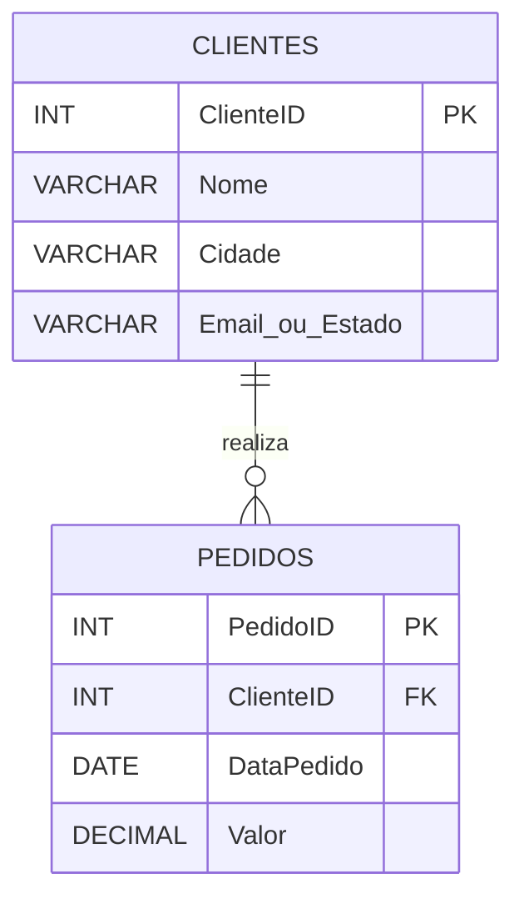
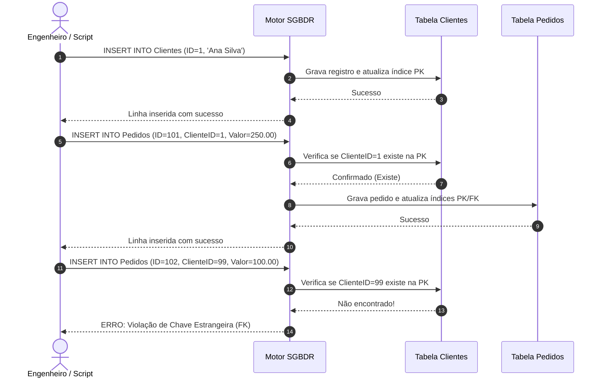
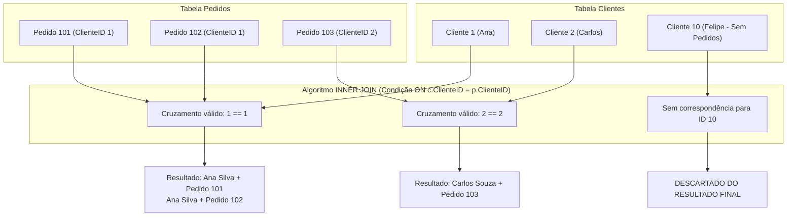
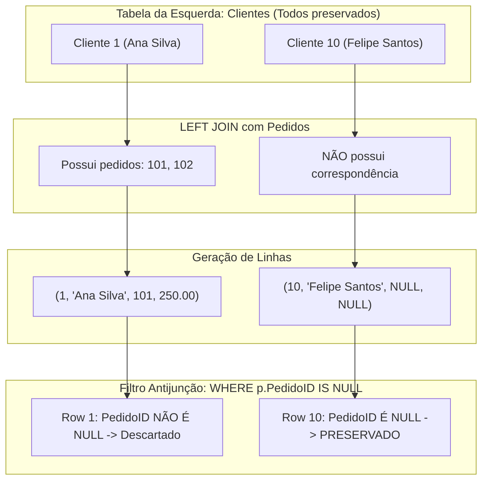
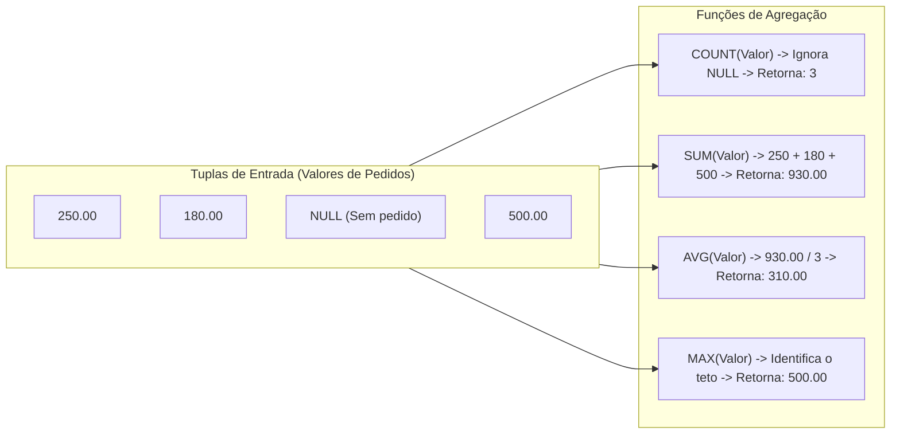
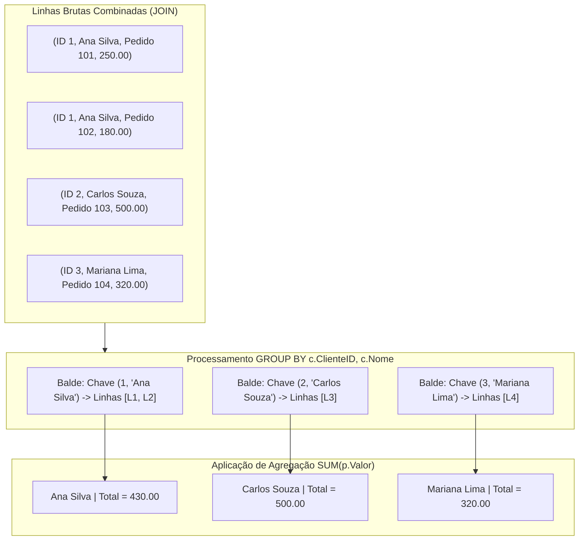
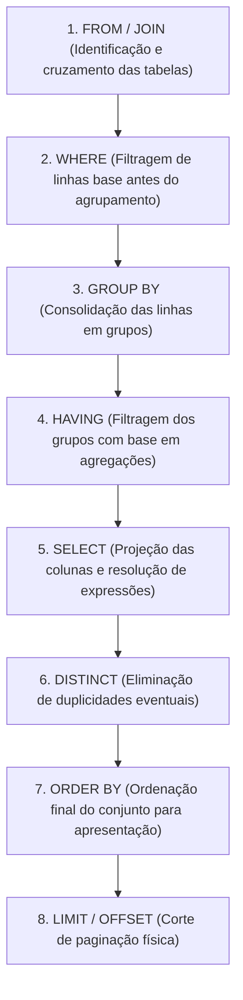
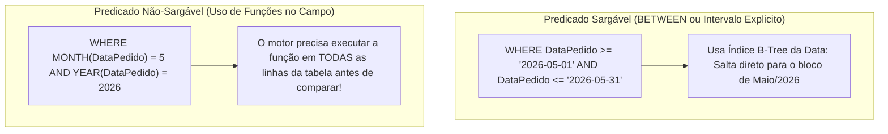
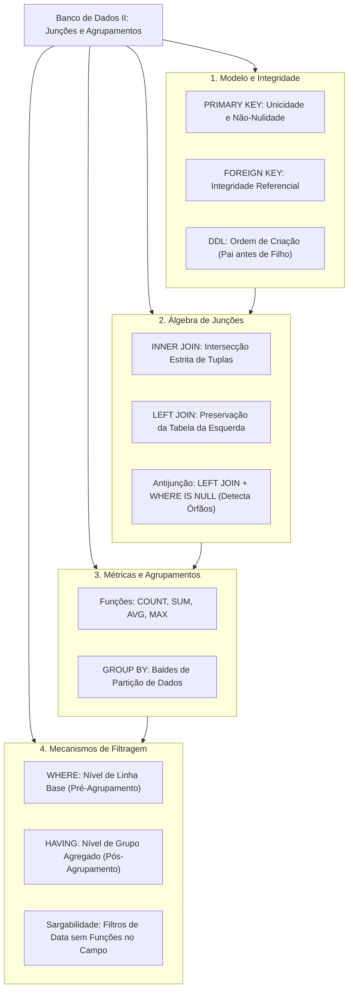

# Aula 06 — Junções e Agrupamentos em Duas Tabelas

> **Professor:** Guilherme de Morais  
> **Disciplina:** Banco de Dados II (3º Semestre)  
> **Tema:** Modelagem relacional, integridade referencial, consultas com junções (INNER e LEFT JOIN), funções de agregação, agrupamentos com GROUP BY e filtragem com HAVING e WHERE em esquemas de duas tabelas.

---

## Sumário

- [Objetivo da aula](#objetivo-da-aula)
- [Contexto e pré-requisitos](#contexto-e-pre-requisitos)
- [Definição de DDL e integridade referencial com PRIMARY KEY e FOREIGN KEY](#definicao-de-ddl-e-integridade-referencial-com-primary-key-e-foreign-key)
- [Carga de dados relacionais via comandos DML (INSERT INTO)](#carga-de-dados-relacionais-via-comandos-dml-insert-into)
- [Junção interna de registros com INNER JOIN](#juncao-interna-de-registros-com-inner-join)
- [Junção externa à esquerda com LEFT JOIN para detecção de registros órfãos (IS NULL)](#juncao-externa-a-esquerda-com-left-join-para-deteccao-de-registros-orfaos-is-null)
- [Funções de agregação estatística (SUM, COUNT, MAX e AVG)](#funcoes-de-agregacao-estatistica-sum-count-max-e-avg)
- [Agrupamento de dados relacionais com a cláusula GROUP BY](#agrupamento-de-dados-relacionais-com-a-clausula-group-by)
- [Filtragem sobre grupos agregados utilizando HAVING](#filtragem-sobre-grupos-agregados-utilizando-having)
- [Filtragem condicional com WHERE sobre valores monetários e intervalos de datas](#filtragem-condicional-com-where-sobre-valores-monetarios-e-intervalos-de-datas)
- [Código da aula](#codigo-da-aula)
- [Exercícios](#exercicios)
- [Erros comuns e boas práticas](#erros-comuns-e-boas-praticas)
- [Links e materiais complementares](#links-e-materiais-complementares)
- [Mapa da aula](#mapa-da-aula)
- [Glossário](#glossario)
- [Pontos-chave para a prova](#pontos-chave-para-a-prova)
- [Perguntas e respostas (JSONL)](#perguntas-e-respostas-jsonl)
- [Checklist de revisão](#checklist-de-revisao)

---

## Objetivo da aula

Esta aula tem como objetivo consolidar a compreensão teórica e prática da manipulação de dados correlacionados em bancos de dados relacionais. Ao término desta unidade, o estudante de Sistemas de Informação será capaz de:

1. Compreender o mecanismo de integridade referencial estabelecido pela restrição de chave estrangeira (`FOREIGN KEY`) conectada a uma chave primária (`PRIMARY KEY`).
2. Projetar scripts DDL estruturados e executar cargas de dados DML respeitando a ordem topológica de dependência entre tabelas dependentes e independentes.
3. Diferenciar a álgebra relacional da junção interna (`INNER JOIN`) e da junção externa (`LEFT JOIN`), compreendendo a semântica de correspondência de tuplas e preenchimento por valores nulos (`NULL`).
4. Aplicar técnicas avançadas de detecção de ausência de registros (anti-unificação ou identificação de registros órfãos conceituais) por meio de `LEFT JOIN` combinado com predicado de nulidade `IS NULL`.
5. Empregar corretamente funções de agregação (`COUNT`, `SUM`, `AVG`, `MAX`) para transformar conjuntos multidimensionais em métricas sumarizadas.
6. Estruturar consultas de agregação analítica utilizando a cláusula `GROUP BY`, entendendo as restrições impostas sobre a lista de projeção (`SELECT`).
7. Distinguir com precisão a fase de execução e o propósito funcional entre as cláusulas de filtragem `WHERE` (nível de linha base) e `HAVING` (nível de partição agregada).
8. Formular filtros temporais e monetários sargáveis em colunas com tipos de dados `DATE` e `DECIMAL`.

---

## Contexto e pré-requisitos

Para acompanhar este material com profundidade técnica, o aluno deve ter assimilado os conceitos fundamentais ministrados em Banco de Dados I e nas semanas iniciais de Banco de Dados II:

- **Modelo Entidade-Relacionamento (MER):** Conceito de entidades fortes, entidades fracas e cardinalidade relacional (especificamente o relacionamento 1:N entre Clientes e Pedidos).
- **Tipagem de Dados Relacional:** Conhecimento sobre inteiros (`INT`), cadeias de caracteres variáveis (`VARCHAR`), tipos numéricos exatos de ponto fixo (`DECIMAL`/`NUMERIC`) e representação cronológica em padrão ISO-8601 (`DATE`).
- **Sintaxe Fundamental de SQL:** Comandos básicos de projeção (`SELECT`), especificação de fontes (`FROM`) e predicados de filtragem elementar (`WHERE`).
- **Lógica Booleana Tri-Valorada (3VL):** Compreensão de que as comparações lógicas em SQL operam com `TRUE`, `FALSE` e `UNKNOWN` decorrente da presença de marcadores `NULL`.

---

## Definição de DDL e integridade referencial com PRIMARY KEY e FOREIGN KEY

### Fundamentação Teórica e Motivação

A Linguagem de Definição de Dados (*Data Definition Language* — DDL) é o subconjunto do SQL responsável pela criação, alteração e exclusão da estrutura de objetos dentro de um Sistema de Gerenciamento de Banco de Dados Relacional (SGBDR).

No paradigma relacional, formulado por Edgar F. Codd, os dados não devem residir em silos isolados nem depender de ponteiros físicos de memória. As relações são expressas por meio de valores comuns distribuídos entre tabelas. A restrição de **Chave Primária (`PRIMARY KEY`)** garante a integridade de entidade: cada linha da tabela possui um identificador unívoco não nulo. A restrição de **Chave Estrangeira (`FOREIGN KEY`)** garante a integridade referencial: um atributo em uma tabela filha só pode conter valores que existam previamente na chave primária da tabela pai referenciada, ou conter o valor nulo (`NULL`), caso a coluna permita.

A motivação de negócio e engenharia para a integridade referencial é impedir anomalias de banco de dados, como a criação de faturas sem comprador ou o desaparecimento de pedidos quando um usuário consulta a base.



### Exemplo Prático e Sintaxe Formal

Abaixo é apresentada a definição DDL dos esquemas trabalhados em aula, demonstrando o uso de tipos de dados rigorosos para sistemas transacionais financeiros:

```sql
-- DDL para o Cenário 1: Tabela independente de Clientes
CREATE TABLE Clientes (
    ClienteID INT PRIMARY KEY,
    Nome VARCHAR(100) NOT NULL,
    Cidade VARCHAR(100),
    Email VARCHAR(100)
);

-- DDL para o Cenário 1: Tabela dependente de Pedidos com Chave Estrangeira
CREATE TABLE Pedidos (
    PedidoID INT PRIMARY KEY,
    ClienteID INT,
    DataPedido DATE,
    Valor DECIMAL(10,2),
    FOREIGN KEY (ClienteID) REFERENCES Clientes(ClienteID)
);
```

### Contraexemplo e Violação Estrutural

Se um engenheiro criar a tabela `Pedidos` omitindo a cláusula de chave estrangeira:

```sql
-- CONTRAEXEMPLO: Falta de integridade referencial formal
CREATE TABLE Pedidos_Inseguro (
    PedidoID INT PRIMARY KEY,
    ClienteID INT, -- Apenas um número solto, sem vínculo
    DataPedido DATE,
    Valor DECIMAL(10,2)
);

-- O SGBDR aceitará a inserção abaixo sem reclamar:
INSERT INTO Pedidos_Inseguro VALUES (999, 99999, '2026-05-01', 500.00);
-- O cliente 99999 NÃO EXISTE! Isso corrompe relatórios financeiros e quebra JOINs.
```

### Armadilhas Técnicas (Pitfalls)

1. **Incompatibilidade de Tipos:** A coluna declarada como `FOREIGN KEY` deve possuir exatamente o mesmo domínio e tipo de dados da `PRIMARY KEY` referenciada (exemplo: referenciar um `INT` com um `BIGINT` ou `VARCHAR` pode causar erros de compilação DDL ou penalidades severas de performance de índice).
2. **Ordem de Exclusão (Drop Table):** Não é possível executar `DROP TABLE Clientes;` enquanto `Pedidos` existir apontando para ela. O SGBDR bloqueará a operação para preservar a integridade. A tabela dependente deve ser descartada primeiro.

### Tabela Comparativa de Restrições de Integridade

| Restrição SQL | Finalidade Principal | Permite NULL? | Quantidade por Tabela |
| :--- | :--- | :--- | :--- |
| `PRIMARY KEY` | Identificador único absoluto da tupla | Não (implica `NOT NULL`) | Exatamente 1 |
| `FOREIGN KEY` | Assegura vínculo referencial com outra tabela | Sim (a menos que explicitado `NOT NULL`) | Múltiplas |
| `UNIQUE` | Impede duplicidade de valores em uma coluna | Sim (geralmente uma ocorrência) | Múltiplas |
| `NOT NULL` | Impede a ausência de valor na coluna | Não | Múltiplas |
| `CHECK` | Valida predicado lógico booleano de domínio | Sim (se a expressão avaliar como NULL) | Múltiplas |

---

## Carga de dados relacionais via comandos DML (INSERT INTO)

### Fundamentação Teórica e Dependência Topológica

A Linguagem de Manipulação de Dados (*Data Manipulation Language* — DML) compreende as instruções que operam sobre os dados contidos nas tabelas. O comando `INSERT INTO` é responsável pela instanciação de novas tuplas.

Em esquemas relacionais normalizados providos de chaves estrangeiras, a carga de dados deve seguir rigorosamente uma ordenação topológica: tabelas independentes (entidades mestras como `Clientes`) precisam receber seus dados antes das tabelas dependentes (entidades transacionais como `Pedidos`). Se essa ordem for violada, o motor de execução do SGBDR interceptará a instrução e abortará a transação com um erro de violação de integridade referencial (*Foreign Key Constraint Violation*).



### Exemplo Prático de Inserção e Análise de Massa de Dados

Nos cenários da aula, o Professor Guilherme de Morais estruturou 10 clientes e 10 pedidos em dois cenários distintos. No Cenário 1, o cliente `Felipe Santos` (ID 10) não possui nenhum pedido associado, enquanto a cliente `Ana Silva` (ID 1) realizou dois pedidos (101 e 102).

```sql
-- Carga na tabela independente (sem dependências ativas)
INSERT INTO Clientes VALUES (1, 'Ana Silva', 'São Paulo', 'ana@email.com');
INSERT INTO Clientes VALUES (2, 'Carlos Souza', 'Rio de Janeiro', 'carlos@email.com');
INSERT INTO Clientes VALUES (3, 'Mariana Lima', 'Belo Horizonte', 'mariana@email.com');
INSERT INTO Clientes VALUES (4, 'João Pedro', 'Curitiba', 'joao@email.com');
INSERT INTO Clientes VALUES (5, 'Fernanda Costa', 'Porto Alegre', 'fernanda@email.com');
INSERT INTO Clientes VALUES (6, 'Ricardo Alves', 'Salvador', 'ricardo@email.com');
INSERT INTO Clientes VALUES (7, 'Patrícia Gomes', 'Fortaleza', 'patricia@email.com');
INSERT INTO Clientes VALUES (8, 'Lucas Martins', 'Recife', 'lucas@email.com');
INSERT INTO Clientes VALUES (9, 'Beatriz Rocha', 'Manaus', 'beatriz@email.com');
INSERT INTO Clientes VALUES (10, 'Felipe Santos', 'Brasília', 'felipe@email.com');

-- Carga na tabela dependente (respeitando a existência prévia dos ClienteID)
INSERT INTO Pedidos VALUES (101, 1, '2026-05-01', 250.00);
INSERT INTO Pedidos VALUES (102, 1, '2026-05-05', 180.00);
INSERT INTO Pedidos VALUES (103, 2, '2026-05-03', 500.00);
INSERT INTO Pedidos VALUES (104, 3, '2026-05-06', 320.00);
INSERT INTO Pedidos VALUES (105, 4, '2026-05-07', 150.00);
INSERT INTO Pedidos VALUES (106, 5, '2026-05-08', 700.00);
INSERT INTO Pedidos VALUES (107, 6, '2026-05-09', 90.00);
INSERT INTO Pedidos VALUES (108, 7, '2026-05-10', 400.00);
INSERT INTO Pedidos VALUES (109, 8, '2026-05-11', 220.00);
INSERT INTO Pedidos VALUES (110, 9, '2026-05-12', 350.00);
```

### Armadilhas Técnicas (Pitfalls)

1. **Formatos Regionais de Data:** O uso de formatos como `'01/05/2026'` em vez do padrão ANSI/ISO-8601 `'YYYY-MM-DD'` (`'2026-05-01'`) depende da configuração de `locale` da sessão e frequentemente quebra em deploys de produção.
2. **Representação Numérica Decimal:** O uso de vírgula em vez de ponto (`250,00` em vez de `250.00`) transforma a instrução SQL em uma lista de argumentos separada por vírgula, gerando erros de sintaxe ou alinhamento incorreto de colunas.

### Tabela Comparativa de Comandos DML

| Comando DML | Ação Principal | Validação de Chave Estrangeira | Efeito em Caso de Falha |
| :--- | :--- | :--- | :--- |
| `INSERT` | Adiciona tuplas novas | Valida se a FK aponta para PK existente | Rollback da instrução |
| `UPDATE` | Modifica tuplas existentes | Valida o novo valor atribuído à coluna FK | Rollback da instrução |
| `DELETE` | Remove tuplas existentes | Valida se a tupla é apontada por FKs filhas | Impede a remoção se houver filhos |

---

## Junção interna de registros com INNER JOIN

### Fundamentação Teórica e Mecanismo Relacional

A operação de junção interna (`INNER JOIN`) fundamenta-se na álgebra relacional como a composição de um produto cartesiano ($R \times S$) seguido pela aplicação de um operador de seleção baseado em um predicado de igualdade ($\sigma_{R.id = S.id}$), formalmente denominado $\theta$-junção ou equi-junção.

Em termos práticos de computação de dados:
- O SGBDR analisa os dois conjuntos de dados (`Clientes` e `Pedidos`).
- Para cada tupla na tabela à esquerda (`Clientes`), o motor procura uma ou mais tuplas na tabela à direita (`Pedidos`) que satisfaçam a condição expressa na cláusula `ON` (`Clientes.ClienteID = Pedidos.ClienteID`).
- Se houver correspondência, uma tupla combinada é projetada para o conjunto de resultados.
- **Se não houver correspondência em qualquer um dos lados, a tupla é simplesmente descartada do resultado final.**



### Exemplo Prático e Sintaxe Padrão ANSI SQL-92

Abaixo, a correlação entre clientes e pedidos é realizada utilizando a sintaxe explícita moderna (`JOIN ... ON`):

```sql
-- Junção interna retornando apenas clientes que possuem pedidos registrados
SELECT 
    c.ClienteID,
    c.Nome,
    p.PedidoID,
    p.DataPedido,
    p.Valor
FROM Clientes c
INNER JOIN Pedidos p ON c.ClienteID = p.ClienteID;
```

### Contraexemplo e Sintaxe Obsoleta (ANSI SQL-89)

Uma prática desaconselhada em projetos de engenharia modernos é a junção implícita na cláusula `WHERE`:

```sql
-- CONTRAEXEMPLO: Sintaxe implícita legada (ANSI-89)
SELECT c.Nome, p.PedidoID, p.Valor
FROM Clientes c, Pedidos p
WHERE c.ClienteID = p.ClienteID;

-- PERIGO REAL: Se o desenvolvedor esquecer o WHERE, 
-- o banco gerará um Produto Cartesiano completo (10 x 10 = 100 linhas inválidas)!
```

### Armadilhas Técnicas (Pitfalls)

1. **Ambiguidade de Colunas:** Escrever `SELECT ClienteID` em vez de qualificar a tabela de origem (`SELECT c.ClienteID`) gerará o erro clássico: `Column 'ClienteID' in field list is ambiguous`, pois a coluna existe em ambas as entidades.
2. **Supressão Involuntária de Registros:** Utilizar `INNER JOIN` quando o requisito de negócio exige a listagem de *todos* os clientes cadastrados fará com que clientes recém-cadastrados (sem histórico de compras) fiquem invisíveis nos relatórios.

### Tabela Comparativa de Sintaxes de Junção

| Característica | ANSI SQL-92 (`INNER JOIN ... ON`) | ANSI SQL-89 (`FROM T1, T2 WHERE ...`) |
| :--- | :--- | :--- |
| **Legibilidade** | Separa regra de junção da regra de filtro | Mistura junção com filtros negociais |
| **Segurança** | Falha de sintaxe se omitir a cláusula `ON` | Gera produto cartesiano silencioso se omitir `WHERE` |
| **Manutenibilidade** | Alta, suporta múltiplos encadeamentos claros | Baixa, propensa a erros de junção acidental |
| **Padrão da Indústria** | Obrigatório em bases corporativas modernas | Considerado débito técnico obsoleto |

---

## Junção externa à esquerda com LEFT JOIN para detecção de registros órfãos (IS NULL)

### Fundamentação Teórica e Semântica de Preservação

A junção externa à esquerda (`LEFT OUTER JOIN` ou simplesmente `LEFT JOIN`) estende o modelo da junção interna. Ela preserva **todas as tuplas da tabela referenciada à esquerda**, independentemente de haver ou não uma linha correspondente na tabela à direita.

Quando a condição de junção (`ON c.ClienteID = p.ClienteID`) encontra tuplas correlatas em `Pedidos`, os dados são combinados exatamente como no `INNER JOIN`. Contudo, quando um cliente da tabela à esquerda não possui nenhum pedido associado na tabela à direita, o SGBDR gera uma tupla no resultado contendo os dados reais do cliente e preenche **todos os atributos da tabela à direita com marcadores de ausência de valor (`NULL`)**.

Essa propriedade é fundamental para resolver um dos problemas mais comuns em análise de dados e sistemas de gestão: **a detecção de entidades inativas, contas sem pedidos ou clientes que nunca consumiram**.



### Exemplo Prático: Identificando Clientes Sem Pedidos

Para extrair com precisão os clientes que nunca efetuaram uma compra no Cenário 1:

```sql
-- Consulta de Antijunção: Retorna exclusivamente clientes sem pedidos
SELECT 
    c.ClienteID,
    c.Nome,
    c.Cidade,
    c.Email
FROM Clientes c
LEFT JOIN Pedidos p ON c.ClienteID = p.ClienteID
WHERE p.PedidoID IS NULL;
```

*Resultado esperado no Cenário 1:* O cliente `Felipe Santos` (ID 10) será retornado, pois seu `PedidoID` associado foi gerado como `NULL`.

### Contraexemplo e o Erro Fatal da Lógica Tri-Valorada

Um dos erros mais graves cometidos por desenvolvedores juniores é tentar comparar a ausência de valor com o operador de igualdade escalar:

```sql
-- CONTRAEXEMPLO: Uso incorreto de operador relacional escalar com NULL
SELECT c.Nome 
FROM Clientes c
LEFT JOIN Pedidos p ON c.ClienteID = p.ClienteID
WHERE p.PedidoID = NULL; -- NUNCA RETORNARÁ NADA!

-- Explicação: Em SQL, NULL representa uma incógnita. 
-- A expressão (NULL = NULL) avalia como UNKNOWN, não como TRUE!
-- O predicado WHERE descarta tudo o que não for estritamente TRUE.
```

### Armadilhas Técnicas (Pitfalls)

1. **Filtrar a Tabela da Direita no WHERE com Valores Constantes:** Se for executado um `LEFT JOIN` e, na cláusula `WHERE`, for adicionada a condição `WHERE p.Valor > 100`, todos os clientes sem pedidos (cujo `p.Valor` é `NULL`) serão eliminados pelo filtro. A consulta é convertida tacitamente em um `INNER JOIN`. Se a intenção for filtrar os pedidos mantendo todos os clientes na tela, a condição deve residir na cláusula `ON` do `LEFT JOIN`.
2. **Utilizar Colunas Não Confiáveis no `IS NULL`:** Ao verificar a ausência de pedidos, deve-se checar a chave primária da tabela da direita (`p.PedidoID IS NULL`). Se for testada uma coluna que naturalmente admite nulos (como uma hipotética `p.Observacao IS NULL`), a consulta poderá retornar pedidos existentes que simplesmente não possuem observação cadastrada.

### Tabela Comparativa de Tipos de Junções Relacionais

| Tipo de Junção | Tuplas da Esquerda Mantidas | Tuplas da Direita Mantidas | Preenchimento em Incompatibilidade |
| :--- | :--- | :--- | :--- |
| `INNER JOIN` | Somente as correspondentes | Somente as correspondentes | Nenhum (linhas são descartadas) |
| `LEFT JOIN` | **100% das tuplas** | Somente as correspondentes | `NULL` nas colunas da direita |
| `RIGHT JOIN` | Somente as correspondentes | **100% das tuplas** | `NULL` nas colunas da esquerda |
| `FULL JOIN` | **100% das tuplas** | **100% das tuplas** | `NULL` em qualquer lado faltante |

---

## Funções de agregação estatística (SUM, COUNT, MAX e AVG)

### Fundamentação Teórica e Comportamento Operacional

As funções de agregação processam uma coleção de valores de uma coluna específica e reduzem essa multiplicidade a um único valor escalar representativo. Elas são a base da computação analítica (OLAP) e da geração de indicadores de desempenho (KPIs).

No escopo da aula, foram trabalhadas quatro funções elementares:
1. **`COUNT()`:** Quantifica a cardinalidade de elementos no conjunto. Possui duas variantes cruciais: `COUNT(*)` (computa todas as linhas físicas da partição) e `COUNT(expressão)` (computa apenas os valores não nulos contidos na coluna informada).
2. **`SUM()`:** Executa o somatório aritmético de todos os elementos numéricos não nulos da partição.
3. **`AVG()`:** Calcula a média aritmética ($\frac{\sum x}{n}$). Em conformidade com o padrão SQL, elementos marcados como `NULL` são rigorosamente desconsiderados tanto do numerador quanto do denominador.
4. **`MAX()`:** Percorre o conjunto ordenável e extrai o valor extremo superior (maior valor numérico, data mais recente ou última cadeia em ordem alfabética).



### Exemplo Prático e Diferenciação entre Métricas

```sql
-- Exemplo de sumarização global sobre a tabela Pedidos
SELECT 
    COUNT(*) AS TotalLinhas,
    COUNT(Valor) AS PedidosComValor,
    SUM(Valor) AS FaturamentoTotal,
    AVG(Valor) AS TicketMedio,
    MAX(Valor) AS MaiorVendaRegistrada
FROM Pedidos;
```

### Contraexemplo e Distorção de Médias

Considere o cálculo da média de gastos considerando clientes que não compraram nada:

```sql
-- CONTRAEXEMPLO: Suposição incorreta de que AVG considera clientes sem pedidos
SELECT 
    c.Nome,
    AVG(p.Valor) AS MediaGasto
FROM Clientes c
LEFT JOIN Pedidos p ON c.ClienteID = p.ClienteID
GROUP BY c.ClienteID, c.Nome;

-- Se o cliente Felipe não tem pedidos, p.Valor é NULL.
-- O AVG(p.Valor) para Felipe retornará NULL, e NÃO 0.00!
-- Para forçar o zero, deve-se usar COALESCE(AVG(p.Valor), 0.00).
```

### Armadilhas Técnicas (Pitfalls)

1. **Diferença entre `COUNT(*)` e `COUNT(coluna)` em `LEFT JOIN`:** Ao contar quantos pedidos um cliente possui após um `LEFT JOIN`, se o desenvolvedor utilizar `COUNT(*)`, o cliente sem pedidos receberá o valor **1** (pois existe uma linha física resultante do join contendo `NULL`). Para garantir que clientes sem pedidos recebam contagem zero, é obrigatório utilizar `COUNT(p.PedidoID)`.
2. **Precisão Numérica:** Realizar `SUM()` ou `AVG()` sobre tipos de ponto flutuante binário (`FLOAT` ou `DOUBLE`) introduz erros de representação decimal acumulados (ex: `1499.9999999999998`). Valores monetários devem residir obrigatoriamente em colunas do tipo `DECIMAL(M, D)` ou `NUMERIC(M, D)`.

### Tabela Comparativa de Funções de Agregação

| Função | Domínio Válido de Dados | Tratamento de Nulos (`NULL`) | Retorno em Conjunto Totalmente Vazio |
| :--- | :--- | :--- | :--- |
| `COUNT(*)` | Qualquer tipo (contagem física) | Conta as linhas mesmo com nulos | `0` |
| `COUNT(coluna)` | Qualquer tipo | **Ignora** valores nulos | `0` |
| `SUM(coluna)` | Apenas tipos numéricos | **Ignora** valores nulos | `NULL` |
| `AVG(coluna)` | Apenas tipos numéricos | **Ignora** valores nulos | `NULL` |
| `MAX(coluna)` | Numéricos, Datas, Textos | **Ignora** valores nulos | `NULL` |

---

## Agrupamento de dados relacionais com a cláusula GROUP BY

### Fundamentação Teórica e Algoritmo de Hashing/Sorting

A cláusula `GROUP BY` projeta as linhas de uma tabela relacional em baldes de agrupamento (*buckets*), onde todas as tuplas que compartilham os mesmos valores para as colunas especificadas são consolidadas em uma única partição representativa.

Sob o ponto de vista da arquitetura de processadores de banco de dados, o SGBDR executa essa instrução por meio de um algoritmo de ordenação prévia (*Sort Aggregate*) ou, mais frequentemente em bancos modernos, por meio de uma tabela hash em memória (*Hash Aggregate*). Cada chave de agrupamento única torna-se uma entrada no hash, e as colunas submetidas a funções de agregação vão acumulando seus valores linha a linha conforme a varredura prossegue.



### Exemplo Prático e Regra Fundamental da Projeção

A regra de ouro do SQL padrão estabelece: **Qualquer coluna presente na lista de projeção do `SELECT` que não esteja envelopada dentro de uma função de agregação DEVE constar explicitamente na cláusula `GROUP BY`**.

```sql
-- Agrupamento correto por Chave Primária e Atributo Descritivo
SELECT 
    c.ClienteID,
    c.Nome,
    COUNT(p.PedidoID) AS QuantidadePedidos,
    SUM(p.Valor) AS ValorTotalConsumido
FROM Clientes c
INNER JOIN Pedidos p ON c.ClienteID = p.ClienteID
GROUP BY c.ClienteID, c.Nome;
```

### Contraexemplo e Não-Determinismo Relacional

Considere a tentativa incorreta de consultar a data do pedido junto com a agregação sem agrupá-la:

```sql
-- CONTRAEXEMPLO: Coluna projetada fora do GROUP BY sem agregação
SELECT 
    c.Nome,
    p.DataPedido, -- ERRO! Qual data deve ser mostrada se o cliente tiver 10 pedidos?
    SUM(p.Valor)
FROM Clientes c
INNER JOIN Pedidos p ON c.ClienteID = p.ClienteID
GROUP BY c.Nome;

-- Em SGBDRs estritos (PostgreSQL, SQL Server, Oracle, MySQL com ONLY_FULL_GROUP_BY):
-- Isso gera o erro: "column p.DataPedido must appear in the GROUP BY clause or be used in an aggregate function".
```

### Armadilhas Técnicas (Pitfalls)

1. **Agrupar Exclusivamente por Nome:** Em bases corporativas, nomes de clientes sofrem com homônimos (duas pessoas chamadas "Carlos Souza"). Se você fizer `GROUP BY c.Nome`, o banco consolidará os pedidos de clientes diferentes no mesmo balde! A boa prática de engenharia exige sempre incluir a chave primária: `GROUP BY c.ClienteID, c.Nome`.
2. **Custo Computacional de Alta Cardinalidade:** Agrupar por colunas de texto livres muito longas com alta cardinalidade demanda alocação excessiva de memória para a tabela hash do banco, frequentemente causando *spill to disk* (escrita temporária em disco/tempdb), o que degrada a performance da consulta.

### Tabela Comparativa de Níveis de Granularidade

| Cláusula | Granularidade da Saída | Permite Funções de Agregação? | Modifica Quantidade de Linhas? |
| :--- | :--- | :--- | :--- |
| **Sem `GROUP BY`** | Nível atômico de linha (1:1 com a tabela base) | Apenas se agregar a tabela inteira em 1 linha | Não altera a granularidade base |
| **Com `GROUP BY`** | Nível consolidado por chave de partição | Sim, calcula métricas por grupo | Reduz linhas para a quantidade de grupos únicos |

---

## Filtragem sobre grupos agregados utilizando HAVING

### Fundamentação Teórica e Ordem de Avaliação de Fases SQL

A cláusula `HAVING` atua como um filtro booleano que incide exclusivamente sobre os grupos consolidados pelo `GROUP BY`. 

Para entender a razão existencial do `HAVING`, o engenheiro deve internalizar a ordem conceitual de processamento de uma consulta SQL implementada pelos otimizadores dos SGBDRs. Embora a consulta seja escrita iniciando pela palavra-chave `SELECT`, a ordem cronológica e lógica em que o motor avalia as operações é totalmente diferente:



Como o processamento da cláusula `WHERE` ocorre estritamente no **Passo 2**, é matematicamente impossível para o motor filtrar uma soma, contagem ou média nesse estágio, pois as partições sequer foram criadas. O agrupamento só ocorre no **Passo 3**. O `HAVING`, executado no **Passo 4**, foi concebido exatamente para aplicar restrições sobre os resultados gerados no Passo 3.

### Exemplo Prático: Filtrando Clientes Recorrentes

Exemplo clássico do exercício trabalhado em aula: localizar clientes que realizaram mais de um pedido:

```sql
-- Identificando clientes recorrentes utilizando HAVING sobre a função agregada
SELECT 
    c.ClienteID,
    c.Nome,
    COUNT(p.PedidoID) AS TotalPedidos
FROM Clientes c
INNER JOIN Pedidos p ON c.ClienteID = p.ClienteID
GROUP BY c.ClienteID, c.Nome
HAVING COUNT(p.PedidoID) > 1;
```

### Contraexemplo e Falha Estrutural no WHERE

Tentar escrever agregações no filtro de linha base é um dos erros conceituais mais recorrentes entre estudantes:

```sql
-- CONTRAEXEMPLO: Uso de agregação dentro do WHERE
SELECT c.Nome, COUNT(p.PedidoID)
FROM Clientes c
INNER JOIN Pedidos p ON c.ClienteID = p.ClienteID
WHERE COUNT(p.PedidoID) > 1 -- ERRO DE COMPILAÇÃO!
GROUP BY c.Nome;

-- O compilador SQL abortará a execução com:
-- "aggregate functions are not allowed in WHERE clause".
```

### Armadilhas Técnicas (Pitfalls)

1. **Utilizar HAVING para Filtros de Linha Base:** Filtrar condições não agregadas no `HAVING` (exemplo: `HAVING c.Cidade = 'São Paulo'`) é funcionalmente possível em alguns bancos, mas representa uma péssima prática de engenharia de software. O banco é forçado a agrupar todos os clientes do Brasil inteiro para somente depois descartar os grupos que não são de São Paulo. Se essa condição estivesse no `WHERE`, as linhas desnecessárias seriam eliminadas antes de alocar memória para o agrupamento, economizando CPU e memória.
2. **Uso de Aliases do SELECT no HAVING:** No SQL ANSI padrão, aliases criados na cláusula `SELECT` (como `AS TotalPedidos`) não são visíveis no `HAVING`, pois o `HAVING` (Passo 4) é processado antes do `SELECT` (Passo 5). Deve-se repetir a expressão agregada: `HAVING COUNT(p.PedidoID) > 1`.

### Tabela Comparativa: WHERE versus HAVING

| Critério de Comparação | Cláusula `WHERE` | Cláusula `HAVING` |
| :--- | :--- | :--- |
| **Momento de Aplicação** | Antes do agrupamento (pré-agrupamento) | Depois do agrupamento (pós-agrupamento) |
| **Alvo da Filtragem** | Linhas individuais da tabela base | Grupos sumarizados de linhas |
| **Aceita Funções Agregadas?** | **Não** (`WHERE SUM(x) > 10` é inválido) | **Sim** (`HAVING SUM(x) > 10` é válido) |
| **Utilização de Índices** | Alta (pode utilizar índices B-Tree da tabela) | Quase nula (opera sobre a estrutura hash em memória) |
| **Impacto de Desempenho** | Reduz o volume de dados a ser processado | Restringe o volume de saída já computado |

---

## Filtragem condicional com WHERE sobre valores monetários e intervalos de datas

### Fundamentação Teórica e Sargabilidade de Predicados

A cláusula `WHERE` introduz predicados lógicos que determinam se uma tupla individual atende aos critérios de inclusão no fluxo de processamento relacional. Ao manipular atributos financeiros e temporais, o estudante de engenharia deve dominar o conceito de **Sargabilidade** (*Search Argument Able* — SARGable).

Um predicado sargável é aquele estruturado de tal forma que o otimizador de consultas do SGBDR consegue utilizar índices pré-existentes (como árvores B-Tree) para saltar diretamente aos nós de dados relevantes, em vez de realizar uma varredura sequencial completa e custosa em toda a tabela (*Full Table Scan*).

Para valores temporais no padrão `DATE`, as comparações devem ser diretas, utilizando operadores relacionais (`>=`, `<=`) ou operadores de intervalo inclusivo (`BETWEEN ... AND ...`).



### Exemplo Prático: Filtragem Monetária e Janela Temporal

Abaixo são exibidas duas consultas de alta performance correspondentes aos exercícios do material de aula:

```sql
-- Filtro monetário estrito sobre a tabela transacional
SELECT 
    c.Nome,
    p.PedidoID,
    p.Valor
FROM Clientes c
INNER JOIN Pedidos p ON c.ClienteID = p.ClienteID
WHERE p.Valor > 300.00;

-- Filtro de intervalo cronológico referente a maio de 2026
SELECT 
    c.Nome,
    p.PedidoID,
    p.DataPedido,
    p.Valor
FROM Clientes c
INNER JOIN Pedidos p ON c.ClienteID = p.ClienteID
WHERE p.DataPedido >= '2026-05-01' AND p.DataPedido <= '2026-05-31';
```

### Contraexemplo e Destruição de Índices por Funções Escalares

Observe a diferença entre uma consulta sargável e uma consulta que degrada a infraestrutura do banco:

```sql
-- CONTRAEXEMPLO: Consulta que impede o uso de índices (Não-Sargável)
SELECT c.Nome, p.PedidoID
FROM Clientes c
INNER JOIN Pedidos p ON c.ClienteID = p.ClienteID
WHERE MONTH(p.DataPedido) = 5 AND YEAR(p.DataPedido) = 2026;

-- Embora o resultado funcional seja o mesmo, em uma base com 50 milhões de pedidos,
-- a consulta acima travará o banco por calcular funções linha a linha,
-- enquanto a consulta com BETWEEN responderá em milissegundos.
```

### Armadilhas Técnicas (Pitfalls)

1. **A Armadilha do `BETWEEN` com Tipos `DATETIME` / `TIMESTAMP`:** No material de aula, o tipo de dados utilizado pelo professor é puramente `DATE` (`2026-05-01`). Portanto, `BETWEEN '2026-05-01' AND '2026-05-31'` inclui com segurança o dia 31 inteiro. No entanto, se o campo fosse `DATETIME`, a string `'2026-05-31'` seria convertida implicitamente para `'2026-05-31 00:00:00'`, descartando todos os pedidos ocorridos às 10h, 15h ou 23h do dia 31! Em engenharia de software corporativa, a boa prática universal para tempo é: `Data >= '2026-05-01' AND Data < '2026-06-01'`.
2. **Comparação de Strings Numéricas:** Filtrar valores monetários utilizando aspas (`WHERE Valor > '300.00'`) força coerções implícitas de tipo de dados que podem desativar índices ou causar comportamentos bizarros de ordenação lexicográfica (onde `'90.00'` é considerado maior que `'1000.00'`).

### Tabela Comparativa de Operadores de Filtragem Relacional

| Operador | Finalidade | Comportamento com Nulos | Sargável? |
| :--- | :--- | :--- | :--- |
| `>` / `<` / `>=` / `<=` | Comparação relacional de magnitude | Retorna `UNKNOWN` se qualquer lado for `NULL` | Sim |
| `BETWEEN a AND b` | Intervalo fechado inclusivo ($[a, b]$) | Retorna `UNKNOWN` se $a$, $b$ ou a coluna for `NULL` | Sim |
| `IN (v1, v2, ...)` | Pertencimento a uma lista discreta | Retorna `TRUE` se encontrar; lida com cautela com `NULL` | Sim |
| `IS NULL` | Teste específico de ausência de valor | Avalia estritamente para `TRUE` ou `FALSE` | Depende da implementação do índice |
| `LIKE 'padrao%'` | Correspondência de texto por prefixo | Retorna `UNKNOWN` se o texto for `NULL` | Sim (apenas com curinga à direita) |

---

## Código da aula

Os scripts desenvolvidos para esta aula encontram-se estruturados no padrão idempotente e modular para execução limpa em ambientes de laboratório ou integração contínua.

### Estrutura de Arquivos

- [./codigo/exemplos.sql](file:///codigo/exemplos.sql): Script contendo a DDL e DML completa dos Cenários 1 e 2 apresentados pelo Professor Guilherme de Morais, com comandos preparatórios de limpeza de tabelas (`DROP TABLE IF EXISTS`).
- [./codigo/exercicios.sql](file:///codigo/exercicios.sql): Script com a resolução integral, tipada e comentada das 18 consultas SQL propostas em ambos os cenários de exercícios.

### Trechos Essenciais Comentados do Script DDL/DML (`exemplos.sql`)

Abaixo é demonstrada a implementação limpa que viabiliza rodar o script repetidas vezes sem falhas de duplicação:

```sql
-- Garante a idempotência da execução removendo as tabelas na ordem correta
-- Primeiro removemos a tabela dependente (Pedidos)
DROP TABLE IF EXISTS Pedidos;
-- Depois removemos a tabela independente (Clientes)
DROP TABLE IF EXISTS Clientes;

-- Criação da tabela independente com tipagem estrita
CREATE TABLE Clientes (
    ClienteID INT PRIMARY KEY,
    Nome VARCHAR(100) NOT NULL,
    Cidade VARCHAR(100),
    Email VARCHAR(100)
);

-- Criação da tabela dependente vinculada via chave estrangeira
CREATE TABLE Pedidos (
    PedidoID INT PRIMARY KEY,
    ClienteID INT,
    DataPedido DATE,
    Valor DECIMAL(10,2),
    -- Definição explícita da integridade referencial
    CONSTRAINT fk_pedidos_clientes FOREIGN KEY (ClienteID) 
        REFERENCES Clientes(ClienteID)
        ON DELETE RESTRICT -- Impede apagar o cliente se houver pedidos ativos
        ON UPDATE CASCADE  -- Propaga alterações de ID caso ocorram
);
```

---

## Exercícios

Abaixo estão resolvidas e dissecadas conceitualmente todas as 18 consultas SQL identificadas no material de origem do Professor Guilherme de Morais, divididas rigorosamente entre o **Cenário 1** (Colunas: `ClienteID, Nome, Cidade, Email` / Pedidos até 700.00) e o **Cenário 2** (Colunas: `ClienteID, Nome, Cidade, Estado` / Pedidos até 2300.00).

O arquivo executável consolidado está disponível em [./codigo/exercicios.sql](file:///codigo/exercicios.sql).

---

### Exercícios do Cenário 1

#### Exercício 1: Listar todos os clientes e seus pedidos

- **Enunciado Oficial:** `1-Listar todos os clientes e seus pedidos.`
- **Raciocínio Lógico-Relacional:** O enunciado pede para exibir os clientes e seus respectivos pedidos. Em engenharia de software e análise de requisitos, quando se solicita "todos os clientes e seus pedidos", há duas abordagens técnicas dependendo da intenção negocial:
  1. *Interpretação Transacional Estrita:* Se o objetivo é visualizar apenas as compras concretizadas, utiliza-se `INNER JOIN`. Nesse caso, clientes sem compras são omitidos.
  2. *Interpretação Cadastral Abrangente:* Se o objetivo é listar a totalidade da carteira de clientes, preservando aqueles que ainda não compraram nada com campos nulos, utiliza-se `LEFT JOIN`.
  Abaixo apresentamos a solução padrão da disciplina (`INNER JOIN`) e a variante abrangente recomendada pela boa prática analítica (`LEFT JOIN`).
- **Resolução Comentada:**

```sql
-- Abordagem 1 (Padrão de Junção Interna): Clientes que compraram e seus pedidos
SELECT 
    c.ClienteID,
    c.Nome,
    p.PedidoID,
    p.DataPedido,
    p.Valor
FROM Clientes c
INNER JOIN Pedidos p ON c.ClienteID = p.ClienteID;

-- Abordagem 2 (Preservação Cadastral Total): Todos os clientes, com ou sem pedidos
SELECT 
    c.ClienteID,
    c.Nome,
    p.PedidoID,
    p.DataPedido,
    p.Valor
FROM Clientes c
LEFT JOIN Pedidos p ON c.ClienteID = p.ClienteID;
```

---

#### Exercício 2: Mostrar o valor total de pedidos por cliente

- **Enunciado Oficial:** `Mostrar o valor total de pedidos por cliente.`
- **Raciocínio Lógico-Relacional:** Deve-se cruzar as tabelas para correlacionar clientes e pedidos, agregar os valores através da função matemática `SUM(p.Valor)` e colapsar os dados via `GROUP BY` utilizando a chave primária `c.ClienteID` e o atributo de exibição `c.Nome`.
- **Resolução Comentada:**

```sql
SELECT 
    c.ClienteID,
    c.Nome,
    SUM(p.Valor) AS ValorTotalPedidos
FROM Clientes c
INNER JOIN Pedidos p ON c.ClienteID = p.ClienteID
GROUP BY c.ClienteID, c.Nome;
```

---

#### Exercício 3: Exibir clientes sem pedidos

- **Enunciado Oficial:** `Exibir clientes sem pedidos.`
- **Raciocínio Lógico-Relacional:** Trata-se da clássica antijunção. Executa-se um `LEFT JOIN` para preservar todos os clientes e, na cláusula `WHERE`, aplica-se a checagem de nulidade `IS NULL` sobre a chave primária da tabela da direita (`p.PedidoID`). Isso filtra unicamente as linhas onde não houve correspondência relacional (no Cenário 1, o cliente `Felipe Santos`).
- **Resolução Comentada:**

```sql
SELECT 
    c.ClienteID,
    c.Nome,
    c.Cidade,
    c.Email
FROM Clientes c
LEFT JOIN Pedidos p ON c.ClienteID = p.ClienteID
WHERE p.PedidoID IS NULL;
```

---

#### Exercício 4: Listar pedidos acima de 300 reais com nome do cliente

- **Enunciado Oficial:** `Listar pedidos acima de 300 reais com nome do cliente.`
- **Raciocínio Lógico-Relacional:** É necessária a junção interna (`INNER JOIN`) para unir o nome do comprador ao registro do pedido, aplicando-se um filtro de predicado de linha `WHERE p.Valor > 300.00`.
- **Resolução Comentada:**

```sql
SELECT 
    p.PedidoID,
    c.Nome AS NomeCliente,
    p.DataPedido,
    p.Valor
FROM Pedidos p
INNER JOIN Clientes c ON p.ClienteID = c.ClienteID
WHERE p.Valor > 300.00;
```

---

#### Exercício 5: Contar pedidos por cliente

- **Enunciado Oficial:** `Contar pedidos por cliente.`
- **Raciocínio Lógico-Relacional:** Aplica-se a função de agregação `COUNT(p.PedidoID)` combinada com `GROUP BY c.ClienteID, c.Nome`. Caso seja utilizado `LEFT JOIN`, deve-se obrigatoriamente contar a chave `p.PedidoID` e não `*`, para que clientes com zero pedidos exibam corretamente a contagem `0` em vez de `1`.
- **Resolução Comentada:**

```sql
SELECT 
    c.ClienteID,
    c.Nome,
    COUNT(p.PedidoID) AS QuantidadePedidos
FROM Clientes c
LEFT JOIN Pedidos p ON c.ClienteID = p.ClienteID
GROUP BY c.ClienteID, c.Nome;
```

---

#### Exercício 6: Listar clientes que fizeram pedidos em maio de 2026

- **Enunciado Oficial:** `Listar clientes que fizeram pedidos em maio de 2026.`
- **Raciocínio Lógico-Relacional:** É exigida a junção entre as entidades e um filtro temporal de intervalo fechado cobrindo o mês de maio de 2026 (`'2026-05-01'` até `'2026-05-31'`). Como clientes com múltiplos pedidos podem aparecer duplicados, utiliza-se `DISTINCT` na lista de projeção.
- **Resolução Comentada:**

```sql
SELECT DISTINCT 
    c.ClienteID,
    c.Nome,
    c.Email
FROM Clientes c
INNER JOIN Pedidos p ON c.ClienteID = p.ClienteID
WHERE p.DataPedido >= '2026-05-01' AND p.DataPedido <= '2026-05-31';
```

---

#### Exercício 7: Mostrar pedido mais caro de cada cliente

- **Enunciado Oficial:** `Mostrar pedido mais caro de cada cliente.`
- **Raciocínio Lógico-Relacional:** Agrupam-se as linhas por cliente utilizando `GROUP BY c.ClienteID, c.Nome` e extrai-se o valor máximo por grupo utilizando a função de agregação escalar `MAX(p.Valor)`.
- **Resolução Comentada:**

```sql
SELECT 
    c.ClienteID,
    c.Nome,
    MAX(p.Valor) AS MaiorValorPedido
FROM Clientes c
INNER JOIN Pedidos p ON c.ClienteID = p.ClienteID
GROUP BY c.ClienteID, c.Nome;
```

---

#### Exercício 8: Listar clientes com mais de um pedido

- **Enunciado Oficial:** `Listar clientes com mais de um pedido.`
- **Raciocínio Lógico-Relacional:** Trata-se de uma consulta agregada que exige filtragem sobre o resultado da função `COUNT()`. Por isso, é obrigatório o uso da cláusula `HAVING COUNT(p.PedidoID) > 1` imediatamente após o `GROUP BY`.
- **Resolução Comentada:**

```sql
SELECT 
    c.ClienteID,
    c.Nome,
    COUNT(p.PedidoID) AS TotalPedidos
FROM Clientes c
INNER JOIN Pedidos p ON c.ClienteID = p.ClienteID
GROUP BY c.ClienteID, c.Nome
HAVING COUNT(p.PedidoID) > 1;
```

---

#### Exercício 9: Exibir pedidos com nome do cliente e data

- **Enunciado Oficial:** `Exibir pedidos com nome do cliente e data.`
- **Raciocínio Lógico-Relacional:** Projeção direta dos atributos específicos solicitados a partir da junção interna entre `Pedidos` e `Clientes`.
- **Resolução Comentada:**

```sql
SELECT 
    p.PedidoID,
    c.Nome AS NomeCliente,
    p.DataPedido,
    p.Valor
FROM Pedidos p
INNER JOIN Clientes c ON p.ClienteID = c.ClienteID;
```

---

#### Exercício 10: Calcular média de pedidos por cliente

- **Enunciado Oficial:** `Calcular média de pedidos por cliente.`
- **Raciocínio Lógico-Relacional:**
  - *Interpretação 1 (Ticket Médio por Cliente):* Qual o valor médio monetário dos pedidos de cada cliente individualmente? Resolve-se agrupando por cliente e aplicando `AVG(p.Valor)`.
  - *Interpretação 2 (Média Geral de Quantidade de Pedidos):* Quantos pedidos, em média, cada cliente da base cadastrada possui? Resolve-se dividindo o total de pedidos pelo total de clientes distintos.
  Abaixo apresentamos a resolução da Interpretação 1 (padrão em exercícios práticos dessa matéria) e complementamos com a Interpretação 2 via subconsulta analítica.
- **Resolução Comentada:**

```sql
-- Interpretação Principal: Ticket Médio monetário gasto por cliente
SELECT 
    c.ClienteID,
    c.Nome,
    AVG(p.Valor) AS MediaValorPedidos
FROM Clientes c
INNER JOIN Pedidos p ON c.ClienteID = p.ClienteID
GROUP BY c.ClienteID, c.Nome;

-- Complemento de Engenharia: Média global de quantidade de pedidos por cliente na base
SELECT 
    CAST(COUNT(p.PedidoID) AS DECIMAL(10,2)) / COUNT(DISTINCT c.ClienteID) AS MediaQtdPedidosPorCliente
FROM Clientes c
LEFT JOIN Pedidos p ON c.ClienteID = p.ClienteID;
```

---

### Exercícios do Cenário 2

#### Exercício 11: Mostrar pedidos com nome do cliente

- **Enunciado Oficial:** `Mostrar pedidos com nome do cliente.`
- **Raciocínio Lógico-Relacional:** No Cenário 2, os atributos dos clientes incluem a coluna `Estado` no lugar de `Email`. A consulta relaciona os pedidos com seus respectivos compradores via `INNER JOIN`.
- **Resolução Comentada:**

```sql
SELECT 
    p.PedidoID,
    c.Nome AS NomeCliente,
    p.DataPedido,
    p.Valor
FROM Pedidos p
INNER JOIN Clientes c ON p.ClienteID = c.ClienteID;
```

---

#### Exercício 12: Listar clientes que têm pedidos

- **Enunciado Oficial:** `Listar clientes que têm pedidos.`
- **Raciocínio Lógico-Relacional:** Deve-se listar a identificação dos clientes que possuem ao menos uma tupla vinculada em `Pedidos`. Para evitar repetição de nomes de clientes que compraram múltiplas vezes (como Ana Silva), utiliza-se `DISTINCT` ou um `GROUP BY` sem funções agregadas.
- **Resolução Comentada:**

```sql
SELECT DISTINCT 
    c.ClienteID,
    c.Nome,
    c.Cidade,
    c.Estado
FROM Clientes c
INNER JOIN Pedidos p ON c.ClienteID = p.ClienteID;
```

---

#### Exercício 13: Total gasto por cliente

- **Enunciado Oficial:** `Total gasto por cliente.`
- **Raciocínio Lógico-Relacional:** Consolidação financeira calculando o somatório `SUM(p.Valor)` para cada cliente agrupado por sua chave e nome.
- **Resolução Comentada:**

```sql
SELECT 
    c.ClienteID,
    c.Nome,
    SUM(p.Valor) AS TotalGasto
FROM Clientes c
INNER JOIN Pedidos p ON c.ClienteID = p.ClienteID
GROUP BY c.ClienteID, c.Nome;
```

---

#### Exercício 14: Clientes sem pedidos com cidade e nome

- **Enunciado Oficial:** `Clientes sem pedidos com os cidade, nome dos clientes.`
- **Raciocínio Lógico-Relacional:** Utilização de `LEFT JOIN` filtrando onde a chave estrangeira/primária da tabela de pedidos for nula (`p.PedidoID IS NULL`). No Cenário 2, a cliente `Beatriz Martins` (ID 9) não efetuou pedidos, enquanto o cliente 10 possui compra registrada.
- **Resolução Comentada:**

```sql
SELECT 
    c.Nome,
    c.Cidade,
    c.Estado
FROM Clientes c
LEFT JOIN Pedidos p ON c.ClienteID = p.ClienteID
WHERE p.PedidoID IS NULL;
```

---

#### Exercício 15: Pedidos acima de 1000 reais com os nomes dos clientes

- **Enunciado Oficial:** `Pedidos acima de 1000 reais com os nomes dos clientes.`
- **Raciocínio Lógico-Relacional:** Cruzamento via `INNER JOIN` filtrando transações cujo campo numérico `p.Valor` seja estritamente superior a `1000.00`.
- **Resolução Comentada:**

```sql
SELECT 
    p.PedidoID,
    c.Nome AS NomeCliente,
    p.Valor
FROM Pedidos p
INNER JOIN Clientes c ON p.ClienteID = c.ClienteID
WHERE p.Valor > 1000.00;
```

---

#### Exercício 16: Quantidade de pedidos por cliente

- **Enunciado Oficial:** `Quantidade de pedidos por cliente.`
- **Raciocínio Lógico-Relacional:** Contagem volumétrica de ordens emitidas por entidade cliente. Empregamos `LEFT JOIN` para garantir que até clientes sem compras apareçam na listagem com total 0.
- **Resolução Comentada:**

```sql
SELECT 
    c.ClienteID,
    c.Nome,
    COUNT(p.PedidoID) AS QuantidadePedidos
FROM Clientes c
LEFT JOIN Pedidos p ON c.ClienteID = p.ClienteID
GROUP BY c.ClienteID, c.Nome;
```

---

#### Exercício 17: Pedidos realizados em maio de 2026

- **Enunciado Oficial:** `Pedidos realizados em maio de 2026.`
- **Raciocínio Lógico-Relacional:** Consulta focada na tabela de pedidos (com ou sem os dados do cliente acoplados) restringindo os registros ao mês 05 do ano de 2026 através de predicados sargáveis de data.
- **Resolução Comentada:**

```sql
SELECT 
    p.PedidoID,
    c.Nome AS NomeCliente,
    p.DataPedido,
    p.Valor
FROM Pedidos p
INNER JOIN Clientes c ON p.ClienteID = c.ClienteID
WHERE p.DataPedido >= '2026-05-01' AND p.DataPedido <= '2026-05-31';
```

---

#### Exercício 18: Maior pedido por cliente

- **Enunciado Oficial:** `Maior pedido por cliente.`
- **Raciocínio Lógico-Relacional:** Agrupamento por cliente projetando o valor teto encontrado em seu histórico de compras via função agregadora `MAX(p.Valor)`.
- **Resolução Comentada:**

```sql
SELECT 
    c.ClienteID,
    c.Nome,
    MAX(p.Valor) AS MaiorValorPedido
FROM Clientes c
INNER JOIN Pedidos p ON c.ClienteID = p.ClienteID
GROUP BY c.ClienteID, c.Nome;
```

---

## Erros comuns e boas práticas

### Catálogo de Erros Críticos

1. **Ocultação Acidental de Clientes Novos (Falta do LEFT JOIN):** Em relatórios cadastrais gerenciais, utilizar `INNER JOIN` faz com que clientes que nunca compraram desapareçam do sistema. Se o objetivo for calcular métricas sobre a base inteira, use `LEFT JOIN` e trate os valores nulos com `COALESCE(SUM(p.Valor), 0.00)`.
2. **Comparar Nulo com Operadores Escalares (`= NULL` ou `<> NULL`):** Qualquer teste escalar com `NULL` resulta em `UNKNOWN`. Utilize sempre `IS NULL` ou `IS NOT NULL`.
3. **Colunas Não Agregadas Fora do `GROUP BY`:** Tentar selecionar colunas que não estão agrupadas nem agregadas gera erros de compilação na esmagadora maioria dos bancos de dados modernos.
4. **Substituição Indevida de `WHERE` por `HAVING`:** Aplicar filtros de linhas brutas dentro do `HAVING` faz com que o banco processe agrupamentos desnecessários em memória, desperdiçando tempo de CPU.
5. **Inversão da Ordem de Criação/Exclusão de Tabelas com Chave Estrangeira:** Tentar criar a tabela filha antes da tabela pai resulta em erro de compilação. Tentar apagar a tabela pai antes da filha resulta em violação de integridade referencial.
6. **Perda de Sargabilidade com Funções em Datas:** Escrever `WHERE YEAR(DataPedido) = 2026` invalida índices normais de B-Tree na coluna de data, forçando a varredura completa da tabela.

### Guia de Boas Práticas de Engenharia

- **Qualificação Explícita de Esquema:** Em consultas com múltiplas tabelas, sempre use apelidos (*aliases*) curtos e prefixe todas as colunas (exemplo: `c.Nome`, `p.Valor`).
- **Nomes Significativos em Agregações:** Nunca projete colunas agregadas sem um apelido explícito (`AS TotalGasto`, `AS MediaPreco`). Colunas resultantes como `expr1` ou `count` quebram contratos com APIs de backend.
- **Tipagem Monetária Precisa:** Utilize sempre `DECIMAL(10,2)` ou `NUMERIC(10,2)` para valores monetários. Nunca utilize `FLOAT` ou `REAL`.
- **Uso de Transações Explícitas:** Em ambientes de produção, envolva comandos de DDL estruturais e grandes cargas DML dentro de transações com `BEGIN TRANSACTION;` e `COMMIT;`.

---

## Links e materiais complementares

- **Documentação Oficial do PostgreSQL sobre Junções:** [PostgreSQL Documentation — Table Expressions (Joins)](https://www.postgresql.org/docs/current/queries-table-expressions.html). Explica a álgebra matemática e o comportamento de junções internas, externas e cruzadas.
- **Documentação Oficial do MySQL sobre Agrupamentos:** [MySQL Reference Manual — GROUP BY Handling](https://dev.mysql.com/doc/refman/8.0/en/group-by-handling.html). Aborda a diretiva `ONLY_FULL_GROUP_BY` e as regras de não-determinismo em projeções agregadas.
- **Padrão SQL ANSI/ISO (ISO/IEC 9075):** Referência internacional que dita a conformidade universal das instruções DDL, DML e consultas estruturadas.
- **Repositório da Disciplina de Banco de Dados II:** Pasta interna com os arquivos de script e exercícios práticos em [./codigo/exemplos.sql](file:///codigo/exemplos.sql) e [./codigo/exercicios.sql](file:///codigo/exercicios.sql).

---

## Mapa da aula

O diagrama estrutural abaixo sintetiza todas as dimensões teóricas e práticas cobertas na aula:



---

## Glossário

| Termo Técnico | Definição no Contexto de Banco de Dados |
| :--- | :--- |
| **Integridade Referencial** | Estado em que todos os valores de uma chave estrangeira apontam validamente para uma chave primária existente. |
| **Chave Estrangeira (FK)** | Atributo ou conjunto de atributos de uma tabela que faz referência à chave primária de outra tabela. |
| **INNER JOIN** | Operação que combina linhas de duas ou mais tabelas apenas quando a condição expressa na cláusula `ON` é satisfeita em ambas. |
| **LEFT JOIN** | Operação que retorna todas as linhas da tabela à esquerda e as linhas combinadas da tabela à direita, estendendo com `NULL` onde não há par. |
| **Antijunção** | Padrão de consulta que utiliza uma junção externa combinada com um filtro de nulidade (`IS NULL`) para identificar registros não relacionados. |
| **GROUP BY** | Cláusula que consolida linhas com valores idênticos nas colunas especificadas em registros de sumário únicos. |
| **HAVING** | Cláusula que restringe os grupos gerados pela cláusula `GROUP BY` com base em condições avaliadas sobre funções agregadas. |
| **Sargabilidade (SARGable)** | Propriedade de uma condição de consulta que possibilita ao otimizador do banco utilizar índices de forma eficiente. |
| **Lógica Tri-Valorada (3VL)** | Sistema lógico do SQL onde as proposições podem ser avaliadas como Verdadeiro (`TRUE`), Falso (`FALSE`) ou Desconhecido (`UNKNOWN`). |
| **Produto Cartesiano** | Combinação de cada linha da primeira tabela com todas as linhas da segunda tabela, gerado quando a condição de junção é omitida. |

---

## Pontos-chave para a prova

1. **A diferença crucial entre `WHERE` e `HAVING`:** O `WHERE` filtra linhas antes que o agrupamento aconteça e rejeita funções de agregação. O `HAVING` filtra os grupos resultantes depois que as agregações já foram computadas.
2. **Identificação de ausência de registros:** Clientes sem pedidos **nunca** aparecem no resultado de um `INNER JOIN`. Eles só são detectáveis através de `LEFT JOIN ... WHERE Pedidos.PedidoID IS NULL`.
3. **Comparação com NULL:** É terminantemente proibido utilizar `= NULL` ou `<> NULL`. A única sintaxe válida em SQL padrão é `IS NULL` ou `IS NOT NULL`.
4. **A armadilha do `COUNT(*)` no `LEFT JOIN`:** Ao contar transações de um cliente preservado por `LEFT JOIN`, `COUNT(*)` contará a linha com nulos e retornará `1`. Para obter `0` em clientes inativos, use `COUNT(Pedidos.PedidoID)`.
5. **Regra de seleção no `GROUP BY`:** Nenhuma coluna pode constar solta na lista do `SELECT` se não estiver declarada no `GROUP BY` ou contida no interior de uma função de agregação como `SUM`, `AVG`, `MAX` ou `MIN`.
6. **Ordem de Dependência DDL:** Cria-se primeiro a tabela independente (`Clientes`) e depois a dependente (`Pedidos`). Na exclusão, inverte-se: apaga-se primeiro `Pedidos` e depois `Clientes`.

---

## Perguntas e respostas (JSONL)

```jsonl
{"pergunta": "Qual a finalidade primordial da restrição FOREIGN KEY em uma tabela relacional?", "resposta": "Garantir a integridade referencial, impedindo a inserção de registros filhos apontando para registros pais inexistentes e evitando a exclusão acidental de registros pais.", "dificuldade": "facil"}
{"pergunta": "Por que a ordem de execução do script DDL de exclusão (DROP TABLE) deve ser inversa à de criação?", "resposta": "Porque uma tabela referenciada por uma FOREIGN KEY ativa não pode ser excluída antes que a tabela que a referencia seja removida previamente.", "dificuldade": "facil"}
{"pergunta": "Qual a diferença de comportamento entre INNER JOIN e LEFT JOIN na presença de clientes sem compras?", "resposta": "O INNER JOIN descarta os clientes sem compras, enquanto o LEFT JOIN os mantém no resultado, preenchendo as colunas da tabela de compras com valores NULL.", "dificuldade": "facil"}
{"pergunta": "Por que a condição WHERE Pedidos.PedidoID = NULL não retorna nenhuma linha?", "resposta": "Porque em SQL o marcador NULL representa uma incógnita; comparações escalares com NULL avaliam como UNKNOWN, o que é descartado pelo filtro WHERE.", "dificuldade": "media"}
{"pergunta": "Qual a técnica padrão para identificar registros da tabela à esquerda que não possuem pares na tabela à direita?", "resposta": "Executar um LEFT JOIN entre as tabelas e adicionar o filtro WHERE TabelaDireita.ChavePrimaria IS NULL na cláusula de filtragem.", "dificuldade": "media"}
{"pergunta": "Qual a distinção conceitual e prática entre COUNT(*) e COUNT(NomeColuna)?", "resposta": "COUNT(*) contabiliza todas as linhas físicas da partição, enquanto COUNT(NomeColuna) ignora valores marcados como NULL na coluna especificada.", "dificuldade": "media"}
{"pergunta": "O que ocorre se tentarmos selecionar uma coluna não agrupada que não esteja dentro de uma função de agregação em uma consulta com GROUP BY?", "resposta": "O SGBDR abortará a compilação da consulta informando que a coluna precisa constar no GROUP BY ou ser submetida a uma função agregadora.", "dificuldade": "media"}
{"pergunta": "Por que não é permitido utilizar uma função de agregação diretamente na cláusula WHERE?", "resposta": "Porque a cláusula WHERE é processada antes da etapa de agregação das linhas pelo motor do SGBDR.", "dificuldade": "media"}
{"pergunta": "Em qual cenário a cláusula HAVING deve ser obrigatoriamente utilizada em vez da cláusula WHERE?", "resposta": "Sempre que a condição de filtragem depender do resultado consolidado de uma função de agregação, como HAVING COUNT(p.PedidoID) > 1.", "dificuldade": "media"}
{"pergunta": "Por que agrupar dados utilizando apenas a coluna c.Nome é considerado uma má prática de engenharia de software?", "resposta": "Porque se houver homônimos (clientes diferentes com o mesmo nome), seus registros e totais serão agrupados indevidamente na mesma linha do relatório.", "dificuldade": "dificil"}
{"pergunta": "O que define um predicado sargável e qual sua importância em filtros de data?", "resposta": "É um predicado que permite o uso de índices; aplicar funções no campo como MONTH(data) anula o índice, enquanto intervalos como BETWEEN mantêm a sargabilidade.", "dificuldade": "dificil"}
{"pergunta": "Qual o perigo de utilizar BETWEEN '2026-05-01' AND '2026-05-31' se a coluna DataPedido for do tipo DATETIME em vez de DATE?", "resposta": "O valor final '2026-05-31' converte-se para '2026-05-31 00:00:00', descartando todas as transações ocorridas ao longo do dia 31 após a meia-noite.", "dificuldade": "dificil"}
{"pergunta": "Como a função AVG se comporta em relação a valores NULL em uma coluna agregada?", "resposta": "A função AVG descarta completamente as linhas com valor NULL tanto da soma do numerador quanto da contagem de elementos do denominador.", "dificuldade": "dificil"}
{"pergunta": "Se um cliente não possui pedidos, qual o retorno de SUM(p.Valor) após um LEFT JOIN?", "resposta": "O retorno será NULL, pois não há valores numéricos no grupo para serem somados.", "dificuldade": "dificil"}
{"pergunta": "Por que devemos preferir o tipo DECIMAL a FLOAT para colunas de valores monetários?", "resposta": "Porque DECIMAL opera com aritmética de ponto fixo exata, evitando erros de arredondamento inerentes à representação binária de ponto flutuante.", "dificuldade": "dificil"}
```

---

## Checklist de revisão

- [ ] Compreendi a teoria de integridade referencial e o papel das chaves primárias e estrangeiras.
- [ ] Sei criar tabelas na ordem de dependência correta e aplicar a restrição `REFERENCES`.
- [ ] Domino a sintaxe e a semântica da junção interna `INNER JOIN ... ON`.
- [ ] Compreendo como o `LEFT JOIN` preserva a tabela à esquerda estendendo a direita com `NULL`.
- [ ] Sei construir consultas de antijunção com `IS NULL` para encontrar entidades sem registros vinculados.
- [ ] Sei a diferença operacional entre `COUNT(*)` e `COUNT(coluna)` quando há nulos.
- [ ] Entendi a regra de ouro do `GROUP BY`: colunas projetadas no `SELECT` devem estar agrupadas ou agregadas.
- [ ] Memorizei a ordem lógica de avaliação das cláusulas SQL: `FROM -> WHERE -> GROUP BY -> HAVING -> SELECT -> ORDER BY`.
- [ ] Sei justificar por que o `WHERE` não aceita funções de agregação e por que o `HAVING` foi criado para esse propósito.
- [ ] Aprendi a construir predicados de data sargáveis sem envolver colunas em funções de extração como `MONTH()` ou `YEAR()`.
