# Aula 07 — Consultas SQL, Operadores e Funções Agregadas

> **Professor:** Guilherme de Morais  
> **Disciplina:** Banco de Dados II (3º Semestre)  
> **Tema:** Fundamentos de DQL em SQL: Projeção, Seleção, Operadores Relacionais, Lógicos, Conjuntos, Funções Agregadas e Junções Relacionais

---

## Sumário

- [Objetivo da aula](#objetivo-da-aula)
- [Contexto e pré-requisitos](#contexto-e-pré-requisitos)
- [Comando SELECT e projeção de colunas (* e atributos específicos)](#comando-select-e-projeção-de-colunas--e-atributos-específicos)
- [Ordenação de resultados com ORDER BY simples e composto](#ordenação-de-resultados-com-order-by-simples-e-composto)
- [Filtragem condicional com cláusula WHERE e operadores relacionais](#filtragem-condicional-com-cláusula-where-e-operadores-relacionais)
- [Combinação de condições lógicas com AND, OR e negação com NOT](#combinação-de-condições-lógicas-com-and-or-e-negação-com-not)
- [Eliminação de tuplas duplicadas com DISTINCT](#eliminação-de-tuplas-duplicadas-com-distinct)
- [Expressões e operadores aritméticos (+, -, *, /) com uso de alias (AS)](#expressões-e-operadores-aritméticos-----com-uso-de-alias-as)
- [Filtragem de faixas e intervalos com operador BETWEEN](#filtragem-de-faixas-e-intervalos-com-operador-between)
- [Casamento de padrões em strings com operadores LIKE, ILIKE e curingas (% e _)](#casamento-de-padrões-em-strings-com-operadores-like-ilike-e-curingas--e-_)
- [Funções agregadas de sumarização (MAX, MIN, AVG, SUM, COUNT)](#funções-agregadas-de-sumarização-max-min-avg-sum-count)
- [Operadores de pertinência a conjuntos IN e NOT IN](#operadores-de-pertinência-a-conjuntos-in-e-not-in)
- [Junção relacional entre múltiplas tabelas (JOIN) via cláusula WHERE](#junção-relacional-entre-múltiplas-tabelas-join-via-cláusula-where)
- [Consultas compostas combinando junções, múltiplos filtros e ordenação](#consultas-compostas-combinando-junções-múltiplos-filtros-e-ordenação)
- [Código da aula](#código-da-aula)
- [Exercícios](#exercícios)
- [Erros comuns e boas práticas](#erros-comuns-e-boas-práticas)
- [Links e materiais complementares](#links-e-materiais-complementares)
- [Mapa da aula](#mapa-da-aula)
- [Glossário](#glossário)
- [Pontos-chave para a prova](#pontos-chave-para-a-prova)
- [Perguntas e respostas (JSONL)](#perguntas-e-respostas-jsonl)
- [Checklist de revisão](#checklist-de-revisão)

---

## Objetivo da aula

- Compreender a semântica da linguagem de consulta de dados (DQL - Data Query Language) no modelo relacional utilizando o padrão SQL ANSI.
- Dominar os mecanismos formais de projeção de colunas e seleção de linhas sobre tabelas relacionais.
- Aplicar operadores lógicos, relacionais, aritméticos e de casamento de padrões para a construção de predicados de filtragem na cláusula `WHERE`.
- Utilizar funções agregadas (`COUNT`, `SUM`, `AVG`, `MIN`, `MAX`) para computar sumarizações estatísticas sobre conjuntos de tuplas.
- Executar junções relacionais entre tabelas normalizadas através da igualdade de chaves primárias e estrangeiras expressas via cláusula `WHERE`.
- Compreender a ordem de processamento lógico de uma consulta SQL frente à sua ordem de declaração sintática.

---

## Contexto e pré-requisitos

Para acompanhar este material, o estudante deve possuir os seguintes conhecimentos consolidados:
- **Modelo Relacional:** Conceito de tabelas (relações), linhas (tuplas), colunas (atributos), chave primária (PK) e chave estrangeira (FK).
- **Álgebra Relacional:** Noções básicas das operações de Projeção ($\pi$), Seleção ($\sigma$), Produto Cartesiano ($\times$) e Junção ($\bowtie$).
- **DDL (Data Definition Language):** Capacidade de interpretar scripts de criação de tabelas (`CREATE TABLE`) com restrições de integridade (`PRIMARY KEY`, `FOREIGN KEY`, `NOT NULL`).
- **Integridade Referencial:** Entendimento de que o valor de uma FK em uma tabela filha deve existir previamente como PK na tabela pai correspondente.

---

## Comando SELECT e projeção de colunas (* e atributos específicos)

### Definição e Motivação
A instrução `SELECT` é a espinha dorsal da consulta a bancos de dados relacionais. Em termos de Álgebra Relacional, a especificação das colunas logo após o `SELECT` implementa a operação de **Projeção** ($\pi$). A projeção define quais atributos verticais da relação devem ser retornados no conjunto de resultados (*result set*), permitindo ocultar dados sensíveis, otimizar a largura das tuplas transmitidas pela rede e reduzir o consumo de memória no cliente.

A cláusula aceita tanto o asterisco (`*`), que atua como um quantificador universal para projetar todas as colunas cadastradas no catálogo do banco, quanto uma lista nominal explícita de colunas delimitadas por vírgula.

### Sintaxe e Funcionamento
```sql
SELECT [tabela1.]campo1, [tabela2.]campo2, ...
FROM tabela1 [, tabela2, ...];
```
*(Nota de complemento técnico: O uso do qualificador `tabela.coluna` torna-se mandatório em esquemas relacionais quando duas tabelas envolvidas na consulta possuem atributos com o mesmo identificador, evitando a ambiguidade de colunas.)*

### Exemplos Práticos Comentados
```sql
-- Exemplo 1: Projeção irrestrita de todas as colunas da tabela Clientes
SELECT * 
FROM Clientes;

-- Exemplo 2: Projeção restrita a atributos de interesse operacional
SELECT CodCliente, NomeCliente, EndCliente 
FROM Clientes;
```

### Contraexemplos e Armadilhas
- **Uso de `SELECT *` em sistemas de produção:** Embora prático para depuração em ambiente de desenvolvimento, o uso de `SELECT *` em código de aplicação constitui má prática crítica. Caso a estrutura física da tabela sofra alteração (inclusão de colunas pesadas como `TEXT` ou `BLOB`), a aplicação passará a trafegar bytes desnecessários, invalidará caches e poderá falhar caso consuma dados por índice posicional.
- **Projeção de campos inexistentes:** Erros de digitação geram falha imediata de validação semântica pelo analisador léxico/sintático do SGBD antes de qualquer leitura em disco.

### Análise Comparativa

| Abordagem | Consumo de Rede/Memória | Acoplamento ao Esquema | Uso Recomendado |
| :--- | :--- | :--- | :--- |
| `SELECT *` | Alto (traz todas as colunas) | Alto (mudanças no DDL afetam o retorno) | Somente testes ad-hoc e validações rápidas |
| `SELECT col1, col2` | Mínimo (apenas bytes requisitados) | Baixo (estável mesmo se o DDL mudar) | Código de produção, APIs e relatórios |

### Diagrama de Processamento de Projeção

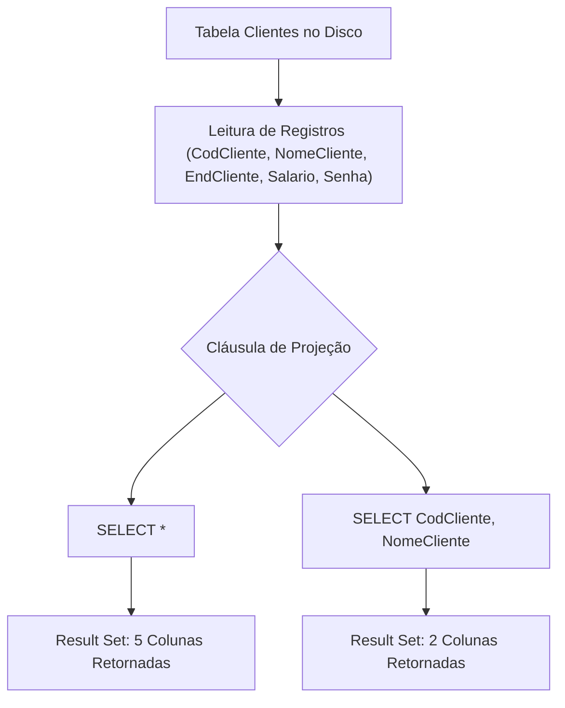

---

## Ordenação de resultados com ORDER BY simples e composto

### Definição e Motivação
Em consonância com a teoria dos conjuntos postulada por E. F. Codd, relações em bancos de dados relacionais são coleções **não ordenadas** de tuplas. Não existe qualquer garantia de que um `SELECT` sem cláusula de ordenação retorne os dados na ordem cronológica de inserção, por ordem de chave primária ou de acordo com a alocação física das páginas de dados em disco.

Para impor uma sequência determinística aos registros exibidos, utiliza-se a cláusula `ORDER BY`. A ordenação pode ocorrer em ordem ascendente (`ASC`, padrão) ou descendente (`DESC`), atuando sobre uma única coluna ou sobre múltiplas colunas em cascata (ordenação composta).

### Sintaxe e Funcionamento
```sql
SELECT campo1, campo2
FROM tabela
ORDER BY campo1 [ASC | DESC] [, campo2 [ASC | DESC], ...];
```
Na ordenação composta, o SGBD ordena os dados com base no primeiro campo especificado. O segundo campo só é utilizado como critério de desempate para as linhas que apresentarem valores idênticos no primeiro campo, e assim sucessivamente.

### Exemplos Práticos Comentados
```sql
-- Exemplo 1: Ordenação simples alfabética (ascendente por padrão)
SELECT * 
FROM CLIENTES 
ORDER BY NomeCliente;

-- Exemplo 2: Ordenação composta (Nome alfabético e Idade como desempate)
SELECT CodCliente, NomeCliente, Idade 
FROM CLIENTES 
ORDER BY NomeCliente, Idade;

-- Exemplo 3 (Complemento técnico): Ordenação composta mista (Nome ASC, Idade DESC)
SELECT CodCliente, NomeCliente, Idade 
FROM CLIENTES 
ORDER BY NomeCliente ASC, Idade DESC;
```

### Contraexemplos e Armadilhas
- **Custo computacional de ordenação externa:** Ordenar grandes volumes de dados sem a existência de índices b-tree pré-existentes na coluna força o SGBD a realizar operações de *Sort* em memória RAM (*work_mem* / *sort_buffer*) ou no disco (*Temp Tablespace*), gerando degradação drástica de tempo de resposta.
- **Tratamento de valores nulos (`NULL`):** Em conformidade com o padrão SQL, bancos como PostgreSQL posicionam `NULL` no final em ordenações `ASC` (ou no topo em `DESC`), enquanto bancos como MySQL ou SQL Server podem adotar comportamentos distintos caso não seja explicitado `NULLS FIRST` ou `NULLS LAST`.

### Análise Comparativa

| Tipo de Ordenação | Critério de Desempate | Aplicação Típica | Complexidade de Execução |
| :--- | :--- | :--- | :--- |
| Simples (`ORDER BY Col1`) | Não há (ordem física arbitrária das duplicatas) | Listagens primárias (ex: catálogo de A a Z) | $O(N \log N)$ em memória |
| Composta (`ORDER BY Col1, Col2`) | Aplicado sequencialmente da esquerda para a direita | Relatórios hierárquicos (ex: Cidade e Bairro) | $O(N \log N)$ considerando tuplas compostas |

### Diagrama de Mecânica do ORDER BY Composto

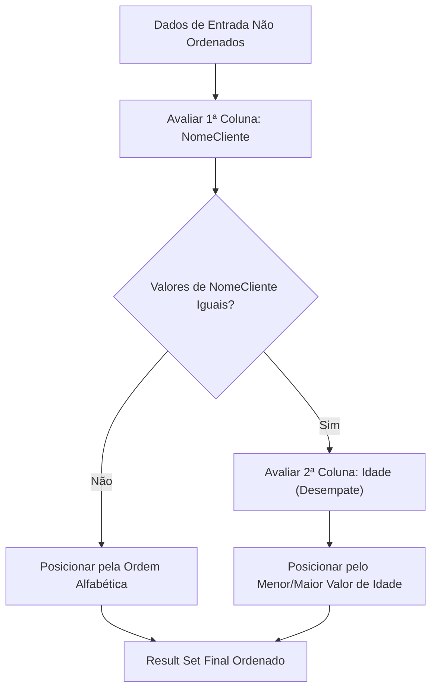

---

## Filtragem condicional com cláusula WHERE e operadores relacionais

### Definição e Motivação
A cláusula `WHERE` implementa na linguagem SQL a operação de **Seleção** ($\sigma$) da Álgebra Relacional. Sua função é aplicar uma restrição horizontal sobre as tuplas da tabela, inspecionando cada linha e permitindo a passagem apenas daquelas cuja expressão condicional avalie para `TRUE` segundo a lógica booleana do SGBD.

Para comparar atributos com valores escalares ou outros atributos, utilizam-se os operadores relacionais matemáticos padronizados.

### Sintaxe e Operadores Relacionais
```sql
SELECT campos
FROM tabela
WHERE coluna OPERADOR valor;
```

Os operadores relacionais fundamentais compreendem:
- `=` : Igualdade estrita.
- `<>` ou `!=` : Diferente de.
- `>` : Maior que.
- `<` : Menor que.
- `>=` : Maior ou igual a.
- `<=` : Menor ou igual a.

### Exemplos Práticos Comentados
```sql
-- Exemplo 1: Filtragem por igualdade de valor alfanumérico
SELECT * 
FROM CLIENTES 
WHERE Estado = 'SP';

-- Exemplo 2: Filtragem por desigualdade numérica (preço maior ou igual a 1.00)
SELECT descricao 
FROM produto 
WHERE val_unit >= 1.00;

-- Exemplo 3: Filtragem temporal por data de nascimento
SELECT nome_aluno, data_nasc_aluno 
FROM alu_aluno 
WHERE data_nasc_aluno >= '1980-01-30';
```
*(Nota de complemento técnico: No material do professor consta a string `'30/01/1980'`. Em ambientes relacionais internacionais é fortemente recomendado o padrão ISO-8601 `'YYYY-MM-DD'` para evitar falhas de interpretação regional entre dia e mês).*

### Contraexemplos e Armadilhas
- **Tentativa de comparar `NULL` com operador relacional:** A expressão `WHERE coluna = NULL` é incorreta na lógica trivalente do SQL. O resultado de qualquer comparação matemática com `NULL` é `UNKNOWN` (falso para fins de filtro). A forma canônica deve ser `coluna IS NULL` ou `coluna IS NOT NULL`.
- **Incompatibilidade de tipos de dados (Type Coercion):** Comparar uma coluna numérica com uma string contendo letras acarreta interrupção da execução com erro de conversão de tipos em tempo de execução.

### Análise Comparativa

| Operador | Significado | Exemplo de Expressão | Avaliação com `val = 10` |
| :--- | :--- | :--- | :--- |
| `=` | Igualdade | `val = 10` | TRUE |
| `<>` | Diferença | `val <> 10` | FALSE |
| `>` | Maior estrito | `val > 5` | TRUE |
| `<` | Menor estrito | `val < 10` | FALSE |
| `>=` | Maior ou igual | `val >= 10` | TRUE |
| `<=` | Menor ou igual | `val <= 9.99` | FALSE |

### Diagrama de Fluxo de Filtragem de Tuplas

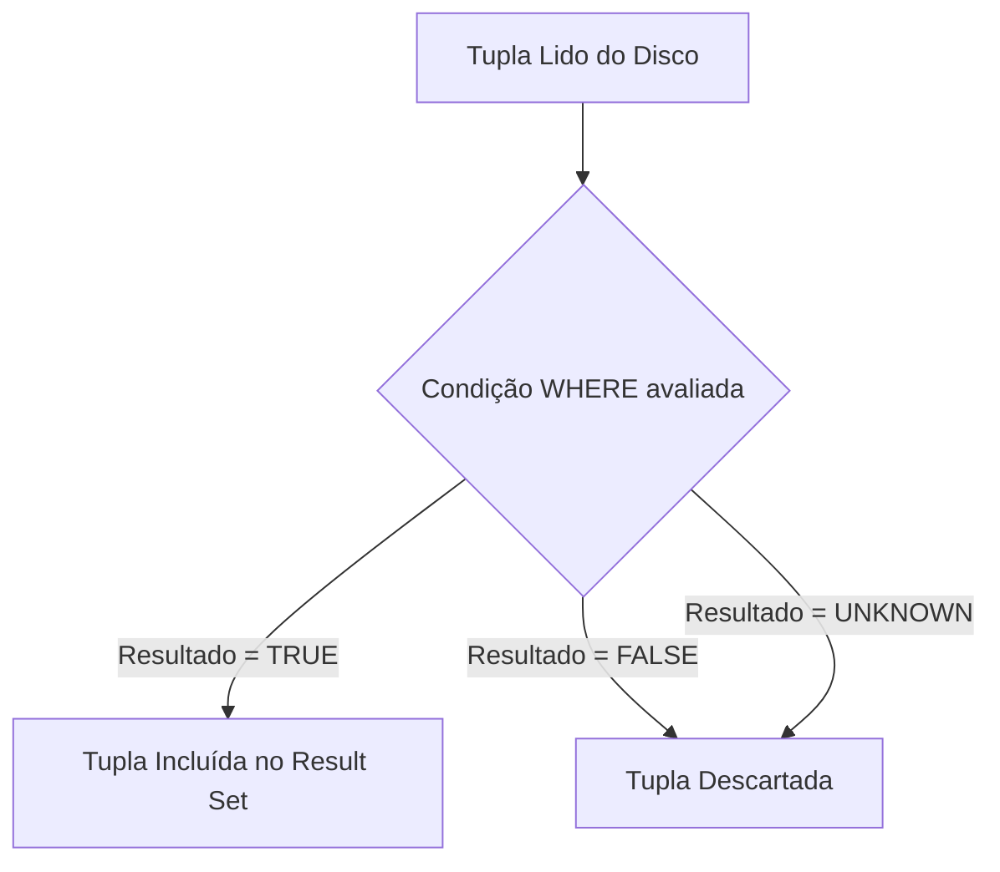

---

## Combinação de condições lógicas com AND, OR e negação com NOT

### Definição e Motivação
Raramente as regras de negócio em sistemas computacionais são expressas por uma única condição isolada. Para expressar restrições complexas, o SQL disponibiliza os operadores lógicos booleanos:
- **AND (Conjunção lógica):** Retorna `TRUE` se, e somente se, **todas** as condições individuais forem verdadeiras.
- **OR (Disjunção lógica):** Retorna `TRUE` se **pelo menos uma** das condições individuais for verdadeira.
- **NOT (Negação lógica):** Inverte o valor booleano da condição avaliada.

### Precedência de Operadores e Parênteses
A álgebra booleana define uma hierarquia estrita de resolução de operadores:
1. `NOT` (maior precedência)
2. `AND` (precedência intermediária)
3. `OR` (menor precedência)

A ausência de parênteses delimitadores em consultas combinadas altera drasticamente a semântica da consulta, produzindo resultados logicamente incorretos sem emitir erros de sintaxe.

### Exemplos Práticos Comentados
```sql
-- Exemplo 1: Filtragem conjuntiva estrita (faixa fechada de preços)
SELECT descricao 
FROM produto 
WHERE val_unit >= 0.50 AND val_unit <= 2.00;

-- Exemplo 2: Filtragem disjuntiva (vendedores com salários fixos específicos)
SELECT codigo_vendedor, nome_vendedor, salario_fixo, faixa_comissao 
FROM vendedor 
WHERE salario_fixo = 2780 OR salario_fixo = 4600;

-- Exemplo 3: Mistura de AND e OR com parênteses obrigatórios
SELECT unidade, descricao, val_unit 
FROM produto 
WHERE unidade = 'M' AND (val_unit = 0.11 OR val_unit = 1.8 OR val_unit = 2);
```

### Contraexemplos e Armadilhas
- **A armadilha da precedência sem parênteses:**
  A instrução:
  ```sql
  -- INCORRETO: Retorna produtos de unidade 'M' com preço 0.11, OU qualquer produto com preço 1.8 ou 2!
  SELECT * FROM produto WHERE unidade = 'M' AND val_unit = 0.11 OR val_unit = 1.8 OR val_unit = 2;
  ```
  O SGBD interpreta como `(unidade = 'M' AND val_unit = 0.11) OR (val_unit = 1.8) OR (val_unit = 2)`, vazando produtos com unidades diferentes de `'M'`.
- **Condições mutuamente excludentes com AND:**
  ```sql
  -- ERRO LÓGICO: Uma tupla nunca terá dois valores escalares distintos na mesma coluna
  SELECT nome_cliente FROM cliente WHERE cidade = 'Campinas' AND cidade = 'São Paulo';
  -- Retorno: Sempre 0 linhas! O operador correto seria OR.
  ```

### Tabela Verdade Relacional

| Condição A | Condição B | A AND B | A OR B | NOT A |
| :--- | :--- | :--- | :--- | :--- |
| TRUE | TRUE | TRUE | TRUE | FALSE |
| TRUE | FALSE | FALSE | TRUE | FALSE |
| FALSE | TRUE | FALSE | TRUE | TRUE |
| FALSE | FALSE | FALSE | FALSE | TRUE |

### Diagrama de Árvore de Decisão Lógica

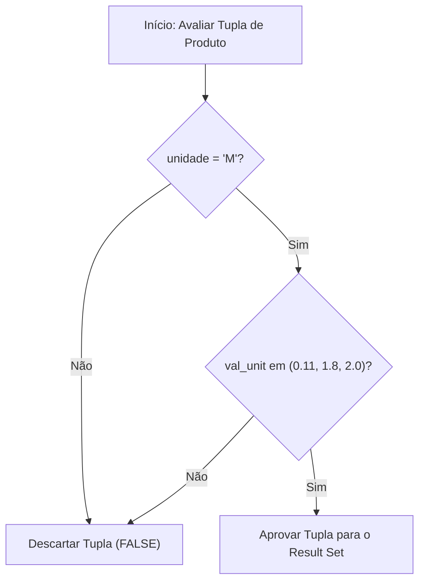

---

## Eliminação de tuplas duplicadas com DISTINCT

### Definição e Motivação
Ao contrário do modelo relacional teórico puro, no qual uma relação é obrigatoriamente um conjunto matemático sem tuplas repetidas, o SQL opera fundamentalmente sobre **multiconjuntos** (*bags* ou coleções com duplicatas) por questões de desempenho de leitura.

Quando uma projeção seleciona apenas algumas colunas de uma tabela, valores repetidos naturalmente emergem no resultado. Para forçar a semântica de conjunto estrito, utiliza-se a palavra-chave `DISTINCT` imediatamente após o `SELECT`.

### Sintaxe e Funcionamento
```sql
SELECT DISTINCT campo1 [, campo2, ...]
FROM tabela;
```
*(Nota de complemento técnico: O operador `DISTINCT` atua sobre a combinação de **todas** as colunas listadas na cláusula de projeção, e não apenas sobre o primeiro campo.)*

### Exemplos Práticos Comentados
```sql
-- Exemplo 1: Obter a listagem única de nomes de clientes cadastrados
SELECT DISTINCT nome_cliente 
FROM cliente;

-- Exemplo 2: Distinção composta sobre múltiplos atributos
SELECT DISTINCT nome_cliente, endereco_cliente 
FROM cliente;
```
No Exemplo 2, duas linhas só serão consideradas duplicadas e fundidas se **tanto** o `nome_cliente` **quanto** o `endereco_cliente` forem idênticos em ambas as tuplas.

### Contraexemplos e Armadilhas
- **Uso abusivo de `DISTINCT` para mascarar junções erradas:** Desenvolvedores inexperientes frequentemente utilizam `DISTINCT` para "corrigir" resultados multiplicados gerados por junções sem predicado de ligação adequado. Isso consome recursos severos de processamento (ordenação ou tabela hash interna) e oculta falhas arquiteturais graves.
- **Incompatibilidade sintática posicional:** Escrever `SELECT col1, DISTINCT col2 FROM tabela` é sintaticamente inválido no SQL padrão. O modificador `DISTINCT` aplica-se obrigatoriamente ao cabeçalho inteiro da consulta.

### Análise Comparativa

| Diretiva | Mecanismo Interno | Impacto de Performance | Cenário Adequado |
| :--- | :--- | :--- | :--- |
| `SELECT` (padrão ALL) | Streaming direto de leitura | Sem sobrecarga computacional adicional | Listagens em geral, dados com chaves primárias |
| `SELECT DISTINCT` | Hash Aggregate ou Sort Unique | Sobrecarga de CPU e memória para deduplicação | Extração de domínios existentes, relatórios consolidados |

### Diagrama de Deduplicação

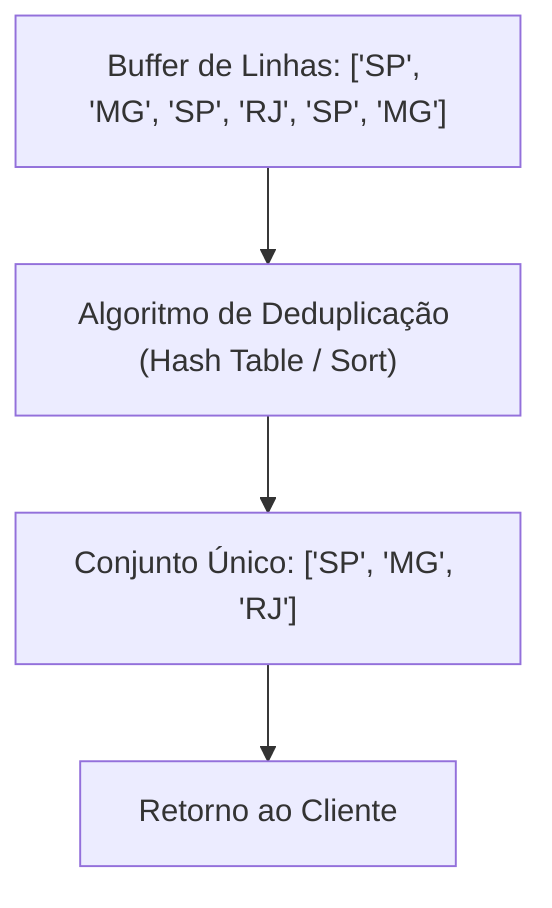

---

## Expressões e operadores aritméticos (+, -, *, /) com uso de alias (AS)

### Definição e Motivação
O comando `SELECT` não se limita a projetar colunas brutas armazenadas fisicamente no banco de dados. Ele atua como um motor de processamento escalar capaz de avaliar expressões matemáticas em tempo real sobre os valores das tuplas.

Para nomear colunas computadas ou renomear atributos na saída final, facilitando a legibilidade e a integração com camadas de aplicação, emprega-se a cláusula de apelido de coluna (`AS`).

### Operadores Aritméticos Fundamentais
- `+` : Adição
- `-` : Subtração
- `*` : Multiplicação
- `/` : Divisão

### Sintaxe e Funcionamento
```sql
SELECT coluna_original, (expressao_matematica) AS "Nome da Nova Coluna"
FROM tabela;
```

### Exemplos Práticos Comentados
```sql
-- Exemplo 1: Simulação de aumento salarial de 10%
SELECT salario_fixo * 1.1 AS "Novo Salário" 
FROM vendedor;

-- Exemplo 2: Simulação de aumento de 25% no valor dos produtos
SELECT descricao, unidade, val_unit AS "Preço Atual", val_unit * 1.25 AS "Preço com Aumento" 
FROM produto;

-- Exemplo 3: Simulação de desconto de 12% para produtos de unidade específica
SELECT descricao, unidade, val_unit AS "Preço Atual", val_unit - (val_unit * 0.12) AS "Preço com Desconto" 
FROM produto 
WHERE unidade = 'M';
```

### Contraexemplos e Armadilhas
- **Uso de Alias de Coluna na Cláusula `WHERE`:**
  ```sql
  -- ERRO CRÍTICO DE SINTAXE/EXECUÇÃO:
  SELECT descricao, val_unit * 1.25 AS preco_reajustado
  FROM produto
  WHERE preco_reajustado > 10.00;
  ```
  Isso falha porque a cláusula `WHERE` é avaliada pelo SGBD **antes** da projeção `SELECT`. O identificador `preco_reajustado` ainda não existe no momento do filtro. A forma correta exige repetir a expressão: `WHERE val_unit * 1.25 > 10.00`.
- **Divisão por Zero:** Avaliar `coluna / 0` resulta em erro fatal de tempo de execução em bancos rigorosos como PostgreSQL ou retorno de `NULL` com aviso em bancos como MySQL.

### Análise Comparativa de Operações

| Operação | Expressão SQL | Efeito Matemático | Exemplo de Aplicação |
| :--- | :--- | :--- | :--- |
| Adição | `valor + 50` | Deslocamento positivo | Adição de taxas fixas |
| Subtração | `valor - 10` | Deslocamento negativo | Aplicação de deduções |
| Multiplicação | `valor * 1.15` | Fator multiplicativo | Aplicação de juros ou acréscimos |
| Composta | `valor - (valor * 0.10)` | Desconto percentual | Queima de estoque |

### Diagrama de Avaliação Escalar

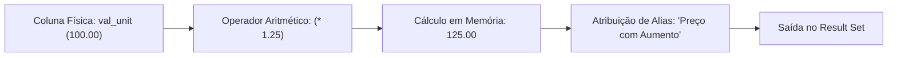

---

## Filtragem de faixas e intervalos com operador BETWEEN

### Definição e Motivação
A seleção de dados contidos em um intervalo fechado de valores numéricos, alfanuméricos ou de datas é uma exigência comum em consultas analíticas. Embora seja viável utilizar conjunções com operadores relacionais (`campo >= valor1 AND campo <= valor2`), o SQL disponibiliza o operador `BETWEEN`, que encapsula essa semântica de forma expressiva e legível.

O operador `BETWEEN` opera de forma **inclusiva**: os limites inferior e superior fornecidos fazem parte do conjunto aceito pelo predicado.

### Sintaxe e Funcionamento
```sql
SELECT colunas
FROM tabela
WHERE coluna BETWEEN limite_inferior AND limite_superior;
```
*(Nota de complemento técnico: A expressão `coluna NOT BETWEEN v1 AND v2` é a negação exata, selecionando valores estritamente menores que `v1` ou estritamente maiores que `v2`.)*

### Exemplos Práticos Comentados
```sql
-- Exemplo 1: Faixa salarial de vendedores
SELECT * 
FROM vendedor 
WHERE salario_fixo BETWEEN 2000 AND 3000;

-- Exemplo 2: Faixa de valores monetários de produtos
SELECT codigo_produto, descricao, val_unit 
FROM produto 
WHERE val_unit BETWEEN 0.32 AND 2.00;

-- Exemplo 3: Intervalo fechado de datas
SELECT matricula, nome_aluno, data_nasc_aluno 
FROM alu_aluno 
WHERE data_nasc_aluno BETWEEN '1980-02-01' AND '1990-10-30';
```

### Contraexemplos e Armadilhas
- **Inversão da ordem dos limites:**
  ```sql
  -- RETORNA VAZIO (0 linhas no padrão SQL ANSI):
  SELECT * FROM vendedor WHERE salario_fixo BETWEEN 3000 AND 2000;
  ```
  O operador `BETWEEN` é semanticamente traduzido pelo motor do banco para:
  `salario_fixo >= 3000 AND salario_fixo <= 2000`. Como nenhum número real pode ser simultaneamente maior ou igual a 3000 e menor ou igual a 2000, o predicado avalia invariavelmente para `FALSE`.
- **Armadilha com campos `DATETIME` / `TIMESTAMP`:** Usar `BETWEEN '2026-01-01' AND '2026-01-31'` sobre campos de data/hora compara contra `'2026-01-31 00:00:00'`, perdendo todos os eventos ocorridos ao longo do dia 31 após a meia-noite.

### Análise Comparativa

| Forma Sintática | Tradução Lógica Equivalente | Inclusão de Limites | Legibilidade |
| :--- | :--- | :--- | :--- |
| `col BETWEEN A AND B` | `col >= A AND col <= B` | Inclusiva em ambos os extremos | Alta (recomendada) |
| `col >= A AND col <= B` | Expressão relacional nativa | Inclusiva em ambos os extremos | Média (verborrágica) |
| `col > A AND col < B` | Expressão relacional estrita | Exclusiva nos extremos | Necessária para faixas abertas |

### Diagrama de Faixa Numérica

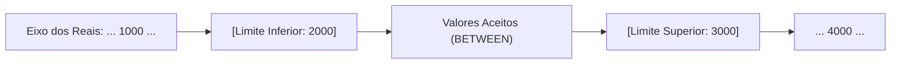

---

## Casamento de padrões em strings com operadores LIKE, ILIKE e curingas (% e _)

### Definição e Motivação
Em muitas situações, o critério de busca sobre campos textuais não é a igualdade exata de cadeias de caracteres, mas sim a ocorrência de fragmentos, prefixos, sufixos ou padrões posicionais estruturados.

Para essas operações de casamento de padrões (*pattern matching*), a linguagem SQL provê o operador `LIKE`. No caso específico de dialetos como o PostgreSQL (conforme apresentado nos slides de aula), existe também o operador `ILIKE`, que executa a comparação de forma insensível a maiúsculas e minúsculas (*case-insensitive*).

### Metacaracteres Curingas
- `%` (porcentagem): Representa qualquer sequência de **zero ou mais caracteres**.
- `_` (sublinhado/underscore): Representa **exatamente um caractere qualquer** em uma posição fixa.

### Sintaxe e Funcionamento
```sql
SELECT colunas
FROM tabela
WHERE coluna LIKE 'PadraoComCuringas';
```

### Exemplos Práticos Comentados
```sql
-- Exemplo 1: Casamento posicional combinado (inicia com 'A', 2º caractere qualquer, termina com 'S')
SELECT nome 
FROM cliente 
WHERE nome LIKE 'A_%S';

-- Exemplo 2: Prefixo (nomes iniciados pela letra 'A')
SELECT * 
FROM empregado 
WHERE pnome LIKE 'A%';

-- Exemplo 3: Substring interna (presença da letra 'a' minúscula em qualquer parte do texto)
SELECT pnome, cargo 
FROM empregado 
WHERE pnome LIKE '%a%';

-- Exemplo 4: Busca sem diferenciação de caixa (case-insensitive com ILIKE)
SELECT pnome, cargo 
FROM empregado 
WHERE pnome ILIKE '%a%';
```

### Contraexemplos e Armadilhas
- **Sensibilidade a maiúsculas/minúsculas no `LIKE`:** Executar `WHERE pnome LIKE '%a%'` ignorará registros cujo nome seja "ANA" ou "ARTHUR" se as letras estiverem gravadas em caixa alta. Nesses casos, no SQL ANSI padrão utiliza-se `WHERE UPPER(pnome) LIKE '%A%'`, ou adota-se o operador proprietário `ILIKE` no PostgreSQL.
- **Degradação de desempenho por quebra de índice (Sargability):** Consultas utilizando `%` no início do padrão (ex: `LIKE '%termo'`) impedem o SGBD de utilizar índices B-Tree convencionais na coluna, forçando a execução de uma varredura completa da tabela (*Sequential Table Scan*).

### Análise Comparativa de Curingas

| Padrão | Descrição do Casamento | Exemplos Válidos | Exemplos Inválidos |
| :--- | :--- | :--- | :--- |
| `'A%'` | Começa com a letra "A" maiúscula | "Ana", "Alberto", "A" | "Carlos", "aaron" |
| `'%a'` | Termina com a letra "a" minúscula | "Silva", "Costa" | "Santos", "SILVA" |
| `'%adm%'` | Contém o fragmento "adm" | "Administrador", "Cadmo" | "Auto", "ADM" (em LIKE) |
| `'_a%'` | A segunda letra é obrigatoriamente "a" | "Carlos", "Maria", "Passo" | "Ana", "Beto", "Cristo" |

### Diagrama de Padrões de Texto

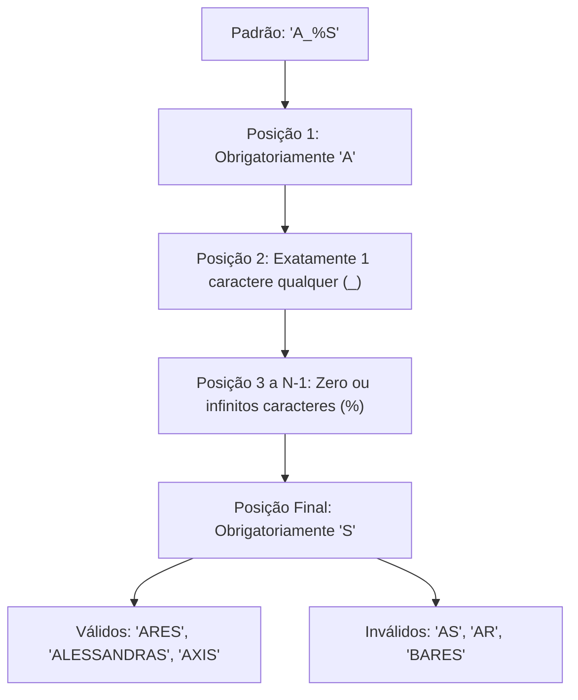

---

## Funções agregadas de sumarização (MAX, MIN, AVG, SUM, COUNT)

### Definição e Motivação
As consultas analisadas até aqui realizam transformações linha a linha. Entretanto, aplicações de análise de dados exigem frequentemente a síntese de conjuntos de dados em escalares estatísticos: totalizações, médias, contagens de cardinalidade e extremos numéricos.

As funções agregadas recebem um conjunto de valores de uma coluna e o reduzem a um único valor escalar sumarizado.

### O Catálogo de Funções Agregadas
- `COUNT(*)`: Conta a quantidade total de registros (tuplas) resultantes da consulta, independentemente de valores nulos.
- `COUNT(coluna)`: Conta a quantidade de valores preenchidos na coluna, **ignorando tuplas onde o valor seja `NULL`**.
- `SUM(coluna)`: Calcula a soma aritmética de todos os valores da coluna numérica, desconsiderando nulos.
- `AVG(coluna)`: Calcula a média aritmética simples dos valores preenchidos na coluna.
- `MAX(coluna)`: Retorna o maior valor registrado para o atributo.
- `MIN(coluna)`: Retorna o menor valor registrado para o atributo.

### Sintaxe e Regras Rígidas
```sql
SELECT FUNCAO_AGREGADA(coluna) [AS alias]
FROM tabela
[WHERE condicao];
```
*(Regra mandatória: Funções agregadas **nunca** podem ser inseridas diretamente na cláusula `WHERE` para filtragem. O motivo reside na ordem de processamento lógico: o `WHERE` opera tupla a tupla antes de qualquer cálculo de agregação ser instanciado).*

### Exemplos Práticos Comentados
```sql
-- Exemplo 1: Identificação do maior preço praticado
SELECT MAX(preco) AS MAIOR_PRECO 
FROM produto;

-- Exemplo 2: Média salarial da folha de pagamento
SELECT AVG(salario) AS "Media Salarial" 
FROM empregado;

-- Exemplo 3: Contagem de funcionários com cargo de gerência
SELECT COUNT(*) AS "Quantidade de Gerente na Empresa" 
FROM empregado 
WHERE cargo = 'Gerente';

-- Exemplo 4: Obtenção simultânea do teto e do piso salarial
SELECT MAX(salario) AS "Maior Salario", MIN(salario) AS "Menor Salario" 
FROM empregado;

-- Exemplo 5: Somatório financeiro da folha de pagamento
SELECT SUM(salario) AS "Soma salarial" 
FROM empregado;
```

### Contraexemplos e Armadilhas
- **Projeção de coluna não agregada sem GROUP BY:**
  ```sql
  -- ERRO CLÁSSICO DE SQL:
  SELECT cargo, MAX(salario) FROM empregado;
  ```
  Esta instrução produz erro sintático na esmagadora maioria dos SGBDs padrão. Se a consulta contém uma função de agregação e uma coluna escalar isolada, o SGBD não sabe como agrupar as linhas não sumarizadas sem a presença de uma cláusula `GROUP BY cargo`.
- **Distorção no cálculo de `AVG` por nulos:** `AVG(coluna)` divide a soma das linhas não-nulas pelo número de linhas não-nulas. Se uma coluna possui valores `[10, NULL, 20]`, a média calculada será $(10 + 20) / 2 = 15$, e não $(10 + 0 + 20) / 3 = 10$.

### Análise Comparativa de Funções Agregadas

| Função | Tipo de Retorno | Tratamento de `NULL` | Aplicação Típica |
| :--- | :--- | :--- | :--- |
| `COUNT(*)` | Inteiro | Conta linhas mesmo se colunas forem nulas | Totalizador volumétrico |
| `COUNT(col)` | Inteiro | Ignora linhas onde `col IS NULL` | Auditoria de preenchimento |
| `SUM(col)` | Numérico / Moeda | Ignora os nulos | Totalizações contábeis |
| `AVG(col)` | Ponto Flutuante | Ignora os nulos | Indicadores e métricas de desempenho |
| `MAX(col)` | Mesmo tipo da coluna | Ignora os nulos | Picos, recordes, datas mais recentes |
| `MIN(col)` | Mesmo tipo da coluna | Ignora os nulos | Menor custo, pisos salariais |

### Diagrama de Agregação de Conjunto

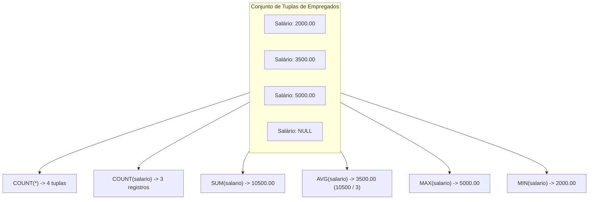

---

## Operadores de pertinência a conjuntos IN e NOT IN

### Definição e Motivação
Em cenários onde é necessário testar a pertinência de um atributo a uma lista finita e discreta de valores literais, encadear múltiplos operadores relacionais de igualdade com a conjunção `OR` torna a consulta prolixa e de difícil manutenção.

O operador `IN` resolve essa deficiência, permitindo especificar um conjunto estático de elementos. Uma linha será incluída no *result set* se o valor da coluna coincidir com qualquer um dos valores presentes no conjunto delimitado por parênteses. Já o operador `NOT IN` é o seu inverso estrito, selecionando linhas cujo valor não pertença à coleção.

### Sintaxe e Equivalência Lógica
```sql
-- Sintaxe com IN
SELECT colunas FROM tabela WHERE coluna IN (valor1, valor2, ...);

-- Sintaxe com NOT IN
SELECT colunas FROM tabela WHERE coluna NOT IN (valor1, valor2, ...);
```
A declaração `coluna IN ('A', 'B')` é estritamente equivalente à expressão booleana `(coluna = 'A' OR coluna = 'B')`.

### Exemplos Práticos Comentados
```sql
-- Exemplo 1: Filtragem por lista de estados (pertinência positiva)
SELECT nome_cliente, uf 
FROM cliente 
WHERE uf IN ('SP', 'MG');

-- Exemplo 2: Filtragem por lista de estados (pertinência negativa)
SELECT nome_cliente, uf 
FROM cliente 
WHERE uf NOT IN ('SP', 'MG');

-- Exemplo 3: Faixas de comissão de vendedores
SELECT nome_vendedor, faixa_comissao 
FROM vendedor 
WHERE faixa_comissao IN ('A', 'B');

-- Exemplo 4: Filtragem conjugada de múltiplos conjuntos e comparação escalar
SELECT codigo_produto, unidade, descricao, val_unit 
FROM produto 
WHERE unidade IN ('M', 'G', 'L') AND val_unit <= 1.05;
```

### Contraexemplos e Armadilhas
- **A catástrofe lógica do `NULL` dentro do `NOT IN`:**
  Considere a consulta:
  ```sql
  SELECT nome_cliente FROM cliente WHERE uf NOT IN ('SP', NULL);
  ```
  *(Nota de complemento técnico: No padrão ANSI, o operador `NOT IN` é avaliado como uma cadeia de desigualdades conectadas por `AND`: `(uf <> 'SP' AND uf <> NULL)`. Como qualquer comparação com `NULL` resulta em `UNKNOWN`, e a conjunção de qualquer valor booleano com `UNKNOWN` nunca resulta em `TRUE`, essa consulta **nunca retornará nenhuma linha**, independentemente dos dados gravados na tabela).*

### Análise Comparativa

| Abordagem | Clareza de Código | Extensibilidade | Equivalência Matemática |
| :--- | :--- | :--- | :--- |
| `IN (v1, v2, v3)` | Concisa e direta | Adicionar itens basta incluir uma vírgula | $x \in \{v_1, v_2, v_3\}$ |
| `OR (col = v1 OR ...)` | Repetitiva e sujeita a erros | Exige repetir o nome do campo e do operador | $(x = v_1) \lor (x = v_2) \lor (x = v_3)$ |

### Diagrama de Pertinência de Conjuntos

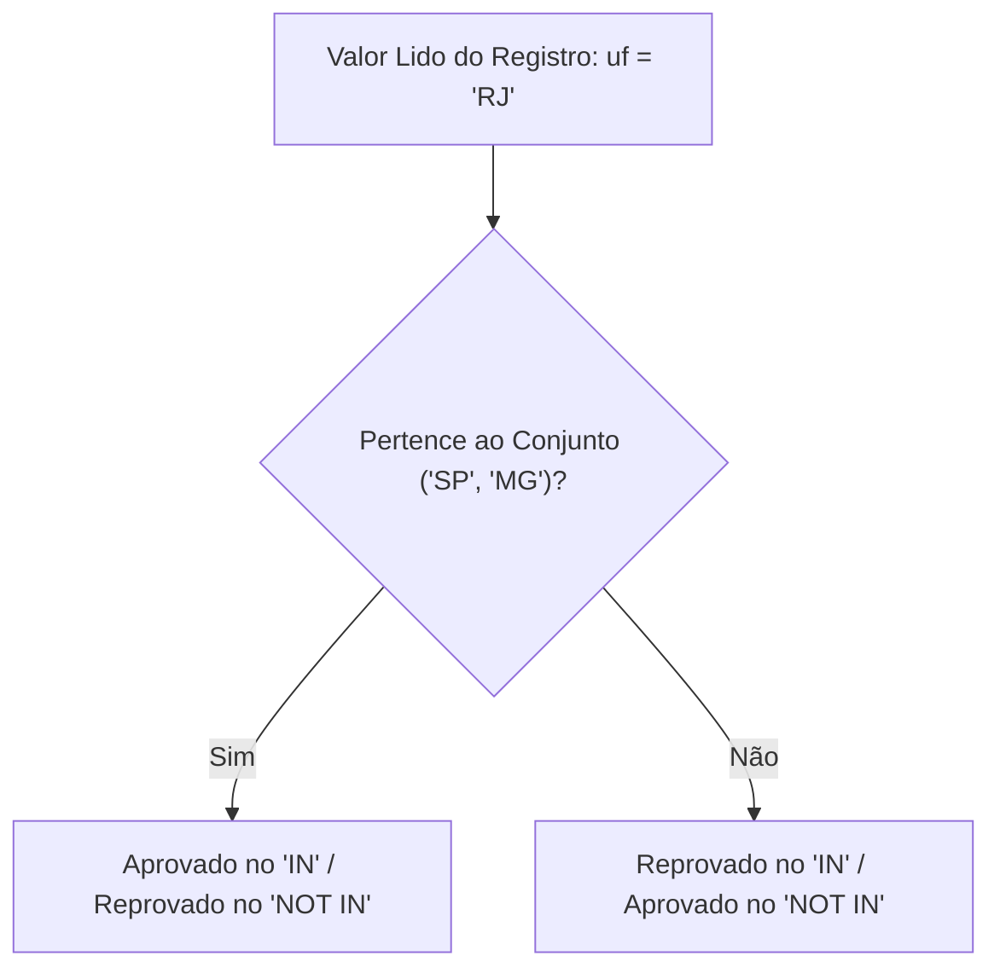

---

## Junção relacional entre múltiplas tabelas (JOIN) via cláusula WHERE

### Definição e Motivação
O projeto de bancos de dados relacionais apoia-se fortemente na teoria da **Normalização** (Formas Normais de Boyce-Codd, 1FN, 2FN, 3FN). Para evitar anomalias de inserção, alteração e exclusão, além de erradicar a redundância física, os dados são divididos em entidades independentes ligadas por integridade referencial (chaves primárias e chaves estrangeiras).

Para recuperar uma visão unificada dessas entidades no momento da consulta, realiza-se o processo de **Junção (Join)**. No modelo pedagógico da aula, a junção de tabelas é apresentada utilizando o padrão histórico SQL-89, onde as tabelas são declaradas conjuntamente na cláusula `FROM` e a amarração referencial é imposta como um predicado na cláusula `WHERE`.

### Sintaxe e Funcionamento (Sintaxe SQL-89 via WHERE)
```sql
SELECT Tabela1.Campo1, Tabela2.Campo2
FROM Tabela1, Tabela2
WHERE (Tabela1.CampoRelacionado1 = Tabela2.CampoRelacionado2);
```

### O Modelo Conceitual do Slide: Clientes e Veículos
Os slides apresentam um modelo clássico de cardinalidade:
- Uma entidade `CLIENTES` possui zero, um ou muitos `VEICULOS` ($1:N$).
- Cada `VEICULO` pertence obrigatoriamente a exatamente um `CLIENTE` ($1:1$).
- A chave primária `cpf` de `CLIENTES` migra para `VEICULOS` como chave estrangeira (`cpf_cli`).

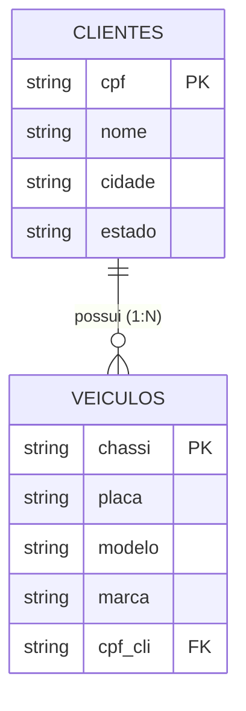

### Exemplos Práticos Comentados
```sql
-- Exemplo de Junção: Unindo dados pessoais do cliente aos dados do seu veículo
SELECT clientes.nome, clientes.cidade, veiculos.modelo, veiculos.marca 
FROM clientes, veiculos 
WHERE (clientes.cpf = veiculos.cpf_cli);
```

### Contraexemplos e Armadilhas
- **A explosão do Produto Cartesiano (Cross Join Acidental):**
  Se o programador esquecer a condição `WHERE (clientes.cpf = veiculos.cpf_cli)`:
  ```sql
  -- PERIGO CRÍTICO DE DESEMPENHO:
  SELECT clientes.nome, veiculos.modelo FROM clientes, veiculos;
  ```
  O SGBD executará o produto cartesiano irrestrito ($N \times M$). Se a tabela `clientes` possuir 10.000 registros e a tabela `veiculos` possuir 10.000 registros, a consulta gerará $100.000.000$ (cem milhões) de linhas combinando artificialmente todo e qualquer cliente com todo e qualquer veículo existente.

### Análise Comparativa de Sintaxes de Junção

| Padrão | Declaração da Junção | Vantagens | Desvantagens |
| :--- | :--- | :--- | :--- |
| SQL-89 (utilizado em aula) | `FROM T1, T2 WHERE T1.id = T2.id` | Código compacto em consultas simples | Risco altíssimo de esquecer o predicado gerando produto cartesiano; difícil separar filtros de negócio da junção |
| SQL-92 (Complemento técnico ANSI) | `FROM T1 INNER JOIN T2 ON T1.id = T2.id` | Clareza estrutural; impossível omitir o `ON` sem erro sintático | Sintaxe ligeiramente mais longa |

### Diagrama de Mecânica de Junção

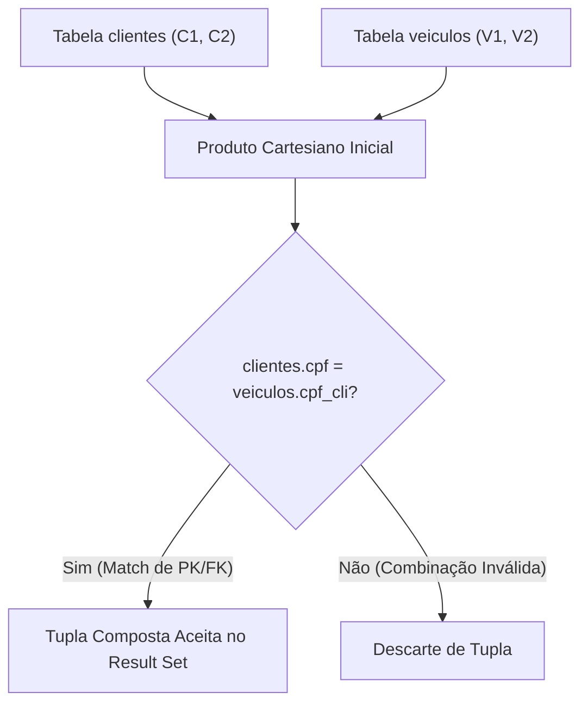

---

## Consultas compostas combinando junções, múltiplos filtros e ordenação

### Definição e Motivação
Em sistemas corporativos, as instruções SQL integram simultaneamente múltiplos mecanismos: união de várias tabelas normalizadas, aplicação de filtros específicos de regras de negócio em diferentes entidades e ordenação final para consumo da interface de usuário.

A construção dessas consultas exige atenção estrita à sintaxe lógica e ao particionamento de condições na cláusula `WHERE`, distinguindo os predicados de junção (estruturais) dos predicados de seleção (filtros de domínio).

### Arquitetura de Execução da Consulta Composta
A ordem sintática em que o desenvolvedor escreve a consulta difere frontalmente da ordem física e lógica com que o motor de processamento relacional a interpreta:

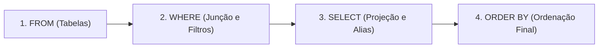

### Exemplos Práticos Comentados
```sql
-- Exemplo 1: Junção de Clientes e Veículos com Ordenação pelo Município do Cliente
SELECT clientes.nome, clientes.cidade, veiculos.modelo, veiculos.marca 
FROM clientes, veiculos 
WHERE (clientes.cpf = veiculos.cpf_cli) 
ORDER BY clientes.cidade;

-- Exemplo 2: Junção de Clientes e Veículos com Filtro Geográfico de Negócio (apenas SP)
SELECT clientes.nome, clientes.cidade, veiculos.modelo, veiculos.marca 
FROM clientes, veiculos 
WHERE (clientes.cpf = veiculos.cpf_cli) 
  AND (clientes.estado = 'SP');

-- Exemplo 3: A consulta composta completa (Junção + Filtro de Negócio + Ordenação)
SELECT clientes.nome, clientes.cidade, veiculos.modelo, veiculos.marca 
FROM clientes, veiculos 
WHERE (clientes.cpf = veiculos.cpf_cli) 
  AND (clientes.estado = 'SP') 
ORDER BY clientes.cidade;
```

### Decomposição Detalhada da Consulta Composta
1. `FROM clientes, veiculos`: Disponibiliza o escopo de atributos de ambas as relações para o compilador SQL.
2. `WHERE (clientes.cpf = veiculos.cpf_cli)`: Estabelece a restrição de integridade referencial, descartando pares incoerentes.
3. `AND (clientes.estado = 'SP')`: Filtra as tuplas compostas aprovadas, restringindo o resultado aos registros onde o cliente resida em São Paulo.
4. `SELECT clientes.nome, ...`: Projeta na tela estritamente os 4 atributos requisitados.
5. `ORDER BY clientes.cidade`: Realiza a ordenação ascendente das tuplas sobreviventes com base no nome do município.

### Análise Comparativa dos Componentes de uma Consulta Completa

| Cláusula | Função Lógica | Momento de Avaliação | Efeito no Resultado |
| :--- | :--- | :--- | :--- |
| `FROM` | Identificação de fontes | Fase 1 | Determina o domínio cartesiano |
| `WHERE` | Poda relacional | Fase 2 | Reduz a cardinalidade das linhas |
| `SELECT` | Projeção vertical | Fase 3 | Reduz o número de colunas retornadas |
| `ORDER BY` | Sequenciamento | Fase 4 | Organiza as tuplas sem alterar conteúdo |

---

## Código da aula

Nesta seção são descritos os scripts SQL complementares desenvolvidos para validar todos os conceitos teóricos apresentados pelo professor em aula.

### Script de Exemplos da Aula: [./codigo/exemplos.sql](./codigo/exemplos.sql)
O arquivo `./codigo/exemplos.sql` provê um ambiente completo de testes contendo o DDL para instanciação das tabelas citadas nos slides (`cliente`/`clientes`, `vendedor`, `produto`, `veiculos`, `alu_aluno`, `empregado`) e a carga inicial de dados simulados (DML), seguida de cada uma das consultas exemplificadas.

Trecho essencial comentado de `./codigo/exemplos.sql`:
```sql
-- Criação da tabela clientes com chave primária natural
CREATE TABLE clientes (
    cpf VARCHAR(14) PRIMARY KEY,
    nome VARCHAR(100) NOT NULL,
    cidade VARCHAR(60) NOT NULL,
    estado CHAR(2) NOT NULL
);

-- Criação da tabela veiculos contendo a Foreign Key
CREATE TABLE veiculos (
    chassi VARCHAR(30) PRIMARY KEY,
    placa VARCHAR(10) NOT NULL,
    modelo VARCHAR(50) NOT NULL,
    marca VARCHAR(50) NOT NULL,
    cpf_cli VARCHAR(14) NOT NULL,
    CONSTRAINT fk_veiculos_clientes FOREIGN KEY (cpf_cli) REFERENCES clientes(cpf)
);

-- Junção com predicado estrutural e filtro de negócio combinados
SELECT 
    clientes.nome,
    clientes.cidade,
    veiculos.modelo,
    veiculos.marca
FROM 
    clientes, 
    veiculos
WHERE 
    clientes.cpf = veiculos.cpf_cli 
    AND clientes.estado = 'SP'
ORDER BY 
    clientes.cidade ASC;
```

### Script de Resolução de Exercícios: [./codigo/exercicios.sql](./codigo/exercicios.sql)
O arquivo `./codigo/exercicios.sql` consolida os testes e as soluções completas e comentadas dos 4 exercícios formulados nos slides pelo Prof. Guilherme de Morais. O arquivo pode ser executado diretamente em qualquer console SQL padrão (PostgreSQL, MySQL ou MariaDB).

---

## Exercícios

Abaixo constam as resoluções aprofundadas dos 4 exercícios propostos pelo professor nos slides das aulas 04 e 06.

### Exercício 1: Junção de Clientes e Veículos por Modelo
- **Enunciado oficial:** *1- Selecione todos os nome e cpf da tabela cliente e marca e modelo cujo o modelo for igual a Toyota.*
- **Raciocínio lógico-algorítmico:**
  1. A consulta requer atributos oriundos de duas relações distintas: `nome` e `cpf` residem em `cliente` (ou `clientes`), enquanto `marca` e `modelo` residem na tabela `veiculos`.
  2. As tabelas devem ser unidas através da correspondência de chave: `cliente.cpf = veiculos.cpf_cli`.
  3. Há uma restrição de negócio de igualdade sobre o atributo textual: o modelo do veículo deve ser exatamente `'Toyota'` (ou a marca, conforme a formulação coloquial do slide; mantemos a restrição literal sobre a coluna `modelo`).
  4. Ambas as condições devem ser exigidas conjuntamente, utilizando o operador booleano `AND`.
- **Implementação SQL:**
```sql
-- Resolução do Exercício 1
SELECT 
    clientes.nome, 
    clientes.cpf, 
    veiculos.marca, 
    veiculos.modelo
FROM 
    clientes, 
    veiculos
WHERE 
    clientes.cpf = veiculos.cpf_cli 
    AND veiculos.modelo = 'Toyota';
```
*(Nota de referência: Implementado no script executável [./codigo/exercicios.sql](./codigo/exercicios.sql)).*

---

### Exercício 2: Veículos de Clientes Fora de São Paulo
- **Enunciado oficial:** *2- Seleciona do veículos chassi, placa, modelo e marcar e da tabela clientes nome e cpf , cujo os clientes que residem em estado diferente de São Paulo.*
- **Raciocínio lógico-algorítmico:**
  1. Projetar atributos específicos da tabela de veículos (`chassi`, `placa`, `modelo`, `marca`) e da tabela de clientes (`nome`, `cpf`).
  2. Declarar ambas as tabelas na cláusula `FROM`.
  3. Vincular as tuplas através da integridade referencial `clientes.cpf = veiculos.cpf_cli`.
  4. Aplicar o operador relacional de desigualdade sobre o estado do cliente, expressando que a unidade federativa não pode ser `'SP'`. No padrão SQL ANSI utiliza-se `<>` (ou `!=`).
- **Implementação SQL:**
```sql
-- Resolução do Exercício 2
SELECT 
    veiculos.chassi, 
    veiculos.placa, 
    veiculos.modelo, 
    veiculos.marca, 
    clientes.nome, 
    clientes.cpf
FROM 
    veiculos, 
    clientes
WHERE 
    clientes.cpf = veiculos.cpf_cli 
    AND clientes.estado <> 'SP';
```
*(Nota de referência: Implementado no script executável [./codigo/exercicios.sql](./codigo/exercicios.sql)).*

---

### Exercício 3: Filtragem de Veículos por Marcas com Operador IN
- **Enunciado oficial:** *3- Selecione todos os veículos da marcar Toyota e VW. Usando o comando in.*
- **Raciocínio lógico-algorítmico:**
  1. A consulta restringe-se aos dados da própria tabela `veiculos`.
  2. Utiliza-se o operador de pertinência de conjunto `IN` para substituir a disjunção prolixa `(marca = 'Toyota' OR marca = 'VW')`.
  3. A lista de constantes literais de texto deve ser inserida entre parênteses e delimitada por aspas simples.
- **Implementação SQL:**
```sql
-- Resolução do Exercício 3
SELECT * 
FROM veiculos 
WHERE marca IN ('Toyota', 'VW');
```
*(Nota de referência: Implementado no script executável [./codigo/exercicios.sql](./codigo/exercicios.sql)).*

---

### Exercício 4: Seleção Condicional de Produtos por Unidade e Preços Específicos
- **Enunciado oficial:** *Encontre a descrição, unidade e o valor unitário dos produtos de unidade ‘M’ e os valores unitários sejam 0.11 ou 1.8 ou 2.*
- **Raciocínio lógico-algorítmico:**
  1. A consulta deve projetar `descricao`, `unidade` e `val_unit` da relação `produto`.
  2. Existe uma condição estrita de unidade: `unidade = 'M'`.
  3. Existe uma condição composta de preço que admite três valores escalares alternativos: `0.11`, `1.8` ou `2`.
  4. Como a regra de precedência booleana prioriza o `AND` sobre o `OR`, os testes de preço **devem obrigatoriamente ser encapsulados entre parênteses**, ou expressos de forma limpa através do operador `IN`.
- **Implementação SQL (Formulação clássica com parênteses):**
```sql
-- Resolução do Exercício 4 (Sintaxe com parênteses conforme slide 16 da Aula 04)
SELECT 
    unidade, 
    descricao, 
    val_unit
FROM 
    produto
WHERE 
    unidade = 'M' 
    AND (val_unit = 0.11 OR val_unit = 1.8 OR val_unit = 2);

-- Resolução Alternativa Otimizada (utilizando o operador IN abordado na aula 06)
SELECT 
    unidade, 
    descricao, 
    val_unit
FROM 
    produto
WHERE 
    unidade = 'M' 
    AND val_unit IN (0.11, 1.8, 2);
```
*(Nota de referência: Implementado no script executável [./codigo/exercicios.sql](./codigo/exercicios.sql)).*

---

## Erros comuns e boas práticas

### Catálogo de Anti-patterns e Armadilhas

| Anti-pattern | Código Incorreto / Problemático | Código Correto / Recomendado | Justificativa Técnica |
| :--- | :--- | :--- | :--- |
| **WHERE sem Junção (Cartesiano)** | `FROM cli, veic WHERE veic.marca = 'VW'` | `FROM cli, veic WHERE cli.cpf = veic.cpf_cli AND veic.marca = 'VW'` | Omissão da amarração gera multiplicação massiva de linhas ($N \times M$). |
| **Uso de Agregação no WHERE** | `WHERE salario > AVG(salario)` | `WHERE salario > (SELECT AVG(salario) FROM emp)` ou `HAVING` | Funções agregadas não existem no escopo de avaliação da tupla no `WHERE`. |
| **Comparação de Nulo** | `WHERE telefone = NULL` | `WHERE telefone IS NULL` | Na lógica trivalente do SQL, `coluna = NULL` sempre avalia para `UNKNOWN`. |
| **Alias de SELECT no WHERE** | `SELECT val * 2 AS dobro WHERE dobro > 10` | `WHERE val * 2 > 10` | O `WHERE` é processado antes da lista de projeção do `SELECT`. |
| **Precedência sem Parênteses** | `WHERE uf = 'SP' AND tipo = 1 OR tipo = 2` | `WHERE uf = 'SP' AND (tipo = 1 OR tipo = 2)` | O operador `AND` tem prioridade sobre o `OR`, distorcendo a regra de negócio. |
| **Limites Invertidos no BETWEEN** | `WHERE idade BETWEEN 50 AND 20` | `WHERE idade BETWEEN 20 AND 50` | `BETWEEN A AND B` exige estritamente que $A \le B$, senão o retorno é vazio. |
| **Perda de Sargabilidade no LIKE** | `WHERE nome LIKE '%SILVA%'` | `WHERE nome LIKE 'SILVA%'` (se aplicável ao caso) | Curinga `%` no início impede a utilização de índices B-tree no banco de dados. |

---

## Links e materiais complementares

- **Documentação Oficial PostgreSQL (Consultas e Cláusula WHERE):** Explica a semântica de processamento do comando SELECT, manipulação de expressões condicionais e operadores lógicos. [Acesse em postgresql.org](https://www.postgresql.org/docs/current/queries.html)
- **Documentação Oficial PostgreSQL (Funções Agregadas):** Detalha o comportamento matemático de `SUM`, `AVG`, `COUNT`, `MAX`, `MIN` e o tratamento rigoroso de valores `NULL`. [Acesse em postgresql.org](https://www.postgresql.org/docs/current/functions-aggregate.html)
- **Documentação Oficial PostgreSQL (Operadores de Strings e Pattern Matching):** Apresenta o funcionamento aprofundado dos operadores `LIKE`, `ILIKE` e suporte a expressões regulares. [Acesse em postgresql.org](https://www.postgresql.org/docs/current/functions-matching.html)
- **Guia do Padrão SQL ANSI/ISO:** Referência conceitual sobre a evolução sintática do SQL-89 para o padrão SQL-92 com separação formal de junções explícitas.

---

## Mapa da aula

```mermaid
flowchart TD
    SQL["Linguagem SQL - Consultas (DQL)"] --> PROJ["Projeção: SELECT"]
    SQL --> COND["Seleção e Restrição: WHERE"]
    SQL --> AGREG["Sumarização: Agregações"]
    SQL --> JOIN["Integração de Tabelas: JOIN"]
    SQL --> ORD["Apresentação: ORDER BY"]

    PROJ --> P1["Todas as Colunas: *"]
    PROJ --> P2["Colunas Específicas"]
    PROJ --> P3["Deduplicação: DISTINCT"]
    PROJ --> P4["Cálculos e Alias: AS"]

    COND --> C1["Operadores Relacionais: =, <>, >, <, >=, <="]
    COND --> C2["Operadores Lógicos: AND, OR, NOT"]
    COND --> C3["Faixas: BETWEEN"]
    COND --> C4["Pertinência a Conjunto: IN, NOT IN"]
    COND --> C5["Casamento de Strings: LIKE, ILIKE, %, _"]

    AGREG --> A1["Contagem: COUNT(*), COUNT(col)"]
    AGREG --> A2["Estatística: AVG, SUM"]
    AGREG --> A3["Extremos: MIN, MAX"]

    JOIN --> J1["Sintaxe SQL-89 via WHERE"]
    JOIN --> J2["Amarração PK = FK"]
    JOIN --> J3["Prevenção de Produto Cartesiano"]

    ORD --> O1["Direção: ASC, DESC"]
    ORD --> O2["Critério Simples e Composto"]
```

---

## Glossário

| Termo | Definição Formal no Contexto do Banco de Dados |
| :--- | :--- |
| **DQL (Data Query Language)** | Subconjunto da linguagem SQL focado exclusivamente na recuperação e leitura de dados (`SELECT`), sem alterar o estado físico da base. |
| **Projeção ($\pi$)** | Operação da álgebra relacional que extrai um subconjunto de colunas verticais de uma relação, descartando os demais atributos. |
| **Seleção ($\sigma$)** | Operação da álgebra relacional que filtra horizontalmente as linhas de uma tabela com base em um predicado lógico booleano. |
| **Tupla** | Instância individual de dados em uma tabela relacional, comumente referenciada no ambiente prático como linha ou registro. |
| **Produto Cartesiano ($\times$)** | Operação que combina cada tupla de uma primeira relação com todas as tuplas de uma segunda relação, gerando $N \times M$ linhas. |
| **Equijunção** | Tipo de junção relacional cujo predicado de amarração baseia-se exclusivamente em operadores de igualdade (`=`). |
| **Chave Estrangeira (FK)** | Atributo ou conjunto de atributos em uma tabela que faz referência direta à chave primária (PK) de outra tabela. |
| **Predicado** | Expressão lógica que pode ser avaliada como verdadeira (`TRUE`), falsa (`FALSE`) ou desconhecida (`UNKNOWN`). |
| **Alias** | Identificador temporário atribuído a uma coluna ou tabela em uma consulta SQL através da palavra-chave `AS`. |
| **Sargabilidade (SARGable)** | Propriedade de uma consulta que permite ao otimizador do SGBD fazer uso eficiente de índices b-tree pré-existentes. |
| **Case-Sensitive** | Propriedade que diferencia caracteres em caixa alta (maiúsculas) de caracteres em caixa baixa (minúsculas). |
| **Lógica Trivalente** | Sistema lógico adotado pelo SQL onde uma expressão booleana pode ter três saídas: Verdadeiro, Falso e Desconhecido (`NULL`). |

---

## Pontos-chave para a prova

- **Ordem de Avaliação vs Ordem de Escrita:** Lembre-se de que a cláusula `WHERE` é executada **antes** do `SELECT`. Isso significa que é proibido usar apelidos de colunas definidos no `SELECT` dentro do `WHERE`.
- **Precedência do AND:** Se uma instrução contiver operadores `AND` e `OR` sem parênteses, o `AND` será processado primeiro. Para forçar a avaliação de alternativas, o uso de parênteses é estritamente obrigatório.
- **Proibição de Funções Agregadas no WHERE:** NUNCA utilize `WHERE salario > AVG(salario)`. Funções agregadas só podem ser empregadas na lista de projeção do `SELECT` ou na cláusula `HAVING`.
- **Cuidado com o NOT IN e Nulos:** Se o conjunto fornecido ao operador `NOT IN` contiver um único elemento `NULL`, a expressão inteira avaliará para `UNKNOWN` e nenhuma tupla será retornada.
- **Limites do BETWEEN:** O limite inferior deve vir sempre **antes** do limite superior: `BETWEEN menor AND maior`. Inverter a ordem resulta em retorno vazio.
- **Junções no WHERE:** A junção de $N$ tabelas exige no mínimo $N - 1$ predicados de amarração na cláusula `WHERE` para evitar a geração de produtos cartesianos indesejados.
- **Diferença entre COUNT(*) e COUNT(coluna):** `COUNT(*)` conta todas as tuplas do conjunto resultante; `COUNT(coluna)` ignora linhas onde aquela coluna específica for `NULL`.

---

## Perguntas e respostas (JSONL)

```jsonl
{"pergunta": "Qual a finalidade da cláusula DISTINCT em uma consulta SQL?", "resposta": "Eliminar tuplas duplicadas do conjunto de resultados, forçando uma semântica de conjunto matemático estrito sobre as colunas projetadas.", "dificuldade": "facil"}
{"pergunta": "O que ocorre se a ordem dos limites for invertida no operador BETWEEN, como em 'BETWEEN 3000 AND 2000'?", "resposta": "A consulta retornará zero linhas no padrão SQL ANSI, pois a tradução lógica equivale a '>= 3000 AND <= 2000', condição que é impossível de ser satisfeita.", "dificuldade": "media"}
{"pergunta": "Por que o uso de 'coluna = NULL' é incorreto na cláusula WHERE?", "resposta": "Porque na lógica trivalente do SQL, qualquer comparação relacional com NULL resulta em UNKNOWN em vez de TRUE, exigindo a sintaxe 'coluna IS NULL'.", "dificuldade": "facil"}
{"pergunta": "Qual é a ordem de precedência padrão entre os operadores lógicos NOT, AND e OR?", "resposta": "A precedência ocorre na ordem: 1º NOT, 2º AND, 3º OR. O uso de parênteses é necessário para alterar essa prioridade.", "dificuldade": "media"}
{"pergunta": "Qual a diferença de comportamento entre COUNT(*) e COUNT(nome_coluna)?", "resposta": "COUNT(*) contabiliza a totalidade de linhas da tabela independentemente de nulos, enquanto COUNT(coluna) desconsidera tuplas cujo atributo seja NULL.", "dificuldade": "media"}
{"pergunta": "Por que não é permitido utilizar uma função agregada como MAX ou AVG dentro da cláusula WHERE?", "resposta": "Porque a cláusula WHERE filtra tuplas individuais antes que qualquer cálculo de agregação seja realizado pelo SGBD.", "dificuldade": "dificil"}
{"pergunta": "O que caracteriza um produto cartesiano e como ele ocorre acidentalmente em consultas?", "resposta": "É a combinação de cada linha de uma tabela com todas as linhas de outra (N x M); ocorre ao listar múltiplas tabelas no FROM sem os predicados de junção no WHERE.", "dificuldade": "media"}
{"pergunta": "Para que serve o metacaractere sublinhado (_) no operador LIKE?", "resposta": "Representa a substituição posicional de exatamente um único caractere arbitrário qualquer dentro da string comparada.", "dificuldade": "facil"}
{"pergunta": "Qual a principal diferença entre os operadores LIKE e ILIKE no dialeto PostgreSQL?", "resposta": "O LIKE realiza comparações case-sensitive (diferencia maiúsculas e minúsculas), enquanto o ILIKE opera em modo case-insensitive.", "dificuldade": "facil"}
{"pergunta": "Por que a cláusula 'WHERE preco_ajustado > 100' falha se 'preco_ajustado' for um alias definido no SELECT?", "resposta": "Porque o WHERE é processado logicamente antes da projeção SELECT, momento em que o alias da coluna ainda não existe.", "dificuldade": "dificil"}
{"pergunta": "Qual expressão utilizando o operador IN equivale logicamente a 'uf = SP OR uf = MG'?", "resposta": "uf IN ('SP', 'MG').", "dificuldade": "facil"}
{"pergunta": "Qual é o efeito do operador NOT IN quando o conjunto fornecido contém pelo menos um elemento NULL?", "resposta": "A consulta falha logicamente em retornar dados, pois a cadeia de comparações com AND resulta em UNKNOWN para todas as tuplas avaliadas.", "dificuldade": "dificil"}
{"pergunta": "Como o ORDER BY se comporta ao receber múltiplas colunas na sua especificação?", "resposta": "Ordena primariamente pela primeira coluna; a segunda coluna é utilizada estritamente como critério de desempate para linhas com valores iguais na primeira.", "dificuldade": "facil"}
{"pergunta": "Por que o uso de SELECT * deve ser evitado em sistemas corporativos em produção?", "resposta": "Porque aumenta desnecessariamente o tráfego de rede e o uso de memória, além de quebrar aplicações caso novas colunas sejam adicionadas à tabela.", "dificuldade": "media"}
{"pergunta": "Como simular um aumento salarial de 15% na projeção de uma tabela de vendedores?", "resposta": "Utilizando a expressão aritmética: SELECT salario_fixo * 1.15 AS 'Salário Reajustado' FROM vendedor;", "dificuldade": "facil"}
{"pergunta": "Quantos predicados de junção no mínimo são necessários no WHERE para unir 4 tabelas sem gerar produto cartesiano?", "resposta": "São necessários no mínimo 3 predicados de amarração de chaves (N - 1 tabelas).", "dificuldade": "media"}
{"pergunta": "O operador BETWEEN inclui ou exclui os valores especificados como limites da faixa?", "resposta": "O operador BETWEEN é estritamente inclusivo em ambos os extremos.", "dificuldade": "facil"}
{"pergunta": "Qual o significado da expressão 'pnome LIKE %a%'?", "resposta": "Filtra registros onde o campo pnome possua a letra 'a' minúscula em qualquer posição (início, meio ou fim).", "dificuldade": "facil"}
{"pergunta": "O que ocorre se tentarmos executar 'SELECT cargo, AVG(salario) FROM empregado;' sem a cláusula GROUP BY?", "resposta": "O SGBD emitirá um erro sintático, pois não é possível combinar uma coluna escalar isolada com uma função agregada sem agrupamento.", "dificuldade": "dificil"}
{"pergunta": "No modelo relacional, em que ordem física os dados são garantidos em um SELECT sem a cláusula ORDER BY?", "resposta": "Em nenhuma ordem garantida; relações são conjuntos não ordenados de tuplas e a ordem física pode variar a qualquer momento.", "dificuldade": "facil"}
```

---

## Checklist de revisão

- [ ] Compreender a diferença formal entre Projeção ($\pi$) e Seleção ($\sigma$) na álgebra relacional.
- [ ] Lembrar que `SELECT *` é adequado para exploração, mas desaconselhado em aplicações de produção.
- [ ] Dominar a sintaxe do `ORDER BY` com ordenações simples e compostas (`ASC` e `DESC`).
- [ ] Aplicar com segurança os operadores relacionais (`=`, `<>`, `>`, `<`, `>=`, `<=`) na cláusula `WHERE`.
- [ ] Lembrar da regra de ouro: comparações com nulos exigem `IS NULL` ou `IS NOT NULL`.
- [ ] Saber que o operador booleano `AND` tem precedência natural sobre o `OR` e usar parênteses sempre que misturá-los.
- [ ] Utilizar o modificador `DISTINCT` para eliminar linhas duplicadas em projeções que omitem chaves primárias.
- [ ] Projetar cálculos escalares aritméticos (`+`, `-`, `*`, `/`) associados a apelidos legíveis via `AS`.
- [ ] Fixar que o operador `BETWEEN` é inclusivo e exige o menor valor antes do maior.
- [ ] Aplicar metacaracteres no operador `LIKE`: `%` para zero ou mais caracteres e `_` para exatamente um.
- [ ] Conhecer o operador `ILIKE` para comparações insensíveis a maiúsculas/minúsculas no PostgreSQL.
- [ ] Memorizar as 5 funções agregadas principais (`COUNT`, `SUM`, `AVG`, `MIN`, `MAX`) e lembrar que elas ignoram `NULL` (exceto `COUNT(*)`).
- [ ] Lembrar categoricamente: funções agregadas **NUNCA** entram no `WHERE`.
- [ ] Substituir múltiplos `OR` de igualdade pelo operador de conjunto `IN`.
- [ ] Estar alerta ao perigo do `NULL` dentro do operador `NOT IN`.
- [ ] Executar junções de múltiplas tabelas normalizadas amarrando chaves primárias e estrangeiras na cláusula `WHERE`.
- [ ] Evitar a geração de produtos cartesianos ($N \times M$) checando se todos os predicados de junção foram declarados.
- [ ] Entender a ordem de processamento lógico de uma consulta: `FROM` $\rightarrow$ `WHERE` $\rightarrow$ `SELECT` $\rightarrow$ `ORDER BY`.
