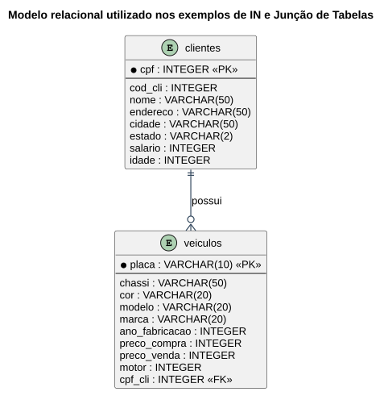

# Aula 06 — Operador IN e Consultas com Múltiplas Tabelas

> **Professor:** Guilherme de Morais
> **Disciplina:** Banco de Dados II (3º Semestre)
> **Tema:** Operador `IN`/`NOT IN` e `SELECT` combinando dados de mais de uma tabela

## Objetivo da aula

Substituir cadeias longas de `OR` pelo operador `IN`, e aprender a "juntar" dados de tabelas relacionadas em uma única consulta usando a sintaxe clássica de junção implícita (`FROM tabela1, tabela2 WHERE ...`). Ao final, o aluno deve ser capaz de filtrar por um conjunto de valores e relacionar duas tabelas por meio de chave primária/estrangeira.

## Modelo de dados utilizado nos exemplos



```sql
create table clientes (
    cod_cli integer not null,
    cpf integer not null,
    nome varchar(50),
    endereco varchar(50),
    cidade varchar(50),
    estado varchar(02),
    salario integer,
    idade integer,
    CONSTRAINT PK_CPFcliente PRIMARY KEY (cpf)
);

create table veiculos (
    chassi varchar(50) not null,
    placa varchar(10) not null,
    cor varchar(20),
    modelo varchar(20),
    marca varchar(20),
    ano_fabricacao integer,
    preco_compra integer,
    preco_venda integer,
    motor integer,
    cpf_cli integer not null,
    constraint pk_placa primary key (placa)
);

alter table veiculos add constraint fk_cpf_cli foreign key (cpf_cli) references clientes (cpf);
```

## Operador IN

Pesquisa registros cujo valor de uma coluna está contido em um conjunto de valores fornecido. Substitui uma sequência de condições unidas por `OR`.

```sql
SELECT nome_cliente, uf FROM cliente
WHERE uf IN ('SP', 'MG');

SELECT nome_cliente, uf FROM cliente
WHERE uf NOT IN ('SP', 'MG');
```

### Mais exemplos

```sql
-- Vendedores cuja faixa de comissão seja 'A' ou 'B'
SELECT nome_vendedor, faixa_comissao FROM vendedor
WHERE faixa_comissao IN ('A', 'B');

-- Produtos de unidade 'M', 'G' ou 'L' com valor unitário <= 1.05
SELECT codigo_produto, unidade, descricao, val_unit
FROM produto
WHERE unidade IN ('M', 'G', 'L')
  AND val_unit <= 1.05;
```

## SELECT com mais de uma tabela (junção implícita)

Através do `SELECT`, é possível mostrar dados de duas ou mais tabelas ao mesmo tempo, "juntando" as informações como se fossem uma única fonte. A esse processo se dá o nome de **junção (*join*)**, e as tabelas envolvidas precisam estar relacionadas entre si (tipicamente por chave primária/chave estrangeira).

### Sintaxe

```sql
SELECT Tabela1.Campo1, Tabela2.Campo2
FROM Tabela1, Tabela2
WHERE (Tabela1.CampoRelacionado1 = Tabela2.CampoRelacionado2)
```

O relacionamento entre `clientes` e `veiculos` neste exemplo é `1:N` — um cliente possui de 1 a N veículos.

### Exemplo — nome e cidade do cliente + modelo e marca do veículo

```sql
SELECT clientes.nome, clientes.cidade, veiculos.modelo, veiculos.marca
FROM clientes, veiculos
WHERE (clientes.cpf = veiculos.cpf_cli);
```

### Ordenando o resultado da junção

```sql
SELECT clientes.nome, clientes.cidade, veiculos.modelo, veiculos.marca
FROM clientes, veiculos
WHERE (clientes.cpf = veiculos.cpf_cli)
ORDER BY clientes.cidade;
```

## Operadores para combinar condições no WHERE

A cláusula `WHERE` pode conter mais de uma condição, unidas pelos operadores:

* **AND (E)** — filtra quando **todas** as condições forem verdadeiras.
* **OR (OU)** — filtra quando **ao menos uma** das condições for verdadeira.
* **NOT (NÃO)** — nega, ou seja, inverte o valor da condição.

### Junção filtrando e ordenando

```sql
-- Filtrando por estado, além do relacionamento entre as tabelas
SELECT clientes.nome, clientes.cidade, veiculos.modelo, veiculos.marca
FROM clientes, veiculos
WHERE (clientes.cpf = veiculos.cpf_cli)
  AND (clientes.estado = 'SP');

-- Filtrando e ordenando
SELECT clientes.nome, clientes.cidade, veiculos.modelo, veiculos.marca
FROM clientes, veiculos
WHERE (clientes.cpf = veiculos.cpf_cli)
  AND (clientes.estado = 'SP')
ORDER BY clientes.cidade;
```

## Exercícios de fixação

1. Selecione todos os nomes e CPFs da tabela `clientes` e marca e modelo dos `veiculos` cujo modelo seja igual a `'Toyota'`.
2. Selecione chassi, placa, modelo e marca dos veículos e nome e CPF dos clientes que residem em estado diferente de `'SP'`.
3. Selecione todos os veículos das marcas `'Toyota'` e `'VW'`, usando o comando `IN`.

<details>
<summary>Gabarito</summary>

```sql
-- 1.
SELECT clientes.nome, clientes.cpf, veiculos.marca, veiculos.modelo
FROM clientes, veiculos
WHERE clientes.cpf = veiculos.cpf_cli
  AND veiculos.modelo = 'Toyota';

-- 2.
SELECT veiculos.chassi, veiculos.placa, veiculos.modelo, veiculos.marca,
       clientes.nome, clientes.cpf
FROM clientes, veiculos
WHERE clientes.cpf = veiculos.cpf_cli
  AND clientes.estado <> 'SP';

-- 3.
SELECT * FROM veiculos
WHERE marca IN ('Toyota', 'VW');
```
</details>

## Material relacionado

- [Aula — Exercícios de SQL com Duas Tabelas (JOIN)](../exercicios%20com%20sql%20de%20duas%20tabelas/detalhes.md) — evolução da junção implícita para o domínio `clientes`/`pedidos`.
- [Aula 05 — LIKE/ILIKE e Funções Agregadas](../AULA%2005%20–%20SQL%20-%20CONSULTAS/detalhes.md)
- Slide original da aula: `aula 06.pptx`
