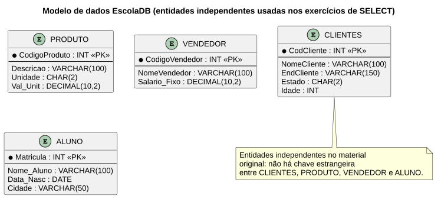

# Atividade da Banca — Revisão de SELECT, WHERE, ORDER BY e Operadores

> **Professor:** Guilherme de Morais
> **Disciplina:** Banco de Dados II (3º Semestre)
> **Tema:** Revisão prática de `SELECT`, `ORDER BY`, `WHERE`, operadores relacionais, `AND`/`OR`, `DISTINCT`, operadores aritméticos e `BETWEEN`

## Objetivo da atividade

Consolidar, em uma única bateria de 20 exercícios práticos, todos os fundamentos de consulta vistos até a Aula 04: seleção de colunas, filtragem, ordenação, eliminação de duplicidade e operações aritméticas sobre um schema simples de escola/loja (`EscolaDB`).

## Modelo de dados — EscolaDB

Este schema é reaproveitado nas Aulas 03/04 e 05 e na Aula 06 (Comando IN) como base para os exemplos de `SELECT`.



```sql
CREATE DATABASE EscolaDB;
USE EscolaDB;

CREATE TABLE CLIENTES (
    CodCliente INT PRIMARY KEY,
    NomeCliente VARCHAR(100),
    EndCliente VARCHAR(150),
    Estado CHAR(2),
    Idade INT
);

CREATE TABLE PRODUTO (
    CodigoProduto INT PRIMARY KEY,
    Descricao VARCHAR(100),
    Unidade CHAR(2),
    Val_Unit DECIMAL(10,2)
);

CREATE TABLE VENDEDOR (
    CodigoVendedor INT PRIMARY KEY,
    NomeVendedor VARCHAR(100),
    Salario_Fixo DECIMAL(10,2)
);

CREATE TABLE ALUNO (
    Matricula INT PRIMARY KEY,
    Nome_Aluno VARCHAR(100),
    Data_Nasc DATE,
    Cidade VARCHAR(50)
);

INSERT INTO CLIENTES VALUES
(1, 'Ana Silva', 'Rua A', 'SP', 25),
(2, 'Bruno Souza', 'Rua B', 'RJ', 30),
(3, 'Carlos Lima', 'Rua C', 'SP', 22),
(4, 'Daniela Rocha', 'Rua D', 'MG', 28);

INSERT INTO PRODUTO VALUES
(1, 'Caneta', 'UN', 1.50),
(2, 'Caderno', 'UN', 10.00),
(3, 'Tecido', 'M', 2.00),
(4, 'Linha', 'M', 0.50);

INSERT INTO VENDEDOR VALUES
(1, 'João', 2500),
(2, 'Maria', 3000),
(3, 'Pedro', 4500);

INSERT INTO ALUNO VALUES
(1, 'Lucas', '1990-05-10', 'Campinas'),
(2, 'Mariana', '1985-08-20', 'São Paulo'),
(3, 'Rafael', '2000-01-15', 'Campinas');
```

## Enunciado — 20 exercícios práticos

### SELECT básico
1. Liste todos os dados da tabela `CLIENTES`.
2. Liste apenas `NomeCliente` e `Estado`.

### ORDER BY
3. Liste os clientes ordenados por nome.
4. Liste clientes ordenados por estado e idade.

### WHERE
5. Liste clientes do estado `'SP'`.
6. Liste clientes com idade maior que 25.

### WHERE + ORDER BY
7. Liste clientes de `SP` ordenados pelo nome.

### Operadores relacionais
8. Liste produtos com valor maior que 2.00.
9. Liste produtos com valor menor ou igual a 2.00.

### AND
10. Liste produtos com valor entre 0.50 e 10.00 (usando `AND`, sem `BETWEEN`).
11. Liste alunos de Campinas com data de nascimento após 1990.

### OR
12. Liste vendedores com salário 2500 ou 3000.
13. Liste produtos com valor 0.50 ou 2.00.

### AND + OR
14. Liste produtos da unidade `'M'` com valor 0.50 ou 2.00.

### DISTINCT
15. Liste os estados distintos dos clientes.

### Operadores aritméticos
16. Mostre salário com aumento de 10%.
17. Mostre preço dos produtos com aumento de 25%.
18. Mostre preço dos produtos com desconto de 12% (unidade `'M'`).

### BETWEEN
19. Liste vendedores com salário entre 2000 e 4000.
20. Liste alunos nascidos entre 1985 e 2000.

<details>
<summary>Gabarito</summary>

```sql
-- 1.
SELECT * FROM CLIENTES;

-- 2.
SELECT NomeCliente, Estado FROM CLIENTES;

-- 3.
SELECT * FROM CLIENTES ORDER BY NomeCliente;

-- 4.
SELECT * FROM CLIENTES ORDER BY Estado, Idade;

-- 5.
SELECT * FROM CLIENTES WHERE Estado = 'SP';

-- 6.
SELECT * FROM CLIENTES WHERE Idade > 25;

-- 7.
SELECT * FROM CLIENTES WHERE Estado = 'SP' ORDER BY NomeCliente;

-- 8.
SELECT * FROM PRODUTO WHERE Val_Unit > 2.00;

-- 9.
SELECT * FROM PRODUTO WHERE Val_Unit <= 2.00;

-- 10.
SELECT * FROM PRODUTO WHERE Val_Unit >= 0.50 AND Val_Unit <= 10.00;

-- 11.
SELECT * FROM ALUNO WHERE Cidade = 'Campinas' AND Data_Nasc > '1990-12-31';

-- 12.
SELECT * FROM VENDEDOR WHERE Salario_Fixo = 2500 OR Salario_Fixo = 3000;

-- 13.
SELECT * FROM PRODUTO WHERE Val_Unit = 0.50 OR Val_Unit = 2.00;

-- 14.
SELECT * FROM PRODUTO
WHERE Unidade = 'M' AND (Val_Unit = 0.50 OR Val_Unit = 2.00);

-- 15.
SELECT DISTINCT Estado FROM CLIENTES;

-- 16.
SELECT NomeVendedor, Salario_Fixo * 1.10 AS NovoSalario FROM VENDEDOR;

-- 17.
SELECT Descricao, Val_Unit * 1.25 AS PrecoComAumento FROM PRODUTO;

-- 18.
SELECT Descricao, Val_Unit * 0.88 AS PrecoComDesconto
FROM PRODUTO WHERE Unidade = 'M';

-- 19.
SELECT * FROM VENDEDOR WHERE Salario_Fixo BETWEEN 2000 AND 4000;

-- 20.
SELECT * FROM ALUNO WHERE Data_Nasc BETWEEN '1985-01-01' AND '2000-12-31';
```
</details>

## Material relacionado

- [Aula 03/04 — INSERT, DELETE, UPDATE e SELECT básico](../aula%2003%20-%20insert%20delete%20e%20update%2C%20aula%2004%20consultado/detalhes.md) — mesmo schema `EscolaDB`, teoria completa por trás destes exercícios.
- Arquivo original: `CREATE DATABASE EscolaDB- exercicios - material 04.docx`
