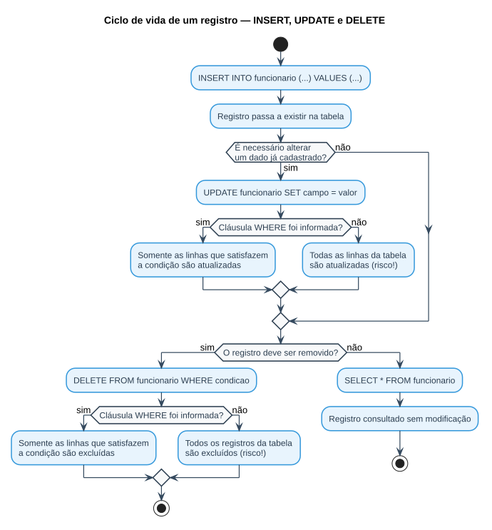

# Aula 03 e 04 — Manipulação de Dados (INSERT, UPDATE, DELETE) e Consultas com SELECT

> **Professor:** Guilherme de Morais
> **Disciplina:** Banco de Dados II (3º Semestre)
> **Tema:** Comandos DML de escrita (`INSERT`, `UPDATE`, `DELETE`) e fundamentos do `SELECT` (filtros, ordenação, operadores)

## Objetivo da aula

Dominar os três comandos de manipulação de dados (DML) que alteram o conteúdo de uma tabela — `INSERT`, `UPDATE` e `DELETE` — e, em seguida, a base do comando de consulta (`SELECT`) com suas cláusulas de filtragem (`WHERE`), ordenação (`ORDER BY`), eliminação de duplicidade (`DISTINCT`) e operadores relacionais, lógicos e aritméticos. Ao final, o aluno deve ser capaz de inserir, atualizar e remover registros com segurança, e escrever consultas de seleção com múltiplos critérios.

## Parte 1 — Aula 03: INSERT, UPDATE e DELETE

### INSERT — inserindo registros

```sql
INSERT INTO nome_tabela (lista_de_campos)
VALUES (lista_de_dados)

-- OU, sem declarar as colunas (exige valores para TODAS as colunas, na ordem da tabela):
INSERT INTO nome_tabela
VALUES (lista_de_dados)
```

* **nome_tabela** — tabela onde os dados serão inseridos.
* **lista_de_campos** — colunas que receberão os valores.
* **lista_de_dados** — valores a inserir, na mesma ordem da lista de campos, separados por vírgula.

Exemplo usado em aula, a partir da tabela:

```sql
CREATE TABLE funcionario (
    cpf INTEGER NOT NULL,
    nome CHARACTER VARYING(50),
    funcao CHARACTER VARYING(20),
    data_nasc DATE,
    CONSTRAINT pk_fun_cpf PRIMARY KEY (cpf)
);

-- Declarando as colunas explicitamente
INSERT INTO FUNCIONARIO (CPF, NOME, FUNCAO, DATA_NASC)
VALUES (2, 'SEBASTIAO', 'PROFESSOR', '03/03/2020');

-- Sem declarar as colunas (repassa valor para todas)
INSERT INTO FUNCIONARIO
VALUES (3, 'PEDRO', 'SECRETARIO', '20/08/1963');

-- Omitindo uma coluna: os campos ausentes recebem NULL
INSERT INTO FUNCIONARIO (CPF, NOME, DATA_NASC)
VALUES (4, 'RAUL', '08/03/2020');

INSERT INTO FUNCIONARIO (CPF, NOME, FUNCAO, DATA_NASC)
VALUES (5, 'MARIA', '', '03/03/2020');
```

Na segunda forma (sem declarar as colunas), a sintaxe só funciona se forem informados valores para **todas** as colunas da tabela, na ordem exata em que foram criadas.

### UPDATE — atualizando registros

```sql
UPDATE nome_tabela
SET campo = 'novo_valor'
WHERE condicao;
```

* **nome_tabela** — tabela a ser modificada.
* **campo** — coluna que terá o valor alterado.
* **novo_valor** — valor que substitui o dado atual.
* **WHERE** — se omitido, **a tabela inteira é atualizada**.
* **condição** — regra que restringe quais linhas são afetadas.

```sql
UPDATE FUNCIONARIOS
SET FUNCAO = 'DIRETOR'
WHERE CPF = 4;
```

### DELETE — removendo registros

```sql
DELETE FROM nome_tabela
WHERE condicao;
```

* **nome_tabela** — tabela a ser modificada.
* **WHERE** — cláusula que impõe uma condição sobre a exclusão; sem ela, **todos os registros são apagados**.

```sql
DELETE FROM FUNCIONARIOS
WHERE CPF = 5;
```

> **Atenção:** `UPDATE` e `DELETE` sem `WHERE` afetam a tabela inteira — sempre teste a condição antes com um `SELECT` equivalente.

## Parte 2 — Aula 04: Consultando Dados com SELECT

Consultar dados é a operação mais comum em um banco relacional. Diferente de `INSERT`/`UPDATE`/`DELETE`, o `SELECT` **não modifica** os dados armazenados.

### Sintaxe geral

```sql
SELECT [tabela1.]campo1, [tabela2.]campo2
FROM tabela1 [, tabela2] [, ...]
[WHERE ...]
[GROUP BY ...]
[ORDER BY ...]
[ETC...]
```

O símbolo `[ ]` indica que a cláusula é opcional.

Os exemplos desta seção usam o schema `EscolaDB` (ver [Atividade da banca](../atividade%20s=%20banca/detalhes.md) para o DDL completo — tabelas `CLIENTES`, `PRODUTO`, `VENDEDOR`, `ALUNO`):

```sql
CREATE TABLE CLIENTES (
    CodCliente INT PRIMARY KEY,
    NomeCliente VARCHAR(100),
    EndCliente VARCHAR(150),
    Estado CHAR(2),
    Idade INT
);
```

### SELECT básico — todos os campos ou campos específicos

```sql
-- Predicado * : todos os campos, todos os registros
SELECT * FROM Clientes;

-- Apenas os campos desejados
SELECT CodCliente, NomeCliente, EndCliente FROM Clientes;
```

### ORDER BY — ordenando resultados

```sql
-- Ordena por um campo
SELECT * FROM CLIENTES ORDER BY NomeCliente;

-- Ordena por mais de um campo (critério de desempate)
SELECT CodCliente, NomeCliente, Idade
FROM CLIENTES
ORDER BY NomeCliente, Idade;
```

### WHERE — filtrando dados

```sql
SELECT * FROM CLIENTES WHERE Estado = 'SP';

SELECT CodCliente, NomeCliente, EndCliente
FROM Clientes
WHERE Estado = 'SP';
```

Além do operador `=`, também são válidos `<>`, `>`, `<`, `>=`, `<=`.

### WHERE + ORDER BY combinados

```sql
SELECT CodCliente, NomeCliente, EnderecoCliente
FROM CLIENTES
WHERE Estado = 'SP'
ORDER BY NomeCliente;
```

### Condições compostas — AND e OR

Uma condição é a parte da consulta que restringe quais linhas aparecem no resultado. A cláusula `WHERE` pode combinar mais de uma condição:

* **AND** — todas as condições unidas por `AND` devem ser verdadeiras para a linha ser retornada.
* **OR** — basta que **uma** das condições unidas por `OR` seja verdadeira.
* **NOT** — nega (inverte) o valor lógico de uma condição.

```sql
-- AND: produtos com valor unitário entre 0.50 e 2.00
SELECT descricao FROM produto
WHERE val_unit >= 0.50 AND val_unit <= 2.00;

-- AND combinando duas tabelas de domínio diferente
SELECT nome_aluno, tel_aluno FROM alu_aluno
WHERE data_nasc_aluno >= '24/02/1981' AND cidade_aluno = 'Campinas';

-- OR: vendedores com salário 2780 ou 4600
SELECT codigo_vendedor, nome_vendedor, salario_fixo, faixa_comissao
FROM vendedor
WHERE salario_fixo = 2780 OR salario_fixo = 4600;

-- AND + OR combinados (parênteses definem a precedência)
SELECT unidade, descricao, val_unit
FROM produto
WHERE unidade = 'M'
  AND (val_unit = 0.11 OR val_unit = 1.8 OR val_unit = 2);
```

### DISTINCT — eliminando duplicidade

```sql
SELECT DISTINCT nome_cliente FROM cliente;
```

Útil quando há dados repetidos; também é possível aplicar `DISTINCT` sobre mais de um campo simultaneamente (ex.: nome e endereço).

### Operadores aritméticos

Existem quatro operadores aritméticos: `+` (adição), `-` (subtração), `*` (multiplicação) e `/` (divisão).

```sql
-- Aumento de 10% no salário
SELECT salario_fixo * 1.1 FROM vendedor;

-- Aumento de 25% no preço dos produtos
SELECT descricao, unidade, val_unit AS "Preço Atual",
       val_unit * 1.25 AS "Preço com Aumento"
FROM produto;

-- Desconto de 12% apenas para a unidade 'M'
SELECT descricao, unidade, val_unit AS "Preço Atual",
       val_unit - (val_unit * 0.12) AS "Preço com Desconto"
FROM produto
WHERE unidade = 'M';
```

### BETWEEN — filtrando por faixa de valores

```sql
-- Vendedores com salário entre 2000 e 3000
SELECT * FROM vendedor
WHERE salario_fixo BETWEEN 2000 AND 3000;

-- Produtos com valor unitário entre 0.32 e 2.00
SELECT codigo_produto, descricao, val_unit
FROM produto
WHERE val_unit BETWEEN 0.32 AND 2;

-- Alunos nascidos entre 01/02/1980 e 30/10/1990
SELECT matricula, nome_aluno, data_nasc_aluno
FROM alu_aluno
WHERE data_nasc_aluno BETWEEN '01/02/1980' AND '30/10/1990';
```

`BETWEEN valorMenor AND valorMaior` é inclusivo nas duas extremidades; se os limites forem invertidos (menor depois do maior), a consulta não retorna linhas.

## Fluxo de manipulação de dados

O diagrama abaixo resume o ciclo de vida de um registro na tabela `funcionario` ao longo dos comandos apresentados nesta aula:



## Exercícios de fixação

Considerando a tabela `funcionario (cpf, nome, funcao, data_nasc)` e o schema `EscolaDB` (`CLIENTES`, `PRODUTO`, `VENDEDOR`):

1. Insira um funcionário com `cpf = 6`, `nome = 'JULIA'`, `funcao = 'RECEPCIONISTA'` e `data_nasc = '15/07/1995'`.
2. Atualize a função do funcionário de `cpf = 2` para `'COORDENADOR'`.
3. Exclua o funcionário de `cpf = 4`.
4. Liste nome e endereço dos clientes do estado `'RJ'`, ordenados por nome.
5. Liste os produtos com valor unitário entre 1.00 e 5.00, ordenados do maior para o menor valor.
6. Liste os vendedores com salário maior que 3000 **ou** menor que 2000.
7. Liste, sem repetição, os estados distintos cadastrados em `CLIENTES`.

<details>
<summary>Gabarito</summary>

```sql
-- 1.
INSERT INTO funcionario (cpf, nome, funcao, data_nasc)
VALUES (6, 'JULIA', 'RECEPCIONISTA', '15/07/1995');

-- 2.
UPDATE funcionario SET funcao = 'COORDENADOR' WHERE cpf = 2;

-- 3.
DELETE FROM funcionario WHERE cpf = 4;

-- 4.
SELECT NomeCliente, EndCliente FROM CLIENTES
WHERE Estado = 'RJ'
ORDER BY NomeCliente;

-- 5.
SELECT * FROM PRODUTO
WHERE Val_Unit BETWEEN 1.00 AND 5.00
ORDER BY Val_Unit DESC;

-- 6.
SELECT * FROM VENDEDOR
WHERE Salario_Fixo > 3000 OR Salario_Fixo < 2000;

-- 7.
SELECT DISTINCT Estado FROM CLIENTES;
```
</details>

## Material relacionado

- [Atividade da banca — Revisão de SELECT, WHERE, ORDER BY e Operadores](../atividade%20s=%20banca/detalhes.md) — mesmo schema `EscolaDB`, exercícios completos com gabarito.
- [Aula 05 — LIKE/ILIKE e Funções Agregadas](../AULA%2005%20–%20SQL%20-%20CONSULTAS/detalhes.md)
- [Trabalho: Aula 05 — Exercícios de LIKE e Funções Agregadas](../../Trabalhos/AULA%2005%20–%20SQL%20-%20CONSULTAS/detalhes.md)
- Slides originais: `AULA 03 - INSERT, DELETE E UPDATE.pptx`, `aula 04 - CONSULTANDO DADOS 1.pptx`
