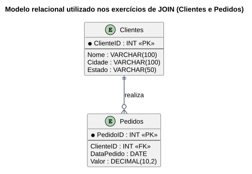

# Aula — Exercícios de SQL com Duas Tabelas (JOIN)

> **Professor:** Guilherme de Morais
> **Disciplina:** Banco de Dados II (3º Semestre)
> **Tema:** Relacionar `clientes` e `pedidos` com `JOIN`, agregações e filtros

## Objetivo da aula

Consolidar a junção de duas tabelas relacionadas por chave estrangeira, agora usando a sintaxe moderna `JOIN ... ON` (equivalente à junção implícita vista na Aula 06), combinada com filtros, agregações e a identificação de registros sem correspondência.

## Modelo de dados utilizado nos exemplos



```sql
CREATE TABLE Clientes (
    ClienteID INT PRIMARY KEY,
    Nome VARCHAR(100) NOT NULL,
    Cidade VARCHAR(100),
    Estado VARCHAR(50)
);

CREATE TABLE Pedidos (
    PedidoID INT PRIMARY KEY,
    ClienteID INT,
    DataPedido DATE,
    Valor DECIMAL(10,2),
    FOREIGN KEY (ClienteID) REFERENCES Clientes(ClienteID)
);
```

## JOIN — relacionando as duas tabelas

```sql
-- Todos os clientes e os respectivos pedidos (somente quem tem pedido)
SELECT c.Nome, p.PedidoID, p.DataPedido, p.Valor
FROM Clientes c
JOIN Pedidos p ON c.ClienteID = p.ClienteID;
```

### LEFT JOIN — incluindo clientes sem pedidos

```sql
-- Todos os clientes, mesmo os que nunca fizeram pedido
SELECT c.Nome, p.PedidoID, p.Valor
FROM Clientes c
LEFT JOIN Pedidos p ON c.ClienteID = p.ClienteID;

-- Isolando apenas os clientes sem pedido (anti-join)
SELECT c.Nome, c.Cidade
FROM Clientes c
LEFT JOIN Pedidos p ON c.ClienteID = p.ClienteID
WHERE p.PedidoID IS NULL;
```

## Agregação sobre a junção

```sql
-- Valor total de pedidos por cliente
SELECT c.Nome, SUM(p.Valor) AS ValorTotal
FROM Clientes c
JOIN Pedidos p ON c.ClienteID = p.ClienteID
GROUP BY c.ClienteID, c.Nome
ORDER BY ValorTotal DESC;

-- Quantidade de pedidos por cliente
SELECT c.Nome, COUNT(p.PedidoID) AS QtdPedidos
FROM Clientes c
JOIN Pedidos p ON c.ClienteID = p.ClienteID
GROUP BY c.ClienteID, c.Nome;
```

## Exercícios de fixação

Considerando o schema `Clientes`/`Pedidos` acima:

1. Liste todos os clientes e seus pedidos (nome do cliente, código, data e valor do pedido).
2. Mostre o valor total de pedidos por cliente.
3. Exiba os clientes que ainda não têm nenhum pedido.
4. Liste os pedidos com valor acima de R$ 1.000,00, junto com o nome do cliente.
5. Conte a quantidade de pedidos realizados por cada cliente.
6. Liste os clientes que fizeram pedidos no mês de maio de 2026.
7. Mostre o pedido de maior valor de cada cliente.
8. Liste os clientes que fizeram mais de um pedido.
9. Calcule a média de valor dos pedidos por cliente.

<details>
<summary>Gabarito</summary>

```sql
-- 1.
SELECT c.Nome, p.PedidoID, p.DataPedido, p.Valor
FROM Clientes c
JOIN Pedidos p ON c.ClienteID = p.ClienteID;

-- 2.
SELECT c.Nome, SUM(p.Valor) AS ValorTotal
FROM Clientes c
JOIN Pedidos p ON c.ClienteID = p.ClienteID
GROUP BY c.ClienteID, c.Nome;

-- 3.
SELECT c.Nome, c.Cidade
FROM Clientes c
LEFT JOIN Pedidos p ON c.ClienteID = p.ClienteID
WHERE p.PedidoID IS NULL;

-- 4.
SELECT c.Nome, p.PedidoID, p.Valor
FROM Clientes c
JOIN Pedidos p ON c.ClienteID = p.ClienteID
WHERE p.Valor > 1000;

-- 5.
SELECT c.Nome, COUNT(p.PedidoID) AS QtdPedidos
FROM Clientes c
JOIN Pedidos p ON c.ClienteID = p.ClienteID
GROUP BY c.ClienteID, c.Nome;

-- 6.
SELECT DISTINCT c.Nome
FROM Clientes c
JOIN Pedidos p ON c.ClienteID = p.ClienteID
WHERE p.DataPedido BETWEEN '2026-05-01' AND '2026-05-31';

-- 7.
SELECT c.Nome, MAX(p.Valor) AS MaiorPedido
FROM Clientes c
JOIN Pedidos p ON c.ClienteID = p.ClienteID
GROUP BY c.ClienteID, c.Nome;

-- 8.
SELECT c.Nome, COUNT(p.PedidoID) AS QtdPedidos
FROM Clientes c
JOIN Pedidos p ON c.ClienteID = p.ClienteID
GROUP BY c.ClienteID, c.Nome
HAVING COUNT(p.PedidoID) > 1;

-- 9.
SELECT c.Nome, AVG(p.Valor) AS MediaPedidos
FROM Clientes c
JOIN Pedidos p ON c.ClienteID = p.ClienteID
GROUP BY c.ClienteID, c.Nome;
```
</details>

## Material relacionado

- [Trabalho: Exercícios com SQL de Duas Tabelas — gabarito completo](../../Trabalhos/exercicios%20com%20sql%20de%20duas%20tabelas/detalhes.md)
- [Aula 06 — Operador IN e Consultas com Múltiplas Tabelas](../COMANDO%20IN%20E%20SQL%20MAIS%20COMPLEXAS/detalhes.md) — sintaxe de junção implícita (`FROM t1, t2 WHERE`).
- Enunciado original: `exercicios com sql de duas tabelas.docx`
