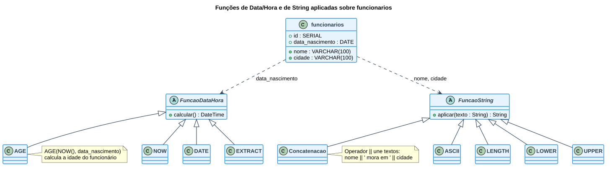

# Aula — Funções de Data, Hora e Concatenação de Strings

> **Professor:** Guilherme de Morais
> **Disciplina:** Banco de Dados II (3º Semestre)
> **Tema:** Funções de data/hora (`NOW`, `DATE`, `AGE`, `EXTRACT`) e de string (`ASCII`, concatenação `||`, `LENGTH`, `LOWER`, `UPPER`)

## Objetivo da aula

Manipular datas e horários e formatar textos com funções nativas do SQL/PostgreSQL, combinando-as em relatórios legíveis (ex.: frases formatadas a partir de várias colunas).

## Tabela de apoio

```sql
CREATE TABLE funcionarios (
    id SERIAL PRIMARY KEY,
    nome VARCHAR(100),
    data_nascimento DATE,
    cidade VARCHAR(100)
);

INSERT INTO funcionarios (nome, data_nascimento, cidade) VALUES
('Carlos Silva', '1990-05-10', 'São Paulo'),
('Ana Souza', '1985-08-22', 'Rio de Janeiro'),
('João Lima', '2000-01-15', 'Belo Horizonte');
```

## 1. Funções de Data e Hora

### NOW() — data e hora atual

```sql
SELECT NOW() AS data_atual;
```

### DATE() — extrai apenas a data (sem a hora)

```sql
SELECT DATE(NOW()) AS somente_data;
```

### AGE() — diferença entre duas datas

```sql
SELECT AGE('2025-01-01', '2000-01-01');

-- Uso prático: idade a partir da data de nascimento
SELECT nome, AGE(NOW(), data_nascimento) AS idade FROM funcionarios;
```

### EXTRACT() — extrai uma parte específica da data

```sql
SELECT EXTRACT(YEAR FROM NOW());
SELECT EXTRACT(MONTH FROM NOW()) AS mes;
SELECT EXTRACT(DAY FROM NOW()) AS dia;
SELECT EXTRACT(HOUR FROM NOW()) AS hora;
```

## 2. Funções de String

### ASCII() — código ASCII do primeiro caractere

```sql
SELECT ASCII('A'); -- 65
```

### Concatenação com `||`

```sql
SELECT 'Olá' || ' Mundo';

SELECT nome || ' - ' || cidade FROM funcionarios;
```

### LENGTH() — número de caracteres

```sql
SELECT LENGTH('Banco de Dados');
```

### LOWER() e UPPER() — caixa do texto

```sql
SELECT LOWER('SQL É LEGAL');
SELECT UPPER('sql é legal');
```

## Combinando data/hora e string

O ganho real dessas funções aparece ao combiná-las em uma única consulta, formatando um relatório legível:

```sql
-- Nome em minúsculo
SELECT LOWER(nome) FROM funcionarios;

-- Nome concatenado com a cidade
SELECT nome || ' mora em ' || cidade FROM funcionarios;

-- Ano de nascimento extraído da data
SELECT EXTRACT(YEAR FROM data_nascimento) FROM funcionarios;

-- Idade calculada
SELECT nome, AGE(NOW(), data_nascimento) FROM funcionarios;

-- Tamanho do nome
SELECT nome, LENGTH(nome) FROM funcionarios;

-- Funcionários com mais de 30 anos
SELECT nome FROM funcionarios
WHERE AGE(NOW(), data_nascimento) > INTERVAL '30 years';

-- Nome em maiúsculo + ano de nascimento
SELECT UPPER(nome), EXTRACT(YEAR FROM data_nascimento) FROM funcionarios;

-- Frase composta: "Nome - Idade - Cidade"
SELECT nome || ' - ' || AGE(NOW(), data_nascimento) || ' - ' || cidade
FROM funcionarios;

-- Apenas funcionários nascidos em janeiro
SELECT nome FROM funcionarios
WHERE EXTRACT(MONTH FROM data_nascimento) = 1;

-- Primeiro caractere do nome e seu código ASCII
SELECT nome, ASCII(SUBSTRING(nome FROM 1 FOR 1)) FROM funcionarios;
```

## Diagrama — Funções de Data/Hora e de String



## Exercícios de fixação

**Nível básico**

1. Exiba a data e hora atual.
2. Mostre apenas a data atual (sem hora).
3. Converta a frase `"banco de dados"` para maiúsculo.
4. Mostre o tamanho da palavra `"Universidade"`.
5. Retorne o código ASCII da letra `'Z'`.

**Nível intermediário / avançado — atividade desafio**

6. Monte uma consulta sobre `funcionarios` que retorne, em uma única linha por funcionário: nome em maiúsculo, idade, cidade em minúsculo e ano de nascimento — no formato aproximado `CARLOS SILVA | 34 years | são paulo | 1990`.

<details>
<summary>Gabarito</summary>

```sql
-- 1.
SELECT NOW();

-- 2.
SELECT DATE(NOW());

-- 3.
SELECT UPPER('banco de dados');

-- 4.
SELECT LENGTH('Universidade');

-- 5.
SELECT ASCII('Z');

-- 6.
SELECT UPPER(nome) || ' | ' || AGE(NOW(), data_nascimento) || ' | '
       || LOWER(cidade) || ' | ' || EXTRACT(YEAR FROM data_nascimento) AS resumo
FROM funcionarios;
```
</details>

## Material relacionado

- [Aula 05 — LIKE/ILIKE e Funções Agregadas](../AULA%2005%20–%20SQL%20-%20CONSULTAS/detalhes.md)
- Enunciado original: `hora data concatenação.docx`
