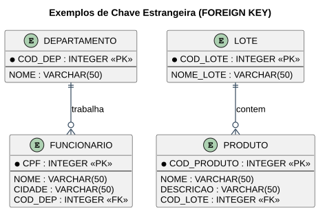

# Material para Prova — Chave Estrangeira e Modificações de Tabela

> **Professor:** Guilherme de Morais
> **Disciplina:** Banco de Dados II (3º Semestre)
> **Tema:** `FOREIGN KEY`, `ALTER TABLE` (adicionar/remover/renomear colunas e tabelas, restrições) e revisão geral

## Objetivo do material

Esta pasta reúne os slides de revisão usados como material de apoio para a prova. Boa parte deles **recapitula conteúdo já coberto em outras aulas** (funções agregadas, operador `IN`, `SELECT` com múltiplas tabelas — ver seção "Conteúdo duplicado" abaixo). O conteúdo **inédito** está em dois temas: **Chave Estrangeira** e **Modificações de Tabela** (`ALTER TABLE`), documentados a seguir.

## Chave Estrangeira (Foreign Key)

Uma chave estrangeira é um campo (ou conjunto de campos) em uma tabela que identifica uma linha em **outra** tabela, criando um relacionamento entre as duas. Ou seja, é uma coluna que faz referência à chave primária de outra tabela.

### Exemplo 1 — Funcionário e Departamento (1:N)



```sql
CREATE TABLE DEPARTAMENTO (
    COD_DEP INTEGER NOT NULL,
    NOME VARCHAR(50),
    CONSTRAINT PK_COD_DEP PRIMARY KEY (COD_DEP)
);

CREATE TABLE FUNCIONARIO (
    CPF INTEGER NOT NULL,
    NOME VARCHAR(50),
    CIDADE VARCHAR(50),
    COD_DEP INTEGER,
    CONSTRAINT PK_CPF PRIMARY KEY (CPF),
    CONSTRAINT FK_COD_DEP FOREIGN KEY (COD_DEP) REFERENCES DEPARTAMENTO (COD_DEP)
);
```

Um `DEPARTAMENTO` possui de 1 a N `FUNCIONARIO`s (relacionamento `TRABALHA`, `1..1` para `1..N`).

### Adicionando uma FK a uma tabela já existente

```sql
ALTER TABLE tabela_filha
ADD CONSTRAINT nome_constraint
FOREIGN KEY (coluna) REFERENCES tabela_pai (coluna);
```

### Exemplo 2 — Produto e Lote (1:N opcional)

```sql
CREATE TABLE PRODUTO (
    COD_PRODUTO INTEGER NOT NULL,
    NOME VARCHAR(50),
    DESCRICAO VARCHAR(50),
    COD_LOTE INTEGER,
    CONSTRAINT PK_COD_PRODUTO PRIMARY KEY (COD_PRODUTO)
);

CREATE TABLE LOTE (
    COD_LOTE INTEGER NOT NULL,
    NOME_LOTE VARCHAR(50),
    CONSTRAINT PK_COD_LOTE PRIMARY KEY (COD_LOTE)
);

ALTER TABLE PRODUTO
ADD CONSTRAINT FK_COD_LOTE1
FOREIGN KEY (COD_LOTE) REFERENCES LOTE (COD_LOTE);
```

Aqui um `LOTE` pode conter de 0 a N `PRODUTO`s (relacionamento `CONTEM`, `1..1` para `0..N`).

## Modificações de Tabela (ALTER TABLE)

### Adicionar coluna

```sql
ALTER TABLE produtos ADD COLUMN descricao TEXT;
```

### Remover coluna

```sql
ALTER TABLE produtos DROP COLUMN descricao;
```

### Renomear coluna

```sql
ALTER TABLE produtos RENAME COLUMN cod_prod TO cod_produto;
```

### Renomear tabela

```sql
ALTER TABLE produtos RENAME TO equipamentos;
```

### Adicionar chave primária a uma tabela existente

```sql
ALTER TABLE CLIENTES ADD CONSTRAINT PK_CLIENTES PRIMARY KEY (COD);
```

### Adicionar chave estrangeira a uma tabela existente

```sql
ALTER TABLE PEDIDOS
ADD CONSTRAINT FK_COD_CLI
FOREIGN KEY (COD_CLI) REFERENCES CLIENTES(COD);
```

### Excluir uma coluna ou uma constraint

```sql
ALTER TABLE nome_tabela DROP COLUMN nome_coluna;

ALTER TABLE nome_tabela DROP CONSTRAINT nome_constraint;
```

## Conteúdo duplicado (já coberto em outras aulas)

O material desta pasta inclui, além do já documentado acima, cópias de slides já cobertos em outras aulas:

- `aula 04 - CONSULTANDO DADOS 1.pptx` — mesmo conteúdo de [Aula 03/04](../aula%2003%20-%20insert%20delete%20e%20update%2C%20aula%2004%20consultado/detalhes.md).
- `aula 06.pptx` (operador `IN`) — mesmo conteúdo de [Aula 06 — Comando IN](../COMANDO%20IN%20E%20SQL%20MAIS%20COMPLEXAS/detalhes.md).
- `AULA 05 – SQL - CONSULTAS.pdf` — versão em PDF do mesmo material de [Aula 05](../AULA%2005%20–%20SQL%20-%20CONSULTAS/detalhes.md).
- `Aula de banco 08-05.pptx` — reforça `MAX`/`MIN`/`AVG`/`SUM`/`COUNT`, já detalhadas na [Aula 05](../AULA%2005%20–%20SQL%20-%20CONSULTAS/detalhes.md), com o exemplo adicional:

```sql
-- Maior preço entre todos os produtos cadastrados
SELECT MAX(preco) AS MAIOR_PRECO FROM produto;
```

## Exercícios de fixação

1. Crie a tabela `DEPARTAMENTO` e a tabela `FUNCIONARIO` com uma chave estrangeira `COD_DEP` referenciando `DEPARTAMENTO`.
2. Adicione, via `ALTER TABLE`, uma chave estrangeira `FK_COD_LOTE1` relacionando `PRODUTO.COD_LOTE` a `LOTE.COD_LOTE` (assumindo que ambas as tabelas já existem sem a FK).
3. Adicione a coluna `email VARCHAR(100)` à tabela `FUNCIONARIO`.
4. Renomeie a coluna `NOME` de `FUNCIONARIO` para `NOME_COMPLETO`.
5. Remova a constraint de chave estrangeira `FK_COD_DEP` da tabela `FUNCIONARIO`.

<details>
<summary>Gabarito</summary>

```sql
-- 1.
CREATE TABLE DEPARTAMENTO (
    COD_DEP INTEGER NOT NULL,
    NOME VARCHAR(50),
    CONSTRAINT PK_COD_DEP PRIMARY KEY (COD_DEP)
);

CREATE TABLE FUNCIONARIO (
    CPF INTEGER NOT NULL,
    NOME VARCHAR(50),
    CIDADE VARCHAR(50),
    COD_DEP INTEGER,
    CONSTRAINT PK_CPF PRIMARY KEY (CPF),
    CONSTRAINT FK_COD_DEP FOREIGN KEY (COD_DEP) REFERENCES DEPARTAMENTO (COD_DEP)
);

-- 2.
ALTER TABLE PRODUTO
ADD CONSTRAINT FK_COD_LOTE1
FOREIGN KEY (COD_LOTE) REFERENCES LOTE (COD_LOTE);

-- 3.
ALTER TABLE FUNCIONARIO ADD COLUMN email VARCHAR(100);

-- 4.
ALTER TABLE FUNCIONARIO RENAME COLUMN NOME TO NOME_COMPLETO;

-- 5.
ALTER TABLE FUNCIONARIO DROP CONSTRAINT FK_COD_DEP;
```
</details>

## Material relacionado

- [Aula 03/04 — INSERT, DELETE, UPDATE e SELECT básico](../aula%2003%20-%20insert%20delete%20e%20update%2C%20aula%2004%20consultado/detalhes.md)
- [Aula 05 — LIKE/ILIKE e Funções Agregadas](../AULA%2005%20–%20SQL%20-%20CONSULTAS/detalhes.md)
- [Aula 06 — Operador IN e Consultas com Múltiplas Tabelas](../COMANDO%20IN%20E%20SQL%20MAIS%20COMPLEXAS/detalhes.md)
- Slides originais: `AULA 2 CHAVE ESTRANGEIRA.pptx`, `MODIFICAÇÕES TABELAS.pptx`, `Aula de banco 08-05.pptx`, `AULA 05 – SQL - CONSULTAS.pdf`, `aula 04 - CONSULTANDO DADOS 1.pptx`, `aula 06.pptx`
