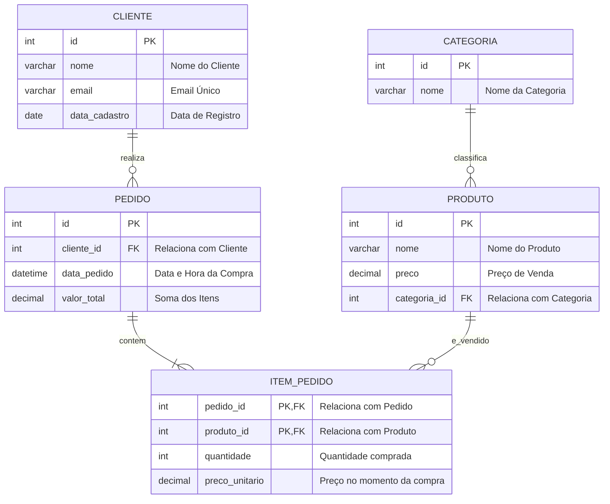

# 🎓 [Prof. Guilherme de Morais] Banco de Dados II

> **Semestre:** 3º Semestre  
> **Curso:** Bacharelado em Sistemas de Informação (UniFEF)  
> **Docente:** Prof. Guilherme de Morais  

---

## 🎯 Objetivos de Aprendizagem e Ementa

A disciplina de **Banco de Dados II** tem como propósito aprofundar os conhecimentos teóricos e práticos na manipulação, consulta e administração de Bancos de Dados Relacionais. O foco principal é capacitar o estudante a construir consultas complexas, otimizar a performance de busca e dominar a manipulação de dados (DML) e estruturação de esquemas relacionais.

### 🧠 Competências Adquiridas:
*   **Manipulação Avançada de Dados (DML):** Domínio absoluto sobre transações de escrita (`INSERT`, `UPDATE`, `DELETE`).
*   **Consultas Complexas (DQL):** Construção de filtros avançados utilizando operadores lógicos, relacionais e o operador de conjunto `IN`.
*   **Junções e Relacionamentos:** Junção de múltiplas tabelas (`INNER JOIN`, `LEFT JOIN`, `RIGHT JOIN`) para consolidação de relatórios.
*   **Funções Embutidas:** Manipulação de strings (concatenação), tratamento de datas e horas, e funções de agregação.
*   **Modelagem e Implementação:** Criação física de bancos de dados a partir de requisitos de negócios reais.

---

## 🏗️ Arquitetura e Modelagem do Conhecimento

Para ilustrar os conceitos de relacionamentos de tabelas, chaves primárias/estrangeiras e consultas multi-tabelas abordados na disciplina, abaixo está o Diagrama Entidade-Relacionamento (DER) padrão utilizado como base para os exercícios práticos:



---

## 📂 Estrutura das Pastas e Organização

O repositório está estruturado de forma a facilitar a navegação entre a teoria ministrada em sala de aula e a prática exigida nos trabalhos avaliativos:

```bash
.
├── 📂 Aulas/                  # Slides, notas de aula e códigos de exemplo do professor
│   ├── 📄 Aula_03_04_DML_DQL.md
│   ├── 📄 Aula_05_SQL_Consultas.md
│   ├── 📄 Aula_Complexas_IN.md
│   ├── 📄 Aula_Duas_Tabelas.md
│   └── 📄 Aula_Hora_Data_Concat.md
├── 📂 Trabalhos/              # Atividades práticas avaliativas resolvidas
│   ├── 📂 Trabalho_Material_03/
│   ├── 📂 Trabalho_Material_04/
│   ├── 📂 Trabalho_Aula_05/
│   ├── 📂 Trabalho_Duas_Tabelas/
│   └── 📂 Elaborar_Banco_Dados/
├── 📂 Provas/                 # Roteiros de estudo e simulados para as avaliações
│   └── 📄 Material_Para_Prova.md
└── 📂 Resumos-IA/             # Materiais de apoio gerados por Inteligência Artificial
    ├── 📄 Resumos_Executivos.md
    ├── 📄 Simulados_Comentados.md
    ├── 📄 Flashcards_Anki.tsv
    ├── 📄 CheatSheet_SQL.md
    └── 📊 Apresentacoes_Revisao.pptx
```

---

## 🚀 Como Estudar com Este Material

1.  **Siga a Trilha de Aprendizado:** Comece pelas pastas de `Aulas/` na ordem cronológica (Aula 03 -> Aula 04 -> Aula 05 -> Funções de Data/Hora).
2.  **Pratique os Códigos:** Abra os scripts SQL contidos nas pastas de aulas e execute-os em seu SGBD local (MySQL/PostgreSQL).
3.  **Consulte a CheatSheet:** Utilize o arquivo `Resumos-IA/CheatSheet_SQL.md` como guia rápido de consulta rápida durante a resolução de exercícios.
4.  **Estude com Flashcards:** Importe o arquivo `Flashcards_Anki.tsv` no software [Anki](https://apps.ankiweb.net/) para fixar a sintaxe SQL por meio de repetição espaçada.

---

## 📘 Conteúdo Acadêmico Detalhado

### 📖 Aula 03 & 04: Manipulação de Dados (DML) e Consultas Iniciais (DQL)
*   **Foco:** Inserção, atualização, exclusão e consultas básicas.
*   **Sintaxe Essencial:**
    ```sql
    -- INSERT: Adicionar novos registros
    INSERT INTO cliente (nome, email, data_cadastro) 
    VALUES ('Guilherme Morais', 'guilherme@unifef.edu.br', CURRENT_DATE);

    -- UPDATE: Modificar registros existentes (Sempre use WHERE!)
    UPDATE cliente 
    SET email = 'guilherme.morais@unifef.edu.br' 
    WHERE id = 1;

    -- DELETE: Remover registros (Sempre use WHERE!)
    DELETE FROM cliente 
    WHERE id = 1;
    ```

### 📖 Aula 05: SQL - Consultas Avançadas e Filtros
*   **Foco:** Filtragem refinada de dados utilizando operadores lógicos (`AND`, `OR`, `NOT`), comparadores (`LIKE`, `BETWEEN`) e ordenação (`ORDER BY`).
*   **Exemplo Prático:**
    ```sql
    SELECT nome, preco 
    FROM produto 
    WHERE preco BETWEEN 50.00 AND 150.00 
    ORDER BY preco DESC;
    ```

### 📖 Comando `IN` e Consultas Complexas
*   **Foco:** Substituição de múltiplos `OR` pelo operador `IN` e introdução a subconsultas (Subqueries).
*   **Exemplo Prático:**
    ```sql
    -- Selecionar produtos que pertencem às categorias 1, 3 ou 5
    SELECT * FROM produto 
    WHERE categoria_id IN (1, 3, 5);

    -- Subquery: Clientes que realizaram pedidos com valor superior a 500
    SELECT nome FROM cliente 
    WHERE id IN (SELECT cliente_id FROM pedido WHERE valor_total > 500);
    ```

### 📖 Consultas com Duas ou Mais Tabelas (JOINs)
*   **Foco:** Relacionar dados espalhados em múltiplas tabelas utilizando chaves primárias e estrangeiras.
*   **Exemplo Prático:**
    ```sql
    SELECT c.nome AS Cliente, p.data_pedido, p.valor_total
    FROM cliente c
    INNER JOIN pedido p ON c.id = p.cliente_id
    WHERE p.valor_total > 100.00;
    ```

### 📖 Funções de Data, Hora e Concatenação
*   **Foco:** Formatação de strings e manipulação de campos temporais.
*   **Exemplo Prático:**
    ```sql
    -- Concatenação de Strings e Formatação de Data
    SELECT 
        CONCAT('O cliente ', nome, ' cadastrou-se em