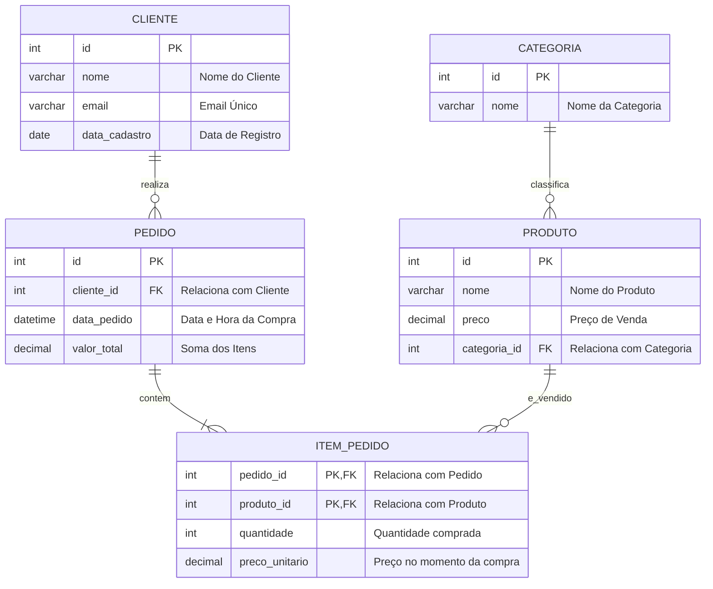
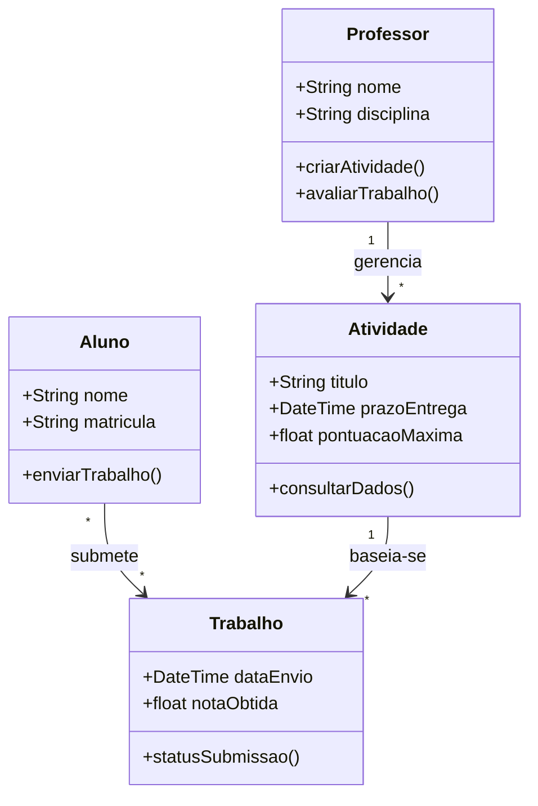
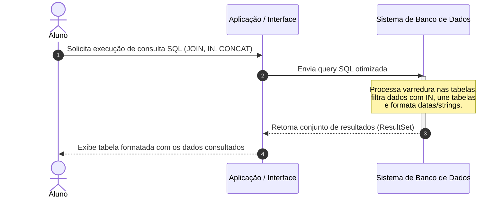
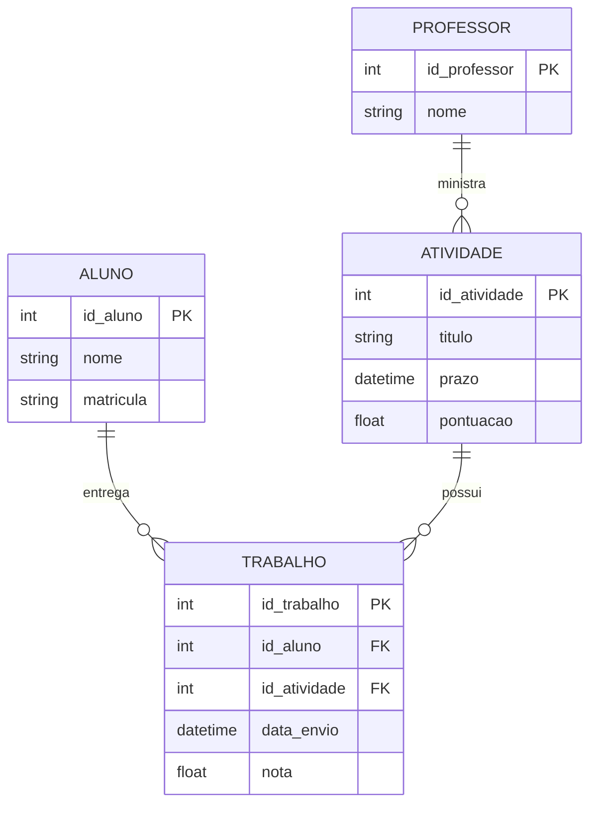

# [Prof. Guilherme de Morais] Banco de Dados II

> **Semestre:** 3º Semestre
> **Curso:** Bacharelado em Sistemas de Informação (UniFEF)
> **Docente:** Prof. Guilherme de Morais
> **Escopo:** DML (`INSERT`/`UPDATE`/`DELETE`), consultas com `SELECT` (filtros, ordenação, `LIKE`, `IN`, `BETWEEN`), funções agregadas e de data/string, junção de tabelas e modelagem relacional (DER)

---

## Sumário

1. [Objetivos de Aprendizagem e Ementa](#objetivos-de-aprendizagem-e-ementa)
2. [Aulas](#aulas)
3. [Como Estudar com Este Material](#como-estudar-com-este-material)
4. [Estrutura do Repositório](#estrutura-do-repositório)
5. [Arquitetura e Modelagem do Conhecimento](#arquitetura-e-modelagem-do-conhecimento)
6. [Resumo Executivo](#resumo-executivo)
7. [Exercícios Práticos e Código](#exercícios-práticos-e-código)
8. [Simulado Comentado](#simulado-comentado)
9. [CheatSheet de Revisão Rápida](#cheatsheet-de-revisão-rápida)
10. [Diagramas e Modelagem](#diagramas-e-modelagem)
11. [Material Complementar](#material-complementar)

---

## Objetivos de Aprendizagem e Ementa

A disciplina de **Banco de Dados II**, ministrada pelo **Prof. Guilherme de Morais**, aprofunda os conhecimentos teóricos e práticos na manipulação, consulta e administração de bancos de dados relacionais em SQL/PostgreSQL. O foco é capacitar o estudante a construir consultas complexas, otimizar a busca de dados e dominar a manipulação (DML) e a estruturação (DDL) de esquemas relacionais.

### Competências adquiridas

* **Manipulação de Dados (DML):** domínio sobre `INSERT`, `UPDATE` e `DELETE`.
* **Consultas (DQL):** filtros com `WHERE`, `LIKE`/`ILIKE`, `IN`, `BETWEEN`, operadores lógicos e aritméticos, ordenação (`ORDER BY`) e eliminação de duplicidade (`DISTINCT`).
* **Funções agregadas e de manipulação:** `AVG`/`COUNT`/`MAX`/`MIN`/`SUM`, funções de data/hora (`NOW`, `AGE`, `EXTRACT`) e de string (`||`, `LENGTH`, `UPPER`/`LOWER`, `ASCII`).
* **Junções e relacionamentos:** combinação de múltiplas tabelas por chave primária/estrangeira, tanto na sintaxe implícita (`FROM t1, t2 WHERE`) quanto em `JOIN`/`LEFT JOIN`.
* **Modelagem e implementação:** elaboração de DER e criação física de bancos de dados a partir de requisitos de negócio reais.

---

## Aulas

| Aula | Tema | Material |
| :--- | :--- | :--- |
| 03 e 04 | INSERT, UPDATE, DELETE e SELECT (WHERE, ORDER BY, AND/OR, DISTINCT, aritméticos, BETWEEN) | [Conteúdo completo](Aulas/aula%2003%20-%20insert%20delete%20e%20update%2C%20aula%2004%20consultado/detalhes.md) · [Diagrama de atividades](Aulas/aula%2003%20-%20insert%20delete%20e%20update%2C%20aula%2004%20consultado/diagramas/fluxo-manipulacao-dados-atividades.svg) |
| 05 | SQL - Consultas: `LIKE`/`ILIKE` e Funções Agregadas | [Conteúdo completo](Aulas/AULA%2005%20–%20SQL%20-%20CONSULTAS/detalhes.md) · [Diagrama de classes](Aulas/AULA%2005%20–%20SQL%20-%20CONSULTAS/diagramas/like-funcoes-agregadas-classes.svg) |
| 06 | Comando IN e SQL com Múltiplas Tabelas | [Conteúdo completo](Aulas/COMANDO%20IN%20E%20SQL%20MAIS%20COMPLEXAS/detalhes.md) · [Modelo ER (clientes/veículos)](Aulas/COMANDO%20IN%20E%20SQL%20MAIS%20COMPLEXAS/diagramas/modelo-relacional-clientes-veiculos.svg) |
| — | Exercícios de SQL com Duas Tabelas (JOIN) | [Conteúdo completo](Aulas/exercicios%20com%20sql%20de%20duas%20tabelas/detalhes.md) · [Modelo ER (clientes/pedidos)](Aulas/exercicios%20com%20sql%20de%20duas%20tabelas/diagramas/modelo-relacional-clientes-pedidos.svg) |
| — | Funções de Data, Hora e Concatenação | [Conteúdo completo](Aulas/hora%20data%20concatenação/detalhes.md) · [Diagrama de classes](Aulas/hora%20data%20concatenação/diagramas/funcoes-data-string-classes.svg) |
| — | Atividade da Banca (revisão de SELECT/WHERE/ORDER BY/Operadores) | [Conteúdo completo](Aulas/atividade%20s=%20banca/detalhes.md) · [Modelo de dados EscolaDB](Aulas/atividade%20s=%20banca/diagramas/modelo-escoladb.svg) |
| — | Material para Prova: Chave Estrangeira e Modificações de Tabela | [Conteúdo completo](Aulas/material%20para%20prova/detalhes.md) · [Modelo ER (FK)](Aulas/material%20para%20prova/diagramas/chave-estrangeira-relacionamentos.svg) |

| Avaliação | Tema | Material |
| :--- | :--- | :--- |
| Trabalho | Aula 05 — LIKE/ILIKE e Funções Agregadas (20 questões) | [Enunciado e gabarito](Trabalhos/AULA%2005%20–%20SQL%20-%20CONSULTAS/detalhes.md) |
| Trabalho | Atividade material 04 — SELECT, WHERE, ORDER BY, Operadores (35 questões) | [Enunciado e gabarito](Trabalhos/Atividade%20material%2004/detalhes.md) |
| Trabalho | Elaborar um Banco de Dados — modelagem DER (5 domínios) | [Enunciado e resolução](Trabalhos/ELABORAR%20UM%20BANCO%20DE%20DADOS/detalhes.md) · [Diagrama ER (Sistema Empresa)](Trabalhos/ELABORAR%20UM%20BANCO%20DE%20DADOS/diagramas/der-sistema-empresa.svg) |
| Trabalho | Exercícios com SQL de Duas Tabelas — JOIN (18 questões) | [Enunciado e gabarito](Trabalhos/exercicios%20com%20sql%20de%20duas%20tabelas/detalhes.md) |
| Trabalho | Trabalho Banco Material 03 — INSERT/UPDATE/DELETE (20 questões) | [Enunciado e gabarito](Trabalhos/trabalho%20banco%20material%2003/detalhes.md) |
| Prova | — | *Ainda sem materiais de prova aplicados na pasta `Provas/`.* |

---

## Como Estudar com Este Material

1. **Siga a trilha de aprendizado:** comece por `Aulas/` na ordem cronológica (03/04 → 05 → Comando IN → Duas Tabelas → Hora/Data/Concatenação → Atividade da Banca → Material para Prova).
2. **Pratique os códigos:** abra os scripts SQL das pastas de aulas e trabalhos e execute-os em um SGBD local (PostgreSQL recomendado).
3. **Resolva antes de olhar o gabarito:** cada `detalhes.md` de aula e trabalho traz exercícios de fixação com gabarito em um bloco recolhível (`<details>`) — tente resolver primeiro.
4. **Revise com este README:** as seções abaixo reúnem resumo executivo, exercícios comentados, simulado com gabarito, cheat sheet e diagramas de modelagem — tudo em um único documento.
5. **Estude com flashcards:** importe [`Resumos-IA/flashcards-anki.tsv`](./Resumos-IA/flashcards-anki.tsv) no [Anki](https://apps.ankiweb.net/) para fixar a sintaxe SQL por repetição espaçada.

---

## Estrutura do Repositório

```bash
.
├── Aulas/                                              # Teoria + exemplos + exercícios com gabarito
│   ├── aula 03 - insert delete e update, aula 04 consultado/
│   │   ├── detalhes.md
│   │   └── diagramas/                                  # PlantUML (.puml) + SVG renderizado
│   ├── AULA 05 – SQL - CONSULTAS/
│   ├── COMANDO IN E SQL MAIS COMPLEXAS/
│   ├── exercicios com sql de duas tabelas/
│   ├── hora data concatenação/
│   ├── atividade s= banca/
│   └── material para prova/
├── Trabalhos/                                          # Atividades avaliativas: enunciado real + gabarito
│   ├── trabalho banco material 03/
│   ├── Atividade material 04/
│   ├── AULA 05 – SQL - CONSULTAS/
│   ├── exercicios com sql de duas tabelas/
│   └── ELABORAR UM BANCO DE DADOS/
├── Provas/                                             # (ainda sem materiais de prova aplicados)
└── Resumos-IA/                                         # Material de apoio gerado por IA
    ├── Slides-Revisao-[Prof. Guilherme de Morais] Banco de Dados II.pptx
    ├── flashcards-anki.tsv                              # Baralho para importar no Anki
    └── dataset-estudo-qa.jsonl                          # Dataset de perguntas e respostas
```

Cada subpasta de `Aulas/` e `Trabalhos/` contém um `detalhes.md` com o conteúdo completo (teoria, exemplos e exercícios com gabarito para Aulas; enunciado real e gabarito para Trabalhos) e os arquivos originais entregues (`.pptx`, `.docx`, `.sql`). Diagramas ficam em uma subpasta local `diagramas/`, com o `.puml` fonte ao lado do `.svg` renderizado.

---

## Arquitetura e Modelagem do Conhecimento

Diagrama Entidade-Relacionamento (DER) padrão utilizado como base para os exercícios práticos de junção e agregação:



---

## Resumo Executivo

### 1. Visão geral e objetivos da matéria

A disciplina de **Banco de Dados II** aprofunda o conhecimento em Sistemas de Gerenciamento de Bancos de Dados Relacionais (SGBDRs), com foco intenso na manipulação, consulta e tratamento de dados através da linguagem **SQL**. O objetivo central é capacitar o estudante a extrair inteligência de negócios a partir de bases de dados relacionais estruturadas — desde filtragens e ordenações simples até junções complexas, funções agregadas e manipulação avançada de tipos de dados (datas, horas e strings).

### 2. Conceitos-chave e terminologia fundamental

* **SGBD:** software responsável por gerenciar o banco, garantindo integridade, segurança e eficiência (ex.: PostgreSQL, MySQL).
* **Chave Primária (`PRIMARY KEY`):** identificador único de cada registro, garantindo a unicidade e a integridade entitária.
* **Chave Estrangeira (`FOREIGN KEY`):** campo que referencia a chave primária de outra tabela, estabelecendo o relacionamento (integridade referencial).
* **Predicado `SELECT`:** comando fundamental de recuperação de dados, sem modificar os dados originais.
* **Case Sensitivity:** sensibilidade a maiúsculas/minúsculas — crucial na diferença entre `LIKE` e `ILIKE`.

### 3. Principais módulos abordados

**Módulo 1 — Fundamentos de Consultas e Filtragem (`SELECT`, `WHERE`, `ORDER BY`, `DISTINCT`)** — projeção e seleção de colunas, filtragem por operadores relacionais, operadores lógicos (`AND`/`OR`), ordenação ascendente/descendente e eliminação de duplicidade.

**Módulo 2 — Manipulação de Dados (DML)** — `INSERT` (com e sem declaração explícita de colunas), `UPDATE` e `DELETE`, sempre atentando para o risco de omitir o `WHERE`.

**Módulo 3 — Padrões de Texto (`LIKE`/`ILIKE`)** — busca por padrões usando os curingas `%` (zero ou mais caracteres) e `_` (exatamente um caractere); `LIKE` é *case-sensitive*, `ILIKE` ignora a caixa.

**Módulo 4 — Funções Agregadas e Agrupamento (`GROUP BY`)** — `AVG`, `COUNT`, `MAX`, `MIN`, `SUM`. Regra de ouro: colunas projetadas fora de uma função agregada devem constar no `GROUP BY`; o `WHERE` filtra antes da agregação, o `HAVING` depois.

**Módulo 5 — Manipulação de Datas, Horas e Strings** — `NOW()`, `DATE()`, `AGE()`, `EXTRACT()`; concatenação (`||`), `LENGTH()`, `LOWER()`/`UPPER()`, `ASCII()`.

**Módulo 6 — Relacionamentos entre Múltiplas Tabelas** — junção implícita (`FROM t1, t2 WHERE ...`) e explícita (`JOIN`/`LEFT JOIN ... ON`), chaves primária/estrangeira, e o operador `IN`/`NOT IN` como substituto de múltiplos `OR`.

**Módulo 7 — Modificações de Esquema e Modelagem** — `ALTER TABLE` (adicionar/remover/renomear coluna, renomear tabela, adicionar `PRIMARY KEY`/`FOREIGN KEY`) e elaboração de DER para sistemas reais (empresa, pet-shop, locadora, transporte).

### 4. Relação com o mercado e prática profissional

* **Construção de relatórios gerenciais:** funções agregadas e agrupamentos para dashboards financeiros e operacionais.
* **Integridade de dados:** modelagem correta com PK/FK evita anomalias de inserção, atualização e exclusão em sistemas transacionais (OLTP).
* **Performance:** consultas bem filtradas e ordenadas reduzem o custo computacional em grandes volumes de dados.

### 5. Dicas de ouro para estudo e provas

1. **Ordem de execução do SQL:** `FROM` → `WHERE` → `GROUP BY` → `HAVING` → `SELECT` → `ORDER BY` — por isso não se usa, no `WHERE`, uma coluna calculada no `SELECT`.
2. **Funções agregadas no `WHERE`:** proibido — o filtro sobre o resultado agregado usa `HAVING`.
3. **Curingas do `LIKE`:** revise `A%` (começa com), `%A` (termina com) e `%A%` (contém).
4. **`UPDATE`/`DELETE` sem `WHERE`:** afetam a tabela inteira — sempre teste a condição com um `SELECT` equivalente antes.
5. **Relacionamentos:** confira a condição de junção (`ON tabelaA.chave = tabelaB.chave`) para evitar produto cartesiano indesejado.

---

## Exercícios Práticos e Código

**DDL e Restrições (criação de tabelas com PK/FK):**
```sql
CREATE TABLE clientes (
    cpf INT NOT NULL, nome VARCHAR(50), cidade VARCHAR(50), estado CHAR(2), salario INT, idade INT,
    CONSTRAINT PK_CPFcliente PRIMARY KEY (cpf)
);

CREATE TABLE veiculos (
    placa VARCHAR(10) NOT NULL, modelo VARCHAR(20), preco_venda INT, cpf_cli INT NOT NULL,
    CONSTRAINT pk_placa PRIMARY KEY (placa)
);

ALTER TABLE veiculos ADD CONSTRAINT fk_cpf_cli FOREIGN KEY (cpf_cli) REFERENCES clientes (cpf);
```

**DML — tabela de itens de pedido com FKs compostas:**
```sql
CREATE TABLE ItensPedido (
    ItemPedidoID INT PRIMARY KEY,
    PedidoID INT,
    CodigoProduto INT,
    Quantidade INT,
    PrecoUnitario DECIMAL(10,2),
    CONSTRAINT fk_pedido FOREIGN KEY (PedidoID) REFERENCES Pedidos(PedidoID),
    CONSTRAINT fk_produto FOREIGN KEY (CodigoProduto) REFERENCES PRODUTO(CodigoProduto)
);

INSERT INTO PRODUTO VALUES (5, 'Borracha', 'UN', 1.20);

UPDATE PRODUTO SET Val_Unit = 1.50 WHERE CodigoProduto = 5;
```

**JOINs — relatório de pedidos por cliente:**
```sql
SELECT c.Nome, p.DataPedido, p.Valor
FROM Clientes c
JOIN Pedidos p ON c.ClienteID = p.ClienteID;
```

**Agregação — total gasto por cliente, do maior para o menor:**
```sql
SELECT c.Nome, SUM(p.Valor) AS TotalGasto
FROM Clientes c
JOIN Pedidos p ON c.ClienteID = p.ClienteID
GROUP BY c.ClienteID, c.Nome
ORDER BY TotalGasto DESC;
```

**Funções de string, data e concatenação — frase formatada:**
```sql
SELECT UPPER(nome) || ' - ' || EXTRACT(YEAR FROM data_nascimento) || ' - ' || UPPER(cidade) AS frase_formatada
FROM funcionarios;
```

**Filtros e resolução rápida de exercícios típicos:**

| Objetivo / Exercício | Sintaxe SQL Resolvida |
| :--- | :--- |
| Aumento de 10% no salário | `SELECT nome, Salario_Fixo * 1.10 AS NovoSalario FROM VENDEDOR;` |
| Desconto de 12% para unidade 'M' | `SELECT Descricao, Val_Unit * 0.88 FROM PRODUTO WHERE Unidade = 'M';` |
| Alunos de Campinas pós-1990 | `SELECT * FROM ALUNO WHERE Cidade = 'Campinas' AND Data_Nasc > '1990-12-31';` |
| Produtos unidade 'M' com valor 0.50 ou 2.00 | `SELECT * FROM PRODUTO WHERE Unidade = 'M' AND Val_Unit IN (0.50, 2.00);` |

Os exercícios completos, com gabarito, estão em cada `detalhes.md` de `Aulas/` e `Trabalhos/` — ver a tabela em [Aulas](#aulas).

---

## Simulado Comentado

Simulado completo com **10 questões de múltipla escolha** (gabarito comentado) e **5 questões práticas de SQL**.

### Parte 1 — Múltipla escolha

**1.** Sobre a linguagem SQL e o comando `SELECT`, assinale a alternativa correta:
A) Modifica permanentemente os dados. B) `*` seleciona apenas a primeira coluna. **C) É utilizado para buscar e consultar informações sem modificá-las.** D) `FROM` é opcional. E) `WHERE` vem depois de `ORDER BY`.
> *O `SELECT` é puramente estruturado para consultas, não altera dados (papel do `UPDATE`/`INSERT`/`DELETE`).*

**2.** Para que serve `ORDER BY`?
A) Filtrar linhas. B) Agrupar registros. C) Limitar linhas retornadas. **D) Ordenar o resultado (ASC/DESC).** E) Unir tabelas.
> *`ORDER BY` organiza a ordenação, crescente ou decrescente.*

**3.** `SELECT nome, AGE(NOW(), data_nascimento) FROM funcionarios;` — qual a função de `AGE()`?
A) Média entre datas. B) Extrair o ano. **C) Calcular a diferença (idade) entre duas datas.** D) Converter string em data. E) Código ASCII.
> *`AGE()` calcula o intervalo entre duas datas — muito usada para idade a partir da data de nascimento.*

**4.** Sobre `LIKE` e curingas (`%`, `_`):
A) `%` = exatamente um caractere. B) `_` = zero ou mais caracteres. **C) `LIKE` é case-sensitive no PostgreSQL; use `ILIKE` para ignorar.** D) Só funciona com `GROUP BY`. E) `'%a%'` seleciona só quem começa com 'a'.
> *`LIKE` diferencia maiúsculas/minúsculas; `%` = múltiplos caracteres, `_` = um caractere.*

**5.** Sobre funções agregadas (`AVG`, `COUNT`, `MAX`, `MIN`, `SUM`):
A) Podem ir no `WHERE`. B) Ficam entre `SELECT` e `FROM`. **C) Colunas não agregadas no `SELECT` devem constar no `GROUP BY`.** D) `COUNT(*)` conta só nulos. E) `SUM` calcula média.
> *Regra clássica: colunas comuns junto de agregadas exigem `GROUP BY`; agregadas não vão no `WHERE` (usa-se `HAVING`).*

**6.** Função de string para concatenar textos e colunas:
A) `JOIN`. **B) `CONCAT()` ou o operador `||`.** C) `MERGE()`. D) `UNION ALL`. E) `SUBSTRING()`.
> *Concatenação em SQL/PostgreSQL: `||` ou `CONCAT()`.*

**7.** `ALTER TABLE veiculos ADD CONSTRAINT fk_cpf_cli FOREIGN KEY (cpf_cli) REFERENCES clientes (cpf);` — o que faz?
A) Cria tabela `veiculos`. B) Insere um cliente. **C) Define `cpf_cli` como FK referenciando `cpf` de `clientes`, garantindo integridade referencial.** D) Exclui clientes e veículos. E) Atualiza preços.
> *`ALTER TABLE ... ADD CONSTRAINT ... FOREIGN KEY ... REFERENCES` define a restrição de integridade referencial.*

**8.** Sintaxe para produtos com valor unitário entre 0.50 e 10.00:
**A) `SELECT * FROM PRODUTO WHERE Val_Unit BETWEEN 0.50 AND 10.00;`** B) `... > 0.50 OR < 10.00`. C) `LIMIT 0.50 TO 10.00`. D) `ORDER BY Val_Unit 0.50, 10.00`. E) `GROUP BY Val_Unit BETWEEN ...`.
> *`BETWEEN` é ideal para intervalos inclusivos, equivalente a `>= AND <=`.*

**9.** Utilidade do `DISTINCT`:
A) Ordenar decrescente. B) Contar linhas. **C) Remover linhas duplicadas do resultado.** D) Produto cartesiano. E) Filtrar nulos.
> *`DISTINCT` elimina duplicatas das colunas selecionadas.*

**10.** Operador para exigir que **ambas** as condições do `WHERE` sejam verdadeiras:
A) `OR`. B) `NOT`. **C) `AND`.** D) `UNION`. E) `LIKE`.
> *`AND` exige que todas as condições conectadas sejam verdadeiras.*

### Parte 2 — Questões práticas de SQL (com gabarito)

**11. DDL e Restrições** — criar `ItensPedido` (PK `ItemPedidoID`, FKs para `Pedidos` e `PRODUTO`, `Quantidade`, `PrecoUnitario`):
```sql
CREATE TABLE ItensPedido (
    ItemPedidoID INT PRIMARY KEY,
    PedidoID INT,
    CodigoProduto INT,
    Quantidade INT,
    PrecoUnitario DECIMAL(10,2),
    CONSTRAINT fk_pedido FOREIGN KEY (PedidoID) REFERENCES Pedidos(PedidoID),
    CONSTRAINT fk_produto FOREIGN KEY (CodigoProduto) REFERENCES PRODUTO(CodigoProduto)
);
```

**12. DML (Insert/Update)** — cadastrar produto `Borracha` (código 5, UN, R$1.20) e depois atualizar o valor para R$1.50:
```sql
INSERT INTO PRODUTO VALUES (5, 'Borracha', 'UN', 1.20);

UPDATE PRODUTO SET Val_Unit = 1.50 WHERE CodigoProduto = 5;
```

**13. JOINs e Filtragem** — nome do cliente, data e valor de todos os pedidos:
```sql
SELECT c.Nome, p.DataPedido, p.Valor
FROM Clientes c
JOIN Pedidos p ON c.ClienteID = p.ClienteID;
```

**14. Funções Agregadas e GROUP BY** — total gasto por cliente, do maior para o menor:
```sql
SELECT c.Nome, SUM(p.Valor) AS TotalGasto
FROM Clientes c
JOIN Pedidos p ON c.ClienteID = p.ClienteID
GROUP BY c.ClienteID, c.Nome
ORDER BY TotalGasto DESC;
```

**15. Funções de String, Data e Concatenação** — frase formatada `NOME - ANO - CIDADE` em maiúsculas:
```sql
SELECT UPPER(nome) || ' - ' || EXTRACT(YEAR FROM data_nascimento) || ' - ' || UPPER(cidade) AS frase_formatada
FROM funcionarios;
```

---

## CheatSheet de Revisão Rápida

### DDL, DML & Restrições (Constraints)
```sql
CREATE TABLE clientes (
    cpf INT NOT NULL, nome VARCHAR(50), cidade VARCHAR(50), estado CHAR(2), salario INT, idade INT,
    CONSTRAINT PK_CPFcliente PRIMARY KEY (cpf)
);

CREATE TABLE veiculos (
    placa VARCHAR(10) NOT NULL, modelo VARCHAR(20), preco_venda INT, cpf_cli INT NOT NULL,
    CONSTRAINT pk_placa PRIMARY KEY (placa)
);

ALTER TABLE veiculos ADD CONSTRAINT fk_cpf_cli FOREIGN KEY (cpf_cli) REFERENCES clientes (cpf);
```

### Filtragem Avançada (`WHERE`, `LIKE`, `BETWEEN`, `IN`)
* **`LIKE` vs `ILIKE`**: `LIKE` é *case-sensitive*. `ILIKE` é *case-insensitive*.
* **Curingas**: `%` (zero ou mais caracteres) | `_` (exatamente um caractere). Ex.: `WHERE nome LIKE 'A_%S'` → começa com 'A', tem ao menos uma letra no meio, termina com 'S'.
* **`BETWEEN`**: intervalo inclusivo — `WHERE salario BETWEEN 2000 AND 4000`.
* **`IN`**: múltiplos valores — `WHERE estado IN ('SP', 'RJ', 'MG')`.

### Funções de String, Data e Hora
**Data/Hora:** `NOW()` (atual) · `DATE(NOW())` (só a data) · `AGE(fim, inicio)` (intervalo — ex.: `AGE(NOW(), data_nascimento)` → idade exata) · `EXTRACT(part FROM data)` (`YEAR`, `MONTH`, `DAY`, `HOUR`) · filtro: `WHERE AGE(NOW(), data_nasc) > INTERVAL '30 years'`.

**String:** `||` (concatenação) · `LENGTH(texto)` · `LOWER()`/`UPPER()` · `ASCII(caractere)` (ex.: `ASCII('A')` → `65`) · `SUBSTRING(texto FROM inicio FOR tamanho)`.

### Funções Agregadas & Agrupamento (`GROUP BY`/`HAVING`)
`AVG(col)` · `COUNT(col)` · `MAX(col)` · `MIN(col)` · `SUM(col)`.

**Regras de ouro:** (1) agregadas não vão no `WHERE`; (2) coluna não agregada no `SELECT` deve constar no `GROUP BY`; (3) filtro sobre resultado agregado usa `HAVING`.

```sql
SELECT ClienteID, COUNT(PedidoID) AS Qtd, SUM(Valor) AS Total
FROM Pedidos
GROUP BY ClienteID
HAVING COUNT(PedidoID) > 1;
```

### Consultas Multi-tabelas (JOINs)
* **`INNER JOIN`**: só registros com correspondência em ambas as tabelas.
* **`LEFT JOIN`**: todos da esquerda + correspondentes da direita (`NULL` quando não há match — útil para achar "órfãos").

```sql
-- Clientes e seus pedidos
SELECT C.Nome, P.PedidoID, P.Valor
FROM Clientes C
INNER JOIN Pedidos P ON C.ClienteID = P.ClienteID;

-- Clientes sem nenhum pedido
SELECT C.Nome, C.Cidade
FROM Clientes C
LEFT JOIN Pedidos P ON C.ClienteID = P.ClienteID
WHERE P.PedidoID IS NULL;
```

### Resolução Rápida de Exercícios Típicos

| Objetivo / Exercício | Sintaxe SQL Resolvida |
| :--- | :--- |
| Aumento de 10% no salário | `SELECT nome, Salario_Fixo * 1.10 AS NovoSalario FROM VENDEDOR;` |
| Desconto de 12% para unidade 'M' | `SELECT Descricao, Val_Unit * 0.88 FROM PRODUTO WHERE Unidade = 'M';` |
| Alunos de Campinas pós-1990 | `SELECT * FROM ALUNO WHERE Cidade = 'Campinas' AND Data_Nasc > '1990-12-31';` |
| Produtos unidade 'M' com valor 0.50 ou 2.00 | `SELECT * FROM PRODUTO WHERE Unidade = 'M' AND Val_Unit IN (0.50, 2.00);` |

---

## Diagramas e Modelagem

### Diagramas por aula (PlantUML)

Os diagramas específicos de cada aula ficam junto do respectivo `detalhes.md`, em `diagramas/` (fonte `.puml` + `.svg` renderizado):

- [Fluxo de manipulação de dados (INSERT/UPDATE/DELETE)](Aulas/aula%2003%20-%20insert%20delete%20e%20update%2C%20aula%2004%20consultado/diagramas/fluxo-manipulacao-dados-atividades.svg) (diagrama de atividades)
- [LIKE/ILIKE e Funções Agregadas](Aulas/AULA%2005%20–%20SQL%20-%20CONSULTAS/diagramas/like-funcoes-agregadas-classes.svg) (diagrama de classes)
- [Modelo relacional — Clientes e Veículos](Aulas/COMANDO%20IN%20E%20SQL%20MAIS%20COMPLEXAS/diagramas/modelo-relacional-clientes-veiculos.svg) (diagrama ER)
- [Modelo relacional — Clientes e Pedidos](Aulas/exercicios%20com%20sql%20de%20duas%20tabelas/diagramas/modelo-relacional-clientes-pedidos.svg) (diagrama ER)
- [Funções de Data/Hora e de String](Aulas/hora%20data%20concatenação/diagramas/funcoes-data-string-classes.svg) (diagrama de classes)
- [Modelo de dados EscolaDB](Aulas/atividade%20s=%20banca/diagramas/modelo-escoladb.svg) (diagrama ER)
- [Chave Estrangeira — Funcionário/Departamento e Produto/Lote](Aulas/material%20para%20prova/diagramas/chave-estrangeira-relacionamentos.svg) (diagrama ER)
- [DER — Sistema Empresa (Trabalho: Elaborar um Banco de Dados)](Trabalhos/ELABORAR%20UM%20BANCO%20DE%20DADOS/diagramas/der-sistema-empresa.svg) (diagrama ER)

### Diagrama de Classes UML (domínio da matéria)



**Professor**: cria/gerencia atividades e avalia desempenho. **Aluno**: executa exercícios de SQL e submete trabalhos. **Atividade**: materiais de aula (Aulas 03 a 06, manipulação de dados, consultas complexas, datas/concatenação, modelagem). **Trabalho**: vincula aluno à entrega, com prazo e pontuação.

### Diagrama de Sequência (execução de consulta SQL complexa)



1. **Solicitação**: o aluno dispara uma query SQL complexa. 2. **Processamento**: o SGBD interpreta `SELECT`, `WHERE ... IN (...)`, `JOIN` e funções de string/tempo. 3. **Retorno**: dados formatados em tabela na interface.

### Diagrama Entidade-Relacionamento (ER) — domínio acadêmico



Um `PROFESSOR` cria várias `ATIVIDADES`; um `ALUNO` realiza múltiplos `TRABALHOS`; uma `ATIVIDADE` recebe várias submissões de `TRABALHO`. Base para exercitar `CREATE`, `INSERT`, `UPDATE`, `DELETE` e consultas relacionais (`INNER`/`LEFT JOIN`).

---

## Material Complementar

### Apresentação de revisão em slides

[`Resumos-IA/Slides-Revisao-Banco de Dados II.pptx`](./Resumos-IA/Slides-Revisao-Banco%20de%20Dados%20II.pptx) — deck de revisão em slides (Capa, Visão Geral, Conceitos Fundamentais, Exercícios & Prática, Dicas de Prova), com design dark mode Slate/Navy/Teal/Indigo, layout 16:9 widescreen.

### Flashcards para Anki

[`Resumos-IA/flashcards-anki.tsv`](./Resumos-IA/flashcards-anki.tsv) — 28 cartões pergunta/resposta cobrindo `SELECT`/`LIKE`/`ILIKE`, curingas, funções de data/string, agregação e chave estrangeira. Para importar: no Anki, **Arquivo → Importar**, selecione o `.tsv` e mapeie as colunas como *Frente* (pergunta) e *Verso* (resposta), separador **Tab**.

### Dataset de Perguntas e Respostas (JSONL)

[`Resumos-IA/dataset-estudo-qa.jsonl`](./Resumos-IA/dataset-estudo-qa.jsonl) — 14 pares de pergunta/resposta estruturados (`id`, `topico`, `pergunta`, `resposta`, `dificuldade`), prontos para consumo por ferramentas de estudo. Amostra:

```json
{"id": 1, "topico": "Manipulação de Dados (DML)", "pergunta": "Qual é o comando SQL utilizado para inserir novos registros em uma tabela e qual a sua sintaxe básica?", "resposta": "O comando utilizado é o INSERT INTO, cuja sintaxe básica consiste em informar o nome da tabela, as colunas desejadas entre parênteses e os respectivos valores através da cláusula VALUES. Exemplo: INSERT INTO cliente (nome, email, data_cadastro) VALUES ('Guilherme Morais', 'guilherme@unifef.edu.br', CURRENT_DATE);", "dificuldade": "facil"}
{"id": 2, "topico": "Manipulação de Dados (DML)", "pergunta": "Por que é estritamente obrigatório o uso da cláusula WHERE ao executar comandos UPDATE ou DELETE em um banco de dados?", "resposta": "A cláusula WHERE define uma condição de filtro para especificar exatamente quais linhas devem ser afetadas. Sem o WHERE, o comando UPDATE atualizará todos os registros da tabela com os novos valores, e o DELETE apagará integralmente todos os dados contidos na tabela.", "dificuldade": "medio"}
{"id": 3, "topico": "Consultas Avançadas (DQL)", "pergunta": "Como utilizar a cláusula BETWEEN para filtrar produtos cuja faixa de preço esteja entre 50.00 e 150.00, ordenando o resultado de forma decrescente?", "resposta": "Utiliza-se o operador BETWEEN no filtro WHERE combinado com ORDER BY DESC. Exemplo: SELECT nome, preco FROM produto WHERE preco BETWEEN 50.00 AND 150.00 ORDER BY preco DESC;", "dificuldade": "facil"}
```
