# Manual Definitivo de Banco de Dados II: Engenharia, Modelagem e Consultas Relacionais em SQL

> **Instituição:** Centro Universitário de Santa Fé do Sul (UniFEF)  
> **Curso:** Bacharelado em Sistemas de Informação — 3º Semestre  
> **Disciplina:** Banco de Dados II  
> **Docente:** Prof. Guilherme de Morais  
> **Documento:** Manual Integrado de Estudos, Referência Técnica e Resoluções Práticas

---

## Sumário

- [Visão Geral e Arquitetura do Modelo Relacional](#visão-geral-e-arquitetura-do-modelo-relacional)
- [Definição de Dados (DDL) e Evolução de Esquemas](#definição-de-dados-ddl-e-evolução-de-esquemas)
- [Modelagem Conceitual, Lógica e Mapeamento Relacional](#modelagem-conceitual-lógica-e-mapeamento-relacional)
- [Manipulação de Dados (DML) e Integridade Transacional](#manipulação-de-dados-dml-e-integridade-transacional)
- [Recuperação de Dados Básica (DQL) e Álgebra Booleana](#recuperação-de-dados-básica-dql-e-álgebra-booleana)
- [Predicados de Faixa, Pertinência e Casamento de Padrões](#predicados-de-faixa-pertinência-e-casamento-de-padrões)
- [Funções Escalares: Strings e Manipulação Temporal](#funções-escalares-strings-e-manipulação-temporal)
- [Junções Relacionais e Integridade Referencial](#junções-relacionais-e-integridade-referencial)
- [Funções Agregadas, Agrupamento e Filtragem de Grupos](#funções-agregadas-agrupamento-e-filtragem-de-grupos)
- [Ordem Lógica e Arquitetura de Execução do Motor SQL](#ordem-lógica-e-arquitetura-de-execução-do-motor-sql)
- [Caderno de Resoluções: Atividade Material 04](#caderno-de-resoluções-atividade-material-04)
- [Caderno de Resoluções: Aula 05 (Clientes e Veículos)](#caderno-de-resoluções-aula-05-clientes-e-veículos)
- [Guia Defensivo contra Anti-padrões e Falhas de Integridade](#guia-defensivo-contra-anti-padrões-e-falhas-de-integridade)
- [Banco de Questões e Gabarito Analítico](#banco-de-questões-e-gabarito-analítico)

---

## Visão Geral e Arquitetura do Modelo Relacional

O Modelo Relacional, formulado originalmente por Edgar F. Codd em 1970, estabelece a representação formal de dados através de estruturas matemáticas denominadas relações. No contexto dos Sistemas de Gerenciamento de Bancos de Dados Relacionais (SGBDR), uma relação é materializada como uma tabela composta por um esquema invariável e uma instância volátil de dados.

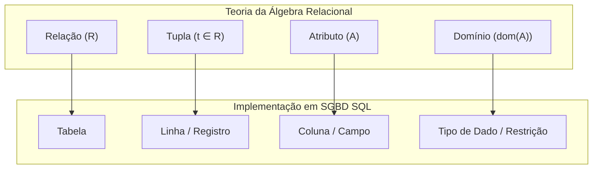

### Fundamentos Algébricos do Modelo

1. **Relação (Tabela):** Subconjunto do produto cartesiano de uma lista de domínios: $R \subseteq D_1 \times D_2 \times \dots \times D_n$. Trata-se de um multiconjunto (*bag*) na implementação SQL prática, admitindo tuplas idênticas caso não haja uma chave primária explicitamente configurada.
2. **Tupla (Linha/Registro):** Uma coleção ordenada de valores escalares onde cada valor pertence estritamente ao domínio do respectivo atributo.
3. **Atributo (Coluna):** O identificador semântico de uma dimensão da relação.
4. **Domínio:** O conjunto de valores atômicos válidos para um atributo específico (exemplo: inteiros de 32 bits, cadeias de caracteres de tamanho fixo ou representações cronológicas).

### Sublinguagens do Padrão SQL ANSI

A Structured Query Language (SQL) divide-se em sublinguagens especializadas segundo o propósito operacional:

- **Data Definition Language (DDL):** Define, modifica e remove esquemas e objetos estruturais (`CREATE`, `ALTER`, `DROP`).
- **Data Manipulation Language (DML):** Modifica o estado transacional das tuplas armazenadas (`INSERT`, `UPDATE`, `DELETE`).
- **Data Query Language (DQL):** Recupera projeções e restrições analíticas a partir do catálogo relacional (`SELECT`).
- **Data Control Language (DCL):** Governa privilégios de acesso e segurança (`GRANT`, `REVOKE`).
- **Transaction Control Language (TCL):** Assegura as propriedades ACID em operações transacionais (`BEGIN`, `COMMIT`, `ROLLBACK`).

---

## Definição de Dados (DDL) e Evolução de Esquemas

A integridade do modelo relacional depende de restrições estruturais declaradas via DDL. Essas restrições operam no nível do mecanismo interno de armazenamento (*storage engine*), impedindo a persistência de estados inconsistentes.

### Chaves Primárias e Integridade Referencial

- **Chave Primária (Primary Key - PK):** Atributo ou conjunto de atributos com a garantia formal de unicidade e não nulidade compulsória (`NOT NULL`), identificando univocamente qualquer tupla na tabela.
- **Chave Estrangeira (Foreign Key - FK):** Atributo em uma tabela dependente (filha) cujos valores devem obrigatoriamente existir na chave primária de uma tabela referenciada (pai), ou conter o marcador de ausência de valor (`NULL`), caso a coluna admita opcionalidade.

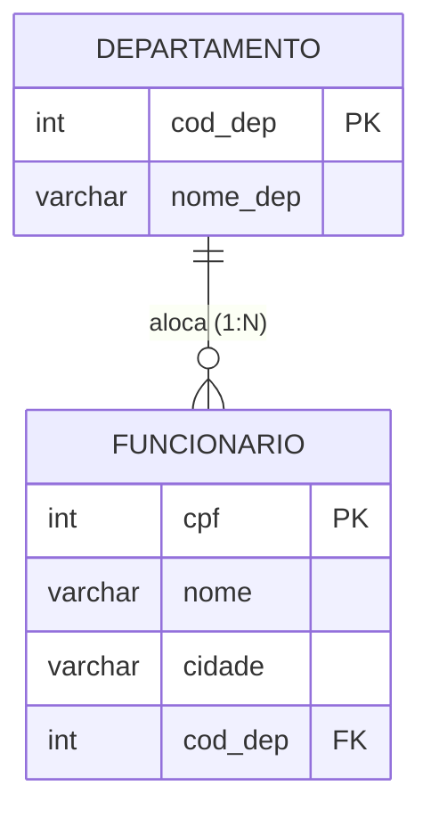

### Sintaxe Canônica no CREATE TABLE

A definição estrutural deve priorizar a nomeação explícita de *constraints*, permitindo manutenção futura sem dependência de nomes randômicos atribuídos pelo catálogo interno do SGBD.

```sql
-- Criação da tabela independente (Pai)
CREATE TABLE departamento (
    cod_dep INTEGER NOT NULL,
    nome_dep VARCHAR(50) NOT NULL,
    CONSTRAINT pk_departamento PRIMARY KEY (cod_dep)
);

-- Criação da tabela dependente (Filha)
CREATE TABLE funcionario (
    cpf INTEGER NOT NULL,
    nome VARCHAR(50) NOT NULL,
    cidade VARCHAR(50),
    cod_dep INTEGER,
    CONSTRAINT pk_funcionario PRIMARY KEY (cpf),
    CONSTRAINT fk_funcionario_departamento 
        FOREIGN KEY (cod_dep) 
        REFERENCES departamento (cod_dep)
);
```

### Evolução de Esquema com ALTER TABLE

Durante o ciclo de vida do software corporativo, alterações de regras de negócio exigem a modificação de tabelas já populadas.

#### 1. Adição Tardia de Chave Estrangeira
Útil para evitar problemas de dependência circular durante cargas iniciais de dados:

```sql
ALTER TABLE funcionario 
ADD CONSTRAINT fk_funcionario_departamento 
FOREIGN KEY (cod_dep) 
REFERENCES departamento (cod_dep);
```

#### 2. Modificação de Colunas
Adição, exclusão e renomeação de atributos em tabelas existentes:

```sql
-- Inclusão de nova coluna (inicializada como NULL para registros preexistentes)
ALTER TABLE funcionario ADD COLUMN data_admissao DATE;

-- Exclusão de coluna obsoleta (operação destrutiva e irreversível)
ALTER TABLE funcionario DROP COLUMN data_admissao;

-- Renomeação de coluna sem alteração física dos dados
ALTER TABLE funcionario RENAME COLUMN cidade TO municipio;

-- Renomeação da tabela no catálogo de metadados
ALTER TABLE funcionario RENAME TO colaboradores;
```

#### 3. Remoção e Inclusão de Restrições Estruturais

```sql
-- Removendo a amarração de chave estrangeira
ALTER TABLE colaboradores DROP CONSTRAINT fk_funcionario_departamento;

-- Adicionando chave primária em tabela pré-existente
ALTER TABLE colaboradores ADD CONSTRAINT pk_colaboradores PRIMARY KEY (cpf);
```

### Riscos Arquiteturais em Tabelas de Produção

| Operação DDL | Mecanismo Físico | Impacto Operacional | Risco de Engenharia |
| :--- | :--- | :--- | :--- |
| `ADD COLUMN ... NOT NULL` | Varredura completa da tabela | Bloqueio exclusivo (*Table Lock*) | Falha caso não exista cláusula `DEFAULT` |
| `DROP COLUMN` | Invalidação de catálogo / Expurgo | Metadados atualizados | Quebra de consultas pré-compiladas e ORMs |
| `ADD CONSTRAINT ... FK` | *Full Table Scan* na tabela-filha | Bloqueio de inserções concorrentes | Abortará caso haja registros órfãos |
| `DROP CONSTRAINT` | Exclusão de índice/validador | Liberação de catálogo | Permite inserção imediata de dados inconsistentes |

---

## Modelagem Conceitual, Lógica e Mapeamento Relacional

A transição entre o mundo real e a persistência relacional exige abstração conceitual através de Diagramas Entidade-Relacionamento (DER) e subsequente mapeamento para o modelo relacional lógico.

### Caso 1: DER Empresa (Supervisão Recursiva e Alocação N:M)

#### Regras de Negócio
- Funcionários possuem identificação unívoca por CPF, nomes decompostos e telefones multivalorados.
- Um funcionário pode ser supervisionado por outro funcionário (auto-relacionamento 1:N).
- Departamentos possuem alocação de múltiplos funcionários, mas apenas um único funcionário como gerente (1:1).
- Projetos demandam alocação de múltiplos funcionários, controlando as horas trabalhadas em cada projeto (N:M).
- Dependentes são entidades fracas associadas obrigatoriamente a um funcionário específico.

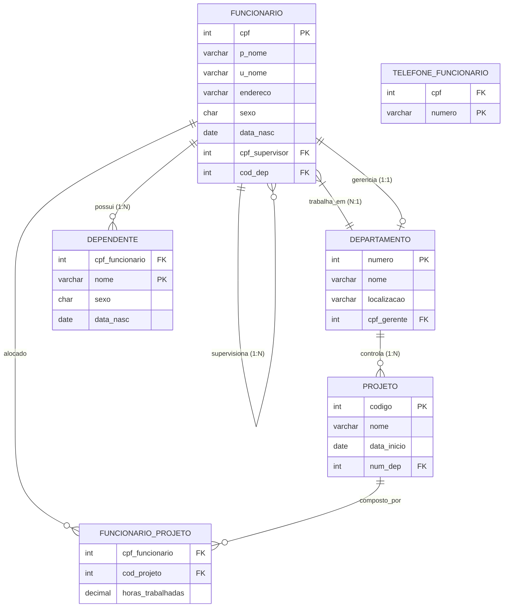

### Caso 2: DER Pet-Shop (Vendas Associativas e Multi-entidades)

#### Regras de Negócio
- Clientes registram múltiplos animais de estimação (1:N).
- Funcionários pertencem a um cargo específico e executam serviços ou intermediam vendas.
- O registro de serviço unifica funcionário prestador, cliente tomador e o animal atendido.
- A venda envolve a composição de cliente, funcionário e os produtos adquiridos, registrando data, forma de pagamento e quantidades.
- Produtos possuem catálogo unívoco e vínculo estrito com um fornecedor primário.

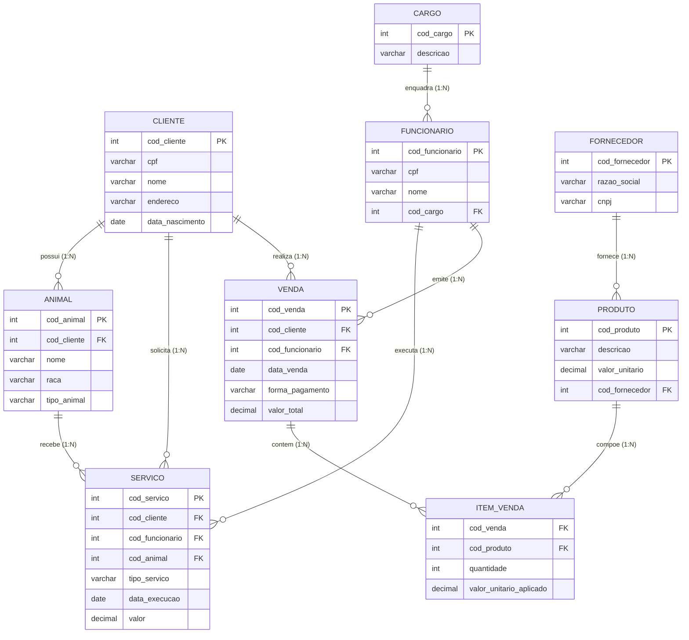

### Caso 3: DER Locadora de Automóveis (Classificação e Tarifação)

#### Regras de Negócio
- Veículos pertencem a categorias tarifárias predefinidas (ex: Econômico, Sedã Executivo, SUV Premium).
- Cada locação vincula um cliente a um veículo específico, computando períodos e valores de diária.

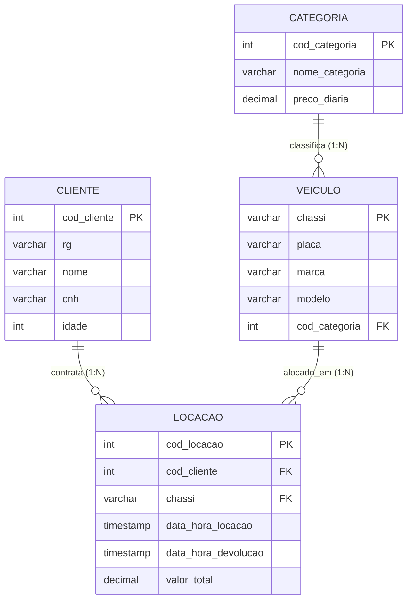

### Caso 4: DER Companhia de Transporte Rodoviário

#### Regras de Negócio
- Linhas de transporte definem trajetos compostos por origem, destino e cidades intermediárias.
- Ônibus possuem motoristas cadastrados e executam viagens atreladas a horários específicos de uma linha.

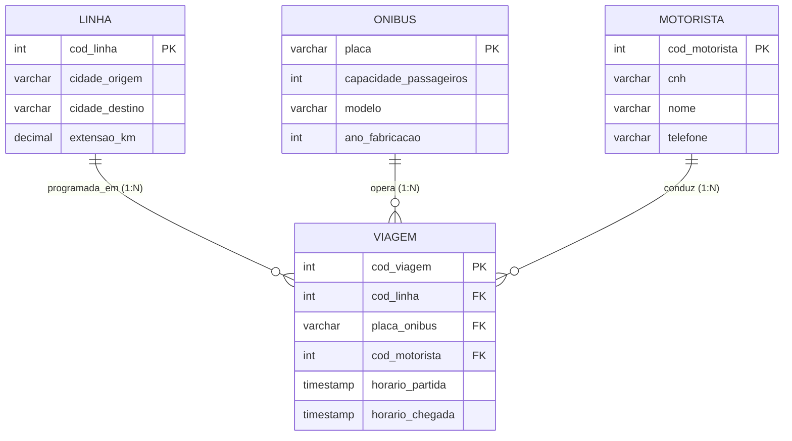

---

## Manipulação de Dados (DML) e Integridade Transacional

A manipulação de tuplas compreende operações de escrita sujeitas a validações de chave primária, tipos e chaves estrangeiras.

### O Comando INSERT INTO

Existem duas modalidades de inserção de registros:

```sql
-- Modalidade 1: Declaração explícita de colunas (Resiliente e mandatória em engenharia)
INSERT INTO funcionario (cpf, nome, cidade, cod_dep) 
VALUES (101, 'Marcos Souza', 'Jales', 1);

-- Modalidade 2: Declaração posicional (Depende da ordem física exata no catálogo)
INSERT INTO funcionario 
VALUES (102, 'Carla Dias', 'Fernandópolis', 2);
```

#### Riscos da Inserção Posicional
Se o esquema da tabela for modificado com `ALTER TABLE ADD COLUMN`, qualquer comando `INSERT INTO tabela VALUES (...)` sem a lista explícita de colunas falhará imediatamente, interrompendo serviços em produção.

### O Comando UPDATE e a Cláusula SET

O comando `UPDATE` altera valores de atributos em tuplas pré-existentes. A cláusula `WHERE` delimita o escopo da mutação.

```sql
-- Atualização seletiva segura
UPDATE funcionario 
SET cidade = 'Votuporanga' 
WHERE cpf = 101;
```

### O Comando DELETE FROM

O comando `DELETE FROM` remove tuplas completas baseando-se no predicado booleano fornecido.

```sql
-- Remoção seletiva
DELETE FROM funcionario 
WHERE cpf = 102;
```

### A Catástrofe da Omissão do WHERE

Em SQL ANSI, a omissão do predicado `WHERE` em instruções de `UPDATE` e `DELETE` **não constitui erro sintático**. O motor assume a condição universal `WHERE TRUE`, afetando **todas** as linhas da tabela.

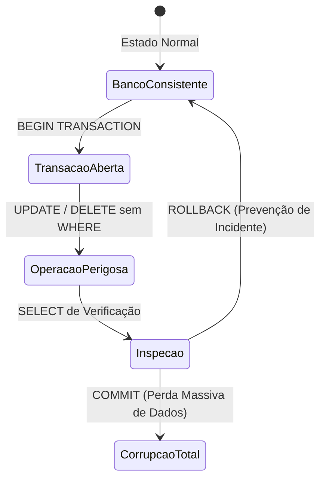

#### Protocolo Operacional de Segurança em Bancos de Produção

1. **Uso de Blocos Transacionais Manuais:**
   ```sql
   BEGIN;
   UPDATE funcionario SET cod_dep = 5 WHERE cidade = 'Jales';
   -- Verificação de cardinalidade de linhas afetadas:
   SELECT count(*) FROM funcionario WHERE cod_dep = 5;
   -- Se o resultado divergir do planejado:
   ROLLBACK;
   -- Somente se o resultado for 100% verificado:
   COMMIT;
   ```
2. **Checagem Prévia via Projeção de Contagem:**
   Antes de submeter `DELETE FROM pedido WHERE data_pedido < '2022-01-01';`, executa-se obrigatoriamente:
   ```sql
   SELECT count(*) FROM pedido WHERE data_pedido < '2022-01-01';
   ```

---

## Recuperação de Dados Básica (DQL) e Álgebra Booleana

A DQL extrai dados através da álgebra relacional. Suas duas operações elementares são a **Projeção** ($\pi$) e a **Seleção** ($\sigma$).

### Projeção com SELECT

A projeção vertical isola os atributos desejados:

```sql
-- Projeção de todas as colunas (Evitar em APIs de alta demanda)
SELECT * FROM clientes;

-- Projeção estrita de atributos relevantes
SELECT cod_cliente, nome, estado FROM clientes;
```

### Seleção com WHERE e Operadores Relacionais

A restrição horizontal avalia predicados sobre cada tupla:

```sql
SELECT nome, salario FROM vendedor WHERE salario >= 3000.00;
```

Operadores relacionais canônicos: `=`, `<>` (ou `!=`), `>`, `<`, `>=`, `<=`.

### Álgebra Booleana: AND, OR e NOT

Os conectivos lógicos combinam condições elementares. A ordem de avaliação possui precedência hierárquica estrita:

1. Expressões entre Parênteses: `( )`
2. Operadores Relacionais e Inequações
3. Operador de Negação: `NOT`
4. Operador de Conjunção: `AND`
5. Operador de Disjunção: `OR`

#### Armadilha Crítica de Precedência
Considere a necessidade de filtrar clientes de `'SP'` ou `'MG'` que possuam idade superior a 30 anos:

```sql
-- INCORRETO: O AND é avaliado antes do OR!
-- Retorna qualquer cliente de SP independente da idade, OU clientes de MG com mais de 30 anos.
SELECT nome, estado, idade 
FROM clientes 
WHERE estado = 'SP' OR estado = 'MG' AND idade > 30;

-- CORRETO: Parênteses forçam a avaliação prioritária da disjunção de estados.
SELECT nome, estado, idade 
FROM clientes 
WHERE (estado = 'SP' OR estado = 'MG') AND idade > 30;
```

### Eliminação de Duplicatas com DISTINCT

O SQL opera sobre multiconjuntos (*bags*). O operador `DISTINCT` força a semântica de conjunto matemático puro, descartando tuplas idênticas no conjunto projetado:

```sql
-- Extrai a relação única de municípios representados na base
SELECT DISTINCT cidade FROM clientes;

-- DISTINCT composto: avalia a combinação simultânea das colunas
SELECT DISTINCT cidade, estado FROM clientes;
```

### Expressões Aritméticas e Renomeação com AS

O SGBD realiza transformações matemáticas em tempo real na lista de projeção:

```sql
SELECT 
    descricao,
    valor_unitario AS preco_original,
    valor_unitario * 1.20 AS preco_acrescimo_vinte_porcento,
    valor_unitario * 0.90 AS preco_desconto_dez_porcento
FROM produto;
```

*Nota de Engenharia:* Os identificadores definidos na cláusula `AS` (aliases) são computados na fase final de projeção e **não podem** ser referenciados dentro da cláusula `WHERE` da mesma instrução.

### Ordenação Determinística com ORDER BY

Relações não possuem ordem física garantida por definição teórica. A apresentação ordenada exige `ORDER BY`:

```sql
-- Ordenação composta: Estado ascendente (A-Z) com desempate por idade descendente (mais velhos primeiro)
SELECT nome, estado, idade 
FROM clientes 
ORDER BY estado ASC, idade DESC;
```

---

## Predicados de Faixa, Pertinência e Casamento de Padrões

### O Operador BETWEEN

O predicado `BETWEEN` avalia se um valor reside em um intervalo contínuo fechado (inclusivo).

$$\text{expressao BETWEEN limite\_inferior AND limite\_superior}$$

Equivale algebricamente a:

$$(\text{expressao} \ge \text{limite\_inferior}) \land (\text{expressao} \le \text{limite\_superior})$$

```sql
-- Produtos com valor entre R$ 5,00 e R$ 20,00 (inclusive)
SELECT descricao, valor_unitario 
FROM produto 
WHERE valor_unitario BETWEEN 5.00 AND 20.00;
```

#### Armadilha de Inversão de Limites
Se os limites forem invertidos (`BETWEEN 20.00 AND 5.00`), a consulta retornará **zero registros**, pois nenhuma grandeza escalar pode ser simultaneamente $\ge 20$ e $\le 5$.

### Operadores de Pertinência: IN e NOT IN

O predicado `IN` testa se o operando equivale a qualquer componente de uma lista finita de literais discretos:

```sql
-- Equivalente a: (estado = 'SP' OR estado = 'MG' OR estado = 'RJ')
SELECT nome, estado 
FROM clientes 
WHERE estado IN ('SP', 'MG', 'RJ');
```

O predicado `NOT IN` expressa o complemento booleano:

```sql
SELECT nome, estado 
FROM clientes 
WHERE estado NOT IN ('SP', 'RJ');
```

#### O Perigo Crítico da Lógica Tri-Valorada (3VL) com NULL no NOT IN

Na Lógica Tri-Valorada do SQL:
$$x = \text{NULL} \implies \text{UNKNOWN}$$
$$x \neq \text{NULL} \implies \text{UNKNOWN}$$

A expressão `NOT IN (v1, v2, ..., vn)` é expandida internamente pelo otimizador como:

$$(\text{campo} \neq v_1) \land (\text{campo} \neq v_2) \land \dots \land (\text{campo} \neq v_n)$$

Se a lista contiver um único elemento `NULL`:

$$(\text{campo} \neq v_1) \land \dots \land (\text{campo} \neq \text{NULL}) \implies \text{TRUE} \land \dots \land \text{UNKNOWN} \implies \text{UNKNOWN}$$

Como a cláusula `WHERE` só aprova linhas com avaliação estritamente `TRUE`, **se houver um valor NULL na lista do NOT IN, toda a consulta retornará um conjunto vazio (zero tuplas)**.

### Casamento de Padrões: LIKE e ILIKE

O operador `LIKE` realiza busca textual por casamento de padrões com metacaracteres:

- `%` (Porcentagem): Casa com zero, um ou múltiplos caracteres arbitrários.
- `_` (Sublinhado): Casa com exatamente um único caractere posicional.

```sql
-- Nomes iniciados pela letra 'A'
SELECT nome FROM clientes WHERE nome LIKE 'A%';

-- Nomes terminados pela letra 'a'
SELECT nome FROM clientes WHERE nome LIKE '%a';

-- Nomes contendo o padrão 'an' em qualquer segmento
SELECT nome FROM clientes WHERE nome LIKE '%an%';

-- Nomes com exatamente 5 letras
SELECT nome FROM clientes WHERE nome LIKE '_____';

-- Nomes iniciados por 'Ma' e terminados por 'a'
SELECT nome FROM clientes WHERE nome LIKE 'Ma%a';
```

#### Sensibilidade a Maiúsculas e Minúsculas (Case Sensitivity)
- No PostgreSQL e no padrão SQL ANSI, o operador `LIKE` é estritamente *case-sensitive*. Se a base armazena `'MARIA'` e a consulta busca `LIKE 'Ma%'`, zero registros serão retornados.
- O operador `ILIKE` (extensão nativa do PostgreSQL) realiza comparações insensíveis à caixa (*case-insensitive*):
  ```sql
  SELECT nome FROM clientes WHERE nome ILIKE 'ma%a';
  ```
- No SQL ANSI puro, atinge-se o mesmo comportamento através de normalização escalar:
  ```sql
  SELECT nome FROM clientes WHERE UPPER(nome) LIKE 'MA%A';
  ```

---

## Funções Escalares: Strings e Manipulação Temporal

Funções escalares transformam valores atômicos linha a linha na etapa de projeção ou filtragem.

### Funções de Texto

```sql
-- ASCII: Código decimal do primeiro caractere da cadeia
SELECT ASCII('A'); -- Retorna 65
SELECT ASCII(nome) FROM clientes;

-- LENGTH: Contagem lógica de caracteres
SELECT nome, LENGTH(nome) AS tamanho FROM clientes;

-- LOWER e UPPER: Normalização de caixa
SELECT LOWER(nome), UPPER(cidade) FROM clientes;

-- SUBSTRING: Extração posicional (Atenção: Indexação Base 1 no padrão SQL)
-- Sintaxe: SUBSTRING(texto FROM inicio FOR comprimento)
SELECT SUBSTRING(nome FROM 1 FOR 3) AS prefixo_tres_letras FROM clientes;
```

#### Operador de Concatenação (||)
No padrão SQL ANSI e no PostgreSQL, a junção de strings ocorre pelo operador de barra dupla vertical `||`.

```sql
SELECT nome || ' reside na cidade de ' || cidade AS declaracao FROM clientes;
```

#### A Regra do Nulo na Concatenação
Qualquer valor desconhecido fundido com uma cadeia de texto colapsa a expressão inteira para `NULL`:

$$\text{'Texto'} \parallel \text{NULL} \implies \text{NULL}$$

Para evitar esse efeito, utiliza-se a função protetiva `COALESCE(coluna, '')`.

### Manipulação Temporal no PostgreSQL

O tempo deve ser tratado por tipos especializados (`DATE`, `TIMESTAMP`, `INTERVAL`), e não por strings puras.

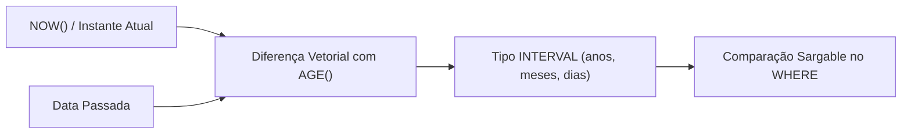

```sql
-- NOW(): Carimbo de data/hora no início da transação corrente
SELECT NOW();

-- DATE(): Truncamento da fração de horas, minutos e microssegundos
SELECT DATE(NOW());

-- AGE(ts1, ts2): Diferença real no calendário humano em formato INTERVAL
SELECT nome, AGE(NOW(), data_nascimento) AS idade_completa FROM clientes;

-- EXTRACT(): Decomposição escalar de partes do registro temporal
SELECT 
    EXTRACT(YEAR FROM NOW()) AS ano_corrente,
    EXTRACT(MONTH FROM NOW()) AS mes_corrente,
    EXTRACT(DAY FROM NOW()) AS dia_corrente;
```

#### O Tipo de Dado INTERVAL e Cálculos de Maioridade
Evite dividir dias por 365.25. Utilize intervalos tipados do PostgreSQL para respeitar anos bissextos:

```sql
-- Filtro de funcionários com mais de 30 anos de idade
SELECT nome 
FROM funcionarios 
WHERE AGE(NOW(), data_nascimento) > INTERVAL '30 years';

-- Expressão sargable (otimizada para uso de índices B-Tree na coluna data_nascimento):
SELECT nome 
FROM funcionarios 
WHERE data_nascimento <= NOW() - INTERVAL '30 years';
```

---

## Junções Relacionais e Integridade Referencial

A decomposição normalizada do esquema exige que consultas analíticas recombinem entidades através da operação de junção ($\bowtie$).

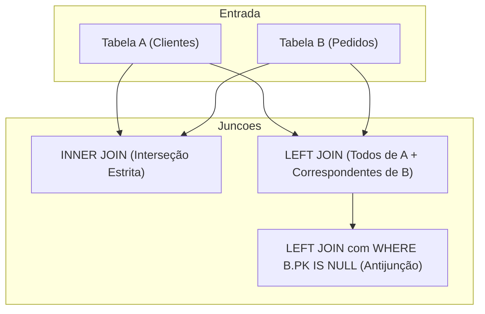

### Junção Interna (INNER JOIN): SQL-89 vs. SQL-92

A junção interna projeta apenas as tuplas onde há correspondência mútua entre as chaves nas duas tabelas.

```sql
-- Padrão ANSI SQL-89 (Sintaxe Legada baseada em produto cartesiano no WHERE)
SELECT c.nome, p.cod_pedido, p.valor
FROM clientes c, pedidos p
WHERE c.cod_cliente = p.cod_cliente;

-- Padrão ANSI SQL-92 (Sintaxe Canônica Moderna com cláusula ON isolada)
SELECT c.nome, p.cod_pedido, p.valor
FROM clientes c
INNER JOIN pedidos p ON c.cod_cliente = p.cod_cliente;
```

#### Vantagens Estruturais da Sintaxe SQL-92
1. Separação conceitual entre as condições estruturais de junção (`ON`) e os predicados de negócio (`WHERE`).
2. Proteção contra o risco de esquecimento do filtro de junção (a omissão do `ON` gera erro sintático imediato, enquanto a omissão do `WHERE` na sintaxe legada gera um produto cartesiano silencioso e desastroso de $M \times N$ linhas).

### Junção Externa à Esquerda (LEFT JOIN)

Preserva **todas as linhas da tabela à esquerda** da declaração, preenchendo as colunas da tabela à direita com marcadores `NULL` quando não houver correspondência.

```sql
SELECT c.nome, p.cod_pedido, p.valor
FROM clientes c
LEFT JOIN pedidos p ON c.cod_cliente = p.cod_cliente;
```

### Detecção de Registros Órfãos (Antijunção com IS NULL)

Uma das aplicações mais importantes da engenharia de dados é a identificação de clientes inativos, contas sem compras ou registros desprovidos de movimentação. Isso é resolvido por um `LEFT JOIN` associado a um predicado de nulidade sobre a chave primária da tabela à direita:

```sql
-- Localiza exclusivamente clientes que NUNCA efetuaram nenhum pedido
SELECT c.cod_cliente, c.nome, c.cidade
FROM clientes c
LEFT JOIN pedidos p ON c.cod_cliente = p.cod_cliente
WHERE p.cod_pedido IS NULL;
```

---

## Funções Agregadas, Agrupamento e Filtragem de Grupos

Funções agregadas transformam coleções multidimensionais de valores em escalares sumarizados.

### As Cinco Funções Canônicas

1. `COUNT(expressao)`: Contabiliza ocorrências não nulas. `COUNT(*)` computa todas as tuplas da partição.
2. `SUM(coluna)`: Somatório aritmético de colunas numéricas.
3. `AVG(coluna)`: Média aritmética ($\frac{\sum X}{N}$). Ignora valores `NULL`.
4. `MAX(coluna)`: Valor extremo superior (aplicável a números, textos e datas).
5. `MIN(coluna)`: Valor extremo inferior.

### Agrupamento com GROUP BY

A cláusula `GROUP BY` colapsa as tuplas resultantes da filtragem em partições homogêneas definidas pelas colunas especificadas.

```sql
-- Média salarial e contagem de clientes por cidade
SELECT cidade, COUNT(*) AS total_clientes, AVG(salario) AS media_salarial
FROM clientes
GROUP BY cidade;
```

#### A Regra de Ouro do GROUP BY
Qualquer coluna presente na lista de projeção do `SELECT` que **não seja** parâmetro de uma função de agregação **deve obrigatoriamente figurar na lista da cláusula GROUP BY**. A violação desta regra quebra o determinismo relacional e acarreta interrupção da query pelo compilador SQL.

### Dicotomia Fundamental: WHERE versus HAVING

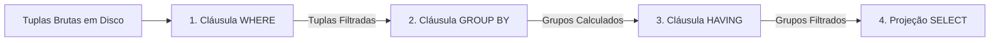

| Critério | Cláusula WHERE | Cláusula HAVING |
| :--- | :--- | :--- |
| **Momento de Aplicação** | Antes do particionamento (`GROUP BY`) | Após a sumarização dos grupos |
| **Escopo de Ação** | Tuplas individuais | Grupos consolidados |
| **Admite Funções de Agregação?** | **Terminantemente Proibido** (`WHERE SUM(...) > 10` falha) | **Sim**, propósito primário (`HAVING SUM(...) > 10`) |
| **Objetivo** | Reduzir o volume de entrada para agregação | Descartar partições calculadas fora da meta |

```sql
-- Exemplo Composto: Vendas por vendedor em 2024, retendo apenas totais acima de R$ 50.000
SELECT cod_vendedor, SUM(valor_total) AS total_vendido
FROM pedidos
WHERE data_pedido BETWEEN '2024-01-01' AND '2024-12-31' -- Filtragem de linhas individuais
GROUP BY cod_vendedor
HAVING SUM(valor_total) > 50000.00;                     -- Filtragem de grupos calculados
```

---

## Ordem Lógica e Arquitetura de Execução do Motor SQL

O desenvolvedor escreve o código SQL em ordem léxica conveniente, mas o otimizador e o motor de execução do SGBD processam as instruções em uma pipeline lógica completamente distinta.

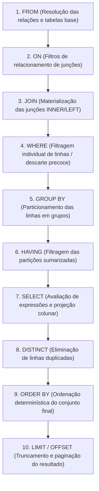

### Consequências Práticas para a Engenharia de Software

1. **Inexistência de Aliases no WHERE:**
   Como a etapa `WHERE` (Passo 4) ocorre antes da etapa `SELECT` (Passo 7), é impossível referenciar apelidos de colunas no filtro:
   ```sql
   -- INVÁLIDO: O identificador salario_anual ainda não existe no Passo 4!
   SELECT nome, salario * 12 AS salario_anual 
   FROM vendedor 
   WHERE salario_anual > 40000;
   
   -- CORRETO: Repetição da expressão ou uso de subquery/CTE
   SELECT nome, salario * 12 AS salario_anual 
   FROM vendedor 
   WHERE (salario * 12) > 40000;
   ```
2. **Aliases Válidos no ORDER BY:**
   Como o `ORDER BY` (Passo 9) é avaliado após o `SELECT` (Passo 7), apelidos de colunas podem ser livremente utilizados para ordenar o resultado final.

---

## Caderno de Resoluções: Atividade Material 04

Esta seção traz a resolução comentada dos exercícios práticos da Atividade Material 04 do Professor Guilherme de Morais, utilizando o esquema relacional comercial composto pelas tabelas `CLIENTE`, `PRODUTO`, `VENDEDOR` e `PEDIDO`.

### Definição do Esquema (DDL)

```sql
CREATE TABLE CLIENTE (
    cod_cliente INT NOT NULL,
    nome VARCHAR(100) NOT NULL,
    cidade VARCHAR(100),
    estado CHAR(2),
    idade INT,
    CONSTRAINT pk_cliente PRIMARY KEY (cod_cliente)
);

CREATE TABLE PRODUTO (
    cod_produto INT NOT NULL,
    descricao VARCHAR(100) NOT NULL,
    unidade VARCHAR(10),
    valor_unitario DECIMAL(10,2) NOT NULL,
    CONSTRAINT pk_produto PRIMARY KEY (cod_produto)
);

CREATE TABLE VENDEDOR (
    cod_vendedor INT NOT NULL,
    nome VARCHAR(100) NOT NULL,
    salario DECIMAL(10,2) NOT NULL,
    CONSTRAINT pk_vendedor PRIMARY KEY (cod_vendedor)
);

CREATE TABLE PEDIDO (
    cod_pedido INT NOT NULL,
    cod_cliente INT NOT NULL,
    cod_vendedor INT NOT NULL,
    data_pedido DATE NOT NULL,
    CONSTRAINT pk_pedido PRIMARY KEY (cod_pedido),
    CONSTRAINT fk_pedido_cliente FOREIGN KEY (cod_cliente) REFERENCES CLIENTE (cod_cliente),
    CONSTRAINT fk_pedido_vendedor FOREIGN KEY (cod_vendedor) REFERENCES VENDEDOR (cod_vendedor)
);
```

---

### Resoluções: Exercícios Básicos (1 a 25)

```sql
-- 1. Liste todos os dados da tabela CLIENTE.
SELECT * FROM CLIENTE;

-- 2. Liste apenas nome e idade dos clientes.
SELECT nome, idade FROM CLIENTE;

-- 3. Liste código e descrição dos produtos.
SELECT cod_produto, descricao FROM PRODUTO;

-- 4. Liste os clientes que moram no estado SP.
SELECT * FROM CLIENTE WHERE estado = 'SP';

-- 5. Liste os clientes com idade maior que 35 anos.
SELECT * FROM CLIENTE WHERE idade > 35;

-- 6. Liste os produtos com valor unitário menor que 10.
SELECT * FROM PRODUTO WHERE valor_unitario < 10.00;

-- 7. Liste os vendedores com salário maior ou igual a 3000.
SELECT * FROM VENDEDOR WHERE salario >= 3000.00;

-- 8. Liste todos os clientes ordenados por nome.
SELECT * FROM CLIENTE ORDER BY nome ASC;

-- 9. Liste os clientes ordenados por estado e idade.
SELECT * FROM CLIENTE ORDER BY estado ASC, idade ASC;

-- 10. Liste os produtos ordenados pelo valor unitário (do maior para o menor).
SELECT * FROM PRODUTO ORDER BY valor_unitario DESC;

-- 11. Liste os clientes do estado SP e com idade maior que 30.
SELECT * FROM CLIENTE WHERE estado = 'SP' AND idade > 30;

-- 12. Liste os clientes do estado RJ ou MG.
SELECT * FROM CLIENTE WHERE estado = 'RJ' OR estado = 'MG';

-- 13. Liste os produtos com valor maior que 10 e unidade 'KG'.
SELECT * FROM PRODUTO WHERE valor_unitario > 10.00 AND unidade = 'KG';

-- 14. Liste os vendedores com salário igual a 2800 ou 3000.
SELECT * FROM VENDEDOR WHERE salario = 2800.00 OR salario = 3000.00;

-- 15. Liste os produtos cuja unidade seja 'UN' e valor menor que 10.
SELECT * FROM PRODUTO WHERE unidade = 'UN' AND valor_unitario < 10.00;

-- 16. Liste todas as cidades distintas dos clientes.
SELECT DISTINCT cidade FROM CLIENTE;

-- 17. Liste todos os estados distintos cadastrados.
SELECT DISTINCT estado FROM CLIENTE;

-- 18. Liste os produtos com valor entre 5 e 20.
SELECT * FROM PRODUTO WHERE valor_unitario BETWEEN 5.00 AND 20.00;

-- 19. Liste os vendedores com salário entre 2500 e 3500.
SELECT * FROM VENDEDOR WHERE salario BETWEEN 2500.00 AND 3500.00;

-- 20. Liste os clientes com idade entre 25 e 40 anos.
SELECT * FROM CLIENTE WHERE idade BETWEEN 25 AND 40;

-- 21. Mostre o nome do produto e o valor com aumento de 20%.
SELECT descricao, valor_unitario * 1.20 AS valor_com_aumento FROM PRODUTO;

-- 22. Mostre o nome do produto e o valor com desconto de 10%.
SELECT descricao, valor_unitario * 0.90 AS valor_com_desconto FROM PRODUTO;

-- 23. Liste os vendedores com salário e o salário com bônus de 500 reais.
SELECT nome, salario, salario + 500.00 AS salario_com_bonus FROM VENDEDOR;

-- 24. Liste todos os pedidos realizados por um cliente específico (ex: cliente 10).
SELECT * FROM PEDIDO WHERE cod_cliente = 10;

-- 25. Liste todos os pedidos realizados após a data '2024-02-01'.
SELECT * FROM PEDIDO WHERE data_pedido > '2024-02-01';
```

---

### Resoluções: Exercícios Avançados e Desafios (1 a 10)

```sql
-- 1. Nome, cidade e idade de clientes de SP entre 25 e 40 anos, ordenados por idade decrescente
SELECT nome, cidade, idade
FROM CLIENTE
WHERE estado = 'SP' AND idade BETWEEN 25 AND 40
ORDER BY idade DESC;

-- 2. Produtos entre 5 e 20 com aumento de 30% projetado via alias
SELECT 
    descricao,
    valor_unitario AS valor_atual,
    valor_unitario * 1.30 AS valor_reajustado_30
FROM PRODUTO
WHERE valor_unitario BETWEEN 5.00 AND 20.00;

-- 3. Vendedores com salário entre 2500 e 3500, com bônus de 15%, ordenados pelo salário ajustado
SELECT 
    nome,
    salario AS salario_atual,
    salario * 1.15 AS salario_com_bonus
FROM VENDEDOR
WHERE salario BETWEEN 2500.00 AND 3500.00
ORDER BY salario_com_bonus DESC;

-- 4. Clientes de SP ou RJ com mais de 30 anos, ordenados por estado e nome
SELECT nome, estado, idade
FROM CLIENTE
WHERE (estado = 'SP' OR estado = 'RJ') AND idade > 30
ORDER BY estado ASC, nome ASC;

-- 5. Produtos em 'KG' com valor menor que 10 ou maior que 30
SELECT descricao, unidade, valor_unitario
FROM PRODUTO
WHERE unidade = 'KG' AND (valor_unitario < 10.00 OR valor_unitario > 30.00);

-- 6. Pedidos após 2024-02-10 pertencentes a vendedores entre 10 e 30, ordenados por data
SELECT cod_pedido, cod_cliente, cod_vendedor, data_pedido
FROM PEDIDO
WHERE data_pedido > '2024-02-10' AND cod_vendedor BETWEEN 10 AND 30
ORDER BY data_pedido ASC;

-- 7. Clientes distintos por cidade com contagem
SELECT cidade, COUNT(*) AS quantidade_clientes
FROM CLIENTE
GROUP BY cidade
ORDER BY quantidade_clientes DESC;

-- 8. Produtos com unidade 'UN' exibindo descontos de 20% e acréscimos de 10%
SELECT 
    descricao,
    valor_unitario AS valor_atual,
    valor_unitario * 0.80 AS valor_desconto_20,
    valor_unitario * 1.10 AS valor_aumento_10
FROM PRODUTO
WHERE unidade = 'UN';

-- 9. Vendedores que NÃO possuem salário entre 2800 e 3200, ordenados por salário crescente
SELECT nome, salario
FROM VENDEDOR
WHERE salario NOT BETWEEN 2800.00 AND 3200.00
ORDER BY salario ASC;

-- 10. (Desafio de Alto Nível) Pedidos de fevereiro de 2024, clientes entre 10 e 30 e vendedores com salário > 3000
SELECT 
    p.cod_pedido,
    p.cod_cliente,
    p.cod_vendedor
FROM PEDIDO p
INNER JOIN VENDEDOR v ON p.cod_vendedor = v.cod_vendedor
WHERE p.data_pedido BETWEEN '2024-02-01' AND '2024-02-29'
  AND p.cod_cliente BETWEEN 10 AND 30
  AND v.salario > 3000.00
ORDER BY p.cod_cliente ASC, p.data_pedido ASC;
```

---

## Caderno de Resoluções: Aula 05 (Clientes e Veículos)

Esta seção resolve as vinte questões práticas da AULA 05 de Consultas em SQL, utilizando o catálogo formado pelas entidades `clientes` e `veiculos`.

### Definição do Esquema Corrigido (DDL)

*(Nota técnica: No script original, a coluna `motor` estava definida como `INTEGER`, enquanto a massa de dados inseria grandezas decimais como `1.8`, `2.0` e `2.8`. O tipo foi corrigido para `NUMERIC(3,1)` para assegurar compatibilidade estrita no PostgreSQL/ANSI).*

```sql
CREATE TABLE clientes (
    cod_cli INTEGER NOT NULL,
    cpf INTEGER NOT NULL,
    nome VARCHAR(50), 
    endereco VARCHAR(50),
    cidade VARCHAR(50),
    estado VARCHAR(02),
    salario INTEGER,
    idade INTEGER, 
    CONSTRAINT pk_cpfcliente PRIMARY KEY (cpf)
);

CREATE TABLE veiculos (
    chassi VARCHAR(50) NOT NULL,
    placa VARCHAR(10) NOT NULL, 
    cor VARCHAR(20),
    modelo VARCHAR(20),
    marca VARCHAR(20),
    ano_fabricacao INTEGER,
    preco_compra INTEGER,
    preco_venda INTEGER,
    motor NUMERIC(3,1),
    cpf_cli INTEGER NOT NULL, 
    CONSTRAINT pk_placa PRIMARY KEY (placa),
    CONSTRAINT fk_cpf_cli FOREIGN KEY (cpf_cli) REFERENCES clientes (cpf)
);
```

---

### Resoluções: Questões 1 a 20

```sql
-- 1. Selecione todos os clientes cujo nome começa com a letra A.
SELECT * FROM clientes WHERE nome LIKE 'A%';

-- 2. Liste os clientes cujo nome contém a letra "i" em qualquer posição.
-- (Como a base está em caixa alta, utiliza-se a normalização UPPER ou 'I')
SELECT * FROM clientes WHERE nome LIKE '%I%';

-- 3. Selecione os clientes cujo nome termina com a letra "a".
SELECT * FROM clientes WHERE nome LIKE '%A';

-- 4. Liste os clientes cujo nome tenha exatamente 5 caracteres.
SELECT * FROM clientes WHERE nome LIKE '_____';

-- 5. Selecione os clientes cujo nome começa com "Ma" e termina com "a".
SELECT * FROM clientes WHERE UPPER(nome) LIKE 'MA%A';

-- 6. Liste os veículos cuja cor seja BRANCO.
SELECT * FROM veiculos WHERE cor = 'BRANCO';

-- 7. Selecione os veículos cujo modelo contenha "O".
SELECT * FROM veiculos WHERE modelo LIKE '%O%';

-- 8. Liste os veículos cuja placa termine com "9".
SELECT * FROM veiculos WHERE placa LIKE '%9';

-- 9. Selecione os clientes cujo endereço contenha "RUA 01".
SELECT * FROM clientes WHERE endereco LIKE '%RUA 01%';

-- 10. Repita o exercício 2 usando ILIKE para não diferenciar maiúsculas e minúsculas.
SELECT * FROM clientes WHERE nome ILIKE '%i%';

-- 11. Calcule a média dos salários dos clientes.
SELECT AVG(salario) AS media_salarial_clientes FROM clientes;

-- 12. Conte quantos clientes existem na tabela.
SELECT COUNT(*) AS total_clientes FROM clientes;

-- 13. Conte quantos clientes moram na cidade de FERNANDÓPOLIS.
SELECT COUNT(*) AS total_clientes_fernandopolis 
FROM clientes 
WHERE cidade = 'FERNANDOPOLIS';

-- 14. Selecione o maior salário entre os clientes.
SELECT MAX(salario) AS maior_salario FROM clientes;

-- 15. Selecione o menor salário entre os clientes.
SELECT MIN(salario) AS menor_salario FROM clientes;

-- 16. Calcule a soma dos salários de todos os clientes.
SELECT SUM(salario) AS folha_salarial_total FROM clientes;

-- 17. Selecione o maior preço de venda dos veículos.
SELECT MAX(preco_venda) AS maior_preco_venda FROM veiculos;

-- 18. Selecione o menor preço de compra dos veículos.
SELECT MIN(preco_compra) AS menor_preco_compra FROM veiculos;

-- 19. Liste a média salarial por cidade.
SELECT cidade, AVG(salario) AS media_salarial
FROM clientes
GROUP BY cidade
ORDER BY media_salarial DESC;

-- 20. Mostre o maior e menor preço de venda por marca de veículo.
SELECT 
    marca,
    MAX(preco_venda) AS maior_preco_venda,
    MIN(preco_venda) AS menor_preco_venda
FROM veiculos
GROUP BY marca;
```

---

## Guia Defensivo contra Anti-padrões e Falhas de Integridade

### 1. O Anti-padrão do SELECT *
- **Manifestação:** `SELECT * FROM transacoes WHERE data = NOW();`
- **Impacto:** Tráfego desnecessário de I/O de rede e leitura de disco. Bloqueia a otimização de índices cobertos (*Covering Index*), onde o SGBD responderia à query lendo apenas a estrutura compacta da árvore B-Tree sem tocar nas páginas de dados principais. Quebra código de clientes se novas colunas forem adicionadas.
- **Correção:** Especifique unicamente os atributos consumidos: `SELECT id, valor FROM transacoes WHERE data = DATE(NOW());`.

### 2. A Ilusão de Igualdade com Nulos
- **Manifestação:** `WHERE cod_departamento = NULL` ou `WHERE cod_departamento <> NULL`
- **Impacto:** O SGBD avalia a expressão para `UNKNOWN`. Linhas não são retornadas, mesmo que existam tuplas contendo `NULL`.
- **Correção:** Utilize exclusivamente os operadores de teste de nulidade: `WHERE cod_departamento IS NULL` ou `WHERE cod_departamento IS NOT NULL`.

### 3. Violação da Sargabilidade (SARGable Queries)
- **Manifestação:** `WHERE EXTRACT(YEAR FROM data_pedido) = 2024` ou `WHERE SUBSTRING(nome, 1, 1) = 'A'`
- **Impacto:** O SGBD é forçado a calcular a função linha a linha (*Full Table Scan*), ignorando índices B-Tree existentes nas colunas `data_pedido` ou `nome`.
- **Correção:** Mantenha a coluna livre de transformações no lado do predicado:
  ```sql
  -- Permite busca direta no índice B-Tree (Index Range Scan)
  WHERE data_pedido BETWEEN '2024-01-01' AND '2024-12-31'
  WHERE nome LIKE 'A%'
  ```

### 4. O Uso Indevido de DISTINCT para Ocultar Erros de Join
- **Manifestação:** Adicionar `DISTINCT` porque a consulta retornou linhas duplicadas inesperadas.
- **Impacto:** Disfarça um relacionamento incorreto na cláusula `ON` (ou falta de predicado de junção), além de gerar uma sobrecarga pesada de ordenação (*sort*) ou cálculo de hash em memória para deduplicar dados que nem deveriam ter sido multiplicados.
- **Correção:** Ajuste as condições de integridade referencial nas cláusulas de junção.

---

## Banco de Questões e Gabarito Analítico

### Questão 1
*(Sistemas de Informação — UniFEF)*  
Em relação à arquitetura de execução do padrão SQL ANSI, explique por que a consulta abaixo produz um erro de compilação/execução no SGBD e forneça a correção técnica adequada.

```sql
SELECT descricao, valor_unitario * 1.15 AS preco_ajustado
FROM produto
WHERE preco_ajustado > 50.00;
```

#### Gabarito Comentado
A consulta falha com o erro `Column 'preco_ajustado' does not exist` porque a ordem lógica de execução do motor relacional avalia a cláusula `WHERE` (Passo 2) antes da cláusula `SELECT` (Passo 5). No momento em que o filtro horizontal é processado linha a linha, o apelido de projeção `preco_ajustado` ainda não foi instanciado em memória.  
**Correção Defensiva:**
```sql
SELECT descricao, valor_unitario * 1.15 AS preco_ajustado
FROM produto
WHERE (valor_unitario * 1.15) > 50.00;
```

---

### Questão 2
*(Sistemas de Informação — UniFEF)*  
Considere que a tabela `funcionario` possui 1.000 registros, dos quais 5 possuem o campo `comissao` com valor nulo (`NULL`). Ao executar a consulta:

```sql
SELECT COUNT(*), COUNT(comissao), AVG(comissao) FROM funcionario;
```

Qual o comportamento operacional do SGBD para cada uma das funções de agregação?

#### Gabarito Comentado
1. `COUNT(*)`: Avalia a cardinalidade total da relação, retornando `1000`, pois computa tuplas inteiras independentemente do conteúdo dos atributos.
2. `COUNT(comissao)`: Contabiliza exclusivamente ocorrências não nulas (`NOT NULL`), retornando `995`.
3. `AVG(comissao)`: Realiza a média aritmética dividindo a soma dos valores da coluna unicamente pelo número de tuplas não nulas ($\frac{\sum comissao}{995}$). Os cinco registros com `NULL` são completamente desconsiderados tanto no numerador quanto no denominador.

---

### Questão 3
*(Sistemas de Informação — UniFEF)*  
Explique detalhadamente o mecanismo lógico que faz a instrução abaixo retornar zero linhas caso exista ao menos um cliente com estado nulo cadastrado:

```sql
SELECT nome FROM clientes WHERE estado NOT IN ('SP', 'RJ', NULL);
```

#### Gabarito Comentado
O operador `NOT IN` expande-se algebricamente através de uma cadeia de conjunções (`AND`):
$$(\text{estado} \neq \text{'SP'}) \land (\text{estado} \neq \text{'RJ'}) \land (\text{estado} \neq \text{NULL})$$
Pela Lógica Tri-Valorada (3VL), qualquer comparação de igualdade ou desigualdade envolvendo um valor nulo avalia para `UNKNOWN` (desconhecido). Logo:
$$\text{TRUE} \land \text{TRUE} \land \text{UNKNOWN} \implies \text{UNKNOWN}$$
Como a cláusula `WHERE` exige obrigatoriamente a verdade estrita (`TRUE`) para incluir qualquer registro no conjunto de resultados, todas as linhas avaliam para `UNKNOWN` e são sumariamente descartadas, esvaziando o retorno da consulta.

---

### Questão 4
*(Sistemas de Informação — UniFEF)*  
Qual a diferença fundamental entre as cláusulas `WHERE` e `HAVING`? É possível utilizar ambas na mesma consulta SQL? Exemplifique.

#### Gabarito Comentado
Sim, é plenamente possível e comum na engenharia de dados.  
- A cláusula `WHERE` filtra linhas atômicas individuais **antes** de qualquer particionamento ou operação de agrupamento (`GROUP BY`). Ela **não admite** funções agregadas em seu predicado.
- A cláusula `HAVING` filtra os grupos já sumarizados **após** a computação do `GROUP BY`, operando tipicamente sobre os resultados de funções de agregação (`SUM`, `COUNT`, `AVG`, `MAX`, `MIN`).

**Exemplo:**
```sql
SELECT cidade, AVG(salario) AS media_salarial
FROM clientes
WHERE idade >= 18             -- Filtra indivíduos adultos antes de agrupar
GROUP BY cidade
HAVING AVG(salario) > 3000.00; -- Filtra apenas municípios cuja média apurada supera 3000

---

## Fontes e Metadados

- Turma no Classroom: BANCO DE DADOS II- 2026
- Itens processados: 8 materiais, 5 tarefas, 0 avisos
- Gerado em: 24/09/2026, 13:55:50 (BRT) via classroom-sync
