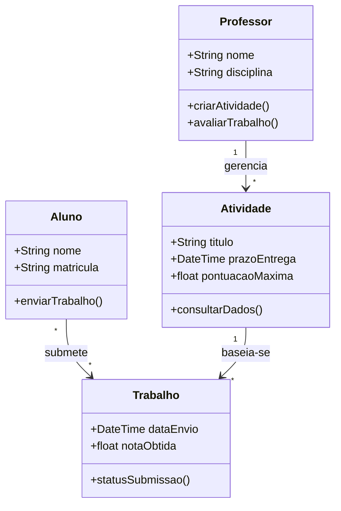
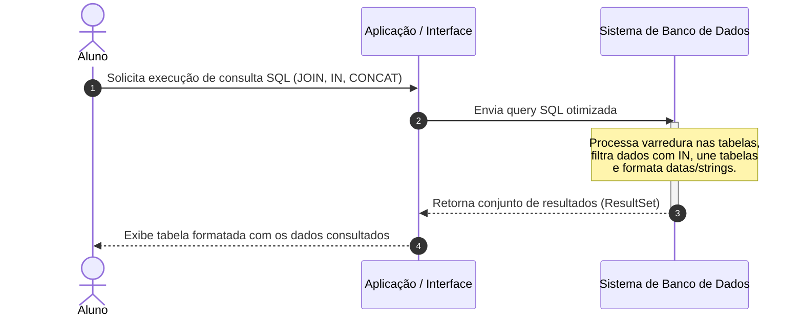
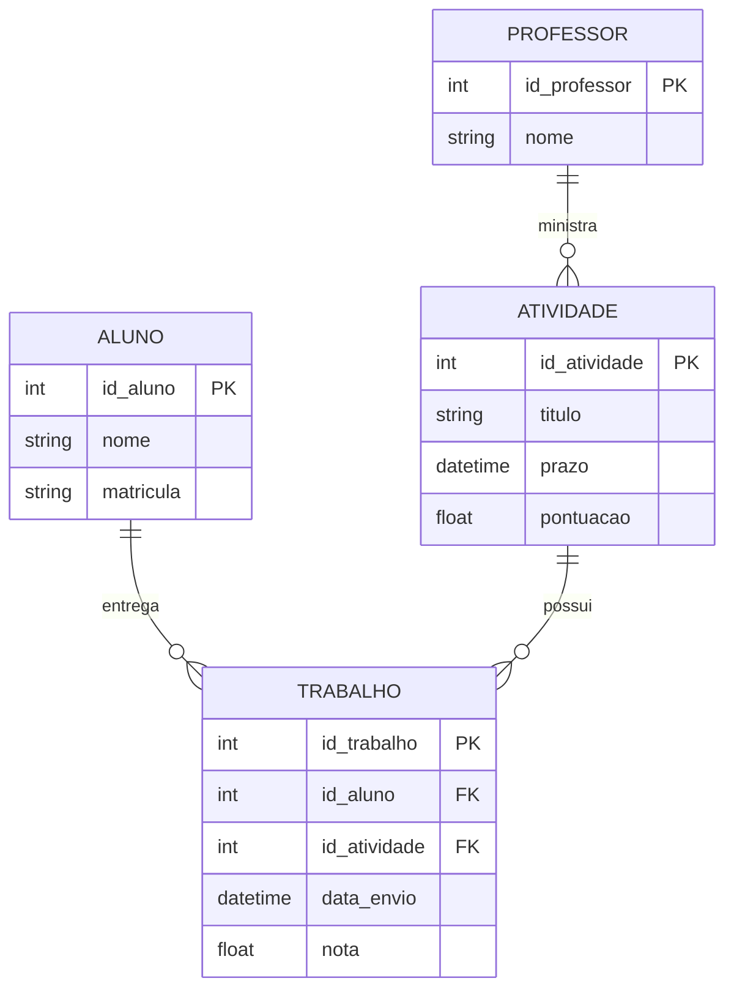

# 📚 Banco de Dados II - Prof. Guilherme de Morais

Material estruturado com base nos conteúdos de manipulação de dados (INSERT, DELETE, UPDATE), consultas avançadas (JOINs, operador IN, funções de data, hora e concatenação) e elaboração de projetos de banco de dados.

---

## 1. Diagrama de Classes UML (Domínio da Matéria)

O diagrama abaixo representa a estrutura lógica de controle acadêmico e submissão de atividades e trabalhos da disciplina.

### Explicação do Diagrama
* **Professor**: Responsável por criar e gerenciar as atividades/trabalhos e avaliar o desempenho.
* **Aluno**: Executa as tarefas práticas (como os exercícios de SQL) e submete os trabalhos no sistema.
* **Atividade**: Representa os materiais de aula (Aulas 03 a 05, manipulação de dados, consultas complexas, datas e concatenação).
* **Trabalho**: Vincula o aluno à atividade entregue, registrando prazos e pontuações máximas (ex: 100 pontos).

---

## 2. Diagrama de Sequência (Execução de Consulta SQL Complexa)

Este fluxo demonstra a interação entre o usuário/aluno, a camada de aplicação e o SGBD ao executar uma consulta avançada (envolvendo junções de tabelas, operador `IN`, filtros de data/hora e concatenação).

### Explicação do Fluxo
1. **Solicitação**: O aluno insere ou dispara uma query SQL complexa (abordada nos módulos de consultas, operações com duas tabelas e manipulação de datas/concatenação).
2. **Processamento**: O SGBD interpreta os comandos (como `SELECT`, `WHERE ... IN (...)`, `JOIN` e funções de manipulação de string/tempo).
3. **Retorno**: Os dados processados são devolvidos à interface e apresentados em formato tabular.

---

## 3. Diagrama Entidade-Relacionamento (ER)

Representação conceitual do banco de dados relacional abordado nas aulas práticas de elaboração de banco de dados e consultas com múltiplas tabelas.

### Explicação do Diagrama
* **Relacionamentos**: 
  * Um `PROFESSOR` pode criar várias `ATIVIDADES`.
  * Um `ALUNO` pode realizar múltiplos `TRABALHOS`.
  * Uma `ATIVIDADE` possui várias submissões de `TRABALHO` feitas por diferentes alunos.
* **Uso Prático**: Serve de base para exercitar comandos de criação (`CREATE`), inserção (`INSERT`), atualização (`UPDATE`), remoção (`DELETE`) e consultas relacionais (`INNER JOIN`, `LEFT JOIN`, etc.).