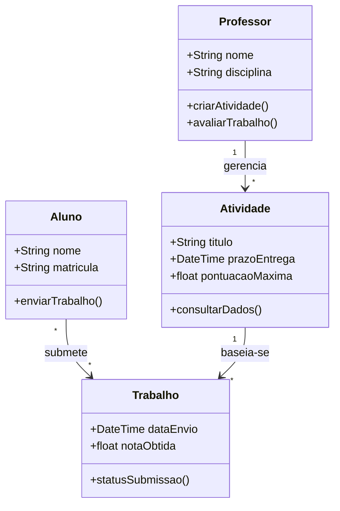
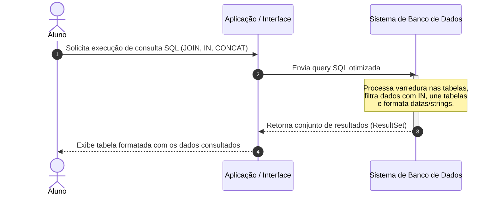
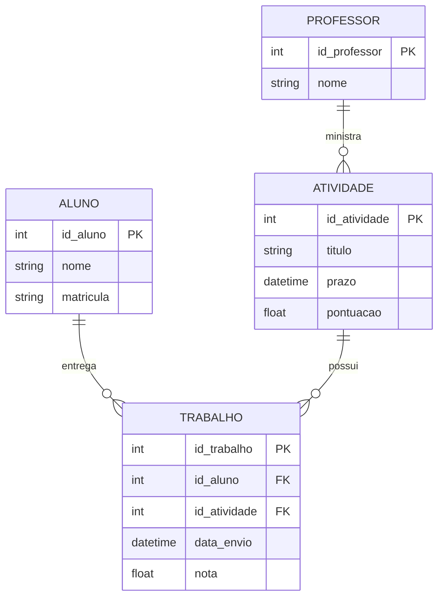

# Resumos-IA — Banco de Dados II

> **Docente:** Prof. Guilherme de Morais · **Semestre:** 3º Semestre · **Curso:** Bacharelado em Sistemas de Informação (UniFEF)

Material de apoio gerado por IA para revisão da disciplina, consolidado neste único
arquivo — resumo executivo, exercícios comentados, simulado com gabarito, cheat
sheet e diagramas de modelagem. Os únicos arquivos mantidos separados são os que
exigem formato próprio para funcionar: a apresentação em slides (`.pptx`), o baralho
de flashcards (`.tsv` para importar no Anki) e o dataset de perguntas e respostas
(`.jsonl`).

## Índice

1. [Resumo Executivo](#resumo-executivo)
2. [Exercícios Práticos e Código](#exercícios-práticos-e-código)
3. [Simulado Comentado](#simulado-comentado)
4. [CheatSheet de Revisão Rápida](#cheatsheet-de-revisão-rápida)
5. [Diagramas e Modelagem](#diagramas-e-modelagem)
6. [Apresentação de Revisão em Slides](#apresentação-de-revisão-em-slides)
7. [Flashcards para Anki](#flashcards-para-anki)
8. [Dataset de Perguntas e Respostas (JSONL)](#dataset-de-perguntas-e-respostas-jsonl)

---

## Resumo Executivo

### 1. Visão Geral e Objetivos da Matéria
A disciplina de **Banco de Dados II**, ministrada pelo **Prof. Guilherme de Morais**, aprofunda o conhecimento em Sistemas de Gerenciamento de Bancos de Dados Relacionais (SGBDRs) com foco intenso na manipulação, consulta e tratamento de dados através da linguagem **SQL (Structured Query Language)**.

O objetivo central é capacitar o estudante de Sistemas de Informação a extrair inteligência de negócios a partir de bases de dados relacionais estruturadas. Isso é feito por meio de operações que vão desde simples filtragens e ordenações até junções (*joins*) complexas, funções agregadas e manipulação avançada de tipos de dados (como datas, horas e strings), preparando o aluno para os desafios reais do mercado de desenvolvimento e análise de dados.

### 2. Conceitos-Chave e Terminologia Fundamental
* **SGBD (Sistema de Gerenciamento de Banco de Dados):** Software responsável por gerenciar o banco, garantindo integridade, segurança e eficiência (ex: PostgreSQL, MySQL).
* **Chave Primária (`PRIMARY KEY`):** Identificador único para cada registro em uma tabela, garantindo a unicidade e a integridade entitária.
* **Chave Estrangeira (`FOREIGN KEY`):** Campo ou conjunto de campos que faz referência à chave primária de outra tabela, estabelecendo o relacionamento relacional (integridade referencial).
* **Predicado `SELECT`:** O comando fundamental para recuperação de dados, atuando como a interface entre o usuário e o armazenamento persistente sem modificar os dados originais.
* **Case Sensitivity:** Sensibilidade a maiúsculas e minúsculas (crucial na diferenciação entre operadores como `LIKE` e `ILIKE`).

### 3. Principais Módulos / Tópicos Abordados

**Módulo 1 — Fundamentos de Consultas e Filtragem (`SELECT`, `WHERE`, `ORDER BY`, `DISTINCT`)**
* **Projeção e Seleção:** Uso do `SELECT` para escolher colunas específicas e do `WHERE` para filtrar linhas baseadas em operadores relacionais (`=`, `>`, `<`, `<=`, `<>`).
* **Operadores Lógicos (`AND`, `OR`):** Combinam múltiplos critérios de filtragem para refinar resultados.
* **Ordenação (`ORDER BY`):** Organiza o resultado da consulta de forma ascendente (`ASC`) ou descendente (`DESC`).
* **Eliminação de Duplicidades (`DISTINCT`):** Retorna apenas registros únicos para uma determinada coluna ou projeção.

**Módulo 2 — Manipulação Avançada de Padrões e Textos (`LIKE` / `ILIKE`)**
* O operador `LIKE` permite buscas baseadas em padrões de strings utilizando curingas: `%` (zero ou mais caracteres) e `_` (exatamente um caractere).
* *Nota técnica:* o `LIKE` é *case-sensitive*, enquanto o `ILIKE` (comum em SGBDs como o PostgreSQL) ignora diferenças entre maiúsculas e minúsculas.

**Módulo 3 — Funções Agregadas e Agrupamento (`GROUP BY`)**
* `AVG(coluna)`: média aritmética. `COUNT(*)`/`COUNT(coluna)`: número de ocorrências. `MAX`/`MIN(coluna)`: valores extremos. `SUM(coluna)`: totalização.
* *Regra de Ouro:* em consultas com funções agregadas, todas as colunas projetadas que não fazem parte de uma função agregada **devem** constar obrigatoriamente na cláusula `GROUP BY`. O `WHERE` filtra antes da agregação.

**Módulo 4 — Manipulação de Datas, Horas e Strings**
* **Data e Hora:** `NOW()` (data/hora atual), `DATE()` (extração de data pura), `AGE()` (cálculo de intervalos/idade) e `EXTRACT(PART FROM DATE)` (extrai ano, mês, dia ou hora).
* **Strings:** concatenação (`||`), `LENGTH()` (tamanho), `LOWER()`/`UPPER()` (caixa) e `ASCII()` (código numérico do caractere).

**Módulo 5 — Relacionamentos entre Múltiplas Tabelas e Chaves Estrangeiras**
* Integração de dados de duas ou mais tabelas (ex: `Clientes` e `Pedidos`, ou `Clientes` e `Veículos`) através de junções relacionais utilizando chaves primárias e estrangeiras — permite responder a perguntas de negócio como total gasto por cliente, maiores pedidos e clientes inativos.

### 4. Relações com o Mercado e Prática Profissional
No mercado de TI, a proficiência em SQL é pré-requisito fundamental para Desenvolvedores Back-End, Cientistas de Dados, Analistas de BI e Engenheiros de Dados:
* **Construção de Relatórios Gerenciais:** funções agregadas e agrupamentos para dashboards financeiros e operacionais.
* **Integridade de Dados:** modelagem correta com PK/FK, evitando anomalias de inserção, atualização e exclusão em sistemas transacionais (OLTP).
* **Performance e Otimização:** consultas eficientes que reduzem o custo computacional em grandes volumes de dados.

### 5. Dicas de Ouro para Estudo e Provas
1. **Ordem de Execução do SQL:** `FROM` → `WHERE` → `GROUP BY` → `HAVING` → `SELECT` → `ORDER BY` — por isso não se pode usar uma coluna criada no `SELECT` diretamente no `WHERE`.
2. **Funções Agregadas no `WHERE`:** o `WHERE` filtra linhas antes do agrupamento; para filtrar o resultado de uma agregação, use `HAVING`.
3. **Curingas do `LIKE`:** revise `A%` (começa com), `%A` (termina com) e `%A%` (contém).
4. **Concatenação e Datas:** pratique `AGE()`, `EXTRACT()` e `||`.
5. **Relacionamentos:** sempre confira a condição de junção (`ON TabelaA.Chave = TabelaB.Chave`) para evitar produto cartesiano indesejado.

---

## Exercícios Práticos e Código

> **Nota de curadoria:** o arquivo original desta seção (`Codigo-Exercicios/Exercicios-Praticos-Implementados.md`) foi salvo de forma incompleta (cortado na introdução, sem os exercícios em si). Em vez de inventar conteúdo novo, os exemplos de código abaixo foram reaproveitados — sem qualquer alteração — do CheatSheet e do gabarito do Simulado desta mesma matéria, que já cobrem DDL, DML, filtros, agregação e JOINs com SQL real e comentado.

**DDL e Restrições (criação de tabelas com PK/FK):**
```sql
CREATE TABLE clientes (
    cpf INT NOT NULL, nome VARCHAR(50), cidade VARCHAR(50), estado CHAR(2), salario INT, idade INT,
    CONSTRAINT PK_CPFcliente PRIMARY KEY (cpf)
);

CREATE TABLE veiculos (
    placa VARCHAR(10) NOT NULL, modelo VARCHAR(20), preco_venda INT, cpf_cli INT NOT NULL,
    CONSTRAINT pk_placa PRIMARY KEY (placa)
);

ALTER TABLE veiculos ADD CONSTRAINT fk_cpf_cli FOREIGN KEY (cpf_cli) REFERENCES clientes (cpf);
```

**DML — criação de tabela de itens de pedido com FKs compostas:**
```sql
CREATE TABLE ItensPedido (
    ItemPedidoID INT PRIMARY KEY,
    PedidoID INT,
    CodigoProduto INT,
    Quantidade INT,
    PrecoUnitario DECIMAL(10,2),
    CONSTRAINT fk_pedido FOREIGN KEY (PedidoID) REFERENCES Pedidos(PedidoID),
    CONSTRAINT fk_produto FOREIGN KEY (CodigoProduto) REFERENCES PRODUTO(CodigoProduto)
);

-- Inserção
INSERT INTO PRODUTO VALUES (5, 'Borracha', 'UN', 1.20);

-- Atualização
UPDATE PRODUTO
SET Val_Unit = 1.50
WHERE CodigoProduto = 5;
```

**JOINs — relatório de pedidos por cliente:**
```sql
SELECT c.Nome, p.DataPedido, p.Valor
FROM Clientes c
JOIN Pedidos p ON c.ClienteID = p.ClienteID;
```

**Agregação — total gasto por cliente, ordenado do maior para o menor:**
```sql
SELECT c.Nome, SUM(p.Valor) AS TotalGasto
FROM Clientes c
JOIN Pedidos p ON c.ClienteID = p.ClienteID
GROUP BY c.ClienteID, c.Nome
ORDER BY TotalGasto DESC;
```

**Funções de string, data e concatenação — frase formatada:**
```sql
SELECT UPPER(nome) || ' - ' || EXTRACT(YEAR FROM data_nascimento) || ' - ' || UPPER(cidade) AS frase_formatada
FROM funcionarios;
```

**Filtros e resolução rápida de exercícios típicos:**

| Objetivo / Exercício | Sintaxe SQL Resolvida |
| :--- | :--- |
| Aumento de 10% no salário | `SELECT nome, Salario_Fixo * 1.10 AS NovoSalario FROM VENDEDOR;` |
| Desconto de 12% para unidade 'M' | `SELECT Descricao, Val_Unit * 0.88 FROM PRODUTO WHERE Unidade = 'M';` |
| Alunos de Campinas pós-1990 | `SELECT * FROM ALUNO WHERE Cidade = 'Campinas' AND Data_Nasc > '1990-12-31';` |
| Produtos unidade 'M' com valor 0.50 ou 2.00 | `SELECT * FROM PRODUTO WHERE Unidade = 'M' AND Val_Unit IN (0.50, 2.00);` |

---

## Simulado Comentado

Simulado completo (base no material do Prof. Guilherme de Morais) com **10 questões de múltipla escolha** (gabarito comentado) e **5 questões práticas de SQL**.

### Parte 1 — Múltipla escolha

**1.** Sobre a linguagem SQL e o comando `SELECT`, assinale a alternativa correta:
A) Modifica permanentemente os dados. B) `*` seleciona apenas a primeira coluna. **C) É utilizado para buscar e consultar informações sem modificá-las.** D) `FROM` é opcional. E) `WHERE` vem depois de `ORDER BY`.
> *O `SELECT` é puramente estruturado para consultas, não altera dados (papel do `UPDATE`/`INSERT`/`DELETE`).*

**2.** Para que serve `ORDER BY`?
A) Filtrar linhas. B) Agrupar registros. C) Limitar linhas retornadas. **D) Ordenar o resultado (ASC/DESC).** E) Unir tabelas.
> *`ORDER BY` organiza a ordenação, crescente ou decrescente.*

**3.** `SELECT nome, AGE(NOW(), data_nascimento) FROM funcionarios;` — qual a função de `AGE()`?
A) Média entre datas. B) Extrair o ano. **C) Calcular a diferença (idade) entre duas datas.** D) Converter string em data. E) Código ASCII.
> *`AGE()` calcula o intervalo entre duas datas — muito usada para idade a partir da data de nascimento.*

**4.** Sobre `LIKE` e curingas (`%`, `_`):
A) `%` = exatamente um caractere. B) `_` = zero ou mais caracteres. **C) `LIKE` é case-sensitive no PostgreSQL; use `ILIKE` para ignorar.** D) Só funciona com `GROUP BY`. E) `'%a%'` seleciona só quem começa com 'a'.
> *`LIKE` diferencia maiúsculas/minúsculas; `%` = múltiplos caracteres, `_` = um caractere.*

**5.** Sobre funções agregadas (`AVG`, `COUNT`, `MAX`, `MIN`, `SUM`):
A) Podem ir no `WHERE`. B) Ficam entre `SELECT` e `FROM`. **C) Colunas não agregadas no `SELECT` devem constar no `GROUP BY`.** D) `COUNT(*)` conta só nulos. E) `SUM` calcula média.
> *Regra clássica: colunas comuns junto de agregadas exigem `GROUP BY`; agregadas não vão no `WHERE` (usa-se `HAVING`).*

**6.** Função de string para concatenar textos e colunas:
A) `JOIN`. **B) `CONCAT()` ou o operador `||`.** C) `MERGE()`. D) `UNION ALL`. E) `SUBSTRING()`.
> *Concatenação em SQL/PostgreSQL: `||` ou `CONCAT()`.*

**7.** `ALTER TABLE veiculos ADD CONSTRAINT fk_cpf_cli FOREIGN KEY (cpf_cli) REFERENCES clientes (cpf);` — o que faz?
A) Cria tabela `veiculos`. B) Insere um cliente. **C) Define `cpf_cli` como FK referenciando `cpf` de `clientes`, garantindo integridade referencial.** D) Exclui clientes e veículos. E) Atualiza preços.
> *`ALTER TABLE ... ADD CONSTRAINT ... FOREIGN KEY ... REFERENCES` define a restrição de integridade referencial.*

**8.** Sintaxe para produtos com valor unitário entre 0.50 e 10.00:
**A) `SELECT * FROM PRODUTO WHERE Val_Unit BETWEEN 0.50 AND 10.00;`** B) `... > 0.50 OR < 10.00`. C) `LIMIT 0.50 TO 10.00`. D) `ORDER BY Val_Unit 0.50, 10.00`. E) `GROUP BY Val_Unit BETWEEN ...`.
> *`BETWEEN` é ideal para intervalos inclusivos, equivalente a `>= AND <=`.*

**9.** Utilidade do `DISTINCT`:
A) Ordenar decrescente. B) Contar linhas. **C) Remover linhas duplicadas do resultado.** D) Produto cartesiano. E) Filtrar nulos.
> *`DISTINCT` elimina duplicatas das colunas selecionadas.*

**10.** Operador para exigir que **ambas** as condições do `WHERE` sejam verdadeiras:
A) `OR`. B) `NOT`. **C) `AND`.** D) `UNION`. E) `LIKE`.
> *`AND` exige que todas as condições conectadas sejam verdadeiras.*

### Parte 2 — Questões práticas de SQL (com gabarito)

**11. DDL e Restrições** — criar `ItensPedido` (PK `ItemPedidoID`, FKs para `Pedidos` e `PRODUTO`, `Quantidade`, `PrecoUnitario`):
```sql
CREATE TABLE ItensPedido (
    ItemPedidoID INT PRIMARY KEY,
    PedidoID INT,
    CodigoProduto INT,
    Quantidade INT,
    PrecoUnitario DECIMAL(10,2),
    CONSTRAINT fk_pedido FOREIGN KEY (PedidoID) REFERENCES Pedidos(PedidoID),
    CONSTRAINT fk_produto FOREIGN KEY (CodigoProduto) REFERENCES PRODUTO(CodigoProduto)
);
```

**12. DML (Insert/Update)** — cadastrar produto `Borracha` (código 5, UN, R$1.20) e depois atualizar o valor para R$1.50:
```sql
INSERT INTO PRODUTO VALUES (5, 'Borracha', 'UN', 1.20);

UPDATE PRODUTO
SET Val_Unit = 1.50
WHERE CodigoProduto = 5;
```

**13. JOINs e Filtragem** — nome do cliente, data e valor de todos os pedidos:
```sql
SELECT c.Nome, p.DataPedido, p.Valor
FROM Clientes c
JOIN Pedidos p ON c.ClienteID = p.ClienteID;
```

**14. Funções Agregadas e GROUP BY** — total gasto por cliente, do maior para o menor:
```sql
SELECT c.Nome, SUM(p.Valor) AS TotalGasto
FROM Clientes c
JOIN Pedidos p ON c.ClienteID = p.ClienteID
GROUP BY c.ClienteID, c.Nome
ORDER BY TotalGasto DESC;
```

**15. Funções de String, Data e Concatenação** — frase formatada `NOME - ANO - CIDADE` em maiúsculas:
```sql
SELECT UPPER(nome) || ' - ' || EXTRACT(YEAR FROM data_nascimento) || ' - ' || UPPER(cidade) AS frase_formatada
FROM funcionarios;
```

---

## CheatSheet de Revisão Rápida

### DDL, DML & Restrições (Constraints)
```sql
CREATE TABLE clientes (
    cpf INT NOT NULL, nome VARCHAR(50), cidade VARCHAR(50), estado CHAR(2), salario INT, idade INT,
    CONSTRAINT PK_CPFcliente PRIMARY KEY (cpf)
);

CREATE TABLE veiculos (
    placa VARCHAR(10) NOT NULL, modelo VARCHAR(20), preco_venda INT, cpf_cli INT NOT NULL,
    CONSTRAINT pk_placa PRIMARY KEY (placa)
);

ALTER TABLE veiculos ADD CONSTRAINT fk_cpf_cli FOREIGN KEY (cpf_cli) REFERENCES clientes (cpf);
```

### Filtragem Avançada (`WHERE`, `LIKE`, `BETWEEN`, `IN`)
* **`LIKE` vs `ILIKE`**: `LIKE` é *case-sensitive*. `ILIKE` é *case-insensitive*.
* **Curingas**: `%` (zero ou mais caracteres) | `_` (exatamente um caractere). Ex.: `WHERE nome LIKE 'A_%S'` → começa com 'A', tem ao menos uma letra no meio, termina com 'S'.
* **`BETWEEN`**: intervalo inclusivo — `WHERE salario BETWEEN 2000 AND 4000`.
* **`IN`**: múltiplos valores — `WHERE estado IN ('SP', 'RJ', 'MG')`.

### Funções de String, Data e Hora
**Data/Hora:** `NOW()` (atual) · `DATE(NOW())` (só a data) · `AGE(fim, inicio)` (intervalo — ex.: `AGE(NOW(), data_nascimento)` → idade exata) · `EXTRACT(part FROM data)` (`YEAR`, `MONTH`, `DAY`, `HOUR`) · filtro: `WHERE AGE(NOW(), data_nasc) > INTERVAL '30 years'`.

**String:** `||` (concatenação) · `LENGTH(texto)` · `LOWER()`/`UPPER()` · `ASCII(caractere)` (ex.: `ASCII('A')` → `65`) · `SUBSTRING(texto FROM inicio FOR tamanho)`.

### Funções Agregadas & Agrupamento (`GROUP BY`/`HAVING`)
`AVG(col)` · `COUNT(col)` · `MAX(col)` · `MIN(col)` · `SUM(col)`.

**Regras de ouro:** (1) agregadas não vão no `WHERE`; (2) coluna não agregada no `SELECT` deve constar no `GROUP BY`; (3) filtro sobre resultado agregado usa `HAVING`.

```sql
SELECT ClienteID, COUNT(PedidoID) AS Qtd, SUM(Valor) AS Total
FROM Pedidos
GROUP BY ClienteID
HAVING COUNT(PedidoID) > 1;
```

### Consultas Multi-tabelas (JOINs)
* **`INNER JOIN`**: só registros com correspondência em ambas as tabelas.
* **`LEFT JOIN`**: todos da esquerda + correspondentes da direita (`NULL` quando não há match — útil para achar "órfãos").

```sql
-- Clientes e seus pedidos
SELECT C.Nome, P.PedidoID, P.Valor
FROM Clientes C
INNER JOIN Pedidos P ON C.ClienteID = P.ClienteID;

-- Clientes sem nenhum pedido
SELECT C.Nome, C.Cidade
FROM Clientes C
LEFT JOIN Pedidos P ON C.ClienteID = P.ClienteID
WHERE P.PedidoID IS NULL;
```

### Resolução Rápida de Exercícios Típicos

| Objetivo / Exercício | Sintaxe SQL Resolvida |
| :--- | :--- |
| Aumento de 10% no salário | `SELECT nome, Salario_Fixo * 1.10 AS NovoSalario FROM VENDEDOR;` |
| Desconto de 12% para unidade 'M' | `SELECT Descricao, Val_Unit * 0.88 FROM PRODUTO WHERE Unidade = 'M';` |
| Alunos de Campinas pós-1990 | `SELECT * FROM ALUNO WHERE Cidade = 'Campinas' AND Data_Nasc > '1990-12-31';` |
| Produtos unidade 'M' com valor 0.50 ou 2.00 | `SELECT * FROM PRODUTO WHERE Unidade = 'M' AND Val_Unit IN (0.50, 2.00);` |

---

## Diagramas e Modelagem

Material estruturado com base nos conteúdos de manipulação de dados (`INSERT`, `DELETE`, `UPDATE`), consultas avançadas (JOINs, operador `IN`, funções de data/hora/concatenação) e elaboração de projetos de banco de dados.

### Diagrama de Classes UML (domínio da matéria)



**Professor**: cria/gerencia atividades e avalia desempenho. **Aluno**: executa exercícios de SQL e submete trabalhos. **Atividade**: materiais de aula (Aulas 03 a 05, manipulação de dados, consultas complexas, datas/concatenação). **Trabalho**: vincula aluno à entrega, com prazo e pontuação.

### Diagrama de Sequência (execução de consulta SQL complexa)



1. **Solicitação**: o aluno dispara uma query SQL complexa. 2. **Processamento**: o SGBD interpreta `SELECT`, `WHERE ... IN (...)`, `JOIN` e funções de string/tempo. 3. **Retorno**: dados formatados em tabela na interface.

### Diagrama Entidade-Relacionamento (ER)



Um `PROFESSOR` cria várias `ATIVIDADES`; um `ALUNO` realiza múltiplos `TRABALHOS`; uma `ATIVIDADE` recebe várias submissões de `TRABALHO`. Base para exercitar `CREATE`, `INSERT`, `UPDATE`, `DELETE` e consultas relacionais (`INNER`/`LEFT JOIN`).

---

## Apresentação de Revisão em Slides

[`Slides-Revisao-Banco de Dados II.pptx`](./Slides-Revisao-Banco%20de%20Dados%20II.pptx) — deck de revisão em 5 slides (Capa, Visão Geral, Conceitos Fundamentais, Exercícios & Prática, Dicas de Prova), com design dark mode Slate/Navy/Teal/Indigo, layout 16:9 widescreen e tipografia ajustada para caber sem overflow em qualquer leitor de PowerPoint.

## Flashcards para Anki

[`flashcards-anki.tsv`](./flashcards-anki.tsv) — 24 cartões pergunta/resposta cobrindo `LIKE`/`ILIKE`, curingas, funções de data/string e agregação. Para importar: no Anki, **Arquivo → Importar**, selecione o `.tsv` e mapeie as colunas como *Frente* (pergunta) e *Verso* (resposta), separador **Tab**.

## Dataset de Perguntas e Respostas (JSONL)

[`dataset-estudo-qa.jsonl`](./dataset-estudo-qa.jsonl) — 15 pares de pergunta/resposta estruturados (`id`, `topico`, `pergunta`, `resposta`, `dificuldade`), prontos para consumo por ferramentas de estudo ou fine-tuning leve. Amostra:

```json
{"id": 1, "topico": "INSERT, DELETE e UPDATE", "pergunta": "Qual é a função do comando INSERT em Banco de Dados Relacionais?", "resposta": "O comando INSERT é utilizado para adicionar uma ou mais novas linhas (registros) em uma tabela existente.", "dificuldade": "facil"}
{"id": 2, "topico": "INSERT, DELETE e UPDATE", "pergunta": "Por que o uso da cláusula WHERE é crítico ao executar o comando DELETE?", "resposta": "A cláusula WHERE especifica quais registros devem ser excluídos. Sem ela, o comando DELETE removerá todas as linhas da tabela.", "dificuldade": "medio"}
{"id": 3, "topico": "INSERT, DELETE e UPDATE", "pergunta": "Como o comando UPDATE altera dados existentes em uma tabela?", "resposta": "O UPDATE modifica os valores de colunas específicas em linhas que atendem à condição especificada na cláusula WHERE.", "dificuldade": "medio"}
```
