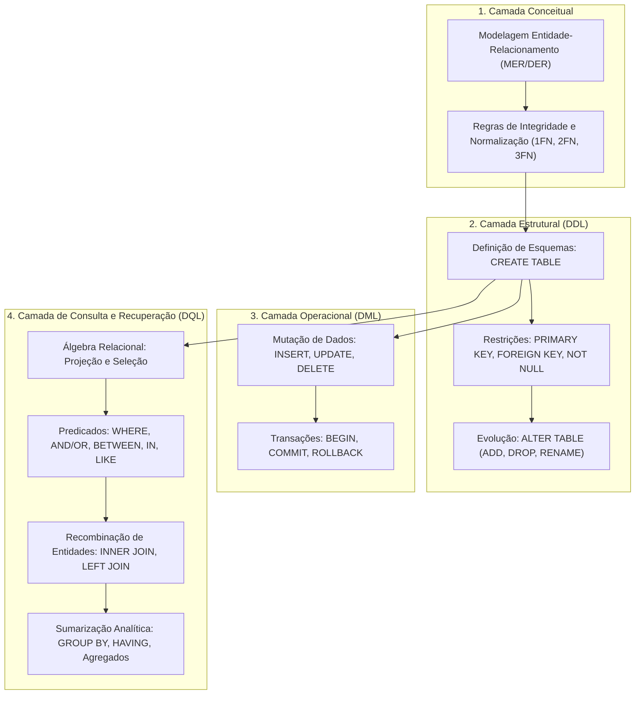
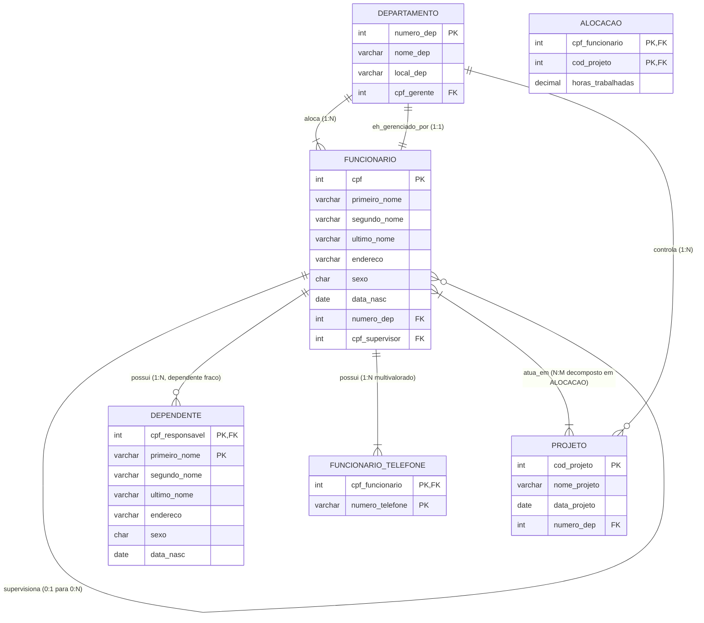
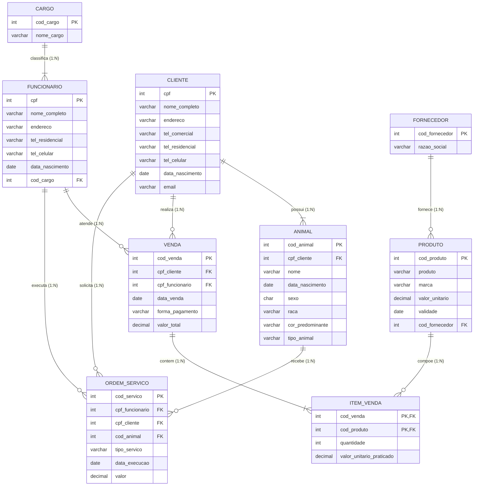
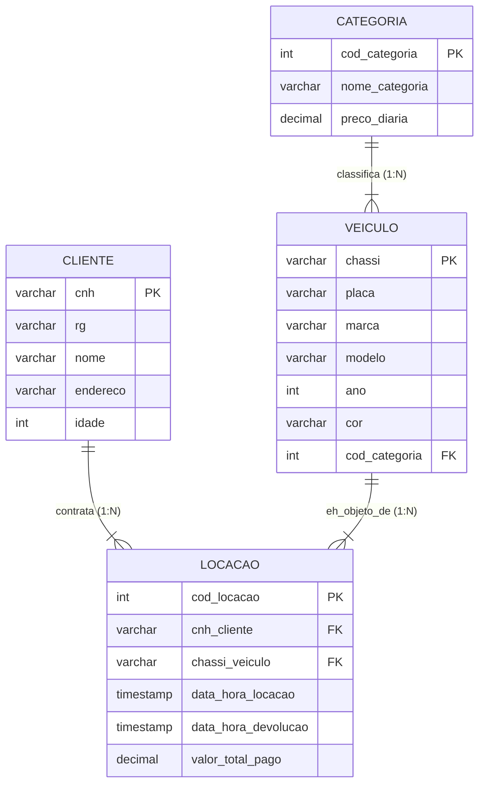
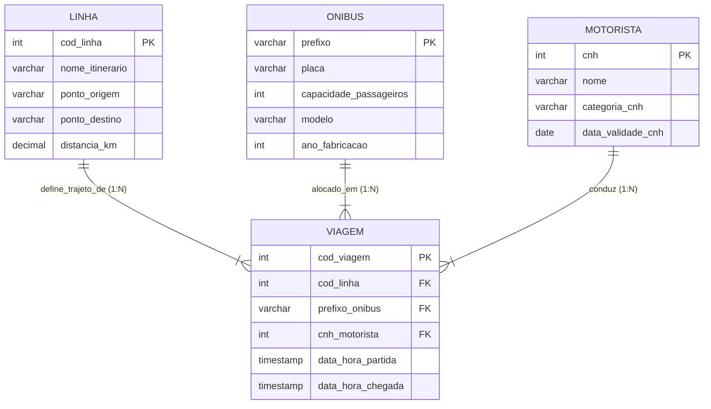
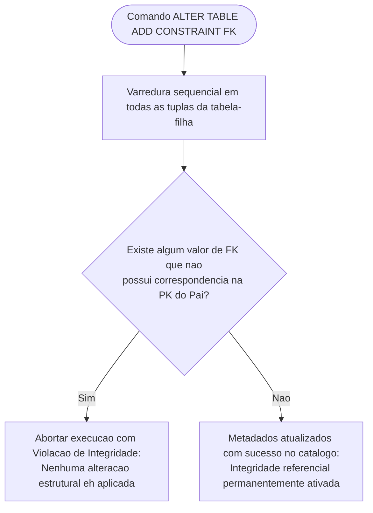
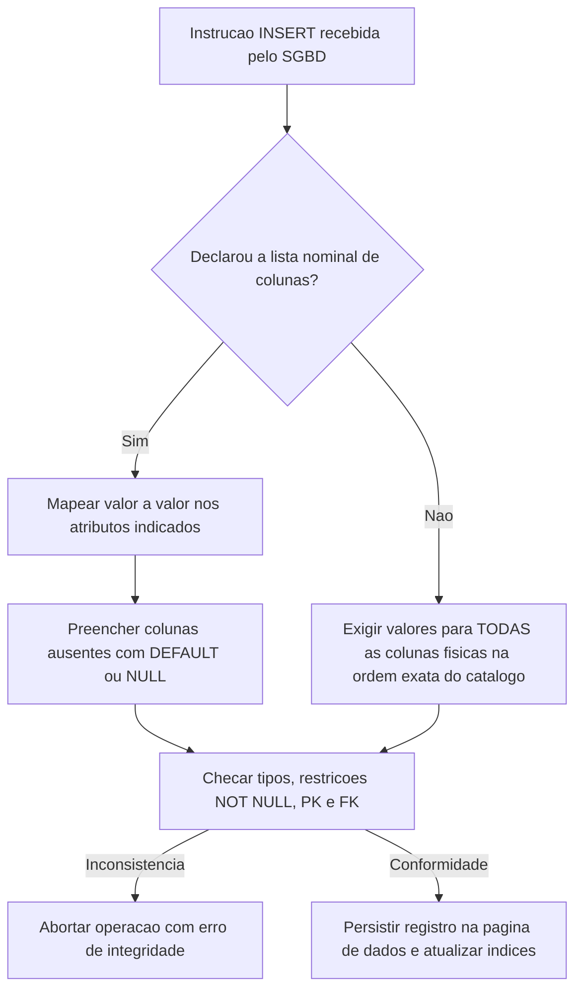
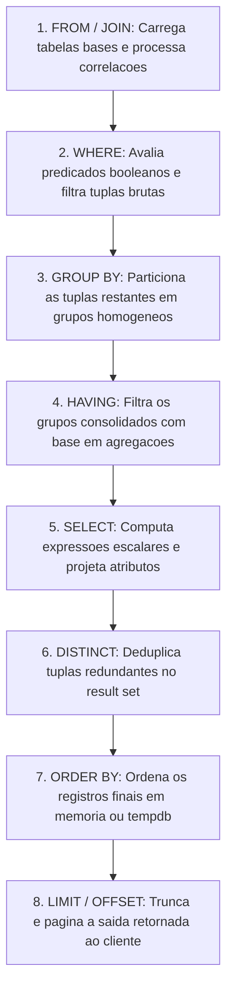
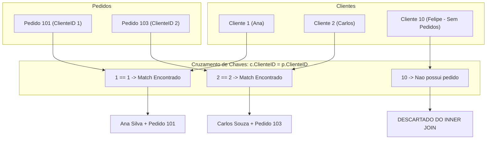

# Manual Integrado de Banco de Dados II: Engenharia de Dados Relacionais, Modelagem Conceitual e Álgebra de Consultas em SQL

**Instituição:** Centro Universitário de Santa Fé do Sul (UniFEF)  
**Curso:** Bacharelado em Sistemas de Informação  
**Disciplina:** Banco de Dados II (3º Semestre)  
**Docente:** Prof. Guilherme de Morais  
**Natureza do Documento:** Guia Acadêmico e Técnico Integrado de Aulas Teóricas, Laboratórios Práticos e Resolução de Trabalhos  

---

## Sumário

- [Visão Geral e Fundamentação da Disciplina](#visão-geral-e-fundamentação-da-disciplina)
- [Módulo 1: Modelagem Conceitual Avançada e Engenharia de Diagramas Entidade-Relacionamento](#módulo-1-modelagem-conceitual-avançada-e-engenharia-de-diagramas-entidade-relacionamento)
  - [Conceitos Estruturais: Entidades Fortes, Entidades Fracas e Dependência Existencial](#conceitos-estruturais-entidades-fortes-entidades-fracas-e-dependência-existencial)
  - [Tipologia e Decomposição de Atributos](#tipologia-e-decomposição-de-atributos)
  - [Cardinalidades, Papéis e Relacionamentos Recursivos](#cardinalidades-papéis-e-relacionamentos-recursivos)
  - [Decomposição de Relacionamentos Muitos-para-Muitos e Atributos Associativos](#decomposição-de-relacionamentos-muitos-para-muitos-e-atributos-associativos)
  - [Estudos de Caso de Modelagem Conceitual](#estudos-de-caso-de-modelagem-conceitual)
    - [Estudo de Caso 1: Empresa Corporativa](#estudo-de-caso-1-empresa-corporativa)
    - [Estudo de Caso 2: Sistema Integrado de Pet-Shop](#estudo-de-caso-2-sistema-integrado-de-pet-shop)
    - [Estudo de Caso 3: Locadora de Veículos](#estudo-de-caso-3-locadora-de-veículos)
    - [Estudo de Caso 4: Companhia de Transporte Coletivo](#estudo-de-caso-4-companhia-de-transporte-coletivo)
- [Módulo 2: Linguagem de Definição de Dados e Evolução Estrutural de Esquemas](#módulo-2-linguagem-de-definição-de-dados-e-evolução-estrutural-de-esquemas)
  - [Catálogo de Dados, Criação de Bancos e Contexto de Execução](#catálogo-de-dados-criação-de-bancos-e-contexto-de-execução)
  - [Mapeamento de Domínios e Tipagem Estrita de Dados](#mapeamento-de-domínios-e-tipagem-estrita-de-dados)
  - [Chaves Primárias e Integridade de Entidade](#chaves-primárias-e-integridade-de-entidade)
  - [Chaves Estrangeiras e Integridade Referencial](#chaves-estrangeiras-e-integridade-referencial)
    - [Declaração Inline versus Out-of-Line em CREATE TABLE](#declaração-inline-versus-out-of-line-em-create-table)
    - [Adição Tardia de Chave Estrangeira com ALTER TABLE ADD CONSTRAINT](#adição-tardia-de-chave-estrangeira-com-alter-table-add-constraint)
    - [Validação em Tabelas Populadas e Risco de Registros Órfãos](#validação-em-tabelas-populadas-e-risco-de-registros-órfãos)
    - [Ordem Topológica de Criação e Destruição de Tabelas](#ordem-topológica-de-criação-e-destruição-de-tabelas)
  - [Operações de Evolução Estrutural com ALTER TABLE](#operações-de-evolução-estrutural-com-alter-table)
    - [Inclusão de Colunas com ADD COLUMN](#inclusão-de-colunas-com-add-column)
    - [Remoção de Colunas com DROP COLUMN](#remoção-de-colunas-com-drop-column)
    - [Remoção de Restrições Estruturais com DROP CONSTRAINT](#remoção-de-restrições-estruturais-com-drop-constraint)
    - [Renomeação de Colunas e Tabelas com RENAME](#renomeação-de-colunas-e-tabelas-com-rename)
- [Módulo 3: Linguagem de Manipulação de Dados e Blindagem Transacional](#módulo-3-linguagem-de-manipulação-de-dados-e-blindagem-transacional)
  - [Inserção de Tuplas com INSERT INTO](#inserção-de-tuplas-com-insert-into)
    - [Mapeamento Explícito de Colunas versus Inserção Posicional](#mapeamento-explícito-de-colunas-versus-inserção-posicional)
    - [Tratamento de Colunas Omitidas, Nulos e Padrões](#tratamento-de-colunas-omitidas-nulos-e-padrões)
    - [Padronização de Literais Temporais e Formatos Numéricos](#padronização-de-literais-temporais-e-formatos-numéricos)
  - [Atualização de Estados Relacionais com UPDATE](#atualização-de-estados-relacionais-com-update)
    - [Sintaxe, Cláusula SET e Avaliação de Expressões](#sintaxe-cláusula-set-e-avaliação-de-expressões)
    - [Riscos Sistêmicos da Omissão da Cláusula WHERE](#riscos-sistêmicos-da-omissão-da-cláusula-where)
  - [Remoção de Registros com DELETE FROM](#remoção-de-registros-com-delete-from)
    - [Diferenciação Crítica: DELETE versus TRUNCATE versus DROP](#diferenciação-crítica-delete-versus-truncate-versus-drop)
    - [Restrições de Exclusão por Integridade Referencial Ativa](#restrições-de-exclusão-por-integridade-referencial-ativa)
  - [Engenharia Defensiva: Práticas Seguras de Manutenção](#engenharia-defensiva-práticas-seguras-de-manutenção)
- [Módulo 4: Linguagem de Consulta de Dados - Arquitetura, Projeção e Ordenação](#módulo-4-linguagem-de-consulta-de-dados---arquitetura-projeção-e-ordenação)
  - [Fundamentos na Álgebra Relacional: Projeção e Seleção](#fundamentos-na-álgebra-relacional-projeção-e-seleção)
  - [Ciclo de Processamento e Pipeline Lógico de Execução do Motor SQL](#ciclo-de-processamento-e-pipeline-lógico-de-execução-do-motor-sql)
  - [Projeção de Colunas: Seletividade versus Caractere Coringa](#projeção-de-colunas-seletividade-versus-caractere-coringa)
  - [Ordenação Determinística com ORDER BY](#ordenação-determinística-com-order-by)
    - [Ordenação Simples, Composta e Sentidos de Classificação](#ordenação-simples-composta-e-sentidos-de-classificação)
    - [Comportamento e Posicionamento de Valores Nulos](#comportamento-e-posicionamento-de-valores-nulos)
  - [Transformações Escalares: Expressões Aritméticas e Escopo de Aliases](#transformações-escalares-expressões-aritméticas-e-escopo-de-aliases)
    - [Operadores Aritméticos e Cálculos Percentuais](#operadores-aritméticos-e-cálculos-percentuais)
    - [Atribuição de Pseudônimos com AS e Visibilidade Léxica](#atribuição-de-pseudônimos-com-as-e-visibilidade-léxica)
  - [Eliminação de Redundâncias com DISTINCT](#eliminação-de-redundâncias-com-distinct)
- [Módulo 5: Predicados Lógicos, Relacionais, Intervalares e Casamento de Padrões](#módulo-5-predicados-lógicos-relacionais-intervalares-e-casamento-de-padrões)
  - [Filtragem Condicional Básica com Cláusula WHERE e Operadores de Comparação](#filtragem-condicional-básica-com-cláusula-where-e-operadores-de-comparação)
  - [Composição Booleana: AND, OR e Negação com NOT](#composição-booleana-and-or-e-negação-com-not)
    - [Tabela-Verdade e Precedência de Operadores](#tabela-verdade-e-precedência-de-operadores)
    - [O Uso Mandatório de Parênteses em Predicados Mistos](#o-uso-mandatório-de-parênteses-em-predicados-mistos)
  - [Filtragem Intervalar com BETWEEN e NOT BETWEEN](#filtragem-intervalar-com-between-e-not-between)
    - [Inclusividade Estrita dos Limites](#inclusividade-estrita-dos-limites)
    - [A Armadilha da Inversão de Limites Algébricos](#a-armadilha-da-inversão-de-limites-algébricos)
  - [Pertinência a Conjuntos Discretos: Operadores IN e NOT IN](#pertinência-a-conjuntos-discretos-operadores-in-e-not-in)
    - [Equivalência Lógica com Disjunções Sucessivas](#equivalência-lógica-com-disjunções-sucessivas)
    - [O Efeito Catastrófico do Valor NULL sob Lógica Trivalente](#o-efeito-catastrófico-do-valor-null-sob-lógica-trivalente)
  - [Casamento de Padrões Textuais: LIKE, ILIKE e Metacaracteres](#casamento-de-padrões-textuais-like-ilike-e-metacaracteres)
    - [Semântica dos Curingas Percentual e Sublinhado](#semântica-dos-curingas-percentual-e-sublinhado)
    - [Sensibilidade à Caixa e Normalização com UPPER e LOWER](#sensibilidade-à-caixa-e-normalização-com-upper-e-lower)
- [Módulo 6: Funções Escalares de Data, Hora e Manipulação de Strings](#módulo-6-funções-escalares-de-data-hora-e-manipulação-de-strings)
  - [Operações Temporais no PostgreSQL e Padrão SQL](#operações-temporais-no-postgresql-e-padrão-sql)
    - [Carimbos Transacionais com NOW e Coerção com DATE](#carimbos-transacionais-com-now-e-coerção-com-date)
    - [Cálculo Preciso de Diferenças Calendárias com AGE](#cálculo-preciso-de-diferenças-calendárias-com-age)
    - [Decomposição de Campos Temporais com EXTRACT](#decomposição-de-campos-temporais-com-extract)
  - [Aritmética Temporal com o Tipo INTERVAL e Sargabilidade de Índices](#aritmética-temporal-com-o-tipo-interval-e-sargabilidade-de-índices)
  - [Funções Escalares de Texto e Caracteres](#funções-escalares-de-texto-e-caracteres)
    - [Resolução de Código de Caractere com ASCII](#resolução-de-código-de-caractere-com-ascii)
    - [Medição de Extensão Textual com LENGTH](#medição-de-extensão-textual-com-length)
    - [Conversão de Caixa com LOWER e UPPER](#conversão-de-caixa-com-lower-e-upper)
    - [Operador de Concatenação e Contaminação por Nulo](#operador-de-concatenação-e-contaminação-por-nulo)
    - [Fatiamento Posicional de Texto com SUBSTRING](#fatiamento-posicional-de-texto-com-substring)
- [Módulo 7: Junções Relacionais e Recombinação de Dados Normalizados](#módulo-7-junções-relacionais-e-recombinação-de-dados-normalizados)
  - [Fundamentação na Álgebra Relacional: Produto Cartesiano e Teta-Junção](#fundamentação-na-álgebra-relacional-produto-cartesiano-e-teta-junção)
  - [Evolução Histórica da Sintaxe: ANSI SQL-89 versus ANSI SQL-92](#evolução-histórica-da-sintaxe-ansi-sql-89-versus-ansi-sql-92)
  - [Junção Interna: INNER JOIN](#junção-interna-inner-join)
  - [Junção Externa à Esquerda: LEFT JOIN](#junção-externa-à-esquerda-left-join)
    - [Semântica de Preservação e Preenchimento por Nulos](#semântica-de-preservação-e-preenchimento-por-nulos)
    - [Padrão de Antijunção para Identificação de Registros Órfãos](#padrão-de-antijunção-para-identificação-de-registros-órfãos)
    - [A Armadilha de Igualdade Escalar com Nulo](#a-armadilha-de-igualdade-escalar-com-nulo)
  - [Junções em Múltiplas Tabelas e Qualificação de Identificadores](#junções-em-múltiplas-tabelas-e-qualificação-de-identificadores)
- [Módulo 8: Funções Agregadas, Particionamento e Filtragem de Grupos](#módulo-8-funções-agregadas-particionamento-e-filtragem-de-grupos)
  - [Funções Agregadas de Sumarização](#funções-agregadas-de-sumarização)
    - [Contagem de Linhas e Entidades: COUNT(*) versus COUNT(coluna)](#contagem-de-linhas-e-entidades-count-versus-countcoluna)
    - [Totalizações, Médias e Extremos: SUM, AVG, MAX e MIN](#totalizações-médias-e-extremos-sum-avg-max-e-min)
    - [Tratamento Silencioso de Valores Nulos em Agregações](#tratamento-silencioso-de-valores-nulos-em-agregações)
  - [Particionamento Relacional com GROUP BY](#particionamento-relacional-com-group-by)
    - [A Regra de Ouro do GROUP BY e Restrições de Projeção](#a-regra-de-ouro-do-group-by-e-restrições-de-projeção)
    - [Agrupamentos Simples e Multidimensionais](#agrupamentos-simples-e-multidimensionais)
  - [Filtragem sobre Grupos com Cláusula HAVING](#filtragem-sobre-grupos-com-cláusula-having)
    - [Separação Conceitual e Arquitetural entre WHERE e HAVING](#separação-conceitual-e-arquitetural-entre-where-e-having)
    - [A Proibição Formal de Funções Agregadas no WHERE](#a-proibição-formal-de-funções-agregadas-no-where)
- [Módulo 9: Resoluções Exaustivas das Listas Práticas e Exercícios de Fixação](#módulo-9-resoluções-exaustivas-das-listas-práticas-e-exercícios-de-fixação)
  - [Base de Dados A: EscolaDB](#base-de-dados-a-escoladb)
  - [Base de Dados B: Comercial e Vendas (Atividade Material 04)](#base-de-dados-b-comercial-e-vendas-atividade-material-04)
    - [Resolução Estruturada dos Exercícios Básicos (1 a 25)](#resolução-estruturada-dos-exercícios-básicos-1-a-25)
    - [Resolução Estruturada dos Exercícios Avançados e Desafios (1 a 10)](#resolução-estruturada-dos-exercícios-avançados-e-desafios-1-a-10)
    - [Resolução Analítica do Exercício do Slide 16](#resolução-analítica-do-exercício-do-slide-16)
  - [Base de Dados C: Concessionária de Veículos (Atividade Aula 05)](#base-de-dados-c-concessionária-de-veículos-atividade-aula-05)
    - [Ajustes de Compatibilidade Estrutural DDL/DML](#ajustes-de-compatibilidade-estrutural-ddldml)
    - [Resolução Estruturada dos 20 Exercícios de Consulta](#resolução-estruturada-dos-20-exercícios-de-consulta)
- [Módulo 10: Catálogo de Armadilhas, Antipadrões e Diretrizes de Engenharia](#módulo-10-catálogo-de-armadilhas-antipadrões-e-diretrizes-de-engenharia)
- [Módulo 11: Simulado Integrado e Questões Discursivas](#módulo-11-simulado-integrado-e-questões-discursivas)
- [Glossário Terminológico](#glossário-terminológico)

---

## Visão Geral e Fundamentação da Disciplina

A disciplina de Banco de Dados II do curso de Sistemas de Informação da UniFEF, ministrada pelo Prof. Guilherme de Morais, consolida a transição do nível conceitual e lógico para o nível físico e operacional de engenharia de software relacional. Enquanto a disciplina introdutória estabelece as fundações da teoria de conjuntos e do modelo entidade-relacionamento elementar, este módulo foca na manipulação programática, integridade estrutural via catálogo, álgebra de consultas com o padrão SQL ANSI/ISO e garantia de invariantes de negócio diretamente no mecanismo de persistência.

O objetivo deste manual é unificar todas as lições teóricas (Aulas 01 a 07), práticas laboratoriais e trabalhos avaliativos em um corpo de conhecimento coeso, formal e rigoroso.



---

## Módulo 1: Modelagem Conceitual Avançada e Engenharia de Diagramas Entidade-Relacionamento

### Conceitos Estruturais: Entidades Fortes, Entidades Fracas e Dependência Existencial

No modelo relacional fundado por Edgar F. Codd e expandido visualmente pelo modelo entidade-relacionamento de Peter Chen, os objetos do domínio de negócio são segregados com base em sua autonomia ontológica e capacidade de identificação unívoca.

Uma **Entidade Forte** (ou entidade regular) possui atributos suficientes para compor uma chave primária própria, existindo independentemente de qualquer outra entidade do domínio. Seu ciclo de vida não é subordinado a nenhum registro ancestral.

Uma **Entidade Fraca** não possui atributos suficientes para formar uma chave primária autônoma. Sua identificação lógica depende da chave primária de uma entidade proprietária (entidade forte identificadora), combinada com um atributo discriminador (chave parcial). Além da dependência de identificação, ela manifesta dependência de existência: caso a tupla correspondente na entidade forte seja removida, a entidade fraca perde sua razão existencial e deve ser expurgada.

*(Nota de complemento técnico: No mapeamento físico para tabelas relacionais, a chave primária de uma entidade fraca é necessariamente composta pela chave primária herdada da entidade forte mais o discriminador local).*

### Tipologia e Decomposição de Atributos

A engenharia de atributos exige precisão para prevenir anomalias de atualização e garantir a Primeira Forma Normal (1FN):

1. **Atributo Atômico (Simples):** Não admite subdivisão semântica. Exemplos: `cpf`, `idade`, `salario`.
2. **Atributo Composto:** Pode ser logicamente decomposto em partes autônomas. Exemplo: `nome` particionado em `primeiro_nome`, `segundo_nome` e `ultimo_nome`, ou `endereco` particionado em `logradouro`, `numero`, `bairro`, `cidade` e `estado`.
3. **Atributo Multivalorado:** Admite zero, um ou múltiplos valores simultâneos para a mesma ocorrência de entidade. Exemplo: um funcionário que possui vários números de telefone. Na modelagem física relacional, atributos multivalorados violam a 1FN caso mantidos na mesma tabela e devem ser desacoplados em uma tabela satélite conectada por chave estrangeira.
4. **Atributo Derivado (Calculado):** Não deve ser persistido fisicamente de forma redundante, pois seu valor pode ser computado em tempo de execução a partir de outros atributos ou do relógio do sistema. Exemplo: calcular a `idade` a partir da `data_nascimento` e do carimbo atual `NOW()`.

### Cardinalidades, Papéis e Relacionamentos Recursivos

A cardinalidade expressa as restrições de limites de participação estrutural entre ocorrências de entidades:
- **Mínima:** Determina a obrigatoriedade da participação ($0$ indica participação opcional; $1$ indica participação mandatória).
- **Máxima:** Determina a multiplicidade do vínculo ($1$ para associações unívocas; $N$ para associações múltiplas).

Um **Auto-Relacionamento** (ou relacionamento recursivo) ocorre quando uma única entidade participa mais de uma vez do mesmo vínculo associativo sob papéis distintos. O exemplo clássico de engenharia corporativa é a hierarquia de supervisão funcional: um `FUNCIONARIO` pode desempenhar o papel de subordinado enquanto outro `FUNCIONARIO` desempenha o papel de supervisor, residindo ambos na mesma relação física.

### Decomposição de Relacionamentos Muitos-para-Muitos e Atributos Associativos

Relacionamentos com cardinalidade máxima de muitos-para-muitos ($N:M$) não podem ser materializados de maneira direta no modelo relacional por meio de uma simples chave estrangeira em qualquer um dos lados, pois isso exigiria colunas multivaloradas ou vetores de chaves, violando os princípios relacionais fundamentais.

A solução canônica consiste na **decomposição relacional**:
1. Criação de uma tabela associativa intermediária.
2. Migração das chaves primárias das duas entidades originais para a tabela intermediária como chaves estrangeiras.
3. Definição da chave primária da tabela intermediária como uma chave composta pela união dessas chaves estrangeiras (ou introdução de uma chave artificial substituta).
4. Alocação de atributos próprios do relacionamento (atributos associativos, tais como `horas_trabalhadas`, `quantidade` vendida ou `valor_unitario` negociado) diretamente nessa relação intermediária.

### Estudos de Caso de Modelagem Conceitual

Os quatro exercícios de modelagem solicitados nos trabalhos da disciplina são formalizados abaixo por meio de diagramas entidadade-relacionamento rigorosos em Mermaid nativo.

#### Estudo de Caso 1: Empresa Corporativa

O domínio corporativo exige rastreabilidade departamental, hierarquia de funcionários (supervisão recursiva), alocação multi-projeto com controle de horas e entidade dependente sem identificador autônomo.



#### Estudo de Caso 2: Sistema Integrado de Pet-Shop

O domínio do pet-shop agrega a prestação de serviços a animais de clientes com a comercialização física de produtos fornecidos por parceiros industriais.



#### Estudo de Caso 3: Locadora de Veículos

O domínio de locação de automóveis modela a segregação de frotas em categorias comerciais homogêneas e rastreia o histórico de contratos firmados por motoristas habilitados.



#### Estudo de Caso 4: Companhia de Transporte Coletivo

O domínio de transportes modela a infraestrutura viária (itinerários/linhas), os ativos materiais (ônibus), os recursos humanos certificados (motoristas) e a materialização das viagens escaladas.



---

## Módulo 2: Linguagem de Definição de Dados e Evolução Estrutural de Esquemas

### Catálogo de Dados, Criação de Bancos e Contexto de Execução

O Sistema de Gerenciamento de Banco de Dados Relacional (SGBDR) mantém os metadados de todas as estruturas em seu dicionário de dados interno (ou catálogo do sistema). A instrução `CREATE DATABASE` realiza a alocação do contêiner físico-lógico que abrigará tabelas, visões, gatilhos e índices.

Em ambientes de execução interativa (como clientes CLI ou ferramentas administrativas), a sessão deve explicitar o catálogo sobre o qual as operações DDL/DML atuarão, sob pena de abortar a operação com erro de ausência de banco selecionado.

```sql
-- Criacao fisica do catalogo relacional
CREATE DATABASE EscolaDB;

-- Selecao do ponteiro de contexto para a sessao ativa
USE EscolaDB;
```

### Mapeamento de Domínios e Tipagem Estrita de Dados

A integridade de domínio impõe que apenas valores válidos segundo uma especificação formal de tipo de dado possam ser alocados em uma coluna.

| Tipo de Dado SQL | Domínio e Comportamento Estrutural | Regra de Engenharia e Aplicação |
| :--- | :--- | :--- |
| `INT` / `INTEGER` | Inteiro assinado de 32 bits ($-2^{31}$ a $2^{31}-1$). | Chaves artificiais, identificadores cadastrais, contagens inteiras. |
| `VARCHAR(N)` | Vetor de caracteres alfanuméricos de comprimento variável até $N$ posições. | Nomes, descrições, endereços e e-mails com alocação dinâmica de bytes. |
| `CHAR(N)` | Vetor fixo de exatamente $N$ caracteres com preenchimento à direita (*padding*). | Domínios rigorosamente homogêneos, como UF (`CHAR(2)`) e Unidade de Medida (`CHAR(2)`). |
| `DECIMAL(P,S)` | Ponto fixo exato, onde $P$ é o total de dígitos e $S$ é a escala de casas decimais. | Valores financeiros, salários e preços. **Jamais usar FLOAT/DOUBLE para moeda.** |
| `DATE` | Data cronológica pura no padrão ISO-8601 (`YYYY-MM-DD`). | Nascimentos, datas de emissão de pedidos e prazos de garantia. |
| `TIMESTAMP` | Marca temporal contendo data, hora, minuto, segundo e frações. | Auditorias de transações, carimbos de envio de eventos e logs operacionais. |

### Chaves Primárias e Integridade de Entidade

A restrição de **Chave Primária (`PRIMARY KEY`)** é a formalização da integridade de entidade da teoria relacional. Ela impõe duas restrições fundamentais no nível físico do motor:
1. **Unicidade Absoluta:** Nenhuma tupla na relação pode possuir o mesmo valor de chave que outra já gravada.
2. **Não Nulidade (`NOT NULL`):** Nenhum componente da chave primária pode admitir o estado de valor nulo (`NULL`).

Fisicamente, a grande maioria dos motores relacionais (como PostgreSQL, MySQL e Oracle) cria automaticamente um índice estruturado em Árvore B+ (*B-Tree Index*) ao declarar uma `PRIMARY KEY`, viabilizando buscas por chave em tempo logarítmico $O(\log N)$.

### Chaves Estrangeiras e Integridade Referencial

A **Chave Estrangeira (`FOREIGN KEY`)** garante a consistência lógica entre entidades relacionadas. O motor assegura que o valor presente na coluna da tabela filha coincida estritamente com um valor já persistido na chave primária da tabela pai, ou seja um valor nulo (`NULL`), se a coluna permitir.

#### Declaração Inline versus Out-of-Line em CREATE TABLE

O material ministrado pelo Prof. Guilherme de Morais prioriza a declaração explícita *out-of-line* com nomeação formal da restrição via cláusula `CONSTRAINT`, o que representa uma das diretrizes fundamentais da boa engenharia de software:

```sql
-- Criacao da tabela pai independente
CREATE TABLE DEPARTAMENTO (
  COD_DEP INTEGER NOT NULL,
  NOME VARCHAR(50),
  CONSTRAINT PK_COD_DEP PRIMARY KEY (COD_DEP)
);

-- Criacao da tabela filha dependente com restricao explicitamente nomeada
CREATE TABLE FUNCIONARIO (
  CPF INTEGER NOT NULL,
  NOME VARCHAR(50),
  CIDADE VARCHAR(50),
  COD_DEP INTEGER,
  CONSTRAINT PK_CPF PRIMARY KEY (CPF),
  CONSTRAINT FK_COD_DEP FOREIGN KEY (COD_DEP) REFERENCES DEPARTAMENTO (COD_DEP)
);
```

#### Adição Tardia de Chave Estrangeira com ALTER TABLE ADD CONSTRAINT

Em arquiteturas empresariais com processos de carga em lote (*bulk load*), ciclos de dependência mútua entre tabelas ou esquemas legados que recebem refatoração, a chave estrangeira pode ser adicionada posteriormente:

```sql
-- Declaracao isolada das tabelas
CREATE TABLE PRODUTO (
  COD_PRODUTO INTEGER NOT NULL,
  NOME VARCHAR(50),
  DESCRICAO VARCHAR(50),
  COD_LOTE INTEGER,
  CONSTRAINT PK_COD_PRODUTO PRIMARY KEY (COD_PRODUTO)
);

CREATE TABLE LOTE (
  COD_LOTE INTEGER NOT NULL,
  NOME_LOTE VARCHAR(50),
  CONSTRAINT PK_COD_LOTE PRIMARY KEY (COD_LOTE)
);

-- Vinculacao tardia de integridade referencial
ALTER TABLE PRODUTO 
ADD CONSTRAINT FK_COD_LOTE1 
FOREIGN KEY (COD_LOTE) 
REFERENCES LOTE (COD_LOTE);
```

#### Validação em Tabelas Populadas e Risco de Registros Órfãos

Ao submeter uma instrução `ALTER TABLE ... ADD CONSTRAINT ... FOREIGN KEY`, o otimizador e o motor de execução realizam uma varredura sequencial completa (*Full Table Scan*) na tabela filha:



Se a tabela `PRODUTO` contiver uma única linha com `COD_LOTE = 999` e tal chave não existir na tabela `LOTE`, a instrução falha imediatamente, impedindo a geração de registros órfãos.

#### Ordem Topológica de Criação e Destruição de Tabelas

A dependência referencial exige que scripts estruturais sigam estritamente a ordem de pré-requisitos:
- **Criação (`CREATE`):** Tabelas independentes (pais) devem ser criadas antes das tabelas dependentes (filhas).
- **Destruição (`DROP`):** Tabelas filhas dependentes devem ser destruídas antes das tabelas pais, sob pena de o SGBD bloquear o descarte da tabela referenciada.

### Operações de Evolução Estrutural com ALTER TABLE

#### Inclusão de Colunas com ADD COLUMN

A evolução de sistemas exige a inserção de atributos adicionais em tabelas já operacionais:

```sql
-- Sintaxe com palavra-chave COLUMN explicita
ALTER TABLE produtos ADD COLUMN descricao text;

-- Sintaxe equivalente sem a palavra-chave COLUMN
ALTER TABLE clientes ADD status VARCHAR(20);
```

*Comportamento Interno:* Para todas as tuplas que já residiam fisicamente nas páginas de disco, a nova coluna passa a conter o valor `NULL` por padrão, a menos que uma cláusula `DEFAULT` tenha sido configurada.

#### Remoção de Colunas com DROP COLUMN

A eliminação de atributos desnecessários ocorre via `DROP COLUMN`:

```sql
ALTER TABLE produtos DROP COLUMN descricao;
```

> [!WARNING]
> Esta operação é destrutiva e irreversível no nível físico de armazenamento. Toda a massa de dados preexistente naquela coluna é descartada. Adicionalmente, caso comandos em produção executem `SELECT *` ou `INSERT` posicional sem mapeamento explícito de colunas, a aplicação falhará instantaneamente.

#### Remoção de Restrições Estruturais com DROP CONSTRAINT

Se uma regra de integridade deixa de fazer sentido para a dinâmica do negócio, ela é revogada pelo seu identificador unívoco:

```sql
-- Remocao formal da Foreign Key sem apagar os dados da coluna COD_LOTE
ALTER TABLE PRODUTO DROP CONSTRAINT FK_COD_LOTE1;
```

A coluna física `COD_LOTE` continua existindo e seus valores são preservados; contudo, o SGBD deixa de validar se os novos valores existem na tabela pai.

#### Renomeação de Colunas e Tabelas com RENAME

A refatoração de identificadores de metadados não impacta os dados armazenados nas páginas:

```sql
-- Renomeando atributo fisico
ALTER TABLE produtos RENAME COLUMN cod_prod TO cod_produto;

-- Renomeando entidade no catalogo
ALTER TABLE produtos RENAME TO mercadorias;
```

---

## Módulo 3: Linguagem de Manipulação de Dados e Blindagem Transacional

### Inserção de Tuplas com INSERT INTO

O comando `INSERT INTO` é o operador fundamental da DML responsável por persistir novos estados relacionais (novas tuplas) em tabelas preexistentes.

#### Mapeamento Explícito de Colunas versus Inserção Posicional

Existem duas variantes sintáticas para a inserção de registros:

```sql
-- Variante 1: Declaracao explicita de colunas (Recomendada pela Engenharia de Software)
INSERT INTO funcionario (cpf, nome, funcao, data_nasc) 
VALUES (2, 'SEBASTIAO', 'PROFESSOR', '2020-03-03');

-- Variante 2: Declaracao posicional implicita (Fragil a manutencoes de DDL)
INSERT INTO funcionario 
VALUES (3, 'PEDRO', 'SECRETARIO', '1963-08-20');
```



#### Tratamento de Colunas Omitidas, Nulos e Padrões

Quando colunas anuláveis são omitidas em um `INSERT` explícito, o motor assume silenciosamente `NULL`:

```sql
-- A coluna 'funcao' sera preenchida com NULL
INSERT INTO funcionario (cpf, nome, data_nasc) 
VALUES (4, 'RAUL', '2020-03-08');

-- String vazia difere semanticamente de NULL
INSERT INTO funcionario (cpf, nome, funcao, data_nasc) 
VALUES (5, 'MARIA', '', '2020-03-03');
```

#### Padronização de Literais Temporais e Formatos Numéricos

Para garantir a portabilidade de scripts em servidores com configurações regionais heterogêneas (*locale* e *datestyle*), os literais devem respeitar o padrão internacional:
- **Datas:** Formato ISO-8601 estrito `'YYYY-MM-DD'` (exemplo: `'2024-02-15'`), evitando ambiguidades entre dia e mês do formato brasileiro `'DD/MM/YYYY'`.
- **Valores Monetários/Decimais:** Notação com ponto separador de fração (exemplo: `2500.50`), pois a vírgula atua como delimitador léxico de argumentos na linguagem SQL.

### Atualização de Estados Relacionais com UPDATE

#### Sintaxe, Cláusula SET e Avaliação de Expressões

O comando `UPDATE` modifica o estado de atributos em tuplas preexistentes sem alterar a identidade relacional do registro:

```sql
UPDATE funcionario 
SET funcao = 'DIRETOR' 
WHERE cpf = 4;
```

#### Riscos Sistêmicos da Omissão da Cláusula WHERE

A omissão do predicado `WHERE` em instruções de atualização não gera erro sintático:

```sql
-- CONTRAEXEMPLO CRITICO: Sobrescrita irrecuperavel de toda a tabela
UPDATE funcionario 
SET funcao = 'DIRETOR';
```

O SGBD interpreta a omissão como a aprovação de atualização universal (equivalente a `WHERE TRUE`), alterando indiscriminadamente todas as tuplas da relação.

### Remoção de Registros com DELETE FROM

#### Diferenciação Crítica: DELETE versus TRUNCATE versus DROP

| Dimensão de Comparação | `DELETE FROM` | `TRUNCATE TABLE` | `DROP TABLE` |
| :--- | :--- | :--- | :--- |
| **Sublinguagem** | DML | DDL / DML Rápido | DDL |
| **Aceita Cláusula WHERE?** | Sim (filtragem seletiva de linhas). | Não (operação incondicional sobre a tabela). | Não aplicável. |
| **Geração de Logs de Transação** | Gera registros individuais tupla a tupla. | Desaloca páginas inteiras com log mínimo. | Registra a exclusão do objeto no catálogo. |
| **Possibilidade de ROLLBACK** | Completa (dentro de transação aberta). | Limitada ou nula (conforme dialeto do SGBD). | Restrita ao cancelamento de transação DDL. |
| **Efeito Estrutural** | Preserva a tabela e seus metadados. | Preserva a tabela vazia e zera contadores. | Destrói a tabela, dados, índices e permissões. |

#### Restrições de Exclusão por Integridade Referencial Ativa

Ao tentar executar:

```sql
DELETE FROM DEPARTAMENTO WHERE COD_DEP = 1;
```

Se existirem funcionários alocados com `COD_DEP = 1`, o motor bloqueará a exclusão para evitar que tuplas fiquem apontando para uma entidade inexistente.

### Engenharia Defensiva: Práticas Seguras de Manutenção

Em ambientes corporativos de produção, manutenções manuais devem seguir três mandamentos de blindagem:

```sql
-- 1. Transacao explicita manual
BEGIN;

-- 2. Validacao previa do volume de tuplas impactadas
SELECT count(*) FROM funcionario WHERE cpf = 2;

-- 3. Execucao do comando restrito
UPDATE funcionario SET funcao = 'COORDENADOR' WHERE cpf = 2;

-- 4. Inspecao visual dos novos valores
SELECT * FROM funcionario WHERE cpf = 2;

-- 5. Consolidacao segura (ou ROLLBACK em caso de anomalia)
COMMIT;
```

---

## Módulo 4: Linguagem de Consulta de Dados - Arquitetura, Projeção e Ordenação

### Fundamentos na Álgebra Relacional: Projeção e Seleção

A recuperação de dados em bancos de dados relacionais via `SELECT` fundamenta-se nas duas operações unárias primitivas da álgebra relacional:
1. **Projeção ($\pi$):** Opera no plano vertical, selecionando colunas específicas e descartando as demais.
2. **Seleção ($\sigma$):** Opera no plano horizontal, filtrando linhas com base na satisfação de predicados booleanos.

### Ciclo de Processamento e Pipeline Lógico de Execução do Motor SQL

A ordem textual de escrita de um comando SQL não corresponde à sua ordem cronológica e lógica interna de resolução pelo motor do SGBD:



### Projeção de Colunas: Seletividade versus Caractere Coringa

O uso do caractere coringa `SELECT *` é uma prática tolerável exclusivamente em explorações ad-hoc. Em engenharia de software e microsserviços corporativos, a projeção explícita de colunas (`SELECT col1, col2`) é mandatória:
- **Sobrecarga de Buffer Pool:** `SELECT *` transporta campos massivos desnecessários (`TEXT`, `BLOB`), ocupando memória RAM preciosa do servidor.
- **Inibição de Índices Cobertos (*Covering Indexes*):** Otimizadores de consultas deixam de atender requisições exclusivamente via leitura de índice se colunas não indexadas forem requisitadas pelo asterisco.
- **Quebra de Contratos de API:** Adições de colunas em DDL podem quebrar o mapeamento de objetos em camadas de backend caso o mapeamento dependa da posição ordinal dos atributos.

### Ordenação Determinística com ORDER BY

#### Ordenação Simples, Composta e Sentidos de Classificação

Segundo o postulado relacional de Edgar F. Codd, uma relação é um conjunto **não ordenado** de tuplas. Sem a presença formal de `ORDER BY`, a ordem de retorno de linhas é arbitrária e dependente de fatores físicos voláteis (como varredura de blocos em disco ou paralelismo de threads).

A ordenação composta estabelece desempates hierárquicos:

```sql
-- 1º Criterio: Estado alfabeticamente ascendente (ASC eh padrao)
-- 2º Criterio: Desempate pela Idade do mais velho ao mais novo
SELECT CodCliente, NomeCliente, Estado, Idade 
FROM CLIENTES 
ORDER BY Estado ASC, Idade DESC;
```

#### Comportamento e Posicionamento de Valores Nulos

No padrão ANSI SQL, o comportamento de ordenação de valores `NULL` pode variar conforme a implementação do SGBD. No PostgreSQL, a regra padrão posiciona nulos no final em ordenações ascendentes (`NULLS LAST`) e no topo em descendentes (`NULLS FIRST`), admitindo sobrescrita explícita:

```sql
SELECT nome, salario 
FROM vendedor 
ORDER BY salario ASC NULLS FIRST;
```

### Transformações Escalares: Expressões Aritméticas e Escopo de Aliases

#### Operadores Aritméticos e Cálculos Percentuais

O comando `SELECT` atua como um mecanismo avaliador de funções matemáticas:

```sql
-- Simulacao de reajuste salarial de 10%
SELECT nome_vendedor, salario, salario * 1.10 AS salario_reajustado
FROM VENDEDOR;
```

#### Atribuição de Pseudônimos com AS e Visibilidade Léxica

A cláusula `AS` define um identificador alternativo para a coluna projetada. Uma das armadilhas mais recorrentes em exames acadêmicos e código iniciante é tentar referenciar esse apelido na cláusula `WHERE`:

```sql
-- CONTRAEXEMPLO GRAVE: Erro de compilacao semantica do SQL
SELECT descricao, valor_unitario * 1.30 AS valor_com_aumento
FROM PRODUTO
WHERE valor_com_aumento > 20.00; -- ERRO: Coluna 'valor_com_aumento' inexistente
```

*Causa Arquitetural:* Pelo pipeline lógico de execução, a etapa `WHERE` (Etapa 2) é processada **antes** da etapa `SELECT` (Etapa 5). No instante em que as linhas estão sendo filtradas, o pseudônimo ainda não foi registrado pelo avaliador de projeção. O filtro deve repetir a expressão matemática original ou recorrer a subconsultas/CTEs.

### Eliminação de Redundâncias com DISTINCT

O operador `DISTINCT` transforma o multiconjunto (*bag*) de tuplas retornado pela projeção em um conjunto matemático puro, eliminando tuplas idênticas:

```sql
-- Retorna a relacao unica de Estados onde ha clientes cadastrados
SELECT DISTINCT Estado 
FROM CLIENTES;
```

*Custo Computacional:* O SGBD processa a deduplicação através de algoritmos de agregação por espalhamento (*Hash Aggregate*) ou classificação em memória (*Sort Unique*), o que introduz sobrecarga computacional que não deve ser empregada para mascarar produtos cartesianos gerados por falhas de modelagem.

---

## Módulo 5: Predicados Lógicos, Relacionais, Intervalares e Casamento de Padrões

### Filtragem Condicional Básica com Cláusula WHERE e Operadores de Comparação

A filtragem horizontal valida predicados relacionais sobre cada registro:
- `=` : Igualdade estrita escalar.
- `<>` ou `!=` : Desigualdade estrita.
- `>` : Maior que.
- `<` : Menor que.
- `>=` : Maior ou igual a.
- `<=` : Menor ou igual a.

### Composição Booleana: AND, OR e Negação com NOT

#### Tabela-Verdade e Precedência de Operadores

A álgebra booleana em SQL respeita uma hierarquia estrita de precedência:
1. Parênteses `( )` (Prioridade máxima de isolamento).
2. Operadores de Comparação e Pertinência (`=`, `<>`, `IN`, `BETWEEN`, `LIKE`).
3. Operador Lógico `NOT`.
4. Operador Lógico `AND` (Conjunção — multiplicativa).
5. Operador Lógico `OR` (Disjunção — aditiva).

#### O Uso Mandatório de Parênteses em Predicados Mistos

Dada a precedência de `AND` sobre `OR`, a ausência de parênteses provoca desvios semânticos catastróficos em relatórios comerciais:

```sql
-- INCORRETO: Retorna produtos 'M' com preco 0.11 OU qualquer produto com preco 1.8 ou 2!
SELECT unidade, descricao, val_unit
FROM produto
WHERE unidade = 'M' AND val_unit = 0.11 OR val_unit = 1.8 OR val_unit = 2;

-- CORRETO (Slide 16 da Aula 04 / Material didatico do Prof. Guilherme de Morais):
SELECT unidade, descricao, val_unit
FROM produto
WHERE unidade = 'M' AND (val_unit = 0.11 OR val_unit = 1.8 OR val_unit = 2);
```

### Filtragem Intervalar com BETWEEN e NOT BETWEEN

#### Inclusividade Estrita dos Limites

O operador `BETWEEN` avalia se uma grandeza pertence a um intervalo **fechado e inclusivo** de valores:

$$\text{coluna} \text{ BETWEEN } A \text{ AND } B \iff ( \text{coluna} \ge A \text{ AND } \text{coluna} \le B )$$

```sql
SELECT nome, idade 
FROM CLIENTE 
WHERE idade BETWEEN 25 AND 40;
```

#### A Armadilha da Inversão de Limites Algébricos

O predicado exige obrigatoriamente que o primeiro operando represente o limite inferior e o segundo o limite superior ($A \le B$). Se o desenvolvedor inverter os operandos:

```sql
-- CONTRAEXEMPLO: Conjunto vazio permanente
SELECT nome, idade 
FROM CLIENTE 
WHERE idade BETWEEN 40 AND 25;
-- Traduz-se para: (idade >= 40 AND idade <= 25), o que eh matematicamente impossivel!
```

Para inverter a lógica e selecionar tudo o que reside fora da faixa, aplica-se a negação:

```sql
SELECT nome, salario 
FROM VENDEDOR 
WHERE salario NOT BETWEEN 2800 AND 3200;
```

### Pertinência a Conjuntos Discretos: Operadores IN e NOT IN

#### Equivalência Lógica com Disjunções Sucessivas

O operador `IN` verifica se um valor escalar pertence a uma lista finita de literais discretos, atuando como um açúcar sintático para disjunções repetitivas com `OR`:

```sql
-- Abordagem declarativa com operador IN
SELECT nome_cliente, uf 
FROM cliente 
WHERE uf IN ('SP', 'MG');

-- Equivalencia formal desdobrada:
-- WHERE (uf = 'SP' OR uf = 'MG')
```

#### O Efeito Catastrófico do Valor NULL sob Lógica Trivalente

Nos motores relacionais que operam sob a lógica trivalente (*Three-Valued Logic* — 3VL), qualquer comparação contra `NULL` resulta no estado lógico `UNKNOWN`.

O operador `NOT IN` expande-se por Leis de De Morgan como uma sucessão de inequações conectadas pelo operador conjuntivo `AND`:

$$\text{campo} \text{ NOT IN } (V_1, V_2, \text{NULL}) \iff (\text{campo} \neq V_1) \land (\text{campo} \neq V_2) \land (\text{campo} \neq \text{NULL})$$

Como $(\text{campo} \neq \text{NULL})$ avalia invariavelmente para `UNKNOWN`, a expressão conjuntiva inteira torna-se:

$$\text{TRUE} \land \text{TRUE} \land \text{UNKNOWN} \implies \text{UNKNOWN}$$

> [!CAUTION]
> Como a cláusula `WHERE` só inclui no resultado tuplas cuja avaliação booleana seja estritamente `TRUE`, **se houver um único valor nulo dentro do conjunto passado ao NOT IN, toda a consulta retornará imediatamente zero registros**, colapsando o resultado do sistema.

### Casamento de Padrões Textuais: LIKE, ILIKE e Metacaracteres

#### Semântica dos Curingas Percentual e Sublinhado

O operador `LIKE` compara strings contra moldes baseados em metacaracteres:
1. **`%` (Porcentagem):** Casa com zero, um ou uma sequência arbitrária de infinitos caracteres.
2. **`_` (Sublinhado / Underscore):** Casa com **exatamente um** caractere em uma posição fixa e mandatória.

```sql
-- Casa nomes com exatamente 5 letras (ex: 'KATIA', 'LUANA', 'JOANA')
SELECT nome 
FROM clientes 
WHERE nome LIKE '_____';

-- Casa nomes que iniciam por 'Ma' e terminam com 'a'
SELECT nome 
FROM clientes 
WHERE nome LIKE 'Ma%a';
```

#### Sensibilidade à Caixa e Normalização com UPPER e LOWER

No PostgreSQL e sistemas ANSI estritos, o operador `LIKE` é sensível a maiúsculas e minúsculas (*case-sensitive*). Para realizar consultas insensíveis:
- Padrão ANSI universal: `UPPER(nome) LIKE '%I%'` ou `LOWER(nome) LIKE '%i%'`.
- Extensão nativa PostgreSQL: `nome ILIKE '%i%'`.

---

## Módulo 6: Funções Escalares de Data, Hora e Manipulação de Strings

### Operações Temporais no PostgreSQL e Padrão SQL

#### Carimbos Transacionais com NOW e Coerção com DATE

A função `NOW()` retorna o carimbo de data e hora com fuso (`timestamptz`) correspondente ao **início da transação corrente**. Para descartar a componente horária preservando unicamente o dia civil, utiliza-se a coerção `DATE()`:

```sql
SELECT NOW() AS carimbo_transacional, DATE(NOW()) AS data_civil;
```

#### Cálculo Preciso de Diferenças Calendárias com AGE

A função `AGE(timestamp_fim, timestamp_inicio)` decompõe a distância entre dois instantes no calendário humano gregoriano, retornando um tipo nativo `INTERVAL`:

```sql
SELECT nome, AGE(NOW(), data_nascimento) AS idade_exata
FROM funcionarios;
```

#### Decomposição de Campos Temporais com EXTRACT

Para extrair partes isoladas de um registro temporal em formato numérico de dupla precisão:

```sql
SELECT 
  EXTRACT(YEAR FROM NOW()) AS ano_atual,
  EXTRACT(MONTH FROM NOW()) AS mes_atual,
  EXTRACT(DAY FROM NOW()) AS dia_atual;
```

### Aritmética Temporal com o Tipo INTERVAL e Sargabilidade de Índices

A verificação de maioridade legal ou limites de tempo deve evitar manipulações com multiplicação arbitrária por 365 (que desprezam anos bissextos). A forma recomendada envolve a aplicação de intervalos tipados:

```sql
-- Filtro via AGE e INTERVAL (Material da Aula 05)
SELECT nome 
FROM funcionarios 
WHERE AGE(NOW(), data_nascimento) > INTERVAL '30 years';

-- Abordagem sargable recomendada em engenharia (permite uso de indices B-Tree):
SELECT nome 
FROM funcionarios 
WHERE data_nascimento <= NOW() - INTERVAL '30 years';
```

### Funções Escalares de Texto e Caracteres

#### Resolução de Código de Caractere com ASCII

Retorna a codificação numérica decimal referente ao **primeiro** caractere da cadeia:

```sql
-- Retorna 65
SELECT ASCII('Ana');
```

#### Medição de Extensão Textual com LENGTH

Retorna o cômputo da quantidade de caracteres legíveis da string:

```sql
SELECT nome, LENGTH(nome) AS tamanho_nome 
FROM clientes;
```

#### Conversão de Caixa com LOWER e UPPER

Utilizadas para padronização visual e garantia de idempotência em buscas textuais:

```sql
SELECT LOWER('UNIFEF') AS texto_minusculo, UPPER('banco de dados') AS texto_maiusculo;
```

#### Operador de Concatenação e Contaminação por Nulo

O padrão ANSI adota a barra dupla vertical `||` para união de strings.

> [!IMPORTANT]
> Em álgebra relacional, `NULL` denota estado ontológico de informação desconhecida. Logo, concatenar qualquer string contra um valor nulo contamina toda a expressão, retornando invariavelmente `NULL`:
> 
> $$\text{'Cliente: '} \parallel \text{NULL} \implies \text{NULL}$$
> 
> Para evitar esse efeito em colunas anuláveis, utiliza-se a função protetiva `COALESCE(coluna, '')`.

#### Fatiamento Posicional de Texto com SUBSTRING

O SQL adota **indexação baseada em 1** (*1-based indexing*), diferindo da convenção de linguagens como C, Java e Python (baseadas em zero):

```sql
-- Extrai 4 caracteres a partir do 1º caractere: Retorna 'Banc'
SELECT SUBSTRING('Banco de Dados' FROM 1 FOR 4);
```

---

## Módulo 7: Junções Relacionais e Recombinação de Dados Normalizados

### Fundamentação na Álgebra Relacional: Produto Cartesiano e Teta-Junção

O processo de normalização decompõe o modelo para mitigar redundâncias. A operação de junção (*join*) reconstitui as visões integradas de negócio. Matematicamente, uma equi-junção ($\theta$-junção baseada em igualdade) corresponde à aplicação de uma seleção restritiva sobre o produto cartesiano das tabelas:

$$R \bowtie_{R.pk = S.fk} S \equiv \sigma_{R.pk = S.fk} (R \times S)$$

### Evolução Histórica da Sintaxe: ANSI SQL-89 versus ANSI SQL-92

A especificação legada SQL-89 expressava a junção no corpo da cláusula `FROM`, relegando o predicado de amarração ao `WHERE`:

```sql
-- Sintaxe Obsoleta e Perigosa (ANSI SQL-89)
SELECT c.Nome, p.PedidoID, p.Valor
FROM Clientes c, Pedidos p
WHERE c.ClienteID = p.ClienteID;
```

A especificação moderna SQL-92 isola a regra de relacionamento estrutural na cláusula `JOIN ... ON`, mantendo a cláusula `WHERE` estritamente dedicada a filtros negociais:

```sql
-- Sintaxe Canonica Moderna (ANSI SQL-92)
SELECT c.Nome, p.PedidoID, p.Valor
FROM Clientes c
INNER JOIN Pedidos p ON c.ClienteID = p.ClienteID;
```

### Junção Interna: INNER JOIN

O `INNER JOIN` retorna apenas as tuplas onde há correspondência mútua entre ambas as tabelas de acordo com a condição de ligação expressa no `ON`. Tuplas da tabela esquerda sem filhos correspondentes na tabela direita são sumariamente descartadas do conjunto final.



### Junção Externa à Esquerda: LEFT JOIN

#### Semântica de Preservação e Preenchimento por Nulos

O `LEFT OUTER JOIN` (ou simplesmente `LEFT JOIN`) preserva **todas as tuplas da tabela posicionada à esquerda da declaração**, independentemente de existirem registros correlatos na tabela à direita. Caso não haja correspondência, o SGBD projeta a linha do pai e preenche todas as colunas da entidade filha com valores nulos (`NULL`).

#### Padrão de Antijunção para Identificação de Registros Órfãos

A combinação do `LEFT JOIN` com um predicado `WHERE ... IS NULL` sobre a chave primária da tabela direita constitui o padrão de engenharia conhecido como **Antijunção** (*Anti-Join*), utilizado para detectar entidades inativas, contas sem consumo ou clientes que nunca emitiram pedidos:

```sql
-- Retorna exclusivamente os clientes que JAMAIS realizaram compras
SELECT c.ClienteID, c.Nome, c.Cidade
FROM Clientes c
LEFT JOIN Pedidos p ON c.ClienteID = p.ClienteID
WHERE p.PedidoID IS NULL;
```

#### A Armadilha de Igualdade Escalar com Nulo

Tentativas de realizar antijunção comparando o campo nulo com operadores relacionais escalares falham completamente:

```sql
-- CONTRAEXEMPLO GRAVE: Retorna zero linhas permanentemente
SELECT c.Nome
FROM Clientes c
LEFT JOIN Pedidos p ON c.ClienteID = p.ClienteID
WHERE p.PedidoID = NULL; -- INCORRETO: Nulo nao se compara com '='
```

A avaliação de `p.PedidoID = NULL` resulta em `UNKNOWN`, fazendo com que a cláusula `WHERE` descarte todas as linhas. A única sintaxe válida é `p.PedidoID IS NULL`.

### Junções em Múltiplas Tabelas e Qualificação de Identificadores

Ao encadear três ou mais tabelas em consultas analíticas complexas, o uso de prefixos ou pseudônimos de tabela torna-se obrigatório para evitar o erro de ambiguidade de identificador (*column ambiguously defined*):

```sql
SELECT 
  p.cod_pedido,
  c.nome AS nome_cliente,
  v.nome AS nome_vendedor,
  p.data_pedido
FROM PEDIDO p
INNER JOIN CLIENTE c ON p.cod_cliente = c.cod_cliente
INNER JOIN VENDEDOR v ON p.cod_vendedor = v.cod_vendedor;
```

---

## Módulo 8: Funções Agregadas, Particionamento e Filtragem de Grupos

### Funções Agregadas de Sumarização

#### Contagem de Linhas e Entidades: COUNT(*) versus COUNT(coluna)

Existe uma distinção semântica primordial entre as formas do operador de contagem:
- **`COUNT(*)`:** Contabiliza a cardinalidade absoluta do conjunto de tuplas retornado, incluindo linhas com valores nulos ou duplicados.
- **`COUNT(coluna)`:** Contabiliza exclusivamente as ocorrências onde a coluna informada possui valores **não nulos** (`NOT NULL`).

#### Totalizações, Médias e Extremos: SUM, AVG, MAX e MIN

- `SUM(coluna)`: Computa o somatório aritmético de dados numéricos não nulos.
- `AVG(coluna)`: Computa a média aritmética ($\frac{\sum X}{N}$) considerando apenas tuplas não nulas no divisor $N$.
- `MAX(coluna)` / `MIN(coluna)`: Identificam os limites extremos superior e inferior, operando sobre números, datas ou strings (conforme a ordem de colação lexicográfica).

#### Tratamento Silencioso de Valores Nulos em Agregações

Com exceção formal de `COUNT(*)`, todas as funções agregadas eliminam valores nulos antes de efetuar o cômputo. Uma partição com valores `{10, 20, NULL}` terá sua média computada como $\frac{10+20}{2} = 15$, e não $\frac{10+20+0}{3} = 10$.

### Particionamento Relacional com GROUP BY

#### A Regra de Ouro do GROUP BY e Restrições de Projeção

A cláusula `GROUP BY` colapsa conjuntos de linhas com valores coincidentes em grupos homogêneos:

> [!CRITICAL]
> **A Regra de Ouro do Agrupamento Relacional:**  
> Qualquer coluna ou expressão escalar presente na cláusula de projeção `SELECT` que **não** esteja contida dentro do argumento de uma função de agregação (`COUNT`, `SUM`, `AVG`, `MAX`, `MIN`) **deve constar obrigatoriamente** na lista de atributos da cláusula `GROUP BY`.

```sql
-- CONTRAEXEMPLO: Rejeitado pelo padrao ANSI SQL
SELECT cidade, nome, AVG(salario) 
FROM clientes 
GROUP BY cidade; 
-- Erro: O que o banco exibiria na coluna 'nome' se houver 50 clientes na mesma cidade?
```

#### Agrupamentos Simples e Multidimensionais

```sql
-- Agrupamento simples unidimensional
SELECT cidade, AVG(salario) AS media_salarial
FROM clientes
GROUP BY cidade;

-- Agrupamento multidimensional composto (Slide / Aula 06)
SELECT marca, MAX(preco_venda) AS maior_preco, MIN(preco_venda) AS menor_preco
FROM veiculos
GROUP BY marca;
```

### Filtragem sobre Grupos com Cláusula HAVING

#### Separação Conceitual e Arquitetural entre WHERE e HAVING

A distinção fundamental reside na posição das cláusulas dentro do pipeline lógico de execução:

| Critério de Engenharia | Cláusula `WHERE` | Cláusula `HAVING` |
| :--- | :--- | :--- |
| **Momento de Execução** | Executada na Etapa 2 (antes da formação de grupos). | Executada na Etapa 4 (após o cálculo das agregações). |
| **Escopo de Atuação** | Linhas e tuplas atômicas primitivas das tabelas base. | Partições agregadas e métricas sumarizadas. |
| **Aceita Funções Agregadas?** | **Proibição estrita.** | **Projetada especificamente para funções de agregação.** |

#### A Proibição Formal de Funções Agregadas no WHERE

Tentar escrever:

```sql
-- ERRO FATAL DE SINTAXE / SEMANTICA:
SELECT cidade, AVG(salario)
FROM clientes
WHERE AVG(salario) > 3000 -- ILEGAL: Agregados nao existem nesta etapa!
GROUP BY cidade;

-- FORMA CORRETA:
SELECT cidade, AVG(salario) AS media_salarial
FROM clientes
GROUP BY cidade
HAVING AVG(salario) > 3000;
```

---

## Módulo 9: Resoluções Exaustivas das Listas Práticas e Exercícios de Fixação

### Base de Dados A: EscolaDB

Utilizada nas Aulas 01, 03 e 04 para introduzir consultas parametrizadas, filtros e expressões aritméticas.

```sql
-- DDL estrutural
CREATE TABLE CLIENTES (
  CodCliente INT PRIMARY KEY,
  NomeCliente VARCHAR(100),
  EndCliente VARCHAR(150),
  Estado CHAR(2),
  Idade INT
);

CREATE TABLE PRODUTO (
  CodigoProduto INT PRIMARY KEY,
  Descricao VARCHAR(100),
  Unidade CHAR(2),
  Val_Unit DECIMAL(10,2)
);

CREATE TABLE VENDEDOR (
  CodigoVendedor INT PRIMARY KEY,
  NomeVendedor VARCHAR(100),
  Salario_Fixo DECIMAL(10,2)
);

CREATE TABLE ALUNO (
  Matricula INT PRIMARY KEY,
  Nome_Aluno VARCHAR(100),
  Data_Nasc DATE,
  Cidade VARCHAR(50)
);

-- Carga inicial DML
INSERT INTO CLIENTES VALUES
(1, 'Ana Silva', 'Rua A', 'SP', 25),
(2, 'Bruno Souza', 'Rua B', 'RJ', 30),
(3, 'Carlos Lima', 'Rua C', 'SP', 22),
(4, 'Daniela Rocha', 'Rua D', 'MG', 28);

INSERT INTO PRODUTO VALUES
(1, 'Caneta', 'UN', 1.50),
(2, 'Caderno', 'UN', 10.00),
(3, 'Tecido', 'M', 2.00),
(4, 'Linha', 'M', 0.50);

INSERT INTO VENDEDOR VALUES
(1, 'João', 2500),
(2, 'Maria', 3000),
(3, 'Pedro', 4500);

INSERT INTO ALUNO VALUES
(1, 'Lucas', '1990-05-10', 'Campinas'),
(2, 'Mariana', '1985-08-20', 'São Paulo'),
(3, 'Rafael', '2000-01-15', 'Campinas');
```

---

### Base de Dados B: Comercial e Vendas (Atividade Material 04)

Estrutura formal da atividade contendo 50 clientes, 50 produtos, 50 vendedores e 50 pedidos.

```sql
-- DDL estrutural com integridade referencial formal
CREATE TABLE CLIENTE (
  cod_cliente INT PRIMARY KEY,
  nome VARCHAR(100) NOT NULL,
  cidade VARCHAR(100),
  estado CHAR(2),
  idade INT
);

CREATE TABLE PRODUTO (
  cod_produto INT PRIMARY KEY,
  descricao VARCHAR(100) NOT NULL,
  unidade VARCHAR(10),
  valor_unitario DECIMAL(10,2) NOT NULL
);

CREATE TABLE VENDEDOR (
  cod_vendedor INT PRIMARY KEY,
  nome VARCHAR(100) NOT NULL,
  salario DECIMAL(10,2) NOT NULL
);

CREATE TABLE PEDIDO (
  cod_pedido INT PRIMARY KEY,
  cod_cliente INT NOT NULL,
  cod_vendedor INT NOT NULL,
  data_pedido DATE NOT NULL,
  CONSTRAINT fk_ped_cliente FOREIGN KEY (cod_cliente) REFERENCES CLIENTE(cod_cliente),
  CONSTRAINT fk_ped_vendedor FOREIGN KEY (cod_vendedor) REFERENCES VENDEDOR(cod_vendedor)
);
```

#### Resolução Estruturada dos Exercícios Básicos (1 a 25)

```sql
-- 1. Liste todos os dados da tabela CLIENTE.
SELECT * FROM CLIENTE;

-- 2. Liste apenas nome e idade dos clientes.
SELECT nome, idade FROM CLIENTE;

-- 3. Liste codigo e descricao dos produtos.
SELECT cod_produto, descricao FROM PRODUTO;

-- 4. Liste os clientes que moram no estado SP.
SELECT * FROM CLIENTE WHERE estado = 'SP';

-- 5. Liste os clientes com idade maior que 35 anos.
SELECT * FROM CLIENTE WHERE idade > 35;

-- 6. Liste os produtos com valor unitario menor que 10.
SELECT * FROM PRODUTO WHERE valor_unitario < 10.00;

-- 7. Liste os vendedores com salario maior ou igual a 3000.
SELECT * FROM VENDEDOR WHERE salario >= 3000.00;

-- 8. Liste todos os clientes ordenados por nome.
SELECT * FROM CLIENTE ORDER BY nome ASC;

-- 9. Liste os clientes ordenados por estado e idade.
SELECT * FROM CLIENTE ORDER BY estado ASC, idade ASC;

-- 10. Liste os produtos ordenados pelo valor unitario (do maior para o menor).
SELECT * FROM PRODUTO ORDER BY valor_unitario DESC;

-- 11. Liste os clientes do estado SP e com idade maior que 30.
SELECT * FROM CLIENTE WHERE estado = 'SP' AND idade > 30;

-- 12. Liste os clientes do estado RJ ou MG.
SELECT * FROM CLIENTE WHERE estado IN ('RJ', 'MG');

-- 13. Liste os produtos com valor maior que 10 e unidade 'KG'.
SELECT * FROM PRODUTO WHERE valor_unitario > 10.00 AND unidade = 'KG';

-- 14. Liste os vendedores com salario igual a 2800 ou 3000.
SELECT * FROM VENDEDOR WHERE salario IN (2800.00, 3000.00);

-- 15. Liste os produtos cuja unidade seja 'UN' e valor menor que 10.
SELECT * FROM PRODUTO WHERE unidade = 'UN' AND valor_unitario < 10.00;

-- 16. Liste todas as cidades distintas dos clientes.
SELECT DISTINCT cidade FROM CLIENTE;

-- 17. Liste todos os estados distintos cadastrados.
SELECT DISTINCT estado FROM CLIENTE;

-- 18. Liste os produtos com valor entre 5 e 20.
SELECT * FROM PRODUTO WHERE valor_unitario BETWEEN 5.00 AND 20.00;

-- 19. Liste os vendedores com salario entre 2500 e 3500.
SELECT * FROM VENDEDOR WHERE salario BETWEEN 2500.00 AND 3500.00;

-- 20. Liste os clientes com idade entre 25 e 40 anos.
SELECT * FROM CLIENTE WHERE idade BETWEEN 25 AND 40;

-- 21. Mostre o nome do produto e o valor com aumento de 20%.
SELECT descricao, valor_unitario, valor_unitario * 1.20 AS valor_com_aumento_20 
FROM PRODUTO;

-- 22. Mostre o nome do produto e o valor com desconto de 10%.
SELECT descricao, valor_unitario, valor_unitario * 0.90 AS valor_com_desconto_10 
FROM PRODUTO;

-- 23. Liste os vendedores com salario e o salario com bonus de 500 reais.
SELECT nome, salario, salario + 500.00 AS salario_com_bonus 
FROM VENDEDOR;

-- 24. Liste todos os pedidos realizados por um cliente especifico (ex: cliente 10).
SELECT * FROM PEDIDO WHERE cod_cliente = 10;

-- 25. Liste todos os pedidos realizados apos a data '2024-02-01'.
SELECT * FROM PEDIDO WHERE data_pedido > '2024-02-01';
```

#### Resolução Estruturada dos Exercícios Avançados e Desafios (1 a 10)

```sql
-- 1. Nome, cidade e idade de clientes de SP com idade entre 25 e 40 anos, ordenados por idade decrescente
SELECT nome, cidade, idade 
FROM CLIENTE 
WHERE estado = 'SP' AND idade BETWEEN 25 AND 40 
ORDER BY idade DESC;

-- 2. Produtos com descricao, valor atual e valor +30%, filtrando valor entre 5 e 20
SELECT descricao, valor_unitario, valor_unitario * 1.30 AS valor_aumentado_30
FROM PRODUTO 
WHERE valor_unitario BETWEEN 5.00 AND 20.00;

-- 3. Vendedores com salario entre 2500 e 3500, exibindo bonus de 15% e ordenando pelo salario reajustado
SELECT nome, salario, salario * 1.15 AS salario_ajustado 
FROM VENDEDOR 
WHERE salario BETWEEN 2500.00 AND 3500.00 
ORDER BY salario_ajustado DESC;

-- 4. Clientes de SP ou RJ com idade > 30, exibindo nome, estado e idade, ordenados por estado e nome
SELECT nome, estado, idade 
FROM CLIENTE 
WHERE estado IN ('SP', 'RJ') AND idade > 30 
ORDER BY estado ASC, nome ASC;

-- 5. Produtos de unidade 'KG' com valor < 10 ou > 30, com parenteses mandatorios
SELECT descricao, unidade, valor_unitario 
FROM PRODUTO 
WHERE unidade = 'KG' AND (valor_unitario < 10.00 OR valor_unitario > 30.00);

-- 6. Pedidos apos '2024-02-10' de vendedores entre 10 e 30, ordenados por data
SELECT * 
FROM PEDIDO 
WHERE data_pedido > '2024-02-10' AND cod_vendedor BETWEEN 10 AND 30 
ORDER BY data_pedido ASC;

-- 7. Cidades distintas e contagem de clientes (Resolvido de forma analitica formal via GROUP BY)
SELECT cidade, COUNT(*) AS quantidade_clientes 
FROM CLIENTE 
GROUP BY cidade 
ORDER BY quantidade_clientes DESC;

-- 8. Produtos 'UN' com valor atual, desconto de 20% e aumento de 10%
SELECT descricao, valor_unitario, valor_unitario * 0.80 AS valor_desc_20, valor_unitario * 1.10 AS valor_aum_10 
FROM PRODUTO 
WHERE unidade = 'UN';

-- 9. Vendedores que NAO possuem salario entre 2800 e 3200, ordenados por salario crescente
SELECT nome, salario 
FROM VENDEDOR 
WHERE salario NOT BETWEEN 2800.00 AND 3200.00 
ORDER BY salario ASC;

-- 10. (Desafio de Alto Nivel) Pedidos de fevereiro de 2024, clientes entre 10 e 30, vendedores com salario > 3000
SELECT 
  p.cod_pedido,
  p.cod_cliente,
  p.cod_vendedor,
  p.data_pedido,
  v.salario AS salario_vendedor
FROM PEDIDO p
INNER JOIN VENDEDOR v ON p.cod_vendedor = v.cod_vendedor
WHERE p.data_pedido BETWEEN '2024-02-01' AND '2024-02-29'
  AND p.cod_cliente BETWEEN 10 AND 30
  AND v.salario > 3000.00
ORDER BY p.cod_cliente ASC, p.data_pedido ASC;
```

#### Resolução Analítica do Exercício do Slide 16

O slide 16 da Aula 04 traz o exercício conceitual para evidenciar o risco de vazamento de tuplas caso os parênteses de isolamento sejam omitidos:

```sql
SELECT unidade, descricao, val_unit
FROM produto
WHERE unidade = 'M'
  AND (val_unit = 0.11 OR val_unit = 1.8 OR val_unit = 2);
```

---

### Base de Dados C: Concessionária de Veículos (Atividade Aula 05)

#### Ajustes de Compatibilidade Estrutural DDL/DML

No script original fornecido no anexo `create table clientes.docx`, a coluna `motor` foi declarada como `integer`, mas as instruções subsequentes de inserção fornecem valores em ponto flutuante (`1.8`, `2.0`, `2.8`, `1.6`, `1.0`, `1.4`). Em motores com validação rígida de tipos (como PostgreSQL), a execução original falha com erro de sintaxe de entrada. Para garantir integridade física plena, define-se `motor NUMERIC(3,1)`:

```sql
CREATE TABLE clientes (
  cod_cli INTEGER NOT NULL,
  cpf INTEGER NOT NULL,
  nome VARCHAR(50), 
  endereco VARCHAR(50),
  cidade VARCHAR(50),
  estado VARCHAR(02),
  salario INTEGER,
  idade INTEGER, 
  CONSTRAINT PK_CPFcliente PRIMARY KEY (cpf)
);

CREATE TABLE veiculos (
  chassi VARCHAR(50) NOT NULL,
  placa VARCHAR(10) NOT NULL, 
  cor VARCHAR(20),
  modelo VARCHAR(20),
  marca VARCHAR(20),
  ano_fabricacao INTEGER,
  preco_compra INTEGER,
  preco_venda INTEGER,
  motor NUMERIC(3,1),
  cpf_cli INTEGER NOT NULL, 
  CONSTRAINT pk_placa PRIMARY KEY (placa),
  CONSTRAINT fk_cpf_cli FOREIGN KEY (cpf_cli) REFERENCES clientes (cpf)
);
```

#### Resolução Estruturada dos 20 Exercícios de Consulta

```sql
-- 1. Selecione todos os clientes cujo nome comeca com a letra A.
SELECT * FROM clientes WHERE nome LIKE 'A%';

-- 2. Liste os clientes cujo nome contem a letra "i" em qualquer posicao (considerando dados em maiusculo).
SELECT * FROM clientes WHERE nome LIKE '%I%';

-- 3. Selecione os clientes cujo nome termina com a letra "a".
SELECT * FROM clientes WHERE nome LIKE '%A';

-- 4. Liste os clientes cujo nome tenha exatamente 5 caracteres (5 underscores).
SELECT * FROM clientes WHERE nome LIKE '_____';

-- 5. Selecione os clientes cujo nome comeca com "Ma" e termina com "a".
SELECT * FROM clientes WHERE UPPER(nome) LIKE 'MA%A';

-- 6. Liste os veiculos cuja cor seja BRANCO.
SELECT * FROM veiculos WHERE cor = 'BRANCO';

-- 7. Selecione os veiculos cujo modelo contenha "O".
SELECT * FROM veiculos WHERE modelo LIKE '%O%';

-- 8. Liste os veiculos cuja placa termine com "9".
SELECT * FROM veiculos WHERE placa LIKE '%9';

-- 9. Selecione os clientes cujo endereco contenha "RUA 01".
SELECT * FROM clientes WHERE endereco LIKE '%RUA 01%';

-- 10. Repita o exercicio 2 usando ILIKE para nao diferenciar maiusculas e minusculas.
SELECT * FROM clientes WHERE nome ILIKE '%i%';

-- 11. Calcule a media dos salarios dos clientes.
SELECT AVG(salario) AS media_salarial FROM clientes;

-- 12. Conte quantos clientes existem na tabela.
SELECT COUNT(*) AS total_clientes FROM clientes;

-- 13. Conte quantos clientes moram na cidade de FERNANDOPOLIS.
SELECT COUNT(*) AS total_fernandopolis FROM clientes WHERE cidade = 'FERNANDOPOLIS';

-- 14. Selecione o maior salario entre os clientes.
SELECT MAX(salario) AS maior_salario FROM clientes;

-- 15. Selecione o menor salario entre os clientes.
SELECT MIN(salario) AS menor_salario FROM clientes;

-- 16. Calcule a soma dos salarios de todos os clientes.
SELECT SUM(salario) AS folha_salarial_total FROM clientes;

-- 17. Selecione o maior preco de venda dos veiculos.
SELECT MAX(preco_venda) AS maior_preco_venda FROM veiculos;

-- 18. Selecione o menor preco de compra dos veiculos.
SELECT MIN(preco_compra) AS menor_preco_compra FROM veiculos;

-- 19. Liste a media salarial por cidade.
SELECT cidade, AVG(salario) AS media_salarial 
FROM clientes 
GROUP BY cidade;

-- 20. Mostre o maior e menor preco de venda por marca de veiculo.
SELECT marca, MAX(preco_venda) AS maior_preco, MIN(preco_venda) AS menor_preco 
FROM veiculos 
GROUP BY marca;
```

---

## Módulo 10: Catálogo de Armadilhas, Antipadrões e Diretrizes de Engenharia

### 1. O Problema da Não Sargabilidade (Non-SARGable Predicates)
- **Definição:** Uma consulta é dita *SARGable* (*Search Argument Able*) quando o otimizador consegue utilizar índices B-Tree existentes para navegar na árvore em complexidade $O(\log N)$.
- **Antipadrão:** Envolver a coluna indexada em uma chamada de função dentro do predicado:
  ```sql
  WHERE EXTRACT(YEAR FROM data_pedido) = 2024; -- Forca varredura completa da tabela
  ```
- **Solução de Engenharia:** Isolar a coluna pura utilizando comparação por limites:
  ```sql
  WHERE data_pedido BETWEEN '2024-01-01' AND '2024-12-31'; -- Utiliza index range scan
  ```

### 2. Uso Indiscriminado de SELECT DISTINCT para Corrigir Joins Quebrados
- **Antipadrão:** Quando duas tabelas são ligadas incorretamente, multiplicando as tuplas pelo produto cartesiano parcial gerado, desenvolvedores inexperientes inserem `SELECT DISTINCT` no cabeçalho.
- **Consequência:** Mascara a falha lógica de modelo e degrada a performance do servidor ao impor um algoritmo de ordenação pesada em memória.

### 3. Comparação de Strings Válidas com Literais Nulos
- **Antipadrão:** Escrever `WHERE coluna = NULL` ou `WHERE coluna != NULL`.
- **Comportamento Real:** A lógica trivalente (3VL) faz a expressão avaliar para `UNKNOWN`, nunca retornando linhas.
- **Solução:** Utilizar exclusivamente `WHERE coluna IS NULL` e `WHERE coluna IS NOT NULL`.

---

## Módulo 11: Simulado Integrado e Questões Discursivas

### Questão Discursiva 1: Pipeline Lógico de Execução
**Enunciado:** Explique por que a consulta abaixo produz um erro fatal de compilação semântica no motor de banco de dados relacional e reescreva-a de acordo com o padrão formal ANSI SQL:
```sql
SELECT cidade, AVG(salario) AS media_sal
FROM clientes
WHERE media_sal > 3000
GROUP BY cidade;
```
**Resposta Técnica do Especialista:**  
O erro decorre da ordem lógica de processamento do motor SQL. A cláusula `WHERE` é avaliada na Etapa 2 do pipeline (filtragem de linhas atômicas), enquanto o agrupamento `GROUP BY` ocorre na Etapa 3, e o cálculo de projeção e registro de aliases (`SELECT ... AS media_sal`) ocorre somente na Etapa 5. No instante de execução do `WHERE`, nem o identificador `media_sal` existe no catálogo da consulta, nem é permitido aplicar restrições sobre agregações em linhas primitivas. A correção exige a transferência do filtro para a cláusula `HAVING` (Etapa 4), encarregada de filtrar partições pós-agrupadas:
```sql
SELECT cidade, AVG(salario) AS media_sal
FROM clientes
GROUP BY cidade
HAVING AVG(salario) > 3000;
```

---

### Questão Discursiva 2: A Armadilha do NOT IN com Nulos
**Enunciado:** Considere a tabela `DEPARTAMENTO` com chaves `{1, 2}` e a tabela `FUNCIONARIO` contendo valores de departamento `{1, NULL}`. Explique detalhadamente por que a instrução abaixo retorna zero registros, e forneça a solução recomendada:
```sql
SELECT * FROM DEPARTAMENTO WHERE COD_DEP NOT IN (SELECT COD_DEP FROM FUNCIONARIO);
```
**Resposta Técnica do Especialista:**  
A expressão `NOT IN (1, NULL)` é traduzida internamente pela álgebra booleana como `(COD_DEP <> 1) AND (COD_DEP <> NULL)`. Sob a lógica trivalente (3VL), qualquer comparação de igualdade ou desigualdade contra `NULL` resulta invariavelmente em `UNKNOWN`. Como `TRUE AND UNKNOWN` resulta em `UNKNOWN`, a cláusula `WHERE` rejeita todas as tuplas da relação `DEPARTAMENTO`, resultando em um conjunto vazio. A abordagem correta em engenharia consiste no uso de `NOT EXISTS` ou garantia de expurgo de nulos:
```sql
SELECT * FROM DEPARTAMENTO d
WHERE NOT EXISTS (
  SELECT 1 FROM FUNCIONARIO f WHERE f.COD_DEP = d.COD_DEP
);
```

---

## Glossário Terminológico

- **Álgebra Relacional:** Linguagem teórica e procedural subjacente ao modelo relacional cujas operações primitivas básicas fundamentam as instruções da linguagem SQL.
- **Antijunção (Anti-Join):** Operação relacional que seleciona as tuplas da relação esquerda que não possuem qualquer correspondente na relação direita, materializada em SQL por meio de `LEFT JOIN ... WHERE direita.PK IS NULL`.
- **Chave Primária (Primary Key - PK):** Atributo ou conjunto mínimo irredutível de atributos que identifica de maneira unívoca cada tupla em uma relação, possuindo restrição mandatória de unicidade e não nulidade.
- **Chave Estrangeira (Foreign Key - FK):** Atributo que estabelece uma dependência referencial entre tabelas, garantindo que valores informados existam previamente na chave primária da tabela apontada.
- **DDL (Data Definition Language):** Subconjunto do SQL (`CREATE`, `ALTER`, `DROP`) que manipula os metadados e esquemas no catálogo.
- **DML (Data Manipulation Language):** Subconjunto do SQL (`INSERT`, `UPDATE`, `DELETE`) encarregado da mutação e persistência dos dados nas tabelas.
- **DQL (Data Query Language):** Subconjunto do SQL centrado na instrução `SELECT`, especializado na extração e projeção de dados relacionais.
- **Equi-Junção (Equi-Join):** Junção relacional baseada estritamente em operadores de igualdade escalar (`=`) entre chaves.
- **Integridade Referencial:** Invariante de integridade que dita que nenhuma tupla de uma tabela dependente pode apontar para uma tupla inexistente na tabela mestre.
- **Lógica Trivalente (Three-Valued Logic - 3VL):** Lógica relacional em que expressões booleanas admitem três estados possíveis: `TRUE`, `FALSE` e `UNKNOWN` (decorrente da presença do valor especial `NULL`).
- **Sargabilidade (SARGable):** Capacidade de um predicado SQL ser resolvido diretamente por meio de buscas estruturadas em índices B-Tree sem a necessidade de varredura sequencial linha por linha.
- **Topologia de Dependência:** Ordenação causal estrita que define quais entidades mestras devem existir antes de entidades dependentes para impedir falhas de integridade referencial em scripts de implantação.

---

## Fontes e Metadados

- Turma no Classroom: BANCO DE DADOS II- 2026
- Itens processados: 8 materiais, 5 tarefas, 0 avisos
- Gerado em: 24/09/2026, 13:55:50 (BRT) via classroom-sync
