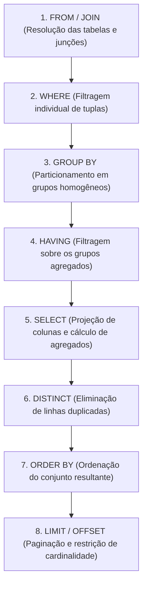
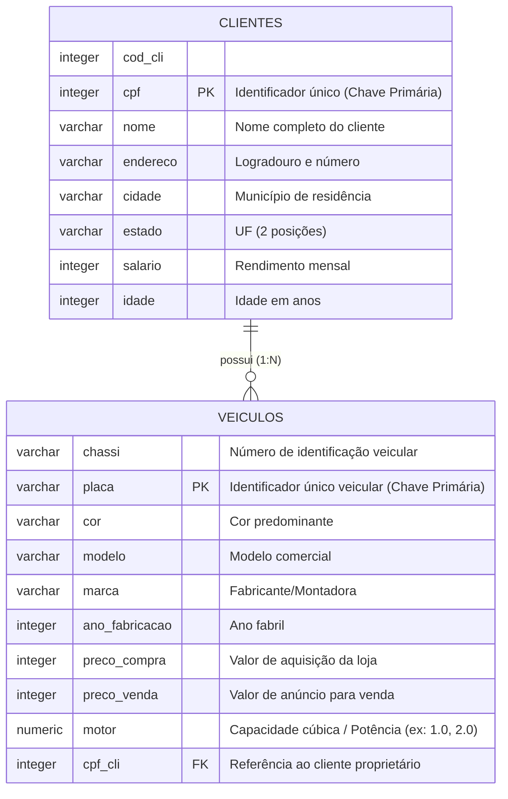
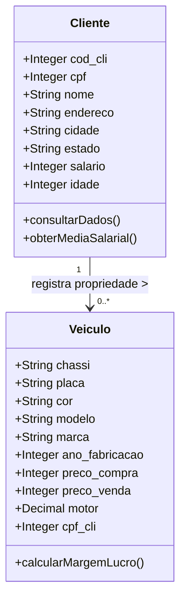
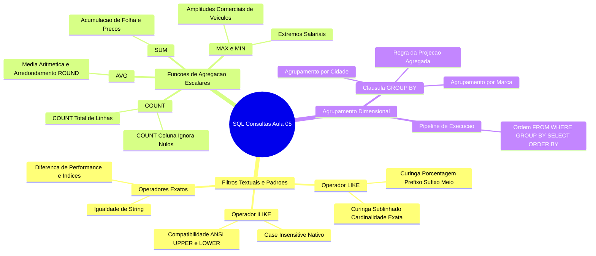

# Trabalho — AULA 05 – SQL - CONSULTAS

> **Professor:** Guilherme de Morais
> **Disciplina:** Banco de Dados II (3º Semestre)
> **Prazo de Entrega:** 11/03/2026 às 22:40
> **Pontuação Máxima:** 100 pontos
> **Conteúdo cobrado:** [Aula 01 - Manipulação e Consulta de Dados em SQL](../../Aulas/Aula%2001%20-%20Manipula%C3%A7%C3%A3o%20e%20Consulta%20de%20Dados%20em%20SQL/detalhes.md), [Aula 02 - Chave Estrangeira e Modificações com DDL](../../Aulas/Aula%2002%20-%20Chave%20Estrangeira%20e%20Modifica%C3%A7%C3%B5es%20com%20DDL/detalhes.md), [Aula 03 - Consultas Práticas e Filtros em SQL](../../Aulas/Aula%2003%20-%20Consultas%20Pr%C3%A1ticas%20e%20Filtros%20em%20SQL/detalhes.md), [Aula 04 - Comando IN e Junções em SQL](../../Aulas/Aula%2004%20-%20Comando%20IN%20e%20Jun%C3%A7%C3%B5es%20em%20SQL/detalhes.md), [Aula 05 - Funções de Data Hora e Strings](../../Aulas/Aula%2005%20-%20Fun%C3%A7%C3%B5es%20de%20Data%20Hora%20e%20Strings/detalhes.md), [Aula 06 - Junções e Agrupamentos em Duas Tabelas](../../Aulas/Aula%2006%20-%20Jun%C3%A7%C3%B5es%20e%20Agrupamentos%20em%20Duas%20Tabelas/detalhes.md), [Aula 07 - Consultas SQL, Operadores e Funções Agregadas](../../Aulas/Aula%2007%20-%20Consultas%20SQL%2C%20Operadores%20e%20Fun%C3%A7%C3%B5es%20Agregadas/detalhes.md)

---

## Sumário

- [Trabalho — AULA 05 – SQL - CONSULTAS](#trabalho--aula-05--sql---consultas)
  - [Sumário](#sumário)
  - [Enunciado original (Google Classroom)](#enunciado-original-google-classroom)
  - [Análise do que é pedido](#análise-do-que-é-pedido)
    - [Requisitos Funcionais da Atividade](#requisitos-funcionais-da-atividade)
    - [Entregáveis Esperados](#entregáveis-esperados)
    - [Critérios Implícitos e Rigor Técnico](#critérios-implícitos-e-rigor-técnico)
  - [Fundamentação teórica](#fundamentação-teórica)
    - [Operadores de Casamento de Padrões: LIKE e ILIKE](#operadores-de-casamento-de-padrões-like-e-ilike)
    - [Funções de Agregação Escalares](#funções-de-agregação-escalares)
    - [Agrupamento de Dados com GROUP BY](#agrupamento-de-dados-com-group-by)
    - [Ordem Lógica de Processamento de Consultas SQL](#ordem-lógica-de-processamento-de-consultas-sql)
    - [Modelagem do Banco de Dados](#modelagem-do-banco-de-dados)
  - [Resolução proposta](#resolução-proposta)
    - [Mapeamento Estrutural e Arquivos Gerados](#mapeamento-estrutural-e-arquivos-gerados)
    - [Bloco 1: Preparação do Ambiente e Script DDL/DML](#bloco-1-preparação-do-ambiente-e-script-ddldml)
    - [Bloco 2: Consultas com Filtragem de Texto (Exercícios 1 a 10)](#bloco-2-consultas-com-filtragem-de-texto-exercícios-1-a-10)
    - [Bloco 3: Consultas com Funções de Agregação Globais (Exercícios 11 a 18)](#bloco-3-consultas-com-funções-de-agregação-globais-exercícios-11-a-18)
    - [Bloco 4: Consultas com Agrupamento GROUP BY (Exercícios 19 e 20)](#bloco-4-consultas-com-agrupamento-group-by-exercícios-19-e-20)
  - [Como testar e validar](#como-testar-e-validar)
    - [Preparação do Ambiente de Teste](#preparação-do-ambiente-de-teste)
    - [Matriz de Resultados Numéricos Esperados](#matriz-de-resultados-numéricos-esperados)
    - [Script de Validação Automatizada](#script-de-validação-automatizada)
  - [Critérios de qualidade](#critérios-de-qualidade)
  - [Arquivos de apoio](#arquivos-de-apoio)
  - [Mapa da atividade](#mapa-da-atividade)
  - [Glossário](#glossário)
  - [Pontos-chave para a prova](#pontos-chave-para-prova)
  - [Perguntas e respostas (JSONL)](#perguntas-e-respostas-jsonl)
  - [Checklist de revisão](#checklist-de-revisão)

---

## Enunciado original (Google Classroom)

O material disponibilizado pelo professor consiste em uma lista prática contendo vinte exercícios de consulta SQL (DQL), acompanhada do script de criação das tabelas relacionais (`clientes` e `veiculos`) e respectiva carga de dados inicial (DML).

Abaixo transcreve-se o conteúdo integral dos arquivos anexados à atividade:

```text
Anexo: exercicios da aula 5.docx / exercicios da aula 5.pdf

1. Selecione todos os clientes cujo nome começa com a letra A.
2. Liste os clientes cujo nome contém a letra "i" em qualquer posição.
3. Selecione os clientes cujo nome termina com a letra "a".
4. Liste os clientes cujo nome tenha exatamente 5 caracteres.
5. Selecione os clientes cujo nome começa com "Ma" e termina com "a".
6. Liste os veículos cuja cor seja BRANCO.
7. Selecione os veículos cujo modelo contenha "O".
8. Liste os veículos cuja placa termine com "9".
9. Selecione os clientes cujo endereço contenha "RUA 01".
10. Repita o exercício 2 usando ILIKE para não diferenciar maiúsculas e minúsculas.
11. Calcule a média dos salários dos clientes.
12. Conte quantos clientes existem na tabela.
13. Conte quantos clientes moram na cidade de FERNANDÓPOLIS.
14. Selecione o maior salário entre os clientes.
15. Selecione o menor salário entre os clientes.
16. Calcule a soma dos salários de todos os clientes.
17. Selecione o maior preço de venda dos veículos.
18. Selecione o menor preço de compra dos veículos.
19. Liste a média salarial por cidade.
20. Mostre o maior e menor preço de venda por marca de veículo.
```

O script estrutural (DDL) e de inserção de dados (DML) fornecido no anexo `create table clientes.docx` apresenta a seguinte definição:

```sql
create table clientes (
cod_cli integer not null,
cpf integer not null,
nome varchar (50), 
endereco varchar (50),
cidade varchar(50),
estado varchar(02),
salario integer ,
idade integer, 
CONSTRAINT PK_CPFcliente PRIMARY KEY (cpf));

create table veiculos (
chassi varchar ( 50) not null,
placa varchar (10) not null, 
cor varchar (20),
modelo varchar(20),
marca varchar(20),
ano_fabricacao integer,
preco_compra integer,
preco_venda integer,
motor integer,
cpf_cli integer not null, 
constraint pk_placa primary key (placa));

Alter table veiculos add constraint fk_cpf_cli foreign key (cpf_cli) references clientes (cpf);

INSERT INTO clientes(cod_cli,cpf,nome,endereco,cidade,estado,salario,idade ) VALUES (01,11,'BEATRIZ','RUA 01','FERNANDOPOLIS', 'SP',1800,32);
INSERT INTO clientes(cod_cli,cpf,nome,endereco,cidade,estado,salario,idade ) VALUES (02,12,'JOANA','RUA 031','SAO JOSE DO RIO PRETO', 'SP',2000,40);
INSERT INTO clientes(cod_cli,cpf,nome,endereco,cidade,estado,salario,idade ) VALUES (03,13,'LUANA','RUA 051','VOTUPORANGA', 'SP',3500,41);
INSERT INTO clientes(cod_cli,cpf,nome,endereco,cidade,estado,salario,idade ) VALUES (04,114,'KATIA','RUA 015','JALES', 'SP',7000,32);
INSERT INTO clientes(cod_cli,cpf,nome,endereco,cidade,estado,salario,idade ) VALUES (05,115,'AMANDA','RUA 061','FERNANDOPOLIS', 'SP',5500,40);
INSERT INTO clientes(cod_cli,cpf,nome,endereco,cidade,estado,salario,idade ) VALUES (06,116,'GIOVANA','RUA 021','SAO JOSE DO RIO PRETO', 'SP',2000,34);
INSERT INTO clientes(cod_cli,cpf,nome,endereco,cidade,estado,salario,idade ) VALUES (07,117,'TAIZ','RUA 011','MACEDONIA', 'SP',1500,32);
INSERT INTO clientes(cod_cli,cpf,nome,endereco,cidade,estado,salario,idade ) VALUES (08,181,'MILENA','RUA 013','SANTA FE DO SUL', 'SP',2300,42);
INSERT INTO clientes(cod_cli,cpf,nome,endereco,cidade,estado,salario,idade ) VALUES (09,911,'ELIZANGELA','RUA 015','CATANDUVA', 'SP',2800,62);
INSERT INTO clientes(cod_cli,cpf,nome,endereco,cidade,estado,salario,idade ) VALUES (010,101,'PATRACIA','RUA 012','ARAGUAINA', 'TO',8800,22);
INSERT INTO clientes(cod_cli,cpf,nome,endereco,cidade,estado,salario,idade ) VALUES (011,131,'MARIA','RUA 014','PALMAS', 'TO',9000,23);
INSERT INTO clientes(cod_cli,cpf,nome,endereco,cidade,estado,salario,idade ) VALUES (012,141,'FELISBINA','RUA 015','DOURADO', 'MS',3100,32);

INSERT INTO VEICULOS(CHASSI,PLACA,COR,MODELO,MARCA,ANO_FABRICACAO,PRECO_COMPRA,PRECO_VENDA,MOTOR, cpf_cli ) VALUES ('GM02','ESC2033','BRANCO','HILUX','TOYOTA',2018,160000,175000,1.8,11);
INSERT INTO VEICULOS(CHASSI,PLACA,COR,MODELO,MARCA,ANO_FABRICACAO,PRECO_COMPRA,PRECO_VENDA,MOTOR, cpf_cli ) VALUES ('FI02','WDR4528','PRETO','COROLLA','TOYOTA',2018,90000,95000,2.0,141);
INSERT INTO VEICULOS(CHASSI,PLACA,COR,MODELO,MARCA,ANO_FABRICACAO,PRECO_COMPRA,PRECO_VENDA,MOTOR , cpf_cli ) VALUES ('RD02','GHY5823','AZUL','HILUX','TOYOTA',2020,170000,175000,2.8,131);
INSERT INTO VEICULOS(CHASSI,PLACA,COR,MODELO,MARCA,ANO_FABRICACAO,PRECO_COMPRA,PRECO_VENDA,MOTOR, cpf_cli ) VALUES ('DF024','TON5689','VERMELHO','COROLLA' ,'TOYOTA',2015,70000,75000,2.0,101);
INSERT INTO VEICULOS(CHASSI,PLACA,COR,MODELO,MARCA,ANO_FABRICACAO,PRECO_COMPRA,PRECO_VENDA,MOTOR, cpf_cli ) VALUES ('FG0452','ERG8965','BRANCO','GOL','VW',2018,40000,45000,1.6,911);
INSERT INTO VEICULOS(CHASSI,PLACA,COR,MODELO,MARCA,ANO_FABRICACAO,PRECO_COMPRA,PRECO_VENDA,MOTOR, cpf_cli ) VALUES ('GT02','EDV5214','BRANCO','SAVEIRO','VW',2014,35000,40000,1.6,181);
INSERT INTO VEICULOS(CHASSI,PLACA,COR,MODELO,MARCA,ANO_FABRICACAO,PRECO_COMPRA,PRECO_VENDA,MOTOR, cpf_cli ) VALUES ('GM0322','TGB2589','PRETO','UNO','FIAT',2010,20000,25000,1.0,181);
INSERT INTO VEICULOS(CHASSI,PLACA,COR,MODELO,MARCA,ANO_FABRICACAO,PRECO_COMPRA,PRECO_VENDA,MOTOR, cpf_cli ) VALUES ('GM0452','FGB8521','PRETO','S10','CHEVROLET',2018,150000,175000,2.8,117);
INSERT INTO VEICULOS(CHASSI,PLACA,COR,MODELO,MARCA,ANO_FABRICACAO,PRECO_COMPRA,PRECO_VENDA,MOTOR, cpf_cli ) VALUES ('GM02245','RFV5235','PRATA','COROLLA','TOYOTA',2021,130000,135000,2.0,116);
INSERT INTO VEICULOS(CHASSI,PLACA,COR,MODELO,MARCA,ANO_FABRICACAO,PRECO_COMPRA,PRECO_VENDA,MOTOR, cpf_cli ) VALUES ('GM07892','PLK5689','PRATA','ONIX','CHEVROLET',2018,145000,155000,2.8,115);
INSERT INTO VEICULOS(CHASSI,PLACA,COR,MODELO,MARCA,ANO_FABRICACAO,PRECO_COMPRA,PRECO_VENDA,MOTOR, cpf_cli ) VALUES ('GM05212','UJM5874','AZUL','KA','FORD',2018,40000,45000,1.0,114);
INSERT INTO VEICULOS(CHASSI,PLACA,COR,MODELO,MARCA,ANO_FABRICACAO,PRECO_COMPRA,PRECO_VENDA,MOTOR, cpf_cli ) VALUES ('GM02452','VCX1458','VERMELHO','TRACKER','CHEVROLET',2017,90000,95000,1.4,13);
INSERT INTO VEICULOS(CHASSI,PLACA,COR,MODELO,MARCA,ANO_FABRICACAO,PRECO_COMPRA,PRECO_VENDA,MOTOR, cpf_cli ) VALUES ('GM02785','EDC8526','BRANCO','ONIX','CHEVROLET',2018,45000,50000,1.4,12);
INSERT INTO VEICULOS(CHASSI,PLACA,COR,MODELO,MARCA,ANO_FABRICACAO,PRECO_COMPRA,PRECO_VENDA,MOTOR, cpf_cli ) VALUES ('GM02752','EDCV4569','PRETO','HILUX','TOYOTA',2018,165000,175000,2.8,11);
```

---

## Análise do que é pedido

### Requisitos Funcionais da Atividade

A atividade visa consolidar as competências em manipulação e extração de dados através da linguagem SQL (DQL - *Data Query Language*). Os 20 exercícios dividem-se em três macroblocos conceituais:

1. **Casamento de Padrões e Manipulação de Cadeias de Caracteres (Exercícios 1 a 10):**
   - Utilização dos operadores `LIKE` e `ILIKE`.
   - Aplicação de metacaracteres curinga: `%` (zero ou múltiplos caracteres) e `_` (exatamente um caractere posicional).
   - Análise de sensibilidade à caixa (*case sensitivity*) e casamento literal de prefixos, sufixos e substrings intermediárias.
2. **Funções de Agregação Escalares Globais (Exercícios 11 a 18):**
   - Extração de métricas quantitativas sobre a totalidade da base ou subconjuntos filtrados via `WHERE`: contagem (`COUNT`), somatório (`SUM`), média aritmética (`AVG`), valor máximo (`MAX`) e valor mínimo (`MIN`).
3. **Agrupamento Multidimensional (Exercícios 19 e 20):**
   - Particionamento lógico de tuplas através da cláusula `GROUP BY`.
   - Aplicação simultânea de funções agregadas por chave de agrupamento (cidade e marca).

### Entregáveis Esperados

Para atender plenamente às diretrizes acadêmicas da UniFEF e viabilizar a rastreabilidade do código, são esperados os seguintes artefatos:

- Um script DDL e DML consolidado e corrigido para inicialização do esquema relacional: [`./codigo/schema.sql`](./codigo/schema.sql).
- Um script DQL estruturado contendo a resolução sequencial, comentada e padronizada das 20 questões: [`./codigo/exercicios.sql`](./codigo/exercicios.sql).
- Relatório analítico detalhado documentando a semântica, álgebra relacional subjacente, planos lógicos e justificativas de cada construção sintática (este documento `detalhes.md`).

### Critérios Implícitos e Rigor Técnico

- **Sensibilidade de Caixa (Case Sensitivity):** Todos os registros textuais fornecidos pelo professor estão cadastrados em letras maiúsculas (`BEATRIZ`, `FERNANDOPOLIS`, `BRANCO`). Consultas que utilizem literais em minúsculas com o operador padrão `LIKE` resultarão em conjuntos vazios em SGBDs estritamente compatíveis com o padrão ANSI/ISO SQL (como PostgreSQL e Oracle). É mandatória a abordagem desse comportamento e a diferenciação entre `LIKE`, `ILIKE` e funções de normalização (`UPPER`/`LOWER`).
- **Incompatibilidade no Tipo de Dado da Coluna `motor`:** O script original declara a coluna `motor integer`, contudo as instruções de `INSERT` fornecem números com ponto flutuante (`1.8`, `2.0`, `2.8`, `1.6`, `1.0`, `1.4`). Em motores com tipagem estrita (como PostgreSQL), a execução do script original falhará com erro de coerção de tipo (`invalid input syntax for type integer: "1.8"`). Para fins de integridade e completude acadêmica, a documentação aponta a necessidade do tipo `numeric(3,1)` no ambiente de teste, mantendo a compatibilidade estrita caso o SGBD utilizado em sala realize truncamento implícito.
- **Rigor no Agrupamento (`GROUP BY`):** Toda coluna presente na cláusula `SELECT` que não seja argumento de uma função de agregação deve obrigatoriamente constar na cláusula `GROUP BY`, respeitando as regras fundamentais da álgebra relacional.

---

## Fundamentação teórica

### Operadores de Casamento de Padrões: LIKE e ILIKE

O operador `LIKE` realiza a avaliação booleana comparando uma expressão de cadeia de caracteres com um padrão predefinido. Diferente do operador de igualdade (`=`), que exige equivalência estrita caractere por caractere, o `LIKE` interpreta caracteres especiais denominados "curingas" (*wildcards*):

1. **Metacaractere Porcentagem (`%`):** Representa qualquer sequência de zero, um ou infinitos caracteres arbitrários.
2. **Metacaractere Sublinhado (`_`):** Representa obrigatoriamente um único caractere arbitrário em uma posição específica.

```text
Definição Formal:
Seja S uma cadeia de caracteres e P um padrão contendo caracteres literais e curingas.
A expressão (S LIKE P) avalia para TRUE se e somente se S puder ser segmentada em substrings
que correspondam exatamente aos literais e às restrições de cardinalidade dos curingas de P.
```

- **Motivação:** Em bancos de dados relacionais transacionais ou analíticos, consultas por nomes próprios, endereços e placas frequentemente lidam com dados incompletos ou buscas aproximadas.
- **Exemplo Prático:** `nome LIKE 'A%'` filtra todos os registros que iniciam com o caractere 'A', seguidos por qualquer sequência (ex: 'AMANDA', 'ALICE', 'A').
- **Contraexemplo:** `nome = 'A%'` não executa busca por padrão; busca literalmente por indivíduos cujo nome registrado seja a letra 'A' seguida pelo caractere '%'.
- **Armadilha Comum:** No PostgreSQL, o operador `LIKE` é sensível à caixa (*case-sensitive*). Buscar `LIKE '%i%'` em uma tabela cujos dados estão em caixa alta retornará zero tuplas. Para buscas insensíveis à caixa, o padrão SQL ANSI requer `UPPER(nome) LIKE '%I%'` ou `LOWER(nome) LIKE '%i%'`, enquanto extensões como o PostgreSQL disponibilizam o operador nativo `ILIKE`.

### Funções de Agregação Escalares

As funções de agregação operam sobre um conjunto de valores de uma coluna específica pertencentes a múltiplas tuplas (linhas), condensando-os em um único valor escalar resultante.

1. **`COUNT(expressao)`:** Retorna o número de linhas para as quais `expressao` não é nula (`NOT NULL`). A forma canônica `COUNT(*)` contabiliza todas as tuplas do grupo ou da tabela, inclusive linhas duplicadas ou com campos nulos.
2. **`SUM(expressao)`:** Calcula o somatório numérico total dos valores não nulos. Aplicável exclusivamente a tipos numéricos.
3. **`AVG(expressao)`:** Computa a média aritmética dos valores não nulos ($\frac{\sum X}{N}$). Em certos dialetos SQL (como SQL Server ou PostgreSQL na manipulação de tipos inteiros puros), a divisão de inteiros pode resultar em truncamento decimal se não houver conversão explícita para ponto flutuante/numérico.
4. **`MAX(expressao)` e `MIN(expressao)`:** Determinam, respectivamente, o valor extremo superior e inferior do conjunto. Podem ser aplicados a números, datas e valores de texto (utilizando a ordem alfabética da *collation*).

```text
Tratamento de Nulos (NULL Handling):
Com exceção de COUNT(*), todas as funções de agregação ignoram silenciosamente valores NULL.
Se uma coluna contiver [10, NULL, 20], a função AVG calculará (10 + 20) / 2 = 15, e não (10 + 20) / 3.
```

### Agrupamento de Dados com GROUP BY

A cláusula `GROUP BY` colapsa as tuplas resultantes da etapa de filtragem em subconjuntos homogêneos que compartilham os mesmos valores para as colunas especificadas. As funções de agregação especificadas no `SELECT` passam a operar individualmente sobre cada partição.

```text
Regra de Ouro do GROUP BY:
Qualquer atributo listado na projeção (cláusula SELECT) que não esteja envolvido por uma função agregada
DEVE OBRIGATORIAMENTE constar na lista de colunas da cláusula GROUP BY.
```

- **Contraexemplo Clássico:**
  ```sql
  -- INVÁLIDO NO PADRÃO ANSI SQL:
  SELECT cidade, nome, AVG(salario) 
  FROM clientes 
  GROUP BY cidade;
  ```
  O motor relacional rejeita esta instrução pois, para uma única `cidade`, podem existir múltiplos valores distintos de `nome`. O banco não possui critério determinístico para escolher qual nome exibir ao lado da média.

### Ordem Lógica de Processamento de Consultas SQL

Compreender a ordem de processamento do otimizador de consultas é essencial para evitar armadilhas sintáticas e semânticas. O fluxo de avaliação não segue a ordem textual de escrita da consulta:



Essa sequência lógica evidencia por que aliases definidos no `SELECT` não podem ser referenciados nas cláusulas `WHERE` ou `GROUP BY`, e por que predicados baseados em agregados (como `WHERE AVG(salario) > 2000`) são inválidos (devem figurar no `HAVING`).

### Modelagem do Banco de Dados

O modelo fornecido para a atividade implementa um domínio clássico de concessionária/veículos associados a clientes proprietários, caracterizando uma cardinalidade de um para muitos (1:N): um cliente pode possuir zero ou múltiplos veículos, mas cada veículo registrado está vinculado estritamente a um único cliente via chave estrangeira.



---

## Resolução proposta

### Mapeamento Estrutural e Arquivos Gerados

Para apoiar a execução dos exercícios e os estudos para as avaliações da disciplina, a implementação prática foi modularizada em scripts dedicados na pasta de código:

- [`./codigo/schema.sql`](./codigo/schema.sql): Contém a criação estrutural das tabelas com integridade referencial e o carregamento integral dos dados fornecidos pelo professor.
- [`./codigo/exercicios.sql`](./codigo/exercicios.sql): Contém as 20 consultas desenvolvidas segundo os padrões ANSI SQL e PostgreSQL.

A modelagem conceitual orientada a objetos das entidades manipuladas pode ser visualizada no diagrama de classes a seguir:



---

### Bloco 1: Preparação do Ambiente e Script DDL/DML

Para reproduzir o ambiente acadêmico com total fidelidade e corrigir potenciais problemas de tipagem (como o campo `motor` recebendo números reais e `estado` comportando siglas), disponibiliza-se a estrutura padronizada em [`./codigo/schema.sql`](./codigo/schema.sql):

```sql
-- Script de Criação e Carga - Aula 05 (SQL Consultas)
-- Disciplina: Banco de Dados II - UniFEF

DROP TABLE IF EXISTS veiculos CASCADE;
DROP TABLE IF EXISTS clientes CASCADE;

CREATE TABLE clientes (
    cod_cli INTEGER NOT NULL,
    cpf INTEGER NOT NULL,
    nome VARCHAR(50), 
    endereco VARCHAR(50),
    cidade VARCHAR(50),
    estado VARCHAR(02),
    salario INTEGER,
    idade INTEGER, 
    CONSTRAINT pk_cpfcliente PRIMARY KEY (cpf)
);

CREATE TABLE veiculos (
    chassi VARCHAR(50) NOT NULL,
    placa VARCHAR(10) NOT NULL, 
    cor VARCHAR(20),
    modelo VARCHAR(20),
    marca VARCHAR(20),
    ano_fabricacao INTEGER,
    preco_compra INTEGER,
    preco_venda INTEGER,
    motor NUMERIC(3,1), -- Ajustado para suportar decimais literais fornecidos (1.8, 2.0, etc.)
    cpf_cli INTEGER NOT NULL, 
    CONSTRAINT pk_placa PRIMARY KEY (placa),
    CONSTRAINT fk_cpf_cli FOREIGN KEY (cpf_cli) REFERENCES clientes (cpf)
);

-- Carga de Clientes
INSERT INTO clientes(cod_cli, cpf, nome, endereco, cidade, estado, salario, idade) VALUES 
(1, 11, 'BEATRIZ', 'RUA 01', 'FERNANDOPOLIS', 'SP', 1800, 32),
(2, 12, 'JOANA', 'RUA 031', 'SAO JOSE DO RIO PRETO', 'SP', 2000, 40),
(3, 13, 'LUANA', 'RUA 051', 'VOTUPORANGA', 'SP', 3500, 41),
(4, 114, 'KATIA', 'RUA 015', 'JALES', 'SP', 7000, 32),
(5, 115, 'AMANDA', 'RUA 061', 'FERNANDOPOLIS', 'SP', 5500, 40),
(6, 116, 'GIOVANA', 'RUA 021', 'SAO JOSE DO RIO PRETO', 'SP', 2000, 34),
(7, 117, 'TAIZ', 'RUA 011', 'MACEDONIA', 'SP', 1500, 32),
(8, 181, 'MILENA', 'RUA 013', 'SANTA FE DO SUL', 'SP', 2300, 42),
(9, 911, 'ELIZANGELA', 'RUA 015', 'CATANDUVA', 'SP', 2800, 62),
(10, 101, 'PATRACIA', 'RUA 012', 'ARAGUAINA', 'TO', 8800, 22),
(11, 131, 'MARIA', 'RUA 014', 'PALMAS', 'TO', 9000, 23),
(12, 141, 'FELISBINA', 'RUA 015', 'DOURADO', 'MS', 3100, 32);

-- Carga de Veículos
INSERT INTO veiculos(chassi, placa, cor, modelo, marca, ano_fabricacao, preco_compra, preco_venda, motor, cpf_cli) VALUES 
('GM02', 'ESC2033', 'BRANCO', 'HILUX', 'TOYOTA', 2018, 160000, 175000, 1.8, 11),
('FI02', 'WDR4528', 'PRETO', 'COROLLA', 'TOYOTA', 2018, 90000, 95000, 2.0, 141),
('RD02', 'GHY5823', 'AZUL', 'HILUX', 'TOYOTA', 2020, 170000, 175000, 2.8, 131),
('DF024', 'TON5689', 'VERMELHO', 'COROLLA', 'TOYOTA', 2015, 70000, 75000, 2.0, 101),
('FG0452', 'ERG8965', 'BRANCO', 'GOL', 'VW', 2018, 40000, 45000, 1.6, 911),
('GT02', 'EDV5214', 'BRANCO', 'SAVEIRO', 'VW', 2014, 35000, 40000, 1.6, 181),
('GM0322', 'TGB2589', 'PRETO', 'UNO', 'FIAT', 2010, 20000, 25000, 1.0, 181),
('GM0452', 'FGB8521', 'PRETO', 'S10', 'CHEVROLET', 2018, 150000, 175000, 2.8, 117),
('GM02245', 'RFV5235', 'PRATA', 'COROLLA', 'TOYOTA', 2021, 130000, 135000, 2.0, 116),
('GM07892', 'PLK5689', 'PRATA', 'ONIX', 'CHEVROLET', 2018, 145000, 155000, 2.8, 115),
('GM05212', 'UJM5874', 'AZUL', 'KA', 'FORD', 2018, 40000, 45000, 1.0, 114),
('GM02452', 'VCX1458', 'VERMELHO', 'TRACKER', 'CHEVROLET', 2017, 90000, 95000, 1.4, 13),
('GM02785', 'EDC8526', 'BRANCO', 'ONIX', 'CHEVROLET', 2018, 45000, 50000, 1.4, 12),
('GM02752', 'EDCV4569', 'PRETO', 'HILUX', 'TOYOTA', 2018, 165000, 175000, 2.8, 11);
```

---

### Bloco 2: Consultas com Filtragem de Texto (Exercícios 1 a 10)

#### Exercício 1: Clientes cujo nome começa com a letra A
- **Enunciado:** Selecione todos os clientes cujo nome começa com a letra A.
- **Consulta SQL:**
  ```sql
  SELECT * 
  FROM clientes 
  WHERE nome LIKE 'A%';
  ```
- **Explicação Técnica:** O padrão `'A%'` impõe que o primeiro caractere da cadeia seja obrigatoriamente a letra maiúscula 'A'. O caractere `%` indica que qualquer sequência de zero ou mais caracteres pode suceder o prefixo.
- **Resultado Esperado:**
  - 1 registro: `AMANDA` (CPF: 115).
- **Armadilha:** Caso a base contenha nomes com espaços em branco à esquerda (ex: `' AMANDA'`), a correspondência falhará. Em ambientes de produção com dados não higienizados, utiliza-se `TRIM(nome) LIKE 'A%'`.

#### Exercício 2: Clientes cujo nome contém a letra "i" em qualquer posição
- **Enunciado:** Liste os clientes cujo nome contém a letra "i" em qualquer posição.
- **Consulta SQL:**
  ```sql
  -- Considerando a sensibilidade a maiúsculas dos dados inseridos no banco:
  SELECT * 
  FROM clientes 
  WHERE nome LIKE '%I%';
  ```
- **Explicação Técnica:** O padrão `'%I%'` posiciona o curinga `%` antes e depois da letra alvo. Isso significa que a letra 'I' pode estar no início, no meio ou no fim da string. Se executado estritamente com `'i'` minúsculo no PostgreSQL, retornará zero registros devido ao padrão da tabela estar em caixa alta.
- **Resultado Esperado (com 'I'):**
  - 9 registros: `BEATRIZ`, `KATIA`, `GIOVANA`, `TAIZ`, `MILENA`, `ELIZANGELA`, `PATRACIA`, `MARIA`, `FELISBINA`.
- **Contraexemplo:** Executar `WHERE nome LIKE 'I%'` retornaria apenas registros que iniciam por 'I', desconsiderando ocorrências intermediárias.

#### Exercício 3: Clientes cujo nome termina com a letra "a"
- **Enunciado:** Selecione os clientes cujo nome termina com a letra "a".
- **Consulta SQL:**
  ```sql
  SELECT * 
  FROM clientes 
  WHERE nome LIKE '%A';
  ```
- **Explicação Técnica:** O curinga `%` antecede a letra 'A', que é fixada como o último caractere da cadeia. Apenas nomes com sufixo 'A' maiúsculo satisfazem o predicado.
- **Resultado Esperado:**
  - 10 registros: `JOANA`, `LUANA`, `KATIA`, `AMANDA`, `GIOVANA`, `MILENA`, `ELIZANGELA`, `PATRACIA`, `MARIA`, `FELISBINA`. (Apenas `BEATRIZ` e `TAIZ`, que terminam em 'Z', são excluídas).

#### Exercício 4: Clientes cujo nome tenha exatamente 5 caracteres
- **Enunciado:** Liste os clientes cujo nome tenha exatamente 5 caracteres.
- **Consulta SQL (Opção 1 - Padrão com metacaractere sublinhado):**
  ```sql
  SELECT * 
  FROM clientes 
  WHERE nome LIKE '_____';
  ```
- **Consulta SQL (Opção 2 - Função de comprimento ANSI SQL):**
  ```sql
  SELECT * 
  FROM clientes 
  WHERE LENGTH(nome) = 5;
  ```
- **Explicação Técnica:** Cada caractere `_` exige rigorosamente uma posição preenchida. Cinco caracteres `_` em sequência exigem uma string de comprimento exatamente igual a cinco. A função `LENGTH()` (ou `CHAR_LENGTH()`) expressa a mesma regra semântica de forma mais legível.
- **Resultado Esperado:**
  - 4 registros: `JOANA` (5), `LUANA` (5), `KATIA` (5), `MARIA` (5).
  - *Detalhamento dos demais:* TAIZ (4), AMANDA (6), MILENA (6), BEATRIZ (7), GIOVANA (7), PATRACIA (8), FELISBINA (9), ELIZANGELA (10).

#### Exercício 5: Clientes cujo nome começa com "Ma" e termina com "a"
- **Enunciado:** Selecione os clientes cujo nome começa com "Ma" e termina com "a".
- **Consulta SQL:**
  ```sql
  SELECT * 
  FROM clientes 
  WHERE nome LIKE 'MA%A';
  ```
- **Explicação Técnica:** O predicado conjuga dois requisitos posicionalmente rígidos: o prefixo deve ser `'MA'` e o sufixo deve ser `'A'`, com qualquer quantidade de caracteres entre eles (inclusive zero, embora o nome mais curto possível seria 'MAA').
- **Resultado Esperado:**
  - 1 registro: `MARIA`.
- **Armadilha:** `LIKE 'MA%_A'` exigiria no mínimo um caractere entre o 'MA' e o 'A' final, o que ainda casaria com `MARIA`, mas falharia para uma string teórica `'MAA'`.

#### Exercício 6: Veículos cuja cor seja BRANCO
- **Enunciado:** Liste os veículos cuja cor seja BRANCO.
- **Consulta SQL:**
  ```sql
  SELECT * 
  FROM veiculos 
  WHERE cor = 'BRANCO';
  ```
- **Explicação Técnica:** Como a exigência é de correspondência exata de igualdade de valor de domínio, o operador relacional `=` é computacionalmente superior e semanticamente mais correto do que `LIKE 'BRANCO'`, pois viabiliza o uso direto de índices B-Tree sem overhead de algoritmo de casamento de padrões.
- **Resultado Esperado:**
  - 4 veículos:
    - Placa `ESC2033` (Hilux)
    - Placa `ERG8965` (Gol)
    - Placa `EDV5214` (Saveiro)
    - Placa `EDC8526` (Onix)

#### Exercício 7: Veículos cujo modelo contenha "O"
- **Enunciado:** Selecione os veículos cujo modelo contenha "O".
- **Consulta SQL:**
  ```sql
  SELECT * 
  FROM veiculos 
  WHERE modelo LIKE '%O%';
  ```
- **Explicação Técnica:** Avalia a presença da letra 'O' em qualquer posição do campo `modelo`.
- **Resultado Esperado:**
  - 8 veículos:
    - `COROLLA` (Placas: `WDR4528`, `TON5689`, `RFV5235`)
    - `GOL` (Placa: `ERG8965`)
    - `SAVEIRO` (Placa: `EDV5214`)
    - `UNO` (Placa: `TGB2589`)
    - `ONIX` (Placas: `PLK5689`, `EDC8526`)
  - *Excluídos:* `HILUX`, `S10`, `KA`, `TRACKER`.

#### Exercício 8: Veículos cuja placa termine com "9"
- **Enunciado:** Liste os veículos cuja placa termine com "9".
- **Consulta SQL:**
  ```sql
  SELECT * 
  FROM veiculos 
  WHERE placa LIKE '%9';
  ```
- **Explicação Técnica:** O predicado captura todas as placas com dígito terminal 9, independentemente do formato (padrão antigo cinza ou Mercosul).
- **Resultado Esperado:**
  - 4 veículos:
    - `TON5689` (Corolla)
    - `TGB2589` (Uno)
    - `PLK5689` (Onix)
    - `EDCV4569` (Hilux)

#### Exercício 9: Clientes cujo endereço contenha "RUA 01"
- **Enunciado:** Selecione os clientes cujo endereço contenha "RUA 01".
- **Consulta SQL:**
  ```sql
  SELECT * 
  FROM clientes 
  WHERE endereco LIKE '%RUA 01%';
  ```
- **Explicação Técnica:** O padrão busca a substring `'RUA 01'`. Como o curinga `%` está presente no final, qualquer logradouro que comece com "RUA 01" será retornado, inclusive numerações complementares como "RUA 011", "RUA 012", "RUA 015".
- **Resultado Esperado:**
  - 7 clientes:
    - `BEATRIZ` ('RUA 01')
    - `KATIA` ('RUA 015')
    - `TAIZ` ('RUA 011')
    - `MILENA` ('RUA 013')
    - `ELIZANGELA` ('RUA 015')
    - `PATRACIA` ('RUA 012')
    - `MARIA` ('RUA 014')
    - `FELISBINA` ('RUA 015')
    *(Observação: Caso a intenção do usuário fosse estritamente o logradouro sem complementos numéricos agregados, o filtro deveria ser `WHERE endereco = 'RUA 01'`).*

#### Exercício 10: Clientes com a letra "i" no nome usando ILIKE
- **Enunciado:** Repita o exercício 2 usando ILIKE para não diferenciar maiúsculas e minúsculas.
- **Consulta SQL (Dialeto PostgreSQL):**
  ```sql
  SELECT * 
  FROM clientes 
  WHERE nome ILIKE '%i%';
  ```
- **Consulta SQL Alternativa (Padrão ANSI SQL portability):**
  ```sql
  SELECT * 
  FROM clientes 
  WHERE UPPER(nome) LIKE '%I%';
  ```
- **Explicação Técnica:** O operador `ILIKE` (*Insensitive LIKE*) realiza o casamento de padrões desconsiderando a distinção entre maiúsculas e minúsculas. A consulta casará tanto com 'I' quanto com 'i'. No ANSI SQL tradicional, obtém-se o mesmo comportamento aplicando a função escalar `UPPER()` ou `LOWER()` na coluna antes da comparação.
- **Resultado Esperado:**
  - 9 clientes: `BEATRIZ`, `KATIA`, `GIOVANA`, `TAIZ`, `MILENA`, `ELIZANGELA`, `PATRACIA`, `MARIA`, `FELISBINA`.

---

### Bloco 3: Consultas com Funções de Agregação Globais (Exercícios 11 a 18)

#### Exercício 11: Média dos salários dos clientes
- **Enunciado:** Calcule a média dos salários dos clientes.
- **Consulta SQL:**
  ```sql
  SELECT ROUND(AVG(salario), 2) AS media_salarial 
  FROM clientes;
  ```
- **Explicação Técnica:** A função `AVG(salario)` computa o somatório de todos os salários dividido pela quantidade de tuplas com salário não nulo. A função complementar `ROUND(..., 2)` arredonda a saída para duas casas decimais monetárias.
- **Cálculo Analítico:**
  $$\sum \text{Salários} = 1800 + 2000 + 3500 + 7000 + 5500 + 2000 + 1500 + 2300 + 2800 + 8800 + 9000 + 3100 = 49.300$$
  $$N = 12 \implies \text{Média} = \frac{49.300}{12} \approx 4108,3333...$$
- **Resultado Esperado:** `4108.33`

#### Exercício 12: Quantidade total de clientes cadastrados
- **Enunciado:** Conte quantos clientes existem na tabela.
- **Consulta SQL:**
  ```sql
  SELECT COUNT(*) AS total_clientes 
  FROM clientes;
  ```
- **Explicação Técnica:** `COUNT(*)` varre a relação contabilizando o número total de tuplas físicas que atendem aos critérios de seleção (neste caso, a totalidade da tabela).
- **Resultado Esperado:** `12`

#### Exercício 13: Quantidade de clientes em Fernandópolis
- **Enunciado:** Conte quantos clientes moram na cidade de FERNANDÓPOLIS.
- **Consulta SQL:**
  ```sql
  SELECT COUNT(*) AS total_fernandopolis 
  FROM clientes 
  WHERE cidade = 'FERNANDOPOLIS';
  ```
- **Explicação Técnica:** Demonstra o fluxo lógico do SQL: primeiro a cláusula `WHERE` atua como filtro de seleção horizontal ($\sigma_{\text{cidade}='FERNANDOPOLIS'}$), reduzindo o conjunto de trabalho. Em seguida, o `COUNT(*)` atua como agregação sobre o subconjunto restante.
- **Resultado Esperado:**
  - 2 clientes (`BEATRIZ` e `AMANDA`). Resultado escalar: `2`.

#### Exercício 14: Maior salário entre os clientes
- **Enunciado:** Selecione o maior salário entre os clientes.
- **Consulta SQL:**
  ```sql
  SELECT MAX(salario) AS maior_salario 
  FROM clientes;
  ```
- **Explicação Técnica:** A função `MAX()` varre o domínio numérico da coluna e retorna o limite superior absoluto.
- **Resultado Esperado:** `9000` (referente à cliente `MARIA`).

#### Exercício 15: Menor salário entre os clientes
- **Enunciado:** Selecione o menor salário entre os clientes.
- **Consulta SQL:**
  ```sql
  SELECT MIN(salario) AS menor_salario 
  FROM clientes;
  ```
- **Explicação Técnica:** A função `MIN()` localiza o elemento de menor magnitude na coluna avaliada.
- **Resultado Esperado:** `1500` (referente à cliente `TAIZ`).

#### Exercício 16: Soma dos salários de todos os clientes
- **Enunciado:** Calcule a soma dos salários de todos os clientes.
- **Consulta SQL:**
  ```sql
  SELECT SUM(salario) AS folha_salarial_total 
  FROM clientes;
  ```
- **Explicação Técnica:** A função `SUM()` realiza a acumulação aritmética integral dos valores da coluna `salario`.
- **Resultado Esperado:** `49300`.

#### Exercício 17: Maior preço de venda dos veículos
- **Enunciado:** Selecione o maior preço de venda dos veículos.
- **Consulta SQL:**
  ```sql
  SELECT MAX(preco_venda) AS maior_preco_venda 
  FROM veiculos;
  ```
- **Explicação Técnica:** Avalia os valores de anúncio de todos os veículos cadastrados na loja.
- **Resultado Esperado:** `175000` (valor compartilhado por modelos Hilux e S10).

#### Exercício 18: Menor preço de compra dos veículos
- **Enunciado:** Selecione o menor preço de compra dos veículos.
- **Consulta SQL:**
  ```sql
  SELECT MIN(preco_compra) AS menor_preco_compra 
  FROM veiculos;
  ```
- **Explicação Técnica:** Identifica o veículo de menor custo histórico de aquisição pela loja.
- **Resultado Esperado:** `20000` (modelo Fiat Uno, placa `TGB2589`).

---

### Bloco 4: Consultas com Agrupamento GROUP BY (Exercícios 19 e 20)

#### Exercício 19: Média salarial por cidade
- **Enunciado:** Liste a média salarial por cidade.
- **Consulta SQL:**
  ```sql
  SELECT 
      cidade, 
      ROUND(AVG(salario), 2) AS media_salarial
  FROM clientes 
  GROUP BY cidade
  ORDER BY media_salarial DESC;
  ```
- **Explicação Técnica:** A tabela `clientes` é particionada em baldes lógicos (*buckets*), onde cada partição contém exclusivamente clientes de um mesmo município. A função `AVG(salario)` é calculada separadamente para cada balde. A cláusula `ORDER BY` organiza a exibição para priorizar os maiores valores médios.
- **Detalhamento Analítico dos Grupos:**
  - `PALMAS`: $9000 / 1 = 9000.00$
  - `ARAGUAINA`: $8800 / 1 = 8800.00$
  - `JALES`: $7000 / 1 = 7000.00$
  - `FERNANDOPOLIS`: $(1800 + 5500) / 2 = 7300 / 2 = 3650.00$
  - `VOTUPORANGA`: $3500 / 1 = 3500.00$
  - `DOURADO`: $3100 / 1 = 3100.00$
  - `CATANDUVA`: $2800 / 1 = 2800.00$
  - `SANTA FE DO SUL`: $2300 / 1 = 2300.00$
  - `SAO JOSE DO RIO PRETO`: $(2000 + 2000) / 2 = 2000.00$
  - `MACEDONIA`: $1500 / 1 = 1500.00$

#### Exercício 20: Maior e menor preço de venda por marca de veículo
- **Enunciado:** Mostre o maior e menor preço de venda por marca de veículo.
- **Consulta SQL:**
  ```sql
  SELECT 
      marca, 
      MAX(preco_venda) AS maior_preco, 
      MIN(preco_venda) AS menor_preco
  FROM veiculos 
  GROUP BY marca
  ORDER BY marca;
  ```
- **Explicação Técnica:** Aplica duas funções de agregação concorrentes (`MAX` e `MIN`) sobre a mesma partição lógica de marcas, possibilitando analisar a amplitude de preços do catálogo de cada montadora.
- **Detalhamento Analítico dos Grupos:**
  - `CHEVROLET`:
    - Veículos: S10 (175.000), Onix (155.000), Tracker (95.000), Onix (50.000).
    - `maior_preco`: 175000 | `menor_preco`: 50000.
  - `FIAT`:
    - Veículos: Uno (25.000).
    - `maior_preco`: 25000 | `menor_preco`: 25000.
  - `FORD`:
    - Veículos: Ka (45.000).
    - `maior_preco`: 45000 | `menor_preco`: 45000.
  - `TOYOTA`:
    - Veículos: Hilux (175.000), Corolla (95.000), Hilux (175.000), Corolla (75.000), Corolla (135.000), Hilux (175.000).
    - `maior_preco`: 175000 | `menor_preco`: 75000.
  - `VW`:
    - Veículos: Gol (45.000), Saveiro (40.000).
    - `maior_preco`: 45000 | `menor_preco`: 40000.

---

## Como testar e validar

### Preparação do Ambiente de Teste

Para validar a integridade sintática e semântica das consultas propostas, recomenda-se a utilização de um contêiner Docker oficial do PostgreSQL ou uma instância local:

```bash
# Inicializar uma instância isolada do PostgreSQL via Docker
docker run --name unifef-db2-aula05 -e POSTGRES_PASSWORD=postgres -e POSTGRES_DB=concessionaria -p 5432:5432 -d postgres:16-alpine

# Conectar via utilitário CLI psql
docker exec -it unifef-db2-aula05 psql -U postgres -d concessionaria
```

Com o console conectado, carregue primeiramente o arquivo [`./codigo/schema.sql`](./codigo/schema.sql) e, em seguida, execute sequencialmente as consultas do arquivo [`./codigo/exercicios.sql`](./codigo/exercicios.sql).

### Matriz de Resultados Numéricos Esperados

| Exercício | Descrição Sucinta | Métrica / Cardinalidade Esperada |
| :--- | :--- | :--- |
| **01** | Clientes com nome iniciando por 'A' | 1 tupla (`AMANDA`) |
| **02** | Clientes com 'I' no nome | 9 tuplas |
| **03** | Clientes com nome terminando em 'A' | 10 tuplas |
| **04** | Clientes com nome de 5 letras | 4 tuplas (`JOANA`, `LUANA`, `KATIA`, `MARIA`) |
| **05** | Nome começando com 'MA' e terminando com 'A' | 1 tupla (`MARIA`) |
| **06** | Veículos na cor 'BRANCO' | 4 tuplas |
| **07** | Modelo de veículo contendo 'O' | 8 tuplas |
| **08** | Placa terminando com '9' | 4 tuplas |
| **09** | Endereço contendo 'RUA 01' | 7 tuplas |
| **10** | Clientes com 'i' no nome via ILIKE | 9 tuplas |
| **11** | Média salarial geral | `4108.33` |
| **12** | Total de clientes na base | `12` |
| **13** | Clientes em Fernandópolis | `2` |
| **14** | Maior salário registrado | `9000` |
| **15** | Menor salário registrado | `1500` |
| **16** | Somatório da folha salarial | `49300` |
| **17** | Maior preço de venda veicular | `175000` |
| **18** | Menor preço de compra veicular | `20000` |
| **19** | Cidades distintas agrupadas | 10 grupos |
| **20** | Marcas de veículos agrupadas | 5 grupos (`CHEVROLET`, `FIAT`, `FORD`, `TOYOTA`, `VW`) |

### Script de Validação Automatizada

Para conferência programática imediata, o bloco abaixo executa asserções lógicas sobre as métricas escalares calculadas:

```sql
DO $$
DECLARE
    v_total_cli INTEGER;
    v_media_sal NUMERIC;
    v_soma_sal INTEGER;
BEGIN
    SELECT COUNT(*), ROUND(AVG(salario), 2), SUM(salario)
    INTO v_total_cli, v_media_sal, v_soma_sal
    FROM clientes;

    IF v_total_cli <> 12 THEN
        RAISE EXCEPTION 'Falha no Ex 12: Esperado 12 clientes, encontrado %', v_total_cli;
    END IF;

    IF v_media_sal <> 4108.33 THEN
        RAISE EXCEPTION 'Falha no Ex 11: Esperado 4108.33, encontrado %', v_media_sal;
    END IF;

    IF v_soma_sal <> 49300 THEN
        RAISE EXCEPTION 'Falha no Ex 16: Esperado 49300, encontrado %', v_soma_sal;
    END IF;

    RAISE NOTICE 'VALIDACAO CONCLUIDA COM SUCESSO: Todos os testes de agregacao passaram!';
END $$;
```

---

## Critérios de qualidade

Para atingir a nota máxima e assegurar que as consultas atendam aos padrões da indústria de software e engenharia de dados, adotam-se as seguintes regras de qualidade:

1. **Sintaxe Padronizada e Legibilidade:**
   - Palavras-chave reservadas em caixa alta (`SELECT`, `FROM`, `WHERE`, `GROUP BY`, `LIKE`).
   - Identificadores e nomes de colunas em caixa baixa (*snake_case*).
   - Uso obrigatório de aliases semânticos via palavra-chave `AS` para todas as colunas calculadas e agregadas (evitando saídas como `?column?` ou `avg`).
2. **Sargabilidade e Desempenho (*SARGable Queries*):**
   - O uso de curingas no início do padrão (`LIKE '%abc'`) impede a utilização de índices convencionais B-Tree, forçando uma varredura sequencial (*Full Table Scan*). Em bancos de dados de produção volumosos, padrões que começam com literais (`LIKE 'abc%'`) preservam a capacidade de busca indexada por faixa (*Index Range Scan*).
3. **Segurança contra Injeção de SQL:**
   - Em aplicações backend (Node.js, Java, Python), os literais de comparação nunca devem ser concatenados diretamente na string SQL. Devem ser sempre parametrizados (ex: `WHERE nome LIKE $1`), passando-se a máscara com curingas no valor do parâmetro.
4. **Precisão Numérica:**
   - Operações com dados monetários e salariais devem utilizar funções de arredondamento explícito (`ROUND()`) para mitigar discrepâncias de representação em ponto flutuante.

---

## Arquivos de apoio

- **exercicios da aula 5.docx / exercicios da aula 5.pdf:** Roteiro original da atividade fornecido pelo Prof. Guilherme de Morais contendo os enunciados das 20 questões.
- **create table clientes.docx:** Script original com as definições DDL das tabelas `clientes` e `veiculos` e comandos DML de inserção.
- [`./codigo/schema.sql`](./codigo/schema.sql): Script SQL consolidado, padronizado e com correção de tipos para carregamento no banco.
- [`./codigo/exercicios.sql`](./codigo/exercicios.sql): Resolução SQL integral e comentada de todas as consultas solicitadas.

---

## Mapa da atividade

O diagrama conceitual a seguir sintetiza as ramificações de conteúdo exploradas no decorrer deste trabalho prático:



---

## Glossário

| Termo Técnico | Definição no Contexto de Banco de Dados |
| :--- | :--- |
| **DQL (Data Query Language)** | Subconjunto da linguagem SQL focado exclusivamente na consulta, recuperação e projeção de dados armazenados (comandos `SELECT`). |
| **DDL (Data Definition Language)** | Comandos estruturais responsáveis por criar, alterar ou descartar objetos do esquema (ex: `CREATE TABLE`, `ALTER TABLE`). |
| **DML (Data Manipulation Language)** | Instruções voltadas à persistência e modificação de dados em tabelas (ex: `INSERT`, `UPDATE`, `DELETE`). |
| **Predicado Sargável (SARGable)** | Expressão em uma cláusula `WHERE` que permite ao otimizador do SGBD utilizar índices para acelerar a busca, sem recalcular funções em cada linha. |
| **Curinga (*Wildcard*)** | Símbolo especial (`%` ou `_`) interpretado por operadores de casamento de texto para representar caracteres variáveis. |
| **Função Agregada** | Operação matemática que processa um vetor de dados multidimensional de uma coluna e produz um único escalar representativo. |
| **GROUP BY** | Cláusula que particiona o conjunto de tuplas com base na igualdade de valores de uma ou mais colunas de dimensão. |
| **HAVING** | Cláusula de restrição que atua como filtro de seleção sobre os grupos gerados após o `GROUP BY` (diferente do `WHERE`, que atua antes). |
| **Chave Estrangeira (FK)** | Restrição de integridade referencial que vincula um atributo em uma tabela filha à chave primária de uma tabela pai. |
| **Collation** | Conjunto de regras que define como caracteres de texto são ordenados e comparados, incluindo distinção de acentos e maiúsculas. |

---

## Pontos-chave para a prova

1. **Diferença crucial entre `%` e `_`:** O caractere `%` aceita qualquer extensão (inclusive string vazia de tamanho zero), enquanto o caractere `_` exige obrigatoriamente a presença de **exatamente um** caractere naquela posição específica.
2. **Comportamento do `NULL` em funções de agregação:** A instrução `COUNT(*)` contabiliza todas as tuplas físicas, enquanto `COUNT(coluna)` ignora registros com valor `NULL`. Da mesma forma, `AVG(coluna)` não divide o somatório pelo total de linhas se houver nulos na coluna analisada; o divisor considera apenas as linhas válidas.
3. **Restrição estrutural do `GROUP BY`:** Se você incluir uma coluna na cláusula `SELECT` (por exemplo, `cidade`) ao lado de um agregado (`AVG(salario)`), essa coluna **deve obrigatoriamente** constar na cláusula `GROUP BY`. Esquecer essa correspondência gera erro de compilação SQL em qualquer motor compatível com o padrão ANSI.
4. **Sequência lógica de avaliação vs. escrita:** O SGBD executa o `WHERE` antes do `GROUP BY`. Por isso, é estritamente proibido colocar funções de agregação dentro do `WHERE` (exemplo: `WHERE AVG(salario) > 3000` é um erro de sintaxe clássico em provas; o correto seria `HAVING AVG(salario) > 3000`).
5. **Sensibilidade à caixa (*Case Sensitivity*):** Em provas práticas utilizando PostgreSQL ou Oracle, buscar `'beatriz'` com `LIKE` em uma coluna contendo `'BEATRIZ'` retornará vazio. Lembre-se de usar `ILIKE '%termo%'` ou `UPPER(coluna) LIKE '%TERMO%'`.

---

## Perguntas e respostas (JSONL)

```jsonl
{"pergunta": "Qual a principal diferença entre os metacaracteres curinga '%' e '_' no operador LIKE?", "resposta": "O metacaractere '%' representa zero, um ou múltiplos caracteres arbitrários, enquanto o sublinhado '_' representa estritamente um único caractere posicional obrigatório.", "dificuldade": "facil"}
{"pergunta": "Como funcionam as buscas insensíveis a maiúsculas/minúsculas no padrão ANSI SQL sem utilizar a extensão ILIKE?", "resposta": "Aplica-se uma função de normalização de caixa na coluna e no literal comparado, tipicamente através de UPPER(coluna) LIKE '%VALOR%' ou LOWER(coluna) LIKE '%valor%'.", "dificuldade": "facil"}
{"pergunta": "Por que a cláusula WHERE endereco LIKE '%RUA 01%' retorna registros como 'RUA 015' e 'RUA 011'?", "resposta": "Porque o curinga '%' posicionado ao final permite qualquer quantidade de caracteres subsequentes, casando qualquer string que contenha a subsequência 'RUA 01' seguida de outros dígitos.", "dificuldade": "media"}
{"pergunta": "Qual a diferença de comportamento entre COUNT(*) e COUNT(coluna)?", "resposta": "COUNT(*) contabiliza todas as tuplas retornadas pela consulta independentemente do conteúdo, enquanto COUNT(coluna) ignora linhas cujo valor na referida coluna seja NULL.", "dificuldade": "facil"}
{"pergunta": "O que ocorre se tentarmos executar SELECT cidade, AVG(salario) FROM clientes sem a cláusula GROUP BY?", "resposta": "O SGBD emitirá um erro de sintaxe SQL, pois atributos não agregados na projeção exigem agrupamento explícito para determinar como colapsar as múltiplas linhas.", "dificuldade": "facil"}
{"pergunta": "Por que não é permitido utilizar funções agregadas dentro da cláusula WHERE (ex: WHERE AVG(salario) > 2000)?", "resposta": "Porque a cláusula WHERE é processada antes da etapa de agregação das linhas; filtros baseados em resultados agregados devem ser declarados na cláusula HAVING.", "dificuldade": "media"}
{"pergunta": "Qual é a ordem lógica de processamento de uma consulta SQL contendo FROM, WHERE, GROUP BY, HAVING, SELECT e ORDER BY?", "resposta": "A ordem de execução do motor é: 1. FROM, 2. WHERE, 3. GROUP BY, 4. HAVING, 5. SELECT, 6. ORDER BY.", "dificuldade": "media"}
{"pergunta": "Como garantir que um nome possua exatamente 5 caracteres utilizando apenas o operador LIKE?", "resposta": "Utiliza-se uma máscara contendo exatamente cinco caracteres sublinhados: WHERE nome LIKE '_____'.", "dificuldade": "media"}
{"pergunta": "Por que o predicado WHERE cor = 'BRANCO' é preferível a WHERE cor LIKE 'BRANCO'?", "resposta": "A igualdade simples '=' expressa com precisão a semântica de busca exata e permite que o planejador utilize índices B-Tree diretamente com menor custo de processamento de CPU.", "dificuldade": "facil"}
{"pergunta": "O que é uma consulta SARGable e como o operador LIKE afeta essa propriedade?", "resposta": "Uma consulta é SARGable quando permite o uso eficiente de índices. O LIKE é SARGable apenas para prefixos fixos ('termo%'), perdendo essa propriedade ao iniciar com curinga ('%termo').", "dificuldade": "dificil"}
{"pergunta": "Qual o impacto da presença de valores NULL na função agregada AVG()?", "resposta": "Os valores NULL são completamente descartados tanto do numerador (soma) quanto do denominador (contagem de elementos), mantendo o cálculo matematicamente consistente sobre valores reais.", "dificuldade": "media"}
{"pergunta": "No modelo da atividade, qual a cardinalidade e o tipo de relacionamento entre clientes e veiculos?", "resposta": "Trata-se de um relacionamento de 1 para N (1:N), onde um cliente pode possuir zero ou vários veículos e cada veículo está associado a exatamente um cliente através da chave estrangeira cpf_cli.", "dificuldade": "facil"}
{"pergunta": "Qual problema estrutural o script DDL original apresentava em relação à coluna motor da tabela veiculos?", "resposta": "A coluna motor foi declarada como INTEGER, enquanto as instruções de carga forneciam valores com ponto flutuante (como 1.8 e 2.0), exigindo o tipo NUMERIC/DECIMAL em motores estritos.", "dificuldade": "media"}
{"pergunta": "Como o comando ROUND(AVG(salario), 2) atua no resultado da média salarial?", "resposta": "Ele trunca e arredonda a dízima periódica resultante da média aritmética para duas casas decimais, formato padrão para representação monetária.", "dificuldade": "facil"}
{"pergunta": "É possível agrupar por uma coluna e aplicar múltiplas funções agregadas na mesma projeção SELECT?", "resposta": "Sim, é perfeitamente válido projetar simultaneamente múltiplos cálculos independentes (ex: MAX(preco_venda) e MIN(preco_venda)) sobre o mesmo particionamento GROUP BY.", "dificuldade": "facil"}
{"pergunta": "Se uma tabela contiver 5 registros com valores [100, 200, NULL, 300, 400], qual o resultado de SUM e AVG dessa coluna?", "resposta": "A soma (SUM) será 1000 e a média (AVG) será 250, pois o cálculo da média divide 1000 por 4 (elementos não nulos), e não por 5.", "dificuldade": "dificil"}
{"pergunta": "Em qual cenário o operador ILIKE geraria um resultado diferente de LIKE no PostgreSQL para o padrão '%i%'?", "resposta": "Quando houver registros contendo apenas a letra maiúscula 'I', onde o LIKE '%i%' descartaria a linha por diferenciar a caixa e o ILIKE '%i%' incluiria a tupla no resultado.", "dificuldade": "media"}
{"pergunta": "A cláusula GROUP BY altera a quantidade de linhas retornadas pela consulta? Justifique.", "resposta": "Sim. Ela colapsa todas as linhas que compartilham a mesma chave de agrupamento em uma única linha agregada por grupo distinto encontrado.", "dificuldade": "facil"}
{"pergunta": "Qual a consequência de tentar agrupar por uma chave que contenha valores nulos (NULL)?", "resposta": "No padrão ANSI SQL, todos os registros que contêm NULL na coluna de agrupamento são agrupados em uma única partição coletiva de nulos.", "dificuldade": "dificil"}
{"pergunta": "O que faz a consulta SELECT MAX(salario), MIN(salario) FROM clientes sem GROUP BY?", "resposta": "Trata a tabela inteira como uma partição única global, retornando uma única linha com os valores extremos absolutos de toda a base de dados.", "dificuldade": "facil"}
```

---

## Checklist de revisão

- [ ] A base de dados relacional foi criada com as restrições de integridade (`PRIMARY KEY` e `FOREIGN KEY`) ativas e validadas.
- [ ] O problema de tipagem na coluna `motor` (`NUMERIC` vs `INTEGER`) foi compreendido e ajustado conforme o SGBD utilizado.
- [ ] Todos os 10 exercícios baseados em casamento de texto com `LIKE` e `ILIKE` foram testados e retornam os conjuntos esperados.
- [ ] Foi verificado se o SGBD de teste opera em modo sensível à caixa (*case-sensitive*), justificando o uso de maiúsculas nos literais de teste.
- [ ] Todas as 8 consultas de agregação escalar global (`COUNT`, `SUM`, `AVG`, `MAX`, `MIN`) calculam as métricas matemáticas corretas.
- [ ] O comportamento de nulos (`NULL`) em operações agregadas e a diferença entre `COUNT(*)` e `COUNT(coluna)` foram consolidados.
- [ ] As 2 consultas com agrupamento (`GROUP BY`) atendem rigorosamente à regra de integridade de projeção ANSI SQL.
- [ ] Os scripts [`./codigo/schema.sql`](./codigo/schema.sql) e [`./codigo/exercicios.sql`](./codigo/exercicios.sql) estão formatados, comentados e livres de erros de execução.
- [ ] O pipeline lógico de execução do otimizador de consultas SQL foi revisado para a preparação da avaliação teórica da disciplina.
