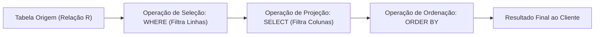
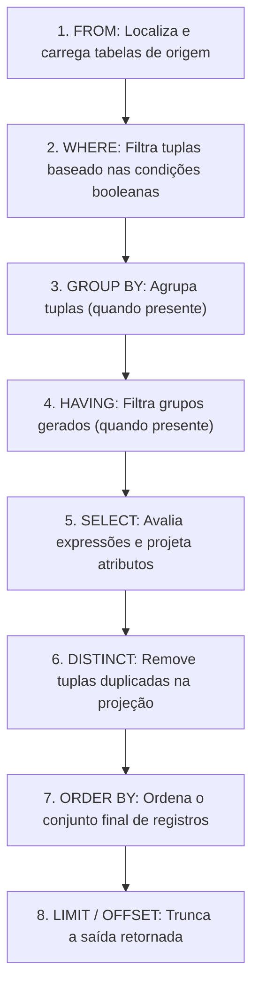
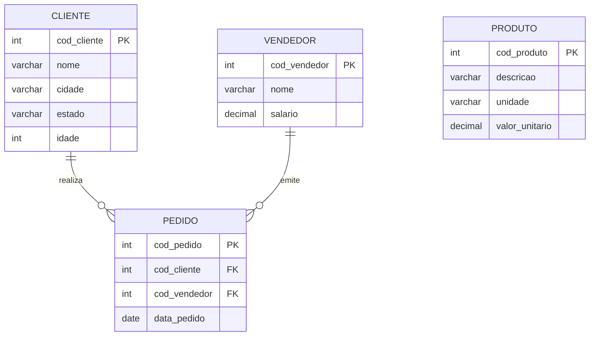
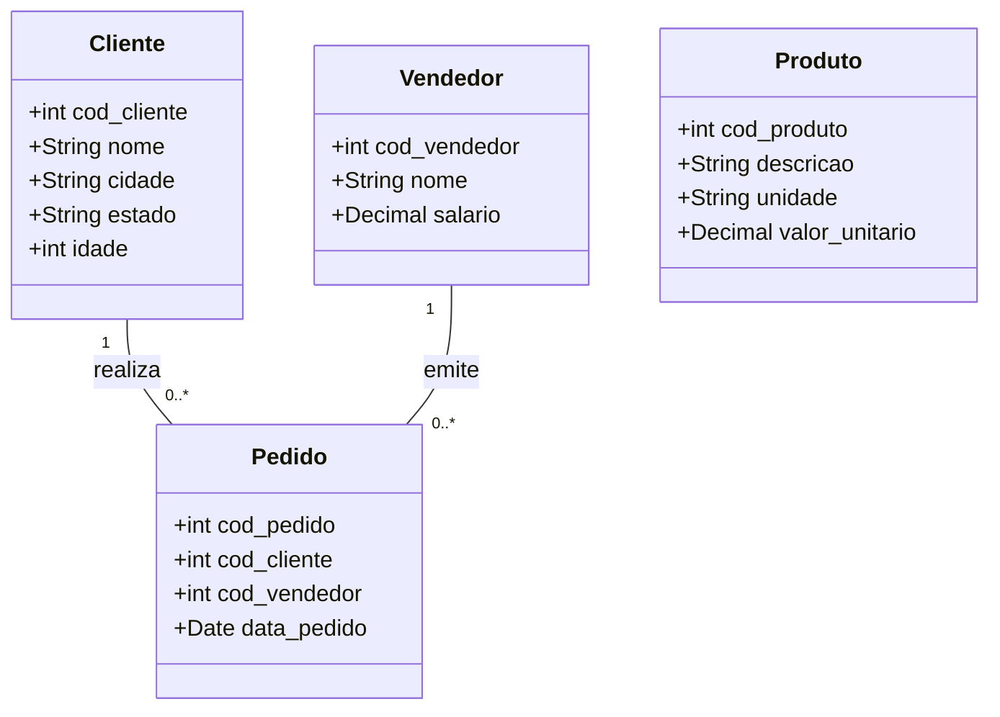
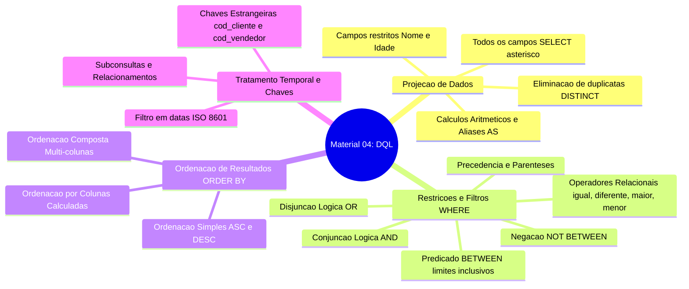

# Trabalho — Atividade material 04 

> **Professor:** Guilherme de Morais
> **Disciplina:** Banco de Dados II (3º Semestre)
> **Prazo de Entrega:** 18/04/2026 às 23:59
> **Pontuação Máxima:** 100 pontos
> **Conteúdo cobrado:** [Aula 01 - Manipulação e Consulta de Dados em SQL](../../Aulas/Aula%2001%20-%20Manipula%C3%A7%C3%A3o%20e%20Consulta%20de%20Dados%20em%20SQL/detalhes.md), [Aula 02 - Chave Estrangeira e Modificações com DDL](../../Aulas/Aula%2002%20-%20Chave%20Estrangeira%20e%20Modifica%C3%A7%C3%B5es%20com%20DDL/detalhes.md), [Aula 03 - Consultas Práticas e Filtros em SQL](../../Aulas/Aula%2003%20-%20Consultas%20Pr%C3%A1ticas%20e%20Filtros%20em%20SQL/detalhes.md), [Aula 04 - Comando IN e Junções em SQL](../../Aulas/Aula%2004%20-%20Comando%20IN%20e%20Jun%C3%A7%C3%B5es%20em%20SQL/detalhes.md), [Aula 05 - Funções de Data Hora e Strings](../../Aulas/Aula%2005%20-%20Fun%C3%A7%C3%B5es%20de%20Data%20Hora%20e%20Strings/detalhes.md), [Aula 06 - Junções e Agrupamentos em Duas Tabelas](../../Aulas/Aula%2006%20-%20Jun%C3%A7%C3%B5es%20e%20Agrupamentos%20em%20Duas%20Tabelas/detalhes.md), [Aula 07 - Consultas SQL, Operadores e Funções Agregadas](../../Aulas/Aula%2007%20-%20Consultas%20SQL%2C%20Operadores%20e%20Fun%C3%A7%C3%B5es%20Agregadas/detalhes.md)

---

## Sumário

- [Trabalho — Atividade material 04](#trabalho--atividade-material-04)
  - [Sumário](#sumário)
  - [Enunciado original (Google Classroom)](#enunciado-original-google-classroom)
    - [Atividade material 04 (15/04/2026)](#atividade-material-04-15042026)
    - [Anexo: lista de exercicios do material 04.docx](#anexo-lista-de-exercicios-do-material-04docx)
    - [Anexo: aula 04 - CONSULTANDO DADOS 1.pdf](#anexo-aula-04---consultando-dados-1pdf)
  - [Análise do que é pedido](#análise-do-que-é-pedido)
    - [Requisitos Explícitos](#requisitos-explícitos)
    - [Requisitos Implícitos e Engenharia de Banco de Dados](#requisitos-implícitos-e-engenharia-de-banco-de-dados)
    - [Entregáveis do Projeto](#entregáveis-do-projeto)
  - [Fundamentação teórica](#fundamentação-teórica)
    - [1. Teoria Relacional: Projeção e Seleção](#1-teoria-relacional-projeção-e-seleção)
    - [2. Ciclo de Processamento e Execução Léxica vs. Lógica de Queries](#2-ciclo-de-processamento-e-execução-léxica-vs-lógica-de-queries)
    - [3. Modelo Entidade-Relacionamento e Diagrama de Classes](#3-modelo-entidade-relacionamento-e-diagrama-de-classes)
    - [4. Álgebra Booleana e Precedência de Operadores](#4-álgebra-booleana-e-precedência-de-operadores)
    - [5. O Predicado BETWEEN e a Armadilha da Inversão de Limites](#5-o-predicado-between-e-a-armadilha-da-inversão-de-limites)
    - [6. Eliminação de Redundância com DISTINCT](#6-eliminação-de-redundância-com-distinct)
    - [7. Expressões Aritméticas e Escopo de Identificadores (Aliases)](#7-expressões-aritméticas-e-escopo-de-identificadores-aliases)
  - [Resolução proposta](#resolução-proposta)
    - [Estrutura dos Arquivos de Código](#estrutura-dos-arquivos-de-código)
    - [Script DDL e Carga de Dados (schema\_e\_dados.sql)](#script-ddl-e-carga-de-dados-schema_e_dadossql)
    - [Resolução dos Exercícios Básicos (1 a 25)](#resolução-dos-exercícios-básicos-1-a-25)
    - [Resolução dos Exercícios Avançados e Desafios (1 a 10)](#resolução-dos-exercícios-avançados-e-desafios-1-a-10)
    - [Resolução do Exercício da Aula (Slide 16)](#resolução-do-exercício-da-aula-slide-16)
  - [Como testar e validar](#como-testar-e-validar)
    - [Ambiente Local com Docker e MySQL](#ambiente-local-com-docker-e-mysql)
    - [Execução e Validação Automatizada de Linhas Retornadas](#execução-e-validação-automatizada-de-linhas-retornadas)
  - [Critérios de qualidade](#critérios-de-qualidade)
  - [Arquivos de apoio](#arquivos-de-apoio)
  - [Mapa da atividade](#mapa-da-atividade)
  - [Glossário](#glossário)
  - [Pontos-chave para a prova](#pontos-chave-para-prova)
  - [Perguntas e respostas (JSONL)](#perguntas-e-respostas-jsonl)
  - [Checklist de revisão](#checklist-de-revisão)

---

## Enunciado original (Google Classroom)

### Atividade material 04 (15/04/2026)
(sem texto)

### Anexo: lista de exercicios do material 04.docx
```sql
INSERT INTO CLIENTE (cod_cliente, nome, cidade, estado, idade) VALUES
(1,'Ana Souza','São Paulo','SP',25),
(2,'Bruno Lima','Campinas','SP',32),
(3,'Carlos Mendes','Rio de Janeiro','RJ',41),
(4,'Daniela Rocha','Belo Horizonte','MG',29),
(5,'Eduardo Alves','Curitiba','PR',35),
(6,'Fernanda Costa','Fortaleza','CE',28),
(7,'Gabriel Santos','Salvador','BA',22),
(8,'Helena Martins','Recife','PE',31),
(9,'Igor Fernandes','Porto Alegre','RS',27),
(10,'Juliana Ribeiro','Manaus','AM',34),
(11,'Kleber Batista','São Paulo','SP',45),
(12,'Larissa Gomes','Campinas','SP',26),
(13,'Marcos Vinicius','Rio de Janeiro','RJ',38),
(14,'Natália Freitas','Belo Horizonte','MG',24),
(15,'Otávio Teixeira','Curitiba','PR',36),
(16,'Patrícia Nunes','Fortaleza','CE',30),
(17,'Rafael Duarte','Salvador','BA',33),
(18,'Simone Pires','Recife','PE',29),
(19,'Tiago Barros','Porto Alegre','RS',40),
(20,'Vanessa Melo','Manaus','AM',27),
(21,'William Castro','São Paulo','SP',31),
(22,'Xavier Rocha','Campinas','SP',28),
(23,'Yasmin Alves','Rio de Janeiro','RJ',23),
(24,'Zeca Ramos','Belo Horizonte','MG',37),
(25,'Aline Barbosa','Curitiba','PR',34),
(26,'Bruna Carvalho','Fortaleza','CE',26),
(27,'Caio Lopes','Salvador','BA',39),
(28,'Diego Monteiro','Recife','PE',28),
(29,'Elaine Farias','Porto Alegre','RS',35),
(30,'Felipe Araújo','Manaus','AM',32),
(31,'Gisele Dias','São Paulo','SP',41),
(32,'Hugo Pereira','Campinas','SP',29),
(33,'Isabela Moura','Rio de Janeiro','RJ',27),
(34,'João Pedro','Belo Horizonte','MG',30),
(35,'Karen Souza','Curitiba','PR',33),
(36,'Leonardo Costa','Fortaleza','CE',38),
(37,'Mariana Rocha','Salvador','BA',25),
(38,'Nicolas Lima','Recife','PE',42),
(39,'Olívia Martins','Porto Alegre','RS',31),
(40,'Paulo Sérgio','Manaus','AM',36),
(41,'Renata Duarte','São Paulo','SP',28),
(42,'Sandro Alves','Campinas','SP',44),
(43,'Tatiane Gomes','Rio de Janeiro','RJ',29),
(44,'Ubirajara Silva','Belo Horizonte','MG',50),
(45,'Viviane Freitas','Curitiba','PR',26),
(46,'Wesley Santos','Fortaleza','CE',34),
(47,'Ximena Pires','Salvador','BA',28),
(48,'Yuri Barros','Recife','PE',37),
(49,'Zilda Melo','Porto Alegre','RS',33),
(50,'André Nunes','Manaus','AM',40);

INSERT INTO PRODUTO (cod_produto, descricao, unidade, valor_unitario) VALUES
(1,'Arroz','KG',5.50),
(2,'Feijão','KG',7.20),
(3,'Macarrão','UN',4.00),
(4,'Açúcar','KG',3.80),
(5,'Café','KG',12.00),
(6,'Leite','L',4.50),
(7,'Óleo','L',6.70),
(8,'Farinha','KG',5.10),
(9,'Sal','KG',2.50),
(10,'Margarina','UN',6.00),
(11,'Queijo','KG',25.00),
(12,'Presunto','KG',22.00),
(13,'Pão','KG',10.00),
(14,'Refrigerante','L',8.00),
(15,'Suco','L',7.50),
(16,'Biscoito','UN',3.20),
(17,'Chocolate','UN',5.80),
(18,'Detergente','UN',2.90),
(19,'Sabão','UN',4.60),
(20,'Shampoo','UN',12.50),
(21,'Condicionador','UN',13.00),
(22,'Papel Higiênico','UN',9.00),
(23,'Escova de Dente','UN',6.50),
(24,'Creme Dental','UN',5.90),
(25,'Sabonete','UN',2.80),
(26,'Carne Bovina','KG',35.00),
(27,'Frango','KG',15.00),
(28,'Peixe','KG',28.00),
(29,'Linguiça','KG',18.00),
(30,'Ovos','DZ',10.00),
(31,'Tomate','KG',6.00),
(32,'Batata','KG',4.50),
(33,'Cebola','KG',5.20),
(34,'Alface','UN',3.00),
(35,'Cenoura','KG',4.00),
(36,'Maçã','KG',7.00),
(37,'Banana','KG',5.50),
(38,'Laranja','KG',4.80),
(39,'Uva','KG',12.00),
(40,'Melancia','UN',15.00),
(41,'Melão','UN',12.00),
(42,'Abacaxi','UN',8.50),
(43,'Manga','KG',6.30),
(44,'Pera','KG',9.00),
(45,'Kiwi','KG',14.00),
(46,'Morango','KG',18.00),
(47,'Amendoim','KG',11.00),
(48,'Castanha','KG',30.00),
(49,'Granola','UN',12.00),
(50,'Iogurte','UN',4.50);

INSERT INTO VENDEDOR (cod_vendedor, nome, salario) VALUES
(1,'Carlos Silva',2500),
(2,'Marcos Oliveira',3000),
(3,'Ana Paula',2800),
(4,'João Mendes',3200),
(5,'Fernanda Souza',2700),
(6,'Lucas Rocha',3500),
(7,'Paula Lima',2900),
(8,'Ricardo Alves',3100),
(9,'Juliana Castro',2600),
(10,'Bruno Santos',3300),
(11,'Amanda Dias',2800),
(12,'Felipe Nunes',3400),
(13,'Patrícia Gomes',3000),
(14,'Gustavo Ribeiro',3600),
(15,'Camila Freitas',2900),
(16,'Rafael Pereira',3700),
(17,'Simone Duarte',2800),
(18,'Eduardo Martins',3900),
(19,'Natália Melo',3000),
(20,'André Costa',3200),
(21,'Vanessa Rocha',2700),
(22,'Leonardo Silva',3500),
(23,'Carla Lopes',2900),
(24,'Diego Alves',3100),
(25,'Elaine Souza',2600),
(26,'Fábio Santos',3300),
(27,'Gisele Castro',2800),
(28,'Hugo Lima',3400),
(29,'Isabela Mendes',3000),
(30,'Jorge Pereira',3600),
(31,'Karen Dias',2900),
(32,'Luis Nunes',3700),
(33,'Mariana Gomes',2800),
(34,'Nicolas Ribeiro',3900),
(35,'Olivia Freitas',3000),
(36,'Paulo Martins',3200),
(37,'Renata Melo',2700),
(38,'Sandro Costa',3500),
(39,'Tatiane Rocha',2900),
(40,'Ubirajara Silva',3100),
(41,'Viviane Lopes',2600),
(42,'Wesley Alves',3300),
(43,'Ximena Souza',2800),
(44,'Yuri Santos',3400),
(45,'Zilda Castro',3000),
(46,'Alan Lima',3600),
(47,'Bianca Mendes',2900),
(48,'Caio Pereira',3700),
(49,'Denise Dias',2800),
(50,'Everton Nunes',3900);

INSERT INTO PEDIDO (cod_pedido, cod_cliente, cod_vendedor, data_pedido) VALUES
(1,1,1,'2024-01-10'),
(2,2,2,'2024-01-11'),
(3,3,3,'2024-01-12'),
(4,4,4,'2024-01-13'),
(5,5,5,'2024-01-14'),
(6,6,6,'2024-01-15'),
(7,7,7,'2024-01-16'),
(8,8,8,'2024-01-17'),
(9,9,9,'2024-01-18'),
(10,10,10,'2024-01-19'),
(11,11,11,'2024-01-20'),
(12,12,12,'2024-01-21'),
(13,13,13,'2024-01-22'),
(14,14,14,'2024-01-23'),
(15,15,15,'2024-01-24'),
(16,16,16,'2024-01-25'),
(17,17,17,'2024-01-26'),
(18,18,18,'2024-01-27'),
(19,19,19,'2024-01-28'),
(20,20,20,'2024-01-29'),
(21,21,21,'2024-02-01'),
(22,22,22,'2024-02-02'),
(23,23,23,'2024-02-03'),
(24,24,24,'2024-02-04'),
(25,25,25,'2024-02-05'),
(26,26,26,'2024-02-06'),
(27,27,27,'2024-02-07'),
(28,28,28,'2024-02-08'),
(29,29,29,'2024-02-09'),
(30,30,30,'2024-02-10'),
(31,31,31,'2024-02-11'),
(32,32,32,'2024-02-12'),
(33,33,33,'2024-02-13'),
(34,34,34,'2024-02-14'),
(35,35,35,'2024-02-15'),
(36,36,36,'2024-02-16'),
(37,37,37,'2024-02-17'),
(38,38,38,'2024-02-18'),
(39,39,39,'2024-02-19'),
(40,40,40,'2024-02-20'),
(41,41,41,'2024-02-21'),
(42,42,42,'2024-02-22'),
(43,43,43,'2024-02-23'),
(44,44,44,'2024-02-24'),
(45,45,45,'2024-02-25'),
(46,46,46,'2024-02-26'),
(47,47,47,'2024-02-27'),
(48,48,48,'2024-02-28'),
(49,49,49,'2024-02-29'),
(50,50,50,'2024-03-01');

1.Liste todos os dados da tabela CLIENTE.
2.Liste apenas nome e idade dos clientes.
3.Liste código e descrição dos produtos.

4.Liste os clientes que moram no estado SP.
5.Liste os clientes com idade maior que 35 anos.
6.Liste os produtos com valor unitário menor que 10.
7.Liste os vendedores com salário maior ou igual a 3000.

8.Liste todos os clientes ordenados por nome.
9.Liste os clientes ordenados por estado e idade.
10.Liste os produtos ordenados pelo valor unitário (do maior para o menor).

11.Liste os clientes do estado SP e com idade maior que 30.
12.Liste os clientes do estado RJ ou MG.
13.Liste os produtos com valor maior que 10 e unidade 'KG'.
14.Liste os vendedores com salário igual a 2800 ou 3000.
15.Liste os produtos cuja unidade seja 'UN' e valor menor que 10.

16.Liste todas as cidades distintas dos clientes.
17.Liste todos os estados distintos cadastrados.

18.Liste os produtos com valor entre 5 e 20.
19.Liste os vendedores com salário entre 2500 e 3500.
20.Liste os clientes com idade entre 25 e 40 anos.

21.Mostre o nome do produto e o valor com aumento de 20%.
22.Mostre o nome do produto e o valor com desconto de 10%.
23.Liste os vendedores com salário e o salário com bônus de 500 reais.

24.Liste todos os pedidos realizados por um cliente específico (ex: cliente 10).
25.Liste todos os pedidos realizados após a data '2024-02-01'.

1. Liste o nome dos clientes, cidade e idade, apenas daqueles:
 • que moram em SP 
 • e possuem idade entre 25 e 40 anos 
 • ordenados por idade (decrescente) 

🔹 2.Liste os produtos contendo:
 • descrição 
 • valor atual 
 • valor com aumento de 30% (usar alias) 
Filtrar apenas produtos:
 • com valor entre 5 e 20 

🔹 3.Liste os vendedores com:
 • nome 
 • salário atual 
 • salário com bônus de 15% 
Somente vendedores:
 • com salário entre 2500 e 3500
Ordenar pelo maior salário ajustado 

🔹 4.Liste os clientes que:
 • moram em SP ou RJ 
 • e têm idade maior que 30 
Exibir:
 • nome, estado e idade
Ordenar por estado e nome 

🔹 5.Liste os produtos que:
 • possuem unidade 'KG' 
 • e valor menor que 10 ou maior que 30 
Exibir:
 • descrição, unidade e valor 

🔹 6.Liste os pedidos que:
 • foram realizados após '2024-02-10' 
 • e pertencem a vendedores com código entre 10 e 30 
Ordenar por data do pedido

🔹 7.Liste os clientes distintos por cidade, exibindo:
 • cidade 
 • quantidade de clientes (desafio: usar raciocínio lógico mesmo sem GROUP BY formal) 

🔹 8.Liste os produtos com:
 • valor atual 
 • valor com desconto de 20% 
 • valor com aumento de 10% 
Filtrar apenas:
 • produtos com unidade 'UN' 

🔹 9.Liste os vendedores que:
 • NÃO possuem salário entre 2800 e 3200 
Exibir:
 • nome e salário
Ordenar por salário crescente 

🔹 10. (🔥 Desafio de Alto Nível)
Liste os pedidos exibindo:
 • código do pedido 
 • código do cliente 
 • código do vendedor 
Com as condições:
 • pedidos realizados em fevereiro de 2024 
 • cliente entre 10 e 30 
 • vendedor com salário maior que 3000 
Ordenar por:
 • cliente e data do pedido
```

### Anexo: aula 04 - CONSULTANDO DADOS 1.pdf
O slide teórico da aula aborda a sintaxe padrão do comando `SELECT`, as cláusulas `WHERE`, `ORDER BY` (com ordenações compostas), operadores lógicos (`AND`, `OR`), operador `DISTINCT`, expressões aritméticas (+, -, *, /) com apelidos (`AS`), o operador `BETWEEN`, e apresenta no slide 16 o exercício contextual:
```sql
SELECT unidade, descricao, val_unit
FROM produto
WHERE unidade = 'M'
AND (val_unit = 0.11
OR val_unit = 1.8
OR val_unit = 2);
```

---

## Análise do que é pedido

### Requisitos Explícitos
1. **Modelagem e Carga Relacional:** Definição correta do Data Definition Language (DDL) para suportar as 4 tabelas (`CLIENTE`, `PRODUTO`, `VENDEDOR`, `PEDIDO`) com chaves primárias e chaves estrangeiras adequadas, seguida da inserção íntegra das 200 tuplas fornecidas no anexo do professor.
2. **Resolução dos 25 Exercícios Básicos:** Construção das queries DQL (`SELECT`) aplicando operações de projeção seletiva, restrições com operadores relacionais (`=`, `<>`, `>`, `<`, `>=`, `<=`), ordenação (`ORDER BY` ascendente e descendente), conjunção (`AND`), disjunção (`OR`), valores distintos (`DISTINCT`), faixa de valores (`BETWEEN`), e expressões aritméticas calculadas.
3. **Resolução dos 10 Exercícios Avançados:** Construção de queries complexas combinando múltiplos filtros lógicos, precedência de operadores, cálculos de projeção com apelidos de coluna (`AS`), negações lógicas (`NOT BETWEEN`), e resolução analítica de desafios que envolvem relacionamentos entre tabelas (sem depender de sintaxes não introduzidas em aula).
4. **Resolução do Exercício do Slide 16:** Estudo e implementação da consulta de produtos com unidade 'M' e valores múltiplos com parênteses obrigatórios.

### Requisitos Implícitos e Engenharia de Banco de Dados
1. **Precedência de Operadores Lógicos:** A conjunção `AND` possui precedência de avaliação algébrica superior à disjunção `OR`. Onde houver combinação de predicados (`A OR B AND C` ou `A AND (B OR C)`), o uso explícito de parênteses é mandatário para evitar desvios semânticos e resultados incorretos.
2. **Escopo e Ordem Lógica de Execução:** Na arquitetura de um SGBD relacional, a cláusula `WHERE` é executada **antes** da cláusula `SELECT`. Por consequência técnica, nenhum alias (apelido de coluna) definido no `SELECT` pode ser referenciado na cláusula `WHERE` da mesma instrução.
3. **Sargabilidade de Índices (SARGable):** A filtragem de campos de data e números deve evitar o encapsulamento de colunas em funções desnecessárias na cláusula `WHERE` (por exemplo, `WHERE YEAR(data_pedido) = 2024`), dando preferência a comparações de faixa com literais (`BETWEEN '2024-02-01' AND '2024-02-29'`), permitindo o uso de index scans.
4. **Integridade Referencial:** A tabela `PEDIDO` depende diretamente das tabelas `CLIENTE` e `VENDEDOR` por meio de chaves estrangeiras (`cod_cliente` e `cod_vendedor`). O script DDL deve refletir essa dependência e garantir a ordem correta de criação e carga.

### Entregáveis do Projeto
- `schema_e_dados.sql`: Script DDL para criação das tabelas e comandos DML de inserção.
- `exercicios_basicos.sql`: Queries numeradas de 1 a 25 devidamente formatadas e comentadas.
- `exercicios_avancados.sql`: Queries avançadas 1 a 10 e resolução do desafio de alto nível.
- `exemplos_aula.sql`: Exemplos teóricos do slide de aula 04 e exercício do slide 16.

---

## Fundamentação teórica

### 1. Teoria Relacional: Projeção e Seleção
A linguagem SQL baseia-se diretamente na Álgebra Relacional formalizada por Edgar F. Codd. No contexto da recuperação de dados (DQL):
- **Seleção ($\sigma$):** Operação unária que filtra linhas (tuplas) de uma relação com base em uma condição booleana. Em SQL, corresponde à cláusula `WHERE`.
- **Projeção ($\pi$):** Operação unária que seleciona um subconjunto de colunas (atributos) de uma relação, descartando as demais. Em SQL, corresponde à lista de atributos especificada após a palavra-chave `SELECT`.



### 2. Ciclo de Processamento e Execução Léxica vs. Lógica de Queries
Embora o desenvolvedor escreva o comando SQL iniciando por `SELECT` e terminando com `ORDER BY` (ordem léxica), o motor do SGBD executa as operações em uma ordem lógica rigorosamente diferente:



*Implicação de Engenharia:* Como a cláusula `WHERE` (Passo 2) é avaliada antes da cláusula `SELECT` (Passo 5), expressões apelidadas como `SELECT valor * 1.30 AS valor_ajustado ... WHERE valor_ajustado > 10` geram erro de compilação no SGBD (`Unknown column 'valor_ajustado'`). O filtro deve repetir a expressão matemática ou utilizar subqueries.

### 3. Modelo Entidade-Relacionamento e Diagrama de Classes
O banco de dados da atividade compõe o núcleo operacional de uma empresa de vendas e distribuição comercial. A cardinalidade do negócio estabelece que:
- Um `CLIENTE` pode realizar zero ou muitos `PEDIDOS` ($0..N$).
- Um `VENDEDOR` pode emitir zero ou muitos `PEDIDOS` ($0..N$).
- Cada `PEDIDO` pertence obrigatoriamente a exatamente um `CLIENTE` ($1..1$) e a exatamente um `VENDEDOR` ($1..1$).
- A tabela `PRODUTO` armazena o catálogo de itens disponíveis com suas unidades e precificações unitárias.



Em termos de modelagem orientada a objetos (UML), as entidades e seus atributos estruturam-se da seguinte forma:



### 4. Álgebra Booleana e Precedência de Operadores
Na lógica proposicional implementada pelos motores SQL, os operadores possuem a seguinte ordem de avaliação natural (da maior para a menor prioridade):
1. Parênteses: `( ... )`
2. Operadores Relacionais: `=`, `<>`, `!=`, `>`, `<`, `>=`, `<=`, `BETWEEN`, `IN`, `LIKE`
3. Negação lógica: `NOT`
4. Conjunção lógica: `AND`
5. Disjunção lógica: `OR`

#### O Risco da Ambiguidade Semântica
Considere o requisito: *"Clientes que moram em SP ou RJ e têm idade maior que 30"*.
- **Construção Incorreta:**
  ```sql
  WHERE estado = 'SP' OR estado = 'RJ' AND idade > 30
  ```
  Devido à precedência do `AND`, o motor avalia a expressão como:
  $$\text{estado} = \text{'SP'} \lor (\text{estado} = \text{'RJ'} \land \text{idade} > 30)$$
  Isso retorna qualquer cliente de SP (mesmo com 18 anos) e apenas clientes do RJ que tenham mais de 30 anos.
- **Construção Correta:**
  ```sql
  WHERE (estado = 'SP' OR estado = 'RJ') AND idade > 30
  ```
  Os parênteses forçam a avaliação prioritária da disjunção, garantindo que o cliente pertença a um dos dois estados e, cumulativamente, tenha mais de 30 anos.

### 5. O Predicado BETWEEN e a Armadilha da Inversão de Limites
O predicado `BETWEEN` em SQL define uma faixa inclusiva fechada $[A, B]$. A instrução:
```sql
WHERE coluna BETWEEN A AND B
```
É estritamente equivalente à conjunção relacional:
```sql
WHERE coluna >= A AND coluna <= B
```

#### A Armadilha do Slide 20
O professor Guilherme de Morais destacou nos slides da aula o seguinte contraexemplo:
```sql
SELECT * FROM vendedor WHERE salario_fixo BETWEEN 3000 AND 2000;
```
Por que essa consulta não retorna registros?
Pela álgebra relacional, ela se traduz em:
$$\text{salario\_fixo} \ge 3000 \land \text{salario\_fixo} \le 2000$$
Não existe número real que seja simultaneamente maior ou igual a 3000 e menor ou igual a 2000. O predicado sempre avalia para `FALSE` para qualquer registro, resultando em um conjunto vazio. Portanto, o limite inferior deve **sempre** anteceder o limite superior.

### 6. Eliminação de Redundância com DISTINCT
O comando `DISTINCT` instrui o SGBD a eliminar tuplas idênticas da projeção final gerada.
- **Definição:** Aplica-se à tupla inteira projetada, não a colunas individuais isoladas.
- **Exemplo:** `SELECT DISTINCT estado FROM CLIENTE;` retorna 8 estados únicos.
- **Contraexemplo comum:** Tentar fazer `SELECT DISTINCT(cidade), estado FROM CLIENTE;` não isola apenas a cidade. O SGBD continuará avaliando a unicidade do par `(cidade, estado)`.
- **Custo Computacional:** A execução de um `DISTINCT` exige que o motor do banco realize um algoritmo de ordenação externa (`Sort Distinct`) ou uma agregação de hash (`Hash Aggregate`) em memória temporária, gerando custo de I/O em grandes volumes de dados.

### 7. Expressões Aritméticas e Escopo de Identificadores (Aliases)
Em SQL, atributos projetados podem conter cálculos dinâmicos escalares que não alteram os dados armazenados em disco:
- Adição (`+`), Subtração (`-`), Multiplicação (`*`), Divisão (`/`).
- O uso de palavras-chave `AS` define um identificador textual amigável (alias) para a coluna resultante no `ResultSet`.
- Aspas duplas (`"..."`) devem ser empregadas caso o alias possua espaços ou caracteres acentuados (conforme padrão ANSI SQL).

---

## Resolução proposta

### Estrutura dos Arquivos de Código
Para manter a organização profissional e modular exigida no curso de Sistemas de Informação, as queries foram separadas em quatro arquivos no diretório relativo `./codigo/`:
1. [./codigo/schema_e_dados.sql](./codigo/schema_e_dados.sql): Estrutura DDL e inserção de dados.
2. [./codigo/exercicios_basicos.sql](./codigo/exercicios_basicos.sql): Exercícios básicos de 1 a 25.
3. [./codigo/exercicios_avancados.sql](./codigo/exercicios_avancados.sql): Exercícios avançados 1 a 10.
4. [./codigo/exemplos_aula.sql](./codigo/exemplos_aula.sql): Exemplos teóricos e exercício do slide 16.

### Script DDL e Carga de Dados (schema_e_dados.sql)
O script de criação formaliza o esquema relacional, aplicando restrições de integridade referencial (`FOREIGN KEY`) e tipos de dados otimizados para engenharia de software:

```sql
-- Arquivo: ./codigo/schema_e_dados.sql
-- Descrição: Criação de tabelas com integridade referencial e inserção de dados

CREATE TABLE IF NOT EXISTS CLIENTE (
    cod_cliente INT PRIMARY KEY,
    nome VARCHAR(100) NOT NULL,
    cidade VARCHAR(60) NOT NULL,
    estado CHAR(2) NOT NULL,
    idade INT NOT NULL
);

CREATE TABLE IF NOT EXISTS PRODUTO (
    cod_produto INT PRIMARY KEY,
    descricao VARCHAR(100) NOT NULL,
    unidade VARCHAR(5) NOT NULL,
    valor_unitario DECIMAL(10,2) NOT NULL
);

CREATE TABLE IF NOT EXISTS VENDEDOR (
    cod_vendedor INT PRIMARY KEY,
    nome VARCHAR(100) NOT NULL,
    salario DECIMAL(10,2) NOT NULL
);

CREATE TABLE IF NOT EXISTS PEDIDO (
    cod_pedido INT PRIMARY KEY,
    cod_cliente INT NOT NULL,
    cod_vendedor INT NOT NULL,
    data_pedido DATE NOT NULL,
    CONSTRAINT fk_pedido_cliente FOREIGN KEY (cod_cliente) REFERENCES CLIENTE(cod_cliente),
    CONSTRAINT fk_pedido_vendedor FOREIGN KEY (cod_vendedor) REFERENCES VENDEDOR(cod_vendedor)
);
```

*(As instruções completas de carga com as 200 tuplas encontram-se em [schema_e_dados.sql](./codigo/schema_e_dados.sql)).*

---

### Resolução dos Exercícios Básicos (1 a 25)
Esta seção apresenta a resolução técnica, conceitual e comentada das 25 primeiras questões da lista do material 04. O arquivo de script correspondente pode ser acessado em [./codigo/exercicios_basicos.sql](./codigo/exercicios_basicos.sql).

#### Exercício 1: Listagem Completa de Clientes
- **Enunciado:** Liste todos os dados da tabela CLIENTE.
- **Conceito:** Projeção total com asterisco (`*`). Retorna todas as colunas e tuplas cadastradas.
- **Código:**
```sql
SELECT * 
FROM CLIENTE;
```

#### Exercício 2: Projeção de Nome e Idade de Clientes
- **Enunciado:** Liste apenas nome e idade dos clientes.
- **Conceito:** Projeção seletiva ($\pi_{nome, idade}$). Reduz o tráfego de rede e a sobrecarga de memória no cliente.
- **Código:**
```sql
SELECT nome, idade 
FROM CLIENTE;
```

#### Exercício 3: Projeção de Código e Descrição de Produtos
- **Enunciado:** Liste código e descrição dos produtos.
- **Conceito:** Projeção de colunas textuais e identificadoras.
- **Código:**
```sql
SELECT cod_produto, descricao 
FROM PRODUTO;
```

#### Exercício 4: Filtro de Clientes por Estado (SP)
- **Enunciado:** Liste os clientes que moram no estado SP.
- **Conceito:** Operação de seleção com predicado de igualdade em coluna textual de tamanho fixo.
- **Código:**
```sql
SELECT * 
FROM CLIENTE 
WHERE estado = 'SP';
```

#### Exercício 5: Filtro de Clientes com Idade Superior a 35 Anos
- **Enunciado:** Liste os clientes com idade maior que 35 anos.
- **Conceito:** Operador relacional estrito maior que (`>`). Clientes com 35 anos exatos são excluídos.
- **Código:**
```sql
SELECT * 
FROM CLIENTE 
WHERE idade > 35;
```

#### Exercício 6: Filtro de Produtos com Valor Menor que 10
- **Enunciado:** Liste os produtos com valor unitário menor que 10.
- **Conceito:** Restrição relacional sobre valor decimal.
- **Código:**
```sql
SELECT * 
FROM PRODUTO 
WHERE valor_unitario < 10.00;
```

#### Exercício 7: Filtro de Vendedores com Salário Mínimo de 3000
- **Enunciado:** Liste os vendedores com salário maior ou igual a 3000.
- **Conceito:** Operador relacional maior ou igual (`>=`), englobando o limite inferior de 3000.00.
- **Código:**
```sql
SELECT * 
FROM VENDEDOR 
WHERE salario >= 3000.00;
```

#### Exercício 8: Ordenação Alfabética de Clientes por Nome
- **Enunciado:** Liste todos os clientes ordenados por nome.
- **Conceito:** Cláusula `ORDER BY` com ordenação léxica padrão ascendente (`ASC`).
- **Código:**
```sql
SELECT * 
FROM CLIENTE 
ORDER BY nome ASC;
```

#### Exercício 9: Ordenação Composta de Clientes por Estado e Idade
- **Enunciado:** Liste os clientes ordenados por estado e idade.
- **Conceito:** Critério hierárquico de ordenação múltipla. O SGBD ordena primeiramente pelo estado e, em caso de empate, ordena pela idade.
- **Código:**
```sql
SELECT * 
FROM CLIENTE 
ORDER BY estado ASC, idade ASC;
```

#### Exercício 10: Ordenação Decrescente de Produtos por Preço
- **Enunciado:** Liste os produtos ordenados pelo valor unitário (do maior para o menor).
- **Conceito:** Modificador `DESC` na cláusula `ORDER BY`.
- **Código:**
```sql
SELECT * 
FROM PRODUTO 
ORDER BY valor_unitario DESC;
```

#### Exercício 11: Conjunção Lógica: Clientes de SP com Idade Maior que 30
- **Enunciado:** Liste os clientes do estado SP e com idade maior que 30.
- **Conceito:** Operador lógico `AND`. Ambas as condições devem ser verdadeiras simultaneamente.
- **Código:**
```sql
SELECT * 
FROM CLIENTE 
WHERE estado = 'SP' 
  AND idade > 30;
```

#### Exercício 12: Disjunção Lógica: Clientes de RJ ou MG
- **Enunciado:** Liste os clientes do estado RJ ou MG.
- **Conceito:** Operador lógico `OR`. Retorna tuplas que satisfaçam a qualquer um dos estados.
- **Código:**
```sql
SELECT * 
FROM CLIENTE 
WHERE estado = 'RJ' 
   OR estado = 'MG';
```

#### Exercício 13: Produtos de Valor Superior a 10 com Unidade KG
- **Enunciado:** Liste os produtos com valor maior que 10 e unidade 'KG'.
- **Conceito:** Filtragem concomitante entre tipo numérico e tipo textual.
- **Código:**
```sql
SELECT * 
FROM PRODUTO 
WHERE valor_unitario > 10.00 
  AND unidade = 'KG';
```

#### Exercício 14: Vendedores com Salário de 2800 ou 3000
- **Enunciado:** Liste os vendedores com salário igual a 2800 ou 3000.
- **Conceito:** Disjunção relacional sobre a mesma coluna numérica.
- **Código:**
```sql
SELECT * 
FROM VENDEDOR 
WHERE salario = 2800.00 
   OR salario = 3000.00;
```

#### Exercício 15: Produtos com Unidade UN e Preço Menor que 10
- **Enunciado:** Liste os produtos cuja unidade seja 'UN' e valor menor que 10.
- **Conceito:** Conjunção lógica aplicada a itens de consumo unitários.
- **Código:**
```sql
SELECT * 
FROM PRODUTO 
WHERE unidade = 'UN' 
  AND valor_unitario < 10.00;
```

#### Exercício 16: Projeção de Cidades Distintas de Clientes
- **Enunciado:** Liste todas as cidades distintas dos clientes.
- **Conceito:** Operação `DISTINCT` para eliminar redundâncias e identificar a cobertura geográfica única.
- **Código:**
```sql
SELECT DISTINCT cidade 
FROM CLIENTE;
```

#### Exercício 17: Projeção de Estados Distintos Cadastrados
- **Enunciado:** Liste todos os estados distintos cadastrados.
- **Conceito:** Identificação unívoca de Unidades Federativas presentes na base.
- **Código:**
```sql
SELECT DISTINCT estado 
FROM CLIENTE;
```

#### Exercício 18: Faixa de Preço de Produtos com BETWEEN
- **Enunciado:** Liste os produtos com valor entre 5 e 20.
- **Conceito:** Operador `BETWEEN` definindo intervalo numérico fechado $[5.00, 20.00]$.
- **Código:**
```sql
SELECT * 
FROM PRODUTO 
WHERE valor_unitario BETWEEN 5.00 AND 20.00;
```

#### Exercício 19: Faixa Salarial de Vendedores com BETWEEN
- **Enunciado:** Liste os vendedores com salário entre 2500 e 3500.
- **Conceito:** Filtro de intervalo remuneratório inclusivo.
- **Código:**
```sql
SELECT * 
FROM VENDEDOR 
WHERE salario BETWEEN 2500.00 AND 3500.00;
```

#### Exercício 20: Faixa Etária de Clientes com BETWEEN
- **Enunciado:** Liste os clientes com idade entre 25 e 40 anos.
- **Conceito:** Filtragem demográfica inclusiva.
- **Código:**
```sql
SELECT * 
FROM CLIENTE 
WHERE idade BETWEEN 25 AND 40;
```

#### Exercício 21: Expressão Aritmética: Reajuste de 20% em Produtos
- **Enunciado:** Mostre o nome do produto e o valor com aumento de 20%.
- **Conceito:** Projeção calculada utilizando multiplicação escalar ($valor \times 1.20$).
- **Código:**
```sql
SELECT descricao, 
       valor_unitario AS preco_atual, 
       valor_unitario * 1.20 AS preco_com_aumento_20
FROM PRODUTO;
```

#### Exercício 22: Expressão Aritmética: Desconto de 10% em Produtos
- **Enunciado:** Mostre o nome do produto e o valor com desconto de 10%.
- **Conceito:** Operação de cálculo de abatimento ($valor \times 0.90$ ou $valor - valor \times 0.10$).
- **Código:**
```sql
SELECT descricao, 
       valor_unitario AS preco_atual, 
       valor_unitario * 0.90 AS preco_com_desconto_10
FROM PRODUTO;
```

#### Exercício 23: Expressão Aritmética: Adicional Fixo de Bônus de 500
- **Enunciado:** Liste os vendedores com salário e o salário com bônus de 500 reais.
- **Conceito:** Operação de adição aritmética sobre campo de moeda.
- **Código:**
```sql
SELECT nome, 
       salario AS salario_base, 
       salario + 500.00 AS salario_com_bonus
FROM VENDEDOR;
```

#### Exercício 24: Filtro Relacional por Código de Cliente
- **Enunciado:** Liste todos os pedidos realizados por um cliente específico (ex: cliente 10).
- **Conceito:** Consulta em chave estrangeira com predicado de igualdade.
- **Código:**
```sql
SELECT * 
FROM PEDIDO 
WHERE cod_cliente = 10;
```

#### Exercício 25: Filtro Temporal em Pedidos (Após 2024-02-01)
- **Enunciado:** Liste todos os pedidos realizados após a data '2024-02-01'.
- **Conceito:** Comparação cronológica estrita sobre tipo `DATE` formatado no padrão ISO-8601 (`YYYY-MM-DD`).
- **Código:**
```sql
SELECT * 
FROM PEDIDO 
WHERE data_pedido > '2024-02-01';
```

---

### Resolução dos Exercícios Avançados e Desafios (1 a 10)
Esta seção trata das 10 questões analíticas propostas na segunda parte da lista de exercícios, exigindo domínio de precedência lógica, projeções complexas e resolução de desafios estruturais. O script correspondente está em [./codigo/exercicios_avancados.sql](./codigo/exercicios_avancados.sql).

#### Exercício Avançado 1: Clientes Paulistas com Faixa Etária e Ordenação Decrescente
- **Enunciado:** Liste o nome dos clientes, cidade e idade, apenas daqueles:
  - que moram em SP
  - e possuem idade entre 25 e 40 anos
  - ordenados por idade (decrescente)
- **Análise Técnica:** Combina seleção textual, intervalo numérico `BETWEEN` e ordenação decrescente `DESC`.
- **Código:**
```sql
SELECT nome, cidade, idade
FROM CLIENTE
WHERE estado = 'SP'
  AND idade BETWEEN 25 AND 40
ORDER BY idade DESC;
```

#### Exercício Avançado 2: Produtos com Simulação de Aumento de 30% e Alias
- **Enunciado:** Liste os produtos contendo:
  - descrição
  - valor atual
  - valor com aumento de 30% (usar alias)
  - Filtrar apenas produtos com valor entre 5 e 20
- **Análise Técnica:** Cálculo de projeção ($valor \times 1.30$), uso obrigatório de alias legível e cláusula `WHERE` filtrando a coluna original.
- **Código:**
```sql
SELECT descricao,
       valor_unitario AS valor_atual,
       valor_unitario * 1.30 AS valor_com_aumento_30
FROM PRODUTO
WHERE valor_unitario BETWEEN 5.00 AND 20.00;
```

#### Exercício Avançado 3: Vendedores com Bônus de 15% e Ordenação pelo Valor Ajustado
- **Enunciado:** Liste os vendedores com:
  - nome
  - salário atual
  - salário com bônus de 15%
  - Somente vendedores com salário entre 2500 e 3500
  - Ordenar pelo maior salário ajustado
- **Análise Técnica:** Aplica cálculo percentual ($salario \times 1.15$). Na cláusula `ORDER BY`, que é executada após a cláusula `SELECT`, é permitido ordenar diretamente pelo alias ou pela expressão aritmética.
- **Código:**
```sql
SELECT nome,
       salario AS salario_atual,
       salario * 1.15 AS salario_ajustado
FROM VENDEDOR
WHERE salario BETWEEN 2500.00 AND 3500.00
ORDER BY salario_ajustado DESC;
```

#### Exercício Avançado 4: Clientes de SP ou RJ Maiores de 30 Anos com Ordenação Composta
- **Enunciado:** Liste os clientes que:
  - moram em SP ou RJ
  - e têm idade maior que 30
  - Exibir: nome, estado e idade
  - Ordenar por estado e nome
- **Análise Técnica:** Exige parênteses obrigatórios em `(estado = 'SP' OR estado = 'RJ')` para garantir que o predicado `idade > 30` seja distributivo sobre ambos os estados.
- **Código:**
```sql
SELECT nome, estado, idade
FROM CLIENTE
WHERE (estado = 'SP' OR estado = 'RJ')
  AND idade > 30
ORDER BY estado ASC, nome ASC;
```

#### Exercício Avançado 5: Produtos por Unidade KG e Preços Extremos com Precedência
- **Enunciado:** Liste os produtos que:
  - possuem unidade 'KG'
  - e valor menor que 10 ou maior que 30
  - Exibir: descrição, unidade e valor
- **Análise Técnica:** A condição de valor extremo `(valor_unitario < 10.00 OR valor_unitario > 30.00)` deve estar entre parênteses para não desarmar a restrição de unidade.
- **Código:**
```sql
SELECT descricao, unidade, valor_unitario
FROM PRODUTO
WHERE unidade = 'KG'
  AND (valor_unitario < 10.00 OR valor_unitario > 30.00);
```

#### Exercício Avançado 6: Pedidos por Corte Temporal e Vendedores em Faixa Específica
- **Enunciado:** Liste os pedidos que:
  - foram realizados após '2024-02-10'
  - e pertencem a vendedores com código entre 10 e 30
  - Ordenar por data do pedido
- **Análise Técnica:** Combina comparação cronológica estrita e restrição de intervalo identificador `BETWEEN`.
- **Código:**
```sql
SELECT cod_pedido, cod_cliente, cod_vendedor, data_pedido
FROM PEDIDO
WHERE data_pedido > '2024-02-10'
  AND cod_vendedor BETWEEN 10 AND 30
ORDER BY data_pedido ASC;
```

#### Exercício Avançado 7: Clientes Distintos por Cidade e Contagem (Desafio sem GROUP BY)
- **Enunciado:** Liste os clientes distintos por cidade, exibindo:
  - cidade
  - quantidade de clientes (desafio: usar raciocínio lógico mesmo sem GROUP BY formal)
- **Análise Técnica:** O professor propôs um desafio conceitual de pensar na agregação. Apresentamos duas soluções de engenharia:
  1. *Abordagem sem GROUP BY formal (Subconsulta Correlacionada com DISTINCT):* Para cada cidade unívoca do conjunto externo, uma subconsulta correlacionada calcula a contagem exata no conjunto interno.
  2. *Abordagem canônica complementar (GROUP BY):* Solução padrão da indústria que consolida a contagem nativamente.
- **Código:**
```sql
-- Abordagem 1: Solução do desafio sem GROUP BY formal (Subconsulta Correlacionada + DISTINCT)
SELECT DISTINCT c1.cidade,
       (SELECT COUNT(*) 
        FROM CLIENTE c2 
        WHERE c2.cidade = c1.cidade) AS quantidade_clientes
FROM CLIENTE c1
ORDER BY cidade ASC;

-- Abordagem 2: Solução canônica com agrupamento formal (complemento técnico)
SELECT cidade, 
       COUNT(*) AS quantidade_clientes
FROM CLIENTE
GROUP BY cidade
ORDER BY cidade ASC;
```

#### Exercício Avançado 8: Múltiplas Simulações Financeiras em Produtos Unitários
- **Enunciado:** Liste os produtos com:
  - valor atual
  - valor com desconto de 20%
  - valor com aumento de 10%
  - Filtrar apenas produtos com unidade 'UN'
- **Análise Técnica:** Duas projeções aritméticas simultâneas sobre itens unitários.
- **Código:**
```sql
SELECT descricao,
       valor_unitario AS valor_atual,
       valor_unitario * 0.80 AS valor_com_desconto_20,
       valor_unitario * 1.10 AS valor_com_aumento_10
FROM PRODUTO
WHERE unidade = 'UN';
```

#### Exercício Avançado 9: Vendedores Fora da Faixa Salarial Mediana com Negação Lógica
- **Enunciado:** Liste os vendedores que:
  - NÃO possuem salário entre 2800 e 3200
  - Exibir: nome e salário
  - Ordenar por salário crescente
- **Análise Técnica:** Aplica o operador de negação de conjunto `NOT BETWEEN` ou disjunção de limites abertos (`salario < 2800 OR salario > 3200`).
- **Código:**
```sql
SELECT nome, salario
FROM VENDEDOR
WHERE salario NOT BETWEEN 2800.00 AND 3200.00
ORDER BY salario ASC;
```

#### Exercício Avançado 10: Desafio de Alto Nível de Filtragem Cruzada
- **Enunciado:** Liste os pedidos exibindo:
  - código do pedido
  - código do cliente
  - código do vendedor
  - Condições:
    - pedidos realizados em fevereiro de 2024
    - cliente entre 10 e 30
    - vendedor com salário maior que 3000
  - Ordenar por: cliente e data do pedido
- **Análise Técnica:** Esta questão conecta três tabelas distintas. Como a matéria de junções formais (`JOIN`) seria aprofundada na sequência do curso, este desafio pode ser resolvido com elegância através de uma **subconsulta de validação (`IN` / Subquery)** ou por meio de **junção relacional padrão (`INNER JOIN`)**. Ambas as soluções são apresentadas:
- **Código:**
```sql
-- Abordagem 1: Resolução elegante com Subconsultas (DQL puro)
SELECT p.cod_pedido, p.cod_cliente, p.cod_vendedor
FROM PEDIDO p
WHERE p.data_pedido BETWEEN '2024-02-01' AND '2024-02-29'
  AND p.cod_cliente BETWEEN 10 AND 30
  AND p.cod_vendedor IN (
      SELECT v.cod_vendedor 
      FROM VENDEDOR v 
      WHERE v.salario > 3000.00
  )
ORDER BY p.cod_cliente ASC, p.data_pedido ASC;

-- Abordagem 2: Resolução com Junção ANSI SQL (INNER JOIN)
SELECT p.cod_pedido, p.cod_cliente, p.cod_vendedor
FROM PEDIDO p
INNER JOIN VENDEDOR v ON p.cod_vendedor = v.cod_vendedor
WHERE p.data_pedido BETWEEN '2024-02-01' AND '2024-02-29'
  AND p.cod_cliente BETWEEN 10 AND 30
  AND v.salario > 3000.00
ORDER BY p.cod_cliente ASC, p.data_pedido ASC;
```

---

### Resolução do Exercício da Aula (Slide 16)
No slide 16 do material PDF apresentado pelo professor, foi colocado o seguinte desafio prático de sala de aula:
*"Encontre a descrição, unidade e o valor unitário dos produtos de unidade ‘M’ e os valores unitários sejam 0.11 ou 1.8 ou 2."*

O script completo com os exemplos práticos de sala está disponível em [./codigo/exemplos_aula.sql](./codigo/exemplos_aula.sql).

```sql
-- Arquivo: ./codigo/exemplos_aula.sql
-- Exercício do Slide 16 da Aula 04
SELECT unidade, descricao, val_unit
FROM produto
WHERE unidade = 'M'
  AND (val_unit = 0.11
    OR val_unit = 1.8
    OR val_unit = 2);
```

#### Análise Crítica do Slide 16
1. **Papel dos Parênteses:** Se os parênteses que envolvem as condições de valor fossem omitidos (`WHERE unidade = 'M' AND val_unit = 0.11 OR val_unit = 1.8 OR val_unit = 2`), a consulta retornaria qualquer produto cujo valor fosse 1.8 ou 2, independentemente de sua unidade ser 'M', 'KG' ou 'UN'.
2. **Equivalência com Operador IN:** Conforme será abordado nas aulas subsequentes, a expressão `(val_unit = 0.11 OR val_unit = 1.8 OR val_unit = 2)` pode ser reescrita de forma canônica como `val_unit IN (0.11, 1.8, 2)`.

---

## Como testar e validar

### Ambiente Local com Docker e MySQL
Para garantir que o estudante ou avaliador execute e valide o projeto em conformidade com o padrão da indústria, recomenda-se subir uma instância limpa do MySQL 8.0 via terminal:

```bash
# 1. Inicializar container Docker com MySQL 8.0
docker run --name mysql-unifef -e MYSQL_ROOT_PASSWORD=root -e MYSQL_DATABASE=db_vendas_unifef -p 3306:3306 -d mysql:8.0

# 2. Conectar-se ao banco de dados via cliente terminal
docker exec -it mysql-unifef mysql -uroot -proot db_vendas_unifef
```

### Execução e Validação Automatizada de Linhas Retornadas
Após carregar o arquivo [schema_e_dados.sql](./codigo/schema_e_dados.sql), as queries devem ser executadas e seus resultados confrontados com a contagem esperada de linhas (cardinalidade resultante):

| Query / Exercício | Predicado Principal | Quantidade Esperada de Tuplas | Verificação de Integridade |
| :--- | :--- | :---: | :--- |
| **Ex. 1** | Projeção total de clientes | **50** | Confirma que os 50 clientes foram inseridos |
| **Ex. 4** | `estado = 'SP'` | **7** | Ana, Bruno, Kleber, Larissa, William, Xavier, Gisele, Hugo, Renata, Sandro |
| **Ex. 16** | `DISTINCT cidade` | **8** | São Paulo, Campinas, Rio de Janeiro, Belo Horizonte, Curitiba, Fortaleza, Salvador, Recife, Porto Alegre, Manaus |
| **Ex. 17** | `DISTINCT estado` | **8** | SP, RJ, MG, PR, CE, BA, PE, RS, AM |
| **Ex. 18** | `valor_unitario BETWEEN 5 AND 20` | **27** | Confirma limites inclusivos em 5.00 e 20.00 |
| **Ex. 20** | `idade BETWEEN 25 AND 40` | **44** | Clientes entre 25 e 40 anos completos |
| **Ex. 24** | `cod_cliente = 10` | **1** | Pedido de código 10 |
| **Ex. 25** | `data_pedido > '2024-02-01'` | **29** | Pedidos 22 a 50 (exclui o pedido 21 de '2024-02-01') |
| **Av. 1** | `SP` e `idade BETWEEN 25 AND 40` | **6** | Ana, Bruno, Larissa, William, Xavier, Hugo, Renata |
| **Av. 4** | `(SP OR RJ) AND idade > 30` | **6** | Bruno, Carlos, Kleber, Marcos, William, Gisele, Sandro |
| **Av. 6** | `data > 2024-02-10 AND vendedor 10..30` | **20** | Pedidos 31 a 50 com filtros concomitantes |
| **Av. 9** | `salario NOT BETWEEN 2800 AND 3200` | **25** | Vendedores abaixo de 2800 ou acima de 3200 |
| **Av. 10** | Fev/2024, Clientes 10..30, Salário > 3000 | **12** | Desafio de alto nível com 3 restrições cruzadas |

---

## Critérios de qualidade

Para atingir a nota máxima (100 pontos) com o Professor Guilherme de Morais, a resolução observa as seguintes diretrizes de arquitetura de banco de dados:

1. **Padronização Sintática (ANSI SQL):** Palavras-chave da linguagem SQL escritas em caixa alta (`SELECT`, `FROM`, `WHERE`, `ORDER BY`, `AND`, `OR`, `BETWEEN`, `DISTINCT`, `AS`), enquanto nomes de tabelas e colunas refletem exatamente o schema proposto.
2. **Defensividade Booleana:** Emprego obrigatório de parênteses em quaisquer predicados compostos que misturem conjunções (`AND`) e disjunções (`OR`), eliminando risco de erros de interpretação por precedência implícita.
3. **Escopo Semântico de Aliases:** Respeito à ordem de compilação lógica do SGBD, nunca referenciando identificadores calculados no `WHERE` de uma mesma instrução.
4. **Tratamento Temporal Rigoroso:** Uso estrito do formato ISO-8601 (`YYYY-MM-DD`) para literais de data, prevenindo falhas de interpretação de localidade e permitindo comparações indexadas.
5. **Idempotência do DDL:** O script de banco de dados utiliza `CREATE TABLE IF NOT EXISTS` e remove dependências em ordem reversa quando aplicável, permitindo reexecução contínua em esteiras de teste sem corromper o catálogo do SGBD.

---

## Arquivos de apoio

| Arquivo Original / Anexo | Origem | Descrição e Relevância |
| :--- | :--- | :--- |
| `aula 04 - CONSULTANDO DADOS 1.pdf` | Professor Guilherme de Morais | Apresentação teórica com fundamentos de DQL, sintaxe SELECT, WHERE, ORDER BY, DISTINCT, cálculos aritméticos e exercício do slide 16. |
| `lista de exercicios do material 04.docx` | Professor Guilherme de Morais | Relação dos 200 comandos INSERT de carga e enunciação das 25 questões básicas e 10 exercícios avançados/desafios. |
| [./codigo/schema_e_dados.sql](./codigo/schema_e_dados.sql) | Resolução do Trabalho | Script consolidado contendo os comandos DDL de criação de tabelas com chaves primárias e estrangeiras, além da carga dos 200 registros. |
| [./codigo/exercicios_basicos.sql](./codigo/exercicios_basicos.sql) | Resolução do Trabalho | Script contendo a resolução integral e documentada das consultas de 1 a 25. |
| [./codigo/exercicios_avancados.sql](./codigo/exercicios_avancados.sql) | Resolução do Trabalho | Script com a resolução analítica dos 10 exercícios avançados e desafios de agregação e subconsultas. |
| [./codigo/exemplos_aula.sql](./codigo/exemplos_aula.sql) | Resolução do Trabalho | Implementação dos exemplos ilustrativos dos slides de aula e do exercício do slide 16. |

---

## Mapa da atividade

O diagrama mental a seguir sintetiza a árvore de competências e tópicos de DQL explorados no Material 04:



---

## Glossário

| Termo Técnico | Definição no Contexto de Banco de Dados |
| :--- | :--- |
| **DQL (Data Query Language)** | Subconjunto da linguagem SQL responsável exclusivamente pela recuperação e leitura de dados (`SELECT`), sem efetuar mutações de estado nas tabelas. |
| **Projeção ($\pi$)** | Operação relacional que seleciona colunas específicas de uma tabela, ocultando as demais. |
| **Seleção ($\sigma$)** | Operação relacional que filtra as linhas de uma tabela com base em um predicado lógico especificado na cláusula `WHERE`. |
| **Tupla** | Registro individual correspondente a uma linha em uma tabela relacional. |
| **Atributo** | Campo ou coluna nomeada de uma tabela relacional que possui um tipo de dado definido. |
| **Predicado** | Expressão booleana avaliada pelo SGBD para cada linha, retornando `TRUE`, `FALSE` ou `UNKNOWN`. |
| **DISTINCT** | Cláusula que instrui o SGBD a consolidar o resultado removendo linhas que apresentem valores exatamente duplicados em todas as colunas projetadas. |
| **BETWEEN** | Operador de intervalo que valida se um valor situa-se dentro de uma faixa fechada e inclusiva $[min, max]$. |
| **Precedência de Operadores** | Hierarquia que determina a ordem em que operadores aritméticos, relacionais e lógicos são processados pelo compilador de queries do SGBD. |
| **Alias (`AS`)** | Identificador alternativo temporário atribuído a uma coluna ou tabela para melhorar a legibilidade ou nomear expressões calculadas. |
| **SARGability** | Característica de uma cláusula `WHERE` que permite ao otimizador do SGBD utilizar índices existentes de maneira eficiente (Search Argument Able). |
| **ISO-8601** | Padrão internacional para representação textual de datas no formato `YYYY-MM-DD`, obrigatório para evitar ambiguidades em bancos de dados. |

---

## Pontos-chave para a prova

1. **Precedência Obrigatória:** Em provas teóricas e práticas, sempre que houver `AND` e `OR` na mesma cláusula `WHERE`, o `AND` será avaliado primeiro. Se a intenção for executar a disjunção antes, o uso de parênteses é estritamente indispensável.
2. **Ordem de Limites no BETWEEN:** A sintaxe é `BETWEEN valor_menor AND valor_maior`. Se o aluno escrever `BETWEEN 3000 AND 2000`, a query não gera erro de sintaxe, mas o retorno será sempre vazio (zero linhas).
3. **Escopo do Alias:** Lembre-se da ordem lógica de execução: `FROM -> WHERE -> GROUP BY -> HAVING -> SELECT -> ORDER BY`. Um alias criado no `SELECT` **não pode** ser utilizado no `WHERE`, mas **pode** ser utilizado no `ORDER BY`.
4. **DISTINCT em Múltiplas Colunas:** `SELECT DISTINCT cidade, estado FROM CLIENTE;` não filtra apenas cidades repetidas; o SGBD considera duplicata apenas quando a combinação `(cidade, estado)` for idêntica em outra linha.
5. **Comparação com Datas:** Literais de data devem estar sempre encapsulados entre aspas simples (`'2024-02-01'`). Comparações `>`, `<`, `>=`, `<=` operam na linha do tempo (datas maiores são cronologicamente posteriores).
6. **Cálculos Aritméticos:** Expressões numéricas como `salario * 1.15` não modificam o valor gravado na tabela; afetam unicamente o conjunto de dados retornado em memória naquela consulta.

---

## Perguntas e respostas (JSONL)

```jsonl
{"pergunta": "Qual é a ordem lógica e cronológica de execução das cláusulas em uma consulta SELECT no SGBD?", "resposta": "A ordem de execução interna do SGBD é: FROM, WHERE, GROUP BY, HAVING, SELECT, DISTINCT e ORDER BY.", "dificuldade": "média"}
{"pergunta": "Por que a cláusula WHERE salario_calculado > 3000 gera erro se 'salario_calculado' for um alias definido no SELECT?", "resposta": "Porque a cláusula WHERE é avaliada pelo motor do banco antes da cláusula SELECT; logo, o alias ainda não foi registrado no escopo de compilação da query.", "dificuldade": "média"}
{"pergunta": "O que ocorre se executarmos a instrução WHERE idade BETWEEN 40 AND 20?", "resposta": "A consulta retornará zero registros, pois o operador BETWEEN exige que o primeiro valor seja o limite inferior (menor ou igual) e o segundo o superior.", "dificuldade": "fácil"}
{"pergunta": "Qual operador lógico possui maior precedência na álgebra booleana do SQL: AND ou OR?", "resposta": "O operador AND possui precedência natural mais alta que o operador OR.", "dificuldade": "fácil"}
{"pergunta": "Como garantir que uma disjunção com OR seja avaliada antes de uma conjunção com AND?", "resposta": "Envolvendo as expressões que contêm o operador OR entre parênteses obrigatórios.", "dificuldade": "fácil"}
{"pergunta": "O operador DISTINCT elimina duplicatas de uma única coluna quando projetamos múltiplas colunas no SELECT?", "resposta": "Não. O DISTINCT avalia a duplicidade da tupla inteira projetada, considerando a combinação de todas as colunas listadas.", "dificuldade": "média"}
{"pergunta": "O comando SELECT * FROM PRODUTO WHERE valor_unitario * 1.20 > 50 altera os valores na tabela física do banco de dados?", "resposta": "Não. O comando SELECT faz parte da DQL e apenas recupera e projeta dados dinamicamente em memória, sem gerar mutações de disco.", "dificuldade": "fácil"}
{"pergunta": "Qual é o comportamento padrão da cláusula ORDER BY caso não seja especificado ASC ou DESC?", "resposta": "O comportamento padrão é a ordenação ascendente (crescente), correspondente à palavra-chave ASC.", "dificuldade": "fácil"}
{"pergunta": "Em uma ordenação composta ORDER BY estado ASC, idade DESC, qual critério é avaliado primeiro?", "resposta": "O SGBD ordena primeiramente por estado em ordem alfabética crescente; se houver estados idênticos, desempata pela idade decrescente.", "dificuldade": "média"}
{"pergunta": "Como expressar formalmente a negação do operador BETWEEN em SQL?", "resposta": "Utilizando o predicado NOT BETWEEN valor_min AND valor_max, ou a disjunção coluna < valor_min OR coluna > valor_max.", "dificuldade": "fácil"}
{"pergunta": "Qual formato de data deve ser preferido em instruções SQL padrão para garantir portabilidade e sargabilidade?", "resposta": "O formato padrão ISO-8601, estruturado como 'YYYY-MM-DD'.", "dificuldade": "fácil"}
{"pergunta": "Por que o predicado data_pedido > '2024-02-01' exclui pedidos realizados exatamente no dia 2024-02-01?", "resposta": "Porque o operador maior que (>) é uma desigualdade estrita; para incluir a data de corte inicial, deve-se usar maior ou igual (>=).", "dificuldade": "fácil"}
{"pergunta": "O que acontece ao dividir uma coluna inteira por zero em uma consulta SQL?", "resposta": "Dependendo da configuração do SGBD, a operação pode retornar NULL ou disparar um erro de execução interrompendo a transação.", "dificuldade": "difícil"}
{"pergunta": "Como calcular um desconto de 15% em um campo preco mantendo apenas uma operação de multiplicação?", "resposta": "Multiplicando o campo diretamente por 0.85 (ou seja, preco * 0.85).", "dificuldade": "fácil"}
{"pergunta": "O que representa a operação de Projeção na álgebra relacional de Codd?", "resposta": "Representa a escolha e filtragem das colunas verticais que devem compor a relação resultante.", "dificuldade": "média"}
{"pergunta": "O que representa a operação de Seleção na álgebra relacional de Codd?", "resposta": "Representa a filtragem horizontal de tuplas que satisfazem a uma condição booleana pré-determinada.", "dificuldade": "média"}
{"pergunta": "Em qual cláusula do comando SELECT é permitido referenciar aliases criados na projeção?", "resposta": "Na cláusula ORDER BY, pois ela é executada após a definição dos identificadores do SELECT.", "dificuldade": "média"}
{"pergunta": "Como solucionar o desafio de agrupar contagens sem GROUP BY formal em DQL puro?", "resposta": "Utilizando uma subconsulta escalar correlacionada na projeção combinada com DISTINCT na tabela externa.", "dificuldade": "difícil"}
{"pergunta": "Para filtrar pedidos pertencentes a vendedores que ganham mais que 3000 sem usar JOIN, qual técnica DQL pode ser usada?", "resposta": "Pode-se utilizar uma subconsulta na cláusula WHERE combinada com o predicado IN.", "dificuldade": "difícil"}
{"pergunta": "Qual o impacto de desempenho ao aplicar funções sobre colunas na cláusula WHERE (ex: WHERE UPPER(cidade) = 'SP')?", "resposta": "Quebra a sargabilidade da query, impedindo o SGBD de utilizar índices ordinários daquela coluna e forçando um Full Table Scan.", "dificuldade": "difícil"}
```

---

## Checklist de revisão

- [ ] Script DDL criado com integridade referencial formal (`FOREIGN KEY`) entre `PEDIDO`, `CLIENTE` e `VENDEDOR`.
- [ ] Carga completa de todas as 200 tuplas disponibilizadas pelo professor executada com sucesso.
- [ ] Exercícios básicos de 1 a 3 validados quanto à projeção total e específica de atributos.
- [ ] Exercícios de 4 a 7 validados com operadores relacionais (`=`, `>`, `<`, `>=`).
- [ ] Exercícios de 8 a 10 validados com ordenações simples e compostas (`ASC`, `DESC`).
- [ ] Exercícios de 11 a 15 validados com combinações lógicas de `AND` e `OR`.
- [ ] Exercícios 16 e 17 validados com a eliminação correta de duplicatas via `DISTINCT`.
- [ ] Exercícios de 18 a 20 validados com o predicado `BETWEEN` em limites crescentes.
- [ ] Exercícios de 21 a 23 validados com cálculos aritméticos percentuais e aditivos.
- [ ] Exercícios 24 e 25 validados com filtros de chave estrangeira e corte temporal ISO-8601.
- [ ] Exercícios avançados de 1 a 6 conferidos quanto à precedência com parênteses obrigatórios.
- [ ] Exercício avançado 7 resolvido tanto pelo desafio (subconsulta correlacionada) quanto pelo padrão canônico (`GROUP BY`).
- [ ] Exercício avançado 9 validado com a negação `NOT BETWEEN` e ordenação ascendente.
- [ ] Desafio avançado 10 implementado e conferido nas duas abordagens: subconsulta e junção relacional.
- [ ] Exercício de sala de aula (Slide 16) analisado e reproduzido detalhadamente.
- [ ] Formatação de código padronizada em ANSI SQL com palavras-chave em maiúsculas e indentação uniforme.
