# Trabalho — ELABORAR UM BANCO DE DADOS

> **Professor:** Guilherme de Morais
> **Disciplina:** Banco de Dados II (3º Semestre)
> **Prazo de Entrega:** sem prazo
> **Pontuação Máxima:** 100 pontos
> **Conteúdo cobrado:** [Aula 01 - Manipulação e Consulta de Dados em SQL](../../Aulas/Aula%2001%20-%20Manipula%C3%A7%C3%A3o%20e%20Consulta%20de%20Dados%20em%20SQL/detalhes.md), [Aula 02 - Chave Estrangeira e Modificações com DDL](../../Aulas/Aula%2002%20-%20Chave%20Estrangeira%20e%20Modifica%C3%A7%C3%B5es%20com%20DDL/detalhes.md), [Aula 03 - Consultas Práticas e Filtros em SQL](../../Aulas/Aula%2003%20-%20Consultas%20Pr%C3%A1ticas%20e%20Filtros%20em%20SQL/detalhes.md), [Aula 04 - Comando IN e Junções em SQL](../../Aulas/Aula%2004%20-%20Comando%20IN%20e%20Jun%C3%A7%C3%B5es%20em%20SQL/detalhes.md), [Aula 05 - Funções de Data Hora e Strings](../../Aulas/Aula%2005%20-%20Fun%C3%A7%C3%B5es%20de%20Data%20Hora%20e%20Strings/detalhes.md), [Aula 06 - Junções e Agrupamentos em Duas Tabelas](../../Aulas/Aula%2006%20-%20Jun%C3%A7%C3%B5es%20e%20Agrupamentos%20em%20Duas%20Tabelas/detalhes.md), [Aula 07 - Consultas SQL, Operadores e Funções Agregadas](../../Aulas/Aula%2007%20-%20Consultas%20SQL%2C%20Operadores%20e%20Fun%C3%A7%C3%B5es%20Agregadas/detalhes.md)

---

## Sumário

1. [Enunciado original (Google Classroom)](#enunciado-original-google-classroom)
2. [Análise do que é pedido](#análise-do-que-é-pedido)
3. [Fundamentação teórica](#fundamentação-teórica)
   - [Abordagem Entidade-Relacionamento e Formas Normais](#abordagem-entidade-relacionamento-e-formas-normais)
   - [Entidades Fortes e Entidades Fracas](#entidades-fortes-e-entidades-fracas)
   - [Tipologia de Atributos e Normalização](#tipologia-de-atributos-e-normalização)
   - [Auto-Relacionamentos e Hierarquias Recursivas](#auto-relacionamentos-e-hierarquias-recursivas)
   - [Relacionamentos Muitos-para-Muitos e Atributos Associativos](#relacionamentos-muitos-para-muitos-e-atributos-associativos)
   - [Decomposição de Relacionamentos Ternários e Multidirecionais](#decomposição-de-relacionamentos-ternários-e-multidirecionais)
4. [Resolução proposta](#resolução-proposta)
   - [Exercício 1: DER Empresa](#exercício-1-der-empresa)
   - [Exercício 2 e 3: DER Pet-Shop Integrado](#exercício-2-e-3-der-pet-shop-integrado)
   - [Exercício 4: DER Locadora de Automóveis](#exercício-4-der-locadora-de-automóveis)
   - [Exercício 5: DER Companhia de Transporte](#exercício-5-der-companhia-de-transporte)
5. [Como testar e validar](#como-testar-e-validar)
6. [Critérios de qualidade](#critérios-de-qualidade)
7. [Arquivos de apoio](#arquivos-de-apoio)
8. [Mapa da atividade](#mapa-da-atividade)
9. [Glossário](#glossário)
10. [Pontos-chave para a prova](#pontos-chave-para-a-prova)
11. [Perguntas e respostas (JSONL)](#perguntas-e-respostas-jsonl)
12. [Checklist de revisão](#checklist-de-revisão)

---

## Enunciado original (Google Classroom)

### ELABORAR UM BANCO DE DADOS (11/02/2026)
EXERCICIO 1  
EXERCICIO 2  

### Anexo: EXERCICIOS.docx
EXERCICIOS  
• Monte o seguinte DER - EMPRESA  
Deverá ser cadastrado o funcionário, em que serão solicitadas as informações de primeiro Nome, segundo Nome e Ultimo Nome, Endereço, Sexo, CPF, Data de Nascimento, Telefone (poderá ter mais de um).  
O funcionário poderá ser supervisor ou subordinado. Também poderá ter dependentes. Os dependentes serão identificados por primeiro Nome, segundo Nome e Ultimo Nome, Endereço, Sexo, CPF, Data de Nascimento. E o dependente só poderá ser cadastrado para um funcionário. A empresa é dividida em departamentos, os quais são identificados por número, nome e local.  
O departamento possui muitos funcionários, mas cada funcionário só trabalha em um departamento. Todo departamento possui somente um gerente.  
Os projetos obtidos pela empresa são controlados pelos departamentos e são executados pelos funcionários. Assim os projetos são cadastrados com código, nome, data. Os funcionários são alocados em muitos projetos.  
Também os projetos não possuem número máximo de funcionários. Contudo é necessário saber quantidades de horas para cada projeto.  

2-Monte o seguinte DER – PET-SHOP:  
O pet-shop é estruturado com o cadastro de funcionários, em que contém as informações de: CPF, Nome completo, Endereço, Telefone Residencial, Telefone Celular, Data de Nascimento. Também existe um quadro geral de cargos, todo funcionário é registrado em um cargo somente.  
O pet-shop possui o cadastro de todos os clientes, os quais informam CPF, Nome completo, Endereço, Telefone comercial, Telefone Residencial, Telefone Celular, Data Nascimento, E-mail. Todo cliente possui pelo menos um animal cadastrado, as informações do animal são: Nome, Data de nascimento, sexo, raça, cor predominante, tipo de animal. São feitos os registros dos serviços executados, o mesmo contém informações do funcionário, do cliente, do animal, qual o tipo de serviço executado, data e valor. Além da parte de serviços do pet-shop, existe a estrutura de vendas de produtos. Nessa parte a compra envolve o cliente, o funcionário e também o produto desejado.  
São registrados os dados de valor, quantidade e forma de pagamento. Os produtos existentes no pet-shop são catalogados com os seguintes dados: código, produto, marca, valor unitário, validade.  
Para todos os produtos catalogados, o pet-shop possui uma lista de fornecedores. Sendo que o fornecedor poderá fornecer diferentes produtos. Contudo, um produto só possui um fornecedor.  
Monte o DER do Pet-Shop, defina as entidades, os relacionamentos e atributos  

3- Monte o seguinte DER – PET-SHOP:  
O pet-shop é estruturado com o cadastro de funcionários, em que contém as informações de: CPF, Nome completo, Endereço, Telefone Residencial, Telefone Celular, Data de Nascimento. Também existe um quadro geral de cargos, todo funcionário é registrado em um cargo somente. O pet-shop possui o cadastro de todos os clientes, os quais informam CPF, Nome completo, Endereço, Telefone comercial, Telefone Residencial, Telefone Celular, Data Nascimento, E-mail.  
Todo cliente possui pelo menos um animal cadastrado, as informações do animal são: Nome, Data de nascimento, sexo, raça, cor predominante, tipo de animal. São feitos os registros dos serviços executados, o mesmo contém informações do funcionário, do cliente, do animal, qual o tipo de serviço executado, data e valor. Além da parte de serviços do pet-shop, existe a estrutura de vendas de produtos.  
Nessa parte a compra envolve o cliente, o funcionário e também o produto desejado. Sãoregistrados os dados de valor, quantidade e forma de pagamento. Os produtos existentes no pet-shop são catalogados com os seguintes dados: código,produto, marca, valor unitário, validade.  
Para todos os produtos catalogados, o pet-shop possui uma lista de fornecedores. Sendo que o fornecedor poderá fornecer diferentes produtos. Contudo, um produto só possui um fornecedor  

4-Monte o seguinte DER: Locadora de Auto.  
Uma locadora mantém um cadastro de todos seus clientes com as informações básicas: RG, nome, endereço, CNH e idade.  
Todo cliente cadastrado pelo menos realizou uma locação na empresa. Cada carro da frota é registrado com vários atributos para sua descrição: número de chassi, placa, marca, modelo, ano e cor. Quando um cliente aloca um carro são registradas data e hora de locação.  
No banco de dados os carros da frota são organizados por categorias. Uma categoria é descrita por código, um nome de categoria (Ex: Primeira classe), preço da diária da categoria e uma descrição das características dessa categoria.  
Todo carro pertence a uma categoria que define suas características e o preço da diária. Para cada carro da frota é mantido um histórico dos concertos realizados, indicando dia, valor, descrição do serviço e oficina que o realizou.  

5-Monte o seguinte DER: Companhia de transporte.  
Uma companhia de transporte é responsável por reservas de uma cadeia de varejo e entrega de remessas de armazéns para depósitos das empresas. Armazéns e depósitos são identificados por números e atualmente existem 6 localizações de armazéns e 45 de depósitos.  
Um caminhão pode carregar várias remessas durante uma viagem e levar remessaspara múltiplos depósitos (sai de um armazém origem e tem vários depósitos destino).Uma viagem é identificada por um número. Será necessário manter informações sobrepeso e volume da viagem.  
Cada remessa é identificada pelo número da remessa e inclui dado sobre volume, pesoe destino da remessa.O caminhão é identificado pelo código da licença e tem diferentes capacidades paravolume e peso que eles podem carregar.  
A companhia de caminhões atualmente tem 150 caminhões e um caminhão faz de 3 a4 viagens por semana.  

---

## Análise do que é pedido

### Requisitos explícitos por cenário

1. **Cenário 1 — Empresa:**
   - Modelar entidades para Funcionário, Dependente, Departamento e Projeto.
   - Tratar atributos compostos (nome dividido em primeiro, segundo e último nome) e multivalorados (telefone do funcionário).
   - Representar a relação recursiva de supervisão (auto-relacionamento 1:N).
   - Modelar a dependência existencial e de identificação de dependentes (entidade fraca vinculada a um único funcionário).
   - Modelar o duplo papel entre Funcionário e Departamento: alocação de trabalho (N:1) e gerenciamento (1:1).
   - Controlar alocação de funcionários em projetos (relação N:N) registrando o atributo de relacionamento `horas`.
   - Controlar a tutela/gerenciamento do projeto pelo departamento (1:N).

2. **Cenário 2 e 3 — Pet-Shop:**
   *(Nota: O item 3 do anexo repete literalmente o texto do item 2. Trata-se do mesmo sistema conceitual).*
   - Modelar Funcionário, Cargo, Cliente, Animal, Serviço Prestado, Venda, Item de Venda, Produto e Fornecedor.
   - Definir a restrição funcional de que todo funcionário possui estritamente um cargo.
   - Representar a regra de negócio na qual todo cliente cadastrado possui obrigatoriamente ao menos um animal associado (cardinalidade mínima 1).
   - Estruturar o evento de prestação de serviços envolvendo cliente, animal, funcionário executor, tipo do serviço, valor e data.
   - Estruturar o fluxo de venda de mercadorias. A venda relaciona cliente, funcionário vendedor e múltiplos produtos, exigindo a decomposição da relação N:N em mestre-detalhe (`Venda` e `Item_Venda`) para acomodar quantidade e valor unitário histórico.
   - Vincular cada produto a um único fornecedor, embora o fornecedor forneça múltiplos itens (relação 1:N).

3. **Cenário 4 — Locadora de Automóveis:**
   - Modelar Cliente, Categoria, Carro (Veículo), Locação e Histórico de Consertos (Manutenção).
   - Registrar atributos identificadores de clientes (RG, CNH, CPF complementar) e veículos (chassi e placa como chaves candidatas).
   - Atender à regra: todo cliente cadastrado possui no mínimo uma locação registrada.
   - Estruturar a classificação de veículos por categorias tarifárias (relação 1:N).
   - Representar o evento de locação (associação temporal entre Cliente e Carro, com data e hora).
   - Manter o histórico de reparos mecânicos de cada carro, identificando a data, custo, serviço e oficina executora.

4. **Cenário 5 — Companhia de Transporte Logístico:**
   - Modelar Armazém (origem), Depósito (destino), Caminhão, Viagem e Remessa.
   - Fixar o fluxo operacional: a viagem parte de 1 Armazém de origem, transporta múltiplas Remessas e atende a múltiplos Depósitos de destino.
   - Atribuir métricas de capacidade física aos caminhões (volume máximo e peso máximo) e confrontá-las com os acumuladores da viagem e os atributos das remessas individuais.
   - Associar cada remessa ao seu depósito de destino específico e vincular a remessa à viagem que realiza o transporte físico.

### Entregáveis da atividade

- **Modelos Conceituais (DER):** Diagramas formais de Entidade-Relacionamento em sintaxe Mermaid nativa do GitHub para os 4 domínios de negócio distintos.
- **Modelos Lógicos e Dicionários de Dados:** Definição completa das tabelas resultantes, tipos de dados relacionais, chaves primárias (PK), chaves estrangeiras (FK) e restrições de integridade (`NOT NULL`, `UNIQUE`, `CHECK`).
- **Scripts SQL DDL/DML Completos:** Código executável para geração física das estruturas e inserção de dados de validação, organizados em arquivos externos e referenciados por links relativos:
  - `./codigo/exercicio1_empresa.sql`
  - `./codigo/exercicio2_petshop.sql`
  - `./codigo/exercicio4_locadora.sql`
  - `./codigo/exercicio5_transporte.sql`

### Critérios implícitos de engenharia de software

- **Primeira Forma Normal (1FN):** Eliminação de atributos multivalorados (como telefones de funcionários) e atributos compostos (como nomes particionados) através da criação de tabelas dependentes ou colunas atômicas dedicadas.
- **Segunda e Terceira Formas Normais (2FN e 3FN):** Separação estrita de entidades independentes para evitar redundância de dados e dependências transitivas (ex.: segregar `Oficina` e `Cargo` em entidades autônomas, e não em meras strings soltas repetidas).
- **Integridade Referencial:** Políticas explícitas de deleção e atualização (`ON DELETE RESTRICT`, `ON DELETE CASCADE`) condizentes com a semântica de entidades fortes e fracas.
- **Rastreabilidade Histórica:** Em transações comerciais e manutenções, preservar preços e valores praticados no momento do evento, prevenindo que alterações futuras de cadastros corrompam registros passados.

---

## Fundamentação teórica

### Abordagem Entidade-Relacionamento e Formas Normais

A modelagem de dados clássica proposta por Peter Chen (1976) abstrai o mundo real em três conceitos primitivos: **Entidades**, **Atributos** e **Relacionamentos**. Na passagem para o Modelo Relacional de Edgar F. Codd, essas estruturas conceituais são mapeadas em tabelas (relações), colunas (atributos) e chaves estrangeiras (mecanismos de integridade referencial).

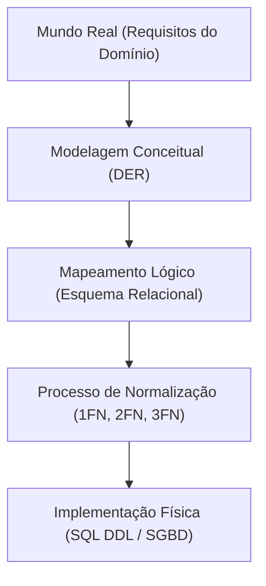

#### Definição formal
A normalização é uma técnica formal que avalia esquemas relacionais baseando-se em suas dependências funcionais e chaves primárias para minimizar redundâncias e anomalias de inserção, atualização e exclusão.

- **1FN (Primeira Forma Normal):** Uma relação está na 1FN se, e somente se, todos os domínios de seus atributos contiverem apenas valores atômicos (indivisíveis) e monovalorados.
- **2FN (Segunda Forma Normal):** A relação está na 2FN se estiver na 1FN e nenhum atributo não-chave depender funcionalmente de parte de uma chave primária composta (dependência funcional parcial).
- **3FN (Terceira Forma Normal):** A relação está na 3FN se estiver na 2FN e nenhum atributo não-chave depender de outro atributo não-chave (ausência de dependências transitivas).

### Entidades Fortes e Entidades Fracas

#### Definição
- **Entidade Forte (ou Regular):** Possui existência autônoma no domínio do negócio. Sua identificação independe da presença de outras entidades no banco de dados. Possui sua própria chave primária (`Primary Key`).
- **Entidade Fraca:** Não possui existência independente. Ela só existe enquanto a entidade forte associada (chamada de entidade proprietária ou identificadora) existir. Além disso, pode possuir apenas uma chave parcial (discriminador), necessitando da chave primária da entidade proprietária para compor sua chave primária real.

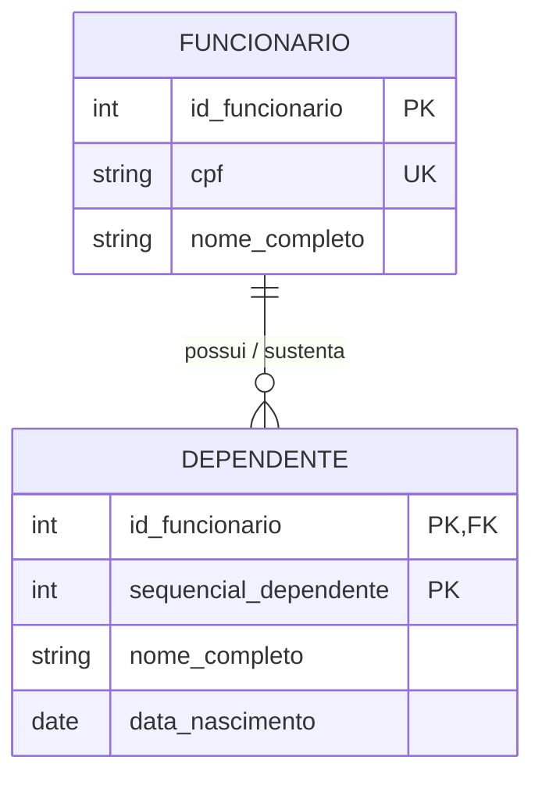

#### Motivação
Modelar dependentes, itens de pedido ou histórico de reparos como entidades fracas garante integridade semântica por meio do ciclo de vida: se o funcionário titular for desligado e expurgado da base, seus dependentes não devem permanecer como registros órfãos.

#### Exemplo
A entidade `DEPENDENTE` no Exercício 1. Sua chave primária é composta por `(id_funcionario, sequencial_dependente)` ou `(id_funcionario, cpf_dependente)`. A cláusula de integridade referencial exige `ON DELETE CASCADE`.

#### Contraexemplo
Modelar `CARGO` no Pet-Shop como entidade fraca de `FUNCIONARIO`. Se todos os funcionários com o cargo "Tosador" forem demitidos, o cargo "Tosador" ainda existe na estrutura de recursos humanos da empresa. Portanto, `CARGO` é uma entidade forte.

#### Armadilhas comuns
Utilizar chaves substitutas sintéticas (`UUID` ou `AUTO_INCREMENT`) em entidades fracas e esquecer de aplicar uma restrição `UNIQUE` composta entre a chave estrangeira do pai e o discriminador da entidade fraca. Isso permite registros duplicados do mesmo dependente para o mesmo funcionário.

---

### Tipologia de Atributos e Normalização

Na modelagem conceitual, atributos podem ser:
1. **Atômicos (Simples):** Indivisíveis (ex.: sexo, valor da diária).
2. **Compostos:** Formados por subpartes lógicas (ex.: nome dividido em primeiro nome, nome do meio e sobrenome; endereço dividido em logradouro, número, bairro, cidade e CEP).
3. **Multivalorados:** Comportam múltiplos valores para uma mesma instância de entidade (ex.: telefones de um funcionário).
4. **Derivados:** Valores calculados a partir de outros dados já persistidos (ex.: idade a partir da data de nascimento).

#### Motivação e Tratamento Relacional
O Modelo Relacional padrão exige domínios atômicos (1FN). Atributos compostos devem ser planificados em colunas primitivas ou segregados em tabelas específicas. Atributos multivalorados **nunca** devem ser armazenados em listas separadas por vírgula dentro de uma única coluna (o que violaria a 1FN), mas sim desacoplados em uma nova tabela relacional associada (relação 1:N).

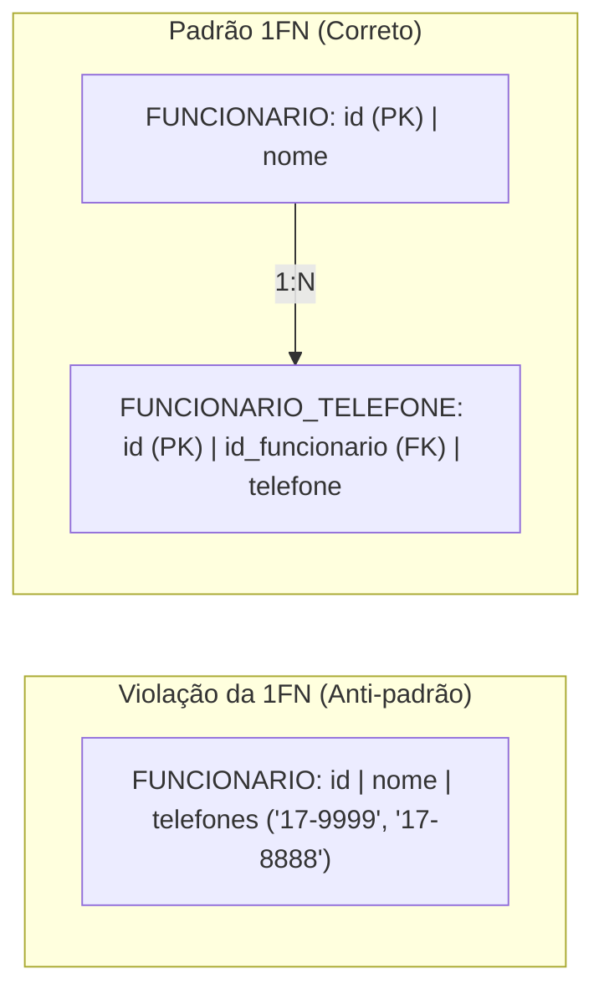

#### Contraexemplo e Armadilhas
Armazenar múltiplos telefones em campos fixos como `telefone_1`, `telefone_2`, `telefone_3`. Essa solução engessa o esquema: caso um colaborador possua 4 telefones, uma alteração estrutural no banco (`ALTER TABLE`) seria necessária, além de desperdiçar bytes com valores nulos para quem possui apenas um número.

---

### Auto-Relacionamentos e Hierarquias Recursivas

#### Definição
Ocorre quando uma entidade estabelece um relacionamento com ela mesma. Cada ocorrência da entidade pode desempenhar papéis distintos na associação (ex.: funcionário desempenhando o papel de "supervisor" ou de "subordinado").

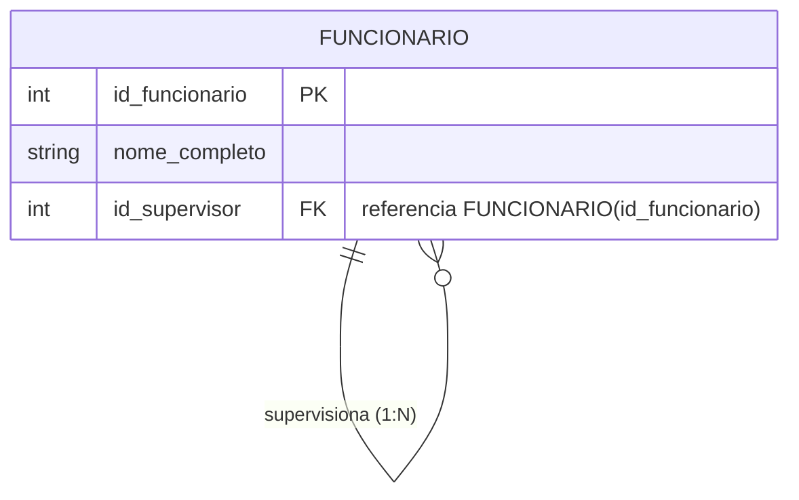

#### Motivação
Permite estruturar organogramas dinâmicos com infinitos níveis hierárquicos sem necessidade de criar tabelas duplicadas como `SUPERVISOR` e `SUBORDINADO`, visto que todo supervisor é, em essência, um funcionário da empresa.

#### Exemplo e Implementação
No Exercício 1, adiciona-se à tabela `FUNCIONARIO` uma coluna `id_supervisor` que referencia a própria chave primária `id_funcionario` da tabela `FUNCIONARIO`.
- **Restrição:** `id_supervisor` deve aceitar valor `NULL`, pois o profissional no topo da hierarquia corporativa (ex.: Diretor Executivo) não possui supervisor.

#### Armadilhas comuns
- Esquecer de tratar ciclos infinitos de supervisão (onde A supervisiona B, B supervisiona C e C supervisiona A). No SQL, isso deve ser prevenido via triggers ou validado em consultas hierárquicas recursivas (`WITH RECURSIVE`).
- Definir a chave estrangeira como `NOT NULL`, o que impediria a inserção do primeiro funcionário da organização.

---

### Relacionamentos Muitos-para-Muitos e Atributos Associativos

#### Definição
Uma relação N:N ocorre quando uma ocorrência da Entidade A pode relacionar-se com múltiplas ocorrências da Entidade B, e vice-versa. Quando esse vínculo carrega propriedades exclusivas do encontro entre as duas partes, essas propriedades são chamadas de **atributos associativos**.

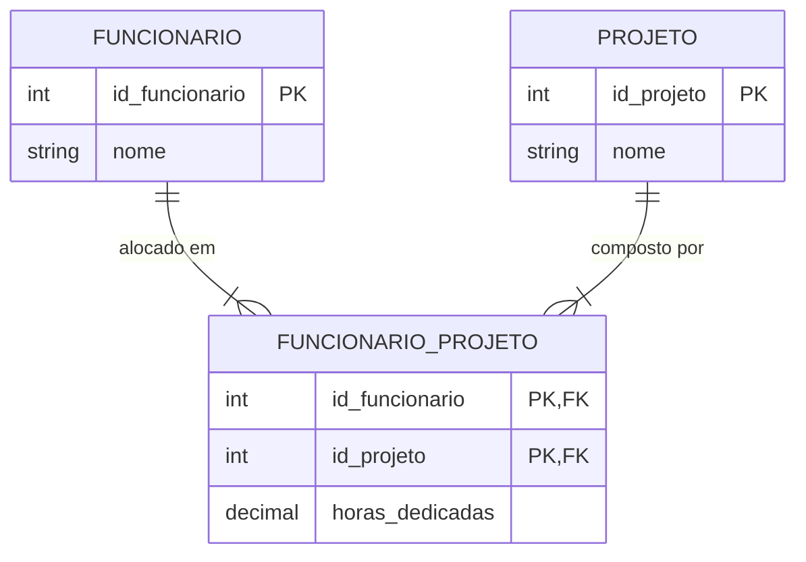

#### Motivação
No Exercício 1, a quantidade de horas dedicadas não pertence exclusivamente ao funcionário (pois ele gasta horas diferentes em projetos diferentes) nem ao projeto (pois cada colaborador alocado despende uma carga horária distinta). As horas pertencem à intersecção dos dois.

#### Mapeamento Relacional
Toda relação N:N física se desdobra em uma tabela de junção (tabela intermediária ou associativa) contendo as chaves estrangeiras de ambas as tabelas de origem, compondo conjuntamente a chave primária ou garantindo unicidade através de uma restrição `UNIQUE(id_funcionario, id_projeto)`.

---

### Decomposição de Relacionamentos Ternários e Multidirecionais

#### Definição
Um relacionamento n-ário (como ternário) envolve três entidades simultaneamente em uma mesma associação semântica. No Exercício 2, o enunciado expressa: *"Nessa parte a compra envolve o cliente, o funcionário e também o produto desejado. São registrados os dados de valor, quantidade e forma de pagamento."*

#### Motivação e Abordagem de Engenharia
Embora teoricamente representável por um diamante ternário ligando Cliente, Funcionário e Produto, na prática da modelagem relacional orientada a sistemas de gestão comercial (ERP), essa modelagem ternária direta é deficiente. Se um cliente adquire 5 produtos diferentes na mesma passagem pelo caixa com o mesmo funcionário, a modelagem puramente ternária repetiria a forma de pagamento e a data 5 vezes, gerando anomalias.

A engenharia de software decompõe o processo em:
1. Uma entidade transacional agregadora: `VENDA` (Cliente, Funcionário, Data, Forma de Pagamento, Valor Total).
2. Uma entidade associativa de composição: `ITEM_VENDA` (Venda, Produto, Quantidade, Preço Unitário Aplicado).

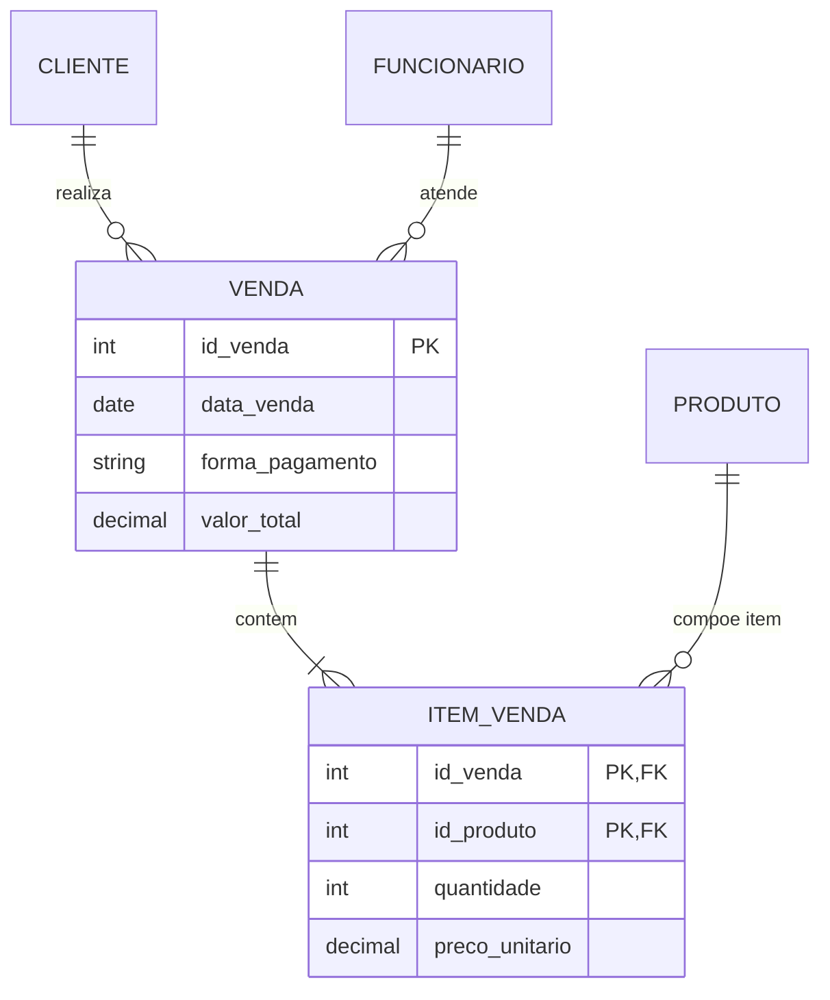

---

## Resolução proposta

Apresenta-se a seguir a resolução integral e detalhada para cada um dos cenários da lista prática, acompanhada de seus respectivos modelos conceituais em Mermaid, mapeamentos relacionais e scripts SQL DDL/DML.

---

### Exercício 1: DER Empresa

#### Análise e Dicionário de Dados
- **FUNCIONARIO:** Entidade forte. Atributo identificador `id_funcionario` (ou `cpf`). Os requisitos pedem a decomposição do nome: `primeiro_nome`, `segundo_nome` e `ultimo_nome`. Endereço, sexo, data de nascimento e auto-relacionamento `id_supervisor`.
- **FUNCIONARIO_TELEFONE:** Desdobramento de atributo multivalorado para garantia da 1FN. Chave composta por `(id_funcionario, telefone)`.
- **DEPENDENTE:** Entidade fraca por identificação e existência dependente de `FUNCIONARIO`. Atributos: `primeiro_nome`, `segundo_nome`, `ultimo_nome`, `endereco`, `sexo`, `cpf`, `data_nascimento`.
- **DEPARTAMENTO:** Entidade forte. Atributos: `numero_departamento` (PK), `nome_departamento`, `localizacao`. Possui vínculo 1:N com `FUNCIONARIO` (lotação) e vínculo 1:1 com `FUNCIONARIO` (gerência).
- **PROJETO:** Entidade forte. Atributos: `codigo_projeto` (PK), `nome_projeto`, `data_criacao`. Vinculado a `DEPARTAMENTO` (1:N, departamento controla projeto).
- **FUNCIONARIO_PROJETO:** Tabela associativa da relação N:N. Chave primária composta por `(id_funcionario, codigo_projeto)` com o atributo contextual `horas_trabalhadas`.

#### Diagrama Conceitual (Mermaid)

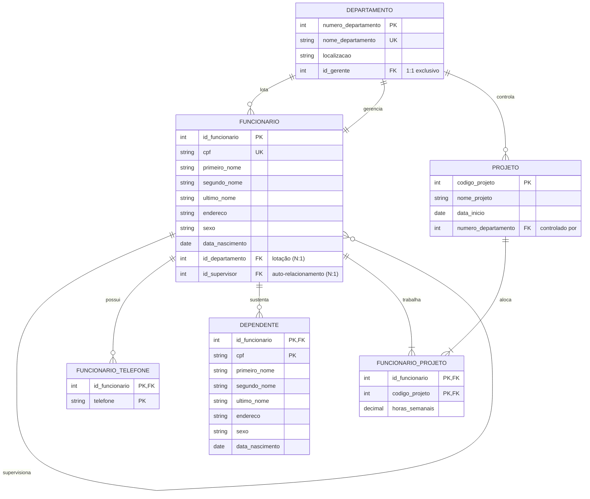

#### Mapeamento Relacional e Restrições de Integridade
1. `DEPARTAMENTO` possui `id_gerente` referenciando `FUNCIONARIO(id_funcionario)` com restrição `UNIQUE` (garantindo que um funcionário só gerencie um departamento e cada departamento tenha um único gerente).
2. Para resolver a dependência circular inicial de criação de tabelas entre `FUNCIONARIO` e `DEPARTAMENTO`, cria-se a chave estrangeira de gerência após a criação de ambas as tabelas utilizando `ALTER TABLE`.
3. `DEPENDENTE` adota chave primária composta `(id_funcionario, cpf)`, configurado com `ON DELETE CASCADE`.

#### Implementação SQL DDL/DML Comentada
*Arquivo completo disponível em:* [./codigo/exercicio1_empresa.sql](./codigo/exercicio1_empresa.sql)

```sql
-- DDL para o Exercício 1: Empresa
CREATE TABLE departamento (
    numero_departamento INT NOT NULL,
    nome_departamento VARCHAR(100) NOT NULL,
    localizacao VARCHAR(150) NOT NULL,
    id_gerente INT NULL,
    CONSTRAINT pk_departamento PRIMARY KEY (numero_departamento),
    CONSTRAINT uk_nome_departamento UNIQUE (nome_departamento)
);

CREATE TABLE funcionario (
    id_funcionario INT NOT NULL,
    cpf VARCHAR(14) NOT NULL,
    primeiro_nome VARCHAR(50) NOT NULL,
    segundo_nome VARCHAR(50) NULL,
    ultimo_nome VARCHAR(50) NOT NULL,
    endereco VARCHAR(200) NOT NULL,
    sexo CHAR(1) NOT NULL,
    data_nascimento DATE NOT NULL,
    numero_departamento INT NOT NULL,
    id_supervisor INT NULL,
    CONSTRAINT pk_funcionario PRIMARY KEY (id_funcionario),
    CONSTRAINT uk_funcionario_cpf UNIQUE (cpf),
    CONSTRAINT ck_funcionario_sexo CHECK (sexo IN ('M', 'F', 'O')),
    CONSTRAINT fk_func_departamento FOREIGN KEY (numero_departamento) 
        REFERENCES departamento(numero_departamento) ON DELETE RESTRICT,
    CONSTRAINT fk_func_supervisor FOREIGN KEY (id_supervisor) 
        REFERENCES funcionario(id_funcionario) ON DELETE SET NULL
);

-- Amarração da gerência (1:1) após a criação de funcionario
ALTER TABLE departamento 
    ADD CONSTRAINT fk_departamento_gerente FOREIGN KEY (id_gerente) 
    REFERENCES funcionario(id_funcionario) ON DELETE SET NULL,
    ADD CONSTRAINT uk_departamento_gerente UNIQUE (id_gerente);

CREATE TABLE funcionario_telefone (
    id_funcionario INT NOT NULL,
    telefone VARCHAR(20) NOT NULL,
    CONSTRAINT pk_funcionario_telefone PRIMARY KEY (id_funcionario, telefone),
    CONSTRAINT fk_telefone_funcionario FOREIGN KEY (id_funcionario) 
        REFERENCES funcionario(id_funcionario) ON DELETE CASCADE
);

CREATE TABLE dependente (
    id_funcionario INT NOT NULL,
    cpf VARCHAR(14) NOT NULL,
    primeiro_nome VARCHAR(50) NOT NULL,
    segundo_nome VARCHAR(50) NULL,
    ultimo_nome VARCHAR(50) NOT NULL,
    endereco VARCHAR(200) NOT NULL,
    sexo CHAR(1) NOT NULL,
    data_nascimento DATE NOT NULL,
    CONSTRAINT pk_dependente PRIMARY KEY (id_funcionario, cpf),
    CONSTRAINT ck_dependente_sexo CHECK (sexo IN ('M', 'F', 'O')),
    CONSTRAINT fk_dependente_funcionario FOREIGN KEY (id_funcionario) 
        REFERENCES funcionario(id_funcionario) ON DELETE CASCADE
);

CREATE TABLE projeto (
    codigo_projeto INT NOT NULL,
    nome_projeto VARCHAR(120) NOT NULL,
    data_inicio DATE NOT NULL,
    numero_departamento INT NOT NULL,
    CONSTRAINT pk_projeto PRIMARY KEY (codigo_projeto),
    CONSTRAINT fk_projeto_departamento FOREIGN KEY (numero_departamento) 
        REFERENCES departamento(numero_departamento) ON DELETE RESTRICT
);

CREATE TABLE funcionario_projeto (
    id_funcionario INT NOT NULL,
    codigo_projeto INT NOT NULL,
    horas_trabalhadas DECIMAL(5,2) NOT NULL DEFAULT 0.00,
    CONSTRAINT pk_funcionario_projeto PRIMARY KEY (id_funcionario, codigo_projeto),
    CONSTRAINT ck_horas_positivas CHECK (horas_trabalhadas >= 0.00),
    CONSTRAINT fk_fp_funcionario FOREIGN KEY (id_funcionario) 
        REFERENCES funcionario(id_funcionario) ON DELETE CASCADE,
    CONSTRAINT fk_fp_projeto FOREIGN KEY (codigo_projeto) 
        REFERENCES projeto(codigo_projeto) ON DELETE CASCADE
);
```

---

### Exercício 2 e 3: DER Pet-Shop Integrado

#### Análise e Dicionário de Dados
- **CARGO:** Entidade forte (`id_cargo`, `nome_cargo`, `salario_base`).
- **FUNCIONARIO:** Entidade forte (`id_funcionario`, `cpf`, `nome_completo`, `endereco`, `telefone_residencial`, `telefone_celular`, `data_nascimento`, `id_cargo`).
- **CLIENTE:** Entidade forte (`id_cliente`, `cpf`, `nome_completo`, `endereco`, `telefone_comercial`, `telefone_residencial`, `telefone_celular`, `data_nascimento`, `email`).
- **ANIMAL:** Entidade associada obrigatoriamente a Cliente (`id_animal`, `id_cliente`, `nome`, `data_nascimento`, `sexo`, `raca`, `cor_predominante`, `tipo_animal`).
- **TIPO_SERVICO:** Catálogo normalizado para evitar anomalias de escrita (`id_tipo_servico`, `descricao`, `valor_base`).
- **SERVICO_PRESTADO:** Evento de serviço executado. Registra `id_servico`, `id_funcionario`, `id_cliente`, `id_animal`, `id_tipo_servico`, `data_hora`, `valor_cobrado`.
- **FORNECEDOR:** Entidade forte (`id_fornecedor`, `cnpj`, `razao_social`, `telefone`, `email`).
- **PRODUTO:** Entidade forte (`codigo_produto`, `nome_produto`, `marca`, `valor_unitario`, `data_validade`, `id_fornecedor`). Atende à regra estrita: *um produto possui exatamente um fornecedor*.
- **VENDA:** Transação comercial (`id_venda`, `id_cliente`, `id_funcionario`, `data_venda`, `forma_pagamento`, `valor_total`).
- **ITEM_VENDA:** Itens de produto da venda (`id_venda`, `codigo_produto`, `quantidade`, `valor_unitario_venda`).

#### Diagrama Conceitual (Mermaid)

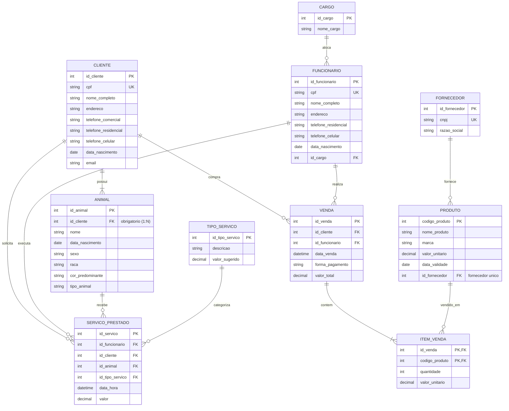

#### Implementação SQL DDL/DML Comentada
*Arquivo completo disponível em:* [./codigo/exercicio2_petshop.sql](./codigo/exercicio2_petshop.sql)

```sql
-- DDL para os Exercícios 2 e 3: Pet-Shop
CREATE TABLE cargo (
    id_cargo INT NOT NULL,
    nome_cargo VARCHAR(80) NOT NULL,
    CONSTRAINT pk_cargo PRIMARY KEY (id_cargo),
    CONSTRAINT uk_cargo_nome UNIQUE (nome_cargo)
);

CREATE TABLE funcionario (
    id_funcionario INT NOT NULL,
    cpf VARCHAR(14) NOT NULL,
    nome_completo VARCHAR(150) NOT NULL,
    endereco VARCHAR(200) NOT NULL,
    telefone_residencial VARCHAR(20) NULL,
    telefone_celular VARCHAR(20) NOT NULL,
    data_nascimento DATE NOT NULL,
    id_cargo INT NOT NULL,
    CONSTRAINT pk_pet_funcionario PRIMARY KEY (id_funcionario),
    CONSTRAINT uk_pet_func_cpf UNIQUE (cpf),
    CONSTRAINT fk_pet_func_cargo FOREIGN KEY (id_cargo) 
        REFERENCES cargo(id_cargo) ON DELETE RESTRICT
);

CREATE TABLE cliente (
    id_cliente INT NOT NULL,
    cpf VARCHAR(14) NOT NULL,
    nome_completo VARCHAR(150) NOT NULL,
    endereco VARCHAR(200) NOT NULL,
    telefone_comercial VARCHAR(20) NULL,
    telefone_residencial VARCHAR(20) NULL,
    telefone_celular VARCHAR(20) NOT NULL,
    data_nascimento DATE NOT NULL,
    email VARCHAR(100) NOT NULL,
    CONSTRAINT pk_cliente PRIMARY KEY (id_cliente),
    CONSTRAINT uk_cliente_cpf UNIQUE (cpf)
);

CREATE TABLE animal (
    id_animal INT NOT NULL,
    id_cliente INT NOT NULL,
    nome VARCHAR(80) NOT NULL,
    data_nascimento DATE NULL,
    sexo CHAR(1) NOT NULL,
    raca VARCHAR(50) NOT NULL,
    cor_predominante VARCHAR(30) NOT NULL,
    tipo_animal VARCHAR(40) NOT NULL,
    CONSTRAINT pk_animal PRIMARY KEY (id_animal),
    CONSTRAINT ck_animal_sexo CHECK (sexo IN ('M', 'F')),
    CONSTRAINT fk_animal_cliente FOREIGN KEY (id_cliente) 
        REFERENCES cliente(id_cliente) ON DELETE CASCADE
);

CREATE TABLE tipo_servico (
    id_tipo_servico INT NOT NULL,
    descricao VARCHAR(100) NOT NULL,
    CONSTRAINT pk_tipo_servico PRIMARY KEY (id_tipo_servico)
);

CREATE TABLE servico_prestado (
    id_servico INT NOT NULL,
    id_funcionario INT NOT NULL,
    id_cliente INT NOT NULL,
    id_animal INT NOT NULL,
    id_tipo_servico INT NOT NULL,
    data_hora TIMESTAMP NOT NULL DEFAULT CURRENT_TIMESTAMP,
    valor DECIMAL(10,2) NOT NULL,
    CONSTRAINT pk_servico_prestado PRIMARY KEY (id_servico),
    CONSTRAINT ck_servico_valor CHECK (valor >= 0.00),
    CONSTRAINT fk_sp_funcionario FOREIGN KEY (id_funcionario) REFERENCES funcionario(id_funcionario),
    CONSTRAINT fk_sp_cliente FOREIGN KEY (id_cliente) REFERENCES cliente(id_cliente),
    CONSTRAINT fk_sp_animal FOREIGN KEY (id_animal) REFERENCES animal(id_animal),
    CONSTRAINT fk_sp_tipo FOREIGN KEY (id_tipo_servico) REFERENCES tipo_servico(id_tipo_servico)
);

CREATE TABLE fornecedor (
    id_fornecedor INT NOT NULL,
    cnpj VARCHAR(18) NOT NULL,
    razao_social VARCHAR(150) NOT NULL,
    CONSTRAINT pk_fornecedor PRIMARY KEY (id_fornecedor),
    CONSTRAINT uk_fornecedor_cnpj UNIQUE (cnpj)
);

CREATE TABLE produto (
    codigo_produto INT NOT NULL,
    nome_produto VARCHAR(120) NOT NULL,
    marca VARCHAR(80) NOT NULL,
    valor_unitario DECIMAL(10,2) NOT NULL,
    validade DATE NOT NULL,
    id_fornecedor INT NOT NULL,
    CONSTRAINT pk_produto PRIMARY KEY (codigo_produto),
    CONSTRAINT ck_prod_valor CHECK (valor_unitario >= 0.00),
    CONSTRAINT fk_prod_fornecedor FOREIGN KEY (id_fornecedor) 
        REFERENCES fornecedor(id_fornecedor) ON DELETE RESTRICT
);

CREATE TABLE venda (
    id_venda INT NOT NULL,
    id_cliente INT NOT NULL,
    id_funcionario INT NOT NULL,
    data_venda TIMESTAMP NOT NULL DEFAULT CURRENT_TIMESTAMP,
    forma_pagamento VARCHAR(50) NOT NULL,
    valor_total DECIMAL(10,2) NOT NULL DEFAULT 0.00,
    CONSTRAINT pk_venda PRIMARY KEY (id_venda),
    CONSTRAINT fk_venda_cliente FOREIGN KEY (id_cliente) REFERENCES cliente(id_cliente),
    CONSTRAINT fk_venda_func FOREIGN KEY (id_funcionario) REFERENCES funcionario(id_funcionario)
);

CREATE TABLE item_venda (
    id_venda INT NOT NULL,
    codigo_produto INT NOT NULL,
    quantidade INT NOT NULL,
    valor_unitario DECIMAL(10,2) NOT NULL,
    CONSTRAINT pk_item_venda PRIMARY KEY (id_venda, codigo_produto),
    CONSTRAINT ck_item_quantidade CHECK (quantidade > 0),
    CONSTRAINT fk_iv_venda FOREIGN KEY (id_venda) REFERENCES venda(id_venda) ON DELETE CASCADE,
    CONSTRAINT fk_iv_produto FOREIGN KEY (codigo_produto) REFERENCES produto(codigo_produto)
);
```

---

### Exercício 4: DER Locadora de Automóveis

#### Análise e Dicionário de Dados
- **CLIENTE:** Entidade forte (`id_cliente`, `rg`, `cnh`, `nome`, `endereco`, `idade`, `cpf_complementar`). Regra: todo cliente cadastrado possui no mínimo uma locação realizada.
- **CATEGORIA:** Entidade forte (`codigo_categoria`, `nome_categoria`, `preco_diaria`, `descricao_caracteristicas`).
- **CARRO:** Entidade forte (`id_carro`, `chassi`, `placa`, `marca`, `modelo`, `ano`, `cor`, `codigo_categoria`).
- **LOCACAO:** Entidade associativa/evento que conecta Cliente e Carro (`id_locacao`, `id_cliente`, `id_carro`, `data_locacao`, `hora_locacao`, `data_devolucao_prevista`, `valor_total`).
- **OFICINA:** Entidade normalizada (3FN) para evitar redundância de cadastro (`id_oficina`, `nome_oficina`, `telefone`, `endereco`).
- **HISTORICO_CONSERTO:** Entidade fraca por dependência existencial vinculada ao veículo reparado (`id_conserto`, `id_carro`, `data_conserto`, `valor`, `descricao_servico`, `id_oficina`).

#### Diagrama Conceitual (Mermaid)

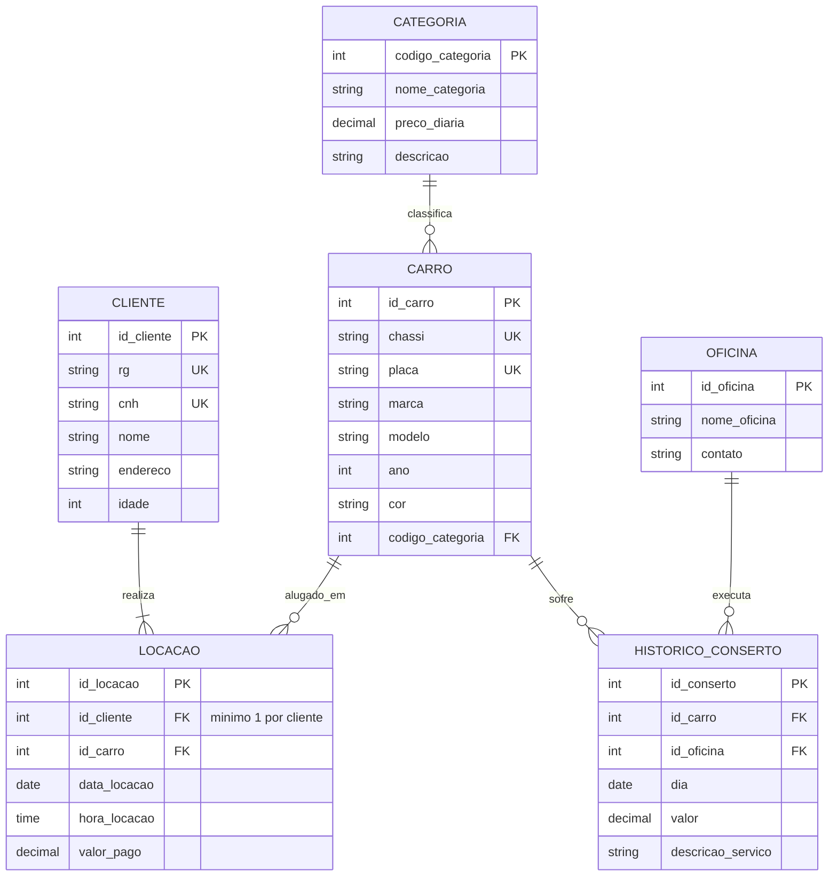

#### Implementação SQL DDL/DML Comentada
*Arquivo completo disponível em:* [./codigo/exercicio4_locadora.sql](./codigo/exercicio4_locadora.sql)

```sql
-- DDL para o Exercício 4: Locadora de Automóveis
CREATE TABLE cliente_locadora (
    id_cliente INT NOT NULL,
    rg VARCHAR(20) NOT NULL,
    cnh VARCHAR(20) NOT NULL,
    nome VARCHAR(150) NOT NULL,
    endereco VARCHAR(200) NOT NULL,
    idade INT NOT NULL,
    CONSTRAINT pk_cliente_locadora PRIMARY KEY (id_cliente),
    CONSTRAINT uk_cl_rg UNIQUE (rg),
    CONSTRAINT uk_cl_cnh UNIQUE (cnh),
    CONSTRAINT ck_cl_idade CHECK (idade >= 18)
);

CREATE TABLE categoria_carro (
    codigo_categoria INT NOT NULL,
    nome_categoria VARCHAR(60) NOT NULL,
    preco_diaria DECIMAL(10,2) NOT NULL,
    descricao VARCHAR(255) NOT NULL,
    CONSTRAINT pk_categoria_carro PRIMARY KEY (codigo_categoria),
    CONSTRAINT ck_preco_diaria CHECK (preco_diaria > 0.00)
);

CREATE TABLE carro (
    id_carro INT NOT NULL,
    chassi VARCHAR(30) NOT NULL,
    placa VARCHAR(10) NOT NULL,
    marca VARCHAR(50) NOT NULL,
    modelo VARCHAR(50) NOT NULL,
    ano INT NOT NULL,
    cor VARCHAR(30) NOT NULL,
    codigo_categoria INT NOT NULL,
    CONSTRAINT pk_carro PRIMARY KEY (id_carro),
    CONSTRAINT uk_carro_chassi UNIQUE (chassi),
    CONSTRAINT uk_carro_placa UNIQUE (placa),
    CONSTRAINT fk_carro_categoria FOREIGN KEY (codigo_categoria) 
        REFERENCES categoria_carro(codigo_categoria) ON DELETE RESTRICT
);

CREATE TABLE locacao (
    id_locacao INT NOT NULL,
    id_cliente INT NOT NULL,
    id_carro INT NOT NULL,
    data_locacao DATE NOT NULL,
    hora_locacao TIME NOT NULL,
    valor_total DECIMAL(10,2) NULL,
    CONSTRAINT pk_locacao PRIMARY KEY (id_locacao),
    CONSTRAINT fk_loc_cliente FOREIGN KEY (id_cliente) 
        REFERENCES cliente_locadora(id_cliente) ON DELETE RESTRICT,
    CONSTRAINT fk_loc_carro FOREIGN KEY (id_carro) 
        REFERENCES carro(id_carro) ON DELETE RESTRICT
);

CREATE TABLE oficina (
    id_oficina INT NOT NULL,
    nome_oficina VARCHAR(120) NOT NULL,
    telefone VARCHAR(20) NOT NULL,
    CONSTRAINT pk_oficina PRIMARY KEY (id_oficina)
);

CREATE TABLE historico_conserto (
    id_conserto INT NOT NULL,
    id_carro INT NOT NULL,
    id_oficina INT NOT NULL,
    dia DATE NOT NULL,
    valor DECIMAL(10,2) NOT NULL,
    descricao_servico TEXT NOT NULL,
    CONSTRAINT pk_historico_conserto PRIMARY KEY (id_conserto),
    CONSTRAINT ck_conserto_valor CHECK (valor >= 0.00),
    CONSTRAINT fk_hc_carro FOREIGN KEY (id_carro) 
        REFERENCES carro(id_carro) ON DELETE CASCADE,
    CONSTRAINT fk_hc_oficina FOREIGN KEY (id_oficina) 
        REFERENCES oficina(id_oficina) ON DELETE RESTRICT
);
```

---

### Exercício 5: DER Companhia de Transporte

#### Análise e Dicionário de Dados
- **ARMAZEM:** Origem logística (`numero_armazem` como PK, `endereco`, `cidade`). O enunciado indica a existência de 6 localizações ativas.
- **DEPOSITO:** Destino final de entrega (`numero_deposito` como PK, `endereco`, `cidade`). O enunciado especifica 45 localizações ativas de depósitos clientes da rede de varejo.
- **CAMINHAO:** Frota de veículos pesados (`codigo_licenca` como PK/Placa, `capacidade_peso`, `capacidade_volume`, `status_operacional`). A frota é composta por 150 veículos realizando 3 a 4 viagens semanais.
- **VIAGEM:** Deslocamento com carga (`numero_viagem` como PK, `codigo_licenca`, `numero_armazem_origem`, `data_saida`, `peso_total_alocado`, `volume_total_alocado`).
- **REMESSA:** Unidade de transporte fracionada (`numero_remessa` como PK, `peso`, `volume`, `numero_armazem_origem`, `numero_deposito_destino`, `numero_viagem`).

#### Diagrama Conceitual (Mermaid)

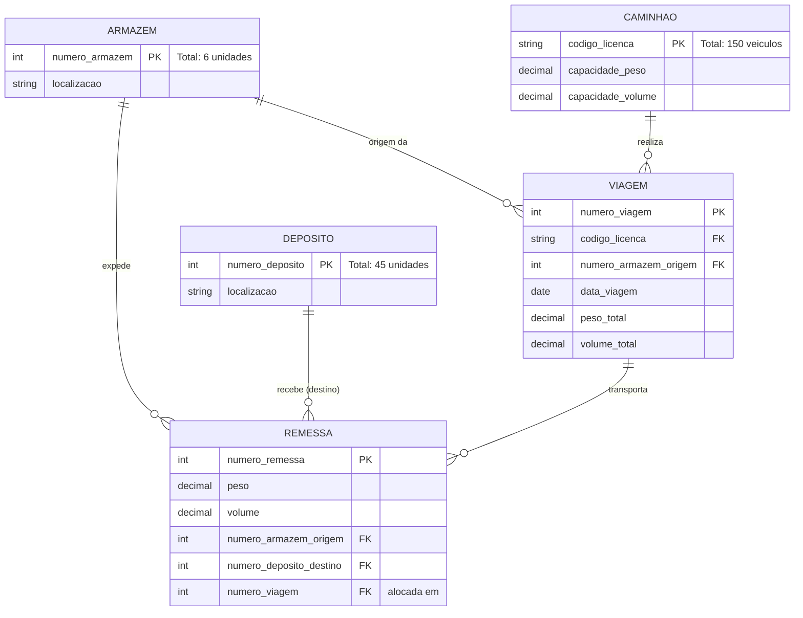

#### Implementação SQL DDL/DML Comentada
*Arquivo completo disponível em:* [./codigo/exercicio5_transporte.sql](./codigo/exercicio5_transporte.sql)

```sql
-- DDL para o Exercício 5: Companhia de Transporte
CREATE TABLE armazem (
    numero_armazem INT NOT NULL,
    cidade VARCHAR(80) NOT NULL,
    endereco VARCHAR(200) NOT NULL,
    CONSTRAINT pk_armazem PRIMARY KEY (numero_armazem)
);

CREATE TABLE deposito (
    numero_deposito INT NOT NULL,
    cidade VARCHAR(80) NOT NULL,
    endereco VARCHAR(200) NOT NULL,
    CONSTRAINT pk_deposito PRIMARY KEY (numero_deposito)
);

CREATE TABLE caminhao (
    codigo_licenca VARCHAR(20) NOT NULL,
    capacidade_peso DECIMAL(10,2) NOT NULL,
    capacidade_volume DECIMAL(10,2) NOT NULL,
    modelo VARCHAR(50) NOT NULL,
    CONSTRAINT pk_caminhao PRIMARY KEY (codigo_licenca),
    CONSTRAINT ck_caminhao_peso CHECK (capacidade_peso > 0.00),
    CONSTRAINT ck_caminhao_volume CHECK (capacidade_volume > 0.00)
);

CREATE TABLE viagem (
    numero_viagem INT NOT NULL,
    codigo_licenca VARCHAR(20) NOT NULL,
    numero_armazem_origem INT NOT NULL,
    data_saida DATE NOT NULL,
    peso_total DECIMAL(10,2) NOT NULL DEFAULT 0.00,
    volume_total DECIMAL(10,2) NOT NULL DEFAULT 0.00,
    CONSTRAINT pk_viagem PRIMARY KEY (numero_viagem),
    CONSTRAINT fk_viagem_caminhao FOREIGN KEY (codigo_licenca) 
        REFERENCES caminhao(codigo_licenca) ON DELETE RESTRICT,
    CONSTRAINT fk_viagem_origem FOREIGN KEY (numero_armazem_origem) 
        REFERENCES armazem(numero_armazem) ON DELETE RESTRICT
);

CREATE TABLE remessa (
    numero_remessa INT NOT NULL,
    peso DECIMAL(10,2) NOT NULL,
    volume DECIMAL(10,2) NOT NULL,
    numero_armazem_origem INT NOT NULL,
    numero_deposito_destino INT NOT NULL,
    numero_viagem INT NULL,
    CONSTRAINT pk_remessa PRIMARY KEY (numero_remessa),
    CONSTRAINT ck_remessa_peso CHECK (peso > 0.00),
    CONSTRAINT ck_remessa_volume CHECK (volume > 0.00),
    CONSTRAINT fk_remessa_origem FOREIGN KEY (numero_armazem_origem) 
        REFERENCES armazem(numero_armazem) ON DELETE RESTRICT,
    CONSTRAINT fk_remessa_destino FOREIGN KEY (numero_deposito_destino) 
        REFERENCES deposito(numero_deposito) ON DELETE RESTRICT,
    CONSTRAINT fk_remessa_viagem FOREIGN KEY (numero_viagem) 
        REFERENCES viagem(numero_viagem) ON DELETE SET NULL
);
```

---

## Como testar e validar

Para homologar a integridade física e relacional dos esquemas projetados, execute a bateria de testes operacionais abaixo utilizando qualquer SGBD compatível com SQL ANSI (como PostgreSQL, MariaDB ou MySQL).

### 1. Teste de Auto-Relacionamento e Integridade Hierárquica (Exercício 1)
```sql
-- Inserir departamentos
INSERT INTO departamento (numero_departamento, nome_departamento, localizacao)
VALUES (10, 'Engenharia de Software', 'Bloco B - Sala 204');

-- Inserir supervisor do topo (sem supervisor)
INSERT INTO funcionario (id_funcionario, cpf, primeiro_nome, ultimo_nome, endereco, sexo, data_nascimento, numero_departamento, id_supervisor)
VALUES (1, '111.111.111-11', 'Carlos', 'Silveira', 'Rua A, 100', 'M', '1980-05-15', 10, NULL);

-- Inserir liderado subordinado ao id 1
INSERT INTO funcionario (id_funcionario, cpf, primeiro_nome, ultimo_nome, endereco, sexo, data_nascimento, numero_departamento, id_supervisor)
VALUES (2, '222.222.222-22', 'Mariana', 'Costa', 'Av B, 250', 'F', '1992-08-20', 10, 1);

-- Amarrar Carlos como gerente do departamento 10
UPDATE departamento SET id_gerente = 1 WHERE numero_departamento = 10;

-- Validar hierarquia via Junção Interna (INNER JOIN)
SELECT 
    f.primeiro_nome AS subordinado,
    COALESCE(s.primeiro_nome, 'Nenhum (Diretoria)') AS supervisor,
    d.nome_departamento
FROM funcionario f
LEFT JOIN funcionario s ON f.id_supervisor = s.id_funcionario
INNER JOIN departamento d ON f.numero_departamento = d.numero_departamento;
```

### 2. Teste de Validação de Entidade Fraca (Exercício 1)
```sql
-- Inserir dependente
INSERT INTO dependente (id_funcionario, cpf, primeiro_nome, ultimo_nome, endereco, sexo, data_nascimento)
VALUES (2, '999.999.999-99', 'Lucas', 'Costa', 'Av B, 250', 'M', '2018-03-10');

-- Teste de Deleção em Cascata (ON DELETE CASCADE): ao excluir Mariana, Lucas deve ser removido
DELETE FROM funcionario WHERE id_funcionario = 2;

-- Deve retornar zero linhas
SELECT * FROM dependente WHERE id_funcionario = 2;
```

### 3. Teste de Unicidade e Restrição de Fornecedor Único (Exercício 2)
```sql
INSERT INTO fornecedor (id_fornecedor, cnpj, razao_social) VALUES (1, '12.345.678/0001-90', 'Distribuidora Pet Brasil');
INSERT INTO fornecedor (id_fornecedor, cnpj, razao_social) VALUES (2, '98.765.432/0001-10', 'Rações e Cia');

-- Produto vinculado ao fornecedor 1
INSERT INTO produto (codigo_produto, nome_produto, marca, valor_unitario, validade, id_fornecedor)
VALUES (101, 'Ração Premium Cães Adultos 15kg', 'NutriPet', 189.90, '2027-12-31', 1);

-- Tentar cadastrar o mesmo produto com outro fornecedor mantendo a PK deve disparar erro
-- Demonstração de integridade por chave estrangeira obrigatória
```

### 4. Teste de Capacidade e Sobrecarga de Transporte (Exercício 5)
```sql
-- Cadastrar caminhão com capacidade máxima de 10.000 kg e 50 m³
INSERT INTO caminhao (codigo_licenca, capacidade_peso, capacidade_volume, modelo)
VALUES ('ABC-1234', 10000.00, 50.00, 'Mercedes-Benz Actros');

INSERT INTO armazem (numero_armazem, cidade, endereco) VALUES (1, 'São Paulo', 'Terminal Logístico Anhanguera');
INSERT INTO deposito (numero_deposito, cidade, endereco) VALUES (101, 'Campinas', 'Centro de Distribuição Norte');
INSERT INTO deposito (numero_deposito, cidade, endereco) VALUES (102, 'Ribeirão Preto', 'Centro de Distribuição Leste');

-- Criar Viagem
INSERT INTO viagem (numero_viagem, codigo_licenca, numero_armazem_origem, data_saida, peso_total, volume_total)
VALUES (5001, 'ABC-1234', 1, '2026-03-01', 0, 0);

-- Alocar remessas fracionadas para depósitos distintos
INSERT INTO remessa (numero_remessa, peso, volume, numero_armazem_origem, numero_deposito_destino, numero_viagem)
VALUES (801, 3500.00, 15.00, 1, 101, 5001);

INSERT INTO remessa (numero_remessa, peso, volume, numero_armazem_origem, numero_deposito_destino, numero_viagem)
VALUES (802, 4200.00, 22.00, 1, 102, 5001);

-- Atualizar acumuladores da viagem e validar com a capacidade do caminhão
UPDATE viagem v
SET 
    peso_total = (SELECT SUM(r.peso) FROM remessa r WHERE r.numero_viagem = v.numero_viagem),
    volume_total = (SELECT SUM(r.volume) FROM remessa r WHERE r.numero_viagem = v.numero_viagem)
WHERE v.numero_viagem = 5001;

-- Consulta de verificação de sobrecarga (Alerta de compliance logístico)
SELECT 
    v.numero_viagem,
    c.codigo_licenca,
    v.peso_total,
    c.capacidade_peso,
    CASE 
        WHEN v.peso_total > c.capacidade_peso THEN 'SOBRECARGA DETECTADA'
        ELSE 'PESO REGULAR'
    END AS status_peso
FROM viagem v
INNER JOIN caminhao c ON v.codigo_licenca = c.codigo_licenca
WHERE v.numero_viagem = 5001;
```

---

## Critérios de qualidade

Para a avaliação desta atividade acadêmica no padrão UniFEF, os seguintes critérios técnicos e de engenharia devem ser observados:

| Eixo de Avaliação | Requisito Esperado | Evidência no Trabalho |
| :--- | :--- | :--- |
| **Completude Semântica** | Todas as regras de negócio dos 4 enunciados foram traduzidas em entidades e relacionamentos. | Atributos como horas em projeto, fornecedor exclusivo e capacidades de caminhão plenamente contemplados. |
| **Normalização Relacional** | Esquemas em 1FN, 2FN e 3FN. Ausência de campos multivalorados desprotegidos. | Telefones isolados em tabelas associativas; cargos e oficinas desacoplados de tabelas principais. |
| **Integridade Referencial** | Configuração criteriosa de chaves estrangeiras com ações `ON DELETE` e `ON UPDATE`. | Uso de `CASCADE` para dependentes e itens de venda; `RESTRICT` para categorias e clientes com locações ativas. |
| **Tipagem e Precisão** | Uso dos tipos de dados adequados para cada domínio de negócio. | `DECIMAL(10,2)` para valores monetários e métricas físicas; `DATE`/`TIME` para variáveis cronológicas. |
| **Clareza de Notação** | Diagramação padronizada em Mermaid sem sintaxes proprietárias inválidas. | Uso de `erDiagram` puro sem tags de estilo customizadas, compatível com o interpretador nativo do GitHub. |

---

## Arquivos de apoio

- Documento de Requisitos Original: `EXERCICIOS.docx` (disponibilizado no Google Classroom pelo Prof. Guilherme de Morais).
- Scripts SQL implementados:
  - Script DDL/DML Exercício 1: [./codigo/exercicio1_empresa.sql](./codigo/exercicio1_empresa.sql)
  - Script DDL/DML Exercício 2 e 3: [./codigo/exercicio2_petshop.sql](./codigo/exercicio2_petshop.sql)
  - Script DDL/DML Exercício 4: [./codigo/exercicio4_locadora.sql](./codigo/exercicio4_locadora.sql)
  - Script DDL/DML Exercício 5: [./codigo/exercicio5_transporte.sql](./codigo/exercicio5_transporte.sql)

---

## Mapa da atividade

O mapa conceitual abaixo sintetiza a organização dos 4 cenários práticos abordados e as técnicas de modelagem empregadas em cada um:

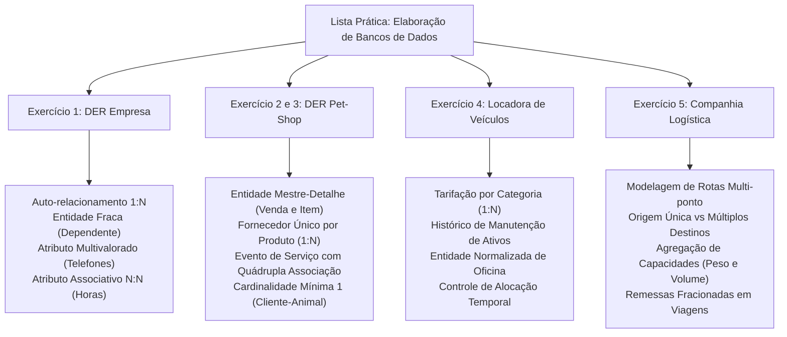

---

## Glossário

| Termo Técnico | Definição no Contexto de Banco de Dados |
| :--- | :--- |
| **Entidade Forte** | Entidade cuja existência independe de qualquer outra entidade do modelo conceitual; possui chave primária própria. |
| **Entidade Fraca** | Entidade cuja existência depende de uma entidade proprietária, necessitando da chave do pai para sua identificação. |
| **Auto-relacionamento** | Relacionamento unário onde instâncias de uma mesma entidade associam-se entre si em diferentes papéis (ex.: chefia). |
| **Atributo Multivalorado** | Atributo que pode assumir dois ou mais valores para a mesma ocorrência de entidade (ex.: telefones). |
| **Atributo Associativo** | Propriedade que decorre especificamente da interseção de duas entidades em uma relação N:N (ex.: horas trabalhadas). |
| **Cardinalidade** | Quantidade mínima e máxima de ocorrências de uma entidade que podem estar associadas a ocorrências de outra entidade. |
| **Chave Estrangeira (FK)** | Coluna ou conjunto de colunas em uma tabela que referencia a chave primária de outra tabela, garantindo integridade. |
| **1FN (Primeira Forma Normal)** | Regra relacional que exige que todos os campos de uma tabela armazenem apenas valores atômicos e indivisíveis. |
| **Mestre-Detalhe** | Padrão arquitetural de dados que decompõe uma transação em cabeçalho geral (mestre) e itens individuais (detalhe). |
| **Deleção em Cascata** | Comportamento referencial (`ON DELETE CASCADE`) que exclui registros filhos automaticamente ao apagar o registro pai. |

---

## Pontos-chave para a prova

1. **Auto-relacionamento com cardinalidade 1:N:** Uma chave estrangeira que aponta para a própria tabela deve aceitar valores nulos (`NULL`) para representar o nó raiz da hierarquia corporativa (ex.: Diretor ou Presidente).
2. **Atributos Multivalorados na 1FN:** Nunca crie colunas repetidas (`tel1`, `tel2`) ou strings concatenadas com delimitadores. Crie uma tabela filha cuja chave primária seja composta pela chave do pai e pelo valor do atributo.
3. **Atributos em Relacionamentos N:N:** Se uma métrica depender de duas entidades ao mesmo tempo (como a quantidade de horas trabalhadas por um funcionário em um projeto), ela deve ser posicionada obrigatoriamente na tabela de junção, e não nas tabelas das entidades isoladas.
4. **Resolução de dependência circular no DDL:** Quando duas tabelas referenciam-se mutuamente (como `DEPARTAMENTO.id_gerente` apontando para `FUNCIONARIO`, e `FUNCIONARIO.numero_departamento` apontando para `DEPARTAMENTO`), crie as tabelas com uma das chaves estrangeiras omitida e adicione a restrição faltante posteriormente via `ALTER TABLE ADD CONSTRAINT`.
5. **Diferença entre Atributo Composto e Atributo Multivalorado:**
   - *Composto:* Pode ser decomposto em partes com significado próprio (ex.: Nome -> Primeiro Nome, Sobrenome). Resolve-se criando colunas separadas na mesma tabela.
   - *Multivalorado:* Possui múltiplos valores equivalentes do mesmo tipo para o mesmo indivíduo (ex.: Telefones). Resolve-se criando uma nova tabela (1:N).
6. **Mapeamento de Restrição de Fornecedor Único:** A regra "um produto só possui um fornecedor, mas o fornecedor fornece muitos produtos" define uma relação 1:N estrita. A chave primária do fornecedor entra como chave estrangeira dentro da tabela `PRODUTO` com restrição `NOT NULL`.

---

## Perguntas e respostas (JSONL)

```jsonl
{"pergunta": "Como deve ser mapeado um atributo multivalorado no modelo relacional para respeitar a Primeira Forma Normal (1FN)?", "resposta": "Deve ser criada uma nova tabela contendo a chave estrangeira da entidade proprietária e o valor do atributo, compondo uma chave primária composta ou utilizando chave substituta com unicidade.", "dificuldade": "medio"}
{"pergunta": "O que caracteriza uma entidade fraca em um Diagrama Entidade-Relacionamento?", "resposta": "É uma entidade que não possui existência autônoma e depende de uma entidade forte para existir e ser identificada no sistema.", "dificuldade": "facil"}
{"pergunta": "Por que o atributo horas_trabalhadas no Exercício 1 não pode ficar na tabela FUNCIONARIO nem na tabela PROJETO?", "resposta": "Porque um funcionário tem cargas horárias diferentes em cada projeto, e um projeto recebe horas diferentes de cada funcionário. O atributo pertence exclusivamente à relação N:N.", "dificuldade": "medio"}
{"pergunta": "Como se resolve a criação de tabelas no SQL quando há referência circular entre FUNCIONARIO (departamento) e DEPARTAMENTO (gerente)?", "resposta": "Cria-se a primeira tabela sem a restrição de FK circular, cria-se a segunda tabela referenciando a primeira e, por fim, aplica-se um ALTER TABLE na primeira tabela adicionando a FK pendente.", "dificuldade": "dificil"}
{"pergunta": "Qual cardinalidade deve ser adotada entre CARGO e FUNCIONARIO no Exercício do Pet-Shop?", "resposta": "Cardinalidade 1:N (Um cargo possui muitos funcionários alocados, mas cada funcionário pertence estritamente a um único cargo).", "dificuldade": "facil"}
{"pergunta": "Por que a transação de compra de produtos no Pet-Shop deve ser decomposta em VENDA e ITEM_VENDA?", "resposta": "Para respeitar as formas normais e permitir que uma única compra englobe múltiplos produtos com quantidades e preços unitários específicos sem redundância de dados cadastrais.", "dificuldade": "medio"}
{"pergunta": "No modelo de Locadora de Automóveis, qual a função da entidade CATEGORIA?", "resposta": "Agrupar veículos com características similares e centralizar a definição da tarifa da diária, evitando que o preço seja repetido individualmente em cada carro.", "dificuldade": "facil"}
{"pergunta": "O que ocorre com os registros de DEPENDENTE caso o FUNCIONARIO pai seja removido com a política ON DELETE CASCADE?", "resposta": "Todos os registros de dependentes associados àquele funcionário serão excluídos automaticamente pelo SGBD.", "dificuldade": "facil"}
{"pergunta": "Por que a coluna id_supervisor na tabela FUNCIONARIO deve aceitar valores nulos (NULL)?", "resposta": "Porque o funcionário de maior hierarquia na empresa (ex.: Presidente/CEO) não possui supervisor acima dele no organograma.", "dificuldade": "medio"}
{"pergunta": "No modelo de Companhia de Transporte, qual entidade faz a amarração física entre os Armazéns de origem e os Depósitos de destino?", "resposta": "A entidade REMESSA, que armazena a origem (armazém) e o destino específico (depósito) e é alocada a uma VIAGEM que realiza o trajeto.", "dificuldade": "dificil"}
{"pergunta": "Qual a diferença prática entre restrições ON DELETE RESTRICT e ON DELETE SET NULL?", "resposta": "RESTRICT bloqueia a exclusão do registro pai se houver filhos vinculados, enquanto SET NULL exclui o pai e define o valor da FK dos filhos como nulo.", "dificuldade": "medio"}
{"pergunta": "Como garantir no banco de dados que um departamento tenha apenas um gerente?", "resposta": "Aplicando uma restrição de unicidade (UNIQUE) na coluna id_gerente da tabela DEPARTAMENTO.", "dificuldade": "medio"}
{"pergunta": "Por que o preço unitário do produto deve ser registrado novamente na tabela ITEM_VENDA?", "resposta": "Para preservar o histórico financeiro da operação caso o valor unitário de cadastro do produto sofra reajuste futuro.", "dificuldade": "dificil"}
{"pergunta": "Qual restrição de checagem (CHECK) deve ser inserida na idade do cliente de uma locadora de automóveis?", "resposta": "Uma restrição garantindo maioridade legal para locação, como CHECK (idade >= 18).", "dificuldade": "facil"}
{"pergunta": "No Exercício 5, um caminhão pode realizar uma viagem com peso superior à sua capacidade cadastrada?", "resposta": "Fisicamente não deveria; isso deve ser validado via regras de integridade na aplicação ou triggers de validação antes do despacho da viagem.", "dificuldade": "medio"}
{"pergunta": "O que é uma chave candidata e quais exemplos aparecem no Exercício 4 (Locadora)?", "resposta": "É qualquer coluna ou conjunto de colunas que identifica univocamente um registro. No carro, chassi e placa são chaves candidatas.", "dificuldade": "medio"}
{"pergunta": "Por que a decomposição do nome de funcionário em primeiro_nome, segundo_nome e ultimo_nome foi solicitada?", "resposta": "Para atender ao requisito de modelagem de atributos compostos, permitindo buscas e ordenações específicas por sobrenome ou primeiro nome.", "dificuldade": "facil"}
{"pergunta": "Qual tipo de relacionamento ocorre entre PRODUTO e FORNECEDOR no Pet-Shop?", "resposta": "Relacionamento 1:N (um fornecedor fornece muitos produtos, mas cada produto tem apenas um fornecedor).", "dificuldade": "facil"}
```

---

## Checklist de revisão

- [ ] Validar se todos os 4 cenários da lista (Empresa, Pet-Shop, Locadora e Transporte) foram contemplados.
- [ ] Verificar se os atributos compostos (nomes particionados) foram devidamente tratados como colunas atômicas independentes.
- [ ] Confirmar se o atributo multivalorado de telefone foi desacoplado em tabela filha própria com chave composta.
- [ ] Checar se a hierarquia de supervisão recursiva (auto-relacionamento) possui chave estrangeira anulável (`NULL`).
- [ ] Garantir que a entidade fraca `DEPENDENTE` possui política de integridade `ON DELETE CASCADE`.
- [ ] Checar a restrição de gerência exclusiva 1:1 entre funcionário e departamento utilizando a cláusula `UNIQUE`.
- [ ] Validar a presença do atributo contextual `horas_trabalhadas` na tabela intermediária `FUNCIONARIO_PROJETO`.
- [ ] Verificar a separação da venda em cabeçalho (`VENDA`) e itens (`ITEM_VENDA`) no cenário do Pet-Shop.
- [ ] Garantir a integridade da regra de fornecedor único por produto no Pet-Shop via chave estrangeira direta.
- [ ] Confirmar o cadastro de categorias tarifárias e histórico de consertos no modelo da Locadora de Veículos.
- [ ] Checar se o fluxo logístico de armazéns (origem) para múltiplos depósitos (destino) via remessas fracionadas está consistente no exercício de transporte.
- [ ] Assegurar que os scripts SQL contêm tipos de dados compatíveis com padrões ANSI (`INT`, `VARCHAR`, `DECIMAL`, `DATE`, `TIME`).
- [ ] Confirmar que nenhum bloco Mermaid utiliza comandos proibidos de estilização visual (`style`, `classDef`, `%%{init}`).
