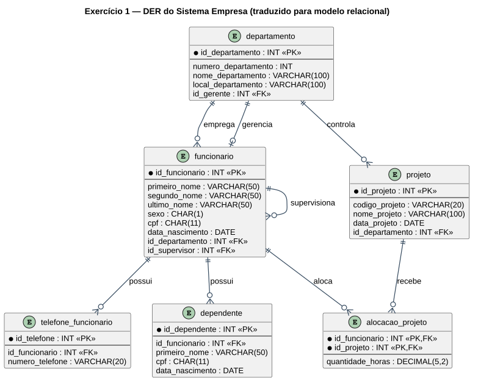

# Trabalho: ELABORAR UM BANCO DE DADOS

> **Professor:** Prof. Guilherme de Morais
> **Disciplina:** Banco de Dados II (3º Semestre)
> **Pontuação Máxima:** 100 pontos
> **Conteúdo cobrado:** Modelagem de dados (DER), identificação de entidades/atributos/relacionamentos, tradução para DDL relacional

## Descrição da atividade

Trabalho de modelagem: a partir de cinco descrições textuais de domínios de negócio distintos, o aluno deve montar o Diagrama Entidade-Relacionamento (DER) correspondente — identificando entidades, atributos e relacionamentos (incluindo cardinalidades) — e, na resolução entregue, traduzir cada modelo para um esquema relacional (DDL) completo. A resolução integral está em [`trabalho_banco_de_dados_completo.sql`](./trabalho_banco_de_dados_completo.sql).

## Enunciado — 5 exercícios de modelagem

### Exercício 1 — Sistema Empresa

Deverá ser cadastrado o funcionário, com as informações de primeiro nome, segundo nome e último nome, endereço, sexo, CPF, data de nascimento e telefone (pode ter mais de um). O funcionário pode ser supervisor ou subordinado, e também pode ter dependentes — identificados por primeiro/segundo/último nome, endereço, sexo, CPF e data de nascimento (um dependente só pode ser cadastrado para um único funcionário). A empresa é dividida em departamentos, identificados por número, nome e local; um departamento possui muitos funcionários, mas cada funcionário trabalha em apenas um departamento, e todo departamento possui somente um gerente. Os projetos são controlados pelos departamentos e executados pelos funcionários (cadastrados com código, nome e data); um funcionário pode ser alocado em muitos projetos, um projeto não tem número máximo de funcionários, e é necessário registrar a quantidade de horas de cada funcionário em cada projeto.

### Exercício 2 — Pet-Shop (versão 1)

O pet-shop cadastra funcionários (CPF, nome completo, endereço, telefones residencial/celular, data de nascimento), cada um registrado em um único cargo. Cadastra também clientes (CPF, nome completo, endereço, telefones comercial/residencial/celular, data de nascimento, e-mail), e todo cliente possui pelo menos um animal cadastrado (nome, data de nascimento, sexo, raça, cor predominante, tipo). São registrados os serviços executados (funcionário, cliente, animal, tipo de serviço, data e valor) e as vendas de produtos (cliente, funcionário, produto, valor, quantidade, forma de pagamento). Os produtos são catalogados com código, nome, marca, valor unitário e validade, e cada produto possui um único fornecedor — que pode fornecer diferentes produtos.

### Exercício 3 — Pet-Shop (versão 2, mesmo domínio reforçado)

Mesma estrutura do Exercício 2, reforçando: um cliente possui pelo menos um animal; os registros de serviço amarram funcionário, cliente, animal, tipo de serviço, data e valor; a venda de produtos envolve cliente, funcionário e produto com valor, quantidade e forma de pagamento; cada produto tem um único fornecedor.

### Exercício 4 — Locadora de Automóveis

A locadora mantém cadastro de clientes (RG, nome, endereço, CNH, idade); todo cliente cadastrado realizou pelo menos uma locação. Cada carro da frota tem número de chassi, placa, marca, modelo, ano e cor. Ao locar um carro, são registradas data e hora da locação. Os carros são organizados por categorias (código, nome — ex. "Primeira classe" —, preço da diária e descrição das características); todo carro pertence a exatamente uma categoria. Para cada carro é mantido um histórico de consertos (dia, valor, descrição do serviço e oficina que o realizou).

### Exercício 5 — Companhia de Transporte

A companhia realiza entregas de remessas de armazéns para depósitos (identificados por número; existem 6 armazéns e 45 depósitos). Um caminhão pode carregar várias remessas durante uma viagem, levando-as a múltiplos depósitos a partir de um armazém de origem; cada viagem tem um número identificador e armazena peso e volume totais. Cada remessa tem número, volume, peso e depósito de destino. Cada caminhão é identificado pelo código de licença e possui capacidades de volume e peso; a companhia tem 150 caminhões, cada um fazendo de 3 a 4 viagens por semana.

## Modelo relacional (resolução completa)

O script de resolução implementa os cinco domínios como esquemas independentes:

| Exercício | Entidades principais |
| :--- | :--- |
| 1 — Empresa | `departamento`, `funcionario`, `telefone_funcionario`, `dependente`, `projeto`, `alocacao_projeto` |
| 2/3 — Pet-Shop | `cargo`, `funcionario_pet`, `fornecedor`, `produto`, `cliente_pet`, `animal`, `servico`, `venda`, `item_venda` |
| 4 — Locadora | `cliente_locadora`, `categoria_carro`, `carro`, `locacao`, `historico_conserto` |
| 5 — Transporte | `armazem`, `deposito`, `caminhao`, `viagem`, `remessa` |



Exemplo de consulta com `JOIN` sobre o modelo Empresa (funcionários e seus projetos alocados):

```sql
SELECT
    CONCAT(f.primeiro_nome, ' ', f.ultimo_nome) AS funcionario,
    d.nome_departamento,
    p.nome_projeto,
    ap.quantidade_horas
FROM funcionario f
JOIN departamento d ON f.id_departamento = d.id_departamento
JOIN alocacao_projeto ap ON f.id_funcionario = ap.id_funcionario
JOIN projeto p ON ap.id_projeto = p.id_projeto;
```

## Arquivos entregues

- [`EXERCICIOS.docx`](./EXERCICIOS.docx) — enunciado original com os 5 exercícios de modelagem (DER).
- [`trabalho_banco_de_dados_completo.sql`](./trabalho_banco_de_dados_completo.sql) — resolução completa: DDL de todos os esquemas, `INSERT`s de exemplo e consultas de verificação com `JOIN`.

## Material relacionado

- [Aula 06 — Operador IN e Consultas com Múltiplas Tabelas](../../Aulas/COMANDO%20IN%20E%20SQL%20MAIS%20COMPLEXAS/detalhes.md)
- [Trabalho: Trabalho Banco Material 03 — INSERT/UPDATE/DELETE](../trabalho%20banco%20material%2003/detalhes.md)
