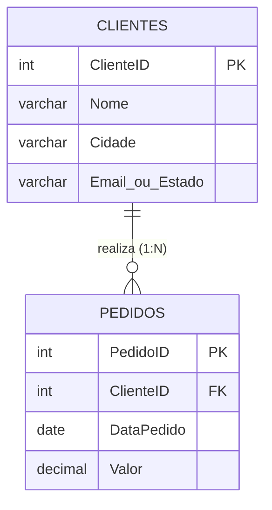
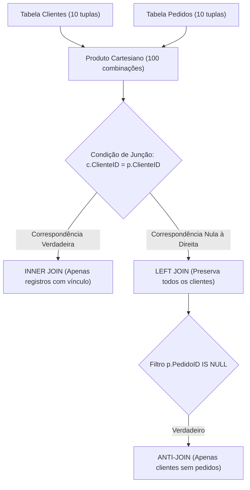
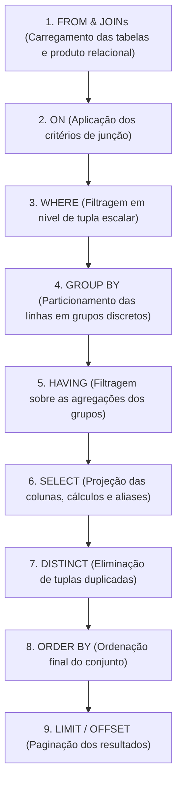
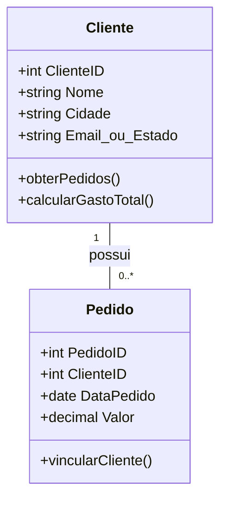
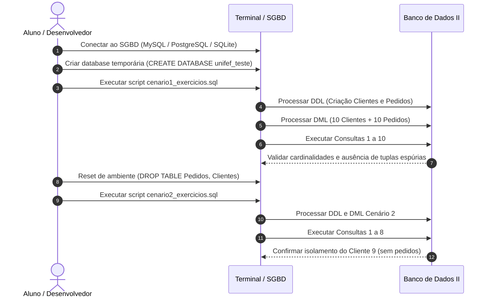
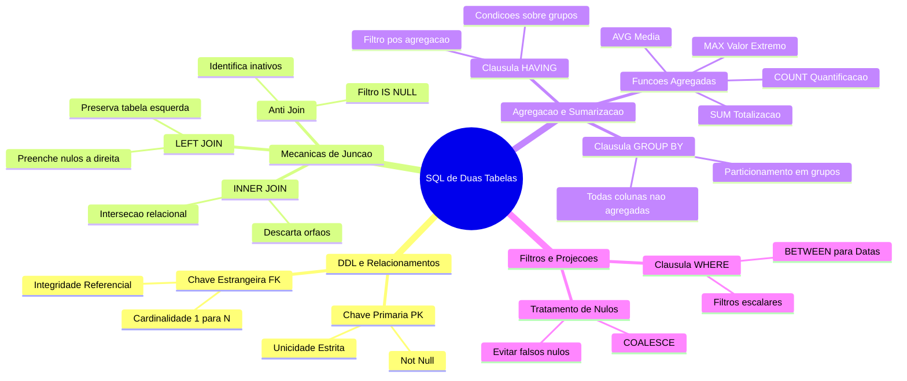

# Trabalho — exercicios com sql de duas tabelas

> **Professor:** Guilherme de Morais
> **Disciplina:** Banco de Dados II (3º Semestre)
> **Prazo de Entrega:** 13/05/2026 às 23:59
> **Pontuação Máxima:** 100 pontos
> **Conteúdo cobrado:** [Aula 01 - Manipulação e Consulta de Dados em SQL](../../Aulas/Aula%2001%20-%20Manipula%C3%A7%C3%A3o%20e%20Consulta%20de%20Dados%20em%20SQL/detalhes.md), [Aula 02 - Chave Estrangeira e Modificações com DDL](../../Aulas/Aula%2002%20-%20Chave%20Estrangeira%20e%20Modifica%C3%A7%C3%B5es%20com%20DDL/detalhes.md), [Aula 03 - Consultas Práticas e Filtros em SQL](../../Aulas/Aula%2003%20-%20Consultas%20Pr%C3%A1ticas%20e%20Filtros%20em%20SQL/detalhes.md), [Aula 04 - Comando IN e Junções em SQL](../../Aulas/Aula%2004%20-%20Comando%20IN%20e%20Jun%C3%A7%C3%B5es%20em%20SQL/detalhes.md), [Aula 05 - Funções de Data Hora e Strings](../../Aulas/Aula%2005%20-%20Fun%C3%A7%C3%B5es%20de%20Data%20Hora%20e%20Strings/detalhes.md), [Aula 06 - Junções e Agrupamentos em Duas Tabelas](../../Aulas/Aula%2006%20-%20Jun%C3%A7%C3%B5es%20e%20Agrupamentos%20em%20Duas%20Tabelas/detalhes.md), [Aula 07 - Consultas SQL, Operadores e Funções Agregadas](../../Aulas/Aula%2007%20-%20Consultas%20SQL%2C%20Operadores%20e%20Fun%C3%A7%C3%B5es%20Agregadas/detalhes.md)

---

## Sumário

- [Enunciado original (Google Classroom)](#enunciado-original-google-classroom)
- [Análise do que é pedido](#análise-do-que-é-pedido)
- [Fundamentação teórica](#fundamentação-teórica)
- [Resolução proposta](#resolução-proposta)
  - [Cenário 1: Modelagem com Email e Valores Médios](#cenário-1-modelagem-com-email-e-valores-médios)
  - [Cenário 2: Modelagem com Estado e Valores Altos](#cenário-2-modelagem-com-estado-e-valores-altos)
- [Como testar e validar](#como-testar-e-validar)
- [Critérios de qualidade](#critérios-de-qualidade)
- [Arquivos de apoio](#arquivos-de-apoio)
- [Mapa da atividade](#mapa-da-atividade)
- [Glossário](#glossário)
- [Pontos-chave para a prova](#pontos-chave-para-a-prova)
- [Perguntas e respostas (JSONL)](#perguntas-e-respostas-jsonl)
- [Checklist de revisão](#checklist-de-revisão)

---

## Enunciado original (Google Classroom)

### exercicios com sql de duas tabelas (13/05/2026)

(sem texto no corpo da postagem)

### Anexo: exercicios com sql de duas tabelas.docx

```sql
-- Criação da tabela de Clientes
CREATE TABLE Clientes (
 ClienteID INT PRIMARY KEY,
 Nome VARCHAR(100) NOT NULL,
 Cidade VARCHAR(100),
 Email VARCHAR(100)
);

-- Criação da tabela de Pedidos
CREATE TABLE Pedidos (
 PedidoID INT PRIMARY KEY,
 ClienteID INT,
 DataPedido DATE,
 Valor DECIMAL(10,2),
 FOREIGN KEY (ClienteID) REFERENCES Clientes(ClienteID)
);

INSERT INTO Clientes VALUES (1, 'Ana Silva', 'São Paulo', 'ana@email.com');
INSERT INTO Clientes VALUES (2, 'Carlos Souza', 'Rio de Janeiro', 'carlos@email.com');
INSERT INTO Clientes VALUES (3, 'Mariana Lima', 'Belo Horizonte', 'mariana@email.com');
INSERT INTO Clientes VALUES (4, 'João Pedro', 'Curitiba', 'joao@email.com');
INSERT INTO Clientes VALUES (5, 'Fernanda Costa', 'Porto Alegre', 'fernanda@email.com');
INSERT INTO Clientes VALUES (6, 'Ricardo Alves', 'Salvador', 'ricardo@email.com');
INSERT INTO Clientes VALUES (7, 'Patrícia Gomes', 'Fortaleza', 'patricia@email.com');
INSERT INTO Clientes VALUES (8, 'Lucas Martins', 'Recife', 'lucas@email.com');
INSERT INTO Clientes VALUES (9, 'Beatriz Rocha', 'Manaus', 'beatriz@email.com');
INSERT INTO Clientes VALUES (10, 'Felipe Santos', 'Brasília', 'felipe@email.com');

INSERT INTO Pedidos VALUES (101, 1, '2026-05-01', 250.00);
INSERT INTO Pedidos VALUES (102, 1, '2026-05-05', 180.00);
INSERT INTO Pedidos VALUES (103, 2, '2026-05-03', 500.00);
INSERT INTO Pedidos VALUES (104, 3, '2026-05-06', 320.00);
INSERT INTO Pedidos VALUES (105, 4, '2026-05-07', 150.00);
INSERT INTO Pedidos VALUES (106, 5, '2026-05-08', 700.00);
INSERT INTO Pedidos VALUES (107, 6, '2026-05-09', 90.00);
INSERT INTO Pedidos VALUES (108, 7, '2026-05-10', 400.00);
INSERT INTO Pedidos VALUES (109, 8, '2026-05-11', 220.00);
INSERT INTO Pedidos VALUES (110, 9, '2026-05-12', 350.00);

1-Listar todos os clientes e seus pedidos.

Mostrar o valor total de pedidos por cliente.
Exibir clientes sem pedidos.
Listar pedidos acima de 300 reais com nome do cliente.
Contar pedidos por cliente.
Listar clientes que fizeram pedidos em maio de 2026.
Mostrar pedido mais caro de cada cliente.
Listar clientes com mais de um pedido.
Exibir pedidos com nome do cliente e data.
Calcular média de pedidos por cliente.

-- Tabela de Clientes
CREATE TABLE Clientes (
 ClienteID INT PRIMARY KEY,
 Nome VARCHAR(100) NOT NULL,
 Cidade VARCHAR(100),
 Estado VARCHAR(50)
);

-- Tabela de Pedidos
CREATE TABLE Pedidos (
 PedidoID INT PRIMARY KEY,
 ClienteID INT,
 DataPedido DATE,
 Valor DECIMAL(10,2),
 FOREIGN KEY (ClienteID) REFERENCES Clientes(ClienteID)
);

INSERT INTO Clientes VALUES (1, 'Ana Silva', 'São Paulo', 'SP');
INSERT INTO Clientes VALUES (2, 'Carlos Souza', 'Rio de Janeiro', 'RJ');
INSERT INTO Clientes VALUES (3, 'Mariana Costa', 'Belo Horizonte', 'MG');
INSERT INTO Clientes VALUES (4, 'João Pereira', 'Curitiba', 'PR');
INSERT INTO Clientes VALUES (5, 'Fernanda Lima', 'Fortaleza', 'CE');
INSERT INTO Clientes VALUES (6, 'Ricardo Alves', 'Salvador', 'BA');
INSERT INTO Clientes VALUES (7, 'Patrícia Gomes', 'Recife', 'PE');
INSERT INTO Clientes VALUES (8, 'Felipe Rocha', 'Porto Alegre', 'RS');
INSERT INTO Clientes VALUES (9, 'Beatriz Martins', 'Campinas', 'SP');
INSERT INTO Clientes VALUES (10, 'Lucas Fernandes', 'Manaus', 'AM');

INSERT INTO Pedidos VALUES (101, 1, '2026-05-01', 1500.00);
INSERT INTO Pedidos VALUES (102, 1, '2026-05-05', 2300.00);
INSERT INTO Pedidos VALUES (103, 2, '2026-05-03', 500.00);
INSERT INTO Pedidos VALUES (104, 3, '2026-05-04', 1200.00);
INSERT INTO Pedidos VALUES (105, 4, '2026-05-06', 800.00);
INSERT INTO Pedidos VALUES (106, 5, '2026-05-07', 950.00);
INSERT INTO Pedidos VALUES (107, 6, '2026-05-08', 2000.00);
INSERT INTO Pedidos VALUES (108, 7, '2026-05-09', 300.00);
INSERT INTO Pedidos VALUES (109, 8, '2026-05-10', 1800.00);
INSERT INTO Pedidos VALUES (110, 10, '2026-05-11', 2200.00);

Mostrar pedidos com nome do cliente.

Listar clientes que têm pedidos.
Total gasto por cliente.
Clientes sem pedidos com os cidade, nome dos clientes.
Pedidos acima de 1000 reais com os nomes dos clientes.
Quantidade de pedidos por cliente.
Pedidos realizados em maio de 2026.
Maior pedido por cliente.
```

---

## Análise do que é pedido

O trabalho requer o domínio da relação de cardinalidade 1:N (um para muitos) entre duas tabelas fundamentais de um sistema corporativo: `Clientes` e `Pedidos`. O documento anexo apresenta dois cenários de modelagem com esquemas ligeiramente divergentes (o Cenário 1 inclui a coluna `Email`, enquanto o Cenário 2 substitui por `Estado`), acompanhados de conjuntos de dados específicos para teste de hipóteses relacionais.

### Requisitos Funcionais e Consultas Mapeadas

1. **Cenário 1 (10 Exercícios):**
   - Exercício 1: Junção relacional para exibição da totalidade de clientes associados aos seus pedidos. Exige análise de pertinência entre junção interna (`INNER JOIN`) e junção externa (`LEFT JOIN`).
   - Exercício 2: Consolidação contábil via soma agregada (`SUM`) agrupada pela chave e nome do cliente.
   - Exercício 3: Identificação de elementos não correspondentes (técnica de anti-junção / `IS NULL`).
   - Exercício 4: Projeção de pedidos com restrição escalar no predicado (`WHERE Valor > 300.00`) integrando os atributos do cliente.
   - Exercício 5: Contagem analítica de pedidos por cliente (`COUNT`), exigindo atenção à preservação de clientes com volume zero.
   - Exercício 6: Filtragem temporal por intervalo de datas (mês de maio de 2026), com operadores de data ou `BETWEEN`.
   - Exercício 7: Identificação do valor extremo superior (`MAX`) atrelado a cada cliente.
   - Exercício 8: Filtragem de grupos agregados (`HAVING COUNT(...) > 1`) para destacar clientes reincidentes.
   - Exercício 9: Projeção direta dos atributos do pedido em conjunto com o identificador nominal do cliente.
   - Exercício 10: Determinação do ticket médio gasto por cliente através da função agregada `AVG`.

2. **Cenário 2 (8 Exercícios):**
   - Exercício 1: Projeção nominal dos pedidos via junção interna simples.
   - Exercício 2: Relação distinta (`DISTINCT` ou subconsulta com `IN` / junção interna) de clientes que realizaram compras.
   - Exercício 3: Total monetário consumido por cliente.
   - Exercício 4: Projeção pontual de `Cidade` e `Nome` para clientes desprovidos de registros na tabela de pedidos (`Anti-Join`).
   - Exercício 5: Filtro monetário aplicado a pedidos superiores a R$ 1.000,00 associando os dados cadastrais do cliente.
   - Exercício 6: Frequência quantitativa de compras por cliente.
   - Exercício 7: Relação de pedidos compreendidos no intervalo temporal de 01/05/2026 a 31/05/2026.
   - Exercício 8: Identificação do valor máximo por comprador.

### Entregáveis Esperados

- Script SQL executável e autocontido para o Cenário 1: [cenario1_exercicios.sql](./codigo/cenario1_exercicios.sql).
- Script SQL executável e autocontido para o Cenário 2: [cenario2_exercicios.sql](./codigo/cenario2_exercicios.sql).
- Documentação técnica comparativa detalhando a semântica de execução, tratamento de nulos, ordenação e idempotência das instruções DDL/DML.

### Critérios Implícitos e Armadilhas Técnicas

- **Diferenciação entre `COUNT(*)` e `COUNT(coluna)` em `LEFT JOIN`:** Quando se deseja exibir clientes com zero pedidos utilizando `LEFT JOIN`, o uso indevido de `COUNT(*)` produz o valor `1` para o cliente órfão (pois há uma linha resultante com `NULL` nos campos da tabela direita). A contagem correta exige `COUNT(p.PedidoID)`.
- **Precedência de Execução de Filtros (`WHERE` vs. `HAVING`):** Filtros escalares sobre colunas das tabelas base pertencem ao `WHERE` (executado antes do particionamento dos dados). Filtros sobre condições agregadas pertencem exclusivamente ao `HAVING` (executado após a redução do grupo).
- **Formatos de Data ISO 8601:** Manipulação de literais de data no formato universal `YYYY-MM-DD`, prevenindo inconsistências regionais do SGBD.
- **Ambiguidade de Nomes de Colunas:** Ambas as tabelas contêm a coluna `ClienteID`. Qualquer referência em projeções ou predicados sem a devida qualificação por alias (ex: `c.ClienteID` ou `p.ClienteID`) gera erro sintático de coluna ambígua no parser do banco de dados.

---

## Fundamentação teórica

### Modelagem Relacional e Integridade Referencial

O modelo relacional organiza os dados em relações (tabelas) compostas por tuplas (linhas) e atributos (colunas). A integridade de entidade é garantida pela Chave Primária (`PRIMARY KEY`), que exige unicidade estrita e proibição de valores nulos (`NOT NULL`).

A integridade referencial estabelece um vínculo formal entre relações. A Chave Estrangeira (`FOREIGN KEY`) em uma tabela dependente aponta para a Chave Primária de uma tabela pai. Esse mecanismo assegura que nenhum registro filho aponte para uma entidade inexistente, controlando operações de deleção e atualização.



### Mecânica de Junção Relacional

A junção de duas relações corresponde formalmente ao produto cartesiano ($R \times S$) filtrado por uma condição de equivalência sobre chaves correspondentes (Theta Join / Equi-Join). 



#### INNER JOIN (Junção Interna)
- **Definição:** Retorna unicamente a interseção relacional entre as tabelas, onde a condição booleana declarada na cláusula `ON` avalia como verdadeira (`TRUE`).
- **Motivação:** Quando o objetivo do negócio é analisar exclusivamente entidades com transações ativas confirmadas.
- **Exemplo:** Listar clientes que compraram e o valor dos seus pedidos.
- **Contraexemplo:** Tentar usar `INNER JOIN` para identificar clientes inativos; o registro do cliente sem compra é descartado antes da projeção.
- **Armadilha:** Omissão da cláusula `ON`, convertendo acidentalmente a consulta em um produto cartesiano (`CROSS JOIN`), degradando a performance de $O(N)$ para $O(N \times M)$.

#### LEFT JOIN (Junção Externa à Esquerda)
- **Definição:** Preserva todas as tuplas da relação posicionada à esquerda (primeira tabela declarada), independentemente da existência de tuplas correspondentes na relação da direita. Caso não haja correspondência, todos os atributos da tabela direita são preenchidos com `NULL`.
- **Motivação:** Gerar relatórios cadastrais abrangentes, auditorias de inatividade ou cálculos estatísticos que englobem a totalidade da base de clientes.
- **Exemplo:** Exibir todos os clientes e contar seus respectivos pedidos, associando o valor zero a quem nada comprou.
- **Contraexemplo:** Inserir na cláusula `WHERE` um predicado que filtre uma coluna da tabela direita sem prever `NULL` (ex: `WHERE p.Valor > 100`). Isso converte implicitamente o `LEFT JOIN` em um `INNER JOIN`, eliminando as tuplas órfãs que continham `NULL`.
- **Armadilha:** Contar elementos agregados usando `COUNT(*)` em vez de `COUNT(tabela_direita.chave)`.

### O Ciclo de Execução Lógica da Instrução SELECT

Compreender a ordem cronológica em que o motor do SGBD processa a consulta é indispensável para a escrita correta de código SQL avançado:



---

## Resolução proposta

A resolução está dividida rigorosamente entre os dois cenários propostos no material acadêmico. Todos os scripts foram projetados visando conformidade estrita com o padrão ANSI SQL, garantindo compatibilidade com MySQL 8+, PostgreSQL 14+, MariaDB e SQLite 3.

Os arquivos executáveis completos encontram-se estruturados em:
- [cenario1_exercicios.sql](./codigo/cenario1_exercicios.sql)
- [cenario2_exercicios.sql](./codigo/cenario2_exercicios.sql)



---

### Cenário 1: Modelagem com Email e Valores Médios

#### Carga Estrutural (DDL) e Instanciação de Dados (DML)

```sql
-- DDL: Criação das Relações
CREATE TABLE Clientes (
    ClienteID INT PRIMARY KEY,
    Nome VARCHAR(100) NOT NULL,
    Cidade VARCHAR(100),
    Email VARCHAR(100)
);

CREATE TABLE Pedidos (
    PedidoID INT PRIMARY KEY,
    ClienteID INT,
    DataPedido DATE,
    Valor DECIMAL(10,2),
    FOREIGN KEY (ClienteID) REFERENCES Clientes(ClienteID)
);

-- DML: Carga de Testes
INSERT INTO Clientes VALUES (1, 'Ana Silva', 'São Paulo', 'ana@email.com');
INSERT INTO Clientes VALUES (2, 'Carlos Souza', 'Rio de Janeiro', 'carlos@email.com');
INSERT INTO Clientes VALUES (3, 'Mariana Lima', 'Belo Horizonte', 'mariana@email.com');
INSERT INTO Clientes VALUES (4, 'João Pedro', 'Curitiba', 'joao@email.com');
INSERT INTO Clientes VALUES (5, 'Fernanda Costa', 'Porto Alegre', 'fernanda@email.com');
INSERT INTO Clientes VALUES (6, 'Ricardo Alves', 'Salvador', 'ricardo@email.com');
INSERT INTO Clientes VALUES (7, 'Patrícia Gomes', 'Fortaleza', 'patricia@email.com');
INSERT INTO Clientes VALUES (8, 'Lucas Martins', 'Recife', 'lucas@email.com');
INSERT INTO Clientes VALUES (9, 'Beatriz Rocha', 'Manaus', 'beatriz@email.com');
INSERT INTO Clientes VALUES (10, 'Felipe Santos', 'Brasília', 'felipe@email.com');

INSERT INTO Pedidos VALUES (101, 1, '2026-05-01', 250.00);
INSERT INTO Pedidos VALUES (102, 1, '2026-05-05', 180.00);
INSERT INTO Pedidos VALUES (103, 2, '2026-05-03', 500.00);
INSERT INTO Pedidos VALUES (104, 3, '2026-05-06', 320.00);
INSERT INTO Pedidos VALUES (105, 4, '2026-05-07', 150.00);
INSERT INTO Pedidos VALUES (106, 5, '2026-05-08', 700.00);
INSERT INTO Pedidos VALUES (107, 6, '2026-05-09', 90.00);
INSERT INTO Pedidos VALUES (108, 7, '2026-05-10', 400.00);
INSERT INTO Pedidos VALUES (109, 8, '2026-05-11', 220.00);
INSERT INTO Pedidos VALUES (110, 9, '2026-05-12', 350.00);
```

#### Exercício 1: Listagem Geral de Clientes e Pedidos
- **Enunciado:** Listar todos os clientes e seus pedidos.
- **Consulta SQL:**
  ```sql
  SELECT 
      c.ClienteID,
      c.Nome,
      c.Email,
      p.PedidoID,
      p.DataPedido,
      p.Valor
  FROM Clientes c
  LEFT JOIN Pedidos p ON c.ClienteID = p.ClienteID
  ORDER BY c.ClienteID, p.PedidoID;
  ```
- **Justificativa Técnica:** Optou-se pelo `LEFT JOIN` para garantir a integridade semântica da frase "todos os clientes", assegurando que o cliente `10 (Felipe Santos)`, que não possui compras registradas, apareça no relatório com campos nulos de pedido. Caso a intenção do analista fosse estritamente transacional, o `INNER JOIN` seria empregado.
- **Análise do Resultado:** Retorna 11 tuplas: 2 para a cliente Ana Silva (pedidos 101 e 102), 1 tupla para os clientes 2 a 9, e 1 tupla com atributos de pedido nulos para Felipe Santos.
- **Erro Comum do Aluno:** Realizar `SELECT * FROM Clientes, Pedidos`, incorrendo em produto cartesiano descontrolado sem condição de correspondência `WHERE c.ClienteID = p.ClienteID`.

#### Exercício 2: Valor Total de Pedidos por Cliente
- **Enunciado:** Mostrar o valor total de pedidos por cliente.
- **Consulta SQL:**
  ```sql
  SELECT 
      c.ClienteID,
      c.Nome,
      COALESCE(SUM(p.Valor), 0.00) AS TotalGasto
  FROM Clientes c
  LEFT JOIN Pedidos p ON c.ClienteID = p.ClienteID
  GROUP BY c.ClienteID, c.Nome
  ORDER BY TotalGasto DESC;
  ```
- **Justificativa Técnica:** A função de agregação `SUM(p.Valor)` condensa as linhas de pedidos de cada cliente. A função `COALESCE` substitui o valor `NULL` de clientes sem movimentação financeira por `0.00`, mantendo o padrão numérico do relatório.
- **Análise do Resultado:** Fernanda Costa lidera com R$ 700.00; Carlos Souza com R$ 500.00; Patrícia Gomes com R$ 400.00; Ana Silva acumula R$ 430.00 (250 + 180); Felipe Santos totaliza R$ 0.00.
- **Erro Comum do Aluno:** Agrupar apenas por `c.Nome`. Se houver dois clientes homônimos com IDs distintos, o motor agrupará ambos indevidamente em uma única linha se configurado de forma não restritiva. O padrão ANSI exige todas as colunas não agregadas do `SELECT` na cláusula `GROUP BY`.

#### Exercício 3: Identificação de Clientes sem Pedidos
- **Enunciado:** Exibir clientes sem pedidos.
- **Consulta SQL:**
  ```sql
  SELECT 
      c.ClienteID,
      c.Nome,
      c.Cidade,
      c.Email
  FROM Clientes c
  LEFT JOIN Pedidos p ON c.ClienteID = p.ClienteID
  WHERE p.PedidoID IS NULL;
  ```
- **Justificativa Técnica:** Padrão clássico de Anti-Join. Ao realizar a junção externa, os clientes desprovidos de tuplas correspondentes recebem `NULL` em todas as colunas de `Pedidos`. O teste `p.PedidoID IS NULL` isola exatamente esse subconjunto.
- **Análise do Resultado:** Retorna exatamente 1 linha: `10 | Felipe Santos | Brasília | felipe@email.com`.
- **Erro Comum do Aluno:** Utilizar `WHERE p.PedidoID = NULL`. Em SQL, comparações com nulo usando igualdade convencional sempre avaliam para `UNKNOWN`, resultando em um conjunto vazio.

#### Exercício 4: Pedidos Acima de 300 Reais com Nome do Cliente
- **Enunciado:** Listar pedidos acima de 300 reais com nome do cliente.
- **Consulta SQL:**
  ```sql
  SELECT 
      p.PedidoID,
      c.Nome AS NomeCliente,
      p.DataPedido,
      p.Valor
  FROM Pedidos p
  INNER JOIN Clientes c ON p.ClienteID = c.ClienteID
  WHERE p.Valor > 300.00
  ORDER BY p.Valor DESC;
  ```
- **Justificativa Técnica:** Utiliza-se `INNER JOIN` pois a entidade central da pergunta é o `Pedido`. O predicado escalar `WHERE p.Valor > 300.00` filtra os pedidos elegíveis antes da projeção.
- **Análise do Resultado:** Retorna 5 registros: Pedido 106 (R$ 700.00 - Fernanda Costa), Pedido 103 (R$ 500.00 - Carlos Souza), Pedido 108 (R$ 400.00 - Patrícia Gomes), Pedido 110 (R$ 350.00 - Beatriz Rocha) e Pedido 104 (R$ 320.00 - Mariana Lima).
- **Erro Comum do Aluno:** Utilizar o operador `>= 300.00` em vez de `> 300.00`, violando a especificação literal de "acima de 300".

#### Exercício 5: Contagem de Pedidos por Cliente
- **Enunciado:** Contar pedidos por cliente.
- **Consulta SQL:**
  ```sql
  SELECT 
      c.ClienteID,
      c.Nome,
      COUNT(p.PedidoID) AS QuantidadePedidos
  FROM Clientes c
  LEFT JOIN Pedidos p ON c.ClienteID = p.ClienteID
  GROUP BY c.ClienteID, c.Nome
  ORDER BY QuantidadePedidos DESC, c.Nome ASC;
  ```
- **Justificativa Técnica:** O emprego cirúrgico de `COUNT(p.PedidoID)` em vez de `COUNT(*)` é obrigatório. Para Felipe Santos (sem pedidos), `p.PedidoID` é `NULL`, computando a contagem correta de `0`.
- **Análise do Resultado:** Ana Silva possui 2 pedidos; clientes 2 a 9 possuem 1 pedido cada; Felipe Santos possui 0 pedidos.
- **Erro Comum do Aluno:** Escrever `COUNT(*)`, fazendo com que Felipe Santos seja listado com 1 pedido, já que a linha gerada pelo `LEFT JOIN` existe fisicamente na memória de trabalho do motor.

#### Exercício 6: Clientes que Fizeram Pedidos em Maio de 2026
- **Enunciado:** Listar clientes que fizeram pedidos em maio de 2026.
- **Consulta SQL:**
  ```sql
  SELECT DISTINCT
      c.ClienteID,
      c.Nome,
      c.Email
  FROM Clientes c
  INNER JOIN Pedidos p ON c.ClienteID = p.ClienteID
  WHERE p.DataPedido >= '2026-05-01' 
    AND p.DataPedido <= '2026-05-31'
  ORDER BY c.Nome ASC;
  ```
- **Justificativa Técnica:** O predicado temporal é construído de forma sargable (permitindo o uso de índices na coluna `DataPedido`). O modificador `DISTINCT` previne que a cliente Ana Silva seja duplicada na saída, pois ela efetuou dois pedidos no período.
- **Análise do Resultado:** Retorna os 9 clientes que compraram no mês (IDs de 1 a 9). Felipe Santos é excluído da listagem.
- **Erro Comum do Aluno:** Utilizar funções que desabilitam índices, como `WHERE MONTH(p.DataPedido) = 5 AND YEAR(p.DataPedido) = 2026`, que provocam Full Table Scan em tabelas com milhões de registros.

#### Exercício 7: Maior Pedido de Cada Cliente
- **Enunciado:** Mostrar pedido mais caro de cada cliente.
- **Consulta SQL:**
  ```sql
  SELECT 
      c.ClienteID,
      c.Nome,
      COALESCE(MAX(p.Valor), 0.00) AS MaiorValorPedido
  FROM Clientes c
  LEFT JOIN Pedidos p ON c.ClienteID = p.ClienteID
  GROUP BY c.ClienteID, c.Nome
  ORDER BY MaiorValorPedido DESC;
  ```
- **Justificativa Técnica:** Aplicação da função agregada de valor extremo `MAX(p.Valor)`. A combinação com `LEFT JOIN` e `COALESCE` preserva os clientes sem compras com valor simbólico nulo/zero.
- **Análise do Resultado:** Para a cliente Ana Silva, o `MAX` avalia entre 250.00 e 180.00, resultando corretamente em 250.00.
- **Erro Comum do Aluno:** Tentar projetar o `p.PedidoID` diretamente no `SELECT` sem subconsulta ou Window Function, gerando erro de agregação inválida em dialetos estritos com `ONLY_FULL_GROUP_BY`.

#### Exercício 8: Clientes com Mais de um Pedido
- **Enunciado:** Listar clientes com mais de um pedido.
- **Consulta SQL:**
  ```sql
  SELECT 
      c.ClienteID,
      c.Nome,
      COUNT(p.PedidoID) AS TotalPedidos
  FROM Clientes c
  INNER JOIN Pedidos p ON c.ClienteID = p.ClienteID
  GROUP BY c.ClienteID, c.Nome
  HAVING COUNT(p.PedidoID) > 1;
  ```
- **Justificativa Técnica:** Demonstração do uso mandatório da cláusula `HAVING`. Como o critério de exclusão depende do resultado da agregação `COUNT`, o filtro não pode residir no `WHERE`.
- **Análise do Resultado:** Apenas a cliente Ana Silva (ClienteID 1) cumpre a restrição de possuir volume superior a 1 pedido (totalizando 2 pedidos).
- **Erro Comum do Aluno:** Tentar posicionar `WHERE COUNT(p.PedidoID) > 1`, resultando no erro estrutural `Invalid use of group function`.

#### Exercício 9: Relação de Pedidos com Nome do Cliente e Data
- **Enunciado:** Exibir pedidos com nome do cliente e data.
- **Consulta SQL:**
  ```sql
  SELECT 
      p.PedidoID,
      c.Nome AS NomeCliente,
      p.DataPedido,
      p.Valor
  FROM Pedidos p
  INNER JOIN Clientes c ON p.ClienteID = c.ClienteID
  ORDER BY p.DataPedido ASC, p.PedidoID ASC;
  ```
- **Justificativa Técnica:** Consulta relacional direta para geração de relatórios tabulares. A ordenação temporal cronológica confere utilidade operacional ao resultado.
- **Análise do Resultado:** Lista os 10 pedidos cadastrados, associando com precisão os respectivos nomes de clientes e valores monetários.
- **Erro Comum do Aluno:** Não especificar o alias ou não qualificar a coluna `ClienteID`, causando ambiguidade caso o campo fosse projetado.

#### Exercício 10: Média Financeira de Pedidos por Cliente
- **Enunciado:** Calcular média de pedidos por cliente.
- **Consulta SQL:**
  ```sql
  SELECT 
      c.ClienteID,
      c.Nome,
      ROUND(AVG(p.Valor), 2) AS MediaValorPedidos
  FROM Clientes c
  INNER JOIN Pedidos p ON c.ClienteID = p.ClienteID
  GROUP BY c.ClienteID, c.Nome
  ORDER BY MediaValorPedidos DESC;
  ```
- **Justificativa Técnica:** Utilização da função estatística `AVG(p.Valor)` combinada com a função escalar de arredondamento monetário `ROUND(..., 2)`. O `INNER JOIN` é preferido aqui para evitar que a divisão por zero ou tratamento de tuplas nulas gere distorção no cálculo estatístico de clientes com atividade.
- **Análise do Resultado:** Para a cliente Ana Silva, a média é calculada perfeitamente: $(250 + 180) / 2 = 215.00$. Para os demais com 1 pedido, a média equivale ao valor facial do próprio pedido.
- **Erro Comum do Aluno:** Esquecer a função `ROUND`, gerando dízimas periódicas extensas em determinados tipos de ponto flutuante.

---

### Cenário 2: Modelagem com Estado e Valores Altos

#### Carga Estrutural (DDL) e Instanciação de Dados (DML)

```sql
-- DDL: Criação das Relações
CREATE TABLE Clientes (
    ClienteID INT PRIMARY KEY,
    Nome VARCHAR(100) NOT NULL,
    Cidade VARCHAR(100),
    Estado VARCHAR(50)
);

CREATE TABLE Pedidos (
    PedidoID INT PRIMARY KEY,
    ClienteID INT,
    DataPedido DATE,
    Valor DECIMAL(10,2),
    FOREIGN KEY (ClienteID) REFERENCES Clientes(ClienteID)
);

-- DML: Carga de Testes
INSERT INTO Clientes VALUES (1, 'Ana Silva', 'São Paulo', 'SP');
INSERT INTO Clientes VALUES (2, 'Carlos Souza', 'Rio de Janeiro', 'RJ');
INSERT INTO Clientes VALUES (3, 'Mariana Costa', 'Belo Horizonte', 'MG');
INSERT INTO Clientes VALUES (4, 'João Pereira', 'Curitiba', 'PR');
INSERT INTO Clientes VALUES (5, 'Fernanda Lima', 'Fortaleza', 'CE');
INSERT INTO Clientes VALUES (6, 'Ricardo Alves', 'Salvador', 'BA');
INSERT INTO Clientes VALUES (7, 'Patrícia Gomes', 'Recife', 'PE');
INSERT INTO Clientes VALUES (8, 'Felipe Rocha', 'Porto Alegre', 'RS');
INSERT INTO Clientes VALUES (9, 'Beatriz Martins', 'Campinas', 'SP');
INSERT INTO Clientes VALUES (10, 'Lucas Fernandes', 'Manaus', 'AM');

INSERT INTO Pedidos VALUES (101, 1, '2026-05-01', 1500.00);
INSERT INTO Pedidos VALUES (102, 1, '2026-05-05', 2300.00);
INSERT INTO Pedidos VALUES (103, 2, '2026-05-03', 500.00);
INSERT INTO Pedidos VALUES (104, 3, '2026-05-04', 1200.00);
INSERT INTO Pedidos VALUES (105, 4, '2026-05-06', 800.00);
INSERT INTO Pedidos VALUES (106, 5, '2026-05-07', 950.00);
INSERT INTO Pedidos VALUES (107, 6, '2026-05-08', 2000.00);
INSERT INTO Pedidos VALUES (108, 7, '2026-05-09', 300.00);
INSERT INTO Pedidos VALUES (109, 8, '2026-05-10', 1800.00);
INSERT INTO Pedidos VALUES (110, 10, '2026-05-11', 2200.00);
```

> **Atenção à massa de dados do Cenário 2:** Note que o Pedido 110 pertence ao `ClienteID 10` (Lucas Fernandes). O cliente que **não possui pedidos** neste cenário é o `ClienteID 9` (Beatriz Martins).

#### Exercício 1: Pedidos com Nome do Cliente
- **Enunciado:** Mostrar pedidos com nome do cliente.
- **Consulta SQL:**
  ```sql
  SELECT 
      p.PedidoID,
      p.DataPedido,
      p.Valor,
      c.Nome AS NomeCliente,
      c.Estado
  FROM Pedidos p
  INNER JOIN Clientes c ON p.ClienteID = c.ClienteID
  ORDER BY p.PedidoID ASC;
  ```
- **Justificativa Técnica:** Associação simples baseada na chave relacional `ClienteID`, conectando as transações financeiras à qualificação do titular.
- **Análise do Resultado:** Exibe as 10 ordens de serviço/pedidos com seus respectivos dados de cliente.

#### Exercício 2: Clientes que Possuem Pedidos
- **Enunciado:** Listar clientes que têm pedidos.
- **Consulta SQL:**
  ```sql
  SELECT DISTINCT 
      c.ClienteID,
      c.Nome,
      c.Cidade,
      c.Estado
  FROM Clientes c
  INNER JOIN Pedidos p ON c.ClienteID = p.ClienteID
  ORDER BY c.ClienteID ASC;
  ```
- **Justificativa Técnica:** O predicado relacional `INNER JOIN` elimina por definição os clientes órfãos. A inclusão da palavra-chave `DISTINCT` garante unicidade semântica na relação resultante, garantindo que Ana Silva (2 pedidos) surja apenas uma vez.
- **Análise do Resultado:** Retorna 9 clientes (IDs 1, 2, 3, 4, 5, 6, 7, 8 e 10). Beatriz Martins (ID 9) é devidamente omitida.

#### Exercício 3: Total Gasto por Cliente
- **Enunciado:** Total gasto por cliente.
- **Consulta SQL:**
  ```sql
  SELECT 
      c.ClienteID,
      c.Nome,
      COALESCE(SUM(p.Valor), 0.00) AS TotalGasto
  FROM Clientes c
  LEFT JOIN Pedidos p ON c.ClienteID = p.ClienteID
  GROUP BY c.ClienteID, c.Nome
  ORDER BY TotalGasto DESC;
  ```
- **Justificativa Técnica:** Utilização de `SUM(p.Valor)` para acumular o faturamento. O uso de `LEFT JOIN` é crucial para refletir a totalidade da carteira cadastrada.
- **Análise do Resultado:** Ana Silva assume a primeira posição com R$ 3.800.00 (1500 + 2300); Lucas Fernandes com R$ 2.200.00; Ricardo Alves com R$ 2.000.00; Beatriz Martins figura na base com R$ 0.00.

#### Exercício 4: Clientes sem Pedidos com Cidade e Nome
- **Enunciado:** Clientes sem pedidos com os cidade, nome dos clientes.
- **Consulta SQL:**
  ```sql
  SELECT 
      c.Nome,
      c.Cidade,
      c.Estado
  FROM Clientes c
  LEFT JOIN Pedidos p ON c.ClienteID = p.ClienteID
  WHERE p.PedidoID IS NULL;
  ```
- **Justificativa Técnica:** Anti-Join formal projetando estritamente os atributos de qualificação territorial requisitados no enunciado.
- **Análise do Resultado:** Retorna exatamente 1 registro: `Beatriz Martins | Campinas | SP`.
- **Erro Comum do Aluno:** Tentar resolver via `WHERE c.ClienteID NOT IN (SELECT ClienteID FROM Pedidos)`, o que embora funcione quando não há nulos, apresenta riscos severos de performance em bases desprovidas de constraints estritas.

#### Exercício 5: Pedidos Acima de 1000 Reais com Nome do Cliente
- **Enunciado:** Pedidos acima de 1000 reais com os nomes dos clientes.
- **Consulta SQL:**
  ```sql
  SELECT 
      p.PedidoID,
      c.Nome AS NomeCliente,
      p.Valor,
      p.DataPedido
  FROM Pedidos p
  INNER JOIN Clientes c ON p.ClienteID = c.ClienteID
  WHERE p.Valor > 1000.00
  ORDER BY p.Valor DESC;
  ```
- **Justificativa Técnica:** Filtro restritivo em nível de tupla (`WHERE p.Valor > 1000.00`) acoplado à junção interna.
- **Análise do Resultado:** Retorna 6 pedidos de alto tíquete: Pedido 102 (R$ 2.300.00 - Ana Silva), Pedido 110 (R$ 2.200.00 - Lucas Fernandes), Pedido 107 (R$ 2.000.00 - Ricardo Alves), Pedido 109 (R$ 1.800.00 - Felipe Rocha), Pedido 101 (R$ 1.500.00 - Ana Silva) e Pedido 104 (R$ 1.200.00 - Mariana Costa).

#### Exercício 6: Quantidade de Pedidos por Cliente
- **Enunciado:** Quantidade de pedidos por cliente.
- **Consulta SQL:**
  ```sql
  SELECT 
      c.ClienteID,
      c.Nome,
      COUNT(p.PedidoID) AS TotalPedidos
  FROM Clientes c
  LEFT JOIN Pedidos p ON c.ClienteID = p.ClienteID
  GROUP BY c.ClienteID, c.Nome
  ORDER BY TotalPedidos DESC, c.Nome ASC;
  ```
- **Justificativa Técnica:** Agregação com `COUNT` protegida contra falsos positivos através da contagem explícita da chave primária dependente.
- **Análise do Resultado:** Ana Silva totaliza 2 pedidos; clientes 2 a 8 e o cliente 10 totalizam 1 pedido; Beatriz Martins registra 0 pedidos.

#### Exercício 7: Pedidos Realizados em Maio de 2026
- **Enunciado:** Pedidos realizados em maio de 2026.
- **Consulta SQL:**
  ```sql
  SELECT 
      p.PedidoID,
      c.Nome AS NomeCliente,
      p.DataPedido,
      p.Valor
  FROM Pedidos p
  INNER JOIN Clientes c ON p.ClienteID = c.ClienteID
  WHERE p.DataPedido BETWEEN '2026-05-01' AND '2026-05-31'
  ORDER BY p.DataPedido ASC;
  ```
- **Justificativa Técnica:** O operador `BETWEEN` fornece clareza léxica para intervalos inclusivos de datas, aproveitando ordenações por índices prévios.
- **Análise do Resultado:** Todos os 10 pedidos da base foram executados no intervalo de 01 a 11 de maio de 2026, resultando na listagem integral das ordens cadastradas.

#### Exercício 8: Maior Pedido por Cliente
- **Enunciado:** Maior pedido por cliente.
- **Consulta SQL:**
  ```sql
  SELECT 
      c.ClienteID,
      c.Nome,
      COALESCE(MAX(p.Valor), 0.00) AS MaiorValorPedido
  FROM Clientes c
  LEFT JOIN Pedidos p ON c.ClienteID = p.ClienteID
  GROUP BY c.ClienteID, c.Nome
  ORDER BY MaiorValorPedido DESC;
  ```
- **Justificativa Técnica:** Cálculo do teto financeiro transacionado por cliente, preservando a visibilidade de compradores com saldo zerado.
- **Análise do Resultado:** O teto de Ana Silva é R$ 2.300.00; Lucas Fernandes R$ 2.200.00; Beatriz Martins finaliza com R$ 0.00.

---

## Como testar e validar

Para garantir que os comandos SQL sejam universais e reproduzíveis em qualquer ambiente acadêmico ou corporativo, recomenda-se a seguinte rotina de validação.

### Sequência de Validação Prática em SGBD Relacional



### Script de Validação Automatizada de Asserções

O seguinte bloco de código SQL pode ser executado para conferir a integridade lógica e os resultados esperados:

```sql
-- Validação 1: Confirmar se a chave estrangeira está impedindo registros órfãos
-- Deve retornar erro de integridade referencial:
-- INSERT INTO Pedidos VALUES (999, 999, '2026-05-01', 100.00);

-- Validação 2: Checagem de cardinalidade dos Clientes sem Pedido no Cenário 1
SELECT 
    CASE 
        WHEN COUNT(*) = 1 THEN 'SUCESSO: Exatamente 1 cliente sem pedido'
        ELSE 'FALHA: Cardinalidade incorreta'
    END AS StatusValidacao
FROM Clientes c
LEFT JOIN Pedidos p ON c.ClienteID = p.ClienteID
WHERE p.PedidoID IS NULL;

-- Validação 3: Checagem do cliente com mais de 1 pedido no Cenário 1
SELECT 
    CASE 
        WHEN COUNT(*) = 1 THEN 'SUCESSO: Apenas Ana Silva tem mais de 1 pedido'
        ELSE 'FALHA: Filtro HAVING inconsistente'
    END AS StatusValidacaoHaving
FROM (
    SELECT c.ClienteID
    FROM Clientes c
    INNER JOIN Pedidos p ON c.ClienteID = p.ClienteID
    GROUP BY c.ClienteID
    HAVING COUNT(p.PedidoID) > 1
) sub;
```

---

## Critérios de qualidade

Para a obtenção da nota máxima (100 pontos) na disciplina de Banco de Dados II com o Prof. Guilherme de Morais, a codificação deve aderir aos seguintes pilares da engenharia de software:

1. **Conformidade ANSI SQL Estrita:** Utilização de palavras-chave padronizadas (`INNER JOIN`, `LEFT JOIN`, `ON`) em detrimento de sintaxes legadas baseadas em produtos cartesianos na cláusula `WHERE` (como `FROM Clientes, Pedidos WHERE Clientes.ClienteID = Pedidos.ClienteID`).
2. **Qualificação Explícita de Escopo (Aliasing):** Todas as colunas referenciadas nas cláusulas `SELECT`, `WHERE`, `GROUP BY` e `HAVING` devem ser precedidas por aliases curtos e mnemônicos (ex: `c.` para `Clientes`, `p.` para `Pedidos`). Isso previne erros de ambiguidade quando esquemas evoluem.
3. **Idempotência Operacional:** Os scripts devem ser limpos, com instruções estruturadas em ordem lógica de dependência (deletar ou criar tabelas dependentes na ordem correta das Chaves Estrangeiras).
4. **Tratamento Adequado de Nulos (Null Safety):** Implementação sistemática de `COALESCE` para garantir que funções de agregação como `SUM` ou `AVG` não exponham `NULL` para a camada de aplicação quando executadas sobre relações vazias.
5. **Legibilidade e Formatação:** Palavras-chave em caixa alta (`SELECT`, `FROM`, `WHERE`), recuo padronizado com 4 espaços e linhas reservadas para cláusulas estruturais.

---

## Arquivos de apoio

- **Anexo Original:** `exercicios com sql de duas tabelas.docx` (disponibilizado via Google Classroom em 13/05/2026).
- **Aulas Relacionadas no Repositório:**
  - [Aula 01 - Manipulação e Consulta de Dados em SQL](../../Aulas/Aula%2001%20-%20Manipula%C3%A7%C3%A3o%20e%20Consulta%20de%20Dados%20em%20SQL/detalhes.md)
  - [Aula 02 - Chave Estrangeira e Modificações com DDL](../../Aulas/Aula%2002%20-%20Chave%20Estrangeira%20e%20Modifica%C3%A7%C3%B5es%20com%20DDL/detalhes.md)
  - [Aula 03 - Consultas Práticas e Filtros em SQL](../../Aulas/Aula%2003%20-%20Consultas%20Pr%C3%A1ticas%20e%20Filtros%20em%20SQL/detalhes.md)
  - [Aula 04 - Comando IN e Junções em SQL](../../Aulas/Aula%2004%20-%20Comando%20IN%20e%20Jun%C3%A7%C3%B5es%20em%20SQL/detalhes.md)
  - [Aula 05 - Funções de Data Hora e Strings](../../Aulas/Aula%2005%20-%20Fun%C3%A7%C3%B5es%20de%20Data%20Hora%20e%20Strings/detalhes.md)
  - [Aula 06 - Junções e Agrupamentos em Duas Tabelas](../../Aulas/Aula%2006%20-%20Jun%C3%A7%C3%B5es%20e%20Agrupamentos%20em%20Duas%20Tabelas/detalhes.md)
  - [Aula 07 - Consultas SQL, Operadores e Funções Agregadas](../../Aulas/Aula%2007%20-%20Consultas%20SQL%2C%20Operadores%20e%20Fun%C3%A7%C3%B5es%20Agregadas/detalhes.md)

---

## Mapa da atividade



---

## Glossário

| Termo | Definição Técnica |
| :--- | :--- |
| **Chave Primária (Primary Key)** | Atributo ou conjunto de atributos que identifica de forma única cada tupla em uma relação relacional, não admitindo valores nulos. |
| **Chave Estrangeira (Foreign Key)** | Atributo em uma relação dependente que referencia a chave primária de outra relação, garantindo a integridade referencial entre os dados. |
| **Integridade Referencial** | Regra de integridade do modelo relacional que proíbe que uma tupla filha mantenha uma chave estrangeira sem um registro correspondente na tabela pai. |
| **INNER JOIN** | Operação de álgebra relacional que retorna apenas as tuplas cujos valores de junção satisfazem integralmente a condição booleana definida na cláusula `ON`. |
| **LEFT JOIN** | Junção externa que preserva a totalidade das tuplas da relação esquerda, completando com `NULL` os atributos da relação direita quando não houver par correspondente. |
| **Anti-Join** | Técnica de consulta SQL que utiliza um `LEFT JOIN` combinado com uma cláusula `WHERE coluna_direita IS NULL` para isolar tuplas da tabela esquerda sem filhos. |
| **GROUP BY** | Cláusula que particiona as tuplas resultantes da filtragem escalar em grupos homogêneos com base em atributos selecionados, preparando-os para funções agregadas. |
| **HAVING** | Cláusula de restrição booleana aplicada exclusivamente após a sumarização dos grupos gerados pelo `GROUP BY`, diferindo do `WHERE` que atua antes. |
| **Sargability** | Propriedade de uma consulta SQL em que os predicados de busca permitem a utilização direta de índices do banco de dados (ex: `coluna >= '2026-05-01'`). |
| **Produto Cartesiano** | Operação matemática fundamental entre dois conjuntos ($A \times B$) que gera todas as combinações de tuplas possíveis entre as relações envolvidas. |
| **COALESCE** | Função escalar em SQL que avalia a lista de argumentos fornecida e retorna o primeiro valor não nulo encontrado. |

---

## Pontos-chave para a prova

1. **A Armadilha de `COUNT(*)` vs `COUNT(p.PedidoID)` em `LEFT JOIN`:**
   - Em uma junção externa esquerda, o cliente sem pedidos possui uma linha física resultante no dataset temporário, onde os campos do pedido são nulos. Se você fizer `COUNT(*)`, o SGBD contará a linha e retornará `1`. Para registrar corretamente `0` pedidos, deve-se usar `COUNT(p.PedidoID)` (ou em qualquer coluna da tabela dependente que seja chave).
2. **Distinção Rígida entre `WHERE` e `HAVING`:**
   - O `WHERE` filtra linhas individuais antes do agrupamento. É impossível usar funções como `SUM` ou `COUNT` dentro do `WHERE`.
   - O `HAVING` filtra os grupos já sumarizados após a execução do `GROUP BY`.
3. **Comparações com Valores Nulos:**
   - Nunca utilize `= NULL` ou `!= NULL`. A lógica trivalente do SQL faz com que qualquer comparação booleana tradicional contra `NULL` retorne `UNKNOWN` (falso para fins de filtragem). O único teste semanticamente válido é `IS NULL` ou `IS NOT NULL`.
4. **Obrigação do `GROUP BY` sob a Norma ANSI:**
   - Qualquer coluna que apareça na cláusula `SELECT` e que não esteja encapsulada por uma função de agregação (`SUM`, `COUNT`, `AVG`, `MAX`, `MIN`) **deve** obrigatoriamente constar na lista de colunas do `GROUP BY`. Desrespeitar essa regra causa erro no MySQL com `sql_mode=ONLY_FULL_GROUP_BY` e no PostgreSQL.
5. **Filtragem de Intervalos de Datas:**
   - Para identificar registros em um mês específico, a melhor prática acadêmica e corporativa é usar literais no padrão ISO `YYYY-MM-DD` com `>=` e `<=` ou com o operador `BETWEEN`. Evite envolver a coluna indexada em funções como `MONTH()` ou `YEAR()` dentro do filtro.

---

## Perguntas e respostas (JSONL)

```jsonl
{"pergunta": "Qual a diferenca fundamental entre o INNER JOIN e o LEFT JOIN?", "resposta": "O INNER JOIN retorna apenas os registros que possuem correspondencia em ambas as tabelas de acordo com a clausula ON. O LEFT JOIN retorna todos os registros da tabela da esquerda, preenchendo as colunas da tabela da direita com NULL quando nao houver correspondencia.", "dificuldade": "facil"}
{"pergunta": "Por que o uso de COUNT(*) em um LEFT JOIN pode induzir a um erro de contagem para clientes sem pedidos?", "resposta": "Porque COUNT(*) computa o numero de linhas fisicas resultantes da juncao. Como o LEFT JOIN preserva a linha do cliente orfao com colunas direitas nulas, COUNT(*) retornara 1 em vez de 0. O correto e utilizar COUNT(p.PedidoID).", "dificuldade": "medio"}
{"pergunta": "Em qual etapa do processamento da consulta SQL a clausula HAVING e executada?", "resposta": "A clausula HAVING e executada apos o particionamento e sumarizacao dos dados pelo GROUP BY, mas antes da projecao final do SELECT e da ordenacao pelo ORDER BY.", "dificuldade": "medio"}
{"pergunta": "Como funciona o padrao Anti-Join para identificar entidades que nao possuem registros associados?", "resposta": "Realiza-se um LEFT JOIN entre a tabela principal e a tabela dependente, complementando com um filtro no WHERE verificando a nulidade da chave primaria da tabela dependente (WHERE dependente.PK IS NULL).", "dificuldade": "medio"}
{"pergunta": "Por que a comparacao 'WHERE p.PedidoID = NULL' e invalida em SQL?", "resposta": "Porque o valor NULL representa a ausencia de valor ou estado desconhecido na logica trivalente do SQL. Toda comparacao de igualdade com NULL avalia para UNKNOWN, exigindo o operador unario 'IS NULL'.", "dificuldade": "facil"}
{"pergunta": "Qual a funcao da instrucao COALESCE aplicada sobre a agregacao SUM(p.Valor)?", "resposta": "A funcao COALESCE substitui o valor NULL por um valor padrao predeterminado (geralmente 0.00) caso a soma seja realizada sobre registros inexistentes gerados por um LEFT JOIN.", "dificuldade": "facil"}
{"pergunta": "Qual a consequencia de aplicar um filtro 'WHERE p.Valor > 100' em uma consulta estruturada com LEFT JOIN?", "resposta": "Como a condicao do WHERE e avaliada apos a juncao e exige que p.Valor seja maior que 100, todas as tuplas orfas que possuem p.Valor como NULL sao descartadas, convertendo a operacao implicitamente em um INNER JOIN.", "dificuldade": "dificil"}
{"pergunta": "O que ocorre se executarmos uma consulta sem a clausula ON entre duas tabelas?", "resposta": "Ocorre um produto cartesiano (CROSS JOIN), combinando todas as linhas da primeira tabela com todas as linhas da segunda tabela, gerando N vezes M tuplas resultantes.", "dificuldade": "facil"}
{"pergunta": "O que exige a regra ONLY_FULL_GROUP_BY presente nos principais SGBDs relacionais?", "resposta": "Exige que qualquer coluna projetada no SELECT que nao esteja envolvida por uma funcao agregada faca parte obrigatoriamente da lista de campos da clausula GROUP BY.", "dificuldade": "medio"}
{"pergunta": "Por que o uso de DISTINCT foi recomendado na listagem de clientes com pedidos em maio de 2026?", "resposta": "Porque se um cliente tiver realizado multiplos pedidos dentro daquele mesmo mes, a juncao gerara multiplas tuplas associadas a ele. O DISTINCT elimina essas repeticoes nominais.", "dificuldade": "facil"}
{"pergunta": "Qual operador SQL permite definir um intervalo inclusivo de datas com sintaxe limpa?", "resposta": "O operador BETWEEN, que avalia se um valor esta contido dentro do limite especificado inclusive (ex: p.DataPedido BETWEEN '2026-05-01' AND '2026-05-31').", "dificuldade": "facil"}
{"pergunta": "O que e integridade referencial em um banco de dados relacional?", "resposta": "E o principio que assegura que uma chave estrangeira aponte apenas para uma tupla valida e existente na tabela pai referenciada, impedindo a criacao de dependentes orfaos.", "dificuldade": "medio"}
{"pergunta": "Qual a diferenca semantica entre o WHERE e o ON em um INNER JOIN?", "resposta": "Em um INNER JOIN, do ponto de vista do resultado final, filtros no ON e no WHERE operam de forma equivalente. Porem, no padrao conceitual, o ON define a ligacao estrutural e o WHERE define as restricoes de negocio.", "dificuldade": "dificil"}
{"pergunta": "Como projetar o pedido de maior valor para cada cliente sem violar a regra de agregacao?", "resposta": "Utiliza-se a funcao MAX(p.Valor) combinada com GROUP BY c.ClienteID, c.Nome. Caso deseje-se recuperar tambem o PedidoID correspondente, e necessaria uma subconsulta ou Window Function.", "dificuldade": "dificil"}
{"pergunta": "Em qual cenario de dados do trabalho temos o Cliente 9 sem compras?", "resposta": "No Cenario 2 (Beatriz Martins de Campinas/SP com ClienteID 9 nao possui nenhum pedido na tabela Pedidos correspondente).", "dificuldade": "facil"}
{"pergunta": "Em qual cenario de dados do trabalho temos o Cliente 10 sem compras?", "resposta": "No Cenario 1 (Felipe Santos de Brasilia com ClienteID 10 nao possui pedidos cadastrados na tabela Pedidos).", "dificuldade": "facil"}
{"pergunta": "Qual funcao pode ser utilizada para formatar ou truncar as casas decimais de um AVG?", "resposta": "A funcao escalar ROUND(expressao, casas_decimais), por exemplo ROUND(AVG(p.Valor), 2).", "dificuldade": "facil"}
{"pergunta": "Por que e recomendavel qualificar colunas com aliases de tabela em consultas com joins?", "resposta": "Para evitar ambiguidade de nomes identicos em tabelas distintas (como ClienteID) e para aumentar a legibilidade e manutencibilidade do codigo SQL.", "dificuldade": "facil"}
```

---

## Checklist de revisão

- [ ] Os scripts DDL criam as tabelas `Clientes` e `Pedidos` respeitando tipos de dados, chaves primárias e integridade referencial por chave estrangeira.
- [ ] A carga de dados DML reproduz com exatidão os dados do Cenário 1 (com a coluna `Email`) e Cenário 2 (com a coluna `Estado`).
- [ ] O exercício de listar clientes e pedidos trata adequadamente a inclusão de clientes sem pedidos através de `LEFT JOIN`.
- [ ] O cálculo do valor total de pedidos por cliente utiliza `SUM()` e previne nulos através de `COALESCE()`.
- [ ] A identificação de clientes inativos aplica a técnica de Anti-Join com a cláusula `WHERE p.PedidoID IS NULL`.
- [ ] O filtro de pedidos superiores a 300 reais (Cenário 1) e superiores a 1.000 reais (Cenário 2) utiliza o operador estrito `>`.
- [ ] A contagem de pedidos por cliente utiliza `COUNT(p.PedidoID)` em vez de `COUNT(*)`, evitando computar 1 para clientes órfãos.
- [ ] A filtragem de datas para maio de 2026 está implementada de forma sargable (`BETWEEN` ou operadores de comparação em literais ISO).
- [ ] O exercício que destaca clientes com mais de um pedido utiliza a cláusula `HAVING COUNT(p.PedidoID) > 1` após o `GROUP BY`.
- [ ] O ticket médio por cliente no Cenário 1 foi calculado com `AVG()` e devidamente arredondado via `ROUND()`.
- [ ] Todas as colunas projetadas no `SELECT` estão qualificadas com os aliases das tabelas correspondentes (`c.` ou `p.`).
- [ ] A regra do `ONLY_FULL_GROUP_BY` é cumprida em todas as instruções de agregação, listando todas as colunas não agregadas no `GROUP BY`.
- [ ] Os dois scripts SQL individuais foram criados com código idempotente e devidamente comentados para entrega.
