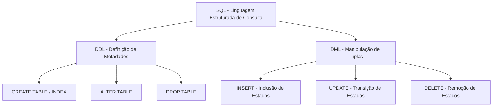
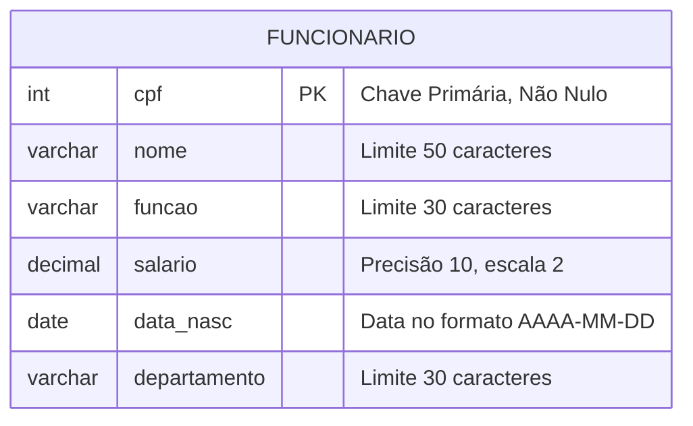
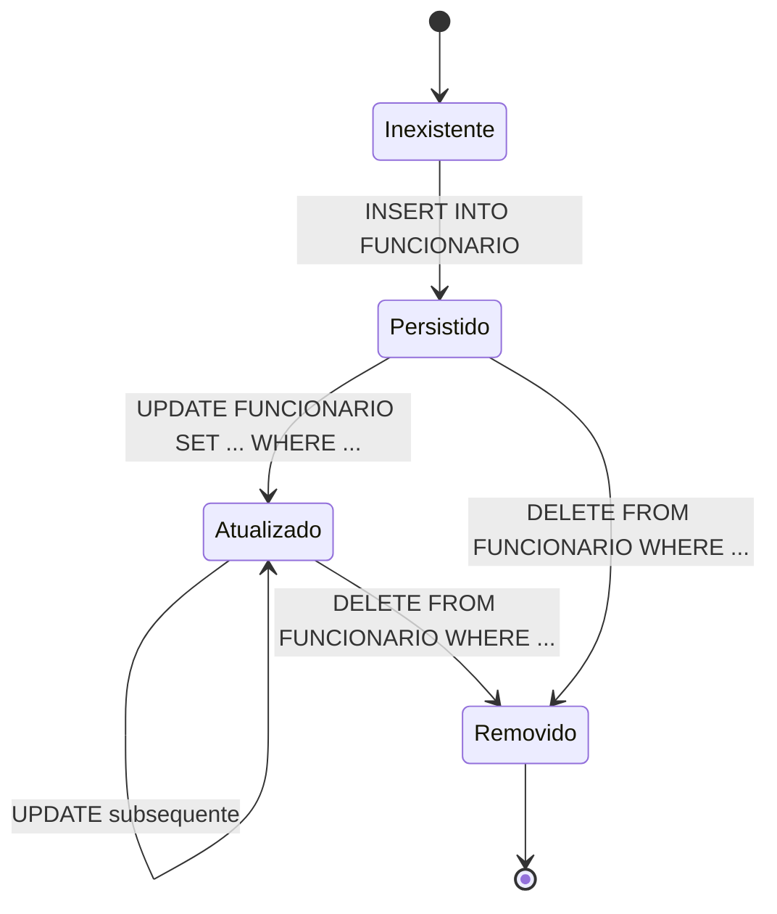
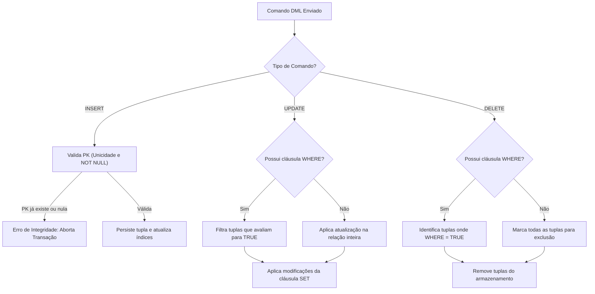
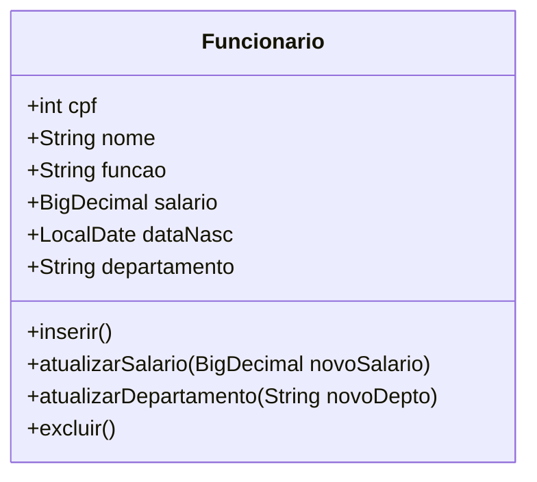
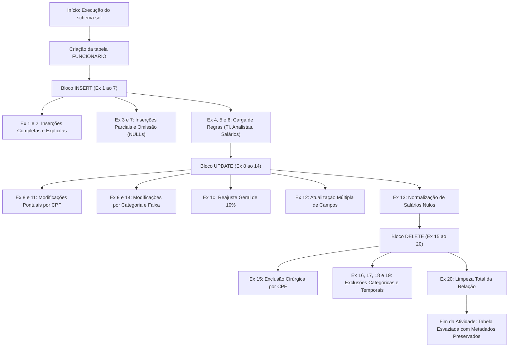

# Trabalho — trabalho banco material 03 

> **Professor:** Guilherme de Morais
> **Disciplina:** Banco de Dados II (3º Semestre)
> **Prazo de Entrega:** 04/03/2026 às 22:30
> **Pontuação Máxima:** 100 pontos
> **Conteúdo cobrado:** [Aula 01 - Manipulação e Consulta de Dados em SQL](../../Aulas/Aula%2001%20-%20Manipula%C3%A7%C3%A3o%20e%20Consulta%20de%20Dados%20em%20SQL/detalhes.md), [Aula 02 - Chave Estrangeira e Modificações com DDL](../../Aulas/Aula%2002%20-%20Chave%20Estrangeira%20e%20Modifica%C3%A7%C3%B5es%20com%20DDL/detalhes.md), [Aula 03 - Consultas Práticas e Filtros em SQL](../../Aulas/Aula%2003%20-%20Consultas%20Pr%C3%A1ticas%20e%20Filtros%20em%20SQL/detalhes.md) e [Aula 05 - Funções de Data Hora e Strings](../../Aulas/Aula%2005%20-%20Fun%C3%A7%C3%B5es%20de%20Data%20Hora%20e%20Strings/detalhes.md)

---

## Sumário

- [Trabalho — trabalho banco material 03](#trabalho--trabalho-banco-material-03)
  - [Sumário](#sumário)
  - [Enunciado original (Google Classroom)](#enunciado-original-google-classroom)
  - [Análise do que é pedido](#análise-do-que-é-pedido)
    - [Objetivo pedagógico e competências desenvolvidas](#objetivo-pedagógico-e-competências-desenvolvidas)
    - [Mapeamento dos requisitos e entregáveis](#mapeamento-dos-requisitos-e-entregáveis)
    - [Critérios implícitos e armadilhas comuns de modelagem](#critérios-implícitos-e-armadilhas-comuns-de-modelagem)
  - [Fundamentação teórica](#fundamentação-teórica)
    - [Classificação das linguagens SQL: DDL versus DML](#classificação-das-linguagens-sql-ddl-versus-dml)
    - [Tipagem de dados e integridade relacional](#tipagem-de-dados-e-integridade-relacional)
    - [A mecânica do comando INSERT: posicional versus declarativo](#a-mecânica-do-comando-insert-posicional-versus-declarativo)
    - [A semântica do comando UPDATE e expressões aritméticas](#a-semântica-do-comando-update-e-expressões-aritméticas)
    - [O comando DELETE, integridade referencial e o perigo do WHERE ausente](#o-comando-delete-integridade-referencial-e-o-perigo-do-where-ausente)
    - [A lógica trivalente (3VL) e o tratamento de nulos](#a-lógica-trivalente-3vl-e-o-tratamento-de-nulos)
    - [Diagramas conceituais da estrutura e ciclo de vida](#diagramas-conceituais-da-estrutura-e-ciclo-de-vida)
  - [Resolução proposta](#resolução-proposta)
    - [Estrutura DDL base](#estrutura-ddl-base)
    - [Parte 1: Exercícios de INSERT (1 ao 7)](#parte-1-exercícios-de-insert-1-ao-7)
    - [Parte 2: Exercícios de UPDATE (8 ao 14)](#parte-2-exercícios-de-update-8-ao-14)
    - [Parte 3: Exercícios de DELETE (15 ao 20)](#parte-3-exercícios-de-delete-15-ao-20)
  - [Como testar e validar](#como-testar-e-validar)
    - [Ambiente de execução controlado](#ambiente-de-execução-controlado)
    - [Plano de testes sequencial com asserções SQL](#plano-de-testes-sequencial-com-asserções-sql)
  - [Critérios de qualidade](#critérios-de-qualidade)
  - [Arquivos de apoio](#arquivos-de-apoio)
  - [Mapa da atividade](#mapa-da-atividade)
  - [Glossário](#glossário)
  - [Pontos-chave para a prova](#pontos-chave-para-a-prova)
  - [Perguntas e respostas (JSONL)](#perguntas-e-respostas-jsonl)
  - [Checklist de revisão](#checklist-de-revisão)

---

## Enunciado original (Google Classroom)

O documento anexo `trabalho banco materiai 03.docx` apresenta a definição de tabela e o rol de comandos práticos transcritos integralmente a seguir:

```text
Trabalho

CREATE TABLE FUNCIONARIO (
 cpf INTEGER NOT NULL,
 nome VARCHAR(50),
 funcao VARCHAR(30),
 salario DECIMAL(10,2),
 data_nasc DATE,
 departamento VARCHAR(30),
 CONSTRAINT pk_fun_cpf PRIMARY KEY (cpf)
);

EXERCÍCIOS – INSERT
1)Insira um funcionário com todos os campos preenchidos.

2)Insira três funcionários em departamentos diferentes utilizando a sintaxe com declaração explícita das colunas.

3)Insira um funcionário informando apenas cpf, nome e data_nasc.

4)Cadastre um funcionário cujo salário seja 8750.90 e função “ANALISTA DE SISTEMAS”.

5)Insira dois funcionários com a mesma função, porém salários diferentes.

6)Cadastre cinco funcionários do departamento “TI”.

7)Insira um registro omitindo propositalmente o campo funcao.

🟡 EXERCÍCIOS – UPDATE
8)Atualize o salário de um funcionário específico pelo CPF.

9)Atualize a função de todos os funcionários do departamento “TI” para “DESENVOLVEDOR”.

10)Aumente em 10% o salário de todos os funcionários.

11)Altere o departamento de um funcionário específico.

12)Atualize a função e o salário simultaneamente de um funcionário.

13)Defina o salário como 0 para funcionários que não possuem salário cadastrado.

14)Altere a função para “GERENTE” apenas para funcionários com salário superior a 8000.

🔴 EXERCÍCIOS – DELETE
15)Exclua um funcionário específico pelo CPF.

16)Exclua todos os funcionários do departamento “RH”.

17)Remova funcionários com salário inferior a 1500.

18)Apague os registros de funcionários cuja função esteja vazia.

19)Exclua todos os funcionários nascidos antes de 1980.

20) Apague todos os registros da tabela.
```

---

## Análise do que é pedido

### Objetivo pedagógico e competências desenvolvidas

A atividade proposta pelo Professor Guilherme de Morais visa consolidar o domínio prático da linguagem de manipulação de dados (**DML - Data Manipulation Language**) dentro do padrão ANSI SQL sobre uma única relação denominada `FUNCIONARIO`. 

As competências avaliadas compreendem:
1. **Domínio da semântica de inserção (`INSERT`)**: Compreender a diferença entre sintaxe com omissão de lista de colunas (dependência posicional estrita da DDL) e sintaxe com projeção explícita de colunas (resiliente a alterações estruturais). Avaliar o comportamento do SGBD ao atribuir valores `NULL` implícitos ou explícitos a atributos sem a restrição `NOT NULL`.
2. **Manipulação seletiva e massiva via `UPDATE`**: Aplicar transformações de estado na relação, distinguindo operações pontuais filtradas por chave primária (`cpf`) de atualizações em lote orientadas por predicados categóricos (`departamento = 'TI'`), quantitativos (`salario > 8000`) ou expressões aritméticas cumulativas (`salario = salario * 1.10`).
3. **Manejo de nulos e lógica trivalente**: Identificar tuplas com ausência de valor através de operadores específicos (`IS NULL`) e normalizar estados inconsistentes.
4. **Remoção cirúrgica e expurgo total via `DELETE`**: Praticar a exclusão física de tuplas sob condições escalares, intervalos temporais (`data_nasc < '1980-01-01'`) e a limpeza irrestrita de relações.

### Mapeamento dos requisitos e entregáveis

A atividade exige a construção de scripts SQL perfeitamente executáveis. Para garantir a organização e reprodução fiel do ambiente de banco de dados, os artefatos devem ser estruturados em:

1. **Script DDL Idempotente**: [schema.sql](./codigo/schema.sql) responsável por criar a tabela garantindo que reexecuções não causem colisões de objetos pré-existentes.
2. **Script DML Sequencial e Verificável**: [exercicios.sql](./codigo/exercicios.sql) contendo a resolução dos 20 exercícios, divididos rigorosamente nos blocos de inserção, modificação e remoção, intercalados por consultas de projeção (`SELECT`) para auditoria imediata do efeito produzido.

### Critérios implícitos e armadilhas comuns de modelagem

- **CPF modelado como INTEGER**: O esquema fornecido define `cpf INTEGER NOT NULL`. Embora na engenharia de software aplicada documentos de identificação devam ser mapeados como texto (`VARCHAR` ou `CHAR`) para preservar zeros à esquerda e evitar limites de estouro de inteiro de 32 bits, o estudante **deve respeitar a modelagem fornecida pelo professor**, utilizando CPFs numéricos compatíveis (valores até 2.147.483.647 caso o motor utilize `INT4` padrão).
- **Sensibilidade ao formato de data**: O padrão ANSI para o tipo `DATE` exige o formato literal ISO-8601 (`'YYYY-MM-DD'`). O uso de formatos regionais (como `'DD/MM/YYYY'`) incorre em falhas de interpretação dependendo das variáveis de ambiente de localidade do SGBD (`lc_time`, `datestyle`).
- **Omissão perigosa de cláusula WHERE**: Em instruções `UPDATE` e `DELETE`, a ausência acidental da cláusula `WHERE` afeta a totalidade da relação. Nos exercícios 10 e 20, essa ausência é intencional e solicitada pela regra de negócio, mas nos demais exercícios a omissão representa erro conceitual grave.
- **Armadilha da comparação com NULL**: Avaliar a ausência de salário ou função por meio da sintaxe `salario = NULL` ou `funcao = NULL` é incorreto na semântica relacional. A comparação de qualquer valor com `NULL` através de operadores relacionais convencionais resulta em `UNKNOWN`, impedindo a satisfação do predicado da cláusula `WHERE`. Deve-se utilizar `IS NULL`.

---

## Fundamentação teórica

### Classificação das linguagens SQL: DDL versus DML

A linguagem SQL (*Structured Query Language*) é dividida funcionalmente em subconjuntos especializados:

- **DDL (Data Definition Language)**: Comandos responsáveis pela criação, alteração e exclusão de estruturas de dados e metadados no catálogo do sistema gerenciador de banco de dados (SGBD). Comandos fundamentais: `CREATE`, `ALTER`, `DROP`, `TRUNCATE`.
- **DML (Data Manipulation Language)**: Comandos voltados à inserção, alteração, consulta e remoção de dados armazenados dentro das estruturas previamente definidas. Comandos fundamentais: `INSERT`, `UPDATE`, `DELETE` (e em algumas classificações clássicas, `SELECT`).



### Tipagem de dados e integridade relacional

No esquema do exercício, cada atributo da entidade `FUNCIONARIO` possui domínio e restrições atômicas:

| Atributo | Tipo de Dado | Domínio Teórico | Restrições |
| :--- | :--- | :--- | :--- |
| `cpf` | `INTEGER` | Inteiro com sinal (geralmente 32 bits, de -2.147.483.648 a +2.147.483.647) | `NOT NULL`, `PRIMARY KEY` (Unicidade e Obrigatoriedade) |
| `nome` | `VARCHAR(50)` | Cadeia de caracteres alfanuméricos de comprimento variável até 50 bytes | Opcional (`NULL` permitido) |
| `funcao` | `VARCHAR(30)` | Cadeia de caracteres descritiva do cargo, até 30 bytes | Opcional (`NULL` permitido) |
| `salario` | `DECIMAL(10,2)` | Ponto fixo com 10 dígitos totais, sendo 2 casas decimais (até 99.999.999,99) | Opcional (`NULL` permitido) |
| `data_nasc` | `DATE` | Representação de calendário gregoriano (Ano, Mês, Dia) | Opcional (`NULL` permitido) |
| `departamento` | `VARCHAR(30)` | Identificador textual do setor de alocação, até 30 bytes | Opcional (`NULL` permitido) |

A restrição `CONSTRAINT pk_fun_cpf PRIMARY KEY (cpf)` impõe duas garantias fundamentais do modelo relacional:
1. **Integridade de Entidade**: O atributo identificador não pode conter valores nulos em nenhuma tupla.
2. **Unicidade Estrita**: O motor do SGBD constrói automaticamente uma estrutura de índice em árvore (B-Tree) para rejeitar qualquer tentativa de inserção ou alteração que resulte em duplicação de chave primária (`cpf` duplicado).

### A mecânica do comando INSERT: posicional versus declarativo

O comando `INSERT` adiciona novas tuplas a uma tabela. Há duas formas canônicas de estruturar este comando:

1. **Inserção Posicional (Implícita)**:
   ```sql
   INSERT INTO FUNCIONARIO VALUES (1001, 'Carlos Silva', 'Analista', 5000.00, '1990-05-15', 'TI');
   ```
   *Definição*: Os valores são fornecidos na ordem física exata em que as colunas foram declaradas no `CREATE TABLE`.
   *Armadilha*: Se a estrutura da tabela for modificada no futuro por um comando `ALTER TABLE ADD COLUMN`, este comando quebrará em produção porque o número de argumentos não corresponderá à nova quantidade de colunas.

2. **Inserção Declarativa (Explícita)**:
   ```sql
   INSERT INTO FUNCIONARIO (cpf, nome, data_nasc) VALUES (1002, 'Maria Santos', '1985-10-20');
   ```
   *Definição*: As colunas receptoras são expressamente listadas antes da cláusula `VALUES`.
   *Vantagem*: Resiliente a adições de colunas na tabela. Permite omitir colunas que admitam `NULL` ou que possuam cláusula `DEFAULT`.

### A semântica do comando UPDATE e expressões aritméticas

O comando `UPDATE` altera os valores de atributos em tuplas já persistidas. O SGBD avalia a operação em duas fases:
1. **Fase de Filtragem**: A cláusula `WHERE` avalia cada tupla da tabela. Aquelas cuja expressão booleana retornar `TRUE` são marcadas para atualização.
2. **Fase de Modificação**: A cláusula `SET` aplica as novas atribuições às colunas selecionadas.

Quando o `UPDATE` envolve operações aritméticas (como `salario = salario * 1.10`), o valor original do atributo na tupla corrente é lido, multiplicado pelo fator escalar, arredondado para a precisão do tipo (`DECIMAL(10,2)`) e gravado de volta.

*Atenção à Lógica Trivalente em Operações Aritméticas*: Na aritmética relacional, qualquer operação que envolva um valor `NULL` produz inexoravelmente `NULL` (exemplo: `NULL * 1.10 = NULL`). Logo, se um funcionário possuir `salario IS NULL`, um aumento percentual manterá o salário como `NULL`.

### O comando DELETE, integridade referencial e o perigo do WHERE ausente

O comando `DELETE` remove fisicamente ou logicamente tuplas de uma tabela.
- Se acompanhado de `WHERE`, atua de maneira seletiva.
- Se omitido o `WHERE`, varre a relação inteira, eliminando todas as linhas uma a uma e gerando registros de log de transação individuais para cada tupla.

*Diferença conceitual entre DELETE e TRUNCATE (conhecimento complementar)*:
- O `DELETE FROM TABELA;` remove todas as linhas mantendo a estrutura da tabela, acionando gatilhos (`TRIGGERS`) e gerando log de reversão linha a linha.
- O `TRUNCATE TABLE TABELA;` é uma operação DDL que desvincula as páginas de dados diretamente do sistema de arquivos, redefinindo ponteiros de alta velocidade, não executando gatilhos de linha e redefinindo sequências identity/auto-incremento. No contexto dos exercícios propostos, utiliza-se rigorosamente o comando `DELETE` solicitado pelo professor.

### A lógica trivalente (3VL) e o tratamento de nulos

No modelo relacional fundado por Edgar F. Codd, um valor `NULL` não é uma cadeia vazia (`''`) nem o valor numérico zero (`0`). Trata-se de um marcador de ausência de informação ou inaplicabilidade.

Em decorrência disso, a lógica proposicional booleana convencional (Verdadeiro ou Falso) é estendida para a **Lógica Trivalente** (*Three-Valued Logic - 3VL*), introduzindo o estado **UNKNOWN** (Desconhecido).

Tabela verdade para comparações com nulos:

| Expressão | Valor em SQL | Avaliação na Cláusula WHERE |
| :--- | :--- | :--- |
| `salario = 1500.00` (quando salario é 1500.00) | `TRUE` | Tupla é incluída no resultado/ação |
| `salario = 1500.00` (quando salario é 2000.00) | `FALSE` | Tupla é ignorada |
| `salario = 1500.00` (quando salario é NULL) | `UNKNOWN` | Tupla é ignorada (WHERE exige estritamente TRUE) |
| `salario = NULL` (quando salario é NULL) | `UNKNOWN` | **Erro de sintaxe conceitual**: Tupla é ignorada |
| `salario IS NULL` (quando salario é NULL) | `TRUE` | Tupla é incluída com sucesso |

### Diagramas conceituais da estrutura e ciclo de vida

O modelo de dados relacional da entidade `FUNCIONARIO` e suas restrições pode ser visualizado no diagrama Entidade-Relacionamento a seguir:



O ciclo de vida de uma tupla dentro do banco de dados relacional, governado pelas operações DML executadas na bateria de exercícios, obedece ao diagrama de estados abaixo:



O fluxo de processamento de comandos com verificação de integridade no motor relacional é detalhado pelo seguinte fluxograma:



---

## Resolução proposta

A resolução dos exercícios foi estruturada de modo a construir uma base de dados coerente, executar as transformações exigidas e documentar as particularidades de cada instrução.

Para garantir rastreabilidade completa e versionamento adequado, todo o código está organizado nos arquivos físicos:
- Script de criação de tabelas: [schema.sql](./codigo/schema.sql)
- Script de exercícios comentados: [exercicios.sql](./codigo/exercicios.sql)

O modelo relacional implementado obedece à estrutura de classes ilustrada no diagrama UML abaixo:



### Estrutura DDL base

Antes da execução dos comandos DML, a tabela deve ser instanciada no banco de dados. O script a seguir assegura a remoção prévia e a criação segura da relação:

```sql
-- Arquivo: ./codigo/schema.sql
-- Definição estrutural da tabela FUNCIONARIO

DROP TABLE IF EXISTS FUNCIONARIO;

CREATE TABLE FUNCIONARIO (
    cpf INTEGER NOT NULL,
    nome VARCHAR(50),
    funcao VARCHAR(30),
    salario DECIMAL(10,2),
    data_nasc DATE,
    departamento VARCHAR(30),
    CONSTRAINT pk_fun_cpf PRIMARY KEY (cpf)
);
```

---

### Parte 1: Exercícios de INSERT (1 ao 7)

#### Exercício 01: Inserção com todos os campos preenchidos

- **Enunciado do professor**: "Insira um funcionário com todos os campos preenchidos."
- **Objetivo pedagógico**: Demonstrar a inserção canônica completa, assegurando a compatibilidade de tipos para inteiros, literais alfanuméricos, ponto fixo e datas.
- **Implementação SQL**:

```sql
INSERT INTO FUNCIONARIO (cpf, nome, funcao, salario, data_nasc, departamento)
VALUES (101, 'Ana Paula Souza', 'ENGENHEIRO DE DADOS', 7500.00, '1988-04-12', 'ENGENHARIA');

-- Verificação:
SELECT * FROM FUNCIONARIO WHERE cpf = 101;
```

- **Análise técnica**:
  - *Motivação*: A declaração explícita de colunas mapeia com precisão cada valor ao seu respectivo campo, evitando dependência da ordem física do SGBD.
  - *Armadilha*: Omitir aspas simples em valores do tipo `DATE` ou usar delimitadores de milhar (como vírgula) no literal do `DECIMAL` (ex: `7,500.00` resulta em erro de sintaxe).

---

#### Exercício 02: Inserção de três funcionários com colunas explícitas

- **Enunciado do professor**: "Insira três funcionários em departamentos diferentes utilizando a sintaxe com declaração explícita das colunas."
- **Objetivo pedagógico**: Fixar a sintaxe declarativa em múltiplos registros, garantindo a diversidade de domínios nos departamentos e chaves primárias distintas.
- **Implementação SQL**:

```sql
INSERT INTO FUNCIONARIO (cpf, nome, funcao, salario, data_nasc, departamento)
VALUES (102, 'Bruno Mendes', 'CONTADOR', 5200.00, '1979-08-25', 'FINANCEIRO');

INSERT INTO FUNCIONARIO (cpf, nome, funcao, salario, data_nasc, departamento)
VALUES (103, 'Carla Prado', 'ANALISTA DE RH', 4100.00, '1992-11-03', 'RH');

INSERT INTO FUNCIONARIO (cpf, nome, funcao, salario, data_nasc, departamento)
VALUES (104, 'Diego Ferreira', 'COORDENADOR DE VENDAS', 6300.00, '1984-02-17', 'COMERCIAL');

-- Verificação:
SELECT * FROM FUNCIONARIO WHERE cpf IN (102, 103, 104);
```

- **Análise técnica**:
  - *Multi-row INSERT (conhecimento complementar)*: Bancos padrão ANSI e motores como PostgreSQL e MySQL suportam agrupar inserções em uma única instrução (`VALUES (...), (...), (...)`), o que otimiza o *round-trip* de rede e a escrita no log de transações. Para fins didáticos e compatibilidade estrita, mantêm-se as instruções individuais.

---

#### Exercício 03: Inserção parcial com apenas três colunas

- **Enunciado do professor**: "Insira um funcionário informando apenas cpf, nome e data_nasc."
- **Objetivo pedagógico**: Evidenciar o comportamento das colunas não declaradas na projeção de inserção. Colunas omitidas recebem automaticamente o valor `NULL` quando não possuem valor padrão configurado via `DEFAULT`.
- **Implementação SQL**:

```sql
INSERT INTO FUNCIONARIO (cpf, nome, data_nasc)
VALUES (105, 'Eduardo Lima', '1995-06-30');

-- Verificação:
SELECT cpf, nome, funcao, salario, data_nasc, departamento 
FROM FUNCIONARIO 
WHERE cpf = 105;
```

- **Análise técnica**:
  - *Estado resultante*: `funcao`, `salario` e `departamento` assumirão o estado `NULL`.
  - *Contraexemplo*: Se `salario` contivesse a restrição `NOT NULL` sem valor padrão, a instrução acima falharia com erro de violação de restrição (`NotNullViolation`).

---

#### Exercício 04: Cadastro com salário e função específicos

- **Enunciado do professor**: "Cadastre um funcionário cujo salário seja 8750.90 e função “ANALISTA DE SISTEMAS”."
- **Objetivo pedagógico**: Atender a requisitos contratuais rígidos de negócio com valores literais pré-determinados.
- **Implementação SQL**:

```sql
INSERT INTO FUNCIONARIO (cpf, nome, funcao, salario, data_nasc, departamento)
VALUES (106, 'Fernanda Castro', 'ANALISTA DE SISTEMAS', 8750.90, '1987-09-14', 'TI');

-- Verificação:
SELECT * FROM FUNCIONARIO WHERE cpf = 106;
```

- **Análise técnica**:
  - O separador decimal deve ser o ponto (`.`). A cadeia de caracteres para `funcao` deve respeitar exatamente a grafia requisitada para evitar discrepâncias em consultas futuras com comparadores de igualdade estrita.

---

#### Exercício 05: Inserção de funcionários com mesma função e salários distintos

- **Enunciado do professor**: "Insira dois funcionários com a mesma função, porém salários diferentes."
- **Objetivo pedagógico**: Demonstrar a independência entre atributos não-chave e validar que o modelo relacional suporta duplicidade de valores em colunas comuns.
- **Implementação SQL**:

```sql
INSERT INTO FUNCIONARIO (cpf, nome, funcao, salario, data_nasc, departamento)
VALUES (107, 'Gabriel Nogueira', 'SUPORTE TECNICO', 2800.00, '1998-01-20', 'TI');

INSERT INTO FUNCIONARIO (cpf, nome, funcao, salario, data_nasc, departamento)
VALUES (108, 'Helena Ramos', 'SUPORTE TECNICO', 3400.00, '1993-07-08', 'TI');

-- Verificação:
SELECT nome, funcao, salario FROM FUNCIONARIO WHERE funcao = 'SUPORTE TECNICO';
```

- **Análise técnica**:
  - Essa diversidade de dados é crucial para testar futuros filtros de agregação (`AVG`, `MIN`, `MAX`) e agrupamento (`GROUP BY`).

---

#### Exercício 06: Inserção de cinco funcionários no departamento TI

- **Enunciado do professor**: "Cadastre cinco funcionários do departamento “TI”."
- **Objetivo pedagógico**: Criar uma massa de dados densa em uma partição categórica específica para viabilizar as operações de atualização em lote subsequentes.
- **Implementação SQL**:

```sql
INSERT INTO FUNCIONARIO (cpf, nome, funcao, salario, data_nasc, departamento)
VALUES (109, 'Igor Santana', 'ESTAGIARIO', 1400.00, '2001-03-15', 'TI');

INSERT INTO FUNCIONARIO (cpf, nome, funcao, salario, data_nasc, departamento)
VALUES (110, 'Juliana Teixeira', 'PROGRAMADOR JUNIOR', 3800.00, '1999-12-01', 'TI');

INSERT INTO FUNCIONARIO (cpf, nome, funcao, salario, data_nasc, departamento)
VALUES (111, 'Lucas Meireles', 'PROGRAMADOR PLENO', 5600.00, '1991-05-18', 'TI');

INSERT INTO FUNCIONARIO (cpf, nome, funcao, salario, data_nasc, departamento)
VALUES (112, 'Mariana Alencar', 'ESPECIALISTA QA', 7200.00, '1986-10-10', 'TI');

INSERT INTO FUNCIONARIO (cpf, nome, funcao, salario, data_nasc, departamento)
VALUES (113, 'Nelson Barbosa', 'ADMINISTRADOR DE REDES', 6500.00, '1975-04-05', 'TI');

-- Verificação:
SELECT cpf, nome, funcao, salario, departamento FROM FUNCIONARIO WHERE departamento = 'TI';
```

- **Análise técnica**:
  - Observe que foram inseridos cargos heterogêneos (`ESTAGIARIO`, `PROGRAMADOR JUNIOR`, etc.). Essa variedade permitirá verificar claramente o efeito do Exercício 09, que homogeneizará as funções do departamento de TI.

---

#### Exercício 07: Inserção com omissão proposital da função

- **Enunciado do professor**: "Insira um registro omitindo propositalmente o campo funcao."
- **Objetivo pedagógico**: Forçar a ausência explícita de valor em um atributo textual específico, preparando o cenário para o exercício de exclusão condicional de funções vazias (Exercício 18).
- **Implementação SQL**:

```sql
INSERT INTO FUNCIONARIO (cpf, nome, salario, data_nasc, departamento)
VALUES (114, 'Otavio Silveira', 4200.00, '1982-08-22', 'LOGISTICA');

-- Verificação:
SELECT * FROM FUNCIONARIO WHERE cpf = 114;
```

- **Análise técnica**:
  - *Comportamento interno*: O SGBD grava um ponteiro para `NULL` no bitmap de nulos (*null bitmap*) da página de dados para a coluna `funcao`.

---

### Parte 2: Exercícios de UPDATE (8 ao 14)

#### Exercício 08: Atualização pontual de salário por CPF

- **Enunciado do professor**: "Atualize o salário de um funcionário específico pelo CPF."
- **Objetivo pedagógico**: Demonstrar a atualização cirúrgica indexada pela chave primária, garantindo a alteração de exatamente uma tupla.
- **Implementação SQL**:

```sql
UPDATE FUNCIONARIO
SET salario = 8200.00
WHERE cpf = 101;

-- Verificação:
SELECT cpf, nome, salario FROM FUNCIONARIO WHERE cpf = 101;
```

- **Análise técnica**:
  - A presença de `WHERE cpf = 101` instrui o otimizador de consultas a realizar um *Index Scan* na B-Tree da chave primária, executando a alteração com custo $O(\log n)$ e garantindo que nenhuma outra linha seja modificada.

---

#### Exercício 09: Atualização em lote de função por departamento

- **Enunciado do professor**: "Atualize a função de todos os funcionários do departamento “TI” para “DESENVOLVEDOR”."
- **Objetivo pedagógico**: Praticar a modificação massiva direcionada por um predicado categórico alfanumérico.
- **Implementação SQL**:

```sql
UPDATE FUNCIONARIO
SET funcao = 'DESENVOLVEDOR'
WHERE departamento = 'TI';

-- Verificação:
SELECT cpf, nome, funcao, departamento FROM FUNCIONARIO WHERE departamento = 'TI';
```

- **Análise técnica**:
  - *Impacto*: Todas as tuplas com `departamento = 'TI'` (incluindo os CPFs 106, 107, 108, 109, 110, 111, 112 e 113) terão seus cargos alterados uniformemente para `'DESENVOLVEDOR'`.
  - *Armadilha*: Espaços extras ou diferenças de caixa alta/baixa (ex: `'ti'` ou `'TI '`) dependem do *collation* do banco. No PostgreSQL padrão, comparações de string são sensíveis a maiúsculas/minúsculas (*case-sensitive*).

---

#### Exercício 10: Reajuste linear de 10% no salário de todos os funcionários

- **Enunciado do professor**: "Aumente em 10% o salário de todos os funcionários."
- **Objetivo pedagógico**: Demonstrar a execução de uma expressão matemática escalar sobre o valor corrente de uma coluna e a aplicação deliberada de um `UPDATE` irrestrito (sem cláusula `WHERE`).
- **Implementação SQL**:

```sql
UPDATE FUNCIONARIO
SET salario = salario * 1.10;

-- Verificação:
SELECT cpf, nome, salario FROM FUNCIONARIO;
```

- **Análise técnica**:
  - *Mecânica do cálculo*: `salario * 1.10` equivale a $salario + (salario \times 0.10)$. O tipo `DECIMAL(10,2)` garante a precisão monetária sem os erros de arredondamento inerentes a números de ponto flutuante binário (`FLOAT`/`DOUBLE`).
  - *Comportamento com Nulos*: Tuplas com `salario IS NULL` (como o CPF 105) permanecerão como `NULL` após essa operação, pois a multiplicação sobre `NULL` avalia como `NULL`.

---

#### Exercício 11: Transferência de departamento de um funcionário específico

- **Enunciado do professor**: "Altere o departamento de um funcionário específico."
- **Objetivo pedagógico**: Praticar a movimentação organizacional de um registro por meio de filtro unívoco.
- **Implementação SQL**:

```sql
UPDATE FUNCIONARIO
SET departamento = 'INOVACAO'
WHERE cpf = 104;

-- Verificação:
SELECT cpf, nome, departamento FROM FUNCIONARIO WHERE cpf = 104;
```

- **Análise técnica**:
  - O funcionário Diego Ferreira (CPF 104), originalmente alocado em `'COMERCIAL'`, tem sua lotação alterada para `'INOVACAO'`.

---

#### Exercício 12: Atualização simultânea de função e salário

- **Enunciado do professor**: "Atualize a função e o salário simultaneamente de um funcionário."
- **Objetivo pedagógico**: Demonstrar a sintaxe de atribuição múltipla separada por vírgulas dentro de uma única cláusula `SET`.
- **Implementação SQL**:

```sql
UPDATE FUNCIONARIO
SET funcao = 'ARQUITETO DE DADOS',
    salario = 9500.00
WHERE cpf = 101;

-- Verificação:
SELECT cpf, nome, funcao, salario FROM FUNCIONARIO WHERE cpf = 101;
```

- **Análise técnica**:
  - *Atomicidade da Operação*: A cláusula `SET col1 = val1, col2 = val2` é avaliada e persistida de forma atômica. Nenhuma transação externa pode observar a linha com a nova função e o salário antigo.
  - *Erro comum de sintaxe*: Tentar utilizar a palavra reservada `AND` na cláusula `SET` (ex: `SET funcao = '...' AND salario = ...`). No SQL padrão, a palavra `AND` só é válida para conjunção de predicados na cláusula `WHERE`, e nunca como separador de atribuições no `SET`.

---

#### Exercício 13: Normalização de salários nulos para zero

- **Enunciado do professor**: "Defina o salário como 0 para funcionários que não possuem salário cadastrado."
- **Objetivo pedagógico**: Aplicar regras de sanitização de dados identificando a ausência de valor através do operador `IS NULL`.
- **Implementação SQL**:

```sql
UPDATE FUNCIONARIO
SET salario = 0.00
WHERE salario IS NULL;

-- Verificação:
SELECT cpf, nome, salario FROM FUNCIONARIO WHERE salario = 0.00;
```

- **Análise técnica**:
  - *Contraexemplo e Armadilha*: Executar `WHERE salario = NULL` não afetará nenhuma linha! Devido à lógica trivalente, a comparação `salario = NULL` retorna `UNKNOWN` para todas as linhas, inclusive aquelas onde o salário é de fato nulo. A sintaxe obrigatória é `WHERE salario IS NULL`.

---

#### Exercício 14: Promoção para GERENTE por faixa salarial

- **Enunciado do professor**: "Altere a função para “GERENTE” apenas para funcionários com salário superior a 8000."
- **Objetivo pedagógico**: Utilizar predicados relacionais de desigualdade estrita (`>`) para aplicar regras corporativas condicionais.
- **Implementação SQL**:

```sql
UPDATE FUNCIONARIO
SET funcao = 'GERENTE'
WHERE salario > 8000.00;

-- Verificação:
SELECT cpf, nome, funcao, salario FROM FUNCIONARIO WHERE funcao = 'GERENTE';
```

- **Análise técnica**:
  - Avalia todas as tuplas que, após o reajuste do Exercício 10 ou atribuições diretas, possuem montante superior a 8.000,00 reais. Por exemplo, o CPF 106 (salário original de 8.750,90 reajustado para 9.625,99) e o CPF 101 (9.500,00) serão promovidos.

---

### Parte 3: Exercícios de DELETE (15 ao 20)

#### Exercício 15: Exclusão pontual por CPF

- **Enunciado do professor**: "Exclua um funcionário específico pelo CPF."
- **Objetivo pedagógico**: Compreender a exclusão de granularidade fina orientada pela chave primária da entidade.
- **Implementação SQL**:

```sql
DELETE FROM FUNCIONARIO
WHERE cpf = 102;

-- Verificação:
SELECT * FROM FUNCIONARIO WHERE cpf = 102;
```

- **Análise técnica**:
  - A tupla correspondente ao CPF 102 (Bruno Mendes) é desreferenciada e removida. A consulta de verificação subsequente deve retornar zero linhas (*empty set*).

---

#### Exercício 16: Exclusão massiva por departamento

- **Enunciado do professor**: "Exclua todos os funcionários do departamento “RH”."
- **Objetivo pedagógico**: Realizar exclusão em lote orientada por filtro de conjunto relacional.
- **Implementação SQL**:

```sql
DELETE FROM FUNCIONARIO
WHERE departamento = 'RH';

-- Verificação:
SELECT * FROM FUNCIONARIO WHERE departamento = 'RH';
```

- **Análise técnica**:
  - Todas as tuplas cujo departamento seja exatamente igual a `'RH'` (como o CPF 103) são expurgadas da tabela de forma consistente.

---

#### Exercício 17: Remoção por piso salarial inferior a 1500

- **Enunciado do professor**: "Remova funcionários com salário inferior a 1500."
- **Objetivo pedagógico**: Aplicar exclusão com predicado numérico estrito (`<`).
- **Implementação SQL**:

```sql
DELETE FROM FUNCIONARIO
WHERE salario < 1500.00;

-- Verificação:
SELECT cpf, nome, salario FROM FUNCIONARIO WHERE salario < 1500.00;
```

- **Análise técnica**:
  - O estagiário cadastrado no CPF 109 possuía salário de 1.400,00 que, após os 10% de reajuste do Exercício 10, passou para 1.540,00 (não caindo na regra). Contudo, o CPF 105, cujo salário nulo foi transformado em 0.00 no Exercício 13, satisfaz a condição `0.00 < 1500.00` e será removido com sucesso.

---

#### Exercício 18: Remoção de registros com função vazia

- **Enunciado do professor**: "Apague os registros de funcionários cuja função esteja vazia."
- **Objetivo pedagógico**: Compreender o conceito de ausência de valor em cadeias de texto, distinguindo o nulo verdadeiro (`IS NULL`) de eventuais cadeias de comprimento zero (`''`) ou espaços em branco.
- **Implementação SQL**:

```sql
DELETE FROM FUNCIONARIO
WHERE funcao IS NULL OR TRIM(funcao) = '';

-- Verificação:
SELECT * FROM FUNCIONARIO WHERE funcao IS NULL OR TRIM(funcao) = '';
```

- **Análise técnica**:
  - *Robustez de Engenharia*: O registro de Otavio Silveira (CPF 114) inserido no Exercício 07 possui `funcao IS NULL`. O predicado composto `funcao IS NULL OR TRIM(funcao) = ''` protege o banco contra inconsistências de entrada onde o usuário possa ter inserido espaços em branco em vez de um nulo real.

---

#### Exercício 19: Exclusão de funcionários nascidos antes de 1980

- **Enunciado do professor**: "Exclua todos os funcionários nascidos antes de 1980."
- **Objetivo pedagógico**: Manipular filtros temporais baseados no padrão de data ISO-8601.
- **Implementação SQL**:

```sql
DELETE FROM FUNCIONARIO
WHERE data_nasc < '1980-01-01';

-- Verificação:
SELECT cpf, nome, data_nasc FROM FUNCIONARIO WHERE data_nasc < '1980-01-01';
```

- **Análise técnica**:
  - Datas anteriores a 1980 correspondem a valores estritamente menores que o primeiro dia do referido ano (`'1980-01-01'`). Registros como o CPF 113 (nascido em 1975) serão afetados e removidos.

---

#### Exercício 20: Limpeza integral da tabela

- **Enunciado do professor**: "Apague todos os registros da tabela."
- **Objetivo pedagógico**: Demonstrar a execução do `DELETE` irrestrito, compreendendo o esvaziamento total dos dados preservando os metadados da estrutura relacional.
- **Implementação SQL**:

```sql
DELETE FROM FUNCIONARIO;

-- Verificação:
SELECT COUNT(*) AS total_registros FROM FUNCIONARIO;
```

- **Análise técnica**:
  - A tabela `FUNCIONARIO` permanece existindo no catálogo do banco, mantendo suas colunas, restrições e índices íntegros, porém contendo exatamente zero linhas (`COUNT(*) = 0`).
  - *Distinção crucial*: O comando `DROP TABLE FUNCIONARIO;` destruiria tanto os dados quanto a estrutura da tabela, exigindo um novo `CREATE TABLE` para reutilização. O exercício exige estritamente apagar os registros, mantendo a tabela disponível.

---

## Como testar e validar

### Ambiente de execução controlado

Para validar os scripts gerados, recomenda-se a utilização de um container Docker rodando PostgreSQL ou MySQL, ou a execução direta no ambiente de laboratório da UniFEF.

Exemplo de subida rápida via terminal utilizando PostgreSQL:

```bash
# Inicialização do banco em container descartável
docker run --name pg-unifef -e POSTGRES_PASSWORD=unifef -e POSTGRES_DB=banco2 -p 5432:5432 -d postgres:16-alpine

# Execução do script DDL de criação
docker exec -i pg-unifef psql -U postgres -d banco2 < ./codigo/schema.sql

# Execução dos exercícios DML
docker exec -i pg-unifef psql -U postgres -d banco2 < ./codigo/exercicios.sql
```

### Plano de testes sequencial com asserções SQL

Para validar o comportamento transacional sem alterar permanentemente a base durante os testes preliminares, deve-se encapsular o script em um bloco de transação com *rollback* automático:

```sql
BEGIN TRANSACTION;

-- 1. Criação do esquema
CREATE TABLE FUNCIONARIO (
    cpf INTEGER NOT NULL,
    nome VARCHAR(50),
    funcao VARCHAR(30),
    salario DECIMAL(10,2),
    data_nasc DATE,
    departamento VARCHAR(30),
    CONSTRAINT pk_fun_cpf PRIMARY KEY (cpf)
);

-- 2. Teste de Inserção Básica
INSERT INTO FUNCIONARIO (cpf, nome, funcao, salario, data_nasc, departamento)
VALUES (1, 'Teste Integridade', 'ANALISTA', 5000.00, '1990-01-01', 'TI');

-- Asserção 1: O registro deve existir
SELECT CASE 
    WHEN COUNT(*) = 1 THEN 'SUCESSO: Inserção confirmada' 
    ELSE 'FALHA: Inserção não computada' 
END AS teste_insert
FROM FUNCIONARIO WHERE cpf = 1;

-- 3. Teste de Violação de Chave Primária (Deve falhar)
-- Descomente a linha abaixo para verificar a rejeição do SGBD:
-- INSERT INTO FUNCIONARIO (cpf, nome) VALUES (1, 'Duplicado');

-- 4. Teste de Atualização com Nulo
INSERT INTO FUNCIONARIO (cpf, nome) VALUES (2, 'Sem Salario');
UPDATE FUNCIONARIO SET salario = 0 WHERE salario IS NULL;

-- Asserção 2: O salário deve ter sido normalizado para zero
SELECT CASE 
    WHEN salario = 0.00 THEN 'SUCESSO: Salário nulo normalizado' 
    ELSE 'FALHA: Salário permaneceu nulo ou inválido' 
END AS teste_nulo
FROM FUNCIONARIO WHERE cpf = 2;

ROLLBACK; -- Desfaz todas as alterações mantendo o banco limpo
```

---

## Critérios de qualidade

A avaliação técnica e acadêmica do código SQL produzido fundamenta-se nos seguintes critérios:

1. **Conformidade com o Padrão ANSI SQL**:
   - Utilização de palavras reservadas em caixa alta (`INSERT INTO`, `VALUES`, `UPDATE`, `SET`, `DELETE FROM`, `WHERE`).
   - Declaração de datas literais estritamente no padrão ISO-8601 (`'YYYY-MM-DD'`).
2. **Resiliência e Manutenibilidade**:
   - Preferência pelo `INSERT` declarativo (com lista explícita de colunas), imune a alterações futuras na ordenação de colunas da DDL.
   - Nomes de identificadores claros e consistentes com o esquema original do professor.
3. **Segurança de Execução Transacional**:
   - Cláusulas `WHERE` delimitadas cirurgicamente, evitando alterações acidentais em lote fora dos requisitos expressamente solicitados.
   - Scripts idempotentes no ciclo de vida estrutural (`DROP TABLE IF EXISTS`).
4. **Precisão Numérica e Semântica de Dados**:
   - Uso correto de ponto decimal em literais monetários (`8750.90` em vez de `8750,90`).
   - Tratamento adequado da lógica trivalente, banindo construções errôneas como `= NULL`.

---

## Arquivos de apoio

- **Documento original fornecido**: `trabalho banco materiai 03.docx` (Arquivo de especificação disponibilizado pelo Prof. Guilherme de Morais no Google Classroom).
- **Script DDL estrutural**: [./codigo/schema.sql](./codigo/schema.sql) contendo a definição da tabela `FUNCIONARIO` e suas restrições de integridade.
- **Script DML de exercícios**: [./codigo/exercicios.sql](./codigo/exercicios.sql) contendo a implementação comentada e sequencial dos 20 exercícios propostos.
- **Aulas de referência**:
  - [Aula 01 - Manipulação e Consulta de Dados em SQL](../../Aulas/Aula%2001%20-%20Manipula%C3%A7%C3%A3o%20e%20Consulta%20de%20Dados%20em%20SQL/detalhes.md)
  - [Aula 02 - Chave Estrangeira e Modificações com DDL](../../Aulas/Aula%2002%20-%20Chave%20Estrangeira%20e%20Modifica%C3%A7%C3%B5es%20com%20DDL/detalhes.md)
  - [Aula 03 - Consultas Práticas e Filtros em SQL](../../Aulas/Aula%2003%20-%20Consultas%20Pr%C3%A1ticas%20e%20Filtros%20em%20SQL/detalhes.md)

---

## Mapa da atividade

O fluxo completo da bateria de exercícios e as interações entre os comandos de manipulação de dados estão sintetizados no fluxograma a seguir:



---

## Glossário

| Termo | Definição Técnica |
| :--- | :--- |
| **DML (Data Manipulation Language)** | Subconjunto da linguagem SQL composto por comandos (`INSERT`, `UPDATE`, `DELETE`) utilizados para manipular dados persistidos em relações. |
| **DDL (Data Definition Language)** | Subconjunto da linguagem SQL composto por instruções (`CREATE`, `ALTER`, `DROP`, `TRUNCATE`) voltadas à gestão da estrutura e metadados do banco de dados. |
| **Chave Primária (Primary Key)** | Restrição relacional que impõe unicidade estrita e não-nulidade obrigatória sobre um ou mais atributos identificadores de uma tupla. |
| **NULL** | Marcador especial que indica ausência de valor, valor desconhecido ou não aplicável; difere radicalmente de zero numérico ou espaço em branco. |
| **Lógica Trivalente (3VL)** | Sistema formal lógico adotado pelo SQL no qual predicados de comparação podem avaliar como Verdadeiro (`TRUE`), Falso (`FALSE`) ou Desconhecido (`UNKNOWN`). |
| **DECIMAL(p, s)** | Tipo de dado de ponto fixo exato onde `p` representa a precisão total (número máximo de dígitos) e `s` a escala (número de dígitos após a vírgula). |
| **ISO-8601** | Norma internacional de formatação cronológica que define datas no formato estrito Ano-Mês-Dia (`AAAA-MM-DD`). |
| **Tupla** | Registro ou linha individualizada dentro de uma tabela relacional. |
| **Atômico (Atomicidade)** | Propriedade transacional que garante que um comando ou conjunto de operações seja executado em sua totalidade ou completamente revertido em caso de falha. |
| **Index Scan** | Estratégia de execução do otimizador de consultas que utiliza índices (como a B-Tree da PK) para localizar tuplas sem percorrer a tabela inteira. |
| **TRUNCATE** | Instrução DDL que realiza a desvinculação imediata de páginas de dados de uma tabela, esvaziando-a com maior velocidade que o `DELETE`. |

---

## Pontos-chave para a prova

1. **A armadilha da comparação com NULL**: NUNCA utilize operadores de comparação tradicionais (`= NULL` ou `<> NULL`). Lembre-se de que a resposta em SQL é sempre `UNKNOWN`, e a cláusula `WHERE` só aceita expressões que avaliem rigorosamente como `TRUE`. Utilize invariavelmente `IS NULL` ou `IS NOT NULL`.
2. **Sintaxe do comando UPDATE com múltiplos campos**: No comando `UPDATE`, ao alterar mais de uma coluna simultaneamente, as atribuições devem ser separadas exclusivamente por vírgulas (`SET col1 = v1, col2 = v2`). O uso da conjunção `AND` no `SET` constitui erro grave de sintaxe.
3. **Cálculo percentual cumulativo**: Aumentar um atributo numérico em $X\%$ dentro de um `UPDATE` realiza-se multiplicando o campo por $(1 + X/100)$. Para um aumento de $10\%$, escreve-se `salario = salario * 1.10`.
4. **Diferença entre DELETE e DROP**:
   - `DELETE FROM TABELA;` remove todas as linhas, mas a tabela continua existindo no banco de dados.
   - `DROP TABLE TABELA;` remove tanto os dados quanto a estrutura da tabela do catálogo do SGBD.
5. **Comportamento das colunas omitidas no INSERT**: Se um comando `INSERT` declarar apenas parte das colunas, as colunas omitidas receberão seus valores definidos por `DEFAULT`. Se nenhum padrão foi configurado, assumirão `NULL`. Se alguma coluna omitida possuir a restrição `NOT NULL` sem padrão, o comando falhará.
6. **Formato de datas literais**: Literais de data em SQL ANSI devem ser delimitados por aspas simples no formato `'YYYY-MM-DD'`. Formatos brasileiros como `'DD/MM/YYYY'` são dependentes de configuração regional e propensos a falhas em provas e ambientes de produção.

---

## Perguntas e respostas (JSONL)

```jsonl
{"pergunta": "Qual a principal diferença entre um comando DDL e um comando DML no SQL?", "resposta": "Comandos DDL gerenciam a estrutura e os metadados do banco (como CREATE e DROP), enquanto comandos DML manipulam os dados armazenados nas tabelas (como INSERT, UPDATE e DELETE).", "dificuldade": "facil"}
{"pergunta": "O que acontece ao tentar inserir um valor duplicado em uma coluna definida como PRIMARY KEY?", "resposta": "O SGBD bloqueia a operação e emite um erro de violação de restrição de unicidade (Unique Constraint Violation), cancelando a inserção.", "dificuldade": "facil"}
{"pergunta": "Como se comporta o comando INSERT quando executado sem a lista explícita de colunas?", "resposta": "Exige que sejam fornecidos valores para absolutamente todas as colunas da tabela, na ordem física exata em que foram declaradas no CREATE TABLE.", "dificuldade": "medio"}
{"pergunta": "Por que a condição 'WHERE salario = NULL' não retorna nenhuma linha mesmo que existam salários nulos?", "resposta": "Porque a comparação com NULL avalia como UNKNOWN na lógica trivalente do SQL, e a cláusula WHERE seleciona apenas tuplas cuja condição avalie como TRUE.", "dificuldade": "medio"}
{"pergunta": "Qual é a forma correta em SQL para verificar se uma coluna possui valor nulo?", "resposta": "Utiliza-se o predicado unário 'IS NULL' (ex: WHERE salario IS NULL).", "dificuldade": "facil"}
{"pergunta": "Como atualizar simultaneamente a função e o salário de um funcionário em um único comando UPDATE?", "resposta": "Separando as atribuições por vírgula na cláusula SET (ex: UPDATE FUNCIONARIO SET funcao = 'NOVA', salario = 5000 WHERE cpf = 101).", "dificuldade": "facil"}
{"pergunta": "O que ocorre se um comando UPDATE for executado sem a cláusula WHERE?", "resposta": "A atualização será aplicada indiscriminadamente a absolutamente todas as tuplas existentes na tabela.", "dificuldade": "facil"}
{"pergunta": "Qual o impacto da operação aritmética 'salario = salario * 1.10' sobre uma tupla onde o salário é NULL?", "resposta": "O salário continuará com o valor NULL, pois qualquer operação aritmética envolvendo um operando nulo resulta em NULL.", "dificuldade": "medio"}
{"pergunta": "Qual a diferença conceitual e estrutural entre os comandos 'DELETE FROM FUNCIONARIO;' e 'DROP TABLE FUNCIONARIO;'?", "resposta": "DELETE remove todos os dados mantendo a estrutura da tabela no catálogo, enquanto DROP destrói tanto os dados quanto a estrutura da tabela.", "dificuldade": "medio"}
{"pergunta": "Por que a modelagem de CPF como INTEGER pode ser problemática em sistemas reais de produção?", "resposta": "Porque o tipo INTEGER elimina eventuais zeros à esquerda do documento e pode estourar o limite de 32 bits (máximo de 2.147.483.647), sendo o tipo VARCHAR mais apropriado.", "dificuldade": "dificil"}
{"pergunta": "Qual a finalidade da função TRIM() ao filtrar colunas de texto para exclusão de registros?", "resposta": "Remover espaços em branco no início e final da cadeia, permitindo identificar campos que contenham apenas caracteres de espaço invisíveis.", "dificuldade": "medio"}
{"pergunta": "Em uma inserção declarativa parcial, que valor é atribuído a uma coluna omitida que não possui valor DEFAULT nem restrição NOT NULL?", "resposta": "A coluna recebe automaticamente o marcador de ausência de valor NULL.", "dificuldade": "facil"}
{"pergunta": "Qual é a ordem correta das partes em uma data literal no padrão ANSI/ISO-8601 aceito universalmente por SGBDs?", "resposta": "Ano com quatro dígitos, mês com dois dígitos e dia com dois dígitos, separados por hífen ('YYYY-MM-DD').", "dificuldade": "facil"}
{"pergunta": "Qual é a consequência de tentar separar atribuições na cláusula SET utilizando a palavra 'AND' em vez de vírgula?", "resposta": "Ocorrerá um erro de sintaxe impeditivo, pois 'AND' é um operador lógico exclusivo de conjunção de predicados e não um separador de atribuições.", "dificuldade": "medio"}
{"pergunta": "O que significa a declaração DECIMAL(10,2) na definição de um atributo?", "resposta": "Indica um número de ponto fixo com até 10 dígitos totais de precisão, dos quais 2 dígitos são dedicados às casas decimais.", "dificuldade": "facil"}
{"pergunta": "Como o SGBD otimiza a execução de um DELETE filtrado pela chave primária (ex: WHERE cpf = 101)?", "resposta": "Utiliza a árvore de índice da chave primária (Index Scan) para localizar e remover diretamente a tupla, sem necessidade de varrer a tabela inteira.", "dificuldade": "dificil"}
{"pergunta": "Como ficaria a cláusula WHERE para excluir funcionários que nasceram estritamente no ano de 1979 ou antes?", "resposta": "WHERE data_nasc < '1980-01-01' ou WHERE data_nasc <= '1979-12-31'.", "dificuldade": "medio"}
{"pergunta": "Qual o resultado de 'SELECT COUNT(*) FROM FUNCIONARIO;' logo após a execução com sucesso do comando 'DELETE FROM FUNCIONARIO;'?", "resposta": "Retorna o valor escalar 0 (zero), confirmando que a tabela está completamente esvaziada.", "dificuldade": "facil"}
{"pergunta": "Em termos de integridade relacional, quais as duas propriedades garantidas por uma PRIMARY KEY?", "resposta": "Integridade de entidade (obrigatoriedade de preenchimento / não-nulo) e unicidade estrita do valor na relação.", "dificuldade": "medio"}
{"pergunta": "Por que a instrução TRUNCATE TABLE é geralmente mais rápida que DELETE FROM para esvaziar uma tabela?", "resposta": "Porque TRUNCATE desaloca diretamente as páginas de dados no disco sem registrar a remoção de cada linha individual no log de transações.", "dificuldade": "dificil"}
```

---

## Checklist de revisão

- [ ] A tabela `FUNCIONARIO` foi criada com a chave primária `cpf` devidamente restringida como `NOT NULL` e `PRIMARY KEY`.
- [ ] O Exercício 01 inclui um registro com todos os 6 atributos preenchidos com valores consistentes.
- [ ] O Exercício 02 implementa a inserção explícita de 3 funcionários em departamentos distintos.
- [ ] O Exercício 03 executa inserção declarativa contendo unicamente `cpf`, `nome` e `data_nasc`.
- [ ] O Exercício 04 cadastra um registro com salário de exatamente `8750.90` e função `'ANALISTA DE SISTEMAS'`.
- [ ] O Exercício 05 cadastra dois funcionários com a mesma função e remunerações divergentes.
- [ ] O Exercício 06 realiza o cadastro de 5 funcionários alocados no departamento `'TI'`.
- [ ] O Exercício 07 omite propositalmente a coluna `funcao` na lista de colunas do `INSERT`.
- [ ] O Exercício 08 atualiza o salário de um funcionário filtrando estritamente pelo seu `cpf`.
- [ ] O Exercício 09 altera a função de todos os funcionários com `departamento = 'TI'` para `'DESENVOLVEDOR'`.
- [ ] O Exercício 10 realiza o reajuste linear irrestrito de 10% através da fórmula `salario = salario * 1.10`.
- [ ] O Exercício 11 transfere um funcionário específico de departamento utilizando filtro por `cpf`.
- [ ] O Exercício 12 modifica simultaneamente `funcao` e `salario` utilizando vírgula na cláusula `SET`.
- [ ] O Exercício 13 emprega a sintaxe correta `WHERE salario IS NULL` para normalizar remunerações nulas para zero.
- [ ] O Exercício 14 promove para `'GERENTE'` apenas funcionários com `salario > 8000.00`.
- [ ] O Exercício 15 exclui pontualmente um funcionário filtrando por sua chave primária.
- [ ] O Exercício 16 remove todos os funcionários associados ao departamento `'RH'`.
- [ ] O Exercício 17 remove tuplas com `salario < 1500.00`.
- [ ] O Exercício 18 emprega predicado de identificação de ausência de texto (`IS NULL` / cadeia vazia) para remover funções vazias.
- [ ] O Exercício 19 filtra registros com `data_nasc < '1980-01-01'`.
- [ ] O Exercício 20 executa o comando `DELETE FROM FUNCIONARIO;` sem cláusula `WHERE`, preservando a estrutura da tabela.
- [ ] Todos os scripts em `./codigo/schema.sql` e `./codigo/exercicios.sql` foram revisados quanto à ausência de erros de sintaxe e executados com sucesso em ambiente de testes.
