# Aula 01 — Gerenciamento de Processos e Blocos de Controle

> **Professor:** Guilherme de Morais  
> **Disciplina:** Sistemas Operacionais (3º Semestre)  
> **Tema:** Fundamentos de processos, espaço de endereçamento, ciclo de vida, bloco de controle de processo (PCB), chaveamento de contexto e arquitetura de interrupções.

---

## Sumário

- [Objetivo da aula](#objetivo-da-aula)
- [Contexto e pré-requisitos](#contexto-e-pré-requisitos)
- [Concorrência e paralelismo em sistemas computacionais](#concorrência-e-paralelismo-em-sistemas-computacionais)
- [Definição histórica e conceitos fundamentais de processo](#definição-histórica-e-conceitos-fundamentais-de-processo)
- [Diferença entre programa (entidade inanimada) e processo (entidade ativa)](#diferença-entre-programa-entidade-inanimada-e-processo-entidade-ativa)
- [Espaço de endereçamento e suas regiões: texto, dados e pilha](#espaço-de-endereçamento-e-suas-regiões-texto-dados-e-pilha)
- [Regras de acesso e proteção de memória entre regiões do processo](#regras-de-acesso-e-proteção-de-memória-entre-regiões-do-processo)
- [Ciclo de vida e estados fundamentais: execução, pronto e bloqueado](#ciclo-de-vida-e-estados-fundamentais-execução-pronto-e-bloqueado)
- [Capacidade de execução simultânea em sistemas uniprocessados e multiprocessados](#capacidade-de-execução-simultânea-em-sistemas-uniprocessados-e-multiprocessados)
- [Organização da fila de prontos por prioridade e fila de bloqueados por eventos](#organização-da-fila-de-prontos-por-prioridade-e-fila-de-bloqueados-por-eventos)
- [Serviços do sistema operacional para gerenciamento do ciclo de vida dos processos](#serviços-do-sistema-operacional-para-gerenciamento-do-ciclo-de-vida-dos-processos)
- [Conceito de despacho (dispatch) e a função do despachante (dispatcher)](#conceito-de-despacho-dispatch-e-a-função-do-despachante-dispatcher)
- [Classificação de processos acordados versus processos adormecidos](#classificação-de-processos-acordados-versus-processos-adormecidos)
- [Prevenção contra monopolização da CPU via relógio de interrupção e quantum de tempo](#prevenção-contra-monopolização-da-cpu-via-relógio-de-interrupção-e-quantum-de-tempo)
- [As quatro transições de estado fundamentais e seus gatilhos](#as-quatro-transições-de-estado-fundamentais-e-seus-gatilhos)
- [Transições disparadas pelo processo versus transições disparadas pelo sistema operacional](#transições-disparadas-pelo-processo-versus-transições-disparadas-pelo-sistema-operacional)
- [Identificador de Processo (PID - Process Identification Number)](#identificador-de-processo-pid---process-identification-number)
- [Bloco de Controle de Processo (PCB - Process Control Block) e descritor de processo](#bloco-de-controle-de-processo-pcb---process-control-block-e-descritor-de-processo)
- [Estrutura e campos do PCB: contexto de execução, registradores, prioridade e credenciais](#estrutura-e-campos-do-pcb-contexto-de-execução-registradores-prioridade-e-credenciais)
- [Tabela de processos do sistema operacional](#tabela-de-processos-do-sistema-operacional)
- [Filiação e hierarquia de processos: processo-pai e processo-filho](#filiação-e-hierarquia-de-processos-processo-pai-e-processo-filho)
- [Políticas de destruição de processos e impacto sobre processos-filhos](#políticas-de-destruição-de-processos-e-impacto-sobre-processos-filhos)
- [Mecanismo de chaveamento de contexto (context switch)](#mecanismo-de-chaveamento-de-contexto-context-switch)
- [Otimizações de hardware para aceleração do chaveamento de contexto](#otimizações-de-hardware-para-aceleração-do-chaveamento-de-contexto)
- [Tratadores de interrupção e retorno de controle ao sistema operacional](#tratadores-de-interrupção-e-retorno-de-controle-ao-sistema-operacional)
- [Interrupções síncronas (exceções/traps) versus interrupções assíncronas (hardware)](#interrupções-síncronas-exceções-traps-versus-interrupções-assíncronas-hardware)
- [Vantagens dos sistemas orientados a interrupção frente à sondagem (polling)](#vantagens-dos-sistemas-orientados-a-interrupção-frente-à-sondagem-polling)
- [Sobrecarga em sistemas orientados a interrupções](#sobrecarga-em-sistemas-orientados-a-interrupções)
- [Código da aula](#código-da-aula)
- [Exercícios](#exercícios)
- [Erros comuns e boas práticas](#erros-comuns-e-boas-práticas)
- [Links e materiais complementares](#links-e-materiais-complementares)
- [Mapa da aula](#mapa-da-aula)
- [Glossário](#glossário)
- [Pontos-chave para a prova](#pontos-chave-para-a-prova)
- [Perguntas e respostas (JSONL)](#perguntas-e-respostas-jsonl)
- [Checklist de revisão](#checklist-de-revisão)

---

## Objetivo da aula

Compreender a abstração central dos sistemas operacionais modernos: o **processo**. Ao final desta aula, o estudante será capaz de:
1. Diferenciar categoricamente uma entidade inanimada estática (programa) de uma entidade ativa em execução (processo).
2. Mapear a anatomia da memória de um processo em suas regiões estruturais (texto, dados e pilha), compreendendo o papel do sistema operacional na aplicação de permissões de acesso.
3. Descrever as fases do ciclo de vida de um processo sob o modelo canônico de três estados (Pronto, Execução e Bloqueado), suas transições e os mecanismos de preempção baseados em fatias de tempo (*quantum*).
4. Compreender a função crítica do Bloco de Controle de Processo (PCB), identificador único (PID), hierarquias de filiação e tabela global de processos.
5. Analisar o mecanismo de chaveamento de contexto (*context switch*), os custos associados e as técnicas de aceleração por hardware.
6. Comparar arquiteturas computacionais orientadas a interrupções (síncronas e assíncronas) contra modelos legados de sondagem (*polling*), avaliando trade-offs de desempenho e sobrecarga (*interrupt storm*).

---

## Contexto e pré-requisitos

Para acompanhar este módulo com pleno aproveitamento, o estudante deve resgatar os seguintes conceitos fundamentais:
- **Arquitetura de Computadores:** Conhecimento do ciclo de busca-decodificação-execução (*fetch-decode-execute*), registradores da CPU (incluindo o Contador de Programa - PC e o Apontador de Pilha - SP), memória principal (RAM) e barramentos.
- **Modos de Operação do Processador:** Distinção elementar entre modo usuário (*user mode*) e modo núcleo/supervisor (*kernel mode*), mediada por instruções privilegiadas.
- **Noções de Linguagem C / Assembly:** Compreensão de chamadas a procedimentos, passagem de parâmetros, endereçamento e escopo de variáveis locais versus variáveis globais.

---

## Concorrência e paralelismo em sistemas computacionais

### Fundamentação e Motivação
Na natureza e nas atividades cotidianas humanas, sistemas complexos realizam múltiplas tarefas de forma coordenada no mesmo intervalo de tempo. O corpo humano, por exemplo, mantém a respiração, o batimento cardíaco, a digestão e o processamento visual ocorrendo em paralelo.

Nos sistemas de computação, a necessidade de execução concorrente emergiu para maximizar o aproveitamento dos recursos de hardware. Sem concorrência, o processador — cuja velocidade de ciclo de clock opera na ordem de nanosegundos — ficaria ocioso a maior parte do tempo aguardando periféricos mecânicos ou de alta latência (discos, teclados, interfaces de rede), que respondem em milissegundos. 

A concorrência permite que o computador realize tarefas como:
- Enviar documentos para impressão em segundo plano;
- Renderizar páginas na Web;
- Receber e transmitir pacotes de correio eletrônico e mensagens em tempo real.

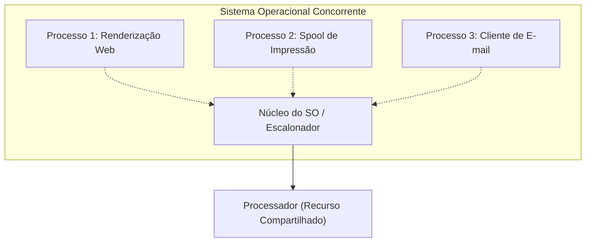

### Concorrência versus Paralelismo
É imperativo diferenciar conceitualmente dois termos que frequentemente são confundidos:
- **Concorrência:** Capacidade do sistema operacional de gerenciar múltiplos fluxos de execução cujas vidas úteis se sobrepõem no tempo. Em um sistema com apenas uma CPU, a concorrência é obtida por meio da multiplexação temporal (*time-sharing*), intercalando fatias minúsculas de execução de cada tarefa.
- **Paralelismo:** Ocorre quando duas ou mais instruções são executadas fisicamente no mesmo instante de tempo. O paralelismo estrito exige a presença de múltiplos núcleos ou processadores físicos.

| Característica | Concorrência | Paralelismo |
| :--- | :--- | :--- |
| **Requisito de Hardware** | Funciona em 1 único núcleo de CPU. | Exige 2 ou mais núcleos/processadores. |
| **Mecanismo Operacional** | Intercalação temporal rápida de tarefas. | Execução simultânea real de instruções. |
| **Foco Estrutural** | Lidar com muitas coisas ao mesmo tempo. | Fazer muitas coisas ao mesmo tempo. |

---

## Definição histórica e conceitos fundamentais de processo

### Origem Histórica
O termo **processo** foi formalmente introduzido na ciência da computação pelos projetistas do sistema operacional **Multics** (Multiplexed Information and Computing Service), desenvolvido na década de 1960 pelo MIT, Bell Labs e General Electric. O Multics foi pioneiro na introdução de conceitos avançados de tempo compartilhado, segurança e memória virtual.

Desde a sua concepção, o conceito de processo recebeu diferentes definições clássicas na literatura:
1. **Um programa em execução:** A definição mais usual e prática, destacando o dinamismo de um código carregado na memória e interpretado pela CPU.
2. **Uma atividade assíncrona:** Enfatiza que dois processos operam em ritmos independentes, interagindo ou sincronizando-se apenas quando necessário.
3. **O "espírito animado" de um procedimento:** Expressão cunhada para ilustrar que o algoritmo estático (o procedimento no papel ou disco) ganha "vida" e capacidade transformadora quando associado aos recursos e ao fluxo do processador.

### Os Dois Pilares Teóricos
O material didático consolida duas proposições fundamentais:
- **Primeiro Conceito:** O processo é uma **entidade delimitada** possuidora de seu próprio espaço de endereçamento protegido.
- **Segundo Conceito:** O processo é uma **entidade ativa**, distinguindo-se categoricamente do programa.

---

## Diferença entre programa (entidade inanimada) e processo (entidade ativa)

### Definição e Analogia Clássica
Um **programa** é uma entidade passiva e inanimada: consiste em um arquivo binário armazenado em disco (armazenamento secundário), composto por instruções de máquina, cabeçalhos de metadados e constantes. O programa não realiza ações por si só; ele apenas repousa na mídia de armazenamento.

Um **processo** é a entidade ativa. Surge no momento em que o sistema operacional carrega o conteúdo executável do programa na memória principal (RAM), aloca registradores, cria estruturas de controle no núcleo e entrega o primeiro ciclo de processamento ao contador de programa.

> **Analogia Canônica:**  
> O programa é uma *receita de bolo* escrita no papel (passiva, inerte). O processador é o *cozinheiro*. O processo é a *ação dinâmica de cozinhar*: envolve o cozinheiro seguindo a receita, manipulando ingredientes em tempo real (dados), usando recipientes (pilha de execução) e transformando o estado da cozinha.

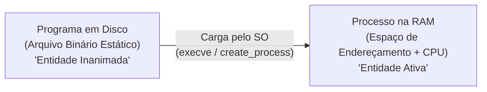

### Comparação Formal

| Dimensão | Programa | Processo |
| :--- | :--- | :--- |
| **Natureza** | Entidade passiva / inanimada. | Entidade dinâmica / ativa. |
| **Localização** | Armazenamento não volátil (SSD, HDD). | Memória Principal (RAM) e registradores. |
| **Duração** | Permanente (até ser excluído do disco). | Transitória (possui início, meio e fim). |
| **Relação Cardinal** | Um programa pode gerar **múltiplos** processos independentes. | Cada processo é uma instância viva, com PID único. |
| **Recursos** | Ocupa apenas espaço de bloco em disco. | Demanda tempo de CPU, memória, I/O e arquivos. |

---

## Espaço de endereçamento e suas regiões: texto, dados e pilha

Cada processo possui seu próprio **espaço de endereçamento virtual**, uma faixa contígua de memória que o sistema operacional simula como exclusiva para ele. Segundo a estrutura canônica abordada, esse espaço divide-se em três regiões principais:

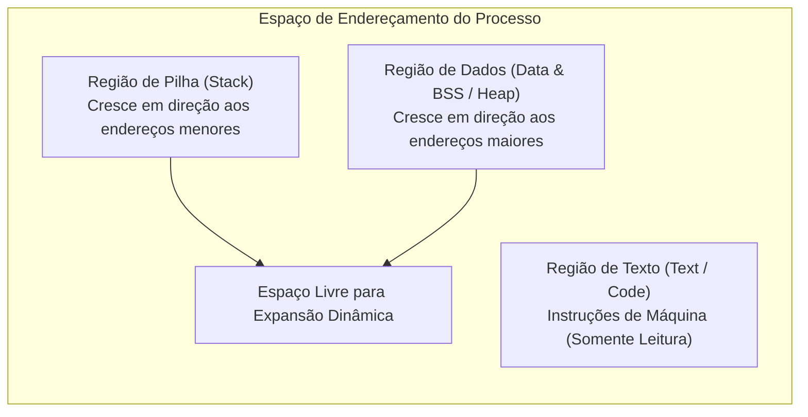

### 1. Região de Texto (Text Segment)
- **Definição:** Contém o código binário (instruções de máquina) a ser diretamente executado pela CPU.
- **Características:** Geralmente marcada como *somente leitura* (read-only) para evitar que o processo auto-modifique suas instruções por acidente ou ataque malicioso. Além disso, pode ser compartilhada entre instâncias do mesmo programa (por exemplo, dez instâncias de um editor de texto podem compartilhar a mesma região de texto física).

### 2. Região de Dados (Data Segment)
- **Definição:** Armazena variáveis globais, variáveis estáticas e memória alocada dinamicamente necessária durante a execução.
- **Características:** Leitura e escrita permitidas. No detalhamento da engenharia de sistemas modernos (*complemento técnico*), subdivide-se em dados inicializados, dados não inicializados (*BSS*) e *Heap* (memória solicitada em tempo de execução via chamadas como `malloc` ou `new`).

### 3. Região de Pilhas (Stack Segment)
- **Definição:** Armazena o registro de ativação das funções: endereços de retorno, parâmetros passados para procedimentos e variáveis locais declaradas em blocos de código.
- **Dinâmica de Crescimento:** O conteúdo da pilha cresce à medida que o processo emite chamadas aninhadas a procedimentos (empilhamento de *stack frames*) e diminui progressivamente conforme os procedimentos concluem sua execução e retornam o controle ao chamador.

---

## Regras de acesso e proteção de memória entre regiões do processo

### A Razão da Separação Estrutural
Os processos precisam ler e escrever dados de maneira arbitrária durante sua computação. Se o espaço de endereçamento fosse um bloco contínuo homogêneo e sem regras de distinção, um erro de programação — como uma gravação fora dos limites de um vetor (*buffer overflow*) — poderia sobrescrever o código executável do programa, corrompendo a execução ou abrindo brechas críticas de segurança.

A divisão da memória em regiões distintas permite ao sistema operacional, em cooperação com o hardware da Unidade de Gerenciamento de Memória (**MMU** - *Memory Management Unit*), configurar bits de permissão estritos para cada página ou segmento:

| Região | Permissão Típica | Finalidade de Proteção |
| :--- | :--- | :--- |
| **Texto** | Leitura e Execução (`R-X`) | Impede modificações acidentais ou injeção de código malicioso. |
| **Dados** | Leitura e Escrita (`RW-`) | Permite atualização de variáveis, mas bloqueia execução como instrução. |
| **Pilha** | Leitura e Escrita (`RW-`) | Permite manipular variáveis locais e frames, bloqueando execução de shellcodes. |

Quando um processo tenta gravar em sua Região de Texto ou executar instruções na Pilha, a MMU sinaliza uma falha de hardware, e o sistema operacional aborta o processo imediatamente (emitindo, por exemplo, o sinal clássico de *Segmentation Fault*).

---

## Ciclo de vida e estados fundamentais: execução, pronto e bloqueado

Durante sua existência, um processo não permanece constantemente em execução. Ele transita por diferentes estados conforme necessita de cálculo, aguarda recursos ou cede a CPU para outros competidores. 

No modelo básico tripartite, consideramos os três estados fundamentais:

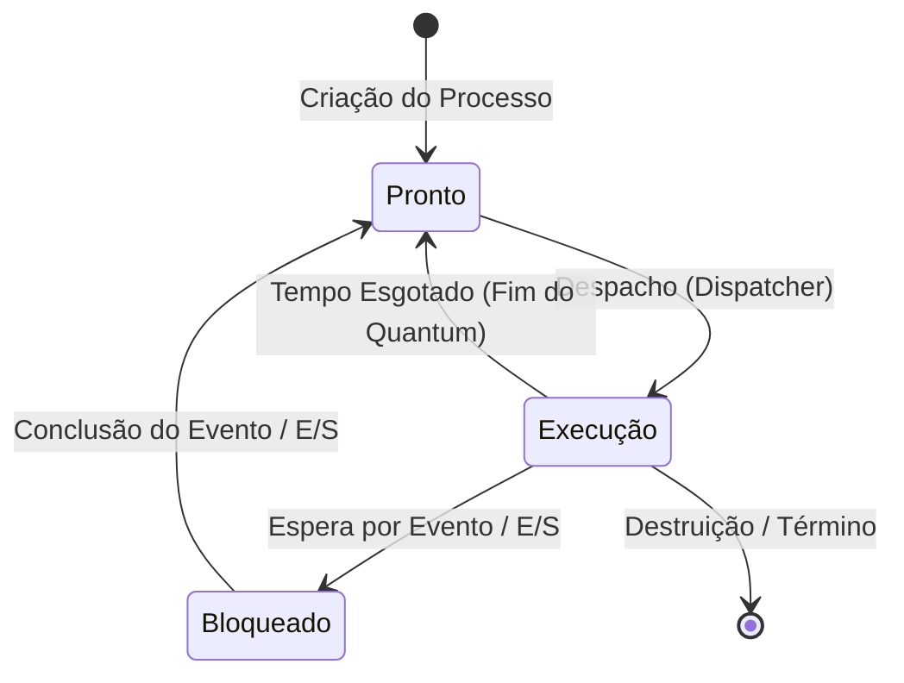

### Descrição dos Três Estados Fundamentais

1. **Estado de Execução (Running):**
   - O processo está alocado em um processador físico e suas instruções estão sendo decodificadas e processadas pela Unidade Lógica e Aritmética (ULA).
   - O processo detém o controle do fluxo da CPU.

2. **Estado de Pronto (Ready):**
   - O processo possui todos os recursos de memória e dados necessários para rodar, dependendo exclusivamente da atribuição de um processador disponível.
   - Aguarda na fila de prontos a decisão do escalonador de que chegou a sua vez.

3. **Estado de Bloqueado (Blocked / Waiting):**
   - O processo não tem condições de executar, mesmo que haja múltiplos processadores livres.
   - Ele foi paralisado porque aguarda a ocorrência de um evento externo: conclusão de transferência de disco, pacote de rede, entrada pelo teclado ou liberação de um dispositivo monopolizado (ex: impressora).

---

## Capacidade de execução simultânea em sistemas uniprocessados e multiprocessados

### A Regra Fundamental da Concorrência Real
Em qualquer arquitetura computacional, a quantidade máxima de processos que podem estar verdadeiramente em estado de **execução simultânea (paralelismo real)** em um dado instante é **estritamente igual ao número de núcleos/processadores físicos disponíveis**:

$$\text{Nº Máximo de Processos em Execução Real} = \text{Nº de Processadores / Núcleos}$$

### Sistemas Uniprocessados
Em um sistema uniprocessado (uma única CPU/núcleo):
- **Apenas um processo** pode ocupar o estado de *execução* a cada instante temporal.
- Contudo, **dezenas ou centenas de processos** podem coexistir simultaneamente nos estados de *pronto* e *bloqueado*.
- A ilusão de simultaneidade sentida pelo usuário é fruto do compartilhamento de tempo em frações de milissegundos (*time-slicing*).

### Sistemas Multiprocessados
Em sistemas com $N$ núcleos:
- Até $N$ processos distintos podem executar paralelamente.
- Se existirem $M$ processos no sistema (onde geralmente $M \gg N$), os $M - N$ processos restantes estarão distribuídos entre prontos e bloqueados.

---

## Organização da fila de prontos por prioridade e fila de bloqueados por eventos

O sistema operacional gerencia filas distintas para organizar os processos que não estão utilizando o processador:

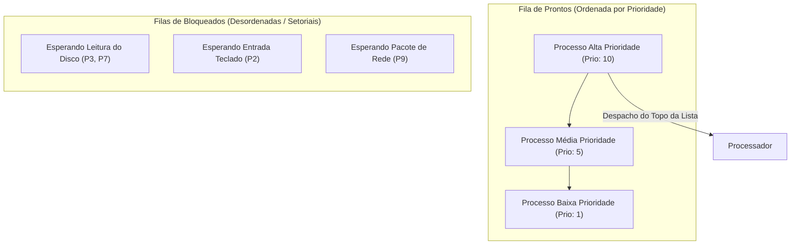

### A Fila de Prontos: Ordenada por Prioridade
- Os processos aptos a rodar são organizados em uma fila ordenada por critérios de **prioridade de escalonamento**.
- Quando a CPU fica livre, o despachante seleciona invariavelmente o processo que se encontra no topo da lista (o de mais alta prioridade).
- Se houver processos com a mesma prioridade, adota-se comumente um desempate por ordem de chegada (FIFO).

### A Lista de Bloqueados: Desordenada por Eventos
- Diferente da fila de prontos, a lista de bloqueados é estruturalmente **desordenada** sob a ótica de prioridade de CPU.
- Os processos não são desbloqueados por ordem de tempo ou prioridade interna, mas sim **na ordem em que os eventos externos específicos se completam**.
- Por exemplo: um processo de baixa prioridade esperando a leitura de um único setor de disco pode ser desbloqueado muito antes de um processo de alta prioridade que aguarda uma resposta remota de rede com alta latência.

---

## Serviços do sistema operacional para gerenciamento do ciclo de vida dos processos

Para que múltiplos fluxos coexistam sem corrupção ou perda de integridade, o núcleo do sistema operacional implementa primitivas e serviços sistêmicos de controle:

1. **Criar Processos:** Alocar um novo identificador, construir o PCB, alocar espaço de memória e carregar o binário.
2. **Destruir Processos:** Finalizar a execução, desocupar memória RAM, fechar descritores de arquivos e desalocar o PCB.
3. **Suspender Processos:** Parar temporariamente o processamento de um processo (muitas vezes movendo-o para a memória secundária em paginação).
4. **Retomar Processos:** Restaurar um processo previamente suspenso para a fila de prontos.
5. **Alterar Prioridade:** Recalcular dinamicamente a prioridade de um processo com base em tempo de CPU gasto ou comportamento interativo.
6. **Bloquear Processos:** Remover o processo da CPU quando ele emite uma requisição síncrona não atendida de imediato.
7. **Acordar Processos:** Mover o processo da fila de bloqueados para a fila de prontos após a conclusão de uma interrupção de E/S.
8. **Despachar Processos:** Carregar os registradores de um processo no processador e disparar a execução de suas instruções.
9. **Comunicação Interprocessos (IPC):** Prover canais protegidos de troca de dados (mensagens, memória compartilhada, pipes).

---

## Conceito de despacho (dispatch) e a função do despachante (dispatcher)

### Definição de Despacho
O ato formal de **atribuir o processador ao primeiro processo qualificado da lista de pronto** é denominado **despacho** (*dispatch*).

### O Despachante (Dispatcher)
O **despachante** é o módulo do núcleo do sistema operacional encarregado de efetivar essa transição. Suas responsabilidades incluem:
1. Trocar o contexto do processador;
2. Comutar o processador do modo núcleo (*kernel mode*) para o modo usuário (*user mode*);
3. Saltar para a instrução correta do programa indicada pelo Contador de Programa (PC) para retomar ou iniciar a execução.

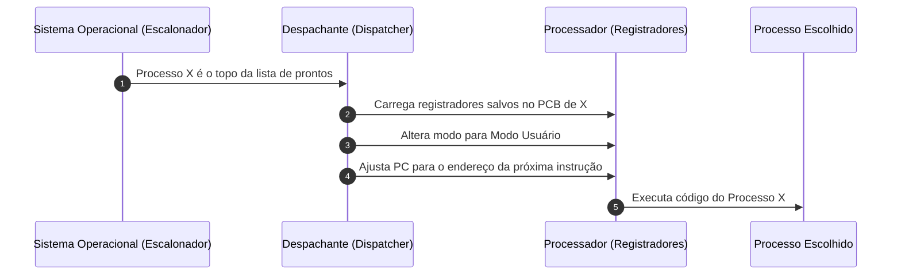

O tempo gasto pelo despachante para interromper um processo e iniciar outro é chamado de **latência de despacho** (*dispatch latency*), devendo ser o menor possível para não degradar a taxa de transferência (*throughput*) do sistema.

---

## Classificação de processos acordados versus processos adormecidos

Para fins de modelagem do consumo de ciclos da CPU, os processos no sistema podem ser divididos em dois grandes grupos:

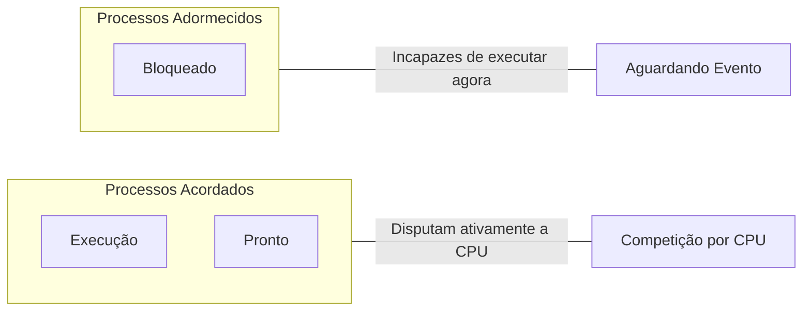

### Processos Acordados
- **Estados compreendidos:** **Pronto** e **Execução**.
- **Definição:** Estão em competição ativa pelo uso do processador. O processo em execução está consumindo ciclos de CPU no exato momento; os processos prontos estão totalmente aptos e aguardam apenas que o processador termine a tarefa corrente ou passe a fatia de tempo.

### Processos Adormecidos
- **Estados compreendidos:** **Bloqueado**.
- **Definição:** São processos que não têm condições técnicas de usar a CPU, mesmo que ela esteja 100% ociosa. Eles foram postos para "dormir" até que um hardware externo, temporizador ou outro processo envie o sinal de despertar informando que o recurso aguardado ficou disponível.

---

## Prevenção contra monopolização da CPU via relógio de interrupção e quantum de tempo

### O Perigo do Escalonamento Puramente Cooperativo
Em sistemas operacionais antigos ou sem suporte a temporizadores de hardware, vigorava o modelo **cooperativo**: um processo permanecia na CPU até que ele decidisse, voluntariamente, liberar o processador. 
- Se um processo entrasse em um laço infinito (`while(true);`) ou contivesse código malicioso que se recusasse a ceder o controle, todo o computador travava, exigindo reinicialização a frio.

### O Mecanismo Preventivo: Temporizador de Intervalo
Para assegurar que nenhum processo monopolize o processador de forma acidental ou maliciosa, os sistemas modernos utilizam um **relógio de interrupção em hardware**, também conhecido como **temporizador de intervalo** (*interval timer*).

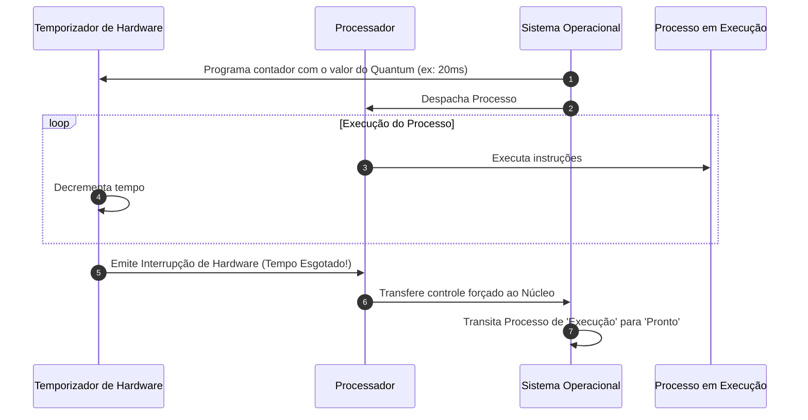

- **Quantum (ou Fatia de Tempo):** Intervalo predeterminado de tempo concedido a um processo para rodar na CPU.
- **Preempção:** Quando o tempo do quantum se esgota, o relógio emite uma interrupção assíncrona. O hardware transfere forçadamente o controle para o núcleo do sistema operacional, destituindo o processo atual do processador e colocando-o de volta na fila de prontos.

---

## As quatro transições de estado fundamentais e seus gatilhos

No modelo canônico de três estados, existem exatamente **quatro transições possíveis**:

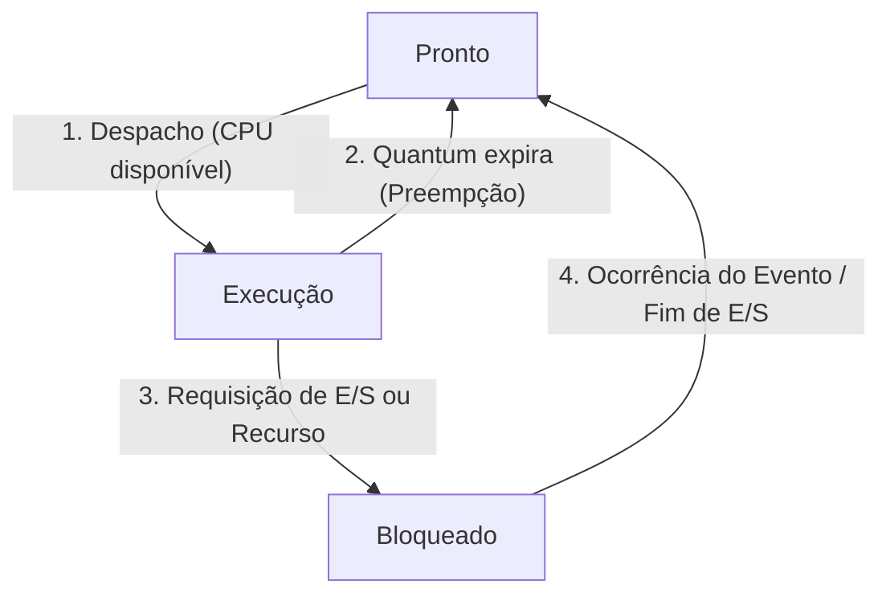

1. **Pronto $\to$ Execução:**
   - **Gatilho:** O processo atual cedeu a CPU ou foi preemptado; o despachante seleciona o primeiro processo qualificado da fila de prontos.
2. **Execução $\to$ Pronto:**
   - **Gatilho:** O temporizador de intervalo assinala que a fatia de tempo (*quantum*) do processo em execução expirou. O SO assume o controle e rebaixa o processo.
3. **Execução $\to$ Bloqueado:**
   - **Gatilho:** O próprio processo em execução solicita uma operação de entrada/saída (leitura de disco, entrada de rede) ou um recurso indisponível no momento.
4. **Bloqueado $\to$ Pronto:**
   - **Gatilho:** O evento externo pelo qual o processo aguardava foi concluído (ex: os bytes do disco foram transferidos para o buffer de memória). O SO move o processo para a lista de prontos.

> **Atenção:** Em nenhuma circunstância um processo transita diretamente de *Bloqueado* para *Execução*. Ele deve obrigatoriamente passar pelo estado de *Pronto* para disputar a CPU em condições justas com os demais competidores na fila.

---

## Transições disparadas pelo processo versus transições disparadas pelo sistema operacional

Uma distinção vital para o entendimento da arquitetura de sistemas operacionais reside na autoria do gatilho que causa cada transição:

### 1. Transição Disparada pelo Próprio Processo
- **Execução $\to$ Bloqueado:** É a **única transição** iniciada ativamente pelo código do próprio processo de usuário. O processo faz uma chamada de sistema (*system call*), solicitando voluntariamente a suspensão de seu fluxo até que um dado ou dispositivo esteja pronto.

### 2. Transições Disparadas pelo Sistema Operacional
- **Pronto $\to$ Execução:** O SO (via despachante) assume a decisão de conceder a CPU ao processo.
- **Execução $\to$ Pronto:** O SO força a retirada do processo da CPU quando a interrupção do temporizador de hardware avisa que o *quantum* expirou.
- **Bloqueado $\to$ Pronto:** O tratador de interrupções do SO detecta que o hardware de E/S concluiu a tarefa e realoca o processo de volta na fila de prontos.

| Transição | Iniciador Principal | Mecanismo |
| :--- | :--- | :--- |
| **Pronto $\to$ Execução** | Sistema Operacional | Ação do despachante (*dispatcher*). |
| **Execução $\to$ Pronto** | Sistema Operacional | Interrupção do temporizador (*quantum* expirado). |
| **Execução $\to$ Bloqueado** | **Próprio Processo** | Chamada de sistema (*system call*) síncrona. |
| **Bloqueado $\to$ Pronto** | Sistema Operacional | Rotina de tratamento de interrupção externa. |

---

## Identificador de Processo (PID - Process Identification Number)

### Definição e Propósito
O **PID** (*Process Identification Number*) é um valor numérico inteiro único atribuído pelo sistema operacional a cada novo processo no momento exato de sua instanciação.

### Ciclo de Utilização do PID
- **Unicidade Temporal:** Dois processos ativos simultaneamente no sistema nunca compartilham o mesmo PID.
- **Indexação Global:** O PID serve como chave primária de busca para que o núcleo encontre as estruturas de dados associadas àquele processo.
- **Comunicação e Gerenciamento:** Utilitários de linha de comando e chamadas de sistema utilizam o PID para enviar sinais, monitorar consumo de memória e finalizar execuções (como no comando POSIX `kill <PID>`).
- **Reciclagem:** Quando um processo termina e suas estruturas são totalmente liberadas, o número do seu PID pode ser eventualmente reciclado pelo sistema para batizar novos processos.

---

## Bloco de Controle de Processo (PCB - Process Control Block) e descritor de processo

### Definição
O **Bloco de Controle de Processo (PCB)**, também denominado **descritor de processo**, é a estrutura de dados central e mais importante do sistema operacional para a gerência de tarefas. Cada processo existente possui um PCB exclusivo alocado no espaço de memória do núcleo (*kernel space*).

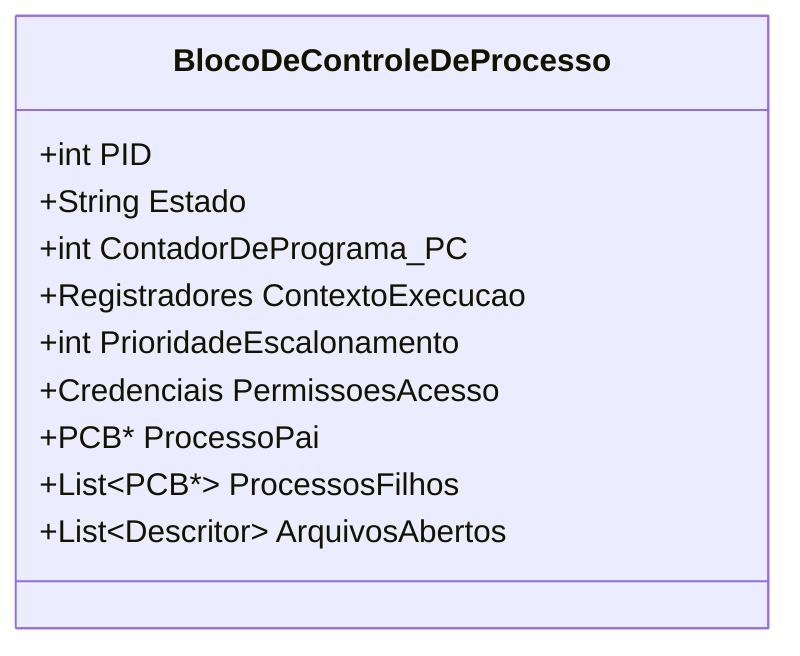

O PCB é a manifestação física do processo para o sistema operacional: se o PCB for destruído, o processo deixa formalmente de existir.

---

## Estrutura e campos do PCB: contexto de execução, registradores, prioridade e credenciais

O PCB agrega uma vasta coleção de informações indispensáveis para a continuidade do processo entre pausas e retomadas:

1. **Identificação do Processo:**
   - **PID:** Identificador numérico do processo.
   - **PPID:** Identificador numérico do processo-pai (*Parent PID*).
2. **Estado do Processo:**
   - Indicador do estado atual (Execução, Pronto ou Bloqueado).
3. **Contador de Programa (PC - Program Counter):**
   - Endereço da próxima instrução de máquina que o processo executará assim que retomar o processador.
4. **Contexto de Execução / Registradores:**
   - Cópia fiel de todos os registradores da CPU (acumuladores, registradores de índice, ponteiro de pilha SP, registrador de sinalizadores/flags) do momento exato em que o processo deixou a CPU.
5. **Prioridade de Escalonamento:**
   - Valor numérico atribuído ao processo para posicioná-lo na fila de prontos.
6. **Credenciais de Segurança e Permissões:**
   - Identificadores de usuário (UID) e de grupo (GID), determinando quais pastas, arquivos e periféricos este processo tem autorização para manipular.
7. **Ponteiros de Hierarquia:**
   - Ponteiro para o PCB do processo-pai e lista de ponteiros para os PCBs dos processos-filhos.
8. **Gerenciamento de Recursos e E/S:**
   - Tabela de descritores de arquivos abertos, sockets de rede e dispositivos alocados.

---

## Tabela de processos do sistema operacional

O sistema operacional mantém uma estrutura global denominada **Tabela de Processos**, que nada mais é do que uma coleção (vetor indexado ou lista encadeada) de todos os PCBs dos processos ativos:

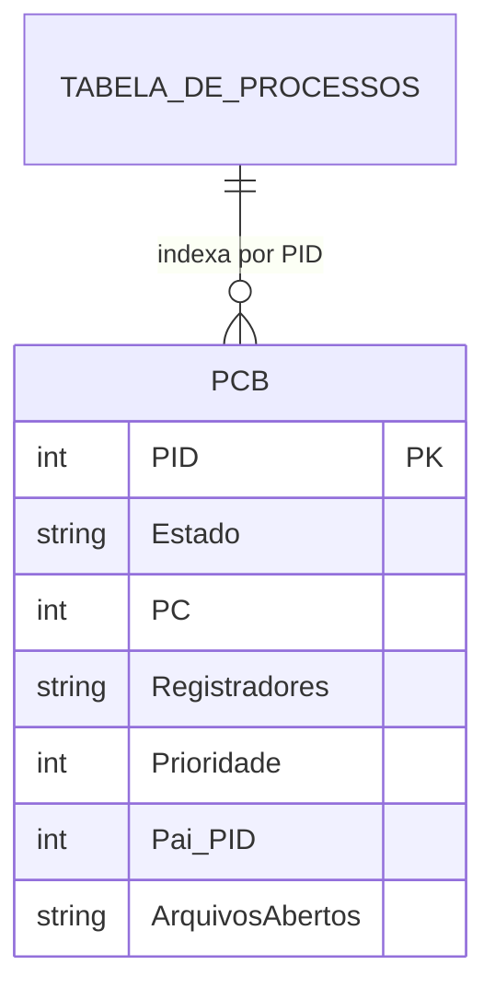

| Entrada (Slot/PID) | Apontador para PCB | Estado Atual | Dono (UID) |
| :--- | :--- | :--- | :--- |
| **0** | `&pcb_swapper` | Bloqueado | `root` (0) |
| **1** | `&pcb_init_systemd`| Pronto | `root` (0) |
| **1042** | `&pcb_navegador` | Execução | `aluno` (1000) |
| **1089** | `&pcb_editor` | Bloqueado (I/O) | `aluno` (1000) |
| **...** | ... | ... | ... |

A tabela de processos reside integralmente na memória protegida do núcleo. Se um processo de usuário pudesse ler ou gravar livremente na tabela de processos, ele poderia alterar a sua própria prioridade para o valor máximo ou sequestrar credenciais administrativas de outros processos.

---

## Filiação e hierarquia de processos: processo-pai e processo-filho

### A Relação de Filiação
Um processo em execução pode emitir comandos ao sistema operacional para criar novos processos. 
- O processo que solicita a criação é denominado **processo-pai**.
- O novo processo derivado é denominado **processo-filho**.

Essa mecânica estabelece uma árvore hierárquica estrita de processos no sistema. No material de estudo, uma representação em árvore ilustra essa ramificação:

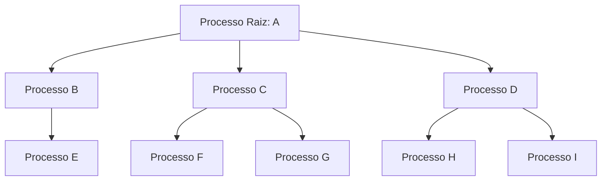

### O Compartilhamento e Herança de Recursos
Quando um filho é gerado, o sistema operacional define se ele receberá uma cópia exata do espaço de endereçamento do pai (como no modelo POSIX `fork()`) ou se inicializará com um novo binário independente (como na rotina `CreateProcess()` do Windows ou chamada sequencial `execve()`). Geralmente, o filho herda privilégios, variáveis de ambiente e referências a arquivos abertos pertencentes ao pai.

---

## Políticas de destruição de processos e impacto sobre processos-filhos

Destruir um processo envolve uma série de ações de limpeza executadas pelo sistema operacional: desalocar o espaço de memória principal que ele utilizava, fechar todos os seus arquivos abertos e liberar os dispositivos de hardware vinculados.

No entanto, a terminação de um processo torna-se complexa quando ele gerou processos-filhos. Existem duas abordagens estruturais nos sistemas operacionais para lidar com essa situação:

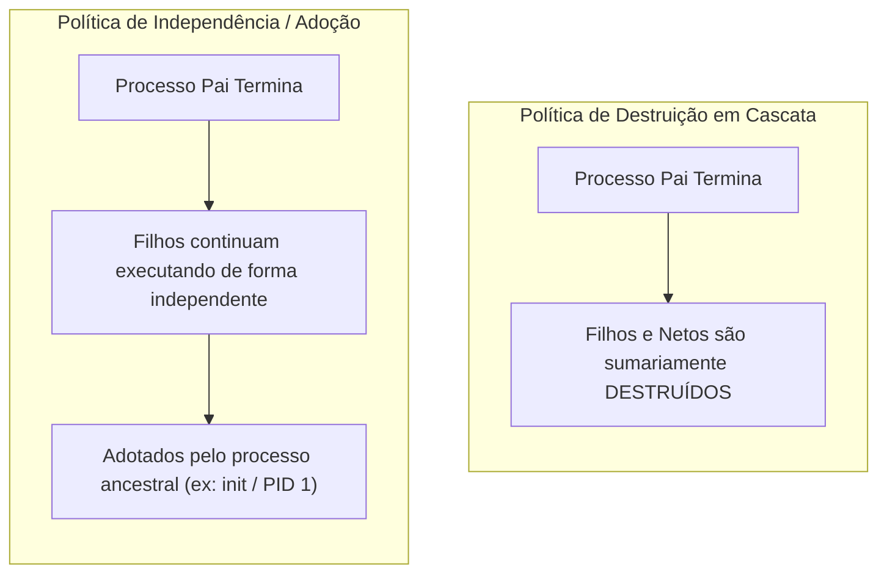

### 1. Destruição em Cascata (Cascading Termination)
- Adotada por determinados sistemas operacionais ou configurações específicas.
- Se o processo-pai for destruído, **todos os seus processos-filhos gerados são automaticamente destruídos pelo sistema**. O raciocínio é que os filhos existem apenas para servir aos propósitos do pai; sem ele, perdem sua razão de ser.

### 2. Independência e Adoção de Processos Órfãos
- Adotada por sistemas padrão Unix/Linux.
- A destruição de um pai **não encerra** a execução dos filhos. Os filhos continuam seu ciclo de vida normalmente e de forma independente.
- Como todo processo precisa ter um pai registrado para coletar seu código de saída (*exit status*), os filhos tornam-se processos **órfãos** e são imediatamente "adotados" pelo processo ancestral do sistema operacional (o processo `init` ou `systemd`, com PID 1).

---

## Mecanismo de chaveamento de contexto (context switch)

### Definição
O **chaveamento de contexto** (*context switch*) é o procedimento de baixo nível executado pelo núcleo para interromper a execução de um processo que ocupa a CPU e carregar um novo processo que se encontrava na fila de prontos.

### Sequência Operacional de Chaveamento
Para que um processo possa ser retomado no futuro exatamente do mesmo ponto em que parou, sem qualquer inconsistência matemática ou lógica, o contexto precisa ser preservado de forma estanque:

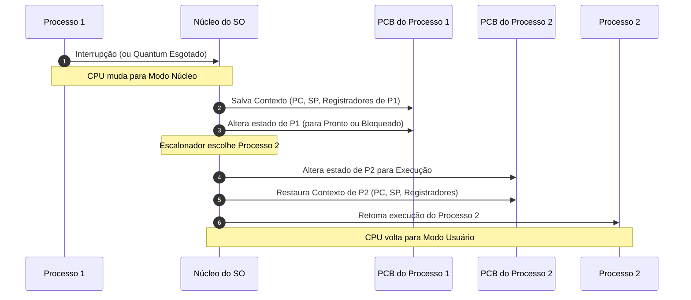

1. Ocorre uma interrupção (ex: temporizador indicando fim de quantum).
2. O processador comuta para o modo núcleo.
3. O sistema operacional salva todos os registradores da CPU, incluindo o Contador de Programa (PC) e a pilha, no PCB do processo atual.
4. O escalonador atualiza o estado do processo (para *Pronto* ou *Bloqueado*).
5. O escalonador escolhe o próximo processo da fila de prontos.
6. O sistema operacional recupera os registradores armazenados no PCB do novo processo e os carrega fisicamente no hardware da CPU.
7. A CPU comuta de volta para o modo de usuário e retoma a execução no endereço apontado pelo PC recém-carregado.

### O Custo Computacional do Chaveamento
O chaveamento de contexto representa puro **overhead** (sobrecarga): durante a troca, a CPU não está executando código útil de nenhum processo de usuário. Além do salvamento dos registradores, a troca de contexto frequentemente invalida as linhas de cache de dados e instruções da CPU (*cache misses*), tornando os primeiros ciclos de execução do novo processo mais lentos.

---

## Otimizações de hardware para aceleração do chaveamento de contexto

Como os PCBs e o chaveamento de contexto são demandados milhares de vezes por segundo, os projetistas de microprocessadores implementaram recursos físicos no silício para otimizar essa operação:

### 1. Registrador Próprio de Apontamento de PCB
Algumas arquiteturas de processadores contêm um registrador dedicado de hardware que aponta diretamente para o endereço de memória do PCB do processo que está executando no momento. 
- Isso elimina a necessidade de o núcleo fazer cálculos e consultas complexas em tabelas de memória para descobrir onde despejar os registradores.

### 2. Instruções de Carga e Armazenamento em Bloco
Processadores modernos disponibilizam instruções de máquina dedicadas (por exemplo, operações que gravam múltiplos registradores em um único ciclo ou sequência direta de microcódigo) capazes de salvar e restaurar blocos inteiros do contexto de execução diretamente de e para a estrutura do PCB.

### 3. Múltiplos Conjuntos de Registradores
Em certos processadores avançados e arquiteturas de servidores, a CPU possui fisicamente dois ou mais conjuntos completos de registradores. Ao chavear o contexto, o processador não precisa mover dados imediatamente para a memória RAM; ele apenas altera um ponteiro interno para o segundo conjunto de registradores, efetuando o chaveamento em um único ciclo de clock.

---

## Tratadores de interrupção e retorno de controle ao sistema operacional

### O que é um Tratador de Interrupção?
Um **tratador de interrupção** (*interrupt handler* ou *Interrupt Service Routine - ISR*) é um bloco especializado de instruções em linguagem de baixo nível mantido pelo sistema operacional para responder imediatamente a um tipo específico de interrupção sinalizado ao processador.

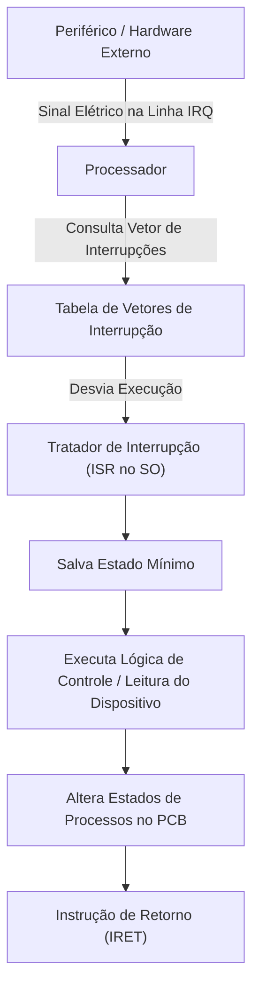

### O Ciclo de Atendimento
1. Um sinal elétrico chega aos pinos da CPU através de uma linha de requisição de interrupção (IRQ).
2. O processador suspende o ciclo de busca da instrução atual ao final do ciclo corrente.
3. A CPU salva o contador de programa (PC) e a palavra de status na pilha do núcleo.
4. O processador consulta a **Tabela de Vetores de Interrupção** para identificar o endereço da ISR designada para aquele evento.
5. O tratador de interrupção executa a rotina necessária (por exemplo, lê os dados do buffer da placa de rede ou do teclado).
6. O tratador pode mover um processo de *Bloqueado* para *Pronto*.
7. Executa-se uma instrução especial de retorno de interrupção (`IRET` em arquiteturas x86), devolvendo o controle ao despachante ou ao processo que havia sido interrompido.

---

## Interrupções síncronas (exceções/traps) versus interrupções assíncronas (hardware)

As interrupções são o mecanismo elementar pelo qual o processador é alertado sobre eventos que exigem atenção urgente. Elas se bifurcam em duas categorias com causas e naturezas diametralmente opostas:

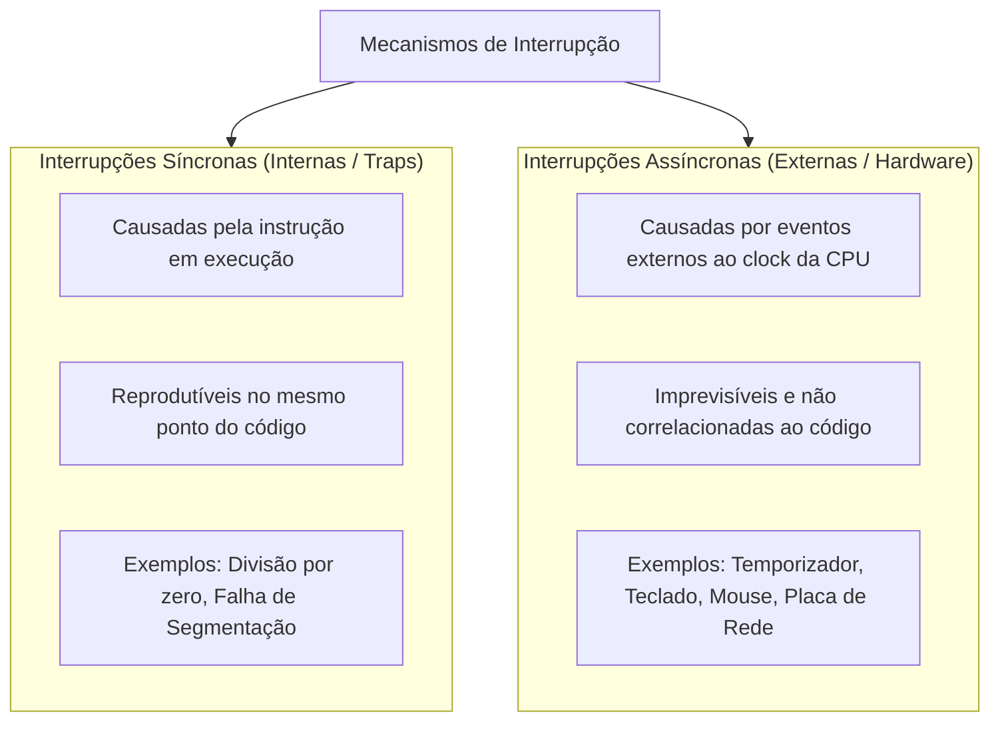

### 1. Interrupções Síncronas
- **Definição:** Ocorrem como resultado direto da execução de uma instrução pelo processo atual. São síncronas com o relógio (*clock*) e com o fluxo do programa. Se o programa rodar repetidas vezes com os mesmos dados de entrada, a interrupção acontecerá rigorosamente no mesmo endereço de memória.
- **Causas Típicas:** 
  - Tentativa de realizar ações ilegais: divisão aritmética por zero, instrução privilegiada executada em modo usuário.
  - Acesso a locais de memória não autorizados ou ausentes da RAM (tentativa de gravação na área de texto, *Page Fault*).
  - Chamadas de sistema programadas (*software traps* ou chamadas de API como `syscall`).

### 2. Interrupções Assíncronas
- **Definição:** Originam-se fora do processador, geradas por circuitos de hardware ou periféricos independentes. Não possuem qualquer correlação com a instrução que a CPU está executando no momento.
- **Causas Típicas:**
  - O temporizador de intervalo expirando seu contador.
  - Um periférico mudando de estado: pressionamento de tecla, movimento do mouse, chegada de pacotes na placa de rede, finalização de leitura de setor do disco magnético/SSD.

| Critério | Interrupções Síncronas | Interrupções Assíncronas |
| :--- | :--- | :--- |
| **Origem** | Interna à CPU (código do processo). | Externa à CPU (periféricos e temporizadores). |
| **Previsibilidade** | Determinística (ocorre sempre no mesmo ponto). | Totalmente imprevisível em relação ao código. |
| **Denominação Comum** | Exceções, Faltas (*Faults*), *Traps*. | Interrupções de Hardware (*Hardware IRQs*). |
| **Exemplo Prático** | Acessar um ponteiro `NULL`. | Usuário clicar com o botão do mouse. |

---

## Vantagens dos sistemas orientados a interrupção frente à sondagem (polling)

### A Abordagem Arcaica: Sondagem (Polling)
Nos primórdios da computação ou em sistemas embarcados rudimentares sem suporte a interrupções, o processador precisava consultar repetidamente, em um laço fechado (*busy waiting*), o estado de cada dispositivo periférico conectado para descobrir se havia novos dados:

```c
// Modelo de Sondagem (Polling) - Ineficiente
while (dispositivo_esta_ocupado()) {
    // A CPU queima milhões de ciclos em laço vazio
}
ler_dados();
```

- **Desvantagem Crítica:** Desperdiça tempo massivo de processamento. A CPU fica presa perguntando ao dispositivo se ele concluiu a tarefa, impedindo que outros processos realizem computação útil. Conforme a complexidade do sistema cresce e dezenas de periféricos são acoplados, a sondagem torna o sistema inviável.

### A Abordagem Moderna: Orientada a Interrupção
Nas arquiteturas orientadas a interrupção, o processador envia um comando ao periférico e **esquece-o**, passando a executar imediatamente outros processos da fila de prontos. O dispositivo, por sua vez, realiza a operação física em seu próprio ritmo e, quando conclui, emite um sinal elétrico que "acorda" a CPU.

> **Analogia Clássica do Forno Micro-ondas:**  
> - **Sondagem (Polling):** Você coloca um prato de comida no micro-ondas por 3 minutos e fica parado na frente da porta, olhando para o relógio a cada segundo e se perguntando "terminou? terminou? terminou?". Você não faz mais nada durante esse tempo.  
> - **Interrupção:** Você aperta o botão de 3 minutos e vai ler um livro na sala (outro processo usando a CPU). Quando a comida fica pronta, o micro-ondas emite um aviso sonoro (*bip* de interrupção). Você interrompe sua leitura temporariamente, retira o prato (trata a interrupção) e volta a ler de onde parou.

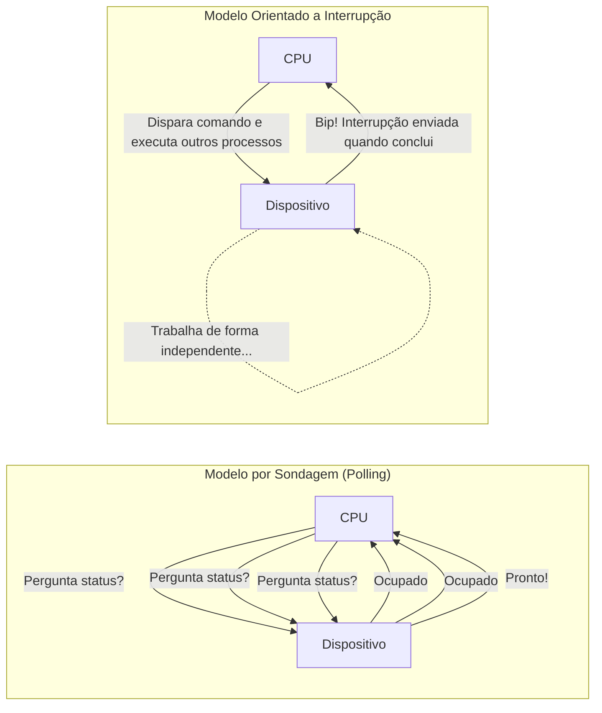

---

## Sobrecarga em sistemas orientados a interrupções

Embora o modelo orientado a interrupções seja infinitamente superior à sondagem para o uso geral, ele não é isento de limitações. Se as interrupções chegarem a uma frequência maior do que o sistema operacional é capaz de processar, o sistema entra em colapso por **sobrecarga de interrupção** (*interrupt storm* ou *livelock*).

### O Cenário de Tempestade de Interrupções
- A CPU passa a gastar 100% de seus ciclos apenas executando o prólogo e o epílogo dos tratadores de interrupções (salvando e restaurando contextos), sem conseguir processar o trabalho real de nenhuma das requisições.

> **Analogia do Tráfego Aéreo:**  
> Imagine um controlador de tráfego aéreo em um aeroporto movimentado. Ele responde a chamadas de rádio dos pilotos (interrupções). Se 5 aviões chamarem com intervalos razoáveis, ele atende a cada um e organiza os pousos com máxima eficiência.  
> Contudo, se 150 aviões tentarem falar no rádio ao mesmo tempo e sem parar, o controlador passará todo o tempo respondendo "Aguarde na linha" e anotando códigos de rádio, sem conseguir autorizar o pouso de nenhuma aeronave. O aeroporto paralisa devido ao excesso de requisições de interrupção.

---

## Código da aula

Embora os conceitos apresentados na aula teórica sejam eminentemente conceituais e arquiteturais, a visualização dos dados do PCB e a criação de processos em código real auxiliam a consolidar a teoria. 

O trecho de código abaixo em Linguagem C (padrão POSIX / Linux) ilustra a criação de uma hierarquia pai-filho e o acesso ao identificador exclusivo (PID):

```c
#include <stdio.h>
#include <stdlib.h>
#include <unistd.h>
#include <sys/types.h>
#include <sys/wait.h>

int main(void) {
    pid_t pid_filho;

    printf("[Pai Inicial] PID: %d, PPID (Pai do Pai): %d\n", getpid(), getppid());

    // A chamada de sistema fork() cria um novo processo (Processo-Filho)
    // O sistema operacional aloca um novo PCB e duplica o contexto.
    pid_filho = fork();

    if (pid_filho < 0) {
        // Erro na criação: falta de memória ou tabela de processos cheia
        perror("Falha ao criar processo filho");
        exit(EXIT_FAILURE);
    } 
    else if (pid_filho == 0) {
        // Bloco executado exclusivamente pelo PROCESSO-FILHO
        printf("[Processo-Filho] Nasci! Meu PID: %d, PID do meu pai: %d\n", 
               getpid(), getppid());
        
        // Simula processamento
        sleep(2);
        
        printf("[Processo-Filho] Finalizando execucao.\n");
        exit(0);
    } 
    else {
        // Bloco executado exclusivamente pelo PROCESSO-PAI
        printf("[Processo-Pai] Criei um filho com PID: %d\n", pid_filho);
        printf("[Processo-Pai] Aguardando a conclusao do filho...\n");
        
        // wait() bloqueia o pai ate que o filho termine, evitando filhos 'zumbis'
        wait(NULL);
        
        printf("[Processo-Pai] Filho concluido. Encerrando pai.\n");
    }

    return 0;
}
```

---

## Exercícios

### Exercício 1: Diferença entre Processo e Programa
- **Enunciado:** (V/F) Os termos "processos" e "programas" são sinônimos?
- **Raciocínio:** O estudante deve resgatar os dois conceitos fundamentais do material didático. Um programa é estático e passivo, armazenado em disco. O processo é dinâmico, possui contexto de execução, memória RAM alocada e consome ciclos da CPU.
- **Resolução:** **FALSO**. Um processo é um programa em execução; um programa é uma entidade inanimada. Somente quando o processador executa suas instruções ele se transforma na entidade ativa denominada processo.

---

### Exercício 2: Divisão do Espaço de Endereçamento
- **Enunciado:** Por que o espaço de endereço de um processo é dividido em várias regiões?
- **Raciocínio:** Processos precisam de memória para diferentes propósitos: instruções invariantes, variáveis globais e dados dinâmicos de funções. Além disso, as operações de leitura e gravação acontecem em ordens arbitrárias.
- **Resolução:** O espaço de endereçamento é dividido em regiões distintas (Texto, Dados e Pilha) para que o sistema operacional, em cooperação com o hardware de gerência de memória, possa impor regras estritas de proteção e acesso. Isso assegura que áreas contendo código de máquina fiquem protegidas contra escrita acidental, enquanto variáveis possam ser modificadas conforme a necessidade do algoritmo.

---

### Exercício 3: Execução Simultânea de Processos
- **Enunciado:** Quantos processos podem ser executados ao mesmo tempo?
- **Raciocínio:** Diferenciar paralelismo real de concorrência por tempo compartilhado. Analisar a restrição física do hardware.
- **Resolução:** Apenas um processo pode ser executado por vez para cada processador ou núcleo físico presente no sistema. Em um sistema uniprocessado, somente um processo executa em um dado instante temporal; em sistemas multiprocessados com $N$ núcleos, até $N$ processos podem executar simultaneamente.

---

### Exercício 4: Eventos Geradores de Bloqueio
- **Enunciado:** Um processo entra no estado de bloqueado quando está esperando que um evento ocorra. Cite diversos eventos que podem fazer um processo entrar em estado de bloqueado.
- **Raciocínio:** Pensar em requisições de recursos que demandam tempo excessivo ou que estão sob monopólio de outros processos.
- **Resolução:** Um processo entra em estado bloqueado ao:
  1. Emitir uma requisição de leitura ou escrita em um dispositivo de alta latência, como um disco rígido ou SSD;
  2. Solicitar um recurso de hardware ou periférico que está alocado a outro processo e temporariamente indisponível (por exemplo, uma impressora em uso);
  3. Ficar aguardando uma interação humana pelo usuário via teclado ou mouse;
  4. Aguardar a recepção de pacotes de dados através de uma interface de rede.

---

### Exercício 5: Prevenção contra Monopolização do Processador
- **Enunciado:** Como o sistema operacional impede que um processo monopolize um processador?
- **Raciocínio:** Analisar o componente de hardware obrigatório para sistemas operacionais preemptivos de tempo compartilhado.
- **Resolução:** O sistema operacional utiliza um **relógio de interrupção em hardware** (também chamado de temporizador de intervalo). Esse mecanismo estabelece um intervalo de tempo específico chamado **quantum**. Se o processo não devolver voluntariamente a CPU antes do término desse tempo, o temporizador gera uma interrupção assíncrona, forçando o retorno do controle ao sistema operacional, que move o processo para a fila de prontos e despacha o próximo.

---

### Exercício 6: Processos Acordados e Adormecidos
- **Enunciado:** Qual a diferença entre processos que estão acordados e processos que estão adormecidos?
- **Raciocínio:** Classificar os processos com base na prontidão imediata para consumir ciclos de processamento da CPU.
- **Resolução:** Processos **acordados** são aqueles que estão disputando ativamente o tempo do processador (estão executando ou prontos para executar assim que a CPU vagar). Processos **adormecidos** são aqueles incapazes de rodar no momento, mesmo que haja múltiplos processadores livres, pois aguardam a conclusão de um evento externo de entrada/saída ou a liberação de um recurso.

---

### Exercício 7: Conceito de Despacho
- **Enunciado:** O que se diz despacho no sistema operacional?
- **Raciocínio:** Associar a transição entre a fila de prontos e a CPU ao componente responsável.
- **Resolução:** Despacho (*dispatch*) é o ato formal de designar um processador disponível ao primeiro processo qualificado localizado no topo da fila de prontos. Essa operação é executada por um módulo específico do núcleo chamado **despachante** (*dispatcher*).

---

### Exercício 8: Mapeamento dos Estados em Acordado e Adormecido
- **Enunciado:** Quais os estados de um processo que é denominado acordado, e quais os estados de um processo é denominado adormecido?
- **Raciocínio:** Mapear a terminologia didática para os três estados fundamentais do ciclo de vida.
- **Resolução:**
  - **Processos Acordados:** Compreendem os estados de **Execução** e **Pronto**.
  - **Processos Adormecidos:** Compreendem o estado de **Bloqueado**.

---

### Exercício 9: Aceleração do Chaveamento de Contexto
- **Enunciado:** Como os processadores aceleram e simplificam o chaveamento de contexto? Explique.
- **Raciocínio:** Analisar as soluções de microarquitetura no nível do hardware da CPU para lidar com estruturas de PCB.
- **Resolução:** Os processadores aceleram o chaveamento de contexto oferecendo:
  1. **Registradores de hardware dedicados** que apontam diretamente para o PCB do processo em execução no momento, facilitando o acesso rápido;
  2. **Instruções de máquina específicas** que conseguem salvar e carregar blocos inteiros de registradores de uma só vez para dentro e para fora do PCB, reduzindo drasticamente os ciclos de clock gastos pelo despachante.

---

### Exercício 10: Interrupções Síncronas versus Assíncronas
- **Enunciado:** Qual a diferença entre interrupções assíncronas e síncronas?
- **Raciocínio:** Comparar a causalidade da interrupção: interna (instrução do código) versus externa (hardware periférico).
- **Resolução:**
  - **Interrupção Síncrona:** Ocorre em decorrência direta da instrução que o processo está executando, de forma reproduzível e sincronizada ao clock (ex: divisão por zero, violação de acesso à memória protegida ou armadilha intencional de sistema).
  - **Interrupção Assíncrona:** Ocorre independentemente do fluxo de instruções da CPU, sendo disparada por dispositivos de hardware externos quando mudam de estado (ex: temporizador expirando, acionamento de teclas no teclado, cliques do mouse ou dados chegando pela rede).

---

### Exercício 11: Definição de PID e PCB
- **Enunciado:** O que é PID e PCB?
- **Raciocínio:** Descrever a carteira de identidade e o prontuário completo de controle do processo.
- **Resolução:**
  - **PID (Process Identification Number):** É o número identificador único e exclusivo atribuído pelo sistema operacional a cada processo no momento de sua criação, servindo para indexação e manipulação.
  - **PCB (Process Control Block):** É a estrutura de dados mantida pelo sistema operacional (denominada descritor de processo) que armazena todas as informações vitais para gerenciar o processo: registradores da CPU, estado atual, contador de programa, prioridade, credenciais de acesso, apontadores para pais e filhos e lista de arquivos abertos.

---

### Exercício 12: Filiação e Hierarquia de Processos
- **Enunciado:** Fale sobre filiação de processos.
- **Raciocínio:** Discorrer sobre o relacionamento gerador/gerado e o impacto no ciclo de vida e destruição.
- **Resolução:** Filiação de processos refere-se à relação hierárquica estabelecida quando um processo em execução gera um novo processo. O processo criador é denominado **processo-pai**, e o processo criado é chamado de **processo-filho**, estruturando uma árvore hierárquica de dependências. Na destruição do processo, alguns sistemas adotam terminação em cascata (a morte do pai extermina todos os filhos), enquanto outros permitem que os filhos continuem executando de forma independente, sendo adotados pelo processo raiz do sistema.

---

## Erros comuns e boas práticas

### Erros Conceituais Frequentes
1. **Confundir Pronto com Bloqueado:**
   - *Erro:* Dizer que um processo que espera o usuário digitar uma senha está no estado de *Pronto*.
   - *Correção:* Se o processo depende de qualquer fator externo para avançar, ele está **Bloqueado** (adormecido). Pronto significa que ele precisa *apenas da CPU* para rodar imediatamente.
2. **Ignorar o Passo Intermediário após o Desbloqueio:**
   - *Erro:* Desenhar a transição de um processo que terminou a leitura de disco saltando diretamente de *Bloqueado* para *Execução*.
   - *Correção:* Um processo desbloqueado transita sempre para **Pronto**. Ele deve entrar na fila de prontos e respeitar a prioridade dos demais competidores antes de receber o despachante.
3. **Equiparar CPU a Processo:**
   - *Erro:* Imaginar que um computador com 1 CPU só pode ter 1 processo carregado na memória.
   - *Correção:* A memória suporta centenas de processos coexistindo; a limitação da CPU unitária impõe apenas que **um único processo por vez** pode ocupar o estado de *execução*.

### Boas Práticas de Engenharia
- **Minimizar Criação Desenfreada de Processos:** Criar processos tem custo apreciável de alocação de memória e PCB. Em operações leves e concorrentes, threads e pools de trabalho evitam a sobrecarga desnecessária na tabela de processos.
- **Limpeza Rigorosa de Filhos:** Em sistemas de padrão POSIX, o processo-pai deve sempre invocar primitivas da família `wait()` para recolher os metadados de saída de seus processos-filhos terminados, evitando o acúmulo de processos "zumbis" na tabela do núcleo.

---

## Links e materiais complementares

- **Livro Texto Recomendado:** *Sistemas Operacionais Modernos* (Andrew S. Tanenbaum & Herbert Bos) — Capítulos dedicados a Processos e Threads, detalhando a implementação do PCB e escalonamento preemptivo.
- **Documentação do Núcleo Linux:** Arquivo de código fonte `sched.h`, especificamente a definição da estrutura [`struct task_struct`](https://github.com/torvalds/linux/blob/master/include/linux/sched.h), que funciona como a representação real do PCB no ecossistema Linux.
- **Padrão POSIX (IEEE Std 1003.1):** Especificações formais das chamadas de sistema fundamentais para ciclo de vida de processos: `fork()`, `exec()`, `waitpid()` e `exit()`.

---

## Mapa da aula

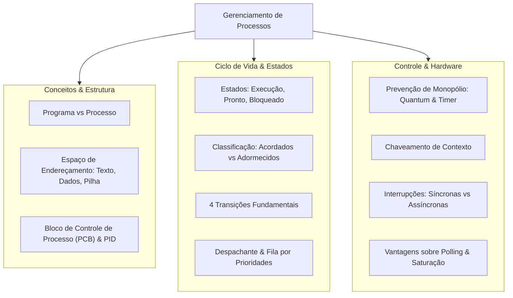

---

## Glossário

| Termo | Definição |
| :--- | :--- |
| **Processo** | Entidade ativa; um programa de computador que está sendo executado por um processador, contendo memória e recursos próprios. |
| **Programa** | Entidade passiva e inanimada; arquivo estático gravado em disco que contém código e dados binários. |
| **PID** | *Process Identification Number*; número identificador único atribuído pelo sistema operacional a cada processo. |
| **PCB** | *Process Control Block* (Bloco de Controle de Processo); estrutura do núcleo que mantém todas as informações gerenciais de um processo. |
| **Região de Texto** | Área de memória do processo reservada estritamente para armazenar as instruções executáveis do código de máquina. |
| **Região de Dados** | Área de memória do processo reservada para variáveis globais, variáveis estáticas e alocações de memória dinâmica. |
| **Região de Pilhas** | Área de memória do processo que se expande e contrai dinamicamente para gerenciar variáveis locais e retornos de funções. |
| **Despacho** | Ato de alocar o processador a um processo qualificado que está no topo da fila de prontos. |
| **Despachante** | Entidade de software do núcleo que efetua o chaveamento de registradores e entrega a CPU ao processo despachado. |
| **Quantum** | Fatia de tempo predeterminada concedida pelo sistema operacional para que um processo execute na CPU. |
| **Chaveamento de Contexto**| Salvar o estado de hardware do processo atual no seu PCB e carregar os registradores do próximo processo a rodar. |
| **Interrupção Síncrona** | Sinal gerado pela execução do próprio processo (ex: erro de cálculo ou falha de acesso à memória). |
| **Interrupção Assíncrona**| Sinal gerado por um hardware externo de forma imprevisível (ex: relógio, mouse, teclado, disco). |
| **Sondagem (Polling)** | Prática ineficiente em que a CPU pergunta repetidamente a um periférico se uma tarefa foi finalizada. |

---

## Pontos-chave para a prova

1. **A assimetria entre Programa e Processo:** Programa é inanimado (disco); processo é ativo (RAM + registradores + CPU). Um programa pode originar múltiplos processos paralelos.
2. **As três regiões do espaço de endereçamento:** Texto (código executável, leitura estrita), Dados (variáveis globais e dinâmicas) e Pilha (variáveis locais e chamadas de procedimentos aninhadas).
3. **O modelo de três estados:** Execução (na CPU), Pronto (apto a rodar, esperando CPU) e Bloqueado (aguardando evento ou E/S).
4. **Agrupamento didático:** Acordados = Pronto e Execução (competem pela CPU); Adormecidos = Bloqueado (incapazes de rodar mesmo com processador ocioso).
5. **A transição autônoma:** A única transição iniciada pelo próprio processo é **Execução $\to$ Bloqueado**. As outras três são forçadas pelo sistema operacional.
6. **Mecanismo anti-monopólio:** O temporizador de intervalo gera interrupção ao término do **quantum**, impedindo que processos em laço infinito travem o sistema.
7. **Filas:** Fila de prontos é ordenada por **prioridade**; fila de bloqueados é desordenada em relação à CPU, liberando processos à medida que os eventos chegam.
8. **Chaveamento de Contexto:** Operação de salvar os registradores no PCB do processo atual e restaurar os do novo. É puro custo de sobrecarga (*overhead*).
9. **Interrupções:** Síncronas (geradas por instruções do código: divisão por zero, falha de memória); Assíncronas (geradas por hardware externo: temporizador, periféricos).
10. **Polling versus Interrupção:** Polling queima ciclos de CPU ativamente perguntando se o periférico terminou; o modelo orientado a interrupção permite à CPU fazer outro trabalho e ser avisada pelo dispositivo quando o evento se encerra.

---

## Perguntas e respostas (JSONL)

```jsonl
{"pergunta": "Qual sistema operacional introduziu formalmente o termo processo na década de 1960?", "resposta": "O sistema Multics.", "dificuldade": "facil"}
{"pergunta": "Quais sao as tres regioes que compoem o espaco de enderecamento de um processo?", "resposta": "Regiao de Texto, Regiao de Dados e Regiao de Pilhas.", "dificuldade": "facil"}
{"pergunta": "Qual regiao do espaco de enderecamento armazena o codigo executado pelo processador?", "resposta": "Regiao de Texto.", "dificuldade": "facil"}
{"pergunta": "Por que o espaco de enderecamento e segmentado em regioes com permissoes distintas?", "resposta": "Para permitir que o sistema operacional imponha regras de protecao e acesso a memoria.", "dificuldade": "medio"}
{"pergunta": "Em um sistema com apenas 1 processador, quantos processos podem estar em estado de execucao real simultaneamente?", "resposta": "Apenas 1 processo por vez.", "dificuldade": "facil"}
{"pergunta": "Como a fila de processos no estado de pronto e classicamente organizada?", "resposta": "E organizada por ordem de prioridade de escalonamento.", "dificuldade": "facil"}
{"pergunta": "Por que a lista de processos bloqueados e tipicamente desordenada em relacao a CPU?", "resposta": "Porque os processos sao desbloqueados na ordem em que ocorrem os eventos de E/S pelos quais aguardavam.", "dificuldade": "medio"}
{"pergunta": "O que e despacho (dispatch) no sistema operacional?", "resposta": "E o ato de designar um processador disponivel ao primeiro processo qualificado da lista de prontos.", "dificuldade": "facil"}
{"pergunta": "Qual entidade de software do nucleo executa o ato de despacho?", "resposta": "O despachante (dispatcher).", "dificuldade": "facil"}
{"pergunta": "Quais estados compoem a classificacao de processos acordados?", "resposta": "Os estados de Execucao e Pronto.", "dificuldade": "facil"}
{"pergunta": "Qual estado corresponde a classificacao de processo adormecido?", "resposta": "O estado Bloqueado.", "dificuldade": "facil"}
{"pergunta": "Como o sistema operacional evita que um processo monopolize o processador?", "resposta": "Utilizando um relogio de interrupcao em hardware (temporizador de intervalo) associado a um quantum de tempo.", "dificuldade": "medio"}
{"pergunta": "Qual a unica transicao de estado que e disparada diretamente pelo proprio processo de usuario?", "resposta": "A transicao do estado de Execucao para Bloqueado.", "dificuldade": "medio"}
{"pergunta": "O que significa a sigla PID?", "resposta": "Process Identification Number (Numero de Identificacao de Processo).", "dificuldade": "facil"}
{"pergunta": "O que significa a sigla PCB?", "resposta": "Process Control Block (Bloco de Controle de Processo).", "dificuldade": "facil"}
{"pergunta": "Onde o contexto de execucao dos registradores e guardado quando um processo sai da CPU?", "resposta": "No Bloco de Controle de Processo (PCB) do respectivo processo.", "dificuldade": "medio"}
{"pergunta": "O que acontece com os processos-filhos na politica de destruicao em cascata?", "resposta": "Todos os processos-filhos sao automaticamente destruidos quando o processo-pai e destruido.", "dificuldade": "medio"}
{"pergunta": "O que e chaveamento de contexto (context switch)?", "resposta": "E o ato do sistema operacional salvar o contexto do processo atual no PCB e carregar o contexto do proximo processo pronto.", "dificuldade": "medio"}
{"pergunta": "Cite uma otimizacao de hardware criada para acelerar o chaveamento de contexto.", "resposta": "Registradores de hardware que apontam diretamente para o PCB e instrucoes que salvam blocos de registradores de uma so vez.", "dificuldade": "dificil"}
{"pergunta": "Qual a diferenca fundamental entre interrupcoes sincronas e assincronas?", "resposta": "Sincronas derivam de acoes do proprio processo (ex: erro ilegal); assincronas derivam de eventos de hardware externos (ex: teclado, timer).", "dificuldade": "medio"}
{"pergunta": "Qual o principal problema da abordagem de sondagem (polling) frente as interrupcoes?", "resposta": "Desperdicase tempo massivo de processamento, pois a CPU fica presa checando dispositivos repetidamente.", "dificuldade": "medio"}
{"pergunta": "O que ocorre quando um sistema orientado a interrupcoes recebe sinais mais rapidamente do que pode processar?", "resposta": "Entra em sobrecarga de interrupcao (interrupt storm), paralisando o progresso de tarefas normais.", "dificuldade": "dificil"}
```

---

## Checklist de revisão

- [ ] Sei conceituar a diferença fundamental entre programa (inanimado) e processo (ativo).
- [ ] Sei descrever a função e comportamento das regiões de Texto, Dados e Pilhas na memória.
- [ ] Compreendo a razão de segurança pela qual o espaço de endereçamento é fragmentado em regiões com regras de acesso.
- [ ] Consigo desenhar o diagrama de três estados fundamentais: Pronto, Execução e Bloqueado.
- [ ] Sei listar as 4 transições de estado e identificar qual delas é iniciada pelo próprio processo.
- [ ] Sei diferenciar processos acordados (Pronto/Execução) de processos adormecidos (Bloqueado).
- [ ] Sei explicar o papel do relógio de interrupção (temporizador de intervalo) e do quantum contra o monopólio da CPU.
- [ ] Compreendo o que é o Bloco de Controle de Processo (PCB) e quais informações críticas ele armazena (registradores, PC, PID).
- [ ] Consigo detalhar passo a passo o mecanismo de chaveamento de contexto e o custo de overhead que ele introduz.
- [ ] Sei diferenciar interrupções síncronas de interrupções assíncronas com exemplos do mundo real.
- [ ] Entendo as razões que tornam o modelo de interrupção superior à técnica de sondagem (*polling*) e o risco da sobrecarga por tempestade de interrupções.

## Código prático de apoio

Implementações em C que tornam executáveis os conceitos desta unidade:

- [`simulador_pcb_ciclo_vida.c`](codigo/simulador_pcb_ciclo_vida.c)
- [`espaco_enderecamento_processo.c`](codigo/espaco_enderecamento_processo.c)
- [`hierarquia_e_ciclo_processos.c`](codigo/hierarquia_e_ciclo_processos.c)
- [`interrupcoes_e_sinais.c`](codigo/interrupcoes_e_sinais.c)
