# Aula 02 — Evolução dos Sistemas Operacionais e Arquiteturas

> **Professor:** Guilherme de Morais  
> **Disciplina:** Sistemas Operacionais (3º Semestre)  
> **Tema:** Da simbiose hardware-software aos sistemas multiprogramáveis e arquiteturas de multiprocessamento

---

## Sumário

- [Objetivo da aula](#objetivo-da-aula)
- [Contexto e pré-requisitos](#contexto-e-pre-requisitos)
- [Hardware-software: a simbiose essencial e evolução histórica](#hardware-software-a-simbiose-essencial-e-evolucao-historica)
- [Diferenciação conceitual: jobs, processos e threads](#diferenciacao-conceitual-jobs-processos-e-threads)
- [Critérios e importância da classificação dos sistemas operacionais](#criterios-e-importancia-da-classificacao-dos-sistemas-operacionais)
- [Sistemas monoprogramáveis (monotarefa) e o gargalo da ociosidade da UCP](#sistemas-monoprogramaveis-monotarefa-e-o-gargalo-da-ociosidade-da-ucp)
- [Relevância e nichos contemporâneos de sistemas monotarefa](#relevancia-e-nichos-contemporaneos-de-sistemas-monotarefa)
- [Multiprogramação, multitarefa e ilusão de simultaneidade](#multiprogramacao-multitarefa-e-ilusao-de-simultaneidade)
- [Compartilhamento de recursos: time-sharing, memória e virtualização](#compartilhamento-de-recursos-time-sharing-memoria-e-virtualizacao)
- [Mecanismos de controle: interrupções, preempção e prevenção de race conditions](#mecanismos-de-controle-interrupcoes-preempcao-e-prevencao-de-race-conditions)
- [Métricas de eficiência: tempo de turnaround e throughput](#metricas-de-eficiencia-tempo-de-turnaround-e-throughput)
- [Sistemas monousuário versus sistemas multiusuário](#sistemas-monousuario-versus-sistemas-multiusuario)
- [Sistemas de multiprocessamento e paralelismo real](#sistemas-de-multiprocessamento-e-paralelismo-real)
- [Pilares do multiprocessamento: escalabilidade, disponibilidade e balanceamento de carga](#pilares-do-multiprocessamento-escalabilidade-disponibilidade-e-balanceamento-de-carga)
- [Aplicações de computação de alto desempenho](#aplicacoes-de-computacao-de-alto-desempenho)
- [Sistemas fortemente acoplados (SMP e memória compartilhada)](#sistemas-fortemente-acoplados-smp-e-memoria-compartilhada)
- [Sistemas fracamente acoplados (clusters e memória distribuída)](#sistemas-fracamente-acoplados-clusters-e-memoria-distribuida)
- [Escalabilidade pós-Lei de Moore e implicações da Lei de Amdahl](#escalabilidade-pos-lei-de-moore-e-implicacoes-da-lei-de-amdahl)
- [Código da aula](#codigo-da-aula)
- [Exercícios](#exercicios)
- [Erros comuns e boas práticas](#erros-comuns-e-boas-praticas)
- [Links e materiais complementares](#links-e-materiais-complementares)
- [Mapa da aula](#mapa-da-aula)
- [Glossário](#glossario)
- [Pontos-chave para a prova](#pontos-chave-para-a-prova)
- [Perguntas e respostas (JSONL)](#perguntas-e-respostas-jsonl)
- [Checklist de revisão](#checklist-de-revisao)

---

## Objetivo da aula

Compreender a evolução histórica e estrutural dos Sistemas Operacionais (SO), partindo da dependência mútua com a evolução dos componentes eletrônicos até as arquiteturas modernas de multiprocessamento. Ao final desta aula, o estudante de Sistemas de Informação deverá ser capaz de:

1. Diferenciar precisamente as entidades de execução fundamentais: *Jobs*, *Processos* e *Threads*.
2. Explicar como a transição de sistemas monoprogramáveis para multiprogramáveis resolveu o problema da ociosidade da UCP (*Unidade Central de Processamento*).
3. Analisar o funcionamento dos mecanismos de tempo compartilhado (*time-sharing*), interrupções de hardware e preempção.
4. Distinguir sistemas com concorrência lógica (uniprocessador) daqueles com paralelismo real (multiprocessador).
5. Comparar arquiteturas de multiprocessamento fortemente acopladas (SMP) e fracamente acopladas (Clusters).
6. Avaliar o teto de escalabilidade de sistemas concorrentes à luz da Lei de Amdahl e do esgotamento da Lei de Moore.

---

## Contexto e pré-requisitos

Para acompanhar este material, o estudante deve resgatar os seguintes conceitos de Arquitetura e Organização de Computadores:
- Ciclo de instrução da UCP: busca (*fetch*), decodificação (*decode*) e execução (*execute*).
- Registradores fundamentais: Contador de Programa (*Program Counter* - PC), Apontador de Pilha (*Stack Pointer* - SP) e Registrador de Instruções (*Instruction Register* - IR).
- Hierarquia básica de memória: registradores, memória cache, memória principal (RAM) e armazenamento secundário.
- Dispositivos de Entrada e Saída (E/S) e a discrepância de ordens de grandeza de velocidade entre a UCP (nanossegundos) e periféricos mecânicos ou de rede (milissegundos).

---

## Hardware-software: a simbiose essencial e evolução histórica

### Definição e fundamentação
A relação entre hardware e software nos sistemas operacionais é de **simbiose essencial**: nenhum dos dois subsistemas pode operar de forma útil e segura sem a presença e a evolução coordenada do outro. O Sistema Operacional não é apenas um software aplicativo; ele é o gerente de recursos físicos da máquina e a camada de abstração que protege e estende a funcionalidade do hardware.

### Motivação histórica
Nas primeiras gerações da computação (década de 1940 a meados de 1950), os computadores eram baseados em **válvulas termiônicas**. Não existia sistema operacional. A programação era puramente física e manual: painéis de cabos (*plugboards*), chaves manuais e cartões perfurados. O programador era também o operador físico da máquina.

Com a invenção do **transistor** (final dos anos 1950) e posteriormente dos **circuitos integrados (CIs)** na década de 1960, a velocidade de processamento cresceu exponencialmente. O tempo necessário para um operador humano carregar cartões perfurados, montar fitas magnéticas e configurar impressoras tornou-se ordens de grandeza maior do que o tempo que a máquina levava para calcular as instruções. Tornou-se imperativo criar um software residente que controlasse o fluxo de execução sem intervenção humana contínua: nascia o conceito embrionário de Sistema Operacional.

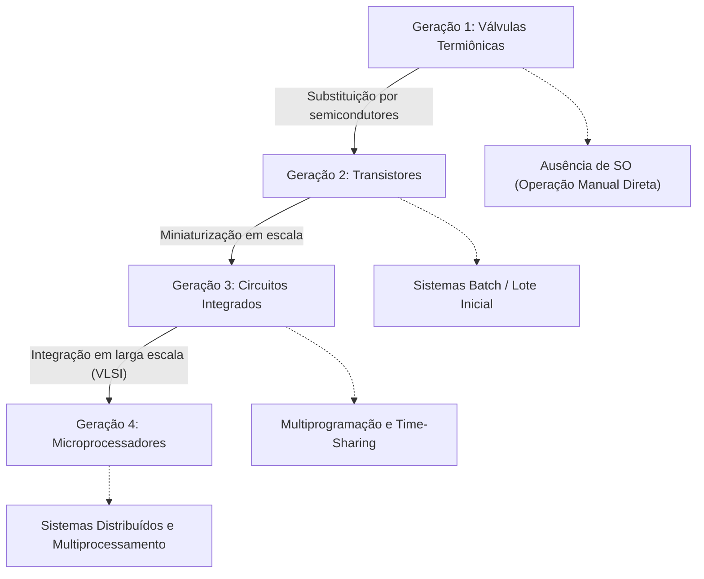

### Tabela comparativa da evolução das eras
*(Complemento pedagógico detalhado para consolidação de arquitetura)*

| Era / Geração | Elemento Eletrônico Central | Modelo de Operação Predominante | Papel do Sistema Operacional |
| :--- | :--- | :--- | :--- |
| **1ª Geração (1945-1955)** | Válvulas | Manual / Físico | Inexistente (código de máquina direto). |
| **2ª Geração (1955-1965)** | Transistores | Processamento em Lote (*Batch*) | Monitores residentes; transição automática de *jobs*. |
| **3ª Geração (1965-1980)** | Circuitos Integrados (SSI/MSI) | Multiprogramação e Divisão de Tempo | Gerenciamento de memória, proteção, interrupções e *time-sharing*. |
| **4ª Geração (1980-Presente)** | Microprocessadores (VLSI/ULSI) | Computação Pessoal e Distribuída | Interfaces gráficas, suporte a redes, multiprocessamento simétrico e virtualização. |

### Exemplo prático
Uma instrução de leitura de disco moderno requer suporte direto de hardware: o controlador de DMA (*Direct Memory Access*) transfere dados do disco diretamente para a RAM sem sobrecarregar a UCP. Contudo, é o SO que configura os registradores do DMA, bloqueia o processo requisitante e trata a interrupção gerada pelo controlador ao término da transferência.

### Contraexemplo
Tentar implementar multiprogramação segura em uma UCP que não possua modos de operação em hardware (modo usuário vs. modo núcleo) e instruções privilegiadas: se qualquer software puder acessar diretamente os barramentos de controle de hardware, a integridade do sistema operacional pode ser violada a qualquer momento por um programa de usuário defeituoso ou malicioso.

### Armadilhas comuns
- **Acreditar que o SO é apenas um programa convencional:** o SO depende estritamente de mecanismos que só o hardware pode fornecer (como o temporizador programável para gerar interrupções de relógio).
- **Ignorar a barreira de proteção de instruções:** considerar que o isolamento entre processos é puramente um acordo de software, desconsiderando o suporte indispensável da MMU (*Memory Management Unit*) e registradores base/limite no processador.

---

## Diferenciação conceitual: jobs, processos e threads

### Definições formais
O material da aula apresenta a distinção de três entidades fundamentais:
- **Job:** Bloco de trabalho bruto submetido para execução sequencial pelo sistema, característico dos ambientes em lote (*batch*). Não possui interatividade direta com o usuário durante sua execução; é lido, executado até o fim (ou falha) e seus resultados são despejados em um dispositivo de saída.
- **Processo:** Instância de um programa de computador em execução ativa. Possui espaço de endereçamento de memória isolado e dedicado, contexto de hardware privativo (cópia dos registradores da UCP, ponteiro de pilha e contador de programa), além de descritores de recursos (arquivos abertos, portas de rede, credenciais de segurança).
- **Thread:** Unidade básica de execução da UCP alocada dentro de um processo. Múltiplas threads pertencentes a um mesmo processo compartilham seu espaço de endereçamento (código, dados globais, *heap* e descritores de arquivos), mas mantêm de forma privativa sua própria pilha de execução (*stack*) e seu próprio conjunto de registradores de hardware (incluindo PC e SP).

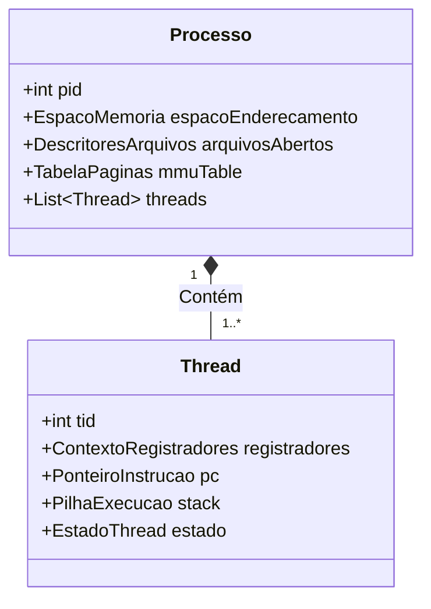

### Motivação da separação
O isolamento de **processos** impede que a falha de um programa (como uma violação de acesso à memória — *segmentation fault*) derrube outros programas ou o próprio sistema operacional. No entanto, criar e alternar processos é uma operação custosa (alto *overhead* de troca de tabelas de páginas da memória virtual).

As **threads** (frequentemente denominadas processos leves ou *lightweight processes*) foram concebidas para permitir concorrência interna com baixíssimo custo de criação e alternância de contexto, viabilizando comunicação trivial por compartilhamento direto da memória RAM.

### Tabela comparativa: Jobs, Processos e Threads

| Dimensão de Comparação | Job | Processo | Thread |
| :--- | :--- | :--- | :--- |
| **Origem Histórica** | Sistemas Batch (cartões perfurados/fitas) | Início da Multiprogramação e Time-Sharing | Sistemas Modernos e Multicore |
| **Interatividade** | Nula (processamento em lote) | Média a Alta | Alta |
| **Espaço de Endereçamento** | Totalidade da memória alocada à tarefa | Isolado e protegido por hardware | Compartilhado entre threads do mesmo processo |
| **Custo de Troca de Contexto** | Extremamente alto (carregamento sequencial) | Alto (invalidação de TLB, troca de tabelas) | Baixo (apenas troca de registradores e pilha) |
| **Comunicação entre Entidades** | Via arquivos/arquivos intermediários | IPC complexo (Sinais, Sockets, Pipes) | Acesso direto a variáveis globais e Heap |

### Exemplo conceitual (em C/POSIX)
*(Complemento técnico para ilustrar o custo e o compartilhamento de recursos)*

```c
#include <stdio.h>
#include <stdlib.h>
#include <unistd.h>
#include <pthread.h>
#include <sys/wait.h>

int variavel_global = 100;

void* rotina_thread(void* arg) {
    variavel_global += 50; // Altera diretamente a memória compartilhada do processo
    printf("[Thread] Global alterada para: %d\n", variavel_global);
    return NULL;
}

int main() {
    pid_t pid = fork(); // Criação de um novo processo independente

    if (pid == 0) {
        // Processo Filho: possui CÓPIA do espaço de endereçamento
        variavel_global += 10;
        printf("[Processo Filho] Global: %d\n", variavel_global);
        exit(0);
    } else {
        wait(NULL); // Aguarda término do filho
        printf("[Processo Pai após Fork] Global: %d (inalterada pelo filho)\n", variavel_global);

        pthread_t t1;
        pthread_create(&t1, NULL, rotina_thread, NULL); // Criação de Thread
        pthread_join(t1, NULL);
        printf("[Processo Pai após Thread] Global: %d (modificada pela thread)\n", variavel_global);
    }
    return 0;
}
```

### Contraexemplo
Considerar que threads são processos totalmente independentes. Se uma thread executar uma operação que resulte em um *segmentation fault* ou chamar a função `exit()`, **todo o processo** e todas as suas threads irmãs serão terminados imediatamente pelo sistema operacional.

### Armadilhas comuns
- **Confundir concorrência de threads com ausência de conflitos:** Como compartilham a mesma memória sem a barreira de isolamento do processo, threads exigem sincronização explícita (como exclusão mútua - *mutex*) para evitar condições de corrida (*race conditions*).
- **Assumir que mais threads sempre aumentam o desempenho:** Criar milhares de threads em uma máquina com poucos núcleos de UCP gera um fenômeno de degradação conhecido como sobrecarga de alternância de contexto (*thrashing* de UCP).

---

## Critérios e importância da classificação dos sistemas operacionais

### Definição
A classificação de Sistemas Operacionais é o ordenamento taxonômico baseado em suas características arquiteturais, propósitos de uso, número de tarefas que suportam simultaneamente, quantidade de usuários com acesso concorrente e número de processadores físicos integrados.

### Motivação
Não existe um sistema operacional universal que atenda de maneira ideal a todos os cenários da computação. Projetar um SO envolve escolhas estruturais (*trade-offs*):
- Um SO voltado a **dispositivos embarcados e IoT** deve priorizar consumo mínimo de memória (poucos kilobytes), economia estrita de energia e previsibilidade temporal.
- Um SO para **servidores corporativos** deve focar em alta disponibilidade, isolamento multiusuário robusto, alta vazão (*throughput*) de rede e segurança.
- Um SO de **desktop pessoal** precisa priorizar a responsividade visual imediata à interação humana (baixa latência de interface com periféricos de entrada).

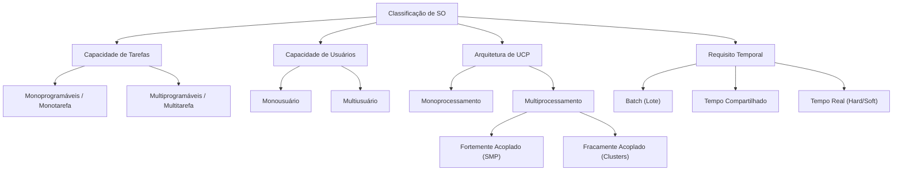

### Exemplo
Classificar um microcontrolador que monitora o freio ABS de um automóvel: trata-se de um sistema em tempo real rígido (*hard real-time*), frequentemente monotarefa ou com multiprogramação estática ultraleve, monousuário e uniprocessado. Em contraste, um cluster de processamento do Google é distribuído, fracamente acoplado, multiusuário, multiprogramável e executa serviços em lote e tempo compartilhado.

### Contraexemplo
Adotar um sistema operacional de desktop de propósito geral (como Windows 11 ou Ubuntu Desktop) para controlar atuadores de uma turbina de avião. A sobrecarga de preempção de interface gráfica e a imprevisibilidade do escalonador de tempo compartilhado violam os limites estritos de tolerância temporal requeridos por sistemas críticos.

### Armadilhas comuns
- **Considerar "monousuário" como sinônimo de "monotarefa":** Um sistema operacional moderno de uso pessoal (ex.: macOS, Windows 11) é monousuário do ponto de vista do operador da sessão interativa, mas executa centenas de processos concorrentes em segundo plano (multitarefa).

---

## Sistemas monoprogramáveis (monotarefa) e o gargalo da ociosidade da UCP

### Definição
Sistemas monoprogramáveis (ou monotarefa) são aqueles projetados para manter **apenas um único programa carregado na memória principal por vez**. A execução segue um modelo estritamente linear e sequencial: um programa se inicia, executa todas as suas fases de computação e operações de entrada e saída, e somente quando é totalmente finalizado o próximo programa pode ser alocado na memória e iniciado.

### O gargalo da ociosidade
O maior problema dos sistemas monoprogramáveis reside na **disparidade de tempo entre a UCP e os periféricos de E/S**. A UCP é um componente totalmente eletrônico capaz de realizar bilhões de operações lógicas por segundo (escala de gigahertz, com tempos de instrução em subnanossegundos). Em contrapartida, os dispositivos de entrada e saída (como discos magnéticos, impressoras, interfaces seriais e leitores de fita) dependem de partes mecânicas ou redes externas, operando em milissegundos.

Em um sistema monoprogramável, quando o programa ativo solicita uma operação de E/S (como a leitura de um registro de disco):
1. A UCP envia o comando ao periférico.
2. A UCP é forçada a entrar em estado de espera (laço de espera ativa ou parada de execução).
3. Todo o hardware permanece bloqueado aguardando o dispositivo de E/S completar a transferência mecânica.
4. Bilhões de ciclos de *clock* são desperdiçados em pura ociosidade.

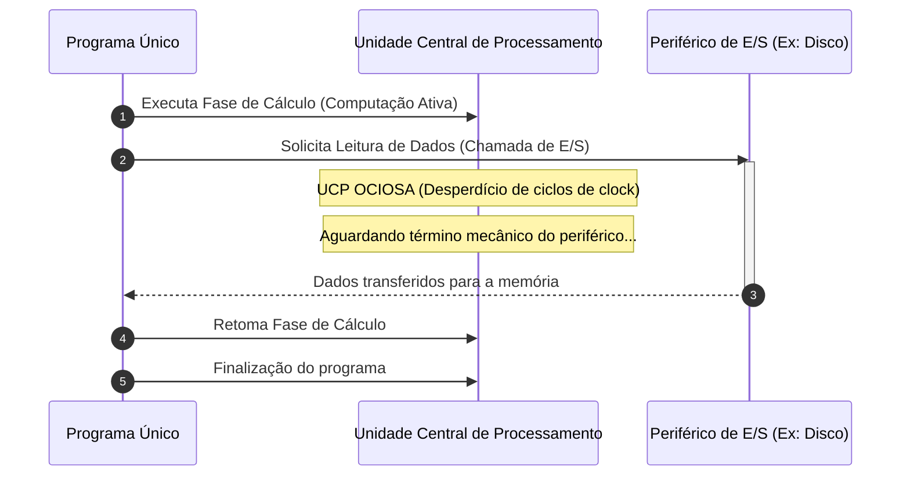

### Análise matemática de utilização da UCP
*(Complemento pedagógico para formalização do conceito de ociosidade)*

Seja $T_{comp}$ o tempo total que um programa gasta executando cálculos na UCP, e $T_{io}$ o tempo total gasto aguardando operações de E/S.
A taxa de utilização da UCP ($U$) em um sistema monoprogramável é dada por:

$$U = \frac{T_{comp}}{T_{comp} + T_{io}}$$

Se uma aplicação contábil gasta 10 segundos calculando na UCP e 90 segundos transferindo dados de e para fitas magnéticas:

$$U = \frac{10}{10 + 90} = \frac{10}{100} = 10\%$$

Isso significa que **90% do tempo de vida do processador foi desperdiçado** em estado ocioso.

### Exemplo
Sistemas operacionais antigos de computadores de grande porte da década de 1950 (como os primeiros monitores *batch* da IBM) e o clássico MS-DOS em sua forma pura: se um comando de cópia de arquivo longo estivesse em andamento, o usuário não conseguia digitar texto, navegar no disco ou calcular uma planilha; o sistema estava 100% retido pelo processo ativo.

### Contraexemplo
Sistemas com spooling (*Simultaneous Peripheral Operations On-Line*): introduzidos para mitigar a latência de periféricos, onde buffers em disco acumulavam dados enquanto a UCP trabalhava no próximo lote. Embora tenha sido um avanço, o spooling ainda não resolvia o problema no nível de memória se apenas um programa podia residir na RAM.

### Armadilhas comuns
- **Achar que hardware mais rápido resolve o problema da monotarefa:** Se a UCP dobrar de velocidade, mas o disco mecânico mantiver a mesma velocidade, a utilização percentual da UCP cairá ainda mais, agravando o gargalo relativo da ociosidade.

---

## Relevância e nichos contemporâneos de sistemas monotarefa

### Definição e contexto moderno
Embora a computação pessoal e corporativa seja massivamente dominada pela multiprogramação, os sistemas monotarefa não desapareceram. Eles continuam sendo amplamente utilizados como uma **escolha deliberada de engenharia** em nichos específicos, especialmente em microcontroladores de baixo custo e arquiteturas embarcadas estritas (*bare-metal*).

### Motivação técnica
Em sistemas embarcados simples, a adoção de um sistema operacional multitarefa introduz sobrecargas indesejadas:
1. **Consumo de memória:** Estruturas de dados como o Bloco de Controle de Processo (PCB), tabelas de páginas e múltiplas pilhas de execução consomem kilobytes ou megabytes de RAM. Em um microcontrolador com apenas 2 KB de SRAM (como o ATmega328P de um Arduino Uno), esse overhead inviabilizaria a aplicação.
2. **Consumo energético:** A alternância frequente de contexto e interrupções contínuas de temporizadores impedem que a UCP entre em estados profundos de economia de energia (*deep sleep*).
3. **Determinismo temporal absoluto:** Em sistemas simples de controle de motores ou sensores industriais, a latência de uma interrupção de troca de contexto de um escalonador pode gerar flutuações temporais (*jitter*) inaceitáveis.

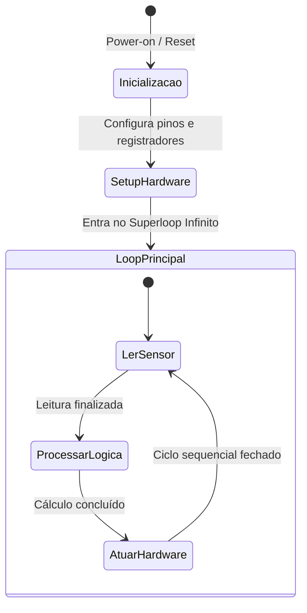

### Exemplo de código embarcado monotarefa (Arduino / Bare-metal C)

```c
#include <avr/io.h>
#include <util/delay.h>

// Sistema estritamente sequencial: Superloop monotarefa
int main(void) {
    // Configura o pino B5 como saída digital (LED integrado)
    DDRB |= (1 << DDB5);

    while (1) {
        // Liga o atuador
        PORTB |= (1 << PORTB5);
        _delay_ms(500); // UCP em espera ativa deliberada

        // Desliga o atuador
        PORTB &= ~(1 << PORTB5);
        _delay_ms(500);
    }
    return 0;
}
```

### Contraexemplo
Utilizar uma arquitetura monotarefa em um dispositivo como uma *Smart TV* ou um painel de instrumentos automotivo moderno. Esses ambientes exigem a decodificação simultânea de vídeo, recepção de comandos de controle remoto via Wi-Fi/Bluetooth, renderização de menus e gerenciamento de rede, demandando obrigatoriamente um SO multiprogramável (como Linux embarcado ou Android Automotive).

### Armadilhas comuns
- **Considerar que monotarefa é sinônimo de código "ultrapassado":** Em engenharia de sistemas críticos e dispositivos médicos ultraotimizados, o modelo *bare-metal* monotarefa é muitas vezes preferido pela facilidade de certificação de segurança formal e garantia de ausência de deadlocks.

---

## Multiprogramação, multitarefa e ilusão de simultaneidade

### Definição
A **multiprogramação** é a técnica arquitetural de manter múltiplos programas ativos simultaneamente residentes na memória principal do computador. A **multitarefa** (*multitasking*) é a extensão lógica da multiprogramação, na qual a UCP alterna a sua atenção entre esses múltiplos programas com uma frequência tão alta que cria para os observadores humanos a **ilusão de simultaneidade** (execução paralela aparente), mesmo quando o sistema dispõe de apenas uma única UCP física.

### Concorrência versus Paralelismo
É crucial estabelecer a distinção entre esses dois conceitos:
- **Concorrência:** É a propriedade de lidar com múltiplas tarefas que estão em andamento e progridem em períodos sobrepostos. Em um sistema com apenas uma UCP, a concorrência é obtida por meio de **intercalação temporal**: a UCP processa um fragmento da Tarefa A, troca para a Tarefa B, processa um fragmento e retorna para a Tarefa A.
- **Paralelismo:** É a execução fisicamente simultânea de duas ou mais instruções no exato mesmo instante de tempo. O paralelismo real só é possível quando existem duas ou mais unidades de processamento físico (múltiplos núcleos ou múltiplos processadores).

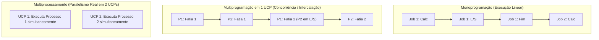

### Motivação da multiprogramação
A principal motivação é **eliminar o gargalo da ociosidade da UCP**. Quando o Processo A solicita uma operação lenta de E/S, o sistema operacional não deixa a UCP ociosa; ele salva o estado do Processo A, coloca-o em uma fila de espera e despacha a UCP para executar instruções do Processo B, que já está pronto na memória RAM.

### Tabela comparativa: Concorrência vs. Paralelismo

| Critério | Concorrência (Intercalação) | Paralelismo Real |
| :--- | :--- | :--- |
| **Requisito de Hardware** | Uma única UCP física é suficiente | Mínimo de 2 UCPs ou 2 núcleos físicos |
| **Execução Física no Instante $t$** | Apenas uma única instrução sendo executada | Múltiplas instruções executadas simultaneamente |
| **Mecanismo Central** | Troca rápida de contexto por divisão de tempo (*time-sharing*) | Processamento simultâneo em caminhos de dados independentes |
| **Objetivo Primário** | Manter a UCP ocupada e dar responsividade a múltiplos fluxos | Reduzir o tempo de processamento absoluto de tarefas intensivas |

### Exemplo
Um usuário redigindo um artigo no LibreOffice Writer enquanto escuta música no Spotify e baixa uma atualização de sistema em segundo plano em um computador com processador antigo de núcleo único. A UCP intercala fatias de tempo tão minúsculas (ex: 10 milissegundos) entre o decodificador de áudio, a interface gráfica do editor e a pilha de pacotes TCP/IP que o usuário tem a nítida sensação de que os três aplicativos funcionam juntos sem interrupções.

### Contraexemplo
Um programa rodando em um sistema monotarefa que tenta reproduzir áudio e ler do teclado: a reprodução do áudio "engasgaria" e congelaria a cada leitura de tecla do usuário, pois o processamento não poderia ser intercalado de forma dinâmica.

### Armadilhas comuns
- **Confundir concorrência com ganho de velocidade em cálculos puros:** Em tarefas 100% limitadas por cálculo de UCP (*CPU-bound*), intercalar 10 processos em um único núcleo não torna o processamento mais rápido; pelo contrário, o tempo total é ligeiramente maior devido à sobrecarga computacional de alternar o contexto entre eles.

---

## Compartilhamento de recursos: time-sharing, memória e virtualização

### Definições e fundamentos
Para que a multiprogramação funcione de maneira estável e justa, o sistema operacional implementa três mecanismos centrais de compartilhamento de recursos:

1. **Divisão de Tempo (*Time-Sharing*):** A UCP é alocada para cada processo por um intervalo pré-determinado e curto de tempo, denominado **fatia de tempo (*quantum*)**. Ao expirar o quantum, o processo em execução é interrompido involuntariamente para que outro processo da fila possa ser executado.
2. **Gerenciamento de Memória Compartilhada:** Vários processos residem na memória principal simultaneamente. O SO, em coordenação com a MMU (*Memory Management Unit*), delimita áreas de memória estritamente exclusivas para cada processo, impedindo acessos cruzados indevidos.
3. **Virtualização de Recursos:** O SO provê abstrações de recursos lógicos independentes para cada processo. Cada programa opera sob a ilusão de que possui acesso exclusivo a uma UCP inteira e a um espaço de memória linear completo (memória virtual), desacoplado dos detalhes da topologia física subjacente.

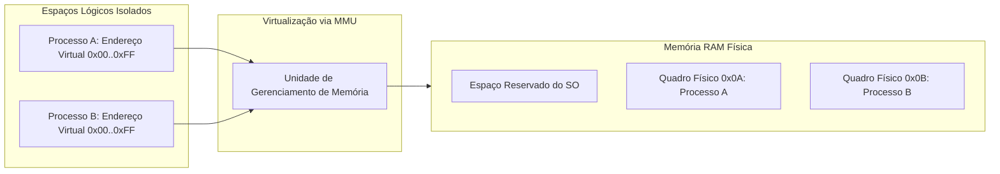

### Motivação
Sem virtualização e isolamento de memória, um processo com falha de ponteiro (*wild pointer*) poderia sobrescrever áreas de dados de outro processo ou até mesmo o código do próprio sistema operacional, provocando corrupção irreversível ou travamento total da máquina (*kernel panic* / tela azul).

### Exemplo
Se dois processos distintos executando no Linux (ex: duas instâncias do navegador Firefox) acessarem a variável no endereço virtual `0x7ffeefbff4a0`, eles estarão lendo e gravando em células físicas de memória RAM totalmente distintas. A tabela de páginas da MMU traduz o mesmo endereço lógico para quadros físicos diferentes.

### Contraexemplo
Sistemas operacionais antigos sem proteção de memória, como o Windows 3.11 ou o clássico Mac OS (até a versão 9): qualquer aplicativo em execução podia ler ou alterar livremente a memória de qualquer outro aplicativo ou as tabelas internas do SO. Bastava um programa travar para forçar o reinício de todo o computador.

### Armadilhas comuns
- **Achar que memória compartilhada significa ausência de proteção:** O compartilhamento de memória física ocorre sob controle rigoroso de hardware. Áreas de memória só são acessíveis por dois processos se ambos solicitarem explicitamente ao SO a criação de um segmento de memória compartilhada (*Shared Memory* IPC).

---

## Mecanismos de controle: interrupções, preempção e prevenção de race conditions

### Mecanismos de interrupção e preempção
A multiprogramação moderna baseia-se em mecanismos de hardware para garantir que o sistema operacional mantenha o controle absoluto da máquina:
- **Interrupções:** Sinais enviados pelo hardware à UCP indicando que um evento assíncrono ocorreu e requer atenção imediata (ex: uma tecla foi pressionada, um pacote de rede chegou ou o temporizador disparou).
- **Interrupção de Relógio (*Timer Interrupt*):** Um chip temporizador de hardware programado pelo SO que gera interrupções periódicas (ex: a cada 1 a 10 milissegundos). Quando o temporizador dispara, a execução do processo corrente é pausada e o controle da UCP retorna compulsoriamente para o escalonador do SO.
- **Preempção:** A capacidade do sistema operacional de suspender forçadamente a execução de um processo que estava em uso da UCP, sem que o processo tenha solicitado ou consentido com essa parada, alocando a UCP a outro processo com base em prioridade ou término do quantum.

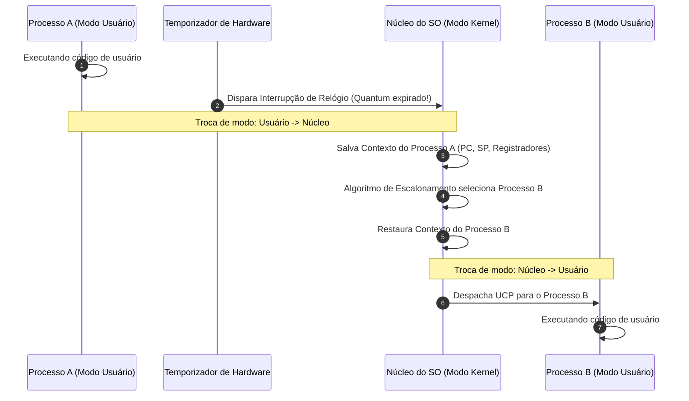

### Acesso concorrente e condições de corrida (*Race Conditions*)
Quando múltiplos processos ou threads concorrentes leem e escrevem em recursos de dados compartilhados (como uma variável global ou um registro de banco de dados), a ordem de execução pode influenciar o resultado final de maneira imprevisível. Essa falha é denominada **condição de corrida (*race condition*)**.

Para evitar inconsistências, o sistema operacional e os programadores utilizam mecanismos de sincronização que asseguram que **regiões críticas** (trechos de código que manipulam dados compartilhados) sejam executadas com **exclusão mútua** e **atomicidade** (operação indivisível).

### Exemplo de código demonstrando Race Condition e a necessidade de Mutex

```c
#include <stdio.h>
#include <pthread.h>

#define ITERACOES 1000000
long contador_compartilhado = 0;
pthread_mutex_t trava_exclusao; // Mecanismo de sincronização atômica

void* incremento_inseguro(void* arg) {
    for (int i = 0; i < ITERACOES; i++) {
        // Sem proteção: gera Race Condition devido à interrupção no meio do ciclo de leitura-modificação-escrita
        contador_compartilhado++;
    }
    return NULL;
}

void* incremento_seguro(void* arg) {
    for (int i = 0; i < ITERACOES; i++) {
        pthread_mutex_lock(&trava_exclusao);   // Entrada na Região Crítica (Atômico)
        contador_compartilhado++;
        pthread_mutex_unlock(&trava_exclusao); // Saída da Região Crítica
    }
    return NULL;
}
```

### Contraexemplo
Multitarefa cooperativa (utilizada no Windows 3.1 e no Mac OS clássico): o SO não realizava preempção forçada por hardware. O processo ativo precisava voluntariamente ceder o controle da UCP chamando funções como `Yield()`. Se um programa entrasse em um laço infinito (`while(1)`), toda a máquina travava, e nenhum outro processo recebia a UCP.

### Armadilhas comuns
- **Supor que instruções em linguagens de alto nível são atômicas:** A operação `contador++` em C ou Java é compilada em três instruções de máquina separadas (`MOV` da memória para o registrador, `ADD` no registrador e `MOV` de volta para a memória). Uma interrupção de preempção entre essas instruções corrompe o valor final.

---

## Métricas de eficiência: tempo de turnaround e throughput

### Definições das métricas
A introdução e a otimização da multiprogramação visam diretamente aprimorar duas métricas de desempenho centrais dos sistemas computacionais:

1. **Tempo de Turnaround ($T_{turnaround}$):** É o tempo total decorrido desde o instante em que uma tarefa ou processo é submetido ao sistema até o momento de sua conclusão completa e devolução dos resultados ao usuário. Inclui tempo de espera na fila, tempo de carregamento na memória, tempo de execução na UCP e tempo de espera por operações de E/S.
2. **Throughput (Vazão de Processamento):** É a quantidade de tarefas, transações ou processos completados com sucesso pelo sistema por unidade de tempo (ex: processos por minuto, requisições por segundo).


### Análise matemática comparativa
*(Complemento pedagógico detalhando a otimização de métricas)*

Considere dois programas ($P_1$ e $P_2$) que chegam juntos no instante $t = 0$:
- Cada programa necessita de 2 segundos de UCP e 4 segundos de E/S.
- No modelo **Monoprogramável**:
  - $P_1$ executa: $2s \text{ (CPU)} + 4s \text{ (E/S)} = 6s$. Turnaround de $P_1 = 6s$.
  - $P_2$ inicia em $t = 6s$ e termina em $t = 12s$. Turnaround de $P_2 = 12s$.
  - $\text{Turnaround Médio} = \frac{6 + 12}{2} = 9s$.
  - $\text{Throughput} = \frac{2 \text{ processos}}{12 \text{ segundos}} = 0,166 \text{ proc/s}$.

- No modelo **Multiprogramável** (com sobreposição de E/S):
  - Em $t=0$, $P_1$ usa a UCP por 2s.
  - Em $t=2$, $P_1$ vai para a E/S (levará 4s, até $t=6$). A UCP é imediatamente alocada para $P_2$, que consome seus 2s de UCP (até $t=4$).
  - Em $t=4$, $P_2$ entra em E/S. Ambos realizam E/S concorrentemente.
  - $P_1$ termina em $t=6$. Turnaround de $P_1 = 6s$.
  - $P_2$ conclui sua E/S em $t=8$. Turnaround de $P_2 = 8s$.
  - $\text{Turnaround Médio} = \frac{6 + 8}{2} = 7s$ (Redução de 22% no tempo de resposta).
  - $\text{Throughput} = \frac{2 \text{ processos}}{8 \text{ segundos}} = 0,250 \text{ proc/s}$ (**Aumento de 50% na vazão**).

### Tabela de vantagens da multiprogramação

| Dimensão de Análise | Vantagem Proporcionada | Impacto Prático no Ambiente |
| :--- | :--- | :--- |
| **Vantagem Técnica** | Redução substancial da ociosidade da UCP mediante sobreposição de fases de cálculo e E/S. | Utilização da UCP se aproxima de 90-100% sob carga balanceada. |
| **Vantagem Econômica** | Maximização do retorno sobre investimento em hardware de alto custo. | Maior volume de trabalho processado pelo mesmo parque computacional sem aquisição de novas máquinas. |

### Armadilhas comuns
- **Otimizar throughput sacrificando turnaround interativo:** Algoritmos de escalonamento que maximizam a vazão pura (como *Shortest Job First*) podem provocar inanição (*starvation*) em tarefas longas, elevando o tempo de turnaround dessas tarefas a níveis inaceitáveis.

---

## Sistemas monousuário versus sistemas multiusuário

### Definições
- **Sistemas Monousuário:** Projetados com foco em atender a **um único usuário por sessão de trabalho**. Todos os recursos e a interface gráfica do ambiente são direcionados para otimizar a experiência interativa daquela pessoa. Podem ser mono ou multitarefa. Exemplos clássicos: MS-DOS (monousuário monotarefa), Windows 11 Desktop e macOS (monousuário multitarefa).
- **Sistemas Multiusuário:** Arquitetados especificamente para suportar o acesso e a execução concorrente de tarefas solicitadas por **dois ou mais usuários distintos**. O SO é responsável por criar limites lógicos intransponíveis entre as contas, gerenciar credenciais de acesso, quotas de disco e memória e garantir que as ações de um usuário não degradem nem violem a privacidade de outro. Exemplos: Servidores Linux, z/OS (Mainframes IBM), Unix.

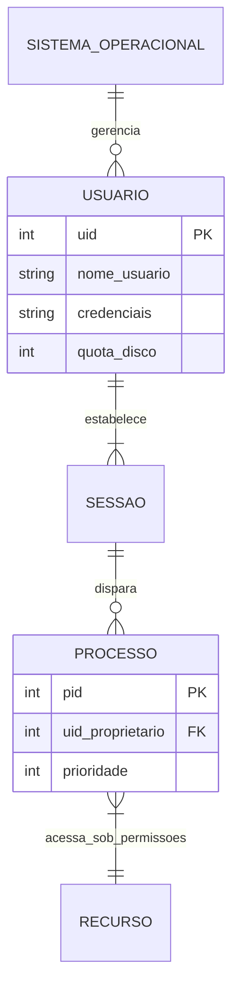

### Motivação e requisitos arquiteturais
Em um sistema multiusuário, o sistema de arquivos deve implementar **permissões de acesso granulares** (leitura, escrita e execução para dono, grupo e outros). Além disso, o escalonador de processos deve ser justo não apenas entre processos individuais, mas entre os usuários (*Fair-Share Scheduling*), evitando que um usuário monopolize toda a capacidade computacional abrindo centenas de threads maliciosas.

### Tabela comparativa: Monousuário vs. Multiusuário

| Requisito / Propriedade | Sistema Monousuário (Desktop) | Sistema Multiusuário (Servidor) |
| :--- | :--- | :--- |
| **Público-Alvo** | Operador individual da estação de trabalho | Centenas ou milhares de usuários e serviços de rede |
| **Objetivo Primário do Escalonador** | Minimização da latência de interface (GUI rápida) | Justiça (*fairness*), isolamento estrito e alta vazão |
| **Modelo de Segurança** | Segurança contra intrusões externas e proteção de integridade local | Proteção mútua interna obrigatória entre os usuários locais |
| **Gestão de Espaço e Recursos** | Acesso irrestrito a quase todo o disco pelo usuário local | Quotas rígidas de memória, processos e espaço em disco por UID |
| **Comunicação Típica** | Mouse, teclado, monitor direto | Conexões de rede remotas encriptadas (SSH, Web, RDP) |

### Exemplo
Um servidor corporativo executando Linux com 50 desenvolvedores conectados simultaneamente via SSH: o desenvolvedor `maria` compila um modelo de machine learning enquanto o desenvolvedor `joao` edita código no Vim. O SO isola seus processos de modo que `joao` não consegue ler os arquivos protegidos do diretório `/home/maria/` nem pode finalizar (*kill*) os processos de `maria`.

### Contraexemplo
Tentar utilizar o sistema de arquivos FAT32 (originalmente criado para sistemas monousuário como o MS-DOS) em um ambiente corporativo multiusuário: o FAT32 não possui conceitos nativos de dono do arquivo, grupos ou listas de controle de acesso (ACLs). Qualquer usuário tem acesso irrestrito a todos os arquivos da partição.

### Armadilhas comuns
- **Confundir suporte a múltiplos perfis de login com arquitetura multiusuário simultânea:** O fato de um sistema operacional permitir cadastrar vários usuários que se alternam sequencialmente na tela de bloqueio não o torna, por si só, um sistema multiusuário simultâneo de alto desempenho como um servidor Linux/Unix.

---

## Sistemas de multiprocessamento e paralelismo real

### Definição
Sistemas de multiprocessamento são aqueles que incorporam **duas ou mais Unidades Centrais de Processamento (UCPs) ou múltiplos núcleos físicos de execução**. Esses processadores compartilham componentes físicos essenciais, como barramentos de interconexão, geradores de clock e, frequentemente, a memória principal.

### O advento do paralelismo real
Ao contrário dos sistemas com uma única UCP (que utilizam a divisão de tempo para simular concorrência), os sistemas de multiprocessamento viabilizam o **paralelismo real**: em um instante de tempo exato $t$, duas instruções de máquina distintas pertencentes a processos ou threads diferentes são decodificadas e executadas fisicamente ao mesmo tempo em silícios independentes.

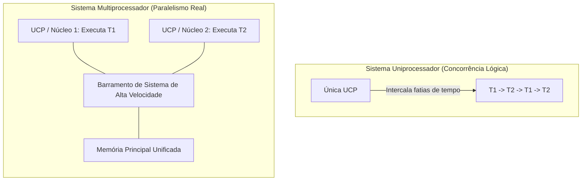

### Motivação
A demanda por processamento de grandes volumes de dados (como inteligência artificial, renderização 3D e bancos de dados transacionais com milhões de operações por segundo) excedeu a capacidade que uma única UCP pode entregar fisicamente. O paralelismo real é a única forma de continuar escalando o poder computacional.

### Exemplo
Um servidor com processador AMD EPYC de 64 núcleos executando um servidor web NGINX: até 64 requisições HTTP de clientes diferentes podem ter seus cabeçalhos e certificados SSL processados no mesmíssimo nanossegundo, sem que haja qualquer pausa ou intercalação temporal entre eles.

### Contraexemplo
Executar um programa puramente sequencial (monothreaded) em um computador com 128 núcleos de processador: 127 núcleos ficarão completamente ociosos, e a aplicação rodará exatamente na mesma velocidade de uma máquina com apenas um núcleo idêntico.

### Armadilhas comuns
- **Assumir que paralelismo de hardware acelera qualquer software automaticamente:** O hardware apenas oferece a infraestrutura. Se o software não for decomposto algoritmicamente em processos concorrentes ou threads paralelas, ele não usufruirá do poder dos múltiplos processadores.

---

## Pilares do multiprocessamento: escalabilidade, disponibilidade e balanceamento de carga

### Definições dos três pilares
Para que uma arquitetura de multiprocessamento seja classificada como robusta e eficiente, ela deve apoiar-se em três pilares fundamentais descritos a seguir:

1. **Escalabilidade Intrínseca:** A capacidade de um sistema de aumentar sua capacidade de processamento de forma previsível e aproximadamente proporcional à medida que mais recursos de hardware (processadores, memória, barramentos) são adicionados ao conjunto.
2. **Disponibilidade Contínua e Degradação Graciosa (*Graceful Degradation*):** A capacidade do sistema de continuar operando e prestando serviços essenciais mesmo diante da falha crítica de um ou mais processadores. Em vez de uma falha catastrófica total (*crash*), o sistema reduz proporcionalmente sua capacidade total (degradação graciosa ou *fail-soft*), isola o componente danificado e mantém as operações ativas.
3. **Balanceamento de Carga (*Load Balancing*):** A distribuição coordenada e inteligente das tarefas e processos prontos entre todos os processadores disponíveis, garantindo que nenhum núcleo fique ocioso enquanto outros sofrem com sobrecarga de processamento.

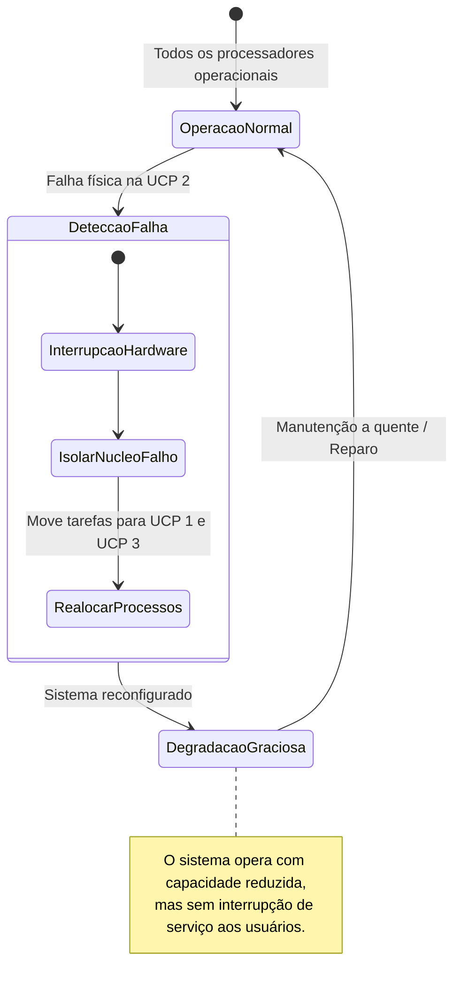

### Mecanismos de balanceamento de carga no SO
Os sistemas operacionais modernos implementam duas estratégias principais de balanceamento:
- **Balanceamento por Puxamento (*Pull Migration*):** Um processador que se torna ocioso verifica as filas de execução dos outros processadores e "puxa" uma tarefa pronta para si.
- **Balanceamento por Empurrão (*Push Migration*):** Uma rotina periódica do sistema operacional monitora a carga de todos os processadores e, ao constatar desequilíbrio, move processos de UCPs sobrecarregadas para UCPs subutilizadas.

### Tabela comparativa dos pilares

| Pilar | Mecanismo Central | Impacto Negativo se Ausente |
| :--- | :--- | :--- |
| **Escalabilidade** | Arquitetura de barramentos e sincronização de baixo atrito | Adição de novos processadores resulta em saturação e perda de desempenho. |
| **Disponibilidade** | Detecção de falhas de hardware, suporte a *hot-plug* e *fail-soft* | Queima de um núcleo derruba a infraestrutura corporativa inteira. |
| **Balanceamento** | Escalonadores com migração de afinidade (*push/pull*) | Núcleos a 100% gerando filas de espera enquanto outros núcleos operam a 0%. |

### Armadilhas comuns
- **Ignorar a Afinidade de Processador (*Processor Affinity*):** Mover um processo de um núcleo para outro durante o balanceamento de carga tem um custo: a memória cache L1/L2 da UCP original continha dados quentes da tarefa, que precisarão ser invalidados e recarregados do zero na nova UCP. O escalonador deve pesar o custo do desbalanceamento contra o custo de invalidar o cache.

---

## Aplicações de computação de alto desempenho

### Contexto e caracterização
A Computação de Alto Desempenho (*High-Performance Computing* - HPC) emprega sistemas de multiprocessamento massivo para resolver problemas científicos, industriais e de engenharia cuja complexidade computacional torna inviável a execução em computadores convencionais.

### Domínios de aplicação destacados
1. **Simulações Climáticas e Meteorologia de Alta Resolução:** Modelagem de sistemas de equações diferenciais parciais não-lineares que simulam a dinâmica de fluidos na atmosfera, oceanos e a dispersão de aerossóis globais. Requer a divisão da atmosfera do planeta em uma grade tridimensional com bilhões de células discretas calculadas a cada fração de segundo simulado.
2. **Prospecção de Petróleo e Geofísica:** Processamento de sinais sísmicos massivos para reconstruir imagens tridimensionais do subsolo marinho e camadas de pré-sal.
3. **Renderização Cinematográfica e Computação Gráfica:** Cálculo de transporte de luz e *ray-tracing* foto-realista quadro a quadro para efeitos visuais e filmes de animação.

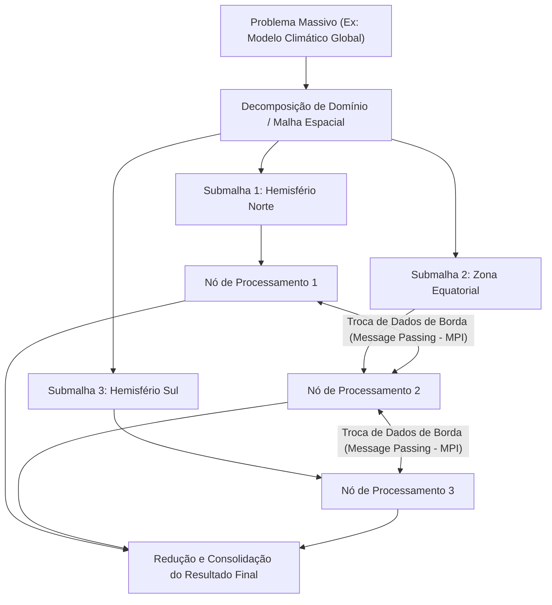

### Modelos de paralelismo em HPC
- **Paralelismo de Dados (*Data Parallelism*):** A mesma operação matemática é aplicada simultaneamente a elementos distintos de um conjunto gigantesco de dados (ex: matrizes de dados sísmicos).
- **Paralelismo de Tarefas (*Task Parallelism*):** Tarefas com lógicas computacionais distintas executam em paralelo sobre dados iguais ou distintos, comunicando-se por meio de canais de troca de mensagens.

---

## Sistemas fortemente acoplados (SMP e memória compartilhada)

### Definição
Sistemas fortemente acoplados são arquiteturas de multiprocessamento nas quais **dois ou mais processadores físicos compartilham um mesmo espaço físico unificado de memória principal (RAM)**, além de barramentos de sistema, relógio e periféricos. Essa arquitetura é universalmente referenciada como **Multiprocessamento Simétrico (*Symmetric Multiprocessing* - SMP)**.

### Características centrais
- **Memória Compartilhada:** Todos os processadores possuem a capacidade de endereçar diretamente qualquer posição da memória física do sistema.
- **Baixa Latência de Comunicação:** A troca de dados e a comunicação interprocessos (IPC) ocorrem em velocidade de memória RAM e de cache de silício (ordem de nanosegundos).
- **Sistema Operacional Único:** Uma única cópia do sistema operacional executa sobre a máquina, gerenciando todas as UCPs e alocando recursos de forma centralizada.
- **Simetria:** Todas as UCPs possuem acesso idêntico e com privilégios equivalentes a todos os recursos da máquina (nenhuma UCP é mestra fixa das outras).

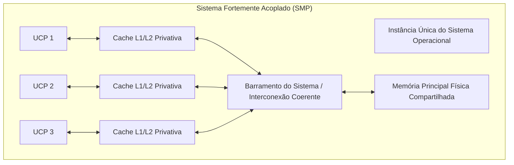

### O desafio da coerência de cache (*Cache Coherency*)
Como cada UCP mantém cópias locais de linhas de memória em sua própria memória cache privativa ultra-rápida (L1/L2), surge o problema de inconsistência: se a UCP 1 alterar o valor de uma variável armazenada em sua cache local, a UCP 2 (que também estava lendo aquela variável) continuará enxergando o valor antigo se não houver um protocolo de coerência de hardware (como os protocolos MESI ou MOESI) para invalidar ou atualizar a linha de cache da UCP 2 imediatamente.

### Limite de escalabilidade
O barramento físico de acesso à memória torna-se um **gargalo de saturação (*bus contention*)**. Conforme adicionamos mais UCPs (geralmente acima de 16, 32 ou 64 núcleos), os processadores gastam mais tempo aguardando vez para acessar o barramento unificado de memória do que executando cálculos.

---

## Sistemas fracamente acoplados (clusters e memória distribuída)

### Definição
Sistemas fracamente acoplados (comumente denominados **Clusters** ou Sistemas Distribuídos) consistem na **interconexão de múltiplos computadores completos e autônomos (nós)** por meio de uma infraestrutura de rede de comunicação de dados. Cada nó possui sua própria UCP, seus próprios barramentos e sua **própria memória física independente e distribuída**.

### Características centrais
- **Memória Distribuída:** O processador de um nó **não consegue** endereçar diretamente a memória física de outro nó.
- **Comunicação por Troca de Mensagens (*Message Passing*):** Toda e qualquer transferência de dados ou sincronização entre nós deve ser explicitamente empacotada e transmitida através da rede (ex: utilizando protocolos de rede ou padrões de biblioteca como MPI - *Message Passing Interface*).
- **Múltiplos Sistemas Operacionais:** Cada nó executa a sua própria cópia independente do sistema operacional (ex: cada nó roda sua própria instância do Linux).
- **Alta Latência de Comunicação:** A latência entre nós é governada pela interface de rede (microssegundos a milissegundos), ordens de magnitude mais lenta que a comunicação SMP.
- **Escalabilidade Praticamente Ilimitada:** É viável expandir o poder de um cluster conectando dezenas, centenas ou dezenas de milhares de novos nós à rede sem saturar um barramento de memória local unificado.

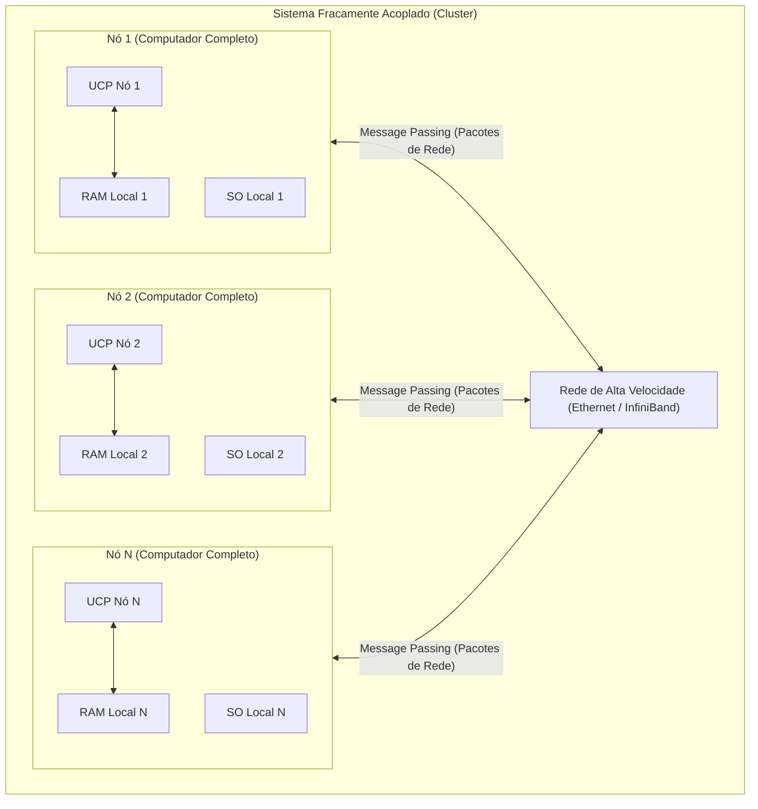

### Tabela comparativa exaustiva: SMP vs. Clusters

| Dimensão de Comparação | Fortemente Acoplado (SMP) | Fracamente Acoplado (Cluster) |
| :--- | :--- | :--- |
| **Topologia de Memória** | Compartilhada (*Shared Memory*) globalmente | Distribuída (*Distributed Memory*) em cada nó |
| **Latência de Comunicação** | Extremamente baixa (nanossegundos) | Alta/Média (microssegundos a milissegundos) |
| **Escalabilidade Física** | Limitada pela saturação do barramento unificado | Altíssima (expansão modular por rede) |
| **Instâncias de SO** | Única instância do SO gerencia todas as UCPs | Cada nó roda sua própria instância autônoma do SO |
| **Modelo de Programação** | Threads, memória compartilhada, variáveis globais | Troca de mensagens explícita (Sockets, MPI, REST) |
| **Custo de Hardware** | Alto por unidade (placas-mãe complexas multi-socket) | Baixo a médio (permite uso de nós convencionais/commodities) |
| **Tolerância a Falhas** | Falha de memória pode derrubar a máquina toda | Falha de um nó é isolada facilmente pela rede |

---

## Escalabilidade pós-Lei de Moore e implicações da Lei de Amdahl

### O fim da Lei de Moore e da Escala de Dennard
Historicamente, a **Lei de Moore** (observação empírica de Gordon Moore em 1965) ditava que o número de transistores em um chip dobrava aproximadamente a cada 18 a 24 meses com custos constantes. Paralelamente, o **Escalonamento de Dennard** garantia que, ao diminuir o tamanho dos transistores, a densidade de potência permanecia constante, permitindo elevar agressivamente a frequência de clock das UCPs (de alguns megahertz nas décadas de 1980/1990 para vários gigahertz nos anos 2000).

Em meados dos anos 2000, essa dinâmica encontrou barreiras físicas intransponíveis:
- **Barreira Térmica (*Power Wall*):** Dissipar o calor gerado por frequências acima de 4 a 5 GHz em chips de silício tradicionais tornou-se proibitivamente complexo.
- **Efeitos Quânticos:** Transistores da ordem de poucos nanômetros sofrem com fuga de corrente elétrica (*leakage current*).

A indústria de semicondutores redirecionou sua estratégia: **em vez de produzir processadores com clock cada vez mais veloz, passou a incorporar múltiplos núcleos de processamento mais eficientes no mesmo encapsulamento de silício (*multicore*)**.

### A Lei de Amdahl
O advento compulsório do multicore transferiu a responsabilidade do ganho de desempenho para a engenharia de software. A **Lei de Amdahl** formaliza matematicamente o limite teórico máximo de aceleração (*speedup*) que um programa pode obter ao utilizar múltiplos processadores.

#### Formulação matemática
Seja:
- $P$: A fração do código ou do algoritmo que é passível de ser executada de forma estritamente paralela ($0 \le P \le 1$).
- $(1 - P)$: A fração intrinsecamente sequencial (serial) do código, que não pode ser paralelizada.
- $N$: O número de núcleos ou processadores disponíveis para a execução.

O Speedup teórico máximo $S(N)$ é dado pela fórmula:

$$S(N) = \frac{1}{(1 - P) + \frac{P}{N}}$$

Se considerarmos um número hipoteticamente infinito de processadores ($N \to \infty$):

$$\lim_{N \to \infty} S(N) = \frac{1}{1 - P}$$

Isso significa que **a fração serial do código impõe um teto rígido e inultrapassável ao ganho de desempenho**, independentemente de quantos milhares de núcleos de processamento sejam alocados ao sistema.

```mermaid
flowchart TD
    Inicio["Início do Algoritmo"] --> ParteSerial1["Fração Serial: Inicialização e Carga (1 - P)"]
    ParteSerial1 --> Fork["Bifurcação Paralela (N núcleos)"]
    
    Fork --> Nucleo1["Núcleo 1: Calcula fatia 1"]
    Fork --> Nucleo2["Núcleo 2: Calcula fatia 2"]
    Fork --> NucleoN["Núcleo N: Calcula fatia N"]
    
    Nucleo1 --> Join["Barreira de Sincronização / Join"]
    Nucleo2 --> Join
    NucleoN --> Join
    
    Join --> ParteSerial2["Fração Serial: Consolidação e I/O (1 - P)"]
    ParteSerial2 --> Fim["Fim do Algoritmo"]

    note right of Join
        A sincronização e as partes seriais
        impedem o ganho de escala linear (Amdahl).
    end note
```

### Análise numérica de Speedup segundo Amdahl
*(Complemento pedagógico para fundamentação analítica)*

Considere um sistema onde um algoritmo possui **10% de código serial** (leitura de arquivos, inicialização e sincronização final) e **90% de código paralelizado** ($P = 0,90$ e $1 - P = 0,10$):
- Com $N = 2$ núcleos:
  $$S(2) = \frac{1}{0,10 + \frac{0,90}{2}} = \frac{1}{0,10 + 0,45} = \frac{1}{0,55} \approx 1,81\times$$
- Com $N = 10$ núcleos:
  $$S(10) = \frac{1}{0,10 + \frac{0,90}{10}} = \frac{1}{0,10 + 0,09} = \frac{1}{0,19} \approx 5,26\times$$
- Com $N = 100$ núcleos:
  $$S(100) = \frac{1}{0,10 + \frac{0,90}{100}} = \frac{1}{0,10 + 0,009} = \frac{1}{0,109} \approx 9,17\times$$
- Com $N = 10.000$ núcleos:
  $$S(10.000) = \frac{1}{0,10 + \frac{0,90}{10.000}} \approx \frac{1}{0,10009} \approx 9,99\times$$
- Com $N \to \infty$ núcleos:
  $$S(\infty) = \frac{1}{1 - 0,90} = \frac{1}{0,10} = \mathbf{10\times}$$

Mesmo investindo milhões de reais para colocar 10.000 processadores dedicados ao cálculo, a aplicação **jamais ultrapassará uma aceleração de 10 vezes** em relação à máquina original de um núcleo.

### Implicações profundas para o desenvolvedor
O fim da Lei de Moore eliminou o chamado "almoço grátis" (*free lunch*): os programas não se tornam mais rápidos automaticamente a cada nova geração de hardware simplesmente esperando processadores com clocks mais altos.
O desenvolvedor contemporâneo é obrigado a:
1. Redesenhar algoritmos para minimizar agressivamente a fração serial $(1 - P)$.
2. Escolher entre modelos de **acoplamento forte** (gerenciando concorrência local, primitivas de sincronização, mutexes e problemas de contenção de cache) e **sistemas distribuídos** (gerenciando tolerância a partições de rede, serialização de dados e latência de rede).

---

## Código da aula

O material de apoio original em slides não disponibilizou arquivos de código externos anexos. No entanto, para cumprir o objetivo pedagógico do curso de Sistemas de Informação, são fornecidos abaixo dois programas conceituais que materializam os tópicos teóricos mais densos discutidos em sala de aula.

### 1. Simulação didática de Time-Sharing com escalonador Round-Robin
Este código em C ilustra o funcionamento do escalonamento preemptivo por fatias de tempo (*quantum*), a base da multiprogramação.

```c
#include <stdio.h>
#include <stdbool.h>

#define QUANTUM 2 // Tamanho da fatia de tempo alocada pela UCP

typedef struct {
    int pid;
    int tempo_restante;
    int tempo_total_execucao;
} ProcessoSimulado;

int main() {
    ProcessoSimulado fila[] = {
        {1, 6, 6}, // P1 precisa de 6 unidades de tempo
        {2, 3, 3}, // P2 precisa de 3 unidades de tempo
        {3, 8, 8}  // P3 precisa de 8 unidades de tempo
    };
    int total_processos = sizeof(fila) / sizeof(fila[0]);
    int tempo_global = 0;
    bool todos_concluidos;

    printf("=== SIMULADOR DE TIME-SHARING (ROUND-ROBIN) ===\n");

    do {
        todos_concluidos = true;

        for (int i = 0; i < total_processos; i++) {
            if (fila[i].tempo_restante > 0) {
                todos_concluidos = false;

                // Calcula quanto tempo o processo vai rodar nesta fatia
                int tempo_rodada = (fila[i].tempo_restante > QUANTUM) ? QUANTUM : fila[i].tempo_restante;

                printf("[Tempo %02d] UCP alocada para Processo %d (Resta: %d)\n",
                       tempo_global, fila[i].pid, fila[i].tempo_restante);

                fila[i].tempo_restante -= tempo_rodada;
                tempo_global += tempo_rodada;

                if (fila[i].tempo_restante == 0) {
                    printf("[Tempo %02d] -> Processo %d CONCLUIDO! (Turnaround: %d)\n",
                           tempo_global, fila[i].pid, tempo_global);
                } else {
                    printf("[Tempo %02d] -> Preempcao de Processo %d (Fim de quantum)\n",
                           tempo_global, fila[i].pid);
                }
            }
        }
    } while (!todos_concluidos);

    printf("=== TODAS AS TAREFAS FINALIZADAS NO TEMPO %02d ===\n", tempo_global);
    return 0;
}
```

### 2. Calculadora da Lei de Amdahl em Python
Script analítico para calcular o teto de aceleração com base na porção paralela e número de núcleos.

```python
def calcular_amdahl(fracao_paralela: float, nucleos: int) -> float:
    """Calcula o Speedup teorico maximo segundo a Lei de Amdahl.

    :param fracao_paralela: Porcentagem do codigo paralelizavel (ex: 0.8 para
      80%)
    :param nucleos: Numero de cores/processadores alocados
    :return: Fator de multiplicacao de velocidade (Speedup)
    """
    fracao_serial = 1.0 - fracao_paralela
    if nucleos <= 0:
        raise ValueError("O numero de nucleos deve ser maior que zero.")
    return 1.0 / (fracao_serial + (fracao_paralela / nucleos))


def demonstrar_cenario():
    fracao_p = 0.90  # 90% do algoritmo e paralelo
    print(f"=== ANALISE DA LEI DE AMDAHL (Fração Paralela = {fracao_p * 100}%) ===")
    teto_infinito = 1.0 / (1.0 - fracao_p)
    print(f"Teto Teorico Maximo Absoluto (N -> infinito): {teto_infinito:.2f}x\n")

    lista_nucleos = [1, 2, 4, 8, 16, 32, 64, 128, 512, 2048]
    print(f"{'Nucleos (N)':<15} | {'Speedup Obtido':<15} | {'Eficiencia (%)':<15}")
    print("-" * 50)
    for n in lista_nucleos:
        speedup = calcular_amdahl(fracao_p, n)
        eficiencia = (speedup / n) * 100
        print(f"{n:<15} | {speedup:<15.2f} | {eficiencia:<15.2f}%")


if __name__ == "__main__":
    demonstrar_cenario()
```

---

## Exercícios

### Exercício 1: Escalabilidade Pós-Lei de Moore
*(Constante no Slide 20 do material da aula)*

**Enunciado:**  
Frente ao fim da Lei de Moore, qual o impacto no desenvolvedor entre acoplamento forte e sistemas distribuídos?

#### Raciocínio detalhado
A resposta exige contextualizar o fim do aumento da frequência de clock e avaliar as opções arquiteturais disponíveis para extrair desempenho:
1. **Contextualização:** Com a estagnação do clock por limitações térmicas, o ganho de desempenho não é mais automático. O desenvolvedor é o responsável direto por estruturar o paralelismo do software.
2. **Impacto no Acoplamento Forte (SMP / Multithreading local):**
   - O desenvolvedor programa para um ambiente de **memória compartilhada**.
   - O desafio central é a **concorrência local e sincronização**: prevenir condições de corrida, gerenciar exclusão mútua (*mutexes*, semáforos, *spinlocks*), evitar impasses (*deadlocks*) e lidar com penalidades de coerência de cache (*false sharing* e contenção de barramento).
   - Vantagem: baixa latência de comunicação entre threads. Limite: número finito de núcleos que podem acessar o barramento de memória da placa-mãe.
3. **Impacto nos Sistemas Distribuídos (Fracamente Acoplados / Clusters):**
   - O desenvolvedor programa para nós independentes com **memória distribuída**.
   - O paradigma passa a ser a **troca de mensagens (*message passing*)**: chamada de procedimentos remotos (RPC), envio de mensagens via rede, serialização/desserialização de dados e arquitetura de microsserviços.
   - O desenvolvedor precisa lidar ativamente com as **Falácias da Computação Distribuída**: a rede não é confiável, a latência não é zero, a banda é finita e partes do sistema falham de forma isolada (tolerância a falhas e consistência eventual).
   - Vantagem: escalabilidade horizontal quase infinita. Limite: alta latência de rede e alta complexidade arquitetural.

#### Resolução comentada
> **Resposta síntese para avaliação:**  
> O fim da Lei de Moore eliminou o ganho passivo de velocidade em programas sequenciais, transferindo a responsabilidade da aceleração para o programador. No **acoplamento forte**, o desenvolvedor enfrenta o desafio de sincronização em memória compartilhada (tratando condições de corrida, deadlocks e coerência de cache), obtendo altíssima velocidade, mas esbarrando na escalabilidade limitada do hardware unificado. Já nos **sistemas distribuídos**, o desenvolvedor abandona a memória compartilhada em favor da troca explícita de mensagens pela rede, superando o limite físico de uma única máquina em troca de assumir a complexidade de latências de rede elevadas, serialização de dados e gerenciamento de falhas parciais.

---

### Exercício 2: Diagnóstico de Arquiteturas
*(Constante nos Slides 21, 22 e 23 do material da aula)*

**Enunciado:**  
Associe cada cenário da Coluna A à classificação correta na Coluna B:

**Coluna A:**
1. Servidor DB
2. Cluster Meteorológico
3. Microcontrolador Sensor
4. Usuário (Música/Texto)

**Coluna B:**
- ( ) Fortemente Acoplado
- ( ) Fracamente Acoplado
- ( ) Monoprogramável
- ( ) Multiprogramável

#### Análise pedagógica e resolução
Ao analisar os cenários sob a ótica dos conceitos explicados na aula:

1. **Servidor DB (Banco de Dados Corporativo Relacional):**  
   Bancos de dados relacionais corporativos de alto desempenho (como Oracle Database ou SQL Server) executam tipicamente sobre servidores de grande porte com múltiplos processadores físicos que compartilham a mesma memória RAM de forma ultra-rápida (SMP).  
   $\rightarrow$ **Associação correta: Fortemente Acoplado**.

2. **Cluster Meteorológico:**  
   Simulações de previsão do tempo exigem milhares de nós computacionais interconectados por rede de alta performance (InfiniBand) trocando dados por mensagens (MPI).  
   $\rightarrow$ **Associação correta: Fracamente Acoplado**.

3. **Microcontrolador Sensor:**  
   Dispositivos IoT simples e microcontroladores dedicados a leitura de sensor operam em arquitetura *bare-metal* executando um único laço sequencial para poupar energia e memória.  
   $\rightarrow$ **Associação correta: Monoprogramável**.

4. **Usuário (Música/Texto):**  
   Uma estação de trabalho de um usuário comum executando um processador de texto enquanto ouve música opera alternando tarefas na memória via time-sharing.  
   $\rightarrow$ **Associação correta: Multiprogramável**.

#### Gabarito estruturado da associação

| Item da Coluna A | Classificação da Coluna B | Justificativa Arquitetural |
| :--- | :--- | :--- |
| **1. Servidor DB** | **Fortemente Acoplado** | Múltiplos núcleos compartilhando o mesmo espaço de memória RAM para latência mínima em transações. |
| **2. Cluster Meteorológico** | **Fracamente Acoplado** | Centenas/milhares de nós com memória distribuída conectados via rede para computação paralela de grande porte. |
| **3. Microcontrolador Sensor** | **Monoprogramável** | Execução sequencial estrita sem sistema operacional complexo para economia extrema de memória e energia. |
| **4. Usuário (Música/Texto)** | **Multiprogramável** | Execução concorrente de múltiplos programas de usuário com divisão de tempo na UCP. |

*(Nota pedagógica: No slide 23 original do material, a digitação das chaves numéricas apresentava inversões nos índices entre as colunas; a resolução acima restabelece a coerência técnica formal dos conceitos apresentados em aula).*

---

## Erros comuns e boas práticas

### Erros comuns cometidos por estudantes
1. **Confundir Concorrência com Paralelismo:** Afirmar que um computador com uma única UCP antiga está executando o Word e o Spotify em paralelo. *Correção:* Está executando em concorrência lógica por intercalação temporal (time-sharing), não em paralelismo físico.
2. **Achar que a Lei de Amdahl permite Speedup infinito:** Esquecer que o termo $(1 - P)$ nunca é totalmente zero em sistemas reais (sempre haverá tempo de boot, I/O, criação de threads ou sincronização).
3. **Julgar que sistemas Monoprogramáveis estão extintos:** Desconsiderar o mercado bilionário de microcontroladores de 8 e 16 bits que controlam eletrodomésticos, sensores agrícolas e dispositivos médicos.
4. **Desconsiderar o custo da Troca de Contexto:** Assumir que quanta de tempo minúsculos (ex: 1 microssegundo) tornam o sistema infinitamente fluido. Na prática, a UCP gastará mais tempo trocando registradores e tabelas de memória do que executando os programas.
5. **Esquecer que Threads compartilham memória:** Criar múltiplas threads acessando vetores compartilhados sem implementar travas de exclusão mútua (*locks*), gerando corrupção de dados silenciosa.

### Boas práticas de engenharia de software
1. **Minimizar as Regiões Críticas:** Mantenha os trechos de código protegidos por *mutex* o menor possível. Bloquear operações lentas de E/S dentro de uma região crítica destrói o paralelismo de sistemas fortemente acoplados.
2. **Respeitar a Afinidade de CPU:** Em servidores de bancos de dados de alto tráfego, configure a afinidade de processador (*processor affinity*) para evitar que threads críticas migrem desnecessariamente entre núcleos distantes.
3. **Projetar pensando em Falhas de Rede:** Em arquiteturas fracamente acopladas (clusters/microsserviços), trate a comunicação de rede como intrinsecamente não confiável. Implemente timeouts, retentativas com backoff exponencial e disjuntores de circuito (*circuit breakers*).
4. **Perfilamento antes da Otimização Paralela:** Antes de reescrever um código para rodar em cluster ou com threads, meça o tempo com um *profiler* para identificar a fração serial e saber se o ganho justificará a complexidade segundo Amdahl.

---

## Links e materiais complementares

- **Silberschatz, Galvin & Gagne — Fundamentos de Sistemas Operacionais (10ª Edição):**  
  *Conteúdo:* Capítulos 1 e 2 (Introdução e Estruturas de SO) e Capítulo 6 (Sincronização de Processos). Referência bibliográfica central para concursos e avaliações acadêmicas.
- **Tanenbaum & Bos — Sistemas Operacionais Modernos (4ª Edição):**  
  *Conteúdo:* Capítulo 1 (Evolução histórica do hardware/software) e Capítulo 8 (Sistemas Operacionais Multiprocessadores e Distribuídos).
- **Artigo Histórico: "Validity of the single processor approach to achieving large scale computing capabilities" (Gene Amdahl, 1967):**  
  *Conteúdo:* A publicação original na conferência AFIPS que introduziu o limite de aceleração em sistemas paralelos.
- **POSIX Threads Programming (Lawrence Livermore National Laboratory - LLNL):**  
  *Conteúdo:* Guia tutorial clássico de computação paralela em memória compartilhada com pthreads e arquiteturas SMP: `https://hpc-tutorials.llnl.gov/posix/`
- **OpenMPI Documentation & Architecture:**  
  *Conteúdo:* Documentação oficial sobre troca de mensagens em sistemas fracamente acoplados e supercomputadores: `https://www.open-mpi.org/`

---

## Mapa da aula

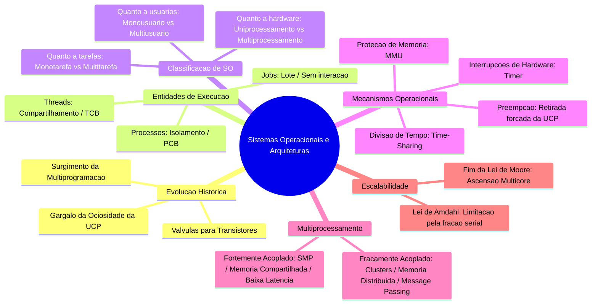

---

## Glossário

| Termo | Definição Técnica |
| :--- | :--- |
| **UCP / CPU** | Unidade Central de Processamento; componente de hardware responsável por buscar, decodificar e executar instruções de máquina. |
| **Job** | Bloco de computação bruta em lote (*batch*), submetido sequencialmente sem interação direta com o operador humano durante a execução. |
| **Processo** | Instância de um programa em execução com espaço de memória virtual isolado e recursos alocados pelo SO. |
| **Thread** | Linha ou fluxo de execução leve contido em um processo; compartilha o espaço de endereçamento com outras threads irmãs. |
| **Monoprogramável** | Arquitetura de SO que permite apenas um único programa carregado e em execução na memória RAM por vez. |
| **Multiprogramável** | Arquitetura de SO que mantém dois ou mais programas residentes simultaneamente na memória principal. |
| **Time-Sharing** | Técnica de compartilhamento de UCP que aloca fatias de tempo sequenciais (*quanta*) para múltiplos processos concorrentes. |
| **Preempção** | Interrupção compulsória de um processo em execução imposta pelo SO para ceder a UCP a outra tarefa. |
| **Interrupção de Relógio** | Sinal periódico emitido por um temporizador de hardware que força a UCP a transferir o controle para o núcleo do SO. |
| **Turnaround** | Tempo total transcorrido entre o momento da submissão de um processo e o seu término definitivo. |
| **Throughput** | Quantidade de trabalho ou número de processos completados com sucesso pelo sistema computacional por unidade de tempo. |
| **Race Condition** | Falha de software que ocorre quando a saída de uma operação depende da ordem imprevisível de execução de threads concorrentes. |
| **SMP** | *Symmetric Multiprocessing*; arquitetura fortemente acoplada onde múltiplos processadores idênticos compartilham uma única memória RAM. |
| **Cluster** | Arquitetura fracamente acoplada composta por computadores completos independentes interconectados via rede com memórias distribuídas. |
| **Message Passing** | Mecanismo de comunicação interprocessos no qual os dados são empacotados e transmitidos via rede ou filas sem memória comum. |
| **Lei de Amdahl** | Modelo matemático que calcula o teto de aceleração de um programa paralelo em função da sua fração puramente serial. |
| **Degradação Graciosa** | Propriedade de um sistema tolerante a falhas que continua funcionando com capacidade reduzida após a falha de um subsistema. |
| **MMU** | *Memory Management Unit*; circuito de hardware que converte endereços lógicos virtuais emitidos pela UCP em endereços físicos na RAM. |

---

## Pontos-chave para a prova

1. **Diferença conceitual entre Processo e Thread:** Processos possuem isolamento de memória entre si; threads de um mesmo processo compartilham código, variáveis globais e descritores de arquivos, mantendo apenas registradores e pilhas privativas.
2. **Gargalo da Monoprogramação:** O tempo de espera por operações mecânicas de E/S inutiliza a UCP se apenas um programa residir na memória. A multiprogramação resolve isso mantendo vários processos na RAM e alternando o uso da UCP.
3. **Mecanismo que viabiliza o Time-Sharing:** A **interrupção de relógio (*timer interrupt*)** combinada com a **preempção**. Sem o temporizador em hardware, o SO não consegue retomar o controle de um processo que não ceda a UCP voluntariamente.
4. **SMP versus Cluster:** SMP possui **memória compartilhada**, baixa latência e roda uma única instância do SO. Clusters possuem **memória distribuída**, usam troca de mensagens pela rede e cada nó roda sua própria instância do SO.
5. **A essência da Lei de Amdahl:** O ganho máximo de velocidade com múltiplos núcleos é estritamente limitado pelo percentual de código sequencial $(1 - P)$. Não adianta colocar processadores infinitos se a fração serial for significativa.
6. **Concorrência versus Paralelismo:** Concorrência é intercalação no tempo (possível com apenas 1 UCP física). Paralelismo é execução estritamente simultânea no mesmo instante (exige 2 ou mais UCPs físicas ou núcleos).

---

## Perguntas e respostas (JSONL)

```jsonl
{"pergunta": "Qual a principal causa do desperdício de ciclos da UCP em sistemas monoprogramáveis?", "resposta": "A grande disparidade de velocidade entre a UCP e os dispositivos de entrada e saída (E/S), forçando a UCP a ficar ociosa durante as esperas de periféricos lentos.", "dificuldade": "facil"}
{"pergunta": "Qual a diferença estrutural de memória entre Processos e Threads pertencentes ao mesmo programa?", "resposta": "Processos possuem espaços de endereçamento isolados e protegidos entre si; threads de um mesmo processo compartilham o mesmo espaço de endereçamento, heap e dados globais, mantendo apenas pilhas e registradores privativos.", "dificuldade": "medio"}
{"pergunta": "Por que sistemas operacionais monotarefa ainda são utilizados na atualidade?", "resposta": "Porque em microcontroladores simples e sistemas embarcados eles oferecem consumo mínimo de energia, baixo uso de memória RAM, menor custo de hardware e determinismo temporal absoluto.", "dificuldade": "medio"}
{"pergunta": "O que caracteriza a ilusão de simultaneidade em sistemas multitarefa uniprocessados?", "resposta": "A alternância ultrarrápida da UCP entre os múltiplos processos ativos (time-sharing) em fatias de tempo tão pequenas que o usuário humano percebe como execução paralela contínua.", "dificuldade": "facil"}
{"pergunta": "Qual componente de hardware é estritamente indispensável para que o sistema operacional execute preempção em time-sharing?", "resposta": "O temporizador programável de hardware (timer), que dispara periodicamente interrupções de relógio para devolver o controle da UCP ao núcleo do SO.", "dificuldade": "medio"}
{"pergunta": "Como a multiprogramação impacta as métricas de Turnaround e Throughput?", "resposta": "Ela reduz o tempo médio de turnaround (ao sobrepor fases de cálculo de um processo com a E/S de outro) e aumenta o throughput (maximizando o volume de processos concluídos por unidade de tempo).", "dificuldade": "medio"}
{"pergunta": "Qual a diferença primária entre um sistema monousuário e um sistema multiusuário?", "resposta": "O sistema monousuário foca na experiência e recursos de um único operador por sessão, enquanto o multiusuário gerencia simultaneamente múltiplos usuários com permissões de acesso, quotas e isolamento de segurança obrigatório.", "dificuldade": "facil"}
{"pergunta": "O que diferencia concorrência de paralelismo real?", "resposta": "Concorrência é o gerenciamento de múltiplos fluxos de execução com progresso em intervalos sobrepostos (frequentemente intercalados em uma única UCP); paralelismo real exige dois ou mais processadores físicos executando instruções no mesmo instante de tempo.", "dificuldade": "medio"}
{"pergunta": "Quais são os três pilares que sustentam a eficiência de sistemas de multiprocessamento?", "resposta": "Escalabilidade intrínseca, disponibilidade contínua (com degradação graciosa) e balanceamento de carga (load balancing).", "dificuldade": "medio"}
{"pergunta": "O que significa a propriedade de 'degradação graciosa' (graceful degradation) em sistemas tolerantes a falhas?", "resposta": "A capacidade do sistema de continuar operando com capacidade reduzida caso um de seus múltiplos processadores falhe, isolando o componente com defeito sem que ocorra a queda total da máquina.", "dificuldade": "medio"}
{"pergunta": "Quais as características definidoras de um sistema fortemente acoplado (SMP)?", "resposta": "Compartilhamento de uma única memória física principal entre todos os processadores, comunicação de baixa latência por barramento interno e gerenciamento sob uma única instância do sistema operacional.", "dificuldade": "medio"}
{"pergunta": "Qual o principal gargalo físico que limita a escalabilidade de sistemas SMP com dezenas de processadores?", "resposta": "A contenção e saturação do barramento unificado de memória (bus contention) e o overhead dos protocolos de coerência de cache.", "dificuldade": "dificil"}
{"pergunta": "Como os nós de um sistema fracamente acoplado (cluster) se comunicam e compartilham dados?", "resposta": "Exclusivamente por meio de troca de mensagens (Message Passing) empacotadas e transmitidas através de uma infraestrutura de rede de comunicação, já que não compartilham memória física.", "dificuldade": "medio"}
{"pergunta": "Por que o fim da Lei de Moore (e do escalonamento de Dennard) forçou a transição para arquiteturas multicore?", "resposta": "Porque barreiras físicas de dissipação térmica (power wall) impediram continuar aumentando a frequência de clock das UCPs, obrigando os fabricantes a colocar múltiplos núcleos com frequências moderadas no mesmo encapsulamento.", "dificuldade": "dificil"}
{"pergunta": "Segundo a Lei de Amdahl, o que impede que uma aplicação atinja aceleração linear com a adição de milhares de processadores?", "resposta": "A fração intrinsecamente serial (não paralelizável) do código da aplicação, que atua como um teto assintótico intransponível para o ganho de velocidade.", "dificuldade": "dificil"}
{"pergunta": "O que é uma condição de corrida (Race Condition) e como preveni-la?", "resposta": "É uma falha onde o resultado de uma operação sobre dados compartilhados torna-se imprevisível devido à ordem de intercalação das threads; previne-se isolando a região crítica com primitivas de exclusão mútua (como mutex).", "dificuldade": "dificil"}
{"pergunta": "Se um algoritmo possui 20% de código puramente sequencial, qual é o speedup máximo teórico que ele pode atingir com processadores infinitos?", "resposta": "Speedup máximo de 5 vezes, pois 1 dividido por (1 - 0,80) resulta em 1 / 0,20 = 5.", "dificuldade": "dificil"}
{"pergunta": "Por que um servidor de banco de dados relacional encaixa-se tipicamente como sistema fortemente acoplado?", "resposta": "Porque transações de banco de dados demandam acesso constante a tabelas e índices em memória compartilhada com latência na escala de nanossegundos, inviabilizando a latência de rede para cada consulta.", "dificuldade": "medio"}
```

---

## Checklist de revisão

- [ ] Sei diferenciar de forma inequívoca *Jobs*, *Processos* e *Threads*.
- [ ] Compreendi a razão matemática pela qual a monoprogramação subutiliza drasticamente a UCP.
- [ ] Sei explicar como o *time-sharing* e as interrupções de relógio criam a ilusão de simultaneidade.
- [ ] Entendi a diferença entre concorrência (intercalação de tempo) e paralelismo real (múltiplas UCPs físicas).
- [ ] Sei caracterizar a arquitetura fortemente acoplada (SMP) e contrastá-la com sistemas fracamente acoplados (Clusters).
- [ ] Conheço as vantagens e limitações da memória compartilhada em comparação com a troca de mensagens (*message passing*).
- [ ] Sei enunciar e aplicar a fórmula da Lei de Amdahl para calcular o teto de ganho de desempenho.
- [ ] Compreendi o impacto do fim da Lei de Moore no desenvolvimento de software moderno.
- [ ] Memorizei a tabela de diagnóstico de arquiteturas (Servidor DB, Cluster, Microcontrolador e Desktop).

## Código prático de apoio

Implementações em C que tornam executáveis os conceitos desta unidade:

- [`simulador_multiprogramacao.c`](codigo/simulador_multiprogramacao.c)
- [`processos_threads_concorrencia.c`](codigo/processos_threads_concorrencia.c)
- [`lei_amdahl_multiprocessamento.c`](codigo/lei_amdahl_multiprocessamento.c)
