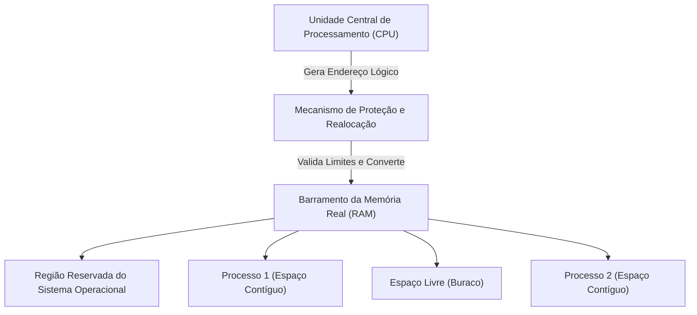
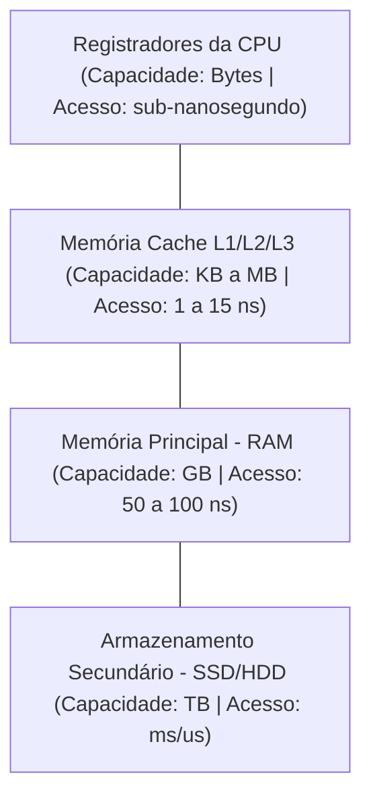
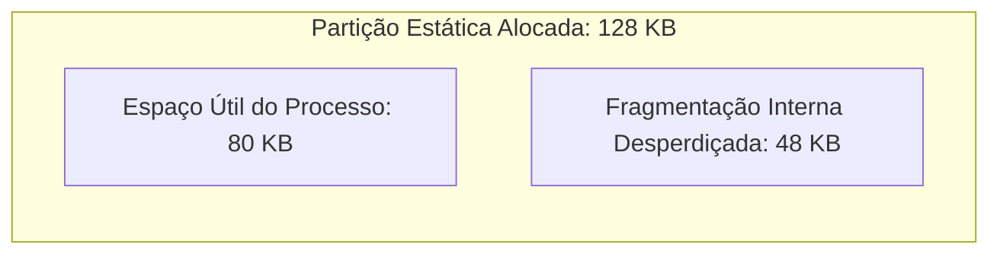
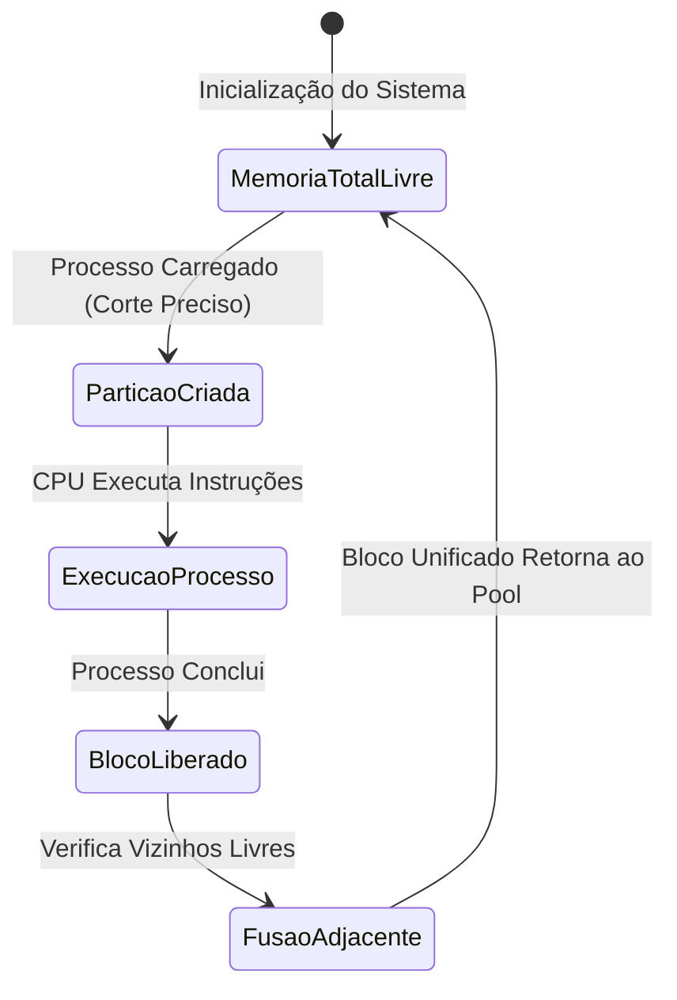
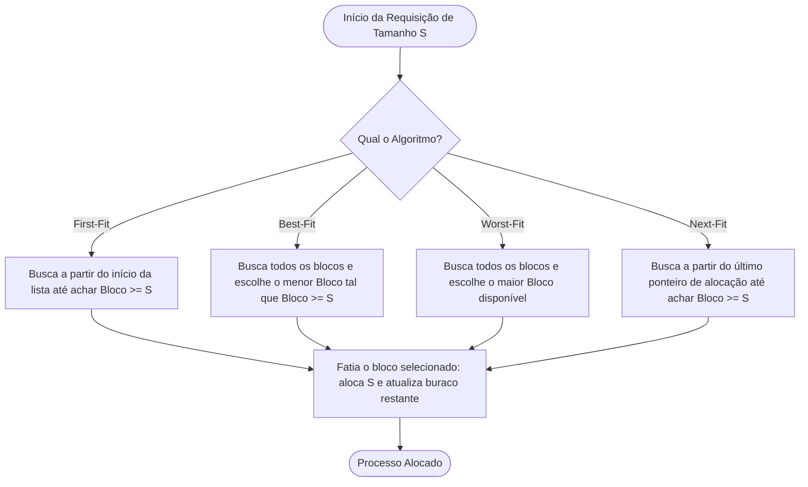
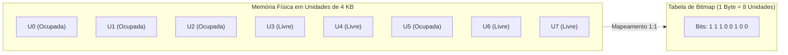
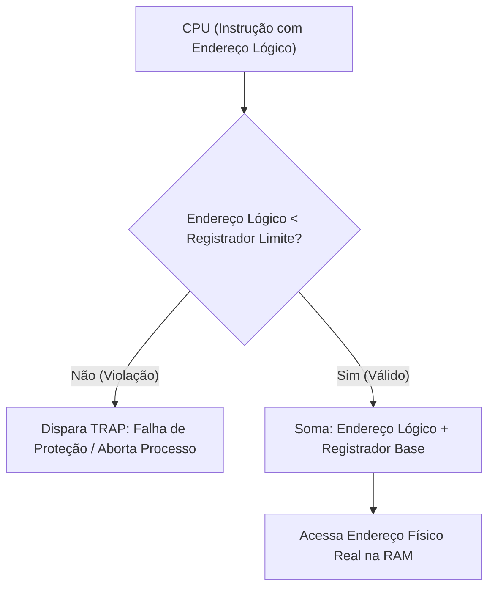
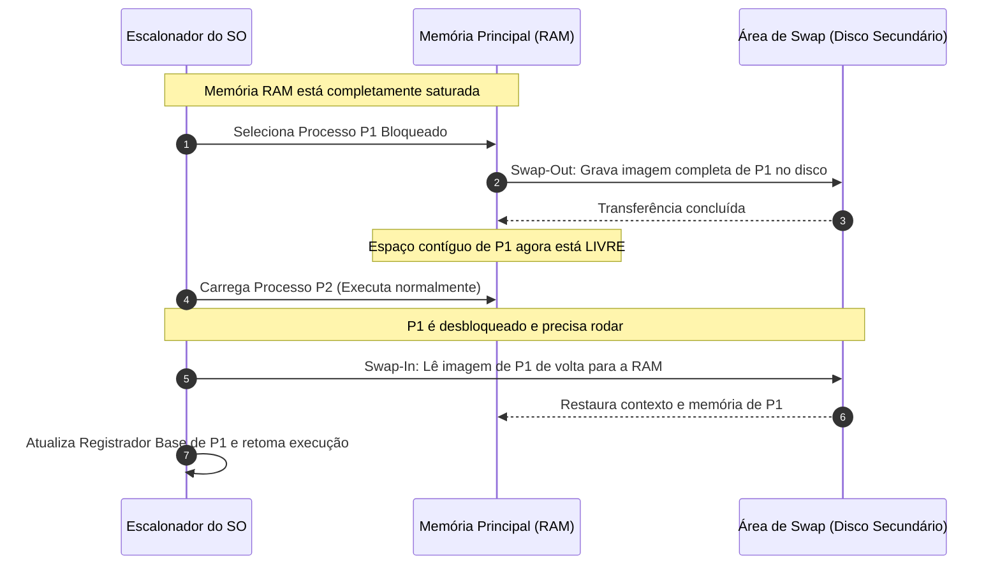
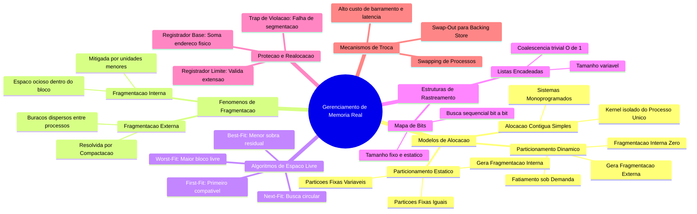

# Aula 04 — Organização e Gerenciamento da Memória Real

> **Professor:** Guilherme de Morais  
> **Disciplina:** Sistemas Operacionais (3º Semestre)  
> **Tema:** Organização e Gerenciamento da Memória Real: Alocação Contígua, Particionamento, Fragmentação, Estruturas de Controle e Mecanismos de Proteção  

## Sumário
- [Objetivo da aula](#objetivo-da-aula)
- [Contexto e pré-requisitos](#contexto-e-pré-requisitos)
- [Conceito e função do gerenciamento de memória real](#conceito-e-função-do-gerenciamento-de-memória-real)
- [Hierarquia de memória e papel da memória primária](#hierarquia-de-memória-e-papel-da-memória-primária)
- [Alocação contígua simples e sistemas monoprogramados](#alocação-contígua-simples-e-sistemas-monoprogramados)
- [Particionamento estático (partições fixas)](#particionamento-estático-partições-fixas)
- [Fragmentação interna: causas, impactos e mitigação](#fragmentação-interna-causas-impactos-e-mitigação)
- [Particionamento dinâmico (partições variáveis)](#particionamento-dinâmico-partições-variáveis)
- [Fragmentação externa e compactação de memória](#fragmentação-externa-e-compactação-de-memória)
- [Algoritmos de alocação de espaço livre: First-Fit, Best-Fit, Worst-Fit e Next-Fit](#algoritmos-de-alocação-de-espaço-livre-first-fit-best-fit-worst-fit-e-next-fit)
- [Estruturas de controle de alocação: Mapa de Bits (Bitmap)](#estruturas-de-controle-de-alocação-mapa-de-bits-bitmap)
- [Estruturas de controle de alocação: Listas Encadeadas](#estruturas-de-controle-de-alocação-listas-encadeadas)
- [Proteção e realocação de memória com Registradores Base e Limite](#proteção-e-realocação-de-memória-com-registradores-base-e-limite)
- [Swapping: conceito, operação e impacto de desempenho](#swapping-conceito-operação-e-impacto-de-desempenho)
- [Código da aula](#código-da-aula)
- [Exercícios](#exercícios)
- [Erros comuns e boas práticas](#erros-comuns-e-boas-práticas)
- [Links e materiais complementares](#links-e-materiais-complementares)
- [Mapa da aula](#mapa-da-aula)
- [Glossário](#glossário)
- [Pontos-chave para a prova](#pontos-chave-para-a-prova)
- [Perguntas e respostas (JSONL)](#perguntas-e-respostas-jsonl)
- [Checklist de revisão](#checklist-de-revisão)

---

## Objetivo da aula
Compreender os fundamentos teóricos e os mecanismos de baixo nível responsáveis pela organização e pelo gerenciamento da memória principal (RAM) em sistemas operacionais monoprogramados e multiprogramados. Ao término desta aula, o estudante será capaz de:
- Identificar o papel crítico do subsistema de gerência de memória (Memory Manager) e sua interação com o processador.
- Comparar os modelos de alocação contígua: sistemas monoprogramados, particionamento estático e particionamento dinâmico.
- Distinguir analiticamente e quantificar a fragmentação interna e a fragmentação externa.
- Implementar e simular algoritmos clássicos de alocação de espaço contíguo (First-Fit, Best-Fit, Worst-Fit e Next-Fit).
- Avaliar trade-offs de complexidade espacial e temporal entre estruturas de rastreamento baseadas em Mapa de Bits e Listas Encadeadas.
- Analisar a arquitetura de proteção e realocação dinâmica em tempo de execução via registradores de hardware (Base e Limite).
- Avaliar a operação e o impacto de latência da técnica de swapping em sistemas com restrição de memória física.

---

## Contexto e pré-requisitos
Para o pleno acompanhamento desta aula, o estudante deve dominar os conceitos fundamentais de:
1. **Estrutura Básica de Computadores:** Ciclo de busca e execução de instruções (Fetch-Decode-Execute), registradores gerais, contador de programa (PC) e barramento de dados/endereços.
2. **Conceito de Processo:** Estados de processos (Pronto, Executando, Bloqueado), Bloco de Controle de Processo (PCB) e troca de contexto (Context Switch).
3. **Aritmética Binária e Hexadecimal:** Conversões de base, cálculo de deslocamentos (offsets) e manipulação de máscaras lógicas de bits (AND, OR, SHIFT).
4. **Linguagem C Básica/Intermediária:** Manipulação de ponteiros, alocação de memória estática e estruturas de dados dinâmicas (structs e listas encadeadas).

---

## Conceito e função do gerenciamento de memória real

### Definição e Fundamentação Teórica
A memória principal, também denominada memória real ou RAM (Random Access Memory), é o repositório central de armazenamento volátil de acesso rápido onde dados e instruções de programas precisam residir para que a CPU possa executá-los diretamente. O subsistema do sistema operacional encarregado dessa infraestrutura é o **Gerenciador de Memória** (Memory Manager).

Em sistemas sem suporte a memória virtual (ou na camada física subjacente desta), o gerenciamento de memória real tem como atribuição mapear processos diretamente sobre o espaço de endereçamento físico. As quatro funções primordiais do gerenciador de memória real são:
1. **Rastreamento de Estado:** Manter o registro exato de quais partes da memória física estão ocupadas por quais processos e quais regiões estão livres.
2. **Alocação e Desalocação Dinâmica:** Fornecer espaço contíguo de memória para processos que iniciam ou solicitam expansão, e recuperar blocos quando os processos são encerrados.
3. **Proteção e Isolamento:** Impedir que um processo acesse ou sobrescreva instruções ou dados pertencentes a outros processos ou ao próprio núcleo (kernel) do sistema operacional.
4. **Realocação:** Garantir que instruções de máquina contendo referências a endereços de memória possam ser carregadas e executadas em qualquer posição física da RAM sem necessidade de recompilação do código.

### Motivação e Relevância Prática
Sem um gerenciador de memória robusto, sistemas computacionais estariam restritos à execução de uma única aplicação dedicada por vez, ou expostos a falhas catastróficas onde um ponteiro desgovernado de uma aplicação de usuário corromperia a pilha do kernel ou a memória de processos vizinhos. Em sistemas embarcados de tempo real crítico (automotivos, aviônicos e dispositivos médicos baseados em microcontroladores sem MMU completa), o gerenciamento de memória real contígua é a técnica predominante.

### Exemplo Prático de Aplicação
Em um sistema de bilhetagem eletrônica com microcontrolador Cortex-M4 e 512 KB de SRAM, o kernel RTOS (como FreeRTOS ou Zephyr) gerencia a memória real particionando os 512 KB entre o código do kernel, pilhas fixas das tarefas de leitura de cartão RFID e buffers de transmissão de rede, garantindo que nenhuma tarefa extrapole seu limite físico.

### Contraexemplo e Cenário de Inadequação
Tentar rodar um sistema de banco de dados moderno (PostgreSQL) com centenas de conexões simultâneas sobre um modelo de gerenciamento de memória real estático sem paginação ou memória virtual causaria esgotamento instantâneo da memória física utilizável devido à rigidez de alocação de blocos inteiros contíguos.

### Armadilhas Conceituais e Falhas Comuns
- **Confundir Endereço Lógico com Endereço Físico:** O endereço lógico é gerado pelo compilador/CPU durante a compilação ou execução do programa; o endereço físico corresponde à linha de seleção real nos barramentos de hardware dos chips de DRAM. No modelo real simples sem realocação dinâmica, ambos são idênticos, criando forte acoplamento com o hardware.



| Atribuição | Alocação Estática | Alocação Dinâmica |
| :--- | :--- | :--- |
| **Definição de Limites** | Tempo de compilação/carga | Tempo de execução |
| **Flexibilidade** | Nula (tamanhos pré-determinados) | Alta (ajusta-se à demanda) |
| **Complexidade do Kernel** | Mínima (tabela fixa de partições) | Moderada a alta (rastreamento de buracos) |
| **Desperdício Típico** | Fragmentação Interna severa | Fragmentação Externa |

---

## Hierarquia de memória e papel da memória primária

### Definição e Fundamentação Teórica
A arquitetura de computadores contemporânea apoia-se no princípio da **Hierarquia de Memória**, fundamentado pelo princípio da localidade temporal (itens acessados recentemente tendem a ser acessados de novo em breve) e localidade espacial (itens com endereços próximos tendem a ser acessados em sequência).

A hierarquia é estruturada em níveis piramidais:
1. **Registradores Internos da CPU:** Operam na frequência do processador (< 1 ns de latência), capacidade de poucas centenas de bytes.
2. **Memórias Cache (L1, L2, L3):** Construídas em SRAM (Static RAM), latência entre 1 e 15 ns, capacidade de alguns kilobytes a megabytes.
3. **Memória Principal Real (RAM):** Construída em DRAM (Dynamic RAM), necessita de ciclos de atualização (refresh), latência entre 50 e 100 ns, capacidade na faixa de gigabytes.
4. **Armazenamento Secundário:** Discos de Estado Sólido (NVMe/SATA SSD) e Discos Magnéticos (HDD), com latências entre 10 microssegundos (SSDs) e 10 milissegundos (HDDs), capacidade de terabytes.

### Motivação e Relevância Prática
A CPU não tem a capacidade física de endereçar e ler diretamente o disco secundário em suas instruções de cálculo (`ADD`, `MOV`, `JMP`); todas as instruções e dados manipulados pelas Unidades Lógicas e Aritméticas (ALU) precisam obrigatoriamente residir na memória principal. O custo por bit e a velocidade de propagação do sinal elétrico impõem que quanto mais rápida a memória, menor sua densidade e mais elevado seu custo por gigabyte.

### Exemplo Prático de Aplicação
Quando um processo executa um loop de processamento numérico, as variáveis escalares são carregadas em registradores, o código do laço reside na cache L1 de instrução, a matriz inteira reside na memória RAM real, e o arquivo original de dados reside no SSD.

### Contraexemplo e Cenário de Inadequação
Se um sistema operacional não carregar o binário da memória secundária para a memória principal antes da execução e tentar acessar cada instrução via barramento I/O (SATA/PCIe), a taxa de instruções por ciclo (IPC) da CPU despencaria por um fator de mais de 100.000 vezes devido ao gargalo de latência.

### Armadilhas Conceituais e Falhas Comuns
- **Acreditar que a RAM é infinita e uniforme:** O acesso à RAM não tem o mesmo tempo de latência que a cache; ciclos de espera (wait states) ocorrem constantemente quando a CPU sofre um cache miss e precisa buscar dados na DRAM real.



| Nível da Hierarquia | Tecnologia | Tempo Típico de Acesso | Custo por Gigabyte | Gerenciado por |
| :--- | :--- | :--- | :--- | :--- |
| **Registradores** | Portas lógicas no núcleo | < 1 ns | Altíssimo | Compilador / CPU |
| **Cache (L1/L2/L3)** | SRAM | 1 - 20 ns | Alto | Hardware de Cache |
| **Memória Real (RAM)** | DRAM síncrona (DDR) | 50 - 100 ns | Médio | Sistema Operacional |
| **Armazenamento** | Flash NAND / Magnético | 10 us - 10 ms | Baixo | SO / Sistema de Arquivos |

---

## Alocação contígua simples e sistemas monoprogramados

### Definição e Fundamentação Teórica
A **Alocação Contígua Simples** é a técnica mais primitiva de organização de memória real. Nesse arranjo, a memória física total é dividida em estritamente duas regiões contíguas:
1. **Região do Sistema Operacional:** Geralmente localizada no início da memória física (endereços baixos, como `0x0000`) ou no topo da memória (endereços altos), onde residem as rotinas do kernel e os tratadores de interrupção.
2. **Região do Usuário:** O restante contíguo da memória física, reservado integralmente para a execução de um único processo de cada vez.

Neste cenário de monoprogramação, o grau de multiprogramação é exatamente 1 ($N=1$). A CPU fica inteiramente dedicada a esse único processo até seu término.

### Motivação e Relevância Prática
Historicamente empregado no sistema MS-DOS e nos primórdios da computação mainframe em lote (batch processing). Hoje em dia, essa abordagem ainda é adotada em sistemas embutidos ultra-simples com microcontroladores de 8 bits (como arquiteturas Microchip PIC ou AVR de uso automotivo e industrial pontual), onde não há concorrência de tarefas e o custo de controle de memória precisa ser zero.

### Exemplo Prático de Aplicação
No ambiente do MS-DOS versão 3.3, a memória convencional de 640 KB era dividida entre o núcleo do DOS (carregado nos endereços inferiores), drivers residentes (TSRs) e o restante disponível para carregar um único aplicativo, como uma planilha eletrônica Lotus 1-2-3 ou um editor de texto WordPerfect.

### Contraexemplo e Cenário de Inadequação
Em uma estação de trabalho moderna ou servidor corporativo, adotar a alocação contígua simples implicaria que, enquanto o usuário compila um programa ou aguarda uma resposta de rede, a máquina não poderia sequer renderizar a interface gráfica ou responder a um ping, deixando 99% da memória e do poder de cálculo ociosos.

### Armadilhas Conceituais e Falhas Comuns
- **Presumir que não há proteção em sistemas monoprogramados:** Embora o MS-DOS não possuísse proteção por limitações do chip Intel 8086, sistemas monoprogramados podem utilizar um registrador limite por hardware para impedir que o aplicativo do usuário sobrescreva a porção da memória pertencente aos vetores de interrupção do sistema operacional.


| Característica | Alocação Contígua Simples |
| :--- | :--- |
| **Grau de Multiprogramação** | 1 processo simultâneo |
| **Aproveitamento da CPU** | Baixo (CPU bloqueia em operações de I/O) |
| **Complexidade de Algoritmo** | Praticamente nula (endereço base fixo) |
| **Hardware Necessário** | Mínimo (pode operar sem registradores de realocação) |

---

## Particionamento estático (partições fixas)

### Definição e Fundamentação Teórica
Para contornar o baixo aproveitamento da CPU e da memória dos sistemas monoprogramados, surgiu o **Particionamento Estático** (ou partições fixas). A memória física é dividida, durante a inicialização do sistema ou configuração manual do operador, em $M$ partições de tamanhos fixos.

Essas partições podem ter:
- **Tamanhos Iguais:** Todas as partições possuem exatamente o mesmo tamanho (exemplo: memória de 1024 KB dividida em 4 partições de 256 KB).
- **Tamanhos Diferentes:** As partições possuem capacidades distintas (exemplo: uma partição de 64 KB, duas de 128 KB, uma de 256 KB e uma de 512 KB), permitindo acomodar processos de variadas demandas.

Uma vez definidas as partições, suas fronteiras físicas permanecem inalteradas ao longo de toda a operação do sistema operacional. Cada partição só pode conter exatamente um processo por vez.

### Motivação e Relevância Prática
A introdução do particionamento estático permitiu elevar o grau de multiprogramação de 1 para $M$. Quando o processo na Partição 1 entra em estado de espera por uma operação de disco ou fita magnética, a CPU pode ser chaveada pelo escalonador para executar o processo alocado na Partição 2, elevando substancialmente a vazão (throughput) do hardware.

### Exemplo Prático de Aplicação
O sistema operacional IBM OS/360 MFT (*Multiprogramming with a Fixed number of Tasks*) utilizava particionamento estático configurado no momento da instalação. Operadores de sistemas em centros de processamento de dados alocavam partições maiores para rotinas contábeis de final de mês e partições menores para leitores de cartões perfurados.

### Contraexemplo e Cenário de Inadequação
Se uma partição fixa foi configurada com 256 KB e chega para execução um processo que necessita de 260 KB, o processo simplesmente não pode ser executado, a menos que seja reestruturado pelo desenvolvedor por meio de técnicas manuais complexas de sobreposição de código (*overlays*).

### Armadilhas Conceituais e Falhas Comuns
- **Acreditar que partição estática de tamanhos diferentes elimina o desperdício:** Mesmo com tamanhos heterogêneos, a divisão continua pré-fixada. Se um processo de 10 KB for colocado em uma partição de 64 KB, os 54 KB restantes ficam inutilizados por qualquer outro processo enquanto durar essa alocação.


| Abordagem | Vantagens | Desvantagens |
| :--- | :--- | :--- |
| **Partições Fixas Iguais** | Extrema simplicidade de implementação; qualquer processo cabe em qualquer partição livre compatível. | Processos pequenos sofrem fragmentação interna gigantesca; processos maiores que o tamanho da partição não executam. |
| **Partições Fixas Diferentes** | Reduz a fragmentação interna média alocando processos em partições mais próximas do seu tamanho. | Gerenciamento de filas complexo (fila única vs fila por partição) e risco de starvation em partições disputadas. |

---

## Fragmentação interna: causas, impactos e mitigação

### Definição e Fundamentação Teórica
A **Fragmentação Interna** ocorre quando a quantidade de memória alocada a um processo é estritamente maior do que a quantidade de memória efetivamente requerida por ele. O excedente fica compreendido *dentro* da partição alocada ao processo, mas permanece completamente inacessível ao sistema operacional para alocar a qualquer outro programa.

Matematicamente, se uma partição $i$ possui tamanho $S_{part}(i)$ e o processo $j$ alocado nela requer $S_{proc}(j)$, a fragmentação interna $FI$ gerada nessa partição é definida por:

$$FI(i) = S_{part}(i) - S_{proc}(j), \quad \text{onde } S_{part}(i) \ge S_{proc}(j)$$

A fragmentação interna total do sistema é o somatório das perdas em todas as partições ativas:

$$FI_{total} = \sum_{i=1}^{M} (S_{part}(i) - S_{proc}(j))$$

### Motivação e Relevância Prática
A análise de fragmentação interna é indispensável para o dimensionamento de qualquer sistema que empregue alocação em blocos discretos (como particionamento fixo, sistemas de paginação com páginas de 4 KB ou alocadores de blocos em kernel como o *Buddy Allocator*).

### Exemplo Prático de Aplicação
Suponha um sistema com partições fixas de 64 KB. Um utilitário de impressão que demanda apenas 4 KB é carregado nessa partição. A fragmentação interna é:
$$FI = 64\text{ KB} - 4\text{ KB} = 60\text{ KB}$$
Isso significa que 93,75% da capacidade daquela partição está completamente desperdiçada, não podendo ser aproveitada nem pelo utilitário, nem pelo kernel, nem por outro processo da fila.

### Contraexemplo e Cenário de Inadequação
Um cenário onde um processo demanda 64 KB e a partição possui exatamente 64 KB apresenta $FI = 0\text{ KB}$. No entanto, assumir que essa condição ideal ocorre de forma geral na prática é uma falha de modelagem estatística.

### Armadilhas Conceituais e Falhas Comuns
- **Achar que compactação resolve fragmentação interna:** A compactação desloca blocos pela memória para juntar buracos livres contíguos (resolvendo fragmentação *externa*). Ela não altera o tamanho interno das partições fixas nem os limites de um bloco já alocado a um processo.



| Elemento de Análise | Descrição |
| :--- | :--- |
| **Origem Física** | Imposição de fronteiras rígidas de alocação de tamanho superior à necessidade real. |
| **Localização** | No interior da partição ou bloco atribuído ao processo. |
| **Visibilidade** | Transparente para o processo, mas contabilizado como perda líquida de capacidade pelo SO. |
| **Formas de Mitigação** | Uso de partições com múltiplos tamanhos calibrados por telemetria; transição para particionamento dinâmico. |

---

## Particionamento dinâmico (partições variáveis)

### Definição e Fundamentação Teórica
No **Particionamento Dinâmico** (ou partições variáveis), as partições de memória não são pré-configuradas no boot do sistema. Em vez disso, as partições são criadas dinamicamente no exato momento da carga do processo, com a partição recebendo um tamanho rigorosamente idêntico ao solicitado pelo processo.

Inicialmente, toda a memória disponível para o usuário forma um único bloco livre contíguo denominado *buraco* (hole) ou bloco livre. À medida que processos chegam, o sistema operacional fatia o espaço disponível na quantidade exata requerida. Quando um processo encerra, o bloco ocupado é devolvido à lista de blocos livres. Se o bloco recém-liberado for adjacente a outro bloco livre, ambos são imediatamente fundidos (coalescidos) em um único bloco livre contíguo maior.

### Motivação e Relevância Prática
A motivação primordial do particionamento dinâmico é a erradicação completa da fragmentação interna primária. Como cada processo recebe exatamente o montante de bytes que requisitou, $S_{part} = S_{proc}$, o que resulta em:
$$FI = 0$$

### Exemplo Prático de Aplicação
O sistema IBM OS/360 MVT (*Multiprogramming with a Variable number of Tasks*) foi projetado para substituir o MFT, permitindo que a memória física fosse fatiada dinamicamente para acomodar processos com demandas completamente variáveis ao longo do dia de processamento.

### Contraexemplo e Cenário de Inadequação
Após várias horas de execução ininterrupta com processos de diferentes tamanhos sendo criados e finalizados em momentos assíncronos, a memória torna-se um mosaico de pequenos fragmentos livres espalhados entre blocos ocupados. O sistema pode somar 100 MB de memória livre total, mas se o maior bloco contíguo for de 20 MB, um processo que precise de 25 MB não poderá ser carregado.

### Armadilhas Conceituais e Falhas Comuns
- **Acreditar que a coalescência automática resolve todos os problemas:** A fusão de blocos livres vizinhos só é possível se os blocos adjacentes estiverem *fisicamente lado a lado*. Se houver processos em execução separando os blocos livres, eles não podem ser fundidos sem a movimentação física desses processos.



| Propriedade | Particionamento Estático | Particionamento Dinâmico |
| :--- | :--- | :--- |
| **Criação das Partições** | Na inicialização do SO | Em tempo de execução sob demanda |
| **Tamanho da Partição** | Fixo e constante | Variável (ajustado ao processo) |
| **Fragmentação Interna** | Alta | Nula ($FI = 0$) |
| **Fragmentação Externa** | Inexistente (se houver partição, ela cabe) | Alta (surge com o tempo de uso) |

---

## Fragmentação externa e compactação de memória

### Definição e Fundamentação Teórica
A **Fragmentação Externa** surge quando o espaço de memória livre total é teoricamente suficiente para atender a uma requisição de alocação de um novo processo, mas esse espaço está fragmentado em pequenos blocos não contíguos espalhados por todo o espaço físico. Como a alocação contígua real exige que todas as instruções e dados do processo fiquem em uma sequência ininterrupta de endereços físicos, o processo não pode ser carregado.

A relação empírica conhecida como **Regra dos 50%** (formulada por Donald Knuth) postula que, em sistemas com alocação dinâmica contígua operando em regime estável: se $N$ blocos alocados estão presentes na memória, haverá aproximadamente $0.5 \times N$ blocos livres (buracos) intercalados entre eles, resultando em cerca de um terço de toda a memória perdida devido à fragmentação externa.

A solução clássica dentro do modelo contíguo é a **Compactação de Memória** (defragmentação da RAM): o sistema operacional suspende temporariamente os processos ativos e move todos os blocos ocupados para uma das extremidades da memória física (por exemplo, endereços baixos), consolidando todos os pequenos buracos dispersos em um único grande bloco livre contíguo na outra extremidade.

### Motivação e Relevância Prática
A compactação permite recuperar a capacidade do sistema de carregar processos de grande porte sem descartar tarefas em execução. No entanto, ela introduz um custo computacional elevadíssimo de movimentação de dados pelo barramento de memória.

### Exemplo Prático de Aplicação
Considere uma memória de 1000 KB contendo o kernel (200 KB) e três processos de 200 KB cada, intercalados com três buracos livres de 66,6 KB cada (total de 200 KB livres). Um processo de 180 KB chega. Mesmo havendo 200 KB livres no total, nenhum buraco individual suporta 180 KB. A compactação copia os processos ocupados para posições contíguas, gerando um bloco contíguo final de 200 KB, onde o novo processo pode ser alocado com sucesso.

### Contraexemplo e Cenário de Inadequação
A compactação é impossível se a arquitetura do processador e o sistema operacional utilizarem **vinculação estática de endereços no momento da compilação ou da carga** (endereços absolutos). Se um ponteiro contiver o valor literal `0x4000` embutido no código de máquina e o processo for movido para o endereço físico `0x8000`, a execução do programa falhará imediatamente ao ler ou escrever no endereço antigo. A compactação exige obrigatoriamente **vinculação dinâmica em tempo de execução** com suporte de hardware (registradores base).

### Armadilhas Conceituais e Falhas Comuns
- **Ignorar o custo temporal da compactação:** A compactação bloqueia o sistema (tempo de latência crítica onde nenhum processo avança). Se um sistema com 32 GB de RAM precisar compactar 16 GB a uma taxa efetiva de barramento de memória de 8 GB/s (leitura e escrita combinada), o sistema sofrerá uma paralisação completa de 2 segundos, o que é inaceitável em aplicações interativas ou de tempo real.


| Métrica | Fragmentação Interna | Fragmentação Externa |
| :--- | :--- | :--- |
| **Causa Primária** | Alocação de blocos em tamanhos pré-fixados. | Alocação e desalocação dinâmica contínua de tamanhos heterogêneos. |
| **Espaço Perdido** | Interno à partição alocada ao processo. | Externo aos processos (entre partições ocupadas). |
| **Solução Típica** | Reduzir granularidade da partição ou usar alocação dinâmica. | Compactação de memória ou adoção de paginação/segmentação. |
| **Sobrecarga de CPU na Solução** | Nenhuma. | Altíssima (cópia massiva de gigabytes de memória). |

---

## Algoritmos de alocação de espaço livre: First-Fit, Best-Fit, Worst-Fit e Next-Fit

### Definição e Fundamentação Teórica
Quando o particionamento dinâmico é adotado, o gerenciador de memória precisa consultar uma lista de blocos livres para decidir em qual buraco posicionar um processo que requer $S$ bytes. Os quatro algoritmos clássicos de seleção são:

1. **First-Fit (Primeiro Encaixe):** Varre a lista de blocos livres desde o início e aloca o processo no *primeiro* buraco encontrado que seja grande o suficiente ($Tamanho \ge S$). O buraco é fatiado em duas partes: uma correspondente ao tamanho do processo e a sobra, que permanece na lista de livres.
2. **Best-Fit (Melhor Encaixe):** Percorre a lista inteira de blocos livres (ou utiliza uma lista ordenada por tamanho) e escolhe o buraco cujo tamanho seja o *mais próximo possível* de $S$, ou seja, aquele que minimiza a sobra residual ($Tamanho - S$).
3. **Worst-Fit (Pior Encaixe):** Percorre toda a memória e aloca o processo no *maior* buraco disponível. A filosofia teórica é que, ao quebrar o maior buraco, a sobra residual será grande o suficiente para ainda ser útil para outros processos futuros.
4. **Next-Fit (Próximo Encaixe):** Semelhante ao First-Fit, mas não reinicia a busca do início da memória. Ele mantém um ponteiro indicando onde ocorreu a última alocação e inicia a busca a partir daquele ponto em diante (com comportamento circular).

### Motivação e Relevância Prática
A escolha do algoritmo impacta diretamente a velocidade de alocação (tempo de processamento do kernel) e o padrão de fragmentação externa ao longo do ciclo de vida do sistema operacional.

### Exemplo Prático de Aplicação
Em alocadores de memória padrão em C de nível de usuário (`malloc` em glibc) e alocadores de kernel antigos, variações de First-Fit e Best-Fit são historicamente implementadas com listas duplamente encadeadas e árvores balanceadas para minimizar o tempo de busca em chamadas de sistema.

### Contraexemplo e Cenário de Inadequação
O Worst-Fit frequentemente apresenta o pior desempenho prático em simulações estatísticas. Ao fatiar sistematicamente os maiores blocos livres disponíveis, ele rapidamente destrói os únicos buracos que poderiam acomodar processos de grande porte no futuro, gerando grande quantidade de fragmentos medianos e inviabilizando cargas grandes sem compactação.

### Armadilhas Conceituais e Falhas Comuns
- **Acreditar que o Best-Fit é sempre a melhor escolha:** Embora o nome sugira superioridade, o Best-Fit percorre toda a lista a cada alocação (mais lento, a menos que a lista esteja ordenada) e tende a gerar uma enorme quantidade de sobras minúsculas (exemplo: buracos de 2 ou 4 bytes), que raramente serão úteis para qualquer processo, saturando a tabela de controle.



| Algoritmo | Complexidade de Busca | Resíduo Típico de Fragmentação | Desempenho Geral |
| :--- | :--- | :--- | :--- |
| **First-Fit** | $O(N)$ no pior caso, rápido na média | Varia ao longo do início da memória | Geralmente o mais rápido e com menor fragmentação agregada. |
| **Best-Fit** | $O(N)$ em lista linear ou $O(\log N)$ em árvore | Sobras minúsculas e inúteis (micro-buracos) | Ligeiramente mais lento; degrada a memória com resíduos microscópicos. |
| **Worst-Fit** | $O(N)$ em lista linear ou $O(1)$ com heap máx | Sobras maiores teoricamente reutilizáveis | Desempenho prático fraco; elimina precocemente os blocos grandes. |
| **Next-Fit** | $O(N)$ no pior caso | Distribui fragmentos por toda a memória | Ligeiramente pior que First-Fit por quebrar blocos livres no final da RAM. |

---

## Estruturas de controle de alocação: Mapa de Bits (Bitmap)

### Definição e Fundamentação Teórica
O **Mapa de Bits (Bitmap)** é uma estrutura de dados de controle na qual a memória física total é rigorosamente subdividida em pequenas unidades de alocação de tamanho uniforme e fixo (por exemplo, unidades de 512 bytes, 1 KB ou 4 KB).

Para cada unidade de alocação física, existe exatamente **1 bit correspondente** no mapa de bits mantido pelo kernel:
- O bit contém o valor **0** se a unidade correspondente estiver **livre**.
- O bit contém o valor **1** se a unidade correspondente estiver **ocupada** por um processo.

O tamanho do mapa de bits depende exclusivamente do tamanho total da memória física a ser gerenciada ($M_{total}$) e do tamanho da unidade de alocação elementar ($U_{aloc}$):

$$\text{Número de bits do Mapa} = \frac{M_{total}}{U_{aloc}}$$

$$\text{Tamanho do Bitmap em Bytes} = \frac{M_{total}}{U_{aloc} \times 8}$$

### Motivação e Relevância Prática
A principal virtude do mapa de bits é que seu tamanho em memória é rigorosamente fixo, previsível e invariante em relação à quantidade de processos em execução. Além disso, a perda percentual de memória para armazenar o próprio mapa é insignificante se a unidade for dimensionada adequadamente.

### Exemplo Prático de Aplicação
Se gerenciarmos uma memória física de 1 GB com unidades de alocação de 4 KB:
$$\text{Número de unidades} = \frac{1\text{ GB}}{4\text{ KB}} = \frac{1.048.576\text{ KB}}{4\text{ KB}} = 262.144\text{ unidades}$$
$$\text{Tamanho do Bitmap} = \frac{262.144\text{ bits}}{8} = 32.768\text{ bytes} = 32\text{ KB}$$
O sistema gasta apenas 32 KB de RAM (cerca de 0,003% da memória física) para rastrear o estado de toda a memória de 1 GB.

### Contraexemplo e Cenário de Inadequação
Para alocar um processo que demanda um bloco contíguo de tamanho $K$ unidades, o gerenciador de memória é forçado a percorrer o mapa de bits sequencialmente procurando por uma sequência ininterrupta de $K$ bits `0` consecutivos. No pior caso, essa busca requer examinar milhares de palavras no mapa de bits, resultando em uma operação $O(N)$ lenta e custosa em termos de instruções de processador.

### Armadilhas Conceituais e Falhas Comuns
- **Diminuir excessivamente a unidade de alocação:** Se a unidade for de 1 byte, o mapa de bits precisará de 1 bit para cada byte (1/8 da RAM total, ou 12,5% de consumo puro de overhead). Se for muito grande (ex: 64 KB), a fragmentação interna dentro da unidade de alocação anula o benefício do particionamento dinâmico.



| Parâmetro | Unidade de Alocação Pequena | Unidade de Alocação Grande |
| :--- | :--- | :--- |
| **Tamanho do Bitmap** | Grande (maior consumo de RAM do SO) | Pequeno (baixo overhead de controle) |
| **Fragmentação Interna** | Mínima dentro de cada fatia | Elevada (último bloco do processo sobra) |
| **Velocidade de Busca** | Muito lenta (milhões de bits para analisar) | Mais rápida (poucos bits no mapa) |

---

## Estruturas de controle de alocação: Listas Encadeadas

### Definição e Fundamentação Teórica
O controle por **Listas Encadeadas** mantém uma lista linear (simples ou duplamente encadeada) de nós de dados, onde cada nó representa de forma explícita um segmento contínuo da memória física, seja ele um segmento ocupado por um processo ou um segmento livre (buraco).

Cada nó da estrutura normalmente armazena quatro campos essenciais:
1. **Tipo/Identificador de Estado:** Um caractere ou flag indicando `P` (Processo/Ocupado) ou `H` (Hole/Livre).
2. **Endereço Base Inicial:** O endereço físico inicial do segmento na memória física.
3. **Comprimento/Tamanho:** A quantidade de bytes ou blocos contidos naquele segmento.
4. **Ponteiro(s) de Enlace:** Ponteiro para o próximo nó da lista (`next`) e, opcionalmente, para o nó anterior (`prev`).

Quando um processo encerra, o nó correspondente é alterado de `P` para `H`. O gerenciador imediatamente inspeciona os nós vizinhos na lista:
- Se o nó imediatamente anterior for `H`, funde ambos em um nó só.
- Se o nó imediatamente posterior for `H`, funde ambos em um nó só.
- Se ambos forem `H`, unifica os três nós em um único nó de buraco maior.

### Motivação e Relevância Prática
A busca por espaço livre torna-se direta: o kernel não precisa inspecionar bits individuais, bastando ler os nós marcados como `H` e testar a condição `comprimento >= requisicao`. A coalescência de buracos é trivial e executada em tempo constante $O(1)$ quando a lista é duplamente encadeada e ordenada por endereço físico.

### Exemplo Prático de Aplicação
A representação conceitual de uma memória de 100 KB com o SO (20 KB), P1 (30 KB), um buraco de 10 KB e P2 (40 KB) é expressa como:
`[P, 0, 20] <-> [P, 20, 30] <-> [H, 50, 10] <-> [P, 60, 40]`

Se P1 for finalizado, seu nó se torna `[H, 20, 30]`. Por ter como vizinho posterior outro nó `H` (`[H, 50, 10]`), a lista é atualizada para:
`[P, 0, 20] <-> [H, 20, 40] <-> [P, 60, 40]`

### Contraexemplo e Cenário de Inadequação
Se o sistema apresentar alta rotatividade de processos com muita fragmentação, a lista encadeada pode crescer para milhares de nós. Como cada nó ocupa espaço em memória (normalmente 16 a 32 bytes por nó em arquiteturas de 64 bits), a quantidade de memória gasta exclusivamente para armazenar ponteiros e metadados de controle pode ultrapassar amplamente o tamanho fixo de um mapa de bits.

### Armadilhas Conceituais e Falhas Comuns
- **Manter listas separadas de buracos e processos sem sincronização:** Se o kernel mantém duas listas distintas (uma só de processos e outra só de blocos livres para acelerar o First-Fit), a desalocação exige localizar o nó na lista de processos, removê-lo, inseri-lo na ordem de endereço na lista de buracos e verificar vizinhança, o que encarece o algoritmo de término de processos.


| Critério | Mapa de Bits (Bitmap) | Listas Encadeadas |
| :--- | :--- | :--- |
| **Consumo de Memória de Controle** | Fixo e estático: $\approx M / (U \times 8)$ | Variável: proporcional ao número de segmentos $N \times \text{tam\_nó}$ |
| **Velocidade de Busca de Espaço** | Lenta ($O(N)$ em varredura de bits) | Rápida nos nós livres |
| **Fusão de Blocos Adjacentes** | Implícita (basta limpar os bits para 0) | Explícita (requer coalescência de nós vizinhos) |
| **Sensibilidade à Fragmentação** | Nenhuma (tamanho do mapa não muda) | Alta (mais nós criados aumentam o overhead) |

---

## Proteção e realocação de memória com Registradores Base e Limite

### Definição e Fundamentação Teórica
A coexistência de múltiplos processos na memória real exige garantias absolutas de que um processo não possa ler nem corromper as áreas de memória dos demais processos ou do kernel. A solução arquitetural clássica é a introdução de um circuito de hardware na CPU/MMU contendo um par de registradores dedicados:
1. **Registrador Base (ou Registrador de Realocação):** Armazena o endereço físico inicial onde o processo foi carregado na memória RAM.
2. **Registrador Limite (ou Registrador de Extensão):** Armazena o tamanho total alocado ao processo (ou o endereço lógico máximo permitido).

Quando a CPU gera um **endereço lógico** (ou endereço relativo, gerado pelas instruções de máquina no intervalo $[0, \text{Limite}-1]$):
1. O hardware compara: o endereço lógico é estritamente menor que o registrador Limite?
   - Se for maior ou igual ($\text{Endereço Lógico} \ge \text{Limite}$), o hardware aborta imediatamente a operação e dispara uma interrupção de hardware especial (**Trap por Violação de Acesso / Falha de Proteção**), transferindo o controle ao kernel para terminar o processo com um erro de *Segmentation Fault*.
2. Se o endereço for válido, o hardware soma: $\text{Endereço Físico} = \text{Endereço Lógico} + \text{Registrador Base}$.
3. O endereço físico resultante é então enviado ao barramento de memória da RAM.

### Motivação e Relevância Prática
Esse mecanismo oferece dois benefícios simultâneos:
- **Proteção Total:** Nenhum processo consegue gerar um endereço físico que extrapole o espaço compreendido entre $\text{Base}$ e $\text{Base} + \text{Limite} - 1$.
- **Realocação Dinâmica:** O programa pode ser movido para qualquer lugar físico da memória durante sua execução (como em uma operação de compactação). O sistema operacional precisa apenas atualizar o valor do Registrador Base no PCB do processo antes de restaurar seu contexto de execução.

### Exemplo Prático de Aplicação
Um processo com limite de 10.000 bytes é carregado no endereço físico base 50.000.
- Se o processo tentar ler a instrução no endereço lógico 1.200:
  $1.200 < 10.000$ (Válido). Endereço Físico acessado = $50.000 + 1.200 = 51.200$.
- Se um loop com ponteiro desgovernado tentar escrever no endereço lógico 10.500:
  $10.500 \ge 10.000$ (Inválido). O circuito de hardware bloqueia a escrita na RAM e congela o processo, gerando interrupção para o SO punir a aplicação.

### Contraexemplo e Cenário de Inadequação
O esquema clássico de registrador Base e Limite assume que o programa é alocado de forma **monolítica e contígua**. Se o processo desejar compartilhar uma biblioteca de código com outro processo (como a libc compartilhada) ou se a pilha (stack) e a heap precisarem crescer em direções opostas com espaços vazios entre elas, a estrutura rígida de um único par base/limite falha, exigindo múltiplos pares de registradores (origem da arquitetura de *Segmentação*).

### Armadilhas Conceituais e Falhas Comuns
- **Implementação do Registrador Limite como Endereço Absoluto:** Em algumas arquiteturas históricas, o registrador limite continha o endereço físico final ($\text{Base} + \text{Tamanho}$). Nesse caso, o teste do hardware é $\text{Endereço Físico} \le \text{Limite}$. O estudante deve sempre verificar se a especificação da arquitetura define o Limite como *comprimento relativo* ou como *endereço físico teto*.



| Componente | Função no Ciclo de Instrução | Responsável pela Configuração |
| :--- | :--- | :--- |
| **Registrador Base** | Converte endereço lógico relativo em endereço físico real. | Sistema Operacional durante a troca de contexto. |
| **Registrador Limite** | Impede acesso a posições fora do bloco reservado ao processo. | Sistema Operacional ao alocar a memória do processo. |
| **Unidade de Comparação** | Circuito combinacional na CPU que valida a inequação em hardware. | Hardware da CPU/MMU em tempo real (< 1 ciclo). |

---

## Swapping: conceito, operação e impacto de desempenho

### Definição e Fundamentação Teórica
O **Swapping** (troca de processos) é uma técnica de gerenciamento de memória em que processos inteiros são temporariamente transferidos da memória principal para uma área reservada de armazenamento secundário (denominada área de swap ou *backing store*), e posteriormente trazidos de volta para a memória principal para continuar sua execução.

A operação envolve duas etapas principais:
1. **Swap-Out:** O escalonador de médio prazo seleciona um processo que está bloqueado (por exemplo, aguardando entrada do usuário ou temporizador) ou de baixa prioridade, grava toda a sua imagem de memória (código, dados, pilha e registradores salvos) no disco e libera sua partição de memória real.
2. **Swap-In:** Quando há memória real livre disponível e o processo suspenso volta a ficar elegível para executar (estado Pronto), o sistema lê sua imagem do disco e a recarrega na memória RAM.

### Motivação e Relevância Prática
O swapping permite que o sistema operacional atenda a um grau de multiprogramação total que excede fisicamente a capacidade da RAM instalada. Ele garante que sistemas com pouca memória não entrem em pane (*deadlock* por falta de memória) quando múltiplos processos precisam coexistir.

### Exemplo Prático de Aplicação
Em sistemas UNIX tradicionais e em variantes de Linux embarcado, o subsistema de swapping é ativado quando o consumo de memória física atinge limites críticos (*watermarks*), descarregando da RAM serviços em segundo plano (daemons inativos) para que a aplicação em primeiro plano responda sem interrupções.

### Contraexemplo e Cenário de Inadequação
Utilizar swapping para processos que realizam operações ativas de I/O via DMA (Direct Memory Access). Se o processo P1 solicitou uma leitura de rede diretamente para seu buffer de memória e o sistema operacional faz o swap-out de P1 para o disco antes da conclusão da transferência, o controlador de DMA gravará os pacotes de rede na memória RAM física que agora pode ter sido entregue a um novo processo P2, corrompendo a memória de P2. Para evitar isso, as regiões de I/O precisam ser obrigatoriamente travadas em RAM (*memory pinning*).

### Armadilhas Conceituais e Falhas Comuns
- **Subestimar o impacto abissal de desempenho do swapping:** Como as unidades de disco operam em escalas de milissegundos ou microssegundos (contra nanossegundos da RAM), o tempo gasto no swap-out e swap-in domina completamente o tempo de processamento. Se o sistema passar mais tempo fazendo swapping de processos do que executando instruções úteis, ele entra em colapso de desempenho (*Thrashing*).



| Etapa | Operação Envolvida | Meio Físico | Impacto Típico de Tempo |
| :--- | :--- | :--- | :--- |
| **Execução Normal** | Leitura/Escrita de Dados da CPU | Barramento DRAM | $\approx 50\text{ a }100\text{ ns}$ |
| **Troca de Contexto Normal** | Salvar e restaurar registradores no PCB | RAM | $\approx 1\text{ a }5\text{ }\mu\text{s}$ |
| **Swap-Out / Swap-In (100 MB)** | Transferência massiva sequencial | Barramento de Disco / SSD | $\approx 20\text{ a }100\text{ ms}$ (Ordens de magnitude mais lento) |

---

## Código da aula

Nesta seção, apresentamos a implementação em linguagem C de um simulador didático de alocação de memória real. O código demonstra o controle de blocos por **Lista Duplamente Encadeada**, implementando a busca por **First-Fit** e o mecanismo de **Coalescência de Buracos Livres Adjacentes** em tempo constante durante a liberação.

```c
#include <stdio.h>
#include <stdlib.h>
#include <stdbool.h>

/* Definição do tipo de nó para controle de segmentos de memória */
typedef struct MemoryBlock {
    int id_processo;          /* -1 se o bloco for LIVRE (Hole); >= 0 se for PROCESSO */
    size_t endereco_base;     /* Endereço físico inicial do bloco */
    size_t tamanho;           /* Tamanho do bloco em kilobytes */
    struct MemoryBlock* prev; /* Enlace para o bloco imediatamente anterior */
    struct MemoryBlock* next; /* Enlace para o bloco imediatamente posterior */
} MemoryBlock;

/* Cabeça da lista encadeada global */
MemoryBlock* cabeca_memoria = NULL;

/* Inicializa a memória com um único grande bloco livre */
void inicializar_memoria(size_t tamanho_total) {
    cabeca_memoria = (MemoryBlock*)malloc(sizeof(MemoryBlock));
    cabeca_memoria->id_processo = -1; /* Inicialmente livre */
    cabeca_memoria->endereco_base = 0;
    cabeca_memoria->tamanho = tamanho_total;
    cabeca_memoria->prev = NULL;
    cabeca_memoria->next = NULL;
}

/* Algoritmo First-Fit para alocação de processos */
bool alocar_first_fit(int id_proc, size_t tamanho_req) {
    MemoryBlock* atual = cabeca_memoria;

    while (atual != NULL) {
        /* Verifica se o bloco atual está livre e se comporta a demanda */
        if (atual->id_processo == -1 && atual->tamanho >= tamanho_req) {
            if (atual->tamanho == tamanho_req) {
                /* Ajuste exato: não gera resíduo de buraco */
                atual->id_processo = id_proc;
            } else {
                /* Particionamento dinâmico: divide o bloco em alocado e sobra */
                MemoryBlock* sobra = (MemoryBlock*)malloc(sizeof(MemoryBlock));
                sobra->id_processo = -1;
                sobra->endereco_base = atual->endereco_base + tamanho_req;
                sobra->tamanho = atual->tamanho - tamanho_req;
                sobra->next = atual->next;
                sobra->prev = atual;

                if (atual->next != NULL) {
                    atual->next->prev = sobra;
                }
                atual->next = sobra;

                atual->id_processo = id_proc;
                atual->tamanho = tamanho_req;
            }
            return true;
        }
        atual = atual->next;
    }
    return false; /* Memória insuficiente ou fragmentação externa impediu alocação */
}

/* Desalocação com coalescência imediata de blocos vizinhos livres */
void liberar_memoria(int id_proc) {
    MemoryBlock* atual = cabeca_memoria;

    while (atual != NULL) {
        if (atual->id_processo == id_proc) {
            atual->id_processo = -1; /* Marca como livre */

            /* 1. Tenta fusão com o bloco posterior se ele também for livre */
            if (atual->next != NULL && atual->next->id_processo == -1) {
                MemoryBlock* proximo_remover = atual->next;
                atual->tamanho += proximo_remover->tamanho;
                atual->next = proximo_remover->next;
                if (proximo_remover->next != NULL) {
                    proximo_remover->next->prev = atual;
                }
                free(proximo_remover);
            }

            /* 2. Tenta fusão com o bloco anterior se ele também for livre */
            if (atual->prev != NULL && atual->prev->id_processo == -1) {
                MemoryBlock* anterior = atual->prev;
                anterior->tamanho += atual->tamanho;
                anterior->next = atual->next;
                if (atual->next != NULL) {
                    atual->next->prev = anterior;
                }
                free(atual);
                atual = anterior;
            }
            return;
        }
        atual = atual->next;
    }
}

/* Exibe o mapa atual da memória */
void exibir_mapa_memoria() {
    MemoryBlock* atual = cabeca_memoria;
    printf("\n=== MAPA ATUAL DA MEMORIA REAL ===\n");
    while (atual != NULL) {
        if (atual->id_processo == -1) {
            printf("[LIVRE]  Base: %4zu KB | Tam: %4zu KB\n", atual->endereco_base, atual->tamanho);
        } else {
            printf("[PROC %d] Base: %4zu KB | Tam: %4zu KB\n", atual->id_processo, atual->endereco_base, atual->tamanho);
        }
        atual = atual->next;
    }
    printf("==================================\n");
}
```

---

## Exercícios

### Exercício 1: Simulação de Algoritmos de Alocação Contígua (First-Fit, Best-Fit e Worst-Fit)
Considere uma memória física com partições dinâmicas livres nos seguintes tamanhos e ordem de endereçamento:
`100 KB, 500 KB, 200 KB, 300 KB e 600 KB`.
Quatro novos processos chegam solicitando alocação na seguinte sequência rigorosa:
`P1 (212 KB), P2 (417 KB), P3 (112 KB) e P4 (426 KB)`.

Demonstre passo a passo em quais blocos cada processo será alocado utilizando as estratégias:
(a) First-Fit
(b) Best-Fit
(c) Worst-Fit

Indique se algum processo terá sua alocação postergada por falta de bloco contíguo suficiente em cada estratégia e aponte qual algoritmo apresentou menor desperdício imediato.

#### Raciocínio
Avaliamos a lista de blocos livres para cada chegada de processo, atualizando os tamanhos residuais dos blocos fatiados após cada alocação bem-sucedida.

#### Resolução Completa
Estado inicial dos blocos livres:
- Bloco 1: 100 KB
- Bloco 2: 500 KB
- Bloco 3: 200 KB
- Bloco 4: 300 KB
- Bloco 5: 600 KB

---

**(a) Estratégia First-Fit:**
- **P1 (212 KB):**
  - Testa Bloco 1 (100 KB): Não cabe.
  - Testa Bloco 2 (500 KB): Cabe! Aloca P1 no Bloco 2.
  - Sobra do Bloco 2: $500 - 212 = 288\text{ KB}$.
  - Lista de livres: `[B1: 100 KB, B2: 288 KB, B3: 200 KB, B4: 300 KB, B5: 600 KB]`.
- **P2 (417 KB):**
  - Testa B1 (100 KB): Não cabe.
  - Testa B2 (288 KB): Não cabe.
  - Testa B3 (200 KB): Não cabe.
  - Testa B4 (300 KB): Não cabe.
  - Testa B5 (600 KB): Cabe! Aloca P2 no Bloco 5.
  - Sobra do Bloco 5: $600 - 417 = 183\text{ KB}$.
  - Lista de livres: `[B1: 100 KB, B2: 288 KB, B3: 200 KB, B4: 300 KB, B5: 183 KB]`.
- **P3 (112 KB):**
  - Testa B1 (100 KB): Não cabe.
  - Testa B2 (288 KB): Cabe! Aloca P3 no Bloco 2 (na sobra anterior).
  - Sobra do Bloco 2: $288 - 112 = 176\text{ KB}$.
  - Lista de livres: `[B1: 100 KB, B2: 176 KB, B3: 200 KB, B4: 300 KB, B5: 183 KB]`.
- **P4 (426 KB):**
  - Testa B1 (100 KB): Não cabe.
  - Testa B2 (176 KB): Não cabe.
  - Testa B3 (200 KB): Não cabe.
  - Testa B4 (300 KB): Não cabe.
  - Testa B5 (183 KB): Não cabe.
  - **Resultado First-Fit:** P4 **NÃO PODE SER ALOCADO** (alocação postergada/bloqueada).

---

**(b) Estratégia Best-Fit:**
- **P1 (212 KB):**
  - Blocos compatíveis: B2 (500), B4 (300), B5 (600).
  - Menor sobra: B4 ($300 - 212 = 88\text{ KB}$). Aloca P1 no Bloco 4.
  - Lista de livres: `[B1: 100 KB, B2: 500 KB, B3: 200 KB, B4: 88 KB, B5: 600 KB]`.
- **P2 (417 KB):**
  - Blocos compatíveis: B2 (500), B5 (600).
  - Menor sobra: B2 ($500 - 417 = 83\text{ KB}$). Aloca P2 no Bloco 2.
  - Lista de livres: `[B1: 100 KB, B2: 83 KB, B3: 200 KB, B4: 88 KB, B5: 600 KB]`.
- **P3 (112 KB):**
  - Blocos compatíveis: B3 (200), B5 (600).
  - Menor sobra: B3 ($200 - 112 = 88\text{ KB}$). Aloca P3 no Bloco 3.
  - Lista de livres: `[B1: 100 KB, B2: 83 KB, B3: 88 KB, B4: 88 KB, B5: 600 KB]`.
- **P4 (426 KB):**
  - Blocos compatíveis: B5 (600).
  - Menor sobra: B5 ($600 - 426 = 174\text{ KB}$). Aloca P4 no Bloco 5.
  - Lista de livres: `[B1: 100 KB, B2: 83 KB, B3: 88 KB, B4: 88 KB, B5: 174 KB]`.
- **Resultado Best-Fit:** **TODOS OS PROCESSOS FORAM ALOCADOS COM SUCESSO.**

---

**(c) Estratégia Worst-Fit:**
- **P1 (212 KB):**
  - Maior bloco disponível: B5 (600 KB). Aloca P1 no Bloco 5.
  - Sobra de B5: $600 - 212 = 388\text{ KB}$.
  - Lista de livres: `[B1: 100 KB, B2: 500 KB, B3: 200 KB, B4: 300 KB, B5: 388 KB]`.
- **P2 (417 KB):**
  - Maior bloco disponível: B2 (500 KB). Aloca P2 no Bloco 2.
  - Sobra de B2: $500 - 417 = 83\text{ KB}$.
  - Lista de livres: `[B1: 100 KB, B2: 83 KB, B3: 200 KB, B4: 300 KB, B5: 388 KB]`.
- **P3 (112 KB):**
  - Maior bloco disponível: B5 (388 KB). Aloca P3 no Bloco 5.
  - Sobra de B5: $388 - 112 = 276\text{ KB}$.
  - Lista de livres: `[B1: 100 KB, B2: 83 KB, B3: 200 KB, B4: 300 KB, B5: 276 KB]`.
- **P4 (426 KB):**
  - Maior bloco disponível no momento: B4 (300 KB).
  - Como $300\text{ KB} < 426\text{ KB}$, P4 **NÃO PODE SER ALOCADO**.
  - **Resultado Worst-Fit:** P4 **NÃO PODE SER ALOCADO** (alocação postergada/bloqueada).

**Conclusão Analítica:** Neste cenário empírico, o algoritmo **Best-Fit** foi o único capaz de alocar todos os processos, preservando o bloco de 600 KB intacto até a chegada de P4. O Worst-Fit apresentou o pior resultado estrutural, destruindo o bloco de 600 KB logo no primeiro passo.

---

### Exercício 2: Análise Comparativa de Fragmentação Interna e Externa
Diferencie formalmente fragmentação interna de fragmentação externa no contexto do gerenciamento de memória real. Em seguida, analise o seguinte cenário: um sistema operacional adota particionamento estático com partições fixas de 128 KB cada e precisa carregar três processos com demandas de 72 KB, 115 KB e 128 KB. Calcule a fragmentação interna gerada em cada partição e a fragmentação interna total. Por fim, explique por que a transição para particionamento dinâmico resolve a fragmentação interna mas introduz a fragmentação externa, descrevendo o custo computacional do processo de compactação de memória.

#### Raciocínio
Aplicar as fórmulas matemáticas de perda de capacidade interna para partições discretas e contrastar conceitualmente com a fragmentação entre blocos independentes.

#### Resolução Completa
1. **Diferenciação Formal:**
   - **Fragmentação Interna:** Ocorre quando a memória é alocada em blocos pré-fixados de tamanho discreto. O espaço atribuído ao processo é maior do que o solicitado. O resíduo fica retido dentro da partição do processo e não pode ser utilizado por nenhum outro componente.
   - **Fragmentação Externa:** Ocorre quando blocos livres suficientes em quantidade agregada de bytes existem na memória física, mas encontram-se fisicamente fracionados em pequenos buracos dispersos entre partições ocupadas, impedindo a alocação de um processo que requer espaço contíguo.

2. **Cálculo de Fragmentação Interna (Partições de 128 KB):**
   - **Partição 1 (Processo de 72 KB):**
     $$FI_1 = 128\text{ KB} - 72\text{ KB} = 56\text{ KB}$$
   - **Partição 2 (Processo de 115 KB):**
     $$FI_2 = 128\text{ KB} - 115\text{ KB} = 13\text{ KB}$$
   - **Partição 3 (Processo de 128 KB):**
     $$FI_3 = 128\text{ KB} - 128\text{ KB} = 0\text{ KB}$$
   - **Fragmentação Interna Total:**
     $$FI_{total} = 56\text{ KB} + 13\text{ KB} + 0\text{ KB} = 69\text{ KB}$$
   Dos 384 KB alocados no total para as 3 partições, 69 KB (17,96%) estão inteiramente desperdiçados dentro dos blocos.

3. **Transição para Particionamento Dinâmico e Compactação:**
   - No particionamento dinâmico, as partições são criadas exatamente com 72 KB, 115 KB e 128 KB, logo $FI = 0$.
   - Contudo, quando esses processos encerrarem em momentos distintos e novos processos de tamanhos arbitrários forem alocados nos espaços liberados, surgirão buracos remanescentes que não casam com requisições futuras, caracterizando a fragmentação externa.
   - A única forma de eliminar a fragmentação externa em alocação contígua pura é a **Compactação**. O custo computacional é severo porque exige que a CPU ou controladores de DMA leiam byte a byte de processos inteiros na RAM e os reescrevam em novos endereços de base contíguos. Esse processo consome largura de banda maciça do barramento de dados, paralisa temporariamente todas as tarefas ativas do sistema operacional (tempo de latência não determinístico) e requer suporte mandatório de hardware para realocação dinâmica de registradores.

---

### Exercício 3: Proteção e Realocação com Registradores Base e Limite
Um sistema operacional implementa proteção e realocação dinâmica em tempo de execução através de um par de registradores de hardware: Registrador Base e Registrador Limite (tamanho). Suponha que o processo P2 foi carregado na memória a partir do endereço físico base `0x4A00` (18944 em decimal) e possui tamanho limite de `0x1200` (4608 em decimal).
(a) Determine a faixa completa de endereços físicos válidos acessíveis por P2.
(b) Para os endereços lógicos gerados pela CPU a seguir, determine se a operação é permitida (calculando o endereço físico correspondente) ou se haverá interrupção por violação de acesso (trap): `0x0400`, `0x1200`, `0x11FF` e `0x1800`.

#### Raciocínio
A faixa válida de endereços lógicos é definida pela inequação: $0 \le \text{Endereço Lógico} < \text{Limite}$. O endereço físico é calculado como: $\text{Físico} = \text{Base} + \text{Lógico}$.

#### Resolução Completa
Dados fornecidos:
- $\text{Base} = 0\text{x}4\text{A}00$ ($18944_{10}$)
- $\text{Limite} = 0\text{x}1200$ ($4608_{10}$)

**(a) Faixa completa de endereços físicos válidos:**
- O menor endereço lógico permitido é `0x0000`.
  $$\text{Endereço Físico Inicial} = \text{Base} + 0\text{x}0000 = 0\text{x}4\text{A}00 \quad (18944_{10})$$
- O maior endereço lógico permitido é $\text{Limite} - 1 = 0\text{x}1200 - 1 = 0\text{x}11\text{FF}$ ($4607_{10}$).
  $$\text{Endereço Físico Final} = 0\text{x}4\text{A}00 + 0\text{x}11\text{FF} = 0\text{x}5\text{BFF} \quad (23551_{10})$$
- **Faixa Válida de Endereços Físicos:** `0x4A00` até `0x5BFF` (inclusive), totalizando exatamente 4608 bytes contíguos.

**(b) Avaliação dos Endereços Lógicos Gerados:**
1. **Endereço Lógico `0x0400` ($1024_{10}$):**
   - Teste de limite: $0\text{x}0400 < 0\text{x}1200$ (Verdadeiro: $1024 < 4608$).
   - Status: **Permitido.**
   - Cálculo Físico: $0\text{x}4\text{A}00 + 0\text{x}0400 = 0\text{x}4\text{E}00$ ($20000_{10}$).
2. **Endereço Lógico `0x1200` ($4608_{10}$):**
   - Teste de limite: $0\text{x}1200 < 0\text{x}1200$ (Falso: o valor é estritamente igual ao limite, portanto fora do intervalo de $0$ a $\text{Limite}-1$).
   - Status: **Negado (TRAP por Violação de Acesso / Falha de Segmentação).**
3. **Endereço Lógico `0x11FF` ($4607_{10}$):**
   - Teste de limite: $0\text{x}11\text{FF} < 0\text{x}1200$ (Verdadeiro: é exatamente o último byte legal do processo).
   - Status: **Permitido.**
   - Cálculo Físico: $0\text{x}4\text{A}00 + 0\text{x}11\text{FF} = 0\text{x}5\text{BFF}$ ($23551_{10}$).
4. **Endereço Lógico `0x1800` ($6144_{10}$):**
   - Teste de limite: $0\text{x}1800 < 0\text{x}1200$ (Falso: $6144 \ge 4608$).
   - Status: **Negado (TRAP por Violação de Acesso / Aborto Imediato).**

---

### Exercício 4: Gerenciamento de Espaço Livre: Mapa de Bits versus Listas Encadeadas
Considere um módulo de memória física de 64 MB gerenciado pelo sistema operacional com unidades de alocação de 4 KB cada.
(a) Calcule o tamanho em bytes necessário para a tabela de mapa de bits (bitmap) que rastreia essa memória.
(b) Supondo uma abordagem alternativa usando lista encadeada simples, em que cada nó armazena o status (livre/ocupado), o endereço inicial e o comprimento em 8 bytes por nó, determine a partir de quantas transições de segmentos livres/ocupados o mapa de bits passa a ser mais econômico em consumo de memória que a lista encadeada.
(c) Compare o desempenho de ambas as estruturas na busca por um bloco contíguo livre de tamanho K.

#### Raciocínio
Equacionar o tamanho total ocupado em função da quantidade de blocos elementares e analisar a função de crescimento linear do número de nós da lista.

#### Resolução Completa
**(a) Cálculo do Tamanho do Mapa de Bits:**
- Tamanho total da memória: $64\text{ MB} = 64 \times 1024\text{ KB} = 65.536\text{ KB} = 67.108.864\text{ bytes}$.
- Tamanho da unidade de alocação: $4\text{ KB} = 4.096\text{ bytes}$.
- Número total de unidades de alocação:
  $$\text{Unidades} = \frac{65.536\text{ KB}}{4\text{ KB}} = 16.384\text{ unidades}$$
- Como cada unidade consome 1 bit no mapa:
  $$\text{Tamanho em bits} = 16.384\text{ bits}$$
  $$\text{Tamanho em bytes} = \frac{16.384}{8} = 2.048\text{ bytes} = 2\text{ KB}$$
O Bitmap consome **invariavelmente 2048 bytes (2 KB)** de memória RAM.

**(b) Ponto de Equilíbrio (Break-Even Point) entre Bitmap e Lista Encadeada:**
- Cada nó da lista encadeada consome 8 bytes.
- Se a memória estiver particionada em $N$ segmentos contínuos alternados entre ocupados e livres, a lista terá exatamente $N$ nós.
- Tamanho da Lista Encadeada: $S_{lista} = N \times 8\text{ bytes}$.
- Igualando o consumo da lista ao tamanho fixo do bitmap:
  $$N \times 8 = 2.048 \implies N = \frac{2.048}{8} = 256\text{ nós}$$
- **Conclusão:**
  - Se a memória tiver **menos de 256 segmentos** (sistema pouco fragmentado), a lista encadeada consome menos memória que o bitmap.
  - A partir de **257 segmentos**, o **mapa de bits torna-se estritamente mais econômico** em consumo de memória do que a lista encadeada.

**(c) Comparativo de Desempenho de Busca por Bloco de Tamanho K:**
- **No Mapa de Bits:** O kernel é obrigado a varrer os bits sequencialmente, testando palavras inteiras para verificar sequências de $K$ bits `0` consecutivos. No pior caso, precisará testar até 16.384 bits individuais. Se a memória estiver fragmentada, essa busca requer testes de máscara e deslocamento (*bitwise operations*), tornando a alocação custosa computacionalmente.
- **Na Lista Encadeada:** O kernel itera diretamente sobre os nós. Cada nó livre já possui explicitamente o campo `comprimento`. O teste consiste simplesmente na avaliação escalar `if (no->tipo == 'H' && no->comprimento >= K)`. O número de iterações é limitado ao número de segmentos $N$ (muito menor que o número de unidades de 4 KB), resultando em busca substancialmente mais veloz para os algoritmos First-Fit e Best-Fit.

---

## Erros comuns e boas práticas

### Erros Conceituais Frequentes
1. **Confundir Fragmentação Interna com Fragmentação Externa:**
   - *Erro Comum:* Afirmar que particionamento dinâmico gera fragmentação interna.
   - *Correção Rigorosa:* No particionamento dinâmico puro, as partições são ajustadas exatamente ao tamanho requisitado pelo processo, resultando em fragmentação interna nula ($FI = 0$). Ele sofre exclusivamente de fragmentação externa.
2. **Supor que o Best-Fit sempre deixa a memória menos fragmentada:**
   - *Erro Comum:* Recomendar o Best-Fit assumindo que ele gera "o melhor aproveitamento".
   - *Correção Rigorosa:* Na prática, o Best-Fit tende a produzir resíduos microscópicos (buracos de poucos bytes) que não comportam nenhum processo subsequente, saturando as estruturas de rastreamento com blocos inutilizáveis.
3. **Ignorar a Restrição de Hardware na Compactação:**
   - *Erro Comum:* Achar que qualquer sistema operacional pode rodar compactação de memória.
   - *Correção Rigorosa:* Se a arquitetura não dispuser de registradores base/limite para realocação dinâmica em tempo de execução, programas compilados com endereços absolutos quebrarão ao serem movidos na memória física.
4. **Confundir Swapping Clássico com Paginação de Memória Virtual:**
   - *Erro Comum:* Usar o termo swapping para se referir à escrita de páginas individuais de 4 KB no disco.
   - *Correção Rigorosa:* Swapping clássico de memória real move a imagem contígua inteira do processo (código, dados, pilha) entre a RAM e o disco. A transferência de páginas individuais pertence ao domínio da memória virtual paginada.

### Boas Práticas de Engenharia
1. **Coalescência Imediata vs. Adiada:** Em sistemas com listas encadeadas, fundir buracos livres adjacentes imediatamente no instante da liberação (como implementado no código de exemplo) evita varreduras de fusão periódicas em segundo plano.
2. **Dimensionamento Equilibrado de Unidades de Bitmap:** Ao projetar bitmaps, calibre a unidade de alocação de modo que o tamanho do bitmap não exceda 0,1% da memória física total e a fragmentação interna na última unidade permaneça dentro de limites toleráveis.
3. **Isolamento de Buffers de I/O contra Swapping:** Sempre trave na memória física (*pinning/page locking*) os blocos envolvidos em operações de periféricos com Direct Memory Access (DMA) antes de permitir que o escalonador realize swapping.

---

## Links e materiais complementares

Os materiais a seguir complementam e aprofundam a fundamentação matemática, histórica e arquitetural dos tópicos abordados nesta aula:

1. **Simulador Didático de Gerenciamento de Memória Real (OS-Sim Web):**
   - *Conteúdo:* Interface visual interativa para simulação de algoritmos First-Fit, Best-Fit e Worst-Fit com animação em tempo real de fragmentação externa e compactação.
   - *Acesso:* Disponibilizado pelo corpo docente no ambiente virtual de aprendizagem da UniFEF.

2. **Repositório de Exemplos de Sistemas Operacionais Didáticos (Xv6 / MIT):**
   - *Conteúdo:* Implementação minimalista de kernel em C demonstrando alocação física de páginas e manipulação de registradores de proteção de hardware em arquiteturas RISC-V e x86.
   - *Acesso:* Documentação pública do MIT Parallel and Distributed Operating Systems Group.

3. **Livro-Texto Clássico — "Sistemas Operacionais Modernos" (Andrew S. Tanenbaum & Herbert Bos):**
   - *Conteúdo:* Capítulo 3 — Gerenciamento de Memória: análise exaustiva de alocação contígua, modelagem estatística de mapa de bits versus listas encadeadas e a derivação matemática da regra dos 50% de Donald Knuth.

4. **Documentação de Arquitetura de Hardware — Intel 64 and IA-32 Architectures Software Developer’s Manual:**
   - *Conteúdo:* Volume 3A: System Programming Guide — Detalhes históricos sobre os registradores segmentados de base e limite nos modos real e protegido.

---

## Mapa da aula



---

## Glossário

| Termo Técnico | Definição Precisa |
| :--- | :--- |
| **Memória Real (Física)** | Conjunto de células de armazenamento físico em hardware (DRAM) diretamente acessíveis pelos barramentos de endereçamento da CPU. |
| **Endereço Lógico (Relativo)** | Endereço gerado pela CPU durante a execução de um programa, expresso relativamente ao início do espaço reservado ao processo. |
| **Endereço Físico (Absoluto)** | Posição real e definitiva na matriz física de circuitos integrados da memória RAM. |
| **MMU (Memory Management Unit)** | Dispositivo de hardware acoplado à CPU responsável por traduzir endereços lógicos em endereços físicos e checar permissões de acesso. |
| **Particionamento Estático** | Técnica em que a memória física é dividida previamente em blocos de tamanhos invariantes. |
| **Particionamento Dinâmico** | Técnica em que blocos contíguos de memória são dimensionados em tempo de execução com o tamanho exato da demanda de cada processo. |
| **Fragmentação Interna** | Desperdício de memória dentro de uma partição alocada que excede o espaço estritamente necessário para o processo. |
| **Fragmentação Externa** | Fracionamento da memória livre em múltiplos blocos dispersos que individualmente não acomodam novos processos, embora somados fossem suficientes. |
| **Compactação de Memória** | Procedimento de reorganização física que move processos em execução para uma extremidade da RAM para unificar todos os blocos livres em um único buraco contíguo. |
| **Coalescência de Buracos** | Operação lógica de fundir dois ou mais blocos livres fisicamente adjacentes em um único bloco de maior extensão. |
| **Mapa de Bits (Bitmap)** | Vetor de bits onde cada bit reflete se uma unidade de alocação física elementar está ocupada (1) ou livre (0). |
| **Registrador Base** | Registrador de controle de hardware que armazena o endereço físico inicial onde o processo está alocado. |
| **Registrador Limite** | Registrador de hardware que estabelece a extensão máxima permitida para acessos lógicos pelo processo. |
| **Swapping** | Troca completa da imagem de um processo inativo entre a memória principal e a área de armazenamento secundário de disco. |
| **Thrashing** | Colapso de desempenho em que a CPU passa a maior parte de seus ciclos executando operações de I/O de troca de memória em vez de instruções úteis. |

---

## Pontos-chave para a prova

1. **Distinção Rígida de Fragmentações:**
   - *Particionamento Fixo:* Gera fragmentação interna severa; não gera fragmentação externa.
   - *Particionamento Dinâmico:* Elimina a fragmentação interna ($FI = 0$); sofre de fragmentação externa severa ao longo do tempo.
2. **Matemática do Bitmap:**
   - O tamanho do mapa de bits depende **apenas** da memória física total e da unidade de alocação ($M_{total} / (U_{aloc} \times 8)$ em bytes). Ele **não varia** com a quantidade de processos ativos no sistema.
3. **Mecânica de Registradores Base e Limite:**
   - A CPU envia o endereço lógico. O hardware **primeiro compara** se $\text{Lógico} < \text{Limite}$. Se for falso, gera **TRAP imediato** (o endereço físico sequer é calculado). Se verdadeiro, **soma** $\text{Físico} = \text{Lógico} + \text{Base}$.
4. **Comportamento dos Algoritmos de Alocação:**
   - O **First-Fit** é geralmente o mais rápido por parar na primeira ocorrência viável.
   - O **Best-Fit** gera fragmentos residuais minúsculos e inúteis.
   - O **Worst-Fit** destrói precocemente os grandes blocos livres, sendo inadequado para sistemas com processos heterogêneos.
5. **Pré-requisito da Compactação:**
   - A compactação de memória só é viável se o sistema possuir mecanismos de **realocação dinâmica em tempo de execução** baseados em hardware. Caso contrário, instruções de máquina que contenham ponteiros absolutos serão fatalmente corrompidas.

---

## Perguntas e respostas (JSONL)

```jsonl
{"pergunta": "Qual a funcao primordial do subsistema de gerenciamento de memoria em sistemas operacionais?", "resposta": "Rastrear o estado de ocupacao da memoria fisica, alocar e desalocar espacos dinamicamente para processos, prover protecao contra acessos indevidos e viabilizar a realocacao de enderecos.", "dificuldade": "facil"}
{"pergunta": "O que caracteriza a alocacao contigua simples em sistemas monoprogramados?", "resposta": "A memoria fisica e dividida em apenas duas regioes: uma reservada ao sistema operacional e outra totalmente dedicada a um unico processo de usuario em execucao.", "dificuldade": "facil"}
{"pergunta": "Por que o particionamento estatico gera fragmentacao interna?", "resposta": "Porque as particoes possuem tamanhos fixos predeterminados. Quando um processo menor que a particao e alocado, a diferenca entre o tamanho da particao e a demanda real do processo permanece ociosa dentro do bloco.", "dificuldade": "facil"}
{"pergunta": "Qual a principal vantagem do particionamento dinamico sobre o estatico?", "resposta": "A erradicacao completa da fragmentacao interna, uma vez que cada particao e criada em tempo de execucao com o tamanho exato solicitado pelo processo.", "dificuldade": "facil"}
{"pergunta": "O que e fragmentacao externa e em qual modelo de particionamento ela se manifesta?", "resposta": "E a dispersao da memoria livre em pequenos buracos nao contiguos que impedem a alocacao de novos processos mesmo havendo espaco total suficiente. Manifesta-se no particionamento dinamico.", "dificuldade": "media"}
{"pergunta": "Como opera o algoritmo de alocacao First-Fit?", "resposta": "Ele varre a estrutura de controle a partir do inicio da memoria e aloca o processo no primeiro bloco livre cujo tamanho seja suficiente para acomodar a requisicao.", "dificuldade": "facil"}
{"pergunta": "Por que o algoritmo Best-Fit frequentemente degrada o espaco livre ao longo do tempo?", "resposta": "Porque ele escolhe o bloco que deixa a menor sobra possivel, criando sistematicamente micro-buracos livres tao pequenos que raramente sao uteis para qualquer processo posterior.", "dificuldade": "media"}
{"pergunta": "Qual a premissa teorica do algoritmo Worst-Fit e por que ela falha na pratica?", "resposta": "A premissa e que quebrar o maior bloco livre deixara uma sobra grande o bastante para ser reutilizada. Falha na pratica porque destroi rapidamente os unicos blocos grandes capazes de acomodar processos volumosos.", "dificuldade": "media"}
{"pergunta": "Como se calcula o tamanho em bytes de um Mapa de Bits para gerenciamento de memoria?", "resposta": "Divide-se a capacidade total da memoria fisica pelo tamanho da unidade elementar de alocacao para obter o numero de bits, e em seguida divide-se o resultado por 8.", "dificuldade": "media"}
{"pergunta": "O que e coalescencia de buracos livres em listas encadeadas?", "resposta": "E a operacao de unificar dois ou mais blocos livres fisicamente contiguos em um unico no de tamanho maior no momento da liberacao de uma particao.", "dificuldade": "media"}
{"pergunta": "Qual o papel do registrador Limite no mecanismo de protecao de memoria?", "resposta": "Ele armazena a extensao maxima valida da memoria do processo, permitindo ao hardware interceptar e bloquear acessos logicos maiores ou iguais a este valor antes de atingirem a RAM.", "dificuldade": "media"}
{"pergunta": "Como o registrador Base viabiliza a realocacao dinamica em tempo de execucao?", "resposta": "Ele adiciona seu conteudo ao endereco logico gerado pela CPU a cada instrucao, permitindo que o processo seja movido para qualquer lugar fisico da RAM bastando redefinir o valor desse registrador.", "dificuldade": "media"}
{"pergunta": "O que ocorre quando a CPU tenta acessar um endereco logico maior ou igual ao registrador Limite?", "resposta": "O circuito de hardware da CPU interrompe a instrucao, impede o envio do sinal ao barramento de memoria e dispara um trap de violacao de acesso para o sistema operacional abortar o processo.", "dificuldade": "facil"}
{"pergunta": "Por que a compactacao de memoria exige vinculacao dinamica de enderecos em tempo de execucao?", "resposta": "Porque os processos sao fisicamente copiados para novas posicoes na RAM. Se os enderecos fossem fixos na compilacao ou carga, ponteiros internos apontariam para locais antigos corrompidos.", "dificuldade": "dificil"}
{"pergunta": "Qual o principal gargalo de desempenho do procedimento de compactacao de memoria?", "resposta": "A necessidade de mover gigabytes de dados sequencialmente atraves do barramento de memoria principal, gerando latencia prolongada e paralisando o avanco das tarefas do usuario.", "dificuldade": "dificil"}
{"pergunta": "Qual a diferenca fundamental entre swap-out e uma operacao comum de I/O de arquivos?", "resposta": "O swap-out salva a imagem inteira de execucao do processo (codigo, dados e pilha de execucao) na area de swap para liberar sua particao real, enquanto I/O comum move apenas dados manipulados pela aplicacao.", "dificuldade": "media"}
{"pergunta": "O que e a Regra dos 50% postulada por Donald Knuth para alocacao dinamica contigua?", "resposta": "Postula que em sistemas de particionamento dinamico em estado de equilibrio, para cada N blocos alocados havera aproximadamente 0.5N blocos livres intercalados, perdendo-se cerca de um terco da memoria por fragmentacao externa.", "dificuldade": "dificil"}
{"pergunta": "O que e memory pinning e por que ele e mandatorio em operacoes de I/O por DMA durante swapping?", "resposta": "E o travamento de blocos de memoria na RAM que impede seu swap-out. E mandatorio no DMA porque o hardware periferico grava diretamente no endereco fisico sem passar pela CPU; se o processo fosse trocado, corromperia a memoria alheia.", "dificuldade": "dificil"}
```

---

## Checklist de revisão

- [ ] Sei conceituar a função primária do subsistema de gerenciamento de memória real.
- [ ] Sei descrever a estrutura e limitações da alocação contígua simples em sistemas monoprogramados.
- [ ] Compreendo a diferença fundamental entre particionamento estático e particionamento dinâmico.
- [ ] Sei calcular quantitativamente a fragmentação interna em esquemas de partições fixas.
- [ ] Sei demonstrar a origem da fragmentação externa no particionamento dinâmico e como a compactação atua para saná-la.
- [ ] Consigo simular manualmente e passo a passo os algoritmos First-Fit, Best-Fit, Worst-Fit e Next-Fit.
- [ ] Sei calcular o tamanho exato de um Mapa de Bits a partir do tamanho da RAM e da unidade de alocação.
- [ ] Compreendo o funcionamento da estrutura de Listas Encadeadas e a mecânica de coalescência de blocos vizinhos.
- [ ] Sei calcular a conversão de endereço lógico para físico utilizando o Registrador Base ($\text{Físico} = \text{Base} + \text{Lógico}$).
- [ ] Sei aplicar a regra de validação do Registrador Limite e identificar quando um trap de proteção é disparado pelo hardware.
- [ ] Sei explicar a operação de swap-in e swap-out, apontando seus impactos de latência e a necessidade de memory pinning para controladores de DMA.

## Código prático de apoio

Implementações em C que tornam executáveis os conceitos desta unidade:

- [`alocacao_memoria_simulador.c`](codigo/alocacao_memoria_simulador.c)
- [`bitmap_memoria.c`](codigo/bitmap_memoria.c)
- [`base_limite_protecao.c`](codigo/base_limite_protecao.c)
