# Aula 05 — Monitores e Deadlock em Sistemas Operacionais

> **Professor:** Guilherme de Morais  
> **Disciplina:** Sistemas Operacionais (3º Semestre)  
> **Tema:** Gerenciamento de concorrência com monitores e prevenção de impasses (deadlocks) em ambientes multiprocessados

---

## Sumário

- [Objetivo da aula](#objetivo-da-aula)
- [Contexto e pré-requisitos](#contexto-e-pré-requisitos)
- [Concorrência e sincronização em sistemas multiprocessadores](#concorrência-e-sincronização-em-sistemas-multiprocessadores)
- [Aplicações críticas de sistemas concorrentes no mundo real](#aplicações-críticas-de-sistemas-concorrentes-no-mundo-real)
- [Conceito e finalidade de Monitores em programação concorrente](#conceito-e-finalidade-de-monitores-em-programação-concorrente)
- [Componentes essenciais de um monitor: dados privados, procedimentos de acesso e fila de espera](#componentes-essenciais-de-um-monitor-dados-privados-procedimentos-de-acesso-e-fila-de-espera)
- [Mecanismos de acesso ao monitor, rotina de entrada e controle de exclusão mútua](#mecanismos-de-acesso-ao-monitor-rotina-de-entrada-e-controle-de-exclusão-mútua)
- [Aquisição da trava, estado de monitor ocupado e espera controlada](#aquisição-da-trava-estado-de-monitor-ocupado-e-espera-controlada)
- [Benefícios dos monitores na prevenção de condições de corrida e consistência de dados](#benefícios-dos-monitores-na-prevenção-de-condições-de-corrida-e-consistência-de-dados)
- [Definição e causas de Deadlock em ambientes de multiprogramação](#definição-e-causas-de-deadlock-em-ambientes-de-multiprogramação)
- [Consequências do deadlock: perda de trabalho acumulado, degradação de rendimento e falhas](#consequências-do-deadlock-perda-de-trabalho-acumulado-degradação-de-rendimento-e-falhas)
- [Analogia do engarrafamento urbano para processos e recursos bloqueados](#analogia-do-engarrafamento-urbano-para-processos-e-recursos-bloqueados)
- [Grafo de alocação de recursos: representação visual de processos, recursos e dependências](#grafo-de-alocação-de-recursos-representação-visual-de-processos-recursos-e-dependências)
- [Exemplo de deadlock simples e a condição de espera circular](#exemplo-de-deadlock-simples-e-a-condição-de-espera-circular)
- [Limitações dos monitores frente à alocação concorrente de múltiplos recursos](#limitações-dos-monitores-frente-à-alocação-concorrente-de-múltiplos-recursos)
- [Código da aula](#código-da-aula)
- [Exercícios](#exercícios)
- [Erros comuns e boas práticas](#erros-comuns-e-boas-práticas)
- [Links e materiais complementares](#links-e-materiais-complementares)
- [Mapa da aula](#mapa-da-aula)
- [Glossário](#glossário)
- [Pontos-chave para a prova](#pontos-chave-para-a-prova)
- [Perguntas e respostas (JSONL)](#perguntas-e-respostas-jsonl)
- [Checklist de revisão](#checklist-de-revisão)

---

## Objetivo da aula

- Compreender a necessidade de sincronização em sistemas com múltiplos processadores e tarefas simultâneas.
- Analisar a arquitetura, o funcionamento interno e as garantias de exclusão mútua providas pelos Monitores.
- Entender os mecanismos de trava, rotinas de entrada e filas de espera em tipos abstratos de dados sincronizados.
- Conceituar e identificar o fenômeno do Deadlock (impasse) em sistemas de multiprogramação.
- Mapear e diagnosticar condições de impasse por meio de Grafos de Alocação de Recursos (RAG).
- Avaliar criticamente o alcance e as limitações estruturais dos monitores frente ao problema da alocação de múltiplos recursos concorrentes.

---

## Contexto e pré-requisitos

Para acompanhar esta aula com profundidade, o estudante deve dominar os seguintes tópicos abordados em encontros anteriores:

- **Processos e Threads:** Diferença entre unidades de alocação de recursos (processos) e unidades de escalonamento/execução de CPU (threads).
- **Seção Crítica:** Trecho de código que acessa recursos compartilhados e que não pode ser executado por mais de um fluxo de controle ao mesmo tempo sob risco de inconsistência.
- **Condições de Corrida (Race Conditions):** Cenário patológico em que o resultado final da execução depende da ordem temporal ou do entrelaçamento arbitrário das instruções executadas pelas threads.
- **Primitivas de Baixo Nível:** Funcionamento conceitual de instruções atômicas de hardware (como Test-and-Set ou Compare-and-Swap), travas de exclusão mútua (*mutex locks*) e semáforos de Dijkstra.

---

## Concorrência e sincronização em sistemas multiprocessadores

### Definição e fundamentos
Em sistemas monoprocessados clássicos, a concorrência é obtida por meio de multiprogramação com divisão de tempo (*time-sharing*), na qual a CPU alterna rapidamente entre threads (pseudo-paralelismo). Em contrapartida, com a evolução da computação paralela e a consolidação de arquiteturas *multicore* e multiprocessadas simétricas (SMP), fluxos de execução distintos rodam de maneira verdadeiramente paralela e simultânea em núcleos físicos independentes.

Essa execução paralela inerente impõe novos desafios de coordenação. Quando múltiplas CPUs tentam ler e gravar simultaneamente em regiões compartilhadas de memória física ou manipular o mesmo periférico de entrada/saída, a ausência de mecanismos estritos de coordenação leva à corrupção silenciosa de dados e estados de máquina indeterminados. Arquiteturas especializadas, como matrizes sistólicas (*systolic arrays* — redes de unidades de processamento que computam dados em pipeline contínuo, comuns em multiplicações de matrizes paralelas e aceleradores modernos), ilustram a necessidade rígida de sincronização rítmica para que o dado certo esteja na célula certa no ciclo exato de clock.

### Motivação técnica
A sincronização é a ferramenta que permite transformar a capacidade de processamento bruto de múltiplos núcleos em execução correta e determinística. Sem sincronização:
1. Operações de leitura e escrita colidem nos barramentos de memória.
2. Inconsistências de coerência de cache se propagam entre núcleos.
3. Estruturas fundamentais do próprio núcleo do sistema operacional (tabelas de páginas, filas de processos prontos, descritores de arquivos) são corrompidas.

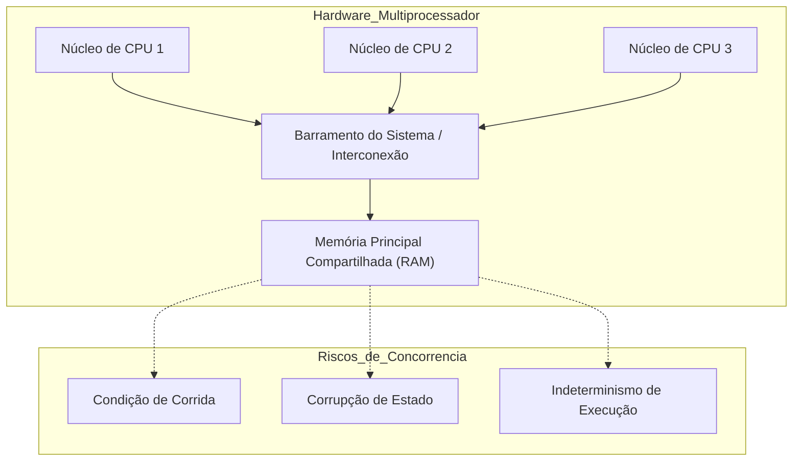

### Exemplo conceitual
Imagine dois núcleos de processamento executando a operação `saldo = saldo + valor;`. Em linguagem de montagem, essa linha se decompõe em:
1. `MOV EAX, [saldo]` (leitura do valor na memória para o registrador)
2. `ADD EAX, valor` (adição interna ao núcleo)
3. `MOV [saldo], EAX` (escrita do registrador de volta para a memória)

Se o Núcleo 1 e o Núcleo 2 realizarem o passo 1 ao mesmo tempo, ambos lerão o mesmo saldo inicial. O núcleo que gravar por último sobrescreverá a atualização do outro, gerando perda irrecuperável de fundos contábeis.

### Contraexemplo
Executar tarefas embaraçosamente paralelas (*embarrassingly parallel*), como renderizar blocos isolados de um frame 3D sem nenhuma memória compartilhada, não requer sincronização entre si. No entanto, assim que todas as threads precisam consolidar o resultado em um único arquivo de saída ou atualizar uma barra de progresso global, a sincronização torna-se imediatamente obrigatória.

### Armadilhas comuns
- **Achar que hardware mais rápido resolve problemas de concorrência:** Aumentar a frequência de clock ou adicionar núcleos físicos não elimina condições de corrida; na verdade, frequentemente amplia a janela de ocorrência de erros que antes eram raros.
- **Supor atomicidade em operações de alto nível:** Operações simples em linguagens de programação (como `contador++` ou `x = x + 1`) nunca são atômicas no nível de instrução de máquina, a menos que utilizem primitivas atômicas explícitas do processador.

---

## Aplicações críticas de sistemas concorrentes no mundo real

### Sistemas operacionais modernos
O sistema operacional é, por definição, o principal exemplo de software concorrente. Ele gerencia a multiplexação do hardware, escalonando centenas de threads de aplicações, respondendo a interrupções de hardware (rede, teclado, disco) de forma assíncrona e alocando memória dinamicamente. Um bug de concorrência no kernel resulta em *Kernel Panic*, *Blue Screen of Death* ou falhas críticas de segurança que comprometem todas as aplicações subordinadas.

### Controle de tráfego aéreo
Sistemas de controle de espaço aéreo monitoram centenas de aeronaves voando em velocidades elevadas em três dimensões. Cada aeronave representa um fluxo independente de dados telemétricos (altitude, velocidade, proa). O sistema precisa correlacionar continuamente essas trajetórias para prever e evitar colisões, atribuindo rotas de pouso e decolagem em pistas compartilhadas. Uma falha de concorrência ou um atraso por contenção de recursos pode inviabilizar o envio tempestivo de uma ordem de manobra evasiva.

### Sistemas de controle em tempo real
Empregados em robótica cirúrgica, reatores nucleares e instrumentação médica (como aparelhos de hemodiálise e ventiladores mecânicos). Nesses sistemas, a correção do software depende não apenas do resultado lógico da computação, mas do instante exato de sua entrega (*deadlines estritos*). Se a tarefa que modula a pressão arterial ou ajusta o braço robótico for bloqueada por tempo indeterminado devido à disputa de recursos, ocorre dano irreversível ao paciente.

### Refinarias de petróleo e plantas industriais
Plantas químicas e petroquímicas operam com malhas de controle fechado altamente integradas: válvulas de alívio, bombas de refluxo, sensores de temperatura de craqueamento catalítico e sensores de pressão em tubulações. Falhas de coordenação em um subsistema (por exemplo, um processo de bombeamento que não sincroniza com o processo de abertura de válvula receptora) geram sobrepressão física, vazamento de substâncias inflamáveis e explosões de proporções catastróficas.

| Domínio de Aplicação | Recurso Compartilhado Típico | Tolerância a Falha Temporal | Impacto da Falha de Concorrência |
| :--- | :--- | :--- | :--- |
| **Sistemas Operacionais** | Tabelas de páginas, descritores de I/O, fila de prontos | Milissegundos / Não crítica | Falha geral do SO, pânico de kernel |
| **Controle Aéreo** | Faixas de altitude, pistas de pouso, setores de radar | Sub-segundo / Rígida | Colisão de aeronaves em solo ou voo |
| **Controle em Tempo Real** | Barramento de atuadores, sinais de sensores vitais | Micro a milissegundos / Crítica | Dano físico a pacientes, falha de reator |
| **Refinarias de Petróleo** | Dutos de escoamento, tanques de buffer, válvulas | Segundos / Rígida | Desastre ambiental, explosão mecânica |

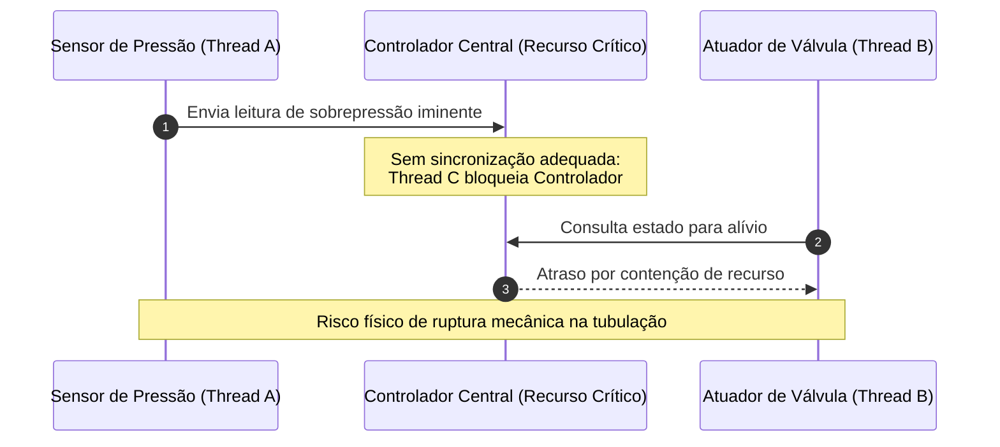

---

## Conceito e finalidade de Monitores em programação concorrente

### Definição formal
*(Complemento técnico: proposto originalmente por C.A.R. Hoare em 1974 e Per Brinch Hansen em 1973 como evolução estruturada sobre semáforos).*
Um **Monitor** é um mecanismo de sincronização de alto nível encapsulado na forma de um tipo abstrato de dados (ou objeto). Ele reúne em uma única entidade formal:
1. O estado de um recurso compartilhado (variáveis e dados privados).
2. As operações permitidas sobre esse recurso (procedimentos ou métodos de acesso).
3. O controle estrito de concorrência, garantindo que apenas um fluxo de execução (thread/processo) esteja ativo no interior de qualquer um de seus procedimentos em um dado instante.

### Motivação: Por que semáforos são insuficientes na prática?
Antes da concepção dos monitores, a exclusão mútua dependia primariamente de semáforos (`wait`/`P` e `signal`/`V`). Embora poderosos, os semáforos apresentam natureza não estruturada:
- A chamada a `wait()` e `signal()` fica espalhada arbitrariamente pelo código-fonte dos clientes.
- Um único desenvolvedor que se esqueça de invocar `signal()` trava permanentemente todos os processos subsequentes.
- Um desenvolvedor que invoque `wait()` duas vezes consecutivas ou inverta a ordem das operações gera corrupção ou deadlock imediato.
- A depuração de erros de sincronização baseados em semáforos em bases de código legadas de milhões de linhas é impraticável.

O monitor resolve essa deficiência transferindo a responsabilidade da exclusão mútua do desenvolvedor da aplicação para o compilador e para o ambiente de execução do sistema operacional.

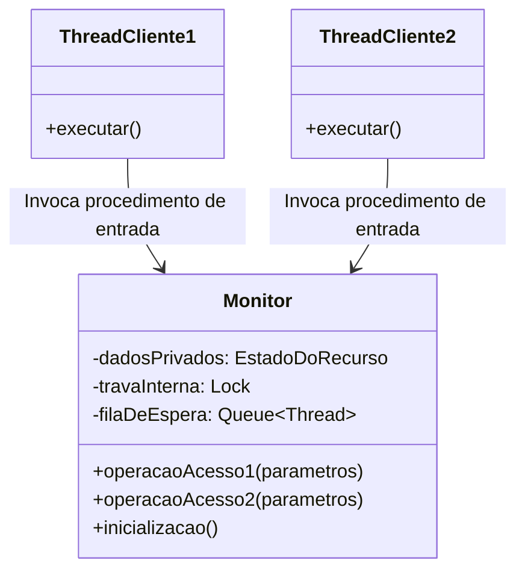

| Característica | Semáforos Tradicionais | Monitores |
| :--- | :--- | :--- |
| **Nível de Abstração** | Baixo nível (primitiva operacional inteira) | Alto nível (orientação a objetos / T.A.D.) |
| **Encapsulamento** | Inexistente (variáveis de dados e semáforo são separados) | Completo (dados protegidos ficam dentro do monitor) |
| **Responsabilidade da Trava** | Do programador (chamadas explícitas `wait/signal`) | Do compilador/linguagem (feita na entrada do método) |
| **Facilidade de Manutenção** | Baixa; suscetível a esquecimento ou inversão | Alta; centralizada no próprio objeto monitor |
| **Propensão a Erros** | Muito alta | Baixa em relação à exclusão mútua |

---

## Componentes essenciais de um monitor: dados privados, procedimentos de acesso e fila de espera

Um monitor padrão é composto invariavelmente por três elementos estruturais fundamentais:

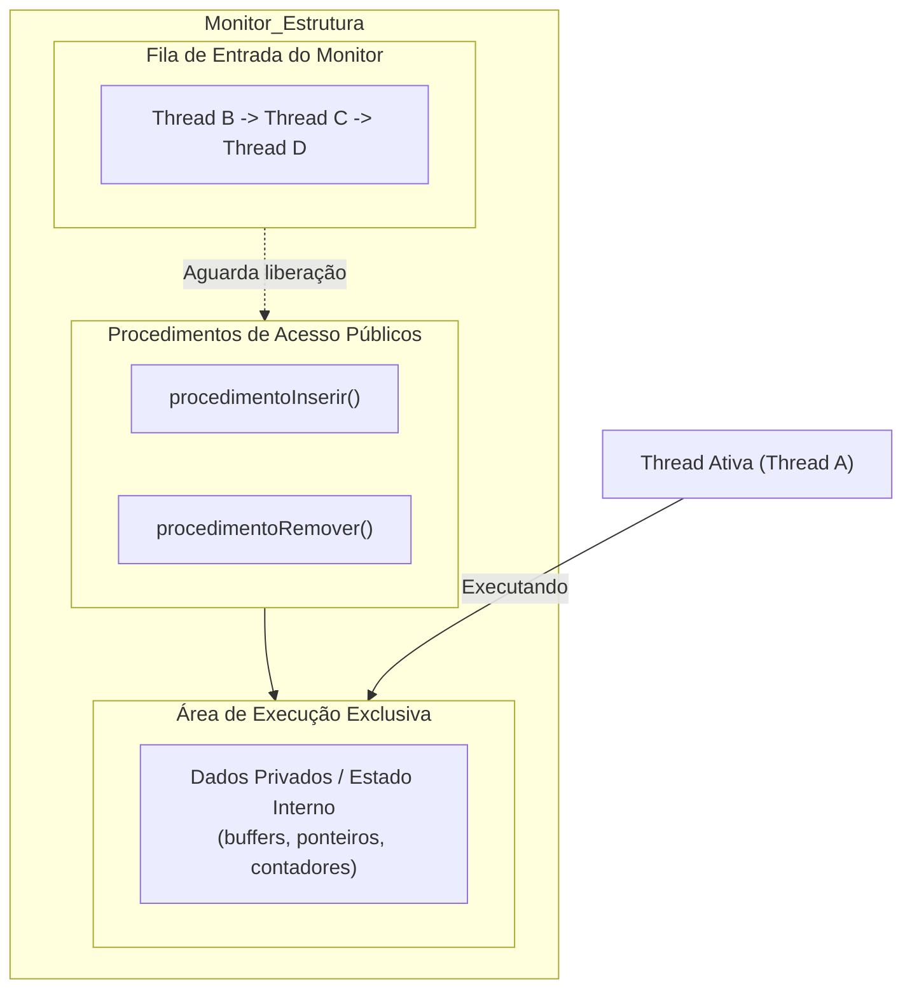

### Dados privados
As variáveis que representam o recurso compartilhado (por exemplo, um array circular que serve de buffer, ponteiros de início e fim, ou o saldo de uma conta bancária) são estritamente **privadas**. Nenhuma instrução externa ao monitor tem permissão de ler ou alterar esses campos diretamente. O acesso se dá estritamente via interface pública.

### Procedimentos de acesso
São os métodos ou funções exportados pelo monitor para o mundo exterior. Toda manipulação dos dados privados reside compulsoriamente dentro desses procedimentos. Ao desenhar um monitor de fila de impressão, por exemplo, os procedimentos de acesso seriam `enviarTrabalho()` e `proximoTrabalho()`. A garantia de exclusão mútua é ativada automaticamente no momento em que a execução ultrapassa o cabeçalho desses métodos.

### Fila de espera
Como apenas uma thread pode ocupar o monitor por vez, todas as demais threads que tentarem invocar qualquer procedimento de acesso enquanto outra thread estiver ativa no seu interior são impedidas de entrar. O sistema operacional as enfileira em uma fila de espera associada à porta de entrada do monitor (*entry queue*), suspendendo sua execução e liberando a CPU.

*(Complemento técnico: além da fila de entrada, monitores frequentemente possuem filas de variáveis de condição associadas às operações `wait()` e `signal()`, onde threads que já entraram no monitor aguardam que uma condição lógica se torne verdadeira — como um buffer deixar de estar vazio).*

---

## Mecanismos de acesso ao monitor, rotina de entrada e controle de exclusão mútua

### A rotina de entrada (*Entry Routine*)
Para interagir com o recurso protegido, uma thread cliente faz uma chamada regular de procedimento apontando para o monitor. No entanto, por baixo do pano, o compilador introduz automaticamente um prólogo (código de entrada) e um epílogo (código de saída) em torno do corpo do procedimento:

```text
// Código gerado conceitualmente pelo compilador
procedimentoMonitor() {
    rotina_de_entrada(); // Adquire trava atômica do monitor
    // --- Início da Seção Crítica ---
    corpo_do_procedimento();
    // --- Fim da Seção Crítica ---
    rotina_de_saida();   // Libera trava e acorda a próxima thread da fila
}
```

A **rotina de entrada** avalia o estado da trava associada ao monitor. Se nenhuma thread estiver operando lá dentro, a porta é destrancada, o estado passa para ocupado e a thread requisitante inicia a execução do método imediatamente.

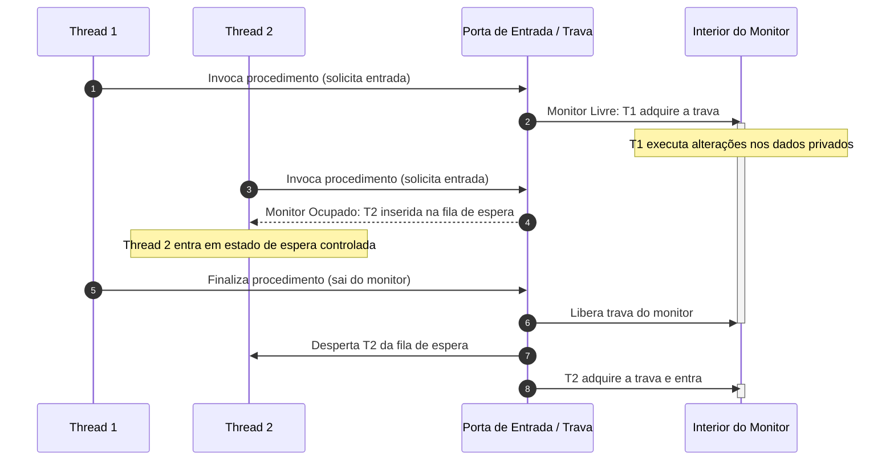

### Controle estrito da porta de entrada
A garantia de exclusão mútua significa que o número de threads executando código dentro de qualquer procedimento de um dado monitor é sempre menor ou igual a 1 ($N \le 1$). Se o monitor possui dez procedimentos públicos distintos, duas threads não podem executar sequer procedimentos diferentes simultaneamente dentro daquela instância, pois a trava de exclusão pertence ao monitor como um todo, e não aos métodos individualmente.

---

## Aquisição da trava, estado de monitor ocupado e espera controlada

### Aquisição da trava
A trava (*lock*) do monitor é uma entidade binária associada à estrutura de dados do objeto. Sua aquisição envolve uma instrução atômica de baixo nível mediada pelo suporte de runtime da linguagem ou pelo kernel do sistema operacional. No momento em que uma thread obtém essa trava com sucesso, ela assume a titularidade exclusiva do monitor.

### Estado de monitor ocupado
Enquanto a thread titular estiver manipulando os dados internos, o monitor permanece formalmente no estado **Ocupado**. Nesse estado:
- Novas tentativas de entrada por outras threads são prontamente interceptadas.
- A integridade temporal das variáveis é mantida, pois leituras sujas (*dirty reads*) e escritas sobrepostas são impossíveis.

### Espera controlada vs Espera ocupada (*Busy-Waiting*)
Um ponto arquitetural crucial trabalhado na disciplina é a diferença entre *espera ocupada* e *espera controlada*:

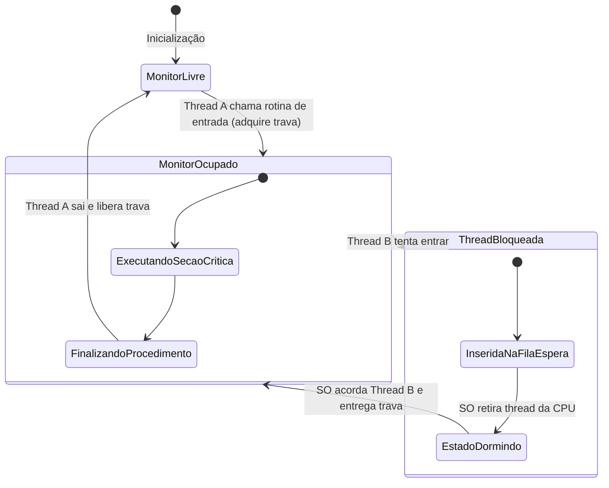

| Propriedade | Espera Ocupada (*Busy-Waiting / Spinlock*) | Espera Controlada (Fila do Monitor) |
| :--- | :--- | :--- |
| **Uso de CPU** | 100% de utilização de um núcleo apenas rodando loop vazio | Zero consumo de CPU enquanto bloqueada |
| **Mecanismo** | Loop contínuo testando flag na memória (`while(lock);`) | Thread retirada da fila de execução do escalonador |
| **Impacto no Sistema** | Desperdiça ciclos computacionais e dissipa energia | Libera o processador para outras tarefas produtivas |
| **Adequação** | Seções críticas ultracurtas em kernels multiprocessados | Sistemas gerais de aplicação e computação concorrente |

Na **espera controlada**, a thread requisitante perde seu contexto de execução na CPU, tem seu estado salvo no Bloco de Controle de Processo/Thread (PCB/TCB) e transita para o estado de **Bloqueada/Esperando**. Ela só será acordada pelo escalonador no instante em que a thread titular do monitor liberar a trava.

---

## Benefícios dos monitores na prevenção de condições de corrida e consistência de dados

### Exclusão mútua garantida por desenho
Ao contrário de estruturas ad-hoc onde o programador precisa orquestrar manualmente comandos `lock.acquire()` e `lock.release()`, os monitores garantem a exclusão mútua a nível de linguagem ou tipo abstrato. Isso elimina a categoria de erros em que um bloco de saída antecipada (como um comando `return`, `break` ou uma exceção lançada no meio do procedimento) faz com que o desenvolvedor se esqueça de liberar a trava, congelando o sistema para sempre.

### Encapsulamento e modularidade
O encapsulamento isola a complexidade:
- A lógica de negócio do recurso e a lógica de sincronização residem no mesmo arquivo e objeto.
- As threads usuárias não precisam saber quantos semáforos, travas ou filas existem dentro do monitor; elas apenas chamam métodos como `recurso.alocar()` e `recurso.liberar()`.
- Facilita auditorias de código e refatorações internas sem quebrar o contrato com os clientes concorrentes.

### Prevenção de condições de corrida
Como duas threads jamais interagem com as variáveis de estado ao mesmo tempo, as condições de corrida descritas no início deste documento são matematicamente eliminadas dentro do escopo do monitor:
- O estado transita sempre de um valor consistente para outro valor consistente.
- A atomicidade das operações sobre o recurso compartilhado é preservada.

---

## Definição e causas de Deadlock em ambientes de multiprogramação

### Definição formal
Um **Deadlock** (ou impasse) é uma situação anômala em sistemas operacionais na qual um conjunto de dois ou mais processos ou threads encontra-se permanentemente bloqueado, porque cada um dos processos retém um ou mais recursos e está aguardando a liberação de outro recurso que se encontra retido por outro processo do mesmo conjunto.

Conforme a definição apresentada em aula:
> *"Um processo ou thread entra em deadlock (estado travado) quando aguarda por um evento que jamais ocorrerá."*

### O papel do compartilhamento de recursos
O deadlock é uma consequência direta da multiprogramação com compartilhamento de recursos finitos e não-preemptíveis (discos, fitas, áreas de memória, travas de banco de dados, portas de comunicação, impressoras). Se houvesse recursos infinitos disponíveis para todos os processos no momento em que precisassem, impasses jamais existiriam.

*(Complemento técnico: Para que um deadlock ocorra, quatro condições formais — conhecidas na literatura científica como as Quatro Condições de Coffman de 1971 — devem ser satisfeitas de forma estritamente simultânea no sistema):*

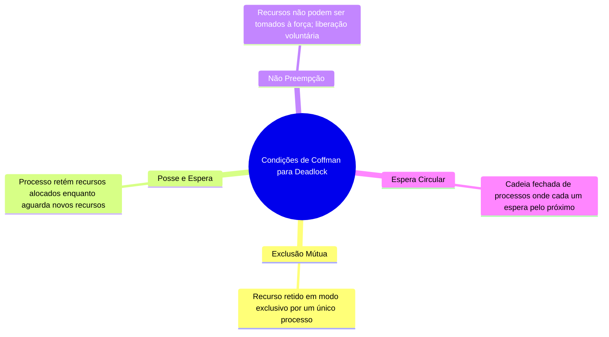

1. **Exclusão Mútua:** Os recursos envolvidos só podem ser utilizados por um processo por vez.
2. **Posse e Espera (*Hold and Wait*):** Um processo que já retém recursos concedidos anteriormente pode solicitar novos recursos e aguardar bloqueado pela sua liberação.
3. **Não-Preempção:** Um recurso alocado a um processo não pode ser tomado compulsoriamente pela CPU ou pelo SO; ele só pode ser liberado voluntariamente pelo processo que o detém após a conclusão de sua tarefa.
4. **Espera Circular:** Deve existir uma cadeia fechada de processos $\{P_1, P_2, \dots, P_n\}$, tal que $P_1$ aguarda um recurso retido por $P_2$, $P_2$ aguarda um recurso de $P_3$, ..., e $P_n$ aguarda um recurso retido por $P_1$.

Se o arquiteto do sistema operacional conseguir quebrar pelo menos **uma** dessas quatro condições, a ocorrência de deadlocks torna-se matematicamente impossível.

---

## Consequências do deadlock: perda de trabalho acumulado, degradação de rendimento e falhas

Quando um deadlock se instala em um ambiente operacional corporativo ou de missão crítica, os efeitos deletérios propagam-se rapidamente em cascata:

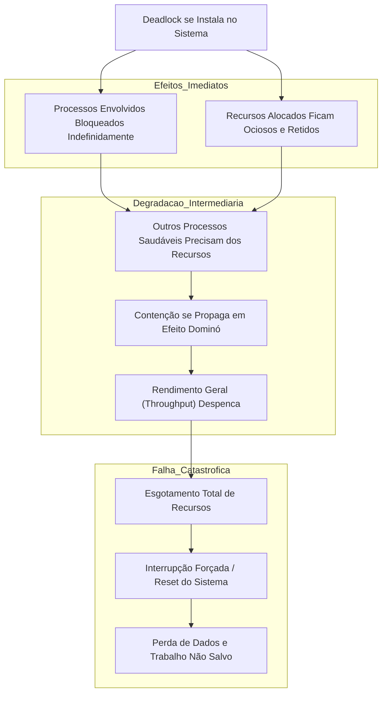

### Perda de trabalho acumulado
Processos travados em deadlock não finalizam suas tarefas. Em muitos casos, a única forma de recuperação reativa adotada pelo sistema operacional ou pelo operador humano é o cancelamento forçado (*kill*) de um ou mais processos envolvidos. Isso acarreta:
- Perda de cálculos longos de simulação que rodavam há dias.
- Necessidade de rollback ou perda de transações não persistidas em disco.
- Estado inconsistente em arquivos compartilhados deixados abertos pela metade.

### Redução de rendimento geral (*Throughput Degradation*)
Mesmo que o deadlock afete inicialmente apenas dois processos secundários, os recursos por eles retidos não podem ser acessados por ninguém mais. Com o passar do tempo, outros processos em execução que venham a requisitar esses mesmos recursos entram em fila de espera e também travam, gerando um efeito dominó de congelamento que derruba a capacidade computacional do servidor.

### Falhas no sistema e reinicialização forçada
Se o deadlock ocorrer em estruturas críticas do kernel (como travas de sistemas de arquivos, gerenciadores de memória ou barramentos de IPC), o sistema operacional atinge exaustão estrutural. Os terminais deixam de responder a comandos, o watchdog de hardware dispara e a única alternativa viável passa a ser a reinicialização forçada da máquina física, causando interrupção de serviços e indisponibilidade operacional (*downtime* não planejado).

---

## Analogia do engarrafamento urbano para processos e recursos bloqueados

Para sedimentar visualmente a mecânica de um deadlock, a analogia clássica do tráfego urbano em um cruzamento congestionado (ilustrada em cidades densas como Jacarta) mapeia perfeitamente as entidades envolvidas na computação concorrente:

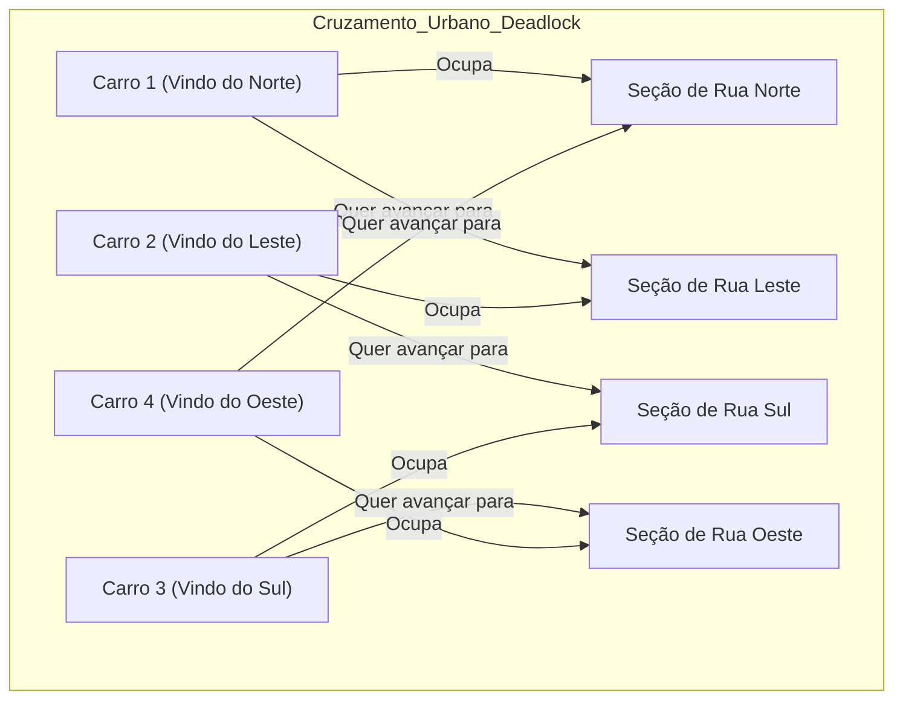

### Mapeamento dos elementos

| Elemento no Trânsito Urbano | Elemento em Sistemas Operacionais | Significado Técnico |
| :--- | :--- | :--- |
| **Carros (Automóveis)** | Processos / Threads / Tarefas | Entidades ativas que realizam trabalho e buscam progresso |
| **Seções de Rua / Cruzamentos** | Recursos (Memória, CPU, I/O, Travas) | Entidades passivas de capacidade limitada que os processos requisitam |
| **Ocupar um pedaço da pista** | Alocação de recurso | O recurso já está em posse exclusiva de um processo |
| **Frente do carro encostada no outro** | Bloqueio / Espera por recurso | O processo não pode avançar enquanto o recurso à frente estiver ocupado |
| **Espaço físico intransponível** | Exclusão Mútua | Dois carros não podem ocupar a mesma coordenada física no asfalto |
| **Carros não voam nem desaparecem** | Não-Preempção | O recurso não pode ser arrancado violentamente do processo |
| **Nenhum motorista engata ré** | Posse e Espera | Cada carro segura seu pedaço de rua e recusa-se a recuar |
| **O círculo fechado de carros** | Espera Circular | O ciclo que torna o trânsito completamente estático |

A única saída física para desfazer o nó do cruzamento sem que haja destruição (preempção forçada por guincho) seria que algum motorista abrisse mão voluntariamente de sua vaga, desse ré e deixasse os demais fluírem — exatamente o princípio da desistência e recuperação de recursos no SO.

---

## Grafo de alocação de recursos: representação visual de processos, recursos e dependências

### Definição formal
O **Grafo de Alocação de Recursos** (conhecido internacionalmente como **RAG** — *Resource Allocation Graph*) é um grafo direcionado $G = (V, E)$ utilizado pelo sistema operacional para modelar matematicamente o estado atual do compartilhamento de recursos no sistema:

- O conjunto de vértices $V$ divide-se em dois subconjuntos disjuntos:
  1. **Processos:** $P = \{P_1, P_2, \dots, P_n\}$, representados convencionalmente por retângulos ou círculos com identificação $P$.
  2. **Recursos:** $R = \{R_1, R_2, \dots, R_m\}$, representados graficamente por retângulos ou círculos com identificação $R$. *(Se o recurso contiver múltiplas instâncias idênticas, desenham-se pontos dentro da caixa correspondente).*
- O conjunto de arestas direcionadas $E$ divide-se em:
  1. **Aresta de Solicitação / Requisição ($P_i \to R_j$):** Indica que o processo $P_i$ solicitou uma instância do recurso $R_j$ e está atualmente bloqueado, aguardando alocação.
  2. **Aresta de Alocação / Atribuição ($R_j \to P_i$):** Indica que uma instância do recurso $R_j$ foi concedida e está atualmente em posse do processo $P_i$.

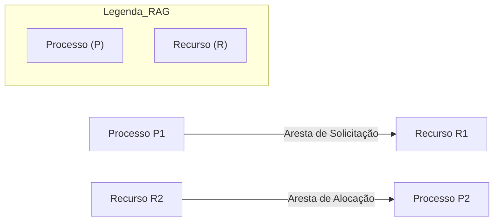

### Regras fundamentais de interpretação de Deadlock via RAG
1. **Recursos de Instância Única:** Se cada tipo de recurso no sistema possui apenas uma única unidade física disponível, a presença de um **ciclo simples direcionado** no grafo é uma condição **necessária e suficiente** para a existência de deadlock.
2. **Recursos de Múltiplas Instâncias:** Se os tipos de recursos possuem duas ou mais unidades idênticas (como três impressoras idênticas), a existência de um ciclo no grafo é uma condição **necessária, porém NÃO suficiente** para determinar deadlock, pois outro processo fora do ciclo pode liberar instâncias que quebrem a dependência.

---

## Exemplo de deadlock simples e a condição de espera circular

### Descrição do cenário do material de aula
Consideremos o exemplo clássico de impasse mínimo entre dois processos ($P_1$ e $P_2$) e dois tipos de recursos de instância única ($R_1$ e $R_2$):

1. O processo $P_1$ retém o recurso $R_1$ (alocado).
2. O processo $P_1$ necessita do recurso $R_2$ para continuar e solicita $R_2$. Como $R_2$ não está livre, $P_1$ bloqueia.
3. O processo $P_2$ retém o recurso $R_2$ (alocado).
4. O processo $P_2$ necessita do recurso $R_1$ para continuar e solicita $R_1$. Como $R_1$ não está livre, $P_2$ bloqueia.

### O Grafo RAG do Deadlock Simples


Note a existência do ciclo fechado de dependência orientada:
$$P_1 \to R_2 \to P_2 \to R_1 \to P_1$$

### A dinâmica temporal do colapso
A tabela abaixo documenta passo a passo como o entrelaçamento temporal de duas threads executando em núcleos distintos atinge o estado travado:

| Instante ($t$) | Ação da Thread / Processo $P_1$ | Ação da Thread / Processo $P_2$ | Estado de $R_1$ | Estado de $R_2$ | Resultado do Sistema |
| :---: | :--- | :--- | :--- | :--- | :--- |
| **$t_0$** | Inicia execução | Inicia execução | Livre | Livre | Normal |
| **$t_1$** | Solicita e obtém $R_1$ | Executa trabalho local | Em posse de $P_1$ | Livre | Normal |
| **$t_2$** | Executa trabalho local | Solicita e obtém $R_2$ | Em posse de $P_1$ | Em posse de $P_2$ | Normal |
| **$t_3$** | Solicita $R_2$ (bloqueia) | Executa trabalho local | Em posse de $P_1$ | Em posse de $P_2$ | $P_1$ suspenso na fila |
| **$t_4$** | Aguardando $R_2$ | Solicita $R_1$ (bloqueia) | Em posse de $P_1$ | Em posse de $P_2$ | $P_2$ suspenso na fila |
| **$t_5$** | **Bloqueado para sempre** | **Bloqueado para sempre** | Retido por $P_1$ | Retido por $P_2$ | **Deadlock consumado** |

Nenhum dos dois processos consegue dar um único passo de computação adiante para atingir o ponto de código em que liberaria o recurso que o outro tanto aguarda.

---

## Limitações dos monitores frente à alocação concorrente de múltiplos recursos

Um dos pontos mais importantes da aula do Prof. Guilherme de Morais é a desmistificação do alcance dos monitores:
> *"Embora os monitores sejam essenciais para assegurar a exclusão mútua e evitar condições de corrida, eles não resolvem totalmente o problema do deadlock, que pode surgir da disputa por múltiplos recursos."*

### Onde reside a limitação?
O monitor é excelente para proteger **um** recurso compartilhado individualizado. Ele encapsula o recurso dentro de sua estrutura e garante que ninguém o corrompa. No entanto, em sistemas reais, aplicações frequentemente precisam alocar **múltiplos recursos simultaneamente** para concluir uma operação (por exemplo: copiar dados da Unidade de Fita $A$ para a Unidade de Fita $B$; ou debitar da Conta $X$ e creditar na Conta $Y$).

Se o recurso $A$ for gerenciado pelo Monitor $M_A$ e o recurso $B$ for gerenciado pelo Monitor $M_B$, surge o problema clássico de **aninhamento de monitores** e **ordenação de travamento inconsistente**:

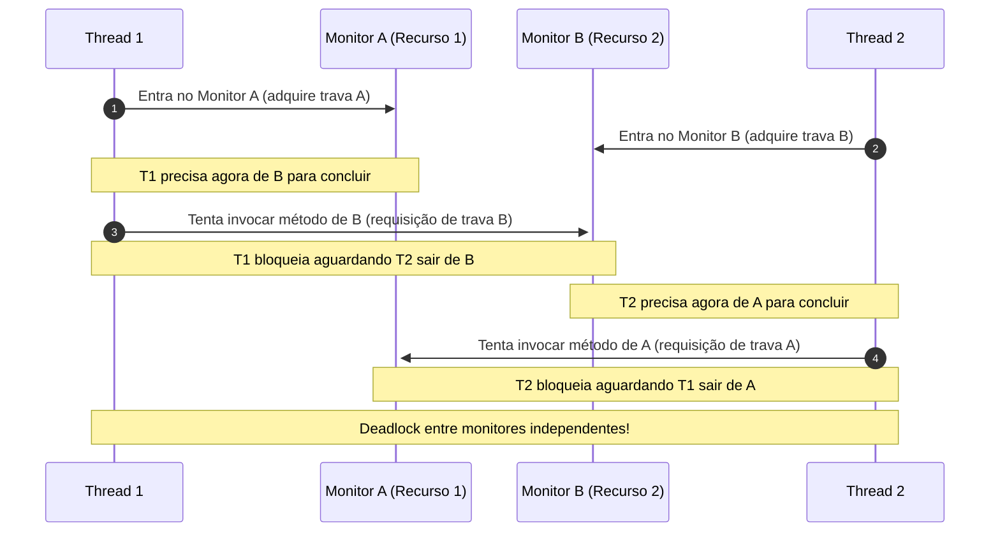

### Síntese conceitual
O monitor garante a **Exclusão Mútua** com perfeição, mas ao fazer isso em um ambiente onde processos retêm recursos e pedem novos recursos (*Posse e Espera*), ele inadvertidamente fornece duas das quatro condições necessárias para que o deadlock prospere. Portanto, monitores isolados não têm inteligência global para impedir ciclos de dependência cruzada entre si.

---

## Código da aula

*(Complemento técnico: como a aula expositiva original não distribuiu arquivos de código-fonte, disponibilizamos abaixo duas implementações canônicas que consolidam os tópicos ensinados: uma demonstrando a arquitetura interna de um Monitor em C com POSIX Threads e outra em Python implementando um detector de ciclos em Grafos de Alocação de Recursos).*

### Arquivo 1: Implementação de Monitor com Pthreads em C (`monitor_recurso.c`)

```c
#include <stdio.h>
#include <stdlib.h>
#include <pthread.h>
#include <unistd.h>

// Estrutura que define o Monitor para um Recurso Compartilhado
typedef struct {
    int recursosDisponiveis; // Dado privado encapsulado
    pthread_mutex_t trava;   // Mecanismo de exclusão mútua (porta de entrada)
    pthread_cond_t filaEspera; // Fila de espera controlada
} MonitorRecurso;

// Procedimento de inicialização do Monitor
void monitor_init(MonitorRecurso *mon, int total) {
    mon->recursosDisponiveis = total;
    pthread_mutex_init(&mon->trava, NULL);
    pthread_cond_init(&mon->filaEspera, NULL);
}

// Procedimento de acesso: Alocação controlada
void monitor_adquirir(MonitorRecurso *mon, int qtd, int thread_id) {
    // Rotina de entrada: adquire trava do monitor
    pthread_mutex_lock(&mon->trava);
    
    printf("[Thread %d] Solicitando %d unidades. Disponivel: %d\n", 
           thread_id, qtd, mon->recursosDisponiveis);
    
    // Espera controlada caso o recurso esteja ocupado/insuficiente
    while (mon->recursosDisponiveis < qtd) {
        printf("[Thread %d] Recursos insuficientes. Entrando na fila de espera...\n", thread_id);
        // Libera a trava temporariamente e suspende a thread
        pthread_cond_wait(&mon->filaEspera, &mon->trava);
    }
    
    // Modificação exclusiva dos dados privados
    mon->recursosDisponiveis -= qtd;
    printf("[Thread %d] Conseguiu alocar. Restam: %d\n", thread_id, mon->recursosDisponiveis);
    
    // Rotina de saída: libera trava
    pthread_mutex_unlock(&mon->trava);
}

// Procedimento de acesso: Liberação do recurso
void monitor_liberar(MonitorRecurso *mon, int qtd, int thread_id) {
    pthread_mutex_lock(&mon->trava);
    
    mon->recursosDisponiveis += qtd;
    printf("[Thread %d] Liberou %d unidades. Total agora: %d\n", 
           thread_id, qtd, mon->recursosDisponiveis);
    
    // Notifica threads bloqueadas na fila de espera
    pthread_cond_broadcast(&mon->filaEspera);
    
    pthread_mutex_unlock(&mon->trava);
}
```

### Explicação linha a linha do código C
- **Linhas 7-11 (`typedef struct`):** O monitor agrupa o recurso (`recursosDisponiveis`), a trava de exclusão mútua (`pthread_mutex_t trava`) e a fila de controle (`pthread_cond_t filaEspera`). Isso concretiza a definição do Slide 7 (Dados Privados + Procedimentos + Fila).
- **Linhas 22 (`pthread_mutex_lock`):** É a concretização física da **rotina de entrada**. Se outra thread estiver no monitor, a thread que chamou é colocada no estado de espera controlada.
- **Linhas 29-33 (`pthread_cond_wait`):** Quando a thread entra no monitor mas percebe que a quantidade de recursos não a atende, ela suspende-se voluntariamente. O `wait` libera a trava para que outros possam entrar e abastecer o monitor.
- **Linhas 49 (`pthread_cond_broadcast`):** Avisa a todas as threads adormecidas na fila de que os dados privados mudaram e que elas podem tentar adquirir o recurso novamente.

---

### Arquivo 2: Detector de Deadlock em Grafo de Alocação de Recursos em Python (`detector_rag.py`)

```python
# Detector algorítmico de ciclo em Grafo de Alocação de Recursos (RAG)
# Modela a verificação de Deadlock para recursos de instância única

class GrafoAlocacaoRecursos:
    def __init__(self):
        # Lista de adjacência do grafo direcionado
        self.adj = {}
    
    def adicionar_aresta(self, origem: str, destino: str):
        """Adiciona aresta de solicitação (P -> R) ou de alocação (R -> P)"""
        if origem not in self.adj:
            self.adj[origem] = []
        self.adj[origem].append(destino)
        if destino not in self.adj:
            self.adj[destino] = []

    def verificar_deadlock(self) -> bool:
        """Verifica se existe ciclo de dependência circular no grafo via DFS"""
        visitados = set()
        pilha_recursao = set()

        def dfs(vertice):
            visitados.add(vertice)
            pilha_recursao.add(vertice)

            for vizinho in self.adj.get(vertice, []):
                if vizinho not in visitados:
                    if dfs(vizinho):
                        return True
                elif vizinho in pilha_recursao:
                    # Encontrou ciclo direcionado!
                    return True

            pilha_recursao.remove(vertice)
            return False

        for nodo in list(self.adj.keys()):
            if nodo not in visitados:
                if dfs(nodo):
                    return True
        return False

# Demonstração do cenário dos Slides 20 e 21
if __name__ == "__main__":
    rag = GrafoAlocacaoRecursos()
    
    # R1 alocado para P1 | P1 requisita R2
    rag.adicionar_aresta("R1", "P1")
    rag.adicionar_aresta("P1", "R2")
    
    # R2 alocado para P2 | P2 requisita R1
    rag.adicionar_aresta("R2", "P2")
    rag.adicionar_aresta("P2", "R1")
    
    if rag.verificar_deadlock():
        print("[ALERTA CRÍTICO] Deadlock detectado! Ciclo de espera circular confirmado no sistema.")
    else:
        print("[ESTADO SEGURO] Nenhum ciclo detectado. O sistema pode prosseguir.")
```

---

## Exercícios

### Exercício 1: Limitações dos Monitores na Alocação de Múltiplos Recursos
*(Extraído do Slide 23 da aula do Prof. Guilherme de Morais)*

**Enunciado:**
> Considerando que monitores previnem condições de corrida e garantem exclusão mútua, qual problema principal persiste na alocação de múltiplos recursos que os monitores, por si só, não conseguem resolver completamente, levando a cenários de deadlock?

**Raciocínio detalhado:**
1. Os monitores operam como fronteiras isoladas de proteção. Um monitor protege exclusivamente os recursos e variáveis definidos em seu próprio escopo léxico/objeto.
2. Em um sistema com múltiplos monitores independentes ($M_1, M_2, \dots, M_k$), não existe um coordenador global centralizado que ordene as requisições atômicas entre os diferentes monitores.
3. Se um processo $P_A$ adquire a trava de $M_1$ e, antes de sair dele, tenta invocar um procedimento em $M_2$, ele mantém a trava de $M_1$ retida enquanto aguarda a liberação de $M_2$ (atendendo à condição de *Posse e Espera*).
4. Se simultaneamente um processo $P_B$ adquire a trava de $M_2$ e tenta invocar um procedimento em $M_1$, forma-se a *Espera Circular*.
5. Como cada monitor cuida estritamente de si mesmo, nenhum deles possui visibilidade para diagnosticar que o travamento cruzado está acontecendo no ambiente externo.

**Resolução completa:**
O problema principal é o **aninhamento de monitores associado à ausência de uma política de ordenação global na aquisição de travas**. Monitores individuais garantem exclusão mútua local, mas não impedem a retenção parcial de recursos enquanto se espera por outros (*Hold and Wait*), nem evitam que fluxos de controle distintos solicitem os monitores em ordens topológicas invertidas, culminando no estabelecimento da condição de *Espera Circular* entre eles.

---

### Exercício 2: Inviabilidade da Eliminação do Compartilhamento de Recursos
*(Extraído do Slide 24 da aula do Prof. Guilherme de Morais)*

**Enunciado:**
> Um projetista de sistemas tenta evitar deadlock criando um ambiente de multiprogramação que não compartilha recursos. Considerando os conceitos de monitores e sincronização, qual a fundamental falha nessa abordagem e como a definiríamos formalmente?

**Raciocínio detalhado:**
1. Qual é a própria razão de ser de um Sistema Operacional multiprogramado? Aumentar a utilização global dos componentes de hardware (CPU, memória RAM, barramentos, discos, conexões de rede), multiplexando-os dinamicamente entre diversos processos concorrentes.
2. Se eliminarmos completamente o compartilhamento de recursos:
   - Ou cada processo teria que possuir hardware dedicado exclusivo (o que é economicamente inviável e fisicamente absurdo em arquiteturas multiprogramadas).
   - Ou o sistema teria que executar exatamente um único processo por vez de forma estritamente sequencial (sistema monoprogramado em lote/batch da década de 1950).
3. A definição formal de um sistema multiprogramado pressupõe que o conjunto de recursos físicos $R$ é compartilhado concorrentemente por um conjunto de processos $P$, onde a cardinalidade de processos ativos excede os recursos disponíveis: $|P| > |R|$.
4. Logo, extinguir o compartilhamento elimina o próprio conceito e propósito da multiprogramação.

**Resolução completa:**
A falha fundamental reside em uma contradição de premissas arquiteturais: **o compartilhamento de recursos é a razão ontológica da existência da multiprogramação**. Formalmente, essa abordagem comete uma redução ao absurdo: para eliminar o sintoma (deadlock), extingue-se a função básica do sistema operacional (a multiplexação eficiente de hardware limitado entre tarefas simultâneas). A solução correta não é extinguir o compartilhamento, mas gerenciá-lo formalmente por meio de algoritmos de prevenção (ordenação de recursos), evasão (algoritmo do banqueiro) ou detecção e recuperação.

---

### Exercício 3: Análise de Grafo de Alocação de Recursos (Prático)

**Enunciado:**
Considere um sistema composto por três processos ($P_1, P_2, P_3$) e três recursos de instância única ($R_1, R_2, R_3$). O estado do sistema é descrito pelas seguintes relações:
- $R_1$ está alocado para $P_2$.
- $P_1$ está solicitando $R_1$.
- $R_2$ está alocado para $P_1$.
- $P_2$ está solicitando $R_2$.
- $R_3$ está alocado para $P_3$.
- $P_3$ está solicitando $R_1$.

Desenhe o Grafo RAG correspondente, verifique a existência de ciclo e informe se há deadlock e quais processos estão impedidos de progredir.

**Resolução:**
1. Desenhando o Grafo RAG em Mermaid:

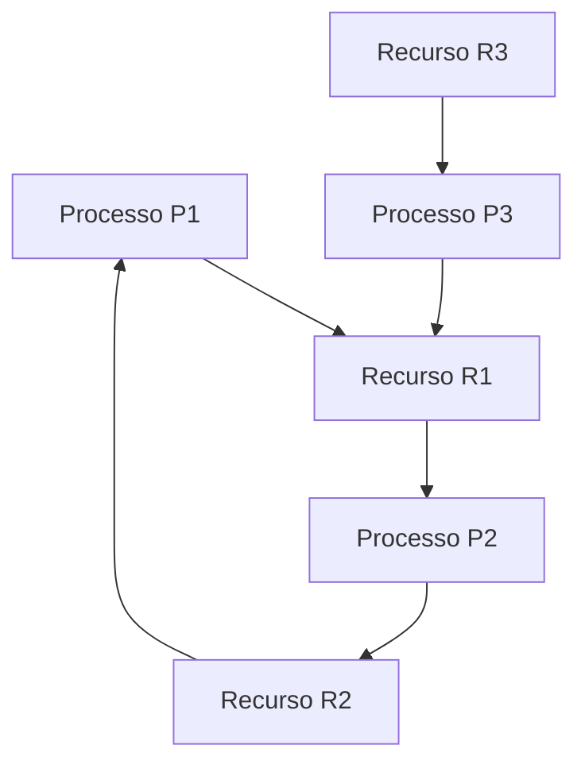

2. **Identificação de Ciclos:**
   - Analisando as arestas: existe o ciclo fechado direcionado $P_1 \to R_1 \to P_2 \to R_2 \to P_1$.
   - Como todos os recursos $R_1$ e $R_2$ possuem estritamente uma única instância, a presença de um ciclo é garantia definitiva de **Deadlock**.
3. **Análise dos Processos:**
   - $P_1$ e $P_2$ estão diretamente envolvidos no ciclo de deadlock e nunca conseguirão progredir.
   - O processo $P_3$ não está dentro do ciclo primário, mas solicita $R_1$ (que está retido por $P_2$, que nunca irá liberá-lo). Logo, $P_3$ também ficará bloqueado permanentemente (vítima indireta do deadlock).

---

## Erros comuns e boas práticas

### Erros comuns cometidos por desenvolvedores e projetistas
1. **Invocar métodos de outro monitor de dentro de um monitor sem protocolo de ordenação:** Dispara impasses silenciosos (*deadlock de monitores aninhados*) extremamente difíceis de reproduzir em testes unitários.
2. **Confundir Exclusão Mútua com Ausência de Deadlock:** Achar que, por ter encapsulado todo o código dentro de métodos `synchronized` ou monitores, a aplicação está imune a travamentos. O monitor impede condições de corrida, mas facilita impasses se múltiplos monitores forem chamados em ordens cruzadas.
3. **Utilizar `if` em vez de `while` ao testar condições lógicas dentro do monitor:** Quando uma thread acorda de uma fila de espera, o estado do recurso pode ter sido alterado por outra thread antes que ela ganhe a CPU. A verificação da condição deve sempre residir em um loop `while(condicaoNaoSatisfeita) wait();`.
4. **Ignorar recursos virtuais:** Achar que deadlock só acontece com dispositivos físicos (impressora, fita). Deadlocks ocorrem frequentemente sobre registros de tabelas de banco de dados, variáveis de memória compartilhada e portas de soquete TCP.

### Boas práticas de engenharia de software concorrente
- **Ordem Hierárquica Global de Recursos (Técnica de Havender):** Atribua uma numeração inteira única a cada recurso ou monitor do sistema ($1, 2, 3, \dots, N$). Obrigue **todas** as threads da aplicação a adquirirem travas sempre em ordem estritamente crescente. Isso torna a formação de um ciclo direcionado matematicamente impossível, quebrando a condição de Espera Circular.
- **Aquisição com Timeout (*Try-Lock*):** Nunca permita que uma thread bloqueie por tempo infinito ao tentar entrar em uma seção crítica. Utilize primitivas com tempo limite: se a trava não for obtida em $X$ milissegundos, desista, libere todos os recursos já retidos e tente novamente após um intervalo aleatório (*backoff*).
- **Minimizar a Granularidade da Seção Crítica:** Mantenha os procedimentos dentro dos monitores o mais curtos e rápidos possível. Nunca realize chamadas bloqueantes de rede ou I/O demorado enquanto estiver retendo a trava de um monitor.

---

## Links e materiais complementares

- **Artigo Original de C.A.R. Hoare (1974):** *"Monitors: An Operating System Structuring Concept"* (Communications of the ACM). Leitura fundamental que introduziu o conceito de monitores na literatura científica mundial.
- **Padrão POSIX Threads (IEEE Std 1003.1):** Documentação técnica das primitivas `pthread_mutex` e `pthread_cond`, detalhando a implementação das rotinas de entrada e filas de espera em sistemas Unix/Linux.
- **Visualizador Interativo de Grafos de Recursos (RAG Simulator):** Simulador educacional para desenho e verificação matricial de impasses com algoritmos de detecção baseados no Teorema de Tarjan/DFS.
- **Livro Texto Recomendado:** SILBERSCHATZ, Abraham; GALVIN, Peter B.; GAGNE, Greg. *Sistemas Operacionais com Java* / *Operating System Concepts*. Capítulos sobre Sincronização de Processos e Impasses (Deadlocks).

---

## Mapa da aula

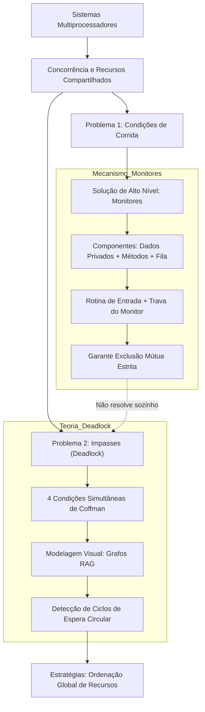

---

## Glossário

| Termo Técnico | Definição Precisa |
| :--- | :--- |
| **Monitor** | Tipo abstrato de dados que encapsula variáveis privadas e procedimentos de acesso, garantindo sincronização e exclusão mútua automática. |
| **Deadlock (Impasse)** | Estado em que um conjunto de processos fica permanentemente bloqueado porque cada um espera por recursos retidos por outros do mesmo grupo. |
| **Condição de Corrida** | Falha de software onde o resultado final de uma computação depende da ordem imprevisível de escalonamento das threads na CPU. |
| **Rotina de Entrada** | Prólogo de código executado na borda do monitor que verifica se a trava está livre e concede ou bloqueia o acesso da thread. |
| **Espera Controlada** | Mecanismo pelo qual uma thread bloqueada é retirada da CPU e colocada em fila pelo SO, sem consumir ciclos de processamento. |
| **Grafo RAG** | *Resource Allocation Graph*; grafo direcionado que mapeia alocações e requisições pendentes entre processos e recursos. |
| **Espera Circular** | Situação em que uma cadeia fechada de processos possui cada elemento aguardando um recurso mantido pelo próximo elemento da cadeia. |
| **Aresta de Alocação** | Aresta direcionada no grafo RAG que aponta do nó de Recurso para o nó de Processo ($R \to P$). |
| **Aresta de Solicitação** | Aresta direcionada no grafo RAG que aponta do nó de Processo para o nó de Recurso ($P \to R$). |
| **Condições de Coffman** | O conjunto das quatro condições formais (Exclusão Mútua, Posse e Espera, Não-Preempção e Espera Circular) necessárias para que haja deadlock. |
| **Systolic Array** | Arquitetura de processamento em matriz paralela que sincroniza fluxos contínuos de dados para operações densas (ex: multiplicação de matrizes). |
| **Não-Preempção** | Princípio de que um recurso só pode ser liberado voluntariamente pelo processo que o detém, nunca confiscado à força pelo sistema. |

---

## Pontos-chave para a prova

- **Monitores operam sobre o princípio do encapsulamento:** Os dados nunca são acessados diretamente; apenas métodos públicos do próprio monitor têm acesso às variáveis do recurso.
- **Apenas uma thread por vez executa no monitor:** Não importa se a classe do monitor tem dez métodos diferentes; a trava pertence ao monitor. Duas threads não executam métodos distintos do mesmo monitor em paralelo.
- **Espera ocupada versus espera em fila:** O monitor utiliza filas de espera controladas, suspendendo a thread via sistema operacional e economizando ciclos de CPU (diferente de um spinlock).
- **Monitores NÃO eliminam deadlocks:** Memorize para a prova que o monitor resolve *condições de corrida* e provê *exclusão mútua*, mas se um processo entrar no Monitor 1 e pedir o Monitor 2, enquanto outro faz o inverso, o sistema entra em deadlock de monitores aninhados.
- **Definição de Deadlock:** Processos aguardando por eventos que jamais ocorrerão devido a bloqueio mútuo e dependência cíclica de recursos finitos.
- **No grafo RAG:**
  - $P \to R$ é solicitação (o processo quer o recurso).
  - $R \to P$ é alocação (o recurso já está na mão do processo).
  - Em recursos de instância única, **ciclo no grafo é certeza absoluta de deadlock**.
- **Inviabilidade de eliminar compartilhamento:** Tentar resolver deadlock acabando com o compartilhamento de recursos é absurdo conceitual, pois a própria razão de ser de um SO multiprogramado é a multiplexação eficiente de hardware limitado.

---

## Perguntas e respostas (JSONL)

```jsonl
{"pergunta": "Qual a principal finalidade de um monitor em sistemas operacionais?", "resposta": "Encapsular dados e procedimentos compartilhados, garantindo exclusão mútua automática para evitar condições de corrida.", "dificuldade": "baixa"}
{"pergunta": "Quais são os três componentes essenciais de um monitor?", "resposta": "Dados privados (estado do recurso), procedimentos de acesso e fila de espera.", "dificuldade": "baixa"}
{"pergunta": "O que acontece quando uma thread tenta acessar um monitor cujo estado é ocupado?", "resposta": "Ela é bloqueada na rotina de entrada e inserida em uma fila de espera controlada, liberando a CPU.", "dificuldade": "baixa"}
{"pergunta": "Como se define formalmente o estado de deadlock em um sistema operacional?", "resposta": "Uma situação em que um ou mais processos ficam bloqueados aguardando eventos ou recursos que jamais ocorrerão ou serão liberados.", "dificuldade": "baixa"}
{"pergunta": "Na analogia do trânsito urbano, o que representam os carros e as seções de rua?", "resposta": "Os carros representam os processos/threads e as seções de rua representam os recursos do sistema.", "dificuldade": "baixa"}
{"pergunta": "O que representa uma aresta orientada de um processo para um recurso (P -> R) no grafo RAG?", "resposta": "Representa uma solicitação ou requisição de alocação de recurso pendente.", "dificuldade": "baixa"}
{"pergunta": "O que representa uma aresta orientada de um recurso para um processo (R -> P) no grafo RAG?", "resposta": "Representa que o recurso está atualmente alocado e em posse daquele processo.", "dificuldade": "baixa"}
{"pergunta": "Por que a simples utilização de monitores não previne a ocorrência de deadlocks?", "resposta": "Porque monitores gerenciam apenas o acesso a recursos individuais isolados e não possuem controle global sobre a ordem de aquisição de múltiplos recursos disputados simultaneamente.", "dificuldade": "media"}
{"pergunta": "Qual a diferença de eficiência computacional entre espera ocupada e a fila de espera do monitor?", "resposta": "A espera ocupada queima ciclos de CPU continuamente em loop, enquanto o monitor suspende a thread e zera o consumo de processamento.", "dificuldade": "media"}
{"pergunta": "Quais são as três consequências críticas de um deadlock no sistema operacional apontadas em aula?", "resposta": "Perda de trabalho acumulado, degradação severa do rendimento (throughput) e falhas/reinicialização do sistema.", "dificuldade": "media"}
{"pergunta": "Em quais condições a presença de um ciclo no grafo RAG é garantia necessária e suficiente de deadlock?", "resposta": "Quando todos os tipos de recursos envolvidos no sistema possuem estritamente uma única instância disponível.", "dificuldade": "media"}
{"pergunta": "Por que a proposta de eliminar todo compartilhamento de recursos para evitar deadlocks é inviável?", "resposta": "Porque contraria o princípio ontológico da multiprogramação, que existe justamente para multiplexar e otimizar recursos finitos entre tarefas concorrentes.", "dificuldade": "media"}
{"pergunta": "Por que operações como saldo = saldo + 1 geram condições de corrida se executadas sem sincronização?", "resposta": "Porque são traduzidas em múltiplas instruções de máquina (leitura, soma e escrita) que podem ser intercaladas arbitrariamente entre núcleos.", "dificuldade": "media"}
{"pergunta": "O que caracteriza a condição de espera circular em um cenário de deadlock?", "resposta": "Uma cadeia de processos onde cada processo retém um recurso necessário para o próximo e aguarda o recurso retido pelo anterior de forma fechada.", "dificuldade": "media"}
{"pergunta": "O que é um systolic array e como ele se relaciona com sincronização em multiprocessamento?", "resposta": "É uma rede de unidades de processamento que computam dados em pipeline rítmico, exigindo sincronização estrita para multiplicação e tarefas paralelas.", "dificuldade": "alta"}
{"pergunta": "Quais são as quatro condições de Coffman necessárias para a ocorrência de um deadlock?", "resposta": "Exclusão mútua, posse e espera (hold and wait), não-preempção e espera circular.", "dificuldade": "alta"}
{"pergunta": "Como a regra de ordenação global hierárquica de recursos impede matematicamente o deadlock?", "resposta": "Ao forçar todos os processos a requisitarem recursos em ordem estritamente crescente, torna-se impossível a formação de um ciclo direcionado de dependência.", "dificuldade": "alta"}
{"pergunta": "Se um recurso possui 3 instâncias idênticas e há um ciclo no RAG, o deadlock é garantido? Justifique.", "resposta": "Não necessariamente; outros processos fora do ciclo que possuam instâncias alocadas podem concluir suas tarefas e liberar recursos, quebrando o ciclo.", "dificuldade": "alta"}
{"pergunta": "Como o aninhamento de chamadas a monitores distintos pode criar um deadlock simples?", "resposta": "Se a Thread 1 entra no Monitor A e chama o Monitor B, enquanto a Thread 2 entra no Monitor B e chama o Monitor A, ambas bloqueiam esperando a trava mútua.", "dificuldade": "alta"}
{"pergunta": "Qual a principal vantagem da estrutura de monitor em relação ao uso de semáforos no desenvolvimento de sistemas?", "resposta": "O monitor centraliza e automatiza a exclusão mútua no nível de linguagem/TAD, eliminando erros humanos como esquecer ou inverter comandos wait e signal.", "dificuldade": "alta"}
```

---

## Checklist de revisão

- [ ] Consigo explicar a diferença fundamental entre pseudo-paralelismo (monoprocessador) e paralelismo real (multiprocessador simétrico)?
- [ ] Compreendo a definição de Monitor como um tipo abstrato de dados e sei listar seus 3 componentes centrais?
- [ ] Sei descrever o funcionamento da rotina de entrada e por que a exclusão mútua do monitor é rigorosamente estrita ($N \le 1$)?
- [ ] Sei diferenciar tecnicamente *espera ocupada* (*busy-waiting*) de *espera controlada* (bloqueio em fila de SO)?
- [ ] Tenho claro por que monitores resolvem perfeitamente condições de corrida, mas falham em prevenir deadlocks de múltiplos recursos?
- [ ] Sei conceituar Deadlock e citar suas três graves consequências em ambientes computacionais de produção?
- [ ] Domino o mapeamento da analogia do engarrafamento urbano com os elementos do sistema operacional?
- [ ] Sei desenhar e interpretar um Grafo de Alocação de Recursos (RAG), diferenciando arestas de solicitação ($P \to R$) e de alocação ($R \to P$)?
- [ ] Consigo identificar a condição de espera circular em um grafo RAG e determinar se há ou não deadlock em recursos de instância única?
- [ ] Sei refutar com argumentos técnicos a tese de extinguir o compartilhamento de recursos em sistemas operacionais multiprogramados?

## Código prático de apoio

Implementações em C que tornam executáveis os conceitos desta unidade:

- [`monitor_buffer_limitado.c`](codigo/monitor_buffer_limitado.c)
- [`deadlock_simples_circular.c`](codigo/deadlock_simples_circular.c)
- [`detector_rag_deadlock.c`](codigo/detector_rag_deadlock.c)
