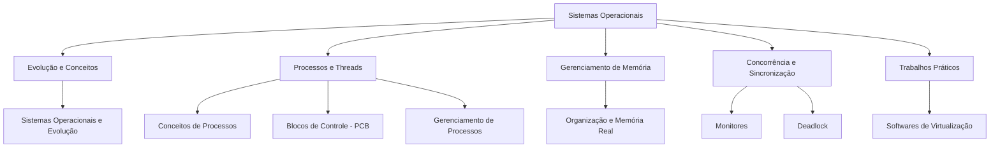

# [Prof. Guilherme de Morais] Sistemas Operacionais

> **Curso:** Bacharelado em Sistemas de Informação (UniFEF)
> **Semestre:** 3º Semestre
> **Professor:** Guilherme de Morais

---

## Objetivos de Aprendizagem e Ementa

A disciplina de **Sistemas Operacionais** tem como propósito fundamental capacitar o
aluno do 3º semestre de Sistemas de Informação a compreender o funcionamento interno
e a gestão dos recursos de um computador.

### O que você vai aprender:
- **Evolução Histórica:** como os sistemas operacionais evoluíram desde as primeiras gerações até os sistemas modernos e distribuídos.
- **Gerenciamento de Processos e Threads:** ciclo de vida dos processos, escalonamento de CPU, concorrência e sincronização.
- **Gerenciamento de Memória:** memória real, virtual, paginação e segmentação.
- **Concorrência Avançada:** mecanismos como Monitores, Semáforos e a problemática de Deadlocks.
- **Virtualização:** tecnologias de abstração de hardware e máquinas virtuais aplicadas ao mercado atual.

---

## Arquitetura e Modelagem do Conhecimento

Mapa mental estrutural da disciplina, interligando os principais tópicos abordados
nas aulas e trabalhos:



---

## Estrutura das Pastas e Organização

```bash
.
├── Aulas/                                              # Notas de aula e material original do professor
│   ├── Sistemas operacionais e evolução/
│   ├── CONCEITOS DE PROCESSOS/
│   ├── BLOCOS DE CONTROLE/
│   ├── AULA3 -GERENCIAMENTO_DE_PROCESSO/
│   ├── Organizao e Gerenciamento da Memria Real/
│   └── Monitores e Deadlock em Sistemas Operacionais/
├── Trabalhos/                                          # Atividades avaliativas resolvidas
│   └── Softwares de Virtualização/
├── Provas/                                             # (ainda sem materiais de prova aplicados)
└── Resumos-IA/                                         # Material de apoio gerado por IA — tudo em um único README
    ├── README.md                                       # Resumo, exercícios, simulado, cheatsheet e diagramas
    ├── Slides-Revisao-[Prof. Guilherme de Morais] Sistemas Operacionais.pptx
    ├── flashcards-anki.tsv                             # Baralho para importar no Anki
    └── dataset-estudo-qa.jsonl                         # Dataset de perguntas e respostas
```

Cada subpasta de `Aulas/` e `Trabalhos/` contém um `detalhes.md` com o enunciado/
contexto original e os arquivos entregues.

---

## Como Estudar com Este Material

1. **Pré-aula:** leia os resumos e slides correspondentes na pasta `Aulas/` antes da aula expositiva, seguindo a ordem: Evolução → Conceitos de Processos → Blocos de Controle → Gerenciamento de Processos (Aula 3) → Memória Real → Monitores e Deadlock.
2. **Fixação:** utilize [`Resumos-IA/README.md`](./Resumos-IA/README.md) — reúne resumo executivo, exercícios comentados em C, simulado com gabarito, cheat sheet e diagramas, tudo em um único documento.
3. **Prática:** dedique atenção especial ao trabalho de `Trabalhos/Softwares de Virtualização/`, que consolida a teoria de Hypervisors com um cenário real de mercado.
4. **Autoavaliação:** teste seus conhecimentos com o simulado comentado e importe [`Resumos-IA/flashcards-anki.tsv`](./Resumos-IA/flashcards-anki.tsv) no [Anki](https://apps.ankiweb.net/) para repetição espaçada.

---

## Conteúdo Acadêmico Detalhado

### Sistemas Operacionais e Evolução
Introdução aos conceitos fundamentais de computação, o papel do Sistema Operacional
como máquina estendida e gerenciador de recursos, além de sua evolução histórica
(sistemas batch, tempo compartilhado, sistemas pessoais e distribuídos).

### Conceitos de Processos
Estudo do conceito central de processos em sistemas operacionais: diferença entre
programa (estático) e processo (dinâmico), estados de um processo (execução, pronto,
bloqueado) e as operações básicas de criação e término.

### Blocos de Controle
Aprofundamento sobre o **PCB (Process Control Block)**, a estrutura de dados
utilizada pelo sistema operacional para armazenar todas as informações vitais sobre
um processo em execução ou pausado.

### Aula 3 — Gerenciamento de Processo
Análise aprofundada dos algoritmos de escalonamento da CPU, transições de estado
avançadas e comunicação entre processos (IPC — Inter-Process Communication).

### Organização e Gerenciamento da Memória Real
Como o sistema operacional interage com a memória física (RAM): alocação contígua,
partições fixas e dinâmicas, fragmentação de memória e técnicas iniciais de
gerenciamento.

### Monitores e Deadlock em Sistemas Operacionais
- **Monitores:** estruturas de sincronização de alto nível que encapsulam dados e procedimentos para acesso seguro por múltiplas threads/processos.
- **Deadlock (Impasse):** condição em que um conjunto de processos está bloqueado porque cada um segura um recurso e aguarda outro que está sendo segurado por outro processo da mesma cadeia. Envolve as condições de Coffman, prevenção, detecção e recuperação.

### Trabalho: Softwares de Virtualização
> **Prazo de Entrega:** 29/04/2026 às 02:59 · **Pontuação Máxima:** 100 pontos

A virtualização é um dos pilares da infraestrutura moderna de TI e da computação em
nuvem — permite que múltiplos sistemas operacionais rodem simultaneamente em uma
única máquina física através de um *Hypervisor*.

**Objetivo:** pesquisar, instalar e documentar o uso de softwares de virtualização
(VirtualBox, VMware, KVM ou Hyper-V), criando uma máquina virtual (VM), configurando
redes e demonstrando o gerenciamento de recursos computacionais (CPU e Memória).

**Entregáveis:**
- Relatório técnico em PDF com o passo a passo da instalação e configuração.
- Evidências visuais (prints de tela) da máquina virtual em funcionamento.
- Conclusão crítica comparando os tipos de Hypervisors (Tipo 1 vs Tipo 2).
