# Caderno Consolidado - Sistemas Operacionais

> **Instituição:** Centro Universitário de FÉ Fé e Cultura (UniFEF)  
> **Curso:** Bacharelado em Sistemas de Informação (3º Semestre)  
> **Docente:** Prof. Guilherme de Morais  
> **Documento:** Caderno Unificado de Estudos e Referência Técnica Integrada  

---

## Sumário

- [Resumo Executivo](#resumo-executivo)
- [Mapa de Conteúdo](#mapa-de-conteúdo)
- [Fundamentos e Arquitetura](#fundamentos-e-arquitetura)
  - [Evolução dos Sistemas Operacionais e Simbiose Hardware-Software](#evolução-dos-sistemas-operacionais-e-simbiose-hardware-software)
  - [Modos de Operação do Processador e Barreira de Proteção](#modos-de-operação-do-processador-e-barreira-de-proteção)
  - [Concorrência versus Paralelismo e Multiprocessamento](#concorrência-versus-paralelismo-e-multiprocessamento)
  - [Diferenciação entre Job, Processo e Thread](#diferenciação-entre-job-processo-e-thread)
  - [Anatomia da Memória do Processo: Texto, Dados e Pilha](#anatomia-da-memória-do-processo-texto-dados-e-pilha)
  - [Ciclo de Vida do Processo e o Modelo Canônico de Três Estados](#ciclo-de-vida-do-processo-e-o-modelo-canônico-de-três-estados)
  - [Estruturas de Controle: PCB, PID e Tabela de Processos](#estruturas-de-controle-pcb-pid-e-tabela-de-processos)
  - [Filiação, Hierarquia de Processos e Políticas de Término](#filiação-hierarquia-de-processos-e-políticas-de-término)
  - [Mecanismo de Chaveamento de Contexto (Context Switch)](#mecanismo-de-chaveamento-de-contexto-context-switch)
  - [Arquitetura de Interrupções versus Sondagem (Polling)](#arquitetura-de-interrupções-versus-sondagem-polling)
  - [Gerenciamento da Memória Real e Hierarquia de Memória](#gerenciamento-da-memória-real-e-hierarquia-de-memória)
  - [Alocação Contígua Simples e Particionamento Estático](#alocação-contígua-simples-e-particionamento-estático)
  - [Fragmentação Interna e Externa: Análise Matemática](#fragmentação-interna-e-externa-análise-matemática)
  - [Particionamento Dinâmico e Estruturas de Controle (Bitmap e Listas)](#particionamento-dinâmico-e-estruturas-de-controle-bitmap-e-listas)
  - [Proteção e Realocação Dinâmica com Registradores Base e Limite](#proteção-e-realocação-dinâmica-com-registradores-base-e-limite)
  - [Técnica de Swapping e Desempenho de Entrada e Saída](#técnica-de-swapping-e-desempenho-de-entrada-e-saída)
  - [Concorrência Avançada e Seções Críticas em Multiprocessamento](#concorrência-avançada-e-seções-críticas-em-multiprocessamento)
  - [Monitores: Arquitetura, Procedimentos de Acesso e Exclusão Mútua](#monitores-arquitetura-procedimentos-de-acesso-e-exclusão-mútua)
  - [Impasses (Deadlocks) e as Quatro Condições de Coffman](#impasses-deadlocks-e-as-quatro-condições-de-coffman)
  - [Grafos de Alocação de Recursos (RAG) e Detecção de Ciclos](#grafos-de-alocação-de-recursos-rag-e-detecção-de-ciclos)
  - [Fundamentos de Virtualização e o Teorema de Popek-Goldberg](#fundamentos-de-virtualização-e-o-teorema-de-popek-goldberg)
  - [Hipervisores Tipo 1 (Bare-Metal) versus Tipo 2 (Hosted)](#hipervisores-tipo-1-bare-metal-versus-tipo-2-hosted)
  - [Virtualização Assistida por Hardware: VMX, VMCS e VM-Exit](#virtualização-assistida-por-hardware-vmx-vmcs-e-vm-exit)
  - [Virtualização de Memória e E/S: SLAT (EPT/NPT), VirtIO e SR-IOV](#virtualização-de-memória-e-es-slat-eptnpt-virtio-e-sr-iov)
- [Sintaxe e Exemplos Práticos](#sintaxe-e-exemplos-práticos)
  - [Criação e Controle de Processos com fork, execve e waitpid em C](#criação-e-controle-de-processos-com-fork-execve-e-waitpid-em-c)
  - [Concorrência com Threads POSIX e Memória Compartilhada](#concorrência-com-threads-posix-e-memória-compartilhada)
  - [Simulação de Algoritmos de Alocação de Memória: First-Fit e Best-Fit](#simulação-de-algoritmos-de-alocação-de-memória-first-fit-e-best-fit)
  - [Implementação Conceitual de Monitor com Exclusão Mútua e Condição](#implementação-conceitual-de-monitor-com-exclusão-mútua-e-condição)
  - [Formalização Matemática de Métricas de Desempenho](#formalização-matemática-de-métricas-de-desempenho)
- [Boas Práticas e Armadilhas Comuns](#boas-práticas-e-armadilhas-comuns)
- [Tabelas Comparativas](#tabelas-comparativas)
- [Linha do Tempo da Disciplina](#linha-do-tempo-da-disciplina)
- [Glossário](#glossário)
- [Checklist de Revisão para Prova](#checklist-de-revisão-para-prova)

---

## Resumo Executivo

O estudo de Sistemas Operacionais no curso de Sistemas de Informação fundamenta-se na compreensão das camadas de abstração que intermediam o hardware e os programas aplicativos. A disciplina cobre desde a evolução dos circuitos eletrônicos e dos primeiros monitores em lote (*batch*) até os nós distribuídos de alta disponibilidade e os hipervisores de virtualização em nuvem. A gestão eficiente de recursos escassos — tempo de processador, blocos de memória e dispositivos de entrada/saída (E/S) — impõe o projeto de estruturas de dados e mecanismos de controle no núcleo do sistema (*kernel*) capazes de garantir isolamento, segurança, alto desempenho e justiça distributiva na alocação da máquina.

Os pilares conceituais abordados articulam-se em torno de cinco tópicos centrais:
1. **Gerenciamento de Processos e Controle de Execução:** Abstração de processos e threads, ciclo de vida de três estados (Pronto, Execução, Bloqueado), estruturas do Bloco de Controle de Processo (PCB), filas de prioridades e o custo de hardware no chaveamento de contexto (*context switch*).
2. **Evolução Histórica e Arquiteturas Computacionais:** A simbiose essencial hardware-software, modos de privilégio do processador, transição de sistemas monoprogramáveis para multiprogramáveis, tempo compartilhado (*time-sharing*), multiprocessamento simétrico (SMP) versus clusters, e as limitações de escalabilidade regidas pela Lei de Amdahl.
3. **Organização e Gerenciamento da Memória Real:** Hierarquia de memória, modelos de alocação contígua simples, particionamento estático (fixo) e dinâmico (variável), quantificação de fragmentação interna e externa, algoritmos de busca em memória livre (First-Fit, Best-Fit, Worst-Fit, Next-Fit), estruturas de mapa de bits versus listas encadeadas, proteção dinâmica por registradores Base/Limite e *swapping*.
4. **Sincronização Concorrente e Impasses (Deadlocks):** Condições de corrida (*race conditions*), seções críticas em ambientes multicore, primitivas de sincronização estruturadas via Monitores (com dados privados, métodos sincronizados e variáveis de condição), as quatro condições necessárias de Coffman para ocorrência de deadlocks e a modelagem formal via Grafos de Alocação de Recursos (RAG).
5. **Softwares de Virtualização:** O Teorema de Popek-Goldberg e as lacunas da arquitetura x86 clássica, hipervisores Tipo 1 (*bare-metal*) versus Tipo 2 (*hosted*), virtualização assistida por hardware (Intel VT-x / AMD-V), transições VMX Root/Non-Root, paginação aninhada em hardware (EPT/NPT) e paravirtualização de E/S com `virtio` e SR-IOV.

---

## Mapa de Conteúdo

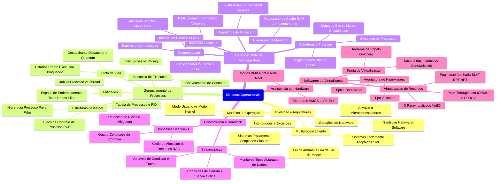
```mermaid
mindmap
  root("Sistemas Operacionais")
    Evolucao e Arquiteturas
      Gerações de Hardware
        Valvulas a Microprocessadores
        Simbiose Hardware-Software
      Modelos de Operação
        Modo Usuario vs Modo Kernel
        Interrupcoes e Excecoes
      Multiprocessamento
        Sistemas Fortemente Acoplados SMP
        Sistemas Fracamente Acoplados Clusters
        Lei de Amdahl e Fim da Lei de Moore
    Gerenciamento de Processos
      Entidades
        Job vs Processo vs Thread
        Espaco de Enderecamento Texto Dados Pilha
      Ciclo de Vida
        Estados Pronto Execucao Bloqueado
        Despachante Dispatcher e Quantum
      Estruturas de Kernel
        Bloco de Controle de Processo PCB
        Tabela de Processos e PID
        Hierarquia Processo Pai e Filho
      Mecanica de Execucao
        Chaveamento de Contexto
        Interrupcoes vs Polling
    Gerenciamento da Memoria Real
      Hierarquia de Memoria
        Registradores Cache RAM Armazenamento
      Alocacao Contigua
        Alocacao Simples Monotarefa
        Particionamento Estatico Fixas
        Particionamento Dinamico Variaveis
      Fragmentacao
        Interna em Particoes Fixas
        Externa e Compactacao
      Algoritmos de Alocacao
        First-Fit Best-Fit Worst-Fit Next-Fit
      Estruturas e Protecao
        Mapa de Bits vs Listas Encadeadas
        Registradores Base e Limite
        Swapping de Processos
    Concorrencia e Deadlock
      Sincronizacao
        Condicoes de Corrida e Secao Critica
        Monitores Tipos Abstratos de Dados
        Variaveis de Condicao e Travas
      Impasses Deadlocks
        Quatro Condicoes de Coffman
        Grafo de Alocacao de Recursos RAG
        Deteccao de Ciclos e Mitigacao
    Softwares de Virtualizacao
      Teoria de Virtualizacao
        Teorema de Popek-Goldberg
        Lacuna das Instrucoes Sensiveis x86
      Arquitetura de Hipervisores
        Tipo 1 Bare-Metal
        Tipo 2 Hosted
      Assistencia por Hardware
        Modos VMX Root e Non-Root
        Estruturas VMCS e VM-Exit
      Virtualizacao de Recursos
        Paginacao Aninhada SLAT EPT NPT
        IO Paravirtualizado VirtIO
        Pass-Through com IOMMU e SR-IOV
```

---

## Fundamentos e Arquitetura

### Evolução dos Sistemas Operacionais e Simbiose Hardware-Software

#### Definição
A relação entre hardware e software nos sistemas operacionais é categorizada como uma **simbiose essencial**: o hardware provê a capacidade física bruta de computação, armazenamento e sinalização elétrica, enquanto o sistema operacional atua como a camada intermediária de gerenciamento de recursos e máquina estendida (máquina virtual de alto nível), tornando o sistema programável, seguro e eficiente. Nenhum dos dois subsistemas pode cumprir um propósito computacional prático e isolado sem a presença coordenada do outro.

#### Motivação
Nos primórdios da computação eletrônica (década de 1940 a meados de 1950), computadores como o ENIAC operavam à base de válvulas termiônicas. Não existia o conceito de sistema operacional. Os programas eram introduzidos fisicamente por meio de conexões manuais em painéis de cabos (*plugboards*), chaves mecânicas e, posteriormente, pilhas sequenciais de cartões perfurados. O programador atuava como operador físico da máquina.

Com o advento dos transistores no final dos anos 1950 e dos circuitos integrados (CIs) na década de 1960, a velocidade de ciclo da Unidade Central de Processamento (UCP/CPU) saltou ordens de magnitude. O tempo demandado por um operador humano para carregar fitas magnéticas, alimentar leitores de cartões perfurados e alinhar formulários em impressoras tornou-se milhares de vezes superior ao tempo gasto pela CPU para processar o algoritmo. Tornou-se imperativo criar um software residente em memória permanente que assumisse o controle operacional da máquina, automatizando a transição entre tarefas: nascia o monitor residente dos sistemas em lote (*batch*), embrião dos sistemas operacionais modernos.

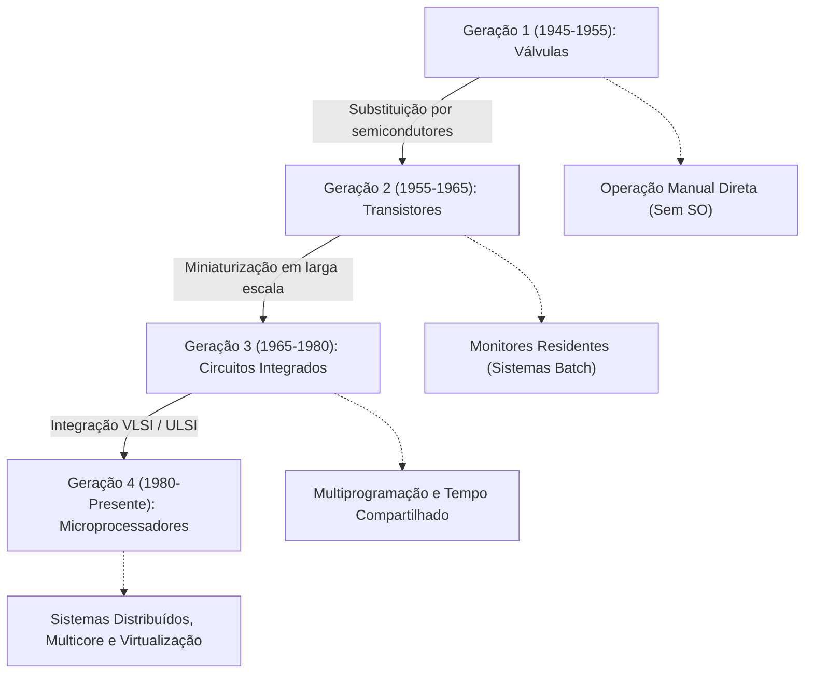
```mermaid
flowchart TD
  A["Geração 1 (1945-1955): Válvulas"] -->|"Substituição por semicondutores"| B["Geração 2 (1955-1965): Transistores"]
  B -->|"Miniaturização em larga escala"| C["Geração 3 (1965-1980): Circuitos Integrados"]
  C -->|"Integração VLSI / ULSI"| D["Geração 4 (1980-Presente): Microprocessadores"]

  A -.-> E["Operação Manual Direta (Sem SO)"]
  B -.-> F["Monitores Residentes (Sistemas Batch)"]
  C -.-> G["Multiprogramação e Tempo Compartilhado"]
  D -.-> H["Sistemas Distribuídos, Multicore e Virtualização"]
```

#### Exemplo
A introdução do controlador de Acesso Direto à Memória (DMA - *Direct Memory Access*) exemplifica a simbiose. O hardware do DMA permite a transferência massiva de blocos de dados entre um disco secundário e a memória RAM sem a intermediação da CPU em cada byte. Contudo, essa capacidade física é inútil sem o driver do sistema operacional no kernel, que configura os registradores de endereço de origem, destino e contagem de bytes, coloca a tarefa solicitante em espera e trata a interrupção gerada pelo barramento quando a transferência é finalizada.

#### Contraexemplo
Tentar implementar multiprogramação com isolamento de processos em uma CPU que não forneça suporte em silício a modos de operação hierárquicos (como o Intel 8086 original). Em tal hardware, qualquer código de aplicação pode sobrescrever o ponteiro de pilha do kernel ou reprogramar os controladores de interrupção, desmantelando a estabilidade operacional do software gerenciador.

#### Armadilhas Comuns
- **Reduzir o SO a uma biblioteca de utilitários:** Diferente de uma biblioteca padrão (`libc`), o sistema operacional detém controle exclusivo sobre instruções de máquina privilegiadas; ele não é apenas invocado, mas impõe limites coercitivos sobre as aplicações.
- **Supor independência total da arquitetura:** Embora linguagens de alto nível permitam portabilidade, a camada mais profunda do kernel (*Hardware Abstraction Layer* - HAL) é estritamente atrelada aos mnemônicos e à organização dos registradores da microarquitetura do processador.

---

### Modos de Operação do Processador e Barreira de Proteção

#### Definição
Os processadores modernos implementam em nível de circuito integrado a divisão de execução em **modos de privilégio**. O modelo clássico bipartite divide o espaço em:
1. **Modo Usuário (*User Mode* / Ring 3 em arquiteturas x86):** Nível com privilégios reduzidos onde executam os programas de aplicação. Instruções que alterem o estado global do hardware ou manipulem tabelas de sistema são bloqueadas pela CPU.
2. **Modo Núcleo (*Kernel Mode*, *Supervisor Mode* / Ring 0 em x86):** Nível irrestrito de privilégios onde executa o núcleo do sistema operacional. O processador tem permissão para despachar qualquer instrução de seu conjunto de instruções (*Instruction Set Architecture* - ISA), manipular diretamente portas de E/S e reconfigurar registradores de controle.

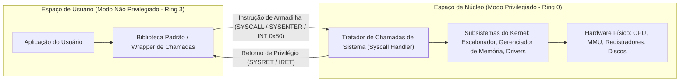
```mermaid
flowchart LR
  subgraph EspacoUsuario["Espaço de Usuário (Modo Não Privilegiado - Ring 3)"]
    App["Aplicação do Usuário"]
    LibC["Biblioteca Padrão / Wrapper de Chamadas"]
    App --> LibC
  end

  subgraph EspacoKernel["Espaço de Núcleo (Modo Privilegiado - Ring 0)"]
    SysHandler["Tratador de Chamadas de Sistema (Syscall Handler)"]
    Servicos["Subsistemas do Kernel: Escalonador, Gerenciador de Memória, Drivers"]
    Hardware["Hardware Físico: CPU, MMU, Registradores, Discos"]
    SysHandler --> Servicos
    Servicos --> Hardware
  end

  LibC -->|"Instrução de Armadilha (SYSCALL / SYSENTER / INT 0x80)"| SysHandler
  SysHandler -->|"Retorno de Privilégio (SYSRET / IRET)"| LibC
```

#### Motivação
A separação física de modos impede que erros de programação (como laços infinitos, estouro de ponteiros ou gravações de memória arbitrárias) ou códigos maliciosos derrubem a integridade global do sistema computacional ou violem a privacidade de dados de outros usuários e processos.

#### Exemplo
Quando um programa em C invoca a função `write()` para emitir caracteres em um terminal, a biblioteca converte a chamada em uma instrução especial de armadilha (*trap*), tal como `syscall` (em processadores x86_64). O processador suspende a aplicação, chaveia os bits de estado para Ring 0, consulta a tabela de vetores de interrupção/sistema e entrega o fluxo ao manipulador do kernel. O kernel valida os parâmetros, grava os dados na fila do dispositivo e retrocede a CPU para Ring 3 via instrução `sysret`.

#### Contraexemplo
Sistemas operacionais primitivos como o MS-DOS ou sistemas embarcados sem unidade de proteção de memória (MPU), onde a aplicação opera continuamente no mesmo nível de privilégio do núcleo da máquina. Um ponteiro corrompido que aponte para o vetor de interrupções resulta em travamento imediato e irreversível (*freeze* do computador).

#### Armadilhas Comuns
- **Acreditar que a mudança para o modo kernel cria um novo processo:** A transição de modo de operação ocorre dentro do contexto da mesma thread que disparou a chamada de sistema; trata-se de uma elevação de privilégio controlada por hardware, não de uma troca de contexto completa entre processos distintos.

---

### Concorrência versus Paralelismo e Multiprocessamento

#### Definição
- **Concorrência:** É a capacidade lógica e arquitetural do sistema operacional de gerenciar e avançar a execução de múltiplos fluxos de tarefas cujas janelas temporais de existência se sobrepõem. Em uma máquina com apenas um núcleo de processamento, a concorrência é obtida por intercalação temporal acelerada (*time-slicing*).
- **Paralelismo:** É a execução física, real e simultânea de duas ou mais instruções no exato mesmo ciclo de relógio (*clock*). O paralelismo estrito exige a disponibilidade física de múltiplos núcleos (*multicore*) ou múltiplos processadores independentes interconectados.

#### Classificação de Arquiteturas de Multiprocessamento
1. **Sistemas Fortemente Acoplados (SMP - *Symmetric Multiprocessing*):**
   - Múltiplos processadores compartilham o mesmo barramento físico e acessam um único espaço uniforme de memória principal (arquitetura UMA - *Uniform Memory Access*) ou quase-uniforme (NUMA - *Non-Uniform Memory Access*).
   - Controlados por uma única instância central do sistema operacional.
2. **Sistemas Fracamente Acoplados (Clusters e Sistemas Distribuídos):**
   - Múltiplos computadores autônomos e completos (nós), cada um possuindo sua própria CPU, memória principal e sistema operacional independente.
   - Comunicação e coordenação ocorrem estritamente via troca de mensagens por barramentos de rede (Ethernet, InfiniBand).

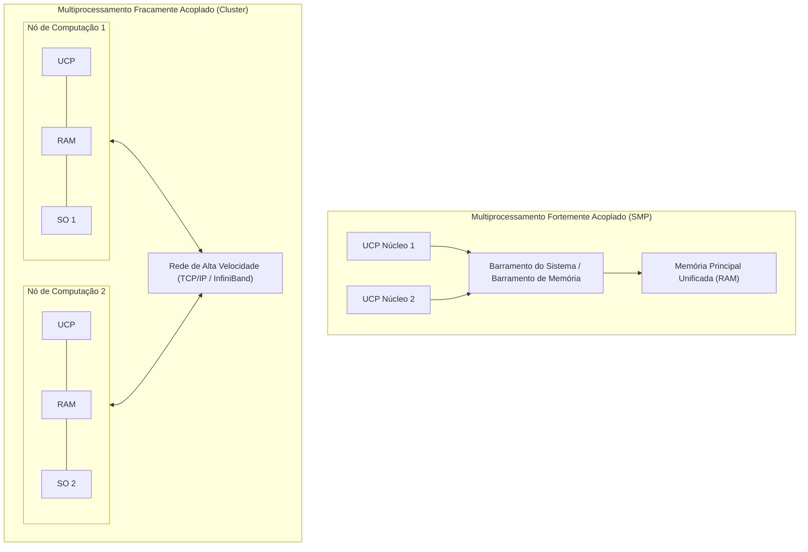
```mermaid
flowchart TD
  subgraph SMP["Multiprocessamento Fortemente Acoplado (SMP)"]
    CPU1["UCP Núcleo 1"]
    CPU2["UCP Núcleo 2"]
    Barramento["Barramento do Sistema / Barramento de Memória"]
    RAM["Memória Principal Unificada (RAM)"]
    CPU1 --> Barramento
    CPU2 --> Barramento
    Barramento --> RAM
  end

  subgraph Cluster["Multiprocessamento Fracamente Acoplado (Cluster)"]
    subgraph No1["Nó de Computação 1"]
      N1_CPU["UCP"] --- N1_RAM["RAM"] --- N1_SO["SO 1"]
    end
    subgraph No2["Nó de Computação 2"]
      N2_CPU["UCP"] --- N2_RAM["RAM"] --- N2_SO["SO 2"]
    end
    Rede["Rede de Alta Velocidade (TCP/IP / InfiniBand)"]
    No1 <--> Rede
    No2 <--> Rede
  end
```

#### A Lei de Amdahl e a Barreira da Escalabilidade
A aceleração teórica (*speedup*) que um programa pode obter ao ser executado em uma arquitetura paralela contendo $N$ processadores é limitada pela fração sequencial estrita do algoritmo ($S$), a qual não pode ser paralelizada. Se $P$ for a fração paralela ($P = 1 - S$), a Lei de Amdahl define:

$$\text{Speedup}(N) = \frac{1}{S + \frac{P}{N}} = \frac{1}{(1 - P) + \frac{P}{N}}$$

Quando o número de processadores tende ao infinito ($N \to \infty$), o ganho máximo atinge um teto assimptótico intransponível:

$$\lim_{N \to \infty} \text{Speedup}(N) = \frac{1}{S}$$

*Exemplo:* Se uma aplicação possui 10% de código intrinsecamente sequencial (como inicialização, sincronização de arquivos e gravação de logs), mesmo que o sistema disponha de 10.000 núcleos de CPU, a aceleração total máxima jamais ultrapassará $1 / 0{,}10 = 10\times$.

---

### Diferenciação entre Job, Processo e Thread

#### Definições Formais
- **Job:** Unidade de trabalho em lote (*batch*), submetida historicamente a computadores de grande porte sem operador interativo. Caracteriza-se por processamento linear e sequencial: o job entra na fila do sistema, aloca todos os recursos necessários, executa até o término e libera o computador para a tarefa subsequente.
- **Processo:** Instância ativa de um programa de computador em execução na memória. É uma unidade pesada de isolamento de recursos, possuindo seu próprio espaço de endereçamento de memória virtual exclusivo, tabela de descritores de arquivos, credenciais de usuário e variáveis de ambiente.
- **Thread:** Unidade elementar de alocação de tempo de CPU (*lightweight process*). Existe obrigatoriamente dentro do contexto de um processo. Múltiplas threads de um mesmo processo compartilham integralmente a região de código, o segmento de dados e os recursos do sistema, mas mantêm de forma estritamente privativa seu próprio contador de programa (PC), conjunto de registradores de hardware e sua pilha de execução (*stack*).

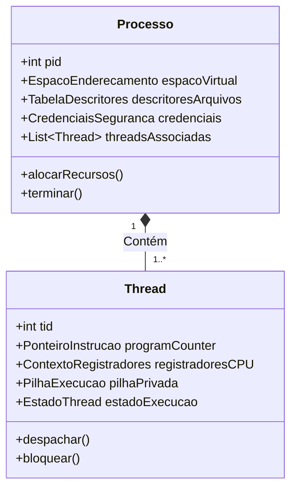
```mermaid
classDiagram
  class Processo {
    +int pid
    +EspacoEnderecamento espacoVirtual
    +TabelaDescritores descritoresArquivos
    +CredenciaisSeguranca credenciais
    +List~Thread~ threadsAssociadas
    +alocarRecursos()
    +terminar()
  }

  class Thread {
    +int tid
    +PonteiroInstrucao programCounter
    +ContextoRegistradores registradoresCPU
    +PilhaExecucao pilhaPrivada
    +EstadoThread estadoExecucao
    +despachar()
    +bloquear()
  }

  Processo "1" *-- "1..*" Thread : Contém
```

#### Motivação da Separação Estrutural
O isolamento pleno entre processos impede que a falha em um software (ex: um erro de divisão por zero ou tentativa de desreferenciar um ponteiro nulo) afete qualquer outro programa residente na RAM. Todavia, a comunicação entre processos distintos (IPC - *Inter-Process Communication*) demanda chamadas caras de sistema (troca de mensagens, memória compartilhada mediada por semáforos). 

As threads foram concebidas para permitir fluxos de trabalho cooperativos e concorrentes dentro da mesma aplicação, eliminando a barreira de memória e permitindo latências mínimas de comunicação pelo acesso direto às variáveis globais alocadas no *heap*.

---

### Anatomia da Memória do Processo: Texto, Dados e Pilha

#### Definição
Quando o sistema operacional executa um programa a partir do disco, a imagem executável é disposta em uma estrutura lógica segmentada na memória virtual do processo. No modelo canônico abordado pela disciplina, dividem-se as regiões em três blocos operacionais:

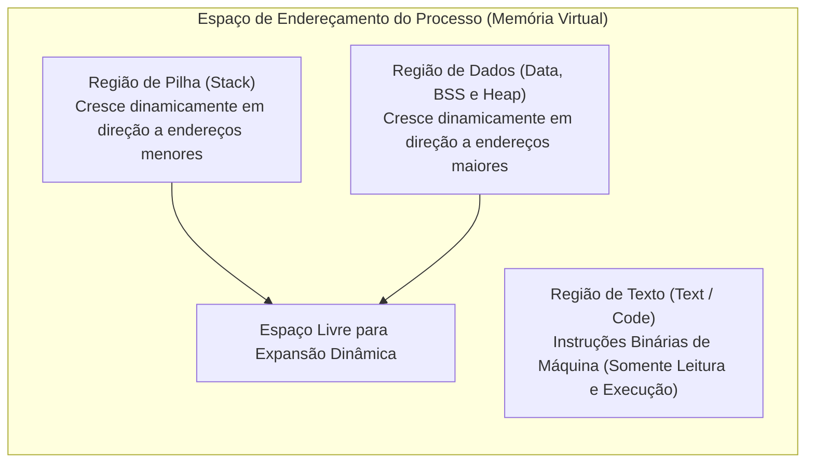
```mermaid
flowchart TD
  subgraph EspacoEnderecamento["Espaço de Endereçamento do Processo (Memória Virtual)"]
    direction TB
    Pilha["Região de Pilha (Stack)<br/>Cresce dinamicamente em direção a endereços menores"]
    Vazio["Espaço Livre para Expansão Dinâmica"]
    Dados["Região de Dados (Data, BSS e Heap)<br/>Cresce dinamicamente em direção a endereços maiores"]
    Texto["Região de Texto (Text / Code)<br/>Instruções Binárias de Máquina (Somente Leitura e Execução)"]
  end

  Pilha --> Vazio
  Dados --> Vazio
```

#### Regiões da Memória
1. **Região de Texto (*Text Segment*):**
   - Contém o código binário (instruções de máquina) a ser diretamente executado pela CPU.
   - Configurado pelo sistema operacional com permissões de **Somente Leitura e Execução (`R-X`)** na MMU, impedindo que o programa altere suas próprias instruções dinamicamente (técnica de proteção contra corrupção e injeção de código). É compartilhável em memória física entre múltiplas instâncias concorrentes do mesmo executável.
2. **Região de Dados (*Data Segment*):**
   - Subdividida em dados inicializados, dados não inicializados (*BSS - Block Started by Symbol*) e o *Heap* (área de alocação dinâmica em tempo de execução via chamadas como `malloc` ou operador `new`).
   - Configurado com permissões de **Leitura e Escrita (`RW-`)**. Cresce a partir de endereços baixos em direção a endereços altos.
3. **Região de Pilha (*Stack Segment*):**
   - Armazena a cadeia ativa de registros de ativação (*stack frames*) das funções: endereços de retorno para instruções antecedentes, parâmetros passados entre rotinas e variáveis locais alocadas estaticamente no escopo da função.
   - Configurado com permissões de **Leitura e Escrita (`RW-`)**. Por convenção da maioria das arquiteturas modernas (incluindo x86 e ARM), a pilha cresce a partir de endereços de memória altos em direção a endereços mais baixos.

---

### Ciclo de Vida do Processo e o Modelo Canônico de Três Estados

#### Definição
O ciclo de vida de um processo reflete as transformações de sua disponibilidade operacional conforme compete pelo processador, realiza operações periféricas lentas ou é interrompido por decisões do núcleo. No modelo fundamental tripartite de sistemas multiprogramáveis, o processo ocupa invariavelmente um de três estados operacionais:

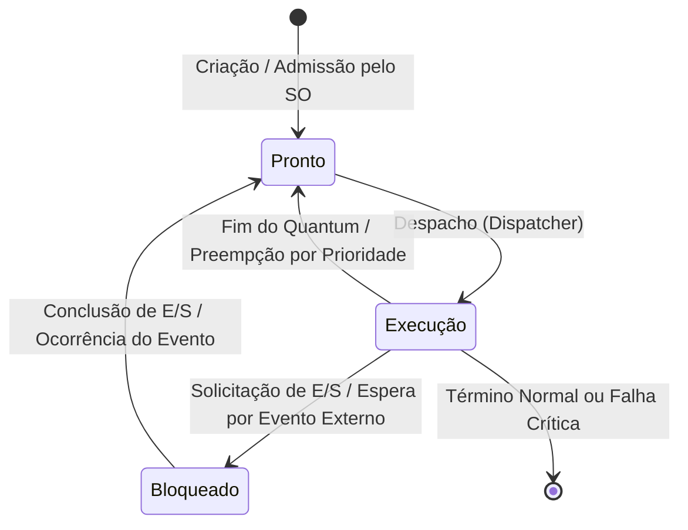
```mermaid
stateDiagram-v2
  [*] --> Pronto : Criação / Admissão pelo SO
  Pronto --> Execução : Despacho (Dispatcher)
  Execução --> Pronto : Fim do Quantum / Preempção por Prioridade
  Execução --> Bloqueado : Solicitação de E/S / Espera por Evento Externo
  Bloqueado --> Pronto : Conclusão de E/S / Ocorrência do Evento
  Execução --> [*] : Término Normal ou Falha Crítica
```

#### Descrição dos Estados
1. **Pronto (*Ready*):** O processo dispõe de todas as suas estruturas de memória, dados e registradores devidamente carregados e prontos para executar. Depende exclusivamente da concessão de tempo de uso da CPU pelo escalonador.
2. **Execução (*Running*):** O processo detém ativamente o controle de um núcleo de processamento. Suas instruções estão sendo lidas, decodificadas e executadas fisicamente pela ULA e pelas unidades funcionais do processador.
3. **Bloqueado (*Blocked* ou *Waiting*):** O processo não reúne condições lógicas de executar, mesmo que haja múltiplos processadores ociosos. Ele suspendeu sua própria execução até que um evento externo e assíncrono (leitura de bloco de disco, recebimento de pacote de rede, liberação de trava ou temporizador) seja concluído pelo hardware periférico.

#### Transições de Estado e Agentes Disparadores
- **Pronto $\to$ Execução:** Disparada pelo **Sistema Operacional** (através do escalonador e despachante) quando uma CPU se torna disponível e o processo é o próximo da fila de prioridades.
- **Execução $\to$ Pronto:** Disparada pelo **Sistema Operacional** ao ocorrer o término da fatia de tempo (*quantum*) por meio de uma interrupção de relógio de hardware (*timer interrupt*), ou pela chegada de um processo de maior prioridade (preempção).
- **Execução $\to$ Bloqueado:** Disparada de forma voluntária pelo **Próprio Processo**, ao invocar uma chamada de sistema síncrona que dependa de um periférico ou evento não disponível imediatamente (ex: `read()` em arquivo ou espera de semáforo).
- **Bloqueado $\to$ Pronto:** Disparada pelo **Sistema Operacional**, motivada por uma interrupção de hardware disparada pelo periférico informando o término da operação assíncrona. O processo jamais salta de Bloqueado diretamente para Execução.

---

### Estruturas de Controle: PCB, PID e Tabela de Processos

#### Definição
O **Bloco de Controle de Processo (PCB - *Process Control Block*)**, também denominado Descritor de Processo, é a estrutura de dados de controle central do sistema operacional que materializa a existência de um processo para o kernel. Cada processo existente no sistema possui exatamente uma instância de PCB dedicada e alocada dentro do espaço restrito de memória do kernel.

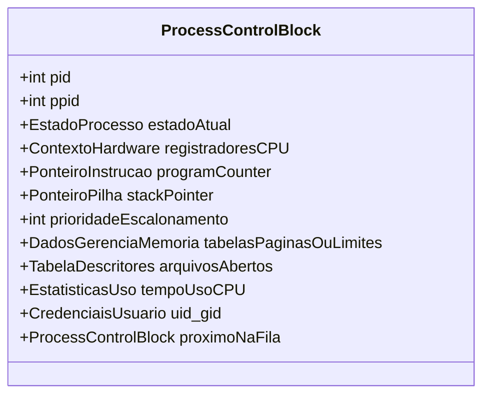
```mermaid
classDiagram
  class ProcessControlBlock {
    +int pid
    +int ppid
    +EstadoProcesso estadoAtual
    +ContextoHardware registradoresCPU
    +PonteiroInstrucao programCounter
    +PonteiroPilha stackPointer
    +int prioridadeEscalonamento
    +DadosGerenciaMemoria tabelasPaginasOuLimites
    +TabelaDescritores arquivosAbertos
    +EstatisticasUso tempoUsoCPU
    +CredenciaisUsuario uid_gid
    +ProcessControlBlock proximoNaFila
  }
```

#### Campos Primordiais do PCB
1. **Identificador do Processo (PID - *Process Identification Number*):** Inteiro único e não ambíguo atribuído pelo kernel para indexar o processo na tabela global de processos do sistema.
2. **Contexto de Hardware / Cópia dos Registradores:** Salva os valores de registradores de uso geral, registrador de estado (*FLAGS/EFLAGS*), ponteiro de instrução (PC) e ponteiro de pilha (SP) no exato instante em que o processo é retirado da CPU.
3. **Informações de Gerenciamento de Memória:** Ponteiros para as tabelas de páginas do processo, descritores de segmentos de memória ou valores dos registradores de Base e Limite.
4. **Informações de Escalonamento e Prioridade:** Nível de prioridade estática e dinâmica, tempo restante do *quantum*, histórico de uso acumulado de processador e ponteiros para as listas encadeadas das filas do escalonador.
5. **Estado de E/S e Descritores:** Vetor de ponteiros para arquivos abertos, descritores de sockets de rede em operação e dispositivos alocados.
6. **Contabilidade e Credenciais:** Tempo acumulado de computação em modo usuário e modo kernel, limites de cotas e identificadores de dono e grupo (UID, GID).

---

### Filiação, Hierarquia de Processos e Políticas de Término

#### Definição
Nos sistemas operacionais contemporâneos (com ênfase no padrão POSIX/Linux), os processos são estruturados em uma **árvore hierárquica estrita de filiação**. Com exceção do primeiro processo criado na inicialização da máquina pelo próprio kernel (o processo `init` ou `systemd`, cujo PID é invariavelmente 1), todo processo é gerado a partir de um processo pré-existente: o **Processo-Pai** (*Parent Process*), que instancia o **Processo-Filho** (*Child Process*).

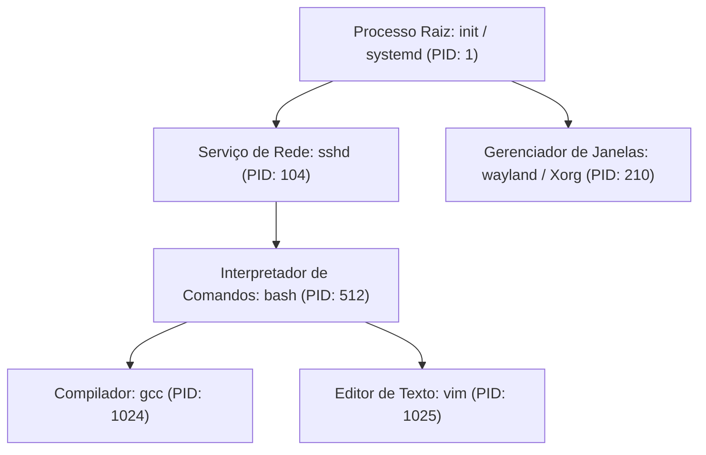
```mermaid
flowchart TD
  Init["Processo Raiz: init / systemd (PID: 1)"]
  Daemon1["Serviço de Rede: sshd (PID: 104)"]
  Daemon2["Gerenciador de Janelas: wayland / Xorg (PID: 210)"]
  Shell["Interpretador de Comandos: bash (PID: 512)"]
  Compilador["Compilador: gcc (PID: 1024)"]
  Editor["Editor de Texto: vim (PID: 1025)"]

  Init --> Daemon1
  Init --> Daemon2
  Daemon1 --> Shell
  Shell --> Compilador
  Shell --> Editor
```

#### Estados Patológicos de Filiação
- **Processo Zumbi (*Zombie Process*):** Ocorre quando um processo-filho executa todas as suas instruções e emite uma chamada de encerramento (`exit()`). O kernel libera seu espaço de endereçamento de memória (código, dados e pilha), mas mantém seu PCB e seu registro na tabela de processos contendo seu código de retorno, aguardando que o processo-pai execute a chamada de leitura correspondente (`wait()` ou `waitpid()`). Se o pai falha em executar o `wait()`, o filho permanece retido na tabela de processos como um zumbi, consumindo entradas de PIDs disponíveis no kernel.
- **Processo Órfão (*Orphan Process*):** Ocorre quando o processo-pai encerra sua execução antes de seus filhos terminarem. Para prevenir que os processos fiquem sem supervisão, o sistema operacional realiza a adoção compulsória desses processos-filhos pelo processo raiz `init` (PID 1). O `init` monitora continuamente seus filhos adotivos, executando `wait()` imediatamente assim que eles encerram para limpar seus PCBs da memória.

#### Políticas de Término em Cascata
Em determinados sistemas operacionais corporativos e de tempo real, aplica-se a política de **destruição em cascata**: a morte ou cancelamento forçado de um processo-pai acarreta a destruição síncrona e automática de todos os seus processos-filhos, netos e descendentes subsequentes.

---

### Mecanismo de Chaveamento de Contexto (Context Switch)

#### Definição
O **Chaveamento de Contexto (*Context Switch*)** é o procedimento operacional executado pelo núcleo do sistema operacional para interromper a execução do processo que ocupa a CPU, salvar seu estado físico completo em seu respectivo PCB, e carregar o estado físico previamente salvo de outro processo que estava na fila de prontos, entregando o fluxo de controle a este último.

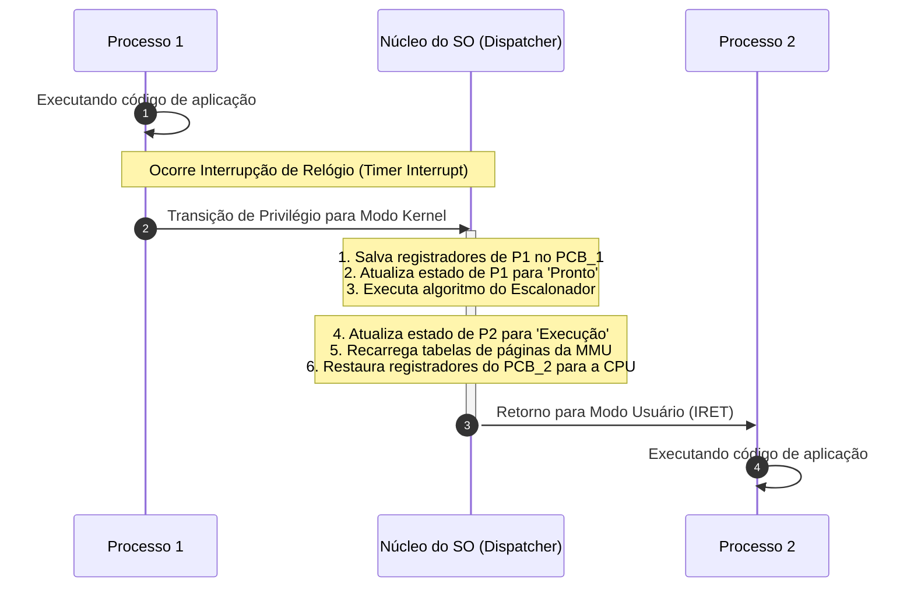
```mermaid
sequenceDiagram
  autonumber
  participant P1 as Processo 1
  participant Kernel as Núcleo do SO (Dispatcher)
  participant P2 as Processo 2

  P1->>P1: Executando código de aplicação
  Note over P1,Kernel: Ocorre Interrupção de Relógio (Timer Interrupt)
  P1->>Kernel: Transição de Privilégio para Modo Kernel
  activate Kernel
  Note over Kernel: 1. Salva registradores de P1 no PCB_1<br/>2. Atualiza estado de P1 para 'Pronto'<br/>3. Executa algoritmo do Escalonador
  Note over Kernel: 4. Atualiza estado de P2 para 'Execução'<br/>5. Recarrega tabelas de páginas da MMU<br/>6. Restaura registradores do PCB_2 para a CPU
  Kernel->>P2: Retorno para Modo Usuário (IRET)
  deactivate Kernel
  P2->>P2: Executando código de aplicação
```

#### Sobrecarga (*Overhead*) e Efeitos Colaterais no Hardware
O chaveamento de contexto representa **puro desperdício de tempo da CPU (*pure overhead*)**, uma vez que a máquina gasta ciclos executando código administrativo de controle do kernel sem avançar o trabalho útil de nenhuma aplicação de usuário. Os custos de um context switch dividem-se em:
1. **Custo Direto:** Tempo gasto pelo processador para salvar e restaurar dezenas de registradores gerais e registradores de controle em memória RAM.
2. **Custo Indireto (Penalidade de Cache e TLB):** Ao alternar para outro processo com um espaço de endereçamento virtual completamente distinto, o registrador base da tabela de páginas da CPU (ex: `CR3` em x86) é modificado. Isso força a invalidação das entradas do *Translation Lookaside Buffer* (TLB - cache de tradução de endereços virtuais da MMU) e causa uma avalanche de perdas de cache (*cache misses*) nas memórias L1 e L2, pois os dados trazidos à cache pelo processo anterior não pertencem ao novo processo ativo.

---

### Arquitetura de Interrupções versus Sondagem (Polling)

#### Definição
- **Sondagem (*Polling*):** Abordagem síncrona e em laço fechado (*busy waiting*) onde a CPU consulta continuamente, em ciclos repetitivos de instruções, o registrador de estado de um periférico para saber se ele finalizou sua operação ou se possui dados disponíveis para leitura.
- **Interrupção de Hardware:** Mecanismo assíncrono mediado por circuitos eletrônicos dedicados (como o controlador de interrupções APIC). O processador delega a tarefa ao periférico e continua executando cálculos de outros processos. Quando o periférico conclui a operação, ele injeta um sinal elétrico no barramento de controle da CPU, forçando o desvio temporário do processador para um tratador de interrupção (*Interrupt Service Routine* - ISR).

#### Comparação Estrutural: Interrupção versus Sondagem

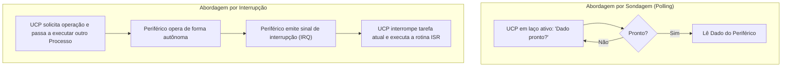
```mermaid
flowchart TD
  subgraph Sondagem["Abordagem por Sondagem (Polling)"]
    P_Loop["UCP em laço ativo: 'Dado pronto?'"] --> P_Check{"Pronto?"}
    P_Check -- Não --> P_Loop
    P_Check -- Sim --> P_Read["Lê Dado do Periférico"]
  end

  subgraph Interrupcao["Abordagem por Interrupção"]
    I_Start["UCP solicita operação e passa a executar outro Processo"]
    I_Wait["Periférico opera de forma autônoma"]
    I_Signal["Periférico emite sinal de interrupção (IRQ)"]
    I_ISR["UCP interrompe tarefa atual e executa a rotina ISR"]
    I_Start --> I_Wait --> I_Signal --> I_ISR
  end
```

#### Classificação das Interrupções
1. **Interrupções Assíncronas (Interrupções de Hardware):** Desencadeadas por componentes físicos externos e não sincronizados com o relógio da CPU (ex: relógio do temporizador, pacote de rede na placa Ethernet, tecla pressionada).
2. **Interrupções Síncronas (Exceções e Armadilhas / *Traps*):** Desencadeadas internamente pela própria execução de uma instrução pela CPU. Subdividem-se em:
   - *Faltas (*Faults*):* Erros recuperáveis (ex: falta de página na memória virtual - *Page Fault*). A instrução que gerou a falta é reexecutada após o tratamento.
   - *Armadilhas (*Traps*):* Desvios voluntários gerados propositadamente por código (ex: chamadas de sistema via `syscall`). A execução continua na instrução subsequente.
   - *Abortos (*Aborts*):* Falhas críticas e não recuperáveis de hardware ou violações severas de integridade (ex: erro de paridade de barramento de máquina). A tarefa é terminada compulsoriamente.

#### O Risco da Tempestade de Interrupções (*Interrupt Storm*)
Embora os sistemas orientados a interrupções apresentem eficiência superior à sondagem na imensa maioria das cargas de trabalho, sob fluxos torrenciais de eventos externos (ex: um servidor conectado a uma rede sob ataque massivo de negação de serviço recebendo dezenas de milhões de pacotes por segundo), a CPU passa a gastar 100% de seu tempo atendendo ISRs de chaveamento de hardware, sem tempo residual para executar o código de espaço de usuário responsável por processar os dados. Nesses cenários extremos de alta taxa de dados, técnicas modernas de driver revertem dinamicamente o modelo de interrupção para sondagem controlada temporária (técnica conhecida como *NAPI* no Linux).

---

### Gerenciamento da Memória Real e Hierarquia de Memória

#### Definição
A **Hierarquia de Memória** é a organização piramidal dos dispositivos de armazenamento de um computador, projetada para equilibrar a discrepância física incontornável entre velocidade de propagação de sinais elétricos, capacidade volumétrica de dados e custo de fabricação por bit. Ela apoia-se firmemente no **Princípio da Localidade**:
- **Localidade Temporal:** Recursos acessados recentemente têm probabilidade estatística elevada de serem referenciados novamente em um futuro próximo (ex: variáveis contadoras de laços `for`).
- **Localidade Espacial:** Recursos localizados em posições de memória fisicamente adjacentes àquela que acabou de ser acessada tendem a ser requisitados em sequência (ex: elementos de um vetor unidimensional contíguo ou instruções lineares de código).

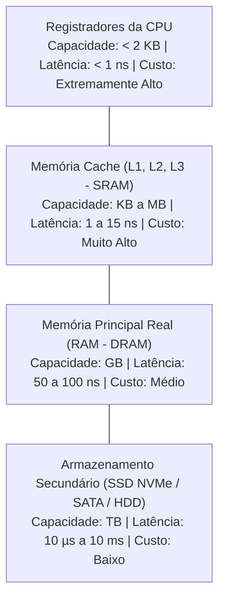
```mermaid
flowchart TD
  L0["Registradores da CPU<br/>Capacidade: < 2 KB | Latência: < 1 ns | Custo: Extremamente Alto"]
  L1["Memória Cache (L1, L2, L3 - SRAM)<br/>Capacidade: KB a MB | Latência: 1 a 15 ns | Custo: Muito Alto"]
  L2["Memória Principal Real (RAM - DRAM)<br/>Capacidade: GB | Latência: 50 a 100 ns | Custo: Médio"]
  L3["Armazenamento Secundário (SSD NVMe / SATA / HDD)<br/>Capacidade: TB | Latência: 10 µs a 10 ms | Custo: Baixo"]

  L0 --- L1
  L1 --- L2
  L2 --- L3
```

#### O Papel do Gerenciador de Memória Real (*Memory Manager*)
A memória RAM é um vetor físico sequencial de bytes endereçáveis. O subsistema de gerenciamento de memória do kernel possui quatro atribuições críticas:
1. **Rastreamento de Alocação:** Manter inventário rigoroso de quais bytes estão livres e quais pertencem a quais processos.
2. **Alocação e Desalocação:** Responder prontamente às demandas de carregamento de novos processos e devolução de blocos quando processos se encerram.
3. **Isolamento e Proteção:** Impedir que o Processo $A$ realize leituras ou gravações nos limites físicos alocados ao Processo $B$ ou à região privativa do kernel.
4. **Realocação Dinâmica:** Permitir que o código de um programa seja executado independentemente de qual posição física absoluta da RAM ele venha a ocupar a cada inicialização.

---

### Alocação Contígua Simples e Particionamento Estático

#### Alocação Contígua Simples (Sistemas Monoprogramados)
Empregada em sistemas monotarefa primitivos (como o MS-DOS). A memória principal total é dividida em estritamente dois blocos contíguos:
- A área permanente reservada às rotinas do sistema operacional e aos vetores de interrupção (geralmente nos endereços mais baixos da RAM).
- A área do usuário, alocada de forma integral e exclusiva para um único programa ativo de cada vez.

O grau de multiprogramação é rigorosamente $N = 1$. Caso o programa do usuário ocupe apenas uma fração minúscula da área disponível, todo o espaço restante permanece completamente ocioso e bloqueado para uso.

#### Particionamento Estático (Partições Fixas)
Para viabilizar a multiprogramação, a memória física é dividida, no instante de inicialização do sistema, em $M$ partições pré-determinadas cujos limites não se alteram durante a operação:
- **Partições de Tamanho Igual:** Todos os blocos possuem dimensões idênticas (ex: memória de 1024 KB particionada em quatro blocos rígidos de 256 KB).
- **Partições de Tamanhos Diferentes:** Os blocos possuem tamanhos distintos (ex: partições de 64 KB, 128 KB, 256 KB e 512 KB), permitindo acomodar tarefas de portes variados com menor desperdício.

Cada partição só pode conter exatamente um processo por vez. O grau de multiprogramação é estritamente limitado ao número de partições existentes ($M$).

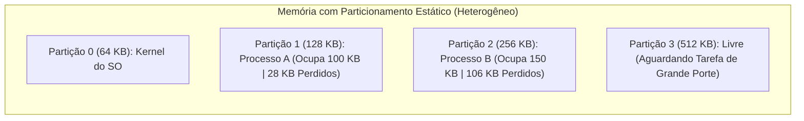
```mermaid
flowchart LR
  subgraph MemoriaFixa["Memória com Particionamento Estático (Heterogêneo)"]
    direction TB
    P0["Partição 0 (64 KB): Kernel do SO"]
    P1["Partição 1 (128 KB): Processo A (Ocupa 100 KB | 28 KB Perdidos)"]
    P2["Partição 2 (256 KB): Processo B (Ocupa 150 KB | 106 KB Perdidos)"]
    P3["Partição 3 (512 KB): Livre (Aguardando Tarefa de Grande Porte)"]
  end
```

---

### Fragmentação Interna e Externa: Análise Matemática

A divisão e alocação do espaço físico da memória real acarretam perdas estruturais classificadas formalmente em duas categorias:

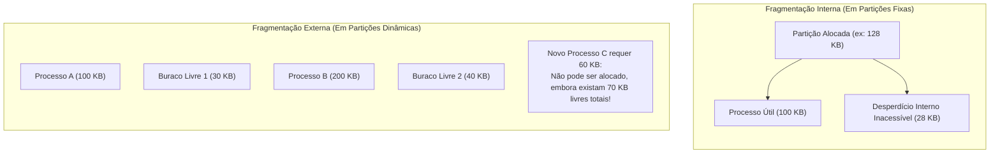
```mermaid
flowchart TD
  subgraph FragInterna["Fragmentação Interna (Em Partições Fixas)"]
    direction TB
    FI_Bloco["Partição Alocada (ex: 128 KB)"]
    FI_Proc["Processo Útil (100 KB)"]
    FI_Lixo["Desperdício Interno Inacessível (28 KB)"]
    FI_Bloco --> FI_Proc
    FI_Bloco --> FI_Lixo
  end

  subgraph FragExterna["Fragmentação Externa (Em Partições Dinâmicas)"]
    direction TB
    FE_P1["Processo A (100 KB)"]
    FE_Buraco1["Buraco Livre 1 (30 KB)"]
    FE_P2["Processo B (200 KB)"]
    FE_Buraco2["Buraco Livre 2 (40 KB)"]
    FE_Novo["Novo Processo C requer 60 KB:<br/>Não pode ser alocado, embora existam 70 KB livres totais!"]
  end
```

#### 1. Fragmentação Interna ($FI$)
- **Definição:** Ocorre quando o bloco de memória alocado pelo sistema operacional a um processo é dimensionalmente maior do que a memória que o processo efetivamente demanda. A folga resultante fica compreendida *dentro* das fronteiras da partição alocada àquele processo, mas torna-se totalmente inalocável para qualquer outro processo da fila.
- **Causa Primordial:** Adoção de modelos de alocação de blocos em tamanhos fixos pré-determinados (como particionamento estático e a alocação de páginas de tamanho fixo em paginação).
- **Formalização Matemática:** Para um conjunto de $M$ partições ativas, onde cada partição $i$ possui capacidade $S_{part}(i)$ e o processo nela alocado demanda $S_{proc}(i)$:

$$FI(i) = S_{part}(i) - S_{proc}(i), \quad \text{onde } S_{part}(i) \ge S_{proc}(i)$$

$$FI_{total} = \sum_{i=1}^{M} FI(i) = \sum_{i=1}^{M} \left( S_{part}(i) - S_{proc}(i) \right)$$

#### 2. Fragmentação Externa ($FE$)
- **Definição:** Ocorre quando a memória livre disponível total do sistema seria suficiente para acomodar a requisição de um novo processo, mas esse espaço livre encontra-se disperso em múltiplos fragmentos e "buracos" não contíguos ao longo da RAM. Como o modelo clássico de memória real exige alocação contígua, o processo é impedido de executar.
- **Causa Primordial:** Particionamento dinâmico decorrente do ciclo assimétrico de entrada e saída de processos com tamanhos arbitrários ao longo do tempo.
- **Mitigação Física:** Realizada por meio do procedimento de **Compactação de Memória**, no qual o sistema operacional suspende todos os processos, desloca-os fisicamente pela RAM agrupando-os em uma extremidade contígua e consolida todos os buracos dispersos em um único grande bloco livre na outra extremidade.
- **Sobrecarga da Compactação:** A compactação consome tempo massivo de processamento e E/S de memória, além de exigir que a arquitetura do processador e do sistema operacional suporte realocação puramente dinâmica via registradores de Base e Limite.

---

### Particionamento Dinâmico e Estruturas de Controle (Bitmap e Listas)

#### Particionamento Dinâmico (Partições Variáveis)
Diferente das partições estáticas, no particionamento dinâmico as partições são criadas sob demanda em tempo de execução, com a dimensão exata solicitada pelo processo entrante. À medida que os processos terminam sua execução, eles liberam suas partições, criando "buracos" (*holes*) de espaço livre. A memória real passa a alternar blocos alocados e blocos livres de tamanhos variáveis.

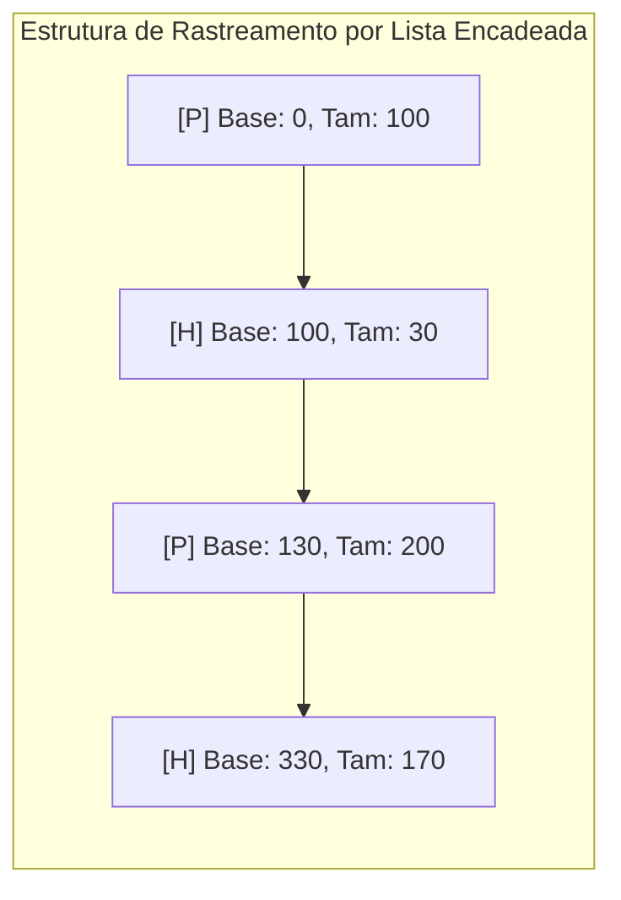
```mermaid
flowchart LR
  subgraph ListaBuracos["Estrutura de Rastreamento por Lista Encadeada"]
    N1["[P] Base: 0, Tam: 100"] --> N2["[H] Base: 100, Tam: 30"]
    N2 --> N3["[P] Base: 130, Tam: 200"]
    N3 --> N4["[H] Base: 330, Tam: 170"]
  end
```

#### Algoritmos de Alocação de Espaço Livre
Quando um processo chega solicitando $K$ kilobytes de memória contígua e existem múltiplos blocos livres de tamanhos variados na RAM, o kernel adota uma de quatro políticas clássicas de varredura:

1. **Primeiro Encaixe (*First-Fit*):**
   - O algoritmo percorre a estrutura de controle a partir do início da memória e aloca o **primeiro buraco livre** que possua tamanho suficiente ($S_{buraco} \ge K$).
   - O bloco é subdividido: $K$ bytes são entregues ao processo e o restante torna-se um buraco menor.
   - *Vantagem:* É o algoritmo mais rápido e computacionalmente mais leve.
2. **Melhor Encaixe (*Best-Fit*):**
   - Percorre a estrutura inteira de memória para localizar o buraco que melhor se ajuste ao tamanho $K$, ou seja, aquele cujo tamanho seja maior ou igual a $K$, mas gere a **menor sobra residual possível** ($S_{buraco} - K \to \min$).
   - *Desvantagem:* Gera uma profusão de fragmentos minúsculos ("poeira de memória") que dificilmente poderão ser aproveitados por qualquer outro processo.
3. **Pior Encaixe (*Worst-Fit*):**
   - Varre toda a memória e aloca o **maior buraco livre disponível**, sob a premissa de que a sobra residual resultante será volumosa o suficiente para acomodar confortavelmente outros processos futuros.
   - *Desvantagem:* Consome os grandes blocos livres que seriam cruciais para a alocação de tarefas pesadas.
4. **Próximo Encaixe (*Next-Fit*):**
   - Variação do First-Fit. Inicia a busca a partir da posição exata da memória onde foi realizada a última alocação bem-sucedida, em vez de recomeçar do início da lista.
   - *Desvantagem:* Apresenta desempenho ligeiramente inferior ao First-Fit nos testes práticos, pois fragmenta rapidamente a metade final da memória.

#### Estruturas de Dados de Controle
Para rastrear a ocupação da memória real, o kernel utiliza tradicionalmente duas técnicas:
- **Mapa de Bits (*Bitmap*):** A memória física é dividida em unidades discretas de alocação (ex: blocos de 4 bytes a alguns kilobytes). Cada unidade é representada por um único bit no mapa: `0` para livre e `1` para ocupado. 
  - *Trade-off:* O consumo de espaço do bitmap é constante e previsível ($1/N$ do tamanho da memória), mas encontrar uma sequência contígua de $K$ blocos livres requer busca sequencial lenta de bits consecutivos.
- **Listas Encadeadas:** Uma lista duplamente ligada onde cada nó descreve um segmento de memória: seu tipo (`P` para Processo alocado ou `H` para *Hole*/Livre), seu endereço de base física, seu tamanho e o ponteiro para o nó subsequente. Permite fusão imediata de buracos adjacentes quando um processo termina (`H + H = H_maior`).

---

### Proteção e Realocação Dinâmica com Registradores Base e Limite

#### Definição
A técnica de proteção e realocação dinâmica baseada em registradores de hardware constitui o pilar que permitiu a multiprogramação segura antes do advento da paginação completa. O processador incorpora em sua Unidade de Gerenciamento de Memória (**MMU**) dois registradores especiais acessíveis apenas no Modo Núcleo:
1. **Registrador de Base:** Armazena o endereço físico inicial absoluto onde o processo está alocado na memória RAM.
2. **Registrador de Limite:** Armazena o tamanho exato do espaço de endereçamento alocado àquele processo (comprimento da região permitida).

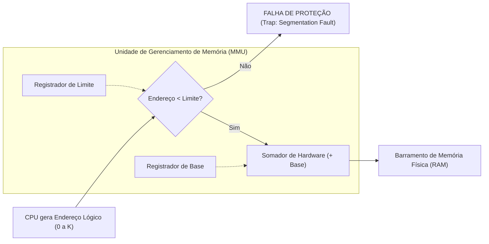
```mermaid
flowchart LR
  CPU["CPU gera Endereço Lógico (0 a K)"] --> Cmp{"Endereço < Limite?"}
  Cmp -- Não --> Trap["FALHA DE PROTEÇÃO (Trap: Segmentation Fault)"]
  Cmp -- Sim --> Somador["Somador de Hardware (+ Base)"]
  Somador --> RAM["Barramento de Memória Física (RAM)"]
  
  subgraph MMU_Hardware["Unidade de Gerenciamento de Memória (MMU)"]
    Cmp
    Somador
    RegBase["Registrador de Base"] -.-> Somador
    RegLimite["Registrador de Limite"] -.-> Cmp
  end
```

#### Dinâmica de Tradução em Tempo de Execução
- Todo o código do programa é compilado assumindo um espaço de endereçamento que se inicia virtualmente no endereço lógico `0x00000000`.
- Quando a CPU despacha uma instrução para ler o endereço lógico $L$:
  1. O hardware da MMU compara se $L < \text{Limite}$. Se $L \ge \text{Limite}$, a instrução é abortada e a CPU gera imediatamente uma interrupção síncrona de falha de proteção de memória (*Trap* de violação de segmento).
  2. Se $L$ for válido, a MMU soma o deslocamento à base física: $\text{Endereço Físico Real} = L + \text{Base}$.
- Durante o chaveamento de contexto, o sistema operacional atualiza os valores dos registradores de Base e Limite na CPU a partir das informações armazenadas no PCB do processo que assumirá o processador.

---

### Técnica de Swapping e Desempenho de Entrada e Saída

#### Definição
O **Swapping** é uma técnica clássica de gerenciamento em que o sistema operacional, diante da escassez crítica de memória RAM física para manter todos os processos ativos do sistema carregados simultaneamente, transfere temporariamente a **imagem integral da memória de um processo** (código, dados e pilha) para uma área dedicada de armazenamento secundário (disco rígido ou SSD), conhecida como **área de troca (*swap space*)**.

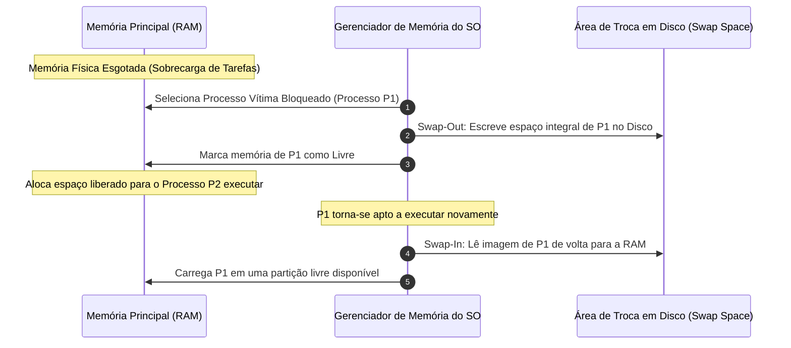
```mermaid
sequenceDiagram
  autonumber
  participant RAM as Memória Principal (RAM)
  participant Kernel as Gerenciador de Memória do SO
  participant Disco as Área de Troca em Disco (Swap Space)

  Note over RAM: Memória Física Esgotada (Sobrecarga de Tarefas)
  Kernel->>RAM: Seleciona Processo Vítima Bloqueado (Processo P1)
  Kernel->>Disco: Swap-Out: Escreve espaço integral de P1 no Disco
  Kernel->>RAM: Marca memória de P1 como Livre
  Note over RAM: Aloca espaço liberado para o Processo P2 executar
  Note over Kernel: P1 torna-se apto a executar novamente
  Kernel->>Disco: Swap-In: Lê imagem de P1 de volta para a RAM
  Kernel->>RAM: Carrega P1 em uma partição livre disponível
```

#### Impacto no Desempenho do Sistema
O swapping de processos completos gera uma penalidade severa de tempo. Se um processo de 512 MB de dados precisa sofrer *swap-out* para um disco rígido convencional com taxa sustentada de transferência de 100 MB/s:

$$T_{\text{swap-out}} = \frac{512\text{ MB}}{100\text{ MB/s}} \approx 5{,}12\text{ segundos}$$

Nesse intervalo de mais de cinco segundos, a operação de E/S consome os barramentos de armazenamento, tornando o swapping de processos inteiros uma medida emergencial de contenção para evitar colapso de memória, em contraste com a paginação moderna sob demanda, que movimenta apenas pequenas páginas discretas de 4 KB.

---

### Concorrência Avançada e Seções Críticas em Multiprocessamento

#### Definição
Em ambientes onde múltiplas threads ou múltiplos processadores operam simultaneamente sobre estruturas de dados comuns, define-se como **Seção Crítica (*Critical Section*)** o trecho de código que acessa e manipula um recurso compartilhado (como uma variável global, uma tabela de banco de dados ou um arquivo).

Se a execução desse bloco não for controlada, ocorre uma **Condição de Corrida (*Race Condition*)**: cenário em que o resultado final da computação depende de forma imprevisível da ordem temporal e do entrelaçamento arbitrário das instruções executadas pelas diferentes CPUs.

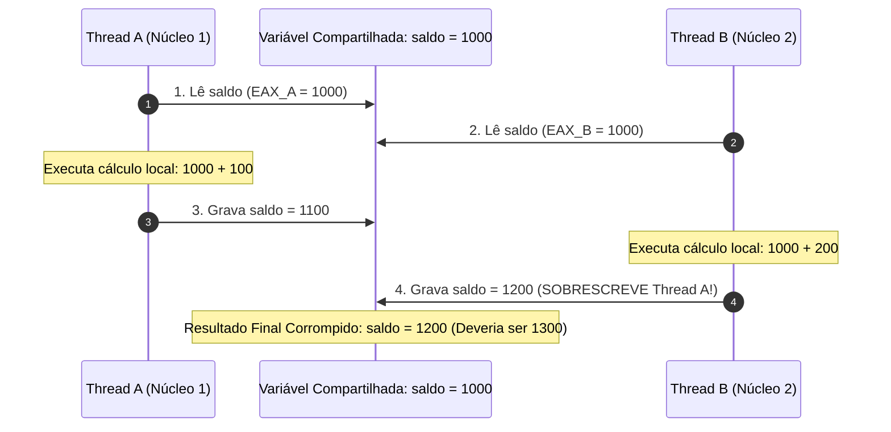
```mermaid
sequenceDiagram
  autonumber
  participant ThreadA as Thread A (Núcleo 1)
  participant Mem as Variável Compartilhada: saldo = 1000
  participant ThreadB as Thread B (Núcleo 2)

  ThreadA->>Mem: 1. Lê saldo (EAX_A = 1000)
  ThreadB->>Mem: 2. Lê saldo (EAX_B = 1000)
  Note over ThreadA: Executa cálculo local: 1000 + 100
  ThreadA->>Mem: 3. Grava saldo = 1100
  Note over ThreadB: Executa cálculo local: 1000 + 200
  ThreadB->>Mem: 4. Grava saldo = 1200 (SOBRESCREVE Thread A!)
  Note over Mem: Resultado Final Corrompido: saldo = 1200 (Deveria ser 1300)
```

#### Critérios Formais para Solução da Seção Crítica
Qualquer mecanismo de software ou hardware projetado para regular o acesso à seção crítica deve satisfazer compulsoriamente a quatro propriedades fundamentais:
1. **Exclusão Mútua (*Mutual Exclusion*):** Se uma thread está executando instruções no interior de sua seção crítica, nenhuma outra thread pode ter permissão para entrar simultaneamente na seção crítica do mesmo recurso.
2. **Progresso (*Progress*):** Se nenhuma thread está na seção crítica e existem threads solicitando entrada, apenas aquelas que não estão em sua seção restante podem participar da decisão de quem entrará a seguir, e essa escolha não pode ser postergada indefinidamente.
3. **Espera Limitada (*Bounded Waiting*):** Deve existir um limite mensurável sobre o número de vezes que outras threads podem passar à frente de uma thread que já solicitou permissão de entrada antes que sua requisição seja atendida (prevenção contra inanição ou *starvation*).
4. **Independência de Velocidade Relativa:** A correção lógica da solução não pode assumir hipóteses sobre a velocidade relativa dos processadores físicos nem sobre a quantidade de núcleos de hardware existentes na máquina.

---

### Monitores: Arquitetura, Procedimentos de Acesso e Exclusão Mútua

#### Definição
*(Proposto originalmente por C.A.R. Hoare e Per Brinch Hansen).*  
O **Monitor** é um mecanismo de sincronização de concorrência estruturado de **alto nível**, encapsulado na forma de um Tipo Abstrato de Dados (TAD) ou classe. Ele agrega em uma única entidade formal:
1. O estado e as estruturas de dados privadas do recurso compartilhado.
2. Os procedimentos ou métodos públicos de acesso permitidos sobre esses dados.
3. O controle intrínseco de exclusão mútua, garantido pelo compilador da linguagem e pelo ambiente de execução (*runtime*).

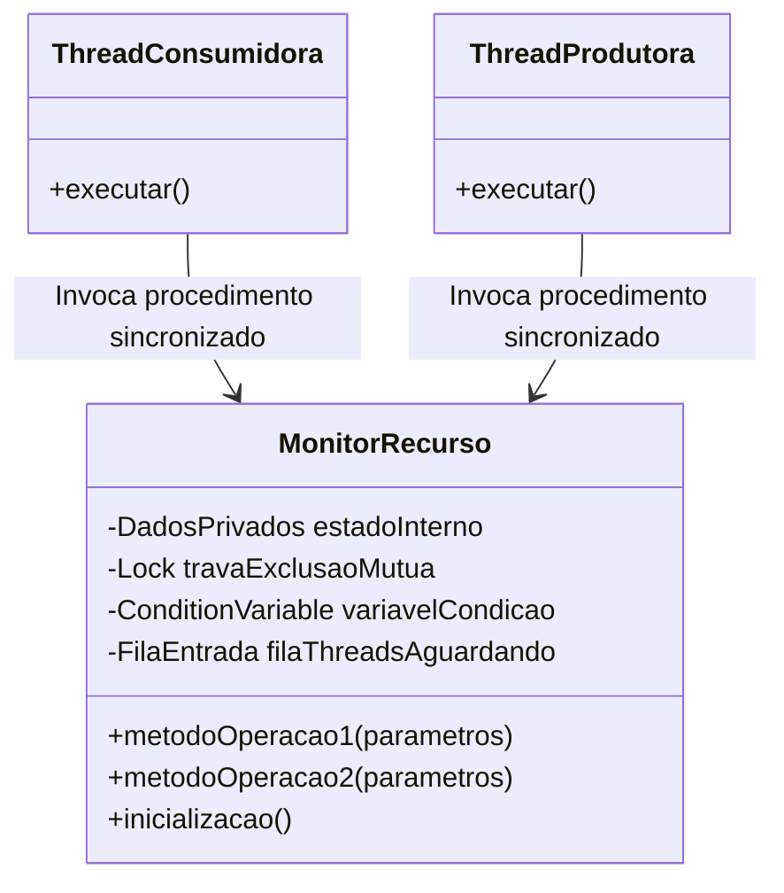
```mermaid
classDiagram
  class MonitorRecurso {
    -DadosPrivados estadoInterno
    -Lock travaExclusaoMutua
    -ConditionVariable variavelCondicao
    -FilaEntrada filaThreadsAguardando
    +metodoOperacao1(parametros)
    +metodoOperacao2(parametros)
    +inicializacao()
  }

  class ThreadConsumidora {
    +executar()
  }

  class ThreadProdutora {
    +executar()
  }

  ThreadConsumidora --> MonitorRecurso : Invoca procedimento sincronizado
  ThreadProdutora --> MonitorRecurso : Invoca procedimento sincronizado
```

#### Componentes Arquiteturais e Funcionamento Interno
- **Dados Privados:** Variáveis que representam o recurso (ex: buffers circulares, ponteiros de fila, contadores). São rigorosamente encapsuladas: nenhuma instrução externa ao monitor tem autorização léxica ou de memória para manipulá-las diretamente.
- **Procedimentos de Acesso:** Funções públicas exportadas pelo monitor. Para cada método, o compilador insere compulsoriamente um prólogo (rotina de entrada) que adquire uma trava atômica (*mutex*) e um epílogo (rotina de saída) que a libera.
- **Garantia de Exclusão Mútua:** Em qualquer instante de tempo, **no máximo uma única thread pode estar ativamente executando código** dentro de qualquer um dos procedimentos pertencentes àquela instância do monitor ($N \le 1$). Se uma thread tentar invocar um método enquanto outra thread estiver operando no interior do monitor, a thread requisitante é automaticamente suspensa e alocada na fila de entrada (*entry queue*).
- **Variáveis de Condição (*Condition Variables*):** Para permitir que uma thread aguarde por uma condição lógica de negócio (ex: "o buffer deixou de estar vazio"), os monitores fornecem variáveis de condição com duas primitivas atômicas:
  - `wait(cond)`: A thread suspende a si própria, libera a trava do monitor voluntariamente para permitir que outras threads entrem, e passa para a fila de espera daquela condição específica.
  - `signal(cond)`: Desperta uma das threads suspensas na fila de espera daquela condição, permitindo que ela volte a disputar a posse do monitor.

---

### Impasses (Deadlocks) e as Quatro Condições de Coffman

#### Definição
Um **Impasse (*Deadlock*)** é uma situação anômala em sistemas concorrentes na qual um conjunto finito de processos encontra-se permanentemente bloqueado, onde cada processo detém a posse de pelo menos um recurso do sistema e aguarda a liberação de um outro recurso retido por outro processo do mesmo conjunto. Nenhum dos processos consegue avançar sua execução, liberar seus recursos ou encerrar voluntariamente.

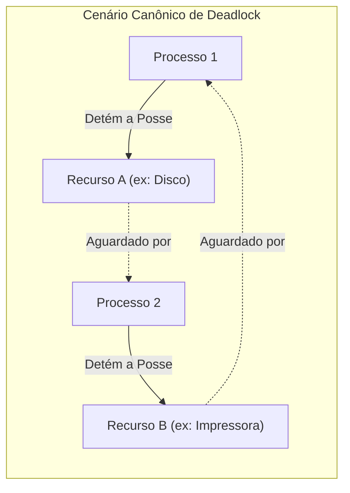
```mermaid
flowchart LR
  subgraph CenariodeDeadlock["Cenário Canônico de Deadlock"]
    P1["Processo 1"]
    P2["Processo 2"]
    R1["Recurso A (ex: Disco)"]
    R2["Recurso B (ex: Impressora)"]

    P1 -->|"Detém a Posse"| R1
    R1 -.->|"Aguardado por"| P2
    P2 -->|"Detém a Posse"| R2
    R2 -.->|"Aguardado por"| P1
  end
```

#### As Quatro Condições Necessárias de Coffman (1971)
Para que um deadlock se estabeleça em um sistema computacional, **todas as quatro condições estruturais a seguir devem coexistir obrigatoriamente e simultaneamente no mesmo instante temporal**. A quebra de qualquer uma das quatro condições invalida a possibilidade teórica de impasse:

1. **Exclusão Mútua (*Mutual Exclusion*):** Os recursos disputados não são compartilháveis; cada recurso só pode ser atribuído a um único processo por vez.
2. **Posse e Espera (*Hold and Wait*):** Um processo que já detém a posse exclusiva de recursos alocados previamente tem permissão para solicitar novos recursos adicionais e entrar em espera bloqueada caso eles estejam ocupados, sem abrir mão dos recursos que já possui.
3. **Não Preempção (*No Preemption*):** Recursos alocados a um processo não podem ser tomados dele à força pelo sistema operacional. Eles só podem ser liberados de forma voluntária e consciente pelo processo titular após o término da tarefa.
4. **Espera Circular (*Circular Wait*):** Deve existir uma cadeia fechada de processos $\{P_0, P_1, P_2, \dots, P_n\}$ tal que $P_0$ aguarda um recurso retido por $P_1$, $P_1$ aguarda um recurso retido por $P_2$, e $P_n$ aguarda um recurso retido por $P_0$.

---

### Grafos de Alocação de Recursos (RAG) e Detecção de Ciclos

#### Definição
O **Grafo de Alocação de Recursos (RAG - *Resource Allocation Graph*)** é um grafo direcionado bipartido formal $G = (V, E)$ utilizado pelo sistema operacional para modelar matematicamente o estado global de alocação de dispositivos, arquivos e travas.
- **Conjunto de Vértices ($V$):** Dividido em duas classes disjuntas:
  - $P = \{P_1, P_2, \dots, P_n\}$: Conjunto de processos ativos no sistema (representados visualmente por círculos).
  - $R = \{R_1, R_2, \dots, R_m\}$: Conjunto de recursos do sistema (representados por retângulos, com pontos internos denotando as instâncias disponíveis de cada recurso).
- **Conjunto de Arestas Direcionadas ($E$):**
  - **Aresta de Solicitação ($P_i \to R_j$):** Origina-se em um processo e aponta para um recurso, indicando que o processo $P_i$ solicitou o recurso $R_j$ e está bloqueado aguardando sua atribuição.
  - **Aresta de Alocação ($R_j \to P_i$):** Origina-se em uma instância do recurso e aponta para um processo, indicando que a titularidade do recurso $R_j$ foi formalmente concedida a $P_i$.

```mermaid
flowchart TD
  subgraph RAG_Ciclo["Grafo com Recurso de Instância Única (Deadlock Confirmado)"]
    P1["Processo P1"]
    P2["Processo P2"]
    R1["Recurso R1 (1 instância)"]
    R2["Recurso R2 (1 instância)"]

    R1 -->|"Alocado para"| P1
    P1 -->|"Solicita"| R2
    R2 -->|"Alocado para"| P2
    P2 -->|"Solicita"| R1
  end
```

#### Teorema Fundamental do RAG
1. **Recursos de Instância Única:** Se todo tipo de recurso no sistema possui apenas uma única unidade física disponível, a presença de um **ciclo direcionado no grafo é condição necessária e suficiente para caracterizar um Deadlock**.
2. **Recursos de Múltiplas Instâncias:** Se os tipos de recurso possuem mais de uma unidade disponível (múltiplos nós dentro do retângulo), a presença de um ciclo é **condição necessária, mas não suficiente**. O ciclo pode ser quebrado caso outro processo não envolvido no ciclo termine e devolva instâncias adicionais daquele recurso.

---

### Fundamentos de Virtualização e o Teorema de Popek-Goldberg

#### Definição
A virtualização computacional consiste na criação de uma camada de abstração de software intermediária capaz de instanciar uma ou múltiplas réplicas virtuais isoladas de um computador físico completo (**Máquinas Virtuais - VMs**), permitindo a execução concorrente de múltiplos sistemas operacionais convidados (*Guest OS*) sobre a mesma infraestrutura física de hardware (*Host*).

#### O Teorema de Popek-Goldberg (1974)
Formalizado por Gerald J. Popek e Robert P. Goldberg, o teorema estabelece as condições matemáticas suficientes para que uma arquitetura de processador seja estritamente virtualizável por meio da técnica eficiente de **Execução Direta com Captura e Emulação (*Trap-and-Emulate*)**:

> *"Uma arquitetura computacional convencional é estritamente virtualizável se, e somente se, todas as suas instruções sensíveis forem um subconjunto próprio de suas instruções privilegiadas."*

$$\text{Instruções Sensíveis} \subseteq \text{Instruções Privilegiadas}$$

```mermaid
flowchart TD
  subgraph PopekIdeal["Arquitetura Puramente Virtualizável (IBM S/370)"]
    direction TB
    Priv1["Instruções Privilegiadas (Geram Trap fora do Modo Kernel)"]
    Sens1["Instruções Sensíveis (Manipulam Hardware / Estado)"]
    Priv1 --- Sens1
    Note1["Todas as instruções sensíveis geram Trap!<br/>O Hipervisor intercepta tudo transparentemente."]
  end

  subgraph Popekx86["Lacuna da Arquitetura x86 Clássica (IA-32)"]
    direction TB
    Priv2["Instruções Privilegiadas"]
    Sens2["Instruções Sensíveis Não Privilegiadas (POPF, PUSHF, CLI, etc.)"]
    Note2["17 instruções sensíveis executavam no Ring 3<br/>sem gerar Trap (falhavam silenciosamente).<br/>Quebra da Virtualização Clássica!"]
  end
```

#### A Lacuna da Arquitetura x86 Clássica
A arquitetura x86 original de 32 bits (IA-32) violava frontalmente o teorema de Popek-Goldberg por conter **17 instruções sensíveis que não eram privilegiadas**. 
*Exemplo:* A instrução `POPF` manipula a flag de habilitação de interrupções da CPU. Quando executada pelo kernel convidado em Ring 3, o processador simplesmente a executava sem alterar as flags críticas e **sem gerar trap de interrupção**, impedindo que o hipervisor tomasse ciência da intenção da máquina virtual.

Para contornar essa lacuna histórica, surgiram duas soluções revolucionárias:
1. **Tradução Binária Dinâmica (*Dynamic Binary Translation* - VMware, 1998):** Em software, o hipervisor inspecionava blocos de código em tempo de execução antes de sua execução e reescrevia as 17 instruções sensíveis em instruções inofensivas que geravam desvios para o hipervisor.
2. **Virtualização Assistida por Hardware (Intel VT-x / AMD-V, 2005/2006):** Adição de novos modos de processador em silício, resolvendo a virtualização diretamente no hardware.

---

### Hipervisores Tipo 1 (Bare-Metal) versus Tipo 2 (Hosted)

#### Definição
O **Hipervisor** (ou VMM - *Virtual Machine Monitor*) é a entidade de software responsável por instanciar, isolar, arbitrar e gerenciar o ciclo de vida das máquinas virtuais. Os hipervisores dividem-se formalmente em duas classes arquiteturais fundamentais:

```mermaid
flowchart TD
  subgraph Tipo1["Hipervisor Tipo 1 (Bare-Metal / Nativo)"]
    direction TB
    H1_HW["Hardware Físico (CPU, RAM, NIC, Discos)"]
    H1_VMM["Hipervisor Nativo / SO Especializado<br/>(VMware ESXi, Proxmox VE / KVM, Xen, Hyper-V)"]
    H1_VM1["Máquina Virtual 1 (Guest OS + Apps)"]
    H1_VM2["Máquina Virtual 2 (Guest OS + Apps)"]
    H1_HW --> H1_VMM
    H1_VMM --> H1_VM1
    H1_VMM --> H1_VM2
  end

  subgraph Tipo2["Hipervisor Tipo 2 (Hosted / Hospedado)"]
    direction TB
    H2_HW["Hardware Físico"]
    H2_OS["Sistema Operacional Hospedeiro<br/>(Linux, Windows, macOS)"]
    H2_VMM["Aplicação Hipervisor<br/>(VirtualBox, VMware Workstation)"]
    H2_VM1["Máquina Virtual 1 (Guest OS + Apps)"]
    H2_VM2["Máquina Virtual 2 (Guest OS + Apps)"]
    H2_HW --> H2_OS
    H2_OS --> H2_VMM
    H2_VMM --> H2_VM1
    H2_VMM --> H2_VM2
  end
```

#### Características Comparativas
- **Hipervisores Tipo 1 (*Bare-Metal*):** Executam diretamente sobre a infraestrutura de hardware bruto da máquina servidora. Não dependem de um sistema operacional hospedeiro interposto. Assumem o controle dos barramentos, das tabelas de páginas da CPU e dos dispositivos de armazenamento. Entregam altíssimo desempenho computacional e mínima latência de E/S. Utilizados massivamente em centros de processamento de dados e nuvens corporativas (exemplos: VMware ESXi, KVM nativo, Xen, Microsoft Hyper-V Server).
- **Hipervisores Tipo 2 (*Hosted*):** Executam como um processo ou aplicação convencional sobre a infraestrutura de um sistema operacional hospedeiro pré-existente. Todas as operações de alocação e pedidos de E/S emitidos pelas máquinas virtuais precisam passar pela pilha do hipervisor e, subsequentemente, pelas chamadas de sistema e drivers do sistema hospedeiro. Apresentam maior facilidade de uso para estações de trabalho de desenvolvedores, mas impõem penalidades adicionais de latência e consumo de ciclos (exemplos: Oracle VM VirtualBox, VMware Workstation).

---

### Virtualização Assistida por Hardware: VMX, VMCS e VM-Exit

#### Definição
A virtualização assistida por hardware foi incorporada aos microprocessadores modernos (tecnologias **Intel VT-x** e **AMD-V**) criando uma nova dimensão ortogonal de privilégios de execução no silício da CPU. Na arquitetura Intel, foram criadas duas operações principais:
1. **Operação VMX Root:** Modo com plenos poderes de gerenciamento de hardware, reservado para o Hipervisor. Todos os Rings clássicos (0 a 3) existem dentro da operação VMX Root.
2. **Operação VMX Non-Root:** Modo de execução dedicado às Máquinas Virtuais convidadas. O kernel convidado executa em Ring 0 e suas aplicações em Ring 3, mas determinadas instruções sensíveis disparam um evento de transição forçada para o hipervisor.

```mermaid
stateDiagram-v2
  direction TB
  [*] --> VMX_Root_Ring0 : Inicialização do Hipervisor (Instrução VMXON)
  
  state "Operação VMX Root (Controle do Hipervisor)" as VMX_Root {
    VMX_Root_Ring0 : Ring 0 (Kernel do Hipervisor / Módulo KVM)
    VMX_Root_Ring3 : Ring 3 (Processo QEMU / Gerenciamento)
  }

  state "Operação VMX Non-Root (Execução da VM Convidada)" as VMX_NonRoot {
    VMX_NonRoot_Ring0 : Ring 0 (Kernel do Sistema Convidado)
    VMX_NonRoot_Ring3 : Ring 3 (Aplicações do Sistema Convidado)
  }

  VMX_Root_Ring0 --> VMX_NonRoot_Ring0 : VMLAUNCH / VMRESUME (Evento de VM-Entry)
  VMX_NonRoot_Ring0 --> VMX_Root_Ring0 : Interrupção / Acesso a I/O / Trap (Evento de VM-Exit)
  VMX_NonRoot_Ring3 --> VMX_NonRoot_Ring0 : Syscall do Convidado (Sem VM-Exit!)
```

#### A Estrutura de Controle de Máquina Virtual (VMCS)
A **VMCS (*Virtual Machine Control Structure*)** é uma estrutura de 4 KB residente em memória física mantida pelo hipervisor para cada vCPU do sistema. É manipulada pelas instruções dedicadas `VMREAD` e `VMWRITE` e divide-se em seis blocos fundamentais:
- **Estado do Convidado (*Guest-State Area*):** Salva os registradores de controle (`CR0`, `CR3`, `CR4`), registradores de segmento, ponteiro de instrução (`RIP`) e ponteiro de pilha (`RSP`) da VM.
- **Estado do Hospedeiro (*Host-State Area*):** Contém os ponteiros equivalentes de registradores para onde a CPU deve pular ao retornar para o hipervisor.
- **Controles de Execução de VM (*VM-Execution Control Fields*):** Configura uma máscara de bits de quais instruções e interrupções devem acionar uma saída forçada (*VM-Exit*).
- **Informações de Saída da VM (*VM-Exit Information Fields*):** Detalha a causa exata do evento (código da razão de saída, endereços de memória envolvidos).

#### O Ciclo de VM-Entry e VM-Exit
1. **VM-Entry:** O hipervisor carrega a VMCS e emite a instrução `VMLAUNCH` (primeira vez) ou `VMRESUME`. A CPU física chaveia para VMX Non-Root e executa o sistema operacional convidado na velocidade nativa do hardware.
2. **VM-Exit:** Quando a VM executa uma instrução sensível interceptável (ex: tentar reprogramar o temporizador físico, alterar registradores de controle do processador ou acessar portas de I/O emuladas), o silício da CPU paralisa a VM, salva seu estado na VMCS e transfere compulsoriamente a execução de volta para a rotina de tratamento do hipervisor em VMX Root Ring 0.
3. *Penalidade:* Um VM-Exit consome de centenas a milhares de ciclos de clock; portanto, a eficiência de um hipervisor mede-se pela sua capacidade de minimizar a frequência de ocorrência de VM-Exits desnecessários.

---

### Virtualização de Memória e E/S: SLAT (EPT/NPT), VirtIO e SR-IOV

#### Virtualização de Memória: Paginação Aninhada (SLAT)
Inicialmente, os hipervisores utilizavam **Shadow Page Tables (SPT)**, mantidas em software, para mapear diretamente o endereço virtual do convidado (*Guest Virtual Address* - GVA) para o endereço físico real da máquina (*Host Physical Address* - HPA), impondo um volume massivo de faltas de página (*page faults*) interceptadas pelo hipervisor.

Para solucionar essa sobrecarga, os fabricantes introduziram a **Tradução de Endereços em Segundo Nível (SLAT)**, denominada **EPT (*Extended Page Tables*)** pela Intel e **NPT (*Nested Page Tables*)** pela AMD:
- O processador mantém duas camadas de tabelas ativas em hardware simultaneamente.
- A primeira camada converte $GVA \to GPA$ (*Guest Physical Address*), controlada autonomamente pelo kernel do convidado sem intervenção do hipervisor.
- A segunda camada converte $GPA \to HPA$, controlada pelo hipervisor através de um novo registrador de hardware da CPU (o `EPTP`).
- A MMU física percorre as duas tabelas transparentemente no silício durante o *page table walk*.

```mermaid
flowchart LR
  subgraph TraducaoDuasCamadas["Tradução Bidimensional SLAT (Intel EPT / AMD NPT)"]
    GVA["GVA: Endereço Virtual da Aplicação Convidada"] -->|"Tabela de Páginas do Convidado (CR3 Guest)"| GPA["GPA: Endereço 'Físico' da Máquina Virtual"]
    GPA -->|"Tabela EPT em Hardware (EPTP)"| HPA["HPA: Endereço Físico Real nos Módulos de RAM"]
  end
```

#### Virtualização de Entrada e Saída (E/S)
A intermediação de periféricos de rede e armazenamento divide-se em três arquiteturas:
1. **Emulação Completa de Dispositivos:** O hipervisor simula em software registradores de hardware de placas legadas clássicas (ex: placa de rede Intel e1000 ou IDE PIIX4). Alta compatibilidade, mas baixíssimo desempenho (cada pacote transmitido aciona múltiplos VM-Exits).
2. **Paravirtualização de E/S (`virtio`):** O sistema convidado executa drivers cientes da virtualização. Em vez de simular registradores fictícios, convidado e hipervisor comunicam-se através de anéis circulares de buffers alocados em memória compartilhada denominados **virtqueues**, atingindo dezenas de gigabits por segundo com consumo residual de processamento.
3. **Pass-Through Direto e SR-IOV (*Single Root I/O Virtualization*):** A placa física PCIe (ex: interface de rede de 100 Gbps) instancia múltiplas interfaces virtuais em nível elétrico (*Virtual Functions* - VF). Apoiado pelo hardware da **IOMMU** (Intel VT-d / AMD-Vi), a VF é mapeada diretamente no espaço de endereçamento da VM, contornando o hipervisor completamente (*bypass*) e atingindo desempenho idêntico ao bare-metal.

---

## Sintaxe e Exemplos Práticos

### Criação e Controle de Processos com fork, execve e waitpid em C

O código a seguir exemplifica o mecanismo de criação de processos filhos no padrão POSIX. Ele demonstra o isolamento de memória gerado pelo `fork()`, a carga de um novo executável via `execve()` e a captura ordenada do status de encerramento pelo pai via `waitpid()`, prevenindo o surgimento de processos zumbis.

```c
#include <stdio.h>
#include <stdlib.h>
#include <unistd.h>
#include <sys/types.h>
#include <sys/wait.h>

// Variável global para demonstrar o isolamento do segmento de dados
int saldo_compartilhado = 500;

int main(void) {
    pid_t pid_filho;
    int status_retorno;

    printf("[Pai] Inicializando processo. PID=%d, Saldo=%d\n", getpid(), saldo_compartilhado);

    // Chamada de sistema que duplica o processo ativo
    pid_filho = fork();

    if (pid_filho < 0) {
        // Falha na alocação do PCB ou esgotamento da tabela de processos do kernel
        perror("Erro ao executar fork");
        return EXIT_FAILURE;
    }

    if (pid_filho == 0) {
        // --- Fluxo de Execução do Processo-Filho ---
        printf("[Filho] Executando com PID=%d, meu Pai e PPID=%d\n", getpid(), getppid());
        
        // Modifica a variável local: o processo-pai NÃO enxerga esta alteração
        saldo_compartilhado += 250;
        printf("[Filho] Modifiquei meu saldo para: %d\n", saldo_compartilhado);

        // Prepara para substituir a imagem de memória por outro utilitário (/bin/echo)
        char *argumentos[] = {"echo", "[Filho em execve] Imagem binaria substituida com sucesso!", NULL};
        char *ambiente[] = {NULL};

        // Substitui a região de texto, dados e pilha do filho
        execve("/bin/echo", argumentos, ambiente);

        // Caso o execve retorne, ocorreu uma falha crítica de carga
        perror("[Filho] Falha ao invocar execve");
        exit(EXIT_FAILURE);
    } else {
        // --- Fluxo de Execução do Processo-Pai ---
        printf("[Pai] Criei o processo-filho com PID=%d. Aguardando conclusao...\n", pid_filho);

        // Espera síncrona para coletar o código de término do filho e evitar Zumbi
        pid_t pid_coletado = waitpid(pid_filho, &status_retorno, 0);

        if (pid_coletado == -1) {
            perror("[Pai] Erro ao aguardar término do processo-filho");
            return EXIT_FAILURE;
        }

        if (WIFEXITED(status_retorno)) {
            printf("[Pai] Filho PID=%d terminou normalmente com codigo de saida: %d\n",
                   pid_coletado, WEXITSTATUS(status_retorno));
        } else if (WIFSIGNALED(status_retorno)) {
            printf("[Pai] Filho PID=%d foi terminado abruptamente pelo sinal: %d\n",
                   pid_coletado, WTERMSIG(status_retorno));
        }

        // Demonstra que o espaço de dados do pai permaneceu inalterado
        printf("[Pai] Saldo final do processo-pai: %d (Inalterado pelo filho)\n", saldo_compartilhado);
    }

    return EXIT_SUCCESS;
}
```

---

### Concorrência com Threads POSIX e Memória Compartilhada

O exemplo a seguir ilustra a diferença fundamental entre threads e processos. Diferente do isolamento do `fork()`, as threads compartilham a mesma região de dados globais e *heap*, exigindo sincronização estrita via trava de exclusão mútua (*mutex*) para prevenir condições de corrida.

```c
#include <stdio.h>
#include <stdlib.h>
#include <pthread.h>

#define ITERACOES 1000000

// Memória compartilhada entre todas as threads do processo
long long contador_global = 0;

// Trava de exclusão mútua do padrão POSIX
pthread_mutex_t trava_acesso;

void* rotina_incremento(void* arg) {
    long id = (long)arg;
    for (int i = 0; i < ITERACOES; i++) {
        // Início da Seção Crítica: Adquire posse exclusiva da trava
        pthread_mutex_lock(&trava_acesso);
        
        contador_global++; // Operação que envolve leitura, modificação e escrita
        
        // Fim da Seção Crítica: Libera posse para a próxima thread da fila
        pthread_mutex_unlock(&trava_acesso);
    }
    printf("[Thread %ld] Rotina concluida com sucesso.\n", id);
    pthread_exit(NULL);
}

int main(void) {
    pthread_t thread1, thread2;

    // Inicialização da trava de exclusão mútua
    if (pthread_mutex_init(&trava_acesso, NULL) != 0) {
        perror("Erro ao inicializar mutex");
        return EXIT_FAILURE;
    }

    printf("[Main] Valor inicial do contador global: %lld\n", contador_global);

    // Criação de duas threads operando sobre o mesmo espaço de memória
    pthread_create(&thread1, NULL, rotina_incremento, (void*)1L);
    pthread_create(&thread2, NULL, rotina_incremento, (void*)2L);

    // Aguarda a sincronização e finalização de ambas as threads
    pthread_join(thread1, NULL);
    pthread_join(thread2, NULL);

    // Destrói o recurso da trava no sistema
    pthread_mutex_destroy(&trava_acesso);

    printf("[Main] Valor final do contador global: %lld (Esperado: %lld)\n", 
           contador_global, (long long)ITERACOES * 2);

    return EXIT_SUCCESS;
}
```

---

### Simulação de Algoritmos de Alocação de Memória: First-Fit e Best-Fit

O código a seguir simula a lógica interna adotada pelo subsistema de gerência de memória para alocar processos em blocos de memória livre.

```c
#include <stdio.h>
#include <stdlib.h>

#define MAX_BLOCOS 5
#define MAX_PROCESSOS 4

void simular_first_fit(int blocos[], int m, int processos[], int n) {
    int alocacao[MAX_PROCESSOS];
    int blocos_trabalho[MAX_BLOCOS];

    for (int i = 0; i < m; i++) blocos_trabalho[i] = blocos[i];
    for (int i = 0; i < n; i++) alocacao[i] = -1;

    // Percorre cada processo e encontra o primeiro bloco que o comporte
    for (int i = 0; i < n; i++) {
        for (int j = 0; j < m; j++) {
            if (blocos_trabalho[j] >= processos[i]) {
                alocacao[i] = j;
                blocos_trabalho[j] -= processos[i]; // Deduz o espaço alocado
                break;
            }
        }
    }

    printf("\n--- Resultado: Algoritmo First-Fit ---\n");
    printf("Processo\tTamanho\tBloco Alocado\n");
    for (int i = 0; i < n; i++) {
        printf("%d\t\t%d KB\t", i + 1, processos[i]);
        if (alocacao[i] != -1) printf("%d\n", alocacao[i] + 1);
        else printf("Nao Alocado (Sem Espaco)\n");
    }
}

void simular_best_fit(int blocos[], int m, int processos[], int n) {
    int alocacao[MAX_PROCESSOS];
    int blocos_trabalho[MAX_BLOCOS];

    for (int i = 0; i < m; i++) blocos_trabalho[i] = blocos[i];
    for (int i = 0; i < n; i++) alocacao[i] = -1;

    // Localiza o bloco que gere o menor desperdício residual
    for (int i = 0; i < n; i++) {
        int melhor_indice = -1;
        for (int j = 0; j < m; j++) {
            if (blocos_trabalho[j] >= processos[i]) {
                if (melhor_indice == -1 || blocos_trabalho[j] < blocos_trabalho[melhor_indice]) {
                    melhor_indice = j;
                }
            }
        }
        if (melhor_indice != -1) {
            alocacao[i] = melhor_indice;
            blocos_trabalho[melhor_indice] -= processos[i];
        }
    }

    printf("\n--- Resultado: Algoritmo Best-Fit ---\n");
    printf("Processo\tTamanho\tBloco Alocado\n");
    for (int i = 0; i < n; i++) {
        printf("%d\t\t%d KB\t", i + 1, processos[i]);
        if (alocacao[i] != -1) printf("%d\n", alocacao[i] + 1);
        else printf("Nao Alocado (Sem Espaco)\n");
    }
}

int main(void) {
    int blocos[MAX_BLOCOS] = {100, 500, 200, 300, 600};
    int processos[MAX_PROCESSOS] = {212, 417, 112, 426};

    printf("Capacidade dos Blocos Disponiveis: 100KB, 500KB, 200KB, 300KB, 600KB\n");
    printf("Demandas dos Processos: P1=212KB, P2=417KB, P3=112KB, P4=426KB\n");

    simular_first_fit(blocos, MAX_BLOCOS, processos, MAX_PROCESSOS);
    simular_best_fit(blocos, MAX_BLOCOS, processos, MAX_PROCESSOS);

    return 0;
}
```

---

### Implementação Conceitual de Monitor com Exclusão Mútua e Condição

O exemplo a seguir em C++ moderno demonstra a arquitetura formal de um **Monitor de Buffer Limitado** (*Bounded Buffer*), aplicando encapsulamento rígido de dados privados, proteção de métodos com exclusão mútua (`std::unique_lock`) e suspensão controlada de threads via variáveis de condição (`std::condition_variable`).

```cpp
#include <iostream>
#include <vector>
#include <mutex>
#include <condition_variable>
#include <thread>

// Classe Monitor: O encapsulamento garante exclusão mútua e sincronização
class MonitorBufferLimitado {
private:
    std::vector<int> buffer;
    size_t capacidade_maxima;
    
    // Mecanismos de controle internos do monitor
    std::mutex trava_monitor;
    std::condition_variable buffer_nao_cheio;
    std::condition_variable buffer_nao_vazio;

public:
    explicit MonitorBufferLimitado(size_t capacidade) : capacidade_maxima(capacidade) {}

    // Procedimento de Acesso Sincronizado: Inserir Dado
    void inserir(int item) {
        // Rotina de Entrada: Adquire posse exclusiva da trava do monitor
        std::unique_lock<std::mutex> lock(trava_monitor);

        // Bloqueia e aguarda caso o buffer esteja lotado
        buffer_nao_cheio.wait(lock, [this]() { 
            return buffer.size() < capacidade_maxima; 
        });

        // --- Seção Crítica Protegida ---
        buffer.push_back(item);
        std::cout << "[Produtor] Inseriu item: " << item 
                  << " (Itens no buffer: " << buffer.size() << ")\n";

        // Desperta consumidores suspensos na fila de buffer vazio
        buffer_nao_vazio.notify_one();
        // Rotina de Saída: O lock é liberado automaticamente ao sair do escopo
    }

    // Procedimento de Acesso Sincronizado: Remover Dado
    int remover() {
        std::unique_lock<std::mutex> lock(trava_monitor);

        // Bloqueia e aguarda caso o buffer esteja vazio
        buffer_nao_vazio.wait(lock, [this]() { 
            return !buffer.empty(); 
        });

        // --- Seção Crítica Protegida ---
        int item = buffer.front();
        buffer.erase(buffer.begin());
        std::cout << "[Consumidor] Removeu item: " << item 
                  << " (Itens restantes: " << buffer.size() << ")\n";

        // Desperta produtores suspensos na fila de buffer cheio
        buffer_nao_cheio.notify_one();

        return item;
    }
};

void tarefa_produtor(MonitorBufferLimitado& monitor) {
    for (int i = 1; i <= 5; ++i) {
        monitor.inserir(i * 10);
        std::this_thread::sleep_for(std::chrono::milliseconds(50));
    }
}

void tarefa_consumidor(MonitorBufferLimitado& monitor) {
    for (int i = 1; i <= 5; ++i) {
        monitor.remover();
        std::this_thread::sleep_for(std::chrono::milliseconds(80));
    }
}

int main() {
    MonitorBufferLimitado monitor(3); // Buffer limitado a 3 elementos

    std::thread prod(tarefa_produtor, std::ref(monitor));
    std::thread cons(tarefa_consumidor, std::ref(monitor));

    prod.join();
    cons.join();

    return 0;
}
```

---

### Formalização Matemática de Métricas de Desempenho

#### 1. Taxa de Utilização da UCP em Sistemas Monoprogramados ($U$)
Em sistemas monoprogramados, se $T_{comp}$ for o tempo de cálculo da CPU e $T_{io}$ for o tempo em que a CPU permanece paralisada aguardando periféricos de E/S:

$$U = \frac{T_{comp}}{T_{comp} + T_{io}}$$

*Exemplo Numérico:* Se um processo consome 15 segundos calculando dados e 85 segundos lendo setores mecânicos de disco:

$$U = \frac{15}{15 + 85} = \frac{15}{100} = 15\% \quad (85\% \text{ de desperdício em ociosidade})$$

#### 2. Fragmentação Interna Média ($FI_{med}$)
Para um sistema com particionamento fixo contendo $M$ partições de tamanho homogêneo $S_{part}$, onde a demanda dos processos $S_{proc}$ distribui-se uniformemente entre $1$ byte e $S_{part}$:

$$FI_{med} \approx \frac{S_{part}}{2}$$

Se $S_{part} = 64\text{ KB}$, a perda média esperada por partição ocupada é de aproximadamente $32\text{ KB}$.

#### 3. Lei de Amdahl para Ganho de Velocidade (*Speedup*)
Se $S$ é a proporção do programa que é intrinsecamente serial e $P = (1 - S)$ é a porção passível de paralelização em $N$ núcleos físicos:

$$\text{Speedup}(N) = \frac{1}{S + \frac{1 - S}{N}}$$

Se uma aplicação contábil possui $20\%$ de rotinas estritamente seriais ($S = 0{,}20$) e roda em uma máquina com $N = 8$ núcleos de CPU:

$$\text{Speedup}(8) = \frac{1}{0{,}20 + \frac{0{,}80}{8}} = \frac{1}{0{,}20 + 0{,}10} = \frac{1}{0{,}30} \approx 3{,}33\times$$

Mesmo com oito processadores físicos dedicados, o ganho real de velocidade é de apenas $3{,}33$ vezes, longe do fator ideal teórico de $8\times$.

---

## Boas Práticas e Armadilhas Comuns

### Domínio: Gerenciamento de Processos e Controle de Execução
- **Armadilha (Vazamento de PIDs e Criação de Zumbis):** Ignorar o retorno dos filhos no processo-pai. Se o pai gera milhares de filhos em laço contínuo e não executa a chamada `wait()` ou `waitpid()`, a tabela de processos do kernel preenche-se com descritores zumbis até atingir o limite `PID_MAX`, bloqueando a criação de qualquer novo processo no sistema operacional.
- **Boa Prática:** Instalar um tratador de sinal para `SIGCHLD` que execute um laço não bloqueante `waitpid(-1, &status, WNOHANG)` para recolher imediatamente qualquer filho encerrado.
- **Armadilha (Esquecimento do Tratamento do `fork()`):** Assumir que o `fork()` sempre terá sucesso. Em situações de esgotamento de memória física ou cotas de usuário, o `fork()` retorna `-1`. Acesso imediato a estruturas sem validar o PID gera falhas graves.

### Domínio: Gerenciamento da Memória Real
- **Armadilha (Confundir Fragmentação Interna com Externa):** Tentar aplicar rotinas de compactação de memória para resolver fragmentação interna. A compactação de blocos desloca partições ativas para consolidar buracos dispersos; ela não altera o tamanho das partições fixas ou dos blocos discretos alocados internamente a um processo.
- **Boa Prática:** Dimensionar partições ou tamanhos de páginas com base no perfil de distribuição volumétrica das cargas de trabalho da organização para minimizar a folga interna residual.
- **Armadilha (Supor que Alocação Best-Fit é Sempre Superior):** Assumir que o *Best-Fit* supera invariavelmente o *First-Fit*. O Best-Fit percorre toda a estrutura de dados (pior desempenho computacional de busca) e sistematicamente gera resíduos infinitesimais de memória que se tornam inutilizáveis sem compactação contínua.

### Domínio: Sincronização, Concorrência e Deadlocks
- **Armadilha (Inversão na Ordem de Aquisição de Travas):** Adquirir travas em ordens cruzadas entre threads distintas:
  - *Thread 1:* `lock(A)` seguido de `lock(B)`.
  - *Thread 2:* `lock(B)` seguido de `lock(A)`.
  - Se ambas executarem simultaneamente, estabelece-se a quarta condição de Coffman (Espera Circular), gerando um deadlock instantâneo e silencioso.
- **Boa Prática:** Estabelecer uma **Ordem Hierárquica Estrita de Alocação de Recursos**. Se todos os fluxos de código no sistema forem programados para requisitar o Recurso $A$ estritamente antes do Recurso $B$, a formação de um ciclo fechado no Grafo de Alocação de Recursos (RAG) torna-se matematicamente impossível.
- **Armadilha (Confundir Condição de Corrida com Erro de Sintaxe):** Assumir que código compilado sem erros está livre de condições de corrida. A concorrência introduz indeterminismo; uma corrida crítica pode se manifestar apenas uma vez a cada milhões de execuções sob carga pesada.

### Domínio: Softwares de Virtualização
- **Armadilha (Sobrealocação / *Overcommit* Excessivo sem *Memory Ballooning*):** Alocar a soma de memória das máquinas virtuais acima da capacidade física da máquina servidora sem ativar os drivers paravirtualizados de balão de memória. Se as VMs exigirem sua memória alocada ao mesmo tempo, o hipervisor entra em colapso de paginação forçada em disco (*hypervisor trashing*), derrubando a responsividade de todo o data center.
- **Boa Prática:** Utilizar *HugePages* (páginas de memória de 2 MB ou 1 GB) em hipervisores com SLAT/EPT para reduzir a profundidade do *page table walk* da MMU em sistemas com grande alocação de bancos de dados.

---

## Tabelas Comparativas

### Tabela 1: Entidades Fundamentais de Execução: Job vs. Processo vs. Thread

| Dimensão de Comparação | Job | Processo | Thread |
| :--- | :--- | :--- | :--- |
| **Origem e Paradigma** | Sistemas em lote (*batch* / mainframes) | Início da multiprogramação e time-sharing | Arquiteturas modernas multicore e SMP |
| **Nível de Interatividade** | Totalmente nula (submissão assíncrona) | Média a Alta (sessões de terminal e janelas) | Alta (resposta contínua a eventos) |
| **Espaço de Endereçamento** | Ocupa toda a memória dedicada à tarefa | Isolado e protegido estritamente por hardware | Compartilhado entre todas as threads do mesmo processo |
| **Custo de Criação** | Muito Alto (enfileiramento e leitura de mídia) | Alto (duplicação de tabelas de memória e PCB) | Mínimo (apenas pilha e registradores próprios) |
| **Custo de Troca de Contexto** | Extremo (descarga total do job precedente) | Alto (invalidação de TLB e troca de tabelas MMU) | Baixo (troca exclusiva de registradores da CPU) |
| **Comunicação entre Entidades** | Arquivos sequenciais em fitas e discos | IPC pesado (Sockets, Pipes, Memória Compartilhada) | Acesso direto a variáveis globais e Heap |
| **Tolerância a Falhas** | O job aborta sem afetar outros jobs | Falha do processo não corrompe outros processos | Erro crítico em uma thread derruba todo o processo |

---

### Tabela 2: Modelos de Alocação Contígua de Memória Real

| Característica | Alocação Contígua Simples | Particionamento Estático | Particionamento Dinâmico |
| :--- | :--- | :--- | :--- |
| **Grau de Multiprogramação ($N$)** | Rigorosamente 1 ($N = 1$) | Fixo, limitado ao número de partições ($M$) | Variável, limitado pela capacidade total da RAM |
| **Definição das Fronteiras** | Tempo de montagem / instalação | Inicialização do SO ou setup do operador | Tempo de execução, sob demanda contínua |
| **Fragmentação Predominante** | Ociosidade total da área de usuário | Fragmentação Interna severa | Fragmentação Externa |
| **Solução para Desperdício** | Inexistente (monotarefa estrito) | Dimensionamento heterogêneo de blocos | Compactação de Memória |
| **Complexidade de Algoritmo** | Praticamente nula (base fixa do kernel) | Baixa (tabela fixa de partições) | Alta (varreduras First-Fit, Best-Fit, Listas) |
| **Necessidade de Hardware** | Mínima (apenas limites rudimentares) | Registradores de limites por partição | Registradores de Base e Limite dinâmicos na MMU |

---

### Tabela 3: Mecanismos de Sincronização: Semáforos versus Monitores

| Parâmetro de Projeto | Semáforos de Dijkstra | Monitores de Hoare / Brinch Hansen |
| :--- | :--- | :--- |
| **Nível de Abstração** | Baixo Nível (primitiva operacional inteira) | Alto Nível (estrutura de dados / orientação a objetos) |
| **Localização dos Dados** | Variáveis globais separadas do semáforo | Estritamente encapsulados como dados privados |
| **Responsabilidade da Trava** | Do Desenvolvedor (chamadas manuais `wait`/`signal`) | Do Compilador / Runtime (no prólogo e epílogo do método) |
| **Propensão a Erros** | Altíssima (esquecimento de `signal` gera deadlock) | Baixa (exclusão mútua garantida estruturalmente) |
| **Facilidade de Manutenção** | Complexa em projetos com milhares de linhas | Alta (manutenção centralizada na classe do monitor) |
| **Sincronização Condicional** | Feita por contadores aritméticos inteiros | Feita formalmente via Variáveis de Condição explícitas |

---

### Tabela 4: Modelos de Arquitetura de Virtualização

| Dimensão Técnica | Hipervisor Tipo 1 (Bare-Metal) | Hipervisor Tipo 2 (Hosted) | Paravirtualização Pura | Contêineres de SO |
| :--- | :--- | :--- | :--- | :--- |
| **Camada de Execução** | Diretamente sobre o silício do hardware | Sobre um SO hospedeiro convencional | Sobre um microkernel especializado | Compartilha o mesmo kernel do SO hospedeiro |
| **Isolamento de Segurança** | Muito Alto (mediado por VMX Root) | Alto (dependente do kernel hospedeiro) | Alto | Moderado (isolamento por namespaces e cgroups) |
| **Sobrecarga de Desempenho** | Mínima (próxima à velocidade do bare-metal) | Moderada a Alta (dupla camada de chamadas) | Mínima (código convidado modificado) | Virtualmente nula (execução nativa direta) |
| **Latência de Entrada e Saída** | Mínima (especialmente com SR-IOV e virtio) | Alta (conversões e emulação em software) | Mínima | Velocidade nativa de hardware |
| **Homogeneidade de SO** | Permite qualquer SO convidado | Permite qualquer SO convidado | Exige SO modificado com suporte | Exige o mesmo kernel do sistema hospedeiro |

---

## Linha do Tempo da Disciplina

```mermaid
timeline
  title Linha do Tempo da Disciplina - Sistemas Operacionais (3º Semestre)
  2026-03-04 : Aula 01 e 03 - Fundamentos e Ciclo de Vida dos Processos : Bloco de Controle de Processo (PCB) e Tabela Global : Espaço de Endereçamento (Texto, Dados, Pilha)
  2026-03-18 : Aula 02 - Evolução dos Sistemas Operacionais : Da Simbiose Hardware-Software ao Multiprocessamento : Modos de Privilégio (Ring 0 vs Ring 3) e Lei de Amdahl
  2026-04-08 a 2026-04-29 : Trabalho de Pesquisa Acadêmica : Softwares de Virtualização (Normas ABNT NBR 6022:2018) : Teorema de Popek-Goldberg, VMX, SLAT e VirtIO
  2026-05-06 : Aula 05 - Concorrência Avançada e Sincronização : Monitores como Tipos Abstratos de Dados : Deadlocks, Condições de Coffman e Grafos RAG
  2026-05-09 : Aula 04 - Organização e Gerência da Memória Real : Alocação Contígua, Partições Estáticas e Dinâmicas : Fragmentação Interna, Externa e Registradores Base/Limite
```

### Síntese Pedagógica dos Marcos da Disciplina
1. **04/03/2026 — Gestão de Processos:** Formalização da abstração fundamental do processo computacional. Diferenciação da entidade inanimada (programa em disco) da entidade viva (processo na RAM). Mapeamento das estruturas do PCB, escalonamento preemptivo por fatias de tempo (*quantum*) e mecanismos de chaveamento de contexto.
2. **18/03/2026 — Evolução Arquitetural:** Estudo da simbiose essencial de hardware e software. Transição das gerações de computadores de válvulas para microprocessadores integrados. Solução para o gargalo da ociosidade da UCP via multiprogramação e análise de escalabilidade paralela via Lei de Amdahl.
3. **08/04/2026 a 29/04/2026 — Atividade de Consolidação Científica (Virtualização):** Desenvolvimento de artigo acadêmico rigoroso estruturado pelas normas da ABNT. Integração dos conceitos de modos de privilégio à virtualização assistida por hardware (Intel VT-x), paginação aninhada (EPT/NPT) e barramentos de alto desempenho (`virtio` e SR-IOV).
4. **06/05/2026 — Concorrência e Impasses:** Transição do modelo uniprocessador para sincronização em sistemas multiprocessados. Construção de seções críticas estruturadas utilizando Monitores de Hoare/Hansen. Diagnóstico e prevenção matemática de impasses (*deadlocks*) através das quatro condições de Coffman e Grafos de Alocação de Recursos (RAG).
5. **09/05/2026 — Gerência de Memória Real:** Estudo dos modelos físicos de alocação de memória principal. Formalização da fragmentação interna e externa, algoritmos de alocação contígua (First-Fit, Best-Fit, Worst-Fit), estruturas de mapa de bits e proteção dinâmica por registradores de hardware (Base e Limite).

---

## Glossário

- **APIC (*Advanced Programmable Interrupt Controller*):** Controlador de interrupções avançado integrado ao hardware dos processadores modernos para rotear interrupções de periféricos e interrupções interprocessadores (IPI).
- **Área de Troca (*Swap Space*):** Região do disco secundário alocada pelo sistema operacional para armazenar temporariamente a imagem completa ou páginas de processos expulsos da memória RAM.
- **BSS (*Block Started by Symbol*):** Região do espaço de endereçamento do processo destinada a alocar variáveis globais e estáticas não inicializadas explicitamente no código-fonte.
- **Chaveamento de Contexto (*Context Switch*):** Operação administrativa do kernel de salvar o estado físico da CPU de um processo em seu PCB e carregar os registradores de outro processo para execução.
- **Condição de Corrida (*Race Condition*):** Falha patológica em sistemas concorrentes onde o resultado final da execução depende da ordem temporal indeterminada de acesso ao recurso compartilhado.
- **Despachante (*Dispatcher*):** Componente do núcleo do sistema operacional encarregado de efetivar a transição do processo selecionado pelo escalonador, passando o controle físico da CPU para ele.
- **DMA (*Direct Memory Access*):** Módulo de hardware que transfere blocos massivos de dados entre controladores de periféricos e a memória RAM sem a intermediação da CPU em cada byte.
- **EPT (*Extended Page Tables*):** Implementação de paginação aninhada em hardware desenvolvida pela Intel (tecnologia SLAT) para acelerar a tradução de memória em máquinas virtuais.
- **Escalonador (*Scheduler*):** Subsistema do sistema operacional que aplica algoritmos e políticas para selecionar qual processo da fila de prontos receberá o próximo ciclo de CPU.
- **Espaço de Endereçamento Virtual:** Faixa lógica de endereços contíguos fornecida pelo sistema operacional a cada processo, isolada por hardware da memória física real de outros processos.
- **Exclusão Mútua (*Mutual Exclusion*):** Requisito de concorrência que garante que no máximo uma thread execute instruções no interior de uma seção crítica em um dado instante.
- **Fragmentação Externa:** Ocorrência de espaço livre total suficiente na memória RAM, mas fragmentado em múltiplos blocos dispersos que impedem a alocação de novos processos contíguos.
- **Fragmentação Interna:** Desperdício de memória originado quando o bloco físico alocado pelo sistema é maior que o espaço demandado pelo processo, gerando sobras dentro da partição.
- **Hipervisor (VMM):** Software ou microkernel responsável por instanciar e arbitrar a alocação de recursos físicos para máquinas virtuais.
- **IOMMU (*Input-Output Memory Management Unit*):** Unidade de hardware que traduz endereços virtuais de dispositivos diretamente para a memória física, fundamental para pass-through e SR-IOV.
- **ISR (*Interrupt Service Routine*):** Rotina tratadora do kernel executada compulsoriamente pelo processador ao receber um sinal elétrico de interrupção de hardware ou exceção.
- **MMU (*Memory Management Unit*):** Componente de hardware da CPU encarregado de verificar proteções e traduzir endereços de memória lógicos/virtuais em endereços físicos de barramento.
- **Modo Núcleo (*Kernel Mode*):** Modo de execução irrestrito da CPU que permite o disparo de instruções privilegiadas e acesso direto a todo o mapa de hardware.
- **Modo Usuário (*User Mode*):** Modo de execução restrito da CPU dedicado às aplicações, onde instruções sensíveis e de hardware são bloqueadas pelo processador.
- **Monitor:** Tipo abstrato de dados de alto nível que combina dados privados, procedimentos sincronizados de acesso e exclusão mútua automática garantida pelo compilador.
- **PCB (*Process Control Block*):** Estrutura de dados central do kernel que registra todas as propriedades, registradores e estados de um processo computacional.
- **PID (*Process Identifier*):** Número inteiro positivo único atribuído pelo kernel para indexar e referenciar cada processo ativo no sistema operacional.
- **Preempção:** Ação forçada do sistema operacional de suspender o processo ativo na CPU antes que ele termine sua instrução por vontade própria, realocando o processador para outra tarefa.
- **Quantum de Tempo:** Fração temporal contínua (milissegundos) concedida pelo escalonador a um processo para computação ininterrupta antes de sofrer preempção por relógio.
- **RAG (*Resource Allocation Graph*):** Grafo bipartido direcionado utilizado para representar matematicamente a concessão e a requisição de recursos e identificar deadlocks.
- **Registrador de Base:** Registrador de hardware que contém o endereço físico inicial onde a partição do processo está mapeada na memória RAM.
- **Registrador de Limite:** Registrador de hardware que define o comprimento máximo e os limites válidos de acesso do processo na memória RAM.
- **Seção Crítica:** Trecho de código concorrente que manipula recursos compartilhados e exige garantia estrita de exclusão mútua para evitar inconsistências.
- **Simbiose Hardware-Software:** Dependência mútua estrutural onde o hardware provê recursos e mecanismos de isolamento e o SO gerencia e estende a funcionalidade física da máquina.
- **SLAT (*Second Level Address Translation*):** Tecnologia de hardware da CPU (EPT na Intel, NPT na AMD) que viabiliza a tradução de memória virtual em dois níveis para hipervisores.
- **SMP (*Symmetric Multiprocessing*):** Arquitetura computacional multiprocessada fortemente acoplada onde múltiplos processadores compartilham uniformemente o mesmo barramento e memória principal.
- **Sondagem (*Polling*):** Método de controle onde a CPU executa ativamente um laço repetitivo de leitura para consultar se um periférico concluiu uma operação de E/S.
- **Starvation (Inanição):** Situação patológica onde um processo apto a executar permanece indefinidamente esperando por um recurso ou tempo de CPU devido a preempções sucessivas por tarefas de maior prioridade.
- **TLB (*Translation Lookaside Buffer*):** Memória cache associativa ultrarrápida da MMU que armazena as traduções recentes de endereços virtuais para endereços físicos de memória.
- **Trap (Armadilha):** Interrupção síncrona gerada pela própria CPU quando um erro ocorre ou quando uma instrução explícita de chamada de sistema (`syscall`) é executada.
- **VirtIO:** Padrão arquitetural de paravirtualização para sistemas Linux baseado em filas circulares de buffers em memória compartilhada (*virtqueues*) para comunicação com o hipervisor.
- **VMCS (*Virtual Machine Control Structure*):** Bloco de dados de controle de hardware de 4 KB mantido para cada vCPU nas arquiteturas Intel VT-x para coordenar VM-Entry e VM-Exit.
- **VM-Exit:** Evento em que a CPU suspende a execução da máquina virtual em modo VMX Non-Root e transfere o controle de volta ao hipervisor em modo VMX Root.
- **Zumbi (*Zombie Process*):** Processo que completou sua execução mas permanece na tabela de processos do kernel aguardando que seu processo-pai leia seu código de término via `wait()`.

---

## Checklist de Revisão para Prova

### Bloco 1: Processos, Threads e Chaveamento de Contexto
- [ ] Sei diferenciar com precisão conceitual um **Programa** (entidade inanimada em disco) de um **Processo** (entidade dinâmica em memória)?
- [ ] Compreendo a anatomia da memória do processo, sabendo quais dados residem na região de **Texto**, na região de **Dados** (*Heap/BSS*) e na região de **Pilha** (*Stack*)?
- [ ] Sei descrever a mecânica de crescimento da pilha (endereços altos para baixos) e as permissões de acesso associadas a cada região (`R-X` versus `RW-`)?
- [ ] Domino o modelo de três estados fundamentais (**Pronto, Execução, Bloqueado**) e sei apontar quem dispara cada transição de estado?
- [ ] Entendo por que a transição de *Bloqueado* para *Execução* direta é estruturalmente impossível?
- [ ] Conheço a estrutura e os dados vitais armazenados dentro do **PCB** (PID, registradores salvos, ponteiros de memória e descritores de arquivos)?
- [ ] Compreendo o que é o **Chaveamento de Contexto**, seus custos diretos (tempo de UCP) e custos indiretos (invalidação de TLB e perdas de cache)?
- [ ] Sei diferenciar com clareza **Concorrência** (intercalação temporal em 1 CPU) de **Paralelismo Real** (execução simultânea física em múltiplos núcleos)?
- [ ] Entendo as patologias de filiação: o que caracteriza um processo **Zumbi** e o que caracteriza um processo **Órfão**?

### Bloco 2: Arquitetura, Interrupções e Simbiose Hardware-Software
- [ ] Sei explicar por que o sistema operacional e o hardware vivem em uma **simbiose essencial**?
- [ ] Compreendo a barreira de isolamento físico entre o **Modo Usuário** (Ring 3) e o **Modo Núcleo** (Ring 0) e como instruções privilegiadas são bloqueadas?
- [ ] Sei descrever a mecânica de uma chamada de sistema (*system call*) intermediada por instruções de armadilha (*trap*)?
- [ ] Sei apontar as vantagens de sistemas orientados a **Interrupção** frente à **Sondagem (*Polling*)** e em qual cenário ocorre uma tempestade de interrupções?
- [ ] Domino a distinção entre interrupções **Assíncronas** (hardware) e **Síncronas** (exceções, faltas e armadilhas)?
- [ ] Sei calcular o teto de aceleração paralela de uma aplicação aplicando a **Lei de Amdahl**?

### Bloco 3: Gerenciamento da Memória Real
- [ ] Compreendo a **Hierarquia de Memória** e a fundamentação provida pelo princípio da localidade espacial e localidade temporal?
- [ ] Sei caracterizar a **Alocação Contígua Simples** e seus limites de multiprogramação ($N=1$)?
- [ ] Sei explicar o funcionamento do **Particionamento Estático** (tamanhos iguais versus diferentes)?
- [ ] Domino a definição, a causa e a fórmula matemática da **Fragmentação Interna**?
- [ ] Domino a definição, a causa e o mecanismo de mitigação da **Fragmentação Externa** (compactação)?
- [ ] Sei aplicar passo a passo a lógica dos algoritmos de busca em blocos livres: **First-Fit, Best-Fit, Worst-Fit e Next-Fit**?
- [ ] Compreendo os trade-offs entre estruturas de **Mapa de Bits (*Bitmap*)** e **Listas Encadeadas** de controle de blocos?
- [ ] Sei desenhar e explicar o funcionamento dos **Registradores de Base e Limite** na MMU para proteção e realocação dinâmica?
- [ ] Entendo o conceito de **Swapping** clássico e o impacto de latência da movimentação de processos inteiros para o disco?

### Bloco 4: Concorrência Avançada, Monitores e Deadlocks
- [ ] Sei definir o que é uma **Condição de Corrida** e por que operações como `x++` não são atômicas em nível de montagem?
- [ ] Compreendo os quatro requisitos formais para a solução do problema da **Seção Crítica** (Exclusão Mútua, Progresso, Espera Limitada e Independência de Velocidade)?
- [ ] Sei explicar a arquitetura completa de um **Monitor**: dados privados, métodos públicos sincronizados e fila de entrada?
- [ ] Compreendo o papel e o funcionamento das **Variáveis de Condição** (`wait` e `signal`) no interior de um monitor?
- [ ] Domino as **Quatro Condições Necessárias de Coffman** para ocorrência de Deadlock (Exclusão Mútua, Posse e Espera, Não Preempção e Espera Circular)?
- [ ] Sei interpretar e desenhar um **Grafo de Alocação de Recursos (RAG)** identificando arestas de solicitação e arestas de alocação?
- [ ] Compreendo por que um ciclo em um RAG com recursos de instância única confirma um deadlock, enquanto em recursos com múltiplas instâncias ele é apenas indicativo?

### Bloco 5: Softwares de Virtualização
- [ ] Domino o **Teorema de Popek-Goldberg** e a regra fundamental que exige que instruções sensíveis sejam subconjunto das privilegiadas?
- [ ] Sei explicar a **Lacuna da Arquitetura x86 Clássica** e por que 17 instruções sensíveis impediam a virtualização clássica por *Trap-and-Emulate*?
- [ ] Sei diferenciar com precisão arquitetural um **Hipervisor Tipo 1 (*Bare-Metal*)** de um **Hipervisor Tipo 2 (*Hosted*)**?
- [ ] Compreendo o funcionamento dos modos **VMX Root** e **VMX Non-Root** na tecnologia Intel VT-x e o papel da estrutura **VMCS**?
- [ ] Entendo o que dispara um evento de **VM-Exit** e qual o impacto de ciclos de clock dessa transição?
- [ ] Sei explicar a virtualização de memória por **Paginação Aninhada / SLAT** (Intel EPT e AMD NPT) e a tradução bidimensional $GVA \to GPA \to HPA$?
- [ ] Compreendo as vantagens de desempenho da paravirtualização de E/S com **VirtIO** e do pass-through direto com **SR-IOV e IOMMU**?

---

## Fontes e Metadados

- Turma no Classroom: SISTEMAS OPERACIONAIS 2026
- Itens processados: 6 materiais, 1 tarefas, 0 avisos
- Gerado em: 24/09/2026, 14:00:56 (BRT) via classroom-sync
