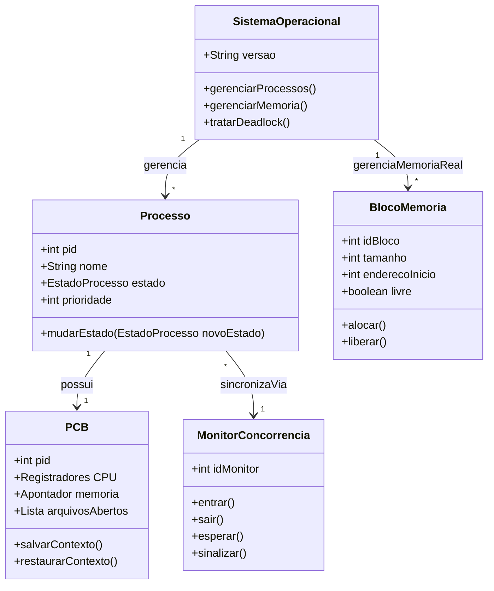
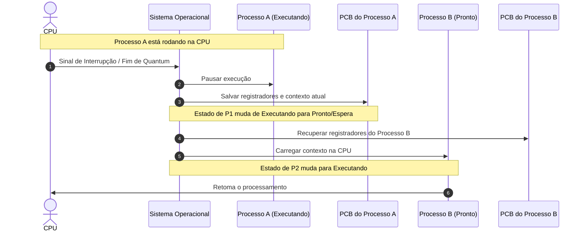

# [Prof. Guilherme de Morais] Sistemas Operacionais - Modelagem e Arquitetura

Abaixo estão representados 3 diagramas em **Mermaid** cobrindo os domínios fundamentais da disciplina de Sistemas Operacionais ministrada pelo Prof. Guilherme de Morais, contemplando o gerenciamento de processos, controle de concorrência (deadlocks) e arquitetura de gerenciamento de memória.

---

### 1. Diagrama de Classes UML (Domínio da Matéria)
Este diagrama modela as entidades centrais do sistema operacional abordadas nos blocos de processos, blocos de controle (PCB), gerenciamento de memória real e monitores.



---

### 2. Diagrama de Sequência (Fluxo Técnico: Troca de Contexto e Gerenciamento de Processo)
Este diagrama ilustra o fluxo de interrupção e troca de contexto (Context Switch) gerenciado pelo Sistema Operacional, manipulando o Bloco de Controle do Processo (PCB).



> **Explicação do Fluxo:**
> Quando um processo (Processo A) esgota sua fatia de tempo (quantum) ou sofre uma interrupção, o Sistema Operacional intercepta a execução, salva o estado atual dos registradores no respectivo **PCB (Bloco de Controle de Processo)**, seleciona o próximo processo apto (Processo B), restaura seu contexto anterior e autoriza a CPU a continuar.

---

### 3. Diagrama Arquitetural / Entidade-Relacionamento (Gerenciamento de Memória Real e Alocação)
Este diagrama arquitetural demonstra como o subsistema de Gerenciamento de Memória Real organiza o espaço físico da memória e sua relação com os processos ativos.

```mermaid
graph TD
    subgraph SO [Sistema Operacional]
        GM[Gerenciador de Memória Real]
        AL[Alocador / Paginador]
    end

    subgraph MemoriaFisica [Memória Real / RAM]
        B1[Bloco 01: SO Kernel]
        B2[Bloco 02: Processo A]
        B3[Bloco 03: Espaço Livre]
        B4[Bloco 04: Processo B]
        B5[Bloco 05: Espaço Livre]
    end

    subgraph ProcessosAtivos [Processos em Execução]
        PA[Processo A (PID 101)]
        PB[Processo B (PID 102)]
    end

    GM --> AL
    AL --> B1
    AL --> B2
    AL --> B3
    AL --> B4
    AL --> B5

    PA -. mapeia para .-> B2
    PB -. mapeia para .-> B4

    style SO fill:#f9f,stroke:#333,stroke-width:2px
    style MemoriaFisica fill:#bbf,stroke:#333,stroke-width:2px
    style ProcessosAtivos fill:#fbb,stroke:#333,stroke-width:2px
```

> **Explicação do Fluxo Arquitetural:**
> O **Gerenciador de Memória Real** divide a memória física em blocos ou partições. O alocador controla quais endereços estão ocupados por processos ativos e quais estão livres, realizando o mapeamento direto entre o espaço lógico dos processos e os blocos físicos alocados na RAM, garantindo a proteção e o isolamento entre as aplicações.