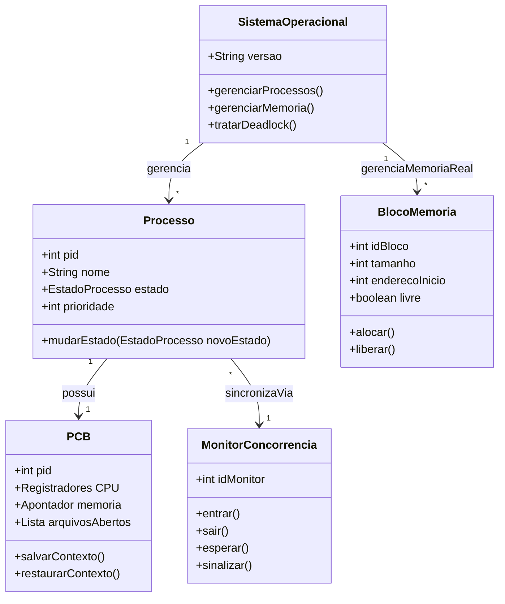
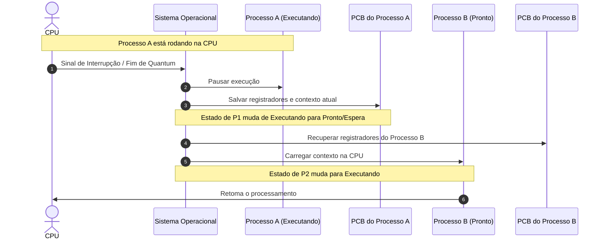
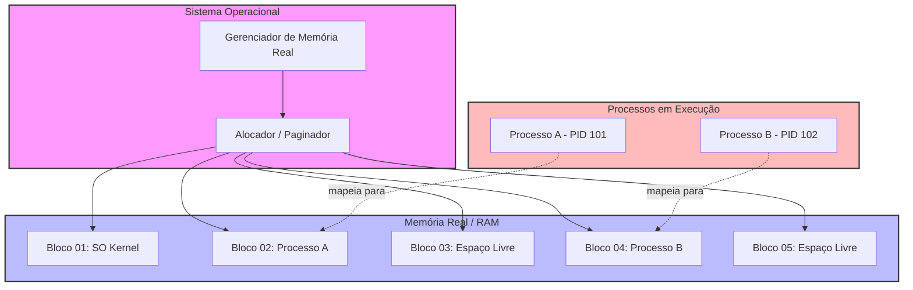

# 🤖 Resumos-IA · Sistemas Operacionais
**Professor:** Guilherme de Morais · **Semestre:** 3º Semestre · **Foco:** Gerenciamento de Processos, PCB, Interrupções, Memória e Deadlocks

Material de apoio gerado por IA para revisão da disciplina, consolidado em um único
documento: resumo executivo, exercícios práticos com código real, simulado comentado,
cheatsheet de revisão rápida e diagramas de arquitetura/UML.

---

## 🧭 Índice
1. [Resumo Executivo](#-resumo-executivo)
2. [Exercícios Práticos Implementados](#-exercícios-práticos-implementados)
3. [Simulado Comentado](#-simulado-comentado)
4. [CheatSheet de Revisão Rápida](#-cheatsheet-de-revisão-rápida)
5. [Diagramas e Modelagem](#️-diagramas-e-modelagem)
6. [Apresentação de Revisão em Slides](#-apresentação-de-revisão-em-slides)
7. [Flashcards para Anki](#-flashcards-para-anki)
8. [Dataset de Perguntas e Respostas (JSONL)](#-dataset-de-perguntas-e-respostas-jsonl)

---

## 📖 Resumo Executivo

### 1. Visão Geral e Objetivos da Matéria
A disciplina de **Sistemas Operacionais**, ministrada pelo **Prof. Guilherme de
Morais**, tem como objetivo central capacitar o estudante de Sistemas de Informação a
compreender o gerenciamento dos recursos computacionais de hardware e software. Com
foco especial no **Gerenciamento de Processos** e nas estruturas de controle do
núcleo (*kernel*), a matéria explora como o Sistema Operacional (SO) assegura a
multitarefa segura, a alternância justa de recursos, o tratamento de interrupções e a
hierarquia e comunicação entre processos.

### 2. Conceitos-Chave e Terminologia Fundamental
* **Processo:** Um programa em execução, composto pelo código, dados, registradores e seu estado atual no sistema.
* **PID (Process Identification Number):** Número de identificação único atribuído pelo SO a cada processo criado.
* **PCB (Process Control Block / Descritor de Processo):** Estrutura de dados essencial que armazena todas as informações vitais do processo (estado, contador de programa, registradores, prioridade, credenciais e ponteiros hierárquicos).
* **Quantum (Temporizador de Intervalo):** Fuso de tempo estipulado por hardware (relógio de interrupção) que define quanto tempo um processo pode executar continuamente antes de sofrer preempção.
* **Chaveamento de Contexto (Context Switch):** Operação de salvamento do estado do processo atual (no PCB) e carregamento do contexto do próximo processo a ser executado.
* **Interrupção:** Mecanismo de hardware ou software de baixo custo que força o processador a desviar sua execução para tratar um evento prioritário, eliminando a necessidade de *polling* (sondagem ativa).

### 3. Principais Módulos Abordados

**A. Ciclo de Vida e Estados do Processo** — o SO intercala a execução dos processos
gerenciando suas transições de estado para evitar erros e monopolização:
1. **Pronto (Acordado):** o processo está na fila, aguardando apenas a disponibilidade de um processador.
2. **Em Execução (Acordado):** o processo foi despachado e está utilizando ativamente o processador — o ato de designar o primeiro processo da fila ao processador é o **Despacho** (realizado pelo *Despachante*).
3. **Bloqueado (Adormecido):** o processo iniciou uma operação de E/S ou aguarda um evento externo, entregando o processador voluntariamente. Ao concluir a E/S, o SO o promove de volta para *Pronto*.
   *Nota sobre preempção:* sistemas modernos usam um **relógio de interrupção em hardware** — se o *quantum* de um processo se esgota, o temporizador gera uma interrupção, forçando a transição de *Execução* para *Pronto*. Sistemas antigos sem relógio dependiam de devolução voluntária, permitindo laços infinitos e monopolização.

**B. Blocos de Controle de Processo (PCB) e Tabelas** — o SO mantém uma **Tabela de
Processos** contendo os PCBs, cada um armazenando estado atual e contador de
programa, contexto de execução (registradores), prioridade e credenciais, e
**filiação** (ponteiros para processo-pai e processos-filhos, formando uma hierarquia
cuja destruição pode ou não cascatear para os filhos, dependendo da arquitetura do SO).

**C. Tratamento de Interrupções:**
* **Síncronas (Exceções):** disparadas quando um processo tenta uma ação ilegal ou acessa memória protegida.
* **Assíncronas:** disparadas por dispositivos de hardware externos (teclado, mouse, temporizador).
* Substituem o *polling* (sondagem contínua que desperdiça ciclos de CPU), mas picos excessivos de interrupções podem sobrecarregar o sistema ("tráfego aéreo").

### 4. Relações com o Mercado e Prática Profissional
* **Arquitetura de alta performance:** entender o custo de um *Chaveamento de Contexto* é vital para quem desenvolve aplicações concorrentes/paralelas (microsserviços, servidores assíncronos em Node.js, threads em Java/C++).
* **Troubleshooting e Otimização:** conhecer os estados de processo e o impacto de E/S bloqueante ajuda a diagnosticar gargalos de CPU e latência em produção.
* **Segurança da Informação:** o isolamento de memória garantido pelos PCBs e o tratamento de interrupções síncronas evitam que aplicações maliciosas corrompam o espaço de endereço do kernel ou de outros usuários.

### 5. Dicas de Ouro para Estudo e Provas
1. **Acordado vs. Adormecido:** *Pronto* e *Execução* estão "acordados" (disputam CPU); *Bloqueado* está "adormecido" (espera E/S, não usa CPU mesmo ociosa).
2. **Mapeie as transições:** Pronto→Execução = Despacho · Execução→Pronto = fim do Quantum · Execução→Bloqueado = E/S (iniciado pelo próprio processo) · Bloqueado→Pronto = conclusão do evento.
3. **Papel do PCB:** é o "identificador e prontuário" do processo — sem ele o SO não faria Chaveamento de Contexto sem perder o rumo da execução.
4. **Polling vs. Interrupção:** interrupções economizam ciclos de clock que o polling desperdiça sondando.
5. **Hierarquia de processos:** processos geram filhos, e a destruição do pai pode ou não encerrar os filhos, dependendo do projeto do SO.

---

## 💻 Exercícios Práticos Implementados

Apostila prática que traduz os conceitos de Gerenciamento de Processos, Estados,
Transições, PCB e Troca de Contexto em código executável em **C (padrão POSIX/Linux)**.

### Simulador de Gerenciamento de Processos e PCB (`simulador_processos.c`)

Simula a estrutura de um PCB, a Tabela de Processos, o Quantum e a transição de
estados (Pronto, Execução, Bloqueado):

```c
#include <stdio.h>
#include <stdlib.h>
#include <string.h>

// Definição dos Estados do Processo conforme a teoria do Prof. Guilherme
typedef enum {
    PRONTO,
    EXECUCAO,
    BLOQUEADO,
    FINALIZADO
} EstadoProcesso;

// Conversão do Enum para String para facilitar a visualização
const char* strEstado(EstadoProcesso e) {
    switch (e) {
        case PRONTO: return "PRONTO";
        case EXECUCAO: return "EM EXECUCAO";
        case BLOQUEADO: return "BLOQUEADO (Aguardando E/S)";
        case FINALIZADO: return "FINALIZADO";
        default: return "DESCONHECIDO";
    }
}

// Estrutura do PCB (Process Control Block / Descritor de Processo)
typedef struct {
    int pid;                     // Process Identification Number
    int contador_programa;       // Endereço da próxima instrução
    int prioridade;              // Prioridade de escalonamento
    int quantum_restante;        // Tempo restante de processador (Quantum)
    int pid_pai;                 // Ponteiro para o processo-pai
    EstadoProcesso estado;       // Estado atual do processo
    char nome[30];
} PCB;

// Função para exibir a Tabela de Processos simulada
void exibirTabelaProcessos(PCB processos[], int n) {
    printf("\n==================== TABELA DE PROCESSOS (PCB) ====================\n");
    printf("PID \t NOME \t\t ESTADO \t\t PRIORIDADE \t QUANTUM\n");
    printf("-------------------------------------------------------------------\n");
    for (int i = 0; i < n; i++) {
        printf("%d \t %-10s \t %-20s \t %d \t\t %d\n",
            processos[i].pid,
            processos[i].nome,
            strEstado(processos[i].estado),
            processos[i].prioridade,
            processos[i].quantum_restante);
    }
    printf("===================================================================\n\n");
}

int main() {
    printf("--- SIMULADOR DE GERENCIAMENTO DE PROCESSOS (S.O.) ---\n");
    printf("Docente: Prof. Guilherme de Morais\n\n");

    int total_processos = 3;
    PCB tabela[3];

    // Processo 1 (Pai)
    tabela[0].pid = 1;
    strcpy(tabela[0].nome, "Proc_Shell");
    tabela[0].contador_programa = 1004;
    tabela[0].prioridade = 2;
    tabela[0].quantum_restante = 4;
    tabela[0].pid_pai = 0; // Processo raiz
    tabela[0].estado = EXECUCAO;

    // Processo 2 (Filho)
    tabela[1].pid = 2;
    strcpy(tabela[1].nome, "Proc_Navegador");
    tabela[1].contador_programa = 5020;
    tabela[1].prioridade = 1;
    tabela[1].quantum_restante = 4;
    tabela[1].pid_pai = 1;
    tabela[1].estado = PRONTO;

    // Processo 3
    tabela[2].pid = 3;
    strcpy(tabela[2].nome, "Proc_Compilador");
    tabela[2].contador_programa = 300;
    tabela[2].prioridade = 3;
    tabela[2].quantum_restante = 4;
    tabela[2].pid_pai = 1;
    tabela[2].estado = PRONTO;

    exibirTabelaProcessos(tabela, total_processos);

    // Simulação 1: quantum do Processo 1 expira (interrupção de hardware)
    printf("[SIMULAÇÃO] O Relógio de Interrupção esgotou o Quantum do Proc_Shell (PID 1).\n");
    printf("[S.O.] Salvando contexto no PCB e realizando Chaveamento de Contexto...\n");
    tabela[0].estado = PRONTO;       // Execução -> Pronto
    tabela[1].estado = EXECUCAO;     // Pronto -> Execução (Despacho)
    exibirTabelaProcessos(tabela, total_processos);

    // Simulação 2: Processo 2 solicita E/S
    printf("[SIMULAÇÃO] O Proc_Navegador (PID 2) iniciou uma leitura de disco (E/S).\n");
    printf("[S.O.] Processo bloqueia a si mesmo. Transição de EXECUÇÃO para BLOQUEADO.\n");
    tabela[1].estado = BLOQUEADO;    // Execução -> Bloqueado
    tabela[2].estado = EXECUCAO;     // Despachante escolhe o próximo pronto
    exibirTabelaProcessos(tabela, total_processos);

    // Simulação 3: conclusão da E/S do Processo 2
    printf("[SIMULAÇÃO] A operação de E/S do Proc_Navegador (PID 2) foi concluída.\n");
    printf("[S.O.] Promovendo o processo de BLOQUEADO para PRONTO.\n");
    tabela[1].estado = PRONTO;       // Bloqueado -> Pronto
    exibirTabelaProcessos(tabela, total_processos);

    return 0;
}
```

### Exercícios Resolvidos — Gerenciamento de Processos e Estados

**Q1. Como o SO impede que um processo monopolize um processador?**
> O SO utiliza um **relógio de interrupção em hardware** (temporizador de intervalo).
> Se o processo não devolver o processador voluntariamente antes do *quantum*
> expirar, o relógio gera uma interrupção, forçando o processador a transferir o
> controle ao núcleo, que muda o estado do processo de *execução* para *pronto* e
> despacha o próximo.

**Q2. Diferença entre processos acordados e adormecidos?**
> **Acordados:** estados *Pronto* ou *Execução*, disputam CPU ativamente.
> **Adormecidos:** estado *Bloqueado*, não executam mesmo com CPU livre, pois aguardam
> um evento externo (ex: E/S).

**Q3. O que é despacho?**
> É o ato de designar um processador ao primeiro processo da lista de prontos,
> transitando-o de *pronto* para *em execução* — tarefa executada pelo **Despachante**.

### Exercícios Resolvidos — PCB e Interrupções

**Q1. Como processadores aceleram o chaveamento de contexto?**
> Processadores modernos fornecem instruções de hardware dedicadas a salvar/restaurar
> o contexto de execução direto do/para o PCB, e alguns chips têm registradores
> internos que apontam diretamente para o PCB do processo em execução.

**Q2. Interrupções assíncronas vs. síncronas?**
> **Síncronas (exceções/erros):** o próprio processo tenta ação ilegal (ex: divisão
> por zero) ou acessa memória protegida.
> **Assíncronas (hardware):** um dispositivo externo muda de estado e sinaliza o
> processador independentemente da instrução em curso (teclado, mouse, relógio).

**Q3. O que são PID e PCB?**
> **PID:** número único atribuído pelo SO a cada processo.
> **PCB:** estrutura de dados que armazena estado, contador de programa, prioridade,
> registradores, ponteiros pai/filhos e arquivos abertos.

**Q4. Filiação de processos (pai e filho)?**
> O criador é o **Processo-Pai**, o criado é o **Processo-Filho**, formando uma árvore
> hierárquica. A destruição do pai pode ou não destruir os filhos automaticamente,
> dependendo do projeto do SO.

---

## 📝 Simulado Comentado

Simulado com 10 questões de múltipla escolha (gabarito comentado) e 5 discursivas/
estudos de caso, cobrindo Gerenciamento de Processos, PCB e Interrupções.

### Parte 1 — Múltipla Escolha

1. O ato de designar um processador ao primeiro processo da lista de pronto é chamado de:
   A) Chaveamento de contexto B) **Despacho (Despachante)** C) Polling D) Tratamento de interrupção E) Quantum de tempo
   > **Gabarito: B**

2. Mecanismo de hardware que evita que processos monopolizem o processador:
   A) PCB B) Tabela de Processos C) **Relógio de interrupção em hardware** D) Ponteiro de processo-pai E) PID
   > **Gabarito: C**

3. Sobre as transições de estado, assinale a correta:
   A) O único estado iniciado pelo usuário é o despacho B) Quantum expira: execução→bloqueado C) Pronto/execução são "adormecidos" D) **Conclusão de evento: bloqueado→pronto** E) Execução→pronto ocorre ao iniciar E/S
   > **Gabarito: D**

4. Um processo em execução inicia uma E/S antes do quantum expirar:
   A) É destruído B) Continua em paralelo C) **Entrega voluntariamente o processador e bloqueia a si mesmo** D) Vai para o final da lista de prontos E) Gera interrupção síncrona ilegal
   > **Gabarito: C**

5. O que é salvo no PCB durante um chaveamento de contexto?
   A) Apenas o PID B) **Contexto de execução (registradores) e contador de programa** C) Só ponteiros para filhos D) Lista de arquivos do disco E) Código-fonte do programa
   > **Gabarito: B**

6. Sobre filiação de processos:
   A) **A criação de um processo gera uma estrutura hierárquica** B) Filhos são sempre destruídos ao fazer E/S C) O pai não tem ponteiros para os filhos D) Destruição nunca libera memória E) Filhos são sempre destruídos com o pai
   > **Gabarito: A**

7. O que caracteriza uma interrupção síncrona?
   A) Dispositivo de hardware muda de estado B) Varreduras repetitivas (polling) C) **Processo tenta ação ilegal ou acessa memória protegida** D) Quantum expira E) Conflito por recurso compartilhado
   > **Gabarito: C**

8. Técnica antiga de sondagem repetitiva do estado dos dispositivos:
   A) Chaveamento de contexto B) **Sondagem (Polling)** C) Interrupção assíncrona D) Despacho por quantum E) Hierarquia de processos
   > **Gabarito: B**

9. Sequência lógica inicial do chaveamento de contexto:
   A) Carregar o novo antes de salvar o anterior B) Destruir o atual e criar novo PCB C) **Salvar contexto do processo atual no PCB e depois carregar o próximo** D) Mudar direto para bloqueado E) Aguardar interrupções assíncronas pendentes
   > **Gabarito: C**

10. NÃO faz parte do PCB:
    A) Estado do processo B) Contador de programa C) Credenciais de acesso D) **Código-fonte completo da aplicação** E) Ponteiro para o processo-pai
    > **Gabarito: D**

### Parte 2 — Discursivas e Estudos de Caso

**Q1.** Explique como o Temporizador de Intervalo garante que nenhum processo monopolize o processador.
> O temporizador concede um *quantum* a cada processo. Se ele estourar sem devolução
> voluntária da CPU, o hardware gera uma interrupção, o SO rebaixa o processo de
> *execução* para *pronto* e despacha o próximo da fila.

**Q2 (Estudo de caso).** Um processo em execução precisa ler um arquivo grande do disco na metade do seu quantum. Descreva o comportamento passo a passo.
> 1. Processo está em **execução**. 2. Ao requisitar E/S, entrega voluntariamente o
> processador (única transição de usuário). 3. Transita de **execução** para
> **bloqueado**. 4. O SO faz chaveamento de contexto para outro processo pronto. 5. Ao
> concluir a E/S, o SO promove o processo de **bloqueado** para **pronto**.

**Q3.** O que é o PCB e por que é crítico para o chaveamento de contexto?
> É a estrutura que armazena PID, estado, ponteiros pai/filho, prioridade, contador de
> programa e registradores. Ao interromper um processo, o núcleo salva seu estado
> exato no PCB; ao retomá-lo, lê esses dados para restaurar o processador perfeitamente.

**Q4.** Diferencie interrupções síncronas de assíncronas com exemplos.
> **Síncronas:** internas, quando o processo tenta ação ilegal ou acessa memória
> protegida. **Assíncronas:** um dispositivo externo (teclado, mouse) muda de estado e
> comunica o processador de forma independente da instrução em curso.

**Q5.** Por que os SOs modernos abandonaram o Polling em favor de interrupções? Quais os riscos?
> No polling, o processador gastava ciclos pesquisando repetidamente os dispositivos,
> o que é ineficiente. Interrupções liberam o processador para tarefas úteis, mas
> correm o risco de sobrecarga (*overload*) se chegarem em volume massivo e rápido
> demais para o SO processar a tempo ("tráfego aéreo").

---

## ⚡ CheatSheet de Revisão Rápida

**1. Escalonamento e Estados**
- **Despachante:** gerencia a fila de processos para uso da CPU.
- **Preempção (Quantum) vs. Cooperativo:** sistemas modernos usam temporizador de hardware para preemptar; sistemas antigos dependiam de liberação voluntária.
- Pronto ⇄ Execução: despacho / expiração de quantum *(acordados)*. Execução → Bloqueado: voluntário *(adormecido)*. Bloqueado → Pronto: conclusão do evento.

**2. PCB e Threads**
- **PCB:** PID, estado, contador de programa (PC), contexto de execução, prioridade, credenciais, filiação (pai/filhos), arquivos abertos.
- **Chaveamento de Contexto:** salva contexto atual no PCB → carrega o próximo → atualiza registradores.
- **Interrupções:** síncronas (ação ilegal/memória protegida) vs. assíncronas (hardware — substituem o Polling).

**3. Memória Virtual e Virtualização**
- Gerenciamento de memória real/virtual mapeia páginas virtuais em quadros físicos/disco.
- **Hipervisores:** Tipo 1 *Bare-Metal* (VMware ESXi, Proxmox, KVM) vs. Tipo 2 *Hosted* (VirtualBox, VMware Workstation).
- **IaC:** ferramentas como Vagrant automatizam provisionamento de ambientes virtuais.

**4. Deadlocks**
- **Definição:** conjunto de processos permanentemente bloqueados aguardando recursos presos entre si.
- **4 Condições de Coffman:** Exclusão Mútua · Posse e Espera · Não-preempção · Espera Circular.
- **Tratamento:** Prevenção, Evitação (Algoritmo do Banqueiro), Detecção/Recuperação, ou Ignorar (Avestruz).

---

## 🗺️ Diagramas e Modelagem

### 1. Diagrama de Classes UML (Domínio da Matéria)


### 2. Diagrama de Sequência (Troca de Contexto)

> Quando um processo esgota seu quantum ou sofre interrupção, o SO salva o estado
> atual dos registradores no PCB, seleciona o próximo processo apto, restaura seu
> contexto anterior e autoriza a CPU a continuar.

### 3. Arquitetura de Gerenciamento de Memória Real

> O Gerenciador de Memória Real divide a memória física em blocos/partições; o
> alocador controla endereços ocupados e livres, mapeando o espaço lógico dos
> processos para blocos físicos na RAM, garantindo proteção e isolamento.

---

## 🎞️ Apresentação de Revisão em Slides

[`Slides-Revisao-[Prof. Guilherme de Morais] Sistemas Operacionais.pptx`](./Slides-Revisao-%5BProf.%20Guilherme%20de%20Morais%5D%20Sistemas%20Operacionais.pptx) —
deck de 5 slides em dark mode (Slate/Navy/Teal/Indigo), 16:9 widescreen, cobrindo
Visão Geral, Conceitos Fundamentais, Exercícios/Prática e Dicas de Prova, com layout
programático (zero overflow de texto garantido por medição real de fonte).

---

## 🃏 Flashcards para Anki

[`flashcards-anki.tsv`](./flashcards-anki.tsv) — baralho pergunta/resposta (formato
TSV de 2 colunas) cobrindo estados de processo, PCB, interrupções e deadlocks. Para
importar: no Anki, **Arquivo → Importar**, selecione o `.tsv` e mapeie as colunas
para *Frente* e *Verso*.

---

## 🤖 Dataset de Perguntas e Respostas (JSONL)

[`dataset-estudo-qa.jsonl`](./dataset-estudo-qa.jsonl) — **14 pares** de
pergunta/resposta estruturados (`id`, `topico`, `pergunta`, `resposta`,
`dificuldade`), prontos para consumo por scripts/ferramentas de estudo ou fine-tuning
leve. Amostra:

```json
{"id": 1, "topico": "Gerenciamento de Processos", "pergunta": "O que caracteriza conceitualmente um processo em Sistemas Operacionais segundo o Prof. Guilherme de Morais?", "resposta": "Um processo é um programa em execução, representando uma unidade de trabalho do sistema, composto pelo código do programa, dados, pilha de execução e o Bloco de Controle de Processo (PCB).", "dificuldade": "facil"}
{"id": 2, "topico": "Blocos de Controle", "pergunta": "Qual é a principal função do Bloco de Controle de Processo (PCB) gerenciado pelo sistema operacional?", "resposta": "O PCB armazena todas as informações necessárias para gerenciar o processo, incluindo seu estado atual, identificador (PID), registradores da CPU, ponteiros de memória e informações de escalonamento.", "dificuldade": "medio"}
{"id": 3, "topico": "Conceitos de Processos", "pergunta": "Como o sistema operacional alterna a execução entre diferentes processos na CPU?", "resposta": "Através da mudança de contexto (context switch), onde o SO salva o estado do processo atual (no PCB) e carrega o estado do próximo processo a ser executado.", "dificuldade": "dificil"}
```
