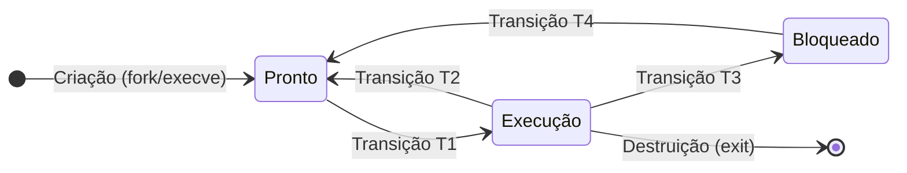
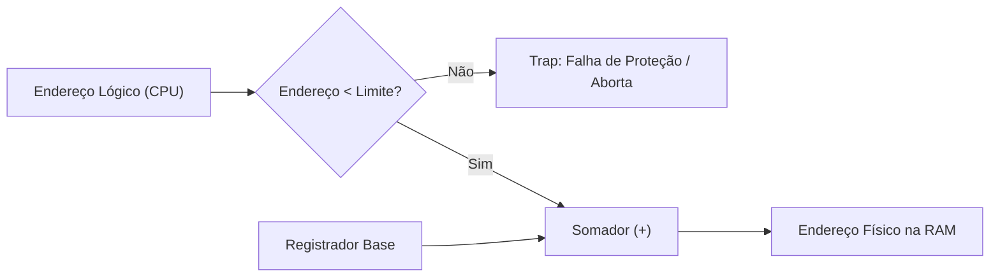
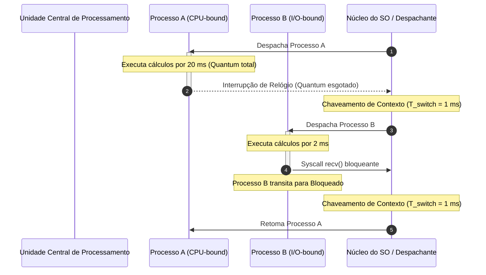
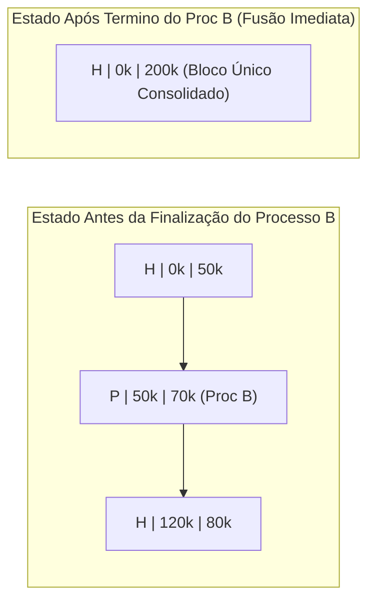
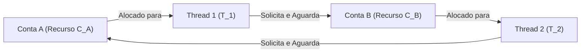
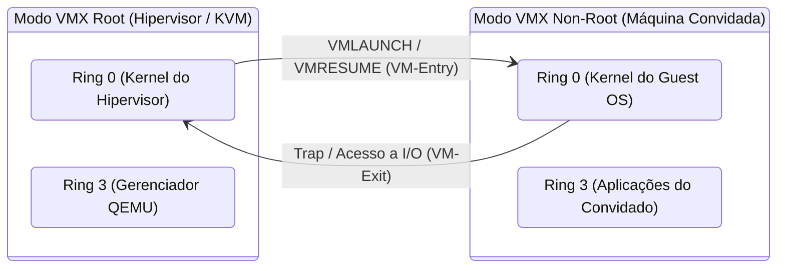

# Simulados Comentados - Sistemas Operacionais

> **Instituição:** Centro Universitário de Santa Fé do Sul (UniFEF)  
> **Curso:** Bacharelado em Sistemas de Informação (3º Semestre)  
> **Disciplina:** Sistemas Operacionais  
> **Docente:** Prof. Guilherme de Morais  
> **Material de Apoio:** Aulas 01 (Processos e PCB), 02 (Evolução e Arquiteturas), 04 (Memória Real), 05 (Monitores e Deadlock) e Trabalho Temático de Softwares de Virtualização  

---

## Simulado 1 - Questões Objetivas (12 questões, alternativas A-E, estilo ENADE)

### Questão 01 - Espaço de Endereçamento e Proteção de Memória
Considere a arquitetura canônica de um processo em execução em um sistema operacional moderno com suporte à gerência de memória protegida. O espaço de endereçamento virtual de um processo é segmentado em regiões com propósitos estritos: Texto (*Code*), Dados (*Data/BSS/Heap*) e Pilha (*Stack*). Cada uma dessas regiões possui atributos de proteção configurados pelo sistema operacional e validados pela Unidade de Gerenciamento de Memória (MMU).

Analise o fragmento de código escrito em linguagem C:

```c
#include <stdio.h>
#include <stdlib.h>

char *mensagem_global = "Sistemas Operacionais";

void funcao_recursiva(int nivel) {
    char buffer_local[64];
    if (nivel <= 0) return;
    funcao_recursiva(nivel - 1);
}

int main(void) {
    char *bloco_dinamico = (char *) malloc(1024);
    funcao_recursiva(5);
    free(bloco_dinamico);
    return 0;
}
```

Sobre o ciclo de vida, localização e permissões de acesso associadas a cada elemento da memória desse processo, assinale a alternativa correta:

A) A string literal `"Sistemas Operacionais"` reside na região de Dados Inicializados com permissões de Leitura e Escrita (`RW-`), permitindo que a instrução `mensagem_global[0] = 'X';` seja executada sem intervenção da MMU.  
B) A variável de ponteiro `bloco_dinamico` reside na Pilha (*Stack*), enquanto a área de 1024 bytes alocada por `malloc` reside no *Heap* (Dados Dinâmicos); a tentativa de executar código binário injetado no interior do buffer do *Heap* é bloqueada por padrão em sistemas com suporte a bits de não execução (`NX/XD`).  
C) As chamadas sucessivas à função `funcao_recursiva` alocam novos quadros de pilha (*stack frames*) que expandem a região de Pilha em direção aos endereços mais altos da memória virtual, aproximando-se do segmento de Texto.  
D) As instruções de máquina correspondentes à função `funcao_recursiva` residem na região de Texto com permissões de Leitura e Escrita (`RW-`), viabilizando a modificação dinâmica do próprio código em tempo de execução para otimização de laços.  
E) A variável de ponteiro `mensagem_global` e o vetor `buffer_local` compartilham a mesma região de memória (região de dados não inicializados ou BSS), uma vez que ambos são resolvidos estaticamente durante a etapa de ligação (*linking*).  

---

### Questão 02 - Ciclo de Vida e Transições de Estado de Processos
O modelo fundamental de estados de processos organiza o fluxo de execução entre três estados centrais: Pronto (*Ready*), Execução (*Running*) e Bloqueado (*Blocked/Waiting*). As transições entre esses estados são disparadas ora pelo próprio processo, ora de forma involuntária pelo núcleo do sistema operacional.

Considere o diagrama de transições a seguir:



Com base no mecanismo de escalonamento preemptivo e na taxonomia das transições, assinale a afirmação correta:

A) A transição T1 (Pronto para Execução) ocorre quando um processo conclui uma operação assíncrona de E/S e é selecionado imediatamente pelo temporizador de hardware (*timer*).  
B) A transição T2 (Execução para Pronto) é uma operação voluntária executada pelo processo por meio de uma chamada de sistema de entrada e saída.  
C) A transição T3 (Execução para Bloqueado) é disparada compulsoriamente pelo despachante (*dispatcher*) quando o *quantum* de tempo de CPU atribuído ao processo expira.  
D) A transição T4 (Bloqueado para Pronto) é disparada por uma interrupção de hardware sinalizando o término do evento externo aguardado; o processo transita para Pronto, e não diretamente para Execução, pois deve disputar novamente a CPU na fila de prontos segundo as prioridades do escalonador.  
E) Em um sistema uniprocessador estrito com $M$ processos carregados na memória principal, até $M - 1$ processos podem ocupar simultaneamente o estado de Execução durante períodos de alta sobrecarga de cálculo.  

---

### Questão 03 - Bloco de Controle de Processo (PCB) e Chaveamento de Contexto
O Bloco de Controle de Processo (*Process Control Block* - PCB) é a estrutura de dados central que corporifica o descritor de um processo no núcleo do sistema operacional. Quando o processador precisa alternar sua linha de execução entre dois processos distintos, ocorre o mecanismo de chaveamento de contexto (*context switch*).

A respeito da composição interna do PCB e da sobrecarga temporal introduzida pelo chaveamento de contexto, analise as afirmativas:

I. O PCB armazena o contexto de hardware do processo, compreendendo o Contador de Programa (*Program Counter* - PC), o Apontador de Pilha (*Stack Pointer* - SP), os registradores de uso geral e a palavra de estado do processador (*Processor Status Word* - PSW).  
II. Durante o chaveamento de contexto, a CPU continua executando instruções úteis de aplicações de usuário, uma vez que a troca de registradores ocorre em nível de microcódigo sem consumo de ciclos de máquina.  
III. Além de salvar e restaurar registradores, o chaveamento de contexto entre processos distintos tipicamente acarreta a troca da tabela de páginas na MMU, resultando na invalidação total ou parcial dos dados armazenados no *Translation Lookaside Buffer* (TLB) e consequente perda temporária de localidade de cache.  
IV. Processos organizados em uma árvore hierárquica compartilham o mesmo descritor PCB, de modo que a alteração de prioridade de um processo-filho afeta compulsoriamente a prioridade de seu processo-pai.  

É correto o que se afirma em:

A) I e II, apenas.  
B) I e III, apenas.  
C) II e IV, apenas.  
D) I, III e IV, apenas.  
E) I, II, III e IV.  

---

### Questão 04 - Arquitetura de Interrupções e Modos de Operação
Os sistemas operacionais contemporâneos são sistemas orientados a interrupções. A transferência de controle entre o código de aplicação (Modo Usuário) e as rotinas do núcleo (Modo Supervisor/Kernel) depende de sinais síncronos e assíncronos.

Considere a distinção entre Interrupções de Hardware (assíncronas) e Interrupções de Software / Exceções / *Traps* (síncronas). Em relação a esses mecanismos, assinale a alternativa tecnicamente correta:

A) A tentativa de dividir um número inteiro por zero gera uma interrupção assíncrona de hardware, pois o evento é disparado pelo relógio de tempo real do barramento PCI.  
B) Uma chamada de sistema (*system call*), como `read()` ou `fork()`, é implementada por meio de uma instrução de *trap*, que consiste em uma interrupção de software síncrona e programada, cuja execução eleva o privilégio da CPU para Modo Kernel e desvia o fluxo para o vetor de serviços do SO.  
C) O mecanismo de sondagem (*polling*) é energeticamente mais eficiente e apresenta menor latência do que sistemas orientados a interrupção quando aplicado a periféricos de entrada e saída de baixa velocidade, como teclados e mouses mecânicos.  
D) Uma tempestade de interrupções (*interrupt storm*) ocorre quando a CPU executa uma instrução de proteção inválida na região de texto, impedindo o escalonador de alocar novas fatias de tempo para processos prontos.  
E) As interrupções de hardware são síncronas com o fluxo de instruções da CPU, ocorrendo sempre no mesmo ponto fixo do ciclo de busca e decodificação do programa em execução.  

---

### Questão 05 - Evolução Arquitetural, Monoprogramação e Utilização da CPU
Nos primórdios da computação comercial, predominavam os sistemas monoprogramáveis (*monotarefa*). A evolução para sistemas multiprogramáveis baseados em divisão de tempo (*time-sharing*) foi motivada pela necessidade de mitigar o severo gargalo de ociosidade da Unidade Central de Processamento (UCP) causado pelas operações de entrada e saída (E/S).

Considere um sistema computacional monoprogramável executando um *job* contábil que demanda um tempo total de computação ativa em CPU de $T_{comp} = 15 \text{ segundos}$ e gasta um tempo total aguardando leitura e gravação em discos magnéticos de $T_{io} = 60 \text{ segundos}$.

Aplicando a métrica formal de taxa de utilização da UCP ($U$) para este ambiente:

$$U = \frac{T_{comp}}{T_{comp} + T_{io}}$$

Assinale a alternativa que indica, respectivamente, a taxa de utilização da UCP nesse sistema monoprogramável e a modificação estrutural introduzida pelos sistemas multiprogramáveis para elevar essa métrica:

A) $U = 20\%$; adoção de memória cache L1 para reter todas as instruções do disco, eliminando integralmente as chamadas de E/S.  
B) $U = 25\%$; manutenção de múltiplos processos em memória para que, no momento em que o processo ativo bloquear aguardando E/S, a CPU seja chaveada para um processo no estado Pronto.  
C) $U = 20\%$; manutenção de múltiplos processos simultaneamente na memória principal para que a CPU seja transferida a outro processo executável sempre que o processo corrente entrar em espera por E/S.  
D) $U = 80\%$; implementação da Lei de Moore por meio de circuitos integrados VLSI, forçando a controladora de E/S a operar na mesma frequência de clock da UCP.  
E) $U = 15\%$; eliminação do Bloco de Controle de Processo (PCB), permitindo que periféricos mecânicos escrevam diretamente na Unidade Lógica e Aritmética (ULA).  

---

### Questão 06 - Multiprocessamento: SMP, Clusters e a Lei de Amdahl
Sistemas de multiprocessamento são categorizados com base no acoplamento entre processadores e no modelo de compartilhamento de memória física. No contexto de engenharia de software e computação de alto desempenho, a Lei de Amdahl governa o ganho teórico de velocidade (*speedup*) obtido ao paralelizar um programa.

Seja $P$ a fração de um algoritmo que pode ser executada de maneira estritamente paralela, $(1 - P)$ a fração serial remanescente que não pode ser paralelizada, e $N$ o número de núcleos de processamento físicos dedicados. A Lei de Amdahl é expressa por:

$$S(N) = \frac{1}{(1 - P) + \frac{P}{N}}$$

Considere um sistema corporativo cujo módulo de processamento de pagamentos possui $25\%$ de seu código estritamente serial (consultas atômicas e escrita em log transacional sequencial) e $75\%$ passível de paralelização integral ($P = 0{,}75$).

Sobre as arquiteturas de multiprocessamento e o limite de aceleração dessa aplicação, assinale a afirmativa correta:

A) Em um sistema Fortemente Acoplado (SMP - *Symmetric Multiprocessing*), cada processador possui seu próprio espaço de endereçamento de memória física isolado, comunicando-se exclusivamente via rede local por passagem de mensagens.  
B) Caso o sistema receba um upgrade computacional de hardware passando para infinitos núcleos de processamento ($N \to \infty$), o ganho máximo de velocidade (*speedup* teórico) será de no máximo $4\times$.  
C) Em um sistema Fracamente Acoplado (*Cluster*), os múltiplos nós compartilham um mesmo barramento de memória RAM física e uma única instância monolítica do sistema operacional.  
D) Se a aplicação for executada em um servidor com $N = 3$ núcleos dedicados, o *speedup* obtido será rigorosamente de $3\times$, uma vez que o escalonador preemptivo suprime os custos da fração serial.  
E) A Lei de Amdahl demonstra que a adição de processadores em sistemas SMP elimina o gargalo de contenção de barramento de memória e torna irrelevante a proporção serial do código.  

---

### Questão 07 - Organização da Memória Real: Fragmentação Interna e Externa
No gerenciamento de memória real contígua, a alocação de espaço para processos em execução pode ocorrer por meio de particionamento estático (partições de tamanho pré-fixado) ou particionamento dinâmico (partições criadas sob demanda conforme o tamanho solicitado). Cada modelo lida de forma distinta com o desperdício de espaço de endereçamento.

A respeito dos conceitos de Fragmentação Interna e Fragmentação Externa, assinale a alternativa correta:

A) A fragmentação interna ocorre tipicamente no particionamento dinâmico, manifestando-se quando o espaço livre total da memória RAM é suficiente para acomodar um novo processo, mas encontra-se particionado em blocos não contíguos.  
B) A fragmentação externa é característica intrínseca do particionamento estático e ocorre quando a quantidade de memória solicitada por um processo é menor do que a dimensão física da partição fixa em que ele foi alocado.  
C) Em um sistema com partições fixas de 128 KB, se um processo com demanda de 48 KB for alocado em uma partição vazia, haverá uma fragmentação externa de 80 KB associada àquela partição.  
D) A fragmentação externa surge no particionamento dinâmico à medida que processos são criados e destruídos, gerando lacunas livres contíguas menores que a solicitação de novos processos; ela pode ser mitigada pelo sistema operacional por meio da técnica de compactação de memória.  
E) O mecanismo de compactação de memória pode ser executado a custo zero de CPU no particionamento estático, consolidando os resíduos internos das partições sem necessidade de suspender a execução dos processos.  

---

### Questão 08 - Algoritmos de Alocação de Espaço Livre em Memória Contígua
Um gerenciador de memória real com suporte a particionamento dinâmico monitora as áreas livres da memória por meio de uma lista encadeada de lacunas (*holes*). Em um dado instante de tempo, a lista de lacunas contíguas de memória apresenta os seguintes blocos ordenados por endereço de memória:

- Lacuna A: 100 KB
- Lacuna B: 500 KB
- Lacuna C: 200 KB
- Lacuna D: 300 KB
- Lacuna E: 600 KB

Quatro novos processos solicitam alocação consecutiva na seguinte ordem de chegada:
1. Processo $P_1$ requisita 212 KB
2. Processo $P_2$ requisita 417 KB
3. Processo $P_3$ requisita 112 KB
4. Processo $P_4$ requisita 426 KB

Considere que não há liberação de memória entre as requisições e que cada partição alocada é dividida exatamente no tamanho do processo, restando o saldo como uma lacuna menor na mesma posição.

Se o sistema utilizar o algoritmo **First-Fit** (Primeiro Encaixe), em quais lacunas originais os processos $P_1$, $P_2$ e $P_3$ serão alocados, e qual será o destino da requisição de $P_4$?

A) $P_1$ na Lacuna B; $P_2$ na Lacuna E; $P_3$ na Lacuna B (saldo residual); e $P_4$ aguarda em fila de espera por ausência de bloco livre contíguo suficiente.  
B) $P_1$ na Lacuna C; $P_2$ na Lacuna B; $P_3$ na Lacuna A; e $P_4$ na Lacuna E.  
C) $P_1$ na Lacuna B; $P_2$ na Lacuna E; $P_3$ na Lacuna C; e $P_4$ aguarda em fila de espera, caracterizando falha por fragmentação externa.  
D) $P_1$ na Lacuna E; $P_2$ na Lacuna B; $P_3$ na Lacuna D; e $P_4$ na Lacuna E (saldo residual).  
E) $P_1$ na Lacuna D; $P_2$ na Lacuna B; $P_3$ na Lacuna A; e $P_4$ na Lacuna C.  

---

### Questão 09 - Mecanismos de Proteção de Memória: Registradores Base e Limite
Para prover proteção e realocação dinâmica de programas em sistemas com particionamento de memória real, processadores incorporam pares de registradores de hardware dedicados: o **Registrador Base** (*Relocation/Base Register*) e o **Registrador Limite** (*Limit Register*).

Considere a representação esquemática do circuito de hardware da MMU abaixo:



Suponha que um processo $P_A$ foi carregado na memória real com o registrador Base configurado pelo sistema operacional com o valor hexadecimal `0x4000` (16.384 em decimal) e o registrador Limite configurado com o valor `0x1800` (6.144 em decimal).

Caso a CPU tente executar uma instrução gerada pelo compilador que faz referência ao endereço lógico `0x1200`, e logo em seguida outra instrução que referencia o endereço lógico `0x1900`, o comportamento do hardware será:

A) Ambas as operações acessam a memória RAM com sucesso, resultando nos endereços físicos `0x5200` e `0x5900`, respectivamente.  
B) A primeira instrução é traduzida com sucesso para o endereço físico `0x5200`; a segunda instrução viola a verificação de limite (`0x1900` $\ge$ `0x1800`), provocando um *trap* de violação de acesso à memória (*Segmentation Fault*) e o aborto do processo pelo SO.  
C) A primeira instrução causa um *trap* de proteção, pois o endereço lógico ultrapassa o limite inferior do sistema operacional; a segunda instrução é mapeada para o endereço `0x4000`.  
D) A primeira instrução acessa o endereço físico `0x1200` de forma absoluta; a segunda instrução é realocada para o início do segmento de código do kernel no endereço `0x0000`.  
E) Ambas as instruções são bloqueadas pela MMU, uma vez que endereços lógicos inferiores a `0x2000` são de uso exclusivo dos registradores de vetor de interrupção.  

---

### Questão 10 - Sincronização de Processos: Monitores e Tipos Abstratos de Dados
Semáforos de Dijkstra representam primitivas fundamentais de sincronização, contudo são propensos a erros críticos de desenvolvimento (como a inversão acidental de chamadas `wait()` e `signal()`, esquecimento de liberação ou bloqueios perpétuos). Como solução estruturada em linguagens de programação, Hoare e Brinch Hansen propuseram o conceito de **Monitor**.

A respeito da arquitetura, do funcionamento interno e das garantias providas por um Monitor, analise as afirmativas:

I. Um monitor é um tipo abstrato de dados (TAD) que encapsula variáveis privadas que representam o recurso compartilhado e expõe um conjunto de procedimentos públicos de acesso.  
II. A exclusão mútua dentro de um monitor é garantida pelo compilador e pelo ambiente de execução, assegurando que, a cada instante, no máximo uma thread/processo execute código no interior de qualquer um de seus procedimentos de acesso.  
III. Caso uma thread tente acessar um procedimento de um monitor enquanto outra thread já estiver ativa em seu interior, a thread chamadora é suspensa e inserida em uma fila de espera de entrada associada à trava (*lock*) do monitor.  
IV. Diferente de semáforos, monitores não permitem implementar mecanismos de sincronização condicional, sendo incapazes de bloquear uma thread que aguarda uma condição lógica específica (como um buffer deixar de estar vazio).  

É correto o que se afirma em:

A) I e IV, apenas.  
B) II e III, apenas.  
C) I, II e III, apenas.  
D) II, III e IV, apenas.  
E) I, II, III e IV.  

---

### Questão 11 - Impasses (Deadlocks): Condições de Coffman e Grafo de Alocação (RAG)
O fenômeno do *Deadlock* (impasse) representa uma falha crítica em sistemas multiprogramáveis e concorrentes, caracterizando a situação em que dois ou mais processos são permanentemente paralisados porque cada um detém recursos exclusivos enquanto aguarda a liberação de recursos alocados aos outros.

Em 1971, E. G. Coffman Jr. formalizou as quatro condições simultâneas necessárias e suficientes para a ocorrência de um deadlock. Além disso, o Grafo de Alocação de Recursos (*Resource Allocation Graph* - RAG) é amplamente utilizado para modelar dependências entre processos e recursos.

Considere um sistema composto por dois processos ($P_1$ e $P_2$) e dois recursos distintos ($R_1$ e $R_2$), onde cada recurso possui **apenas uma instância física disponível**. O estado do sistema é expresso pelas seguintes relações no RAG:
- O recurso $R_1$ está alocado para o processo $P_1$ ($R_1 \to P_1$);
- O processo $P_1$ solicita e aguarda o recurso $R_2$ ($P_1 \to R_2$);
- O recurso $R_2$ está alocado para o processo $P_2$ ($R_2 \to P_2$);
- O processo $P_2$ solicita e aguarda o recurso $R_1$ ($P_2 \to R_1$).

Sobre esse cenário e a teoria formal de deadlocks, assinale a afirmação correta:

A) O grafo de alocação de recursos contém um ciclo direcionado ($P_1 \to R_2 \to P_2 \to R_1 \to P_1$); como cada tipo de recurso conta com apenas uma instância disponível, a presença desse ciclo é condição necessária e suficiente para caracterizar a existência de um deadlock estrito.  
B) A condição de *Não Preempção* afirma que o sistema operacional pode confiscar arbitrariamente qualquer recurso alocado a um processo de baixa prioridade e cedê-lo ao processo mais antigo da fila.  
C) O sistema ilustrado não entrará em deadlock caso a condição de *Exclusão Mútua* seja mantida integralmente sobre ambos os recursos.  
D) Em grafos onde os recursos possuem múltiplas instâncias físicas, a presença de um ciclo fechado no RAG garante, com certeza absoluta e sem necessidade de algoritmos de detecção, que o sistema encontra-se em estado de deadlock.  
E) A estratégia de Prevenção de Deadlock (*Deadlock Prevention*) baseia-se em permitir que as quatro condições de Coffman ocorram livremente em tempo de execução, realizando a recuperação por meio do reinício periódico da máquina (*reboot*).  

---

### Questão 12 - Virtualização: Teorema de Popek-Goldberg e Hipervisores
A virtualização em plataformas modernas viabiliza a execução concorrente de múltiplos sistemas operacionais sobre a mesma infraestrutura de hardware. A fundamentação formal dessa área apoia-se no Teorema de Popek-Goldberg (1974), na taxonomia de hipervisores e nas extensões de silício desenvolvidas para processadores contemporâneos.

A respeito dos conceitos de virtualização de processador, memória e subsistemas de entrada/saída, assinale a alternativa correta:

A) De acordo com o Teorema de Popek-Goldberg, uma arquitetura de processador é perfeitamente virtualizável pelo método clássico de Captura e Emulação (*Trap-and-Emulate*) se todas as suas instruções sensíveis forem um subconjunto estrito de suas instruções privilegiadas.  
B) Os hipervisores do Tipo 1 (*Hosted*) executam como aplicativos comuns instalados sobre um sistema operacional hospedeiro comercial (como VirtualBox no Windows), apresentando menor latência de E/S que hipervisores Tipo 2 (*Bare-Metal* como o VMware ESXi).  
C) A arquitetura x86 clássica (IA-32) cumpria estritamente o Teorema de Popek-Goldberg, permitindo a virtualização nativa sem a necessidade de técnicas de Tradução Binária Dinâmica ou alterações no microcódigo da CPU.  
D) A tecnologia de Paginação Aninhada (Intel EPT / AMD NPT) é uma técnica puramente implementada em software pelo hipervisor, responsável por emular controladores de disco IDE sem intervenção da Unidade de Gerenciamento de Memória (MMU) física.  
E) A arquitetura paravirtualizada de I/O `virtio` elimina os drivers de rede no sistema operacional convidado, exigindo que o hipervisor realize a emulação ciclo a ciclo de placas legadas como a Intel e1000 para alcançar alto desempenho de vazão.  

---

## Simulado 2 - Questões Discursivas (5 questões, com rubrica do que uma resposta nota máxima deve conter)

### Questão Discursiva 01 - Chaveamento de Contexto, PCB e o Impacto de Cargas CPU-Bound vs I/O-Bound
**Enunciado:**  
O escalonador de processos de um sistema operacional de tempo compartilhado (*time-sharing*) adota o algoritmo *Round-Robin* (Alternância Circular) com um *quantum* de tempo fixado em $q = 20 \text{ milissegundos}$. O sistema precisa orquestrar a concorrência entre dois perfis clássicos de processos:
- Processo A: Aplicação de criptografia e processamento de matrizes puramente intensiva em processamento (*CPU-bound*), sem emissão de chamadas de entrada e saída.
- Processo B: Servidor de aplicação web intensivo em entrada e saída (*I/O-bound*), que executa cálculos lógicos durante $2 \text{ milissegundos}$ e em seguida emite uma chamada de sistema síncrona de rede bloqueante (`recv()`), cujo atendimento pelo hardware leva $30 \text{ milissegundos}$.

Considere que o custo temporal estrito de hardware e software para realizar um Chaveamento de Contexto completo (salvamento de registradores no PCB de saída, restauração do PCB de entrada, troca de tabelas de memória e descarga parcial de TLB) é de $T_{switch} = 1 \text{ milissegundo}$.

Com base no cenário apresentado:
1. Explique detalhadamente o mecanismo operacional do Chaveamento de Contexto, citando explicitamente quatro informações cruciais manipuladas dentro do Bloco de Controle de Processo (PCB) durante essa transição.
2. Descreva o comportamento do Processo A e do Processo B ao longo de seus respectivos ciclos de escalonamento, identificando quais transições de estado (Pronto, Execução, Bloqueado) cada um sofre e quais eventos (fim de *quantum* ou chamada de sistema) disparam tais transições.
3. Avalie o impacto de desempenho e eficiência de uso da CPU caso o administrador do sistema configure o *quantum* com um valor excessivamente pequeno ($q = 1 \text{ milissegundo}$, igual ao tempo de chaveamento $T_{switch}$) versus um valor excessivamente grande ($q = 1000 \text{ milissegundos}$).

---

### Questão Discursiva 02 - Multiprogramação, Utilização de Recursos e a Lei de Amdahl em Sistemas SMP
**Enunciado:**  
Um arquiteto de sistemas operacionais foi contratado para reestruturar a infraestrutura computacional de um centro de processamento de dados universitário. O ambiente legado opera em regime de monoprogramação estrita, apresentando baixa vazão (*throughput*) e longos tempos médios de conclusão de trabalhos (*turnaround*). A proposta técnica consiste na transição para um sistema multiprogramável executando sobre uma arquitetura multiprocessada simétrica (SMP) com $N$ núcleos físicos.

Com base nos fundamentos de arquitetura e evolução dos sistemas operacionais:
1. Analise por que a monoprogramação introduz desperdício massivo de ciclos de processamento frente a operações de entrada e saída (E/S), apresentando a formulação matemática da taxa de utilização da UCP ($U$) e demonstrando analiticamente como a multiprogramação soluciona esse gargalo.
2. Diferencie sistemas Fortemente Acoplados (SMP) de sistemas Fracamente Acoplados (*Clusters*), considerando o compartilhamento de memória física, barramentos e o modelo de comunicação entre processos.
3. Considere que o software de cálculo acadêmico da universidade foi refatorado para execução paralela, mas possui uma parcela residual de $20\%$ de seu código que é estritamente serial e indivisível ($1 - P = 0{,}20$). Utilizando a Lei de Amdahl:
   - Calcule o ganho de velocidade teórico (*speedup*) alcançado se o sistema for dotado de $N = 4$ núcleos de CPU.
   - Determine o teto máximo teórico de aceleração ($S_{max}$) que essa aplicação pode atingir, mesmo que o sistema seja expandido para infinitos núcleos de processamento ($N \to \infty$). Interprete o resultado sob a ótica de engenharia.

---

### Questão Discursiva 03 - Gerenciamento de Memória Real: Estruturas de Rastreamento e Fragmentação Externa
**Enunciado:**  
Em sistemas embarcados críticos desprovidos de suporte a tabelas de páginas em memória virtual paginada, o gerenciador de memória do sistema operacional opera diretamente sobre o espaço de endereçamento real por meio de alocação contígua e particionamento dinâmico. Para acompanhar quais porções da memória RAM estão ocupadas e quais estão livres, o projetista do kernel deve escolher entre duas estruturas de controle de baixo nível: **Mapa de Bits (*Bitmap*)** ou **Lista Encadeada (*Linked List*)**.

Considere uma memória física real de 1 MB ($1024 \text{ KB}$) gerenciada por blocos de alocação:
1. Explique a mecânica de operação de um Mapa de Bits (*Bitmap*), demonstrando o cálculo exato da sobrecarga de memória (em bytes) necessária para armazenar a própria estrutura de controle caso a memória total seja discretizada em unidades elementares de alocação de $4 \text{ KB}$. Discuta a desvantagem algorítmica de buscar espaço livre em mapas de bits extensos.
2. Explique a mecânica de operação de uma Lista Encadeada de nós ordenados por endereço (indicando Processo `P` ou Lacuna Livre `H`, endereço de início, comprimento e ponteiro para o próximo nó). Demonstre a operação do kernel ao fundir lacunas adjacentes quando um processo termina sua execução.
3. Defina analiticamente o fenômeno da **Fragmentação Externa** no particionamento dinâmico e compare tecnicamente as duas estratégias clássicas adotadas para sua resolução em memória real: **Compactação de Memória** versus **Troca de Processos (*Swapping*)**, apontando custos de transferência, latência e impacto na responsividade do sistema.

---

### Questão Discursiva 04 - Sincronização, Monitores e Análise de Deadlocks via RAG
**Enunciado:**  
Em uma aplicação bancária concorrente rodando sobre um servidor multiprocessado, centenas de threads de transferência financeira tentam movimentar recursos entre contas de forma simultânea. A operação de transferência exige exclusão mútua sobre as duas contas envolvidas (Conta Origem e Conta Destino) para evitar condições de corrida que alterem saldos indevidamente. O desenvolvedor implementou o método de transferência bloqueando primitivas binárias diretamente no código da aplicação.

Com base nos conceitos de Monitores, Condições de Coffman e Grafos de Alocação de Recursos (RAG):
1. Explique por que a abordagem de Monitores (proposta por Hoare e Hansen) provê maior robustez e menor propensão a erros de concorrência em comparação ao uso manual de primitivas de semáforos, detalhando os papéis dos procedimentos de acesso públicos, dos dados privados e das variáveis de condição (`wait` e `signal`).
2. Enuncie as quatro condições necessárias e simultâneas formuladas por Coffman (1971) que produzem um impasse (*deadlock*).
3. Considere que duas threads ($T_1$ e $T_2$) executam transferências concorrentes entre as contas $C_A$ e $C_B$. A thread $T_1$ adquire a trava de $C_A$ e tenta adquirir a trava de $C_B$; simultaneamente, a thread $T_2$ adquire a trava de $C_B$ e tenta adquirir a trava de $C_A$.  
   - Construa e represente em Mermaid o Grafo de Alocação de Recursos (RAG) resultante dessa colisão.
   - Apresente uma solução arquitetural baseada em **Prevenção de Deadlock (*Deadlock Prevention*)** que quebre formalmente a condição de *Espera Circular*, garantindo que impasses sejam matematicamente impossíveis nessa operação de transferência.

---

### Questão Discursiva 05 - Engenharia de Virtualização: Teorema de Popek-Goldberg, Assistência por Hardware e Paginação Aninhada
**Enunciado:**  
A evolução das arquiteturas de virtualização de servidores transformou a infraestrutura de centros de processamento de dados modernos. No entanto, a implementação de hipervisores sobre processadores x86 enfrentou sérios obstáculos arquiteturais que exigiram soluções inovadoras de engenharia de software e de microarquitetura de silício.

Com base na teoria da virtualização e na infraestrutura de hipervisores modernos:
1. Explique o Teorema de Popek-Goldberg (1974) para virtualização clássica por Captura e Emulação (*Trap-and-Emulate*), conceituando rigorosamente instruções sensíveis versus instruções privilegiadas. Demonstre por que a arquitetura x86 clássica (IA-32) não era estritamente virtualizável, utilizando a instrução `POPF` (*Push/Pop to Interrupt Flags*) como contraexemplo prático.
2. Diferencie as abordagens históricas criadas para superar essa limitação: a **Tradução Binária Dinâmica** (desenvolvida pela VMware) versus a **Virtualização Assistida por Hardware** (Intel VT-x / AMD-V), explicando o papel da estrutura de dados VMCS (*Virtual Machine Control Structure*) e as transições de *VM-Entry* e *VM-Exit*.
3. Compare o modelo de gerenciamento de memória por **Shadow Page Tables (SPT)** com o modelo de **Paginação Aninhada / SLAT (Intel EPT / AMD NPT)**, destacando a sobrecarga de armadilhas de software (*page fault traps*) em SPT versus o custo de caminhamento bidimensional de páginas (*page table walk*) em EPT durante perdas na TLB.

---

## Gabarito Comentado

### Gabarito Comentado do Simulado 1 (Objetivas)

---

#### Questão 01
- **Alternativa Correta:** **B**
- **Justificativa Técnica Aprofundada:**  
  Em processos executados sob a proteção do sistema operacional e da MMU:
  - A variável local `bloco_dinamico` (o ponteiro em si) é alocada no quadro de ativação da função `main`, logo reside na região de **Pilha (*Stack*)**.
  - O bloco de 1024 bytes alocado via chamada de biblioteca `malloc` é alocado no segmento de **Dados Dinâmicos (*Heap*)**.
  - As políticas de segurança modernas baseadas no suporte de hardware da MMU (bit NX - *No-Execute* da AMD ou XD - *Execute-Disable* da Intel) configuram páginas de *Heap* e *Pilha* com permissões estritas de leitura e escrita (`RW-`), revogando o atributo de execução (`X`). Caso um atacante tente injetar e executar código de máquina nessa região, o hardware sinaliza uma exceção de proteção, terminando o processo imediatamente e prevenindo ataques de *Buffer Overflow* e execução arbitrária de código.
- **Análise das Alternativas Distratoras (Por que estão erradas?):**
  - **A está incorreta:** A string literal `"Sistemas Operacionais"` reside na região de dados constantes/somente leitura (*rodata*), vinculada ao segmento de Texto ou marcada com proteção `R--`. A tentativa de escrever `mensagem_global[0] = 'X'` causará uma falta de proteção imediata gerenciada pela MMU, resultando em terminação por *Segmentation Fault*.
  - **C está incorreta:** Na arquitetura x86/x64 e na maioria dos processadores convencionais, a Pilha (*Stack*) cresce em direção aos **endereços menores** (para baixo), enquanto o *Heap* cresce em direção aos **endereços maiores** (para cima). A pilha expande-se em direção ao espaço livre intermediário, e não em direção ao segmento de Texto (que já reside nos endereços mais baixos do espaço do usuário).
  - **D está incorreta:** A região de Texto (*Code Segment*) é protegida com permissões estritas de Leitura e Execução (`R-X`). Permitir escrita (`RWX`) eliminaria o isolamento de memória, abrindo vulnerabilidades catastróficas e impedindo o compartilhamento seguro de código de programas entre múltiplos processos idênticos.
  - **E está incorreta:** `mensagem_global` é um ponteiro global inicializado (reside no segmento de Dados Inicializados - `.data`), enquanto `buffer_local` é uma variável alocada dinamicamente dentro do frame da função `funcao_recursiva` na Pilha (*Stack*). O BSS armazena apenas variáveis estáticas/globais *não inicializadas*.

---

#### Questão 02
- **Alternativa Correta:** **D**
- **Justificativa Técnica Aprofundada:**  
  O modelo de três estados opera sob transições assíncronas e síncronas estritas:
  - Quando um processo em estado de Execução precisa de um recurso externo (disco, rede, temporizador, teclado), ele emite uma chamada de sistema e transita para o estado **Bloqueado** (Transição T3).
  - Quando o dispositivo de hardware termina a transferência ou o evento ocorre, o controlador emite uma interrupção assíncrona ao processador. O tratador de interrupção do sistema operacional reconhece o término do evento e move o processo de **Bloqueado para Pronto** (Transição T4).
  - O processo não pode assumir imediatamente o processador (ir direto para Execução) porque outro processo pode estar ocupando a CPU naquele instante; logo, ele é inserido na fila de prontos para aguardar o escalonador e o despachante.
- **Análise das Alternativas Distratoras (Por que estão erradas?):**
  - **A está incorreta:** O término de E/S dispara a transição de Bloqueado para Pronto (T4), e não de Pronto para Execução (T1). T1 é executada exclusivamente pelo despachante (*dispatcher*) com base nas decisões do escalonador.
  - **B está incorreta:** A transição de Execução para Pronto (T2) é **involuntária** sob escalonamento preemptivo. Ela ocorre quando o temporizador de hardware decrementa o contador de tempo e gera uma interrupção de relógio indicando o fim da fatia de tempo (*quantum*).
  - **C está incorreta:** A expiração do *quantum* move o processo de Execução para **Pronto** (T2). A transição de Execução para Bloqueado (T3) ocorre quando o processo voluntariamente solicita uma operação que não pode ser completada de imediato (espera por E/S ou sincronização).
  - **E está incorreta:** Em um sistema monoprocessador, apenas **1 único processo** pode ocupar o estado de Execução a cada instante físico de tempo. A relação é estritamente $\le \text{número de núcleos}$. Em uniprocessadores, $M - 1$ processos estarão distribuídos entre os estados de Pronto e Bloqueado.

---

#### Questão 03
- **Alternativa Correta:** **B**
- **Justificativa Técnica Aprofundada:**  
  - **Item I (Verdadeiro):** O PCB é o bloco de controle de processo que preserva integralmente o contexto de hardware (PC, SP, registradores de propósito geral, PSW e flags de controle) para possibilitar que a execução seja retomada posteriormente exatamente do ponto onde foi interrompida.
  - **Item III (Verdadeiro):** A alternância de processos distintos exige a troca da base da tabela de páginas (ex: no registrador `CR3` da arquitetura x86). Essa substituição altera todo o espaço de endereçamento virtual mapeado, forçando a invalidação de entradas no *Translation Lookaside Buffer* (TLB - exceto páginas marcadas como globais do kernel), o que degrada temporariamente o tempo de acesso à memória devido a *cache misses* de tradução.
- **Análise das Alternativas Distratoras (Por que estão erradas?):**
  - **Item II está incorreto:** O chaveamento de contexto é puro custo computacional improdutivo (*overhead*). Durante o tempo em que o kernel salva e restaura PCBs e comuta tabelas de páginas, nenhuma instrução de aplicação de usuário é executada. A CPU executa código de gestão do SO.
  - **Item IV está incorreto:** Cada processo possui seu próprio PCB individual e único, indexado por um PID exclusivo. Processos-filho possuem seus próprios espaços de endereçamento, contextos de registradores e atributos de escalonamento independentes do processo-pai (embora guardem ponteiros de referência à árvore de filiação).
  - Portanto, a única combinação rigorosamente correta é a **B** (afirmativas I e III).

---

#### Questão 04
- **Alternativa Correta:** **B**
- **Justificativa Técnica Aprofundada:**  
  Uma chamada de sistema (*system call*) é o mecanismo programático formal pelo qual um processo de usuário solicita serviços do núcleo do sistema operacional. Ela é implementada por uma instrução de máquina específica (como `syscall`, `sysenter` ou uma interrupção de software como `int 0x80`), classificada como uma **interrupção de software síncrona** ou **trap**. O *trap* altera o nível de privilégio do processador para Modo Kernel de forma atômica e transfere a execução para um endereço seguro pré-registrado na tabela de vetores de interrupção, impedindo que código em espaço de usuário acesse arbitrariamente rotinas de privilégio.
- **Análise das Alternativas Distratoras (Por que estão erradas?):**
  - **A está incorreta:** A divisão por zero é uma **exceção síncrona** (*fault/trap*) gerada internamente pela própria Unidade Central de Processamento (ULA) no exato instante em que tenta decodificar/executar a operação matemática inválida, não tendo nenhuma relação com relógios ou barramentos assíncronos PCI.
  - **C está incorreta:** A sondagem (*polling*) consiste em um laço de espera ativa (*busy waiting*), onde a CPU consulta continuamente os registradores de status do periférico em ciclos contínuos de clock. Isso consome 100% de CPU e dissipa energia desnecessariamente, sendo ineficiente para periféricos lentos ou esporádicos (como teclados), onde sistemas orientados a interrupções são superiores.
  - **D está incorreta:** Uma tempestade de interrupções (*interrupt storm*) ocorre quando um dispositivo externo defeituoso ou uma interface de rede sob saturação gera uma taxa massiva de interrupções de hardware assíncronas por segundo, consumindo todo o tempo de CPU do tratador de interrupção e impedindo a execução de processos de usuário e tarefas do sistema.
  - **E está incorreta:** Interrupções de hardware são por natureza **assíncronas**; elas chegam de circuitos e periféricos externos em momentos imprevisíveis, independentes do fluxo de instruções que a CPU está decodificando naquele instante.

---

#### Questão 05
- **Alternativa Correta:** **C**
- **Justificativa Técnica Aprofundada:**  
  Aplicando a equação da taxa de utilização:
  $$U = \frac{T_{comp}}{T_{comp} + T_{io}} = \frac{15}{15 + 60} = \frac{15}{75} = \frac{1}{5} = 20\%$$
  Em sistemas monoprogramáveis, a UCP opera com apenas $20\%$ de sua capacidade de trabalho, permanecendo ociosa durante $80\%$ do tempo enquanto o programa espera o retorno mecânico dos discos.  
  A solução implementada pelos sistemas **multiprogramáveis** consiste em manter múltiplos processos carregados simultaneamente na memória principal. Quando o Processo 1 emite uma solicitação de E/S e bloqueia, o sistema operacional realiza uma troca de contexto e transfere o processador para o Processo 2 que está no estado Pronto, preenchendo o tempo ocioso e aproximando a utilização da UCP de $100\%$.
- **Análise das Alternativas Distratoras (Por que estão erradas?):**
  - **A está incorreta:** O valor de $U = 20\%$ está matematicamente correto, mas a memória cache L1 não tem capacidade (ordem de kilobytes) nem função arquitetural para armazenar o conteúdo completo de dados persistentes de discos secundários.
  - **B está incorreta:** O cálculo resulta em $20\%$, e não $25\%$ ($15 / 75 = 0{,}20$).
  - **D está incorreta:** A utilização da CPU é $20\%$, e a Lei de Moore refere-se à densidade de transistores em circuitos integrados, não forçando periféricos mecânicos a operarem na velocidade de nanossegundos de um processador.
  - **E está incorreta:** O PCB é a estrutura essencial criada exatamente para *viabilizar* a multiprogramação; sem ele, seria impossível salvar e restaurar o estado dos processos intercalados.

---

#### Questão 06
- **Alternativa Correta:** **B**
- **Justificativa Técnica Aprofundada:**  
  A Lei de Amdahl estabelece que o ganho máximo de desempenho de um sistema computacional paralelo é limitado pela fração estritamente serial do algoritmo.  
  Dado $P = 0{,}75$, a fração serial obrigatória é:
  $$1 - P = 1 - 0{,}75 = 0{,}25$$
  Calculando o limite teórico com infinitos processadores ($N \to \infty$):
  $$S_{max} = \lim_{N \to \infty} \frac{1}{(1 - P) + \frac{P}{N}} = \frac{1}{(1 - P) + 0} = \frac{1}{0{,}25} = 4$$
  Mesmo que a empresa invista milhões de reais em um supercomputador com centenas de milhares de núcleos de processamento, a aplicação jamais executará mais de 4 vezes mais rápida do que sua versão mononucleada, pois os $25\%$ seriais ditam o gargalo temporal inflexível.
- **Análise das Alternativas Distratoras (Por que estão erradas?):**
  - **A está incorreta:** Em sistemas SMP (Fortemente Acoplados), todos os núcleos compartilham um **mesmo espaço de endereçamento de memória RAM unificado** sobre um barramento comum ou interconexão de alta velocidade, executando uma única instância do sistema operacional. O isolamento de memória física e passagem de mensagens por rede são características de *Clusters* (Sistemas Fracamente Acoplados).
  - **C está incorreta:** Inverteu a taxonomia: em *Clusters*, cada nó possui sua própria placa-mãe, memória física privativa e sistema operacional individual; a comunicação é intermediada por interfaces de rede.
  - **D está incorreta:** Aplicando a Lei de Amdahl para $N = 3$:
    $$S(3) = \frac{1}{0{,}25 + \frac{0{,}75}{3}} = \frac{1}{0{,}25 + 0{,}25} = \frac{1}{0{,}50} = 2\times$$
    O ganho será de $2\times$, e não de $3\times$.
  - **E está incorreta:** Sistemas SMP sofrem severamente com o aumento de núcleos devido à contenção de barramento de memória e protocolos de coerência de cache (como MESI/MOESI), fenômeno agravado pela barreira serial da Lei de Amdahl.

---

#### Questão 07
- **Alternativa Correta:** **D**
- **Justificativa Técnica Aprofundada:**  
  No particionamento dinâmico, as partições são criadas exatamente com a dimensão demandada pelo processo. Portanto, não há fragmentação interna. No entanto, à medida que processos encerram e são desalocados da memória, formam-se lacunas livres contíguas espalhadas pela RAM. Quando chega um novo processo, pode ocorrer de a soma total de todas as lacunas livres ser suficiente, mas nenhuma lacuna individual ser grande o bastante para alocá-lo de forma contígua. Esse fenômeno é a **Fragmentação Externa**. A técnica para mitigar esse problema é a **Compactação de Memória**, na qual o SO move todos os processos ativos para um extremo contíguo da memória, consolidando todos os pequenos buracos dispersos em um único grande bloco contíguo de memória livre.
- **Análise das Alternativas Distratoras (Por que estão erradas?):**
  - **A está incorreta:** A descrição fornecida refere-se à fragmentação *externa*, e não à interna. A fragmentação interna ocorre quando sobra espaço dentro de um bloco já delimitado.
  - **B está incorreta:** A sobra de espaço não utilizado *dentro* de uma partição fixa alocada a um processo menor é a definição clássica de **Fragmentação Interna**, e não externa.
  - **C está incorreta:** Se a partição fixa possui 128 KB e o processo ocupa 48 KB, os 80 KB restantes localizados no interior da partição constituem **Fragmentação Interna** ($FI = 128 - 48 = 80 \text{ KB}$).
  - **E está incorreta:** A compactação de memória tem um custo altíssimo de processamento e latência de barramento (I/O intensivo de leitura e escrita para realocar megabytes ou gigabytes de dados na DRAM). Além disso, não é aplicável a particionamento estático tradicional e requer que o sistema suporte realocação dinâmica baseada em registradores de hardware.

---

#### Questão 08
- **Alternativa Correta:** **A**
- **Justificativa Técnica Aprofundada:**  
  O algoritmo **First-Fit** percorre a lista de lacunas a partir do início e aloca a requisição na **primeira lacuna livre** que possua tamanho maior ou igual à solicitação:
  1. **Estado Inicial:** Lacuna A (100 KB), Lacuna B (500 KB), Lacuna C (200 KB), Lacuna D (300 KB), Lacuna E (600 KB).
  2. **Alocação de $P_1$ (212 KB):**
     - Testa Lacuna A (100 KB): insuficiente.
     - Testa Lacuna B (500 KB): cabe ($500 \ge 212$).
     - $P_1$ é alocado em **B**. Saldo residual de B: $500 - 212 = 288 \text{ KB}$.
     - Lista atualizada: A (100 KB), B (288 KB), C (200 KB), D (300 KB), E (600 KB).
  3. **Alocação de $P_2$ (417 KB):**
     - Testa Lacuna A (100 KB): insuficiente.
     - Testa Lacuna B (288 KB): insuficiente.
     - Testa Lacuna C (200 KB): insuficiente.
     - Testa Lacuna D (300 KB): insuficiente.
     - Testa Lacuna E (600 KB): cabe ($600 \ge 417$).
     - $P_2$ é alocado em **E**. Saldo residual de E: $600 - 417 = 183 \text{ KB}$.
     - Lista atualizada: A (100 KB), B (288 KB), C (200 KB), D (300 KB), E (183 KB).
  4. **Alocação de $P_3$ (112 KB):**
     - Testa Lacuna A (100 KB): insuficiente.
     - Testa Lacuna B (288 KB): cabe ($288 \ge 112$).
     - $P_3$ é alocado em **B (no saldo residual)**. Novo saldo de B: $288 - 112 = 176 \text{ KB}$.
     - Lista atualizada: A (100 KB), B (176 KB), C (200 KB), D (300 KB), E (183 KB).
  5. **Tentativa de alocação de $P_4$ (426 KB):**
     - Testa todas as lacunas: A (100), B (176), C (200), D (300), E (183). Nenhuma lacuna individual possui $\ge 426 \text{ KB}$.
     - Conclusão: $P_4$ não pode ser alocado e aguarda em fila, apesar de a memória livre total acumulada ser de $100 + 176 + 200 + 300 + 183 = 959 \text{ KB}$ (caso emblemático de fragmentação externa).
- **Análise das Alternativas Distratoras (Por que estão erradas?):**
  - **B, C, D e E estão incorretas:** Falham ao aplicar a regra sequencial do First-Fit, trocando a alocação por Best-Fit (que alocaria em lacunas mais justas) ou ignorando a atualização dos saldos residuais das lacunas divididas. Em C, a afirmativa erra ao dizer que $P_3$ vai para C, pois o saldo de B (288 KB) surge antes de C e é maior que 112 KB.

---

#### Questão 09
- **Alternativa Correta:** **B**
- **Justificativa Técnica Aprofundada:**  
  O mecanismo de hardware com Registradores Base e Limite funciona em duas etapas obrigatórias:
  1. **Validação de Limite:** O endereço lógico gerado pela CPU é comparado com o valor contido no Registrador Limite. Para ser válido, o endereço deve cumprir a condição:
     $$0 \le \text{Endereço Lógico} < \text{Limite}$$
     Se $\text{Endereço Lógico} \ge \text{Limite}$, o circuito lógico rejeita o acesso e dispara um *trap* de hardware para o kernel (violação de acesso/falta de memória).
  2. **Realocação Física:** Se válido, o hardware soma o endereço lógico ao Registrador Base:
     $$\text{Endereço Físico} = \text{Base} + \text{Endereço Lógico}$$

  - **Primeira instrução (`0x1200`):**
    - Comparação: `0x1200` < `0x1800` (4.608 < 6.144). Válido.
    - Endereço Físico: `0x4000` + `0x1200` = `0x5200`. Acesso autorizado na DRAM.
  - **Segunda instrução (`0x1900`):**
    - Comparação: `0x1900` < `0x1800` (6.400 < 6.144). **Falso** (`0x1900` extrapola o limite alocado).
    - O hardware bloqueia a transmissão do endereço ao barramento de memória e gera uma interrupção síncrona (*trap* de proteção). O sistema operacional intercepta o evento e encerra o processo por *Segmentation Fault*.
- **Análise das Alternativas Distratoras (Por que estão erradas?):**
  - **A está incorreta:** Assume que a segunda instrução executa com sucesso, ignorando a verificação mandatória do circuito comparador do registrador limite.
  - **C está incorreta:** A primeira instrução é absolutamente válida; ela não causa *trap*.
  - **D e E estão incorretas:** Em sistemas com registradores base e limite, endereços lógicos gerados pelo programa sempre iniciam em 0 e são relativos ao início do processo, sendo mapeados dinamicamente sem colidir com o kernel.

---

#### Questão 10
- **Alternativa Correta:** **C**
- **Justificativa Técnica Aprofundada:**  
  - **Item I (Verdadeiro):** A definição fundamental de Monitor, concebida por C.A.R. Hoare e Per Brinch Hansen, é a de um tipo abstrato de dados (TAD) que agrupa os dados compartilhados sensíveis (variáveis privadas) e as rotinas que operam sobre eles (métodos públicos).
  - **Item II (Verdadeiro):** A grande vantagem do monitor sobre os semáforos é que a exclusão mútua é embutida na semântica da linguagem/runtime. O compilador insere automaticamente o código de aquisição de trava na entrada e liberação na saída dos métodos sincronizados, assegurando $N \le 1$ threads ativas dentro do monitor.
  - **Item III (Verdadeiro):** Toda thread que invoca um procedimento em um monitor que já se encontra ocupado é posta em espera na fila de entrada (*entry queue*) associada à porta do monitor.
- **Análise das Alternativas Distratoras (Por que estão erradas?):**
  - **Item IV (Falso):** Monitores suportam plenamente a sincronização condicional por meio do conceito de **Variáveis de Condição** (*condition variables*). As primitivas `wait()` (suspende a thread e libera a trava do monitor) e `signal()` (acorda uma thread que estava aguardando a condição tornar-se verdadeira) permitem gerenciar com precisão bloqueios por estados lógicos internos (como filas cheias ou vazias).
  - Como os itens I, II e III são verdadeiros e o item IV é falso, a única opção correta é a **C**.

---

#### Questão 11
- **Alternativa Correta:** **A**
- **Justificativa Técnica Aprofundada:**  
  No Grafo de Alocação de Recursos (RAG):
  - Um arco de Recurso para Processo ($R_j \to P_i$) denota **atribuição** (posse).
  - Um arco de Processo para Recurso ($P_i \to R_j$) denota **solicitação** (espera).
  No cenário dado:
  $$P_1 \to R_2 \to P_2 \to R_1 \to P_1$$
  Existe um ciclo direcionado fechado ligando $P_1$, $R_2$, $P_2$ e $R_1$.  
  **Teorema Fundamental do RAG:**
  - Se cada tipo de recurso no sistema possui **estritamente uma única instância**, a existência de um ciclo no grafo de alocação de recursos é **condição necessária e suficiente** para a caracterização de um *Deadlock*.
  Neste caso, $P_1$ segura $R_1$ e aguarda $R_2$, enquanto $P_2$ segura $R_2$ e aguarda $R_1$. Nenhum processo progride e nenhum libera seu recurso, travando o sistema em espera circular.
- **Análise das Alternativas Distratoras (Por que estão erradas?):**
  - **B está incorreta:** A condição de *Não Preempção* (*No Preemption*) estipula exatamente o oposto: os recursos não podem sofrer preempção forçada; eles só podem ser liberados voluntariamente pelo processo que os detém após a conclusão de sua tarefa.
  - **C está incorreta:** A condição de exclusão mútua é uma das causas essenciais do deadlock; mantê-la sobre recursos disputados viabiliza o impasse.
  - **D está incorreta:** Em grafos onde os recursos possuem **múltiplas instâncias**, a presença de um ciclo é condição apenas *necessária*, mas **não suficiente** para deadlock, pois uma instância adicional mantida por um processo externo ao ciclo pode ser liberada posteriormente, quebrando a cadeia de espera.
  - **E está incorreta:** Prevenção de Deadlock (*Deadlock Prevention*) consiste em projetar o sistema de forma a **eliminar pelo menos uma das quatro condições de Coffman**, impedindo estruturalmente que o estado de impasse surja. Reiniciar a máquina é uma medida tosca de recuperação posterior, não de prevenção.

---

#### Questão 12
- **Alternativa Correta:** **A**
- **Justificativa Técnica Aprofundada:**  
  O Teorema de Popek-Goldberg (1974) é a pedra angular da virtualização de sistemas operacionais. Ele postula que um computador é classicamente virtualizável via *Trap-and-Emulate* se, e somente se, todas as instruções sensíveis de sua arquitetura forem um subconjunto estrito de suas instruções privilegiadas:
  $$\text{Instruções Sensíveis} \subseteq \text{Instruções Privilegiadas}$$
  Nesse cenário ideal, toda vez que o Sistema Convidado (*Guest OS*) tenta executar uma instrução sensível em modo sem privilégios (Ring 1 ou Ring 3), o hardware da CPU gera automaticamente um *trap* (exceção), transferindo o controle ao Hipervisor (VMM), que emula a instrução com fidelidade e transparência.
- **Análise das Alternativas Distratoras (Por que estão erradas?):**
  - **B está incorreta:** Hipervisores Tipo 1 são *Bare-Metal* (nativos, rodam sobre o hardware), enquanto Hipervisores Tipo 2 são *Hosted* (hospedados, rodam sobre um SO pré-existente). Além disso, Tipo 1 possui desempenho superior e muito menor latência de E/S do que Tipo 2.
  - **C está incorreta:** A arquitetura x86 clássica (IA-32) possuía 17 instruções sensíveis que **não eram privilegiadas** (como `POPF`, `PUSHF`, `SMSW`), falhando silenciosamente ou expondo registradores reais quando rodadas em Ring 3, o que quebrava o teorema de Popek-Goldberg e forçou a VMware a inventar a Tradução Binária Dinâmica em software.
  - **D está incorreta:** Intel EPT (*Extended Page Tables*) e AMD NPT são implementadas diretamente em **hardware** no silício da MMU física (SLAT), e não puramente em software.
  - **E está incorreta:** O padrão `virtio` é uma arquitetura de paravirtualização baseada em filas compartilhadas de memória (*virtqueues*) desenvolvida para **substituir a emulação pesada** de dispositivos antigos (como e1000), entregando taxas de transferência muito maiores com baixo consumo de ciclos de processador.

---

### Gabarito Comentado do Simulado 2 (Discursivas)

---

#### Questão Discursiva 01
**Tópico e Foco:** Chaveamento de Contexto, Bloco de Controle de Processo (PCB) e Comportamento de Cargas CPU-bound versus I/O-bound.

##### Resposta Modelo Padrão
1. **Mecanismo Operacional do Chaveamento de Contexto e Campos do PCB:**  
   O chaveamento de contexto (*context switch*) é a sequência atômica de operações executada pelo núcleo do sistema operacional para interromper a execução de um processo e carregar outro no processador físico. Quando o temporizador gera uma interrupção ou ocorre uma chamada de sistema, o processador transfere o controle para o tratador de interrupções no Modo Kernel. O sistema operacional localiza o Bloco de Controle de Processo (PCB) do processo corrente e salva seu estado completo. Em seguida, seleciona o novo processo na fila de prontos e carrega seu estado a partir do respectivo PCB nos registradores da CPU.  
   Quatro informações cruciais manipuladas no PCB durante essa operação são:
   - **Contador de Programa (*Program Counter* - PC):** Endereço da próxima instrução de máquina que deve ser buscada e executada quando o processo retornar à CPU.
   - **Apontador de Pilha (*Stack Pointer* - SP):** Registrador que mantém o endereço do topo da pilha de execução do processo, preservando seus frames locais e variáveis.
   - **Registradores de Uso Geral e Palavra de Estado (PSW):** Os valores contidos nos registradores matemáticos/lógicos (como `EAX`, `EBX`, registradores de ponto flutuante e flags aritméticas).
   - **Ponteiro para a Tabela de Páginas / Registrador Base:** Ponteiro para a estrutura de memória virtual (ex: valor do registrador `CR3` em arquiteturas x86), que define o mapeamento do espaço de endereçamento na MMU.

2. **Comportamento e Transições de Estado dos Processos:**  
   - **Processo A (CPU-bound):** Ao receber a CPU no estado de Execução, processa suas instruções continuamente até que seu *quantum* de $q = 20 \text{ ms}$ expire integralmente. O temporizador de hardware emite uma interrupção de relógio. O despachante retira o processo da CPU, executa o salvamento de seu contexto no PCB e move-o forçadamente de **Execução para Pronto** (preempção). Ele aguarda na fila de prontos até ser despachado novamente.
   - **Processo B (I/O-bound):** Ao entrar em Execução, roda cálculos durante apenas $2 \text{ ms}$. Em seguida, emite a chamada bloqueante `recv()`. Como o dado de rede não está disponível, o processo voluntariamente cede a CPU, transitando de **Execução para Bloqueado**. Ele permanece nesse estado durante os $30 \text{ ms}$ em que a interface de rede realiza a transferência física. Quando o pacote é armazenado na memória, a placa gera uma interrupção assíncrona; o kernel atende ao sinal e transita o Processo B de **Bloqueado para Pronto**, habilitando-o a disputar a CPU na rodada seguinte.



3. **Avaliação dos Limites de Dimensionamento do Quantum:**  
   - **Quantum excessivamente pequeno ($q = 1 \text{ ms}$, com $T_{switch} = 1 \text{ ms}$):**  
     A eficiência útil da CPU ($\eta$) cai drasticamente:
     $$\eta = \frac{q}{q + T_{switch}} = \frac{1}{1 + 1} = 50\%$$
     A metade de todo o poder de processamento do computador é completamente desperdiçada executando salvamento de registradores, trocas de tabelas e perdas de cache de memória (*thrashing* de CPU), gerando colapso de rendimento global.
   - **Quantum excessivamente grande ($q = 1000 \text{ ms}$):**  
     A sobrecarga de chaveamento de contexto torna-se desprezível ($\eta \approx 99{,}9\%$), otimizando a vazão (*throughput*) de processos puramente CPU-bound. Contudo, a interatividade e o tempo de resposta do sistema são gravemente prejudicados. Se o Processo A ocupar a CPU por 1 segundo ininterrupto, o Processo B (ou processos interativos de interface de usuário) sofrerá atrasos visíveis (*lag* de teclado/rede), degradando a experiência de tempo compartilhado e aproximando o sistema de um modelo em lote (*batch*).

##### Rubrica de Avaliação Detalhada (Pontuação Máxima: 100%)
- **Mecanismo Operacional e Campos do PCB (35%):**
  - Descreveu o processo de chaveamento, salvamento e restauração atômica mediada pelo modo kernel (15%).
  - Listou e explicou tecnicamente no mínimo quatro campos do PCB: PC, SP, registradores/flags e ponteiro de tabelas de memória (20%).
- **Comportamento das Cargas CPU-bound e I/O-bound (35%):**
  - Explicou o esgotamento do *quantum* (20 ms) e preempção Execução $\to$ Pronto em A (15%).
  - Explicou o abandono antecipado da CPU (2 ms), chamada `recv()` e ciclo Execução $\to$ Bloqueado $\to$ Pronto em B (20%).
- **Análise dos Extremos de Quantum (30%):**
  - Demonstrou matematicamente a perda de $50\%$ da capacidade da CPU no quantum mínimo ($q=1\text{ ms}$) devido ao custo de $T_{switch}$ (15%).
  - Analisou a degradação da responsividade/interatividade no quantum de 1000 ms (15%).
- **Penalizações:** Afirmar que I/O-bound transita direto de Bloqueado para Execução (-15%); considerar que chaveamento de contexto ocorre sem custo de ciclos (-20%).

---

#### Questão Discursiva 02
**Tópico e Foco:** Evolução da Monoprogramação para Multiprogramação, Arquiteturas de Multiprocessamento (SMP vs Clusters) e Lei de Amdahl.

##### Resposta Modelo Padrão
1. **Gargalo da Monoprogramação e Solução pela Multiprogramação:**  
   Em um sistema monoprogramado, apenas um programa reside na memória e detém o controle do computador. A taxa de utilização da UCP ($U$) é modelada por:
   $$U = \frac{T_{comp}}{T_{comp} + T_{io}}$$
   Como os dispositivos periféricos mecânicos ou de rede possuem tempos de resposta que superam a velocidade de clock da CPU em ordens de grandeza (milissegundos contra nanossegundos), o tempo gasto em E/S ($T_{io}$) costuma ser muito superior ao tempo de cálculo ($T_{comp}$). Consequentemente, a UCP permanece ociosa durante a vasta maioria de seu ciclo de vida.  
   A multiprogramação supera esse gargalo mantendo múltiplos processos residentes simultaneamente no espaço de memória real. Quando o processo em execução requisita uma operação de E/S, o sistema operacional suspende sua alocação na CPU e imediatamente despacha outro processo que esteja pronto. Isso sobrepõe o tempo de computação de um processo ao tempo de espera de E/S de outro, elevando a taxa de utilização e o *throughput* do sistema.

2. **Diferenças entre Sistemas Fortemente Acoplados (SMP) e Fracamente Acoplados (Clusters):**  
   - **Sistemas Fortemente Acoplados (SMP - Multiprocessamento Simétrico):** Caracterizam-se por múltiplos processadores/núcleos físicos que compartilham um único barramento central, o mesmo espaço físico de memória principal (RAM) e o mesmo conjunto de periféricos de E/S. O sistema operacional é único e monolítico, com acesso concorrente a todas as tabelas de controle. A comunicação entre processos ocorre por leitura e escrita direta em regiões de memória compartilhada com latência na faixa de dezenas de nanossegundos. O gargalo reside na contenção do barramento de memória e nos protocolos de coerência de cache.
   - **Sistemas Fracamente Acoplados (*Clusters*):** Compostos por múltiplos nós computacionais autônomos e fisicamente independentes. Cada nó possui sua própria placa-mãe, processadores, controladores de E/S e espaço privativo de memória RAM, executando sua própria instância independente de sistema operacional. Não há memória física compartilhada; a coordenação e o intercâmbio de informações ocorrem exclusivamente via passagem explícita de mensagens através de barramentos de rede (como Gigabit Ethernet, InfiniBand ou Fibre Channel), com latências na ordem de microssegundos a milissegundos.

3. **Aplicação Numérica e Análise da Lei de Amdahl:**  
   Dados do enunciado: Parcela serial $(1 - P) = 0{,}20$; Parcela paralela $P = 0{,}80$.  
   - **Cálculo do Speedup com $N = 4$ núcleos:**  
     $$S(4) = \frac{1}{(1 - P) + \frac{P}{N}} = \frac{1}{0{,}20 + \frac{0{,}80}{4}} = \frac{1}{0{,}20 + 0{,}20} = \frac{1}{0{,}40} = 2{,}5\times$$
     O ganho prático de velocidade ao aplicar 4 processadores dedicados sobre o sistema é de $2{,}5$ vezes (uma eficiência de paralelização de $\frac{2{,}5}{4} = 62{,}5\%$).  
   - **Cálculo do Limite Teórico Máximo ($N \to \infty$):**  
     $$S_{max} = \lim_{N \to \infty} \frac{1}{(1 - P) + \frac{P}{N}} = \frac{1}{(1 - P)} = \frac{1}{0{,}20} = 5\times$$  
   - **Interpretação sob a Ótica de Engenharia:**  
     O resultado demonstra que a fração serial residual de $20\%$ impõe um teto rígido e intransponível de $5\times$ de aceleração para a aplicação. A partir de um determinado número de núcleos, a alocação de mais hardware de processamento traz retornos decrescentes marginais nulos (*rendimentos decrescentes*), servindo apenas para encarecer o sistema e consumir energia. Para obter ganhos superiores a $5\times$, a equipe de engenharia não deve adicionar CPUs, mas sim refatorar o algoritmo central para reduzir a fração de código serial estrito ($1 - P$).

##### Rubrica de Avaliação Detalhada (Pontuação Máxima: 100%)
- **Análise da Monoprogramação e Utilização da CPU (30%):**
  - Apresentou a fórmula matemática de utilização da CPU e explicou o impacto da latência de E/S (15%).
  - Demonstrou a mecânica de intercalação da multiprogramação para manter a CPU ocupada (15%).
- **SMP versus Clusters (35%):**
  - Definiu SMP: memória compartilhada, barramento comum, SO único, comunicação de baixa latência (17.5%).
  - Definiu Clusters: memória distribuída, nós autônomos, múltiplos SOs, comunicação via rede (17.5%).
- **Cálculos e Interpretação da Lei de Amdahl (35%):**
  - Apresentou a dedução e cálculo exato de $S(4) = 2{,}5\times$ (15%).
  - Apresentou o cálculo correto do limite assintótico $S_{max} = 5\times$ (10%).
  - Interpretou criticamente os retornos decrescentes sob a ótica de engenharia de software (10%).
- **Penalizações:** Inverter as definições de memória entre SMP e Cluster (-20%); errar os cálculos aritméticos básicos da Lei de Amdahl (-15%).

---

#### Questão Discursiva 03
**Tópico e Foco:** Estruturas de Dados de Memória Real (Bitmap vs Lista Encadeada), Fragmentação Externa, Compactação e Swapping.

##### Resposta Modelo Padrão
1. **Mecânica de Mapa de Bits (*Bitmap*) e Análise de Sobrecarga:**  
   Em um sistema baseado em Mapa de Bits, a memória física é dividida em unidades estáticas de alocação de tamanho uniforme. A cada unidade corresponde exatamente 1 bit no vetor de mapa mantido pelo kernel: se a unidade estiver alocada a um processo, o bit correspondente é setado como `1`; se estiver livre, o bit permanece em `0`.  
   - **Cálculo da Sobrecarga de Memória:**  
     - Memória total: $1 \text{ MB} = 1024 \text{ KB} = 1.048.576 \text{ bytes}$.  
     - Tamanho da unidade elementar de alocação: $4 \text{ KB} = 4.096 \text{ bytes}$.  
     - Quantidade total de unidades:  
       $$\text{Unidades} = \frac{1024 \text{ KB}}{4 \text{ KB}} = 256 \text{ unidades}$$  
     - Quantidade de bits no mapa: $256 \text{ bits}$.  
     - Convertendo para bytes:  
       $$\text{Tamanho do Bitmap} = \frac{256 \text{ bits}}{8 \text{ bits/byte}} = 32 \text{ bytes}$$  
     A estrutura de controle consome apenas 32 bytes de RAM.  
   - **Desvantagem Algorítmica:**  
     Para alocar um processo que demanda $K$ blocos contíguos de memória, o gerenciador precisa varrer sequencialmente o mapa de bits em busca de uma cadeia de $K$ bits contíguos com valor zero. Essa busca possui complexidade temporal $O(N)$ em relação ao tamanho do vetor de memória, tornando a alocação lenta em sistemas reais com gigabytes de memória.

2. **Mecânica da Lista Encadeada e Fusão de Lacunas:**  
   A Lista Encadeada de memória mantém uma lista linear duplamente ligada de nós, onde cada nó descreve um segmento contíguo de memória. Cada nó armazena obrigatoriamente: uma bandeira identificadora (`P` para Processo ou `H` para *Hole*/Lacuna Livre), o endereço físico inicial, a extensão do segmento e o ponteiro para o próximo elemento.  
   - **Mecânica de Fusão de Lacunas (*Coalescing*):**  
     Quando um processo $P_k$ encerra sua execução, o kernel altera seu nó de `P` para `H`. Imediatamente, o algoritmo verifica os vizinhos adjacentes na lista:
     - Se o nó anterior for uma lacuna livre (`H`), os dois blocos são fundidos em um único nó, somando seus comprimentos.
     - Se o nó seguinte for uma lacuna livre (`H`), funde-se o nó corrente com o posterior.
     Essa consolidação imediata $O(1)$ reconstrói lacunas maiores sem necessidade de varredura global.



3. **Fragmentação Externa, Compactação e Swapping:**  
   - **Fragmentação Externa:** Ocorre no particionamento dinâmico quando a quantidade agregada de memória livre total dispersa no sistema é numericamente superior à solicitação de um novo processo, mas o processo não pode ser carregado porque essa memória livre está fragmentada em pequenos blocos não contíguos.  
   - **Comparativo entre Compactação e Swapping:**  
     - **Compactação de Memória (*Memory Compaction*):** O sistema operacional suspende todos os processos e copia seus dados na DRAM para endereços contíguos no início da memória, agrupando todas as pequenas lacunas residuais em uma única lacuna contígua no final da memória física.  
       *Custo:* Extremamente elevado em consumo de CPU e largura de banda do barramento de dados. Mover gigabytes de memória DRAM requer milhões de operações de leitura e gravação física de 64 bits, gerando pausas inaceitáveis de responsividade (*freezes*).  
     - **Troca de Processos (*Swapping*):** Em vez de reorganizar a memória internamente, o sistema operacional seleciona processos inativos, bloqueados ou de baixa prioridade e transfere integralmente seu espaço de endereçamento da RAM para uma área temporária de armazenamento secundário em disco (*Swap space*), liberando um grande bloco contíguo na memória principal para o novo processo.  
       *Custo:* Penalidade de latência ainda mais severa na transferência, pois envolve operações de I/O em disco secundário (milissegundos em HDDs ou dezenas de microssegundos em SSDs), mas resolve a escassez imediata de espaço sem exigir a reorganização contígua de toda a RAM.

##### Rubrica de Avaliação Detalhada (Pontuação Máxima: 100%)
- **Mecânica e Cálculo do Bitmap (35%):**
  - Demonstrou o cálculo exato: $1024 / 4 = 256 \text{ bits} = 32 \text{ bytes}$ (20%).
  - Explicou a complexidade $O(N)$ da busca de sequências de zeros (15%).
- **Lista Encadeada e Fusão de Lacunas (30%):**
  - Descreveu a composição dos nós (P/H, base, limite, ponteiros) (15%).
  - Demonstrou a mecânica de fusão de nós adjacentes no encerramento de um processo (15%).
- **Fragmentação Externa, Compactação vs Swapping (35%):**
  - Conceituou com precisão a fragmentação externa (15%).
  - Comparou tecnicamente os custos de compactação (DRAM/CPU) versus swapping (disco secundário/I/O) (20%).
- **Penalizações:** Errar a ordem de grandeza na conversão de bits para bytes no bitmap (-15%); confundir fragmentação externa com fragmentação interna (-20%).

---

#### Questão Discursiva 04
**Tópico e Foco:** Concorrência, Monitores de Hoare/Hansen, Quatro Condições de Coffman e Grafo de Alocação de Recursos (RAG).

##### Resposta Modelo Padrão
1. **Monitores versus Semáforos:**  
   Semáforos são primitivas operacionais de baixo nível compostas por um contador e duas operações atômicas (`wait` e `signal`). Sua fragilidade reside no fato de que o controle da sincronização fica disperso no código-fonte das aplicações. Se um programador esquecer uma instrução `signal()`, cometer inversões de ordem ou chamar `wait()` indevidamente, o sistema entra em estado de inconsistência ou *deadlock*.  
   O **Monitor** resolve esse problema estrutural encapsulando a sincronização como um Tipo Abstrato de Dados (TAD):
   - **Dados Privados:** As variáveis que descrevem o recurso compartilhado são acessíveis estritamente pelos procedimentos internos do monitor.
   - **Procedimentos de Acesso Públicos:** O compilador e o ambiente de execução garantem de forma automática e transparente a exclusão mútua na porta de entrada do monitor: no máximo uma thread executa em seu interior a qualquer momento.
   - **Variáveis de Condição (`wait` e `signal`):** Caso uma thread dentro do monitor necessite que um predicado lógico mude (ex: saldo suficiente), ela executa `cond.wait()`, liberando temporariamente a trava do monitor e entrando em estado de espera. Quando outra thread altera o estado, emite `cond.signal()`, despertando a thread que aguardava.

2. **As Quatro Condições Fundamentais de Coffman (1971):**  
   Para que ocorra uma situação de *Deadlock*, quatro condições devem ser satisfeitas de forma estritamente simultânea no sistema:
   - **Exclusão Mútua:** Cada recurso compartilhado só pode estar alocado a no máximo um processo por vez.
   - **Posse e Espera (*Hold and Wait*):** Processos que já detêm a posse exclusiva de recursos podem solicitar ativamente e aguardar a alocação de novos recursos que estejam ocupados.
   - **Não Preempção (*No Preemption*):** Um recurso não pode ser retirado forçadamente de um processo; ele deve ser liberado apenas de forma explícita e voluntária pelo processo detentor após o término de sua utilização.
   - **Espera Circular (*Circular Wait*):** Deve existir uma cadeia fechada de processos $\{P_0, P_1, \dots, P_n\}$, onde $P_0$ aguarda um recurso detido por $P_1$, $P_1$ aguarda recurso detido por $P_2$, e $P_n$ aguarda recurso detido por $P_0$.

3. **Análise do Deadlock nas Transferências Bancárias:**  
   - **Grafo de Alocação de Recursos (RAG):**  
     O cenário descreve uma colisão circular direta entre as threads $T_1$ e $T_2$ e os recursos das contas $C_A$ e $C_B$:



   - **Solução Arquitetural por Prevenção de Deadlock (Quebra da Espera Circular):**  
     Para eliminar matematicamente a possibilidade de impasse, o sistema deve quebrar a condição de **Espera Circular** impondo uma **Ordenação Global Estrita de Recursos**.  
     - Atribui-se a cada conta bancária um identificador numérico único e imutável (ex: $ID_{conta}$).  
     - Define-se como regra arquitetural inviolável que qualquer procedimento de transferência deve adquirir as travas de exclusão mútua das contas sempre em **ordem crescente de seus identificadores**, independentemente de quem seja a conta origem ou destino:

```c
void transferir(Conta *origem, Conta *destino, double valor) {
    Conta *primeira_trava = (origem->id < destino->id) ? origem : destino;
    Conta *segunda_trava  = (origem->id < destino->id) ? destino : origem;

    // Adquire as travas de forma hierárquica e ordenada
    monitor_lock(primeira_trava);
    monitor_lock(segunda_trava);

    // Executa transferência protegida
    origem->saldo  -= valor;
    destino->saldo += valor;

    monitor_unlock(segunda_trava);
    monitor_unlock(primeira_trava);
}
```

   Com essa imposição, se $T_1$ e $T_2$ tentarem operar entre as contas $A$ e $B$ simultaneamente, ambas as threads tentarão disputar a mesma primeira trava (a conta com o menor ID). Uma das threads obterá a primeira trava e a outra ficará bloqueada na porta de entrada *antes* de adquirir qualquer recurso. A espera circular torna-se matematicamente impossível, prevenindo o deadlock.

##### Rubrica de Avaliação Detalhada (Pontuação Máxima: 100%)
- **Monitores versus Semáforos (30%):**
  - Explicou o encapsulamento, dados privados e procedimentos públicos (15%).
  - Detalhou o papel de variáveis de condição e métodos wait/signal (15%).
- **Condições de Coffman (30%):**
  - Listou e explicou com precisão técnica as quatro condições: Exclusão Mútua, Posse e Espera, Não Preempção e Espera Circular (30%).
- **RAG e Prevenção de Deadlock (40%):**
  - Modelou e construiu corretamente o Grafo de Alocação de Recursos (15%).
  - Propôs a quebra da espera circular via ordenação global de IDs de recursos (15%).
  - Demonstrou a lógica de ordenação no código conceitual (10%).
- **Penalizações:** Omitir uma das condições de Coffman (-10% por condição); propor solução reativa (matar processos) em vez de preventiva (-20%).

---

#### Questão Discursiva 05
**Tópico e Foco:** Engenharia de Virtualização, Teorema de Popek-Goldberg, Assistência por Hardware (Intel VT-x / VMCS) e Memória Aninhada (EPT/SLAT).

##### Resposta Modelo Padrão
1. **Teorema de Popek-Goldberg e a Lacuna da Arquitetura x86:**  
   O Teorema de Popek-Goldberg estabelece que uma arquitetura de processador pode ser eficientemente virtualizada pelo modelo clássico de Captura e Emulação (*Trap-and-Emulate*) se, e somente se, todas as suas instruções sensíveis forem um subconjunto estrito de suas instruções privilegiadas ($\text{Sensíveis} \subseteq \text{Privilegiadas}$).  
   - **Instruções Privilegiadas:** Geram uma interrupção ou armadilha (*trap*) quando executadas em modos de baixa autoridade (fora do modo supervisor/Ring 0).  
   - **Instruções Sensíveis:** Modificam diretamente configurações de hardware da máquina ou alteram seu comportamento dependendo do nível de execução.  
   - **A Falha Clássica do x86 (IA-32):**  
     A arquitetura x86 original possuía 17 instruções sensíveis que **não eram privilegiadas**. O exemplo canônico é a instrução `POPF` (*Push/Pop to Interrupt Flags*), que habilita ou desabilita interrupções de hardware. Quando executada pelo Sistema Operacional Convidado rodando em Ring 1 ou Ring 3, o processador x86 ignorava a instrução silenciosamente sem gerar nenhuma exceção de proteção (*trap*). Como consequência, o hipervisor não tomava conhecimento da operação, o sistema convidado não conseguia gerenciar suas interrupções com fidelidade e a virtualização clássica tornava-se inoperante.

2. **Tradução Binária Dinâmica versus Virtualização Assistida por Hardware (Intel VT-x):**  
   - **Tradução Binária Dinâmica (VMware):** Diante da falha da arquitetura x86, a VMware desenvolveu uma abordagem baseada em software que inspecionava os blocos de instruções binárias do código de máquina do sistema convidado antes de sua execução. Toda instrução sensível não privilegiada (como `POPF` ou `CLI`) era detectada em tempo de execução e substituída dinamicamente por uma sequência de código inofensiva que chamava o hipervisor para simular o efeito desejado. Embora viável, introduzia elevada sobrecarga de processador e complexidade de compilação em tempo real.  
   - **Virtualização Assistida por Hardware (Intel VT-x / AMD-V):** A Intel e a AMD introduziram extensões de instrução no próprio silício que criaram uma dimensão ortogonal de modos de execução: **Modo VMX Root** (destinado ao Hipervisor com autoridade absoluta) e **Modo VMX Non-Root** (destinado às Máquinas Virtuais). Dentro de ambos os modos, mantêm-se os anéis clássicos de Ring 0 a Ring 3.  
     O hardware utiliza uma estrutura física de controle em memória chamada **VMCS** (*Virtual Machine Control Structure*). A transição do hipervisor para a VM ocorre via instrução `VMLAUNCH/VMRESUME` (**VM-Entry**). Toda vez que o kernel convidado em VMX Non-Root tenta executar uma instrução sensível de hardware, a CPU congela o estado da VM, grava seus registradores na VMCS e executa um **VM-Exit**, transferindo o controle diretamente para o Ring 0 do hipervisor em VMX Root com custo mínimo de emulação.



3. **Shadow Page Tables (SPT) versus Paginação Aninhada / SLAT (Intel EPT):**  
   - **Shadow Page Tables (SPT - Software):** O hipervisor gerenciava manualmente tabelas de páginas "sombra" que realizavam a tradução direta do Endereço Virtual do Convidado (*Guest Virtual Address* - GVA) para o Endereço Físico Real da Máquina (*Host Physical Address* - HPA). O hipervisor marcava as tabelas de páginas do sistema convidado como somente leitura. Toda vez que o kernel convidado alocava um processo ou alterava uma página, a CPU gerava uma falta de página (*Page Fault Trap*), forçando a intervenção contínua do hipervisor para atualizar a tabela sombra. Isso gerava tempestades de faltas de página em software e alto consumo de memória.  
   - **Paginação Aninhada / SLAT (Intel EPT / AMD NPT - Hardware):** Implementada na própria microarquitetura da MMU física. Divide o processo de tradução em duas camadas de hardware independentes:
     1. Primeira camada (controlada pelo convidado): Traduz GVA para Endereço Físico do Convidado (*Guest Physical Address* - GPA).
     2. Segunda camada EPT (controlada pelo hipervisor): Traduz GPA para o Endereço Físico Real (*Host Physical Address* - HPA).  
   - **Trade-offs de Desempenho:** A EPT elimina completamente as faltas de página e intervenções em software do hipervisor para manipulação de tabelas da VM. Entretanto, caso ocorra uma perda total de tradução no *Translation Lookaside Buffer* (TLB miss), a MMU física é forçada a realizar uma caminhada bidimensional de tabelas (*page table walk* 2D): cada um dos 4 ou 5 níveis da tabela de páginas do convidado exige uma caminhada pelos 4 níveis da tabela EPT, demandando até 20 a 24 acessos sucessivos à DRAM para traduzir um único endereço lógico. Esse custo de latência de memória só é mitigado em ambientes de virtualização por meio da ativação mandatória de páginas gigantes (*HugePages* de 2 MB ou 1 GB).

##### Rubrica de Avaliação Detalhada (Pontuação Máxima: 100%)
- **Teorema de Popek-Goldberg e Falha do x86 (35%):**
  - Enunciou a relação formal entre instruções sensíveis e privilegiadas (15%).
  - Explicou o comportamento da instrução `POPF` em Ring 3 e o problema da falha silenciosa (20%).
- **Tradução Binária versus Intel VT-x e VMCS (35%):**
  - Descreveu a tradução dinâmica em software da VMware (10%).
  - Explicou os modos VMX Root e VMX Non-Root da Intel (15%).
  - Explicou o papel da VMCS e os ciclos de VM-Entry e VM-Exit (10%).
- **Shadow Page Tables versus EPT/SLAT (30%):**
  - Descreveu a mecânica de SPT e o gargalo das armadilhas de page fault (10%).
  - Explicou a tradução em dois níveis GVA $\to$ GPA $\to$ HPA implementada pela EPT (10%).
  - Analisou criticamente a penalidade de TLB miss bidimensional e a mitigação por HugePages (10%).
- **Penalizações:** Afirmar que EPT é uma solução de software (-15%); desconsiderar a existência dos modos VMX Root/Non-Root na virtualização assistida por hardware (-15%).

---

## Fontes e Metadados

- Turma no Classroom: SISTEMAS OPERACIONAIS 2026
- Itens processados: 6 materiais, 1 tarefas, 0 avisos
- Gerado em: 24/09/2026, 14:00:56 (BRT) via classroom-sync
