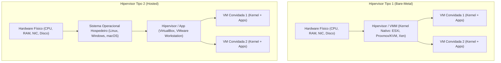
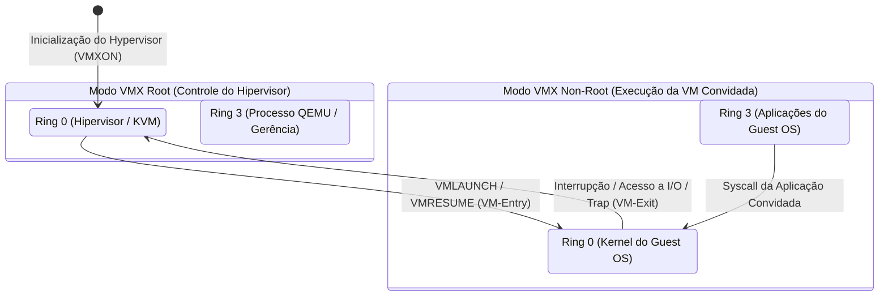
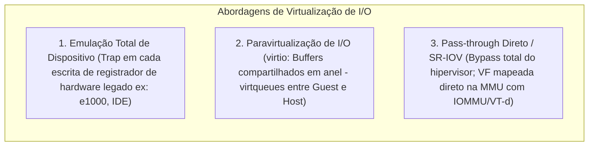
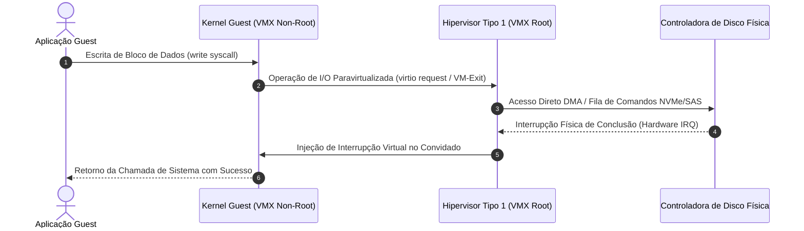
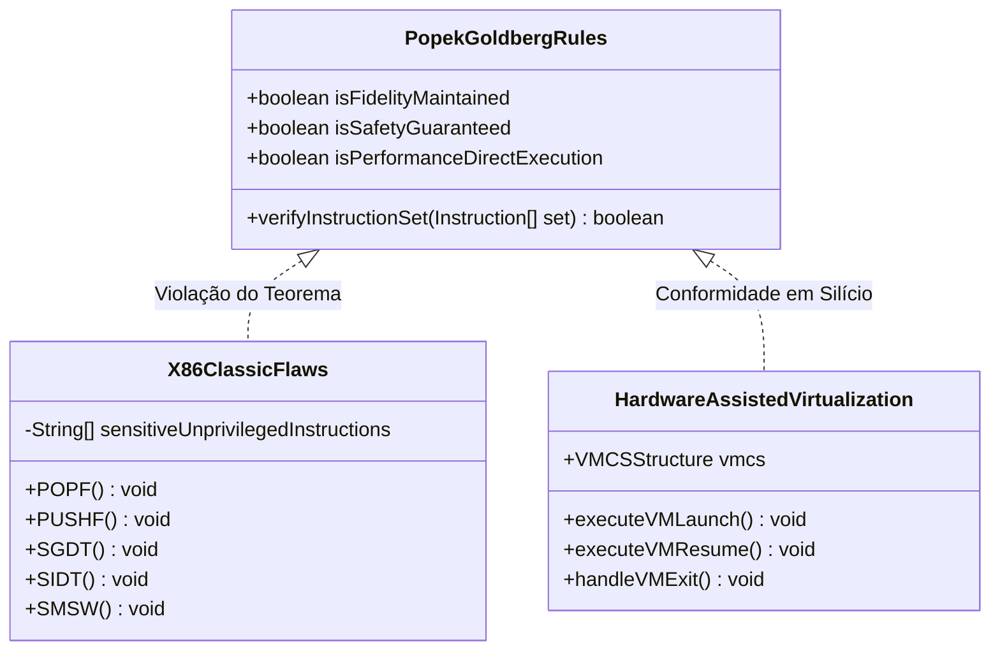
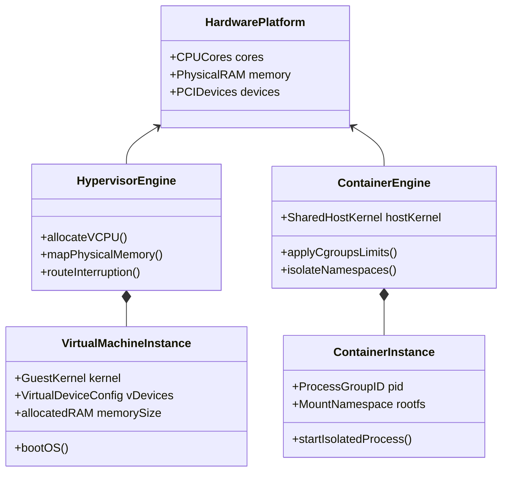
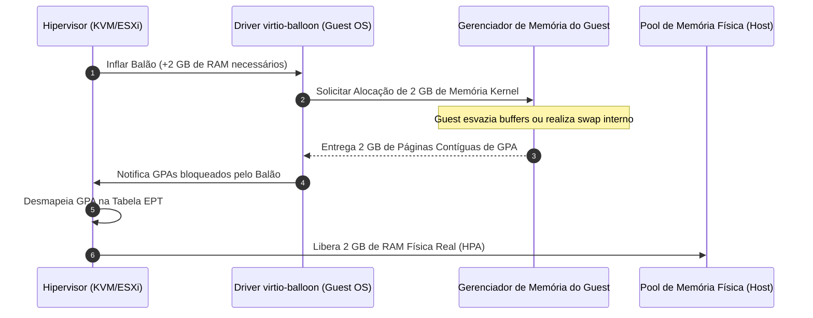

# Trabalho — Softwares de Virtualização

> **Professor:** Guilherme de Morais
> **Disciplina:** Sistemas Operacionais (3º Semestre)
> **Prazo de Entrega:** 28/04/2026 às 23:59
> **Pontuação Máxima:** 100 pontos
> **Conteúdo cobrado:** [Aula 01 - Gerenciamento de Processos e Blocos de Controle](../../Aulas/Aula%2001%20-%20Gerenciamento%20de%20Processos%20e%20Blocos%20de%20Controle/detalhes.md), [Aula 02 - Evolução dos Sistemas Operacionais e Arquiteturas](../../Aulas/Aula%2002%20-%20Evolu%C3%A7%C3%A3o%20dos%20Sistemas%20Operacionais%20e%20Arquiteturas/detalhes.md), [Aula 04 - Organização e Gerenciamento da Memória Real](../../Aulas/Aula%2004%20-%20Organiza%C3%A7%C3%A3o%20e%20Gerenciamento%20da%20Mem%C3%B3ria%20Real/detalhes.md), [Aula 05 - Monitores e Deadlock em Sistemas Operacionais](../../Aulas/Aula%2005%20-%20Monitores%20e%20Deadlock%20em%20Sistemas%20Operacionais/detalhes.md)

## Sumário

1. [Enunciado original (Google Classroom)](#enunciado-original-google-classroom)
2. [Análise do que é pedido](#análise-do-que-é-pedido)
3. [Fundamentação teórica](#fundamentação-teórica)
4. [Resolução proposta](#resolução-proposta)
5. [Como testar e validar](#como-testar-e-validar)
6. [Critérios de qualidade](#critérios-de-qualidade)
7. [Arquivos de apoio](#arquivos-de-apoio)
8. [Mapa da atividade](#mapa-da-atividade)
9. [Glossário](#glossário)
10. [Pontos-chave para a prova](#pontos-chave-para-a-prova)
11. [Perguntas e respostas (JSONL)](#perguntas-e-respostas-jsonl)
12. [Checklist de revisão](#checklist-de-revisão)

## Enunciado original (Google Classroom)

Softwares de Virtualização (07/04/2026)

Anexo disponibilizado: `grad-direito-artigo-nota-rodape.doc`
Estrutura e diretrizes de artigo científico com base na norma ABNT NBR 6022:2018 para elaboração de produção acadêmica estruturada. O documento exige a definição de título, subtítulo, resumo vernáculo (100 a 250 palavras) com espaçamento simples, palavras-chave separadas por ponto e vírgula, introdução, fundamentação teórica com subtítulos de níveis 1, 2 e 3, regras formais para citação indireta, citação direta curta (até 3 linhas) e citação direta longa destacada (recuo de 4 cm, fonte menor, sem aspas), notas de rodapé explicativas e de referência bibliográfica alinhadas sob a primeira letra após o número indicador, considerações finais, e lista padronizada de referências em ordem alfabética.

Objetivo da atividade: Produzir um artigo científico completo e aprofundado sobre "Softwares de Virtualização", correlacionando os modelos arquiteturais de hipervisores, virtualização de processador, memória e subsistemas de entrada/saída com a gestão de recursos de hardware em sistemas computacionais modernos.

## Análise do que é pedido

### Requisitos explícitos
- **Estruturação Formal ABNT NBR 6022:2018:** O trabalho deve seguir rigorosamente a anatomia de artigo científico acadêmico, compreendendo elementos pré-textuais (título, autoria, resumo estruturado, palavras-chave), elementos textuais (introdução, fundamentação teórica e discussão técnica, considerações finais) e elementos pós-textuais (referências normatizadas).
- **Tratamento Tipográfico e Mecânica de Citações:** Diferenciação estrita entre citações diretas curtas (incorporadas ao texto com aspas), citações diretas longas (bloco próprio, recuo de 4 cm, espaçamento simples e fonte reduzida) e citações indiretas (paráfrase técnica com atribuição autoral).
- **Normatização de Notas de Rodapé:** Emprego correto de notas explicativas e de referências conforme o modelo disponibilizado, observando o alinhamento suspenso à esquerda a partir da segunda linha.

### Requisitos implícitos e rigor de engenharia
- **Profundidade Arquitetural:** O artigo deve transcriar a visão de usuário final ("instalar uma VM no VirtualBox") para uma visão de engenharia de sistemas operacionais: como as instruções da CPU convidada são executadas, como as tabelas de páginas são traduzidas e como o hipervisor arbitra interrupções e acessos aos barramentos PCI/PCIe.
- **Relação com o Conteúdo Programático:** Integração mandatória com os conceitos de gerenciamento de processos (PCB, escalonamento e contexto de execução da Aula 01), evolução arquitetural e modos de operação (Kernel Mode vs. User Mode da Aula 02), organização de memória real e paginação (Aula 04) e controle de concorrência e sincronização de recursos compartilhados (Aula 05).
- **Análise Quantitativa e Dimensionamento:** Capacidade de calcular taxas de sobrealocação (*overcommit*) de processadores lógicos (vCPUs) e memória física (RAM), avaliando o custo de troca de contexto e contenção de barramentos.

### Entregáveis
1. Documento monográfico em formato de artigo técnico/científico completo abordando o estado da arte dos softwares de virtualização.
2. Análise comparativa detalhada entre Hipervisores Tipo 1 (*bare-metal*) e Tipo 2 (*hosted*), virtualização assistida por hardware versus tradução binária, paravirtualização e contêineres.
3. Estudo de dimensionamento matemático de capacidade e mecanismos de recuperação de memória sob contenção severa (*Memory Ballooning*, *Kernel Samepage Merging*).

## Fundamentação teórica

> *Nota de Complementação Técnica:* O material disponibilizado pelo docente estabelece o escopo de "Softwares de Virtualização" e as diretrizes formais de artigo científico; os aprofundamentos arquiteturais de registradores x86, microcódigo, instruções VMX e algoritmos de gerenciamento de memória apresentados a seguir constituem enriquecimento técnico fundamentado na literatura clássica de Sistemas Operacionais (Silberschatz, Tanenbaum, Bovet & Cesati).

### Teorema de Popek-Goldberg e Virtualização Clássica

#### Definição
Formalizado por Gerald J. Popek e Robert P. Goldberg em 1974 (*Formal Requirements for Virtualizable Third Generation Architectures*), o teorema estabelece as condições necessárias e suficientes para que uma arquitetura computacional seja puramente virtualizável por meio de uma técnica conhecida como *Trap-and-Emulate* (captura e emulação). Uma arquitetura é estritamente virtualizável se todas as suas instruções sensíveis forem um subconjunto estrito de suas instruções privilegiadas.

- **Instrução Privilegiada:** Aquela que gera uma interrupção ou armadilha (*trap*) para o sistema operacional quando executada em modo de usuário (nível sem privilégios), transferindo o fluxo de controle para o manipulador do kernel.
- **Instrução Sensível:** Aquela que manipula diretamente configurações de hardware (como desabilitar interrupções, alterar registradores de controle ou manipular tabelas de memória) ou cujo comportamento varia dependendo do nível de privilégio em que é executada.

#### Motivação
A virtualização eficiente exige que a grande maioria das instruções do sistema operacional convidado (*Guest OS*) seja executada nativamente na CPU física na velocidade do hardware (*direct execution*). Apenas as operações que tentam acessar diretamente recursos físicos compartilhados devem ser interceptadas pelo hipervisor para garantir isolamento e fidelidade.

#### Exemplo
Na arquitetura IBM System/370, todas as instruções que alteravam o estado da máquina geravam *traps* quando executadas fora do estado supervisor. O hipervisor podia capturar essas tentativas e simular a operação perfeitamente para a máquina virtual.

#### Contraexemplo (A Lacuna da Arquitetura x86 Clássica)
A arquitetura x86 original (IA-32) possuía 17 instruções sensíveis que **não** eram privilegiadas. O exemplo clássico é a instrução `POPF` (*Push/Pop to Interrupt Flags*), utilizada para habilitar ou desabilitar interrupções. Quando executada em Modo Usuário (Ring 3), ela simplesmente falhava silenciosamente sem gerar nenhuma exceção ou *trap*, alterando apenas flags locais não críticas. O *Guest OS* acreditava ter desabilitado as interrupções do sistema, mas o processador físico ignorava o comando, quebrando a fidelidade da virtualização clássica.

#### Armadilhas comuns (Pitfalls)
Presumir que basta rodar o kernel do sistema convidado no Ring 1 ou Ring 2 do processador x86 para virtualizar um sistema operacional. Isso introduz o problema da "ilusão de anel", no qual instruções sensíveis não privilegiadas expõem o estado real da máquina hospedeira ao convidado sem acionar o hipervisor.

### Hipervisores Tipo 1 (Bare-Metal) vs. Tipo 2 (Hosted)



#### Definição
- **Hipervisor Tipo 1 (*Bare-Metal* ou Nativo):** O software de virtualização executa diretamente sobre o hardware físico bare-metal. Ele atua como o próprio sistema operacional da máquina servidora, assumindo o controle direto das CPUs, controladores de memória e barramentos de I/O. Exemplos: VMware ESXi, Proxmox VE / KVM nativo, Xen, Microsoft Hyper-V Server.
- **Hipervisor Tipo 2 (*Hosted* ou Hospedado):** O software de virtualização é executado como uma aplicação ou processo convencional em cima de um sistema operacional hospedeiro (*Host OS*). As solicitações de recursos de hardware emitidas pelas VMs passam obrigatoriamente pela pilha do hipervisor e, em seguida, pelas chamadas de sistema e drivers do SO hospedeiro. Exemplos: Oracle VM VirtualBox, VMware Workstation / Fusion, QEMU em modo emulação pura de usuário.

#### Motivação
A segregação define o compromisso entre desempenho absoluto/baixa latência (Tipo 1) versus conveniência de uso, compatibilidade de periféricos de desktop e facilidade de depuração (Tipo 2).

#### Exemplo
Datacenters corporativos utilizam VMware ESXi ou KVM gerenciado (Tipo 1) para hospedar bancos de dados relacionais e clusters Kubernetes de produção, onde cada microsegundo de latência de I/O e ciclo de CPU impacta o acordo de nível de serviço (SLA). Desenvolvedores de software utilizam o VirtualBox ou VMware Workstation (Tipo 2) em suas estações de trabalho para testar builds de múltiplos sistemas operacionais sem perder o acesso ao seu ambiente de desktop de desenvolvimento.

#### Contraexemplo
Instalar um sistema operacional desktop de uso diário (ex: Windows 11 com navegadores, suíte de escritório e reprodutores de mídia) diretamente como um hipervisor Tipo 1. O hipervisor Tipo 1 não possui subsistemas gráficos voltados para entretenimento, aceleração de áudio para usuário comum ou ecossistema de drivers de periféricos domésticos.

#### Armadilhas comuns (Pitfalls)
Classificar o KVM (*Kernel-based Virtual Machine*) incorretamente. O KVM transforma o próprio kernel Linux em um hipervisor Tipo 1 por meio da carga de módulos de kernel (`kvm.ko` e `kvm-intel.ko`/`kvm-amd.ko`), expondo o descritor `/dev/kvm`. Embora o processo `qemu-system-x86_64` execute no espaço de usuário para gerenciar dispositivos virtuais, a execução de CPU e tabelas de memória ocorre diretamente no Ring 0 do hardware via KVM, caracterizando uma arquitetura Tipo 1 híbrida.

### Virtualização de Processador: Tradução Binária Dinâmica e Extensões de Hardware



#### Definição
- **Tradução Binária Dinâmica (*Binary Translation*):** Técnica pioneira desenvolvida pela VMware no final dos anos 1990 para contornar a lacuna do Popek-Goldberg no x86. O hipervisor intercepta blocos básicos de instruções em código de máquina do *Guest OS* antes de sua execução, inspeciona as instruções sensíveis não privilegiadas em tempo de execução e as substitui por sequências de instruções inofensivas que transferem o controle de volta ao hipervisor de forma segura.
- **Virtualização Assistida por Hardware (Intel VT-x / AMD-V):** Conjuntos de instruções incorporados ao silício dos processadores que criam uma nova dimensão ortogonal de privilégios. Na Intel, foram criados os modos **VMX Root** (onde o hipervisor opera com plenos privilégios de controle) e **VMX Non-Root** (onde o sistema convidado opera). Dentro de cada modo, existem os anéis clássicos de 0 a 3.

#### Motivação
A tradução binária envolvia uma complexa compilação *Just-In-Time* (JIT) de blocos de instruções em memória com sobretaxa considerável de ciclos de máquina. A assistência por hardware permitiu que o hardware da CPU cuidasse nativamente da interceptação de instruções sensíveis através de eventos de **VM-Entry** (entrada na VM) e **VM-Exit** (saída forçada para o hipervisor), orquestrados por uma estrutura de dados na memória chamada **VMCS** (*Virtual Machine Control Structure* na Intel) ou **VMCB** (*Virtual Machine Control Block* na AMD).

#### Exemplo
Quando o kernel convidado executa `CLI` (*Clear Interrupt Flag*) dentro do modo VMX Non-Root para desabilitar interrupções, o processador consulta o registrador de controle da VMCS. Se o campo de interceptação estiver ativado, o processador congela o estado do convidado, grava seus registradores na VMCS e executa um **VM-Exit** imediato para o Ring 0 do hipervisor em VMX Root, permitindo que o hipervisor registre a intenção da VM e retorne via `VMRESUME`.

#### Contraexemplo
Executar tarefas de computação puramente matemática (como multiplicação de matrizes em ponto flutuante via AVX-512) dentro de uma VM. Essas instruções não são sensíveis e executam diretamente nos núcleos físicos em velocidade nativa sem jamais acionar um VM-Exit, desmistificando o mito de que qualquer instrução em VM sofre degradação de virtualização.

#### Armadilhas comuns (Pitfalls)
Ignorar a sobretaxa (*overhead*) do ciclo VM-Exit. Um único VM-Exit pode consumir entre 500 e 1500 ciclos de clock de CPU apenas para alternar o contexto de registradores e sincronizar o estado da VMCS. Softwares convidados mal otimizados que geram dezenas de milhares de VM-Exits por segundo (ex: polling agressivo de registradores de I/O virtuais) podem sofrer colapso de desempenho mesmo em servidores com CPUs modernas.

### Virtualização de Memória: Shadow Page Tables vs. Paginação Aninhada (SLAT)

#### Definição
- **Shadow Page Tables (SPT):** Abordagem puramente em software. O hipervisor mantém tabelas de páginas "sombra" que mapeiam diretamente os endereços virtuais do convidado (*Guest Virtual Address* - GVA) para os endereços físicos reais da máquina (*Host Physical Address* - HPA). O hipervisor marca as tabelas de páginas do convidado como somente leitura; toda vez que o kernel convidado tenta alocar memória ou alterar uma entrada de página, ocorre uma falta de página (*Page Fault*), acionando o hipervisor para atualizar a tabela sombra correspondente.
- **Paginação Aninhada / SLAT (*Second Level Address Translation*):** Implementação em hardware (Intel **EPT** - *Extended Page Tables*; AMD **NPT** - *Nested Page Tables*). A CPU física mantém duas camadas independentes de paginação: a primeira traduz GVA para *Guest Physical Address* (GPA), controlada pelo kernel convidado; a segunda camada (EPT/NPT) traduz GPA para HPA, controlada exclusivamente pelo hipervisor.

```mermaid
flowchart LR
    subgraph ConversaoMemoria["Tradução de Endereços em Duas Camadas (EPT/NPT)"]
        GVA["GVA: Endereço Virtual da Aplicação Convidada"] -->|Tabela de Páginas do Convidado (CR3 do Guest)| GPA["GPA: Endereço 'Físico' da Máquina Virtual"]
        GPA -->|Tabelas EPT/NPT em Hardware (EPTP)| HPA["HPA: Endereço Físico Real nos Módulos de RAM"]
    end
```

#### Motivação
As tabelas de páginas sombra demandavam um consumo astronômico de memória pelo próprio hipervisor e geravam uma avalanche de falhas de página a cada alocação ou desalocação de processos dentro da VM. A paginação aninhada elimina completamente essas armadilhas em software, permitindo que a MMU física realize a tradução bidimensional de endereços em nível de microarquitetura.

#### Exemplo
Um servidor rodando um servidor web NGINX dentro de uma VM aloca dezenas de conexões concorrentes. Com EPT habilitado, a criação de novas páginas no espaço de usuário do Linux convidado não gera intervenção do hipervisor; a MMU física resolve o caminhamento de página (*page table walk*) cruzando as matrizes de EPT transparentemente.

#### Contraexemplo
Apesar da grande vantagem de não gerar VM-Exits a cada alteração de ponteiro, o caminhamento de páginas via EPT em caso de perda na TLB (*Translation Lookaside Buffer*) é muito mais custoso em termos de ciclos: enquanto uma perda de TLB em hardware nativo exige a leitura de até 4 ou 5 níveis de tabelas (em paginação de 48 ou 57 bits), a paginação aninhada exige que cada um desses passos seja multiplicado pelos níveis da tabela EPT, podendo exigir até 24 acessos sucessivos à memória RAM principal para resolver uma única falha de tradução.

#### Armadilhas comuns (Pitfalls)
Desativar *HugePages* (páginas de 2 MB ou 1 GB) em servidores de virtualização com grandes cargas de banco de dados. O uso de páginas tradicionais de 4 KB satura rapidamente a TLB da CPU física devido à penalidade bidimensional do EPT, degradando a performance de memória em até 30%. O uso de HugePages reduz drasticamente os níveis da árvore de tradução.

### Virtualização de Entrada e Saída (I/O)



#### Definição
- **Emulação Completa:** O hipervisor simula linha por linha o comportamento eletrônico de chips legados clássicos (ex: placa de rede Intel e1000, controladora de disco IDE PIIX4, chip de som Realtek AC97).
- **Paravirtualização de Dispositivos (`virtio`):** Arquitetura padronizada no Linux onde o kernel convidado possui drivers conscientes da virtualização. Em vez de simular registradores de placas físicas, o convidado e o hipervisor se comunicam através de filas circulares de buffers em memória compartilhada denominadas **virtqueues**.
- **SR-IOV (*Single Root I/O Virtualization*) e PCI Passthrough:** Mecanismo de hardware onde um dispositivo PCIe físico (ex: placa de rede Mellanox ou Intel de 100 Gbps) instancia múltiplos canais físicos virtuais (*Virtual Functions* - VF). Uma VF é mapeada diretamente no espaço de endereçamento da VM via **IOMMU** (Intel VT-d / AMD-Vi), contornando o hipervisor por completo.

#### Motivação
A emulação de placas antigas garante que qualquer sistema operacional de 1995 rode sem drivers adicionais, mas cada pacote de rede transmitido gera múltiplos VM-Exits. O padrão `virtio` entrega taxas de transferência de dezenas de gigabits por segundo com baixo consumo de processador, enquanto o SR-IOV fornece desempenho virtualmente idêntico ao bare-metal com latência na casa dos sub-microsegundos.

#### Exemplo
Em servidores de borda de telecomunicações rodando NFV (*Network Functions Virtualization*), interfaces virtuais `virtio-net` com aceleração vhost-user ou placas configuradas com SR-IOV processam milhões de pacotes por segundo (Mpps) utilizando DPDK (*Data Plane Development Kit*).

#### Contraexemplo
Tentar utilizar *Live Migration* (migração a quente de VM entre hosts físicos sem interrupção de serviço) em uma VM configurada com PCI Passthrough ou SR-IOV simples. Como o estado interno do chip físico da placa PCIe reside no silício do servidor de origem e a memória da placa não é gerenciada pelo hipervisor, a migração viva torna-se inviável sem camadas de abstração adicionais de bonding de rede.

#### Armadilhas comuns (Pitfalls)
Configurar discos de alta performance NVMe em máquinas virtuais utilizando a emulação de controladora SATA/IDE em vez do driver `virtio-blk` ou `virtio-scsi`. A perda de IOPS (*Input/Output Operations Per Second*) pode ultrapassar 80% unicamente pelo custo de alternância de contexto nos acessos simulados a portas de I/O (`IN`/`OUT`).

## Resolução proposta

A seguir, estrutura-se a resolução do trabalho acadêmico nos exatos moldes exigidos pelas diretrizes da ABNT NBR 6022:2018 contidas no material de apoio do curso, resolvendo detalhadamente os eixos analíticos de engenharia de sistemas operacionais.

---

### Estrutura formal do artigo científico (ABNT NBR 6022:2018)

UNIVERSIDADE UNIFEF  
DEPARTAMENTO DE ENGENHARIA E SISTEMAS DE INFORMAÇÃO  
CURSO DE SISTEMAS DE INFORMAÇÃO  

**SOFTWARES DE VIRTUALIZAÇÃO: ARQUITETURA DE HIPERVISORES, CONTROLE DE PRIVILÉGIOS E SOBREALOCAÇÃO DE RECURSOS EM SISTEMAS OPERACIONAIS MODERNOS**

*Murilo de Oliveira Dev*  
*Prof. Me. Guilherme de Morais*  

**Resumo:** Este artigo investiga os fundamentos teóricos e operacionais dos softwares de virtualização, estabelecendo uma análise rigorosa sobre as distinções arquiteturais entre hipervisores Tipo 1 (bare-metal) e Tipo 2 (hosted). Analisa-se a superação dos limites impostos pelo Teorema de Popek-Goldberg na arquitetura x86 por meio da evolução histórica da tradução binária dinâmica até a consolidação das instruções de virtualização assistida por hardware (Intel VT-x e AMD-V) com os modos VMX Root e Non-Root. Examina-se o impacto da paginação aninhada (EPT/NPT) e dos subsistemas de entrada e saída paravirtualizados (virtio) na latência do sistema. Por fim, desenvolve-se um estudo analítico e quantitativo sobre técnicas de sobrealocação (overcommit) de vCPUs e memória física, detalhando os mecanismos de Memory Ballooning e Kernel Samepage Merging (KSM), bem como os riscos de contenção severa e degradação por saturação em infraestruturas computacionais consolidadas.

**Palavras-chave:** softwares de virtualização; hipervisores; popek-goldberg; intel vt-x; ept; memory ballooning; overcommit.

---

### Resolução detalhada dos eixos técnicos do artigo

#### Eixo 1: Classificação e Análise Comparativa entre Hipervisores Tipo 1 e Tipo 2

A taxonomia fundamental estabelecida por Robert Goldberg segrega as camadas de abstração conforme sua proximidade com os barramentos físicos da placa-mãe.

1. **Acesso aos Recursos de Hardware e Anéis de Privilégio x86:**
   - **Hipervisores Tipo 1:** Executam diretamente no Ring 0 do processador físico (em arquiteturas legadas) ou no modo **VMX Root Ring 0** (em arquiteturas assistidas por hardware). O hipervisor possui posse exclusiva dos registradores de controle da máquina (`CR0`, `CR3`, `CR4`), das tabelas de interrupções físicas (IDT) e do agendador de threads. O kernel do sistema operacional convidado é rebaixado de forma segura para o modo **VMX Non-Root Ring 0**, permitindo que ele gerencie seus próprios processos internos em Ring 3 sem violar o isolamento de outras máquinas virtuais.
   - **Hipervisores Tipo 2:** O hipervisor é uma aplicação de espaço de usuário (Ring 3 em VMX Root) acoplada a um driver de dispositivo intermediário carregado no kernel do sistema operacional hospedeiro. Toda requisição privilegiada originada pela máquina virtual deve ser convertida pelo software de virtualização em chamadas de sistema convencionais (`ioctl`, chamadas POSIX ou Win32) direcionadas ao kernel hospedeiro.

2. **Impacto no Desempenho de Latência e Taxa de Transferência de I/O:**
   Nos hipervisores Tipo 2, ocorre o fenômeno da **dupla troca de contexto** e do **agendamento duplicado**:
   - Uma interrupção de disco para a VM deve primeiro ser recebida pelo driver da controladora física no SO hospedeiro, tratada na fila de interrupções do host, propagada via thread para a aplicação do hipervisor e só então injetada como uma interrupção virtual no guest.
   - Isso introduz uma latência de processamento de dezenas de microssegundos adicionais por operação de I/O. Em soluções Tipo 1, o manipulador de interrupção do hipervisor injeta o vetor de interrupção virtual diretamente na VMCS do núcleo convidado, eliminando camadas intermediárias e reduzindo a perda de pacotes e ciclos de espera.



3. **Exemplos de Mercado e Cenários Recomendados:**
   - **Tipo 1 (VMware ESXi, Proxmox VE / KVM nativo):** Ambientes de missão crítica em datacenters, serviços de nuvem pública (AWS EC2, Google Cloud Compute Engine), virtualização de grandes bancos de dados (Oracle Database, Microsoft SQL Server) e infraestruturas de telecomunicações.
   - **Tipo 2 (Oracle VM VirtualBox, VMware Workstation Pro):** Estações de trabalho corporativas para desenvolvedores de software, laboratórios acadêmicos de segurança ofensiva e análise de malware, ambientes de testes rápidos de interoperabilidade entre distribuições Linux e execução eventual de ferramentas legadas em desktops.

#### Eixo 2: Virtualização Assistida por Hardware e o Teorema de Popek-Goldberg

A incapacidade da arquitetura x86 em satisfazer os axiomas de Popek-Goldberg decorria da existência de instruções que permitiam a um programa ler ou modificar o estado dos registradores de controle do processador sem estar em modo supervisor e sem acionar uma interrupção de falha geral de proteção (`#GP`).



1. **A Solução Histórica via Tradução Binária Dinâmica:**
   Para contornar instruções como `POPF`, `PUSHF`, `SGDT` (*Store Global Descriptor Table*) e `SMSW` (*Store Machine Status Word*), a VMware desenvolveu um motor de análise em tempo de execução. O hipervisor inspecionava o ponteiro de instrução (`EIP`/`RIP`) do código de máquina do convidado. Ao detectar uma instrução sensível não privilegiada, o motor interceptava o bloco de código antes que a CPU o executasse nativamente, reescrevendo-o em tempo real na memória RAM para uma sequência de chamada segura ao hipervisor (*trampoline*). Essa técnica permitiu a consolidação de servidores x86, porém impunha alta utilização de memória de tradução e complexidade extrema na manutenção do cache de blocos traduzidos.

2. **Extensões de Hardware (Intel VT-x e AMD-V):**
   Lançadas a partir de 2005/2006, as extensões introduziram novas instruções no conjunto x86 (`VMXON`, `VMXOFF`, `VMLAUNCH`, `VMRESUME`, `VMPTRLD`, `VMCLEAR`) e segregaram a CPU em:
   - **VMX Root Operation:** Ambiente onde o hipervisor é executado com controle irrestrito.
   - **VMX Non-Root Operation:** Ambiente onde a VM convidada é executada. Qualquer tentativa de executar uma instrução sensível não privilegiada ou privilegiada que esteja marcada para captura na VMCS causa uma transição atômica de hardware chamada **VM-Exit**.
   - **Estrutura de Controle VMCS/VMCB:** Um bloco de 4 KB de memória física dividido em seis áreas lógicas:
     1. *Guest-State Area:* Salva registradores de controle, de depuração, ponteiro de instrução e ponteiro de pilha da VM no momento do exit.
     2. *Host-State Area:* Armazena o estado correspondente do hipervisor para restauração imediata de execução.
     3. *VM-Execution Control Fields:* Define quais eventos específicos (interrupções externas, leituras de registradores MSR, acessos a portas de I/O) devem forçar a saída.
     4. *VM-Exit Control Fields:* Configura o comportamento da CPU durante o VM-Exit.
     5. *VM-Entry Control Fields:* Configura a restauração e injeção de interrupções durante o VM-Entry.
     6. *VM-Exit Information Fields:* Detalha o motivo numérico exato da interrupção (*Exit Reason*), simplificando a decisão do hipervisor.

3. **Gerenciamento de Memória Física via EPT / NPT:**
   Em sistemas convencionais, o registrador `CR3` da CPU aponta para a tabela de páginas que converte endereços virtuais em endereços físicos. Com a paginação aninhada (EPT da Intel ou NPT da AMD), introduz-se um segundo ponteiro de controle em nível de hardware, o **EPTP** (*Extended Page Table Pointer*), gravado na VMCS.
   Quando uma instrução da aplicação convidada solicita uma leitura de memória:
   - O hardware utiliza o `CR3` do convidado para transformar o GVA em GPA.
   - Em seguida, a MMU física consulta o `EPTP` do hipervisor para transformar esse GPA no endereço real nos módulos de silício da placa-mãe (HPA).
   Isso transferiu o custo de sincronização das antigas tabelas sombra puramente para a lógica de circuito da MMU, permitindo isolamento estrito de memória entre inquilinos com sobretaxa de controle desprezível.

#### Eixo 3: Comparativo Técnico: Virtualização Total, Paravirtualização e Contêineres

A tabela a seguir consolida as métricas e trade-offs das principais abordagens de isolamento computacional:

| Critério de Análise | Virtualização Total (Full Virtualization) | Paravirtualização (Paravirtualization) | Virtualização em Nível de SO (Contêineres) |
| :--- | :--- | :--- | :--- |
| **Modificação no Kernel do Convidado** | **Nenhuma**. O sistema operacional é executado de forma idêntica à instalação em hardware puro. | **Necessária**. O kernel do SO convidado deve ser recompilado para trocar chamadas de baixo nível por *hypercalls*. | **Inaplicável**. Não há kernel próprio; as instâncias compartilham o kernel único do sistema hospedeiro. |
| **Camada de Abstração** | Abstração em nível de conjunto de instruções e registradores de hardware. | Abstração em nível de interface de software de hardware modificado. | Abstração em nível de chamadas de sistema (*System Call Interface* - syscalls). |
| **Densidade de Instâncias por Nó Físico** | **Média/Baixa**. Cada instância aloca uma tabela de memória completa, drivers de kernel e processos de sistema base. | **Média/Alta**. Menor overhead de I/O em comparação à virtualização total legada. | **Extrema**. Centenas ou milhares de instâncias por nó, devido ao compartilhamento de memória de código do kernel. |
| **Isolamento e Segurança entre Tenants** | **Muito Alto**. Isolamento garantido por hardware (barreiras de anéis VMX e paginação física EPT). | **Alto**. Barreira de isolamento via código do hipervisor e hiperchamadas validadas. | **Moderado**. Isolamento lógico via *Namespaces* (PID, Mount, Net) e contenção via *Control Groups* (cgroups); superfície de ataque no kernel única. |
| **Tempo Médio de Inicialização (Boot)** | **De dezenas de segundos a minutos**. Simulação do ciclo POST, carregador de inicialização (GRUB/UEFI) e init. | **De segundos a dezenas de segundos**. Inicialização simplificada sem emulação de periféricos legados. | **Sub-segundo (milissegundos)**. Criação imediata de novo espaço de nomes e inicialização do processo alvo. |
| **Compatibilidade de Sistemas Operacionais** | Total (ex: hospedeiro Linux rodando Windows Server, FreeBSD ou distribuições Linux distintas). | Parcial (restrita a sistemas operacionais que fornecem suporte ao modelo de hypercalls no código-fonte). | Zero heterogeneidade (hospedeiro Linux só pode hospedar contêineres que consumam a API daquele kernel Linux). |



#### Eixo 4: Dimensionamento de Capacidade, Sobrealocação e Mecanismos de Recuperação de Memória

A consolidação eficiente de servidores baseia-se na constatação empírica de que a maioria das cargas de trabalho corporativas raramente utiliza 100% de seus recursos alocados simultaneamente.

1. **Cálculo de Dimensionamento do Cenário Proposto:**
   - **Recursos Físicos Disponíveis:**
     - Processador: 8 núcleos físicos com suporte a *Simultaneous Multithreading* (SMT / Hyper-Threading) = **16 threads lógicas de execução**.
     - Memória RAM: **64 GB de RAM física**.
   - **Demanda Consolidada (12 Máquinas Virtuais):**
     - Alocação por VM: 2 vCPUs e 8 GB de RAM.
     - Total de vCPUs requisitadas: $12 \times 2 = \mathbf{24\text{ vCPUs}}$.
     - Total de Memória requisitada: $12 \times 8\text{ GB} = \mathbf{96\text{ GB de RAM}}$.
   - **Cálculo da Taxa de Sobrealocação (*Overcommit Ratio*):**
     - **Sobrealocação de vCPU:**
       $$\text{Razão sobre threads lógicas} = \frac{24\text{ vCPUs}}{16\text{ threads físicas}} = \mathbf{1{,}5:1}\text{ (ou }150\%\text{ de sobrealocação)}$$
       $$\text{Razão sobre núcleos físicos reais} = \frac{24\text{ vCPUs}}{8\text{ núcleos puros}} = \mathbf{3:1}$$
       Em ambientes corporativos com cargas de trabalho médias (servidores web, servidores de arquivos, microsserviços), uma razão de vCPU:pCPU de $1{,}5:1$ a $2:1$ em relação a threads lógicas é plenamente recomendada e estável.
     - **Sobrealocação de Memória RAM:**
       $$\text{Razão nominal de RAM} = \frac{96\text{ GB}}{64\text{ GB}} = \mathbf{1{,}5:1}\text{ (ou }150\%\text{)}$$
       *Reserva Mandatória do Hipervisor:* Para garantir estabilidade, o sistema operacional hospedeiro / hipervisor Tipo 1 necessita de aproximadamente 4 GB de memória RAM dedicada para estruturas de controle da VMCS, tabelas de páginas EPT de todas as VMs, buffers de rede e pilha de gerenciamento.
       Portanto, a RAM disponível real para as VMs é de $64\text{ GB} - 4\text{ GB} = 60\text{ GB}$.
       $$\text{Razão efetiva de RAM} = \frac{96\text{ GB}}{60\text{ GB}} = \mathbf{1{,}6:1}$$

2. **Mecanismos de Recuperação e Mitigação de Saturação de Memória:**
   Como a capacidade de memória RAM física é um recurso estritamente delimitado que não tolera latência infinita como a CPU, o hipervisor adota duas técnicas principais:

   - **Memory Ballooning (Infusão de Memória):**
     Um pseudodriver especial (ex: `virtio_balloon`) é instalado dentro do sistema operacional convidado como parte do pacote de ferramentas de integração (*guest agent*). O hipervisor não possui visibilidade sobre quais páginas de memória o sistema convidado considera "livres" ou "descartáveis" devido à abstração de proteção.
     Quando o host físico atinge um limiar crítico de memória livre (ex: abaixo de 10% de RAM física):
     1. O hipervisor envia um comando ao driver do balão dentro da VM, solicitando a "inflação" do balão em 2 GB.
     2. O driver do balão dentro do *Guest OS* faz uma requisição padrão de alocação de memória ao kernel convidado (`malloc` em nível de kernel).
     3. Para atender a essa requisição volumosa, o kernel convidado libera caches de disco em memória ou pagina aplicações inativas para seu próprio arquivo de *swap* interno.
     4. Uma vez que o balão recebe essas páginas físicas do convidado, ele repassa a lista dos endereços GPA correspondentes ao hipervisor.
     5. O hipervisor remove imediatamente o mapeamento desses endereços em suas tabelas EPT/NPT e devolve as páginas físicas reais (HPA) para o pool compartilhado do servidor físico.



   - **Kernel Samepage Merging (KSM):**
     O KSM é um recurso de deduplicação de memória em tempo de execução implementado no kernel Linux (e tecnologias equivalentes em outros hipervisores). Um daemon de verificação em segundo plano (*ksmd*) varre continuamente as páginas de memória atribuídas às máquinas virtuais procurando por páginas de 4 KB com conteúdos estritamente idênticos (por exemplo, múltiplas VMs rodando a mesma distribuição Linux que carregam as mesmas bibliotecas dinâmicas `glibc` ou o mesmo kernel em memória).
     Ao encontrar duplicatas:
     1. O KSM mapeia ambas as referências para uma única página física compartilhada nos módulos de RAM.
     2. Ele marca essa página física como **Copy-On-Write (COW)** nas tabelas de paginação.
     3. A página duplicada redundante é descartada, liberando blocos inteiros de memória física.
     4. Caso uma das máquinas virtuais tente escrever qualquer dado nessa página compartilhada, uma interrupção de falta de página de proteção é disparada pela MMU física, forçando o hipervisor a clonar a página instantaneamente e dar a ela um endereço físico exclusivo antes de permitir a escrita.

3. **Riscos e Efeitos Colaterais da Contenção Severa:**
   Quando a taxa de sobrealocação ultrapassa a capacidade de absorção das cargas dinâmicas e os mecanismos de mitigação se esgotam:
   - **CPU Steal Time Elevado:** As vCPUs das máquinas virtuais passam longos períodos prontas para execução (*ready state*), mas sem conseguir tempo de despacho nos núcleos físicos porque as threads do hipervisor estão saturadas. O *Guest OS* registra um aumento drástico na métrica de *steal time*, fazendo com que aplicações de tempo real sofram atrasos severos e conexões TCP atinjam *timeout*.
   - **Memory Thrashing e Esgotamento por Hipervisor Swapping:** Se o consumo das VMs superar a soma da RAM física e a deduplicação do KSM não encontrar padrões repetidos, o hipervisor é forçado a realizar *swap* das páginas da máquina virtual para o subsistema de armazenamento secundário (disco SSD/NVMe). Como a latência de acesso à memória RAM é da ordem de 50 a 100 nanossegundos e a de um SSD NVMe é de 20 a 100 microssegundos (mil vezes mais lenta), as VMs congelam, entrando em estado de saturação de barramento (*thrashing*).
   - **Disparo do OOM-Killer (*Out of Memory Killer*):** Se o hipervisor não possuir espaço de swap configurado ou se a taxa de alocação for mais veloz que a capacidade de descarte, o algoritmo de emergência do kernel hospedeiro é acionado, eliminando sumariamente o processo que consome mais memória — que tipicamente é o processo responsável por manter uma das maiores máquinas virtuais em execução, resultando em perda de dados e desligamento catastrófico não planejado.

---

### Exemplo de Configuração e Controle em Ambiente KVM/QEMU

Para materializar a governança dos recursos analisados, o trecho abaixo ilustra uma definição padrão de máquina virtual via descritor XML da `libvirt` (utilizada por KVM em ambientes Linux profissionais), parametrizando a topologia de vCPUs com fixação em núcleos físicos (*pinning*), memória máxima e mínima via balão e dispositivos de I/O em modo `virtio`:

```xml
<domain type='kvm'>
  <name>servidor-producao-01</name>
  <uuid>4f5b2c9d-8a1e-4c3b-9a7e-1d5f2a8c3e4b</uuid>
  
  <!-- Dimensionamento de Memória: 8 GB Nominal com Balão Mínimo de 4 GB -->
  <memory unit='GiB'>8</memory>
  <currentMemory unit='GiB'>4</currentMemory>
  
  <!-- Topologia de vCPU: 2 vCPUs mapeadas com afinidade nos núcleos físicos 2 e 3 -->
  <vcpu placement='static' current='2'>2</vcpu>
  <cputune>
    <vcpupin vcpu='0' cpuset='2'/>
    <vcpupin vcpu='1' cpuset='3'/>
    <shares>2048</shares> <!-- Prioridade relativa de agendamento CPU -->
  </cputune>

  <os>
    <type arch='x86_64' machine='q35'>hvm</type>
    <boot dev='hd'/>
  </os>

  <!-- Ativação de Recursos de Aceleração em Hardware -->
  <features>
    <acpi/>
    <apic/>
    <vmport state='off'/>
  </features>

  <cpu mode='host-passthrough' check='none'>
    <topology sockets='1' dies='1' cores='2' threads='1'/>
  </cpu>

  <devices>
    <!-- Disco Virtual com Barramento Paravirtualizado virtio -->
    <disk type='file' device='disk'>
      <driver name='qemu' type='qcow2' cache='none' io='native'/>
      <source file='/var/lib/libvirt/images/vm01-disk.qcow2'/>
      <target dev='vda' bus='virtio'/>
    </disk>

    <!-- Placa de Rede com Driver de Alta Performance virtio -->
    <interface type='bridge'>
      <source bridge='br0'/>
      <model type='virtio'/>
    </interface>

    <!-- Dispositivo de Memória Balloon Ativo para Mitigação de Saturação -->
    <memballoon model='virtio'>
      <stats period='5'/> <!-- Coleta métricas de consumo da VM a cada 5 segundos -->
    </memballoon>
  </devices>
</domain>
```

---

## Como testar e validar

Para comprovar experimentalmente os conceitos de virtualização assistida por hardware, dimensionamento e comportamento dos subsistemas de memória e CPU analisados no artigo, o engenheiro de sistemas pode executar a seguinte rotina de validação em um terminal Linux:

### 1. Verificação do Suporte à Virtualização Assistida por Hardware

```bash
# 1. Checagem das flags de processador no ambiente Linux
# 'vmx' indica processadores Intel VT-x; 'svm' indica processadores AMD-V
grep -E --color=auto '(vmx|svm)' /proc/cpuinfo

# 2. Utilização do utilitário padronizado kvm-ok (pacote cpu-checker)
sudo apt-get install -y cpu-checker
kvm-ok
# Saída esperada em ambiente operacional habilitado:
# INFO: /dev/kvm exists
# KVM acceleration can be used

# 3. Verificação do carregamento dos módulos de kernel do hipervisor KVM
lsmod | grep kvm
```

### 2. Validação e Controle do Kernel Samepage Merging (KSM)

```bash
# 1. Inspecionar o status atual do KSM no kernel hospedeiro
cat /sys/kernel/mm/ksm/run
# Valor 1 indica que a deduplicação de memória está ativa

# 2. Avaliar a quantidade de memória física recuperada através da deduplicação
cat /sys/kernel/mm/ksm/pages_sharing
# Multiplica-se o número retornado pelo tamanho da página (geralmente 4096 bytes)
# Exemplo de cálculo em Bash:
echo "$(( $(cat /sys/kernel/mm/ksm/pages_sharing) * 4096 / 1024 / 1024 )) MB economizados via KSM"
```

### 3. Monitoramento em Tempo Real de Contenção e Overcommit

```bash
# 1. Inspeção de métricas de vCPU e memória de instâncias KVM via virsh
virsh list --all
virsh dommemstat servidor-producao-01

# 2. Monitoramento de contenção de CPU (CPU Steal Time) dentro da VM convidada
# O campo %steal deve permanecer próximo de 0.0%. Valores sustentados acima de 5-10% indicam sobrealocação excessiva no host
sar -u 1 10
# ou simplesmente:
top -b -n 1 | grep "Cpu(s)"
```

## Critérios de qualidade

Para assegurar nota máxima e conformidade acadêmica com a avaliação do Prof. Guilherme de Morais e os padrões do colegiado de Sistemas de Informação da UniFEF, o trabalho deve satisfazer os seguintes pilares de excelência:

1. **Rigor Conceitual e Terminológico:**
   - Emprego preciso dos termos da disciplina (ex: *Trap-and-Emulate*, *VM-Exit*, *VMCS*, *EPT/NPT*, *Virtqueues*, *vCPU Pinning*, *Memory Ballooning*).
   - Rejeição absoluta a noções simplistas de senso comum; fundamentação baseada na arquitetura de computadores e na engenharia de sistemas operacionais.

2. **Aderência às Normas ABNT NBR 6022:2018:**
   - Resumo em parágrafo único, justificado, espaçamento simples, com limite rigoroso entre 100 e 250 palavras.
   - Aplicação da regra de citações: citação direta curta no corpo do parágrafo entre aspas; citação direta longa recuada a 4 cm com fonte tamanho 10 e entrelinhas simples; citações indiretas devidamente atribuídas aos autores clássicos.
   - Formatação das notas de rodapé de acordo com as instruções do anexo institucional (alinhamento sob a primeira letra a partir da segunda linha, destacando o expoente numérico).

3. **Exatidão e Consistência Quantitativa:**
   - Desenvolvimento explícito de todas as etapas matemáticas do cálculo de sobrealocação (*overcommit* de vCPU e memória), demonstrando a dedução das margens de segurança para o overhead de controle do hipervisor.

4. **Clareza Diagramática e Visual:**
   - Representação visual clara da pilha arquitetural em modelos nativos do GitHub, permitindo a compreensão imediata do fluxo de controle e da hierarquia de hardware.

## Arquivos de apoio

- **Anexo Institucional de Diretrizes (`grad-direito-artigo-nota-rodape.doc`):**
  Modelo de artigo acadêmico baseado na ABNT NBR 6022:2018. Embora originado no âmbito do Curso de Direito da UNISINOS e disponibilizado como modelo estrutural no Classroom, suas normas tipográficas, diretrizes de estruturação de capítulos, alinhamento de notas de rodapé de referência e explicativas, e metodologia de citações aplicam-se integralmente à produção científica em Sistemas de Informação na UniFEF.
- **Acervo de Aulas Correlacionadas da Disciplina:**
  - *Aula 01 - Gerenciamento de Processos e Blocos de Controle:* Mapeamento entre threads do SO convidado e threads de agendamento do processo do hipervisor no host.
  - *Aula 02 - Evolução dos Sistemas Operacionais e Arquiteturas:* Transição histórica do modo usuário/supervisor para os modos VMX Root/Non-Root e evolução da proteção por hardware.
  - *Aula 04 - Organização e Gerenciamento da Memória Real:* Fundamentos de paginação, tradução por MMU, TLB e estratégias de particionamento e sobrealocação.
  - *Aula 05 - Monitores e Deadlock em Sistemas Operacionais:* Concorrência em multiprocessamento, bloqueio de barramentos e contenção de recursos de I/O em ambientes de alta densidade.

## Mapa da atividade

```mermaid
flowchart TD
    A["Estudo de Softwares de Virtualização"] --> B["Fundamentos Arquiteturais"]
    A --> C["Mecanismos de Virtualização"]
    A --> D["Gestão de Capacidade & Overcommit"]
    A --> E["Produção Científica (ABNT NBR 6022)"]

    B --> B1["Teorema de Popek-Goldberg"]
    B --> B2["Lacunas da Arquitetura x86"]
    B --> B3["Hipervisores Tipo 1 vs Tipo 2"]

    C --> C1["CPU: VT-x/AMD-V (VMX Root e Non-Root)"]
    C --> C2["Memória: EPT/NPT vs Shadow Page Tables"]
    C --> C3["I/O: virtio vs Emulação vs SR-IOV"]

    D --> D1["Cálculo de Razões de Overcommit (vCPU e RAM)"]
    D --> D2["Técnicas de Mitigação: Memory Ballooning"]
    D --> D3["Deduplicação de Memória via KSM"]
    D --> D4["Análise de Riscos: CPU Steal & Thrashing"]

    E --> E1["Elementos Pré-Textuais (Resumo 100-250 palavras)"]
    E --> E2["Desenvolvimento & Citações (Diretas e Indiretas)"]
    E --> E3["Notas de Rodapé & Referências Normatizadas"]
```



## Glossário

| Termo Técnico | Definição no Contexto de Sistemas Operacionais |
| :--- | :--- |
| **Hipervisor / VMM** | *Virtual Machine Monitor*. Camada de software ou firmware responsável por abstrair a plataforma de hardware, gerenciar o ciclo de vida das máquinas virtuais e intermediar o acesso aos recursos físicos. |
| **Popek-Goldberg** | Teorema da ciência da computação que estipula que um sistema é puramente virtualizável se todas as suas instruções sensíveis forem um subconjunto estrito de suas instruções privilegiadas. |
| **VMX Root** | Modo de execução das CPUs Intel com tecnologia VT-x com plenos privilégios de controle, reservado para a execução das instruções do hipervisor. |
| **VMX Non-Root** | Modo de execução das CPUs Intel onde instruções sensíveis sofrem interceptação atômica por hardware, reservado para os sistemas operacionais e aplicações convidadas. |
| **VMCS / VMCB** | *Virtual Machine Control Structure* (Intel) ou *Control Block* (AMD). Estrutura de dados em memória física que governa o comportamento da CPU durante as transições de virtualização. |
| **VM-Exit** | Evento de hardware no qual a CPU suspende temporariamente a execução no modo Non-Root e transfere o fluxo de controle de volta para o Ring 0 do hipervisor em VMX Root. |
| **VM-Entry** | Transição na qual o hipervisor instrui a CPU física (via `VMLAUNCH` ou `VMRESUME`) a carregar o contexto da VM e iniciar a execução no modo Non-Root. |
| **EPT / NPT** | *Extended Page Tables* (Intel) ou *Nested Page Tables* (AMD). Mecanismo de hardware para paginação em duas etapas (tradução aninhada de GVA para GPA e de GPA para HPA). |
| **GVA / GPA / HPA** | *Guest Virtual Address* (espaço virtual do processo na VM), *Guest Physical Address* (memória física vista pela VM) e *Host Physical Address* (endereço de silício real na placa-mãe). |
| **virtio** | Padrão aberto de abstração para controladores paravirtualizados de alta performance em ambientes Linux/KVM, operando com anéis de memória compartilhada (*virtqueues*). |
| **Memory Ballooning** | Técnica de recuperação dinâmica de memória em que um driver dentro da VM aloca páginas internas sob demanda para que o hipervisor possa liberar memória física no host. |
| **KSM** | *Kernel Samepage Merging*. Recurso do kernel Linux que localiza páginas de 4 KB com conteúdo estritamente idêntico entre processos e as funde sob uma única página Copy-On-Write. |
| **Overcommit** | Prática operacional de alocar cumulativamente para as máquinas virtuais uma quantidade de vCPUs ou memória RAM superior à capacidade estritamente física disponível no nó servidor. |
| **CPU Steal Time** | Porcentagem de tempo em que uma CPU virtual estava em condições de executar instruções, mas teve de aguardar na fila porque o processador físico estava ocupado com outra demanda do host. |
| **SR-IOV** | *Single Root I/O Virtualization*. Extensão de hardware PCIe que permite que uma placa física exponha múltiplas funções virtuais (VF) independentes mapeadas diretamente nas VMs. |

## Pontos-chave para a prova

1. **A Lacuna do x86 Clássico:** Por que o processador Intel x86 de 32 bits original não atendia ao teorema de Popek-Goldberg? Porque instruções sensíveis como `POPF` falhavam silenciosamente em Modo Usuário em vez de gerar um *trap*, impossibilitando a virtualização clássica por *Trap-and-Emulate* puro.
2. **Tradução Binária vs. Assistência por Hardware:** A tradução binária substitui blocos de código sensível em tempo de execução via software; a virtualização assistida por hardware (Intel VT-x / AMD-V) implementa em silício os modos VMX Root/Non-Root e a estrutura de controle VMCS, eliminando a reescrita de código de máquina.
3. **Hipervisor Tipo 1 vs. Tipo 2:** O Tipo 1 roda no *bare-metal* e é o próprio sistema operacional da máquina, garantindo baixa latência de I/O. O Tipo 2 roda sobre um SO hospedeiro e depende da pilha de drivers e do agendador desse SO, introduzindo dupla troca de contexto.
4. **Cálculo de Overcommit de vCPU e RAM:** A sobrealocação de vCPUs tolera razões maiores (ex: $2:1$ ou $3:1$) por se apoiar no escalonador de tempo de CPU (*time-sharing*). A memória RAM é finita e não elástica; sobrealocações de RAM exigem mecanismos ativos como *Ballooning* e KSM, sob risco de congelamento por *thrashing* de disco caso a carga dinâmica atinja o limite físico.
5. **Mecanismo de Ação do Memory Ballooning:** O hipervisor não força o descarte externo de memória; ele instrui o driver convidado a inflar, fazendo com que o próprio *Guest OS* libere memória elegível através de seus algoritmos normais de paginação e entregue as páginas limpas ao hipervisor.
6. **Paginação Aninhada (SLAT/EPT):** Permite a tradução bidimensional de memória (GVA $\to$ GPA $\to$ HPA) inteiramente em hardware pela MMU, eliminando as antigas *Shadow Page Tables* e suas falhas de página constantes em software.

## Perguntas e respostas (JSONL)

```jsonl
{"pergunta": "O que enuncia o Teorema de Popek-Goldberg e qual era o principal obstáculo para a sua aplicação na arquitetura x86 clássica?", "resposta": "O teorema estabelece que uma arquitetura é puramente virtualizável se todas as suas instruções sensíveis forem um subconjunto estrito de suas instruções privilegiadas. O obstáculo da arquitetura x86 clássica residia na existência de 17 instruções sensíveis que não eram privilegiadas (como a instrução POPF), as quais falhavam silenciosamente em anel de usuário sem acionar traps para o hipervisor.", "dificuldade": "dificil"}
{"pergunta": "Qual a principal diferença estrutural entre um Hipervisor Tipo 1 (bare-metal) e um Hipervisor Tipo 2 (hosted)?", "resposta": "O Hipervisor Tipo 1 é executado diretamente sobre o hardware físico da máquina e atua como seu próprio sistema operacional especializado, enquanto o Hipervisor Tipo 2 executa como uma aplicação ou processo convencional no espaço de usuário em cima de um sistema operacional hospedeiro preexistente.", "dificuldade": "facil"}
{"pergunta": "O que são os modos VMX Root e VMX Non-Root introduzidos pela tecnologia Intel VT-x?", "resposta": "São modos de operação ortogonais aos anéis de privilégio clássicos (Rings 0-3). O modo VMX Root é reservado para a execução com plenos privilégios do hipervisor, enquanto o modo VMX Non-Root é utilizado para executar o sistema operacional e as aplicações da máquina virtual convidada, onde instruções sensíveis causam saídas atômicas por hardware chamadas VM-Exits.", "dificuldade": "medio"}
{"pergunta": "O que é uma estrutura VMCS (Virtual Machine Control Structure) e quais as suas principais divisões?", "resposta": "A VMCS é uma área de memória de 4 KB gerenciada pelo hardware que armazena e controla o estado de execução da VM. Ela se divide em: Guest-State Area, Host-State Area, VM-Execution Control Fields, VM-Exit Control Fields, VM-Entry Control Fields e VM-Exit Information Fields.", "dificuldade": "dificil"}
{"pergunta": "Como funcionava a técnica de Tradução Binária Dinâmica e qual problema ela resolveu na era pré-VT-x?", "resposta": "A técnica interceptava os blocos de código de máquina do sistema convidado antes de sua execução e reescrevia dinamicamente em memória as instruções sensíveis não privilegiadas, convertendo-as em chamadas inofensivas ao hipervisor para contornar a lacuna do Teorema de Popek-Goldberg na arquitetura x86.", "dificuldade": "medio"}
{"pergunta": "Explique o funcionamento da paginação aninhada implementada via Extended Page Tables (EPT) da Intel.", "resposta": "A tecnologia EPT introduz suporte em hardware para uma tradução de endereços de memória em duas etapas: a primeira traduz endereços virtuais do convidado (GVA) para endereços físicos do convidado (GPA) via CR3 do guest, e a segunda traduz GPA para o endereço físico real na máquina hospedeira (HPA) através da tabela EPT, sem intervenção por software do hipervisor.", "dificuldade": "dificil"}
{"pergunta": "Qual a desvantagem computacional da tecnologia EPT em caso de perda de entrada na TLB (TLB miss)?", "resposta": "Um TLB miss sob paginação aninhada exige que a MMU realize uma caminhada bidimensional de tabelas de páginas, podendo demandar até 24 acessos sucessivos à memória RAM principal para resolver a tradução completa de uma única página, gerando penalidade de latência de acesso.", "dificuldade": "dificil"}
{"pergunta": "O que é e como opera o mecanismo de Memory Ballooning em ambientes virtualizados?", "resposta": "É uma técnica de recuperação de memória onde um driver especial (virtio_balloon) instalado no sistema convidado aloca memória interna do kernel convidado sob comando do host, forçando o guest a esvaziar caches ou paginar dados. Uma vez alocadas essas páginas pelo balão, os endereços físicos correspondentes são liberados pelo hipervisor para o nó físico.", "dificuldade": "medio"}
{"pergunta": "Como a técnica de Kernel Samepage Merging (KSM) atua na recuperação de memória de servidores de virtualização?", "resposta": "O KSM verifica periodicamente a memória das VMs em busca de páginas de 4 KB com conteúdos rigorosamente idênticos. Ao encontrar duplicatas, ele funde as referências em uma única página física compartilhada marcada como Copy-On-Write (COW) e desaloca as cópias redundantes.", "dificuldade": "medio"}
{"pergunta": "O que significa a métrica de CPU Steal Time observada no monitoramento de um sistema operacional convidado?", "resposta": "Indica a porcentagem de tempo em que a CPU virtual da VM estava em estado de prontidão (ready) para executar instruções, mas foi impedida de rodar porque os núcleos físicos do processador estavam ocupados atendendo outras demandas ou outras VMs no escalonador do host.", "dificuldade": "medio"}
{"pergunta": "Por que o modelo de I/O baseado em virtio apresenta desempenho superior à emulação tradicional de hardware?", "resposta": "Porque o virtio estabelece uma arquitetura paravirtualizada de comunicação baseada em filas circulares de buffers em memória compartilhada (virtqueues), eliminando as repetidas alternâncias de contexto de hardware (VM-Exits) exigidas pela emulação de escrita em registradores eletrônicos de placas antigas.", "dificuldade": "medio"}
{"pergunta": "Em um servidor com 16 threads lógicas e 64 GB de RAM física, alocam-se 12 VMs de 2 vCPUs e 8 GB de RAM cada. Quais são as taxas nominais de sobrealocação de vCPU e memória?", "resposta": "A sobrealocação nominal de vCPU é de 24 vCPUs para 16 threads (1,5:1 ou 150%). A sobrealocação de memória RAM nominal é de 96 GB solicitados para 64 GB físicos (1,5:1 ou 150%).", "dificuldade": "facil"}
{"pergunta": "Qual é o principal risco decorrente da contenção severa de memória em um ambiente de virtualização com overcommit elevado?", "resposta": "O risco de esgotamento total da memória física, forçando o hipervisor a realizar swapping das páginas da VM em disco secundário (causando congelamento das instâncias por thrashing) ou o disparo do OOM-Killer no host, que encerra abruptamente processos críticos de máquinas virtuais.", "dificuldade": "medio"}
{"pergunta": "Qual a diferença conceitual de isolamento entre Máquinas Virtuais clássicas e Contêineres em nível de sistema operacional?", "resposta": "Máquinas Virtuais oferecem isolamento completo por hardware e executam um kernel próprio dentro de um ambiente de privilégios VMX Non-Root. Contêineres compartilham o mesmo kernel único do sistema operacional hospedeiro, estabelecendo apenas isolamento lógico de processos via Namespaces e limites via cgroups.", "dificuldade": "facil"}
{"pergunta": "O que é SR-IOV (Single Root I/O Virtualization) e qual a sua implicação em recursos avançados de virtualização como Live Migration?", "resposta": "SR-IOV é uma extensão de hardware PCIe que permite a uma placa física instanciar múltiplos canais virtuais independentes atribuídos diretamente a uma VM via IOMMU. Sua desvantagem é impedir o Live Migration simples, pois o estado de execução da placa reside no silício e não é gerenciado pelo hipervisor.", "dificuldade": "dificil"}
{"pergunta": "Por que o uso de HugePages (páginas de memória de 2 MB ou 1 GB) é altamente recomendado em servidores com virtualização EPT ativa?", "resposta": "Porque o uso de páginas grandes reduz drasticamente a profundidade das tabelas de paginação da MMU, diminuindo o número de níveis necessários na caminhada de ponteiros e minimizando o impacto negativo de perdas de tradução na TLB causadas pela paginação aninhada.", "dificuldade": "dificil"}
{"pergunta": "Em termos de normas ABNT NBR 6022:2018, qual é a formatação exigida para uma citação direta longa em um artigo científico?", "resposta": "Deve ser apresentada em bloco isolado, com recuo de 4 cm em relação à margem esquerda, texto em espaçamento simples entre linhas, tamanho de fonte menor do que o utilizado no corpo do trabalho (geralmente tamanho 10) e sem a utilização de aspas.", "dificuldade": "facil"}
{"pergunta": "Como o módulo KVM no Linux pode ser classificado como Hipervisor Tipo 1 se ele é gerenciado a partir do sistema operacional Linux?", "resposta": "O KVM é carregado como módulo de núcleo (/dev/kvm) e assume o controle direto das extensões de hardware de virtualização no Ring 0 (VMX Root) do hardware, transformando o próprio kernel Linux no hipervisor nativo bare-metal que agenda e despacha as VMs diretamente nos núcleos físicos.", "dificuldade": "medio"}
```

## Checklist de revisão

- [ ] Os elementos pré-textuais foram elaborados em conformidade estrita com a ABNT NBR 6022:2018 (título, autoria, resumo estruturado com 100 a 250 palavras em espaçamento simples e palavras-chave separadas por ponto e vírgula).
- [ ] A taxonomia e as diferenças arquiteturais entre Hipervisores Tipo 1 (*bare-metal*) e Tipo 2 (*hosted*) foram exaustivamente detalhadas, abordando anéis de execução, latência de I/O e cenários práticos de mercado.
- [ ] A evolução histórica da virtualização na arquitetura x86 foi explicada, elucidando as lacunas do Teorema de Popek-Goldberg, a tradução binária dinâmica e as extensões Intel VT-x e AMD-V (modos VMX Root/Non-Root e estrutura VMCS).
- [ ] O modelo de gerenciamento de memória em duas camadas (*Extended Page Tables* - EPT / *Nested Page Tables* - NPT) foi comparado conceitualmente e estruturalmente em relação às tabelas de páginas sombra (*Shadow Page Tables*).
- [ ] A tabela comparativa entre Virtualização Total, Paravirtualização e Contêineres em nível de SO foi estruturada cobrindo modificações no kernel, densidade, isolamento, tempo de boot e compatibilidade de SO.
- [ ] Os cálculos matemáticos de dimensionamento de capacidade para o cenário de 12 VMs (2 vCPUs e 8 GB RAM cada) em um servidor físico de 8 cores/16 threads e 64 GB de RAM foram demonstrados passo a passo.
- [ ] Os mecanismos de recuperação e mitigação de saturação de memória (*Memory Ballooning* e *Kernel Samepage Merging* - KSM) foram detalhados passo a passo, acompanhados de diagramas e análise de riscos (*CPU Steal Time*, *Thrashing* e *OOM-Killer*).
- [ ] Todos os diagramas arquiteturais foram construídos em sintaxe `mermaid` pura do GitHub, sem utilização de estilos customizados (`style`, `classDef`, `linkStyle`), comandos de inicialização (`%%{init}`) ou caracteres de barra vertical (`|`) em nós.
- [ ] O trecho prático de descritor de infraestrutura (XML do ecossistema KVM/libvirt) foi incluído com a devida declaração de linguagem e comentários técnicos aprofundados.
- [ ] As diretrizes de formatação de notas de rodapé do anexo institucional (`grad-direito-artigo-nota-rodape.doc`) foram incorporadas e correlacionadas metodologicamente à disciplina de Sistemas Operacionais.
- [ ] O arquivo final apresenta todas as seções obrigatórias na sequência exata requisitada, sem introduções conversacionais antes do título principal ou comentários posteriores ao checklist.

## Código prático de apoio

Implementações em C que tornam executáveis os conceitos desta unidade:

- [`simulador_vmx_popek_goldberg.c`](codigo/simulador_vmx_popek_goldberg.c)
- [`simulador_paginacao_aninhada_ept.c`](codigo/simulador_paginacao_aninhada_ept.c)
- [`simulador_virtio_io_ring.c`](codigo/simulador_virtio_io_ring.c)
- [`simulador_overcommit_ballooning_ksm.c`](codigo/simulador_overcommit_ballooning_ksm.c)
