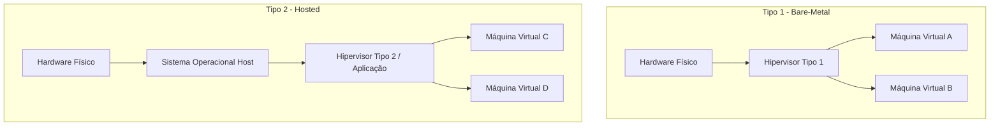

# 📋 Trabalho Acadêmico: Softwares de Virtualização

> **Curso:** Sistemas de Informação (3º Semestre)
> **Disciplina:** Sistemas Operacionais
> **Professor:** Prof. Guilherme de Morais
> **Aluno:** [Seu Nome / Matrícula]
> **Data de Entrega:** 29/04/2026

---

## 1. Introdução Teórica e Arquitetural

A virtualização é uma das pedras angulares da computação moderna, permitindo a abstração do hardware físico e a execução de múltiplos Sistemas Operacionais (SGs) de forma isolada em uma única máquina física (Host). 

Para compreender o funcionamento prático dos softwares de virtualização, é fundamental distinguir os dois tipos principais de **Hipervisores (Virtual Machine Monitors - VMM)**:

1. **Hipervisor Tipo 1 (Bare-Metal):** Executa diretamente sobre o hardware físico, funcionando como um sistema operacional minimalista especializado em gerenciar e alocar recursos (CPU, Memória, I/O) para as máquinas virtuais (Guests). Exemplos: *VMware ESXi, Proxmox VE, KVM*.
2. **Hipervisor Tipo 2 (Hosted):** Executa como uma aplicação convencional sobre um Sistema Operacional hospedeiro existente. Exemplos: *Oracle VirtualBox, VMware Workstation*.

Abaixo, o diagrama estrutural comparativo utilizando a sintaxe Mermaid:



---

## 2. Estudo Prático: Configuração e Provisionamento com Vagrant e VirtualBox

Como atividade prática da disciplina, implementamos a automação de criação de um ambiente virtualizado utilizando **Vagrant** (ferramenta de gerência de ambientes) em conjunto com o **Oracle VirtualBox** (Hipervisor Tipo 2).

O objetivo é provisionar uma máquina virtual rodando **Ubuntu Server**, garantindo reprodutibilidade de infraestrutura (Infrastructure as Code - IaC).

### 2.1. Arquivo de Configuração (`Vagrantfile`)

O script abaixo configura a máquina virtual, define a quantidade de memória RAM, núcleos de CPU e realiza o redirecionamento de portas para acesso via SSH.

```ruby
# -*- mode: ruby -*-
# vi: set ft=ruby :

Vagrant.configure("2") do |config|
  # Define a imagem base do sistema operacional (Ubuntu 22.04 LTS Jammy Jellyfish)
  config.vm.box = "ubuntu/jammy64"

  # Configuração de Rede: Redirecionamento de porta para acesso SSH e Aplicação Web
  config.vm.network "forwarded_port", guest: 80, host: 8080
  config.vm.network "forwarded_port", guest: 22, host: 2222, id: "ssh"

  # Configuração de Recursos de Hardware da Máquina Virtual
  config.vm.provider "virtualbox" do |vb|
    vb.name = "so-trabalho-virtualizacao"
    vb.memory = "2048" # 2 GB de RAM
    vb.cpus = 2        # 2 Núcleos de processamento vCPU
  end

  # Provisionamento inicial utilizando Shell Script para instalar ferramentas úteis
  config.vm.provision "shell", inline: <<-SHELL
    echo "========================================="
    echo "Atualizando pacotes do Sistema Operacional"
    echo "========================================="
    apt-get update -y
    
    echo "========================================="
    echo "Instalando Servidor Web Nginx para Teste"
    echo "========================================="
    apt-get install -y nginx
    systemctl enable nginx
    systemctl start nginx
    
    echo "Ambiente virtualizado provisionado com sucesso!"
  SHELL
end
```

---

## 3. Gerenciamento de Processos e Recursos do Hipervisor no Host

Em sistemas operacionais baseados in Linux (que frequentemente hospedam ambientes de virtualização ou atuam como nós KVM/QEMU), a alocação de recursos pode ser monitorada através de comandos nativos do kernel.

O script em Bash abaixo simula a verificação do consumo de CPU e Memória alocados para instâncias de virtualização ativas no host, utilizando ferramentas padrão do POSIX.

```bash
#!/bin/bash
# ==============================================================================
# Script de Monitoramento de Recursos de Máquinas Virtuais
# Disciplina: Sistemas Operacionais - Prof. Guilherme de Morais
# ==============================================================================

echo "=== RELATÓRIO DE RECURSOS DO SISTEMA E VIRTUALIZAÇÃO ==="
date
echo "--------------------------------------------------------"

# Exibe o uso global de memória RAM
echo "[1] Uso de Memória RAM no Host:"
free -h
echo ""

# Exibe o uso de CPU e processos relacionados a hipervisores (ex: VirtualBox / KVM)
echo "[2] Processos de Virtualização Ativos (QEMU / VBox / KVM):"
ps aux | grep -E "vbox|qemu|kvm" | grep -v grep

echo "--------------------------------------------------------"
echo "Relatório gerado com sucesso."
```

---

## 4. Conclusão

O trabalho permitiu consolidar os conceitos teóricos fundamentais sobre isolamento de recursos, virtualização de hardware (assistida por hardware via VT-x/AMD-V), além da aplicação prática de Infraestrutura como Código (IaC) com Vagrant. A compreensão do comportamento dos hipervisores é essencial para o desenvolvimento e operação de arquiteturas modernas em nuvem e ambientes corporativos de TI.

---
*Trabalho desenvolvido em conformidade com as normas da disciplina de Sistemas Operacionais do curso de Sistemas de Informação.*