# Aula 01 — Configuração de Ambiente e Projeto Java Web

> **Professor:** Jefferson Passerini
> **Disciplina:** Laboratório de Programação III (3º Semestre)
> **Tema:** Configuração do ecossistema de desenvolvimento Java EE com JDK 17 LTS, Apache Tomcat 9 e NetBeans 24, e estruturação arquitetural MVC de uma aplicação Web monolítica com persistência PostgreSQL.

---

## Sumário

- [Objetivo da aula](#objetivo-da-aula)
- [Contexto e pré-requisitos](#contexto-e-pré-requisitos)
- [Verificação de versão e instalação do Java JDK 17 LTS (Eclipse Temurin)](#verificação-de-versão-e-instalação-do-java-jdk-17-lts-eclipse-temurin)
- [Instalação e diretrizes de compatibilidade do Apache Tomcat 9](#instalação-e-diretrizes-de-compatibilidade-do-apache-tomcat-9)
- [Instalação, pacotes padrão e configuração geral do Apache NetBeans 24](#instalação-pacotes-padrão-e-configuração-geral-do-apache-netbeans-24)
- [Fundamentos da arquitetura monolítica e comparação com microsserviços](#fundamentos-da-arquitetura-monolítica-e-comparação-com-microsserviços)
- [Padrão arquitetural MVC (Model-View-Controller) no contexto web](#padrão-arquitetural-mvc-model-view-controller-no-contexto-web)
- [Arquitetura em camadas da aplicação: View, Filter, Controller, Model, DAO e Utils](#arquitetura-em-camadas-da-aplicação-view-filter-controller-model-dao-e-utils)
- [Padrão de projeto Singleton aplicado à conexão com banco de dados (Single Connection)](#padrão-de-projeto-singleton-aplicado-à-conexão-com-banco-de-dados-single-connection)
- [Criação de projeto Web Application no NetBeans utilizando Apache Ant e Java EE 8 Web](#criação-de-projeto-web-application-no-netbeans-utilizando-apache-ant-e-java-ee-8-web)
- [Gerenciamento de dependências locais: PostgreSQL JDBC Driver e JSTL 1.2](#gerenciamento-de-dependências-locais-postgresql-jdbc-driver-e-jstl-12)
- [Convenções de nomenclatura e criação da estrutura de pacotes em Source Packages](#convenções-de-nomenclatura-e-criação-da-estrutura-de-pacotes-em-source-packages)
- [Substituição de páginas HTML estáticas por páginas dinâmicas JSP (index.jsp)](#substituição-de-páginas-html-estáticas-por-páginas-dinâmicas-jsp-indexjsp)
- [Ciclo de compilação, deploy e execução no container web Tomcat via NetBeans](#ciclo-de-compilação-deploy-e-execução-no-container-web-tomcat-via-netbeans)
- [Diagnóstico e resolução de falhas comuns de servidor e conflito de portas](#diagnóstico-e-resolução-de-falhas-comuns-de-servidor-e-conflito-de-portas)
- [Código da aula](#código-da-aula)
- [Exercícios](#exercícios)
- [Erros comuns e boas práticas](#erros-comuns-e-boas-práticas)
- [Links e materiais complementares](#links-e-materiais-complementares)
- [Mapa da aula](#mapa-da-aula)
- [Glossário](#glossário)
- [Pontos-chave para a prova](#pontos-chave-para-a-prova)
- [Perguntas e respostas (JSONL)](#perguntas-e-respostas-jsonl)
- [Checklist de revisão](#checklist-de-revisão)

---

## Objetivo da aula

- Configurar o ambiente de desenvolvimento completo para programação Java Web corporativa, integrando o compilador Java Development Kit (JDK 17 LTS - distribuição Eclipse Temurin), o servidor de aplicação web (J2EE Web Container Apache Tomcat 9) e o ambiente integrado de desenvolvimento (Apache NetBeans IDE 24).
- Compreender a anatomia e os limites estruturais de uma arquitetura de software monolítica orientada a processos únicos e recursos compartilhados.
- Dominar a separação rigorosa de responsabilidades estabelecida pelo padrão arquitetural Model-View-Controller (MVC) adaptado para aplicações web corporativas.
- Projetar e materializar a estrutura física de pacotes Java (`view`, `filter`, `controller`, `model`, `dao` e `utils`), garantindo coesão e baixo acoplamento entre a camada visual e o banco de dados relacional.
- Implementar o padrão de criação estrutural Singleton para centralização do ciclo de vida da conexão JDBC com o SGBD PostgreSQL (estratégia Single Connection).
- Criar, configurar e executar com sucesso um projeto Java Web baseado no gerenciador de compilação Apache Ant e especificação Java EE 8 Web, validando o ciclo de vida de páginas dinâmicas JSP.

---

## Contexto e pré-requisitos

Esta aula marca a transição de aplicações desktop locais para o desenvolvimento de sistemas distribuídos na plataforma Java Web. Para acompanhar plenamente as atividades, o estudante deve dominar os conceitos fundamentais de Programação Orientada a Objetos em Java:

- **Classes, Objetos, Encapsulamento, Métodos e Atributos**: manipulação de visibilidade (`private`, `protected`, `public`) e métodos acessores/modificadores (Getters e Setters).
- **Tipos de Dados e Estruturas de Dados**: tipos primitivos, classes empacotadoras (Wrappers) e a coleção `java.util.List`.
- **Fundamentos de Redes e Protocolo HTTP**: conceito de cliente e servidor, requisições (`Request`), respostas (`Response`), métodos HTTP (`GET`, `POST`) e portas de comunicação TCP/IP.
- **Banco de Dados Relacional Básico**: comandos DDL e DML da linguagem SQL (operações CRUD: `INSERT`, `SELECT`, `UPDATE`, `DELETE`) e integridade relacional.

---

## Verificação de versão e instalação do Java JDK 17 LTS (Eclipse Temurin)

### Conceito e motivação do ecossistema Java

O desenvolvimento em Java apoia-se em três pilares conceituais fundamentais: a Máquina Virtual Java (JVM), o Ambiente de Execução Java (JRE) e o Kit de Desenvolvimento Java (JDK).

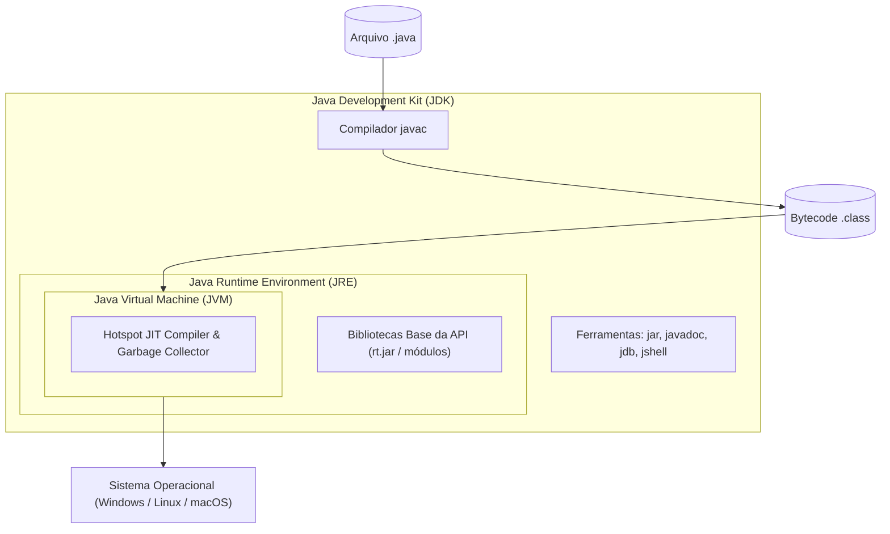

- **JVM (Java Virtual Machine)**: software que carrega, verifica e executa o código binário portável (bytecode). Contém o compilador Just-In-Time (JIT) e o coletor de lixo (Garbage Collector).
- **JRE (Java Runtime Environment)**: ambiente mínimo necessário para executar aplicações compiladas. Agrupa a JVM e as bibliotecas essenciais da API padrão Java.
- **JDK (Java Development Kit)**: superconjunto do JRE que adiciona os utilitários de desenvolvimento, incluindo o compilador (`javac`), empacotador (`jar`), gerador de documentação (`javadoc`) e console interativo (`jshell`).

Para o curso, adota-se a versão **Java 17 LTS (Long-Term Support)** distribuída pela fundação Eclipse sob o projeto **Adoptium (Eclipse Temurin)**. As versões LTS fornecem estabilidade operacional, correções de segurança de longo prazo e evitam as quebras de retrocompatibilidade introduzidas em lançamentos semestrais não-LTS.

### Verificação do ambiente no terminal

Antes de iniciar qualquer configuração, é obrigatório auditar a existência de instalações prévias no sistema operacional para evitar conflitos de variáveis de ambiente. Abra o PowerShell e execute:

```powershell
java -version
javac -version
```

A saída esperada para uma instalação correta deve acusar a versão `17.0.x` em ambos os comandos, evidenciando paridade entre o runtime de execução e o compilador:

```plain text
openjdk version "17.0.13" 2024-10-15
OpenJDK Runtime Environment Temurin-17.0.13+11 (build 17.0.13+11)
OpenJDK 64-Bit Server VM Temurin-17.0.13+11 (build 17.0.13+11, mixed mode, sharing)
javac 17.0.13
```

### Limpeza de versões legadas e instalação do Eclipse Temurin

Caso o terminal aponte versões obsoletas (como Java 8/1.8) ou versões não compatíveis com a infraestrutura proposta (Java 21 ou superior sem alinhamento com o Tomcat 9), deve-se realizar a desinstalação completa:
1. No Windows, acesse: `Configurações` -> `Aplicativos` -> `Aplicativos Instalados`.
2. Localize e desinstale todas as instâncias existentes de `Java SE Development Kit`, `Java Runtime Environment` ou builds antigos de OpenJDK.
3. Reinicie o sistema operacional para limpar os registros do subsistema de processos.

Para a instalação correta:
1. Acesse o portal oficial Adoptium (`adoptium.net`).
2. Clique no menu **Other platforms and versions**.
3. Aplique os filtros de seleção:
   - **Operating System**: `Windows`
   - **Architecture**: `x64`
   - **Package Type**: `JDK`
   - **Version**: `17 - LTS`
4. Baixe o instalador no formato `.msi` (aproximadamente 168 MB).
5. Durante o assistente de instalação (Setup Wizard):
   - Aceite os termos da licença GNU GPL v2 com Classpath Exception.
   - Na tela **Installation Scope**, selecione **Install for all users of this machine**.
   - Na tela **Custom Setup**, certifique-se de manter habilitadas as opções **Modify PATH variable** e **Set or override JAVA_HOME variable**.
   - Conclua a instalação e confirme novamente a integridade via terminal.

### Tabela comparativa dos componentes da plataforma Java

| Componente | Sigla | Público-alvo | Contém Compilador (`javac`)? | Finalidade Principal |
| :--- | :--- | :--- | :--- | :--- |
| Java Virtual Machine | JVM | Máquina / SO | Não | Executar bytecode interpretando ou compilando via JIT em código de máquina nativo. |
| Java Runtime Environment | JRE | Usuário Final | Não | Executar aplicações Java prontas; contém a JVM e bibliotecas padrão. |
| Java Development Kit | JDK | Desenvolvedores | Sim | Criar, compilar, testar, empacotar e depurar programas Java. |

---

## Instalação e diretrizes de compatibilidade do Apache Tomcat 9

### O papel do Servlet Container no ecossistema Java EE

O Apache Tomcat não é um servidor de aplicação corporativo completo (Full Java EE Application Server como GlassFish, WildFly ou Payara), mas sim um **J2EE Web Container** de alto desempenho. Ele implementa oficialmente as especificações fundamentais para aplicações dinâmicas para a web:
- **Jakarta/Java Servlet**: processamento de requisições e respostas HTTP no lado servidor.
- **JavaServer Pages (JSP)**: geração dinâmica de documentos estruturados (HTML/XML).
- **Expression Language (EL)**: avaliação de expressões em tempo de execução para comunicação entre código e visão.

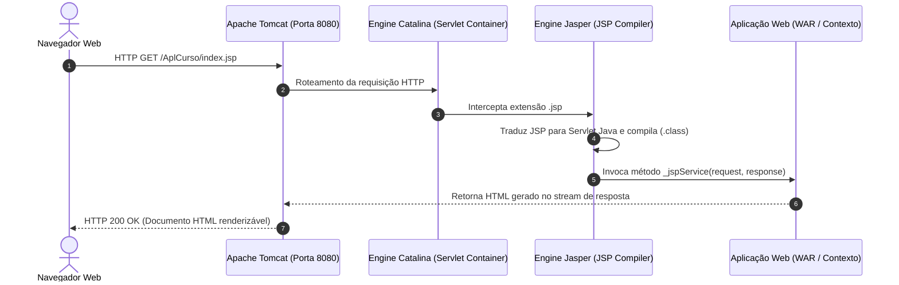

### O dilema da transição Java EE para Jakarta EE (Tomcat 9 vs Tomcat 10+)

> [!CAUTION]
> **Atenção Técnica Rígida**: Nunca instale o Apache Tomcat 10 ou superior para o projeto desta disciplina. O Tomcat 10 adota a especificação Jakarta EE 9+, na qual todos os pacotes foram renomeados de `javax.*` para `jakarta.*`. Como utilizaremos o padrão **Java EE 8 Web** estruturado sobre bibliotecas que dependem de `javax.servlet.*` e `javax.servlet.jsp.*`, a execução no Tomcat 10 gerará exceções imediatas de classe não encontrada (`ClassNotFoundException`) ou falha catastrófica de implantação.

### Instalação e alocação física

1. Baixe o pacote oficial do **Apache Tomcat versão 9 (release 9.0.102 ou mais recente da linha 9)** através do instalador ou do arquivo compactado zip (Windows 64-bit).
2. Extraia o conteúdo diretamente no diretório raiz do sistema de arquivos para evitar falhas decorrentes de caminhos longos ou espaços em branco em nomes de pastas (por exemplo, evite pastas como `Arquivos de Programas (x86)`):
   - Diretório recomendado: `C:\apache-tomcat-9.0.102`
3. Essa pasta contém os diretórios essenciais do servidor:
   - `/bin`: scripts de inicialização (`startup.bat`), finalização (`shutdown.bat`) e controle de serviço.
   - `/conf`: arquivos de configuração operacional, incluindo `server.xml` (portas e conectores) e `web.xml` (configurações globais de MIME e servlets).
   - `/lib`: bibliotecas compartilhadas do container (JARs com as APIs `servlet-api.jar` e `jsp-api.jar`).
   - `/logs`: arquivos de rastreamento e auditoria (`catalina.out`, `localhost_access_log`).
   - `/webapps`: diretório de implantação dos arquivos WAR ou projetos em formato de diretório expandido.

### Tabela de compatibilidade de versões do Apache Tomcat

| Versão Tomcat | Especificação Servlet Suportada | Especificação JSP Suportada | Namespace dos Pacotes | Compatibilidade com Java EE 8 |
| :--- | :--- | :--- | :--- | :--- |
| Tomcat 8.5.x | Servlet 3.1 | JSP 2.3 | `javax.servlet.*` | Compatível (legado) |
| **Tomcat 9.0.x** | **Servlet 4.0** | **JSP 2.3** | `javax.servlet.*` | **Alvo do Curso (Totalmente Compatível)** |
| Tomcat 10.0.x | Servlet 5.0 | JSP 3.0 | `jakarta.servlet.*` | Incompatível (quebra `javax.*`) |
| Tomcat 10.1.x | Servlet 6.0 | JSP 3.1 | `jakarta.servlet.*` | Incompatível (quebra `javax.*`) |
| Tomcat 11.0.x | Servlet 6.1 | JSP 4.0 | `jakarta.servlet.*` | Incompatível (quebra `javax.*`) |

---

## Instalação, pacotes padrão e configuração geral do Apache NetBeans 24

### Histórico e relevância do Apache NetBeans

O NetBeans foi historicamente a ferramenta de referência oficial mantida pela Sun Microsystems e posteriormente pela Oracle para a plataforma Java EE. Em 2016, a Oracle realizou a doação do código-fonte à **Apache Software Foundation** a partir da versão 8. Desde então, a IDE evoluiu sob governança comunitária de código aberto, com ciclos contínuos de modernização, culminando na versão **Apache NetBeans 24**.

A IDE destaca-se no ensino e na indústria por seu suporte nativo de primeira classe à compilação baseada em Apache Ant, automação Maven/Gradle, integração direta com containers de servlets e suporte aprimorado aos padrões corporativos sem exigir configurações complexas de plugins de terceiros.

### Processo de instalação e personalização de pacotes

Ao executar o assistente `Apache-NetBeans-24-bin-windows-x64.exe`, o instalador apresenta a seleção modular de pacotes que compõem a suíte (tamanho estimado de 981,9 MB):
1. Clique no botão **Customize...** para inspecionar os runtimes incluídos:
   - **Base IDE**: núcleo de infraestrutura, janelas, editor de texto e gerenciamento de projetos.
   - **Java SE**: suporte à linguagem Java Standard Edition, refatoração e ferramentas de compilação.
   - **Java EE**: suporte a servlets, páginas JSP, Enterprise JavaBeans (EJB), Web Services e integração com servidores.
   - **HTML5/JavaScript**: suporte a desenvolvimento front-end, editores CSS, depuração de scripts no cliente.
   - **PHP**: suporte a scripts web PHP (pode ser mantido ativado).
2. Prossiga aceitando os termos da **Licença Apache 2.0**.
3. Na tela de diretórios de instalação, valide:
   - Caminho da IDE: `C:\Program Files\NetBeans-24`
   - JDK associado à execução do NetBeans: `C:\Program Files\Eclipse Adoptium\jdk-17.0.13.11-hotspot` (ou versão equivalente do JDK 17 instalada).

### Auditoria e parametrização das opções globais (Tools > Options)

Após a conclusão da instalação e abertura inicial da IDE, é mandatório navegar até o menu superior `Tools` -> `Options` e auditar as categorias de configuração para ativar e validar os módulos internos:

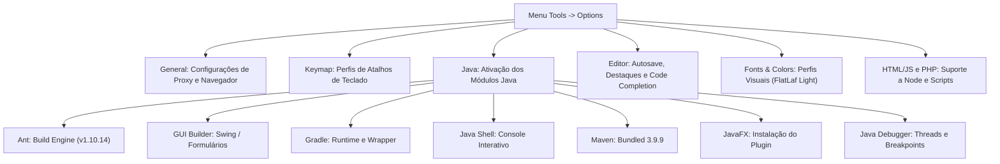

1. **Category: General**:
   - Web Browser: configure para o navegador padrão do sistema operacional.
   - Proxy Settings: mantenha a opção **Use System Proxy Settings** ativada para garantir que a IDE utilize as rotas de rede corporativas sem bloquear downloads de dependências.
2. **Category: Java**:
   - **Aba Ant**: valida a presença do motor interno Apache Ant (versão 1.10.14). Não altere o classpath base.
   - **Aba Java Shell**: certifique-se de que a opção **Java Platform** esteja associada ao `JDK 17 (Default)`.
   - **Aba Maven**: valida o Maven integrado (versão 3.9.9) e o JDK de execução.
   - **Aba JavaFX**: ao acessar pela primeira vez, o assistente solicitará a instalação do plugin `JavaFX Implementation for Windows (amd64)`. Aceite a licença GPL v2 e conclua o assistente para garantir paridade completa dos componentes gráficos do Java.
3. **Category: Editor e Fonts & Colors**:
   - Ajuste o perfil de fontes para fonte monoespaçada legível (padrão: `Monospaced 13`) sob o tema visual padrão (`FlatLaf Light`).

---

## Fundamentos da arquitetura monolítica e comparação com microsserviços

### Definição estrutural de um monólito de software

Uma arquitetura monolítica caracteriza-se pela unificação de todas as capacidades de negócio, serviços, regras de validação, controle de acesso e camadas de persistência de dados em uma **única base de código implantada como um processo de execução singular**.

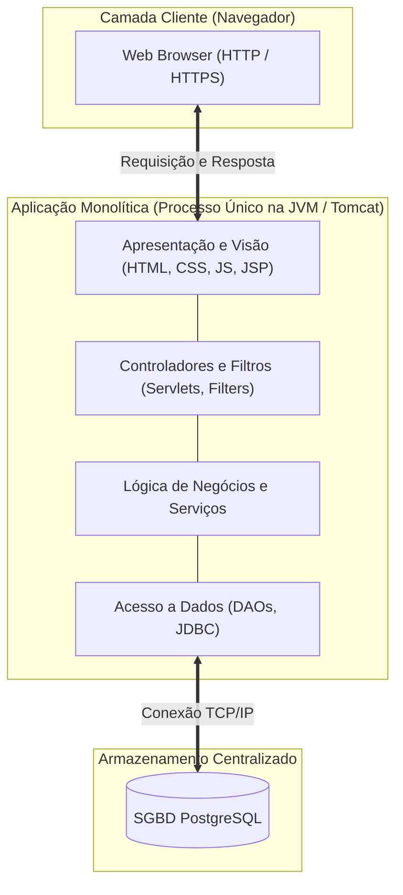

Nesse modelo:
- Todas as camadas executam sob o mesmo espaço de endereçamento de memória da JVM.
- Chamadas entre módulos operam por meio de invocações de métodos em memória local (`in-memory function calls`), eliminando qualquer sobrecarga de latência de rede entre camadas internas.
- O artefato gerado é tipicamente um único arquivo compilado e empacotado no formato `.war` (Web Application Archive).

### Motivação e justificativa pedagógica

Embora a indústria contemporânea utilize arquiteturas de microsserviços para sistemas em hiperescala, o modelo monolítico modular é a abordagem ideal para o aprendizado e para a grande maioria dos sistemas corporativos de porte médio. Ele elimina a complexidade acidental de:
- Redes não confiáveis entre serviços.
- Transações distribuídas (Two-Phase Commit, padrões Saga).
- Descoberta de serviços e balanceamento de carga distribuído.
- Serialização/desserialização excessiva de payloads JSON/gRPC.

### Desafios e limitações do monólito

1. **Crescimento de Complexidade e Acoplamento**: ao longo do ciclo de vida, classes podem tornar-se entrelaçadas de forma espaguete se os limites dos pacotes forem violados.
2. **Escalabilidade Homogênea**: para escalar um único módulo com sobrecarga de processamento (por exemplo, emissão de relatórios fiscais), é necessário instanciar uma réplica do monólito inteiro na infraestrutura.
3. **Bloqueio Tecnológico**: a substituição da versão da linguagem ou do servidor afeta a totalidade dos subsistemas corporativos simultaneamente.
4. **Ciclo de Deploy Frágil**: a alteração de uma única linha de código exige a recompilação, teste e reinicialização de todo o container de execução.

### Tabela comparativa: Monólito vs. Microsserviços

| Dimensão de Análise | Arquitetura Monolítica | Arquitetura de Microsserviços |
| :--- | :--- | :--- |
| **Processo de Execução** | Único processo na JVM compartilhando memória. | Múltiplos processos isolados em containers independentes. |
| **Comunicação entre Módulos** | Invocação direta de métodos Java (nanossegundos). | Chamadas remotas de rede REST/gRPC/AMQP (milissegundos). |
| **Transacionalidade e ACID** | Suporte nativo a transações atômicas no banco central. | Transações distribuídas de difícil consistência eventual. |
| **Facilidade de Depuração** | Rastreamento simples com breakpoints locais na IDE. | Rastreamento distribuído complexo (exige OpenTelemetry/Jaeger). |
| **Infraestrutura e Custo** | Baixo: um único servidor Tomcat e um banco PostgreSQL. | Elevado: orquestradores (Kubernetes), API Gateways e malhas de serviço. |
| **Escalabilidade** | Vertical (CPU/RAM) ou réplicas integrais da aplicação. | Horizontal fina por serviço isolado sob demanda de tráfego. |

---

## Padrão arquitetural MVC (Model-View-Controller) no contexto web

### Origem histórica e evolução

O padrão de arquitetura de software **Model-View-Controller (MVC)** foi formalizado na década de 1980 por **Trygve Reenskaug** durante pesquisas no centro **Xerox PARC**, sendo descrito originalmente no artigo acadêmico *"Applications Programming in Smalltalk-80: How to use Model-View-Controller"*.

Originalmente concebido para interfaces desktop gráficas com usuários locais, o padrão foi adaptado pela comunidade de engenharia de software para o modelo descentralizado de requisição e resposta da World Wide Web, dividindo a aplicação em três responsabilidades essenciais:

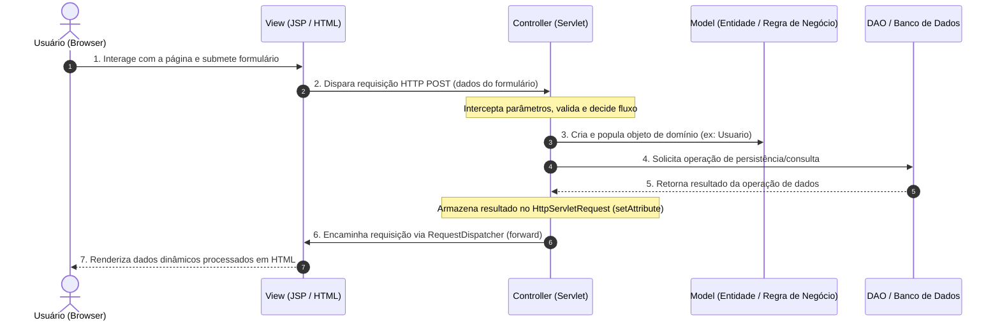

### Detalhamento das responsabilidades no contexto Web

#### Camada Model (Modelo)
- **Definição**: modela as estruturas de dados e as regras de negócio da aplicação.
- **Responsabilidade**: encapsular os atributos das entidades (por exemplo, `Usuario`, `Cliente`, `Produto`), impor invariantes de validação lógica e manter-se agnóstica em relação a como esses dados serão exibidos visualmente.
- **Regra de Ouro**: o modelo nunca deve conter código HTML, referências a classes de servlets (`HttpServletRequest`) ou tags visuais.

#### Camada View (Visão)
- **Definição**: camada visual de apresentação e interface com o operador do sistema.
- **Responsabilidade**: renderizar os dados providos pelo modelo para o usuário final, utilizando documentos estruturados HTML5, CSS3, JavaScript e tags de processamento dinâmico no servidor (JSP/JSTL).
- **Regra de Ouro**: a visão nunca deve executar operações de banco de dados (`java.sql.Connection`) nem processar regras de negócio pesadas; seu papel restringe-se a exibir valores e coletar entradas.

#### Camada Controller (Controlador)
- **Definição**: cérebro operacional e intermediário das interações do sistema.
- **Responsabilidade**: receber as requisições HTTP enviadas pelo navegador, extrair parâmetros de formulário, converter tipos primitivos, instanciar e acionar as regras de negócio do modelo, interagir com a camada de persistência e decidir qual arquivo visual (`.jsp`) será entregue como resposta ao cliente.
- **Regra de Ouro**: o controlador não formata exibições visuais nem executa instruções SQL diretamente.

### Tabela de separação de conceitos no MVC Web

| Camada MVC | Componente Java / Web | O que DEVE fazer | O que NUNCA deve fazer |
| :--- | :--- | :--- | :--- |
| **Model** | Classes POJO (JavaBeans) | Conter atributos privados, getters, setters e validações de regras de domínio. | Importar pacotes `javax.servlet.*` ou gerar tags HTML. |
| **View** | Páginas `.jsp`, `.html`, `.css` | Formatar a saída de dados para visualização humana e apresentar formulários. | Abrir conexões com banco de dados ou escrever código Java puro complexo. |
| **Controller** | Classes `HttpServlet` | Ler parâmetros da requisição, orquestrar chamadas de modelo/DAO e despachar a visão. | Conter comandos SQL diretos ou renderizar tags estruturais de página. |

---

## Arquitetura em camadas da aplicação: View, Filter, Controller, Model, DAO e Utils

### A necessidade de refinamento do MVC em sistemas corporativos

O padrão MVC tradicional provê uma excelente divisão conceitual, mas sua aplicação estrita em sistemas com persistência em bancos relacionais pode sobrecarregar a camada Model com responsabilidades excessivas (regras de negócio misturadas com código de baixo nível JDBC).

Para sanar esse acoplamento, a arquitetura adotada na disciplina decompõe o sistema em seis camadas especializadas organizadas fisicamente em pacotes no diretório `Source Packages` do NetBeans:

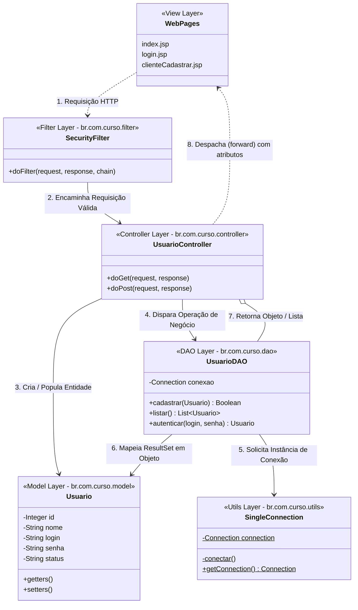

### Especificação técnica dos pacotes e camadas

#### 1. Web Pages (Camada View)
- **Localização física**: diretório raiz `Web Pages` (fora do diretório de classes Java compiladas).
- **Componentes**: arquivos `.jsp`, `.html`, `.css` e bibliotecas de scripts front-end (JavaScript, jQuery, Bootstrap).
- **Função**: coletar as intenções do usuário por meio de formulários (`<form method="POST">`) e renderizar listas, tabelas e mensagens de feedback injetadas pelos servlets.

#### 2. br.com.curso.filter (Camada Filter)
- **Componentes**: classes que implementam a interface `javax.servlet.Filter`.
- **Função**: interceptador arquitetural centralizado ("funil"). Todas as requisições HTTP direcionadas à aplicação são capturadas antes de atingirem qualquer servlet controlador.
- **Responsabilidade**: verificar se o usuário possui sessão ativa de login, auditar segurança e gerenciar o ciclo de abertura/validação da conexão com o banco de dados.

#### 3. br.com.curso.controller (Camada Controller)
- **Componentes**: servlets Java que estendem `javax.servlet.http.HttpServlet`.
- **Organização modular**: no curso, cria-se um pacote controlador específico para cada entidade gerenciada (por exemplo, `br.com.curso.controller.usuario`, `br.com.curso.controller.cliente`), evitando classes gigantescas com responsabilidades misturadas.
- **Função**: processar os verbos HTTP (`doGet` para consultas/exibições e `doPost` para gravações/modificações), invocar a camada DAO e despachar a requisição para a View apropriada via `RequestDispatcher`.

#### 4. br.com.curso.model (Camada Model)
- **Componentes**: classes de domínio estruturadas no padrão JavaBean (POJO - Plain Old Java Objects).
- **Função**: representar fielmente as entidades do mundo real e as tabelas do banco de dados relacional. Cada campo da tabela possui um atributo privado correspondente, com construtores e métodos públicos acessores (`get`) e modificadores (`set`).

#### 5. br.com.curso.dao (Camada DAO - Data Access Object)
- **Componentes**: classes especializadas que encapsulam a totalidade das instruções SQL (JDBC puro: `PreparedStatement`, `ResultSet`, `SQLException`).
- **Função**: realizar o mapeamento objeto-relacional manual, convertendo registros tabulares do banco PostgreSQL em instâncias da camada Model e vice-versa, protegendo o restante do software de detalhes de persistência.

#### 6. br.com.curso.utils (Camada Utils)
- **Componentes**: classes utilitárias transversais compartilhadas por toda a aplicação.
- **Função primordial**: hospedar a classe gerenciadora de conexões com o banco de dados (`SingleConnection`), conversores de data, formatadores monetários e algoritmos de criptografia de senhas.

### Tabela de mapeamento arquitetural

| Pacote Java / Diretório | Camada Conceitual | Tecnologias Envolvidas | Responsabilidade Principal |
| :--- | :--- | :--- | :--- |
| `Web Pages` | View | JSP, HTML5, CSS, JSTL, JS | Interface gráfica e coleta de dados do usuário. |
| `br.com.curso.filter` | Filter | Servlet Filter API | Interceptação de tráfego, autorização e contexto. |
| `br.com.curso.controller.*` | Controller | HttpServlet, Request/Response | Recepção de dados, orquestração e despacho visual. |
| `br.com.curso.model` | Model | Java POJO / JavaBeans | Entidades de domínio e regras de negócio puras. |
| `br.com.curso.dao` | DAO | JDBC, SQL, PreparedStatement | Transações CRUD com o SGBD PostgreSQL. |
| `br.com.curso.utils` | Utils | JDBC Driver, Padrão Singleton | Provedor de conexão e utilitários auxiliares. |

---

## Padrão de projeto Singleton aplicado à conexão com banco de dados (Single Connection)

### Definição e mecânica do padrão Singleton

O **Singleton** é um padrão de projeto criacional documentado pelo consórcio GoF (*Gang of Four* — Gamma, Helm, Johnson e Vlissides). Seu objetivo reside em:
1. Garantir que uma classe tenha **uma única instância** em toda a execução da aplicação.
2. Fornecer um **ponto de acesso global e estático** para essa instância compartilhada.

Para impedir que desenvolvedores instanciem livremente a classe via operador `new`, o padrão impõe o encapsulamento estrito do construtor:
- O construtor é declarado como `private`.
- A instância mantida é armazenada em uma variável de classe estática (`private static`).
- Um método público estático (`public static Connection getConnection()`) atua como guardião: se o objeto ainda for nulo ou estiver fechado, ele é criado; caso já exista, a referência ativa é imediatamente retornada.

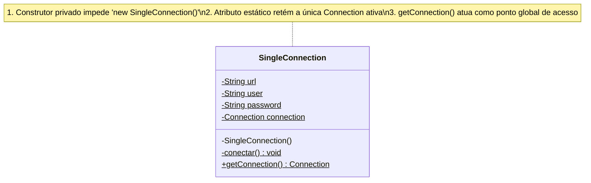

### Análise de engenharia: Single Connection vs. Pool de Conexões

> [!NOTE]
> **Complemento de Engenharia de Software**: O uso do padrão Singleton para conexão única (*Single Connection*), conforme proposto no material da disciplina, possui caráter primordialmente **didático**. Ele simplifica a depuração inicial em laboratório, eliminando a sobrecarga de configurar pools de conexões e fontes de dados JNDI no container web.
>
> Contudo, em ambientes industriais de produção de alta concorrência, o modelo de conexão única gera graves gargalos de concorrência: múltiplas requisições HTTP concorrentes disputam o mesmo canal de socket TCP/IP com o banco, forçando serialização de threads ou falhas de estado em transações simultâneas. O padrão da indústria para sistemas corporativos consolidados baseia-se em **Pools de Conexões** (como HikariCP, Apache DBCP ou C3P0), onde um conjunto gerenciado de conexões físicas é reaproveitado dinamicamente entre as requisições.

### Exemplo de implementação em Java da classe de conexão Singleton

A implementação robusta da classe `SingleConnection` no pacote `br.com.curso.utils` deve prever o carregamento dinâmico do driver JDBC do PostgreSQL em tempo de execução via `Class.forName()`:

```java
package br.com.curso.utils;

import java.sql.Connection;
import java.sql.DriverManager;
import java.sql.SQLException;

/**
 * Utilitario de conexao centralizada com o banco de dados PostgreSQL.
 * Aplica rigorosamente o padrao criacional Singleton (Single Connection).
 */
public class SingleConnection {

    // Parametros estaticos de configuracao JDBC
    private static final String BANCO = "jdbc:postgresql://localhost:5432/curso_db";
    private static final String USUARIO = "postgres";
    private static final String SENHA = "admin";
    private static final String DRIVER = "org.postgresql.Driver";

    // Instancia unica mantida estaticamente em memoria pela JVM
    private static Connection connection = null;

    /**
     * Construtor privado: desabilita instanciacao externa.
     */
    private SingleConnection() {
    }

    /**
     * Bloco de inicializacao estatica para carregamento garantido do Driver JDBC.
     */
    static {
        conectar();
    }

    /**
     * Metodo interno responsavel pela conexao inicial com o banco relacional.
     */
    private static void conectar() {
        try {
            if (connection == null || connection.isClosed()) {
                // Carrega explicitamente o driver PostgreSQL no ClassLoader
                Class.forName(DRIVER);
                // Estabelece o socket JDBC com o banco de dados
                connection = DriverManager.getConnection(BANCO, USUARIO, SENHA);
                connection.setAutoCommit(false); // Garante controle transacional explicito
            }
        } catch (ClassNotFoundException e) {
            System.err.println("Falha critica: Driver JDBC PostgreSQL nao localizado no classpath! " + e.getMessage());
        } catch (SQLException e) {
            System.err.println("Falha critica: Erro ao conectar ao banco de dados PostgreSQL! " + e.getMessage());
        }
    }

    /**
     * Ponto de acesso global estatico para recuperacao da conexao unica.
     * 
     * @return java.sql.Connection ativa e compartilhada.
     */
    public static Connection getConnection() {
        try {
            if (connection == null || connection.isClosed()) {
                conectar();
            }
        } catch (SQLException e) {
            System.err.println("Erro ao validar estado da conexao: " + e.getMessage());
        }
        return connection;
    }
}
```

---

## Criação de projeto Web Application no NetBeans utilizando Apache Ant e Java EE 8 Web

### O assistente de criação de projetos no Apache NetBeans

A materialização prática de uma aplicação web inicia-se por meio do assistente integrado do NetBeans 24:

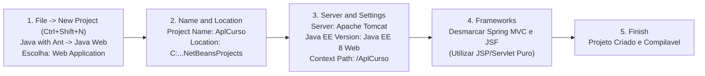

### Passo a passo rigoroso

#### Etapa 1: Seleção do tipo de projeto (Choose Project)
- Pressione o atalho global `Ctrl + Shift + N` ou navegue até o menu `File` -> `New Project`.
- No painel da esquerda (**Categories**), expanda o nó `Java with Ant` e clique em `Java Web`.
- No painel central (**Projects**), selecione o modelo de template **Web Application**.
- Clique no botão **Next >**.

#### Etapa 2: Nomenclatura e localização física (Name and Location)
- No campo **Project Name**, preencha exatamente com o identificador do projeto: `AplCurso` (ou `AplCurso2`, conforme especificado).
- Em **Project Location**, mantenha o diretório padrão de projetos do usuário (por exemplo, `C:\Users\<usuario>\OneDrive\Documentos\NetBeansProjects` ou caminho local dedicado).
- Observe o campo informativo **Project Folder**, que apresenta o caminho absoluto final do repositório de arquivos.
- A opção *Use Dedicated Folder for Storing Libraries* deve permanecer desmarcada para que o projeto gerencie dependências relativas através da estrutura nativa do Apache Ant.
- Clique em **Next >**.

#### Etapa 3: Definição do container e especificação (Server and Settings)
- **Add to Enterprise Application**: mantenha como `<None>`, indicando que o projeto não faz parte de um pacote corporativo guarda-chuva (`.ear`).
- **Server**: selecione **Apache Tomcat or TomEE**. Caso não esteja listado, clique no botão *Add...* e aponte o diretório do Tomcat 9 configurado na raiz `C:\`.
- **Java EE Version**: selecione obrigatoriamente a especificação **Java EE 8 Web**.
- **Context Path**: confirme o caminho base da raiz da aplicação web, registrado como `/AplCurso`. Este identificador definirá o prefixo de todos os endpoints HTTP do sistema (por exemplo: `http://localhost:8080/AplCurso/`).
- Clique em **Next >**.

#### Etapa 4: Seleção de Frameworks
- O assistente disponibiliza caixas de marcação para *Spring Web MVC* e *JavaServer Faces (JSF)*.
- **Deixe todas as opções desmarcadas**. O curso foca nos conceitos de base da especificação pura de Servlets e JSPs. A adoção prematura de frameworks complexos encobre a compreensão dos ciclos HTTP subjacentes.
- Clique no botão **Finish** e aguarde o NetBeans compilar o esqueleto inicial do projeto.

---

## Gerenciamento de dependências locais: PostgreSQL JDBC Driver e JSTL 1.2

### Conceito de drivers de banco de dados e bibliotecas de tags

Uma aplicação Java EE em formato padrão Ant não gerencia bibliotecas através de arquivos declarativos remotos como `pom.xml` (Maven) ou `build.gradle` (Gradle). As dependências binárias (`.jar`) devem ser declaradas explicitamente nas propriedades da IDE e vinculadas ao classpath do projeto:

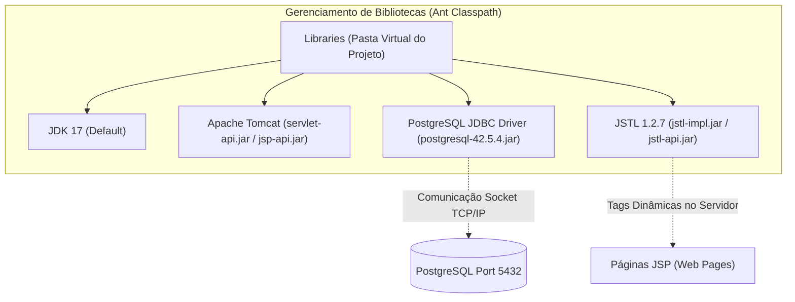

1. **PostgreSQL JDBC Driver (`postgresql-42.5.4.jar`)**: é um driver de banco de dados do Tipo 4 (100% Java puro). Ele traduz as chamadas de métodos da API `java.sql` (da JVM) diretamente para o protocolo de rede nativo de streaming utilizado pelo servidor PostgreSQL na porta TCP `5432`.
2. **JSTL 1.2 (JavaServer Pages Standard Tag Library)**: biblioteca padrão que fornece componentes de controle para páginas JSP. Elimina a necessidade de escrever código Java cru embaraçado na visão (scriptlets `<% %>`), introduzindo tags limpas de controle como:
   - `<c:forEach>`: iteração estruturada sobre coleções de dados.
   - `<c:if>`: avaliação condicional de blocos de renderização visual.
   - `<c:out>`: escape seguro de caracteres para prevenção de ataques XSS (*Cross-Site Scripting*).

### Procedimento de inclusão no NetBeans

1. No painel de navegação **Projects**, localize o projeto `AplCurso` e expanda seu conteúdo.
2. Clique com o botão direito do mouse sobre o nó virtual **Libraries** e escolha **Add Library...**.
3. Na janela modal que se abre:
   - Role a lista até localizar `PostgreSQL JDBC Driver`.
   - Clique em **Add Library**. O arquivo `.jar` correspondente será imediatamente injetado no classpath de compilação e empacotamento.
4. Repita a operação: clique novamente com o botão direito sobre **Libraries** -> **Add Library...**:
   - Localize o item `JSTL 1.2.7` (ou versão estável equivalente `JSTL 1.2.1`).
   - Clique em **Add Library**.
5. Verifique a pasta virtual **Libraries**: ela deve conter o JDK 17, o Apache Tomcat, o driver PostgreSQL e os JARs da JSTL (`jstl-impl.jar` e `jstl-api.jar`).

### Tabela comparativa: Scriptlets Legados vs. Tags JSTL 1.2

| Critério de Engenharia | Scriptlets Java Legados (`<% ... %>`) | Biblioteca Padrão JSTL (`<c:...>`) |
| :--- | :--- | :--- |
| **Sintaxe** | Código Java imperativo inserido no meio do HTML. | Tags estruturadas no padrão XML/HTML legíveis. |
| **Legibilidade e Manutenção** | Péssima: mistura lógica com visualização. | Excelente: mantém o arquivo com aspecto declarativo web. |
| **Segurança contra XSS** | Nenhuma automática (exige escape manual de saída). | Automática via atributo de escape nativo do `<c:out>`. |
| **Padrão Arquitetural** | Viola gravemente o desacoplamento do MVC. | Cumpre rigorosamente a passividade da camada View. |

---

## Convenções de nomenclatura e criação da estrutura de pacotes em Source Packages

### Padrão de nomenclatura corporativa em pacotes Java

Em conformidade com a convenção oficial da linguagem Java documentada pela Sun/Oracle, os nomes de pacotes devem ser obrigatoriamente escritos em **letras minúsculas**, utilizando a inversão do nome de domínio da organização proprietária do software para garantir unicidade global:

$$\text{Formato Padrão:} \quad \text{prefixo\_pais} \,.\, \text{organizacao} \,.\, \text{sistema} \,.\, \text{modulo}$$

No contexto da aplicação acadêmica da UniFEF desenvolvida nas aulas, adota-se o prefixo base `br.com.aplcurso.*`.

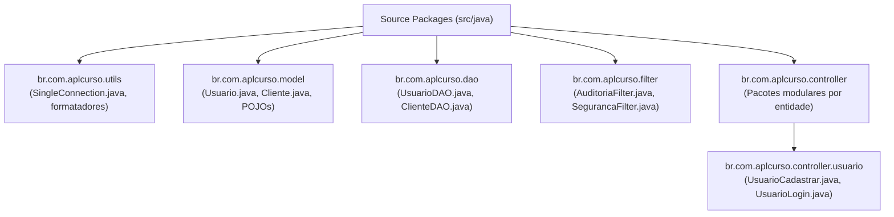

### Execução no NetBeans

1. Na árvore de arquivos do projeto no NetBeans, clique com o botão direito sobre o nó **Source Packages**.
2. Selecione `New` -> `Java Package...`.
3. No campo **Package Name**, digite o nome e confirme com o botão **Finish**.
4. Repita a operação criando individualmente a totalidade dos pacotes do núcleo do sistema:
   - `br.com.aplcurso.utils`
   - `br.com.aplcurso.model`
   - `br.com.aplcurso.dao`
   - `br.com.aplcurso.filter`
   - `br.com.aplcurso.controller.usuario`

> [!TIP]
> **Subdivisão de Controladores por Domínio**: Criar o subpacote `br.com.aplcurso.controller.usuario` em vez de concentrar todos os servlets em um único pacote genérico evita a criação do anti-pattern *God Package* (pacote sobrecarregado com dezenas de controladores desconexos de clientes, fornecedores, relatórios e produtos). Cada entidade de negócio possui seu próprio subpacote controlador.

---

## Substituição de páginas HTML estáticas por páginas dinâmicas JSP (index.jsp)

### Por que o arquivo index.html deve ser eliminado?

Quando o assistente de projeto web do NetBeans conclui a criação do template, ele gera automaticamente um arquivo estático chamado `index.html` dentro do diretório `Web Pages`. Esse arquivo possui limitações fundamentais:
- É puramente estático: o servidor web entrega o arquivo como um fluxo bruto de bytes diretamente ao navegador.
- Não passa pelo processamento dinâmico do container web Jasper (não interpreta tags JSTL nem avalia expressões EL).
- Não permite ler variáveis de sessão ou objetos injetados na requisição pelo controlador.

Para que a raiz da aplicação atue como um componente web dinâmico, devemos substituir o documento HTML estático por um documento **JavaServer Pages (JSP)**.

### Ciclo de vida interno de compilação de uma página JSP

Muitos estudantes acreditam erroneamente que o JSP é apenas um "HTML avançado". Tecnicamente, **todo arquivo JSP é compilado e transformado em um Servlet Java tradicional** pelo container de servlets (o compilador Jasper do Tomcat):

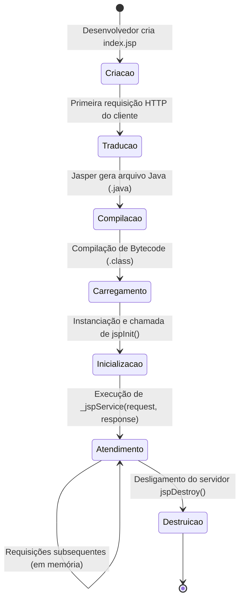

1. **Tradução**: o container Apache Tomcat lê o arquivo `index.jsp` e gera uma classe Java equivalente (por exemplo, `index_jsp.java`), que estende a infraestrutura de servlets da classe `org.apache.jasper.runtime.HttpJspBase`.
2. **Compilação**: a classe gerada é compilada pelo `javac` em bytecode binário (`index_jsp.class`) alocado no diretório de trabalho do Tomcat (`/work/Catalina/localhost/...`).
3. **Execução**: o container instancia o objeto e invoca o método `_jspService(HttpServletRequest, HttpServletResponse)`, processando o fluxo de dados e enviando a resposta renderizada em HTML de volta ao cliente.
4. **Reutilização**: as requisições subsequentes ao mesmo JSP não sofrem compilação novamente; o servlet já carregado em memória atende instantaneamente a solicitação.

### Procedimento de substituição no NetBeans

1. Na pasta **Web Pages**, clique com o botão direito sobre o arquivo `index.html`.
2. Selecione a opção **Delete** e confirme na caixa de diálogo para removê-lo em definitivo.
3. Clique com o botão direito sobre a pasta **Web Pages** -> `New` -> `JSP...`.
4. No campo **File Name**, informe `index` (o NetBeans associará automaticamente a extensão `.jsp`).
5. Assegure-se de que a opção *JSP File (Standard Syntax)* esteja marcada.
6. Clique em **Finish**. O novo arquivo `index.jsp` será aberto no editor de código com a estrutura inicial dinâmica.

### Exemplo de código: estrutura de index.jsp profissional

```jsp
<%@page contentType="text/html" pageEncoding="UTF-8"%>
<%@taglib prefix="c" uri="http://java.sun.com/jsp/jstl/core"%>
<!DOCTYPE html>
<html lang="pt-br">
    <head>
        <meta http-equiv="Content-Type" content="text/html; charset=UTF-8">
        <meta name="viewport" content="width=device-width, initial-scale=1.0">
        <title>Laboratório de Programação III - Sistema AplCurso</title>
    </head>
    <body>
        <header>
            <h1>Painel Administrativo da Aplicação Web</h1>
            <p>Disciplina: Laboratório de Programação III - UniFEF</p>
            <p>Professor: Jefferson Passerini</p>
        </header>
        <hr>
        <main>
            <h2>Status do Ambiente de Desenvolvimento</h2>
            <p>Seja bem-vindo ao ambiente de execução Java Web corporativo.</p>
            <p>O container de servlets Apache Tomcat 9 processou este arquivo JSP com sucesso.</p>
        </main>
        <hr>
        <footer>
            <small>AplCurso &copy; 2026 - Padrão Arquitetural MVC</small>
        </footer>
    </body>
</html>
```

---

## Ciclo de compilação, deploy e execução no container web Tomcat via NetBeans

### Ações e atalhos operacionais de execução

O Apache NetBeans integra a gestão de ciclo de vida da aplicação por meio de atalhos e acionadores de interface gráfica:

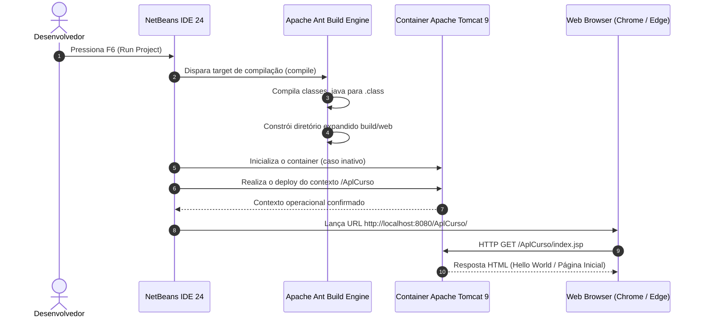

### Modos de execução suportados

1. **Executar Projeto Completo (Atalho: `F6`)**:
   - Compila todo o código-fonte localizado em `Source Packages`.
   - Monta o pacote de diretório expandido da aplicação web sob a pasta `build/web`.
   - Inicializa o processo de segundo plano do Apache Tomcat se este estiver parado.
   - Publica o contexto `/AplCurso` e dispara o navegador padrão na URL `http://localhost:8080/AplCurso/index.jsp`.
2. **Executar Arquivo Único (Atalho: `Shift + F6`)**:
   - Compila exclusivamente o arquivo atualmente aberto e direciona a requisição do navegador para o endpoint relativo desse arquivo.
3. **Depurar Projeto com Breakpoints (Atalho: `Ctrl + Shift + F5`)**:
   - Inicializa a JVM do Tomcat com flags ativas de depuração JPDA (Java Platform Debugger Architecture). Permite pausar a execução da aplicação em linhas específicas de servlets ou DAOs para inspecionar variáveis em tempo real.

### Tabela de comandos de execução no NetBeans

| Operação Desejada | Atalho de Teclado | Ação via Menu de Contexto | Comportamento Interno |
| :--- | :--- | :--- | :--- |
| **Run Project** | `F6` | Botão ▶️ (Play verde superior) | Compilação global, deploy do contexto completo e abertura do navegador. |
| **Run File** | `Shift + F6` | Botão direito no arquivo -> *Run File* | Execução pontual do arquivo selecionado sem redeploy de todo o projeto. |
| **Debug Project** | `Ctrl + Shift + F5` | Menu *Debug* -> *Debug Project* | Ativa a sessão de depuração JPDA com suspensão de threads em breakpoints. |
| **Clean and Build** | `Shift + F11` | Botão direito no projeto -> *Clean and Build* | Limpa a pasta `build/` e `dist/`, forçando a recompilação limpa de todas as classes. |

---

## Diagnóstico e resolução de falhas comuns de servidor e conflito de portas

### Árvore de decisão para solução de problemas

Durante as primeiras sessões de laboratório com desenvolvimento web em Java, incidentes de infraestrutura local são frequentes. O fluxograma a seguir serve como guia de triagem para a resolução de erros:

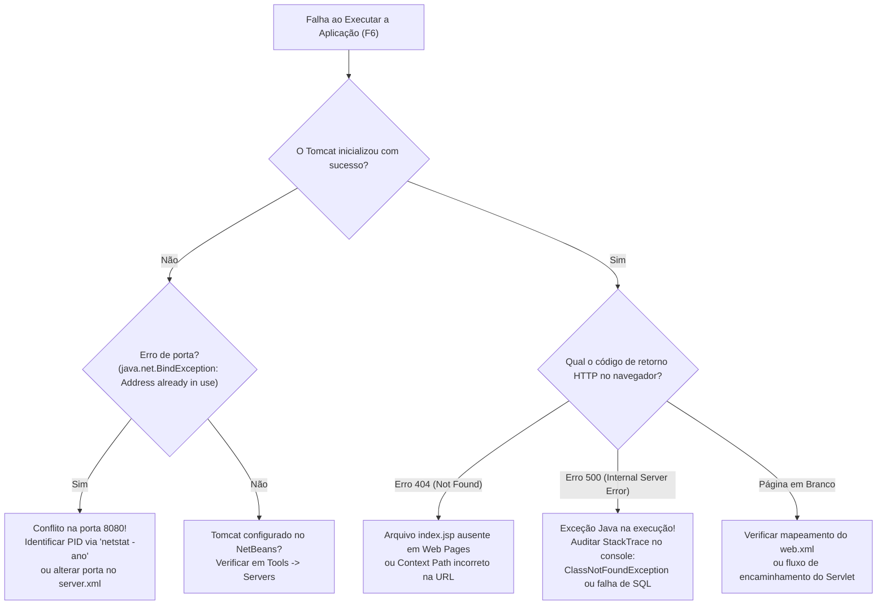

### Análise aprofundada dos cenários de falha

#### Falha 1: Conflito de porta 8080 (`java.net.BindException: Address already in use`)
- **Causa Raiz**: a porta padrão TCP `8080` do Tomcat já está alocada por outro processo no sistema operacional (outra instância oculta do Tomcat, serviços de banco de dados Oracle Express XE, servidores Microsoft IIS ou serviços de comunicação).
- **Procedimento de Diagnóstico e Correção**:
  1. Abra o terminal do Windows (PowerShell com privilégios administrativos) e execute:
     ```powershell
     netstat -ano | findstr :8080
     ```
  2. Localize o número do identificador de processo (**PID**) na última coluna da saída.
  3. Finalize o processo conflitante:
     ```powershell
     taskkill /PID <NUMERO_DO_PID> /F
     ```
  4. *Solução alternativa via IDE*: altere a porta padrão do Tomcat para `8082` ou `8089` no NetBeans em `Tools` -> `Servers` -> `Apache Tomcat` -> campo *Server Port*.

#### Falha 2: Erro HTTP 404 Not Found
- **Causa Raiz**: o navegador acessou uma URI que não corresponde a nenhum recurso estático, arquivo JSP existente no diretório `Web Pages` ou servlet registrado no container.
- **Correção**:
  - Verifique se o arquivo `index.jsp` não foi movido acidentalmente para dentro da pasta `WEB-INF`. Recursos localizados dentro de `WEB-INF` são privados e protegidos pelo container contra acesso direto do cliente via URL.
  - Verifique se o Context Path configurado em `context.xml` coincide com o caminho digitado na URL (`http://localhost:8080/AplCurso/index.jsp`).

#### Falha 3: Erro HTTP 500 Internal Server Error (`ClassNotFoundException: org.postgresql.Driver`)
- **Causa Raiz**: a aplicação tentou carregar a classe do driver JDBC PostgreSQL em tempo de execução via `Class.forName()`, mas o arquivo `.jar` não foi incluído no classpath da pasta virtual *Libraries* do NetBeans.
- **Correção**: adicione a biblioteca `PostgreSQL JDBC Driver` na pasta virtual *Libraries* do projeto e execute um `Clean and Build` (`Shift + F11`).

### Tabela de diagnóstico rápido de erros

| Código de Erro / Sintoma | Causa Técnica Primária | Ação Corretiva Imediata |
| :--- | :--- | :--- |
| `BindException: Address in use: 8080` | Porta TCP 8080 travada por outro processo. | Encerrar o processo via `taskkill` ou remapear o conector HTTP no `server.xml`. |
| `HTTP 404 Not Found` | Recurso fora de `Web Pages` ou URL incorreta. | Validar presença do arquivo `index.jsp` na raiz da pasta `Web Pages`. |
| `HTTP 500 ClassNotFoundException` | Dependência `.jar` não vinculada ao projeto. | Adicionar o driver PostgreSQL ou biblioteca JSTL nas *Libraries*. |
| `Tomcat Server Not Found` | IDE perdeu o ponteiro físico de instalação do Tomcat. | Reconfigurar o caminho raiz do servidor em `Tools` -> `Servers`. |

---

## Código da aula

Os exemplos práticos desenvolvidos nesta aula foram organizados no arquivo de código [./codigo/ExemplosAmbienteWeb.java](./codigo/ExemplosAmbienteWeb.java).

O arquivo implementa uma simulação completa da arquitetura do curso em memória, contendo:
- O padrão criacional estrito **Singleton (Single Connection)** para a camada de infraestrutura.
- A entidade de domínio **Usuario** (camada Model).
- A classe de acesso a dados **UsuarioDAO** (camada DAO).
- Um componente de controle **UsuarioControllerSimulado** (camada Controller).
- Um interceptador **FiltroAuditoriaSimulado** (camada Filter).

### Trechos essenciais comentados linha a linha

Abaixo, detalhamos a estrutura da classe centralizadora de conexão Singleton:

```java
// Definicao da classe utilitaria de conexao no pacote correspondente
package br.com.aplcurso.utils;

import java.sql.Connection;
import java.sql.DriverManager;
import java.sql.SQLException;

public class SingleConnectionSimulada {

    // Variavel estatica que contera a unica referencia da conexao na JVM
    private static Connection conexaoInstancia = null;

    // Construtor privado: bloqueia qualquer tentativa de instanciacao externa via "new"
    private SingleConnectionSimulada() {
    }

    // Metodo sincronizado garantindo seguranca de threads (Thread-Safety)
    public static synchronized Connection getConexao() {
        try {
            // Verifica se a conexao ainda nao foi instanciada ou se foi fechada
            if (conexaoInstancia == null || conexaoInstancia.isClosed()) {
                // Em um ambiente real, carrega-se o driver: Class.forName("org.postgresql.Driver");
                // Estabelece a conexao utilizando parametros de banco, usuario e senha
                String url = "jdbc:postgresql://localhost:5432/curso_db";
                String usuario = "postgres";
                String senha = "admin";
                
                // Inicializa a conexao atraves do DriverManager padrao da API JDBC
                conexaoInstancia = DriverManager.getConnection(url, usuario, senha);
            }
        } catch (SQLException e) {
            // Emite aviso em console no caso de impossibilidade de conexao com o socket do PostgreSQL
            System.err.println("Erro ao obter conexao Singleton: " + e.getMessage());
        }
        // Retorna a instancia estatica compartilhada para a camada DAO solicitante
        return conexaoInstancia;
    }
}
```

---

## Exercícios

A resolução completa e compilável de todos os exercícios práticos propostos encontra-se documentada no arquivo [./codigo/ExerciciosResolvidos.java](./codigo/ExerciciosResolvidos.java).

### Exercício 1: Implementação de Gerenciador de Conexão Singleton (Single Connection)

#### Enunciado
Implemente em Java uma classe utilitária de conexão que aplique rigorosamente o padrão de projeto Singleton (*Single Connection*), conforme apresentado na arquitetura do curso. A classe deve manter um construtor privado, controlar uma única instância estática de conexão para banco de dados PostgreSQL (utilizando parâmetros de URL, usuário e senha), fornecer um método público estático de acesso (`getConnection`) e garantir que chamadas repetidas retornem a mesmíssima referência de conexão em memória.

#### Raciocínio arquitetural
O padrão Singleton protege os recursos da máquina ao evitar que cada requisição HTTP abra um novo socket físico com o banco de dados PostgreSQL. O construtor privado impede o uso de `new Conexao()`, e o método `getConnection()` verifica se o atributo interno `connection` já existe. Em caso afirmativo, reutiliza-o imediatamente.

#### Resolução comentada

```java
package br.com.aplcurso.utils;

import java.sql.Connection;
import java.sql.DriverManager;
import java.sql.SQLException;

public class GerenciadorConexaoSingleton {

    private static final String URL = "jdbc:postgresql://localhost:5432/curso_db";
    private static final String USUARIO = "postgres";
    private static final String SENHA = "admin";

    // Variavel estatica compartilhada por toda a aplicacao
    private static Connection conexao = null;

    // Construtor privado para impedir instanciacao direta
    private GerenciadorConexaoSingleton() {
    }

    // Metodo estatico com verificacao de estado nulo ou fechado
    public static synchronized Connection getConnection() {
        try {
            if (conexao == null || conexao.isClosed()) {
                // Carregamento do driver do PostgreSQL
                Class.forName("org.postgresql.Driver");
                conexao = DriverManager.getConnection(URL, USUARIO, SENHA);
            }
        } catch (ClassNotFoundException e) {
            throw new RuntimeException("Driver PostgreSQL nao encontrado!", e);
        } catch (SQLException e) {
            throw new RuntimeException("Falha ao conectar com o banco de dados!", e);
        }
        return conexao;
    }
}
```

---

### Exercício 2: Modelagem da Entidade Usuário e Camada DAO Básica

#### Enunciado
Com base na estrutura de pacotes definida em aula (`br.com.aplcurso.model` e `br.com.aplcurso.dao`), implemente a classe de modelo `Usuario` (com os atributos `id`, `nome`, `login`, `senha` e `status`, com encapsulamento completo) e uma classe `UsuarioDAO` contendo métodos simulados de persistência (`cadastrar`, `listar` e `autenticar`), recebendo a instância de conexão centralizada gerenciada pelo padrão Singleton.

#### Raciocínio arquitetural
A classe `Usuario` é um JavaBean puro (POJO): apenas retém estado com encapsulamento. A classe `UsuarioDAO` é a única que conhece a conexão com o banco e executa operações de persistência e consulta, convertendo dados entre o formato relacional e o objeto.

#### Resolução comentada

```java
package br.com.aplcurso.model;

public class Usuario {
    private Integer id;
    private String nome;
    private String login;
    private String senha;
    private String status;

    public Usuario() {}

    public Usuario(Integer id, String nome, String login, String senha, String status) {
        this.id = id;
        this.nome = nome;
        this.login = login;
        this.senha = senha;
        this.status = status;
    }

    public Integer getId() { return id; }
    public void setId(Integer id) { this.id = id; }
    public String getNome() { return nome; }
    public void setNome(String nome) { this.nome = nome; }
    public String getLogin() { return login; }
    public void setLogin(String login) { this.login = login; }
    public String getSenha() { return senha; }
    public void setSenha(String senha) { this.senha = senha; }
    public String getStatus() { return status; }
    public void setStatus(String status) { this.status = status; }
}
```

```java
package br.com.aplcurso.dao;

import br.com.aplcurso.model.Usuario;
import java.sql.Connection;
import java.util.ArrayList;
import java.util.List;

public class UsuarioDAO {

    private Connection conexao;
    // Base de dados em memoria simulando a tabela de usuarios
    private static final List<Usuario> tabelaSimulada = new ArrayList<>();

    public UsuarioDAO(Connection conexao) {
        this.conexao = conexao;
    }

    public boolean cadastrar(Usuario usuario) {
        if (usuario != null) {
            usuario.setId(tabelaSimulada.size() + 1);
            tabelaSimulada.add(usuario);
            return true;
        }
        return false;
    }

    public List<Usuario> listar() {
        return new ArrayList<>(tabelaSimulada);
    }

    public Usuario autenticar(String login, String senha) {
        for (Usuario u : tabelaSimulada) {
            if (u.getLogin().equals(login) && u.getSenha().equals(senha) && "ATIVO".equalsIgnoreCase(u.getStatus())) {
                return u;
            }
        }
        return null;
    }
}
```

---

### Exercício 3: Simulação de Filtro de Interceptação de Requisições (Filter Layer)

#### Enunciado
Crie uma classe que simule a responsabilidade da camada `br.com.aplcurso.filter` na arquitetura do curso. A classe deve receber uma requisição simulada (contendo URI de destino e estado de autenticação do usuário), verificar se o destino exige privilégios de acesso e, caso o usuário não esteja autenticado, redirecioná-lo para a tela de login, validando também a integridade da conexão.

#### Raciocínio arquitetural
Os filtros atuam antes que a requisição atinja os servlets. Eles protegem recursos administrativos, inspecionam cabeçalhos e garantem que usuários anônimos não consigam acessar páginas internas como `index.jsp` ou `clienteCadastrar.jsp` simplesmente digitando a URL no navegador.

#### Resolução comentada

```java
package br.com.aplcurso.filter;

public class FiltroSegurancaSimulado {

    public static class RequisicaoSimulada {
        private String uri;
        private boolean usuarioLogado;

        public RequisicaoSimulada(String uri, boolean usuarioLogado) {
            this.uri = uri;
            this.usuarioLogado = usuarioLogado;
        }

        public String getUri() { return uri; }
        public boolean isUsuarioLogado() { return usuarioLogado; }
    }

    public boolean filtrarRequisicao(RequisicaoSimulada req) {
        System.out.println("[FiltroSeguranca] Interceptando requisicao para: " + req.getUri());
        
        // Rotas publicas que nao exigem autenticacao prévia
        if (req.getUri().endsWith("login.jsp") || req.getUri().endsWith("UsuarioLogin")) {
            System.out.println("[FiltroSeguranca] Rota publica liberada.");
            return true;
        }

        // Rotas protegidas exigem usuario com sessao ativa
        if (!req.isUsuarioLogado()) {
            System.out.println("[FiltroSeguranca] Bloqueado! Redirecionando para login.jsp");
            return false;
        }

        System.out.println("[FiltroSeguranca] Sessao ativa validada. Encaminhando ao Servlet.");
        return true;
    }
}
```

---

### Exercício 4: Controlador de Autenticação e Despacho MVC (Controller Layer)

#### Enunciado
Implemente uma classe controladora representando o pacote `br.com.aplcurso.controller.usuario`, responsável por processar uma requisição de login. O controlador deve extrair os parâmetros de login e senha, invocar o método de autenticação da `UsuarioDAO` e determinar o despacho do fluxo para a visão correspondente (`index.jsp` em caso de sucesso ou `login.jsp` com mensagem de erro em caso de falha).

#### Raciocínio arquitetural
O controlador não implementa regras de negócio diretamente; ele coordena. Ele extrai os parâmetros brutos do cliente, consulta a camada DAO e injeta os atributos de resposta antes de despachar a visão correta.

#### Resolução comentada

```java
package br.com.aplcurso.controller.usuario;

import br.com.aplcurso.dao.UsuarioDAO;
import br.com.aplcurso.model.Usuario;

public class UsuarioLoginControllerSimulado {

    private UsuarioDAO usuarioDAO;

    public UsuarioLoginControllerSimulado(UsuarioDAO dao) {
        this.usuarioDAO = dao;
    }

    public String processarLogin(String login, String senha) {
        // Validacao basica de parametros recebidos
        if (login == null || login.trim().isEmpty() || senha == null || senha.trim().isEmpty()) {
            System.out.println("[Controller] Parametros de autenticacao ausentes.");
            return "login.jsp?erro=campos_obrigatorios";
        }

        // Delegacao da regra para a camada de persistencia DAO
        Usuario autenticado = usuarioDAO.autenticar(login, senha);

        if (autenticado != null) {
            System.out.println("[Controller] Usuario " + autenticado.getNome() + " autenticado com sucesso!");
            // Encaminha para a pagina principal da aplicacao
            return "index.jsp";
        } else {
            System.out.println("[Controller] Falha: Credenciais invalidas ou usuario inativo.");
            // Retorna a tela de login exibindo notificacao de falha
            return "login.jsp?erro=credenciais_invalidas";
        }
    }
}
```

---

## Erros comuns e boas práticas

### Erros comuns (Anti-patterns)

- **Instalar o Apache Tomcat 10+ em projetos Java EE 8**: gera erros de `ClassNotFoundException: javax.servlet.Filter`. O Tomcat 10 requer a transição de todos os códigos e dependências para a biblioteca `jakarta.servlet.*`.
- **Escrever código SQL dentro de arquivos JSP**: fere o princípio fundamental do MVC. Instruções SQL pertencem exclusivamente à camada DAO.
- **Inserir arquivos JSP acessíveis diretamente dentro da pasta `WEB-INF`**: o Tomcat bloqueia o acesso HTTP direto a qualquer documento contido em `WEB-INF`. Páginas raiz que precisam ser acessadas pelo navegador (como `index.jsp`) devem permanecer soltas na pasta `Web Pages`.
- **Esquecer de vincular o driver JDBC nas Libraries do NetBeans**: o código Java compila com sucesso, mas lança falha interna em tempo de execução ao tentar conectar ao banco.
- **Divergência entre versões de compilação e execução**: configurar a IDE para compilar com Java 21 enquanto o Tomcat executa sobre Java 17, provocando erros de versão binária (`UnsupportedClassVersionError`).

### Boas práticas de engenharia

- **Nomes de pacotes rigorosamente em minúsculas**: utilizar a notação `br.com.<projeto>.<camada>`.
- **Encapsulamento estrito nas classes Model**: declarar atributos sempre como `private` e expor apenas métodos seletores (`getters`) e modificadores (`setters`).
- **Fechamento e auditoria de recursos JDBC**: em ambientes profissionais, sempre utilizar blocos `try-with-resources` para fechamento automático de `PreparedStatement` e `ResultSet`, evitando vazamento de memória (*connection leak*).
- **Subdivisão granular da camada Controller**: crie subpacotes por domínio de negócio (`controller.usuario`, `controller.cliente`), evitando misturar servlets em um único pacote desordenado.

---

## Links e materiais complementares

- **Eclipse Temurin OpenJDK (Adoptium)**: `https://adoptium.net/`
  *Distribuição binária corporativa gratuita e certificada pelo TCK da linguagem Java, recomendada para a instalação do JDK 17 LTS.*
- **Apache Tomcat Official Downloads**: `https://tomcat.apache.org/download-90.cgi`
  *Página oficial de download do servidor de aplicação web Apache Tomcat 9, container de servlets compatível com Java EE 8.*
- **Apache NetBeans IDE**: `https://netbeans.apache.org/front/main/download/`
  *Portal oficial da Apache Software Foundation contendo o instalador oficial do NetBeans 24.*
- **PostgreSQL JDBC Driver Documentation**: `https://jdbc.postgresql.org/`
  *Documentação técnica da biblioteca JDBC de conexão com bancos relacionais PostgreSQL.*
- **Oracle Java EE 8 Technologies Specification**: `https://javaee.github.io/javaee-spec/`
  *Especificação técnica da arquitetura corporativa Java EE 8, cobrindo os padrões Servlet 4.0 e JSP 2.3.*

---

## Mapa da aula

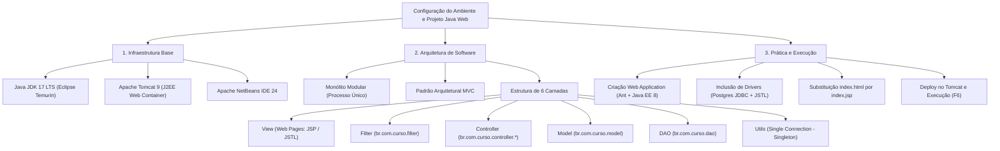

---

## Glossário

| Termo Técnico | Definição no Contexto da Disciplina |
| :--- | :--- |
| **JDK (Java Development Kit)** | Pacote de ferramentas que contém o compilador `javac`, ferramentas de diagnóstico e o ambiente de execução JRE. |
| **JVM (Java Virtual Machine)** | Ambiente virtual de execução que interpreta o bytecode das classes compiladas (`.class`) e as executa no sistema operacional. |
| **Apache Tomcat** | Container de servlets e motor JSP open source responsável por executar aplicações dinâmicas Java na web. |
| **Apache NetBeans** | Ambiente Integrado de Desenvolvimento (IDE) mantido pela Apache Software Foundation voltado ao desenvolvimento Java. |
| **MVC (Model-View-Controller)** | Padrão arquitetural que divide o software em três camadas: Modelo (dados/regras), Visão (interface) e Controlador (fluxo). |
| **DAO (Data Access Object)** | Padrão de projeto estrutural que abstrai e centraliza todos os comandos de acesso e persistência no banco de dados. |
| **Singleton** | Padrão criacional do GoF que assegura a criação de uma única instância de classe e fornece um acesso global a ela. |
| **JSP (JavaServer Pages)** | Tecnologia da plataforma Java EE que permite inserir código Java e tags em páginas web para geração dinâmica de HTML. |
| **JSTL (JSP Standard Tag Library)** | Conjunto padronizado de tags customizadas que simplifica iterações, condições e formatações em arquivos JSP. |
| **JDBC (Java Database Connectivity)** | API padrão da linguagem Java para envio de instruções SQL e manipulação de resultados em bancos de dados relacionais. |
| **Context Path** | Caminho base na URL que referencia a raiz da aplicação dentro do servidor (ex: `/AplCurso`). |
| **WAR (Web Application Archive)** | Formato padrão de empacotamento comprimido de aplicações Java Web contendo classes, bibliotecas e páginas web. |

---

## Pontos-chave para a prova

1. **Diferença entre JDK e JRE**: O JDK é obrigatório para programar porque fornece o compilador `javac`. O JRE contém apenas a JVM e as bibliotecas necessárias para executar programas já compilados.
2. **Incompatibilidade Tomcat 10+ vs. Java EE 8**: O Tomcat 10 migrou para o namespace `jakarta.*`. Aplicações desenvolvidas sob a especificação Java EE 8 utilizam o namespace `javax.*` e quebram no Tomcat 10. A versão correta é o **Tomcat 9**.
3. **Mapeamento de Camadas MVC**:
   - `Web Pages`: View (exibição de interfaces e captura de dados via formulários).
   - `br.com.curso.controller.*`: Controller (recepção de requisições, leitura de parâmetros e despacho).
   - `br.com.curso.model`: Model (classes POJO que representam as entidades de negócio).
   - `br.com.curso.dao`: Persistência de Dados (instruções SQL e mapeamento de `ResultSet`).
4. **Mecânica do Padrão Singleton**: Exige construtor privado, variável de referência estática e um método estático de acesso público que garante a existência de uma única instância ativa.
5. **Ciclo de Vida do JSP**: O JSP não é interpretado diretamente como texto no cliente; o container Jasper traduz o `.jsp` em uma classe Java de Servlet (`.java`), compila para `.class` e executa seu método de atendimento a cada requisição.
6. **Localização de Arquivos e Segurança**: Arquivos dentro da pasta `WEB-INF` são privados e não podem ser acessados diretamente por requisição HTTP via navegador; apenas servlets internos podem acessá-los. Páginas públicas iniciais (como `index.jsp`) devem residir na raiz de `Web Pages`.

---

## Perguntas e respostas (JSONL)

```jsonl
{"pergunta": "Qual e a funcao do comando javac no ambiente de desenvolvimento Java?", "resposta": "O comando javac e o compilador oficial da linguagem Java, responsavel por converter os arquivos de codigo-fonte legiveis (.java) em bytecode intermediario (.class) que sera executado pela JVM.", "dificuldade": "facil"}
{"pergunta": "Por que a disciplina adota a versao LTS (Long-Term Support) do Java 17?", "resposta": "As versoes LTS garantem estabilidade de longo prazo, atualizacoes de seguranca contínuas e evitam quebras de retrocompatibilidade comuns em lancamentos semestrais da linguagem.", "dificuldade": "facil"}
{"pergunta": "Qual e a principal diferenca estrutural entre o Apache Tomcat e um servidor Java EE completo como o Payara ou GlassFish?", "resposta": "O Apache Tomcat e exclusivamente um J2EE Web Container (implementa Servlets e JSPs), enquanto servidores completos implementam a totalidade das especificacoes corporativas (como EJB, JMS e JTA).", "dificuldade": "media"}
{"pergunta": "O que ocorre se tentarmos rodar uma aplicacao desenvolvida para Java EE 8 Web em um servidor Apache Tomcat versao 10?", "resposta": "Ocorrerá erro de classe nao encontrada (ClassNotFoundException), pois o Tomcat 10 migrou do namespace tradicional javax.* para o namespace jakarta.*.", "dificuldade": "dificil"}
{"pergunta": "Quais sao as tres camadas fundamentais do padrao arquitetural MVC e qual o papel de cada uma?", "resposta": "Model (regras de negocio e entidades de dados), View (apresentacao visual e interface gráfica para o usuario) e Controller (intermediacao das requisicoes, coordenacao e despacho).", "dificuldade": "facil"}
{"pergunta": "Em qual pacote Java da aplicacao devem residir as instrucoes SQL de insercao e consulta com o PostgreSQL?", "resposta": "Exclusivamente no pacote da camada DAO (Data Access Object), como br.com.aplcurso.dao.", "dificuldade": "facil"}
{"pergunta": "Como o padrao criacional Singleton impede que multiplas conexoes sejam instanciadas na classe SingleConnection?", "resposta": "Declarando o construtor da classe como private e controlando uma unica instancia estatica de Connection atraves de um metodo estatico publico getConnection().", "dificuldade": "media"}
{"pergunta": "Por que a utilizacao de conexao unica (Single Connection) nao e recomendada para ambientes industriais de producao com alto trafego?", "resposta": "Porque uma conexao fisica unica cria um gargalo de concorrência, forçando as requisicoes simultaneas a aguardarem a liberacao do socket, podendo causar travamento do sistema.", "dificuldade": "dificil"}
{"pergunta": "Qual o objetivo de substituir o arquivo index.html inicial gerado pelo NetBeans por um arquivo index.jsp?", "resposta": "O index.html e puramente estatico, enquanto o index.jsp e processado pelo servidor, permitindo injecao de dados dinâmicos, avaliacao de expressoes EL e uso de tags JSTL.", "dificuldade": "facil"}
{"pergunta": "O que o motor do Tomcat (Jasper) faz nos bastidores quando uma pagina JSP e solicitada pela primeira vez?", "resposta": "Traduz o documento JSP em um arquivo fonte de Servlet Java (.java), compila esse arquivo em bytecode (.class) e carrega a instancia em memoria.", "dificuldade": "media"}
{"pergunta": "Qual e o papel da biblioteca PostgreSQL JDBC Driver adicionada a pasta Libraries do projeto?", "resposta": "Ela atua como o driver de traducao entre as chamadas da API java.sql da JVM e o protocolo nativo de comunicacao via rede do banco de dados relacional PostgreSQL.", "dificuldade": "media"}
{"pergunta": "Por que o uso de scriptlets (<% ... %>) em paginas JSP e considerado uma má pratica de programacao no desenvolvimento moderno?", "resposta": "Porque mistura a logica de controle em Java com as tags visuais de HTML, quebrando a separacao de conceitos do MVC e dificultando a manutencao e seguranca da aplicacao.", "dificuldade": "media"}
{"pergunta": "Para que serve a camada Filter (br.com.aplcurso.filter) na arquitetura apresentada em aula?", "resposta": "Funciona como um interceptador centralizado de requisicoes HTTP para validacao de seguranca, verificacao de autenticacao de sessao e controle do contexto de conexao.", "dificuldade": "media"}
{"pergunta": "Qual comando de rede pode ser utilizado no terminal do Windows para diagnosticar se a porta 8080 esta sendo ocupada por outro processo?", "resposta": "O comando netstat -ano | findstr :8080.", "dificuldade": "facil"}
{"pergunta": "Qual o significado e a funcao do 'Context Path' configurado como /AplCurso durante a criacao do projeto no NetBeans?", "resposta": "Define o caminho base e identificador raiz da aplicacao web na estrutura de rotas da URL do servidor (exemplo: http://localhost:8080/AplCurso/).", "dificuldade": "facil"}
{"pergunta": "Por que os arquivos contidos dentro do diretorio WEB-INF nao podem ser acessados diretamente pela barra de navegacao do cliente?", "resposta": "Porque a especificacao de servlets impoe que o diretorio WEB-INF seja estritamente privado, protegido pelo servidor contra acessos publicos diretos.", "dificuldade": "dificil"}
{"pergunta": "Qual atalho de teclado na IDE NetBeans compila e executa o projeto completo no servidor Tomcat abrindo o navegador?", "resposta": "A tecla de atalho F6.", "dificuldade": "facil"}
{"pergunta": "Qual a diferenca fundamental entre executar a acao Run Project (F6) e Run File (Shift+F6) no NetBeans?", "resposta": "Run Project compila e faz o deploy do contexto inteiro da aplicacao, enquanto Run File executa isoladamente o arquivo atualmente aberto no editor.", "dificuldade": "facil"}
```

---

## Checklist de revisão

- [ ] Verificar a versão ativa do Java JDK no PowerShell com `java -version` e `javac -version`, garantindo a identificação do OpenJDK 17 LTS (Eclipse Temurin).
- [ ] Confirmar se todas as versões legadas ou conflitantes do Java foram desinstaladas do sistema operacional.
- [ ] Validar a extração e instalação do Apache Tomcat 9 na raiz `C:\apache-tomcat-9.0.102`.
- [ ] Lembrar por que o Apache Tomcat 10 ou superior **não** deve ser utilizado em aplicações Java EE 8 (incompatibilidade entre namespaces `javax.*` e `jakarta.*`).
- [ ] Abrir o Apache NetBeans 24 e validar as opções de build em `Tools` -> `Options` -> `Java`.
- [ ] Criar o projeto Java Web no NetBeans utilizando a opção `Java with Ant` -> `Web Application` sob a especificação `Java EE 8 Web`.
- [ ] Adicionar o conector de banco `PostgreSQL JDBC Driver` e a biblioteca `JSTL 1.2` na pasta virtual `Libraries` do projeto.
- [ ] Criar a estrutura completa de pacotes Java em `Source Packages`:
  - [ ] `br.com.aplcurso.utils`
  - [ ] `br.com.aplcurso.model`
  - [ ] `br.com.aplcurso.dao`
  - [ ] `br.com.aplcurso.filter`
  - [ ] `br.com.aplcurso.controller.usuario`
- [ ] Excluir o arquivo estático `index.html` da pasta `Web Pages` e criar em seu lugar o arquivo dinâmico `index.jsp`.
- [ ] Implementar a classe de conexão centralizada `SingleConnection` no pacote `utils`, garantindo o construtor privado e método estático `getConnection()`.
- [ ] Executar o projeto pressionando `F6` e confirmar a inicialização do Tomcat na porta `8080`, validando a abertura da página inicial no navegador na URL `http://localhost:8080/AplCurso/index.jsp`.
- [ ] Saber diagnosticar e resolver erros comuns de conflito de portas TCP (`BindException: 8080`) e ausência de drivers JDBC (`ClassNotFoundException`).
