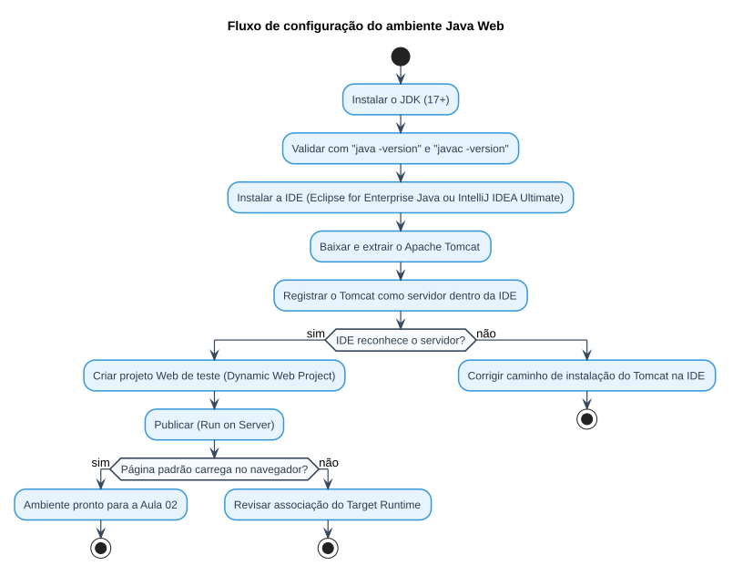

# Aula 01 — Preparando o Ambiente de Desenvolvimento

> **Data de Postagem:** 23/02/2026
> **Professor:** Jefferson Passerini
> **Disciplina:** Laboratório de Programação III (3º Semestre)
> **Tema:** Configuração do ambiente Java Web (JDK, IDE, Servidor de Aplicação)

## Objetivo da aula

Preparar a estação de trabalho do aluno para o desenvolvimento de aplicações **Java Web** ao longo do semestre, cobrindo a instalação e a integração das três ferramentas fundamentais: o kit de desenvolvimento Java (JDK), uma IDE orientada a desenvolvimento corporativo (Eclipse for Enterprise Java ou IntelliJ IDEA Ultimate) e um servidor de aplicação compatível com a especificação Servlet/JSP (Apache Tomcat).

## Por que este ambiente é necessário

Diferente de uma aplicação Java "de console", uma aplicação Java Web não roda sozinha: ela precisa de um **container de servlets** que receba requisições HTTP, gerencie o ciclo de vida das classes controladoras e sirva as páginas dinâmicas. Sem essa peça, o código escrito nas próximas aulas simplesmente não tem onde ser executado.

## Componentes do ambiente

| Componente | Papel | Observação |
| :--- | :--- | :--- |
| **JDK (Java Development Kit)** | Compila e executa o código Java | Recomendado JDK 17+ (LTS) |
| **IDE** | Editor com suporte a projetos Web (Dynamic Web Project / Maven) | Eclipse IDE for Enterprise Java **ou** IntelliJ IDEA Ultimate |
| **Apache Tomcat** | Servidor de aplicação / container de Servlets | Hospeda e executa o `.war` gerado pelo projeto |
| **SGBD relacional** | Persistência dos dados (usado a partir da Aula 04) | MySQL ou PostgreSQL |

## Fluxo de preparação do ambiente

O diagrama abaixo resume a sequência de passos necessária antes de escrever a primeira linha de código de um projeto Java Web:

## O que acontece se o Tomcat não estiver integrado corretamente

Se a IDE não estiver corretamente associada a uma instância do Tomcat, o projeto não gera o artefato de deploy (`.war`) de forma válida, ou a IDE não sabe onde publicá-lo. Na prática isso se manifesta como:

- Erro de compilação por falta das bibliotecas da API Servlet (`javax.servlet.*` ou `jakarta.servlet.*`) no classpath do projeto.
- Página não encontrada (HTTP 404) ao acessar a URL de um Servlet, mesmo com o código correto.
- A IDE não oferece a opção "Run on Server" para o projeto.

## Checklist de instalação

1. Instalar o JDK e validar com `java -version` e `javac -version` no terminal.
2. Instalar a IDE (Eclipse for Enterprise Java ou IntelliJ IDEA Ultimate).
3. Baixar o Apache Tomcat (versão 9 ou 10, conforme a especificação Servlet exigida) e registrá-lo como servidor dentro da IDE.
4. Criar um projeto de teste (Dynamic Web Project) e publicá-lo no Tomcat para validar a integração antes de avançar para a Aula 02.

## Exercícios de fixação

1. Verifique, via terminal, a versão do JDK instalada na sua máquina.
2. Registre uma instância local do Apache Tomcat na sua IDE.
3. Explique, com suas palavras, a diferença entre o JDK e o Tomcat — que problema cada um resolve?
4. Crie um projeto Web vazio e publique-o no Tomcat local, confirmando que a página padrão é servida sem erros.

Gabarito (questão 3)

O **JDK** fornece o compilador e a máquina virtual necessários para transformar código-fonte Java em bytecode executável — ele resolve o problema de "como compilar e rodar Java". O **Tomcat** é o container que interpreta a especificação Servlet/JSP, recebe requisições HTTP e delega o processamento às classes controladoras da aplicação — ele resolve o problema de "como uma aplicação Java responde a um navegador via HTTP". Um projeto Java Web depende dos dois simultaneamente: o JDK compila, o Tomcat executa.

## Perguntas de revisão

- Qual a função do JDK em um projeto Java Web?
- Por que uma aplicação Java Web não pode ser executada apenas com `java NomeDaClasse`?
- O que caracteriza um servidor de aplicação como o Apache Tomcat?
- O que deve ser verificado quando uma página de um Servlet retorna erro 404?

## Material relacionado

- Links Úteis: [Java JSP - Cap 1 - JavaWeb - Configuração de Ambiente | Notion](https://spiffy-number-b06.notion.site/Java-JSP-Cap-1-JavaWeb-Configura-o-de-Ambiente-197393aeab2a8098900cecfb49b9faac?source=copy_link)
- [Resumo executivo, simulado e cheatsheet da disciplina](../../README.md#resumo-executivo)
- Post original da aula: [`post-original.md`](./post-original.md)

> **Nota de fonte:** o conteúdo detalhado da aula (passo a passo de instalação com capturas de tela) reside no material do Notion linkado acima, não replicado localmente no repositório. Este documento consolida o que está disponível localmente: o post da aula e o resumo executivo já elaborado em `Resumos-IA/`.
