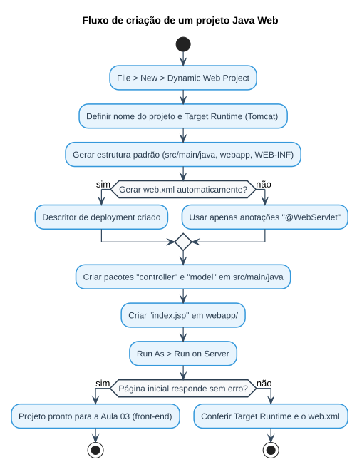

# Aula 02 — Criando um Projeto Web

> **Data de Postagem:** 23/02/2026
> **Professor:** Jefferson Passerini
> **Disciplina:** Laboratório de Programação III (3º Semestre)
> **Tema:** Criação e estruturação inicial de um projeto Java Web

## Objetivo da aula

Criar, a partir do ambiente preparado na Aula 01, o primeiro projeto Java Web (Dynamic Web Project) e compreender a estrutura de diretórios padrão exigida pela especificação Servlet/JSP, incluindo o papel do descritor de deployment (`web.xml`) e da pasta `webapp`/`WebContent`.

## Estrutura padrão de um projeto Java Web

```text
MeuProjetoWeb/
├── src/
│   └── main/
│       ├── java/
│       │   └── com/exemplo/controller/   (Servlets)
│       │   └── com/exemplo/model/        (Classes de Domínio / DAO)
│       └── webapp/
│           ├── WEB-INF/
│           │   └── web.xml
│           ├── index.jsp
│           └── listar.jsp
└── pom.xml (ou configuração de dependências, se Maven)
```

- **`src/main/java`** — concentra o código-fonte Java: os *Servlets* (camada Controller) e as classes de domínio/DAO (Model), organizados em pacotes.
- **`webapp`** (ou `WebContent`, em projetos não-Maven) — concentra os recursos servidos diretamente ao navegador: páginas JSP, HTML, CSS, JavaScript.
- **`WEB-INF/web.xml`** — descritor de deployment. Declara metadados da aplicação e, em projetos que não usam anotações, o mapeamento entre URLs e Servlets.
- **`WEB-INF`** é uma pasta protegida: seu conteúdo nunca é servido diretamente pelo navegador, apenas acessado internamente pelo container — por isso é o local correto para configurações sensíveis.

## Por que essa separação importa

A separação entre `src/main/java` (lógica) e `webapp` (apresentação) é a base do padrão arquitetural MVC simplificado adotado ao longo da disciplina: o Servlet (Controller) processa a requisição e delega a renderização a uma página JSP (View), mantendo a lógica de negócio fora da camada de apresentação.

## Fluxo de criação do projeto



## Passo a passo (IDE)

1. **Novo Projeto:** `File → New → Dynamic Web Project` (Eclipse) ou o equivalente Maven Webapp (IntelliJ).
2. **Definir o Target Runtime:** associar o projeto à instância do Apache Tomcat configurada na Aula 01.
3. **Gerar o `web.xml`:** marcar a opção de gerar o descritor de deployment durante a criação (necessário nas versões antigas da especificação Servlet; opcional quando se usa `@WebServlet`).
4. **Criar a página inicial:** adicionar um `index.jsp` simples em `webapp/` para validar o deploy.
5. **Publicar no servidor:** `Run As → Run on Server`, apontando para o Tomcat, e confirmar que a página é exibida no navegador.

## Exercícios de fixação

1. Crie um novo projeto Java Web vazio e associe-o ao Tomcat configurado na Aula 01.
2. Explique a diferença de propósito entre a pasta `src/main/java` e a pasta `webapp`.
3. Por que o conteúdo de `WEB-INF` não pode ser acessado diretamente por uma URL do navegador?
4. Crie um `index.jsp` com um texto estático e publique o projeto, confirmando a URL de acesso.

<details>
<summary>Gabarito (questão 3)</summary>

`WEB-INF` é reservado pela especificação Servlet como uma pasta de configuração/interna: o container Web (Tomcat) bloqueia deliberadamente o acesso HTTP direto a qualquer arquivo dentro dela. Isso garante que arquivos como `web.xml`, classes compiladas e bibliotecas não fiquem expostos publicamente — o acesso a esses recursos só ocorre de forma indireta, através de um Servlet ou de um `RequestDispatcher` interno da aplicação.

</details>

## Perguntas de revisão

- Qual a função do arquivo `web.xml`?
- O que diferencia a pasta `webapp` da pasta `src/main/java`?
- Por que a separação entre lógica (Java) e apresentação (JSP) facilita a manutenção do projeto?

## Material relacionado

- Links Úteis: [Java JSP - Cap 4 - Criando um projeto JavaWeb | Notion](https://spiffy-number-b06.notion.site/Java-JSP-Cap-4-Criando-um-projeto-JavaWeb-1b2393aeab2a807bb9a1e9a83567bb42?source=copy_link)
- [Aula 03 — Estrutura do Projeto - Front-end](../Aula%2003%20-%20Estrutura%20do%20Projeto%20-%20Front-end/detalhes.md) — continuação direta desta aula
- [Resumo executivo, simulado e cheatsheet da disciplina](../../README.md#resumo-executivo)
- Post original da aula: [`post-original.md`](./post-original.md)

> **Nota de fonte:** o passo a passo detalhado com capturas de tela do assistente de criação do projeto reside no Notion linkado acima. Este documento organiza, em torno da estrutura de pastas já documentada em `Resumos-IA/`, o conteúdo verificável localmente.
