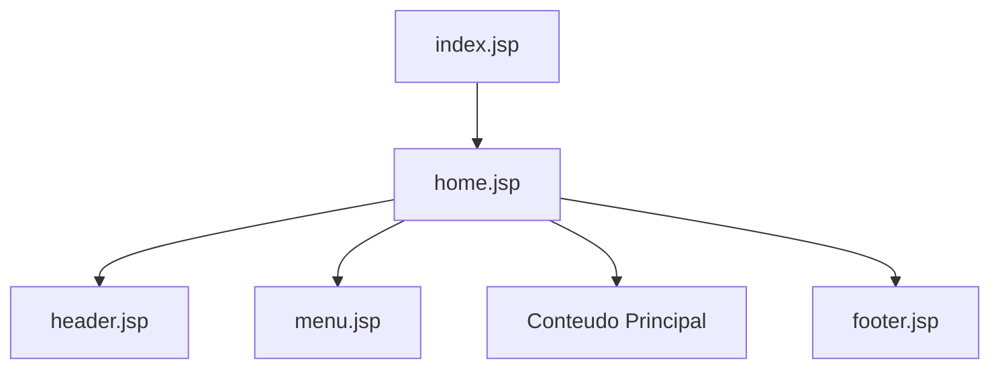
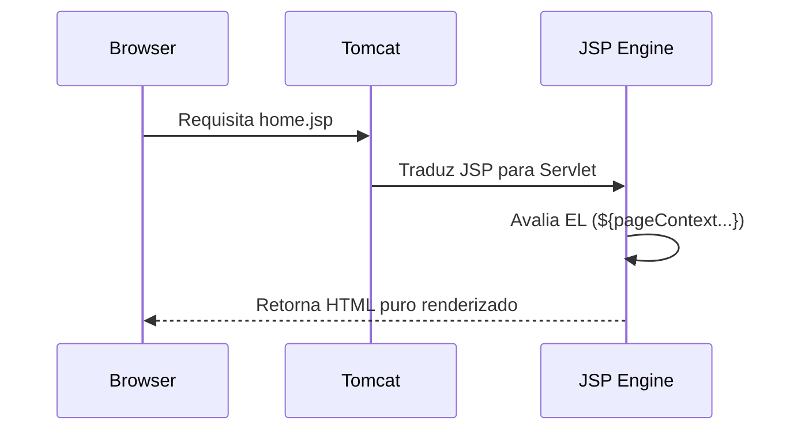
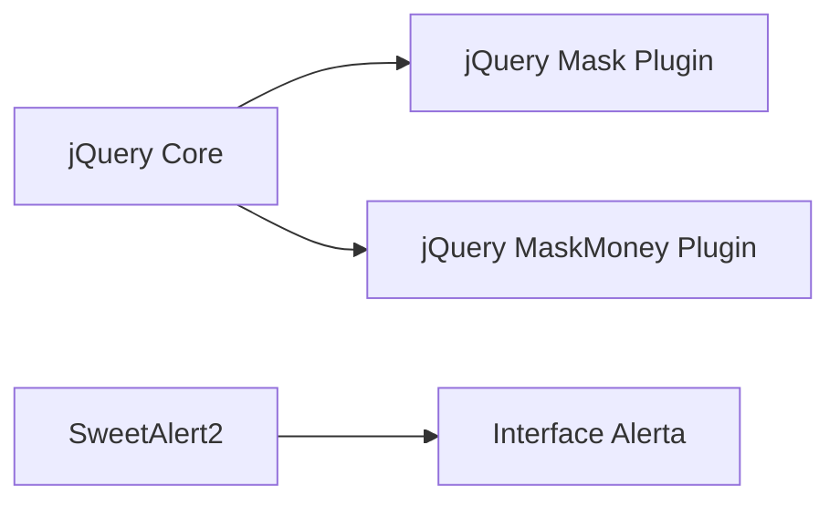
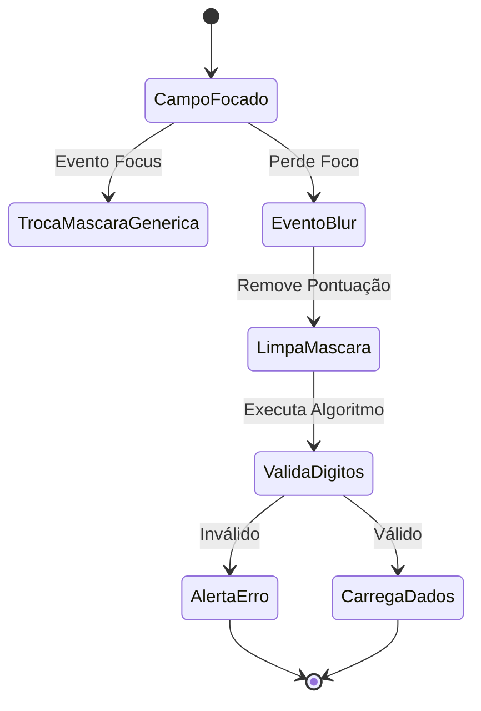
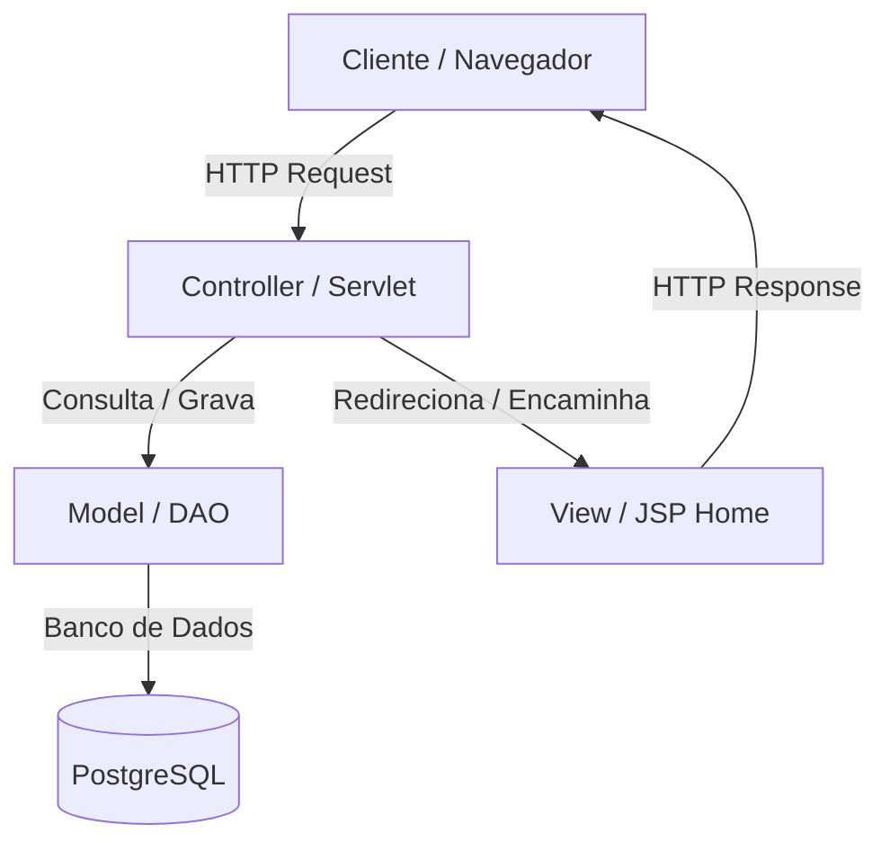
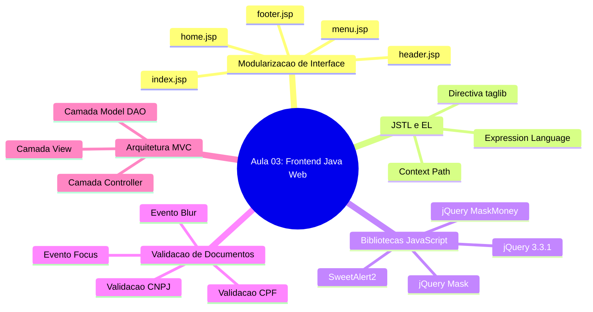

# Aula 02 — Estrutura de Projeto e Frontend em Java Web

> **Professor:** Jefferson Passerini
> **Disciplina:** Laboratório de Programação III (3º Semestre)
> **Tema:** Modularização de interfaces web com JSP, integração de bibliotecas JavaScript e validação de documentos

## Sumário
- [Objetivo da aula](#objetivo-da-aula)
- [Contexto e pré-requisitos](#contexto-e-pré-requisitos)
- [Modularizacao de interface web com JSP](#modularizacao-de-interface-web-com-jsp)
- [Uso de JSTL e Expression Language](#uso-de-jstl-e-expression-language)
- [Importacao de bibliotecas JavaScript](#importacao-de-bibliotecas-javascript)
- [Validacao e formatação de CPF e CNPJ via JavaScript](#validacao-e-formatação-de-cpf-e-cnpj-via-javascript)
- [Organizacao da estrutura MVC em projetos Java Web](#organizacao-da-estrutura-mvc-em-projetos-java-web)
- [Código da aula](#código-da-aula)
- [Exercícios](#exercícios)
- [Erros comuns e boas práticas](#erros-comuns-e-boas-práticas)
- [Links e materiais complementares](#links-e-materiais-complementares)
- [Mapa da aula](#mapa-da-aula)
- [Glossário](#glossário)
- [Pontos-chave para a prova](#pontos-chave-para-la-prova)
- [Perguntas e respostas (JSONL)](#perguntas-e-respostas-jsonl)
- [Checklist de revisão](#checklist-de-revisão)

---

## Objetivo da aula
Capacitar o aluno a estruturar e modularizar a camada de apresentação (View) em aplicações Java Web utilizando JavaServer Pages (JSP). O estudante aprenderá a organizar cabeçalhos, menus, rodapés e conteúdos principais de forma reutilizável, além de integrar plugins JavaScript essenciais (jQuery, máscaras de entrada, formatação monetária e alertas visuais) e implementar rotinas robustas de validação e formatação dinâmica de CPFs e CNPJs no lado do cliente.

---

## Contexto e pré-requisitos
No desenvolvimento de aplicações web corporativas baseadas na plataforma Java EE / Jakarta EE, a organização da interface gráfica é um fator crítico para a manutenibilidade do código. Tradicionalmente, páginas JSP monolíticas misturam lógica de layout repetitiva, gerando duplicação e alto custo de manutenção. 

Como pré-requisito, o estudante deve compreender:
- Conceitos básicos de HTML, CSS e JavaScript.
- Funcionamento do protocolo HTTP (requisição e resposta).
- Estrutura básica de projetos web no IDE NetBeans utilizando servidores de aplicação como o Apache Tomcat.
- Noções fundamentais de lógica de programação e sintaxe da linguagem JavaScript.

---

## Modularizacao de interface web com JSP

### Definição
A modularização de interface em JSP consiste na divisão de uma página web monolítica em fragmentos reutilizáveis (como cabeçalho, menu de navegação e rodapé) que são integrados dinamicamente em tempo de execução através da diretiva ou tag de inclusão `<jsp:include>`.

### Motivação
Em sistemas de grande porte, alterar o menu ou o cabeçalho de uma aplicação contendo dezenas de páginas seria impraticável se cada arquivo possuísse seu próprio código HTML estático repetido. A modularização centraliza esses blocos, permitindo que uma única alteração reflita em todo o sistema.

### Exemplo
```java
<%@page contentType="text/html" pageEncoding="iso-8859-1"%>
<jsp:include page="header.jsp"/>
<jsp:include page="menu.jsp"/>
<h1>Bem-vindo ao Sistema</h1>
<jsp:include page="footer.jsp"/>
```

### Contraexemplo
Misturar todo o código HTML do cabeçalho, menu, tabelas de dados e rodapé dentro de um único arquivo `index.jsp` de 2000 linhas. Qualquer modificação visual exige edição minuciosa e propensa a erros de tags não fechadas.

### Armadilhas
- **Inclusão Estática vs. Dinâmica:** Utilizar `@include file="..."` (inclusão estática no momento da tradução) quando o cenário exige comportamento dinâmico e processamento em tempo de requisição com `<jsp:include page="...">`.
- **Caminhos Relativos incorretos:** Inserir páginas de subpastas sem considerar o contexto raiz da aplicação web.



| Abordagem | Vantagens | Desvantagens |
| :--- | :--- | :--- |
| Monolítica (Arquivo único) | Simplicidade inicial | Duplicação extrema, manutenção custosa |
| Modularizada (`<jsp:include>`) | Reutilização, fácil manutenção | Maior número de arquivos gerenciados |

---

## Uso de JSTL e Expression Language

### Definição
A JSTL (*JavaServer Pages Standard Tag Library*) é uma coleção de tags reutilizáveis que encapsulam lógica comum de páginas JSP (iterações, condicionais, formatações). A *Expression Language* (EL), por sua vez, simplifica o acesso a dados contidos em escopos através da sintaxe `${expressao}`.

### Motivação
Evitar a utilização de blocos de scriptlets Java (`<% ... %>`) diretamente no código HTML, mantendo a página limpa, legível e seguindo o princípio de separação de responsabilidades.

### Exemplo
```java
<%@taglib prefix="c" uri="http://java.sun.com/jsp/jstl/core"%>
<a href="${pageContext.request.contextPath}/UsuarioListar">Usuário</a>
```

### Contraexemplo
```java
<%
    String contextPath = request.getContextPath();
%>
<a href="<%= contextPath %>/UsuarioListar">Usuário</a>
```
*(O uso de scriptlets polui o código da View com sintaxe Java pura).*

### Armadilhas
- Esquecer de declarar a diretiva `@taglib` no topo da página JSP, fazendo com que as tags sejam interpretadas como texto literal no navegador.
- Confundir o escopo das variáveis acessadas via EL (`requestScope`, `sessionScope`, `applicationScope`).



| Recurso | Sintaxe Antiga (Scriptlet) | Sintaxe Moderna (JSTL / EL) |
| :--- | :--- | :--- |
| Caminho Contexto | `<%= request.getContextPath() %>` | `${pageContext.request.contextPath}` |
| Condicional | `<% if(x) { %> ... <% } %>` | `<c:if test="${x}"> ... </c:if>` |

---

## Importacao de bibliotecas JavaScript

### Definição
A importação de bibliotecas JavaScript envolve a inclusão de arquivos de script externos (`.js`) e folhas de estilo CSS no cabeçalho (`<head>`) da página web para adicionar comportamentos dinâmicos, máscaras de campos, recursos avançados de tabelas e alertas interativos.

### Motivação
Não reinventar a roda. Utilizar ferramentas validadas pelo mercado (como jQuery, DataTables e SweetAlert2) acelera o desenvolvimento de interfaces ricas e padronizadas.

### Exemplo
```html
<script src="${pageContext.request.contextPath}/js/jquery-3.3.1.min.js"></script>
<script src="${pageContext.request.contextPath}/js/jquery.mask.min.js"></script>
<script src="https://cdn.jsdelivr.net/npm/sweetalert2@10.3.1/dist/sweetalert2.all.min.js"></script>
```

### Contraexemplo
Tentar escrever manualmente centenas de linhas de expressões regulares e manipulação de eventos de teclado em JavaScript puro para mascarar campos monetários ou CPFs, ignorando plugins maduros.

### Armadilhas
- **Ordem de Carregamento:** Importar plugins que dependem do jQuery (como `jquery.mask.min.js`) antes do próprio arquivo do jQuery (`jquery-3.3.1.min.js`), gerando erros de referência no console do navegador.



| Biblioteca | Propósito Principal | Origem |
| :--- | :--- | :--- |
| jQuery | Manipulação de DOM e AJAX | Local (`/js/`) |
| jQuery Mask | Aplicação de máscaras em inputs | Local (`/js/`) |
| SweetAlert2 | Exibição de modais de alerta modernos | CDN externa |

---

## Validacao e formatação de CPF e CNPJ via JavaScript

### Definição
Conjunto de rotinas implementadas em JavaScript que interceptam eventos de foco (`focus`) e perda de foco (`blur`) em campos de entrada de texto (`input`), aplicando máscaras dinâmicas de acordo com o tamanho do documento e validando os dígitos verificadores matemáticos de CPFs e CNPJs antes do envio ao servidor.

### Motivação
Garantir a consistência dos dados inseridos pelo usuário diretamente no navegador (*Client-Side Validation*), melhorando a experiência do usuário e reduzindo requisições inválidas ao servidor.

### Exemplo
```javascript
$('#cpfcnpjpessoa').blur(function(){
   var cpfCnpjLimpo = $('#cpfcnpjpessoa').unmask().val();
   if (!validarCpfCnpj(cpfCnpjLimpo)){
        Swal.fire({ icon: 'error', title: 'Verifique o CPF/CNPJ!' });
    } else {
       carregarPessoa(cpfCnpjLimpo);
       trocaMascaraCpfCnpj($('#cpfcnpjpessoa').val());
   }
});
```

### Contraexemplo
Validar documentos apenas no banco de dados, permitindo que o usuário digite qualquer sequência de caracteres inválida e descubra o erro apenas após submeter um formulário pesado.

### Armadilhas
- Tentar validar o documento utilizando o valor contendo caracteres especiais de máscara (pontos, traços e barras) sem realizar a limpeza prévia (`.unmask()` ou `.replace(/[^\d]+/g,'')`).



| Evento JS | Momento de Disparo | Ação no Sistema |
| :--- | :--- | :--- |
| `focus` | Quando o input ganha foco | Altera a máscara para formato livre/genérico |
| `blur` | Quando o input perde foco | Limpa máscara, valida dígitos e dispara busca |

---

## Organizacao da estrutura MVC em projetos Java Web

### Definição
A arquitetura MVC (*Model-View-Controller*) separa a aplicação em três camadas fundamentais: o **Model** (regras de negócio e acesso a dados via DAO), a **View** (páginas JSP e componentes visuais) e o **Controller** (Servlets que intermediam as requisições).

### Motivação
Organizar o código de forma coesa, desacoplando a interface visual da lógica de persistência e controle, facilitando testes unitários, manutenção e trabalho em equipe.

### Exemplo
No NetBeans, a estrutura distribui-se em pacotes como `br.com.aplcurso.controller`, `br.com.aplcurso.dao`, `br.com.aplcurso.model` e a pasta `Web Pages` contendo os JSPs modularizados.

### Contraexemplo
Escrever comandos SQL de conexão com o banco de dados PostgreSQL diretamente dentro de arquivos JSP misturados com código HTML.

### Armadilhas
- Violar o fluxo arquitetural fazendo com que páginas JSP chamem diretamente classes DAO de banco de dados, ignorando o Controller (Servlet).



| Camada | Responsabilidade | Tecnologias Envolvidas |
| :--- | :--- | :--- |
| View | Interface com o usuário | JSP, JSTL, HTML, CSS, JS |
| Controller | Intermediação de requisições | Servlets Java |
| Model | Regras de negócio e persistência | Classes Java, JDBC, PostgreSQL |

---

## Código da aula

### Arquivo: `./codigo/app.js`
Funções JavaScript responsáveis pelo gerenciamento de eventos de foco e desfoque em campos de CPF/CNPJ, aplicação de máscaras dinâmicas e validação matemática de documentos.
```javascript
//-------------TRATAMENTO CAMPO CPFCNPJPESSOA--------------------------
$(document).ready(function(){
    console.log('Ativo evento focus campo cpf');
    $('#cpfcnpjpessoa').focus(function(){
        trocaMascaraCpfCnpj("A");
    });
});

$(document).ready(function(){
    console.log('Ativo evento blur campo cpf');
    $('#cpfcnpjpessoa').blur(function(){
       var cpfCnpjLimpo = $('#cpfcnpjpessoa').unmask().val();
       if (!validarCpfCnpj(cpfCnpjLimpo)){
            Swal.fire({
                position: 'center',
                icon: 'error',
                title: 'Verifique o CPF/CNPJ!',
                showConfirmButton: true,
                timer: 10000
            });
        }else{
           carregarPessoa($('#cpfcnpjpessoa').unmask().val());
           trocaMascaraCpfCnpj($('#cpfcnpjpessoa').val());
       }
    });
});

function trocaMascaraCpfCnpj(cpfCnpj) {
    if (cpfCnpj !== "A") {
        var masks = ['999.999.999-99', '99.999.999/9999-99'];
        var cpfcnpj = $('#cpfcnpjpessoa').unmask().val();
        mask = (cpfcnpj.length > 11) ? masks[1] : masks[0];
        $('#cpfcnpjpessoa').mask(mask);
    } else {
       $('#cpfcnpjpessoa').unmask();
    }
};

function validarCpfCnpj(cpfCnpj){
    if(cpfCnpj.length === 14){
        return cnpjValidation(cpfCnpj);
    } else {
        return validarCPF(cpfCnpj);
    }
}

function validarCPF(cpf) {	
	cpf = cpf.replace(/[^\d]+/g,'');	
	if(cpf === '' || cpf.length !== 11) return false;	
	if (cpf === "00000000000" || cpf === "11111111111") return false;		
	var add = 0;	
	for (var i=0; i < 9; i ++)		
		add += parseInt(cpf.charAt(i)) * (10 - i);	
	var rev = 11 - (add % 11);	
	if (rev === 10 || rev === 11) rev = 0;	
	if (rev !== parseInt(cpf.charAt(9))) return false;		
	add = 0;	
	for (var i = 0; i < 10; i ++)		
		add += parseInt(cpf.charAt(i)) * (11 - i);	
	rev = 11 - (add % 11);	
	if (rev === 10 || rev === 11) rev = 0;	
	if (rev !== parseInt(cpf.charAt(10))) return false;		
	return true;   
}

function cnpjValidation(value) {
    if (!value) return false;
    const match = value.toString().match(/\d/g);
    const numbers = Array.isArray(match) ? match.map(Number) : [];
    if (numbers.length !== 14) return false;
    const items = [...new Set(numbers)];
    if (items.length === 1) return false;
    return true;
}
```

### Arquivo: `./codigo/header.jsp`
Cabeçalho padrão contendo a importação de todas as bibliotecas JavaScript e folhas de estilo CSS essenciais.
```java
<%@page contentType="text/html" pageEncoding="iso-8859-1"%>
<!DOCTYPE html>
<html>
    <head>
        <meta http-equiv="Content-Type" content="text/html; charset=iso-8859-1">
        <title>JSP Page</title>
        <!-- JQuery -->
        <script src="${pageContext.request.contextPath}/js/jquery-3.3.1.min.js"></script>
        <script src="${pageContext.request.contextPath}/js/jquery.mask.min.js"></script>
        <script src="${pageContext.request.contextPath}/js/jquery.maskMoney.min.js"></script>
        <!-- Biblioteca JavaScript customizada -->
        <script src="${pageContext.request.contextPath}/js/app.js" type="text/javascript"></script>
        <!-- Bootstrap -->
        <link rel="stylesheet" href="https://stackpath.bootstrapcdn.com/bootstrap/4.3.1/css/bootstrap.min.css">
        <!-- SweetAlert2 -->
        <script src="https://cdn.jsdelivr.net/npm/sweetalert2@10.3.1/dist/sweetalert2.all.min.js" type="text/javascript"></script>
    </head>
    <body>
```

### Arquivo: `./codigo/menu.jsp`
Menu principal de navegação da aplicação utilizando Expression Language para apontar para a raiz do projeto.
```java
<h1>Módulo Cadastros</h1>
<hr>
    <center>
        <h2>Menu Principal</h2>
        <a href="${pageContext.request.contextPath}/UsuarioListar">Usuário</a>
    </center>
<hr>
```

### Arquivo: `./codigo/footer.jsp`
Rodapé padrão que encerra as tags abertas no cabeçalho.
```java
        <hr>
        <p>Desenvolvendo Aplicações com Java Web</p>
    </body>
</html>
```

### Arquivo: `./codigo/home.jsp`
Página principal que integra os componentes modulares da interface através da tag `<jsp:include>`.
```java
<%@taglib prefix="c" uri="http://java.sun.com/jsp/jstl/core" %>
<%@taglib prefix="fmt" uri="http://java.sun.com/jsp/jstl/fmt" %>
<%@page contentType="text/html" pageEncoding="iso-8859-1"%>
<jsp:include page="header.jsp"/>
<jsp:include page="menu.jsp"/>
        <h1>Sistema Exemplo - CRUD</h1>
<jsp:include page="footer.jsp"/>
```

---

## Exercícios

### Exercício 1: Modularização de Barra Lateral (Sidebar)
- **Enunciado:** Crie um novo componente JSP chamado `sidebar.jsp` para representar um menu lateral fixo na aplicação web. Em seguida, inclua este componente no arquivo `home.jsp` logo abaixo do cabeçalho e acima do conteúdo principal, utilizando a tag `<jsp:include>`.
- **Raciocínio:** O processo segue exatamente o mesmo padrão de criação de arquivos JSP já vistos (`header.jsp` e `menu.jsp`). Cria-se o arquivo sem extensão na pasta `Web Pages`, define-se a marcação HTML estrutural da barra lateral e utiliza-se a diretiva de inclusão dinâmica no arquivo `home.jsp`.
- **Resolução Completa:**
  1. Clique com o botão direito em `Web Pages` -> `New` -> `JSP...`.
  2. Nomeie como `sidebar` e finalize.
  3. Substitua o conteúdo gerado pelo seguinte código:
```java
<div class="sidebar" style="float: left; width: 200px; background: #f8f9fa; padding: 15px;">
    <h3>Navegação</h3>
    <ul>
        <li><a href="${pageContext.request.contextPath}/home.jsp">Home</a></li>
        <li><a href="${pageContext.request.contextPath}/UsuarioListar">Usuários</a></li>
    </ul>
</div>
```
  4. No arquivo `home.jsp`, adicione a linha `<jsp:include page="sidebar.jsp"/>`.

### Exercício 2: Aplicação de Máscara Monetária
- **Enunciado:** Configure um campo de entrada de texto (`<input type="text" id="valorcurso">`) em uma página JSP para utilizar o plugin `maskMoney`, garantindo que valores financeiros aceitem centavos, exibam o símbolo de moeda `R$ ` e permitam apenas números válidos.
- **Raciocínio:** Como o plugin `maskMoney` já foi importado no `header.jsp`, basta inicializar o plugin via jQuery no evento `$(document).ready` dentro do arquivo `app.js` ou em um bloco script na página.
- **Resolução Completa:**
  No arquivo `app.js`, adicione o seguinte trecho de inicialização:
```javascript
$(document).ready(function(){
    $('#valorcurso').maskMoney({
        prefix: 'R$ ',
        allowNegative: false,
        thousands: '.',
        decimal: ',',
        precision: 2
    });
});
```

### Exercício 3: Dinâmica de Máscara CPF e CNPJ
- **Enunciado:** Implemente a função `trocaMascaraCpfCnpj` no arquivo `app.js` para alternar dinamicamente entre a máscara de CPF (`999.999.999-99`) e CNPJ (`99.999.999/9999-99`) com base estritamente no tamanho do texto digitado pelo usuário (mais de 11 dígitos aplica CNPJ, caso contrário aplica CPF).
- **Raciocínio:** A função verifica o comprimento do valor limpo (sem máscara). Se o tamanho exceder 11 caracteres, seleciona o padrão de índice 1 (`99.999.999/9999-99`), caso contrário seleciona o índice 0 (`999.999.999-99`).
- **Resolução Completa:** (Já contemplada no código fonte `app.js` fornecido na aula, onde a verificação `mask = (cpfcnpj.length>11) ? masks[1] : masks[0];` executa exatamente esta lógica).

---

## Erros comuns e boas práticas

### Erros Comuns
- **Esquecer de importar o jQuery:** Chamar funções como `$(document).ready` ou métodos de plugins sem que a biblioteca jQuery esteja carregada na página, gerando o erro `Uncaught ReferenceError: $ is not defined`.
- **Caminhos absolutos incorretos:** Inserir URLs estáticas hardcoded (ex: `/AplCurso2/js/app.js`) que quebram ao alterar o nome do contexto do projeto no servidor. Sempre prefira `${pageContext.request.contextPath}`.
- **Misturar lógica de banco de dados no JSP:** Escrever consultas SQL diretamente dentro de arquivos JSP.

### Boas Práticas
- Sempre modularizar a interface em cabeçalho, menu, rodapé e conteúdos específicos.
- Utilizar arquivos JavaScript externos (`app.js`) em vez de scripts embutidos nas páginas JSP.
- Realizar validações tanto no lado do cliente (via JavaScript) quanto no lado do servidor (via Servlets/Java) para garantir segurança e integridade.

---

## Links e materiais complementares
- [Notion da Disciplina (Cap 4.4)](https://spiffy-number-b06.notion.site/Java-JSP-Cap-4-4-Estruturando-a-Interface-do-Projeto-1b2393aeab2a80a8a7cdc8e23c79aa90?pvs=74) — Material oficial de apoio sobre estruturação da interface em Java Web.
- [Documentação Oficial do jQuery](https://api.jquery.com/) — Guia completo sobre manipulação de DOM e seletores.
- [Plugin jQuery Mask (GitHub)](https://github.com/igorescobar/jQuery-Mask-Plugin) — Referência de uso para máscaras de inputs.
- [SweetAlert2](https://sweetalert2.github.io/) — Documentação para criação de caixas de diálogo elegantes.

---

## Mapa da aula



---

## Glossário

| Termo | Definição |
| :--- | :--- |
| **JSP** | *JavaServer Pages*, tecnologia que permite gerar páginas web dinâmicas incorporando código Java em arquivos HTML. |
| **JSTL** | Biblioteca padrão de tags JSP que fornece suporte a tarefas comuns como iterações e condicionais sem uso de Java puro. |
| **Expression Language (EL)** | Linguagem de expressão do JSP que facilita o acesso a dados de escopo através da sintaxe `${...}`. |
| **jQuery** | Biblioteca JavaScript rápida e concisa que simplifica a manipulação de documentos HTML, tratamento de eventos e requisições AJAX. |
| **Plugin** | Extensão de software que adiciona funcionalidades específicas a um programa maior, como a máscara de inputs em jQuery. |
| **MVC** | Padrão arquitetural que divide a aplicação em Model (dados/regras), View (interface) e Controller (controle de fluxo). |
| **Servlet** | Classe Java executada em um servidor web que processa requisições HTTP e gera respostas dinâmicas. |

---

## Pontos-chave para a prova
1. O papel da Expression Language `${pageContext.request.contextPath}` na localização correta de recursos a partir da raiz do projeto.
2. A diferença entre inclusão dinâmica (`<jsp:include>`) e inclusão estática em páginas JSP.
3. A importância da ordem correta de importação de scripts JavaScript no cabeçalho (`header.jsp`).
4. O funcionamento dos eventos `focus` e `blur` no tratamento de campos de formulário e máscaras dinâmicas.
5. A separação de responsabilidades promovida pelo padrão MVC em aplicações Java Web.

---

## Perguntas e respostas (JSONL)

```jsonl
{"pergunta": "Qual tag JSP é utilizada para incluir dinamicamente arquivos como o header.jsp e menu.jsp?", "resposta": "A tag <jsp:include page=\"...\">.", "dificuldade": "fácil"}
{"pergunta": "Qual é a função da Expression Language ${pageContext.request.contextPath}?", "resposta": "Posicionar a chamada ao recurso a partir da raiz do projeto web de forma dinâmica.", "dificuldade": "fácil"}
{"pergunta": "Em qual diretório da estrutura do NetBeans devem ser armazenados os arquivos JavaScript da aplicação?", "resposta": "Na pasta 'js' localizada dentro de 'Web Pages'.", "dificuldade": "fácil"}
{"pergunta": "Qual biblioteca JavaScript é utilizada para exibir alertas modernos e estilizados na tela?", "resposta": "SweetAlert2.", "dificuldade": "fácil"}
{"pergunta": "Qual evento jQuery é disparado quando um campo de entrada perde o foco?", "resposta": "O evento blur.", "dificuldade": "médio"}
{"pergunta": "Qual é a principal motivação para modularizar uma interface web com JSP?", "resposta": "Evitar duplicação de código HTML e facilitar a manutenção centralizada de cabeçalhos, menus e rodapés.", "dificuldade": "médio"}
{"pergunta": "Por que o plugin jQuery Mask deve ser importado após a biblioteca jQuery Core?", "resposta": "Porque o plugin depende das funções e do objeto global disponibilizados pelo jQuery Core.", "dificuldade": "médio"}
{"pergunta": "Qual o objetivo de utilizar o método .unmask() antes de validar um CPF ou CNPJ?", "resposta": "Remover os caracteres especiais de formatação (pontos, traços e barras) para validar apenas os dígitos numéricos puros.", "dificuldade": "médio"}
{"pergunta": "O que significa a sigla MVC no contexto de desenvolvimento de sistemas?", "resposta": "Model-View-Controller (Modelo-Visão-Controle).", "dificuldade": "fácil"}
{"pergunta": "Qual biblioteca JSTL é importada com o prefixo 'fmt'?", "resposta": "A biblioteca de formatação para manipulação de números, datas e moedas.", "dificuldade": "médio"}
{"pergunta": "Onde fica situado o arquivo index.jsp padrão em um projeto web gerenciado pelo NetBeans?", "resposta": "Na raiz da pasta 'Web Pages'.", "dificuldade": "fácil"}
{"pergunta": "Qual é o comportamento da função trocaMascaraCpfCnpj quando o tamanho do texto excede 11 dígitos?", "resposta": "A máscara é alterada para o formato de CNPJ (99.999.999/9999-99).", "dificuldade": "médio"}
{"pergunta": "Qual é a função da camada Controller em uma arquitetura MVC baseada em Java Web?", "resposta": "Intermediar as requisições HTTP enviadas pelo cliente, acionar o Model e direcionar a resposta para a View.", "dificuldade": "difícil"}
{"pergunta": "Qual codificação de caracteres é comumente configurada nas páginas JSP da aplicação descrita?", "resposta": "iso-8859-1.", "dificuldade": "fácil"}
{"pergunta": "O que ocorre se esquecermos de declarar a diretiva @taglib para JSTL no topo de uma página JSP?", "resposta": "As tags JSTL não serão interpretadas pelo servidor e aparecerão como texto literal no navegador.", "dificuldade": "médio"}
```

---

## Checklist de revisão
- [ ] Compreendi o conceito de modularização de interface com JSP e `<jsp:include>`.
- [ ] Sei utilizar a Expression Language para referenciar o contexto da aplicação web.
- [ ] Importei corretamente as bibliotecas jQuery, Mask, MaskMoney e SweetAlert2 no `header.jsp`.
- [ ] Implementei e compreendi os eventos `focus` e `blur` no tratamento de CPFs e CNPJs.
- [ ] Entendi a divisão de responsabilidades da arquitetura MVC em projetos Java Web.
- [ ] Executei e validei a aplicação rodando no servidor Apache Tomcat através do NetBeans.
