# Aula 02 — Estruturação da Interface Frontend com JSP

> **Professor:** Jefferson Passerini
> **Disciplina:** Laboratório de Programação III (3º Semestre)
> **Tema:** Modularização da camada View em Java Web com JSP, JSTL, jQuery e validação dinâmica de formulários no cliente

---

## Sumário

- [Objetivo da aula](#objetivo-da-aula)
- [Contexto e pré-requisitos](#contexto-e-pré-requisitos)
- [Modularização da interface gráfica com JavaServer Pages (JSP)](#modularização-da-interface-gráfica-com-javaserver-pages-jsp)
- [Diretiva taglib e importação da biblioteca JSTL Core e Formatting](#diretiva-taglib-e-importação-da-biblioteca-jstl-core-e-formatting)
- [Inclusão dinâmica de fragmentos de página via jsp:include](#inclusão-dinâmica-de-fragmentos-de-página-via-jspinclude)
- [Configuração de cabeçalho compartilhado (header.jsp) e metadados HTML](#configuração-de-cabeçalho-compartilhado-headerjsp-e-metadados-html)
- [Importação e integração de bibliotecas externas (jQuery, Bootstrap, DataTables, SweetAlert2)](#importação-e-integração-de-bibliotecas-externas-jquery-bootstrap-datatables-sweetalert2)
- [Uso dos plugins jQuery Mask e jQuery MaskMoney para controle de entrada de dados](#uso-dos-plugins-jquery-mask-e-jquery-maskmoney-para-controle-de-entrada-de-dados)
- [Estruturação de menu de navegação (menu.jsp) e Expression Language (EL) para rotas de contexto](#estruturação-de-menu-de-navegação-menujsp-e-expression-language-el-para-rotas-de-contexto)
- [Construção de rodapé padronizado (footer.jsp) e fechamento de estrutura DOM](#construção-de-rodapé-padronizado-footerjsp-e-fechamento-de-estrutura-dom)
- [Composição da página inicial (home.jsp) e fluxo de roteamento a partir de index.jsp](#composição-da-página-inicial-homejsp-e-fluxo-de-roteamento-a-partir-de-indexjsp)
- [Validação algorítmica de CPF e CNPJ no cliente e alternância dinâmica de máscaras em app.js](#validação-algorítmica-de-cpf-e-cnpj-no-cliente-e-alternância-dinâmica-de-máscaras-em-appjs)
- [Código da aula](#código-da-aula)
- [Exercícios](#exercícios)
- [Erros comuns e boas práticas](#erros-comuns-e-boas-práticas)
- [Links e materiais complementares](#links-e-materiais-complementares)
- [Mapa da aula](#mapa-da-aula)
- [Glossário](#glossário)
- [Pontos-chave para a prova](#pontos-chave-para-a-prova)
- [Perguntas e respostas (JSONL)](#perguntas-e-respostas-jsonl)
- [Checklist de revisão](#checklist-de-revisão)

---

## Objetivo da aula

- Compreender a necessidade arquitetural de modularização da camada View em aplicações corporativas desenvolvidas sobre a plataforma Java Enterprise Edition (Java EE / Jakarta EE).
- Dominar o uso da ação dinâmica `<jsp:include>` para divisão de interfaces web em fragmentos reutilizáveis (cabeçalho, navegação, conteúdo específico e rodapé).
- Configurar e utilizar a biblioteca padrão JSTL (*JavaServer Pages Standard Tag Library*), especificamente as bibliotecas Core (`c`) e Formatting (`fmt`), substituindo práticas obsoletas de scriptlets Java embutidos.
- Aplicar Expression Language (EL) `${pageContext.request.contextPath}` para resolução dinâmica e absoluta de caminhos no servidor, evitando quebras de rotas e dependência de caminhos relativos frágeis.
- Estruturar a árvore de ativos estáticos da aplicação na pasta `Web Pages/js/`, integrando bibliotecas essenciais: jQuery 3.3.1, jQuery Mask, jQuery MaskMoney, Bootstrap 4.3.1, DataTables e SweetAlert2.
- Implementar regras avançadas de manipulação de Document Object Model (DOM) em JavaScript puro e jQuery, abrangendo alternância dinâmica de máscaras (CPF vs. CNPJ) com base no comprimento de entrada e no foco do campo (`focus` e `blur`).
- Compreender e implementar no cliente os algoritmos matemáticos oficiais da Receita Federal do Brasil para validação de Dígitos Verificadores (DV) de CPF (11 dígitos) e CNPJ (14 dígitos) baseados na técnica de Módulo 11 com pesos ponderados.

---

## Contexto e pré-requisitos

No padrão arquitetural MVC (*Model-View-Controller*), a camada **View** tem a responsabilidade estrita de apresentar os dados ao usuário e capturar as interações de entrada, sem conter lógica de negócio ou acesso direto à persistência. Em um projeto Java Web clássico executado sobre contêineres de servlets como Apache Tomcat ou Apache TomEE:

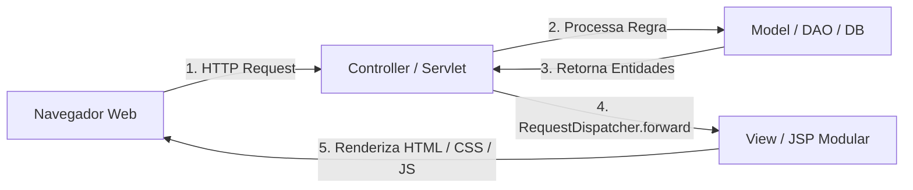

### Pré-requisitos conceituais
1. **Estrutura de Aplicação Web Java**: Conhecimento do diretório `Web Pages` (ou `src/main/webapp`), contendo os subdiretórios reservados `WEB-INF` (protegido contra acesso direto via URL) e `META-INF`.
2. **Ciclo de Vida do JSP**: Compreensão de que arquivos `.jsp` são traduzidos em código-fonte Java (`Servlet`) pelo contêiner no primeiro acesso, compilados em bytecode `.class` e executados na JVM do servidor para gerar HTML puro entregue ao navegador.
3. **Fundamentos de DOM e Eventos JavaScript**: Entendimento de eventos como `document.ready`, `focus`, `blur` e manipulação de seletores via jQuery (`$`).

---

## Modularização da interface gráfica com JavaServer Pages (JSP)

### Definição e motivação arquitetural

A construção de sistemas corporativos requer consistência visual e manutenibilidade. Em uma aplicação comercial, dezenas ou centenas de telas compartilham a mesma identidade visual, os mesmos menus suspensos, os mesmos cabeçalhos com carregamento de folhas de estilo e os mesmos rodapés com informações de copyright e encerramento de conexões DOM.

Se cada página JSP contivesse sua própria declaração `<!DOCTYPE html>`, `<head>`, `<link rel="stylesheet">`, `<script>` e estrutura de menus, qualquer alteração (por exemplo, atualizar a versão de uma biblioteca CSS ou adicionar uma nova opção de navegação) exigiria a edição manual de todos os arquivos do sistema. Essa abordagem gera:
- **Violação do princípio DRY (*Don't Repeat Yourself*)**: Redundância maciça de código HTML estático.
- **Alto risco de divergência**: Páginas com versões diferentes de scripts ou folhas de estilo incompatíveis.
- **Dificuldade de manutenção**: Correções de layout demandam esforço proporcional à quantidade de telas.

A solução arquitetural consiste na **decomposição em fragmentos de tela**, onde cada responsabilidade visual é isolada em um arquivo JSP dedicado e reunida em tempo de execução.

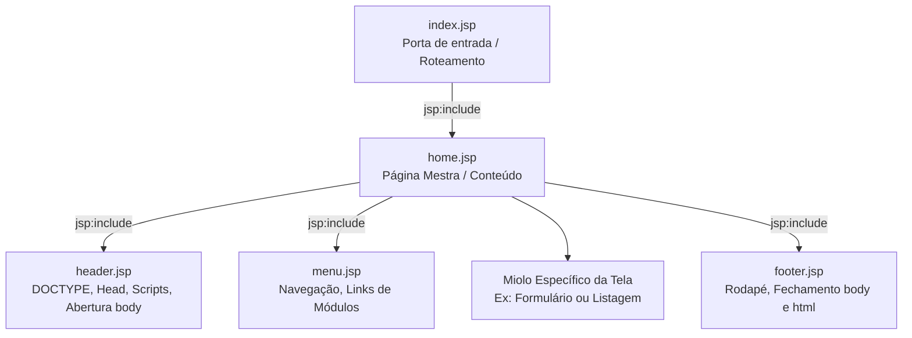

### Comparativo: Monólito JSP versus Arquitetura Modular

| Critério | Monólito JSP (Anti-pattern) | Arquitetura Modular em Fragmentos |
| :--- | :--- | :--- |
| **Reaproveitamento de Código** | Nulo; repete `<head>` e scripts em todos os arquivos. | Máximo; `header.jsp`, `menu.jsp` e `footer.jsp` centralizados. |
| **Manutenção de Bibliotecas** | Alterar links de CDN em dezenas de arquivos JSP. | Alterar unicamente no arquivo `header.jsp`. |
| **Integridade de Fechamento DOM** | Cada arquivo gerencia o fechamento de suas tags. | `header.jsp` abre `<html><body>` e `footer.jsp` fecha. |
| **Complexidade Inicial** | Baixa para uma única página de teste. | Requer planejamento de fragmentação e caminhos de inclusão. |
| **Escalabilidade do Sistema** | Péssima; manutenções quebram a interface. | Alta; novas telas apenas injetam seu miolo entre o header e o footer. |

---

## Diretiva taglib e importação da biblioteca JSTL Core e Formatting

### Fundamentos da JSTL

A JSTL (*JavaServer Pages Standard Tag Library*) foi criada para eliminar o uso de scriptlets (`<% ... %>`) e expressões Java cruas (`<%= ... %>`) dentro das páginas JSP. O uso de código Java no meio do HTML torna o código ilegível, acopla a camada de apresentação com tipos internos e viola as boas práticas de engenharia de software.

Para habilitar tags customizadas em uma página JSP, utiliza-se a diretiva `<%@taglib %>`.

```jsp
<%@taglib prefix="c" uri="http://java.sun.com/jsp/jstl/core" %>
<%@taglib prefix="fmt" uri="http://java.sun.com/jsp/jstl/fmt" %>
```

### Anatomia da Diretiva taglib
1. **`prefix`**: Define o namespace de prefixo utilizado para invocar as tags da biblioteca ao longo do documento. 
   - `c` é a convenção universal para a biblioteca **Core**.
   - `fmt` é a convenção para a biblioteca de **Internacionalização e Formatação**.
2. **`uri`**: Representa o identificador uniforme de recurso que o contêiner de servlets mapeia para o descritor de tags (*Tag Library Descriptor* - `.tld`) contido nas dependências da aplicação (`jstl-impl.jar` e `jstl-api.jar`).
   - Core: `http://java.sun.com/jsp/jstl/core`
   - Formatting: `http://java.sun.com/jsp/jstl/fmt`

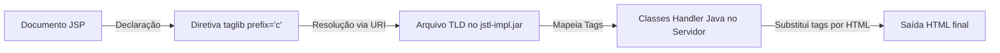

### Funcionalidades das Bibliotecas Core e Formatting
- **Core (`c`)**: Provê estruturas fundamentais de programação estruturada diretamente na marcação:
  - Condicionais: `<c:if>`, `<c:choose>`, `<c:when>`, `<c:otherwise>`.
  - Iteração: `<c:forEach>` (percorrer coleções como `List` ou arrays) e `<c:forTokens>`.
  - Manipulação de URLs e redirecionamentos: `<c:url>`, `<c:redirect>`.
  - Atribuição de variáveis de escopo: `<c:set>`, `<c:remove>`.
- **Formatting (`fmt`)**: Provê suporte à formatação sensível ao idioma (*Locale*) e fuso horário:
  - Formatação de valores numéricos e moedas: `<fmt:formatNumber type="currency" ...>`.
  - Formatação e parsing de datas: `<fmt:formatDate ...>` e `<fmt:parseDate ...>`.

---

## Inclusão dinâmica de fragmentos de página via jsp:include

### Mecanismo de Funcionamento do jsp:include

A ação padrão `<jsp:include page="..." />` realiza uma inclusão dinâmica no momento da requisição (*request-time*). Ao contrário da diretiva de inclusão estática `<%@include file="..." %>`, o `<jsp:include>` delega o processamento da página referenciada ao runtime do contêiner por meio da interface `RequestDispatcher.include()`.

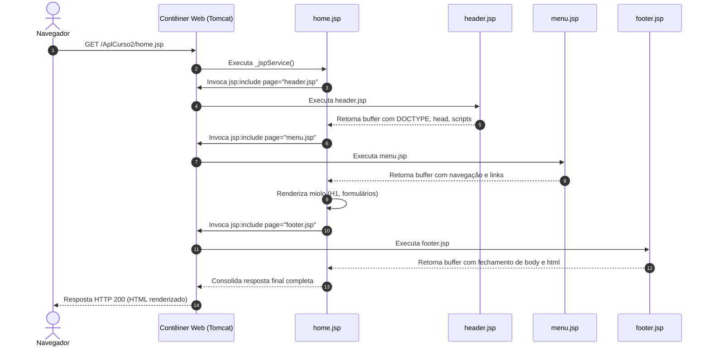

### Comparativo: Inclusão Dinâmica versus Inclusão Estática

| Característica | Ação `<jsp:include page="..." />` | Diretiva `<%@include file="..." %>` |
| :--- | :--- | :--- |
| **Momento de Execução** | Tempo de requisição (*Request-time*). | Tempo de tradução (*Translation-time*). |
| **Mecanismo Interno** | Executa `RequestDispatcher.include()`. O arquivo incluído é compilado como um servlet separado. | Funde o código-fonte do arquivo incluído no JSP mestre antes da compilação. |
| **Escopo de Variáveis** | As variáveis locais Java declaradas em um arquivo não são visíveis no outro. | Compartilha o mesmo escopo de variáveis Java locais do método `_jspService()`. |
| **Passagem de Parâmetros** | Permite passar parâmetros em tempo de execução via `<jsp:param>`. | Não permite parâmetros dinâmicos. |
| **Atualização em Disco** | Se o arquivo incluído for alterado, a modificação reflete imediatamente na próxima requisição. | Pode exigir recompilação forçada do JSP pai dependendo da configuração do servidor. |
| **Uso Recomendado** | **Recomendado para modularização de layouts e páginas dinâmicas.** | Usado para constantes ou declarações puramente estáticas de configuração. |

---

## Configuração de cabeçalho compartilhado (header.jsp) e metadados HTML

### Responsabilidade Estrutural do header.jsp

O arquivo `header.jsp` atua como o ponto de inicialização do documento HTML que será entregue ao cliente. Ele não é uma página completa, mas sim um **fragmento superior de página**. Sua responsabilidade abrange:
1. **Configuração de Resposta do Contêiner**: Definição do MIME-Type e da tabela de caracteres via `<%@page %>`.
2. **Declaração do Padrão do Documento**: Especificação do `<!DOCTYPE html>` para forçar os navegadores a operarem em modo padrão (*standards mode*).
3. **Metadados de Cabeçalho**: Configuração de charset para renderização correta de acentuação gráfica.
4. **Carregamento Ordenado de Dependências**: Importação das folhas de estilo (CSS) e dos motores de scripts (JavaScript).
5. **Abertura do Corpo do Documento**: Abertura da tag `<body>`.

### Análise Linha a Linha do Código do header.jsp

```jsp
<%@page contentType="text/html" pageEncoding="iso-8859-1"%>
<!DOCTYPE html>
<html>
 <head>
 <meta http-equiv="Content-Type" content="text/html; charset=iso-8859-1">
 <title>JSP Page</title>
 <!-- JQuery -->
 <script src="${pageContext.request.contextPath}/js/jquery-3.3.1.min.js"></script>
 <script src="${pageContext.request.contextPath}/js/jquery.mask.min.js"></script>
 <script src="${pageContext.request.contextPath}/js/jquery.maskMoney.min.js"></script>
 
 <!-- Importação da minha biblioteca de javascript -->
 <script src="${pageContext.request.contextPath}/js/app.js" type="text/javascript"></script>
 
 <!-- Bootstrap -->
 <link rel="stylesheet" href="https://stackpath.bootstrapcdn.com/bootstrap/4.3.1/css/bootstrap.min.css">
 <script src="https://cdnjs.cloudflare.com/ajax/libs/popper.js/1.14.7/umd/popper.min.js"></script>
 <script src="https://stackpath.bootstrapcdn.com/bootstrap/4.3.1/js/bootstrap.min.js"></script>
 
 <!-- Datatable -->
 <link rel="stylesheet" type="text/css" href="https://cdn.datatables.net/1.10.22/css/jquery.dataTables.min.css"/>
 <script src="https://cdn.datatables.net/1.10.22/js/jquery.dataTables.min.js" type="text/javascript"></script>
 
 <!-- Mensagem alerta -->
 <script src="https://cdn.jsdelivr.net/npm/sweetalert2@10.3.1/dist/sweetalert2.all.min.js" type="text/javascript"> 
 </script>
 </head>
 <body>
```

### Análise Detalhada dos Elementos

- **`<%@page contentType="text/html" pageEncoding="iso-8859-1"%>`**: Instrui o motor JSP a gerar o cabeçalho HTTP `Content-Type: text/html;charset=ISO-8859-1` e a interpretar os caracteres especiais do arquivo segundo a codificação ISO-8859-1 (Latin-1).
  *(Nota técnica de engenharia: Em projetos novos, o padrão internacional recomendado é `UTF-8`. Contudo, em conformidade estrita com o material da disciplina do Prof. Jefferson Passerini, mantém-se o padrão `iso-8859-1` adotado no projeto `AplCurso2`).*
- **`<meta http-equiv="Content-Type" content="text/html; charset=iso-8859-1">`**: Garante que navegadores legados interpretem o fluxo de bytes segundo a tabela Latin-1.
- **`${pageContext.request.contextPath}`**: Expression Language que injeta o nome da aplicação (ex: `/AplCurso2`). Evita o uso de caminhos relativos como `../../js/app.js`, que quebram quando uma servlet despacha a requisição a partir de uma URI profunda.
- **Abertura da Tag `<body>`**: O `header.jsp` deliberadamente **não fecha** o `<body>` nem o `<html>`. Essas tags permanecem abertas para que o conteúdo da página (`home.jsp`, listagens, formulários) seja inserido no fluxo contínuo do DOM, cabendo exclusivamente ao `footer.jsp` o fechamento formal.

---

## Importação e integração de bibliotecas externas (jQuery, Bootstrap, DataTables, SweetAlert2)

### Estratégia Híbrida: Arquivos Locais versus Redes de Entrega de Conteúdo (CDN)

A arquitetura do projeto `AplCurso2` implementa uma abordagem híbrida para carregamento de dependências de frontend:

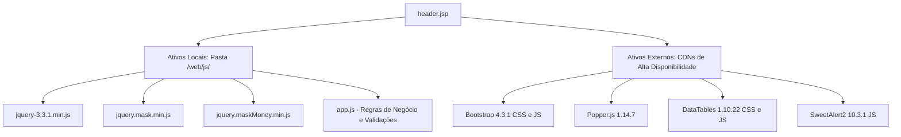

### Justificativa de Engenharia de Software
1. **Ativos Locais (`/web/js/`)**:
   - `jquery-3.3.1.min.js`, `jquery.mask.min.js`, `jquery.maskMoney.min.js` e `app.js`.
   - **Motivação**: Garantir a disponibilidade dos módulos essenciais de manipulação do DOM e regras de validação de documentos nacionais mesmo em ambientes corporativos fechados (intranets sem acesso externo à Internet). O arquivo `app.js` contém a regra customizada do sistema e deve residir localmente para permitir versionamento no repositório.
2. **Ativos em CDN**:
   - Bootstrap, Popper, DataTables e SweetAlert2.
   - **Motivação**: Aproveitar o cache compartilhado nos navegadores dos clientes, reduzir a carga de transferência no servidor Tomcat e acelerar a renderização inicial.

### Dependências e a Ordem Crítica de Carregamento

O carregamento de scripts no cabeçalho obedece a uma hierarquia rigorosa de dependências funcionais:

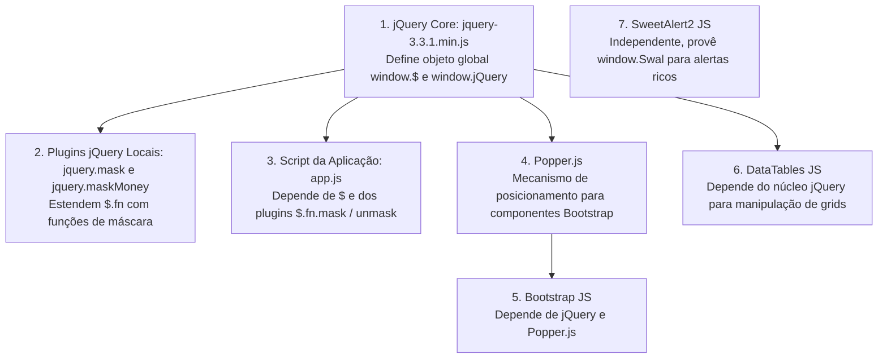

Se a ordem for violada (por exemplo, carregar `app.js` antes de `jquery-3.3.1.min.js`), o interpretador JavaScript do navegador lançará uma exceção crítica:
`Uncaught ReferenceError: $ is not defined`, paralisando toda a execução de scripts da página.

### Matriz de Bibliotecas Frontend Utilizadas

| Biblioteca | Versão | Origem | Papel no Sistema |
| :--- | :--- | :--- | :--- |
| **jQuery** | 3.3.1 | Local (`/js/`) | Núcleo de manipulação de DOM, escuta de eventos e abstração de requisições assíncronas. |
| **jQuery Mask** | 1.14.15 | Local (`/js/`) | Interceptação de digitação para imposição de formatação de padrões alfanuméricos (CPF, CNPJ, CEP). |
| **jQuery MaskMoney** | 3.1.1 | Local (`/js/`) | Formatação financeira internacionalizada para campos monetários com casas decimais. |
| **app.js** | Própria | Local (`/js/`) | Regras de negócio de frontend: alternância de máscaras, validações de CPF/CNPJ e integração com backend. |
| **Bootstrap** | 4.3.1 | CDN | Framework CSS/JS para responsividade, tipografia, sistema de grid e componentes de interface. |
| **Popper.js** | 1.14.7 | CDN | Biblioteca matemática de posicionamento de elementos flutuantes (*tooltips*, *popovers*, *dropdowns*). |
| **DataTables** | 1.10.22 | CDN | Transformação de tabelas HTML estáticas em componentes interativos com paginação, busca e ordenação. |
| **SweetAlert2** | 10.3.1 | CDN | Substituição dos diálogos nativos e bloqueantes do navegador (`alert`, `confirm`) por modais modernos e assíncronos. |

---

## Uso dos plugins jQuery Mask e jQuery MaskMoney para controle de entrada de dados

### O Plugin jQuery Mask (`jquery.mask.min.js`)

Desenvolvido por Igor Escobar, o plugin estende o protótipo do jQuery adicionando o método `$.fn.mask()`. Ele intercepta os eventos de teclado (`keydown`, `keypress`, `input`) para formatar o texto em tempo real de acordo com um padrão pré-estabelecido.

#### Tabela de Caracteres de Tradução Padrão
- `0`: Permite apenas dígitos numéricos de `0` a `9`.
- `9`: Dígito numérico opcional.
- `#`: Dígito numérico recursivo (usado para repetições indefinidas).
- `A`: Alfanumérico (letras maiúsculas/minúsculas e números).
- `S`: Caracteres puramente alfabéticos (`a-z`, `A-Z`).

#### Exemplos de Aplicação
```javascript
// Máscara estática para CPF
$('#cpf').mask('000.000.000-00');

// Máscara estática para CNPJ
$('#cnpj').mask('00.000.000/0000-00');

// Máscara para CEP
$('#cep').mask('00000-000');

// Máscara para Telefone Celular com nono dígito variável
var maskBehavior = function (val) {
  return val.replace(/\D/g, '').length === 11 ? '(00) 00000-0000' : '(00) 0000-00009';
};
var options = {
  onKeyPress: function(val, e, field, options) {
    field.mask(maskBehavior.apply({}, arguments), options);
  }
};
$('#telefone').mask(maskBehavior, options);
```

#### Métodos de Extração
- `$('#campo').val()`: Retorna o valor **formatado** (ex: `"123.456.789-00"`).
- `$('#campo').unmask().val()` ou `$('#campo').cleanVal()`: Remove a formatação e retorna apenas os caracteres literais digitados (ex: `"12345678900"`).

### O Plugin jQuery MaskMoney (`jquery.maskMoney.min.js`)

Desenvolvido por Diego Plentz, o plugin é especializado na manipulação de campos monetários em tempo real. A digitação em campos monetários exige comportamento reverso: os números digitados entram pela direita e empurram as casas decimais para a esquerda.

```javascript
$('#valorMonetario').maskMoney({
    prefix: 'R$ ',
    suffix: '',
    affixesStay: true,
    thousands: '.',
    decimal: ',',
    precision: 2,
    allowZero: true,
    allowNegative: false
});
```

#### Ciclo de Vida da Formatação Monetária

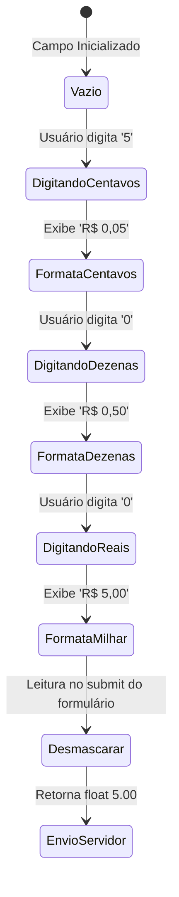

#### Extração do Valor Numérico
Para enviar o valor ao backend (banco de dados PostgreSQL em coluna `NUMERIC(10,2)` ou classe Java com `BigDecimal` / `Double`), não se deve enviar a string formatada `"R$ 1.500,50"`. Utiliza-se:
```javascript
// Obtém o float nativo correspondente (ex: 1500.50)
var valorNumerico = $('#valorMonetario').maskMoney('unmasked')[0];
```

---

## Estruturação de menu de navegação (menu.jsp) e Expression Language (EL) para rotas de contexto

### Resolução Dinâmica com Expression Language

Em aplicações corporativas executadas em contêineres de servlets, a aplicação pode ser implantada sob diferentes contextos de raiz:
- Em ambiente de desenvolvimento: `http://localhost:8080/AplCurso2/`
- Em ambiente de homologação: `http://homolog.unifef.edu.br/sistema_teste/`
- Em ambiente de produção: `http://sistema.unifef.edu.br/` (contexto raiz `/`)

Se o desenvolvedor fixar caminhos absolutos no código HTML (ex: `<a href="/AplCurso2/UsuarioListar">`), a aplicação falhará instantaneamente se for implantada sob outro nome de contexto ou na raiz. Se utilizar caminhos relativos (ex: `<a href="UsuarioListar">`), o link funcionará na home, mas quebrará se for clicado a partir de uma URL secundária profunda (como `/modulo/usuario/detalhes`).

A solução arquitetural definitiva da plataforma Java Web é o uso da **Expression Language (EL)**:
```jsp
${pageContext.request.contextPath}
```
Essa expressão consulta dinamicamente o método `HttpServletRequest.getContextPath()` do objeto implícito `request`, retornando a raiz exata onde o artefato `.war` está operando.

### Código do menu.jsp Analisado

```jsp
<h1>Módulo Cadastros</h1>
<hr>
 <center>
 <h2>Menu Principal</h2>
 <a href="${pageContext.request.contextPath}/UsuarioListar">Usuário</a>
 </center>
<hr>
```


### Análise Comparativa de Estratégias de Navegação

| Sintaxe do Link | Exemplo | Comportamento em `/home.jsp` | Comportamento em `/admin/usuarios.jsp` | Veredito Técnico |
| :--- | :--- | :--- | :--- | :--- |
| **Relativo Puro** | `href="UsuarioListar"` | Redireciona para `/AplCurso2/UsuarioListar` (OK). | Redireciona para `/AplCurso2/admin/UsuarioListar` (Erro 404). | **Incorreto / Frágil** |
| **Absoluto Estático** | `href="/AplCurso2/UsuarioListar"` | Redireciona para `/AplCurso2/UsuarioListar` (OK). | Redireciona para `/AplCurso2/UsuarioListar` (OK). Quebra se o projeto mudar de nome. | **Incorreto / Inflexível** |
| **Dinâmico com EL** | `href="${pageContext.request.contextPath}/UsuarioListar"` | Resolve `/AplCurso2/UsuarioListar` (OK). | Resolve `/AplCurso2/UsuarioListar` (OK). Adapta-se a qualquer contexto. | **Padrão Oficial Recomendado** |

---

## Construção de rodapé padronizado (footer.jsp) e fechamento de estrutura DOM

### A Importância do Fechamento Simétrico

O arquivo `footer.jsp` é o complemento estrutural do `header.jsp`. Ele tem a função de fechar as tags abertas no cabeçalho e apresentar informações institucionais ou de copyright.

```jsp
 <hr>
 <p>Desenvolvendo Aplicações com Java Web</p>
 </body>
</html>
```

### Ciclo de Abertura e Fechamento Estrutural

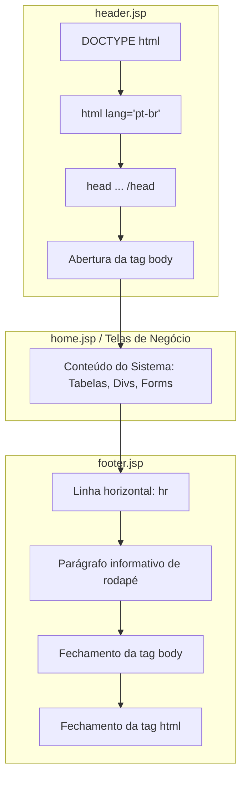

### Riscos de Erros em Fragmentos de Fechamento
- **Fechamento Precoce**: Se o desenvolvedor acidentalmente fechar `</body></html>` dentro do `header.jsp`, qualquer elemento HTML incluído posteriormente pelas páginas intermediárias violará a especificação do W3C. Os navegadores entrarão em modo de recuperação de falhas de renderização (*quirks mode*), quebrando seletores de CSS e o posicionamento de componentes do Bootstrap.
- **Não Fechamento**: A omissão do `footer.jsp` deixa a árvore DOM aberta. Embora navegadores modernos tentem corrigir o documento ao final da conexão, isso pode impedir o acionamento de eventos de ciclo de vida e causar falhas em scripts de captura de altura da janela ou de renderização de rodapés flutuantes.

---

## Composição da página inicial (home.jsp) e fluxo de roteamento a partir de index.jsp

### O Papel de index.jsp como Ponto de Entrada (Welcome File)

Por convenção do padrão Java EE definido no `web.xml`, o arquivo `index.jsp` atua como o *welcome-file* padrão da aplicação. Ao digitar `http://localhost:8080/AplCurso2/`, o servidor web busca imediatamente o arquivo de boas-vindas.

```jsp
<%@taglib prefix="c" uri="http://java.sun.com/jsp/jstl/core"%>
<jsp:include page="home.jsp"/>
```

#### Motivação da Separação entre index.jsp e home.jsp
Por que não escrever o código diretamente no `index.jsp`?
Na evolução arquitetural do sistema (abordada nos capítulos seguintes da disciplina):
1. O `index.jsp` assume a responsabilidade de **controlador de entrada (*Gateway Router*)**.
2. Ele verifica a existência de uma sessão HTTP válida (`sessionScope.usuarioLogado`).
3. Se o usuário estiver autenticado, despacha a requisição para a `home.jsp`.
4. Se o usuário não possuir sessão ativa, despacha a requisição para o servlet ou tela de autenticação (`login.jsp`).

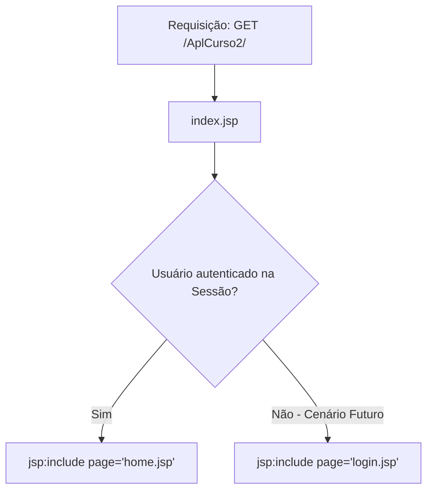

### O Orquestrador home.jsp

O arquivo `home.jsp` é a página central que une os fragmentos do sistema.

```jsp
<%@taglib prefix="c" uri="http://java.sun.com/jsp/jstl/core" %>
<%@taglib prefix="fmt" uri="http://java.sun.com/jsp/jstl/fmt" %>
<%@page contentType="text/html" pageEncoding="iso-8859-1"%>
<jsp:include page="header.jsp"/>
<jsp:include page="menu.jsp"/>

 <h1>Sistema Exemplo - CRUD</h1>
 
<jsp:include page="footer.jsp"/>
```

#### Ordem de Execução
1. Declara as taglibs JSTL Core e Formatting.
2. Define o encoding ISO-8859-1 da resposta.
3. Invoca `header.jsp`: envia cabeçalho HTTP, tags HTML iniciais, carrega folhas de estilo e bibliotecas JavaScript.
4. Invoca `menu.jsp`: renderiza o título do módulo e links de navegação.
5. Emite o conteúdo central próprio da tela (`<h1>Sistema Exemplo - CRUD</h1>`).
6. Invoca `footer.jsp`: renderiza informações institucionais e encerra formalmente o documento (`</body></html>`).

---

## Validação algorítmica de CPF e CNPJ no cliente e alternância dinâmica de máscaras em app.js

### A Camada de Comportamento Dinâmico: app.js

O script `app.js` encapsula a inteligência do cliente para o formulário de cadastro de pessoas. Suas principais responsabilidades são:
1. **Alternância Dinâmica de Máscara**: Adequar a máscara visual conforme o usuário entra com CPF (pessoa física) ou CNPJ (pessoa jurídica) em um **único campo de entrada** (`#cpfcnpjpessoa`).
2. **Validação Rigorosa de Dígitos Verificadores**: Impedir a submissão de números fictícios ou fraudulentos antes de disparar requisições ao backend.
3. **Notificação Visual Amigável**: Uso de janelas modais ricas via SweetAlert2 (`Swal.fire`).
4. **Disparo de Requisições Assíncronas**: Chamada à função de busca de duplicidade no banco (`carregarPessoa`).

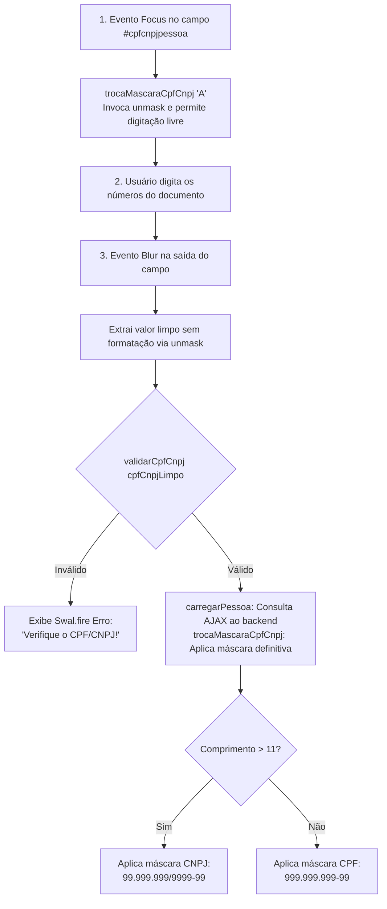

### Análise Matemática dos Algoritmos de Validação (Módulo 11)

#### 1. Algoritmo de Validação do CPF (Cadastro de Pessoas Físicas)
Um CPF possui 11 dígitos, dispostos no formato `ABC.DEF.GHI-JK`, onde `JK` são os dois dígitos verificadores (DVs).

1. **Eliminação de Inválidos Conhecidos**: Sequências formadas por 11 dígitos repetidos (ex: `"00000000000"`, `"11111111111"`, ..., `"99999999999"`) produzem somas válidas pelo algoritmo clássico do Módulo 11, mas são declaradas sumariamente inválidas pela Receita Federal. O algoritmo deve rejeitá-las no início.
2. **Cálculo do Primeiro Dígito Verificador (`J`)**:
   - Multiplicam-se os primeiros 9 dígitos pelos pesos decrescentes de 10 até 2:
     $$\text{Soma}_1 = (A \times 10) + (B \times 9) + (C \times 8) + (D \times 7) + (E \times 6) + (F \times 5) + (G \times 4) + (H \times 3) + (I \times 2)$$
   - Calcula-se o resto da divisão por 11:
     $$\text{Resto}_1 = 11 - (\text{Soma}_1 \pmod{11})$$
   - Se o resultado for 10 ou 11, o primeiro dígito verificador é considerado `0`. Caso contrário, o dígito é o próprio $\text{Resto}_1$.
3. **Cálculo do Segundo Dígito Verificador (`K`)**:
   - Inclui-se o primeiro DV (`J`) no cálculo. Multiplicam-se os 10 primeiros dígitos pelos pesos decrescentes de 11 até 2:
     $$\text{Soma}_2 = (A \times 11) + (B \times 10) + \dots + (I \times 3) + (J \times 2)$$
   - Calcula-se o resto da divisão por 11:
     $$\text{Resto}_2 = 11 - (\text{Soma}_2 \pmod{11})$$
   - Se o resultado for 10 ou 11, o segundo dígito verificador é considerado `0`. Caso contrário, é o próprio $\text{Resto}_2$.

#### 2. Algoritmo de Validação do CNPJ (Cadastro Nacional da Pessoa Jurídica)
Um CNPJ possui 14 dígitos, no formato `AA.BBB.CCC/DDDD-EF`, onde `EF` são os dois dígitos verificadores.
O cálculo utiliza pesos decrescentes que se reiniciam no valor 9 após atingirem o valor 2.

1. **Eliminação de Inválidos Conhecidos**: Sequências de 14 dígitos repetidos (`"00000000000000"` a `"99999999999999"`) são descartadas.
2. **Cálculo do Primeiro Dígito Verificador (`E`)**:
   - Pesos aplicados aos 12 primeiros dígitos: `5, 4, 3, 2, 9, 8, 7, 6, 5, 4, 3, 2`.
   - Soma-se o produto de cada dígito pelo seu peso correspondente.
   - Resto: se $\text{Soma}_1 \pmod{11} < 2$, o dígito é `0`. Senão, o dígito é $11 - (\text{Soma}_1 \pmod{11})$.
3. **Cálculo do Segundo Dígito Verificador (`F`)**:
   - Pesos aplicados aos 13 dígitos (incluindo o primeiro DV `E`): `6, 5, 4, 3, 2, 9, 8, 7, 6, 5, 4, 3, 2`.
   - Resto: se $\text{Soma}_2 \pmod{11} < 2$, o dígito é `0`. Senão, o dígito é $11 - (\text{Soma}_2 \pmod{11})$.

### Análise Crítica dos Algoritmos Presentes no Arquivo app.js

O arquivo `app.js` fornecido na aula contém duas implementações distintas para a validação de CNPJ: a função moderna `cnpjValidation(value)` (que utiliza arrow functions, expressões regulares, sets e arrays) e a função tradicional `validarCNPJ(cnpj)` (baseada em strings, substrings e loops clássicos).

#### Comparativo entre as Implementações de Validação de CNPJ

| Aspecto de Engenharia | Função `cnpjValidation(value)` | Função `validarCNPJ(cnpj)` |
| :--- | :--- | :--- |
| **Aceitação de Tipos** | Polimórfica: aceita `string`, `number` ou `Array`. | Rígida: espera receber uma `string`. |
| **Limpeza de Caracteres** | Utiliza Regex com captura de dígitos e `.map(Number)`. | Utiliza `replace(/[^\d]+/g,'')`. |
| **Eliminação de Repetidos** | Elegante: `[...new Set(numbers)].length === 1`. | Exaustiva: cadeia de 10 comparações lógicas `\|\|`. |
| **Cálculo dos DVs** | Função matemática recursiva/fatorada `calc(x)` parametrizada. | Dois blocos de código `for` sequenciais duplicados. |
| **Manutenibilidade** | Alta; segue padrões modernos de ES6+. | Média; código imperativo com repetição de laço. |

---

## Código da aula

Nesta seção, consolidamos a integração dos arquivos front-end do projeto `AplCurso2` e detalhamos as implementações em Java que espelham o comportamento de validação e composição modular de telas.

### Estrutura de Arquivos do Projeto

```
AplCurso2/
├── web/
│   ├── index.jsp           (Gateway de entrada e inclusão de home.jsp)
│   ├── home.jsp            (Orquestrador do layout mestre)
│   ├── header.jsp          (Metadados, links CSS e bibliotecas JS)
│   ├── menu.jsp            (Barra de navegação e rotas de contexto)
│   ├── footer.jsp          (Encerramento do DOM HTML)
│   └── js/
│       ├── app.js                 (Regras de validação de CPF/CNPJ e controle de máscaras)
│       ├── jquery-3.3.1.min.js    (Biblioteca base jQuery)
│       ├── jquery.mask.min.js     (Plugin de máscara alfanumérica)
│       └── jquery.maskMoney.min.js(Plugin de formatação monetária)
└── src/java/
    └── codigo/
        ├── ExemplosAula.java      (Simulação Java das regras de validação e inclusão de JSP)
        └── Exercicios.java        (Resolução detalhada dos exercícios da aula)
```

### Análise Linha a Linha: app.js

O script [app.js](file:///Users/murilodev/workspace/js/app.js) gerencia o ciclo de vida do input `#cpfcnpjpessoa`:

```javascript
// Linha 1 a 7: Escuta de foco para remoção de máscara
$(document).ready(function(){
 console.log('Ativo evento focus campo cpf');
 $('#cpfcnpjpessoa').focus(function(){
   trocaMascaraCpfCnpj("A"); // Parâmetro "A" sinaliza remoção da máscara para edição limpa
 });
});

// Linha 9 a 29: Escuta de perda de foco (blur) para validação e formatação
$(document).ready(function(){
 console.log('Ativo evento blur campo cpf');
 $('#cpfcnpjpessoa').blur(function(){
   // Extrai o valor sem pontuações usando o unmask() do plugin
   var cpfCnpjLimpo = $('#cpfcnpjpessoa').unmask().val();
   console.log("CPF/CNPJ Limpo:");
   console.log(cpfCnpjLimpo);
   
   // Executa a validação matemática de dígitos verificadores
   if (!validarCpfCnpj(cpfCnpjLimpo)){
     // Dispara o alerta moderno do SweetAlert2 caso o documento seja inválido
     Swal.fire({
       position: 'center',
       icon: 'error',
       title: 'Verifique o CPF/CNPJ!',
       showConfirmButton: true,
       timer: 10000
     });
   } else {
     // Se válido, invoca rotina de consulta ao servidor e reaplica a máscara adequada
     carregarPessoa($('#cpfcnpjpessoa').unmask().val());
     trocaMascaraCpfCnpj($('#cpfcnpjpessoa').val());
   }
 });
});

// Linha 31 a 48: Alternância dinâmica de máscaras
function trocaMascaraCpfCnpj(cpfCnpj) {
 console.log("entrei no troca mascara");
 if (cpfCnpj !== "A") {
   // Define as duas máscaras possíveis
   var masks = ['999.999.999-99', '99.999.999/9999-99'];
   var cpfcnpj = $('#cpfcnpjpessoa').unmask().val();
   // Operador ternário: se o documento tiver mais de 11 dígitos, adota a máscara de CNPJ
   mask = (cpfcnpj.length > 11) ? masks[1] : masks[0];
   console.log("trocou: " + mask);
   $('#cpfcnpjpessoa').mask(mask);
 } else {
   // Remove a máscara quando solicitado
   console.log("limpou mascara"); 
   $('#cpfcnpjpessoa').unmask();
 }
};
```

---

## Exercícios

### Exercício 1: Validação Rigorosa de CPF e CNPJ com Cálculo de Dígitos Verificadores

#### Enunciado
Implemente uma classe Java utilitária contendo um método estático `validarDocumento(String documento)` que receba uma string contendo um documento (CPF com 11 dígitos ou CNPJ com 14 dígitos, aceitando caracteres de pontuação ou apenas números). O método deve:
1. Remover caracteres não numéricos.
2. Identificar se o documento é CPF ou CNPJ pelo comprimento limpo.
3. Rejeitar sequências conhecidas de dígitos repetidos (ex.: `"11111111111"` ou `"00000000000000"`).
4. Calcular matematicamente os dois dígitos verificadores segundo as regras da Receita Federal do Brasil (módulo 11 com pesos decrescentes).
5. Retornar `true` se o documento for válido e `false` caso contrário.

Consulte o arquivo de implementação em [./codigo/Exercicios.java](file:///Users/murilodev/workspace/codigo/Exercicios.java).

#### Raciocínio
A implementação deve tratar o documento como uma sequência de inteiros. Para o CPF, os pesos decrescem de 10 a 2 (1º DV) e de 11 a 2 (2º DV). Para o CNPJ, os pesos decrescem de 5 a 2 e depois de 9 a 2 (1º DV); e de 6 a 2 e depois de 9 a 2 (2º DV). Qualquer entrada com comprimento diferente de 11 e 14 dígitos numéricos deve ser rejeitada sumariamente.

#### Resolução Completa Comentada

```java
package codigo;

import java.util.Arrays;
import java.util.HashSet;
import java.util.Set;

public class Exercicios {

    /**
     * Valida um documento brasileiro (CPF ou CNPJ).
     * @param documento String contendo o documento formatado ou desformatado
     * @return true se o documento for matematicamente válido; false caso contrário
     */
    public static boolean validarDocumento(String documento) {
        if (documento == null) {
            return false;
        }

        // Remove tudo que não for dígito numérico
        String limpo = documento.replaceAll("[^0-9]", "");

        // Roteia a validação com base no tamanho do documento
        if (limpo.length() == 11) {
            return validarCPF(limpo);
        } else if (limpo.length() == 14) {
            return validarCNPJ(limpo);
        }

        return false;
    }

    private static boolean validarCPF(String cpf) {
        // Rejeita sequências repetidas conhecidas
        if (cpf.matches("(\\d)\\1{10}")) {
            return false;
        }

        try {
            // 1º Dígito Verificador
            int soma1 = 0;
            for (int i = 0; i < 9; i++) {
                int digito = Character.getNumericValue(cpf.charAt(i));
                soma1 += digito * (10 - i);
            }
            int resto1 = 11 - (soma1 % 11);
            int dv1 = (resto1 >= 10) ? 0 : resto1;

            if (dv1 != Character.getNumericValue(cpf.charAt(9))) {
                return false;
            }

            // 2º Dígito Verificador
            int soma2 = 0;
            for (int i = 0; i < 10; i++) {
                int digito = Character.getNumericValue(cpf.charAt(i));
                soma2 += digito * (11 - i);
            }
            int resto2 = 11 - (soma2 % 11);
            int dv2 = (resto2 >= 10) ? 0 : resto2;

            return dv2 == Character.getNumericValue(cpf.charAt(10));

        } catch (Exception e) {
            return false;
        }
    }

    private static boolean validarCNPJ(String cnpj) {
        // Rejeita sequências repetidas conhecidas
        if (cnpj.matches("(\\d)\\1{13}")) {
            return false;
        }

        try {
            // Pesos para cálculo do 1º Dígito Verificador do CNPJ
            int[] pesosDV1 = {5, 4, 3, 2, 9, 8, 7, 6, 5, 4, 3, 2};
            int soma1 = 0;
            for (int i = 0; i < 12; i++) {
                soma1 += Character.getNumericValue(cnpj.charAt(i)) * pesosDV1[i];
            }
            int mod1 = soma1 % 11;
            int dv1 = (mod1 < 2) ? 0 : (11 - mod1);

            if (dv1 != Character.getNumericValue(cnpj.charAt(12))) {
                return false;
            }

            // Pesos para cálculo do 2º Dígito Verificador do CNPJ
            int[] pesosDV2 = {6, 5, 4, 3, 2, 9, 8, 7, 6, 5, 4, 3, 2};
            int soma2 = 0;
            for (int i = 0; i < 13; i++) {
                soma2 += Character.getNumericValue(cnpj.charAt(i)) * pesosDV2[i];
            }
            int mod2 = soma2 % 11;
            int dv2 = (mod2 < 2) ? 0 : (11 - mod2);

            return dv2 == Character.getNumericValue(cnpj.charAt(13));

        } catch (Exception e) {
            return false;
        }
    }
}
```

---

### Exercício 2: Alternância e Aplicação de Máscara de Documento

#### Enunciado
Desenvolva uma rotina que simule o comportamento da função JavaScript `trocaMascaraCpfCnpj`. Crie uma classe ou método que receba uma string numérica e uma indicação de ação (`APLICAR` ou `REMOVER`). Se a ação for `REMOVER`, deve retornar apenas os dígitos numéricos limpos. Se a ação for `APLICAR`, deve analisar o comprimento do documento limpo:
- Se possuir até 11 dígitos, deve aplicar a máscara de CPF: `000.000.000-00` (completando com zeros à esquerda se necessário, ou formatando sobre os dígitos existentes).
- Se possuir mais de 11 e até 14 dígitos, deve aplicar a máscara de CNPJ: `00.000.000/0000-00`.
- Se possuir tamanho inválido, deve lançar uma exceção de argumento inválido.

Consulte o arquivo de implementação em [./codigo/Exercicios.java](file:///Users/murilodev/workspace/codigo/Exercicios.java).

#### Raciocínio
A lógica deve espelhar o comportamento do plugin jQuery Mask. No backend Java, o mascaramento de strings é frequentemente necessário para exibição de relatórios ou respostas de APIs de visualização. Utilizaremos manipulação de strings com formatação regex e interpolação.

#### Resolução Completa Comentada

```java
    public enum AcaoMascara {
        APLICAR, REMOVER
    }

    public static String alternarMascaraDocumento(String documento, AcaoMascara acao) {
        if (documento == null) {
            return "";
        }

        // Remove pontuações pré-existentes
        String digitos = documento.replaceAll("[^0-9]", "");

        if (acao == AcaoMascara.REMOVER) {
            return digitos;
        }

        // Aplicação de máscara conforme comprimento
        if (digitos.length() <= 11) {
            // Completa com zeros à esquerda se tiver menos de 11 para formatação de CPF
            String cpfPreenchido = String.format("%011d", Long.parseLong(digitos.isEmpty() ? "0" : digitos));
            return cpfPreenchido.replaceAll("(\\d{3})(\\d{3})(\\d{3})(\\d{2})", "$1.$2.$3-$4");
        } else if (digitos.length() <= 14) {
            // Completa com zeros à esquerda se necessário para CNPJ
            String cnpjPreenchido = String.format("%014d", Long.parseLong(digitos));
            return cnpjPreenchido.replaceAll("(\\d{2})(\\d{3})(\\d{3})(\\d{4})(\\d{2})", "$1.$2.$3/$4-$5");
        } else {
            throw new IllegalArgumentException("Documento com tamanho incompatível para formatação: " + digitos.length());
        }
    }
```

---

### Exercício 3: Composição Modular de Páginas com Inclusão de Fragmentos

#### Enunciado
Implemente um mecanismo de composição de layout web em Java que simule o comportamento do contêiner de servlets ao processar as tags `<jsp:include>`. O sistema deve:
1. Conter classes que representem fragmentos de página (`HeaderFragment`, `MenuFragment`, `FooterFragment` e `ConteudoFragment`).
2. Resolver dinamicamente a variável de contexto `${pageContext.request.contextPath}` em todos os fragmentos que a utilizarem.
3. Garantir a concatenação ordenada dos buffers para produzir um documento HTML final válido.

Consulte o arquivo de implementação em [./codigo/Exercicios.java](file:///Users/murilodev/workspace/codigo/Exercicios.java).

#### Raciocínio
No contêiner Tomcat, cada JSP incluído escreve no `JspWriter` do servlet chamador. Podemos simular esse pipeline por meio do padrão de projeto *Template Method* ou por meio de composição de buffers com uma classe `LayoutEngine` que receba o nome do contexto da aplicação.

#### Resolução Completa Comentada

```java
    public static class LayoutEngine {
        private final String contextPath;

        public LayoutEngine(String contextPath) {
            this.contextPath = contextPath;
        }

        public String processarExpressaoEL(String template) {
            if (template == null) return "";
            return template.replace("${pageContext.request.contextPath}", this.contextPath);
        }

        public String renderizarHome(String conteudoCentral) {
            StringBuilder buffer = new StringBuilder();

            // 1. Simulação da inclusão de header.jsp
            String header = "<!DOCTYPE html>\n" +
                            "<html>\n" +
                            "<head>\n" +
                            "  <script src=\"${pageContext.request.contextPath}/js/jquery-3.3.1.min.js\"></script>\n" +
                            "  <script src=\"${pageContext.request.contextPath}/js/app.js\"></script>\n" +
                            "</head>\n" +
                            "<body>\n";
            buffer.append(processarExpressaoEL(header));

            // 2. Simulação da inclusão de menu.jsp
            String menu = "<nav>\n" +
                          "  <h2>Menu Principal</h2>\n" +
                          "  <a href=\"${pageContext.request.contextPath}/UsuarioListar\">Usuário</a>\n" +
                          "</nav>\n<hr>\n";
            buffer.append(processarExpressaoEL(menu));

            // 3. Inserção do miolo específico
            buffer.append("<main>\n  ").append(conteudoCentral).append("\n</main>\n");

            // 4. Simulação da inclusão de footer.jsp
            String footer = "<hr>\n" +
                            "<footer>\n" +
                            "  <p>Desenvolvendo Aplicações com Java Web</p>\n" +
                            "</footer>\n" +
                            "</body>\n" +
                            "</html>";
            buffer.append(processarExpressaoEL(footer));

            return buffer.toString();
        }
    }
```

---

### Exercício 4: Formatação e Tratamento de Valores Monetários

#### Enunciado
Desenvolva uma rotina que simule o comportamento do plugin `jquery.maskMoney`:
1. Um método de formatação `formatarMoeda(double valor)` que converta um número decimal na representação monetária brasileira (`R$ 1.500,50`).
2. Um método de extração reversa `desformatarMoeda(String valorFormatado)` (equivalente ao método `unmasked` do plugin) que receba a string monetária brasileira e retorne o valor primitivo `double` correspondente (ex.: `"R$ 1.500,50"` $\rightarrow$ `1500.50`), tratando adequadamente casos de valores negativos ou strings sem centavos.

Consulte o arquivo de implementação em [./codigo/Exercicios.java](file:///Users/murilodev/workspace/codigo/Exercicios.java).

#### Raciocínio
A internacionalização brasileira utiliza o ponto (`.`) como separador de milhar e a vírgula (`,`) como separador decimal. Para extrair o valor primitivo sem perda de precisão, as pontuações de milhar devem ser expurgadas e a vírgula decimal deve ser substituída pelo ponto padrão do formato de ponto flutuante da IEEE 754.

#### Resolução Completa Comentada

```java
    import java.text.DecimalFormat;
    import java.text.DecimalFormatSymbols;
    import java.util.Locale;

    public static class FormatadorMonetario {
        private static final Locale LOCALE_BR = new Locale("pt", "BR");

        /**
         * Formata um valor numérico para o padrão de moeda do Brasil (R$ 0.000,00).
         */
        public static String formatarMoeda(double valor) {
            DecimalFormatSymbols simbolos = new DecimalFormatSymbols(LOCALE_BR);
            simbolos.setGroupingSeparator('.');
            simbolos.setDecimalSeparator(',');

            DecimalFormat df = new DecimalFormat("R$ #,##0.00", simbolos);
            return df.format(valor);
        }

        /**
         * Realiza a operação reversa (unmasked), convertendo string formatada em double.
         */
        public static double desformatarMoeda(String valorFormatado) {
            if (valorFormatado == null || valorFormatado.trim().isEmpty()) {
                return 0.0;
            }

            // Remove prefixos como 'R$' e espaços em branco
            String limpo = valorFormatado.replace("R$", "").trim();

            // Identifica se é negativo
            boolean negativo = limpo.contains("-");
            limpo = limpo.replace("-", "");

            // Remove pontos separadores de milhar
            limpo = limpo.replace(".", "");

            // Substitui vírgula decimal por ponto para conversão em Double
            limpo = limpo.replace(",", ".");

            double resultado = Double.parseDouble(limpo);
            return negativo ? -resultado : resultado;
        }
    }
```

---

## Erros comuns e boas práticas

### Erros Comuns

1. **Inclusão com caminhos relativos em profundidades variáveis**:
   - *Erro*: Escrever `<script src="js/app.js">` em um JSP. Se a requisição vier de um servlet mapeado como `/admin/relatorios/emitir`, o navegador tentará buscar `/admin/relatorios/js/app.js`, resultando em HTTP 404.
   - *Correção*: Sempre utilizar `${pageContext.request.contextPath}/js/app.js`.
2. **Inversão da ordem de scripts de frontend**:
   - *Erro*: Importar `jquery.mask.min.js` antes de `jquery-3.3.1.min.js`.
   - *Correção*: O jQuery Core deve ser sempre o primeiríssimo script JS carregado no `<head>`.
3. **Validação exclusiva no cliente**:
   - *Erro*: Confiar exclusivamente nas funções `validarCPF` ou `validarCNPJ` do `app.js` e não implementar a validação no Servlet/Controller ou na camada DAO.
   - *Correção*: Validações no cliente visam apenas aprimorar a experiência do usuário (*UX*). Qualquer requisição HTTP pode ser forjada via Postman, curl ou scripts maliciosos. A validação matemática no backend em Java é obrigatória.
4. **Fechamento assimétrico de tags HTML**:
   - *Erro*: Fechar `</body></html>` dentro de `home.jsp` e também incluir o `footer.jsp`. Isso gera marcação inválida e quebra de renderização no navegador.
5. **Esquecer de limpar pontuações antes de persistir no banco**:
   - *Erro*: Enviar `"123.456.789-00"` para uma coluna de banco de dados modelada como `VARCHAR(11)`.
   - *Correção*: Utilizar o método `.unmask().val()` ou uma rotina de sanitização `.replaceAll("[^0-9]", "")` antes da montagem do comando SQL.

### Boas Práticas de Engenharia

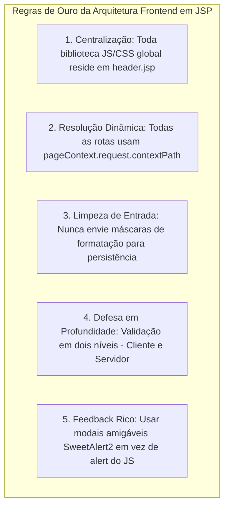

---

## Links e materiais complementares

- **Documentação Oficial JSTL (Jakarta / Java EE)**: Especificação completa das tags das bibliotecas Core, Formatting, SQL e Functions.
  - Link: https://jakarta.ee/specifications/tags/
- **jQuery API Documentation**: Guia de referência para manipulação de seletores, eventos e chamadas Ajax.
  - Link: https://api.jquery.com/
- **jQuery Mask Plugin (Repositório Oficial no GitHub)**: Repositório mantido por Igor Escobar com documentação sobre máscaras dinâmicas e expressões regulares.
  - Link: https://github.com/igorescobar/jQuery-Mask-Plugin
- **jQuery MaskMoney Plugin**: Repositório oficial do plugin de formatação monetária mantido por Diego Plentz.
  - Link: https://github.com/plentz/jquery-maskmoney
- **Documentação Oficial SweetAlert2**: Exemplos de configuração de modais de alerta, caixas de diálogo assíncronas e integração de feedback.
  - Link: https://sweetalert2.github.io/
- **Receita Federal do Brasil — Regras Oficiais de Validação de CPF e CNPJ**: Portarias normativas que estabelecem o cálculo de dígitos verificadores por Módulo 11.
  - Link: https://www.gov.br/receitafederal/pt-br

---

## Mapa da aula

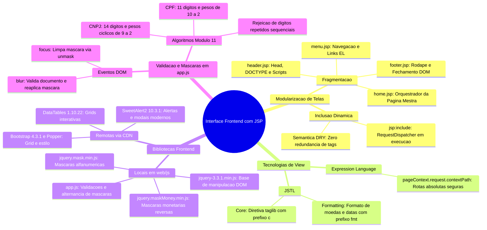

---

## Glossário

| Termo | Definição no Contexto da Disciplina |
| :--- | :--- |
| **JSP (JavaServer Pages)** | Tecnologia da plataforma Java EE que permite misturar marcação HTML com tags de servidor dinâmicas, compiladas em servlets pelo contêiner web. |
| **JSTL** | *JavaServer Pages Standard Tag Library*, conjunto padronizado de tags customizadas para iteração, controle condicional e formatação sem uso de código Java cru. |
| **Expression Language (EL)** | Linguagem de expressão concisa (`${expressao}`) introduzida no JSP 2.0 para acesso a dados de escopo (request, session, application) e propriedades de JavaBeans. |
| **`contextPath`** | Caminho base da URL atribuído à aplicação web no servidor de aplicação (ex: `/AplCurso2`). |
| **`<jsp:include>`** | Ação padrão do JSP que delega dinamicamente a execução de outro arquivo em tempo de requisição e incorpora a saída gerada no ponto da chamada. |
| **DOM (Document Object Model)** | Interface de programação orientada a objetos para documentos HTML e XML que representa a estrutura de nós da página no navegador. |
| **CDN (Content Delivery Network)** | Rede geograficamente distribuída de servidores de borda utilizada para entrega de ativos estáticos (CSS/JS) com baixa latência e alto cache. |
| **Módulo 11** | Algoritmo matemático ponderado utilizado no Brasil para cálculo e validação dos dígitos verificadores de documentos oficiais como CPF e CNPJ. |
| **`unmask()`** | Método de plugins de formulário que remove os caracteres de pontuação e formatação visual, retornando apenas os dados alfanuméricos puros. |
| **Eventos `focus` e `blur`** | `focus` ocorre quando um elemento da interface ganha o foco de interação do usuário; `blur` ocorre quando o elemento perde o foco. |

---

## Pontos-chave para a prova

1. **Diferença entre `<jsp:include>` e `<%@include %>`**: O `<jsp:include>` é dinâmico, ocorre em tempo de requisição (*request-time*) via `RequestDispatcher`, compilando os fragmentos de forma independente. A diretiva `<%@include %>` é estática e ocorre em tempo de tradução (*translation-time*), fundindo o código-fonte antes de compilar.
2. **Propósito do `${pageContext.request.contextPath}`**: Evitar caminhos relativos frágeis ou caminhos absolutos com nome de projeto fixo (*hardcoded*). Garante que a aplicação funcione em qualquer servidor ou contexto sem alteração de links.
3. **Ordem de carregamento no `header.jsp`**: O script `jquery-3.3.1.min.js` precisa ser declarado **antes** de `jquery.mask.min.js`, `jquery.maskMoney.min.js` e `app.js`.
4. **Comportamento do `index.jsp`**: Funciona como ponto de entrada da aplicação (*welcome file*) e encaminha o fluxo para `home.jsp` usando `<jsp:include page="home.jsp"/>`.
5. **Divisão simétrica de marcação**: O `header.jsp` inicia o documento com `<!DOCTYPE html><html><head>...</head><body>`, e o `footer.jsp` finaliza a estrutura com `</body></html>`.
6. **Alternância de máscara de documento em `app.js`**:
   - No `focus`: o campo executa `unmask()` para permitir edição limpa.
   - No `blur`: o documento limpo é validado matematicamente; se válido e possuir mais de 11 dígitos, recebe a máscara de CNPJ (`99.999.999/9999-99`); se possuir até 11 dígitos, recebe a máscara de CPF (`999.999.999-99`).
7. **Regras de invalidação de CPF/CNPJ**: Devem ser rejeitadas sequências conhecidas de dígitos repetidos (`"11111111111"`, etc.), além da validação do resto da divisão por 11 com pesos decrescentes.

---

## Perguntas e respostas (JSONL)

```jsonl
{"pergunta": "Qual a principal vantagem arquitetural de utilizar a ação jsp:include em vez de replicar o cabeçalho em todas as páginas?", "resposta": "A centralização do código em fragmentos reutilizáveis evita redundância (princípio DRY), garante consistência visual e permite atualizar scripts ou metadados em um único arquivo (header.jsp) para todo o sistema.", "dificuldade": "facil"}
{"pergunta": "Por que o arquivo index.jsp apenas inclui home.jsp em vez de conter o código da página principal diretamente?", "resposta": "Para atuar como ponto de entrada e roteador, permitindo que futuras evoluções do sistema tomem decisões de redirecionamento (como enviar para login.jsp caso o usuário não esteja autenticado).", "dificuldade": "medio"}
{"pergunta": "O que acontece se o arquivo app.js for importado antes do arquivo jquery-3.3.1.min.js no header.jsp?", "resposta": "O navegador lançará um erro JavaScript 'Uncaught ReferenceError: $ is not defined', pois app.js depende das funções do objeto global jQuery que ainda não foi carregado na memória.", "dificuldade": "facil"}
{"pergunta": "Qual é a função da Expression Language ${pageContext.request.contextPath} nos links de navegação?", "resposta": "Recuperar dinamicamente o caminho raiz da aplicação no servidor, garantindo que os links funcionem independentemente do nome do contexto ou da profundidade da URL que requisitou a página.", "dificuldade": "medio"}
{"pergunta": "Por que o header.jsp não fecha a tag body e nem a tag html?", "resposta": "Porque ele é um fragmento estrutural de topo; o corpo permanece aberto para que as páginas mestras injetem seu conteúdo central, cabendo ao footer.jsp o fechamento formal de body e html.", "dificuldade": "facil"}
{"pergunta": "Qual a diferença de comportamento entre os eventos focus e blur configurados no campo #cpfcnpjpessoa em app.js?", "resposta": "No focus, o campo remove a máscara (unmask) para facilitar a digitação limpa; no blur, o sistema valida os dígitos matematicamente e reaplica a máscara correspondente (CPF ou CNPJ).", "dificuldade": "medio"}
{"pergunta": "Qual o critério utilizado pela função trocaMascaraCpfCnpj para decidir entre máscara de CPF ou de CNPJ?", "resposta": "O comprimento da string limpa (sem máscara); se possuir mais de 11 dígitos numéricos, aplica a máscara de CNPJ, caso contrário, aplica a de CPF.", "dificuldade": "facil"}
{"pergunta": "Por que os algoritmos de validação de CPF e CNPJ rejeitam explicitamente números com todos os dígitos iguais como 111.111.111-11?", "resposta": "Porque os cálculos dos dígitos verificadores no Módulo 11 resultam em valores matematicamente coerentes para números repetidos, exigindo um bloqueio algorítmico específico para atender às regras da Receita Federal.", "dificuldade": "medio"}
{"pergunta": "Qual a função da biblioteca SweetAlert2 na estrutura de frontend adotada na disciplina?", "resposta": "Substituir caixas de diálogo nativas e bloqueantes do navegador (alert) por janelas modais assíncronas, visualmente ricas e personalizáveis com temporizadores e ícones de erro/sucesso.", "dificuldade": "facil"}
{"pergunta": "Qual a diferença entre utilizar o método val() e cleanVal() do plugin jQuery Mask?", "resposta": "O método val() retorna o texto contendo a formatação e caracteres especiais da máscara, enquanto cleanVal() retorna exclusivamente os dígitos alfanuméricos puros inseridos pelo usuário.", "dificuldade": "medio"}
{"pergunta": "Como o plugin jquery.maskMoney deve ser desmascarado para enviar valores a uma coluna decimal no banco de dados?", "resposta": "Utiliza-se o método unmasked do plugin (ou tratamento de substituição da vírgula por ponto) para obter o valor nativo em ponto flutuante antes de persisti-lo no backend.", "dificuldade": "medio"}
{"pergunta": "O que indica a diretiva taglib prefix='fmt' uri='http://java.sun.com/jsp/jstl/fmt' no topo de um JSP?", "resposta": "Importa a biblioteca JSTL Formatting, permitindo formatar valores monetários, números decimais e datas conforme o Locale especificado.", "dificuldade": "facil"}
{"pergunta": "Por que a validação de CPF no cliente via JavaScript não elimina a necessidade de validação na camada de Controller ou Model em Java?", "resposta": "Porque scripts no cliente podem ser desativados ou contornados com requisições HTTP manuais; a integridade e consistência dos dados devem ser garantidas com validação no backend.", "dificuldade": "dificil"}
{"pergunta": "Qual a diferença de ciclo de vida entre a inclusão via jsp:include e a diretiva de inclusão estática <%@include %>?", "resposta": "O jsp:include ocorre em tempo de execução via RequestDispatcher compilando os JSPs de forma independente, enquanto <%@include %> funde os arquivos em tempo de tradução antes da compilação.", "dificuldade": "dificil"}
{"pergunta": "Qual o papel da biblioteca Popper.js no carregamento das dependências do Bootstrap no header.jsp?", "resposta": "O Popper.js calcula o posicionamento dinâmico de elementos flutuantes da interface do Bootstrap, como menus suspensos (dropdowns), tooltips e popovers.", "dificuldade": "medio"}
{"pergunta": "Como o contêiner Tomcat lida com acentuação se a página JSP declarar pageEncoding='iso-8859-1'?", "resposta": "O compilador de JSP interpreta os caracteres do arquivo com base na tabela Latin-1 e envia a resposta ao cliente com o cabeçalho HTTP Content-Type: text/html;charset=ISO-8859-1.", "dificuldade": "medio"}
```

---

## Checklist de revisão

- [ ] Compreendi a motivação da arquitetura modular da camada View e a separação de responsabilidades em fragmentos JSP.
- [ ] Sei explicar a diferença exata entre a ação dinâmica `<jsp:include page="..." />` e a diretiva estática `<%@include file="..." %>`.
- [ ] Sei declarar e diferenciar os prefixos e URIs das bibliotecas JSTL Core (`c`) e JSTL Formatting (`fmt`).
- [ ] Entendi a razão de utilizar `${pageContext.request.contextPath}` em todas as referências de URLs, scripts e estilos.
- [ ] Sei a ordem correta de importação de bibliotecas no `header.jsp` (jQuery $\rightarrow$ Plugins $\rightarrow$ Scripts de negócio).
- [ ] Compreendi por que `header.jsp` abre o `<body>` e `footer.jsp` fecha o `</body></html>`.
- [ ] Compreendi a lógica de roteamento em `index.jsp` redirecionando para `home.jsp`.
- [ ] Sei como funciona o plugin `jquery.mask.min.js` e a diferença entre `.val()` e `.cleanVal()`.
- [ ] Sei como funciona o plugin `jquery.maskMoney.min.js` e como extrair o valor puro via `unmasked`.
- [ ] Compreendi o fluxo de alternância dinâmica de máscara no `app.js` baseado nos eventos `focus` e `blur`.
- [ ] Sei explicar as regras do algoritmo Módulo 11 para cálculo de Dígitos Verificadores de CPF e CNPJ.
- [ ] Reconheço a importância de replicar as validações de regras de negócio e de documentos no backend Java.
