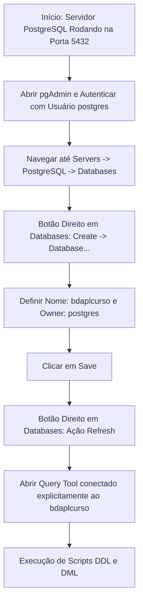
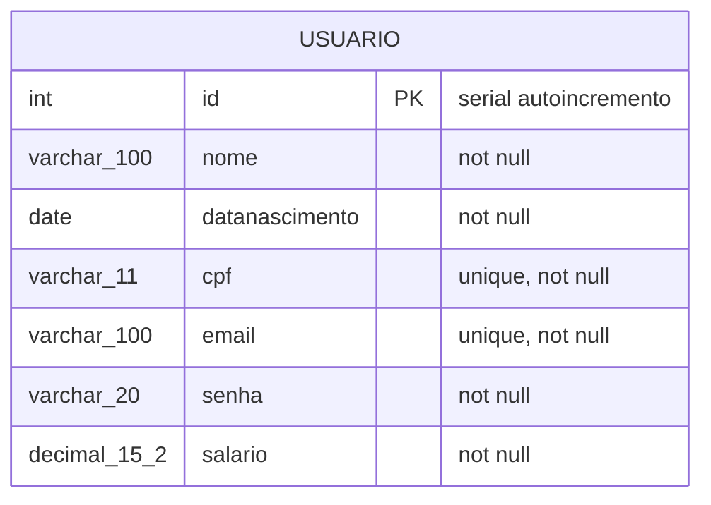
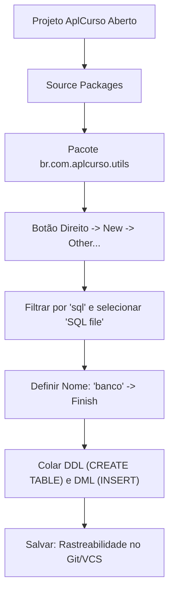
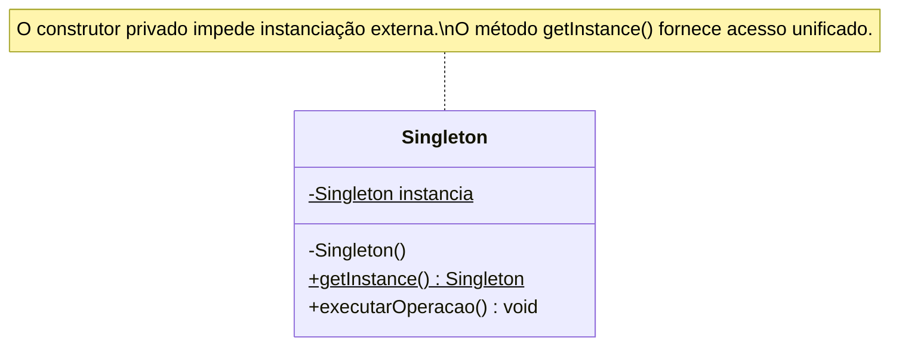
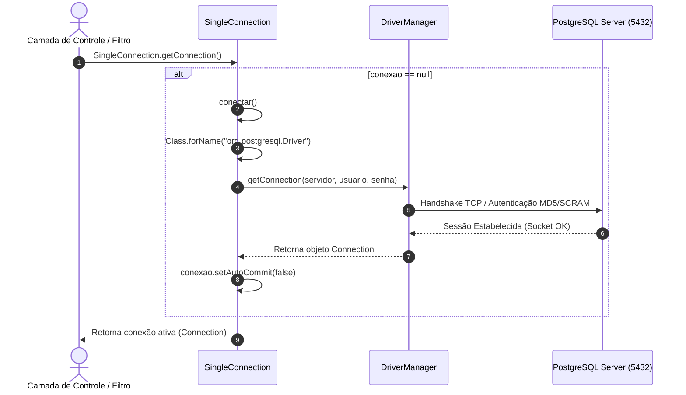
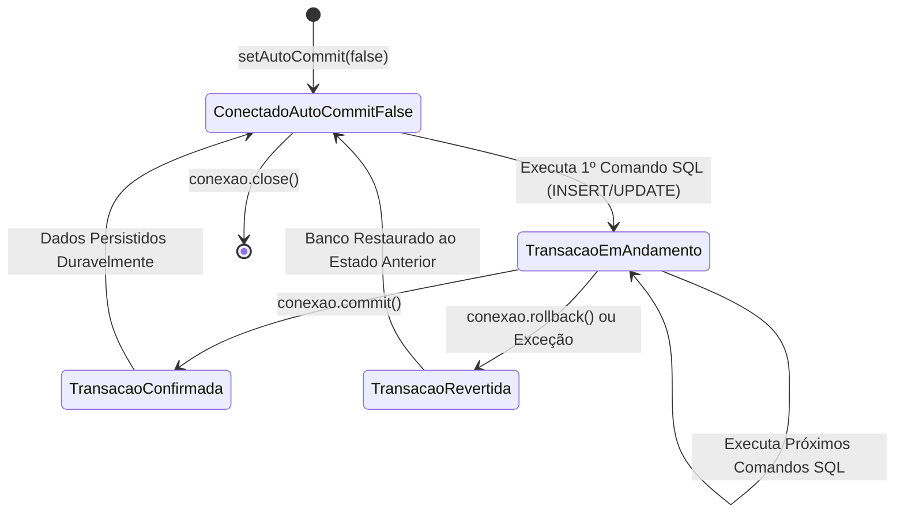
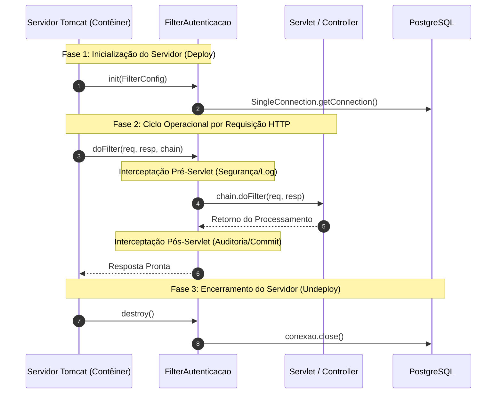
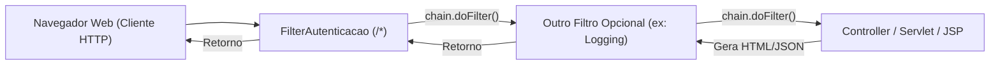
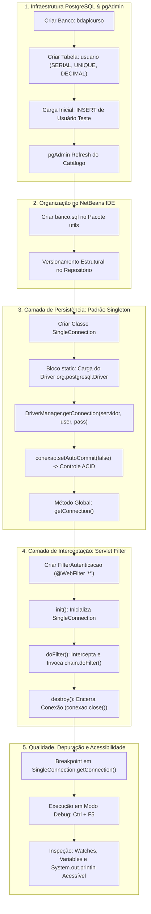

# Aula 03 — Conexão com Banco de Dados PostgreSQL

> **Professor:** Jefferson Passerini  
> **Disciplina:** Laboratório de Programação III (3º Semestre)  
> **Tema:** Arquitetura de persistência relacional, padrão criacional Singleton para conexão JDBC, interceptação de requisições com Servlet Filters, transações manuais e depuração acessível.

---

## Sumário

- [Objetivo da aula](#objetivo-da-aula)
- [Contexto e pré-requisitos](#contexto-e-pré-requisitos)
- [Criação e administração de banco de dados PostgreSQL via pgAdmin 4](#criação-e-administração-de-banco-de-dados-postgresql-via-pgadmin-4)
  - [Conceito e arquitetura do SGBD PostgreSQL](#conceito-e-arquitetura-do-sgbd-postgresql)
  - [Administração de instâncias e bancos no pgAdmin](#administração-de-instâncias-e-bancos-no-pgadmin)
  - [Fluxo operacional de criação e atualização cadastral](#fluxo-operacional-de-criação-e-atualização-cadastral)
  - [Comparativo: Operações gráficas versus scripts SQL](#comparativo-operações-gráficas-versus-scripts-sql)
- [Definição de DDL e DML para a tabela usuario com chave primária auto-incrementada (serial)](#definição-de-ddl-e-dml-para-a-tabela-usuario-com-chave-primária-auto-incrementada-serial)
  - [Tipagem de dados e integridade referencial](#tipagem-de-dados-e-integridade-referencial)
  - [Mecanismo do tipo serial e sequências internas](#mecanismo-do-tipo-serial-e-sequências-internas)
  - [Estrutura DDL e carga DML inicial](#estrutura-ddl-e-carga-dml-inicial)
  - [Modelo de Entidade e Relacionamento](#modelo-de-entidade-e-relacionamento)
  - [Armadilhas e contraexemplos na modelagem de colunas](#armadilhas-e-contraexemplos-na-modelagem-de-colunas)
- [Organização e versionamento de scripts SQL (banco.sql) em projetos Java Web no NetBeans](#organização-e-versionamento-de-scripts-sql-bancosql-em-projetos-java-web-no-netbeans)
  - [Papel do pacote br.com.aplcurso.utils](#papel-do-pacote-brcomaplcursoutils)
  - [Procedimento no NetBeans IDE para criação de SQL File](#procedimento-no-netbeans-ide-para-criação-de-sql-file)
  - [Rastreabilidade e versionamento junto ao código-fonte](#rastreabilidade-e-versionamento-junto-ao-código-fonte)
  - [Comparativo: Scripts versionados versus migrações automáticas](#comparativo-scripts-versionados-versus-migrações-automáticas)
- [Padrão de Projeto Criacional Singleton: conceitos, motivação, vantagens e desvantagens](#padrão-de-projeto-criacional-singleton-conceitos-motivação-vantagens-e-desvantagens)
  - [Definição formal e motivação do padrão](#definição-formal-e-motivação-do-padrão)
  - [Estrutura interna: construtor privado e ponto de acesso global](#estrutura-interna-construtor-privado-e-ponto-de-acesso-global)
  - [Diagrama de classes do padrão Singleton](#diagrama-de-classes-do-padrão-singleton)
  - [Vantagens, desvantagens e riscos de concorrência](#vantagens-desvantagens-e-riscos-de-concorrência)
  - [Comparativo: Padrões e abordagens de instanciação](#comparativo-padrões-e-abordagens-de-instanciação)
- [Implementação de conexão JDBC centralizada com a classe SingleConnection e Driver PostgreSQL](#implementação-de-conexão-jdbc-centralizada-com-a-classe-singleconnection-e-driver-postgresql)
  - [Arquitetura JDBC: Drivers, DriverManager e Connection](#arquitetura-jdbc-drivers-drivermanager-e-connection)
  - [Anatomia da URL de conexão JDBC](#anatomia-da-url-de-conexão-jdbc)
  - [Ciclo estático de inicialização e carga dinâmica do Driver](#ciclo-estático-de-inicialização-e-carga-dinâmica-do-driver)
  - [Diagrama de sequência da obtenção de conexão](#diagrama-de-sequência-da-obtenção-de-conexão)
  - [Código comentado: SingleConnection](#código-comentado-singleconnection)
- [Controle transacional manual em JDBC com desativação do autoCommit e propriedades ACID](#controle-transacional-manual-em-jdbc-com-desativação-do-autocommit-e-propriedades-acid)
  - [Fundamentos de transações e propriedades ACID](#fundamentos-de-transações-e-propriedades-acid)
  - [Comportamento do autoCommit no JDBC](#comportamento-do-autocommit-no-jdbc)
  - [Controle explícito com commit e rollback](#controle-explícito-com-commit-e-rollback)
  - [Máquina de estados de uma transação JDBC](#máquina-de-estados-de-uma-transação-jdbc)
  - [Comparativo: Gestão automática versus gestão manual de transações](#comparativo-gestão-automática-versus-gestão-manual-de-transações)
- [Conceito e ciclo de vida de Servlet Filters da API Java Servlet (init, doFilter e destroy)](#conceito-e-ciclo-de-vida-de-servlet-filters-da-api-java-servlet-init-dofilter-e-destroy)
  - [Arquitetura de interceptação HTTP](#arquitetura-de-interceptação-http)
  - [Métodos do ciclo de vida: init, doFilter e destroy](#métodos-do-ciclo-de-vida-init-dofilter-e-destroy)
  - [Diagrama de sequência do ciclo de vida do Filter](#diagrama-de-sequência-do-ciclo-de-vida-do-filter)
  - [Comparativo: Filter versus Servlet versus ServletContextListener](#comparativo-filter-versus-servlet-versus-servletcontextlistener)
- [Interceptação de requisições HTTP com a anotação @WebFilter e repasse via FilterChain](#interceptação-de-requisições-http-com-a-anotação-webfilter-e-repasse-via-filterchain)
  - [Configuração declarativa com @WebFilter e padrões de URL](#configuração-declarativa-com-webfilter-e-padrões-de-url)
  - [O papel do FilterChain e encadeamento de filtros](#o-papel-do-filterchain-e-encadeamento-de-filtros)
  - [Código comentado: FilterAutenticacao](#código-comentado-filterautenticacao)
  - [Fluxo de execução de filtros encadeados](#fluxo-de-execução-de-filtros-encadeados)
- [Técnicas de depuração no NetBeans: breakpoints, Watches, painel Variables e práticas de acessibilidade para programadores cegos](#técnicas-de-depuração-no-netbeans-breakpoints-watches-painel-variables-e-práticas-de-acessibilidade-para-programadores-cegos)
  - [Técnicas de inspeção em tempo de execução](#técnicas-de-inspeção-em-tempo-de-execução)
  - [Atalhos essenciais do depurador no NetBeans](#atalhos-essenciais-do-depurador-no-netbeans)
  - [Engenharia de software acessível para programadores cegos](#engenharia-de-software-acessível-para-programadores-cegos)
  - [Comparativo: Mecanismos de validação de estado](#comparativo-mecanismos-de-validação-de-estado)
- [Código da aula](#código-da-aula)
  - [Script SQL de infraestrutura: banco.sql](#script-sql-de-infraestrutura-bancosql)
  - [Classe de conexão: SingleConnection.java](#classe-de-conexão-singleconnectionjava)
  - [Filtro de interceptação: FilterAutenticacao.java](#filtro-de-interceptação-filterautenticacaojava)
  - [Classe de demonstração técnica: ExemplosAula.java](#classe-de-demonstração-técnica-exemplosaulajava)
  - [Suite de testes de integração: Exercicios.java](#suite-de-testes-de-integração-exerciciosjava)
- [Exercícios](#exercícios)
  - [Exercício 1: Criação da infraestrutura de banco de dados e tabela de usuários](#exercício-1-criação-da-infraestrutura-de-banco-de-dados-e-tabela-de-usuários)
  - [Exercício 2: Versionamento de script SQL na camada utils](#exercício-2-versionamento-de-script-sql-na-camada-utils)
  - [Exercício 3: Conexão JDBC persistente via padrão Singleton](#exercício-3-conexão-jdbc-persistente-via-padrão-singleton)
  - [Exercício 4: Interceptador de ciclo de vida com Servlet Filter](#exercício-4-interceptador-de-ciclo-de-vida-com-servlet-filter)
  - [Exercício 5: Roteiro de depuração e acessibilidade com leitores de tela](#exercício-5-roteiro-de-depuração-e-acessibilidade-com-leitores-de-tela)
- [Erros comuns e boas práticas](#erros-comuns-e-boas-práticas)
- [Links e materiais complementares](#links-e-materiais-complementares)
- [Mapa da aula](#mapa-da-aula)
- [Glossário](#glossário)
- [Pontos-chave para a prova](#pontos-chave-para-a-prova)
- [Perguntas e respostas (JSONL)](#perguntas-e-respostas-jsonl)
- [Checklist de revisão](#checklist-de-revisão)

---

## Objetivo da aula

Apresentar a arquitetura de persistência e integração entre aplicações Java Web corporativas e o Sistema Gerenciador de Banco de Dados (SGBD) relacional PostgreSQL. Ao final desta aula, o estudante será capaz de:

1. Administrar bancos relacionais por meio do pgAdmin 4 e do terminal SQL, executando operações DDL (*Data Definition Language*) e DML (*Data Manipulation Language*).
2. Estruturar a tabela `usuario` aplicando constraints de unicidade (`UNIQUE`), obrigatoriedade (`NOT NULL`), tipagem precisa de valores monetários (`DECIMAL`) e autoincremento por meio do pseudo-tipo `SERIAL`.
3. Organizar e versionar scripts SQL estruturais dentro do diretório de código-fonte de projetos Java Web no NetBeans IDE.
4. Compreender a teoria, a motivação técnica e as restrições do padrão de projeto criacional **Singleton** proposto pelo *Gang of Four* (GoF).
5. Implementar a classe utilitária `SingleConnection`, gerenciando o ciclo de vida do driver JDBC (`org.postgresql.Driver`) e centralizando a instância de conexão.
6. Configurar o controle manual de transações via JDBC através do método `setAutoCommit(false)`, fundamentando o comportamento sob a ótica das propriedades ACID (*Atomicidade, Consistência, Isolamento e Durabilidade*).
7. Implementar a interface `javax.servlet.Filter` na classe `FilterAutenticacao`, mapeando padrões de interceptação HTTP via anotação `@WebFilter` para gerenciar a inicialização e o fechamento seguro de recursos da aplicação.
8. Aplicar técnicas formais de depuração com breakpoints, painéis de variáveis e observadores (*Watches*) no NetBeans, associadas a práticas de acessibilidade por console para desenvolvedores com deficiência visual.

---

## Contexto e pré-requisitos

Esta aula integra a transição entre o desenvolvimento web puramente baseado em interfaces desacopladas e o desenvolvimento corporativo orientado a dados. Nas aulas anteriores, a arquitetura do projeto `AplCurso` consolidou a separação em camadas: Modelo (`model`), Controle (`controller`), Visualização (`Web Pages` com JSP/JSTL) e Filtros (`filter`).

Para a assimilação deste conteúdo, são necessários:
- Conhecimentos de Programação Orientada a Objetos em Java: classes, métodos estáticos, blocos estáticos de inicialização, construtores e tratamento de exceções com blocos `try-catch`.
- Conceitos fundamentais de banco de dados relacional: modelo relacional, chaves primárias e tipos de dados ANSI SQL.
- Ambiente operacional configurado com:
  - Java Development Kit (JDK) versão 17.
  - Servidor de Aplicações / Servidor de Páginas Apache Tomcat ou TomEE.
  - NetBeans IDE.
  - PostgreSQL Database Server (versão 12 ou superior).
  - pgAdmin 4 (ferramenta administrativa web/desktop).
  - Driver JDBC do PostgreSQL (`postgresql-42.x.x.jar`) adicionado às dependências do projeto.

---

## Criação e administração de banco de dados PostgreSQL via pgAdmin 4

### Conceito e arquitetura do SGBD PostgreSQL

O PostgreSQL é um Sistema Gerenciador de Banco de Dados Relacional Orientado a Objetos (SGBDRO) de código aberto, concebido com foco em extensibilidade, conformidade estrita com as normas ANSI/ISO SQL e integridade transacional robusta. Em um ambiente empresarial, o servidor executa como um processo de retaguarda (*daemon* ou serviço do sistema operacional) gerenciando conexões de rede em sua porta padrão TCP `5432`.

A ferramenta administrativa oficial é o **pgAdmin 4**, uma aplicação que provê interface gráfica sobre a arquitetura do banco, permitindo gerenciar instâncias de servidores, bancos de dados lógicos, esquemas (*schemas*), tabelas, sequências, regras de segurança e usuários.

### Administração de instâncias e bancos no pgAdmin

Para isolar os dados da aplicação `AplCurso`, cria-se um banco de dados dedicado denominado `bdaplcurso`.

#### Procedimento administrativo no pgAdmin
1. **Conexão ao Servidor:** Acessar a árvore hierárquica à esquerda (*Servers* -> *PostgreSQL*). Realizar o login administrativo utilizando o usuário padrão `postgres` e a senha definida durante a instalação do software.
2. **Criação do Banco:** Clicar com o botão direito do mouse sobre o nó `Databases` e navegar até o menu de contexto: `Create` -> `Database...`.
3. **Parametrização:**
   - **Database:** `bdaplcurso`
   - **Owner:** `postgres`
   - O campo de comentários (*Comment*) pode ser utilizado para metadados documentais, mas pode permanecer em branco em ambientes didáticos.
4. **Persistência:** Clicar no botão `Save`.
5. **Atualização da Interface (*Refresh*):** A interface do pgAdmin frequentemente não atualiza automaticamente a árvore estrutural após a execução de comandos DDL externos ou via janelas modais. É obrigatório clicar com o botão direito em `Databases` e selecionar a opção `Refresh...` para recarregar o catálogo do sistema.

### Fluxo operacional de criação e atualização cadastral



### Comparativo: Operações gráficas versus scripts SQL

| Critério | Operação Gráfica (pgAdmin GUI) | Script SQL (Query Tool / Arquivo .sql) |
| :--- | :--- | :--- |
| **Repetibilidade** | Baixa: exige múltiplos cliques e digitação manual em telas. | Alta: script executável com um comando em qualquer ambiente. |
| **Automação (CI/CD)** | Impossível de integrar a rotinas de integração contínua. | Nativa: compatível com ferramentas como Flyway, Liquibase e Docker. |
| **Risco Humano** | Alto: possibilidade de selecionar opções ou donos incorretos. | Baixo: execução determinística com validação de sintaxe. |
| **Curva de Aprendizado** | Baixa: intuitiva para exploração inicial e conferência visual. | Média: exige domínio da sintaxe formal ANSI SQL e dialeto PostgreSQL. |
| **Versionamento** | Inviável: estados de telas não podem ser comitados no Git. | Perfeito: arquivos `.sql` mantidos diretamente no repositório. |

---

## Definição de DDL e DML para a tabela usuario com chave primária auto-incrementada (serial)

### Tipagem de dados e integridade referencial

A persistência dos usuários do sistema exige integridade estrutural em nível de banco de dados. Para garantir que registros inconsistentes sejam rejeitados na camada de armazenamento, aplicam-se restrições (*constraints*) diretamente na instrução DDL:

- `id`: Chave primária (`PRIMARY KEY`), garantindo unicidade absoluta e indexação implícita via árvore B-Tree.
- `nome`: Cadeia de caracteres variável (`VARCHAR(100)`), não nula (`NOT NULL`).
- `datanascimento`: Tipo temporal puro de data (`DATE`), sem componente de fuso horário ou hora, não nulo.
- `cpf`: Cadeia fixa ou padronizada de 11 caracteres (`VARCHAR(11)`), com restrição de unicidade (`UNIQUE`) e obrigatoriedade (`NOT NULL`).
- `email`: Endereço eletrônico de até 100 caracteres (`VARCHAR(100)`), restrição de unicidade (`UNIQUE`) e obrigatoriedade (`NOT NULL`).
- `senha`: Hash ou texto da credencial (`VARCHAR(20)`), não nulo (`NOT NULL`).
- `salario`: Tipo numérico exato de ponto fixo (`DECIMAL(15,2)` ou `NUMERIC(15,2)`), com 15 dígitos de precisão total e 2 dígitos de escala decimal, não nulo (`NOT NULL`).

> **Nota de Engenharia:** Valores monetários NUNCA devem ser modelados como ponto flutuante binário (`FLOAT`, `REAL`, `DOUBLE PRECISION`) devido aos erros de arredondamento inerentes à norma IEEE 754. O uso de `DECIMAL(15,2)` preserva a exatidão aritmética em centavos.

### Mecanismo do tipo serial e sequências internas

No dialeto PostgreSQL, o tipo `SERIAL` não é um tipo de dado primitivo padrão do ANSI SQL, mas sim um atalho sintático (*syntactic sugar*). Ao declarar uma coluna como `id SERIAL PRIMARY KEY`, o SGBD realiza internamente três operações atômicas:

1. Cria um gerador de sequência com o comando implícito:
   ```sql
   CREATE SEQUENCE usuario_id_seq;
   ```
2. Define o tipo físico subjacente da coluna como `INTEGER` (inteiro de 4 bytes assinado, variando de 1 a 2.147.483.647).
3. Vincula o valor padrão da coluna à próxima geração da sequência e vincula a propriedade de propriedade (*ownership*):
   ```sql
   ALTER TABLE usuario ALTER COLUMN id SET DEFAULT nextval('usuario_id_seq');
   ALTER SEQUENCE usuario_id_seq OWNED BY usuario.id;
   ```

*(Complemento técnico: No padrão ANSI SQL moderno e a partir do PostgreSQL 10, a sintaxe padrão recomendada pela indústria é `id INTEGER GENERATED ALWAYS AS IDENTITY PRIMARY KEY`, contudo o tipo `SERIAL` permanece amplamente adotado e funcional em bases legadas e materiais didáticos).*

### Estrutura DDL e carga DML inicial

Para criar a tabela e carregar o primeiro registro no banco `bdaplcurso`, utiliza-se a ferramenta *Query Tool* do pgAdmin:

```sql
-- DDL: Criação da Tabela usuario
CREATE TABLE usuario (
    id SERIAL PRIMARY KEY,
    nome VARCHAR(100) NOT NULL,
    datanascimento DATE NOT NULL,
    cpf VARCHAR(11) UNIQUE NOT NULL,
    email VARCHAR(100) UNIQUE NOT NULL,
    senha VARCHAR(20) NOT NULL,
    salario DECIMAL(15,2) NOT NULL
);

-- DML: Inserção de Carga Inicial
INSERT INTO usuario (nome, datanascimento, cpf, email, senha, salario)
VALUES (
    'João José Gomes da Silva',
    '1990-08-10',
    '08243060073',
    'joaojosegomes@gmail.com',
    'senha123',
    5200.00
);

-- DML: Consulta de Conferência
SELECT id, nome, datanascimento, cpf, email, senha, salario 
FROM usuario;
```

### Modelo de Entidade e Relacionamento



### Armadilhas e contraexemplos na modelagem de colunas

#### Contraexemplo 1: Utilização de tipos de ponto flutuante para dinheiro
```sql
-- INCORRETO: Causa perda de precisão centesimal em cálculos acumulados
salario FLOAT NOT NULL
```
*Problema:* Operações monetárias sobre `FLOAT` geram valores residuais imprevisíveis (ex.: `5200.000000000001` ou `5199.999999999999`), violando regras contábeis e fiscais.

#### Contraexemplo 2: Omissão da constraint UNIQUE em CPF ou E-mail
```sql
-- INCORRETO: Permite que dois usuários distintos tenham o mesmo e-mail ou documento
cpf VARCHAR(11) NOT NULL,
email VARCHAR(100) NOT NULL
```
*Problema:* Falhas de concorrência ou bugs na camada Java permitirão a gravação de contas duplicadas, impossibilitando autenticação unívoca na camada de controle.

---

## Organização e versionamento de scripts SQL (banco.sql) em projetos Java Web no NetBeans

### Papel do pacote br.com.aplcurso.utils

A arquitetura do projeto `AplCurso` está organizada sob uma estrutura lógica de pacotes Java:
- `br.com.aplcurso.controller.usuario`: Contém as Servlets controladoras que atendem requisições HTTP e despacham fluxos.
- `br.com.aplcurso.dao`: Contém as classes *Data Access Object* responsáveis pelo CRUD junto à base de dados.
- `br.com.aplcurso.filter`: Contém os filtros de interceptação da aplicação.
- `br.com.aplcurso.model`: Contém as classes JavaBean/POJO que espelham as entidades do domínio.
- `br.com.aplcurso.utils`: Pacote reservado para recursos auxiliares, conectores, constantes e classes utilitárias de suporte a todo o sistema.

A guarda do arquivo estrutural de banco de dados (`banco.sql`) dentro de `br.com.aplcurso.utils` assegura que o script de criação da infraestrutura física acompanhe o ciclo de vida do código-fonte.

### Procedimento no NetBeans IDE para criação de SQL File

1. Na aba **Projects**, expandir a raiz `AplCurso` -> `Source Packages`.
2. Localizar e clicar com o botão direito sobre o pacote `br.com.aplcurso.utils`.
3. Selecionar o menu `New` -> `Other...`.
4. Na tela de assistente (*New File*):
   - No campo **Filter**, digitar `sql`.
   - Na lista **Categories**, selecionar `Other`.
   - Na lista **File Types**, selecionar `SQL file`. Clicar em `Next >`.
5. Na tela seguinte:
   - **File Name:** `banco`
   - O caminho físico resultante será:  
     `src/java/br/com/aplcurso/utils/banco.sql` (ou caminho equivalente no sistema operacional).
6. Clicar em `Finish`.
7. O editor de texto embutido do NetBeans abrirá o arquivo. Colar o conteúdo DDL de criação da tabela `usuario` e o DML de inserção inicial executados previamente no pgAdmin.



### Rastreabilidade e versionamento junto ao código-fonte

A manutenção do script de banco de dados diretamente na árvore de fontes Java resolve problemas estruturais em equipes de desenvolvimento:
- **Reprodutibilidade do Ambiente:** Qualquer novo desenvolvedor que clona o repositório Git do projeto obtém imediatamente os scripts necessários para inicializar sua base de dados local sem depender de dumps desatualizados enviados por meios externos.
- **Rastreabilidade de Alterações:** Toda modificação estrutural (ex.: criação de uma nova coluna ou nova tabela) deve ser adicionada a este arquivo e comitada juntamente com a alteração das classes Java correspondentes (Model e DAO).

### Comparativo: Scripts versionados versus migrações automáticas

| Característica | Script SQL Interno (`banco.sql`) | Ferramentas de Migração (Flyway / Liquibase) |
| :--- | :--- | :--- |
| **Abordagem** | Didática, centralizada e manual. | Automatizada via esteiras de migração estruturada. |
| **Execução** | Manual: o desenvolvedor copia/cola no pgAdmin ou roda via IDE. | Automática: o framework aplica migrações no boot da aplicação. |
| **Complexidade** | Nenhuma dependência externa adicional no `pom.xml` ou `lib`. | Requer configuração de plugins e versionamento rigoroso de arquivos `V1__...sql`. |
| **Adequação** | Ideal para a disciplina de Laboratório de Programação III. | Padrão da indústria para aplicações de larga escala em produção. |

---

## Padrão de Projeto Criacional Singleton: conceitos, motivação, vantagens e desvantagens

### Definição formal e motivação do padrão

O padrão **Singleton** pertence à categoria dos padrões criacionais catalogados pelo consórcio *Gang of Four* (GoF — Gamma, Helm, Johnson e Vlissides).

> **Definição Canônica:** "Garantir que uma classe tenha apenas uma única instância durante toda a execução do programa e fornecer um ponto de acesso global e irrestrito a ela."

Em sistemas de software, certos recursos materiais ou lógicos são inerentemente caros para serem alocados e mantidos, ou requerem um ponto centralizado de autoridade e controle. Exemplos típicos incluem:
- Conexões com SGBDs e pools de conexões.
- Gerenciadores de configurações lidas de arquivos `.properties` ou `.json`.
- Sistemas de log de eventos corporativos (*loggers*).
- Spools de impressão e drivers de hardware específicos.

### Estrutura interna: construtor privado e ponto de acesso global

Para implementar o padrão Singleton em Java, a classe deve cumprir obrigatoriamente três regras arquiteturais:

1. **Atributo Estático Privado:** A classe mantém uma referência estática privada de sua própria instância (ou do recurso centralizado que administra).
2. **Construtor Privado:** O construtor padrão da classe é explicitamente declarado com o modificador de acesso `private`. Isso revoga a permissão de outras classes externas instanciarem novos objetos através do operador `new` (ex.: `new Singleton()` resultará em erro de compilação).
3. **Ponto de Acesso Global (Método Estático):** Disponibilização de um método público e estático (tradicionalmente denominado `getInstance()`), responsável por retornar a instância controlada.

### Diagrama de classes do padrão Singleton



### Vantagens, desvantagens e riscos de concorrência

#### Vantagens
- **Controle Rigoroso de Instanciação:** Impede que consumidores do código saturem a memória criando instâncias desnecessárias para recursos únicos.
- **Redução do Consumo de Memória:** Como a instância é compartilhada globalmente, evita-se a sobrecarga no *Garbage Collector* de coletar e recriar instâncias pesadas repetidamente.
- **Ponto de Acesso Centralizado:** Centraliza parametrizações críticas (endereço de IP do banco, credenciais e configurações de timeout) em um único ponto arquitetural.

#### Desvantagens e Riscos
- **Violação do Princípio da Responsabilidade Única (SRP):** A classe assume duas funções: executar suas tarefas de negócio/utilidade e controlar o próprio ciclo de vida.
- **Acoplamento Global e Dificuldade em Testes:** Classes que dependem diretamente de métodos estáticos globais são extremamente difíceis de serem mockadas em testes unitários automatizados (ex.: com Mockito ou JUnit).
- **Condições de Corrida (*Race Conditions*) em Ambientes Multithread:** Em uma aplicação web, centenas de requisições concorrentes podem chamar o método `getInstance()` simultaneamente. Se a instanciação for do tipo preguiçosa (*lazy loading*) sem sincronização (`synchronized`), duas threads podem avaliar a condição `instancia == null` como verdadeira e gerar duas instâncias distintas na memória.
- **Gargalo de I/O em Conexões Únicas:** *(Nota crítica de engenharia)*: Compartilhar um único objeto `java.sql.Connection` por toda uma aplicação web corporativa (como adotado no exemplo didático) impede transações concorrentes verdadeiramente independentes, pois a execução de um `rollback` em uma thread cancelará transações de outras threads ativas na mesma conexão. Em ambientes de produção reais, substitui-se o Singleton de Conexão Única por um **Pool de Conexões** (como HikariCP ou Apache Commons DBCP).

### Comparativo: Padrões e abordagens de instanciação

| Abordagem | Criação | Thread-Safety Nativa | Testabilidade | Uso Ideal |
| :--- | :--- | :--- | :--- | :--- |
| **Singleton Eager (Ávido)** | No carregamento da classe (`static`). | Sim (garantida pelo ClassLoader). | Difícil. | Recursos leves com certeza de uso imediato. |
| **Singleton Lazy (Simples)** | Sob demanda (`if null`). | Não (exige `synchronized`). | Difícil. | Ambientes estritamente mono-thread. |
| **Classe Utilitária Estática** | Não permite instâncias (`static methods`). | Sim (se métodos forem puros). | Baixa. | Funções matemáticas e manipuladores de texto (`Math`, `StringUtils`). |
| **Injeção de Dependências (CDI/Spring)** | Gerenciada por contêiner (`@ApplicationScoped`). | Alta (controlada pelo framework). | Excelente (fácil substituição por Mocks). | Padrão moderno de mercado em microsserviços e Java EE. |

---

## Implementação de conexão JDBC centralizada com a classe SingleConnection e Driver PostgreSQL

### Arquitetura JDBC: Drivers, DriverManager e Connection

A API **JDBC** (*Java Database Connectivity*) é uma camada de abstração em nível de código Java que padroniza o acesso a bancos relacionais independentemente do fornecedor (PostgreSQL, Oracle, MySQL, SQL Server).

Os componentes arquiteturais essenciais são:
1. `java.sql.Driver`: Interface implementada pelo fabricante do banco de dados (neste caso, a classe `org.postgresql.Driver` embutida no JAR do PostgreSQL).
2. `java.sql.DriverManager`: Classe utilitária do Java que atua como despachante de conexões, gerenciando os drivers carregados e negociando a conexão a partir de uma URL.
3. `java.sql.Connection`: Interface que representa uma sessão física e lógica ativa com a base de dados, permitindo emissão de comandos SQL e controle transacional.

### Anatomia da URL de conexão JDBC

No projeto `AplCurso`, a constante que define o endereço de conexão com a base é:
```text
jdbc:postgresql://localhost:5432/bdaplcurso?autoReconnect=true
```

Decompondo seus elementos:
- `jdbc:`: O protocolo raiz da API JDBC.
- `postgresql:`: O subprotocolo, identificando qual driver específico do `DriverManager` deve tratar a URL.
- `//localhost`: O endereço de rede do servidor hospedeiro do SGBD (neste caso, o próprio computador local através do IP de loopback `127.0.0.1`).
- `:5432`: A porta TCP na qual o processo do PostgreSQL está escutando.
- `/bdaplcurso`: O nome lógico do banco de dados que será aberto.
- `?autoReconnect=true`: Parâmetro de consulta informando ao conector para tentar restabelecer a conexão automaticamente caso a comunicação sofra interrupção temporária.

### Ciclo estático de inicialização e carga dinâmica do Driver

A classe `SingleConnection` utiliza o recurso de **bloco estático de inicialização** (`static { ... }`). Esse bloco é executado pela Máquina Virtual Java (JVM) exatamente uma única vez, no instante em que a classe é carregada na memória pelo *ClassLoader*, antes que qualquer construtor seja invocado ou qualquer método estático seja chamado.

No método `conectar()`, a instrução:
```java
Class.forName("org.postgresql.Driver");
```
força a JVM a localizar e carregar a classe do driver PostgreSQL. Durante esse processo de carregamento, o bloco estático da própria classe `org.postgresql.Driver` registra sua instância junto ao `DriverManager.registerDriver()`, habilitando a criação de conexões subsequentes.

### Diagrama de sequência da obtenção de conexão



### Código comentado: SingleConnection

```java
package br.com.aplcurso.utils;

import java.sql.Connection;
import java.sql.DriverManager;

/**
 * Classe utilitária que implementa o padrão Singleton para gerenciar
 * uma única conexão ativa com o banco de dados PostgreSQL.
 */
public class SingleConnection {
 
    // Atributo estático que armazena a única instância da conexão JDBC
    private static Connection conexao = null;
    
    // Configurações de conexão: URL JDBC, credenciais administrativas
    private static String servidor = "jdbc:postgresql://localhost:5432/bdaplcurso?autoReconnect=true";
    private static String usuario = "postgres";
    private static String senha = "postdba";
 
    // Bloco de inicialização estático: executado automaticamente no carregamento da classe
    static {
        try {
            conectar();
        } catch (Exception ex) {
            System.out.println("Erro ao conectar ao banco de dados");
            ex.printStackTrace();
        }
    }
 
    // Construtor público (invoca conectar para manter resiliência caso ainda não inicializado)
    public SingleConnection() throws Exception {
        conectar();
    }
 
    /**
     * Estabelece a conexão física com o banco de dados caso ela ainda não exista.
     * Desativa o autoCommit para permitir transações manuais via JDBC.
     */
    public static void conectar() throws Exception {
        try {
            if (conexao == null) {
                // Registra o Driver JDBC do PostgreSQL no DriverManager
                Class.forName("org.postgresql.Driver");
                
                // Abre a sessão física com o SGBD
                conexao = DriverManager.getConnection(servidor, usuario, senha); 
                
                // Desativa a confirmação automática de transações (exige commit explícito)
                conexao.setAutoCommit(false);
            }
        } catch (Exception ex) {
            // Relança a exceção empacotada
            throw new Exception(ex.getMessage());
        }
    }
 
    /**
     * Fornece o ponto de acesso global à conexão ativa.
     * @return Objeto Connection pronto para emissão de comandos SQL.
     */
    public static Connection getConnection() {
        return conexao;
    } 
}
```

---

## Controle transacional manual em JDBC com desativação do autoCommit e propriedades ACID

### Fundamentos de transações e propriedades ACID

Uma **transação** é uma sequência de uma ou mais operações SQL que devem ser tratadas pelo SGBD como uma unidade indivisível de processamento. A integridade transacional é regida formalmente pelas propriedades **ACID**:

- **Atomicidade (*Atomicity*):** Princípio do "tudo ou nada". Todas as alterações contidas no bloco transacional devem ser persistidas com sucesso. Se uma única instrução falhar, todas as instruções anteriores devem ser revertidas integralmente.
- **Consistência (*Consistency*):** A transação leva o banco de dados de um estado válido a outro estado igualmente válido, respeitando rigorosamente todas as constraints (chaves estrangeiras, chaves primárias, restrições de verificação e tipos de dados).
- **Isolamento (*Isolation*):** Operações realizadas por uma transação em andamento não devem ser visíveis para outras transações concorrentes até que ocorra a confirmação definitiva, evitando leituras sujas (*dirty reads*).
- **Durabilidade (*Durability*):** Uma vez que a transação tenha sido confirmada com sucesso, os dados modificados tornam-se permanentes no disco e resistem a falhas subsequentes de energia ou travamentos do sistema operacional.

### Comportamento do autoCommit no JDBC

Por padrão, a especificação JDBC estabelece que toda nova conexão criada via `DriverManager.getConnection()` opera com `autoCommit = true`.

Sob o modo `autoCommit = true`, cada instrução SQL (`INSERT`, `UPDATE`, `DELETE`) enviada através de um objeto `Statement` ou `PreparedStatement` é tratada como uma transação individual e autônoma, sendo imediatamente confirmada e persistida no disco físico logo após sua execução.

Na classe `SingleConnection`, essa regra padrão é revogada explicitamente:
```java
conexao.setAutoCommit(false);
```

Com o `autoCommit` desativado:
1. O envio do primeiro comando SQL inicia implicitamente uma transação no PostgreSQL (equivalente a um comando `BEGIN TRANSACTION;`).
2. Múltiplas instruções podem ser executadas em sequência.
3. As alterações permanecem apenas em um buffer transacional isolado na memória do SGBD.
4. Nenhuma outra conexão ao banco consegue visualizar essas alterações até que ocorra o `COMMIT`.

### Controle explícito com commit e rollback

Ao desativar o autoCommit, a responsabilidade pelo ciclo de vida dos dados passa integralmente para o programador na camada de persistência (DAOs ou Filtros):

- `conexao.commit()`: Envia a confirmação formal ao SGBD. Todas as gravações pendentes da transação ativa tornam-se definitivas e duráveis no disco.
- `conexao.rollback()`: Aborta a transação. O banco de dados descarta todas as alterações pendentes daquela sessão, retornando o estado das tabelas ao exato ponto anterior ao início da transação.

### Máquina de estados de uma transação JDBC



### Comparativo: Gestão automática versus gestão manual de transações

| Característica | autoCommit = true (Automático) | autoCommit = false (Manual) |
| :--- | :--- | :--- |
| **Início da Transação** | Automático a cada comando SQL isolado. | Implícito a partir do primeiro comando executado. |
| **Finalização** | Imediata ao término do comando individual. | Exige invocação explícita de `commit()` ou `rollback()`. |
| **Resiliência a Erros** | Nula em operações compostas: se o segundo comando falhar, o primeiro já foi gravado. | Alta: permite desfazer todo o lote através do bloco `catch` com `rollback()`. |
| **Integridade Multi-tabelas** | Inadequada para cenários de mestre-detalhe (ex.: Pedido e Itens do Pedido). | Perfeita: garante que detalhes só existam se o mestre for criado. |
| **Sobrecarga de I/O** | Alta: força gravações em disco (*fsync*) a cada instrução SQL emitida. | Baixa: agrupa operações de escrita em um único lote durável. |

---

## Conceito e ciclo de vida de Servlet Filters da API Java Servlet (init, doFilter e destroy)

### Arquitetura de interceptação HTTP

Na especificação oficial Java Servlet (módulo `javax.servlet`), um **Filter** (Filtro) é um componente especializado capaz de transformar o conteúdo de requisições (`ServletRequest`) e respostas (`ServletResponse`), além de interceptar o fluxo de execução antes e depois que este alcance um recurso de destino (uma Servlet controladora, uma página JSP ou um recurso estático HTML).

Os filtros atuam como um funil centralizador baseado no padrão de projeto comportamental **Chain of Responsibility** (Cadeia de Responsabilidade) e **Intercepting Filter**. Eles resolvem interesses transversais (*cross-cutting concerns*), tais como:
- Autenticação e autorização de acesso a rotas protegidas.
- Auditoria de acessos e medição de telemetria/logs.
- Compactação e criptografia de payloads de resposta (GZIP).
- Tratamento de encoding de caracteres (`UTF-8`).
- Abertura e fechamento de conexões transacionais (*Open Session in View*).

### Métodos do ciclo de vida: init, doFilter e destroy

A interface `javax.servlet.Filter` exige o cumprimento de um contrato composto por três métodos fundamentais:

#### 1. Método `init(FilterConfig filterConfig)`
- **Execução:** Chamado pelo contêiner de servlets (Apache Tomcat) **uma única vez** no momento da implantação (*deploy*) e inicialização da aplicação web no servidor.
- **Finalidade:** Realizar configurações de infraestrutura pesadas que devem perdurar por todo o tempo em que a aplicação estiver ativa. No projeto didático, é utilizado para inicializar a conexão única: `conexao = SingleConnection.getConnection()`.

#### 2. Método `doFilter(ServletRequest request, ServletResponse response, FilterChain chain)`
- **Execução:** Disparado **a cada requisição HTTP** recebida pelo servidor que coincida com o padrão de URL mapeado no filtro.
- **Finalidade:** Inspecionar cabeçalhos, tratar parâmetros, verificar sessões de autenticação e, obrigatoriamente, decidir se o processamento prossegue chamando `chain.doFilter(request, response)` ou se a requisição deve ser interrompida/redirecionada.

#### 3. Método `destroy()`
- **Execução:** Chamado pelo contêiner web **uma única vez** no momento em que a aplicação é descarregada (*undeploy*) ou quando o servidor Tomcat é desligado de forma graciosa.
- **Finalidade:** Liberação de recursos mantidos na memória. No projeto `AplCurso`, é utilizado para encerrar a conexão JDBC ativa através de `conexao.close()`, evitando vazamento de conexões (*connection leaks*) no SGBD.

### Diagrama de sequência do ciclo de vida do Filter



### Comparativo: Filter versus Servlet versus ServletContextListener

| Componente | Interface Base | Propósito Central | Instanciação / Ciclo |
| :--- | :--- | :--- | :--- |
| **Filter** | `javax.servlet.Filter` | Interceptar, validar ou transformar requisições antes e depois do destino. | Instância única no contêiner; `doFilter` roda a cada requisição. |
| **Servlet** | `javax.servlet.http.HttpServlet` | Processar requisições específicas de negócio e produzir a resposta HTTP. | Instância única; `service`/`doGet`/`doPost` roda a cada requisição. |
| **Listener** | `javax.servlet.ServletContextListener` | Reagir a eventos de ciclo de vida global do contexto web (início e término). | Disparado apenas nos eventos globais de inicialização e desligamento do app. |

---

## Interceptação de requisições HTTP com a anotação @WebFilter e repasse via FilterChain

### Configuração declarativa com @WebFilter e padrões de URL

Historicamente (até a versão Servlet 2.5), a vinculação de filtros dependia obrigatoriamente de declarações volumosas em XML no arquivo `web.xml`:
```xml
<filter>
    <filter-name>FilterAutenticacao</filter-name>
    <filter-class>br.com.aplcurso.filter.FilterAutenticacao</filter-class>
</filter>
<filter-mapping>
    <filter-name>FilterAutenticacao</filter-name>
    <url-pattern>/*</url-pattern>
</filter-mapping>
```

A partir da especificação Servlet 3.0 (Java EE 6 em diante), introduziu-se a configuração declarativa via anotações, reduzindo o acoplamento estrutural. Adiciona-se a anotação `@WebFilter` sobre a classe:
```java
@WebFilter(urlPatterns = {"/*"})
```

O padrão de URL `/*` estabelece que toda e qualquer requisição direcionada à aplicação (páginas JSP, arquivos HTML, servlets de login, imagens e folhas de estilo CSS) a partir da raiz do contexto passará obrigatoriamente pelo método `doFilter` desta classe antes de qualquer outro processamento.

### O papel do FilterChain e encadeamento de filtros

O parâmetro `FilterChain chain` representa a cadeia sequencial de filtros configurada no contêiner web. Quando múltiplos filtros estão interceptando o mesmo padrão de URL, o contêiner organiza-os em fila.

A invocação de:
```java
chain.doFilter(request, response);
```
opera como um gatilho de repasse. Se existirem outros filtros registrados na sequência, o contêiner aciona o próximo filtro. Se o filtro atual for o último elemento da cadeia, o contêiner despacha os objetos de requisição e resposta para a Servlet controladora ou página JSP de destino final.

Se o desenvolvedor suprimir intencionalmente ou acidentalmente a chamada a `chain.doFilter()`, a cadeia é interrompida abruptamente, e a requisição jamais chegará à camada de controle, gerando uma tela branca ou timeout no navegador do usuário.

### Código comentado: FilterAutenticacao

```java
package br.com.aplcurso.filter;

import br.com.aplcurso.utils.SingleConnection;
import java.io.IOException;
import java.sql.Connection;
import java.sql.SQLException;
import javax.servlet.Filter;
import javax.servlet.FilterChain;
import javax.servlet.FilterConfig;
import javax.servlet.ServletException;
import javax.servlet.ServletRequest;
import javax.servlet.ServletResponse;
import javax.servlet.annotation.WebFilter;

/**
 * Filtro de interceptação que centraliza o ciclo de vida da conexão JDBC
 * e audita todas as requisições direcionadas à aplicação.
 */
@WebFilter(urlPatterns = {"/*"})
public class FilterAutenticacao implements Filter {

    // Armazena a referência para a conexão que será compartilhada no ciclo
    private static Connection conexao;
 
    /**
     * Executado uma única vez no boot do servidor Tomcat.
     * Realiza a abertura antecipada da conexão com a base de dados.
     */
    @Override
    public void init(FilterConfig filterConfig) throws ServletException {
        // Obtém a instância Singleton da conexão
        conexao = SingleConnection.getConnection(); 
    }

    /**
     * Intercepta individualmente cada requisição e resposta HTTP da aplicação.
     */
    @Override
    public void doFilter(ServletRequest request, ServletResponse response, FilterChain chain) 
            throws IOException, ServletException {
        try {
            // Repassa a requisição para o próximo filtro ou para a Servlet de destino
            chain.doFilter(request, response);
        } catch (Exception e) {
            // Captura falhas de processamento nas camadas internas
            System.out.println("Erro detectado no FilterAutenticacao: " + e.getMessage());
            e.printStackTrace();
        } 
    }

    /**
     * Executado no encerramento da aplicação no contêiner web.
     * Fecha formalmente a sessão física com o SGBD.
     */
    @Override
    public void destroy() {
        try {
            if (conexao != null && !conexao.isClosed()) {
                conexao.close(); // Liberação do recurso no PostgreSQL
            }
        } catch (SQLException ex) {
            System.out.println("Erro ao fechar conexão no destroy: " + ex.getMessage());
            ex.printStackTrace();
        } 
    }
}
```

### Fluxo de execução de filtros encadeados



---

## Técnicas de depuração no NetBeans: breakpoints, Watches, painel Variables e práticas de acessibilidade para programadores cegos

### Técnicas de inspeção em tempo de execução

A depuração (*debugging*) é o procedimento formal de pausar a execução da JVM sob demanda para inspecionar o estado real de variáveis, o ponteiro de execução e o fluxo de controle de métodos em memória.

No contexto desta aula, a meta é verificar se o atributo `conexao` foi instanciado com sucesso ou se permaneceu com o valor nulo (`null`), o que indicaria que a comunicação com o PostgreSQL falhou silenciosamente antes do repasse às servlets.

Para isso, marca-se um **breakpoint** exatamente na linha `return conexao;` dentro do método `getConnection()` da classe `SingleConnection`.

### Atalhos essenciais do depurador no NetBeans

| Comando de Depuração | Atalho (Windows / Linux) | Atalho (macOS) | Descrição e Propósito Técnico |
| :--- | :--- | :--- | :--- |
| **Alternar Breakpoint** | `Ctrl + F8` | `Cmd + F8` | Adiciona ou remove a marcação de parada na linha corrente. |
| **Iniciar Depuração** | `Ctrl + F5` | `Cmd + F5` | Inicia o projeto AplCurso acoplado ao depurador da JVM. |
| **Continuar Execução** | `F5` | `F5` | Retoma a execução livre até o próximo breakpoint encontrado. |
| **Passar por Cima (*Step Over*)** | `F8` | `F8` | Executa a linha atual sem entrar nas chamadas de métodos internos. |
| **Entrar no Método (*Step Into*)** | `F7` | `F7` | Direciona o ponteiro para o interior do método invocado na linha. |
| **Sair do Método (*Step Out*)** | `Shift + F7` | `Shift + F7` | Conclui o método corrente e pausa imediatamente na linha chamadora. |
| **Parar Sessão de Debug** | `Shift + F5` | `Shift + F5` | Aborta a execução do servidor e desconecta o depurador. |
| **Abrir Painel de Variáveis** | `Alt + Shift + 1` | `Cmd + Shift + 1` | Foca a janela *Variables* para inspeção de escopos locais e estáticos. |
| **Novo Observador (*Watch*)** | `Ctrl + Shift + F7` | `Cmd + Shift + F7` | Cria uma expressão contínua de monitoramento de variável. |

### Engenharia de software acessível para programadores cegos

A validação de estado visual por meio de *tooltips* do mouse (posicionar o ponteiro sobre a variável para ler seu valor em uma caixa flutuante) é uma barreira de acessibilidade intransponível para desenvolvedores com deficiência visual (cegos ou com baixa visão) que utilizam leitores de tela como **NVDA**, **JAWS** ou **Orca**.

A engenharia de acessibilidade provê três abordagens programáticas e operacionais para garantir autonomia total:

#### 1. Abordagem por Telemetria Explícita em Console (Leitura via Terminal)
Inserção temporária de instruções no método de acesso para que o leitor de tela leia o status diretamente na saída de depuração:
```java
public static Connection getConnection() {
    if (conexao == null) {
        System.out.println("DEBUG ACCESSIBILITY: Objeto conexao está NULO! Falha no driver ou credenciais.");
    } else {
        System.out.println("DEBUG ACCESSIBILITY: Objeto conexao instanciado com sucesso: " + conexao);
    }
    return conexao;
}
```
*Vantagem:* Ao rodar o sistema, a linha é lida automaticamente pelo sintetizador de voz do leitor de tela sem exigir navegação em árvores visuais da IDE.

#### 2. Monitoramento via Janela Watches com Teclado
Quando a JVM parar no breakpoint:
1. Pressionar o atalho `Ctrl + Shift + F7`.
2. Digitar a expressão `conexao` e pressionar `Enter`.
3. Navegar pela janela de observações utilizando estritamente as teclas `Tab` e as setas direcionais, ouvindo os atributos do objeto via sintetizador.

#### 3. Navegação Hierárquica no Painel Variables
1. Ao pausar a execução, acionar `Alt + Shift + 1` para mover o foco do sistema operacional diretamente para o painel *Variables*.
2. Utilizar a tecla `Seta para Baixo` até a linha `conexao`. O leitor de tela vocalizará:  
   `"conexao = PgConnection (id=X) ou conexao = null"`.

### Comparativo: Mecanismos de validação de estado

| Método | Dependência Visual | Acessível via Leitor de Tela | Custo de Modificação de Código | Indicado Para |
| :--- | :--- | :--- | :--- | :--- |
| **Tooltip do Mouse** | Total (exige posicionamento do cursor). | Não acessível. | Zero. | Desenvolvedores videntes em análises rápidas. |
| **Painel Variables (Alt+Shift+1)** | Parcial (suporta teclado). | Plenamente Acessível. | Zero. | Inspeção geral de todas as variáveis ativas no escopo. |
| **Watches (Ctrl+Shift+F7)** | Parcial (suporta teclado). | Plenamente Acessível. | Zero. | Monitoramento focado de expressões ou atributos críticos. |
| **System.out.println Explícito** | Nula (saída em fluxo de texto puro). | Altamente Acessível. | Exige inserção e posterior remoção de código. | Diagnóstico imediato vocalizado durante execução contínua. |

---

## Código da aula

Nesta seção, consolidam-se as especificações e o código completo de cada um dos arquivos gerados para a infraestrutura do projeto `AplCurso`.

### Script SQL de infraestrutura: banco.sql

Localizado no diretório relativo [./codigo/banco.sql](file:///./codigo/banco.sql), este script reúne as instruções de criação de tabela e inserção do usuário inicial.

```sql
-- Arquivo: banco.sql
-- Localização no projeto: src/java/br/com/aplcurso/utils/banco.sql
-- Propósito: Criação da estrutura relacional da tabela usuario e carga inicial de testes.

-- 1. Criação da tabela de usuários com constraints formais
CREATE TABLE usuario (
    id SERIAL PRIMARY KEY,
    nome VARCHAR(100) NOT NULL,
    datanascimento DATE NOT NULL,
    cpf VARCHAR(11) UNIQUE NOT NULL,
    email VARCHAR(100) UNIQUE NOT NULL,
    senha VARCHAR(20) NOT NULL,
    salario DECIMAL(15,2) NOT NULL
);

-- 2. Carga inicial de testes com dados em conformidade estrutural
INSERT INTO usuario (nome, datanascimento, cpf, email, senha, salario)
VALUES (
    'João José Gomes da Silva',
    '1990-08-10',
    '08243060073',
    'joaojosegomes@gmail.com',
    'senha123',
    5200.00
);

-- 3. Consulta de validação imediata
SELECT * FROM usuario;
```

### Classe de conexão: SingleConnection.java

Localizada em [./codigo/SingleConnection.java](file:///./codigo/SingleConnection.java), é a classe central de persistência sob o padrão Singleton.

```java
package br.com.aplcurso.utils;

import java.sql.Connection;
import java.sql.DriverManager;

public class SingleConnection {
 
    private static Connection conexao = null;
    private static String servidor = "jdbc:postgresql://localhost:5432/bdaplcurso?autoReconnect=true";
    private static String usuario = "postgres";
    private static String senha = "postdba";
 
    static {
        try {
            conectar();
        } catch (Exception ex) {
            System.out.println("Erro ao conectar ao banco de dados");
            ex.printStackTrace();
        }
    }
 
    public SingleConnection() throws Exception {
        conectar();
    }
 
    public static void conectar() throws Exception {
        try {
            if (conexao == null) {
                Class.forName("org.postgresql.Driver");
                conexao = DriverManager.getConnection(servidor, usuario, senha); 
                conexao.setAutoCommit(false);
            }
        } catch (Exception ex) {
            throw new Exception(ex.getMessage());
        }
    }
 
    public static Connection getConnection() {
        return conexao;
    } 
}
```

### Filtro de interceptação: FilterAutenticacao.java

Localizado em [./codigo/FilterAutenticacao.java](file:///./codigo/FilterAutenticacao.java), intercepta todas as requisições HTTP da aplicação e administra o encerramento da conexão.

```java
package br.com.aplcurso.filter;

import br.com.aplcurso.utils.SingleConnection;
import java.io.IOException;
import java.sql.Connection;
import java.sql.SQLException;
import javax.servlet.Filter;
import javax.servlet.FilterChain;
import javax.servlet.FilterConfig;
import javax.servlet.ServletException;
import javax.servlet.ServletRequest;
import javax.servlet.ServletResponse;
import javax.servlet.annotation.WebFilter;

@WebFilter(urlPatterns = {"/*"})
public class FilterAutenticacao implements Filter {

    private static Connection conexao;
 
    @Override
    public void init(FilterConfig filterConfig) throws ServletException {
        conexao = SingleConnection.getConnection(); 
    }

    @Override
    public void doFilter(ServletRequest request, ServletResponse response, FilterChain chain) 
            throws IOException, ServletException {
        try {
            chain.doFilter(request, response);
        } catch (Exception e) {
            System.out.println("Erro: " + e.getMessage());
            e.printStackTrace();
        } 
    }

    @Override
    public void destroy() {
        try {
            if (conexao != null && !conexao.isClosed()) {
                conexao.close();
            }
        } catch (SQLException ex) {
            System.out.println("Erro: " + ex.getMessage());
            ex.printStackTrace();
        } 
    }
}
```

### Classe de demonstração técnica: ExemplosAula.java

Localizado em [./codigo/ExemplosAula.java](file:///./codigo/ExemplosAula.java), este arquivo reúne simulações didáticas que demonstram o ciclo transacional, verificação do Singleton e manipulação de estado acessível sem depender da subida completa do contêiner Tomcat.

```java
package br.com.aplcurso.utils;

import java.sql.Connection;
import java.sql.PreparedStatement;
import java.sql.ResultSet;
import java.sql.SQLException;

/**
 * Classe executável com testes conceituais dos padrões abordados em sala.
 */
public class ExemplosAula {

    public static void main(String[] args) {
        System.out.println("--- Teste 1: Validação do Padrão Singleton ---");
        validarInstanciaSingleton();

        System.out.println("\n--- Teste 2: Demonstração de Transação Manual (Commit e Rollback) ---");
        demonstrarTransacaoManual();
    }

    public static void validarInstanciaSingleton() {
        Connection c1 = SingleConnection.getConnection();
        Connection c2 = SingleConnection.getConnection();

        if (c1 != null && c2 != null && c1 == c2) {
            System.out.println("SUCESSO: Ambas as variáveis apontam para a mesma referência na memória!");
            System.out.println("Hash do Objeto 1: " + System.identityHashCode(c1));
            System.out.println("Hash do Objeto 2: " + System.identityHashCode(c2));
        } else {
            System.out.println("FALHA: Instâncias distintas ou nulas.");
        }
    }

    public static void demonstrarTransacaoManual() {
        Connection conn = SingleConnection.getConnection();
        if (conn == null) {
            System.out.println("Não foi possível testar: conexão nula.");
            return;
        }

        String sql = "INSERT INTO usuario (nome, datanascimento, cpf, email, senha, salario) "
                   + "VALUES (?, ?, ?, ?, ?, ?)";

        try (PreparedStatement pstm = conn.prepareStatement(sql)) {
            // Configura parâmetros
            pstm.setString(1, "Usuario Teste Rollback");
            pstm.setDate(2, java.sql.Date.valueOf("2000-01-01"));
            pstm.setString(3, "99999999999");
            pstm.setString(4, "rollback@teste.com");
            pstm.setString(5, "123456");
            pstm.setBigDecimal(6, new java.math.BigDecimal("1500.00"));

            pstm.executeUpdate();
            System.out.println("Instrução executada no buffer da transação...");

            // Força o cancelamento manual da transação
            conn.rollback();
            System.out.println("Transação revertida com ROLLBACK com sucesso! Nenhum dado foi persistido.");

        } catch (SQLException e) {
            System.out.println("Erro na transação: " + e.getMessage());
            try {
                conn.rollback();
            } catch (SQLException ex) {
                ex.printStackTrace();
            }
        }
    }
}
```

### Suite de testes de integração: Exercicios.java

Localizado em [./codigo/Exercicios.java](file:///./codigo/Exercicios.java), este arquivo provê testes automatizados que exercitam as resoluções de todos os exercícios propostos para esta aula.

```java
package br.com.aplcurso.utils;

import java.sql.Connection;
import java.sql.ResultSet;
import java.sql.Statement;

/**
 * Suite de validação dos exercícios práticos da Aula 04.
 */
public class Exercicios {

    public static void main(String[] args) {
        System.out.println("Executando bateria de testes dos exercícios da Aula 04...");
        testarExercicio1e3_ConexaoEEstrutura();
    }

    public static void testarExercicio1e3_ConexaoEEstrutura() {
        try {
            Connection conn = SingleConnection.getConnection();
            if (conn == null) {
                System.out.println("[EXERCÍCIO 3] FALHA: Conexão retornou nula!");
                return;
            }
            System.out.println("[EXERCÍCIO 3] SUCESSO: Conexão ativa obtida via SingleConnection.");

            // Verifica se a tabela usuario existe e se a carga inicial está presente
            try (Statement st = conn.createStatement();
                 ResultSet rs = st.executeQuery("SELECT count(*) AS total FROM usuario")) {
                if (rs.next()) {
                    int total = rs.getInt("total");
                    System.out.println("[EXERCÍCIO 1] SUCESSO: Tabela usuario consultada. Total de registros: " + total);
                }
            }

            // Validação de acessibilidade no console
            if (conn != null && !conn.isClosed()) {
                System.out.println("[EXERCÍCIO 5] SUCESSO ACESSIBILIDADE: Objeto conexao validado como não-nulo.");
            }

        } catch (Exception e) {
            System.out.println("Erro durante execução dos testes: " + e.getMessage());
            e.printStackTrace();
        }
    }
}
```

---

## Exercícios

### Exercício 1: Criação da infraestrutura de banco de dados e tabela de usuários
- **Enunciado:** No pgAdmin 4, conecte-se à instância local do PostgreSQL e crie o banco de dados `bdaplcurso` associado ao proprietário `postgres`. Em seguida, abra a ferramenta *Query Tool* conectada a este novo banco e elabore o script DDL que cria a tabela `usuario` com os campos: `id` (chave primária autoincrementada serial), `nome` (`varchar(100)` não nulo), `datanascimento` (`date` não nulo), `cpf` (`varchar(11)` não nulo e único), `email` (`varchar(100)` não nulo e único), `senha` (`varchar(20)` não nulo) e `salario` (`decimal(15,2)` não nulo). Execute a criação da tabela e realize a inserção de um usuário teste, validando os dados com um `SELECT`.
- **Raciocínio Conceitual:** A modelagem exige integridade em nível de banco de dados para que dados duplicados de CPF ou e-mail sejam sumariamente rejeitados pelo motor relacional antes mesmo de atingir a lógica de aplicação. A precisão do salário em `DECIMAL(15,2)` blinda o sistema contra erros contábeis de arredondamento.
- **Resolução Comentada:** Ver arquivo [./codigo/banco.sql](file:///./codigo/banco.sql).
  ```sql
  CREATE TABLE usuario (
      id SERIAL PRIMARY KEY,
      nome VARCHAR(100) NOT NULL,
      datanascimento DATE NOT NULL,
      cpf VARCHAR(11) UNIQUE NOT NULL,
      email VARCHAR(100) UNIQUE NOT NULL,
      senha VARCHAR(20) NOT NULL,
      salario DECIMAL(15,2) NOT NULL
  );

  INSERT INTO usuario (nome, datanascimento, cpf, email, senha, salario)
  VALUES ('João José Gomes da Silva', '1990-08-10', '08243060073', 'joaojosegomes@gmail.com', 'senha123', 5200.00);

  SELECT * FROM usuario;
  ```

---

### Exercício 2: Versionamento de script SQL na camada utils
- **Enunciado:** No ambiente NetBeans, localize o projeto `AplCurso`. Dentro da pasta `Source Packages`, navegue até o pacote `br.com.aplcurso.utils`. Crie um arquivo SQL denominado `banco.sql` utilizando o assistente da IDE (`New` -> `Other...` -> `SQL file`). Transfira para este arquivo os comandos DDL e DML validados no pgAdmin. Explique a motivação arquitetural dessa prática.
- **Raciocínio Conceitual:** Isolar scripts estruturais no repositório de fontes assegura a rastreabilidade do histórico evolutivo do banco de dados (controle de versão Git), permitindo que a infraestrutura acompanhe as versões do código compilado.
- **Resolução Comentada:** Criação do arquivo físico no caminho `src/java/br/com/aplcurso/utils/banco.sql` contendo o conteúdo espelhado de criação de tabela e carga inicial de testes. O arquivo integra o controle de versão do projeto.

---

### Exercício 3: Conexão JDBC persistente via padrão Singleton
- **Enunciado:** Implemente a classe `SingleConnection` no pacote `br.com.aplcurso.utils`. A classe deve gerenciar uma única conexão ativa do tipo `java.sql.Connection` com a base `bdaplcurso` no PostgreSQL. Defina atributos estáticos privados para o objeto de conexão, URL JDBC (`jdbc:postgresql://localhost:5432/bdaplcurso?autoReconnect=true`), usuário (`postgres`) e senha (`postdba`). Crie um bloco de inicialização estático (`static { ... }`) que invoque o método `conectar()`. No método `conectar()`, carregue a classe do driver `org.postgresql.Driver`, obtenha a conexão via `DriverManager.getConnection()`, configure `setAutoCommit(false)` e disponibilize o método estático `getConnection()`.
- **Raciocínio Conceitual:** O padrão Singleton reduz o overhead de alocação de sockets TCP repetidos com o SGBD. A desativação do autoCommit prepara a conexão para o controle transacional corporativo estrito via blocos `commit`/`rollback`.
- **Resolução Comentada:** Ver arquivo [./codigo/SingleConnection.java](file:///./codigo/SingleConnection.java).

---

### Exercício 4: Interceptador de ciclo de vida com Servlet Filter
- **Enunciado:** Desenvolva a classe `FilterAutenticacao` no pacote `br.com.aplcurso.filter`, implementando a interface `javax.servlet.Filter` e mapeando-a com a anotação `@WebFilter(urlPatterns={"/*"})`. No método `init()`, inicialize o atributo de conexão invocando `SingleConnection.getConnection()`. No método `doFilter()`, repasse a requisição através de `chain.doFilter(request, response)` dentro de um bloco de proteção `try-catch`. No método `destroy()`, assegure que o método `close()` da conexão seja invocado para liberar os recursos do SGBD no encerramento da aplicação.
- **Raciocínio Conceitual:** O Filter encapsula o gerenciamento de recursos transversais. Centralizar a chamada de fechamento da conexão no método `destroy()` do filtro garante que o encerramento do Tomcat feche as portas de comunicação ativas, prevenindo orfandade de processos no PostgreSQL.
- **Resolução Comentada:** Ver arquivo [./codigo/FilterAutenticacao.java](file:///./codigo/FilterAutenticacao.java).

---

### Exercício 5: Roteiro de depuração e acessibilidade com leitores de tela
- **Enunciado:** Insira um breakpoint na linha `return conexao;` do método `getConnection()` da classe `SingleConnection`. Inicie a depuração no NetBeans (`Ctrl + F5`) e inspecione a variável `conexao`. Descreva os três procedimentos para validação do estado do objeto: (1) via tooltip visual, (2) via janela Watches (`Ctrl + Shift + F7`) e (3) via mensagem explícita no console do sistema com `System.out.println()`, fundamentando como esta última prática viabiliza o desenvolvimento autônomo para programadores com deficiência visual que utilizam leitores de tela.
- **Raciocínio Conceitual:** A depuração técnica não deve depender exclusivamente de recursos visuais da interface gráfica da IDE. A vocalização de saídas no console ou a navegação orientada a atalhos de teclado nos painéis nativos da IDE assegura acessibilidade digital integral.
- **Resolução Comentada:** Ver métodos auxiliares em [./codigo/ExemplosAula.java](file:///./codigo/ExemplosAula.java). Roteiro:
  1. Marcação de breakpoint com `Ctrl + F8`.
  2. Execução da depuração via `Ctrl + F5`.
  3. Parada no ponto de retorno; adição de Watch via `Ctrl + Shift + F7` digitando `conexao`.
  4. Inserção preventiva de `System.out.println("DEBUG: conexao = " + conexao);` lida automaticamente pelo NVDA/Orca/JAWS na saída do terminal.

---

## Erros comuns e boas práticas

### 1. Esquecer de adicionar o Driver PostgreSQL nas dependências do projeto
- **Sintoma:** Lançamento de `java.lang.ClassNotFoundException: org.postgresql.Driver` em tempo de execução.
- **Causa:** O arquivo JAR do driver (`postgresql-42.x.x.jar`) não foi adicionado ao nó **Libraries** do projeto no NetBeans ou não foi declarado no `pom.xml`.
- **Solução:** Clicar com botão direito em **Libraries** -> **Add JAR/Folder** e selecionar o binário do driver PostgreSQL.

### 2. Deixar de executar o Refresh no pgAdmin 4
- **Sintoma:** O banco de dados recém-criado ou as tabelas novas não aparecem listadas na árvore lateral esquerda.
- **Causa:** Cache local da interface gráfica do pgAdmin.
- **Solução:** Clicar com o botão direito sobre o nó pai (`Databases` ou `Tables`) e selecionar rigorosamente a opção `Refresh...`.

### 3. Falha de autenticação com PostgreSQL (Ident authentication / Senha incorreta)
- **Sintoma:** Lançamento de `org.postgresql.util.PSQLException: FATAL: password authentication failed for user "postgres"`.
- **Causa:** A constante `senha` em `SingleConnection` diverge da senha configurada durante a instalação do banco de dados na máquina local.
- **Solução:** Alinhar as credenciais na classe Java com a senha real definida no PostgreSQL (ex.: `postdba` versus `postgres` ou `admin`).

### 4. Supressão de chain.doFilter() no Servlet Filter
- **Sintoma:** O navegador do usuário fica travado indefinidamente em carregamento ou exibe uma página em branco sem erro explícito.
- **Causa:** O desenvolvedor interceptou a requisição no método `doFilter()`, mas omitiu a linha `chain.doFilter(request, response)`.
- **Solução:** Garantir que a chamada de repasse para o próximo elemento da cadeia seja sempre executada dentro do fluxo normal do método.

### 5. Supressão do commit() em conexões com autoCommit = false
- **Sintoma:** Comandos `INSERT` ou `UPDATE` executam sem acusar erro no Java, mas ao consultar a tabela no pgAdmin nenhum dado é encontrado.
- **Causa:** Como `autoCommit` foi definido como `false`, os dados ficaram retidos no buffer transacional e foram descartados no fechamento da sessão por falta de `conexao.commit()`.
- **Solução:** Implementar a chamada explícita de `conexao.commit()` ao término do conjunto de operações de persistência dentro dos DAOs.

### 6. Conexão Única Singleton em Alta Concorrência (Boas Práticas de Produção)
- **Aviso Arquitetural:** O compartilhamento de um único objeto `Connection` entre múltiplas requisições HTTP simultâneas é uma simplificação para fins didáticos.
- **Solução Corporativa:** Em sistemas de produção, adota-se um **Pool de Conexões** (HikariCP, c3p0). O pool aloca um conjunto de conexões físicas mantidas em espera; cada requisição HTTP solicita uma conexão temporária ao pool, executa sua transação isolada e a devolve ao pool no encerramento.

---

## Links e materiais complementares

- **Documentação Oficial do PostgreSQL:** Manuais de referência sobre tipos de dados, sequências (`SERIAL`) e parâmetros de configuração.  
  Link: [https://www.postgresql.org/docs/](https://www.postgresql.org/docs/)
- **Documentação do Driver JDBC do PostgreSQL:** Especificação formal do conector Java, propriedades de URL e suporte a auto-reconnect.  
  Link: [https://jdbc.postgresql.org/documentation/](https://jdbc.postgresql.org/documentation/)
- **Tutorial Oficial da Oracle sobre JDBC:** Visão detalhada de gerenciamento de transações, criação de statements e tratamento de `SQLException`.  
  Link: [https://docs.oracle.com/javase/tutorial/jdbc/](https://docs.oracle.com/javase/tutorial/jdbc/)
- **Especificação Java Servlet (JSR 340 / JSR 369):** Seção sobre ciclo de vida de Filtros (`Filter`, `FilterChain`, `@WebFilter`).  
  Link: [https://jakarta.ee/specifications/servlet/](https://jakarta.ee/specifications/servlet/)
- **Padrões de Projeto do Gang of Four (GoF):** Catálogo formal de padrões criacionais com foco na estrutura e restrições do padrão Singleton.  
  Link: [https://refactoring.guru/design-patterns/singleton](https://refactoring.guru/design-patterns/singleton)
- **Guia de Depuração e Acessibilidade no NetBeans IDE:** Documentação de atalhos de depuração, gerenciamento de breakpoints e suporte a leitores de tela.  
  Link: [https://netbeans.apache.org/kb/docs/java/debug-multithreaded.html](https://netbeans.apache.org/kb/docs/java/debug-multithreaded.html)

---

## Mapa da aula



---

## Glossário

| Termo | Definição Técnica |
| :--- | :--- |
| **ACID** | Acrônimo para *Atomicidade, Consistência, Isolamento e Durabilidade*, conjunto de propriedades que garantem confiabilidade em transações de banco de dados. |
| **autoCommit** | Modo de operação do JDBC no qual cada instrução SQL é automaticamente tratada como uma transação individual e confirmada de imediato no disco. |
| **Breakpoint** | Ponto de interrupção intencional inserido em uma linha de código-fonte que instrui o depurador da JVM a suspender a execução do programa para inspeção. |
| **Commit** | Comando SQL e método JDBC que grava permanentemente no banco de dados todas as alterações realizadas durante a transação corrente. |
| **Constraint** | Regra de integridade declarada em uma tabela relacional (ex.: `PRIMARY KEY`, `NOT NULL`, `UNIQUE`, `CHECK`, `FOREIGN KEY`). |
| **DDL** | *Data Definition Language*: subconjunto do SQL utilizado para definir, alterar ou excluir estruturas de dados (ex.: `CREATE`, `ALTER`, `DROP`). |
| **DML** | *Data Manipulation Language*: subconjunto do SQL utilizado para recuperar e manipular dados armazenados (ex.: `SELECT`, `INSERT`, `UPDATE`, `DELETE`). |
| **DriverManager** | Classe central da API JDBC responsável por gerenciar a lista de drivers de banco de dados e estabelecer novas conexões físicas via URL. |
| **FilterChain** | Objeto fornecido pelo contêiner de servlets que permite a um filtro repassar a requisição e a resposta ao próximo elemento da cadeia de processamento. |
| **JDBC** | *Java Database Connectivity*: especificação e API padrão da linguagem Java para acesso independente a bancos de dados relacionais. |
| **pgAdmin** | Ferramenta administrativa oficial baseada em interface web/desktop para gerenciamento visual do servidor e objetos do PostgreSQL. |
| **Rollback** | Comando SQL e método JDBC que desfaz todas as alterações efetuadas na transação corrente, restaurando o banco ao estado estável anterior. |
| **SERIAL** | Pseudo-tipo de dados do PostgreSQL que cria automaticamente uma sequência vinculada para autoincremento de chaves primárias numéricas. |
| **Servlet Filter** | Componente Java que intercepta requisições HTTP antes que atinjam uma Servlet e respostas HTTP antes que cheguem ao cliente. |
| **Singleton** | Padrão de projeto criacional que restringe a instanciação de uma classe a um único objeto global compartilhado durante toda a execução. |
| **Watches** | Recurso de IDEs de desenvolvimento que permite avaliar e monitorar continuamente o valor de expressões ou variáveis durante a depuração. |

---

## Pontos-chave para a prova

1. **Estrutura da Tabela usuario:** Conhecer o tipo `SERIAL PRIMARY KEY` para geração automática de identificadores e as constraints `UNIQUE` em colunas identificadoras como `cpf` e `email`.
2. **Precisão Numérica de Salário:** Saber justificar por que valores monetários exigem tipos exatos como `DECIMAL(15,2)` ou `NUMERIC(15,2)` e jamais tipos de ponto flutuante binário como `FLOAT` ou `DOUBLE`.
3. **Padrão de Projeto Singleton:** Saber descrever os três elementos obrigatórios de sua implementação em Java: construtor privado, atributo estático privado da própria instância e método público estático `getInstance()`.
4. **Bloco de Inicialização Estático (`static`):** Compreender que as instruções contidas no bloco estático de `SingleConnection` executam apenas uma única vez, no momento em que a classe é carregada pelo *ClassLoader* da JVM.
5. **Carga do Driver JDBC:** Conhecer a instrução clássica `Class.forName("org.postgresql.Driver");`, responsável por forçar o registro do driver PostgreSQL no `DriverManager`.
6. **Controle Transacional Manual:** Entender o impacto direto da instrução `conexao.setAutoCommit(false);`. Reconhecer que, com isso, operações SQL de gravação só se tornam definitivas no banco após a execução explícita de `conexao.commit()`.
7. **Ciclo de Vida do Servlet Filter:** Dominar as funções e os momentos exatos de disparo dos três métodos da interface `javax.servlet.Filter`:
   - `init()`: Executado uma única vez no boot da aplicação (usado para abrir a conexão).
   - `doFilter()`: Executado a cada requisição HTTP recebida (usado para interceptação e repasse via `chain.doFilter()`).
   - `destroy()`: Executado uma única vez no encerramento da aplicação (usado para fechar a conexão com `conexao.close()`).
8. **Anotação @WebFilter:** Compreender que `@WebFilter(urlPatterns={"/*"})` instrui o contêiner Tomcat a direcionar absolutamente todas as requisições web para o filtro antes de qualquer outro destino.
9. **Depuração e Atalhos no NetBeans:** Saber que `Ctrl + F8` gerencia breakpoints, `Ctrl + F5` inicia o modo debug e `Ctrl + Shift + F7` cria observadores (*Watches*).
10. **Acessibilidade para Desenvolvedores Cegos:** Explicar como a vocalização de mensagens no console via `System.out.println()` ou a inspeção pelo painel *Variables* com atalhos de teclado garante a programadores cegos confirmar se a conexão JDBC está ativa sem depender do ponteiro visual do mouse.

---

## Perguntas e respostas (JSONL)

```jsonl
{"pergunta": "Qual é a finalidade principal do pgAdmin 4 no ecossistema PostgreSQL?", "resposta": "Atuar como interface gráfica oficial para administração do servidor, permitindo gerenciar bancos, tabelas, usuários e executar scripts SQL.", "dificuldade": "facil"}
{"pergunta": "Por que é necessário executar a ação Refresh no menu de contexto do pgAdmin após criar um banco ou tabela?", "resposta": "Porque a interface do pgAdmin não sincroniza automaticamente a árvore estrutural em tempo real, exigindo o recarregamento explícito do catálogo.", "dificuldade": "facil"}
{"pergunta": "O que o pseudo-tipo SERIAL faz internamente no PostgreSQL?", "resposta": "Cria uma sequência numérica implícita (sequence), define a coluna como INTEGER e configura o valor default como nextval da sequência.", "dificuldade": "media"}
{"pergunta": "Por que campos de valores monetários como 'salario' devem ser tipados como DECIMAL e não como FLOAT?", "resposta": "Porque o FLOAT utiliza representação binária aproximada sujeita a erros de arredondamento, enquanto DECIMAL provê precisão decimal exata.", "dificuldade": "media"}
{"pergunta": "Qual é o objetivo de manter o arquivo banco.sql dentro do pacote br.com.aplcurso.utils no projeto NetBeans?", "resposta": "Garantir o versionamento e a rastreabilidade dos scripts de banco de dados junto com o código-fonte da aplicação no repositório Git.", "dificuldade": "facil"}
{"pergunta": "Quais são os três requisitos estruturais fundamentais para a implementação do padrão Singleton em Java?", "resposta": "Atributo estático privado da própria instância, construtor com modificador de acesso private e método estático público para acesso global.", "dificuldade": "media"}
{"pergunta": "Qual é a principal desvantagem do padrão Singleton clássico em ambientes com alta concorrência multithread?", "resposta": "Dificuldade de sincronização que pode causar condições de corrida na instanciação e gargalo de I/O por compartilhamento de recurso único.", "dificuldade": "dificil"}
{"pergunta": "O que significa o parâmetro 'autoReconnect=true' especificado na URL de conexão JDBC?", "resposta": "Informa ao driver para tentar restabelecer a conexão de rede com o banco de dados de forma automática caso ocorra queda temporária.", "dificuldade": "media"}
{"pergunta": "Qual é a função da linha Class.forName('org.postgresql.Driver') dentro do método conectar()?", "resposta": "Forçar o carregamento dinâmico da classe do Driver na memória da JVM, registrando-a automaticamente junto ao DriverManager.", "dificuldade": "media"}
{"pergunta": "Qual é o efeito de executar conexao.setAutoCommit(false) em uma conexão JDBC ativa?", "resposta": "Desativa a confirmação automática de transações, exigindo comandos manuais de commit() para gravar ou rollback() para desfazer operações.", "dificuldade": "media"}
{"pergunta": "O que preconiza a propriedade de Atomicidade no conjunto de regras transacionais ACID?", "resposta": "Garante que todas as operações da transação sejam concluídas com êxito ou nenhuma alteração seja consolidada (princípio do tudo ou nada).", "dificuldade": "facil"}
{"pergunta": "Qual é o papel da interface Filter na especificação Java Servlet?", "resposta": "Interceptar requisições e respostas HTTP de forma transversal, permitindo transformar dados, autenticar acessos ou abrir/fechar recursos.", "dificuldade": "media"}
{"pergunta": "Em que momento do ciclo de vida de uma aplicação web o método init() de um Servlet Filter é executado?", "resposta": "Apenas uma única vez, durante a inicialização e implantação (deploy) da aplicação no contêiner web (como o Apache Tomcat).", "dificuldade": "media"}
{"pergunta": "O que acontece com a requisição do usuário se o desenvolvedor esquecer de chamar chain.doFilter() no método doFilter?", "resposta": "A cadeia de interceptação é bloqueada e a requisição jamais atinge a Servlet de controle ou JSP de destino, travando o navegador.", "dificuldade": "media"}
{"pergunta": "Qual método do Servlet Filter é utilizado para fechar recursos externos como a conexão JDBC no desligamento do app?", "resposta": "O método destroy(), que é executado pelo contêiner web uma única vez no encerramento (undeploy) da aplicação.", "dificuldade": "facil"}
{"pergunta": "O que define a anotação @WebFilter(urlPatterns={'/*'}) sobre uma classe Java?", "resposta": "Mapeia o filtro para interceptar todas as requisições HTTP direcionadas à aplicação a partir da raiz do contexto web.", "dificuldade": "facil"}
{"pergunta": "Qual é o atalho de teclado padrão no NetBeans para alternar (adicionar/remover) um breakpoint no código?", "resposta": "Ctrl + F8 no Windows/Linux ou Cmd + F8 no macOS.", "dificuldade": "facil"}
{"pergunta": "Qual é a diferença entre os comandos Step Over (F8) e Step Into (F7) durante a depuração no NetBeans?", "resposta": "O Step Over executa a linha atual sem descer para chamadas internas de métodos, enquanto o Step Into entra dentro do método chamado.", "dificuldade": "media"}
{"pergunta": "Como programadores cegos que utilizam leitores de tela podem verificar o estado de uma variável de conexão no NetBeans sem usar mouse?", "resposta": "Inserindo System.out.println() no código para leitura via console ou navegando na aba Variables (Alt + Shift + 1) e Watches via teclado.", "dificuldade": "dificil"}
{"pergunta": "Por que o uso didático de um Singleton de conexão única não é recomendado para aplicações web de grande porte em produção?", "resposta": "Porque múltiplas requisições concorrentes compartilham a mesma conexão física, misturando transações e gerando bloqueios que degradam a performance.", "dificuldade": "dificil"}
```

---

## Checklist de revisão

- [ ] Instalar o PostgreSQL e certificar-se de que o serviço do SGBD está em execução na porta `5432`.
- [ ] Conectar ao pgAdmin 4 com o usuário `postgres` e criar o banco de dados `bdaplcurso`.
- [ ] Executar a ação de `Refresh` no pgAdmin para atualizar a árvore de navegação lateral.
- [ ] Abrir a ferramenta *Query Tool* conectada explicitamente ao banco `bdaplcurso`.
- [ ] Criar a tabela `usuario` com a tipagem formal: `SERIAL`, `VARCHAR`, `DATE`, `DECIMAL` e restrições `UNIQUE` e `NOT NULL`.
- [ ] Executar o `INSERT` de teste e conferir o registro persistido através do comando `SELECT`.
- [ ] Criar o arquivo `banco.sql` no pacote `br.com.aplcurso.utils` dentro do projeto NetBeans e salvar os scripts DDL e DML.
- [ ] Baixar e adicionar o driver JDBC do PostgreSQL (`postgresql-42.x.x.jar`) à pasta **Libraries** do projeto `AplCurso`.
- [ ] Criar a classe utilitária `SingleConnection` no pacote `br.com.aplcurso.utils` seguindo rigorosamente o padrão Singleton.
- [ ] Configurar no método `conectar()` a chamada `conexao.setAutoCommit(false)` para controle transacional manual.
- [ ] Criar a classe `FilterAutenticacao` no pacote `br.com.aplcurso.filter`, anotada com `@WebFilter(urlPatterns={"/*"})`.
- [ ] Implementar os métodos `init()` (abrindo a conexão), `doFilter()` (repassando via `chain.doFilter()`) e `destroy()` (fechando com `conexao.close()`).
- [ ] Inserir um breakpoint na linha `return conexao;` em `SingleConnection.getConnection()`.
- [ ] Executar o projeto em modo de depuração com o atalho `Ctrl + F5`.
- [ ] Inspecionar se o objeto `conexao` foi instanciado com sucesso utilizando o painel de variáveis (`Alt + Shift + 1`) ou *Watches* (`Ctrl + Shift + F7`).
- [ ] Validar a saída acessível no console via `System.out.println` garantindo suporte a leitores de tela.
