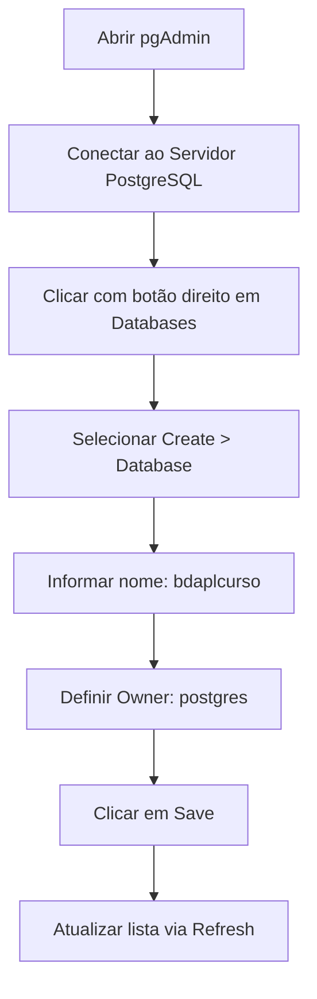
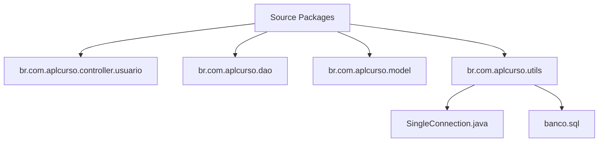
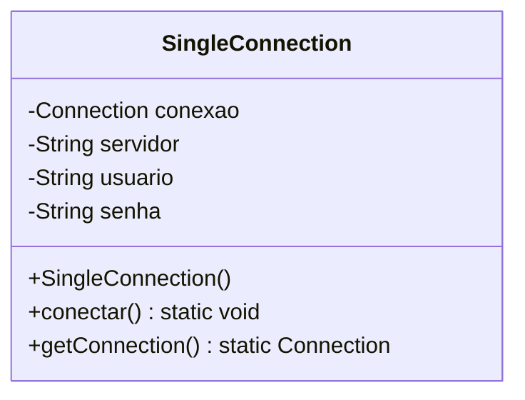
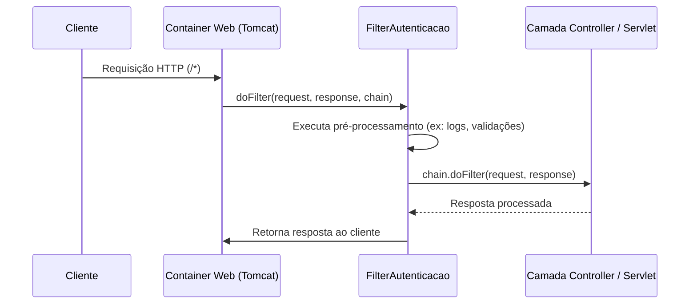
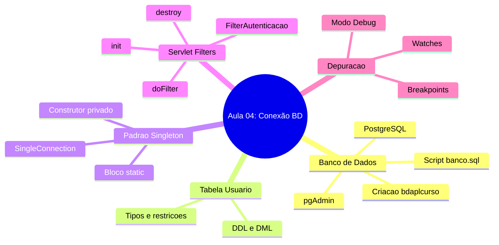

# Aula 03 — Conexão com Banco de Dados e Servlet Filters

> **Professor:** Jefferson Passerini
> **Disciplina:** Laboratório de Programação III (3º Semestre)
> **Tema:** Criação de banco de dados, padrão Singleton para conexão JDBC e interceptação de requisições com Servlet Filters.

## Sumário
- [Objetivo da aula](#objetivo-da-aula)
- [Contexto e pré-requisitos](#contexto-e-pré-requisitos)
- [Criação e configuração de Banco de Dados PostgreSQL no pgAdmin](#criação-e-configuração-de-banco-de-dados-postgresql-no-pgadmin)
- [Modelagem da tabela usuario e execução de scripts DDL/DML](#modelagem-da-tabela-usuario-e-execução-de-scripts-ddldml)
- [Organização de scripts SQL dentro de projetos Java no NetBeans](#organização-de-scripts-sql-dentro-de-projetos-java-no-netbeans)
- [Padrão de Projeto Singleton para gerenciamento de conexões JDBC](#padrão-de-projeto-singleton-para-gerenciamento-de-conexões-jdbc)
- [Conceito e ciclo de vida de Servlet Filters (init, doFilter, destroy)](#conceito-e-ciclo-de-vida-de-servlet-filters-init-dofilter-destroy)
- [Controle de transações e autocommit no JDBC](#controle-de-transações-e-autocommit-no-jdbc)
- [Depuração e verificação de conexões no NetBeans (Breakpoints e Watches)](#depuração-e-verificação-de-conexões-no-netbeans-breakpoints-e-watches)
- [Código da aula](#código-da-aula)
- [Exercícios](#exercícios)
- [Erros comuns e boas práticas](#erros-comuns-e-boas-práticas)
- [Links e materiais complementares](#links-e-materiais-complementares)
- [Mapa da aula](#mapa-da-aula)
- [Glossário](#glossário)
- [Pontos-chave para a prova](#pontos-chave-para-va-prova)
- [Perguntas e respostas (JSONL)](#perguntas-e-respostas-jsonl)
- [Checklist de revisão](#checklist-de-revisão)

---

## Objetivo da aula
Capacitar o estudante de Sistemas de Informação a estabelecer a infraestrutura de persistência de dados para aplicações web Java utilizando o PostgreSQL e o pgAdmin. O aluno aprenderá a estruturar tabelas relacionais, organizar artefatos SQL dentro de um projeto gerendido no NetBeans, implementar o padrão criacional Singleton para gerenciar conexões JDBC eficientemente, interceptar o fluxo HTTP através de Servlet Filters e validar o funcionamento da aplicação em ambiente de depuração (*debugging*).

---

## Contexto e pré-requisitos
No estágio atual da disciplina de Laboratório de Programação III, a aplicação web em desenvolvimento (*AplCurso* ou *AplCurso2*) precisa evoluir da camada estática de interface (JSP/Servlets) para a camada persistente. Para isso, pressupõe-se que o aluno possua:
- Servidor PostgreSQL instalado e operacional na máquina local.
- Ferramenta de gerenciamento pgAdmin configurada.
- Ambiente de desenvolvimento NetBeans IDE configurado com o JDK 17 e Apache Tomcat.
- Driver JDBC do PostgreSQL adicionado às bibliotecas do projeto (*Libraries*).

---

## Criação e configuração de Banco de Dados PostgreSQL no pgAdmin

### Definição e Motivação
A criação de um banco de dados relacional isolado para cada aplicação garante a modularidade, segurança e integridade referencial dos dados manipulados pelo sistema web. O pgAdmin atua como a interface gráfica oficial para gerenciar instâncias do PostgreSQL.

### Passo a Passo Operacional
1. Conectar-se ao servidor PostgreSQL no pgAdmin utilizando as credenciais administrativas (usuário `postgres`).
2. Expandir a árvore de navegação até o nó `Databases`.
3. Clicar com o botão direito sobre `Databases` e selecionar **Create > Database**.
4. Na aba *General*, preencher o campo *Database* com o nome `bdaplcurso` e definir o *Owner* como `postgres`.
5. Clicar em **Save** para efetivar a criação.
6. Executar um *Refresh* no nó `Databases` caso a interface gráfica não atualize de imediato.

### Exemplo de Fluxo de Criação


### Tabela Comparativa: Ferramentas de Gerenciamento de Banco
| Ferramenta | Tipo | Vantagens | Desvantagens |
| :--- | :--- | :--- | :--- |
| **pgAdmin** | Interface Gráfica (GUI) | Completa para recursos do PostgreSQL, visualização de árvore | Pesada em alguns sistemas operacionais |
| **psql** | Interface de Linha de Comando | Leve, rápida, ideal para scripts remotos | Curva de aprendizado maior para iniciantes |
| **DBeaver** | GUI Multi-SGBD | Suporta múltiplos bancos (MySQL, Oracle, Postgres) | Interface genérica |

### Contraexemplo e Armadilhas
- **Contraexemplo:** Utilizar o banco de dados padrão `postgres` ou `template1` para armazenar tabelas de aplicações de negócio. Isso corrompe metadados do sistema e impede políticas de backup isoladas.
- **Armadilha comum:** Esquecer de alterar o *Owner* para um usuário com privilégios adequados, resultando em erros de permissão (*Permission Denied*) ao tentar inserir registros via JDBC.

---

## Modelagem da tabela usuario e execução de scripts DDL/DML

### Definição e Motivação
A modelagem de dados define a estrutura física onde a aplicação armazenará informações essenciais. A tabela `usuario` representa as entidades humanas que interagem ou são administradas pelo sistema *AplCurso*.

### Exemplo de Script DDL e DML
O comando SQL abaixo cria a tabela com restrições de unicidade, nulidade e identificadores auto-incrementados (*serial*):

```sql
create table usuario (
	id serial primary key,
	nome varchar(100) not null,
	datanascimento date not null,
	cpf varchar(11) unique not null,
	email varchar(100) unique not null,
	senha varchar(20) not null,
	salario decimal(15,2) not null
);

insert into usuario (nome, datanascimento, cpf, email, senha, salario)
values ('João José Gomes da Silva', '1990-08-10', '08243060073', 'joaojosegomes@gmail.com', 'senha123', 5200.00);

select * from usuario;
```

### Diagrama Entidade-Relacionamento (Mermaid)
```erDiagram
    USUARIO {
        int id PK
        string nome
        date datanascimento
        string cpf UK
        string email UK
        string senha
        decimal salario
    }
```

### Contraexemplo e Armadilhas
- **Contraexemplo:** Definir o campo `cpf` ou `email` sem a restrição `unique`. Isso permitiria cadastros duplicados de usuários com o mesmo documento ou e-mail, quebrando a regra de negócio.
- **Armadilha comum:** Utilizar tipos de dados incorretos para valores monetários (como `float` ou `double`), o que causa problemas de arredondamento. O correto é utilizar `decimal(15,2)`.

---

## Organização de scripts SQL dentro de projetos Java no NetBeans

### Definição e Motivação
Armazenar os arquivos de criação de banco de dados (`.sql`) dentro do próprio projeto Java garante a reprodutibilidade do ambiente de desenvolvimento. Caso o banco precise ser recriado, o script estará versionado junto ao código-fonte.

### Passos no NetBeans
1. Navegar na árvore do projeto até `Source Packages`.
2. Expandir ou localizar o pacote utilitário, como `br.com.aplcurso.utils`.
3. Clicar com o botão direito no pacote, escolher **New > Other**.
4. Filtrar por `SQL File` na categoria correspondente.
5. Nomear o arquivo como `banco.sql` e concluir o assistente.

### Fluxo de Organização do Projeto


### Contraexemplo e Armadilhas
- **Contraexemplo:** Salvar scripts SQL na pasta de páginas web públicas (`Web Pages`), expondo o arquivo estrutural do banco diretamente para download via navegador web.
- **Armadilha comum:** Não atualizar o arquivo `banco.sql` na mesma medida em que alterações de schema são feitas diretamente no SGBD, gerando divergência entre o código e o banco.

---

## Padrão de Projeto Singleton para gerenciamento de conexões JDBC

### Definição e Motivação
O padrão de projeto criacional **Singleton** assegura que uma classe possua apenas uma única instância durante toda a execução da aplicação e fornece um ponto global de acesso a ela. Em aplicações web, abrir uma nova conexão JDBC a cada requisição HTTP esgota rapidamente os recursos do SGBD. O Singleton mitiga esse problema mantendo uma conexão ativa compartilhada.

### Explicação Conceitual
- **Construtor privado:** Impede que outras classes criem instâncias usando o operador `new`.
- **Atributo estático:** Armazena a referência única da conexão.
- **Bloco estático (`static`):** Executado automaticamente no carregamento da classe, inicializando a conexão de forma antecipada.

### Exemplo de Implementação
```java
package br.com.aplcurso.utils;

import java.sql.Connection;
import java.sql.DriverManager;

public class SingleConnection {
   
    private static Connection conexao = null;
    private static String servidor = "jdbc:postgresql://localhost:5432/bdaplcurso?autoReconnect=true";
    private static String usuario = "postgres";
    private static String senha = "postdba";
    
    static {
        try {
            conectar();
        } catch (Exception ex) {
            System.out.println("Erro ao conectar ao banco de dados");
            ex.printStackTrace();
        }
    }
    
    public SingleConnection() throws Exception{
        conectar();
    }
    
    public static void conectar() throws Exception {
        try {
            if (conexao == null){
                Class.forName("org.postgresql.Driver");
                conexao = DriverManager.getConnection(servidor, usuario, senha);        
                conexao.setAutoCommit(false);
            }
        } catch (Exception ex) {
            throw new Exception(ex.getMessage());
        }
    }
    
    public static Connection getConnection(){
        return conexao;
    }  
}
```

### Diagrama de Classes (Singleton)


### Contraexemplo e Armadilhas
- **Contraexemplo:** Criar uma nova instância de `Connection` em cada DAO sem utilizar o Singleton. Sob carga de múltiplos usuários simultâneos, o PostgreSQL recusará novas conexões por estouro de limite (*too many clients*).
- **Armadilha comum:** Em ambientes multithread de servidores web, conexões compartilhadas sem tratamento adequado podem gerar concorrência de transações se múltiplos DAOs tentarem manipular o mesmo objeto de conexão sem isolamento de estado.

---

## Conceito e ciclo de vida de Servlet Filters (init, doFilter, destroy)

### Definição e Motivação
Um `Filter` na API Java Servlet é um componente intermediário capaz de interceptar requisições e respostas HTTP antes que elas cheguem ao destino final (como um Servlet ou JSP) ou retornem ao cliente. São utilizados para tarefas transversais, como autenticação, controle de codificação de caracteres, logs e gerenciamento do ciclo de vida de recursos (como fechar conexões).

### O Ciclo de Vida do Filtro
1. **`init(FilterConfig)`:** Executado uma única vez pelo container web (Tomcat) quando o filtro é carregado na memória. Ideal para inicializações.
2. **`doFilter(ServletRequest, ServletResponse, FilterChain)`:** Executado a cada requisição que atende ao padrão de URL mapeado (`urlPatterns`). O método `chain.doFilter()` repassa a requisição adiante na cadeia.
3. **`destroy()`:** Executado quando a aplicação é encerrada ou o filtro descarregado, permitindo liberar recursos abertos (como fechar conexões com o banco).

### Diagrama de Sequência do Filtro


### Tabela Comparativa: Servlet vs Filter
| Característica | Servlet | Filter |
| :--- | :--- | :--- |
| **Objetivo Principal** | Processar requisições específicas e gerar respostas dinâmicas | Interceptar requisições/respostas de forma transversal |
| **Mapeamento** | Acionado por rotas específicas (`/salvarUsuario`) | Acionado por padrões amplos (`/*`) |
| **Encadeamento** | Geralmente é o fim da linha de processamento | Pode repassar para o próximo filtro ou servlet (`chain.doFilter`) |

### Contraexemplo e Armadilhas
- **Contraexemplo:** Realizar regras complexas de negócio dentro de um filtro. Filtros devem cuidar de aspectos transversais (infraestrutura, segurança básica, auditoria), e não da lógica de domínio.
- **Armadilha comum:** Esquecer de chamar `chain.doFilter(request, response)` dentro do método `doFilter`, o que resulta em uma página em branco para o usuário, pois a requisição nunca chega ao seu destino.

---

## Controle de transações e autocommit no JDBC

### Definição e Motivação
Por padrão, conexões JDBC operam em modo *Auto-Commit* ativado, onde cada instrução SQL (`INSERT`, `UPDATE`, `DELETE`) é gravada permanentemente no banco de dados de forma isolada e imediata. Ao configurar `conexao.setAutoCommit(false)`, a aplicação assume controle transacional explícito, permitindo agrupar múltiplas operações e confirmá-las (`commit()`) apenas se todas sucederem, ou revertê-las (`rollback()`) em caso de falha.

### Propriedades ACID no Contexto
- **Atomicidade:** Tudo ou nada.
- **Consistência:** O banco mantém regras de integridade.
- **Isolamento:** Transações simultâneas não corrompem dados.
- **Durabilidade:** Dados salvos persistem após quedas.

### Contraexemplo e Armadilhas
- **Contraexemplo:** Desativar o auto-commit (`setAutoCommit(false)`) e nunca chamar explicitamente o `commit()` nas operações de escrita. O resultado é que os dados parecem ser salvos na aplicação, mas nunca são gravados no disco pelo SGBD.
- **Armadilha comum:** Não tratar exceções com blocos `try-catch-finally` para executar o `rollback()` quando uma falha ocorre no meio de uma transação multi-etapas.

---

## Depuração e verificação de conexões no NetBeans (Breakpoints e Watches)

### Definição e Motivação
A depuração (*debugging*) é o processo de inspecionar a execução do código linha por linha para identificar comportamentos inesperados. No NetBeans, o uso de *breakpoints* (pontos de interrupção) associados a ferramentas de inspeção (*Watches* e painel *Variables*) permite confirmar se objetos críticos — como a conexão com o banco de dados — foram instanciados corretamente.

### Atalhos e Comandos Essenciais no NetBeans
- **Alternar Breakpoint:** `Ctrl + F8` (Windows/Linux) ou `Cmd + F8` (Mac)
- **Iniciar Debug:** `Ctrl + F5`
- **Continuar Execução:** `F5`
- **Passo a Passo (Step Over):** `F8`
- **Entrar no Método (Step Into):** `F7`

### Contraexemplo e Armadilhas
- **Contraexemplo:** Utilizar apenas instruções excessivas de `System.out.println` em todo o código para tentar descobrir se uma conexão é nula, poluindo o console de produção.
- **Armadilha comum:** Tentar debugar a aplicação no modo normal de execução (*Run Project*) em vez de usar o modo de depuração (*Debug Project*), o que faz com que os *breakpoints* sejam ignorados pelo IDE.

---

## Código da aula

Esta seção descreve os principais arquivos de código desenvolvidos ao longo da aula, explicando sua estrutura e trechos fundamentais.

### 1. Script SQL de Inicialização (`./codigo/banco.sql`)
Arquivo contendo os comandos DDL para criação da estrutura e DML para carga inicial de dados.
[Ver arquivo completo](./codigo/banco.sql)
```sql
-- Criação da tabela de usuários com restrições e tipos adequados
create table usuario (
	id serial primary key,
	nome varchar(100) not null,
	datanascimento date not null,
	cpf varchar(11) unique not null,
	email varchar(100) unique not null,
	senha varchar(20) not null,
	salario decimal(15,2) not null
);

-- Inserção de registro de teste
insert into usuario (nome, datanascimento, cpf, email, senha, salario)
values ('João José Gomes da Silva', '1990-08-10', '08243060073', 'joaojosegomes@gmail.com', 'senha123', 5200.00);
```

### 2. Classe Singleton de Conexão (`./codigo/SingleConnection.java`)
Gerencia a instância única de conexão JDBC com o PostgreSQL.
[Ver arquivo completo](./codigo/SingleConnection.java)
```java
package br.com.aplcurso.utils;

import java.sql.Connection;
import java.sql.DriverManager;

public class SingleConnection {
   
    private static Connection conexao = null;
    private static String servidor = "jdbc:postgresql://localhost:5432/bdaplcurso?autoReconnect=true";
    private static String usuario = "postgres";
    private static String senha = "postdba";
    
    static {
        try {
            conectar();
        } catch (Exception ex) {
            System.out.println("Erro ao conectar ao banco de dados");
            ex.printStackTrace();
        }
    }
    
    public SingleConnection() throws Exception{
        conectar();
    }
    
    public static void conectar() throws Exception {
        try {
            if (conexao == null){
                Class.forName("org.postgresql.Driver");
                conexao = DriverManager.getConnection(servidor, usuario, senha);        
                conexao.setAutoCommit(false);
            }
        } catch (Exception ex) {
            throw new Exception(ex.getMessage());
        }
    }
    
    public static Connection getConnection(){
        return conexao;
    }  
}
```

### 3. Filtro de Autenticação e Ciclo de Vida (`./codigo/FilterAutenticacao.java`)
Intercepta requisições web, inicializa a conexão e gerencia seu fechamento.
[Ver arquivo completo](./codigo/FilterAutenticacao.java)
```java
package br.com.aplcurso.filter;

import br.com.aplcurso.utils.SingleConnection;
import java.io.IOException;
import java.sql.Connection;
import java.sql.SQLException;
import javax.servlet.Filter;
import javax.servlet.FilterChain;
import javax.servlet.FilterConfig;
import javax.servlet.ServletException;
import javax.servlet.ServletRequest;
import javax.servlet.ServletResponse;
import javax.servlet.annotation.WebFilter;

@WebFilter(urlPatterns={"/*"})
public class FilterAutenticacao implements Filter {

    private static Connection conexao;
    
    @Override
    public void init(FilterConfig filterConfig) throws ServletException {
        conexao = SingleConnection.getConnection(); 
    }

    @Override
    public void doFilter(ServletRequest request, ServletResponse response, FilterChain chain) throws IOException, ServletException {
        try {
            chain.doFilter(request, response);
        } catch(Exception e) {
            System.out.println("Erro: "+e.getMessage());
            e.printStackTrace();
        } 
    }

    @Override
    public void destroy() {
        try {
            conexao.close();
        } catch (SQLException ex) {
            System.out.println("Erro: "+ex.getMessage());
            ex.printStackTrace();
        } 
    }
}
```

### 4. Resolução dos Exercícios Práticos (`./codigo/ExerciciosResolvidos.java`)
[Ver arquivo completo](./codigo/ExerciciosResolvidos.java)

---

## Exercícios

### Exercício 1: Criação de Tabela de Categoria
**Enunciado:** Crie um script SQL complementar para criar uma tabela chamada `categoria` no banco de dados `bdaplcurso`, contendo os campos: `id` (serial primary key), `nome` (varchar(100) not null) e `descricao` (text). Insira pelo menos duas categorias de exemplo.
**Raciocínio:** Aplicar conceitos de DDL para criação de tabelas relacionais e DML para inserção de registros iniciais.
**Resolução comentada:**
```sql
-- DDL: Criação da tabela categoria
create table categoria (
    id serial primary key,
    nome varchar(100) not null,
    descricao text
);

-- DML: Inserção de dados iniciais
insert into categoria (nome, descricao) values ('Tecnologia', 'Livros e cursos voltados a desenvolvimento de software');
insert into categoria (nome, descricao) values ('Gestão', 'Cursos voltados a administração e gestão de projetos');
```
[Ver código no arquivo de exercícios](./codigo/ExerciciosResolvidos.java)

### Exercício 2: Validação Dinâmica no SingleConnection
**Enunciado:** Altere a classe `SingleConnection` para verificar se a conexão está fechada antes de retorná-la no método `getConnection()`, reabrindo-a caso necessário.
**Raciocínio:** Garantir resiliência caso a conexão seja encerrada acidentalmente pelo SGBD por timeout.
**Resolução comentada:**
```java
public static Connection getConnection() {
    try {
        if (conexao == null || conexao.isClosed()) {
            conectar();
        }
    } catch (Exception e) {
        e.printStackTrace();
    }
    return conexao;
}
```
[Ver código no arquivo de exercícios](./codigo/ExerciciosResolvidos.java)

### Exercício 3: Log de Requisições no Filtro
**Enunciado:** Modifique o método `doFilter` da classe `FilterAutenticacao` para imprimir no console o horário da requisição e o status da conexão ativa antes de repassar o fluxo.
**Raciocínio:** Utilizar o filtro para auditoria e monitoramento de requisições web.
**Resolução comentada:**
```java
@Override
public void doFilter(ServletRequest request, ServletResponse response, FilterChain chain) throws IOException, ServletException {
    try {
        System.out.println("Requisição interceptada em: " + new java.util.Date());
        System.out.println("Conexão ativa? " + (conexao != null && !conexao.isClosed()));
        chain.doFilter(request, response);
    } catch(Exception e) {
        System.out.println("Erro no filtro: "+e.getMessage());
        e.printStackTrace();
    } 
}
```
[Ver código no arquivo de exercícios](./codigo/ExerciciosResolvidos.java)

---

## Erros comuns e boas práticas

### Erros Comuns
1. **Esquecer de carregar o Driver JDBC:** Omitir `Class.forName("org.postgresql.Driver")` resulta em erro de driver não encontrado (`ClassNotFoundException`).
2. **Manter o Auto-Commit ativo em operações complexas:** Realizar múltiplas alterações sem controle transacional, gerando inconsistências parciais.
3. **Não fechar recursos adequadamente:** Deixar conexões abertas indefinidamente no método `destroy()` do filtro.

### Boas Práticas
- Utilizar o padrão Singleton para centralizar o ponto de acesso ao banco de dados.
- Configurar adequadamente o mapeamento de filtros (`/*`) para garantir que todas as requisições passem pelas validações de infraestrutura.
- Versionar os scripts SQL estruturais dentro do próprio projeto (`banco.sql`).

---

## Links e materiais complementares
- [Documentação Oficial do PostgreSQL](https://www.postgresql.org/docs/) — Guia completo sobre comandos DDL, DML e tipos de dados.
- [Tutorial Oficial JDBC (Oracle)](https://docs.oracle.com/javase/tutorial/jdbc/) — Referência fundamental para manipulação de banco de dados em Java.
- [Especificação Java Servlets](https://jakarta.ee/specifications/servlet/) — Documentação oficial sobre o funcionamento de Filters e Servlets.

---

## Mapa da aula



---

## Glossário

| Termo | Definição |
| :--- | :--- |
| **Singleton** | Padrão de projeto que restringe a instanciação de uma classe a um único objeto. |
| **Servlet Filter** | Objeto que intercepta requisições e respostas HTTP para execução de tarefas transversais. |
| **JDBC** | Java Database Connectivity, API padrão para execução de instruções SQL a partir do Java. |
| **DDL** | Data Definition Language, comandos SQL para definição de estruturas (CREATE, DROP, ALTER). |
| **DML** | Data Manipulation Language, comandos SQL para manipulação de dados (INSERT, UPDATE, DELETE). |
| **Auto-Commit** | Propriedade que define se cada instrução SQL é confirmada automaticamente no SGBD. |
| **Breakpoint** | Ponto de interrupção inserido no código para pausar a execução durante a depuração. |

---

## Pontos-chave para a prova
1. Explicação e justificativa do uso do padrão **Singleton** na classe `SingleConnection`.
2. O papel dos três métodos principais do ciclo de vida de um **Servlet Filter** (`init`, `doFilter`, `destroy`).
3. Importância de desativar o auto-commit (`setAutoCommit(false)`) para controle manual de transações.
4. Procedimento correto para criação de tabelas com restrições (`primary key`, `unique`, `not null`) no PostgreSQL.
5. Funcionamento do método `chain.doFilter()` na passagem de requisições.

---

## Perguntas e respostas (JSONL)
```jsonl
{"pergunta": "Qual padrão de projeto é utilizado na classe SingleConnection para garantir uma única instância de conexão?", "resposta": "O padrão Singleton.", "dificuldade": "fácil"}
{"pergunta": "Qual método da interface Filter é executado apenas uma vez quando a aplicação é iniciada no servidor?", "resposta": "O método init.", "dificuldade": "fácil"}
{"pergunta": "Qual comando SQL garante que uma coluna não aceite valores nulos?", "resposta": "A restrição NOT NULL.", "dificuldade": "fácil"}
{"pergunta": "Qual ferramenta gráfica é utilizada para gerenciar o banco de dados PostgreSQL nas aulas?", "resposta": "O pgAdmin.", "dificuldade": "fácil"}
{"pergunta": "Para que serve o comando chain.doFilter dentro de um Servlet Filter?", "resposta": "Para repassar a requisição interceptada para o próximo recurso na cadeia.", "dificuldade": "média"}
{"pergunta": "Qual é a utilidade do bloco static na classe SingleConnection?", "resposta": "Executar a conexão com o banco de dados automaticamente assim que a classe é carregada na memória.", "dificuldade": "média"}
{"pergunta": "Por que se deve configurar setAutoCommit(false) nas conexões JDBC?", "resposta": "Para assumir controle manual sobre as transações, permitindo commits e rollbacks.", "dificuldade": "média"}
{"pergunta": "Qual atalho de teclado no NetBeans é utilizado para alternar um breakpoint?", "resposta": "Ctrl + F8 (ou Cmd + F8 no Mac).", "dificuldade": "fácil"}
{"pergunta": "Onde o arquivo banco.sql deve ser organizado dentro do projeto NetBeans?", "resposta": "Dentro da camada de utilitários em Source Packages (ex: br.com.aplcurso.utils).", "dificuldade": "média"}
{"pergunta": "O que acontece se o método chain.doFilter não for chamado dentro de um filtro?", "resposta": "A requisição é interrompida e o cliente recebe uma resposta em branco ou vazia.", "dificuldade": "difícil"}
{"pergunta": "Qual tipo de dado PostgreSQL é recomendado para valores monetários com alta precisão?", "resposta": "O tipo decimal (ou numeric).", "dificuldade": "média"}
{"pergunta": "Qual método da classe Filter é responsável por liberar recursos, como fechar a conexão, ao encerrar o sistema?", "resposta": "O método destroy.", "dificuldade": "fácil"}
{"pergunta": "Qual é o objetivo de anotar uma classe de filtro com @WebFilter(urlPatterns={\"/*\"})?", "resposta": "Definir que o filtro interceptará todas as requisições direcionadas à aplicação web.", "dificuldade": "média"}
{"pergunta": "O que significa a sigla DDL em bancos de dados relacionais?", "resposta": "Data Definition Language (Linguagem de Definição de Dados).", "dificuldade": "fácil"}
{"pergunta": "Qual exceção é lançada pelo driver JDBC caso o PostgreSQL não esteja rodando ao tentar conectar?", "resposta": "SQLException.", "dificuldade": "média"}
```

---

## Checklist de revisão
- [ ] Criar e configurar o banco de dados `bdaplcurso` no pgAdmin.
- [ ] Executar o script DDL da tabela `usuario` e inserir o registro de teste.
- [ ] Criar o arquivo `banco.sql` dentro do pacote `br.com.aplcurso.utils` no NetBeans.
- [ ] Implementar a classe `SingleConnection` utilizando o padrão Singleton.
- [ ] Criar a classe `FilterAutenticacao` implementando a interface `Filter`.
- [ ] Codificar os métodos `init`, `doFilter` e `destroy` no filtro.
- [ ] Configurar a anotação `@WebFilter(urlPatterns={"/*"})`.
- [ ] Testar a conexão utilizando *breakpoints* e o modo de depuração (*Debug Project*).
- [ ] Validar a ausência de valores nulos no objeto de conexão durante o debug.
