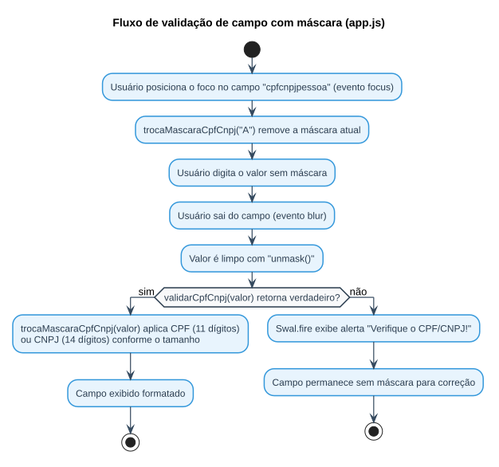

# Aula 03 — Estrutura do Projeto: Front-end

> **Data de Postagem:** 09/03/2026
> **Professor:** Jefferson Passerini
> **Disciplina:** Laboratório de Programação III (3º Semestre)
> **Tema:** Estruturação da interface (front-end) do projeto Java Web

## Objetivo da aula

Estruturar a camada de apresentação do projeto: organizar os recursos estáticos (JavaScript, bibliotecas de terceiros) dentro de `webapp`, aplicar máscaras de campo e validações no lado do cliente, e preparar a interface para consumir os dados que passarão a vir do banco a partir da Aula 04.

## Bibliotecas front-end utilizadas

O material de apoio da aula (`js.zip`, nesta mesma pasta) traz o conjunto de bibliotecas JavaScript usado nas interfaces do projeto:

| Arquivo | Função |
| :--- | :--- |
| `jquery-3.3.1.min.js` | Biblioteca base para manipulação do DOM e eventos |
| `jquery.mask.min.js` | Aplicação de máscaras de campo (CPF/CNPJ, telefone, datas) |
| `jquery.maskMoney.min.js` | Máscara monetária (útil para campos como `valorLivro`) |
| `app.js` | Código próprio da aplicação: eventos de formulário, troca de máscara e validação de CPF/CNPJ |

Esses arquivos devem ser extraídos para dentro de `webapp/js/` (ou `WebContent/js/`) do projeto criado na Aula 02, e referenciados pelas páginas JSP/HTML com `<script src="js/...">`.

## Máscara dinâmica de campo (CPF/CNPJ)

Trecho real de `app.js`, que troca a máscara do campo conforme a quantidade de dígitos digitados:

```javascript
$(document).ready(function(){
    $('#cpfcnpjpessoa').focus(function(){
        trocaMascaraCpfCnpj("A");
    });
});

$(document).ready(function(){
    $('#cpfcnpjpessoa').blur(function(){
        var cpfCnpjLimpo = $('#cpfcnpjpessoa').unmask().val();
        if (!validarCpfCnpj(cpfCnpjLimpo)){
            Swal.fire({
                position: 'center',
                icon: 'error',
                title: 'Verifique o CPF/CNPJ!',
                showConfirmButton: true,
                timer: 10000
            });
        } else {
            trocaMascaraCpfCnpj($('#cpfcnpjpessoa').val());
        }
    });
});

function trocaMascaraCpfCnpj(cpfCnpj) {
    if (cpfCnpj !== "A") {
        var masks = ['999.999.999-99', '99.999.999/9999-99'];
        var cpfcnpj = $('#cpfcnpjpessoa').unmask().val();
        mask = (cpfcnpj.length > 11) ? masks[1] : masks[0];
        $('#cpfcnpjpessoa').mask(mask);
    } else {
        $('#cpfcnpjpessoa').unmask();
    }
}
```

O padrão aplicado é: no evento `focus`, a máscara é removida para permitir digitação livre; no evento `blur` (quando o campo perde o foco), o valor é validado e a máscara correta (CPF de 11 dígitos ou CNPJ de 14) é reaplicada.

## Validação no cliente vs. validação no servidor

`app.js` também implementa os algoritmos completos de validação de dígito verificador de CPF e CNPJ (funções `validarCPF` e `validarCNPJ`/`cnpjValidation`). Essa validação client-side melhora a experiência do usuário (feedback imediato via `Swal.fire`), mas **não substitui** a validação no back-end: o front-end pode ser burlado por uma requisição feita diretamente (sem passar pela página), portanto toda regra crítica precisa ser reforçada no Servlet/Model, como será feito no desafio de validação de e-mail (Trabalho de 26/05/2026).

## Fluxo de validação de um campo mascarado



## Relação com os trabalhos práticos

- O trabalho de cadastro de **Livros** (2 pontos) possui o campo `valorLivro`, candidato natural ao uso de `jquery.maskMoney.min.js` para formatação monetária no formulário de cadastro.
- O desafio de **validação de e-mail** (Trabalho de 1 ponto) segue exatamente o mesmo princípio desta aula — validar no cliente para UX, e obrigatoriamente também no servidor (ver `EmailValidator.java` em `Trabalhos/20260511 - Trabalho de programação (1 ponto)/`).

## Exercícios de fixação

1. Extraia `js.zip` para dentro de `webapp/js/` do seu projeto e referencie `jquery-3.3.1.min.js` e `app.js` em uma página JSP.
2. Aplique `jquery.maskMoney.min.js` a um campo de formulário representando o preço de um produto.
3. Explique por que a validação de CPF/CNPJ feita em `app.js` não é suficiente, sozinha, para garantir a integridade dos dados persistidos.
4. Adapte a função `trocaMascaraCpfCnpj` para um campo de telefone, alternando entre os formatos fixo e celular conforme a quantidade de dígitos.

<details>
<summary>Gabarito (questão 3)</summary>

A validação em `app.js` roda inteiramente no navegador do usuário. Qualquer requisição enviada diretamente ao Servlet (via ferramentas como `curl`, Postman, ou um formulário HTML alternativo) ignora completamente esse JavaScript, pois ele nunca é executado. Se o Servlet confiar apenas na validação do cliente, dados inválidos podem ser persistidos no banco. Por isso a mesma regra de validação (formato de CPF/CNPJ, e-mail, etc.) precisa ser reimplementada no back-end antes de qualquer `INSERT`/`UPDATE`.

</details>

## Perguntas de revisão

- Onde os arquivos JavaScript de terceiros devem ser posicionados dentro da estrutura do projeto?
- Qual a diferença de responsabilidade entre `jquery.mask.min.js` e `jquery.maskMoney.min.js`?
- Por que a validação client-side não elimina a necessidade de validação server-side?

## Material relacionado

- Links Úteis: [Java JSP - Cap 4.4 - Estruturando a Interface do Projeto | Notion](https://spiffy-number-b06.notion.site/Java-JSP-Cap-4-4-Estruturando-a-Interface-do-Projeto-1b2393aeab2a80a8a7cdc8e23c79aa90?pvs=74)
- Bibliotecas front-end originais: [`js.zip`](./js.zip)
- [Trabalho — Validação de e-mail (1 ponto)](../../Trabalhos/20260511%20-%20Trabalho%20de%20programa%C3%A7%C3%A3o%20(1%20ponto)/detalhes.md)
- Post original da aula: [`post-original.md`](./post-original.md)
