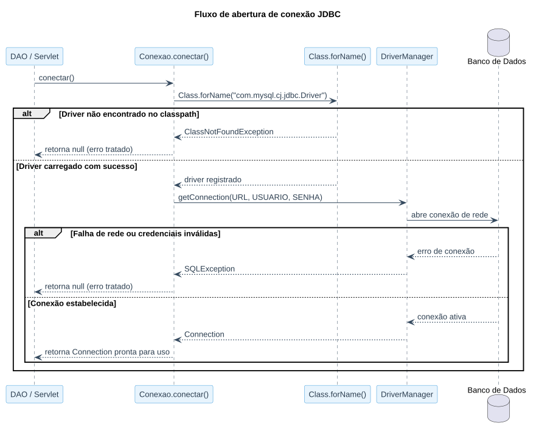

# Aula 04 — Conexão com o Banco de Dados

> **Data de Postagem:** 30/03/2026
> **Professor:** Jefferson Passerini
> **Disciplina:** Laboratório de Programação III (3º Semestre)
> **Tema:** Configuração e integração do projeto com o banco de dados relacional via JDBC

## Objetivo da aula

Estabelecer a ponte de comunicação entre a aplicação Java Web e um Sistema Gerenciador de Banco de Dados relacional (MySQL ou PostgreSQL), utilizando a API **JDBC (Java Database Connectivity)**: carregamento do driver, abertura de conexão, tratamento de exceções de SQL e centralização dessa lógica em uma classe utilitária reutilizável.

## Por que centralizar a conexão em uma classe própria

Sem uma classe dedicada, o código de abertura de conexão (URL, usuário, senha, driver) ficaria duplicado em cada DAO/Servlet que precisa acessar o banco. Centralizar essa responsabilidade em uma única classe (`Conexao`) segue o mesmo princípio de reutilização já visto: qualquer mudança de credenciais ou de SGBD é feita em um único lugar.

## Classe utilitária de conexão

```java
package com.exemplo.dao;

import java.sql.Connection;
import java.sql.DriverManager;
import java.sql.SQLException;

public class Conexao {
    private static final String URL = "jdbc:mysql://localhost:3306/banco_sistema?useSSL=false&serverTimezone=UTC";
    private static final String USUARIO = "root";
    private static final String SENHA = "sua_senha";

    public static Connection conectar() {
        Connection conexao = null;
        try {
            Class.forName("com.mysql.cj.jdbc.Driver");
            conexao = DriverManager.getConnection(URL, USUARIO, SENHA);
            System.out.println("Conexão realizada com sucesso!");
        } catch (ClassNotFoundException e) {
            System.err.println("Driver do banco não encontrado: " + e.getMessage());
        } catch (SQLException e) {
            System.err.println("Erro ao conectar ao banco de dados: " + e.getMessage());
        }
        return conexao;
    }
}
```

## Anatomia da conexão JDBC

| Elemento | Papel |
| :--- | :--- |
| `Class.forName("com.mysql.cj.jdbc.Driver")` | Carrega e registra o driver JDBC do SGBD no `DriverManager` (dispensável em versões recentes do JDBC, mas mantido por clareza e compatibilidade) |
| `DriverManager.getConnection(URL, USUARIO, SENHA)` | Solicita ao driver uma conexão ativa com o banco descrito na URL |
| `URL` | String de conexão: protocolo (`jdbc:mysql:` / `jdbc:postgresql:`), host, porta e nome do banco |
| `ClassNotFoundException` | Ocorre quando o `.jar` do driver não está no classpath do projeto |
| `SQLException` | Ocorre por falha de rede, credenciais inválidas ou banco/host inexistente |

## Fluxo de abertura de uma conexão

O diagrama de sequência abaixo mostra o caminho de uma chamada a `Conexao.conectar()` até a conexão ativa (ou o erro tratado):



## Boas práticas reforçadas nesta aula

- **Nunca deixar a `Connection` aberta indefinidamente**: cada DAO deve abrir, usar e fechar sua própria conexão (ou usar *try-with-resources*, como visto nos DAOs completos da Aula 06).
- **Nunca versionar credenciais reais** de banco de dados no controle de código — a URL/usuário/senha acima são valores de exemplo, substituídos por configuração de ambiente em um cenário real.
- **Sempre tratar `SQLException`** de forma explícita, evitando que a aplicação quebre sem mensagem clara para o desenvolvedor.

## Exercícios de fixação

1. Implemente a classe `Conexao` para o SGBD de sua preferência (MySQL ou PostgreSQL), ajustando a URL e o nome do driver.
2. Escreva um pequeno método `main` que chame `Conexao.conectar()` e imprima se a conexão foi bem-sucedida.
3. Force um erro proposital (senha incorreta) e observe qual exceção é lançada.
4. Explique por que `Class.forName(...)` lança `ClassNotFoundException` e não `SQLException`.

<details>
<summary>Gabarito (questão 4)</summary>

`Class.forName("com.mysql.cj.jdbc.Driver")` é uma operação de *reflection* pura: ela pede à JVM para localizar e carregar, pelo nome totalmente qualificado, a classe do driver. Isso não envolve rede nem banco de dados — apenas o classpath do projeto. Se o `.jar` do driver não estiver presente, a JVM não encontra a classe e lança `ClassNotFoundException`, uma exceção de carregamento de classes, e não de SQL. Já `SQLException` só pode ocorrer depois, na chamada a `DriverManager.getConnection(...)`, quando de fato há tentativa de comunicação com o banco.

</details>

## Perguntas de revisão

- Qual a diferença entre `ClassNotFoundException` e `SQLException` neste contexto?
- Por que centralizar a lógica de conexão em uma única classe facilita a manutenção do projeto?
- O que compõe a URL de conexão JDBC?

## Material relacionado

- Links Úteis: [Java JSP - Cap 4.5 - Criando o Banco de Dados | Notion](https://spiffy-number-b06.notion.site/Java-JSP-Cap-4-5-Criando-o-Banco-de-Dados-1b4393aeab2a80e98de4dec692b1aba5)
- [Aula 05 — Listagem de Usuários](../Aula%2005%20-%20Listagem%20de%20Usu%C3%A1rios/detalhes.md) — usa esta classe `Conexao` para o primeiro `SELECT`
- [Resumo executivo, simulado e cheatsheet da disciplina](../../README.md#resumo-executivo)
- Post original da aula: [`post-original.md`](./post-original.md)
