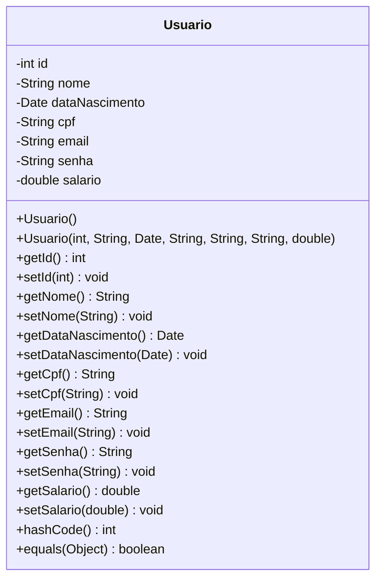
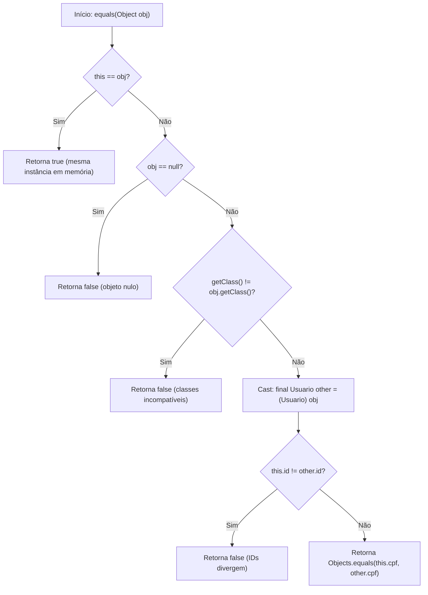
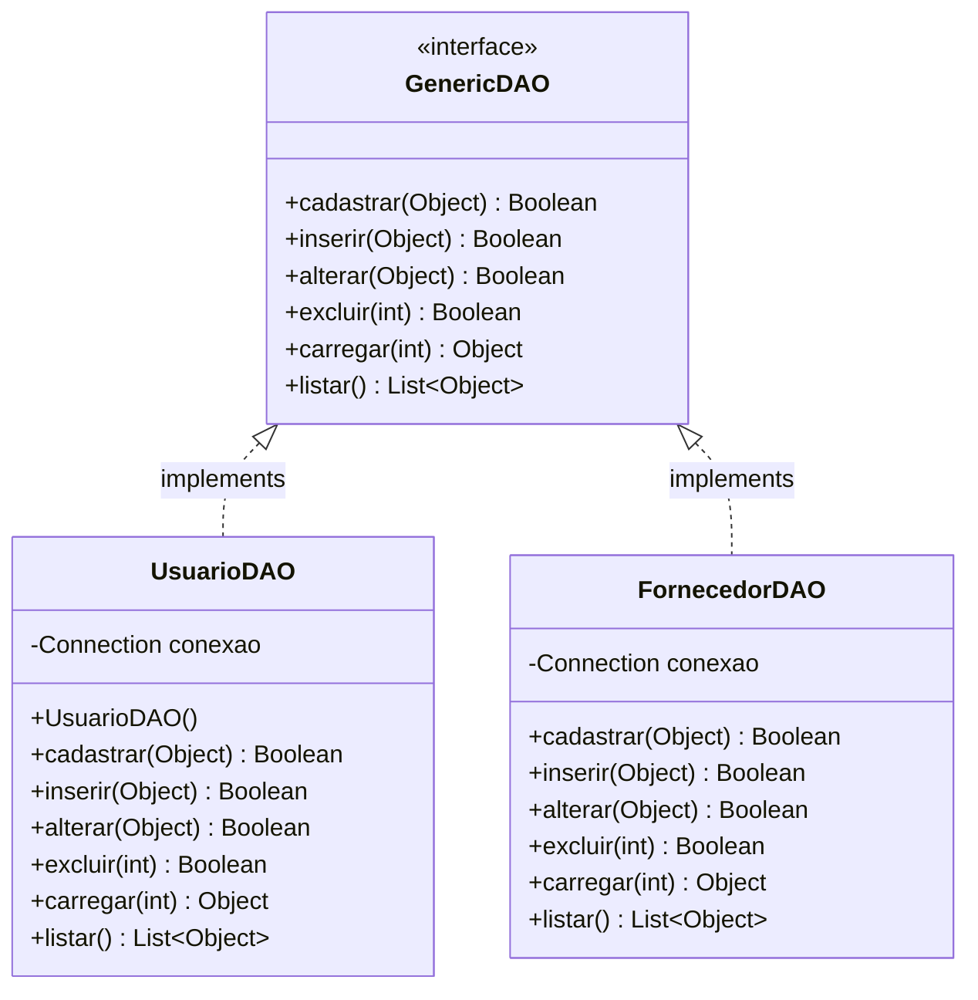
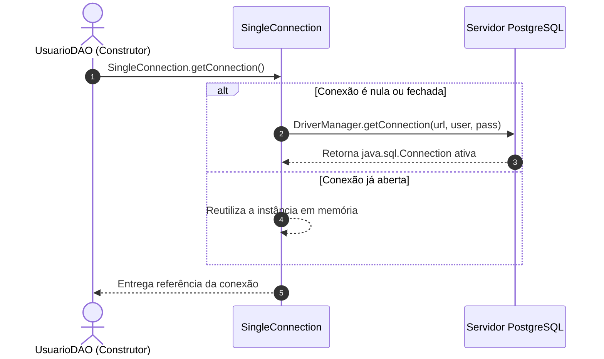
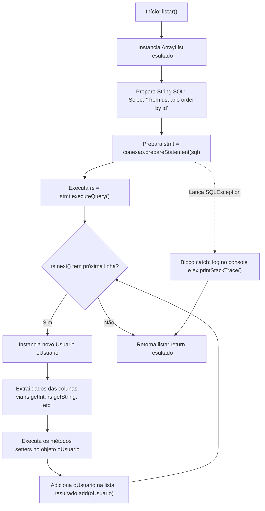
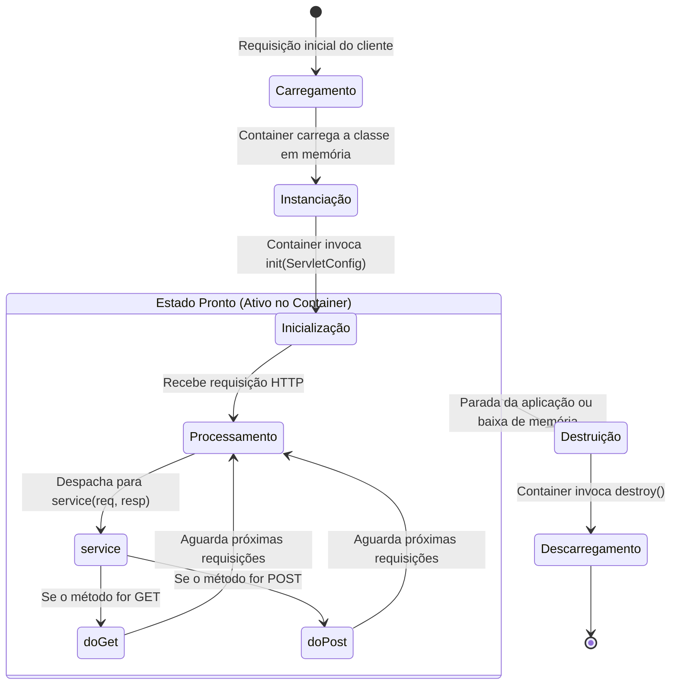
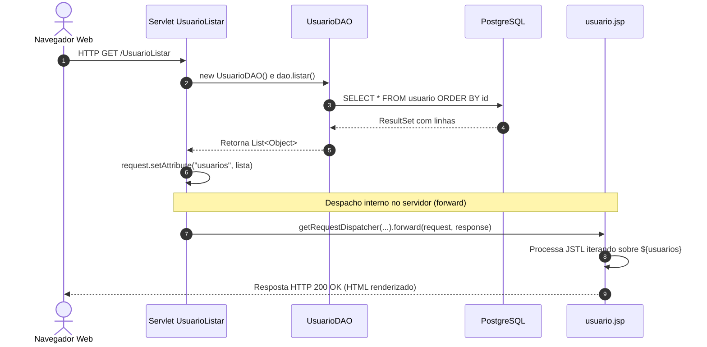
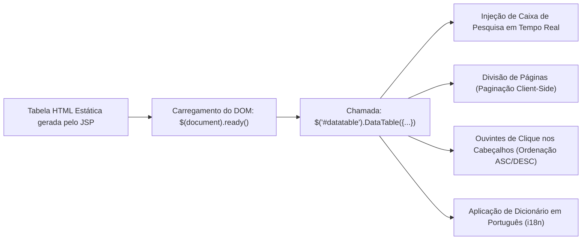
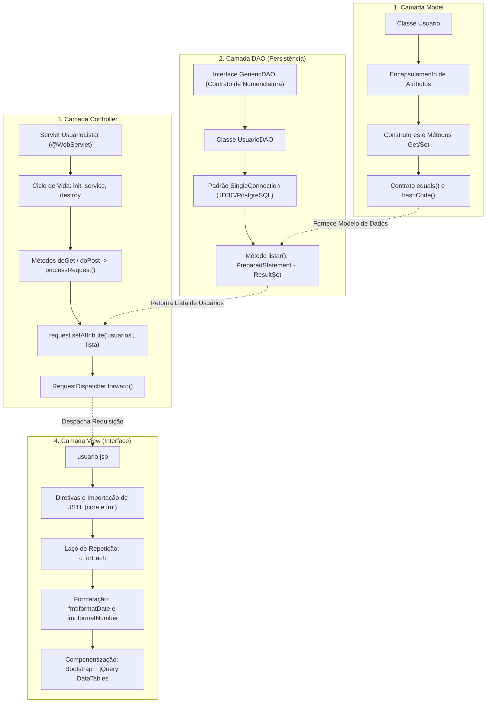

# Aula 04 — Implementação do Listar Usuário com MVC

> **Professor:** Jefferson Passerini  
> **Disciplina:** Laboratório de Programação III (3º Semestre)  
> **Tema:** Implementação da operação de listagem no padrão arquitetural MVC utilizando Java Web nativo, Servlets, JDBC com PostgreSQL, DAO genérico, JSP, JSTL e DataTables.

---

## Sumário

- [Objetivo da aula](#objetivo-da-aula)
- [Contexto e pré-requisitos](#contexto-e-pré-requisitos)
- [Criação e estruturação da classe Model Usuario](#criação-e-estruturação-da-classe-model-usuario)
- [Geração de construtores, getters, setters, hashCode e equals no NetBeans](#geração-de-construtores-getters-setters-hashcode-e-equals-no-netbeans)
- [Conceito, importância e padronização com Interfaces em Java](#conceito-importância-e-padronização-com-interfaces-em-java)
- [Criação da interface GenericDAO](#criação-da-interface-genericdao)
- [Implementação da classe UsuarioDAO e persistência com PostgreSQL via JDBC](#implementação-da-classe-usuariodao-e-persistência-com-postgresql-via-jdbc)
- [Construção detalhada do método listar() com PreparedStatement e ResultSet](#construção-detalhada-do-método-listar-com-preparedstatement-e-resultset)
- [Fundamentos de Servlets, ciclo de vida e tratamento de requisições HTTP (GET e POST)](#fundamentos-de-servlets-ciclo-de-vida-e-tratamento-de-requisições-http-get-e-post)
- [Criação e mapeamento do Servlet UsuarioListar com anotação @WebServlet](#criação-e-mapeamento-do-servlet-usuariolistar-com-anotação-webservlet)
- [Compartilhamento de dados com request.setAttribute e despacho via RequestDispatcher.forward](#compartilhamento-de-dados-com-requestsetattribute-e-despacho-via-requestdispatcherforward)
- [Organização da estrutura de diretórios do projeto Java Web no NetBeans](#organização-da-estrutura-de-diretórios-do-projeto-java-web-no-netbeans)
- [Construção da interface de listagem em JSP com tags JSTL (core e fmt)](#construção-da-interface-de-listagem-em-jsp-com-tags-jstl-core-e-fmt)
- [Enriquecimento da tabela dinâmica com Bootstrap e jQuery DataTables](#enriquecimento-da-tabela-dinâmica-com-bootstrap-e-jquery-datatables)
- [Código da aula](#código-da-aula)
- [Exercícios](#exercícios)
- [Erros comuns e boas práticas](#erros-comuns-e-boas-práticas)
- [Links e materiais complementares](#links-e-materiais-complementares)
- [Mapa da aula](#mapa-da-aula)
- [Glossário](#glossário)
- [Pontos-chave para a prova](#pontos-chave-para-a-prova)
- [Perguntas e respostas (JSONL)](#perguntas-e-respostas-jsonl)
- [Checklist de revisão](#checklist-de-revisão)

---

## Objetivo da aula

- Compreender a divisão de responsabilidades do padrão arquitetural MVC (Model-View-Controller) aplicado ao desenvolvimento Java Web empresarial.
- Construir e encapsular a classe de modelo `Usuario` em conformidade com as diretrizes de Java Beans.
- Aplicar automações do Apache NetBeans para geração consistente de construtores, métodos acessores/modificadores (`getters`/`setters`) e o contrato de identidade (`hashCode` e `equals`).
- Compreender a teoria e a utilidade prática das interfaces em Java como mecanismo de abstração pura, desacoplamento e contrato formal entre camadas.
- Modelar e implementar a interface `GenericDAO` visando a padronização de nomenclatura das operações fundamentais de persistência (CRUD).
- Desenvolver a classe `UsuarioDAO` para integração com o banco de dados PostgreSQL por meio da API JDBC nativa e o padrão de conexão `SingleConnection`.
- Escrever rotinas robustas de extração de dados utilizando `PreparedStatement`, cursores de navegação `ResultSet` e instanciação de objetos.
- Assimilar o funcionamento do protocolo HTTP (métodos `GET` e `POST`), o ciclo de vida dos Servlets e o papel do Container Web (Apache Tomcat).
- Implementar o controlador `UsuarioListar` mapeado via anotação `@WebServlet`, orquestrando a chamada à DAO, a injeção da coleção no escopo da requisição (`HttpServletRequest`) e o encaminhamento (`forward`) para a visão.
- Desenvolver a página JSP modular utilizando a biblioteca de tags padrão JSTL (`core` e `fmt`) para iteração dinâmica e formatação de datas e valores monetários.
- Integrar recursos visuais do Bootstrap e o plugin client-side jQuery DataTables para prover busca instantânea, ordenação de colunas e paginação na interface.

---

## Contexto e pré-requisitos

O desenvolvimento de aplicações corporativas sólidas demanda arquiteturas que separem com rigor a lógica de apresentação da lógica de acesso a dados e das regras de negócio. Na disciplina de Laboratório de Programação III, o foco se estabelece sobre o ecossistema Java EE / Jakarta EE, empregando Servlets e JSPs executados no servidor de aplicação Apache Tomcat, com persistência relacional no PostgreSQL.

Para o pleno aproveitamento desta aula, o estudante deve dominar os seguintes tópicos prévios:
1. **Linguagem Java Básica e Orientação a Objetos:** Classes, objetos, modificadores de visibilidade (`private`, `public`, `protected`), encapsulamento, herança, polimorfismo e manipulação de coleções (`List`, `ArrayList`).
2. **Banco de Dados Relacional e Linguagem SQL:** Comandos DDL (`CREATE TABLE`), comandos DML (`SELECT`, `INSERT`, `UPDATE`, `DELETE`), tipos primitivos relacionais (`SERIAL`, `VARCHAR`, `DATE`, `NUMERIC`) e cláusulas de ordenação (`ORDER BY`).
3. **Fundamentos de Redes e Web:** Noções básicas da arquitetura cliente-servidor, protocolo HTTP, modelo requisição-resposta, URLs, portas e códigos de status.
4. **Ambiente de Desenvolvimento:** Apache NetBeans IDE configurado com o JDK 17, servidor Apache Tomcat/TomEE vinculado e o driver JDBC do PostgreSQL (`postgresql-42.5.4.jar`) referenciado no projeto.

---

## Criação e estruturação da classe Model Usuario

### Definição e papel da camada Model no MVC
A camada **Model** (Modelo) é responsável pela representação dos conceitos e estruturas de dados centrais do domínio da aplicação. Em uma aplicação orientada a objetos com persistência relacional, as classes da camada Model frequentemente espelham as entidades do banco de dados relacional. Cada instância da classe de modelo corresponde a uma linha (tupla) de uma tabela no banco de dados.

### Modelagem da entidade Usuario e tipos de dados
A entidade `Usuario` deve contemplar as propriedades definidas para o cadastro do sistema. A definição das propriedades e a escolha dos tipos de dados primitivos e por referência devem refletir a precisão demandada pelos dados:

```java
package br.com.aplcurso.model;

import java.util.Date;

public class Usuario {
    
    private int id;
    private String nome;
    private Date dataNascimento;
    private String cpf;
    private String email;
    private String senha;
    private double salario;

}
```

### Encapsulamento estrito e visibilidade dos membros
O encapsulamento é mantido através do modificador de acesso `private` para todos os campos. Isso impede que classes externas alterem os valores internos diretamente, obrigando qualquer leitura ou mutação a passar pelos métodos públicos acessores (`getters`) e modificadores (`setters`).

### Análise comparativa: Tipos Java vs Colunas Relacionais

| Propriedade Java | Tipo Java | Coluna PostgreSQL | Justificativa Técnica |
| :--- | :--- | :--- | :--- |
| `id` | `int` | `INTEGER` / `SERIAL` | Chave primária substituta (*surrogate key*), inteira e sequencial. |
| `nome` | `String` | `VARCHAR(100)` | Cadeia de caracteres alfanumérica variável para nomes. |
| `dataNascimento` | `java.util.Date` | `DATE` | Representação temporal de dia/mês/ano sem fuso horário. |
| `cpf` | `String` | `VARCHAR(14)` | Identificador cadastral; tratado como texto para reter zeros à esquerda e pontuação. |
| `email` | `String` | `VARCHAR(100)` | Texto livre formatado segundo o padrão RFC de correio eletrônico. |
| `senha` | `String` | `VARCHAR(64)` | Armazenamento de credencial (idealmente hash criptográfico). |
| `salario` | `double` | `NUMERIC(10,2)` | Valor numérico de ponto flutuante para compensação financeira. |

*(Nota de complemento técnico: em sistemas contábeis de missão crítica com arredondamento estrito, recomenda-se a substituição do tipo primitivo `double` por `java.math.BigDecimal` no modelo Java para evitar erros de representação binária de frações decimais. No entanto, para fins didáticos de Laboratório III, o tipo `double` foi adotado conforme o material original).*

### Diagrama de Classe do Modelo



---

## Geração de construtores, getters, setters, hashCode e equals no NetBeans

### Produtividade com automação da IDE NetBeans (Alt+Insert)
O Apache NetBeans oferece assistentes de produtividade para geração de código repetitivo (*boilerplate*). Ao utilizar o atalho de teclado `Alt + Insert` (ou clicar com o botão direito e selecionar `Insert Code...`), o desenvolvedor pode acionar assistentes para:
1. `Constructor...`
2. `Getter and Setter...`
3. `equals() and hashCode()...`
4. `toString()...`

### Construtores: Padrão vs Parametrizado
O padrão Java Beans exige a presença de um construtor sem argumentos (construtor padrão/vazio). Isso permite que frameworks, bibliotecas de reflexão e o próprio desenvolvedor instanciem o objeto para posterior preenchimento via *setters*.

1. **Construtor Padrão com Inicialização de Estados Seguros:**
   Evita que referências permaneçam apontando para valores nulos indesejados, minimizando exceções do tipo `NullPointerException`.
   ```java
   public Usuario() {
       this.id = 0;
       this.nome = "";
       this.cpf = "";
       this.email = "";
       this.senha = "";
       this.salario = 0;
       this.dataNascimento = null;
   }
   ```
2. **Construtor Parametrizado Completo:**
   Permite a criação e hidratação imediata da instância com todos os seus atributos preenchidos no momento da chamada:
   ```java
   public Usuario(int id, String nome, Date dataNascimento, String cpf, 
                  String email, String senha, double salario) {
       this.id = id;
       this.nome = nome;
       this.dataNascimento = dataNascimento;
       this.cpf = cpf;
       this.email = email;
       this.senha = senha;
       this.salario = salario;
   }
   ```

### Contrato de igualdade: hashCode() e equals()
Em Java, a comparação de objetos através do operador `==` avalia a igualdade de referência em memória (se ambos apontam para o mesmo endereço no heap), e não o conteúdo lógico do objeto. Para comparar entidades de negócio, é obrigatório sobrescrever os métodos `equals(Object obj)` e `hashCode()` herdados da classe base `java.lang.Object`.

O contrato estabelece:
- Se dois objetos são iguais segundo o método `equals()`, eles **devem** obrigatoriamente produzir o mesmo valor inteiro em `hashCode()`.
- Se dois objetos possuem o mesmo `hashCode()`, eles **não são necessariamente** iguais (colisão de hash), mas objetos diferentes devem idealmente produzir hashes distintos para garantir o desempenho ótimo de tabelas hash (`HashMap`, `HashSet`).

### Escolha dos campos identificadores: id e cpf
Na janela `Generate equals() and hashCode()`, selecionam-se apenas os atributos identificadores unívocos da entidade: `id` (chave primária) e `cpf` (chave natural de negócio). Atributos voláteis, como salário ou senha, não devem participar do cálculo de igualdade.



### Implementação gerada na classe Usuario

```java
@Override
public int hashCode() {
    int hash = 7;
    hash = 89 * hash + this.id;
    hash = 89 * hash + Objects.hashCode(this.cpf);
    return hash;
}

@Override
public boolean equals(Object obj) {
    if (this == obj) {
        return true;
    }
    if (obj == null) {
        return false;
    }
    if (getClass() != obj.getClass()) {
        return false;
    }
    final Usuario other = (Usuario) obj;
    if (this.id != other.id) {
        return false;
    }
    return Objects.equals(this.cpf, other.cpf);
}
```

---

## Conceito, importância e padronização com Interfaces em Java

### Fundamentação teórica de Interfaces na POO
Uma **Interface** em Java é um tipo de referência formal que define um contrato estrito de comportamento sem fornecer detalhes de implementação concreta (com exceção de métodos `default` e `static` introduzidos no Java 8+). 

Uma interface define **o que** uma classe deve fazer, mas nunca **como** ela deve fazer. Todos os métodos declarados em uma interface são implicitamente `public` e `abstract`, e quaisquer atributos nela declarados são implicitamente `public static final` (constantes globais).

### Motivação: Desacoplamento e Polimorfismo
O uso de interfaces viabiliza o princípio de projeto da Orientação a Objetos: *"Programe para interfaces, não para implementações"*. Se uma classe cliente depende de uma interface, ela pode interagir de forma idêntica com qualquer classe que implemente essa interface, permitindo a substituição transparente de tecnologias (por exemplo, trocar a implementação de persistência de JDBC puro para JPA/Hibernate sem alterar a camada de controle).



### Tabela Comparativa: Estruturas de Tipos em Java

| Critério | Interface | Classe Abstrata | Classe Concreta |
| :--- | :--- | :--- | :--- |
| **Instanciação direta** | Não permitida (`new` proibido). | Não permitida (`new` proibido). | Permitida. |
| **Métodos abstratos** | Sim (padrão até Java 7). | Sim (opcional). | Não permitida. |
| **Implementação de métodos** | Apenas `default` e `static`. | Sim (métodos concretos). | Sim (todos obrigatórios). |
| **Atributos de instância** | Proibido (somente constantes). | Permitido (`private`, etc.). | Permitido. |
| **Herança em Java** | Múltipla (`implements A, B`). | Simples (`extends A`). | Simples (`extends A`). |
| **Objetivo arquitetural** | Contrato de comportamento. | Reúso de estado e lógica base. | Execução de tarefas finais. |

---

## Criação da interface GenericDAO

### O Padrão Data Access Object (DAO)
O padrão arquitetural **Data Access Object (DAO)** isola a camada de domínio e a camada de controle das complexidades do mecanismo de armazenamento subjacente. Ao encapsular chamadas de API como SQL, conexões de rede e transações dentro de classes DAO dedicadas, garante-se a manutenibilidade e a testabilidade do software.

### Padronização de nomenclatura
Em equipes de desenvolvimento, a ausência de um contrato prévio frequentemente conduz a inconsistências graves de nomenclatura: um desenvolvedor pode nomear o método de salvar como `gravar()`, outro como `salvar()`, outro como `insert()` ou `armazenar()`. A criação da interface `GenericDAO` no pacote `br.com.aplcurso.dao` uniformiza a assinatura de todos os DAOs do sistema.

### Código da Interface GenericDAO

```java
package br.com.aplcurso.dao;

import java.util.List;

public interface GenericDAO {
 
    public Boolean cadastrar(Object objeto);
    public Boolean inserir(Object objeto);
    public Boolean alterar(Object objeto);
    public Boolean excluir(int numero);
    public Object carregar(int numero);
    public List<Object> listar();
}
```

### Análise crítica: O uso de Object vs Generics em Java
No código proposto no material didático, os parâmetros e retornos utilizam a classe genérica raiz `Object` (ex: `List<Object> listar()`, `Object carregar(int numero)`). 

- **Vantagem Didática:** Permite que uma única interface sem tipos parametrizados atenda a qualquer modelo (`Usuario`, `Produto`, `Cliente`) sem exigir conceitos avançados de Java Generics no início do curso.
- **Contraexemplo e Armadilha:** A utilização de `Object` enfraquece a checagem estática de tipos em tempo de compilação (*type safety*). O desenvolvedor é forçado a realizar conversões explícitas de tipo (*typecasting*, ex: `Usuario u = (Usuario) dao.carregar(1);`), abrindo margem para a clássica exceção de tempo de execução `ClassCastException`.
- **Evolução Arquitetural (Complemento Técnico):** Em ambientes profissionais modernos, a interface `GenericDAO` é parametrizada com Generics: `public interface GenericDAO<T, K> { public T carregar(K id); public List<T> listar(); }`, eliminando conversões perigosas.

---

## Implementação da classe UsuarioDAO e persistência com PostgreSQL via JDBC

### Estrutura da classe UsuarioDAO
A classe `UsuarioDAO` é a implementação concreta da interface `GenericDAO` voltada à persistência da entidade `Usuario` na base relacional PostgreSQL. Para cumprir o contrato, ela deve declarar formalmente `implements GenericDAO` e implementar todos os métodos abstratos da interface.

### Padrão Singleton de Conexão via SingleConnection
Para evitar a sobrecarga de abrir repetidas conexões físicas com o PostgreSQL a cada operação, a aplicação utiliza a classe utilitária `SingleConnection` (localizada no pacote `br.com.aplcurso.utils`). Essa classe implementa uma variante do padrão de projeto de criação **Singleton**, que assegura a existência de uma única instância ativa de `java.sql.Connection` compartilhada entre as classes DAO.



### O construtor de UsuarioDAO
O construtor da DAO obtém a conexão ativa com o banco. Como a chamada a `SingleConnection.getConnection()` pode falhar devido a indisponibilidade do banco, credenciais inválidas ou erro de rede, o construtor declara propagação de erro via `throws Exception`:

```java
package br.com.aplcurso.dao;

import br.com.aplcurso.model.Usuario;
import br.com.aplcurso.utils.SingleConnection;
import java.sql.Connection;
import java.sql.PreparedStatement;
import java.sql.ResultSet;
import java.sql.SQLException;
import java.util.ArrayList;
import java.util.List;

public class UsuarioDAO implements GenericDAO {

    private Connection conexao;
 
    public UsuarioDAO() throws Exception {
        this.conexao = SingleConnection.getConnection();
    }

    @Override
    public Boolean cadastrar(Object objeto) {
        throw new UnsupportedOperationException("Not supported yet."); 
    }

    @Override
    public Boolean inserir(Object objeto) {
        throw new UnsupportedOperationException("Not supported yet."); 
    }

    @Override
    public Boolean alterar(Object objeto) {
        throw new UnsupportedOperationException("Not supported yet."); 
    }

    @Override
    public Boolean excluir(int numero) {
        throw new UnsupportedOperationException("Not supported yet."); 
    }

    @Override
    public Object carregar(int numero) {
        throw new UnsupportedOperationException("Not supported yet."); 
    }

    @Override
    public List<Object> listar() {
        // Implementado na seção a seguir
        return null;
    }
}
```

---

## Construção detalhada do método listar() com PreparedStatement e ResultSet

### Mecânica interna da operação
O método `listar()` extrai todos os registros persistidos na tabela `usuario` no PostgreSQL, percorre linha por linha o resultado retornado pelo banco, instancia um objeto `Usuario` para cada linha, hidrata seus atributos e os agrupa em uma lista dinâmica (`ArrayList`).



### Código Completo do Método listar()

```java
@Override
public List<Object> listar() {
    List<Object> resultado = new ArrayList<>();
    PreparedStatement stmt = null;
    ResultSet rs = null;
    String sql = "Select * from usuario order by id"; 
    
    try {
        stmt = conexao.prepareStatement(sql);
        rs = stmt.executeQuery(); 
        
        while (rs.next()) { 
            Usuario oUsuario = new Usuario();
            oUsuario.setId(rs.getInt("id"));
            oUsuario.setNome(rs.getString("nome"));
            oUsuario.setCpf(rs.getString("cpf"));
            oUsuario.setEmail(rs.getString("email"));
            oUsuario.setSalario(rs.getDouble("salario"));
            oUsuario.setDataNascimento(rs.getDate("datanascimento"));
            resultado.add(oUsuario);
        }
    } catch (SQLException ex) {
        System.out.println("Erro ao listar usuários: " + ex.getMessage());
        ex.printStackTrace();
    }
    return resultado;
}
```

### Análise linha por linha das operações JDBC
1. **`List<Object> resultado = new ArrayList<>();`**: Inicializa a coleção que acumulará os modelos lidos.
2. **`String sql = "Select * from usuario order by id";`**: Declara a instrução DML com cláusula `ORDER BY id`, assegurando uma ordenação determinística na renderização visual.
3. **`stmt = conexao.prepareStatement(sql);`**: O `PreparedStatement` pré-compila a instrução no servidor de banco de dados, oferecendo proteção estrutural contra injeção de SQL (*SQL Injection*).
4. **`rs = stmt.executeQuery();`**: Dispara a consulta contra o PostgreSQL e retorna um objeto `ResultSet`, que atua como um cursor apontando inicialmente para uma posição imediatamente anterior à primeira linha retornada.
5. **`while (rs.next())`**: O método `next()` move o cursor para a próxima tupla válida. Enquanto houver registros, ele retorna `true`; quando atinge o final do conjunto de resultados, retorna `false`, encerrando o laço.
6. **Mapeamento Objeto-Relacional Manual:**
   - `rs.getInt("id")`: Extrai o inteiro da coluna `id`.
   - `rs.getString("nome")`: Extrai a cadeia de caracteres da coluna `nome`.
   - `rs.getDate("datanascimento")`: Retorna uma instância de `java.sql.Date`, que herda diretamente de `java.util.Date`, permitindo a atribuição direta ao atributo da classe `Usuario`.
   - `resultado.add(oUsuario)`: Armazena o objeto na lista em memória.

### Tabela Comparativa de Interfaces JDBC de Execução

| Interface JDBC | Pré-compilação | Suporte a Parâmetros (`?`) | Proteção contra SQL Injection | Caso de Uso Primário |
| :--- | :--- | :--- | :--- | :--- |
| `Statement` | Não (compila a cada execução) | Não | Baixa (exige concatenação manual insegura) | Scripts DDL esporádicos sem entrada de usuário. |
| `PreparedStatement` | Sim (pelo SGBD) | Sim (`setString`, etc.) | Total (dados tratados como literais isolados) | Consultas DML parametrizadas e rotinas CRUD gerais. |
| `CallableStatement` | Sim (procedural) | Sim (parâmetros `IN`, `OUT`) | Total | Execução de Stored Procedures e Functions complexas. |

---

## Fundamentos de Servlets, ciclo de vida e tratamento de requisições HTTP (GET e POST)

### Arquitetura do Container Web e o papel dos Servlets
Em uma arquitetura Java Web, um **Servlet** é uma classe Java gerenciada por um Container Web (como o Apache Tomcat). Ele intercepta requisições HTTP enviadas por clientes (como navegadores web), coordena a lógica de negócios e devolve uma resposta apropriada. O Servlet representa a camada **Controller** no padrão MVC.

### Ciclo de vida de um Servlet no Container



1. **Carregamento e Instanciação:** O Tomcat carrega a classe `.class` do Servlet na memória e cria uma única instância (modelo *multi-threaded*).
2. **Inicialização (`init`):** O método `init()` é invocado uma única vez logo após a criação da instância para configuração de recursos pesados.
3. **Atendimento a Requisições (`service`):** A cada requisição HTTP concorrente, o container aloca uma nova thread do seu pool e executa o método `service()`. O método `service()` inspeciona o verbo HTTP e despacha a execução para `doGet()` ou `doPost()`.
4. **Destruição (`destroy`):** Quando a aplicação web é parada ou o servidor é desligado, o container chama `destroy()` para liberação graciosa de memória e recursos.

### Diferenças Fundamentais: GET vs POST

| Característica | Método HTTP GET | Método HTTP POST |
| :--- | :--- | :--- |
| **Semântica REST/HTTP** | Recuperação segura de dados (leitura). | Submissão de dados para processamento (gravação/mutação). |
| **Envio de Parâmetros** | Visíveis na URL via *Query String* (`?chave=valor`). | Ocultos na URL; transmitidos no corpo (*body*) da requisição. |
| **Capacidade de Dados** | Limitada pelo tamanho máximo de URLs (aprox. 2048 chars). | Ilimitada teoricamente (configurável no servidor de aplicação). |
| **Cache e Histórico** | Pode sofrer cache pelo navegador; salvo no histórico. | Não sofre cache automático; não é salvo no histórico. |
| **Idempotência** | Idempotente (múltiplas requisições não alteram estado). | Não-idempotente (duas submissões podem gerar duplicidade). |
| **Uso no CRUD** | Listar registros (`listar`), carregar dados para edição. | Incluir novo registro, submeter alterações complexas. |

---

## Criação e mapeamento do Servlet UsuarioListar com anotação @WebServlet

### Evolução do mapeamento: web.xml vs @WebServlet
Nas versões legadas do Java EE (especificação de Servlets anterior à versão 3.0), todo e qualquer mapeamento entre uma URL e uma classe Java exigia declarações XML verbosas no arquivo descritor de implantação `/WEB-INF/web.xml`. 

A partir do Java EE 6 (Servlet 3.0), introduziu-se a anotação `@WebServlet`, permitindo a configuração declarativa diretamente no código-fonte Java, simplificando drasticamente a manutenção.

### Declaração da classe UsuarioListar

```java
package br.com.aplcurso.controller.usuario;

import br.com.aplcurso.dao.GenericDAO;
import br.com.aplcurso.dao.UsuarioDAO;
import java.io.IOException;
import javax.servlet.ServletException;
import javax.servlet.annotation.WebServlet;
import javax.servlet.http.HttpServlet;
import javax.servlet.http.HttpServletRequest;
import javax.servlet.http.HttpServletResponse;

@WebServlet(name = "UsuarioListar", urlPatterns = {"/UsuarioListar"})
public class UsuarioListar extends HttpServlet {
    // Implementação detalhada
}
```

### O método unificado processRequest
Por convenção gerada pelo NetBeans, cria-se o método protegido `processRequest(HttpServletRequest request, HttpServletResponse response)`. Os métodos de ciclo de vida HTTP `doGet` e `doPost` delegam diretamente a execução para `processRequest`:

```java
@Override
protected void doGet(HttpServletRequest request, HttpServletResponse response)
        throws ServletException, IOException {
    processRequest(request, response);
}

@Override
protected void doPost(HttpServletRequest request, HttpServletResponse response)
        throws ServletException, IOException {
    processRequest(request, response);
}
```

Isso garante que, caso o usuário acesse a listagem via navegação direta (digitação de URL ou clique em link `<a>`, que dispara um HTTP `GET`) ou via submissão de formulário (HTTP `POST`), o comportamento de busca e encaminhamento seja exatamente o mesmo.

---

## Compartilhamento de dados com request.setAttribute e despacho via RequestDispatcher.forward

### Mecanismo de Escopo de Requisição (HttpServletRequest)
O objeto `HttpServletRequest` atua como um canal de dados durante o processamento de uma requisição. Ele disponibiliza uma tabela interna chave-valor onde objetos Java arbitrários podem ser acoplados através do método:
```java
request.setAttribute("chaveIdentificadora", objetoJava);
```
O tempo de vida desse atributo é limitado estritamente ao ciclo de vida da requisição ativa. Uma vez enviada a resposta ao cliente, o escopo da requisição é descartado e liberado pelo *Garbage Collector*.

### Implementação do processRequest em UsuarioListar

```java
protected void processRequest(HttpServletRequest request, HttpServletResponse response)
        throws ServletException, IOException {
    response.setContentType("text/html;charset=iso-8859-1");
    try {
        GenericDAO dao = new UsuarioDAO();
        request.setAttribute("usuarios", dao.listar());
        request.getRequestDispatcher("/cadastros/usuario/usuario.jsp").forward(request, response);
    } catch (Exception ex) {
        System.out.println("Problemas no Servlet ao Listar Usuarios! Erro: " + ex.getMessage());
        ex.printStackTrace();
    }
}
```

### Mecânica interna do RequestDispatcher.forward()
O `RequestDispatcher` é uma interface que permite ao Servlet repassar o controle do processamento para outro recurso dentro da mesma aplicação web (seja outro Servlet, um arquivo HTML ou, neste caso, uma página JSP).



### Diferença Crítica: Forward vs Redirect

| Critério | `RequestDispatcher.forward()` | `HttpServletResponse.sendRedirect()` |
| :--- | :--- | :--- |
| **Local de Execução** | No lado do servidor (completamente transparente ao cliente). | No lado do cliente (o servidor manda uma ordem de redirecionamento). |
| **Número de Requisições** | Apenas 1 requisição HTTP entre cliente e servidor. | 2 requisições HTTP distintas (Requisição original -> 302 -> Nova URL). |
| **URL no Navegador** | Mantém a URL original do Servlet (`/UsuarioListar`). | Muda na barra de endereços para a nova URL de destino. |
| **Preservação de Escopo** | Preserva os atributos definidos em `request.setAttribute()`. | Perde o escopo do `request` original (gera um novo `request`). |
| **Velocidade** | Mais rápido (sem novo ciclo de rede através da internet). | Mais lento (exige nova ida e volta pela rede cliente-servidor). |
| **Destino Permitido** | Apenas recursos internos da mesma aplicação web. | Qualquer URL (inclusive servidores externos como Google, etc.). |

---

## Organização da estrutura de diretórios do projeto Java Web no NetBeans

### Padrão de layout Java EE corporativo
A estrutura de arquivos do projeto `AplCurso2` no Apache NetBeans segue rigorosamente a especificação de empacotamento WAR (*Web Application Archive*) do ecossistema Java corporativo.

```mermaid
flowchart TD
    Root["Projeto AplCurso2"] --> WebPages["Web Pages (Páginas Web Públicas e Protegidas)"]
    Root --> Src["Source Packages (Código-Fonte Java)"]
    Root --> Libs["Libraries (Bibliotecas / JARs)"]

    WebPages --> MetaInf["META-INF/ (context.xml)"]
    WebPages --> WebInf["WEB-INF/ (Estrutura restrita ao servidor)"]
    WebPages --> Js["js/ (app.js, jquery-3.3.1, plugins de máscara)"]
    WebPages --> Frag["Fragmentos JSP (header.jsp, menu.jsp, footer.jsp)"]
    WebPages --> Cadastros["cadastros/"]
    Cadastros --> CadUsuario["usuario/usuario.jsp"]

    Src --> PkgController["br.com.aplcurso.controller.usuario (UsuarioListar.java)"]
    Src --> PkgDao["br.com.aplcurso.dao (GenericDAO.java, UsuarioDAO.java)"]
    Src --> PkgFilter["br.com.aplcurso.filter (FilterAutenticacao.java)"]
    Src --> PkgModel["br.com.aplcurso.model (Usuario.java)"]
    Src --> PkgUtils["br.com.aplcurso.utils (SingleConnection.java, banco.sql)"]

    Libs --> Driver["Driver PostgreSQL (postgresql-42.5.4.jar)"]
    Libs --> Jstl["JSTL (jstl-impl.jar, jstl-api.jar)"]
    Libs --> Jdk["JDK 17"]
    Libs --> Tomcat["Apache Tomcat"]
```



### Explicação dos diretórios e arquivos
- **`Web Pages/`:** Raiz pública da aplicação web. Todos os arquivos localizados diretamente nesta pasta ou em suas subpastas (exceto `WEB-INF`) podem ser solicitados por requisições HTTP diretas do navegador.
  - **`cadastros/usuario/usuario.jsp`:** Arquivo da camada View encarregado de apresentar a tela de listagem de usuários.
  - **`header.jsp`, `menu.jsp`, `footer.jsp`:** Fragmentos reutilizáveis de interface que compõem o template mestre da aplicação, evitando replicação de código HTML.
  - **`js/`:** Arquivos estáticos de scripts JavaScript, incluindo jQuery e bibliotecas de formatação de máscaras monetárias.
- **`Source Packages/`:** Contém o código-fonte Java compilável da aplicação, rigidamente distribuído em pacotes orientados a responsabilidades funcionais:
  - `controller`: Servlets interceptadores de protocolo.
  - `dao`: Classes de persistência e acesso a banco.
  - `model`: Entidades puras de dados.
  - `utils`: Classes utilitárias e scripts DDL de banco de dados.
- **`Libraries/`:** Dependências binárias externas empacotadas em arquivos JAR. Destacam-se o conector JDBC oficial do PostgreSQL e os módulos de especificação e implementação da JSTL.

---

## Construção da interface de listagem em JSP com tags JSTL (core e fmt)

### O papel do JSP como camada View
O **JSP (JavaServer Pages)** permite a criação de conteúdo web dinâmico mesclando marcação HTML com tags especiais de controle de fluxo. Em uma arquitetura MVC madura, **é proibido o uso de Scriptlets** (trechos de código Java puro encapsulados entre `<% ... %>`), pois estes misturam apresentação com regras de processamento, tornando o código frágil e de difícil manutenção. A apresentação limpa é alcançada pelo uso conjunto de **JSTL** e **Expression Language (EL)**.

### Diretivas de importação e cabeçalho da página
No início do arquivo `usuario.jsp`, definem-se as bibliotecas de tags utilizadas e a codificação de caracteres:

```jsp
<%@taglib prefix="c" uri="http://java.sun.com/jsp/jstl/core"%>
<%@taglib prefix="fmt" uri="http://java.sun.com/jsp/jstl/fmt"%>
<%@page contentType="text/html" pageEncoding="iso-8859-1"%>
<jsp:include page="/header.jsp"/>
<jsp:include page="/menu.jsp"/>
```
- `<%@taglib prefix="c" ... %>` Importa a biblioteca **JSTL Core**, que fornece tags para iteração de laços (`<c:forEach>`), desvios condicionais (`<c:if>`, `<c:choose>`) e manipulação de variáveis.
- `<%@taglib prefix="fmt" ... %>` Importa a biblioteca **JSTL Formatting**, especializada em internacionalização, formatação de datas, números e valores monetários.
- `<jsp:include page="/header.jsp"/>`: Inclui dinamicamente o cabeçalho global do sistema no momento em que a página é processada.

### Código Completo do Arquivo usuario.jsp

```jsp
<%@taglib prefix="c" uri="http://java.sun.com/jsp/jstl/core"%>
<%@taglib prefix="fmt" uri="http://java.sun.com/jsp/jstl/fmt"%>
<%@page contentType="text/html" pageEncoding="iso-8859-1"%>
<jsp:include page="/header.jsp"/>
<jsp:include page="/menu.jsp"/>

<div class="container-fluid">
    <!-- Page Heading -->
    <h1 class="h3 mb-2 text-gray-800">Usuários</h1>
    <p class="mb-4">Cadastro de Usuários</p>
    
    <a class="btn btn-success mb-4" href="${pageContext.request.contextPath}/UsuarioNovo">
        <i class="fas fa-sticky-note"></i>
        <strong>Novo</strong>
    </a>
    
    <div class="card shadow">
        <div class="card-body">
            <table id="datatable" class="display">
                <thead>
                    <tr>
                        <th align="right">Id</th>
                        <th align="left">Nome</th>
                        <th align="left">CPF</th>
                        <th align="right">Email</th>
                        <th align="center">Nascimento</th>
                        <th align="right">Valor Salario</th>
                        <th align="center">Excluir</th>
                        <th align="center">Alterar</th>
                    </tr>
                </thead>
                <tbody>
                    <c:forEach var="usuario" items="${usuarios}"> 
                        <tr>
                            <td align="right">${usuario.id}</td>
                            <td align="left">${usuario.nome}</td>
                            <td align="left">${usuario.cpf}</td>
                            <td align="left">${usuario.email}</td>
                            <td align="center">
                                <fmt:formatDate pattern="dd/MM/yyyy" value="${usuario.dataNascimento}" />
                            </td>
                            <td align="right">
                                <fmt:formatNumber value="${usuario.salario}" type="currency"/>
                            </td>
                            <td align="center">
                                <a href="${pageContext.request.contextPath}/UsuarioExcluir?id=${usuario.id}">
                                    <button>Excluir</button>
                                </a>
                            </td> 
                            <td align="center">
                                <a href="${pageContext.request.contextPath}/UsuarioCarregar?id=${usuario.id}">
                                    <button>Alterar</button>
                                </a>
                            </td> 
                        </tr>
                    </c:forEach>
                </tbody>
            </table>
        </div>
    </div>
</div> 

<script>
    $(document).ready(function() {
        console.log('entrei ready');
        $('#datatable').DataTable({
            "oLanguage": {
                "sProcessing": "Processando...",
                "sLengthMenu": "Mostrar _MENU_ registros",
                "sZeroRecords": "Nenhum registro encontrado.",
                "sInfo": "Mostrando de _START_ até _END_ de _TOTAL_ registros",
                "sInfoEmpty": "Mostrando de 0 até 0 de 0 registros",
                "sInfoFiltered": "",
                "sInfoPostFix": "",
                "sSearch": "Buscar:",
                "sUrl": "",
                "oPaginate": {
                    "sFirst": "Primeiro",
                    "sPrevious": "Anterior",
                    "sNext": "Seguinte",
                    "sLast": "Último"
                }
            }
        });
    });
</script>

<%@include file="/footer.jsp"%>
```

### Análise dos Componentes JSTL e Expression Language
- `${usuarios}`: A sintaxe de Expression Language (EL) acessa diretamente o atributo de nome `"usuarios"` que foi depositado no `HttpServletRequest` pelo Servlet via `request.setAttribute("usuarios", dao.listar())`.
- `<c:forEach var="usuario" items="${usuarios}">`: Cria um laço de repetição. A cada volta, a variável de iteração `usuario` recebe a referência de uma instância da lista.
- `${usuario.nome}`: A EL invoca reflexivamente o método `getNome()` da classe `Usuario`. Não há necessidade de invocar o método explicitamente; basta declarar o nome da propriedade segundo as convenções de JavaBeans.
- `<fmt:formatDate pattern="dd/MM/yyyy" value="${usuario.dataNascimento}" />`: Converte a instância de `java.util.Date` em uma representação textual no formato civil brasileiro.
- `<fmt:formatNumber value="${usuario.salario}" type="currency"/>`: Formata o número de ponto flutuante `double` como quantia monetária, inserindo automaticamente o símbolo da moeda local (ex: `R$`), separador de milhar com ponto e separador de centavos com vírgula.
- `${pageContext.request.contextPath}`: Recupera dinamicamente a raiz do contexto da aplicação (ex: `/AplCurso2`). Isso impede a quebra de hyperlinks relativos caso o nome do artefato implante mude no servidor.

---

## Enriquecimento da tabela dinâmica com Bootstrap e jQuery DataTables

### Limitações de tabelas HTML estáticas
Uma tabela gerada puramente com `<table>`, `<tr>` e `<td>` renderiza todos os registros em tela de maneira estática. Se a base de dados contiver milhares de usuários cadastrados:
1. O tamanho da página tornará a rolagem longa e desagradável ao usuário final.
2. Não haverá mecanismos de filtragem instantânea ou ordenação por colunas sem realizar novas viagens (*round-trips*) ao servidor e disparar novas consultas SQL pesadas.

### Integração do Plugin jQuery DataTables
O plugin **DataTables** intercepta a tabela HTML nativa já montada pelo JSP no navegador e a transforma em um componente de alto dinamismo executado no lado do cliente (*client-side*).



### Internacionalização (i18n) das Mensagens
Por padrão, o DataTables exibe suas mensagens e controles em inglês ("Search:", "Showing 1 to 10 of entries"). A configuração passada no objeto literal JavaScript traduz todos os componentes da interface para o português do Brasil:

```javascript
$('#datatable').DataTable({
    "oLanguage": {
        "sProcessing": "Processando...",
        "sLengthMenu": "Mostrar _MENU_ registros",
        "sZeroRecords": "Nenhum registro encontrado.",
        "sInfo": "Mostrando de _START_ até _END_ de _TOTAL_ registros",
        "sInfoEmpty": "Mostrando de 0 até 0 de 0 registros",
        "sInfoFiltered": "",
        "sInfoPostFix": "",
        "sSearch": "Buscar:",
        "sUrl": "",
        "oPaginate": {
            "sFirst": "Primeiro",
            "sPrevious": "Anterior",
            "sNext": "Seguinte",
            "sLast": "Último"
        }
    }
});
```

### Ações por Linha: Links Parametrizados
Na construção das colunas de ação da tabela, incorporam-se os botões de `Excluir` e `Alterar`. Estes botões encapsulam links que transmitem o identificador unívoco do registro via parâmetro de consulta (*query string*):
- `<a href="${pageContext.request.contextPath}/UsuarioExcluir?id=${usuario.id}">`
- `<a href="${pageContext.request.contextPath}/UsuarioCarregar?id=${usuario.id}">`

Quando o usuário clica sobre o botão, o navegador dispara uma requisição GET para a URL correspondente, passando a chave primária que permitirá ao backend identificar com precisão sobre qual tupla a ação deverá incidir.

---

## Código da aula

Nesta seção são apresentados os arquivos que compõem a solução da aula, acompanhados de explicações estruturais detalhadas e comentários didáticos nas linhas críticas.

### 1. ExemplosAula.java
Arquivo consolidado que reúne a modelagem da entidade `Usuario`, o contrato da interface `GenericDAO`, a classe de persistência `UsuarioDAO` e a simulação didática da chamada executada pelo Servlet.

- Caminho relativo: `./codigo/ExemplosAula.java`

```java
package br.com.aplcurso;

import java.io.Serializable;
import java.sql.Connection;
import java.sql.PreparedStatement;
import java.sql.ResultSet;
import java.sql.SQLException;
import java.util.ArrayList;
import java.util.Date;
import java.util.List;
import java.util.Objects;

/**
 * Arquivo que consolida os componentes Java desenvolvidos na Aula 05.
 * Contém o Model Usuario, a interface GenericDAO e o DAO UsuarioDAO.
 */
public class ExemplosAula {

    // =========================================================================
    // 1. MODEL: CLASSE USUARIO
    // =========================================================================
    public static class Usuario implements Serializable {
        private static final long serialVersionUID = 1L;

        private int id;
        private String nome;
        private Date dataNascimento;
        private String cpf;
        private String email;
        private String senha;
        private double salario;

        /**
         * Construtor padrão que inicializa os campos com valores seguros.
         */
        public Usuario() {
            this.id = 0;
            this.nome = "";
            this.cpf = "";
            this.email = "";
            this.senha = "";
            this.salario = 0.0;
            this.dataNascimento = null;
        }

        /**
         * Construtor parametrizado completo para instanciação direta.
         */
        public Usuario(int id, String nome, Date dataNascimento, String cpf, 
                       String email, String senha, double salario) {
            this.id = id;
            this.nome = nome;
            this.dataNascimento = dataNascimento;
            this.cpf = cpf;
            this.email = email;
            this.senha = senha;
            this.salario = salario;
        }

        // Métodos Getters e Setters
        public int getId() { return id; }
        public void setId(int id) { this.id = id; }

        public String getNome() { return nome; }
        public void setNome(String nome) { this.nome = nome; }

        public Date getDataNascimento() { return dataNascimento; }
        public void setDataNascimento(Date dataNascimento) { this.dataNascimento = dataNascimento; }

        public String getCpf() { return cpf; }
        public void setCpf(String cpf) { this.cpf = cpf; }

        public String getEmail() { return email; }
        public void setEmail(String email) { this.email = email; }

        public String getSenha() { return senha; }
        public void setSenha(String senha) { this.senha = senha; }

        public double getSalario() { return salario; }
        public void setSalario(double salario) { this.salario = salario; }

        @Override
        public int hashCode() {
            int hash = 7;
            hash = 89 * hash + this.id;
            hash = 89 * hash + Objects.hashCode(this.cpf);
            return hash;
        }

        @Override
        public boolean equals(Object obj) {
            if (this == obj) return true;
            if (obj == null || getClass() != obj.getClass()) return false;
            final Usuario other = (Usuario) obj;
            if (this.id != other.id) return false;
            return Objects.equals(this.cpf, other.cpf);
        }
    }

    // =========================================================================
    // 2. DAO: INTERFACE GENERICDAO
    // =========================================================================
    public interface GenericDAO {
        Boolean cadastrar(Object objeto);
        Boolean inserir(Object objeto);
        Boolean alterar(Object objeto);
        Boolean excluir(int numero);
        Object carregar(int numero);
        List<Object> listar();
    }

    // =========================================================================
    // 3. DAO: IMPLEMENTAÇÃO USUARIODAO
    // =========================================================================
    public static class UsuarioDAO implements GenericDAO {
        private Connection conexao;

        public UsuarioDAO(Connection conexao) {
            this.conexao = conexao;
        }

        @Override public Boolean cadastrar(Object objeto) { throw new UnsupportedOperationException("Não implementado nesta etapa."); }
        @Override public Boolean inserir(Object objeto) { throw new UnsupportedOperationException("Não implementado nesta etapa."); }
        @Override public Boolean alterar(Object objeto) { throw new UnsupportedOperationException("Não implementado nesta etapa."); }
        @Override public Boolean excluir(int numero) { throw new UnsupportedOperationException("Não implementado nesta etapa."); }
        @Override public Object carregar(int numero) { throw new UnsupportedOperationException("Não implementado nesta etapa."); }

        @Override
        public List<Object> listar() {
            List<Object> resultado = new ArrayList<>();
            PreparedStatement stmt = null;
            ResultSet rs = null;
            String sql = "Select * from usuario order by id";

            try {
                stmt = conexao.prepareStatement(sql);
                rs = stmt.executeQuery();

                while (rs.next()) {
                    Usuario oUsuario = new Usuario();
                    oUsuario.setId(rs.getInt("id"));
                    oUsuario.setNome(rs.getString("nome"));
                    oUsuario.setCpf(rs.getString("cpf"));
                    oUsuario.setEmail(rs.getString("email"));
                    oUsuario.setSalario(rs.getDouble("salario"));
                    oUsuario.setDataNascimento(rs.getDate("datanascimento"));
                    resultado.add(oUsuario);
                }
            } catch (SQLException ex) {
                System.out.println("Erro ao listar usuários: " + ex.getMessage());
                ex.printStackTrace();
            } finally {
                // Fechamento defensivo de cursores em conformidade com JDBC
                try { if (rs != null) rs.close(); } catch (SQLException e) {}
                try { if (stmt != null) stmt.close(); } catch (SQLException e) {}
            }
            return resultado;
        }
    }
}
```

### 2. usuario.jsp
Interface gráfica desenvolvida para renderizar a tabela responsiva de dados recebidos no atributo `${usuarios}` da requisição.

- Caminho relativo: `./codigo/usuario.jsp`

```jsp
<%@taglib prefix="c" uri="http://java.sun.com/jsp/jstl/core"%>
<%@taglib prefix="fmt" uri="http://java.sun.com/jsp/jstl/fmt"%>
<%@page contentType="text/html" pageEncoding="iso-8859-1"%>
<jsp:include page="/header.jsp"/>
<jsp:include page="/menu.jsp"/>

<div class="container-fluid">
    <h1 class="h3 mb-2 text-gray-800">Usuários</h1>
    <p class="mb-4">Cadastro de Usuários</p>
    
    <a class="btn btn-success mb-4" href="${pageContext.request.contextPath}/UsuarioNovo">
        <i class="fas fa-sticky-note"></i>
        <strong>Novo</strong>
    </a>
    
    <div class="card shadow">
        <div class="card-body">
            <table id="datatable" class="display">
                <thead>
                    <tr>
                        <th align="right">Id</th>
                        <th align="left">Nome</th>
                        <th align="left">CPF</th>
                        <th align="right">Email</th>
                        <th align="center">Nascimento</th>
                        <th align="right">Valor Salario</th>
                        <th align="center">Excluir</th>
                        <th align="center">Alterar</th>
                    </tr>
                </thead>
                <tbody>
                    <c:forEach var="usuario" items="${usuarios}"> 
                        <tr>
                            <td align="right">${usuario.id}</td>
                            <td align="left">${usuario.nome}</td>
                            <td align="left">${usuario.cpf}</td>
                            <td align="left">${usuario.email}</td>
                            <td align="center"><fmt:formatDate pattern="dd/MM/yyyy" value="${usuario.dataNascimento}" /></td>
                            <td align="right"><fmt:formatNumber value="${usuario.salario}" type="currency"/></td>
                            <td align="center">
                                <a href="${pageContext.request.contextPath}/UsuarioExcluir?id=${usuario.id}">
                                    <button class="btn btn-danger btn-sm">Excluir</button>
                                </a>
                            </td> 
                            <td align="center">
                                <a href="${pageContext.request.contextPath}/UsuarioCarregar?id=${usuario.id}">
                                    <button class="btn btn-primary btn-sm">Alterar</button>
                                </a>
                            </td> 
                        </tr>
                    </c:forEach>
                </tbody>
            </table>
        </div>
    </div>
</div> 

<script>
    $(document).ready(function() {
        $('#datatable').DataTable({
            "oLanguage": {
                "sProcessing": "Processando...",
                "sLengthMenu": "Mostrar _MENU_ registros",
                "sZeroRecords": "Nenhum registro encontrado.",
                "sInfo": "Mostrando de _START_ até _END_ de _TOTAL_ registros",
                "sInfoEmpty": "Mostrando de 0 até 0 de 0 registros",
                "sInfoFiltered": "",
                "sInfoPostFix": "",
                "sSearch": "Buscar:",
                "sUrl": "",
                "oPaginate": {
                    "sFirst": "Primeiro",
                    "sPrevious": "Anterior",
                    "sNext": "Seguinte",
                    "sLast": "Último"
                }
            }
        });
    });
</script>
<%@include file="/footer.jsp"%>
```

### 3. banco.sql
Script de definição de dados (DDL) e carga inicial (DML) para provisionamento da tabela `usuario` no PostgreSQL.

- Caminho relativo: `./codigo/banco.sql`

```sql
-- =========================================================================
-- SCRIPT DE CRIAÇÃO E CARGA DA TABELA USUARIO NO POSTGRESQL
-- =========================================================================

-- 1. Criação da Tabela usuario
CREATE TABLE usuario (
    id SERIAL PRIMARY KEY,
    nome VARCHAR(100) NOT NULL,
    datanascimento DATE,
    cpf VARCHAR(14) NOT NULL UNIQUE,
    email VARCHAR(100) NOT NULL,
    senha VARCHAR(64) NOT NULL,
    salario NUMERIC(10, 2) DEFAULT 0.00
);

-- 2. Comentários para documentação das colunas
COMMENT ON TABLE usuario IS 'Tabela que armazena os operadores e usuários do sistema.';
COMMENT ON COLUMN usuario.id IS 'Chave primária sequencial gerenciada automaticamente pelo tipo SERIAL.';
COMMENT ON COLUMN usuario.cpf IS 'Número de inscrição no CPF armazenado com pontuação ou dígitos puros.';

-- 3. Inserção do registro de teste apresentado na Figura 56 do material
INSERT INTO usuario (nome, datanascimento, cpf, email, senha, salario)
VALUES (
    'João José Gomes da Silva',
    '1990-08-10',
    '08243060073',
    'joaojosegomes@gmail.com',
    '123456',
    5200.00
);

-- 4. Registros complementares para validar a paginação e busca do DataTables
INSERT INTO usuario (nome, datanascimento, cpf, email, senha, salario)
VALUES 
    ('Maria Oliveira Costa', '1985-04-22', '12345678901', 'maria.costa@empresa.com', 'admin789', 6800.50),
    ('Carlos Eduardo Souza', '1998-11-03', '98765432100', 'carlos.souza@gmail.com', 'pwd_carlos', 3150.00);

-- 5. Consulta de verificação
SELECT * FROM usuario ORDER BY id;
```

### 4. Exercicios.java
Implementação das classes e rotinas de solução dos exercícios práticos propostos para fixação e aprofundamento.

- Caminho relativo: `./codigo/Exercicios.java`

```java
package br.com.aplcurso;

import br.com.aplcurso.ExemplosAula.Usuario;
import java.sql.Connection;
import java.sql.PreparedStatement;
import java.sql.ResultSet;
import java.sql.SQLException;
import java.util.ArrayList;
import java.util.List;

public class Exercicios {

    // =========================================================================
    // EXERCÍCIO 1: FILTRO DE USUÁRIOS POR NOME (DAO + SIMULAÇÃO DE SERVLET)
    // =========================================================================
    public static class UsuarioFiltroService {
        private Connection conexao;

        public UsuarioFiltroService(Connection conexao) {
            this.conexao = conexao;
        }

        public List<Usuario> listarPorNome(String termoBusca) {
            List<Usuario> lista = new ArrayList<>();
            String sql;

            // Se o termo for nulo ou vazio, traz todos os registros
            if (termoBusca == null || termoBusca.trim().isEmpty()) {
                sql = "SELECT * FROM usuario ORDER BY id";
            } else {
                sql = "SELECT * FROM usuario WHERE UPPER(nome) LIKE UPPER(?) ORDER BY id";
            }

            try (PreparedStatement stmt = conexao.prepareStatement(sql)) {
                if (termoBusca != null && !termoBusca.trim().isEmpty()) {
                    stmt.setString(1, "%" + termoBusca.trim() + "%");
                }
                try (ResultSet rs = stmt.executeQuery()) {
                    while (rs.next()) {
                        Usuario u = new Usuario();
                        u.setId(rs.getInt("id"));
                        u.setNome(rs.getString("nome"));
                        u.setCpf(rs.getString("cpf"));
                        u.setEmail(rs.getString("email"));
                        u.setSalario(rs.getDouble("salario"));
                        u.setDataNascimento(rs.getDate("datanascimento"));
                        lista.add(u);
                    }
                }
            } catch (SQLException ex) {
                System.err.println("Erro na consulta filtrada: " + ex.getMessage());
            }
            return lista;
        }
    }

    // =========================================================================
    // EXERCÍCIO 3: UTILITÁRIO DE FORMATAÇÃO E MASCARAMENTO DE CPF
    // =========================================================================
    public static class FormatadorUtils {
        public static String formatarCpf(String cpf) {
            if (cpf == null) {
                return "";
            }
            // Remove qualquer caractere não numérico existente
            String apenasDigitos = cpf.replaceAll("\\D", "");

            if (apenasDigitos.length() != 11) {
                return cpf; // Retorna original se não possuir os 11 dígitos exigidos
            }

            // Aplica a máscara brasileira: 000.000.000-00
            return apenasDigitos.replaceAll("(\\d{3})(\\d{3})(\\d{3})(\\d{2})", "$1.$2.$3-$4");
        }
    }

    // =========================================================================
    // EXERCÍCIO 4: AUDITORIA DE PERFORMANCE E TELEMETRIA NO LISTAR
    // =========================================================================
    public static class TelemetriaDAO {
        private Connection conexao;

        public TelemetriaDAO(Connection conexao) {
            this.conexao = conexao;
        }

        public List<Usuario> listarComAuditoria() {
            List<Usuario> lista = new ArrayList<>();
            String sql = "SELECT * FROM usuario ORDER BY id";
            long tempoInicio = System.currentTimeMillis();
            int totalLinhas = 0;

            try (PreparedStatement stmt = conexao.prepareStatement(sql);
                 ResultSet rs = stmt.executeQuery()) {

                while (rs.next()) {
                    Usuario u = new Usuario();
                    u.setId(rs.getInt("id"));
                    u.setNome(rs.getString("nome"));
                    u.setCpf(rs.getString("cpf"));
                    u.setEmail(rs.getString("email"));
                    u.setSalario(rs.getDouble("salario"));
                    u.setDataNascimento(rs.getDate("datanascimento"));
                    lista.add(u);
                    totalLinhas++;
                }

                long tempoFim = System.currentTimeMillis();
                long duracao = tempoFim - tempoInicio;

                System.out.printf("[AUDITORIA TELEMETRIA] Consulta finalizada em %d ms. Total de registros lidos: %d.%n", 
                                  duracao, totalLinhas);

            } catch (SQLException ex) {
                System.err.println("[TELEMETRIA] Falha na execução da consulta: " + ex.getMessage());
            }
            return lista;
        }
    }
}
```

---

## Exercícios

### Exercício 1: Filtro de Usuários por Nome no DAO e Servlet
**Enunciado:** Estenda a arquitetura desenvolvida em aula adicionando um recurso de busca por nome ou parte do nome. Implemente o método `public List<Usuario> listarPorNome(String nome)` na classe `UsuarioDAO` utilizando `PreparedStatement` com a cláusula SQL `LIKE` (ex: `WHERE UPPER(nome) LIKE UPPER(?)`). Em seguida, demonstre como o Servlet `UsuarioListar` deve capturar o parâmetro opcional `termoBusca` da requisição HTTP (`request.getParameter`) e decidir entre listar todos os usuários ou apenas os registros filtrados.

**Raciocínio:**
1. A busca por fragmentos textuais em banco de dados relacional deve ser insensível a maiúsculas e minúsculas (*case-insensitive*), o que se alcança envolvendo a coluna e o parâmetro com a função SQL `UPPER()` ou utilizando operadores como `ILIKE` no PostgreSQL.
2. Na montagem do curinga percentual (`%`), deve-se concatenar `%` antes e depois do termo digitado pelo usuário: `stmt.setString(1, "%" + nome + "%")`.
3. Na camada de controle (Servlet), deve-se inspecionar o parâmetro `request.getParameter("termoBusca")`. Se for nulo ou vazio, chama-se o `listar()` padrão; caso contrário, chama-se `listarPorNome(termoBusca)`.

**Resolução:**

*Trecho da implementação no DAO:*
```java
public List<Usuario> listarPorNome(String nome) {
    List<Usuario> resultado = new ArrayList<>();
    String sql = "SELECT * FROM usuario WHERE UPPER(nome) LIKE UPPER(?) ORDER BY id";
    try (PreparedStatement stmt = conexao.prepareStatement(sql)) {
        stmt.setString(1, "%" + nome.trim() + "%");
        try (ResultSet rs = stmt.executeQuery()) {
            while (rs.next()) {
                Usuario u = new Usuario();
                u.setId(rs.getInt("id"));
                u.setNome(rs.getString("nome"));
                u.setCpf(rs.getString("cpf"));
                u.setEmail(rs.getString("email"));
                u.setSalario(rs.getDouble("salario"));
                u.setDataNascimento(rs.getDate("datanascimento"));
                resultado.add(u);
            }
        }
    } catch (SQLException ex) {
        System.out.println("Erro ao filtrar usuários: " + ex.getMessage());
    }
    return resultado;
}
```

*Trecho de adaptação no Servlet UsuarioListar:*
```java
String termoBusca = request.getParameter("termoBusca");
UsuarioDAO dao = new UsuarioDAO();
List<?> lista;

if (termoBusca != null && !termoBusca.trim().isEmpty()) {
    lista = dao.listarPorNome(termoBusca);
} else {
    lista = dao.listar();
}

request.setAttribute("usuarios", lista);
request.getRequestDispatcher("/cadastros/usuario/usuario.jsp").forward(request, response);
```
- Código referenciado em: [`./codigo/Exercicios.java`](file:///Users/murilodev/.gemini/antigravity-cli/scratch/codigo/Exercicios.java)

---

### Exercício 2: Tratamento de Lista Vazia e Feedback na View JSP
**Enunciado:** Modifique a página `usuario.jsp` utilizando as tags condicionais da JSTL (`<c:choose>`, `<c:when>`, `<c:otherwise>`) para verificar se a lista `${usuarios}` está vazia ou nula. Caso esteja vazia, renderize um alerta Bootstrap amigável (`alert alert-info`) informando que nenhum usuário foi encontrado, ocultando a tabela do DataTables para evitar a exibição de cabeçalhos sem conteúdo.

**Raciocínio:**
1. A biblioteca JSTL Core oferece a estrutura de controle `<c:choose>`, que atua de forma idêntica ao `switch-case` ou `if-else if-else` procedural.
2. A tag `<c:when test="${empty usuarios}">` avalia nativamente se a coleção é nula ou se possui tamanho zero (`size() == 0`).
3. Ao estruturar a página dessa forma, a tabela HTML só é construída no bloco `<c:otherwise>`, impedindo que o script jQuery DataTables tente inicializar um DOM com zero linhas de corpo.

**Resolução:**

```jsp
<c:choose>
    <c:when test="${empty usuarios}">
        <div class="alert alert-info shadow" role="alert">
            <h4 class="alert-heading">Nenhum Registro Localizado!</h4>
            <p>Atualmente não constam usuários cadastrados no banco de dados.</p>
            <hr>
            <p class="mb-0">Clique no botão <strong>Novo</strong> acima para inserir o primeiro operador.</p>
        </div>
    </c:when>
    <c:otherwise>
        <div class="card shadow">
            <div class="card-body">
                <table id="datatable" class="display">
                    <thead>
                        <tr>
                            <th>Id</th>
                            <th>Nome</th>
                            <th>CPF</th>
                            <th>Email</th>
                            <th>Nascimento</th>
                            <th>Salário</th>
                            <th>Ações</th>
                        </tr>
                    </thead>
                    <tbody>
                        <c:forEach var="usuario" items="${usuarios}">
                            <tr>
                                <td>${usuario.id}</td>
                                <td>${usuario.nome}</td>
                                <td>${usuario.cpf}</td>
                                <td>${usuario.email}</td>
                                <td><fmt:formatDate pattern="dd/MM/yyyy" value="${usuario.dataNascimento}"/></td>
                                <td><fmt:formatNumber value="${usuario.salario}" type="currency"/></td>
                                <td>
                                    <a href="${pageContext.request.contextPath}/UsuarioCarregar?id=${usuario.id}">Editar</a>
                                </td>
                            </tr>
                        </c:forEach>
                    </tbody>
                </table>
            </div>
        </div>
    </c:otherwise>
</c:choose>
```

---

### Exercício 3: Mascaramento Dinâmico de CPF e Formatação Monetária
**Enunciado:** Desenvolva uma classe utilitária em Java que forneça o método `public static String formatarCpf(String cpf)` para converter a numeração pura armazenada no banco (ex: `08243060073`) para o formato padrão brasileiro `000.000.000-00`, tratando valores inválidos ou nulos. Demonstre como expor ou utilizar essa formatação em conjunto com a tag `<fmt:formatNumber value="${usuario.salario}" type="currency"/>` na camada View.

**Raciocínio:**
1. Os CPFs costumam ser armazenados no banco como sequências de 11 dígitos numéricos (`VARCHAR(11)`), poupando espaço de armazenamento e evitando discrepâncias de pontuação.
2. A formatação deve primeiro sanitizar a string removendo qualquer símbolo que não seja dígito (`replaceAll("\\D", "")`).
3. Se o comprimento final for de 11 dígitos, aplica-se uma expressão regular com grupos de captura para intercalar pontos e traço.
4. Na camada de modelo, pode-se criar um método get de conveniência `public String getCpfFormatado()` que delega para o utilitário, permitindo invocar `${usuario.cpfFormatado}` na JSP via Expression Language.

**Resolução:**

*Método utilitário na classe FormatadorUtils:*
```java
public class FormatadorUtils {
    public static String formatarCpf(String cpf) {
        if (cpf == null) {
            return "";
        }
        String digitos = cpf.replaceAll("\\D", "");
        if (digitos.length() != 11) {
            return cpf; // Devolve como está caso fuja do padrão de 11 dígitos
        }
        return digitos.replaceAll("(\\d{3})(\\d{3})(\\d{3})(\\d{2})", "$1.$2.$3-$4");
    }
}
```

*Adição no Model Usuario (Método JavaBean de Conveniência):*
```java
public String getCpfFormatado() {
    return FormatadorUtils.formatarCpf(this.cpf);
}
```

*Utilização na JSP:*
```jsp
<td align="left">${usuario.cpfFormatado}</td>
<td align="right"><fmt:formatNumber value="${usuario.salario}" type="currency"/></td>
```
- Código referenciado em: [`./codigo/Exercicios.java`](file:///Users/murilodev/.gemini/antigravity-cli/scratch/codigo/Exercicios.java)

---

### Exercício 4: Auditoria de Performance e Telemetria no Método listar()
**Enunciado:** Aprimore o método `listar()` de `UsuarioDAO` adicionando medição do tempo de resposta da consulta SQL (em milissegundos) e contabilização da quantidade total de linhas retornadas pelo `ResultSet`. Garanta que o fechamento dos recursos (`PreparedStatement` e `ResultSet`) seja realizado com segurança através do padrão `try-with-resources`, registrando os tempos no log do servidor.

**Raciocínio:**
1. A medição de latência em Java é realizada capturando a estampa de tempo imediatamente antes da abertura dos recursos (`System.currentTimeMillis()`) e comparando com a estampa ao término do consumo do cursor.
2. O recurso `try-with-resources` introduzido no Java 7 implementa a interface `java.lang.AutoCloseable`, garantindo o encerramento determinístico de cursores e comandos mesmo na ocorrência de exceções de banco de dados, eliminando o risco de vazamentos de conexões (*connection leaks*).

**Resolução:**

```java
@Override
public List<Object> listar() {
    List<Object> resultado = new ArrayList<>();
    String sql = "Select * from usuario order by id";
    long inicio = System.currentTimeMillis();
    int contagemRegistros = 0;

    // Gerenciamento automático de recursos com try-with-resources
    try (PreparedStatement stmt = conexao.prepareStatement(sql);
         ResultSet rs = stmt.executeQuery()) {

        while (rs.next()) {
            Usuario oUsuario = new Usuario();
            oUsuario.setId(rs.getInt("id"));
            oUsuario.setNome(rs.getString("nome"));
            oUsuario.setCpf(rs.getString("cpf"));
            oUsuario.setEmail(rs.getString("email"));
            oUsuario.setSalario(rs.getDouble("salario"));
            oUsuario.setDataNascimento(rs.getDate("datanascimento"));
            resultado.add(oUsuario);
            contagemRegistros++;
        }

        long duracaoMs = System.currentTimeMillis() - inicio;
        System.out.printf("[LOG PERFORMANCE] Consulta 'listar usuarios' concluída em %d ms. Registros recuperados: %d.%n",
                          duracaoMs, contagemRegistros);

    } catch (SQLException ex) {
        System.out.println("Falha de telemetria/acesso ao banco: " + ex.getMessage());
        ex.printStackTrace();
    }

    return resultado;
}
```
- Código referenciado em: [`./codigo/Exercicios.java`](file:///Users/murilodev/.gemini/antigravity-cli/scratch/codigo/Exercicios.java)

---

## Erros comuns e boas práticas

### Erros Comuns

1. **Acesso Direto ao JSP pelo Navegador:**
   - *Erro:* O estudante digita na barra de endereços `http://localhost:8080/AplCurso2/cadastros/usuario/usuario.jsp`.
   - *Sintoma:* A página carrega com o cabeçalho e menu, mas a tabela exibe zero linhas ou lança exceções de ponteiro nulo.
   - *Causa:* Ao acessar o JSP diretamente, o Servlet `UsuarioListar` não foi executado. Consequentemente, a instrução `request.setAttribute("usuarios", dao.listar())` nunca ocorreu e a variável `${usuarios}` está nula.
   - *Correção:* Acessar sempre a rota do controlador: `http://localhost:8080/AplCurso2/UsuarioListar`.

2. **Incompatibilidade de Codificação de Caracteres (Encoding):**
   - *Erro:* Misturar `ISO-8859-1` na diretiva da JSP (`pageEncoding="iso-8859-1"`) e na resposta do Servlet (`charset=iso-8859-1`) enquanto a base de dados PostgreSQL opera em `UTF-8`.
   - *Sintoma:* Caracteres acentuados como `João`, `José` e `Salário` surgem corrompidos como `Joo` ou `José`.
   - *Correção:* Padronizar toda a cadeia da aplicação (Banco de Dados, Servlets, JSPs e Conexão JDBC) no formato universal `UTF-8`.

3. **Vazamento de Cursores JDBC (Cursor Leak):**
   - *Erro:* Instanciar `PreparedStatement` e `ResultSet` sem fechá-los dentro de um bloco `finally` ou sem utilizar a sintaxe `try-with-resources`.
   - *Sintoma:* Após centenas de consultas, o servidor PostgreSQL atinge o limite máximo de cursores abertos por conexão e passa a recusar novas consultas com o erro `PSQLException: This connection has too many open cursors`.

4. **Confusão entre java.util.Date e java.sql.Date:**
   - *Erro:* Declarar atributos no Model como `java.sql.Date` ou tentar forçar cast direto de strings recebidas de formulários web.
   - *Correção:* Manter o modelo de domínio acoplado ao pacote padrão `java.util.Date` e realizar o tratamento de conversão de datas através de formatadores especializados (`SimpleDateFormat`).

---

### Boas Práticas

1. **Isolamento de Responsabilidades do MVC:**
   - **Model:** Deve conter apenas propriedades, regras de negócio e construtores/acessores (nunca código SQL nem saída de HTML).
   - **DAO:** Deve conter exclusivamente instruções de conexão e manipulação relacional (SQL).
   - **Controller (Servlet):** Deve apenas ler requisições, orquestrar serviços/DAOs, atribuir escopos e despachar para a visão.
   - **View (JSP):** Deve conter unicamente código visual (HTML/CSS/JS) e tags declarativas JSTL/EL. Nunca escreva código Java com `<% ... %>`.

2. **Uso Dinâmico do ContextPath:**
   - Nunca configure links absolutos fixos como `<a href="/AplCurso2/UsuarioNovo">`. Caso o contexto de implantação mude no servidor corporativo para `/sistema_v1`, todos os links quebrarão. Utilize sempre a expressão `${pageContext.request.contextPath}/UsuarioNovo`.

3. **Prevenção de Ataques de Injeção de SQL:**
   - Jamais construa instruções SQL interpolando dados dinâmicos com concatenação de strings:
     ```java
     // PRÁTICA VULNERÁVEL E PERIGOSA:
     String sql = "SELECT * FROM usuario WHERE nome = '" + nome + "'";
     ```
   - Utilize sempre parâmetros posicionais com `PreparedStatement`:
     ```java
     // PRÁTICA SEGURA E PROFISSIONAL:
     String sql = "SELECT * FROM usuario WHERE nome = ?";
     stmt.setString(1, nome);
     ```

---

## Links e materiais complementares

- **Documentação Oficial da Especificação Jakarta Servlet (Oracle/Eclipse Foundation):** Descreve detalhadamente o ciclo de vida dos servlets, despacho de requisições (`RequestDispatcher`), gerenciamento de filtros e tratamento de sessões.
- **Guia Oficial do Driver PostgreSQL JDBC:** Explica as opções de parametrização da URL de conexão, compatibilidade de tipos relacionais com a máquina virtual Java e tratamento avançado de transações.
- **Manual Oficial do jQuery DataTables:** Documentação com exemplos de internacionalização (i18n), paginação assíncrona via AJAX, exportação para PDF/Excel e eventos de clique em linhas.
- **Documentação do Apache Tomcat (Container Web):** Orientações para deploy de pacotes WAR, parametrização de fontes de dados no `context.xml` e configuração do pool de conexões.
- **Repositório Didático da Disciplina:** Contém o código-fonte integral do projeto `AplCurso2`, scripts DDL complementares e bibliotecas JAR pré-instaladas.

---

## Mapa da aula



---

## Glossário

| Termo | Definição |
| :--- | :--- |
| **MVC** | *Model-View-Controller*. Padrão de arquitetura de software que separa a aplicação em três camadas: Modelo (dados e regras), Visão (interface) e Controlador (fluxo e requisições). |
| **Servlet** | Classe Java executada no servidor que intercepta e processa requisições HTTP, gerando respostas dinâmicas sob a governança de um Container Web. |
| **Container Web** | Componente de servidor (ex: Apache Tomcat) que gerencia o ciclo de vida, alocação de threads e comunicação de rede dos Servlets e páginas JSP. |
| **JSP** | *JavaServer Pages*. Tecnologia de visão do Java EE que permite compor interfaces web misturando marcação HTML com chamadas e tags dinâmicas. |
| **JSTL** | *JSP Standard Tag Library*. Coleção padronizada de tags XML que substitui o código scriptlet Java no JSP, provendo iteração (`core`), formatação (`fmt`) e funções. |
| **Expression Language (EL)** | Linguagem de expressão de sintaxe concisa (`${objeto.propriedade}`) usada no JSP para acessar objetos e atributos inseridos nos escopos da aplicação. |
| **DAO** | *Data Access Object*. Padrão de projeto que centraliza e isola todas as operações de persistência e acesso a banco de dados de uma entidade específica. |
| **JDBC** | *Java Database Connectivity*. API padrão da plataforma Java SE que permite a comunicação uniforme entre programas Java e SGBDs relacionais. |
| **PreparedStatement** | Objeto da API JDBC que representa uma instrução SQL pré-compilada, provendo alta performance de execução e proteção contra injeções SQL. |
| **ResultSet** | Objeto JDBC que funciona como um cursor de banco de dados, permitindo iterar linha por linha sobre as tuplas retornadas por uma consulta `SELECT`. |
| **SingleConnection** | Padrão de projeto que assegura a criação de uma única instância global de conexão com o banco de dados compartilhada por toda a aplicação. |
| **RequestDispatcher** | Interface do pacote `javax.servlet` que permite a um Servlet despachar (*forward*) o processamento da requisição corrente para outro recurso interno. |
| **DataTables** | Biblioteca de extensão desenvolvida em JavaScript para o framework jQuery que adiciona paginação, busca e ordenação a tabelas HTML nativas. |
| **Typecasting** | Operação de conversão explícita de um tipo de dado genérico para um tipo mais especializado (ex: converter `Object` de volta para `Usuario`). |

---

## Pontos-chave para a prova

1. **Ciclo Completo do MVC na Listagem:** O navegador dispara uma requisição HTTP `GET /UsuarioListar`. O Container (Tomcat) direciona para o Servlet `UsuarioListar`. O Servlet invoca `new UsuarioDAO().listar()`. A DAO dispara o SQL `SELECT * FROM usuario ORDER BY id` via JDBC no PostgreSQL. O banco devolve um `ResultSet`. A DAO mapeia o `ResultSet` para instâncias de `Usuario`, adiciona em um `List<Object>` e retorna. O Servlet deposita a lista no escopo da requisição via `request.setAttribute("usuarios", lista)`. O Servlet aciona `RequestDispatcher.forward()` para `usuario.jsp`. A JSP renderiza o HTML com JSTL (`<c:forEach>`, `<fmt:...>`) e o navegador exibe a tabela tratada pelo DataTables.
2. **Contrato de Interfaces:** Interfaces em Java não possuem atributos de instância e não podem ser instanciadas com `new`. Servem como contrato para padronizar as assinaturas dos métodos, viabilizando o desacoplamento e o polimorfismo.
3. **PreparedStatement vs Statement:** `PreparedStatement` previne ataques de SQL Injection tratando os parâmetros como valores literais puros, além de pré-compilar a instrução no SGBD, proporcionando ganhos de performance.
4. **Navegação no ResultSet:** O método `rs.next()` move o cursor para o próximo registro retornado e devolve `true` enquanto houver linhas, servindo de condição para o laço `while (rs.next())`.
5. **Diferença entre Forward e Redirect:** O `forward()` ocorre internamente no servidor em uma única requisição HTTP mantendo os atributos do `request`. O `sendRedirect()` envia um código HTTP 302 ao navegador, fazendo-o disparar uma nova requisição limpa e perdendo o escopo anterior.
6. **Eliminação de Scriptlets:** O padrão moderno de desenvolvimento Java Web repudia o uso de `<% ... %>` no JSP, substituindo-o pela combinação de Expression Language (`${}`) e tags JSTL (`<c:forEach>`, `<fmt:formatDate>`).
7. **Equivalência equals() e hashCode():** Se dois objetos são iguais pelo método `equals()`, eles **devem** retornar rigorosamente o mesmo valor em `hashCode()`. A seleção correta das chaves primárias e naturais (`id` e `cpf`) no NetBeans garante integridade em coleções como `HashSet` e `HashMap`.

---

## Perguntas e respostas (JSONL)

```jsonl
{"pergunta": "Qual a principal responsabilidade da classe Model Usuario no padrão MVC?", "resposta": "Representar estruturalmente a entidade de negócio com seus atributos tipados e encapsulados, servindo de modelo de dados transitado entre as camadas do sistema.", "dificuldade": "facil"}
{"pergunta": "Por que todos os atributos da classe Usuario são declarados como private?", "resposta": "Para garantir o encapsulamento estrito, impedindo o acesso ou alteração direta por classes externas e forçando o uso de métodos acessores e modificadores.", "dificuldade": "facil"}
{"pergunta": "Qual a função do atalho Alt+Insert no Apache NetBeans?", "resposta": "Abrir o menu de contexto de geração automática de código para construtores, getters, setters, equals, hashCode e toString.", "dificuldade": "facil"}
{"pergunta": "Por que o construtor vazio de Usuario inicializa strings com aspas vazias e números com zero?", "resposta": "Para fornecer um estado inicial seguro para a instância, evitando referências nulas involuntárias que poderiam gerar NullPointerException.", "dificuldade": "medio"}
{"pergunta": "Quais campos da classe Usuario foram selecionados para a geração de hashCode e equals?", "resposta": "Os campos identificadores unívocos id e cpf.", "dificuldade": "facil"}
{"pergunta": "O que estabelece o contrato entre os métodos equals() e hashCode() em Java?", "resposta": "Que dois objetos considerados iguais pelo método equals() devem obrigatoriamente retornar exatamente o mesmo valor inteiro em seus métodos hashCode().", "dificuldade": "medio"}
{"pergunta": "O que é uma Interface na linguagem Java?", "resposta": "Um contrato formal abstrato que declara métodos que as classes concretas devem implementar, sem fornecer o corpo ou implementação desses métodos.", "dificuldade": "facil"}
{"pergunta": "Qual a finalidade da interface GenericDAO no projeto?", "resposta": "Uniformizar a nomenclatura dos métodos de persistência (cadastrar, inserir, alterar, excluir, carregar, listar) em todas as classes DAO da aplicação.", "dificuldade": "facil"}
{"pergunta": "Qual a desvantagem de declarar assinaturas com Object em vez de Generics na GenericDAO?", "resposta": "Perde-se a checagem estática de tipos em tempo de compilação, exigindo typecasting no retorno e expondo a aplicação a riscos de ClassCastException.", "dificuldade": "dificil"}
{"pergunta": "Como a classe UsuarioDAO obtém sua conexão com o PostgreSQL no construtor?", "resposta": "Invocando o método estático SingleConnection.getConnection() da classe utilitária do projeto.", "dificuldade": "facil"}
{"pergunta": "Para que serve a anotação @Override antes do método listar() na UsuarioDAO?", "resposta": "Indica explicitamente ao compilador que o método está sobrescrevendo uma assinatura declarada na interface GenericDAO, prevenindo erros de digitação.", "dificuldade": "facil"}
{"pergunta": "Por que utilizamos PreparedStatement em vez de Statement no método listar()?", "resposta": "Porque o PreparedStatement oferece pré-compilação da consulta no SGBD e protege estruturalmente contra vulnerabilidades de SQL Injection.", "dificuldade": "medio"}
{"pergunta": "Qual a função do método rs.next() do ResultSet?", "resposta": "Avançar o cursor de leitura para o próximo registro retornado pela consulta SQL, devolvendo true se houver registro e false ao atingir o fim.", "dificuldade": "medio"}
{"pergunta": "Qual o papel do Servlet na arquitetura da aplicação?", "resposta": "Atuar como a camada Controller no MVC, interceptando as requisições HTTP, coordenando chamadas às classes DAO e despachando os dados para a visão JSP.", "dificuldade": "medio"}
{"pergunta": "Para que serve a anotação @WebServlet(name = 'UsuarioListar', urlPatterns = {'/UsuarioListar'})?", "resposta": "Mapear a URL pública /UsuarioListar diretamente para a classe do Servlet, dispensando o mapeamento manual no arquivo web.xml.", "dificuldade": "facil"}
{"pergunta": "Por que o Servlet implementa o método unificado processRequest?", "resposta": "Para centralizar a regra de processamento e garantir que requisições enviadas tanto via método HTTP GET quanto POST tenham o mesmo comportamento.", "dificuldade": "medio"}
{"pergunta": "Qual a função do comando request.setAttribute('usuarios', dao.listar())?", "resposta": "Armazenar a coleção de usuários retornada pelo banco de dados no escopo da requisição HTTP para que a página JSP de destino possa consumi-la.", "dificuldade": "medio"}
{"pergunta": "Qual a diferença entre RequestDispatcher.forward() e HttpServletResponse.sendRedirect()?", "resposta": "O forward despacha o fluxo internamente no servidor preservando o escopo do request, enquanto o redirect ordena ao navegador fazer uma nova requisição, gerando um novo request limpo.", "dificuldade": "dificil"}
{"pergunta": "Por que usamos ${pageContext.request.contextPath} na criação de links na JSP?", "resposta": "Para obter dinamicamente a raiz do contexto da aplicação no servidor, garantindo que os links não quebrem se o nome do projeto mudar.", "dificuldade": "medio"}
{"pergunta": "Para que servem os prefixos 'c' e 'fmt' nas diretivas de taglib da JSP?", "resposta": "O prefixo 'c' mapeia as tags principais da JSTL Core (iteração e condições) e o prefixo 'fmt' mapeia as tags de formatação de datas e moedas.", "dificuldade": "facil"}
{"pergunta": "Qual benefício o plugin jQuery DataTables adiciona à tabela da página usuario.jsp?", "resposta": "Transforma a tabela estática em um componente dinâmico client-side com busca instantânea, ordenação de colunas e paginação automática.", "dificuldade": "medio"}
```

---

## Checklist de revisão

- [ ] Compreendi a separação estrita de papéis no padrão MVC (Model, View e Controller).
- [ ] Sei criar a classe `Usuario` com todos os atributos privados e construtores apropriados.
- [ ] Sei utilizar os atalhos de geração de código no NetBeans (`Alt + Insert`) para construtores, `getters/setters`, `hashCode` e `equals`.
- [ ] Entendi por que selecionamos apenas os atributos `id` e `cpf` na geração do `equals` e `hashCode`.
- [ ] Compreendi o papel das Interfaces em Java e como a `GenericDAO` padroniza os métodos do sistema.
- [ ] Sei implementar a classe `UsuarioDAO` conectando-se ao PostgreSQL através da classe `SingleConnection`.
- [ ] Sei escrever o método `listar()` instanciando `PreparedStatement`, navegando com `while (rs.next())` e preenchendo o modelo `Usuario`.
- [ ] Sei mapear um Servlet através da anotação `@WebServlet` sem depender do arquivo `web.xml`.
- [ ] Entendi a diferença funcional entre os verbos HTTP `GET` e `POST`.
- [ ] Compreendi por que utilizamos `request.setAttribute()` para compartilhar dados com a camada de visualização.
- [ ] Sei a diferença teórica e prática entre `RequestDispatcher.forward()` e `response.sendRedirect()`.
- [ ] Entendi a organização de diretórios do projeto no NetBeans (`Web Pages` pública vs pastas e pacotes).
- [ ] Sei configurar diretivas JSTL (`core` e `fmt`) em um arquivo JSP.
- [ ] Sei utilizar a tag `<c:forEach>` com Expression Language para iterar sobre a lista `${usuarios}`.
- [ ] Sei formatar datas com `<fmt:formatDate>` e moeda corrente com `<fmt:formatNumber>`.
- [ ] Entendi como inicializar o plugin jQuery DataTables aplicando o objeto de tradução em português (`oLanguage`).
- [ ] Sei como criar links parametrizados contendo chaves primárias para futuras operações de Exclusão e Alteração (`?id=${usuario.id}`).
