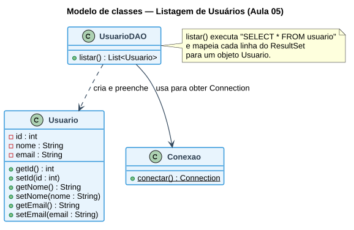

# Aula 05 — Criando o Listar Usuário

> **Data de Postagem:** 06/04/2026
> **Professor:** Jefferson Passerini
> **Disciplina:** Laboratório de Programação III (3º Semestre)
> **Tema:** Implementação da listagem de usuários cadastrados a partir do banco de dados

## Objetivo da aula

Implementar a primeira operação de leitura (`Read`) do CRUD: modelar a entidade `Usuario`, criar a classe de acesso a dados (`UsuarioDAO`) responsável por executar o `SELECT` e converter o `ResultSet` em objetos Java, e encaminhar essa lista para uma página JSP exibi-la em formato de tabela.

## Classe de domínio (`Usuario.java`)

```java
package com.exemplo.model;

public class Usuario {
    private int id;
    private String nome;
    private String email;

    public Usuario() {}

    public Usuario(int id, String nome, String email) {
        this.id = id;
        this.nome = nome;
        this.email = email;
    }

    public int getId() { return id; }
    public void setId(int id) { this.id = id; }

    public String getNome() { return nome; }
    public void setNome(String nome) { this.nome = nome; }

    public String getEmail() { return email; }
    public void setEmail(String email) { this.email = email; }
}
```

## Classe DAO — operação de listagem

```java
package com.exemplo.dao;

import com.exemplo.model.Usuario;
import java.sql.*;
import java.util.ArrayList;
import java.util.List;

public class UsuarioDAO {

    // READ (Listar todos)
    public List<Usuario> listar() {
        List<Usuario> usuarios = new ArrayList<>();
        String sql = "SELECT * FROM usuario";
        try (Connection conn = Conexao.conectar();
             Statement stmt = conn.createStatement();
             ResultSet rs = stmt.executeQuery(sql)) {
            while (rs.next()) {
                Usuario u = new Usuario();
                u.setId(rs.getInt("id"));
                u.setNome(rs.getString("nome"));
                u.setEmail(rs.getString("email"));
                usuarios.add(u);
            }
        } catch (SQLException e) {
            e.printStackTrace();
        }
        return usuarios;
    }
}
```

Note o uso de *try-with-resources* (`try (Connection conn = ...; Statement stmt = ...; ResultSet rs = ...)`): as três estruturas JDBC (`Connection`, `Statement`, `ResultSet`) são fechadas automaticamente ao final do bloco, mesmo em caso de exceção — evitando vazamento de conexões, um dos erros mais comuns em aplicações JDBC.

## O padrão DAO (Data Access Object)

`UsuarioDAO` isola toda a lógica de acesso ao banco de dados (SQL, `ResultSet`, tratamento de `SQLException`) em uma classe própria, separada do Servlet (que trata a requisição HTTP) e do `Usuario` (que apenas representa o dado). Essa separação é o que permite, por exemplo, trocar o SGBD ou otimizar uma consulta sem alterar o Servlet que a utiliza.

## Modelo de domínio desta etapa



## Do `ResultSet` à tabela HTML

1. O Servlet chama `usuarioDAO.listar()` e recebe uma `List<Usuario>`.
2. O Servlet armazena essa lista como atributo da requisição: `request.setAttribute("usuarios", listaUsuarios)`.
3. O Servlet encaminha para a JSP com `request.getRequestDispatcher("listar.jsp").forward(request, response)`.
4. A página JSP percorre a lista (por exemplo, com a tag `<c:forEach>` da JSTL) e renderiza uma linha de tabela HTML por usuário.

## Exercícios de fixação

1. Implemente a classe `Usuario` com os atributos `id`, `nome` e `email`, incluindo construtores, getters e setters.
2. Implemente `UsuarioDAO.listar()` utilizando a classe `Conexao` da Aula 04.
3. Explique a vantagem de usar *try-with-resources* em vez de fechar `Connection`, `Statement` e `ResultSet` manualmente em blocos `finally`.
4. Escreva o trecho do Servlet que chama `listar()` e encaminha o resultado para uma página JSP.

<details>
<summary>Gabarito (questões 3 e 4)</summary>

**Questão 3:** com *try-with-resources*, o fechamento de `Connection`, `Statement` e `ResultSet` é feito automaticamente pela JVM ao sair do bloco `try`, na ordem inversa da abertura, e isso ocorre **mesmo se uma exceção for lançada** no meio da execução. Fechar manualmente em `finally` exige blocos aninhados (o fechamento de `rs` pode falhar antes de tentar fechar `stmt` e `conn`) e é mais propenso a esquecer um dos três recursos — um erro que causa vazamento de conexões e, no acumulado, esgotamento do pool de conexões do banco.

**Questão 4:**
```java
protected void doGet(HttpServletRequest request, HttpServletResponse response)
        throws ServletException, IOException {
    UsuarioDAO dao = new UsuarioDAO();
    List<Usuario> listaUsuarios = dao.listar();
    request.setAttribute("usuarios", listaUsuarios);
    request.getRequestDispatcher("listar.jsp").forward(request, response);
}
```
</details>

## Perguntas de revisão

- Qual a responsabilidade de uma classe DAO?
- Por que `Usuario` não deve conter lógica de acesso ao banco de dados?
- Como o resultado de um `SELECT` chega até a página JSP?

## Material relacionado

- Links Úteis: [Java JSP - Cap 5 - Implementando um CRUD Simples - Classe Usuario | Notion](https://spiffy-number-b06.notion.site/Java-JSP-Cap-5-Implementando-um-CRUD-Simples-Classe-Usuario-1b9393aeab2a80158d4fe789ab48fdbf)
- [Aula 04 — Conexão com o Banco de Dados](../Aula%2004%20-%20Conex%C3%A3o%20com%20o%20Banco%20de%20Dados/detalhes.md) — classe `Conexao` usada nesta aula
- [Aula 06 — Implementando o CRUD](../Aula%2006%20-%20Implementando%20o%20CRUD/detalhes.md) — completa `UsuarioDAO` com incluir/alterar/excluir
- [Resumo executivo, simulado e cheatsheet da disciplina](../../README.md#resumo-executivo)
- Post original da aula: [`post-original.md`](./post-original.md)
