# Aula 05 — Operação de Manutenção do Cadastro de Usuários

> **Professor:** Jefferson Passerini  
> **Disciplina:** Laboratório de Programação III (3º Semestre)  
> **Tema:** Implementação completa de operações de inclusão, validação, verificação assíncrona e consulta de usuários com Servlet, JSP, DAO e JDBC

---

## Sumário

- [Objetivo da aula](#objetivo-da-aula)
- [Contexto e pré-requisitos](#contexto-e-pré-requisitos)
- [Decisão de persistência na DAO: bifurcação entre inclusão e alteração pelo identificador (ID == 0)](#decisão-de-persistência-na-dao-bifurcação-entre-inclusão-e-alteração-pelo-identificador-id--0)
- [Implementação do método inserir com PreparedStatement e controle transacional (commit e rollback)](#implementação-do-método-inserir-com-preparedstatement-e-controle-transacional-commit-e-rollback)
- [Verificação de duplicidade de CPF com consulta COUNT(*) na camada DAO](#verificação-de-duplicidade-de-cpf-com-consulta-count-na-camada-dao)
- [Criação da classe utilitária DocumentoValidador com métodos estáticos para validação algorítmica de CPF e CNPJ](#criação-da-classe-utilitária-documentovalidador-com-métodos-estáticos-para-validação-algorítmica-de-cpf-e-cnpj)
- [Diferenciação e boas práticas entre métodos estáticos e métodos de instância em Java](#diferenciação-e-boas-práticas-entre-métodos-estáticos-e-métodos-de-instância-em-java)
- [Construção do Servlet UsuarioVerificarCPF para atendimento assíncrono de checagem de duplicidade](#construção-do-servlet-usuarioverificarcpf-para-atendimento-assíncrono-de-checagem-de-duplicidade)
- [Construção do Servlet UsuarioNovo para inicialização de modelo vazio e despacho (forward) para o JSP](#construção-do-servlet-usuarionovo-para-inicialização-de-modelo-vazio-e-despacho-forward-para-o-jsp)
- [Mapeamento e configuração de rotas HTTP com a anotação @WebServlet e herança de HttpServlet](#mapeamento-e-configuração-de-rotas-http-com-a-anotação-webservlet-e-herança-de-httpservlet)
- [Construção do Servlet UsuarioCadastrar com conversão de tipos, higienização monetária e códigos numéricos de status](#construção-do-servlet-usuariocadastrar-com-conversão-de-tipos-higienização-monetária-e-códigos-numéricos-de-status)
- [Desenvolvimento da interface usuarioCadastrar.jsp com JSTL core, JSTL fmt, Bootstrap e FontAwesome](#desenvolvimento-da-interface-usuariocadastrarjsp-com-jstl-core-jstl-fmt-bootstrap-e-fontawesome)
- [Aplicação de máscaras dinâmicas de moeda (maskMoney) e alternância entre CPF e CNPJ com jQuery](#aplicação-de-máscaras-dinâmicas-de-moeda-maskmoney-e-alternância-entre-cpf-e-cnpj-com-jquery)
- [Validação no cliente com SweetAlert, eventos blur e submissão assíncrona de formulários via jQuery AJAX](#validação-no-cliente-com-sweetalert-eventos-blur-e-submissão-assíncrona-de-formulários-via-jquery-ajax)
- [Implementação do método carregar na camada DAO via SELECT parametrizado para suporte à edição](#implementação-do-método-carregar-na-camada-dao-via-select-parametrizado-para-suporte-à-edição)
- [Código da aula](#código-da-aula)
- [Exercícios](#exercícios)
- [Erros comuns e boas práticas](#erros-comuns-e-boas-práticas)
- [Links e materiais complementares](#links-e-materiais-complementares)
- [Mapa da aula](#mapa-da-aula)
- [Glossário](#glossário)
- [Pontos-chave para a prova](#pontos-chave-para-a-prova)
- [Perguntas e respostas (JSONL)](#perguntas-e-respostas-jsonl)
- [Checklist de revisão](#checklist-de-revisão)

---

## Objetivo da aula

Compreender e implementar a camada completa de manutenção cadastral (CRUD - foco em inclusão, preparação para alteração e consulta pontual) para a entidade Usuário dentro do padrão arquitetural MVC (Model-View-Controller) com Java EE. O estudante deverá dominar:
1. O encapsulamento de persistência e transações manuais JDBC (commit e rollback) no padrão Data Access Object (DAO).
2. A aplicação de algoritmos numéricos de validação de CPF/CNPJ via métodos utilitários estáticos.
3. O fluxo de controle em Servlets HTTP tratando requisições síncronas (navegação/forward) e assíncronas (AJAX com respostas em texto/JSON plano).
4. A integração entre JSP, Expression Language (EL), JSTL (`core` e `fmt`), bibliotecas visuais (Bootstrap, FontAwesome), manipulação de máscaras e interceptação de eventos no front-end com jQuery e SweetAlert.

---

## Contexto e pré-requisitos

Esta aula dá continuidade à construção do módulo administrativo do sistema web Java JSP (`aplcurso`), sucedendo a implementação da camada de conexão via `SingleConnection` e a definição da interface de contrato genérico `GenericDAO`. 

### Pré-requisitos técnicos recomendados:
- Conhecimento da linguagem Java (POJO, JavaBeans, herança, interfaces e conversão de tipos/casting).
- Noções de banco de dados relacional (PostgreSQL ou MySQL), especificamente comandos DDL (`CREATE TABLE`, constraints `UNIQUE`, `PRIMARY KEY`) e comandos DML (`INSERT`, `SELECT`, `UPDATE`, `DELETE`).
- Princípios da arquitetura Web Cliente-Servidor e protocolo HTTP (métodos `GET` e `POST`, cabeçalhos, parâmetros de requisição e códigos MIME).
- Estrutura básica de projetos Web Dynamic no NetBeans (pasta `Web Pages`, descritor de implantação e bibliotecas de dependência).

---

## Decisão de persistência na DAO: bifurcação entre inclusão e alteração pelo identificador (ID == 0)

### Definição e Motivação
Na arquitetura do padrão DAO genérico baseada na interface `GenericDAO`, a camada de controle frequentemente despacha a entidade de domínio através de uma operação unificada de salvamento (`cadastrar`). No entanto, no banco de dados relacional, uma inserção (`INSERT`) e uma atualização (`UPDATE`) demandam comandos SQL totalmente distintos.

A motivação central é isolar da camada Controller a responsabilidade de saber qual instrução SQL executar. O método `cadastrar(Object objeto)` atua como uma fachada de decisão interna dentro de `UsuarioDAO`. A verificação do estado de persistência é inferida pelo valor da chave primária (`id`):
- Se `id == 0`: o registro ainda não existe na tabela (o ID gerado por `SERIAL` ou `AUTO_INCREMENT` no banco de dados é sempre estritamente positivo). Logo, o fluxo é desviado para o método `inserir(oUsuario)`.
- Se `id > 0`: o registro já possui correspondência na base de dados relacional, direcionando o processamento para o método `alterar(oUsuario)`.

### Diagrama de Atividades: Bifurcação Cadastrar

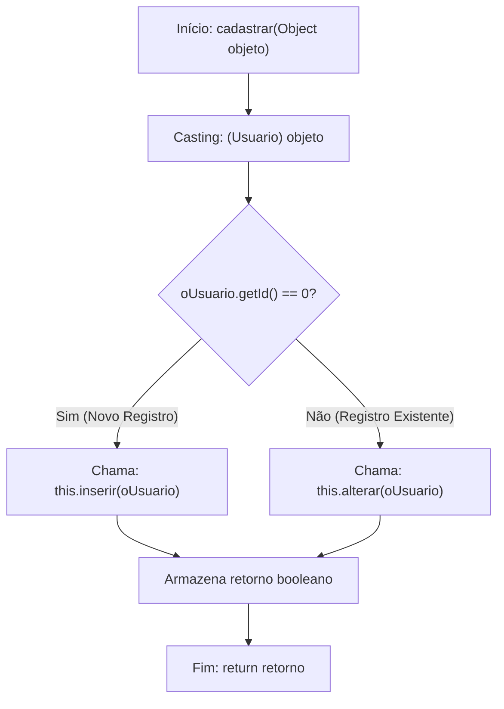

### Implementação Técnica
A interface `GenericDAO` recebe assinaturas baseadas em `Object` para viabilizar o reaproveitamento genérico de contratos nas DAOs do sistema. Por conta disso, o método exige a conversão explícita de tipos (*casting*):

```java
@Override
public Boolean cadastrar(Object objeto) {
    Usuario oUsuario = (Usuario) objeto;
    Boolean retorno = false;
    if (oUsuario.getId() == 0) {
        retorno = this.inserir(oUsuario);
    } else {
        retorno = this.alterar(oUsuario);
    }
    return retorno;
}
```

### Contraexemplo e Armadilhas
- **Contraexemplo:** Criar dois servlets ou acoplar a Controller diretamente às instruções SQL, forçando o controlador a verificar `if (id == 0) dao.inserir(...) else dao.alterar(...)`. Isso quebra o isolamento arquitetural e duplica lógica de negócios em caso de múltiplos pontos de entrada.
- **Armadilha do Tipo Primitivo vs Wrapper:** Na classe `Usuario`, o atributo `id` está declarado como primitivo `int` (cujo valor default na instanciação é `0`). Caso fosse declarado como `Integer` (wrapper) e inicializado como `null`, a comparação `oUsuario.getId() == 0` lançaria uma `NullPointerException` em tempo de execução se não houvesse verificação prévia de nulidade.

### Tabela Comparativa de Estratégias de Persistência

| Característica | Decisão Unificada na DAO (`cadastrar`) | Métodos Expostos Separados na Controller |
| :--- | :--- | :--- |
| **Acoplamento da Controller** | Baixo (invoca apenas `cadastrar`) | Alto (precisa saber se a entidade é nova ou não) |
| **Coesão da DAO** | Alta (centraliza regras de persistência) | Média (expõe métodos de baixo nível de persistência) |
| **Tratamento de Identificador** | Avaliação padronizada da chave primária | Dependente da regra implementada no servlet |

---

## Implementação do método inserir com PreparedStatement e controle transacional (commit e rollback)

### Definição e Motivação
O método `inserir` é responsável por executar a inserção física dos dados na tabela `usuario`. Por padrão de arquitetura corporativa e segurança da informação, essa operação utiliza:
1. **`PreparedStatement`**: Objeto da API JDBC que compila previamente a instrução SQL no banco de dados e substitui os parâmetros posicionais marcados com interrogação (`?`). Essa abordagem impede ataques de *SQL Injection* e delega ao driver o escape correto de caracteres e tratamento de datas e tipos numéricos.
2. **Controle Transacional Explícito**: Em operações de escrita em bancos relacionais com integridade estrita, o modo `autoCommit` da conexão é desabilitado (gerenciado na classe `SingleConnection`). Com isso, a transação deve ser formalmente confirmada via `conexao.commit()` em caso de sucesso, ou totalmente revertida via `conexao.rollback()` dentro do bloco de captura de exceções (`catch`), evitando estados inconsistentes na base de dados.

### Diagrama de Sequência: Inserção Transacional

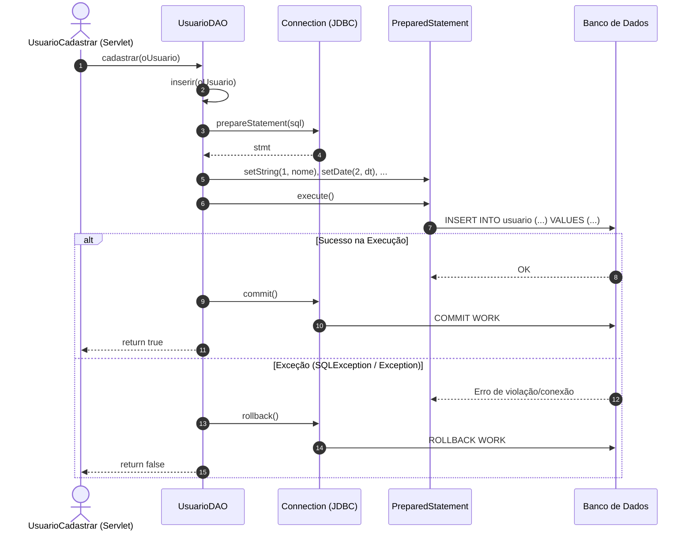

### Análise do Código de Inserção

```java
@Override
public Boolean inserir(Object objeto) {
    Usuario oUsuario = (Usuario) objeto;
    PreparedStatement stmt = null;
    String sql = "insert into usuario (nome, datanascimento, cpf, email, senha, salario) "
               + "values (?,?,?,?,?,?)"; 
    try {
        stmt = conexao.prepareStatement(sql);
        stmt.setString(1, oUsuario.getNome()); 
        // Conversão de java.util.Date para java.sql.Date
        stmt.setDate(2, new java.sql.Date(oUsuario.getDataNascimento().getTime()));
        stmt.setString(3, oUsuario.getCpf());
        stmt.setString(4, oUsuario.getEmail());
        stmt.setString(5, oUsuario.getSenha());
        stmt.setDouble(6, oUsuario.getSalario());
        
        stmt.execute();
        conexao.commit();
        return true;
    } catch (Exception ex) {
        try {
            System.out.println("Problemas ao cadastrar a Usuário! Erro: " + ex.getMessage());
            ex.printStackTrace();
            conexao.rollback();
        } catch (SQLException e) {
            System.out.println("Erro:" + e.getMessage());
            e.printStackTrace();
        }
        return false;
    } 
}
```

### Conversão Temporal: `java.util.Date` vs `java.sql.Date`
Um dos problemas clássicos do JDBC diz respeito à incompatibilidade entre a biblioteca de datas tradicional do Java e os tipos de coluna do SQL:
- O tipo `java.util.Date` representa instante no tempo com milissegundos (data e hora).
- O tipo `java.sql.Date` armazena exclusivamente ano, mês e dia (sem fração de tempo associada, truncando horas, minutos e segundos).
- O construtor do JDBC exige a passagem de `java.sql.Date`, que deve ser instanciado a partir dos milissegundos da data utilitária:
  ```java
  new java.sql.Date(oUsuario.getDataNascimento().getTime())
  ```

### Armadilhas e Boas Práticas de Transação
- **Armadilha do Rollback sem Tratamento:** O método `rollback()` também lança `SQLException`. Se o programador não aninhar um segundo `try-catch` dentro da captura de exceção, a aplicação interrompe abruptamente sem liberar os recursos da conexão.
- **Vazamento de Recursos (*Resource Leak*):** Na ausência de um bloco `finally` ou da diretiva `try-with-resources`, o `PreparedStatement` pode permanecer aberto no driver JDBC caso ocorra falha. Em ambientes de alto tráfego, isso esgota a tabela de cursores do SGBD.

---

## Verificação de duplicidade de CPF com consulta COUNT(*) na camada DAO

### Definição e Motivação
A integridade de unicidade da coluna `cpf` deve ser garantida no banco de dados por meio de uma restrição `UNIQUE`. Entretanto, delegar exclusivamente ao SGBD a detecção de duplicidades resulta no disparo de uma `PSQLException` ou `SQLException` genérica durante a execução do comando `INSERT`.

Para fornecer uma experiência amigável ao usuário e permitir validações assíncronas no front-end antes da submissão do formulário, a classe `UsuarioDAO` implementa a verificação antecipada de duplicidade por meio do método `cpfExiste(String cpf)`.

### Diagrama de Fluxo de Verificação de Existência

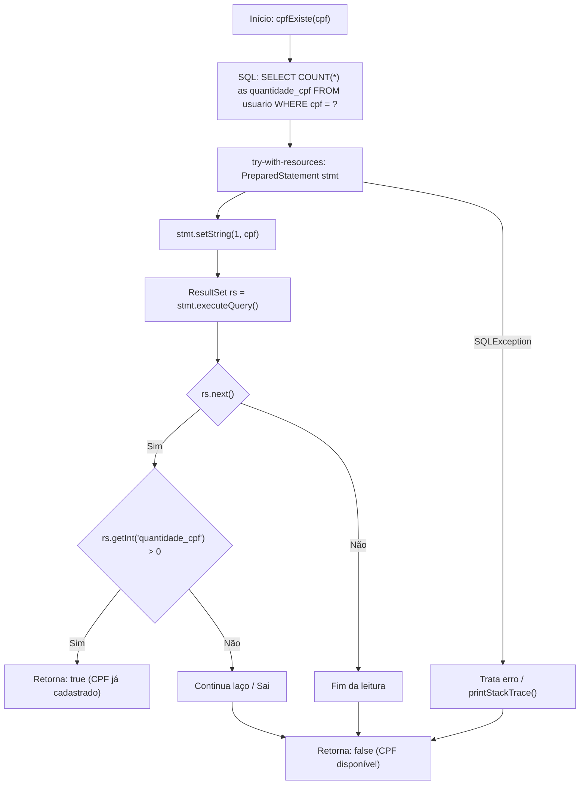

### Implementação Técnica do Método `cpfExiste`

```java
public boolean cpfExiste(String cpf) {
    String sql = "SELECT COUNT(*) as quantidade_cpf FROM usuario WHERE cpf = ?";
    try (PreparedStatement stmt = conexao.prepareStatement(sql)) {
        stmt.setString(1, cpf);
        ResultSet rs = stmt.executeQuery();
        while (rs.next()) {
            if (rs.getInt("quantidade_cpf") > 0) {
                return true;
            }
        }
    } catch (SQLException e) {
        e.printStackTrace();
    }
    return false;
}
```

### Análise de Eficiência Computacional
- O uso de `COUNT(*)` é significativamente mais leve para o SGBD e para a rede do que um `SELECT * FROM usuario WHERE cpf = ?`, pois evita a transferência desnecessária de colunas de texto, senhas e datas.
- O bloco `try (PreparedStatement stmt = ...)` implementa o padrão *try-with-resources* do Java 7+, garantindo o fechamento automático da instrução e de seus respectivos conjuntos de resultados sem a necessidade de chamadas manuais a `stmt.close()`.

---

## Criação da classe utilitária DocumentoValidador com métodos estáticos para validação algorítmica de CPF e CNPJ

### Definição e Motivação
A verificação sintática de documentos federais (Cadastro de Pessoas Físicas - CPF e Cadastro Nacional da Pessoa Jurídica - CNPJ) segue normas rígidas estabelecidas pela Receita Federal do Brasil, fundamentadas no algoritmo de **Módulo 11**. 

A motivação de criar a classe `DocumentoValidador` dentro do pacote `br.com.aplcurso.utils` é desacoplar a lógica de cálculo puramente matemático da camada de persistência e das servlets, centralizando as regras em um único componente reutilizável em todo o ciclo de vida da aplicação.

### Algoritmo do Módulo 11 para CPF
Um CPF possui 11 dígitos, dispostos na forma `ABC.DEF.GHI-JK`, onde `J` e `K` são os dígitos verificadores (DV):
1. **Higienização:** Remoção de pontuações via expressão regular `replaceAll("[^\\d]", "")`.
2. **Rejeição de Triviais:** Eliminação de cadeias com menos/mais de 11 dígitos e CPFs com dígitos idênticos repetidos (ex.: `111.111.111-11`, `222.222.222-22`), validados via regex `(\\d)\\1{10}`.
3. **Primeiro Dígito ($d_1$):**
   - Somatório dos 9 primeiros dígitos multiplicados por pesos decrescentes de 10 até 2:
     $$S_1 = \sum_{i=0}^{8} \text{dígito}[i] \times (10 - i)$$
   - Cálculo do resto:
     $$R_1 = S_1 \pmod{11}$$
   - Regra do dígito:
     $$d_1 = (11 - R_1) > 9 \;?\; 0 : (11 - R_1)$$
4. **Segundo Dígito ($d_2$):**
   - Somatório dos 9 dígitos iniciais multiplicados pelos pesos de 11 até 3, acrescido do dobro de $d_1$:
     $$S_2 = \left(\sum_{i=0}^{8} \text{dígito}[i] \times (11 - i)\right) + (d_1 \times 2)$$
   - Cálculo do resto e aplicação da regra:
     $$R_2 = S_2 \pmod{11}$$
     $$d_2 = (11 - R_2) > 9 \;?\; 0 : (11 - R_2)$$
5. **Conferência Final:** O cálculo é válido se $d_1 == \text{dígito}[9]$ e $d_2 == \text{dígito}[10]$.

### Diagrama de Atividades: Validação de CPF

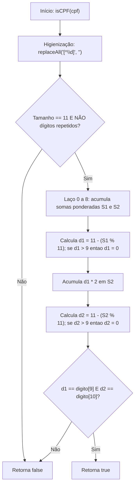

### Implementação da Classe `DocumentoValidador`

```java
package br.com.aplcurso.utils;

public class DocumentoValidador {

    public static boolean isCPF(String cpf) {
        if (cpf == null) return false;
        cpf = cpf.replaceAll("[^\\d]", "");
        if (cpf.length() != 11 || cpf.matches("(\\d)\\1{10}")) return false;

        try {
            int d1 = 0, d2 = 0;
            for (int i = 0; i < 9; i++) {
                // Conversão de caractere ASCII para valor numérico inteiro
                int digito = cpf.charAt(i) - '0';
                d1 += digito * (10 - i);
                d2 += digito * (11 - i);
            }

            d1 = 11 - (d1 % 11);
            d1 = (d1 > 9) ? 0 : d1;
            d2 += d1 * 2;
            d2 = 11 - (d2 % 11);
            d2 = (d2 > 9) ? 0 : d2;

            return d1 == (cpf.charAt(9) - '0') && d2 == (cpf.charAt(10) - '0');
        } catch (Exception e) {
            return false;
        }
    }

    public static boolean isCNPJ(String cnpj) {
        if (cnpj == null) return false;
        cnpj = cnpj.replaceAll("[^\\d]", "");
        if (cnpj.length() != 14 || cnpj.matches("(\\d)\\1{13}")) return false;

        try {
            int[] pesos1 = {5, 4, 3, 2, 9, 8, 7, 6, 5, 4, 3, 2};
            int[] pesos2 = {6, 5, 4, 3, 2, 9, 8, 7, 6, 5, 4, 3, 2};

            int d1 = 0, d2 = 0;

            for (int i = 0; i < 12; i++) {
                int digito = cnpj.charAt(i) - '0';
                d1 += digito * pesos1[i];
                d2 += digito * pesos2[i];
            }

            d1 = d1 % 11;
            d1 = (d1 < 2) ? 0 : 11 - d1;
            d2 += d1 * pesos2[12];
            d2 = d2 % 11;
            d2 = (d2 < 2) ? 0 : 11 - d2;

            return d1 == (cnpj.charAt(12) - '0') && d2 == (cnpj.charAt(13) - '0');
        } catch (Exception e) {
            return false;
        }
    }

    public static boolean isDocumentoValido(String documento) {
        if (documento == null) return false;
        documento = documento.replaceAll("[^\\d]", "");
        if (documento.length() == 11) {
            return isCPF(documento);
        } else if (documento.length() == 14) {
            return isCNPJ(documento);
        }
        return false;
    }
}
```

---

## Diferenciação e boas práticas entre métodos estáticos e métodos de instância em Java

### Definição Teórica
Em Java, a palavra-chave `static` altera o escopo de ligação de um membro (atributo ou método). Um **método estático** pertence à definição da classe carregada na *Method Area / Metaspace* da JVM, enquanto um **método de instância** opera sobre o estado encapsulado de um objeto alocado na memória *Heap*.

### Diagrama Arquitetural de Memória: Estático vs Instância

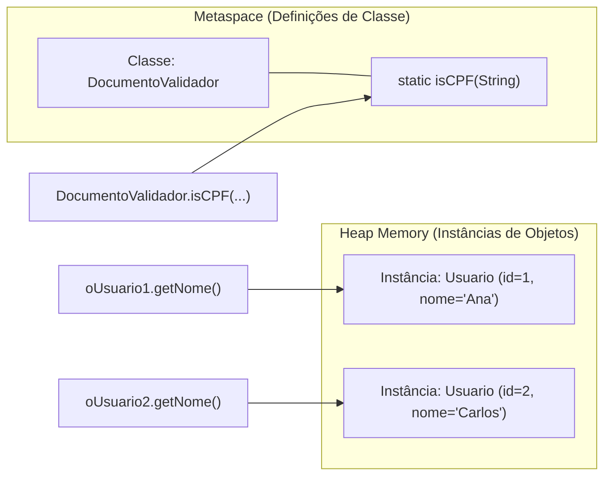

### Análise Comparativa Detalhada

| Critério | Método Estático (`static`) | Método de Instância |
| :--- | :--- | :--- |
| **Alocação / Vínculo** | Classe (carregamento estático) | Objeto (resolução dinâmica com ponteiro `this`) |
| **Necessidade de `new`** | Inexistente. Invocação direta: `Classe.metodo()` | Obrigatória. Requer instanciação do objeto |
| **Acesso a Atributos** | Acessa exclusivamente constantes ou campos estáticos | Acessa todos os campos de instância e campos estáticos |
| **Polimorfismo (Override)** | Não permite sobrescrita polimórfica (*Method Hiding*) | Suporta polimorfismo dinâmico total via tabela virtual |
| **Caso Típico de Uso** | Operações matemáticas, utilitários, conversões puras | Comportamento que modifica ou lê o estado da entidade |

### Boas Práticas e Regras de Decisão
- **Quando usar métodos estáticos:** Classes utilitárias puras (ex.: `DocumentoValidador`, `Math`), funções determinísticas (onde a mesma entrada produz rigorosamente a mesma saída sem efeitos colaterais) e métodos de fábrica estáticos (ex.: `LocalDate.now()`).
- **Antipadrão:** Criar classes de negócios cheias de métodos estáticos acessando variáveis globais compartilhadas, o que quebra o encapsulamento, impede testes unitários com *mocks* e gera concorrência descontrolada em ambiente web multithreaded.

---

## Construção do Servlet UsuarioVerificarCPF para atendimento assíncrono de checagem de duplicidade

### Definição e Motivação
A checagem de duplicidade de CPF durante a digitação melhora significativamente a usabilidade do sistema, avisando o operador antes mesmo de ele preencher todo o formulário. O `UsuarioVerificarCPF` é um Servlet HTTP especializado em processar requisições em segundo plano, originadas pelo evento `blur` do campo de formulário HTML.

Ao contrário de páginas tradicionais que devolvem documentos HTML completos, este servlet opera como um serviço REST minimalista, devolvendo apenas uma flag de validação em texto plano/JSON (`1` para duplicado e `0` para disponível).

### Diagrama de Sequência: Verificação Assíncrona de CPF

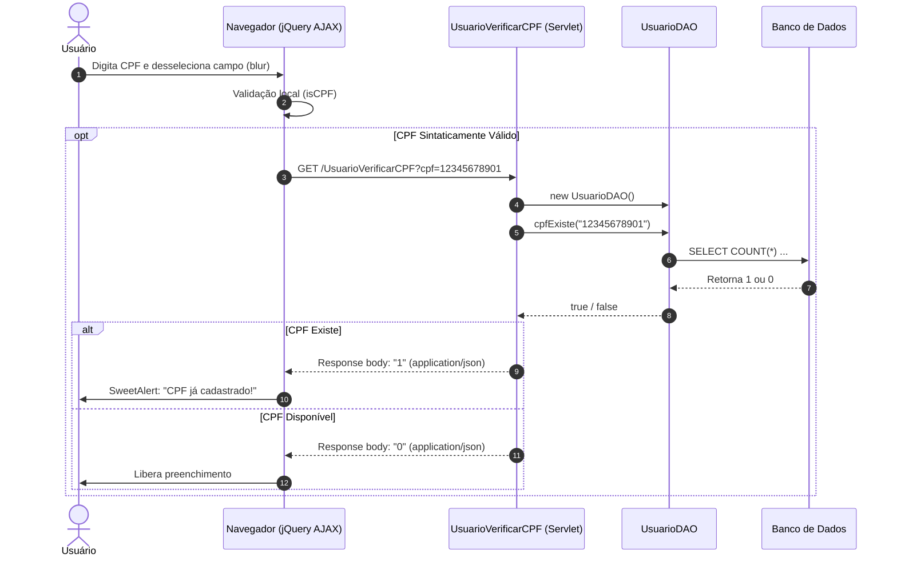

### Implementação do Servlet

```java
package br.com.aplcurso.controller.usuario;

import br.com.aplcurso.dao.UsuarioDAO;
import java.io.IOException;
import javax.servlet.ServletException;
import javax.servlet.annotation.WebServlet;
import javax.servlet.http.HttpServlet;
import javax.servlet.http.HttpServletRequest;
import javax.servlet.http.HttpServletResponse;

@WebServlet(name = "UsuarioVerificarCPF", urlPatterns = {"/UsuarioVerificarCPF"})
public class UsuarioVerificarCPF extends HttpServlet {

    protected void processRequest(HttpServletRequest request, HttpServletResponse response)
            throws ServletException, IOException {
        
        response.setContentType("application/json;charset=UTF-8");
        try {
            UsuarioDAO usuarioDAO = new UsuarioDAO();
            String cpf = request.getParameter("cpf");
            
            // Higienização prévia para garantir que chegue apenas dígitos à DAO
            if (cpf != null) {
                cpf = cpf.replaceAll("[^\\d]", "");
            }

            if (usuarioDAO.cpfExiste(cpf)) {
                response.getWriter().write("1");
            } else {
                response.getWriter().write("0");
            }
        } catch (Exception ex) {
            System.out.println("Problemas no Servlet ao validar cpf de usuario! Erro: " + ex.getMessage());
            response.getWriter().write("0");
        }
    }

    @Override
    protected void doGet(HttpServletRequest request, HttpServletResponse response)
            throws ServletException, IOException {
        processRequest(request, response);
    }

    @Override
    protected void doPost(HttpServletRequest request, HttpServletResponse response)
            throws ServletException, IOException {
        processRequest(request, response);
    }

    @Override
    public String getServletInfo() {
        return "Validador assíncrono de unicidade de CPF";
    }
}
```

---

## Construção do Servlet UsuarioNovo para inicialização de modelo vazio e despacho (forward) para o JSP

### Definição e Motivação
Na arquitetura MVC adotada, a camada de visão (`JSP`) nunca deve ser acessada de forma direta pelo usuário navegando até o caminho do arquivo físico (ex.: digitando diretamente `/cadastros/usuario/usuarioCadastrar.jsp`). 

O acesso deve ser mediado por uma Controller (`UsuarioNovo`). A motivação para isso é dupla:
1. **Inicialização do Modelo de Dados:** Cria-se uma instância limpa da entidade (`new Usuario()`) com valores padrão (`id = 0`, atributos nulos ou vazios) e anexa-se essa instância à requisição via `request.setAttribute("usuario", oUsuario)`.
2. **Reaproveitamento de Interface Unificada:** O mesmo formulário JSP é compartilhado tanto para inclusão quanto para alteração. Para que as Expression Languages (`${usuario.nome}`, `${usuario.id}`) não lancem erros e renderizem campos vazios sem exceções, o objeto `usuario` precisa estar presente no escopo da requisição.

### Diagrama de Navegação e Escopo HTTP

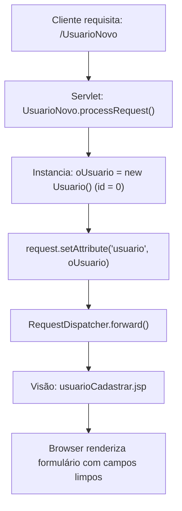

### Análise Técnica do `processRequest`

```java
protected void processRequest(HttpServletRequest request, HttpServletResponse response)
        throws ServletException, IOException {
    response.setContentType("text/html;charset=iso-8859-1");
    try {
        Usuario oUsuario = new Usuario();
        request.setAttribute("usuario", oUsuario);
        request.getRequestDispatcher("/cadastros/usuario/usuarioCadastrar.jsp")
               .forward(request, response);
    } catch (Exception ex) {
        System.out.println("Problema na Servlet ao carregar novo usuário! Erro: " + ex.getMessage());
        ex.printStackTrace(); 
    }
}
```

### Diferença entre `forward` e `sendRedirect`

| Mecanismo | `RequestDispatcher.forward()` | `HttpServletResponse.sendRedirect()` |
| :--- | :--- | :--- |
| **Execução** | No servidor (interna) | No cliente (duas requisições HTTP distintas) |
| **URL no Navegador** | Mantém a URL do Servlet (`/UsuarioNovo`) | Altera para a nova URL requisitada |
| **Preservação de Dados** | Preserva atributos colocados no `request` | Descarta os dados do `request` anterior |
| **Desempenho** | Mais rápido (sem novo ciclo de rede) | Mais lento (requer novo round-trip do navegador) |

---

## Mapeamento e configuração de rotas HTTP com a anotação @WebServlet e herança de HttpServlet

### Definição Teórica
Com a especificação Java Servlet 3.0 (JSR 315), o mapeamento de classes controladoras passou a ser configurado diretamente no código-fonte por meio de metadados declarativos expressos pela anotação `@WebServlet`, dispensando o cadastro manual de nós `<servlet>` e `<servlet-mapping>` no arquivo descritor `web.xml`.

### Estrutura da Anotação

```java
@WebServlet(name = "UsuarioCadastrar", urlPatterns = {"/UsuarioCadastrar"})
public class UsuarioCadastrar extends HttpServlet { ... }
```

- **`name`:** Define a identificação lógica interna do servlet no contêiner web.
- **`urlPatterns`:** Um arranjo de strings contendo as rotas relativas que, quando requisitadas, encaminharão o fluxo de processamento para os métodos correspondentes do servlet.
- **Herança de `HttpServlet`:** A classe estende a superclasse abstrata do pacote `javax.servlet.http`, obtendo a infraestrutura de tratamento do ciclo de vida web (`init`, `service`, `destroy`) e despacho para os métodos de protocolo (`doGet`, `doPost`, `doPut`, `doDelete`).

### Diagrama de Ciclo de Vida do Servlet

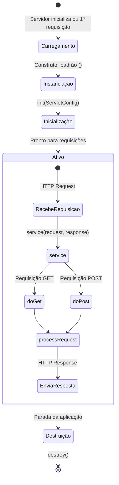

---

## Construção do Servlet UsuarioCadastrar com conversão de tipos, higienização monetária e códigos numéricos de status

### Definição e Motivação
O servlet `UsuarioCadastrar` centraliza o processamento dos dados postados pelo formulário de usuário. Sua responsabilidade no modelo MVC compreende:
1. Extração dos parâmetros textuais trafegados na requisição HTTP (`request.getParameter`).
2. Conversão segura de tipos de dados (`String` para `int`, `double`, `java.sql.Date`).
3. Higienização e sanitização de formatações complexas (ex.: máscara financeira `R$ 1.234,56`).
4. Execução de validações de integridade e regras de negócio no servidor.
5. Invocação da camada DAO e resposta através de **códigos de status padronizados**.

### Protocolo de Códigos de Retorno da Aplicação
Para que o front-end JavaScript trate o retorno de forma assíncrona, a aplicação estabelece uma convenção numérica:

| Código | Significado Negocial | Ação no Front-end |
| :---: | :--- | :--- |
| **`1`** | Usuário cadastrado/atualizado com sucesso | Exibe alerta verde e redireciona para tela limpa |
| **`0`** | Falha na execução do SQL / Rollback no banco | Alerta crítico de erro interno no servidor |
| **`3`** | CPF inválido pelo algoritmo de Módulo 11 | Alerta de erro solicitando correção do CPF |
| **`4`** | CPF já existente na base de dados (duplicidade) | Alerta de advertência solicitando novo CPF |
| **`5`** | Campos obrigatórios em branco ou salário nulo | Alerta de validação indicando dados ausentes |

### Código Integral do Método `processRequest`

```java
protected void processRequest(HttpServletRequest request, HttpServletResponse response)
        throws ServletException, IOException {
    
    response.setContentType("text/html;charset=iso-8859-1");
    try {
        UsuarioDAO dao = new UsuarioDAO();
        
        // Extração e Conversão Básica
        int id = Integer.parseInt(request.getParameter("id"));
        String nome = request.getParameter("nome");
        Date dataNascimento = java.sql.Date.valueOf(request.getParameter("datanascimento"));
        String cpf = request.getParameter("cpf");
        String email = request.getParameter("email");
        String senha = request.getParameter("senha");

        // Tratamento da Máscara Monetária (ex: "R$ 1.500,50")
        String salarioStr = request.getParameter("salario");
        if (salarioStr != null) {
            salarioStr = salarioStr.replace("R$", "")
                                   .replace(".", "")
                                   .replace(",", ".")
                                   .trim();
        }
        double salario = (salarioStr != null && !salarioStr.isEmpty()) 
                         ? Double.parseDouble(salarioStr) : 0.0;
        
        // Bateria de Validações de Regra de Negócio
        if (!DocumentoValidador.isDocumentoValido(cpf)) {
            response.getWriter().write("3");
        } else if (id == 0 && dao.cpfExiste(cpf)) {
            // Nota: dao.cpfExiste é crucial na inclusão (id == 0)
            response.getWriter().write("4");
        } else if (nome == null || nome.isBlank() || salario <= 0 || 
                   email == null || email.isBlank() || senha == null || senha.isBlank()) {
            response.getWriter().write("5");
        } else {
            // Preenchimento do JavaBean
            Usuario oUsuario = new Usuario();
            oUsuario.setId(id);
            oUsuario.setNome(nome);
            oUsuario.setCpf(cpf.replaceAll("[^\\d]", ""));
            oUsuario.setDataNascimento(dataNascimento);
            oUsuario.setEmail(email);
            oUsuario.setSenha(senha);
            oUsuario.setSalario(salario);

            // Persistência na DAO
            if (dao.cadastrar(oUsuario)) {
                response.getWriter().write("1"); 
            } else {
                response.getWriter().write("0");
            }
        }
    } catch (Exception ex) {
        System.out.println("Problemas no Servlet ao cadastrar Usuario! Erro: " + ex.getMessage());
        ex.printStackTrace();
        response.getWriter().write("0");
    }
}
```

---

## Desenvolvimento da interface usuarioCadastrar.jsp com JSTL core, JSTL fmt, Bootstrap e FontAwesome

### Definição Teórica
A página JSP (`usuarioCadastrar.jsp`) constitui a camada de Visão (*View*). Em projetos corporativos, busca-se a eliminação de *scriptlets* Java (`<% ... %>`) no arquivo JSP, substituindo-os por:
- **JSTL Core (`c`)**: Provê tags de lógica estruturada, desvios e controle de fluxo.
- **JSTL Formatting (`fmt`)**: Formata números, moedas e datas conforme a localidade (*locale*).
- **Expression Language (EL)**: Sintaxe concisa `${objeto.propriedade}` para acessar propriedades do modelo que residem nos escopos de requisição ou sessão.
- **Bootstrap 4**: Framework CSS para responsividade em grid de 12 colunas, tipografia e estilização de formulários (`form-group`, `form-control`, `card`).
- **FontAwesome**: Biblioteca vetorial de ícones de interface.

### Diagrama de Inclusão e Composição Modular JSP

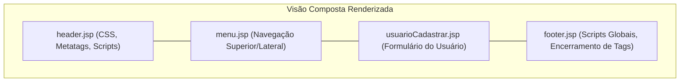

### Código-Fonte da Estrutura JSP

```jsp
<%@taglib prefix="c" uri="http://java.sun.com/jsp/jstl/core" %>
<%@taglib prefix="fmt" uri="http://java.sun.com/jsp/jstl/fmt"%>
<%@page contentType="text/html" pageEncoding="iso-8859-1"%>
<jsp:include page="/header.jsp"/>
<jsp:include page="/menu.jsp"/>

<div class="container-fluid">
    <h1 class="h3 mb-2 text-gray-800">Usuários</h1>
    <p class="mb-4">Formulário de Cadastro e Manutenção</p>

    <a class="btn btn-secondary mb-4" href="${pageContext.request.contextPath}/UsuarioListar">
        <i class="fas fa-undo-alt"></i>
        <strong>Voltar</strong>
    </a>
    
    <div class="row">
        <div class="col-lg-9">
            <div class="card shadow mb-4">
                <div class="card-body">
                    <div class="form-group">
                        <label for="id">Identificador (ID)</label>
                        <input class="form-control" type="text" name="id" id="id" 
                               value="${usuario.id}" readonly="readonly"/>
                    </div>
                    <div class="form-group">
                        <label for="nome">Nome Completo</label>
                        <input class="form-control" type="text" name="nome" id="nome" 
                               value="${usuario.nome}" size="100" maxlength="100"/>
                    </div>
                    <div class="form-group">
                        <label for="cpf">CPF / CNPJ</label>
                        <input class="form-control" type="text" name="cpf" id="cpf" 
                               value="${usuario.cpf}" size="18" maxlength="18"/>
                    </div>
                    <div class="form-group">
                        <div class="form-line row">
                            <div class="col-sm">
                                <label for="datanascimento">Data de Nascimento</label>
                                <input class="form-control" type="date" name="datanascimento" id="datanascimento" 
                                       value="${usuario.dataNascimento}"/>
                            </div>
                            <div class="col-sm">
                                <label for="salario">Valor do Salário</label>
                                <input class="form-control" type="text" style="text-align:right;" 
                                       name="salario" id="salario" 
                                       value="<fmt:formatNumber value='${usuario.salario}' type='currency'/>" />
                            </div>
                        </div>
                    </div>
                    <div class="form-group">
                        <label for="email">Correio Eletrônico (E-mail)</label>
                        <input class="form-control" type="email" name="email" id="email" 
                               value="${usuario.email}" size="100" maxlength="100" 
                               required="true"/>
                    </div>
                    <div class="form-group">
                        <label for="senha">Credencial de Acesso (Senha)</label>
                        <input class="form-control" type="password" name="senha" id="senha" 
                               value="${usuario.senha}" size="100" maxlength="100" 
                               required="true"/>
                    </div>
                    <div class="form-group">
                        <button class="btn btn-success" type="button" id="submit" onclick="validarCampos()">
                            <i class="fas fa-save"></i> Salvar Documento
                        </button>
                    </div> 
                </div>
            </div>
        </div>
    </div>
</div>
```

---

## Aplicação de máscaras dinâmicas de moeda (maskMoney) e alternância entre CPF e CNPJ com jQuery

### Definição e Motivação
A experiência de digitação do usuário exige máscaras visuais que facilitem a conferência dos dados sem corromper a representação pura no banco. Nesta interface são empregados dois plugins baseados em jQuery:
1. **jQuery MaskMoney**: Intercepta as teclas digitadas em campos numéricos monetários, calculando casas decimais da direita para a esquerda e inserindo separadores de milhar (`.`) e decimal (`,`), além do prefixo de moeda (`R$`).
2. **jQuery Mask Plugin (ou manipulação customizada)**: Ajusta o padrão de entrada do documento. Como pessoas jurídicas e físicas podem eventualmente interagir no mesmo componente de entrada, a função `trocaMascara` alterna dinamicamente o formato da máscara conforme o total de dígitos informados:
   - Até 11 dígitos: Aplica formato de CPF (`999.999.999-99`).
   - Mais de 11 dígitos (até 14): Converte dinamicamente para formato de CNPJ (`99.999.999/9999-99`).

### Diagrama de Máquina de Estados da Máscara

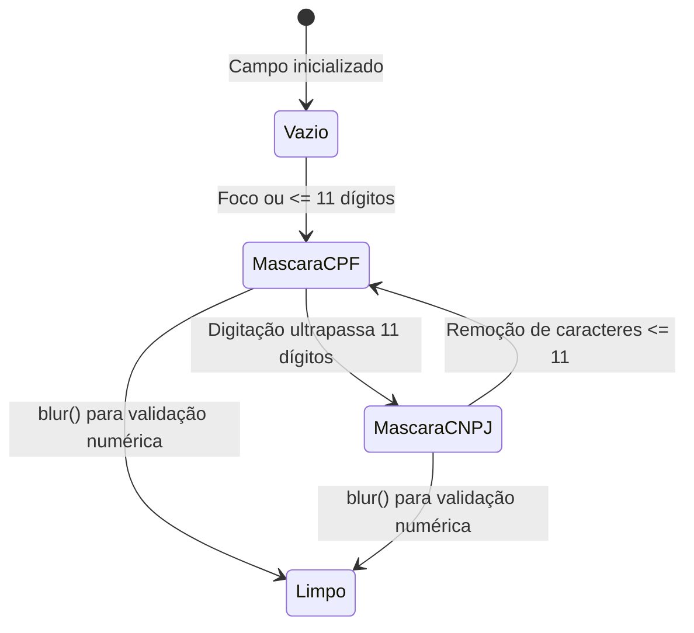

### Implementação do Script de Inicialização e Máscaras

```javascript
$(document).ready(function () {
    // Configuração da máscara monetária
    $("#salario").maskMoney({
        prefix: 'R$ ',
        suffix: '',
        allowZero: false,
        allowNegative: false,
        allowEmpty: false,
        doubleClickSelection: true,
        selectAllOnFocus: true,
        thousands: '.',
        decimal: ",",
        precision: 2,
        affixesStay: true,
        bringCareAtEndOnFocus: true
    });

    // Foco e seleção automática do campo CPF
    $('#cpf').focus(function(){
        trocaMascara(this.value);
        this.select();
    });

    // Inicialização do foco na tela
    $('#nome').focus();
});

// Alternância dinâmica de máscara
function trocaMascara(cpfCnpj) {
    if (typeof cpfCnpj === 'undefined') {
        cpfCnpj = "";
    }
    cpfCnpj = cpfCnpj.trim();

    if (cpfCnpj !== "") {
        var masks = ['999.999.999-99', '99.999.999/9999-99'];
        var apenasDigitos = cpfCnpj.replace(/\D/g, '');
        var mask = (apenasDigitos.length > 11) ? masks[1] : masks[0];
        $('#cpf').unmask().mask(mask);
    } else {
        $('#cpf').unmask();
    }
}
```

---

## Validação no cliente com SweetAlert, eventos blur e submissão assíncrona de formulários via jQuery AJAX

### Definição e Motivação
A validação em aplicações web modernas opera em duas frentes complementares:
1. **Validação no Cliente (Front-end):** Dá *feedback* instantâneo ao usuário, poupa requisições desnecessárias ao servidor e melhora a ergonomia da tela.
2. **Validação no Servidor (Back-end):** Garante a segurança definitiva da aplicação, uma vez que scripts de cliente podem ser desativados ou contornados via ferramentas de depuração (ex.: cURL, Postman).

O uso do **SweetAlert2** substitui os diálogos bloqueantes nativos do navegador (`window.alert`) por modais assíncronos estilizados, integrados às promessas (`Promises`) do JavaScript.

### Diagrama de Atividades: Validação e Submissão AJAX

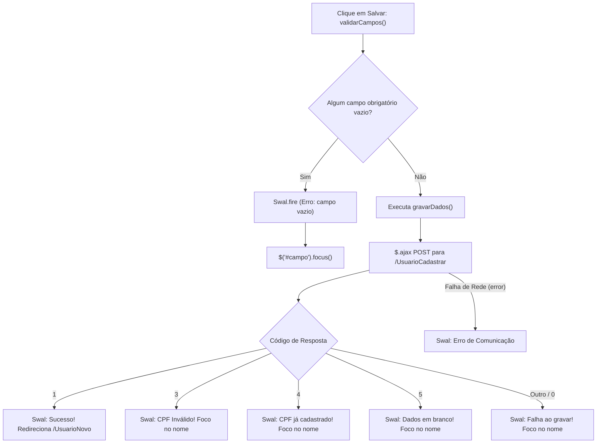

### Código JavaScript: Verificação no Blur e Gravação Assíncrona

```javascript
// Disparo no evento blur do campo CPF
$('#cpf').blur(function () {
    var cpfLimpo = $('#cpf').unmask().val();

    // Validação matemática no front-end
    if (!validarCpfCnpj(cpfLimpo)) {
        Swal.fire({
            position: 'center',
            icon: 'error',
            title: 'Verifique o CPF/CNPJ!',
            text: 'O número digitado não atende às regras de dígitos verificadores.',
            showConfirmButton: true,
            timer: 10000
        });
    } else {
        trocaMascara($('#cpf').val());
        // Consulta assíncrona de unicidade no backend
        $.ajax({
            type: 'GET',
            url: 'UsuarioVerificarCPF',
            data: { cpf: cpfLimpo },
            success: function (response) {
                if (response == '1') {
                    Swal.fire({
                        position: 'center',
                        icon: 'warning',
                        title: 'CPF já cadastrado!',
                        text: 'Por favor, informe outro número de documento.',
                        showConfirmButton: true,
                        timer: 4000
                    }).then(function () {
                        $('#cpf').val('');
                        $('#nome').focus();
                    });
                }
            },
            error: function () {
                console.log("Erro ao verificar CPF no servidor.");
            }
        });
    }
});

function validarCampos() {
    if ($("#nome").val().trim() === '') {
        Swal.fire({ position: 'center', icon: 'error', title: 'Verifique o nome do usuário!', timer: 1500 });
        $("#nome").focus();
    } else if ($("#cpf").val().trim() === '') {
        Swal.fire({ position: 'center', icon: 'error', title: 'Verifique o CPF!', timer: 1500 });
        $("#cpf").focus();
    } else if ($("#email").val().trim() === '') {
        Swal.fire({ position: 'center', icon: 'error', title: 'Verifique o email!', timer: 1500 });
        $("#email").focus();
    } else if ($("#senha").val().trim() === '') {
        Swal.fire({ position: 'center', icon: 'error', title: 'Verifique a senha!', timer: 1500 });
        $("#senha").focus();
    } else if ($("#datanascimento").val().trim() === '') {
        Swal.fire({ position: 'center', icon: 'error', title: 'Verifique a data de nascimento!', timer: 1500 });
        $("#datanascimento").focus();
    } else if ($("#salario").val().trim() === '') {
        Swal.fire({ position: 'center', icon: 'error', title: 'Verifique o salário!', timer: 1500 });
        $("#salario").focus();
    } else {
        gravarDados();
    }
}

function gravarDados() {
    $.ajax({
        type: 'POST',
        url: 'UsuarioCadastrar',
        data: {
            id: $('#id').val(),
            nome: $('#nome').val().toUpperCase(),
            cpf: $('#cpf').unmask().val(),
            datanascimento: $('#datanascimento').val(),
            salario: $('#salario').val(),
            email: $('#email').val(),
            senha: $('#senha').val()
        },
        success: function (data) {
            if (data == 1) {
                Swal.fire({
                    position: 'center',
                    icon: 'success',
                    title: 'Sucesso',
                    text: 'Usuário gravado com sucesso!',
                    showConfirmButton: true,
                    timer: 3000
                }).then(function () {
                    window.location.href = 'UsuarioNovo';
                });
            } else if (data == 3) {
                Swal.fire({ position: 'center', icon: 'error', title: 'CPF inválido!', timer: 4000 });
            } else if (data == 4) {
                Swal.fire({ position: 'center', icon: 'error', title: 'CPF já cadastrado!', timer: 4000 });
            } else if (data == 5) {
                Swal.fire({ position: 'center', icon: 'error', title: 'Dados incompletos!', timer: 4000 });
            } else {
                Swal.fire({ position: 'center', icon: 'error', title: 'Falha ao gravar no banco de dados!', timer: 4000 });
            }
        },
        error: function () {
            Swal.fire({ position: 'center', icon: 'error', title: 'Falha na comunicação com o servidor!' });
        }
    });
}
```

---

## Implementação do método carregar na camada DAO via SELECT parametrizado para suporte à edição

### Definição e Motivação
A operação de alteração de um registro é dividida em duas etapas no ciclo de desenvolvimento web:
1. **Recuperação e Carregamento (Fase de Leitura):** O sistema busca o registro selecionado a partir do seu identificador e transfere as informações preenchidas para o formulário na tela.
2. **Atualização Física (Fase de Escrita):** Após a modificação dos dados pelo usuário, o comando `UPDATE` é despachado.

O método `carregar(int numero)` na classe `UsuarioDAO` é o motor da primeira etapa. Ele executa uma busca unívoca por chave primária (`WHERE id = ?`), constrói a entidade `Usuario` preenchida com os dados do banco e retorna a referência para o chamador.

### Diagrama de Sequência: Carregamento para Edição

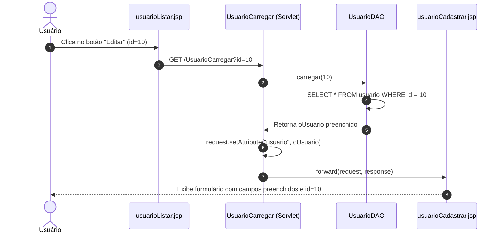

### Implementação do Método `carregar`

```java
@Override
public Object carregar(int numero) {
    String sql = "SELECT * FROM usuario WHERE id = ?";
    Usuario oUsuario = null;
    
    try (PreparedStatement stmt = conexao.prepareStatement(sql)) {
        stmt.setInt(1, numero);
        try (ResultSet rs = stmt.executeQuery()) {
            while (rs.next()) {
                oUsuario = new Usuario(); 
                oUsuario.setId(rs.getInt("id"));
                oUsuario.setNome(rs.getString("nome"));
                oUsuario.setCpf(rs.getString("cpf"));
                oUsuario.setEmail(rs.getString("email"));
                oUsuario.setSalario(rs.getDouble("salario"));
                oUsuario.setDataNascimento(rs.getDate("datanascimento"));
                // Observação de segurança: a senha pode ser omitida ou carregada para revalidação
            }
        }
        return oUsuario;
    } catch (SQLException ex) {
        System.out.println("Erro ao carregar usuário: " + ex.getMessage());
        ex.printStackTrace();
    }
    return oUsuario;
}
```

### Análise de Boas Práticas do Método `carregar`
- O método declara retorno genérico `Object` para manter conformidade estrita com a assinatura definida na interface `GenericDAO`. No controlador que invoca o serviço, deve-se realizar o cast correspondente: `Usuario oUsuario = (Usuario) dao.carregar(id)`.
- A utilização de `try-with-resources` aninhado garante o fechamento determinístico tanto do `PreparedStatement` quanto do `ResultSet`, evitando sobrecarga de conexões pendentes no pool de conexões do servidor de aplicação.

---

## Código da aula

Nesta seção são detalhados os arquivos de código-fonte estruturados para a sustentação das práticas de laboratório.

### 1. Script de Banco de Dados: `schema.sql`
Arquivo de definição das estruturas de dados e restrições de integridade.
- Localização relativa: [./codigo/schema.sql](file:///codigo/schema.sql)

```sql
-- Script DDL para criação da tabela de usuários
CREATE TABLE IF NOT EXISTS usuario (
    id SERIAL PRIMARY KEY,
    nome VARCHAR(100) NOT NULL,
    datanascimento DATE NOT NULL,
    cpf VARCHAR(14) NOT NULL UNIQUE,
    email VARCHAR(100) NOT NULL,
    senha VARCHAR(100) NOT NULL,
    salario NUMERIC(15,2) NOT NULL
);

-- Índices complementares para otimização de consultas
CREATE INDEX IF NOT EXISTS idx_usuario_cpf ON usuario(cpf);
CREATE INDEX IF NOT EXISTS idx_usuario_email ON usuario(email);

-- Massa de dados para testes laboratoriais
INSERT INTO usuario (nome, datanascimento, cpf, email, senha, salario)
VALUES ('ADMINISTRADOR DO SISTEMA', '1990-01-01', '11144477735', 'admin@aplcurso.com.br', 'admin123', 5500.00)
ON CONFLICT (cpf) DO NOTHING;
```

### 2. Exemplos Teóricos e Domínio: `ExemplosAula.java`
Reúne a entidade de domínio `Usuario`, a classe utilitária de cálculo `DocumentoValidador` e a simulação didática da camada de persistência com execução autônoma via método `main`.
- Localização relativa: [./codigo/ExemplosAula.java](file:///codigo/ExemplosAula.java)

Trechos essenciais comentados:

```java
// Entidade de domínio representando a tabela 'usuario'
public class Usuario {
    private int id;
    private String nome;
    private java.util.Date dataNascimento;
    private String cpf;
    private String email;
    private String senha;
    private double salario;

    public Usuario() {
        this.id = 0; // Garante estado inicial como novo registro
    }

    // Getters e Setters convencionais omitidos para concisão
    public int getId() { return id; }
    public void setId(int id) { this.id = id; }
    public String getNome() { return nome; }
    public void setNome(String nome) { this.nome = nome; }
    public java.util.Date getDataNascimento() { return dataNascimento; }
    public void setDataNascimento(java.util.Date dataNascimento) { this.dataNascimento = dataNascimento; }
    public String getCpf() { return cpf; }
    public void setCpf(String cpf) { this.cpf = cpf; }
    public String getEmail() { return email; }
    public void setEmail(String email) { this.email = email; }
    public String getSenha() { return senha; }
    public void setSenha(String senha) { this.senha = senha; }
    public double getSalario() { return salario; }
    public void setSalario(double salario) { this.salario = salario; }
}
```

---

## Exercícios

### Exercício 1: Implementação do Método Alterar na Camada DAO
**Enunciado:**  
Na classe `UsuarioDAO`, o método `alterar(Object objeto)` original continha apenas a instrução `throw new UnsupportedOperationException("Not supported yet.");`. Implemente o método de forma completa, realizando o casting para `Usuario`, preparando a instrução SQL de atualização `UPDATE usuario SET nome=?, datanascimento=?, cpf=?, email=?, senha=?, salario=? WHERE id=?`, convertendo as datas, executando o comando no banco, confirmando a transação via `commit` e aplicando o rollback seguro em caso de falha.

**Raciocínio Passo a Passo:**
1. Realizar o casting do parâmetro `Object objeto` para `Usuario oUsuario`.
2. Definir a SQL de `UPDATE` filtrando estritamente pela chave primária `id`.
3. Abrir o bloco de tratamento `try-catch`.
4. Vincular todos os 7 parâmetros posicionais na ordem exata da SQL.
5. Invocar `stmt.execute()`, seguido de `conexao.commit()`.
6. No bloco `catch`, disparar `conexao.rollback()` com tratamento aninhado de exceções.

**Resolução Comentada:**
- Localização relativa: [./codigo/Exercicios.java](file:///codigo/Exercicios.java#L25-L65)

```java
@Override
public Boolean alterar(Object objeto) {
    Usuario oUsuario = (Usuario) objeto;
    PreparedStatement stmt = null;
    String sql = "UPDATE usuario SET nome=?, datanascimento=?, cpf=?, email=?, senha=?, salario=? WHERE id=?";
    
    try {
        stmt = conexao.prepareStatement(sql);
        stmt.setString(1, oUsuario.getNome());
        stmt.setDate(2, new java.sql.Date(oUsuario.getDataNascimento().getTime()));
        stmt.setString(3, oUsuario.getCpf());
        stmt.setString(4, oUsuario.getEmail());
        stmt.setString(5, oUsuario.getSenha());
        stmt.setDouble(6, oUsuario.getSalario());
        stmt.setInt(7, oUsuario.getId());
        
        stmt.execute();
        conexao.commit();
        return true;
    } catch (Exception ex) {
        try {
            System.out.println("Problemas ao alterar Usuário! Erro: " + ex.getMessage());
            ex.printStackTrace();
            conexao.rollback();
        } catch (SQLException e) {
            System.out.println("Erro no rollback da alteração: " + e.getMessage());
            e.printStackTrace();
        }
        return false;
    }
}
```

---

### Exercício 2: Construção do Servlet UsuarioCarregar para Modo Edição
**Enunciado:**  
Para permitir que o usuário visualize os dados existentes ao solicitar uma alteração na listagem de usuários, construa o servlet `UsuarioCarregar` mapeado na rota `/UsuarioCarregar`. O servlet deve receber o parâmetro `id`, convertê-lo para inteiro, carregar o objeto da base via `UsuarioDAO.carregar(id)`, armazená-lo na requisição com o atributo `usuario` e realizar o despacho via `forward` para `/cadastros/usuario/usuarioCadastrar.jsp`.

**Raciocínio Passo a Passo:**
1. Declarar a classe com anotação `@WebServlet(name = "UsuarioCarregar", urlPatterns = {"/UsuarioCarregar"})`.
2. No método `processRequest`, ler o parâmetro `request.getParameter("id")`.
3. Instanciar `UsuarioDAO` e chamar `dao.carregar(id)`.
4. Anexar o retorno a `request.setAttribute("usuario", oUsuario)`.
5. Despachar o fluxo com `request.getRequestDispatcher(...).forward(request, response)`.

**Resolução Comentada:**
- Localização relativa: [./codigo/Exercicios.java](file:///codigo/Exercicios.java#L70-L105)

```java
@WebServlet(name = "UsuarioCarregar", urlPatterns = {"/UsuarioCarregar"})
public class UsuarioCarregar extends HttpServlet {

    protected void processRequest(HttpServletRequest request, HttpServletResponse response)
            throws ServletException, IOException {
        response.setContentType("text/html;charset=iso-8859-1");
        try {
            int idUsuario = Integer.parseInt(request.getParameter("id"));
            UsuarioDAO dao = new UsuarioDAO();
            Usuario oUsuario = (Usuario) dao.carregar(idUsuario);
            
            request.setAttribute("usuario", oUsuario);
            request.getRequestDispatcher("/cadastros/usuario/usuarioCadastrar.jsp")
                   .forward(request, response);
        } catch (Exception ex) {
            System.out.println("Erro ao carregar usuário para edição: " + ex.getMessage());
            ex.printStackTrace();
            response.sendRedirect(request.getContextPath() + "/UsuarioListar");
        }
    }

    @Override
    protected void doGet(HttpServletRequest request, HttpServletResponse response)
            throws ServletException, IOException {
        processRequest(request, response);
    }
}
```

---

### Exercício 3: Validação e Verificação de Unicidade de E-mail
**Enunciado:**  
Assim como a aplicação valida a duplicidade de CPF, implemente na classe `UsuarioDAO` o método `public boolean emailExiste(String email, int idAtual)` que verifica se o e-mail informado já está em uso por outro usuário (desconsiderando o próprio registro durante uma alteração quando `id == idAtual`). Em seguida, adapte a regra de validação para retornar o código de erro `"6"` caso o e-mail já esteja cadastrado.

**Raciocínio Passo a Passo:**
1. A instrução SQL deve filtrar: `SELECT COUNT(*) AS total FROM usuario WHERE email = ? AND id <> ?`.
2. Caso a contagem seja maior que zero, significa colisão de e-mail com outro registro.
3. No servlet `UsuarioCadastrar`, adicionar a checagem `else if (dao.emailExiste(email, id))` retornando `response.getWriter().write("6")`.

**Resolução Comentada:**
- Localização relativa: [./codigo/Exercicios.java](file:///codigo/Exercicios.java#L110-L145)

```java
public boolean emailExiste(String email, int idAtual) {
    String sql = "SELECT COUNT(*) AS total FROM usuario WHERE email = ? AND id <> ?";
    try (PreparedStatement stmt = conexao.prepareStatement(sql)) {
        stmt.setString(1, email);
        stmt.setInt(2, idAtual);
        try (ResultSet rs = stmt.executeQuery()) {
            if (rs.next()) {
                return rs.getInt("total") > 0;
            }
        }
    } catch (SQLException e) {
        System.out.println("Erro ao validar unicidade de email: " + e.getMessage());
        e.printStackTrace();
    }
    return false;
}
```

---

### Exercício 4: Implementação da Operação de Exclusão na Camada DAO
**Enunciado:**  
Implemente o método `excluir(int numero)` na classe `UsuarioDAO` para realizar a remoção lógica/física de um registro de usuário baseado no identificador primário. O método deve executar o comando `DELETE FROM usuario WHERE id = ?`, verificar se houve linha afetada, aplicar o `commit` transacional e retornar `true`. Caso ocorra falha ou nenhuma linha seja afetada, deve efetuar `rollback` e retornar `false`.

**Raciocínio Passo a Passo:**
1. Definir a SQL parametrizada `DELETE FROM usuario WHERE id = ?`.
2. Executar via `stmt.executeUpdate()`, que retorna o total de linhas alteradas.
3. Se `linhasAfetadas > 0`, efetuar `conexao.commit()` e retornar `true`.
4. Caso contrário, disparar `conexao.rollback()` e retornar `false`.

**Resolução Comentada:**
- Localização relativa: [./codigo/Exercicios.java](file:///codigo/Exercicios.java#L150-L185)

```java
@Override
public Boolean excluir(int numero) {
    String sql = "DELETE FROM usuario WHERE id = ?";
    PreparedStatement stmt = null;
    try {
        stmt = conexao.prepareStatement(sql);
        stmt.setInt(1, numero);
        int linhas = stmt.executeUpdate();
        
        if (linhas > 0) {
            conexao.commit();
            return true;
        } else {
            conexao.rollback();
            return false;
        }
    } catch (Exception ex) {
        try {
            System.out.println("Erro ao excluir usuário: " + ex.getMessage());
            ex.printStackTrace();
            conexao.rollback();
        } catch (SQLException e) {
            System.out.println("Erro ao reverter transação de exclusão: " + e.getMessage());
        }
        return false;
    }
}
```

---

## Erros comuns e boas práticas

### 1. Incompatibilidade e Falha na Conversão Monetária
- **Erro comum:** Tentar executar diretamente `Double.parseDouble(request.getParameter("salario"))` quando o campo do formulário é enviado com formatação brasileira: `R$ 1.500,50`. Isso gera `java.lang.NumberFormatException`.
- **Boas Práticas:** Aplicar a higienização completa antes do parsing:
  ```java
  salarioStr = salarioStr.replace("R$", "").replace(".", "").replace(",", ".").trim();
  ```

### 2. Conversão Inadequada de Datas no JDBC
- **Erro comum:** Tentar associar uma instância de `java.util.Date` diretamente no método `stmt.setDate(pos, utilDate)`. O compilador Java rejeitará a atribuição, pois o método espera `java.sql.Date`.
- **Boas Práticas:** Realizar a conversão explícita extraindo o tempo em milissegundos:
  ```java
  stmt.setDate(2, new java.sql.Date(oUsuario.getDataNascimento().getTime()));
  ```

### 3. Falha de Concorrência e Conexões Desperdiçadas
- **Erro comum:** Compartilhar o mesmo objeto `Statement` ou `Connection` entre múltiplas requisições concorrentes sem sincronização, ou não fechar `ResultSet` e `PreparedStatement`.
- **Boas Práticas:** Sempre adotar a sintaxe *try-with-resources* para recursos que implementam `AutoCloseable`.

### 4. Armadilha do Botão Tipo Submit em Formulários AJAX
- **Erro comum:** Usar `<button type="submit">` dentro de um formulário acoplado a chamadas assíncronas sem chamar `event.preventDefault()`. O navegador executa a chamada AJAX e, concorrentemente, recarrega a página tradicional, cancelando a requisição assíncrona.
- **Boas Práticas:** Usar `<button type="button" onclick="validarCampos()">` quando o envio for 100% gerenciado via jQuery AJAX.

---

## Links e materiais complementares

- **Documentação Oficial Java EE / Jakarta EE Servlets:** Especificações completas do ciclo de vida de servlets, escopos de requisição e filtros.
- **jQuery Mask Plugin Documentation:** Referência técnica oficial para manipulação de máscaras alfanuméricas dinâmicas em campos de formulário HTML.
- **SweetAlert2 Guide:** Guia de implementação de alertas modais reativos com suporte a Promises e temas responsivos.
- **Algoritmos Oficiais da Receita Federal para Validação de CPF/CNPJ:** Manuais normativos detalhando as regras de formação do Módulo 11 e matrizes de ponderação de dígitos verificadores.

---

## Mapa da aula

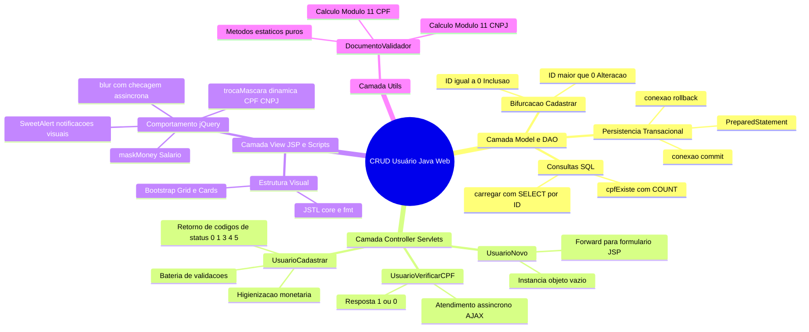

---

## Glossário

| Termo | Definição |
| :--- | :--- |
| **DAO (Data Access Object)** | Padrão arquitetural que encapsula todo o acesso e operações de persistência à base de dados. |
| **PreparedStatement** | Interface JDBC que representa uma instrução SQL pré-compilada, impedindo ataques de SQL Injection. |
| **Commit** | Comando transacional que confirma de forma definitiva todas as alterações realizadas no banco de dados. |
| **Rollback** | Operação que desfaz todas as alterações pendentes de uma transação em caso de erro, restaurando a consistência. |
| **Módulo 11** | Algoritmo matemático de cálculo ponderado utilizado para gerar e verificar dígitos verificadores de CPF e CNPJ. |
| **Método Estático** | Função vinculada diretamente à classe no Metaspace, sem necessidade de instanciação de objetos via operador `new`. |
| **Servlet** | Componente Java executado no servidor web corporativo responsável por processar e responder requisições HTTP. |
| **AJAX** | Conjunto de técnicas de desenvolvimento web que permite a comunicação assíncrona com o servidor sem recarregar a página. |
| **JSTL** | Coleção de bibliotecas de tags padronizadas que simplificam o desenvolvimento e lógica dentro de páginas JSP. |
| **SweetAlert** | Biblioteca de interface JavaScript para exibição de janelas de alerta modais interativas e customizadas. |

---

## Pontos-chave para a prova

1. **Bifurcação de Persistência:** O método `cadastrar` decide se executa `inserir` ou `alterar` unicamente verificando se o atributo `id` da entidade é igual a `0`.
2. **Ciclo Transacional JDBC:** Quando o `autoCommit` está desligado, a gravação só se torna permanente após o comando explícito `conexao.commit()`. Toda exceção capturada no bloco `catch` deve acionar obrigatoriamente `conexao.rollback()`.
3. **Conversão de Datas:** O driver JDBC requer o tipo `java.sql.Date`. Para converter uma data originada de `java.util.Date`, utiliza-se: `new java.sql.Date(utilDate.getTime())`.
4. **Métodos Estáticos vs Instância:** Métodos declarados com o modificador `static` não têm acesso ao ponteiro `this` e não podem referenciar atributos de instância diretamente.
5. **Comunicação Cliente-Servidor com Códigos de Status:** O servlet `UsuarioCadastrar` devolve códigos numéricos simplificados (`1` sucesso, `3` CPF inválido, `4` CPF duplicado, `5` campos vazios, `0` erro no banco), que são interceptados pelo retorno assíncrono do AJAX.
6. **Mapeamento Declarativo:** A anotação `@WebServlet` substitui as configurações verbosas de mapeamento de servlets no arquivo `web.xml`.
7. **Diferença entre Forward e Redirect:** O método `RequestDispatcher.forward()` preserva os dados alocados no escopo do `request` e transfere o fluxo internamente no servidor; já o `response.sendRedirect()` orienta o navegador a emitir uma nova requisição `GET`.

---

## Perguntas e respostas (JSONL)

```jsonl
{"pergunta": "Qual a finalidade de verificar se o ID do usuário é igual a 0 no método cadastrar da DAO?", "resposta": "Identificar se a entidade é nova (novo registro no banco que deve acionar o comando INSERT via método inserir) ou se já possui chave primária gerada (registro existente que deve acionar o comando UPDATE via método alterar).", "dificuldade": "facil"}
{"pergunta": "Por que o método inserir deve chamar conexao.rollback() dentro do bloco catch?", "resposta": "Para desfazer quaisquer alterações realizadas durante a transação atual no banco de dados caso ocorra uma exceção, garantindo a atomicidade e a consistência da base.", "dificuldade": "medio"}
{"pergunta": "Como é feita a conversão correta de java.util.Date para java.sql.Date ao associar um parâmetro no PreparedStatement?", "resposta": "Instanciando a classe SQL a partir dos milissegundos da data utilitária: new java.sql.Date(oUsuario.getDataNascimento().getTime()).", "dificuldade": "medio"}
{"pergunta": "Qual a principal vantagem de usar PreparedStatement em vez de concatenar valores diretamente na instrução SQL?", "resposta": "Prevenir ataques de injeção de SQL (SQL Injection) e otimizar a performance por meio da pré-compilação da instrução no servidor de banco de dados.", "dificuldade": "facil"}
{"pergunta": "Por que a consulta de existência de CPF na DAO utiliza COUNT(*) em vez de trazer todos os dados do usuário?", "resposta": "Porque a contagem COUNT(*) é otimizada pelo SGBD, consome menos recursos de rede e memória, retornando apenas o número inteiro de ocorrências.", "dificuldade": "medio"}
{"pergunta": "Por que os métodos da classe DocumentoValidador são definidos como estáticos (static)?", "resposta": "Porque realizam cálculos puramente utilitários e matemáticos sem depender de estado interno ou variáveis de instância, permitindo sua chamada direta sem necessidade do operador new.", "dificuldade": "facil"}
{"pergunta": "O que ocorre se um método estático tentar acessar diretamente um atributo de instância sem instanciar um objeto?", "resposta": "Ocorre um erro de compilação, pois atributos de instância exigem um objeto concreto associado (referência this), inexistente no contexto estático.", "dificuldade": "facil"}
{"pergunta": "Qual a função do servlet UsuarioNovo no fluxo de cadastro?", "resposta": "Instanciar um objeto Usuario vazio (com id igual a 0), colocá-lo como atributo no escopo da requisição e despachá-la (forward) para o formulário usuarioCadastrar.jsp.", "dificuldade": "medio"}
{"pergunta": "Qual a diferença entre os métodos forward de RequestDispatcher e sendRedirect de HttpServletResponse?", "resposta": "O forward transfere o processamento internamente no servidor mantendo os dados da requisição atual; o sendRedirect instrui o cliente a fazer uma nova requisição HTTP independente.", "dificuldade": "medio"}
{"pergunta": "Para que serve a anotação @WebServlet nas classes controladoras?", "resposta": "Para declarar a classe como um Servlet HTTP e definir os padrões de URL de mapeamento diretamente no código-fonte, substituindo o mapeamento no web.xml.", "dificuldade": "facil"}
{"pergunta": "Como é feita a limpeza da formatação do campo salário antes de convertê-lo para double no servlet?", "resposta": "Removendo a sigla 'R$', os pontos separadores de milhar e substituindo a vírgula decimal por ponto: salarioStr.replace('R$', '').replace('.', '').replace(',', '.').trim().", "dificuldade": "medio"}
{"pergunta": "Qual o significado negocial do código de retorno numérico '4' emitido pelo servlet UsuarioCadastrar?", "resposta": "Indica que o CPF informado já se encontra cadastrado previamente na base de dados (colisão de unicidade).", "dificuldade": "facil"}
{"pergunta": "Por que o campo de ID no formulário JSP possui o atributo readonly='readonly'?", "resposta": "Porque o identificador do usuário é uma chave primária gerada e gerenciada unicamente pelo banco de dados, não devendo ser editada pelo operador.", "dificuldade": "facil"}
{"pergunta": "Qual a função do plugin jQuery MaskMoney na interface do usuário?", "resposta": "Formatar dinamicamente a digitação de valores monetários no padrão financeiro com prefixo de moeda, separadores de milhar e decimais.", "dificuldade": "facil"}
{"pergunta": "Como o evento blur do campo CPF auxilia na validação do formulário?", "resposta": "Ao perder o foco do campo, o sistema dispara a validação matemática local e uma consulta assíncrona AJAX ao servlet verificador de duplicidade antes do envio do formulário.", "dificuldade": "medio"}
{"pergunta": "Por que a biblioteca SweetAlert é preferível em relação ao alert nativo do JavaScript?", "resposta": "Porque oferece modais não bloqueantes, visualmente customizáveis, responsivos e integrados ao fluxo assíncrono de Promises.", "dificuldade": "facil"}
{"pergunta": "Qual a finalidade do bloco try-with-resources ao trabalhar com PreparedStatement e ResultSet?", "resposta": "Assegurar o fechamento determinístico e automático dos recursos JDBC ao término do bloco, evitando vazamento de cursores e conexões.", "dificuldade": "dificil"}
{"pergunta": "Por que a validação de formato de CPF no cliente com JavaScript não elimina a necessidade de validação no servidor com DocumentoValidador?", "resposta": "Porque as validações de cliente podem ser contornadas, desabilitadas ou manipuladas diretamente por requisições forjadas via HTTP.", "dificuldade": "medio"}
{"pergunta": "Como a tag JSTL fmt:formatNumber auxilia na renderização do campo de salário no JSP?", "resposta": "Formatando o valor numérico do salário no formato de moeda local (ex.: R$ 1.500,00) de forma automática e limpa na camada de visualização.", "dificuldade": "facil"}
{"pergunta": "O que deve ser feito caso o método carregar(int numero) não localize nenhum registro no banco de dados?", "resposta": "O método manterá a referência do objeto Usuario como null e retornará esse valor para que a camada controladora trate o cenário de registro inexistente.", "dificuldade": "medio"}
```

---

## Checklist de revisão

- [ ] Compreendi a lógica de decisão do método `cadastrar` na DAO que bifurca entre `inserir` (quando `id == 0`) e `alterar` (quando `id > 0`).
- [ ] Sei implementar o controle transacional explícito com `conexao.commit()` no fluxo normal e `conexao.rollback()` no tratamento de exceções.
- [ ] Entendi a necessidade de conversão entre `java.util.Date` e `java.sql.Date` utilizando `getTime()`.
- [ ] Sei criar consultas parametrizadas com `SELECT COUNT(*)` para verificação assíncrona de duplicidade na base.
- [ ] Dominei o algoritmo de Módulo 11 e a estrutura estática dos métodos da classe `DocumentoValidador`.
- [ ] Sei diferenciar o ciclo de vida e a visibilidade de métodos estáticos versus métodos de instância.
- [ ] Sou capaz de construir e mapear servlets com `@WebServlet` herdando de `HttpServlet`.
- [ ] Sei processar e higienizar valores monetários formatados no padrão brasileiro (`R$ 1.234,56`) para `double`.
- [ ] Consigo estruturar páginas JSP limpas integrando Expression Language, JSTL (`core` e `fmt`), Bootstrap e FontAwesome.
- [ ] Sei configurar máscaras monetárias com `maskMoney` e alternância dinâmica de máscara de documentos via jQuery.
- [ ] Sei vincular o evento `blur` a consultas assíncronas via `$.ajax` com tratamento de respostas pelo SweetAlert.
- [ ] Consigo implementar o método `carregar` na DAO utilizando `SELECT ... WHERE id = ?` com proteção contra injeção de SQL.
