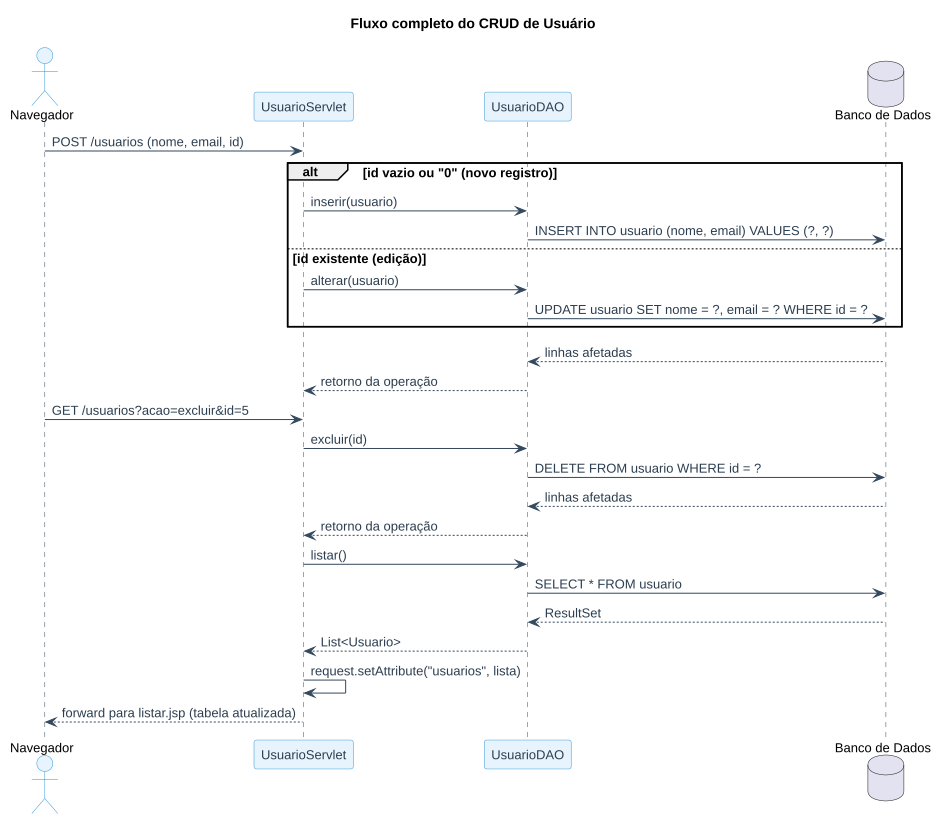

# Aula 06 — Implementando as Funções do CRUD

> **Data de Postagem:** 13/04/2026
> **Professor:** Jefferson Passerini
> **Disciplina:** Laboratório de Programação III (3º Semestre)
> **Tema:** Implementação completa das operações Incluir, Alterar e Excluir

## Objetivo da aula

Completar o CRUD (**C**reate, **R**ead, **U**pdate, **D**elete) iniciado na Aula 05, implementando em `UsuarioDAO` as operações de inclusão, alteração e exclusão, e o(s) Servlet(s) que capturam os parâmetros do formulário HTTP e acionam cada operação.

## `UsuarioDAO` completo

```java
package com.exemplo.dao;

import com.exemplo.model.Usuario;
import java.sql.*;
import java.util.ArrayList;
import java.util.List;

public class UsuarioDAO {

    // CREATE (Inserir)
    public void inserir(Usuario usuario) {
        String sql = "INSERT INTO usuario (nome, email) VALUES (?, ?)";
        try (Connection conn = Conexao.conectar();
             PreparedStatement stmt = conn.prepareStatement(sql)) {
            stmt.setString(1, usuario.getNome());
            stmt.setString(2, usuario.getEmail());
            stmt.executeUpdate();
        } catch (SQLException e) {
            e.printStackTrace();
        }
    }

    // READ (Listar todos) — implementado na Aula 05
    public List<Usuario> listar() {
        List<Usuario> usuarios = new ArrayList<>();
        String sql = "SELECT * FROM usuario";
        try (Connection conn = Conexao.conectar();
             Statement stmt = conn.createStatement();
             ResultSet rs = stmt.executeQuery(sql)) {
            while (rs.next()) {
                Usuario u = new Usuario();
                u.setId(rs.getInt("id"));
                u.setNome(rs.getString("nome"));
                u.setEmail(rs.getString("email"));
                usuarios.add(u);
            }
        } catch (SQLException e) {
            e.printStackTrace();
        }
        return usuarios;
    }

    // UPDATE (Alterar)
    public void alterar(Usuario usuario) {
        String sql = "UPDATE usuario SET nome = ?, email = ? WHERE id = ?";
        try (Connection conn = Conexao.conectar();
             PreparedStatement stmt = conn.prepareStatement(sql)) {
            stmt.setString(1, usuario.getNome());
            stmt.setString(2, usuario.getEmail());
            stmt.setInt(3, usuario.getId());
            stmt.executeUpdate();
        } catch (SQLException e) {
            e.printStackTrace();
        }
    }

    // DELETE (Excluir)
    public void excluir(int id) {
        String sql = "DELETE FROM usuario WHERE id = ?";
        try (Connection conn = Conexao.conectar();
             PreparedStatement stmt = conn.prepareStatement(sql)) {
            stmt.setInt(1, id);
            stmt.executeUpdate();
        } catch (SQLException e) {
            e.printStackTrace();
        }
    }
}
```

> **Nota de fonte:** os métodos `inserir`, `listar` e `excluir` acima reproduzem exatamente o código já consolidado em `Resumos-IA/README.md` (extraído do material de apoio da disciplina). O método `alterar` **não estava implementado em código** nesse material — apenas descrito em texto ("Recuperação do registro por ID, preenchimento de formulário e execução de comando `UPDATE`"). A implementação acima segue estritamente essa descrição e o mesmo padrão estrutural dos demais métodos do DAO (mesma assinatura de `PreparedStatement`, mesmo tratamento de exceção), sem introduzir nenhuma regra de negócio nova.

## `PreparedStatement`: por que não usar `Statement` simples

Em todas as operações de escrita (`inserir`, `alterar`, `excluir`), o SQL é parametrizado com `?` e os valores são vinculados via `setString`/`setInt`, nunca concatenados diretamente na string SQL. Isso evita **SQL Injection**: se o nome ou e-mail digitado pelo usuário contiver caracteres especiais de SQL, o `PreparedStatement` os trata como dado literal, não como parte do comando.

## Decidindo entre Incluir e Alterar a partir do formulário

Um único formulário HTML costuma atender tanto o cadastro quanto a edição. A diferenciação é feita por um campo oculto com o `id`:

```html
<input type="hidden" name="id" value="${usuario.id}">
```

- Se o campo `id` chega vazio, nulo ou igual a zero → é um registro novo → o Servlet chama `inserir(usuario)`.
- Se o campo `id` chega com um valor existente → é uma edição → o Servlet chama `alterar(usuario)`, filtrando pelo `id`.

## Fluxo completo do CRUD

O diagrama de sequência abaixo cobre as quatro operações, da requisição HTTP até a resposta renderizada:



## Exercícios de fixação

1. Implemente os métodos `alterar` e `excluir` em `UsuarioDAO`, seguindo o padrão de `inserir`.
2. Escreva o Servlet que recebe os parâmetros de um formulário (`request.getParameter(...)`) e decide entre `inserir` e `alterar` com base no campo `id`.
3. Explique, com um exemplo, por que `PreparedStatement` previne SQL Injection e `Statement` com concatenação de string não previne.
4. O que acontece se `excluir(id)` for chamado com um `id` que não existe no banco? A aplicação deveria tratar esse caso de alguma forma?

<details>
<summary>Gabarito (questões 2 e 4)</summary>

**Questão 2:**
```java
protected void doPost(HttpServletRequest request, HttpServletResponse response)
        throws ServletException, IOException {
    Usuario usuario = new Usuario();
    usuario.setNome(request.getParameter("nome"));
    usuario.setEmail(request.getParameter("email"));

    String idParam = request.getParameter("id");
    UsuarioDAO dao = new UsuarioDAO();

    if (idParam == null || idParam.isEmpty() || idParam.equals("0")) {
        dao.inserir(usuario);
    } else {
        usuario.setId(Integer.parseInt(idParam));
        dao.alterar(usuario);
    }
    response.sendRedirect("listar");
}
```

**Questão 4:** `DELETE FROM usuario WHERE id = ?` com um `id` inexistente simplesmente afeta zero linhas — o JDBC não lança exceção por isso, apenas `executeUpdate()` retorna `0` (quantidade de linhas afetadas). É boa prática capturar esse retorno e, se for `0`, informar ao usuário que o registro não foi encontrado, em vez de assumir silenciosamente que a exclusão ocorreu.

</details>

## Perguntas de revisão

- Como o Servlet decide entre chamar `inserir` ou `alterar`?
- Por que todos os métodos de escrita usam `PreparedStatement` em vez de `Statement`?
- O que o retorno de `executeUpdate()` representa e como ele pode ser usado?

## Material relacionado

- Links Úteis: [Java JSP - Cap 5.2 - Operação de Manutenção do Cadastro de Usuários | Notion](https://spiffy-number-b06.notion.site/Java-JSP-Cap-5-2-Opera-o-de-Manuten-o-do-Cadastro-de-Usu-rios-1ca393aeab2a80ad851eca2a345f481a)
- [Aula 05 — Listagem de Usuários](../Aula%2005%20-%20Listagem%20de%20Usu%C3%A1rios/detalhes.md) — base deste CRUD (`Usuario`, `listar()`, `Conexao`)
- [Trabalho — Cadastro de Livros (2 pontos)](../../Trabalhos/20260427%20-%20Trabalho%20de%20Programa%C3%A7%C3%A3o%20(2%20pontos)/detalhes.md) — aplica este mesmo padrão de CRUD à entidade `Livro`
- [Resumo executivo, simulado e cheatsheet da disciplina](../../README.md#resumo-executivo)
- Post original da aula: [`post-original.md`](./post-original.md)
